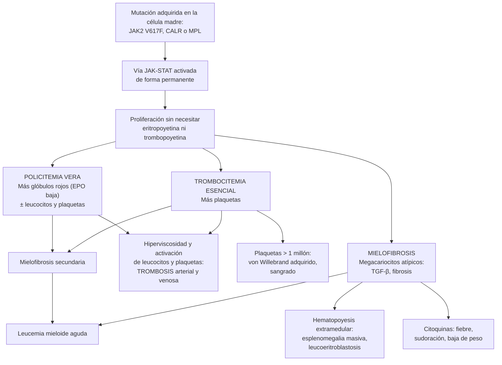

---
tags:
  - Hemato-oncología
---

# Neoplasias mieloproliferativas crónicas: policitemia vera, trombocitemia esencial y mielofibrosis

**Subespecialidad**
Hematología · Hemato-oncología · Medicina interna

**Guías principales**
ELN 2018: manejo de las neoplasias mieloproliferativas Filadelfia negativas · ELN 2021 (publicadas en 2022): citorreducción en la policitemia vera · ELN-EBMT 2024: trasplante en la mielofibrosis · OMS 2022 (5.ª edición) e ICC 2022: criterios diagnósticos

**Otras fuentes**
CYTO-PV (meta de hematocrito, 2013) · RESPONSE (ruxolitinib en la policitemia vera, 2015) · COMFORT-I (ruxolitinib en la mielofibrosis, 2012) · Actualizaciones de la Clínica Mayo (Tefferi y Barbui 2023–2024) · DIPSS · Mineros chilenos en altura (Richalet 2002) · Serie chilena de NMP (Corsini 2023) · Figura: Nann y Fend 2021 (CC BY 4.0)

**GES**
No (la leucemia mieloide crónica, que también es mieloproliferativa pero *BCR::ABL1* positiva, está en el GES 45).

**EUNACOM**
1.08.1.018 Síndromes mieloproliferativos crónicos (sospecha, inicial, derivar)

**Revisado**
Octubre 2026

!!! abstract "Resumen en 60 segundos"
    - **Neoplasias mieloproliferativas (NMP)**: neoplasias **clonales** de la célula madre mieloide con **sobreproducción** de células **maduras**.
        - **Filadelfia positiva**: **leucemia mieloide crónica** (ver [leucemias](leucemias-agudas-y-cronicas.md)).
        - **Filadelfia negativas** ("clásicas"): **policitemia vera (PV)**, **trombocitemia esencial (TE)** y **mielofibrosis primaria (MFP)**.
    - **Mutaciones conductoras**: ***JAK2* V617F** (~ 95 % de las PV; ~ 55–60 % de las TE y MFP), ***CALR*** y ***MPL***. Todas activan la vía **JAK-STAT**.
    - **Sospechar**:
        - **PV**: **Hb o hematocrito altos** + **prurito acuagénico**, **eritromelalgia**, esplenomegalia o una **trombosis** (sobre todo **esplácnica**: Budd-Chiari, porta).
        - **TE**: **plaquetas > 450 000/µL persistentes** sin causa reactiva.
        - **MFP**: **esplenomegalia masiva**, anemia, **leucoeritroblastosis** y dacriocitos, síntomas constitucionales.
    - **Descartar primero las causas secundarias**: **eritrocitosis secundaria** (tabaco, EPOC, apnea del sueño, altura, tumores con eritropoyetina) y **trombocitosis reactiva** (déficit de hierro, inflamación, cáncer, esplenectomía), que son **mucho más frecuentes**.
    - **Estudio**: **eritropoyetina sérica** (baja en la PV), ***JAK2* V617F**, *CALR*, *MPL*, ***BCR::ABL1*** (excluir la LMC) y **biopsia de médula**.
    - **Tratamiento**: el objetivo principal es **prevenir las trombosis**.
        - **PV**: **flebotomías** con meta de **hematocrito < 45 %** + **aspirina en dosis baja**; **citorreducción** (hidroxiurea o **interferón pegilado**) si es de **alto riesgo** (≥ 60 años o trombosis previa).
        - **TE**: aspirina según el riesgo; hidroxiurea en el alto riesgo.
        - **MFP**: **ruxolitinib** para el bazo y los síntomas; **trasplante alogénico** (la única opción curativa) en los de alto riesgo aptos.

## Definición

- **Neoplasias mieloproliferativas**: neoplasias **clonales** de la célula madre hematopoyética con **proliferación** de una o más líneas mieloides que **maduran** (a diferencia de las leucemias agudas).
- **Criterios diagnósticos** (OMS 2022; casi iguales en la ICC 2022):

| | Policitemia vera | Trombocitemia esencial | Mielofibrosis primaria (manifiesta) |
|---|---|---|---|
| **Criterio hematológico** | **Hb > 16,5 g/dL** (hombres) o **> 16 g/dL** (mujeres), o **hematocrito > 49 %** o **> 48 %** | **Plaquetas ≥ 450 000/µL** | Fibrosis de reticulina o colágeno **grado 2–3** en la biopsia |
| **Médula ósea** | Hipercelular con proliferación de las **3 líneas** (panmielosis) y megacariocitos pleomórficos | Proliferación de **megacariocitos grandes** con núcleos **hiperlobulados**; celularidad normal | Megacariocitos **atípicos** en grupos + fibrosis |
| **Genética** | ***JAK2* V617F** o exón 12 | *JAK2*, *CALR* o *MPL* (o otro marcador clonal, o ausencia de causa reactiva) | *JAK2*, *CALR* o *MPL* (o otro marcador clonal) |
| **Menor / exclusión** | **Eritropoyetina sérica baja** | No cumplir criterios de LMC, PV, MFP ni SMD | Menores: **anemia**, leucocitos ≥ 11 000/µL, **esplenomegalia** palpable, **LDH alta**, **leucoeritroblastosis** |

- **Mielofibrosis prefibrótica**: fase temprana de la MFP con plaquetas altas y poca fibrosis; se confunde con la TE (requiere biopsia experta).
- **Mielofibrosis secundaria**: evolución de una PV o una TE (**mielofibrosis post-PV o post-TE**).
- **Eritrocitosis secundaria**: aumento de la masa eritrocitaria por **más eritropoyetina** (hipoxia, tumores, fármacos).
- **Eritrocitosis relativa** (síndrome de Gaisböck): hematocrito alto por **menos plasma** (deshidratación, diuréticos), sin aumento real de los glóbulos rojos.
- **Trombocitosis reactiva**: aumento de las plaquetas secundario a otra enfermedad (la causa de **~ 80–90 %** de las trombocitosis).

## Epidemiología

### Mundial

- Son **raras**: cada una tiene una incidencia de **~ 1–3 casos por 100 000** habitantes al año.
- **Edad**: mediana de ~ **60 años** en la PV y la TE, algo más en la MFP. La TE es más frecuente en **mujeres** y puede aparecer en **adultas jóvenes** (relevante para el embarazo).
- **Frecuencia de las mutaciones**:

| Mutación | PV | TE | MFP |
|---|---|---|---|
| ***JAK2* V617F** | **~ 95 %** | ~ 55–60 % | ~ 60 % |
| ***JAK2* exón 12** | ~ 3 % | — | — |
| ***CALR*** | — | ~ 20–25 % | ~ 25 % |
| ***MPL*** | — | ~ 3–5 % | ~ 5–7 % |
| **"Triple negativa"** | — | ~ 10–15 % | ~ 5–10 % |

- **Pronóstico global**: la PV y la TE tienen una sobrevida larga (la TE, cercana a la de la población general); la MFP, bastante más corta.

### Chile

!!! chile "Datos nacionales"
    - Las NMP Filadelfia negativas **no son GES**; la **LMC** sí lo es (GES 45).
    - **Serie de un centro de Santiago** (2015–2020; Corsini 2023): **144 pacientes** con NMP Filadelfia negativas. El **4 %** tenía además una **gammapatía monoclonal**, cifra similar a la esperada para la edad (mediana de **71 años**).
    - **Eritrocitosis por altura en la minería**: los **mineros del norte de Chile** que trabajan por turnos entre el nivel del mar y **3800–4600 m** (hipoxia intermitente crónica) **suben el hematocrito**, aunque menos que los residentes permanentes en altura (Richalet 2002). Es una causa de **eritrocitosis secundaria** que hay que preguntar.
    - El **tabaquismo** (monóxido de carbono), la **EPOC** y la **apnea obstructiva del sueño** son frecuentes en Chile y son las causas más comunes de eritrocitosis secundaria (ver [EPOC](../respiratorio/epoc.md) y [apnea del sueño](../respiratorio/apnea-del-sueno-y-trastornos-del-sueno.md)).

## Etiología y factores de riesgo

- **Mutaciones somáticas adquiridas** en la célula madre (no hereditarias), sin causa conocida en la mayoría.
- **Edad**: aumentan con la edad (la mutación *JAK2* V617F aparece también en la hematopoyesis clonal de los adultos mayores).
- **Predisposición familiar**: los familiares de primer grado tienen más riesgo (haplotipo *JAK2* 46/1).
- Radiación ionizante y benceno (asociación débil).
- **Factores de riesgo de trombosis** en las NMP: **edad ≥ 60 años**, **trombosis previa**, mutación ***JAK2***, **factores de riesgo cardiovascular** (hipertensión, diabetes, tabaco) y **leucocitosis**.

## Fisiopatología

- Las mutaciones de ***JAK2***, ***CALR*** y ***MPL*** activan de forma **permanente** la vía **JAK-STAT**, que transmite la señal de la **eritropoyetina** (EPO), la **trombopoyetina** y el G-CSF.
- Las células progenitoras proliferan **sin necesitar** (o con muy poca) eritropoyetina o trombopoyetina:
    - **PV**: exceso de **glóbulos rojos** (con **eritropoyetina baja** por retroalimentación) y a menudo de leucocitos y plaquetas. La **hiperviscosidad** y la activación de los leucocitos y las plaquetas producen **trombosis**.
    - **TE**: exceso de **plaquetas**, que son funcionalmente anormales.
        - Con plaquetas **> 1 000 000/µL**, el **factor de von Willebrand** se adsorbe a las plaquetas: **enfermedad de von Willebrand adquirida** y **sangrado** (paradoja).
    - **MFP**: los **megacariocitos** atípicos liberan citoquinas (**TGF-β**, PDGF) que estimulan a los fibroblastos: **fibrosis** de la médula.
        - La hematopoyesis se traslada al **bazo y el hígado** (**hematopoyesis extramedular**): **esplenomegalia masiva**.
        - Salen a la sangre precursores mieloides y eritroblastos (**leucoeritroblastosis**) y glóbulos rojos en **lágrima**.
        - La **inflamación** crónica produce **síntomas constitucionales** y **caquexia**.
- **Progresión**: PV y TE → **mielofibrosis secundaria**; todas → **leucemia mieloide aguda** (fase blástica), sobre todo la MFP.

*Figura 1. Fisiopatología de las neoplasias mieloproliferativas Filadelfia negativas. Esquema propio basado en ELN 2018 y OMS 2022.*

## Clasificación

### Neoplasias mieloproliferativas (OMS 2022)

| Tipo | Clave |
|---|---|
| **Leucemia mieloide crónica** | ***BCR::ABL1*** (cromosoma Filadelfia) |
| **Policitemia vera** | Eritrocitosis + *JAK2* |
| **Trombocitemia esencial** | Trombocitosis + *JAK2*, *CALR* o *MPL* |
| **Mielofibrosis primaria** (prefibrótica y manifiesta) | Fibrosis + megacariocitos atípicos |
| Leucemia neutrofílica crónica | Neutrofilia + *CSF3R* |
| Leucemia eosinofílica crónica | Eosinofilia clonal |
| NMP no clasificable | — |

- **Superposición SMD/NMP**: leucemia mielomonocítica crónica (**monocitosis** persistente > 1000/µL), entre otras.

### Riesgo de trombosis

| Enfermedad | Riesgo bajo | Riesgo alto |
|---|---|---|
| **Policitemia vera** (ELN 2018) | **< 60 años y sin trombosis** previa | **≥ 60 años** o **trombosis** previa |
| **Trombocitemia esencial** (IPSET-trombosis revisado) | **Muy bajo**: ≤ 60 años, sin trombosis, sin *JAK2*. **Bajo**: ≤ 60 años, sin trombosis, con *JAK2* | **Intermedio**: > 60 años, sin trombosis, sin *JAK2*. **Alto**: **trombosis previa** o > 60 años con *JAK2* |

### Pronóstico de la mielofibrosis: DIPSS

- Factores (1 punto cada uno, salvo la anemia, que suma 2): **edad > 65 años**, **Hb < 10 g/dL**, **leucocitos > 25 000/µL**, **blastos circulantes ≥ 1 %** y **síntomas constitucionales**.
- **Bajo** (0), **intermedio-1** (1–2), **intermedio-2** (3–4) y **alto** (5–6). Los de intermedio-2 y alto son candidatos a **trasplante** si son aptos.
- Otros puntajes (MIPSS70, GIPSS) agregan las mutaciones y la citogenética.

## Clínica

| | Policitemia vera | Trombocitemia esencial | Mielofibrosis primaria |
|---|---|---|---|
| **Forma de presentación** | Hemograma alterado o **trombosis** | Hemograma alterado (a menudo **asintomática**) | **Esplenomegalia**, **anemia**, síntomas |
| **Síntomas típicos** | **Prurito acuagénico** (tras la ducha), **eritromelalgia** (ardor y enrojecimiento de manos y pies), cefalea, mareo, alteraciones visuales, **plétora** facial | Síntomas **vasomotores** (cefalea, eritromelalgia, alteraciones visuales transitorias), abortos recurrentes | **Cansancio**, **saciedad precoz**, dolor en el hipocondrio izquierdo, **fiebre, sudoración nocturna, baja de peso**, dolor óseo |
| **Examen** | **Plétora**, esplenomegalia (~ 1/3) | Esplenomegalia leve (minoría) | **Esplenomegalia masiva**, hepatomegalia |
| **Trombosis** | **Arteriales** (IAM, ACV) y **venosas**, incluidas las **esplácnicas** (Budd-Chiari, porta, mesentérica) | Arteriales y venosas; **sangrado** si las plaquetas son > 1 000 000/µL | Menos frecuentes |
| **Otros** | **Gota** (hiperuricemia), úlcera péptica | — | Hipertensión portal, **hematopoyesis extramedular** (columna, pleura), caquexia |

- **Trombosis esplácnica** (Budd-Chiari, trombosis de la porta) **sin causa**: buscar ***JAK2* V617F** aunque el hemograma sea normal (la NMP puede estar "enmascarada" por el hiperesplenismo y la hemodilución).

!!! alarma "Signos de alarma: derivar de inmediato"
    - **Trombosis** arterial o venosa (sobre todo en sitios inusuales) en un paciente con eritrocitosis o trombocitosis.
    - **Hematocrito muy alto** (> 55–60 %) con **síntomas de hiperviscosidad** (cefalea, confusión, alteraciones visuales, isquemia).
    - **Sangrado** con plaquetas **> 1 000 000/µL** (von Willebrand adquirido).
    - **Dolor abdominal con ascitis y hepatomegalia** (Budd-Chiari) o dolor en el hipocondrio izquierdo (**infarto esplénico**).
    - **Blastos** en la sangre o caída rápida de las cifras (progresión a leucemia aguda).

## Diagnóstico

- **Paso 1: confirmar y descartar las causas secundarias** (figura 2):
    - Repetir el hemograma; descartar la **hemoconcentración** (deshidratación, diuréticos).
    - **Eritrocitosis**: tabaco, oximetría (de reposo y nocturna), **altura** y trabajo en minería, EPOC, apnea del sueño, cardiopatías cianóticas, **testosterona**, **iSGLT2**, trasplante renal, tumores (riñón, hígado, útero, cerebelo).
    - **Trombocitosis**: **ferritina** (el **déficit de hierro** es una causa frecuente), PCR o VHS, búsqueda de cáncer, esplenectomía, infecciones e inflamación.
- **Paso 2: pruebas específicas**:
    - **Eritropoyetina sérica**: **baja** en la PV; **normal o alta** en la eritrocitosis secundaria.
    - ***JAK2* V617F** en sangre; si es negativa y se sospecha una PV: ***JAK2* exón 12**. En la TE y la MFP: ***CALR*** y ***MPL***.
    - ***BCR::ABL1*** (PCR o FISH) para excluir la **LMC** en toda trombocitosis o leucocitosis mieloide sin causa.
    - **Biopsia de médula ósea**: necesaria para la TE, la MFP y para distinguir la TE de la mielofibrosis **prefibrótica**; con **tinción de reticulina** (figura 3).
- **Eritrocitosis secundaria**: según la sospecha, gases arteriales, **carboxihemoglobina**, polisomnografía, ecocardiograma, ecografía o TC de abdomen (riñón, hígado).

!!! guia "Puntos clave del diagnóstico (OMS 2022; ELN 2018)"
    - **PV**: Hb > 16,5 g/dL (hombres) o > 16 g/dL (mujeres) [o hematocrito > 49 % o > 48 %] + médula con panmielosis + ***JAK2*** (V617F o exón 12). La **eritropoyetina baja** es el criterio menor. La biopsia puede omitirse si la eritrocitosis es marcada (Hb > 18,5 g/dL en hombres o > 16,5 g/dL en mujeres) con *JAK2* y EPO baja.
    - **TE**: plaquetas ≥ 450 000/µL + megacariocitos grandes e hiperlobulados + *JAK2*, *CALR* o *MPL* (o ausencia de causa reactiva), **excluyendo** la LMC, la PV, la MFP y el SMD.
    - **MFP**: fibrosis con megacariocitos atípicos + mutación conductora (o marcador clonal) + criterios menores (anemia, leucocitosis, esplenomegalia, LDH alta, leucoeritroblastosis).

<figure markdown>
![Esquema de dos columnas. A la izquierda, eritrocitosis: hemoglobina sobre 16,5 g/dL en hombres o 16 g/dL en mujeres, o hematocrito sobre 49 o 48 por ciento; se repite, se descarta la hemoconcentración y se piden eritropoyetina sérica y JAK2 V617F. Si la eritropoyetina es baja y JAK2 positiva, o exón 12 si V617F es negativa, es una policitemia vera, con prurito acuagénico, eritromelalgia, trombosis, esplenomegalia y a menudo leucocitos y plaquetas también altos. Si la eritropoyetina es normal o alta, es una eritrocitosis secundaria por hipoxia (EPOC, apnea del sueño, altura en mineros, cardiopatía), tabaco por el monóxido de carbono, testosterona, tumores con eritropoyetina de riñón o hígado, trasplante renal o iSGLT2, y se trata la causa. A la derecha, trombocitosis con plaquetas sobre 450 000 persistentes: se busca una causa reactiva, la más frecuente, cerca de 80 a 90 por ciento, con ferritina, PCR y frotis. Si es reactiva (déficit de hierro, hemorragia, infección, inflamación, cáncer, posoperatorio, esplenectomía o asplenia, recuperación de una trombocitopenia) se trata la causa. Si no tiene causa y persiste, se piden JAK2, CALR, MPL y BCR::ABL1: trombocitemia esencial o mielofibrosis prefibrótica, descartando LMC y SMD con deleción 5q; produce trombosis y, con plaquetas sobre un millón, sangrado. Abajo, mielofibrosis primaria o secundaria a policitemia vera o trombocitemia esencial: esplenomegalia masiva, anemia, leucoeritroblastosis y dacriocitos, síntomas constitucionales y aspirado seco; biopsia de médula con fibrosis de reticulina, JAK2, CALR o MPL, pronóstico con DIPSS, y ruxolitinib o trasplante alogénico](../assets/figuras/mieloproliferativas/eritrocitosis-y-trombocitosis.svg){ loading=lazy }
<figcaption>Figura 2. Enfoque de la eritrocitosis y la trombocitosis: causas reactivas o secundarias frente a neoplasias mieloproliferativas. Esquema propio basado en OMS 2022, ELN 2018 y las actualizaciones de la Clínica Mayo.</figcaption>
</figure>

## Laboratorio

| Examen | Policitemia vera | Trombocitemia esencial | Mielofibrosis primaria |
|---|---|---|---|
| **Hemograma** | Hb y hematocrito **altos**; a menudo **leucocitosis** y **trombocitosis** | **Plaquetas ≥ 450 000/µL** (a veces > 1 millón) | **Anemia**; leucocitos y plaquetas altos al inicio, **bajos** después |
| **Frotis** | Normal | Plaquetas grandes y agregadas | **Dacriocitos**, **leucoeritroblastosis**, plaquetas gigantes |
| **Eritropoyetina** | **Baja** | Normal | Variable |
| **Mutaciones** | *JAK2* V617F (~ 95 %) o exón 12 | *JAK2*, *CALR*, *MPL* | *JAK2*, *CALR*, *MPL* |
| **Ferritina** | A menudo **baja** (la eritropoyesis consume el hierro; flebotomías) | Normal | Variable (alta con transfusiones) |
| **LDH, ácido úrico** | Ácido úrico alto | Normales | **LDH alta**, ácido úrico alto |
| **Factor de von Willebrand** (actividad) | — | Medir si las plaquetas son **> 1 000 000/µL** o hay sangrado | — |
| **Biopsia de médula** | Hipercelular, panmielosis | Megacariocitos grandes hiperlobulados | Megacariocitos atípicos, **fibrosis** (aspirado "seco") |

- **Pseudohiperkalemia** con plaquetas o leucocitos muy altos: el potasio se libera en el tubo. Confirmar con potasio en plasma o en sangre total.

<figure markdown>
![Matriz de dieciséis microfotografías de biopsias de médula ósea, en cuatro columnas: policitemia vera, mielofibrosis primaria prefibrótica, mielofibrosis primaria manifiesta y trombocitemia esencial. En la policitemia vera, la médula es hipercelular, con megacariocitos aumentados y variables, eritropoyesis aumentada marcada con CD71 y granulopoyesis reducida. En la mielofibrosis prefibrótica, la médula es hipercelular, con megacariocitos en grupos densos, de núcleos grandes, atípicos y nubosos, y granulopoyesis aumentada. En la mielofibrosis manifiesta, hay hematopoyesis en sinusoides abiertos y, en la fase tardía, menor celularidad con megacariocitos irregulares dispuestos en corriente y aumento de las fibras de reticulina en la tinción de plata. En la trombocitemia esencial, la médula es normocelular, con megacariocitos grandes de núcleos hipersegmentados, marcados con CD61](../assets/figuras/mieloproliferativas/medula-neoplasias-mieloproliferativas-nann-2021.jpg){ loading=lazy }
<figcaption>Figura 3. Biopsia de médula ósea en las neoplasias mieloproliferativas: (a–d) policitemia vera, hipercelular con panmielosis; (e–h) mielofibrosis prefibrótica, con megacariocitos atípicos en grupos; (i–l) mielofibrosis manifiesta, con fibrosis de reticulina (l, tinción de plata); (m–p) trombocitemia esencial, normocelular con megacariocitos grandes e hiperlobulados. Fuente: Nann D, Fend F. Synoptic diagnostics of myeloproliferative neoplasms: morphology and molecular genetics. <em>Cancers (Basel).</em> 2021;13(14):3528, figura 1. Licencia <a href="https://creativecommons.org/licenses/by/4.0/">CC BY 4.0</a>.</figcaption>
</figure>

## Imágenes

- **Ecografía abdominal**: tamaño del **bazo** y del hígado; signos de hipertensión portal.
- **Ecografía Doppler** del abdomen o **angio-TC** si hay dolor abdominal o ascitis: trombosis de las venas **suprahepáticas** (Budd-Chiari), **porta** o **mesentéricas**; **infarto esplénico**.
- **Eritrocitosis secundaria**: radiografía o TC de tórax (EPOC), ecocardiograma (cortocircuitos, hipertensión pulmonar), ecografía o TC de abdomen (tumores renales y hepáticos), RM de cerebro si hay síntomas cerebelosos (hemangioblastoma).
- **RM de columna** o TC si se sospecha una hematopoyesis extramedular compresiva (MFP).

## Diagnóstico diferencial

| Hallazgo | Diferencial |
|---|---|
| **Eritrocitosis** | **Secundaria**: hipoxia (**EPOC**, **apnea del sueño**, **altura**, cardiopatía con cortocircuito, obesidad-hipoventilación), **tabaco** (carboxihemoglobina), **testosterona** o anabólicos, **iSGLT2**, eritrocitosis postrasplante renal, tumores productores de eritropoyetina (**carcinoma renal**, hepatocarcinoma, mioma uterino, hemangioblastoma cerebeloso, feocromocitoma), quistes renales. **Relativa**: deshidratación, diuréticos. Congénitas (raras) |
| **Trombocitosis** | **Reactiva**: **déficit de hierro**, hemorragia aguda, **infecciones**, **enfermedades inflamatorias** (artritis reumatoide, EII), **cáncer**, posoperatorio, **esplenectomía**, recuperación tras alcohol o quimioterapia. **Clonal**: TE, PV, MFP prefibrótica, **LMC**, **SMD con del(5q)**, anemia refractaria con sideroblastos en anillo y trombocitosis |
| **Esplenomegalia masiva** | MFP, **LMC**, linfomas, tricoleucemia, malaria, leishmaniasis visceral, talasemia mayor |
| **Leucoeritroblastosis** | MFP, **metástasis en la médula**, infiltración por linfoma o mieloma, tuberculosis, sepsis grave (ver [leucemias](leucemias-agudas-y-cronicas.md)) |
| **Fibrosis de la médula** | MFP, fibrosis secundaria (post-PV o post-TE), SMD con fibrosis, metástasis, linfomas, tuberculosis, hiperparatiroidismo |

## Tratamiento

### Lo que hace el interno

- **Detectar** la eritrocitosis o la trombocitosis y **descartar las causas secundarias** (ferritina, oximetría, tabaco, fármacos).
- Pedir **JAK2 V617F** y **eritropoyetina** si la eritrocitosis no se explica, y **derivar** a hematología.
- **Controlar los factores de riesgo cardiovascular** (hipertensión, diabetes, dislipidemia) y **suspender el tabaco**.
- **Trombosis**: tratar como cualquier trombosis (anticoagulación) y derivar.
- **No dar** suplementos de **hierro** a un paciente con PV en flebotomías (aunque tenga ferritina baja): estimulan la eritropoyesis.

### Policitemia vera (ELN 2018 y 2021)

| Medida | Indicación y meta |
|---|---|
| **Flebotomías** | **Todos**. Meta de **hematocrito < 45 %**. En CYTO-PV, el grupo con hematocrito < 45 % tuvo menos muerte cardiovascular y trombosis mayor (**2,7 % frente a 9,8 %**) que el grupo con 45–50 % |
| **Aspirina en dosis baja** | **Todos** (salvo contraindicación o von Willebrand adquirido) |
| **Citorreducción** | **Alto riesgo** (≥ 60 años o trombosis previa). También en el bajo riesgo si hay mala tolerancia a las flebotomías, **esplenomegalia sintomática o progresiva**, **leucocitosis persistente** (> 20 000/µL), trombocitosis > 1 500 000/µL o **síntomas** importantes |
| **Fármacos citorreductores** | **Hidroxiurea** o **interferón pegilado** (**ropeginterferón alfa-2b**; de elección en los **jóvenes** y en el **embarazo**). **Ruxolitinib** si hay intolerancia o resistencia a la hidroxiurea (RESPONSE) |
| **Prurito** | Antihistamínicos, ISRS (paroxetina), fototerapia; **ruxolitinib** o interferón si es refractario |

### Trombocitemia esencial

| Riesgo | Tratamiento |
|---|---|
| **Muy bajo** | **Observación** (aspirina solo si hay factores de riesgo cardiovascular o síntomas vasomotores) |
| **Bajo** (*JAK2*+, ≤ 60 años) | **Aspirina en dosis baja** |
| **Intermedio** (> 60 años, sin *JAK2*) | **Aspirina**; considerar citorreducción |
| **Alto** (trombosis previa o > 60 años con *JAK2*) | **Hidroxiurea + aspirina** (anticoagulación si tuvo una trombosis venosa). Alternativas: interferón pegilado, **anagrelida** |

- **Plaquetas > 1 000 000/µL**: medir la **actividad del factor de von Willebrand**; si es **< 30 %**, **no dar aspirina** (riesgo de sangrado) y considerar citorreducción.
- **Embarazo**: aspirina en dosis baja; **interferón** si se necesita citorreducción (la hidroxiurea y la anagrelida están contraindicadas); tromboprofilaxis posparto según el riesgo.

### Mielofibrosis

- **Riesgo bajo o intermedio-1 asintomático**: observación.
- **Esplenomegalia sintomática o síntomas constitucionales**: **inhibidores de JAK**:
    - **ruxolitinib** (COMFORT-I: reducción del bazo y de los síntomas; mejora la sobrevida);
    - **fedratinib** o **pacritinib** (si las plaquetas son bajas);
    - **momelotinib** (mejora además la **anemia**).
- **Anemia**: transfusiones, **agentes estimulantes de la eritropoyesis** (si la eritropoyetina es baja), danazol, luspatercept, momelotinib.
- **Trasplante alogénico**: la **única opción curativa**; en los pacientes **aptos** con riesgo **intermedio-2 o alto** (ELN-EBMT 2024).
- **Otras**: radioterapia o esplenectomía en casos seleccionados; hidroxiurea para la leucocitosis o la trombocitosis.

!!! dosis "Dosis de referencia (adulto; las indica el hematólogo)"
    - **Flebotomía**: **450 mL** cada **2–4 días** al inicio hasta lograr un hematocrito < 45 %, y luego según la necesidad. En los adultos mayores o con enfermedad cardiovascular: **250–300 mL** con reposición de volumen.
    - **Aspirina**: **81–100 mg/día VO** (en algunos pacientes con *JAK2* y factores de riesgo, cada 12 horas).
    - **Hidroxiurea**: inicio con **15–20 mg/kg/día VO** (en general **500–1000 mg/día**), ajustada según el hemograma (metas: hematocrito < 45 %, plaquetas < 400 000–450 000/µL y leucocitos < 10 000/µL, sin citopenias).
    - **Ropeginterferón alfa-2b**: **100–250 µg SC cada 2 semanas**, con aumento progresivo hasta **500 µg** según la respuesta.
    - **Anagrelida**: **0,5 mg cada 12 horas VO**, ajustando según las plaquetas (vigilar palpitaciones, cefalea y retención de líquidos).
    - **Ruxolitinib**: **10 mg cada 12 horas** en la PV; en la mielofibrosis, **5–20 mg cada 12 horas** según el recuento de plaquetas.
    - **Alopurinol**: **300 mg/día VO** si hay hiperuricemia o gota.

## Complicaciones

| Complicación | Claves |
|---|---|
| **Trombosis arterial** | IAM, ACV, isquemia de las extremidades; principal causa de morbimortalidad en la PV y la TE |
| **Trombosis venosa** | TVP, TEP y **trombosis esplácnicas** (Budd-Chiari, porta, mesentérica) y de los senos venosos cerebrales |
| **Sangrado** | Von Willebrand adquirido (plaquetas > 1 millón), aspirina, varices por hipertensión portal |
| **Mielofibrosis secundaria** | Evolución de la PV y la TE (más en la PV) |
| **Leucemia mieloide aguda** | Más en la MFP; en la PV y la TE es baja, pero aumenta con el tiempo y algunos fármacos |
| **Complicaciones del bazo** | Saciedad precoz, **infarto esplénico**, hipertensión portal |
| **Gota** y litiasis por ácido úrico | Recambio celular alto |
| **Embarazo** (TE, PV) | **Abortos**, preeclampsia, restricción del crecimiento fetal |
| **Efectos de los fármacos** | Hidroxiurea: citopenias, **úlceras en las piernas**, cánceres de piel no melanoma, úlceras orales. Interferón: síntomas gripales, depresión, tiroiditis. Ruxolitinib: anemia, trombocitopenia, **infecciones** (herpes zóster, tuberculosis), cáncer de piel |

## Pronóstico y seguimiento

- **Trombocitemia esencial**: sobrevida **cercana a la de la población general**; bajo riesgo de transformación.
- **Policitemia vera**: sobrevida larga (mediana > 10–15 años); la principal amenaza son las **trombosis**, que se reducen con el **hematocrito < 45 %** y la **aspirina**.
- **Mielofibrosis primaria**: la de **peor pronóstico**; depende del **DIPSS** (o MIPSS70) y de las mutaciones. Causas de muerte: progresión a leucemia, infecciones, trombosis, hipertensión portal, caquexia.
- **Seguimiento**:
    - Hemograma cada **1–3 meses** (más seguido al ajustar los fármacos o las flebotomías).
    - Vigilar el **hematocrito**, el tamaño del **bazo**, los **síntomas** (por ejemplo, el cuestionario MPN-SAF), las trombosis y los signos de **progresión** (anemia nueva, leucoeritroblastosis, blastos, esplenomegalia creciente).
    - **Control de los factores de riesgo cardiovascular** en todos.
    - **Piel**: control dermatológico con hidroxiurea y ruxolitinib.

## Perlas para el internado

!!! perla "Para recordar en la sala"
    - La mayoría de las **eritrocitosis** y **trombocitosis** son **secundarias**: preguntar por el **tabaco**, la **altura** (minería), la **apnea del sueño**, la **testosterona** y los **iSGLT2**; medir la **ferritina**.
    - **Eritropoyetina baja + *JAK2* V617F** = **policitemia vera** (hasta que se demuestre lo contrario).
    - **Prurito después de la ducha** + hematocrito alto: **policitemia vera**.
    - **Trombosis de las venas suprahepáticas o de la porta sin causa**: pedir ***JAK2* V617F** aunque el hemograma sea normal.
    - **Toda trombocitosis o leucocitosis mieloide sin causa**: pedir ***BCR::ABL1*** (no dejar pasar una LMC).
    - En la **PV**, la meta es **hematocrito < 45 %**; **no dar hierro** aunque la ferritina esté baja.
    - Con **plaquetas > 1 millón**, la aspirina puede **hacer sangrar**: medir el factor de von Willebrand.
    - **Esplenomegalia masiva + dacriocitos + leucoeritroblastosis + aspirado seco**: **mielofibrosis**.
    - La **hidroxiurea** y la **anagrelida** están **contraindicadas en el embarazo**: se usa **interferón**.
    - Con **ruxolitinib**: pensar en **herpes zóster** y **tuberculosis** (inmunosupresión).

## Preguntas de repaso

??? repaso "1. Hombre de 57 años con cefalea, prurito intenso después de ducharse y plétora facial. Hb 19,4 g/dL, hematocrito 58 %, leucocitos 13 500/µL, plaquetas 620 000/µL. Bazo palpable a 3 cm del reborde. No fuma ni vive en altura. ¿Qué sospecha y qué hace?"
    - **Policitemia vera**: eritrocitosis marcada con leucocitosis, trombocitosis, **esplenomegalia** y **prurito acuagénico**.
    - **Estudio**: **eritropoyetina sérica** (baja) y ***JAK2* V617F** (exón 12 si es negativa); ferritina; ácido úrico; biopsia de médula según el caso.
    - **Riesgo**: < 60 años y sin trombosis = **bajo riesgo**.
    - **Tratamiento**:
        - **Flebotomías** hasta un **hematocrito < 45 %**.
        - **Aspirina 100 mg/día**.
        - Control de los factores de riesgo cardiovascular.
        - Citorreducción si aparece una indicación (mala tolerancia a las flebotomías, esplenomegalia progresiva, leucocitosis persistente, síntomas).

??? repaso "2. Hombre de 52 años, fumador de 30 paquetes-año, obeso, con ronquidos y somnolencia diurna. Hb 18,2 g/dL, hematocrito 54 %; leucocitos y plaquetas normales; sin esplenomegalia. Saturación de 92 % en reposo. ¿Cuál es la causa más probable y el manejo?"
    - **Eritrocitosis secundaria** por **hipoxia** (probable **apnea obstructiva del sueño** u obesidad-hipoventilación, EPOC) y **tabaco** (carboxihemoglobina).
    - **Estudio**: **eritropoyetina** (normal o alta), *JAK2* negativa, **carboxihemoglobina**, gases arteriales, **espirometría**, **polisomnografía** u oximetría nocturna.
    - **Tratamiento de la causa**: **dejar de fumar**, CPAP, oxígeno si corresponde, bajar de peso.
    - Las **flebotomías no son de rutina**; se reservan para los síntomas de hiperviscosidad con hematocritos muy altos.

??? repaso "3. Mujer de 33 años con plaquetas de 940 000/µL en 3 hemogramas en 6 meses. Ferritina, PCR y frotis normales; sin esplenomegalia. *JAK2* negativa, *CALR* positiva, *BCR::ABL1* negativo. Planea embarazarse. ¿Cuál es el diagnóstico y el manejo?"
    - **Trombocitemia esencial** *CALR* positiva (confirmar con **biopsia de médula** para excluir una mielofibrosis prefibrótica).
    - **Riesgo**: **muy bajo** (≤ 60 años, sin trombosis, sin *JAK2*): **observación**; aspirina solo si hay factores de riesgo cardiovascular o síntomas vasomotores.
    - Medir la **actividad del factor de von Willebrand** (plaquetas cercanas al millón) antes de usar aspirina.
    - **Embarazo**: aspirina en dosis baja; si se necesita citorreducción, **interferón** (no hidroxiurea ni anagrelida); control obstétrico de alto riesgo y tromboprofilaxis posparto según el riesgo.

??? repaso "4. Mujer de 68 años con anemia ferropénica (Hb 9,2 g/dL, ferritina 6 ng/mL) por sangre oculta en deposiciones y plaquetas de 680 000/µL. ¿Necesita estudio de neoplasia mieloproliferativa?"
    - **No de inmediato**: la causa más probable es una **trombocitosis reactiva** por **déficit de hierro** (y quizás un cáncer de colon).
    - **Conducta**:
        - Estudiar el sangrado digestivo (**colonoscopía** y endoscopía alta).
        - Reponer el **hierro**.
        - **Repetir las plaquetas** tras corregir la ferropenia: deberían normalizarse.
    - Si la trombocitosis **persiste** sin causa: *JAK2*, *CALR*, *MPL* y *BCR::ABL1*.

??? repaso "5. Hombre de 69 años con 6 meses de cansancio, sudoración nocturna, baja de 8 kg y saciedad precoz. Bazo palpable a 15 cm del reborde costal. Hb 8,6 g/dL, leucocitos 14 000/µL con mielocitos y eritroblastos, plaquetas 180 000/µL, LDH alta. En el frotis hay dacriocitos. El aspirado de médula sale "seco". ¿Qué sospecha y cómo se maneja?"
    - **Mielofibrosis primaria** (o secundaria): **esplenomegalia masiva**, anemia, **leucoeritroblastosis**, **dacriocitos**, síntomas constitucionales y aspirado seco.
    - **Estudio**: **biopsia de médula** (fibrosis de reticulina, megacariocitos atípicos), ***JAK2*, *CALR*, *MPL***, citogenética, *BCR::ABL1* (excluir LMC).
    - **Pronóstico**: **DIPSS** = edad > 65 (1) + Hb < 10 (2) + síntomas constitucionales (1) = **4: intermedio-2**.
    - **Tratamiento**:
        - **Ruxolitinib** (u otro inhibidor de JAK) para el bazo y los síntomas.
        - Manejo de la **anemia** (transfusiones, momelotinib).
        - Evaluar un **trasplante alogénico** si es apto (riesgo intermedio-2).

??? repaso "6. Mujer de 41 años con dolor abdominal, ascitis y hepatomegalia de 3 semanas. La ecografía Doppler muestra una trombosis de las venas suprahepáticas. El hemograma es normal. ¿Qué estudio hematológico solicita?"
    - **Síndrome de Budd-Chiari**: la causa más frecuente es una **neoplasia mieloproliferativa**, aunque el hemograma sea **normal** (hiperesplenismo y hemodilución la "enmascaran").
    - **Estudio**:
        - ***JAK2* V617F** (y *CALR*); biopsia de médula si es negativa y la sospecha persiste.
        - **Citometría para HPN**.
        - Estudio de **trombofilias** (factor V Leiden, protrombina, anticuerpos antifosfolípidos).
        - Anticonceptivos orales y embarazo.
    - **Manejo**: **anticoagulación**, tratamiento de la ascitis y derivación a hepatología (angioplastía, TIPS o trasplante según la evolución).

## Referencias

1. Barbui T, Tefferi A, Vannucchi AM, et al. Philadelphia chromosome-negative classical myeloproliferative neoplasms: revised management recommendations from European LeukemiaNet. *Leukemia.* 2018;32(5):1057–1069. doi:[10.1038/s41375-018-0077-1](https://doi.org/10.1038/s41375-018-0077-1)
2. Marchetti M, Vannucchi AM, Griesshammer M, et al. Appropriate management of polycythaemia vera with cytoreductive drug therapy: European LeukemiaNet 2021 recommendations. *Lancet Haematol.* 2022;9(4):e301–e311. doi:[10.1016/S2352-3026(22)00046-1](https://doi.org/10.1016/S2352-3026(22)00046-1)
3. Kröger N, Bacigalupo A, Barbui T, et al. Indication and management of allogeneic haematopoietic stem-cell transplantation in myelofibrosis: updated recommendations by the EBMT/ELN International Working Group. *Lancet Haematol.* 2024;11(1):e62–e74. doi:[10.1016/S2352-3026(23)00305-8](https://doi.org/10.1016/S2352-3026(23)00305-8)
4. Khoury JD, Solary E, Abla O, et al. The 5th edition of the World Health Organization Classification of Haematolymphoid Tumours: Myeloid and Histiocytic/Dendritic Neoplasms. *Leukemia.* 2022;36(7):1703–1719. doi:[10.1038/s41375-022-01613-1](https://doi.org/10.1038/s41375-022-01613-1)
5. Arber DA, Orazi A, Hasserjian RP, et al. International Consensus Classification of Myeloid Neoplasms and Acute Leukemias: integrating morphologic, clinical, and genomic data. *Blood.* 2022;140(11):1200–1228. doi:[10.1182/blood.2022015850](https://doi.org/10.1182/blood.2022015850)
6. Tefferi A, Barbui T. Polycythemia vera: 2024 update on diagnosis, risk-stratification, and management. *Am J Hematol.* 2023;98(9):1465–1487. doi:[10.1002/ajh.27002](https://doi.org/10.1002/ajh.27002)
7. Tefferi A, Vannucchi AM, Barbui T. Essential thrombocythemia: 2024 update on diagnosis, risk stratification, and management. *Am J Hematol.* 2024;99(4):697–718. doi:[10.1002/ajh.27216](https://doi.org/10.1002/ajh.27216)
8. Marchioli R, Finazzi G, Specchia G, et al. Cardiovascular events and intensity of treatment in polycythemia vera. *N Engl J Med.* 2013;368(1):22–33. doi:[10.1056/NEJMoa1208500](https://doi.org/10.1056/NEJMoa1208500)
9. Vannucchi AM, Kiladjian JJ, Griesshammer M, et al. Ruxolitinib versus standard therapy for the treatment of polycythemia vera. *N Engl J Med.* 2015;372(5):426–435. doi:[10.1056/NEJMoa1409002](https://doi.org/10.1056/NEJMoa1409002)
10. Verstovsek S, Mesa RA, Gotlib J, et al. A double-blind, placebo-controlled trial of ruxolitinib for myelofibrosis. *N Engl J Med.* 2012;366(9):799–807. doi:[10.1056/NEJMoa1110557](https://doi.org/10.1056/NEJMoa1110557)
11. Gangat N, Caramazza D, Vaidya R, et al. DIPSS plus: a refined Dynamic International Prognostic Scoring System for primary myelofibrosis that incorporates prognostic information from karyotype, platelet count, and transfusion status. *J Clin Oncol.* 2011;29(4):392–397. doi:[10.1200/JCO.2010.32.2446](https://doi.org/10.1200/JCO.2010.32.2446)
12. Richalet JP, Donoso MV, Jiménez D, et al. Chilean miners commuting from sea level to 4500 m: a prospective study. *High Alt Med Biol.* 2002;3(2):159–166. doi:[10.1089/15270290260131894](https://doi.org/10.1089/15270290260131894)
13. Corsini F, Peña C, Gajardo C, et al. Caracterización de pacientes con neoplasias mieloproliferativas Filadelfia negativas y gammapatías monoclonales concomitantes: ¿solo una coincidencia? *Rev Med Chil.* 2023;151(11):1501–1505. doi:[10.4067/s0034-98872023001101501](https://doi.org/10.4067/s0034-98872023001101501)
14. Nann D, Fend F. Synoptic diagnostics of myeloproliferative neoplasms: morphology and molecular genetics. *Cancers (Basel).* 2021;13(14):3528. doi:[10.3390/cancers13143528](https://doi.org/10.3390/cancers13143528)
