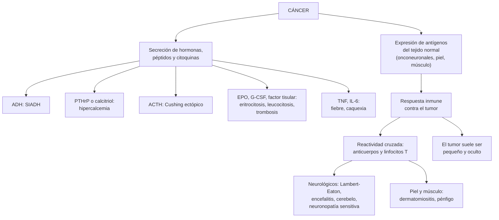

---
tags:
  - Hemato-oncología
---

# Síndromes paraneoplásicos

**Subespecialidad**
Oncología · Medicina interna · Neurología · Endocrinología · Dermatología · Reumatología

**Guías principales**
Criterios diagnósticos de los síndromes neurológicos paraneoplásicos 2021 (panel PNS-Care) · Endocrine Society 2023: hipercalcemia maligna · ASCO 2023: tromboembolismo venoso en el cáncer · IMACS 2023: tamizaje de cáncer en las miopatías inflamatorias

**Otras fuentes**
Revisión de los síndromes paraneoplásicos (Pelosof y Gerber, *Mayo Clin Proc* 2010) · Síndromes paraneoplásicos en el cáncer de vesícula (revisión sistemática, 2025) · Caso chileno de síndrome anti-Hu (Hospital Clínico de la Universidad de Chile, 2024) · GLOBOCAN 2024

**GES**
No como síndrome. Muchos de los cánceres subyacentes sí son GES: **pulmón** (problema n.º 81), mama, gástrico, colorrectal, ovario, testículo, riñón, linfomas y leucemias, entre otros.

**EUNACOM**
1.08.1.016 Síndrome paraneoplásico (sospecha, inicial, derivar)

**Revisado**
Octubre 2026

!!! abstract "Resumen en 60 segundos"
    - **Síndrome paraneoplásico**: manifestación de un cáncer **a distancia**, que **no** se debe a la invasión local, a las metástasis, a infecciones ni al tratamiento.
    - **Dos mecanismos**:
        - **Secreción** de hormonas, péptidos o citoquinas por el tumor: **endocrinos** (SIADH, hipercalcemia por PTHrP, Cushing ectópico), **hematológicos** (eritrocitosis, trombosis) y fiebre o caquexia.
        - **Autoinmunidad cruzada**: el tumor expresa antígenos del tejido normal; los anticuerpos o los linfocitos T atacan al **sistema nervioso**, la **piel** o los **músculos**.
    - **Pueden aparecer antes que el cáncer** (meses o años): son una **oportunidad** para encontrar un tumor **oculto y tratable**.
    - **Tumores más asociados**: **pulmón de células pequeñas**, mama, ovario, timoma, **linfomas** y otros hematológicos.
    - **Neurológicos** (~ **1 de cada 300** pacientes con cáncer): **Lambert-Eaton**, encefalitis límbica, degeneración cerebelosa, neuronopatía sensitiva, opsoclono-mioclono. Se diagnostican con **anticuerpos** (Hu, Yo, Ri, Ma2, NMDAR, VGCC) y los **criterios PNS-Care 2021**.
    - **Conducta**: reconocer el síndrome, **buscar el cáncer** (TC de tórax, abdomen y pelvis; PET-CT; exámenes dirigidos) y **repetir la búsqueda** cada 4–6 meses por 2 años si es de alto riesgo.
    - **Tratamiento**: **tratar el cáncer** (lo más eficaz) + tratamiento específico del síndrome (corregir la hiponatremia o la hipercalcemia, **inmunoterapia** en los neurológicos, anticoagulación en la trombosis).

## Definición

- **Síndrome paraneoplásico**: conjunto de signos y síntomas causado por un **cáncer** a través de mecanismos **remotos** (hormonas, citoquinas o autoinmunidad), y **no** por:
    - la **invasión** directa o las **metástasis**;
    - las **infecciones**, la **desnutrición** o las alteraciones **metabólicas** secundarias;
    - los **efectos adversos** de la quimioterapia, la radioterapia o la inmunoterapia.
- **Síndrome neurológico paraneoplásico** (PNS-Care 2021): trastorno neurológico que **se asocia a un cáncer** y tiene una patogenia **inmune**, apoyada a menudo por **anticuerpos neuronales** específicos.
    - **Fenotipos de alto riesgo** (antes "clásicos"): **encefalomielitis**, **encefalitis límbica**, **síndrome cerebeloso rápidamente progresivo**, **opsoclono-mioclono**, **neuronopatía sensitiva**, **pseudoobstrucción intestinal** (neuropatía entérica) y **síndrome miasténico de Lambert-Eaton**.
    - **Anticuerpos según el riesgo de cáncer**:
        - **Alto riesgo (> 70 % con cáncer)**: Hu, CV2/CRMP5, SOX1, anfifisina, Ri, Yo, Ma2, KLHL11, PCA2, Tr.
        - **Riesgo intermedio (30–70 %)**: AMPAR, GABA-B, mGluR5, VGCC P/Q, NMDAR.
        - **Riesgo bajo (< 30 %)**: LGI1, CASPR2, GAD65, GlyR, DPPX, entre otros.

## Epidemiología

### Mundial

- Los síndromes paraneoplásicos afectan a una **minoría** de los pacientes con cáncer, pero son **importantes** porque pueden ser la **primera manifestación**.
- **Neurológicos**: ~ **1 de cada 300** pacientes con cáncer; incidencia poblacional de **1,6–8,9 por millón** de personas al año (probablemente subdiagnosticados) (Graus 2021).
- **Asociaciones de alta frecuencia** (Graus 2021):
    - **Opsoclono-mioclono en niños**: en ~ **50 %** hay un **neuroblastoma**.
    - **Encefalitis anti-NMDAR** en **mujeres de 18–35 años**: **teratoma de ovario** en **35–50 %**.
    - **Encefalitis con anticuerpos GABA-B**: **≥ 50 %** tiene un cáncer pulmonar de células pequeñas.
    - **Lambert-Eaton**: ~ la mitad tiene un **cáncer pulmonar de células pequeñas**.
- **Endocrinos**: la **hipercalcemia** es frecuente en el cáncer avanzado; el **SIADH** se presenta sobre todo en el cáncer pulmonar de células pequeñas.

### Chile

!!! chile "Datos nacionales"
    - **GLOBOCAN 2024** (Chile): los cánceres con más síndromes paraneoplásicos son frecuentes en el país:
        - **Pulmón**: **4368 casos** nuevos y **3965 muertes** al año (**primera causa** de muerte por cáncer).
        - **Mama**: 5141 casos; **estómago**: 5494 casos y 3511 muertes; **vesícula**: **2068 casos** (7.º lugar).
        - **Linfomas no Hodgkin**: 1586 casos; **leucemias**: 1226 casos.
    - **Cáncer de vesícula** (muy frecuente en Chile): en una revisión sistemática de 51 publicaciones, sus síndromes paraneoplásicos fueron **hematológicos** (leucocitosis), **dermatológicos** (dermatomiositis, acantosis nigricans, Sweet), neurológicos y **metabólicos** (hipercalcemia, hiponatremia). Casi siempre aparecieron en **etapas avanzadas** (Lau 2025).
    - **Caso chileno**: mujer de 52 años con un estado epiléptico mioclónico opercular por un síndrome **anti-Hu** (y anti-GAD65) asociado a un **cáncer de mama**; mejoró con corticoides, rituximab y la **resección del tumor** (Hospital Clínico de la Universidad de Chile; Romero 2024).
    - El **cáncer de pulmón** es GES (**problema n.º 81**, desde la **sospecha**), igual que los de mama, gástrico, colorrectal, ovario, testículo y riñón, los linfomas y las leucemias, que pueden presentarse con estos síndromes.

## Etiología y factores de riesgo

- **Tumores más asociados**: **cáncer pulmonar de células pequeñas** (SIADH, Cushing ectópico, Lambert-Eaton, anti-Hu), **carcinomas escamosos** (pulmón, cabeza y cuello, esófago: hipercalcemia por PTHrP), **mama** y **ovario** (anti-Yo, anti-Ri, dermatomiositis), **timoma** (miastenia, aplasia pura de serie roja), **linfomas** (hipercalcemia por calcitriol, pénfigo, anti-Tr), **carcinoma renal** y **hepatocarcinoma** (eritrocitosis, fiebre), **páncreas** y **estómago** (trombosis, acantosis nigricans), **tumores neuroendocrinos**.
- **Tabaquismo** y **edad**: aumentan la probabilidad de un cáncer pulmonar subyacente.
- **Inhibidores de puntos de control inmunitario** (nivolumab, pembrolizumab): pueden **desencadenar o empeorar** un síndrome neurológico paraneoplásico.

## Fisiopatología

- **Mecanismo humoral** (secreción por el tumor):

| Sustancia | Síndrome | Tumor típico |
|---|---|---|
| **ADH** (vasopresina) | **SIADH**: hiponatremia euvolémica | **Pulmón de células pequeñas** |
| **PTHrP** (proteína relacionada con la PTH) | **Hipercalcemia humoral** (PTH baja) | **Escamosos**, riñón, mama, vejiga |
| **Calcitriol** (1,25-vitamina D) | Hipercalcemia (PTH baja, calcitriol alto) | **Linfomas** |
| **ACTH** ectópica | **Cushing** con **hipokalemia** marcada, hipertensión, debilidad | Pulmón de células pequeñas, **carcinoides**, tumores neuroendocrinos |
| **IGF-2** | **Hipoglicemia** con insulina baja | Tumores fibrosos solitarios, hepatocarcinoma |
| **Eritropoyetina** | **Eritrocitosis** | **Riñón**, hígado, hemangioblastoma |
| **G-CSF**, IL-6 | **Reacción leucemoide**, trombocitosis, fiebre | Pulmón, riñón, vesícula |
| **Factor tisular**, mucinas | **Trombosis** (Trousseau), CID | **Páncreas**, pulmón, estómago |
| **TNF, IL-1, IL-6** | **Caquexia**, fiebre, anemia | Varios |
| **Serotonina**, otras aminas | **Síndrome carcinoide** (rubor, diarrea) | Neuroendocrinos con metástasis hepáticas |

- **Mecanismo inmune** (autoinmunidad cruzada):
    - El tumor expresa proteínas que normalmente solo existen en las **neuronas** (antígenos **onconeuronales**), la piel o el músculo.
    - El sistema inmune ataca al tumor y, por **reactividad cruzada**, al **tejido sano**.
    - **Anticuerpos contra antígenos intracelulares** (Hu, Yo, Ri, Ma2): son **marcadores**; el daño lo producen los **linfocitos T citotóxicos**, y la pérdida neuronal suele ser **irreversible**.
    - **Anticuerpos contra antígenos de superficie** (NMDAR, AMPAR, GABA-B, VGCC): son **patogénicos**; la enfermedad **responde mejor** a la inmunoterapia y a la resección del tumor.
    - Paradoja: la respuesta inmune puede **frenar** el tumor, por lo que suele ser **pequeño** y difícil de encontrar.

*Figura 1. Mecanismos de los síndromes paraneoplásicos. Esquema propio basado en Pelosof 2010 y Graus 2021.*

## Clasificación

<figure markdown>
![Esquema de seis tarjetas con los síndromes paraneoplásicos frecuentes y el tumor que hay que buscar. Endocrinos y metabólicos: SIADH con hiponatremia, por cáncer pulmonar de células pequeñas; hipercalcemia por PTHrP, por carcinomas escamosos, de riñón o de mama; hipercalcemia por calcitriol, por linfomas; Cushing por ACTH ectópica, por cáncer pulmonar o carcinoides; hipoglicemia por IGF-2, por tumores fibrosos o hepáticos. Neurológicos: Lambert-Eaton, por cáncer pulmonar de células pequeñas; encefalitis límbica con anticuerpos Hu o Ma2, por cáncer pulmonar o de testículo; encefalitis anti-NMDAR, por teratoma de ovario; degeneración cerebelosa con anticuerpos Yo o Tr, por cáncer de ovario, de mama o linfoma de Hodgkin; miastenia gravis, por timoma. Hematológicos: tromboflebitis migratoria de Trousseau, por cáncer de páncreas o pulmón; CID crónica, por cáncer de próstata, páncreas o leucemia promielocítica; eritrocitosis por eritropoyetina, por cáncer de riñón o hígado; reacción leucemoide por G-CSF, por cáncer de pulmón o riñón; hemólisis autoinmune y PTI, por leucemia linfática crónica o linfomas. Dermatológicos: dermatomiositis, por cáncer de ovario, pulmón o gástrico; acantosis nigricans maligna, por cáncer gástrico; signo de Leser-Trélat con queratosis súbitas, por cáncer gástrico o de colon; síndrome de Sweet, por leucemia mieloide aguda; pénfigo paraneoplásico, por linfomas o enfermedad de Castleman. Reumatológicos y musculares: osteoartropatía hipertrófica, por cáncer pulmonar de células no pequeñas; acropaquia de inicio reciente, por cáncer pulmonar o mesotelioma; polimialgia o artritis atípica, por tumores hematológicos o sólidos; fascitis palmar y poliartritis, por cáncer de ovario; caquexia, por cáncer de páncreas, gástrico o pulmonar. Renales y otros: nefropatía membranosa, por cáncer de pulmón, gástrico o de colon; enfermedad de cambios mínimos, por linfoma de Hodgkin; fiebre tumoral, por cáncer de riñón, linfomas o hígado; amiloidosis AL, por mieloma o gammapatías; prurito generalizado, por linfoma de Hodgkin o policitemia vera. Abajo: pueden aparecer meses o años antes que el cáncer; si no hay un tumor conocido, buscarlo y repetir la búsqueda](../assets/figuras/paraneoplasicos/sindromes-y-tumores.svg){ loading=lazy }
<figcaption>Figura 2. Síndromes paraneoplásicos frecuentes por sistema y el tumor que hay que buscar. Esquema propio basado en Pelosof 2010, Graus 2021 e IMACS 2023.</figcaption>
</figure>

### Criterios de los síndromes neurológicos paraneoplásicos: puntaje PNS-Care (Graus 2021)

| Componente | Puntos |
|---|---|
| **Nivel clínico** | Fenotipo de **alto riesgo**: **3**; de riesgo intermedio: **2**; sin fenotipo compatible: 0 |
| **Laboratorio** | Anticuerpo de **alto riesgo**: **3**; de riesgo intermedio: **2**; de riesgo bajo o negativo: 0 |
| **Cáncer** | Encontrado y **concordante** con el fenotipo o el anticuerpo: **4**; no encontrado, con seguimiento < 2 años: 1; no encontrado tras ≥ 2 años: 0 |
| **Interpretación** | **≥ 8: definido** · **6–7: probable** · **4–5: posible** · ≤ 3: no es un síndrome paraneoplásico |

- La presencia del **cáncer es obligatoria** para un diagnóstico **definido**.
- Excepción: el **opsoclono-mioclono** con **neuroblastoma** o cáncer pulmonar de células pequeñas (puntaje 7) se considera **definido**.

## Clínica

### Endocrinos y metabólicos

- **SIADH**: **hiponatremia euvolémica** con osmolalidad plasmática baja y orina **inapropiadamente concentrada**; confusión, convulsiones si es aguda o grave (ver [sodio](../nefrologia/trastornos-del-sodio.md)).
- **Hipercalcemia maligna**: **poliuria**, polidipsia, deshidratación, **constipación**, náuseas, **confusión**, lesión renal aguda. Con **PTH baja** (ver [calcio](../endocrinologia/trastornos-del-calcio-fosforo-y-magnesio.md) y [urgencias oncológicas](urgencias-oncologicas.md)).
- **Cushing por ACTH ectópica**: de instalación **rápida**; predominan la **hipokalemia**, la **alcalosis metabólica**, la **hipertensión**, la **debilidad** muscular y la hiperglicemia, más que el fenotipo cushingoide clásico.
- **Hipoglicemia** por IGF-2: en ayunas, con **insulina y péptido C bajos**.

### Neurológicos (fenotipos de alto riesgo)

| Síndrome | Clínica | Anticuerpos | Tumor |
|---|---|---|---|
| **Lambert-Eaton** | **Debilidad proximal** de las piernas que **mejora con el ejercicio repetido**, **reflejos** disminuidos que aumentan tras la contracción, **disautonomía** (~ 90 %: boca seca, disfunción eréctil, constipación) | **VGCC P/Q** (y SOX1) | **Pulmón de células pequeñas** |
| **Encefalitis límbica** | Pérdida de la **memoria reciente**, **convulsiones**, alteraciones psiquiátricas, en < 3 meses | Hu, Ma2, AMPAR, GABA-B | Pulmón de células pequeñas, **testículo** (Ma2), timoma, mama |
| **Encefalitis anti-NMDAR** | Psicosis, convulsiones, discinesias orofaciales, disautonomía, compromiso de conciencia (mujeres jóvenes) | NMDAR (en LCR) | **Teratoma de ovario** |
| **Degeneración cerebelosa** | **Ataxia** de la marcha y de las extremidades, disartria, **nistagmo**, de instalación rápida | **Yo** (PCA1), **Tr** (DNER), Hu, VGCC | **Ovario**, **mama**, **Hodgkin** (Tr), pulmón |
| **Neuronopatía sensitiva** | Pérdida **asimétrica** de la sensibilidad, **ataxia sensitiva**, arreflexia, dolor | **Hu** (ANNA-1), CV2 | **Pulmón de células pequeñas** |
| **Opsoclono-mioclono** | Movimientos oculares **caóticos** multidireccionales, mioclonías, ataxia | Ri (en adultos) o ninguno | **Neuroblastoma** (niños), mama, pulmón |
| **Miastenia gravis** (no es un fenotipo de alto riesgo, pero su asociación es clásica) | Ptosis, diplopía, debilidad fatigable | Anti-receptor de acetilcolina | **Timoma** (ver [miastenia](../neurologia/debilidad-miastenia-y-miopatias.md)) |

### Dermatológicos, reumatológicos y otros

- **Dermatomiositis**: eritema en heliotropo, **pápulas de Gottron**, debilidad proximal; **~ 15–25 %** se asocia a un cáncer (más en > 40 años y con anticuerpos **anti-TIF1γ** o **anti-NXP2**).
- **Acantosis nigricans maligna**: aparición **brusca**, extensa, con compromiso de mucosas y **palmas** ("palmas en tripa"); sobre todo **cáncer gástrico**.
- **Signo de Leser-Trélat**: aparición **súbita** de muchas **queratosis seborreicas**.
- **Síndrome de Sweet**: fiebre, neutrofilia y placas eritematosas dolorosas; asociado a la **leucemia mieloide aguda**.
- **Osteoartropatía hipertrófica**: **acropaquia** + periostitis dolorosa de los huesos largos + artritis; **cáncer pulmonar de células no pequeñas**.
- **Trombosis**: **tromboflebitis superficial migratoria** (signo de **Trousseau**), TVP o TEP sin causa, trombosis en sitios inusuales; **endocarditis trombótica no bacteriana** (embolias).
- **Renales**: **nefropatía membranosa** (tumores sólidos), **cambios mínimos** (Hodgkin) (ver [síndromes glomerulares](../nefrologia/sindromes-glomerulares.md)).
- **Generales**: **fiebre tumoral** (sin infección; responde al naproxeno), **caquexia**, anorexia.

!!! alarma "Signos de alarma"
    - **Hiponatremia** grave (< 120 mEq/L) o con **convulsiones** o compromiso de conciencia.
    - **Hipercalcemia** con confusión, deshidratación o lesión renal.
    - **Encefalitis** de instalación rápida (memoria, convulsiones, psicosis) o **ataxia** rápidamente progresiva: la pérdida neuronal puede ser **irreversible** si se demora el tratamiento.
    - **Debilidad respiratoria** (Lambert-Eaton, miastenia).
    - **Trombosis** recurrente pese a la anticoagulación (Trousseau).
    - **Cushing ectópico** con hipokalemia grave e infecciones oportunistas.

## Diagnóstico

1. **Reconocer el síndrome** y **excluir** otras causas: **metástasis** (cerebrales, leptomeníngeas, óseas), infecciones, efectos de fármacos (quimioterapia, inmunoterapia), alteraciones metabólicas.
2. **Confirmar el mecanismo**:
    - **Endocrinos**: osmolalidades y sodio urinario (SIADH); **PTH**, **PTHrP** y **calcitriol** (hipercalcemia); **ACTH** y cortisol (Cushing); insulina, péptido C e IGF-2 (hipoglicemia).
    - **Neurológicos**: **RM** de cerebro (hiperintensidad de los lóbulos temporales mediales en la encefalitis límbica), **LCR** (pleocitosis, bandas oligoclonales), **electromiografía** (Lambert-Eaton: aumento del potencial tras el ejercicio o la estimulación repetitiva de alta frecuencia) y **panel de anticuerpos** en **suero y LCR**.
    - **Dermatomiositis**: CK, anticuerpos específicos de miositis, biopsia.
3. **Buscar el cáncer**, orientado por el síndrome y el anticuerpo:
    - **TC de tórax, abdomen y pelvis** con contraste.
    - **PET-CT con FDG** si la TC es negativa y la sospecha es alta.
    - **Mamografía** y RM de mama (anti-Yo, anti-Ri); **ecografía transvaginal** y pélvica (anti-Yo, anti-NMDAR); **ecografía testicular** (anti-Ma2); **TC o RM de tórax** (timoma).
    - Endoscopías según la clínica (acantosis nigricans: endoscopía alta).
    - **Repetir la búsqueda cada 4–6 meses por 2 años** si el fenotipo y el anticuerpo son de **alto riesgo** y el primer estudio es negativo (Graus 2021).

!!! guia "Puntos clave (Graus 2021; IMACS 2023; Endocrine Society 2023)"
    - **Síndromes neurológicos**: diagnóstico según el **puntaje PNS-Care** (fenotipo + anticuerpo + cáncer). Estudiar los anticuerpos en **suero y LCR**. Si el estudio de cáncer es negativo en un fenotipo con anticuerpo de alto riesgo, **repetirlo cada 4–6 meses por 2 años**.
    - **Miopatías inflamatorias**: estratificar el riesgo de cáncer (dermatomiositis, **anti-TIF1γ** o **anti-NXP2**, edad > 40 años, disfagia, enfermedad refractaria) y hacer un **tamizaje ampliado** (por ejemplo, TC de tórax, abdomen y pelvis) en los de **riesgo alto**.
    - **Hipercalcemia maligna**: medir **PTH**, **PTHrP** y **calcitriol** para definir el mecanismo; tratar con **hidratación** y un **antirresortivo** (ácido zoledrónico o denosumab); **corticoides** si es por **calcitriol** (linfomas).

<figure markdown>
![Tabla en inglés de los anticuerpos neuronales de alto riesgo, asociados a cáncer en más del 70 por ciento. Hu (ANNA-1): neuronopatía sensitiva, pseudoobstrucción intestinal crónica, encefalomielitis y encefalitis límbica; cáncer en 85 por ciento; cáncer pulmonar de células pequeñas mucho más que no pequeñas, otros tumores neuroendocrinos y neuroblastoma; la encefalitis límbica suele no ser paraneoplásica en menores de 18 años. CV2/CRMP5: encefalomielitis y neuronopatía sensitiva; más de 80 por ciento; cáncer pulmonar de células pequeñas y timoma. SOX1: Lambert-Eaton con o sin síndrome cerebeloso rápidamente progresivo; más de 90 por ciento; cáncer pulmonar de células pequeñas. PCA2 (MAP1B): neuropatía sensitivomotora, síndrome cerebeloso rápidamente progresivo y encefalomielitis; 80 por ciento; cáncer de pulmón y de mama. Anfifisina: polirradiculoneuropatía, neuronopatía sensitiva, encefalomielitis y síndrome de la persona rígida; 80 por ciento; cáncer pulmonar de células pequeñas y de mama. Ri (ANNA-2): síndrome de tronco o cerebeloso y opsoclono-mioclono; más de 70 por ciento; mama más que pulmón; cáncer de mama en mujeres y de pulmón en hombres. Yo (PCA-1): síndrome cerebeloso rápidamente progresivo; más de 90 por ciento; cáncer de ovario y de mama; casi todas mujeres. Ma2 y/o Ma: encefalitis límbica, diencefálica y de tronco; más de 75 por ciento; cáncer de testículo y pulmonar de células no pequeñas; hombres jóvenes con tumores testiculares. Tr (DNER): síndrome cerebeloso rápidamente progresivo; 90 por ciento; linfoma de Hodgkin. KLHL11: síndrome de tronco o cerebeloso; 80 por ciento; cáncer de testículo en hombres jóvenes](../assets/figuras/paraneoplasicos/anticuerpos-alto-riesgo-graus-2021.jpg){ loading=lazy }
<figcaption>Figura 3. Anticuerpos neuronales de alto riesgo (más de 70 % asociados a cáncer): fenotipo neurológico, frecuencia de cáncer y tumores habituales. Por ejemplo, <strong>Hu</strong> → cáncer pulmonar de células pequeñas; <strong>Yo</strong> → ovario y mama; <strong>Ma2</strong> → testículo; <strong>Tr</strong> → linfoma de Hodgkin. Fuente: Graus F, Vogrig A, Muñiz-Castrillo S, et al. Updated diagnostic criteria for paraneoplastic neurologic syndromes. <em>Neurol Neuroimmunol Neuroinflamm.</em> 2021;8(4):e1014, tabla 1. Licencia <a href="https://creativecommons.org/licenses/by/4.0/">CC BY 4.0</a>.</figcaption>
</figure>

## Laboratorio

| Síndrome | Exámenes |
|---|---|
| **SIADH** | Sodio sérico, **osmolalidad plasmática** (baja), **osmolalidad urinaria** (> 100 mOsm/kg), **sodio urinario** (> 30–40 mEq/L), euvolemia; TSH y cortisol normales |
| **Hipercalcemia** | Calcio corregido o iónico, **PTH baja**, **PTHrP alta** (humoral) o **calcitriol alto** (linfoma), fósforo, creatinina |
| **Cushing ectópico** | **Potasio bajo**, alcalosis metabólica, cortisol urinario muy alto, **ACTH alta**, sin supresión con dexametasona en dosis altas |
| **Hipoglicemia tumoral** | Glicemia baja con **insulina y péptido C suprimidos**; razón IGF-2/IGF-1 alta |
| **Neurológicos** | **Anticuerpos** onconeuronales y de superficie (suero y LCR), LCR, RM, electromiografía |
| **Hematológicos** | Hemograma, frotis, dímero D, fibrinógeno (CID crónica) |
| **Dermatomiositis** | CK, aldolasa, anticuerpos de miositis (**anti-TIF1γ**, anti-NXP2) |
| **Marcadores tumorales** | Solo como **apoyo** según el tumor sospechado (CA-125, CEA, PSA, β-hCG, alfafetoproteína, cromogranina); **no** sirven para tamizar a ciegas |

## Imágenes

- **TC de tórax, abdomen y pelvis** con contraste: primer examen para buscar el tumor.
- **PET-CT con FDG**: detecta tumores pequeños (pulmón, ganglios mediastínicos) cuando la TC es negativa; útil en los síndromes neurológicos de alto riesgo.
- **RM de cerebro**: encefalitis límbica (hiperintensidad en T2/FLAIR de los lóbulos temporales mediales), cerebelo (atrofia tardía).
- **Mamografía, ecografía mamaria y RM de mama**; **ecografía transvaginal**; **ecografía testicular**.
- **PET con análogos de somatostatina** (galio-68 DOTATATE): tumores neuroendocrinos productores de ACTH.

## Diagnóstico diferencial

| Manifestación | Diferencial antes de llamarla paraneoplásica |
|---|---|
| **Hiponatremia en un paciente con cáncer** | Fármacos (ciclofosfamida, vincristina, cisplatino, ISRS, tiazidas), dolor, náuseas, hipotiroidismo, insuficiencia suprarrenal (metástasis suprarrenales, corticoides suspendidos), hipovolemia |
| **Hipercalcemia** | **Metástasis óseas** líticas (osteólisis local), **hiperparatiroidismo primario** (PTH alta; puede coexistir con un cáncer), vitamina D, tiazidas, litio, inmovilización |
| **Síntomas neurológicos** | **Metástasis** cerebrales, **carcinomatosis meníngea**, compresión medular, efectos de la quimioterapia (neuropatía por platino o taxanos), **inmunoterapia**, encefalopatías metabólicas, infecciones (herpes, listeria), Wernicke |
| **Encefalitis límbica** | Encefalitis **herpética** (descartar con PCR en LCR), autoinmune no paraneoplásica (LGI1), epilepsia |
| **Debilidad proximal** | Miastenia gravis, miopatía por corticoides, miositis, hipokalemia, caquexia |
| **Trombosis** | TIH, catéteres, compresión tumoral, inmovilización, quimioterapia (asparaginasa, talidomida) |

## Tratamiento

- **El tratamiento más eficaz es el del cáncer** (cirugía, quimioterapia, radioterapia): muchos síndromes mejoran o se resuelven al controlar el tumor.
- **Tratamiento específico del síndrome**:

| Síndrome | Tratamiento |
|---|---|
| **SIADH** | **Restricción hídrica**; **suero hipertónico 3 %** si hay síntomas graves (corrección ≤ 8–10 mEq/L en 24 horas); tabletas de **sal** + furosemida o **urea**; tolvaptán en casos seleccionados |
| **Hipercalcemia maligna** | **Suero fisiológico**; **ácido zoledrónico** o **denosumab**; calcitonina para un efecto rápido; **corticoides** si es por calcitriol; diálisis en los casos graves |
| **Cushing ectópico** | Resección del tumor; inhibidores de la esteroidogénesis (**ketoconazol**, metirapona, osilodrostat); suprarrenalectomía bilateral si es refractario; profilaxis de *Pneumocystis* |
| **Neurológicos** | Tratar el tumor + **inmunoterapia precoz**: **corticoides** (metilprednisolona EV), **inmunoglobulina EV** o **plasmaféresis**; luego rituximab o ciclofosfamida. Mejor respuesta con anticuerpos de **superficie** (NMDAR, VGCC) que con los intracelulares (Hu, Yo) |
| **Lambert-Eaton** | Tratar el tumor; **3,4-diaminopiridina** (amifampridina); inmunoglobulina EV o inmunosupresión |
| **Trombosis asociada al cáncer** (ASCO 2023) | **Anticoagulantes orales directos** (apixabán, edoxabán, rivaroxabán) o **HBPM** por ≥ 6 meses y mientras el cáncer esté activo; preferir HBPM o apixabán en los cánceres **gastrointestinales o genitourinarios** con riesgo de sangrado. En el **Trousseau**, la **warfarina suele fallar**: usar **HBPM** |
| **Dermatomiositis** | Corticoides + inmunosupresores o inmunoglobulina EV; tratar el cáncer |
| **Fiebre tumoral** | **Naproxeno** (prueba diagnóstica y terapéutica) |
| **Caquexia** | Apoyo nutricional; acetato de megestrol o corticoides en casos seleccionados; cuidados paliativos |

!!! dosis "Dosis de referencia (adulto)"
    - **Suero hipertónico 3 %**: **bolo de 100–150 mL** en 10–20 minutos (repetible hasta 2–3 veces) en la hiponatremia **sintomática grave**; meta: subir **4–6 mEq/L** en las primeras horas y no más de **8–10 mEq/L** en 24 horas.
    - **Ácido zoledrónico**: **4 mg EV** en 15 minutos (ajustar a la función renal).
    - **Denosumab** (hipercalcemia refractaria o insuficiencia renal): **120 mg SC** (semanal el primer mes en algunos esquemas); vigilar la hipocalcemia.
    - **Calcitonina**: **4 UI/kg SC o IM cada 12 horas** por 48 horas (efecto rápido y transitorio).
    - **Prednisona** (hipercalcemia por calcitriol): **40–60 mg/día VO**.
    - **Metilprednisolona** (síndromes neurológicos): **1 g/día EV por 5 días**; **inmunoglobulina EV**: **2 g/kg** repartidos en 5 días.
    - **Amifampridina** (Lambert-Eaton): **5–10 mg cada 8 horas VO**, ajustando hasta un máximo de 80–100 mg/día.
    - **Enoxaparina** (trombosis asociada al cáncer): **1 mg/kg SC cada 12 horas**; **apixabán 10 mg cada 12 horas** por 7 días y luego **5 mg cada 12 horas**.
    - **Naproxeno** (fiebre tumoral): **250–375 mg cada 12 horas VO**.

## Complicaciones

| Complicación | Claves |
|---|---|
| **Daño neurológico irreversible** | Pérdida neuronal (síndromes con anticuerpos intracelulares); discapacidad grave aunque se trate el tumor |
| **Mielinólisis osmótica** | Corrección demasiado rápida de una hiponatremia crónica |
| **Lesión renal aguda** | Hipercalcemia, deshidratación |
| **Infecciones** | Cushing ectópico (hipercortisolismo grave), inmunosupresión |
| **TEP** y embolias | Trousseau, endocarditis trombótica no bacteriana |
| **Retraso del diagnóstico del cáncer** | Si el síndrome no se reconoce como paraneoplásico |
| **Empeoramiento con la inmunoterapia** | Los inhibidores de puntos de control pueden agravar un síndrome neurológico previo |

## Pronóstico y seguimiento

- Depende sobre todo del **cáncer**. Muchos síndromes (endocrinos, hipercalcemia, trombosis de Trousseau) se asocian a **enfermedad avanzada** y a un pronóstico **malo**.
- La **hipercalcemia maligna** es un marcador de mal pronóstico (sobrevida corta en los tumores sólidos).
- Los **neurológicos**: el pronóstico funcional depende de la **rapidez** del diagnóstico y del tipo de anticuerpo; los de **superficie** (NMDAR, VGCC) tienen mejor recuperación.
- **Seguimiento**:
    - Si no se encontró el cáncer: **repetir la búsqueda** cada 4–6 meses por **2 años** en los de alto riesgo.
    - Si se trató el cáncer: la **reaparición del síndrome** puede ser el primer signo de **recaída** tumoral.

## Perlas para el internado

!!! perla "Para recordar en la sala"
    - **Hiponatremia euvolémica en un fumador**: pensar en un **SIADH por cáncer pulmonar de células pequeñas**.
    - **Hipercalcemia con PTH baja**: neoplasia (PTHrP, metástasis o calcitriol en los linfomas).
    - **Hipokalemia grave + hipertensión + debilidad de inicio rápido**: **Cushing por ACTH ectópica**.
    - **Debilidad proximal que mejora con el ejercicio + boca seca + reflejos que aparecen tras la contracción**: **Lambert-Eaton**; buscar un **cáncer pulmonar de células pequeñas**.
    - **Ataxia cerebelosa rápida en una mujer**: anti-Yo; buscar un cáncer de **ovario o mama**.
    - **Psicosis + convulsiones + discinesias en una mujer joven**: encefalitis **anti-NMDAR**; buscar un **teratoma de ovario**.
    - **Dermatomiositis en un adulto**: buscar un cáncer (ovario, pulmón, gástrico, nasofaríngeo).
    - **Acantosis nigricans de aparición brusca en un adulto delgado**: **cáncer gástrico**.
    - **Trombosis migratoria o que recurre con warfarina**: **Trousseau** (páncreas); tratar con **HBPM**.
    - Un síndrome paraneoplásico puede **preceder** al cáncer: si la primera búsqueda es negativa, **repetirla**.

## Preguntas de repaso

??? repaso "1. Hombre de 64 años, fumador de 45 paquetes-año, con 2 semanas de confusión. Sodio 118 mEq/L, osmolalidad plasmática 245 mOsm/kg, osmolalidad urinaria 520 mOsm/kg, sodio urinario 62 mEq/L. Euvolémico. TSH y cortisol normales. ¿Qué sospecha y qué hace?"
    - **SIADH paraneoplásico**, probablemente por un **cáncer pulmonar de células pequeñas**.
    - **Manejo**:
        - Hiponatremia **sintomática** (confusión): **suero hipertónico 3 %** en bolos de 100–150 mL; meta de subir 4–6 mEq/L y **no más de 8–10 mEq/L en 24 horas** (riesgo de mielinólisis).
        - Luego **restricción hídrica**, sal y urea o furosemida.
        - Revisar fármacos (ISRS, tiazidas).
    - **Buscar el tumor**: **TC de tórax** (masa central, adenopatías mediastínicas), broncoscopía o biopsia. El tratamiento del cáncer (quimioterapia) suele corregir el SIADH.

??? repaso "2. Mujer de 58 años con 3 meses de baja de peso, poliuria y constipación. Calcio 14,2 mg/dL, PTH 6 pg/mL (baja), creatinina 1,6 mg/dL. La radiografía de tórax muestra una masa cavitada en el lóbulo superior derecho. ¿Qué mecanismo sospecha y cómo la trata?"
    - **Hipercalcemia humoral maligna por PTHrP**, probablemente por un **carcinoma escamoso de pulmón** (masa cavitada).
    - **Confirmar**: **PTHrP** alta, calcitriol normal o bajo; buscar metástasis óseas.
    - **Tratamiento**:
        - **Suero fisiológico** abundante (corregir la deshidratación).
        - **Ácido zoledrónico 4 mg EV** (ajustado a la función renal) o denosumab.
        - **Calcitonina** si se necesita un efecto rápido.
        - Suspender el calcio, la vitamina D y las tiazidas.
    - **Estudiar y tratar el cáncer**. La hipercalcemia maligna indica un **mal pronóstico**.

??? repaso "3. Hombre de 61 años, fumador, con 4 meses de debilidad de los muslos (le cuesta subir escaleras), boca seca y disfunción eréctil. Los reflejos están disminuidos pero aparecen tras una contracción sostenida. ¿Qué sospecha y cómo lo estudia?"
    - **Síndrome miasténico de Lambert-Eaton**: debilidad **proximal** que mejora con el ejercicio, **arreflexia** que mejora tras la contracción y **disautonomía**.
    - **Estudio**:
        - **Electromiografía**: potencial de acción muscular bajo que **aumenta > 100 %** tras el ejercicio breve o la estimulación de alta frecuencia.
        - Anticuerpos contra los **canales de calcio VGCC P/Q** (y SOX1).
        - **Buscar un cáncer pulmonar de células pequeñas**: TC de tórax y, si es negativa, **PET-CT**; repetir cada 4–6 meses por 2 años.
    - **Tratamiento**: el del tumor; **amifampridina**; inmunoglobulina EV o inmunosupresión si es necesario.

??? repaso "4. Mujer de 54 años con 6 semanas de inestabilidad progresiva de la marcha, disartria y nistagmo. RM de cerebro normal. ¿Qué sospecha y qué tumores busca?"
    - **Degeneración cerebelosa paraneoplásica** (síndrome cerebeloso **rápidamente progresivo**, un fenotipo de **alto riesgo**). Lo típico es el anticuerpo **anti-Yo** (PCA1).
    - **Tumores**: **ovario** y **mama** (anti-Yo); también linfoma de Hodgkin (anti-Tr) y pulmón (Hu, VGCC).
    - **Estudio**: anticuerpos en suero y LCR, **mamografía y ecografía mamaria**, **ecografía transvaginal**, CA-125, **TC de tórax, abdomen y pelvis** y, si es negativa, **PET-CT**.
    - **Tratamiento**: del tumor + **inmunoterapia precoz** (corticoides, inmunoglobulina EV o plasmaféresis). El daño de las células de Purkinje suele ser **irreversible**, por lo que la rapidez es clave.

??? repaso "5. Mujer de 26 años con 10 días de alteraciones de conducta, alucinaciones, una convulsión y ahora movimientos involuntarios de la boca y fluctuaciones de la presión arterial. ¿Qué sospecha y qué examen pide para buscar el tumor?"
    - **Encefalitis anti-NMDAR** (psicosis, convulsiones, discinesias orofaciales, disautonomía en una mujer joven).
    - **Estudio**: **LCR** (pleocitosis; **anticuerpos anti-NMDAR**), RM de cerebro, EEG; descartar una encefalitis **herpética** (PCR en LCR).
    - **Buscar un teratoma de ovario** (35–50 % en mujeres de 18–35 años): **ecografía transvaginal** o **RM de pelvis**.
    - **Tratamiento**: **resección del teratoma** + **inmunoterapia** (corticoides, inmunoglobulina EV o plasmaféresis; luego rituximab). Tiene **buena recuperación** si se trata pronto.

??? repaso "6. Hombre de 66 años con 3 episodios de tromboflebitis superficial en distintas venas de los brazos y las piernas en 2 meses, baja de peso y dolor epigástrico que se irradia al dorso. ¿Qué sospecha y cómo trata la trombosis?"
    - **Signo de Trousseau** (tromboflebitis migratoria) por un **cáncer de páncreas** (dolor epigástrico al dorso, baja de peso).
    - **Estudio**: **TC multifásica de abdomen con protocolo de páncreas**, CA 19-9 (ver [páncreas](../gastroenterologia/cancer-de-pancreas-y-pancreatitis-cronica.md)).
    - **Anticoagulación**: **heparina de bajo peso molecular** (la warfarina suele fallar en el Trousseau) o un anticoagulante oral directo según el riesgo de sangrado, mientras el cáncer esté activo.

## Referencias

1. Graus F, Vogrig A, Muñiz-Castrillo S, et al. Updated diagnostic criteria for paraneoplastic neurologic syndromes. *Neurol Neuroimmunol Neuroinflamm.* 2021;8(4):e1014. doi:[10.1212/NXI.0000000000001014](https://doi.org/10.1212/NXI.0000000000001014)
2. Pelosof LC, Gerber DE. Paraneoplastic syndromes: an approach to diagnosis and treatment. *Mayo Clin Proc.* 2010;85(9):838–854. doi:[10.4065/mcp.2010.0099](https://doi.org/10.4065/mcp.2010.0099)
3. El-Hajj Fuleihan G, Clines GA, Hu MI, et al. Treatment of hypercalcemia of malignancy in adults: an Endocrine Society clinical practice guideline. *J Clin Endocrinol Metab.* 2023;108(3):507–528. doi:[10.1210/clinem/dgac621](https://doi.org/10.1210/clinem/dgac621)
4. Key NS, Khorana AA, Kuderer NM, et al. Venous thromboembolism prophylaxis and treatment in patients with cancer: ASCO guideline update. *J Clin Oncol.* 2023;41(16):3063–3071. doi:[10.1200/JCO.23.00294](https://doi.org/10.1200/JCO.23.00294)
5. Oldroyd AGS, Callen JP, Chinoy H, et al. International guideline for idiopathic inflammatory myopathy-associated cancer screening: an International Myositis Assessment and Clinical Studies Group (IMACS) initiative. *Nat Rev Rheumatol.* 2023;19(12):805–817. doi:[10.1038/s41584-023-01045-w](https://doi.org/10.1038/s41584-023-01045-w)
6. Lau BSR, Chua NYM, Ong WT, et al. Paraneoplastic syndromes in gallbladder cancer: a systematic review. *Medicina (Kaunas).* 2025;61(3):417. doi:[10.3390/medicina61030417](https://doi.org/10.3390/medicina61030417)
7. Romero C, Quijada A, Abudinén G, et al. Opercular myoclonic-anarthric status (OMASE) secondary to anti-Hu paraneoplastic neurological syndrome. *Epilepsy Behav Rep.* 2024;27:100703. doi:[10.1016/j.ebr.2024.100703](https://doi.org/10.1016/j.ebr.2024.100703)
8. Ervik M, Laversanne M, Lam F, et al. Global Cancer Observatory: Cancer Today (2024 estimates). Lyon: International Agency for Research on Cancer; 2026. Ficha de Chile: [gco.iarc.who.int](https://gco.iarc.who.int/media/globocan/factsheets/populations/152-chile-fact-sheet.pdf)
