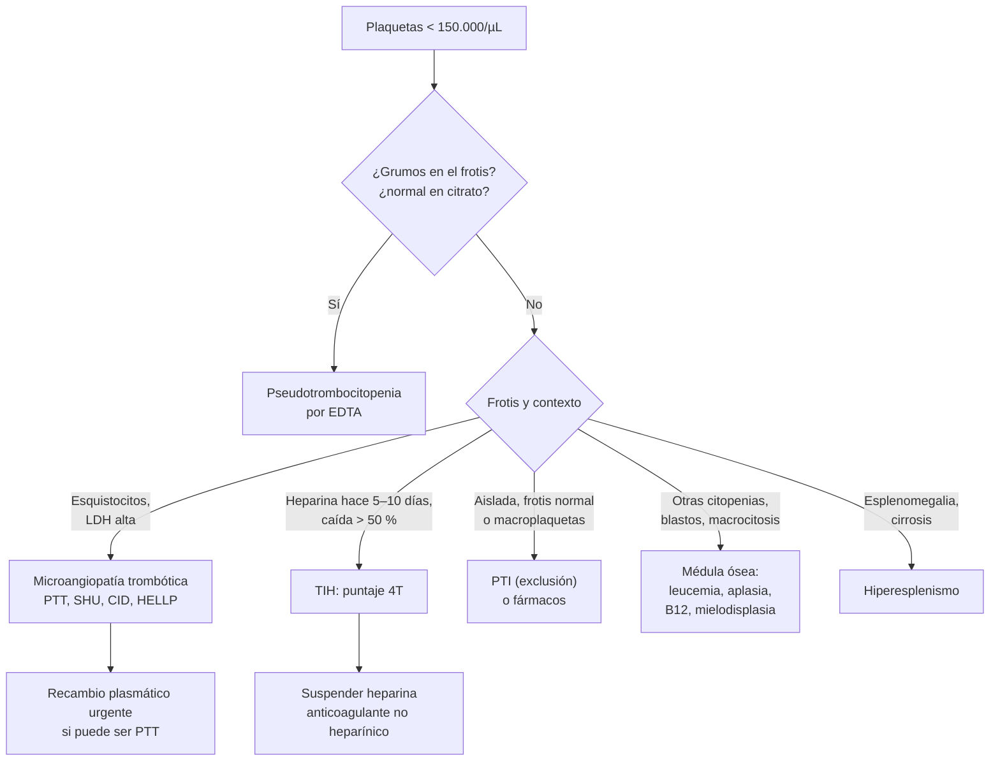

---
tags:
  - Hemato-oncología
  - Urgencia
  - Frecuente en sala
---

# Trombocitopenia: enfoque, PTI, microangiopatías trombóticas (PTT y SHU) y trombocitopenia inducida por heparina

**Subespecialidad**
Hematología · Medicina de urgencia · Medicina intensiva

**Guías principales**
ASH 2026: tratamiento inicial y de segunda línea de la PTI del adulto · ASH 2019 y consenso internacional 2019: PTI · ISTH 2020 (diagnóstico) y actualización 2025 (tratamiento): PTT · ASH 2018: trombocitopenia inducida por heparina · AABB/ICTMG 2025: transfusión de plaquetas

**Otras fuentes**
HERCULES (caplacizumab, *NEJM* 2019) · Puntaje PLASMIC (*Lancet Haematol* 2017) · Puntaje 4T · Serie chilena de PTT (Medwave 2025) · Vigilancia chilena del SHU por *E. coli* productora de toxina Shiga

**GES**
No

**EUNACOM**
1.08.1.012 Púrpuras trombopénicos (sospecha, inicial, derivar) · 1.08.2.009 Trombopenia severa (sospecha, inicial, derivar)

**Revisado**
Septiembre 2026

!!! abstract "Resumen en 60 segundos"
    - **Trombocitopenia**: plaquetas **< 150.000/µL**. El sangrado espontáneo relevante es raro sobre **20.000–30.000/µL**, salvo que haya otra alteración de la hemostasia.
    - **Primero, confirmar**: repetir con un **frotis** (y en citrato) para descartar la **pseudotrombocitopenia** por EDTA.
    - **Pensar en 4 mecanismos**: **menor producción** (médula ósea), **destrucción inmune** (PTI, fármacos, **TIH**), **consumo** (**CID**, **PTT**, **SHU**, sepsis) y **secuestro** (hiperesplenismo).
    - **Emergencias que no se pueden perder**:
        - **Esquistocitos + plaquetas bajas** = **microangiopatía trombótica**. Si puede ser **PTT**: **recambio plasmático urgente** (mortalidad > 90 % sin tratamiento).
        - **Caída de plaquetas > 50 % a los 5–10 días de heparina** = **TIH**: **suspender toda heparina** y anticoagular con otro fármaco (**no transfundir plaquetas**).
        - **PTI con sangrado grave**: inmunoglobulina EV + corticoides en dosis altas + transfusión de plaquetas.
    - **PTI** (diagnóstico de exclusión): tratar si hay **< 30.000/µL** o sangrado.
        - **Prednisona 0,5–2 mg/kg/día** (≤ 6 semanas en total) o **dexametasona 40 mg/día por 4 días**.
        - **ASH 2026**: se sugiere agregar **rituximab o un agonista del receptor de trombopoyetina** desde el inicio. En la segunda línea, un **agonista de trombopoyetina** (recomendación fuerte).
    - **Transfusión de plaquetas profiláctica** (AABB 2025): **< 10.000/µL** en general; **< 20.000** antes de una punción lumbar; **< 50.000** antes de una cirugía mayor.

## Definición

- **Trombocitopenia**: recuento de plaquetas **< 150.000/µL** (< 150 × 10⁹/L).
    - **Leve**: 100.000–150.000/µL.
    - **Moderada**: 50.000–100.000/µL.
    - **Grave**: **< 50.000/µL**. El riesgo de sangrado espontáneo grave aumenta bajo **10.000–20.000/µL**.
- **Púrpura trombocitopénica**: petequias y equimosis causadas por la trombocitopenia (a diferencia de las púrpuras vasculares; ver [coagulopatías](coagulopatias-cid-y-reversion-de-anticoagulantes.md)).
- **Trombocitopenia inmune primaria (PTI)**: trombocitopenia aislada (**< 100.000/µL**) por **anticuerpos** contra las plaquetas y una producción inadecuada, **sin otra causa** (consenso internacional 2019).
    - **Recién diagnosticada**: < 3 meses. **Persistente**: 3–12 meses. **Crónica**: > 12 meses.
    - **Secundaria**: asociada a LES, síndrome antifosfolípido, VIH, VHC, *H. pylori*, leucemia linfática crónica, inmunodeficiencias, fármacos o vacunas.
- **Microangiopatía trombótica (MAT)**: **anemia hemolítica microangiopática** (con **esquistocitos**) + **trombocitopenia** + daño de órganos por microtrombos.
    - **Púrpura trombocitopénica trombótica (PTT)**: déficit grave de **ADAMTS13** (**< 10 %**), casi siempre **autoinmune** (PTTi); rara vez congénita (PTTc).
    - **Síndrome hemolítico urémico (SHU)**: MAT con predominio **renal**. Por *E. coli* productora de **toxina Shiga** (SHU-STEC), o **mediado por el complemento** (antes llamado SHU atípico).
- **Trombocitopenia inducida por heparina (TIH)**: reacción **inmune** con anticuerpos IgG contra el complejo **factor plaquetario 4 (PF4)-heparina**, que activan las plaquetas: produce **trombocitopenia y trombosis** (no sangrado).

## Epidemiología

### Mundial

- La trombocitopenia es uno de los hallazgos más frecuentes en los pacientes **hospitalizados** y en la **UCI** (sepsis, fármacos, CID, dilución).
- **PTI**: incidencia de **~ 3,3 por 100.000 adultos por año** (Terrell, 2010) y de 1,9–6,4 por 100.000 niños por año. En los niños es **aguda y autolimitada** en la mayoría; en los adultos tiende a la **cronicidad**.
- **PTT**: rara (del orden de pocos casos por millón de habitantes por año), más frecuente en **mujeres** jóvenes y de mediana edad. Mortalidad **> 90 %** sin tratamiento y ~ 10–20 % con recambio plasmático.
- **TIH**: más frecuente con **heparina no fraccionada** que con **HBPM**, y en los pacientes **quirúrgicos** (cirugía cardíaca y ortopédica) que en los médicos.

### Chile

!!! chile "Contexto nacional"
    - **SHU por *E. coli* productora de toxina Shiga**: es **endémico** en Chile, con picos en **verano**.
        - La vigilancia en 14 centros centinela (2000–2002) mostró una incidencia de **3,4 casos por 100.000 niños**, con el máximo entre los **6 y 28 meses** de edad (Prado, 2008).
        - En 119 niños chilenos con SHU, **53 %** requirió **diálisis** y la mortalidad fue de **3 %**. Se han detectado brotes por alimentos (carne molida) en Santiago.
        - Es una causa importante de **LRA** en la infancia (ver [diarrea aguda](../gastroenterologia/diarrea-aguda-y-clostridioides-difficile.md)).
    - **PTT**: una serie de **23 adultos** del Hospital Clínico UC Christus (2017–2022) mostró pacientes **mayores** y con **más comorbilidades** que en las series internacionales, un **menor rendimiento del puntaje PLASMIC**, tratamiento con corticoides + plasmaféresis en **61 %** y una **mortalidad de 56,5 %** (Cathalifaud, 2025). Los autores destacan la necesidad de **estandarizar** el manejo.
    - **Hantavirus** (síndrome cardiopulmonar, zonas rurales del centro y sur): la **trombocitopenia** en la fase prodrómica es una **pista precoz** clave en un paciente con fiebre y exposición a roedores.
    - El **recambio plasmático** está disponible sólo en centros de mayor complejidad: la sospecha de PTT obliga a un **traslado precoz**.

## Etiología

| Mecanismo | Causas |
|---|---|
| **Falsa (pseudotrombocitopenia)** | Aglutinación plaquetaria por **EDTA** (frotis con grumos; recuento normal en citrato), plaquetas gigantes |
| **Menor producción** | **Aplasia medular**, **leucemias**, **mielodisplasia**, infiltración (linfoma, metástasis, mielofibrosis), **quimioterapia y radioterapia**, **déficit de B12 o folato**, **alcohol**, infecciones virales (VIH, VHC, VEB, parvovirus), fármacos (**linezolid**, valproato) |
| **Destrucción inmune** | **PTI** primaria y secundaria (LES, antifosfolípido, VIH, VHC, *H. pylori*, LLC), **fármacos** (heparina, **quinina**, **cotrimoxazol**, betalactámicos, vancomicina, **inhibidores de la GP IIb/IIIa**, carbamazepina), púrpura postransfusional, trombocitopenia trombótica inducida por vacunas |
| **Consumo no inmune** | **CID**, **sepsis**, **PTT**, **SHU**, **HELLP** y preeclampsia, **hipertensión maligna**, válvulas protésicas, circulación extracorpórea (ECMO, bypass), hemorragia masiva |
| **Secuestro** | **Hiperesplenismo** (cirrosis con hipertensión portal, esplenomegalia de cualquier causa) |
| **Dilución** | **Transfusión masiva**, reanimación con grandes volúmenes |
| **Embarazo** | **Trombocitopenia gestacional** (leve, tercer trimestre, sin riesgo), PTI, preeclampsia y HELLP, PTT, SHU, hígado graso agudo |
| **Infecciones con trombocitopenia marcada** | **Hantavirus**, dengue (Isla de Pascua y viajeros), **leptospirosis**, rickettsiosis, **malaria**, sepsis grave |

## Fisiopatología

1. **PTI**: autoanticuerpos IgG (y linfocitos T citotóxicos) contra las glicoproteínas de la membrana plaquetaria (GP IIb/IIIa, Ib/IX) → **destrucción en el bazo** y el hígado + **inhibición de los megacariocitos**. La **trombopoyetina** es relativamente baja: por eso responden los **agonistas del receptor de trombopoyetina** (eltrombopag, romiplostim, avatrombopag).
2. **PTT**: sin **ADAMTS13** (proteasa que corta los multímeros del **factor von Willebrand**), persisten los **multímeros ultragrandes**, que atrapan plaquetas en la microcirculación con **alto estrés de cizalla** → microtrombos ricos en plaquetas en el **cerebro**, el **corazón** (IAM, arritmias, muerte súbita), el riñón y el intestino. Los glóbulos rojos se fragmentan al pasar por los vasos ocluidos: **esquistocitos**.
3. **SHU-STEC**: la **toxina Shiga** se une al receptor Gb3 del **endotelio glomerular** → daño endotelial y trombosis → **LRA**. **SHU mediado por el complemento**: mutaciones o anticuerpos que desregulan la vía alterna del complemento.
4. **TIH**: la heparina se une al PF4 → forma un **neoantígeno** → IgG → el complejo activa las plaquetas por el receptor **FcγRIIa** → **generación de trombina** → **trombosis** venosa y arterial, con consumo de plaquetas.

*Figura 1. Enfoque de la trombocitopenia según el frotis y el contexto clínico. Esquema propio.*

## Clasificación

- **Por la gravedad**: leve, moderada y grave (ver la definición).
- **Por el mecanismo**: falsa, menor producción, destrucción inmune, consumo, secuestro y dilución.
- **PTI por la duración**: recién diagnosticada, persistente y crónica.
- **Microangiopatías trombóticas**:

| Tipo | Clave diagnóstica | Tratamiento principal |
|---|---|---|
| **PTT inmune** | **ADAMTS13 < 10 %** con anticuerpos; plaquetas muy bajas (< 30.000), compromiso **neurológico**; creatinina poco alterada | **Recambio plasmático + corticoides + rituximab ± caplacizumab** |
| **PTT congénita** | ADAMTS13 < 10 % sin anticuerpos; recurrente, embarazo | **ADAMTS13 recombinante** (o plasma) |
| **SHU-STEC** | **Diarrea sanguinolenta** previa; toxina Shiga o STEC en las deposiciones; **LRA** marcada | **Soporte** (diálisis); **sin antibióticos** |
| **SHU mediado por complemento** | ADAMTS13 > 10 %, sin STEC; **LRA**; recurrente, familiar, posparto | **Inhibidores del C5** (eculizumab, ravulizumab) |
| **MAT secundarias** | HTA maligna, fármacos (**gemcitabina**, **inhibidores de calcineurina**, quinina), cáncer diseminado, trasplante, LES, antifosfolípido catastrófico, **HELLP** | Tratar la causa |

## Clínica

- **Sangrado mucocutáneo**: **petequias** (en las piernas y las zonas de presión), **púrpura**, equimosis, **epistaxis**, **gingivorragia**, **menorragia**, hemorragia digestiva, hematuria. Las **ampollas hemorrágicas en la boca** ("púrpura húmeda") indican un **riesgo alto** de sangrado grave.
- **Hemorragia intracraneal**: la complicación más temida; poco frecuente en la PTI (~ 1–1,5 % de los adultos), más probable con **< 10.000–20.000/µL**, edad avanzada, trauma o antiagregantes.
- **Síntomas de la causa**:
    - **PTI**: paciente **en buen estado general**, sin esplenomegalia ni otras citopenias.
    - **PTT**: **anemia**, **compromiso neurológico** fluctuante (confusión, cefalea, focalidad, convulsiones, coma), fiebre, **dolor abdominal**, compromiso **cardíaco** (troponina alta). La **péntada** clásica (fiebre, anemia hemolítica, trombocitopenia, compromiso neurológico y renal) está completa en una **minoría**: no esperarla.
    - **SHU-STEC**: **diarrea sanguinolenta** 5–10 días antes, luego **palidez, oliguria**, edema e HTA.
    - **TIH**: **trombosis** nueva (TVP, TEP, trombosis arterial de las extremidades, ACV), **necrosis cutánea** en los sitios de inyección de heparina, reacción sistémica aguda tras un bolo de heparina. El sangrado es **raro**.
    - **Médula ósea**: fiebre, infecciones, anemia, adenopatías, esplenomegalia, dolor óseo, baja de peso.
    - **Hiperesplenismo**: estigmas de daño hepático crónico, esplenomegalia.

!!! alarma "Trombocitopenia que es una urgencia"
    - **Plaquetas bajas + esquistocitos + LDH alta** (con o sin síntomas neurológicos): **PTT** hasta demostrar lo contrario. Llamar a hematología y trasladar para **recambio plasmático** el mismo día. **No transfundir plaquetas** salvo un sangrado que amenace la vida.
    - **Paciente con heparina** cuyas plaquetas caen > 50 % entre los días 5 y 10, sobre todo con una **trombosis nueva**: **TIH**.
    - **Plaquetas < 10.000/µL** con **púrpura húmeda**, hemorragia digestiva o **cefalea / compromiso neurológico** (TC de cerebro).
    - **Fiebre + petequias**: **meningococcemia** o sepsis con CID; en una zona rural con exposición a roedores, **hantavirus**.
    - **Pancitopenia o blastos**: **leucemia aguda** (ver [urgencias oncológicas](urgencias-oncologicas.md)).
    - **Embarazada** con plaquetas bajas, HTA y dolor epigástrico: **HELLP**.

## Diagnóstico

**Paso 1. Confirmar y ver el frotis**:

- Repetir el hemograma con **frotis** (grumos, **esquistocitos**, **blastos**, macroplaquetas, otras citopenias) y, si hay grumos, un recuento en **citrato**.
- Revisar los **recuentos previos**: ¿es aguda o crónica?

**Paso 2. Historia dirigida**: fármacos (incluida la **heparina** y la fecha de inicio), alcohol, infecciones recientes, viajes, exposición a roedores, embarazo, transfusiones, cáncer, enfermedades autoinmunes, hepatopatía, historia de sangrado.

**Paso 3. Exámenes iniciales**:

- **Hemograma completo**, **reticulocitos**, **frotis**.
- **TP, TTPa, fibrinógeno, dímero D** (CID).
- **LDH, bilirrubina indirecta, haptoglobina** (hemólisis), **Coombs directo**.
- **Creatinina**, orina completa, pruebas hepáticas.
- **VIH**, **VHC** (y VHB antes de un tratamiento inmunosupresor o rituximab).
- Test de embarazo en las mujeres en edad fértil.
- Según la sospecha: **B12 y folato**, TSH, ANA, anticuerpos antifosfolípidos, **búsqueda de *H. pylori***, ecografía abdominal (bazo, hígado).

**Paso 4. Según la sospecha**:

- **PTI**: diagnóstico de **exclusión**. Trombocitopenia **aislada** con el resto del hemograma y el frotis **normales** (salvo macroplaquetas), sin esplenomegalia ni otra causa. El **mielograma** sólo si hay rasgos atípicos (otras citopenias, frotis anormal, esplenomegalia, falta de respuesta al tratamiento).
- **PTT**:
    - **Puntaje PLASMIC** (1 punto por cada ítem): plaquetas **< 30.000/µL**; **hemólisis** (reticulocitos > 2,5 %, haptoglobina indetectable o bilirrubina indirecta > 2 mg/dL); **sin cáncer activo**; **sin trasplante** de órgano sólido o de progenitores; **VCM < 90 fL**; **INR < 1,5**; **creatinina < 2,0 mg/dL**. **6–7 puntos = riesgo alto** de déficit grave de ADAMTS13; 0–4 = riesgo bajo.
    - **Medir ADAMTS13** (actividad < 10 % confirma la PTT) **antes** del recambio plasmático, pero **sin esperar el resultado** para iniciarlo si la sospecha es alta.
    - **ECG y troponina** (compromiso cardíaco).
    - En Chile, el PLASMIC tuvo **menor rendimiento** en la serie UC: el juicio clínico sigue siendo clave.
- **SHU-STEC**: **toxina Shiga** o PCR para STEC en las deposiciones; coprocultivo.
- **TIH**: puntaje **4T** (tabla) y, si es intermedio o alto, **inmunoensayo anti-PF4/heparina** (ELISA) y, si es positivo, una **prueba funcional** (liberación de serotonina o activación plaquetaria inducida por heparina).

!!! guia "Puntaje 4T para la TIH (ASH 2018)"
    | Criterio | 2 puntos | 1 punto | 0 puntos |
    |---|---|---|---|
    | **Trombocitopenia** | Caída **> 50 %** y nadir **≥ 20.000/µL** | Caída 30–50 % o nadir 10.000–19.000 | Caída < 30 % o nadir < 10.000 |
    | **Tiempo** (*timing*) de la caída | Días **5–10** de la heparina, o **≤ 1 día** si recibió heparina en los últimos 30 días | Probable días 5–10 pero no claro; después del día 10; o ≤ 1 día con heparina hace 30–100 días | **< 4 días** sin exposición reciente |
    | **Trombosis** u otras secuelas | **Trombosis nueva** comprobada, necrosis cutánea en el sitio de inyección, reacción sistémica tras un bolo de HNF | Trombosis progresiva o recurrente, lesiones cutáneas no necróticas, trombosis sospechada | Ninguna |
    | **Otras causas** de trombocitopenia | **Ninguna** evidente | Posibles | Definidas |

    - **0–3 = probabilidad baja**: la TIH es muy improbable (valor predictivo negativo alto). **No** pedir los anticuerpos; **continuar** la heparina y buscar otra causa.
    - **4–5 = intermedia** y **6–8 = alta**: **suspender toda heparina**, iniciar un **anticoagulante no heparínico** y pedir los anticuerpos.

<figure markdown>
{ loading=lazy }
<figcaption>Figura 2. Esquistocitos (flechas) en el frotis de un paciente con síndrome hemolítico urémico: fragmentos de glóbulos rojos típicos de la microangiopatía trombótica. Autor: Paulo Henrique Orlandi Mourão, <a href="https://commons.wikimedia.org/wiki/File:Schizocyte_smear_2009-12-22.JPG">Wikimedia Commons</a>, 2009. Licencia <a href="https://creativecommons.org/licenses/by-sa/3.0/">CC BY-SA 3.0</a>.</figcaption>
</figure>

## Laboratorio

| Examen | PTI | PTT | SHU-STEC | CID | TIH |
|---|---|---|---|---|---|
| **Plaquetas** | Muy bajas (a menudo < 20.000) | **Muy bajas** (< 30.000) | Bajas | Bajas o en descenso | Moderadas (nadir típico 30.000–70.000) |
| **Hemoglobina** | Normal (salvo sangrado) | **Baja** (hemólisis) | **Baja** (hemólisis) | Variable | Normal |
| **Esquistocitos** | No | **Sí**, abundantes | **Sí** | Pocos | No |
| **LDH / haptoglobina** | Normales | **↑ / ↓** | **↑ / ↓** | Variable | Normales |
| **TP, TTPa, fibrinógeno** | Normales | **Normales** | Normales | **Alterados** | Normales |
| **Creatinina** | Normal | Normal o poco elevada | **Muy elevada** | Variable | Normal |
| **Examen clave** | Exclusión | **ADAMTS13 < 10 %** | Toxina Shiga en deposiciones | Puntaje ISTH | Anti-PF4 + prueba funcional |

## Imágenes

- **Ecografía abdominal**: **esplenomegalia** (hiperesplenismo, linfoma, leucemia, hepatopatía), signos de hipertensión portal.
- **TC de cerebro**: ante cefalea, compromiso de conciencia o focalidad con plaquetas bajas (hemorragia intracraneal, infartos en la PTT).
- **Ecografía Doppler** de las extremidades en la **TIH** (trombosis venosa asintomática frecuente) y angio-TC según la clínica.
- **TC de tórax, abdomen y pelvis**: búsqueda de un cáncer o de adenopatías si hay una sospecha de causa secundaria.

## Diagnóstico diferencial

| Cuadro | Claves |
|---|---|
| **Pseudotrombocitopenia** | Asintomático, **grumos** en el frotis, recuento normal en citrato |
| **PTI** | Trombocitopenia aislada, paciente sano, frotis normal, sin esplenomegalia |
| **Trombocitopenia por fármacos** | Inicio 5–10 días después de un fármaco nuevo (o horas si hubo exposición previa); se recupera en días al suspenderlo |
| **PTT** | Hemólisis con esquistocitos, **neurológico**, ADAMTS13 < 10 %, **coagulación normal** |
| **SHU** | Hemólisis con esquistocitos, **LRA** marcada, diarrea sanguinolenta previa (STEC) |
| **CID** | Enfermedad desencadenante, **TP prolongado**, fibrinógeno bajo, **dímero D muy alto** |
| **HELLP** | Embarazo > 20 semanas o puerperio, HTA, **transaminasas altas**, dolor epigástrico |
| **Síndrome de Evans** | PTI + **anemia hemolítica autoinmune** (Coombs directo **positivo**, esferocitos) |
| **Déficit de B12 o folato** | **Macrocitosis**, neutrófilos hipersegmentados, pancitopenia, LDH alta (hemólisis intramedular) |
| **Leucemia aguda o aplasia** | Otras citopenias, **blastos**, fiebre e infecciones |

## Tratamiento

### Transfusión de plaquetas

!!! guia "AABB/ICTMG 2025: transfusión de plaquetas"
    - **Estrategia restrictiva**: no aumenta la mortalidad ni el sangrado y reduce las reacciones adversas y los costos.
    - **Transfundir si las plaquetas son menores que**:

    | Situación | Umbral |
    |---|---|
    | **Hipoproliferativa** (quimioterapia, trasplante alogénico), **sin sangrado** | **< 10.000/µL** (fuerte) |
    | **Consumo** en el adulto sin sangrado mayor | **< 10.000/µL** |
    | **Catéter venoso central** en un sitio **compresible** | **< 10.000/µL** |
    | **Punción lumbar** | **< 20.000/µL** (fuerte) |
    | **Radiología intervencional** | **< 20.000** (bajo riesgo) · **< 50.000** (alto riesgo) |
    | **Cirugía mayor** no neuroaxial | **< 50.000/µL** |

    - **No transfundir**: hemorragia intracraneal **no quirúrgica** con plaquetas **> 100.000/µL** (aunque use antiagregantes); **dengue** sin sangrado mayor; aplasia medular o trasplante autólogo sin sangrado (profilaxis).
    - En el **sangrado activo** grave, la práctica habitual es mantener **> 50.000/µL** (**> 100.000/µL** en el sistema nervioso central o el ojo).
    - **Evitarla** en la **PTT** y la **TIH** (salvo un sangrado que amenace la vida o un procedimiento invasivo necesario).

### Trombocitopenia inmune primaria (PTI)

!!! guia "ASH 2019 y ASH 2026 (adultos)"
    - **Plaquetas ≥ 30.000/µL**, asintomático o con sangrado mucocutáneo menor: **observación** en lugar de corticoides (recomendación **fuerte**).
    - **Plaquetas < 30.000/µL**: **corticoides** (condicional).
    - **Recién diagnosticada con < 20.000/µL**: se sugiere **hospitalizar** (condicional).
    - **Corticoides**: **prednisona 0,5–2 mg/kg/día** o **dexametasona 40 mg/día por 4 días**. **No más de 6 semanas** en total, incluida la disminución (fuerte).
    - **Novedades de ASH 2026**:
        - **Tratamiento inicial**: se sugiere **rituximab + corticoides** o un **agonista del receptor de trombopoyetina + corticoides**, en lugar de corticoides solos (condicional).
        - **Falla de los corticoides** (segunda línea): **agonista del receptor de trombopoyetina** (**fuerte**) o **rituximab** (condicional).
    - **Esplenectomía**: se posterga idealmente **≥ 12 meses** desde el diagnóstico (posibles remisiones espontáneas); vacunas previas (neumococo, meningococo, *Haemophilus*).

!!! dosis "PTI: dosis"
    - **Prednisona**: **1 mg/kg/día** VO (rango 0,5–2) por 1–2 semanas y luego disminuir, con un total **≤ 6 semanas**.
    - **Dexametasona**: **40 mg/día VO o EV por 4 días** (se puede repetir un ciclo).
    - **Inmunoglobulina EV**: **1 g/kg/día por 1–2 días** si se necesita un **aumento rápido** (sangrado, antes de una cirugía). Efecto en 1–3 días, transitorio (2–4 semanas).
    - **Rituximab**: 375 mg/m² semanal por 4 semanas (o dosis bajas, según el protocolo). Estudiar el VHB antes.
    - **Agonistas del receptor de trombopoyetina**: **eltrombopag** (VO, 50 mg/día; 25 mg en asiáticos o con hepatopatía), **romiplostim** (SC semanal, 1 µg/kg ajustado según las plaquetas), **avatrombopag** (VO).
    - **Sangrado grave o que amenaza la vida** (combinar):
        1. **Inmunoglobulina EV 1 g/kg** (repetir al día siguiente).
        2. **Metilprednisolona 1 g/día EV por 3 días**.
        3. **Transfusión de plaquetas** (puede requerir dosis repetidas o infusión continua).
        4. **Ácido tranexámico** 1 g EV cada 8 h.
        5. Considerar un **agonista de trombopoyetina** y, excepcionalmente, la **esplenectomía de urgencia**.
    - **Medidas generales**: **suspender** antiagregantes y AINE, evitar las inyecciones IM y los deportes de contacto; tratar la menorragia (hormonas); erradicar *H. pylori* si está presente.

### Púrpura trombocitopénica trombótica (PTT)

!!! guia "ISTH 2020 y actualización 2025"
    - **PTT inmune (sin cambios en 2025)**:
        - **Recambio plasmático** diario **urgente** (lo antes posible, idealmente en horas), **sin esperar** el resultado de ADAMTS13 si la sospecha es alta.
        - **Corticoides** + **rituximab** (sugerido).
        - **Caplacizumab** (sugerido).
        - **Tromboprofilaxis con HBPM** cuando las plaquetas superen **50.000/µL**.
    - **PTT congénita en remisión**: **ADAMTS13 recombinante** (recomendación fuerte, nueva en 2025); si no está disponible, **plasma fresco congelado** profiláctico.

!!! dosis "PTT: dosis"
    - **Recambio plasmático**: **1–1,5 volúmenes plasmáticos** al día con plasma, hasta que las plaquetas sean **> 150.000/µL por 2 días** consecutivos. Si hay que trasladar al paciente y el recambio se retrasa: **infusión de plasma fresco congelado** (por ejemplo, 20–30 mL/kg) como puente.
    - **Metilprednisolona 1 g/día EV por 3 días** o **prednisona 1 mg/kg/día**.
    - **Rituximab 375 mg/m² semanal** por 4 dosis.
    - **Caplacizumab** (anticuerpo contra el factor von Willebrand): **10 mg EV** antes del primer recambio, luego **10 mg SC diario** durante el recambio y **30 días** después. En **HERCULES** (NEJM 2019) redujo el desenlace compuesto (muerte por PTT, recurrencia o evento tromboembólico mayor) de **49 % a 12 %** y las recurrencias de **38 % a 12 %**, con más sangrado mucocutáneo leve.
    - **Glóbulos rojos** según la necesidad; **ácido fólico**.

### Síndrome hemolítico urémico

- **SHU-STEC**:
    - **Soporte**: hidratación cuidadosa, manejo de la HTA y los electrolitos, **diálisis** si está indicada (ver [lesión renal aguda](../nefrologia/lesion-renal-aguda.md)).
    - **No usar antibióticos** ni **antidiarreicos** (loperamida) en la diarrea por STEC: pueden **aumentar** el riesgo de SHU.
    - **No transfundir plaquetas** salvo un sangrado o un procedimiento.
    - En los adultos o con compromiso neurológico grave, discutir con el especialista (recambio plasmático, eculizumab: evidencia limitada).
- **SHU mediado por complemento**: **eculizumab** o **ravulizumab** (inhibidores del C5), tras descartar la PTT (ADAMTS13) y el STEC. Vacuna **antimeningocócica** (y profilaxis antibiótica) antes o al inicio.

### Trombocitopenia inducida por heparina

!!! guia "ASH 2018"
    - **Probabilidad intermedia o alta (4T ≥ 4)**:
        - **Suspender TODA la heparina** (incluidos los lavados de catéteres con heparina y la HBPM).
        - Iniciar un **anticoagulante no heparínico en dosis terapéuticas**, aunque no haya trombosis: **argatroban**, **bivalirudina**, **fondaparinux** o un **ACOD** (rivaroxabán, apixabán, dabigatrán, edoxabán).
        - **No transfundir plaquetas** de rutina.
        - **No iniciar AVK** hasta que las plaquetas se recuperen (**≥ 150.000/µL**); si el paciente ya recibía AVK, revertirlos con **vitamina K**.
        - Buscar una **trombosis** asintomática (Doppler de las 4 extremidades).
    - **Probabilidad baja (4T ≤ 3)**: no pedir los anticuerpos; continuar la heparina y buscar otra causa.
    - **Duración**: **3 meses** si hubo trombosis (TIH con trombosis); en la TIH aislada, al menos hasta la recuperación de las plaquetas (en la práctica, varias semanas).
    - **Futuro**: evitar la heparina; si se necesita (por ejemplo, en una cirugía cardíaca), sólo tras la desaparición de los anticuerpos.

!!! dosis "TIH: anticoagulantes"
    - **Argatroban**: infusión de **1–2 µg/kg/min** (0,5–1,2 µg/kg/min en la insuficiencia hepática, la falla cardíaca o el paciente crítico), ajustada por el **TTPa** (1,5–3 veces el basal). Metabolismo hepático: útil en la ERC.
    - **Fondaparinux** (dosis terapéutica): **5 mg SC/día** si pesa < 50 kg, **7,5 mg** si pesa 50–100 kg y **10 mg** si pesa > 100 kg. Evitarlo si la creatinina está alta (depuración < 30 mL/min).
    - **Rivaroxabán**: **15 mg cada 12 h por 21 días** (si hay trombosis) y luego **20 mg/día**. **Apixabán**: 10 mg cada 12 h por 7 días y luego 5 mg cada 12 h. Evitar los ACOD en el paciente inestable o con un procedimiento inminente.

### Otras situaciones

- **Trombocitopenia por fármacos**: **suspender** el fármaco sospechoso; la recuperación ocurre en **5–10 días**. Evitarlo en el futuro.
- **Paciente crítico**: tratar la **sepsis** y la CID; revisar los fármacos (linezolid, betalactámicos, vancomicina, heparina).
- **Hiperesplenismo** (cirrosis): en general no requiere tratamiento; antes de un procedimiento, transfusión o agonistas de trombopoyetina (avatrombopag, lusutrombopag) según el riesgo.
- **Trombocitopenia gestacional**: sólo seguimiento (plaquetas en general > 70.000/µL, sin riesgo para el feto).

## Complicaciones

- **Hemorragia**: mucocutánea, digestiva, **intracraneal**.
- **PTT**: **infartos cerebrales**, **IAM**, arritmias y **muerte súbita**; recaídas (en ~ 1/3 o más); déficit cognitivo y depresión a largo plazo; complicaciones del **catéter** de recambio (infección, trombosis) y reacciones al plasma. En la serie chilena, las **infecciones** asociadas a la plasmaféresis fueron frecuentes.
- **SHU**: **ERC** a largo plazo, HTA, proteinuria; compromiso neurológico.
- **TIH**: **TVP**, **TEP**, trombosis arterial (isquemia de las extremidades con **amputación**, ACV, IAM), **necrosis venosa de las extremidades** si se inician AVK precozmente, necrosis suprarrenal hemorrágica.
- **Del tratamiento**: efectos de los corticoides (hiperglicemia, psicosis, infecciones, osteoporosis), trombosis con los agonistas de trombopoyetina, reactivación del VHB con rituximab, sepsis por gérmenes encapsulados tras la esplenectomía.

## Pronóstico y seguimiento

- **PTI del adulto**: la mayoría responde a los corticoides, pero **muchos recaen** al suspenderlos; la **cronicidad** es frecuente (a diferencia de la PTI infantil). La mortalidad por sangrado es baja y se concentra en los **ancianos** con plaquetas muy bajas.
- **PTT**: con recambio plasmático la sobrevida supera el **80–90 %** en los centros con experiencia; sin tratamiento, la mortalidad es **> 90 %**. La serie chilena reportó una mortalidad mucho mayor (**56,5 %**), lo que muestra la importancia del **diagnóstico precoz**, el **traslado** y la estandarización.
    - **Seguimiento de por vida** con **ADAMTS13** (una actividad baja en remisión predice la recaída; se trata de forma preventiva con rituximab).
- **SHU-STEC**: buen pronóstico en la mayoría de los niños, pero un porcentaje queda con **ERC**: controles de la presión arterial, la proteinuria y la función renal por años.
- **TIH**: el riesgo de trombosis persiste **semanas** tras la suspensión de la heparina si no se anticoagula.
- **Perfil EUNACOM**: **sospecha** de las púrpuras trombocitopénicas y de la trombocitopenia grave, **tratamiento inicial** (suspender fármacos, corticoides en la PTI, transfusión según el umbral, sospechar PTT y TIH) y **derivación** a hematología.

## Perlas para el internado

!!! perla "Para la sala y el turno"
    - **Mira el frotis** siempre: grumos (pseudotrombocitopenia), esquistocitos (MAT), blastos (leucemia), macroplaquetas (PTI).
    - **Plaquetas bajas + anemia + LDH alta + esquistocitos = PTT hasta demostrar lo contrario**: plasma hoy, no mañana.
    - En la **PTT** y la **TIH**, las plaquetas **empeoran** el cuadro: no transfundir de rutina.
    - **Heparina + caída de plaquetas > 50 % al día 5–10 = 4T**: si es ≥ 4, suspende **toda** la heparina (también los lavados) y anticoagula con otro fármaco.
    - **Nunca AVK solos** en la TIH aguda (necrosis venosa de las extremidades).
    - **PTI**: si hay **≥ 30.000/µL** y no sangra, **observa**. Corticoides por **≤ 6 semanas**, no por meses.
    - **Púrpura húmeda** (ampollas hemorrágicas en la boca) = riesgo alto de sangrado grave.
    - **Diarrea con sangre + oliguria + palidez** en un niño (o un adulto mayor) = **SHU**: no dar antibióticos ni loperamida.
    - **Trombocitopenia + fiebre + exposición rural** en Chile: piensa en **hantavirus** (y pide un hemograma con frotis: inmunoblastos).
    - Antes de una punción lumbar: plaquetas **≥ 20.000/µL**; antes de un CVC en un sitio compresible, basta con **≥ 10.000/µL**.

## Preguntas de repaso

??? repaso "1. Mujer de 32 años con petequias en las piernas y gingivorragia de 5 días, sin otros síntomas. Hemoglobina y leucocitos normales, plaquetas 12.000/µL, frotis sin esquistocitos ni blastos, con macroplaquetas. TP y TTPa normales. ¿Diagnóstico probable, estudio y tratamiento?"
    **PTI recién diagnosticada** (trombocitopenia aislada, frotis normal, paciente sana).

    - **Estudio**: VIH, VHC, VHB, test de embarazo, TSH, ANA según la clínica, *H. pylori*, Coombs directo, grupo y Rh.
    - **Tratamiento** (< 30.000/µL con sangrado mucocutáneo):
        - **Hospitalizar** (recién diagnosticada con < 20.000/µL).
        - **Dexametasona 40 mg/día por 4 días** o **prednisona 1 mg/kg/día** (≤ 6 semanas en total).
        - Según ASH 2026, considerar agregar **rituximab** o un **agonista de trombopoyetina** desde el inicio.
        - Si sangrara de forma importante: **inmunoglobulina EV 1 g/kg**.
    - Suspender AINE y antiagregantes; evitar las inyecciones IM.

??? repaso "2. Mujer de 40 años con confusión fluctuante, cefalea y fiebre baja. Hb 7,5 g/dL, plaquetas 14.000/µL, LDH 1.800 U/L, haptoglobina indetectable, bilirrubina indirecta 2,8 mg/dL, esquistocitos abundantes, TP y TTPa normales, creatinina 1,2 mg/dL, VCM 88 fL. ¿Qué sospechas y qué haces?"
    **PTT**. Puntaje **PLASMIC 7/7** (plaquetas < 30.000, hemólisis, sin cáncer, sin trasplante, VCM < 90, INR < 1,5, creatinina < 2): riesgo alto de déficit grave de ADAMTS13.

    1. **Tomar ADAMTS13** (actividad e inhibidor) **antes** de tratar.
    2. **Recambio plasmático urgente** (traslado a un centro que lo realice); si se retrasa, **plasma fresco congelado** como puente.
    3. **Metilprednisolona 1 g/día por 3 días**.
    4. **Rituximab** y **caplacizumab** según la disponibilidad.
    5. **No transfundir plaquetas**.
    6. ECG y **troponina**; manejo en una unidad de pacientes críticos.

??? repaso "3. Hombre de 68 años operado de cadera, con enoxaparina profiláctica desde el día 0. Al día 7, las plaquetas bajan de 240.000 a 90.000/µL y presenta edema de la pierna izquierda con una TVP en el Doppler. No hay otra causa evidente. ¿Qué haces?"
    **Sospecha de TIH con trombosis**. Puntaje **4T = 8**: caída > 50 % con nadir ≥ 20.000 (2), día 5–10 (2), trombosis nueva (2), sin otra causa (2).

    1. **Suspender toda la heparina** (enoxaparina y lavados).
    2. **Anticoagulante no heparínico en dosis terapéuticas**: **argatroban** EV, **fondaparinux** 7,5 mg/día (50–100 kg) o **rivaroxabán 15 mg cada 12 h** por 21 días y luego 20 mg/día.
    3. **Anticuerpos anti-PF4/heparina** y, si son positivos, una prueba funcional.
    4. **No transfundir plaquetas**; no iniciar AVK hasta que las plaquetas sean ≥ 150.000/µL.
    5. **Anticoagular 3 meses** (TIH con trombosis). Registrar la **alergia a la heparina**.

??? repaso "4. Paciente con leucemia en quimioterapia, sin sangrado, con plaquetas de 8.000/µL. ¿Transfundes? ¿Y si necesita una punción lumbar con 15.000/µL?"
    - **Sí**: trombocitopenia **hipoproliferativa** sin sangrado con **< 10.000/µL** = transfusión profiláctica (AABB/ICTMG 2025, recomendación fuerte).
    - Para una **punción lumbar**, el umbral es **< 20.000/µL**: con 15.000/µL, **transfundir antes** del procedimiento.

??? repaso "5. Niño de 2 años con diarrea sanguinolenta hace 6 días, que ahora está pálido, oligúrico y con edema. Hb 7 g/dL, plaquetas 45.000/µL, esquistocitos, creatinina 3,5 mg/dL. ¿Diagnóstico y conducta? ¿Qué NO debes hacer?"
    **SHU por *E. coli* productora de toxina Shiga** (endémico en Chile, sobre todo en niños de 6–28 meses y en verano).

    - **Conducta**: hospitalizar, balance hídrico estricto, manejo de la HTA y los electrolitos, **diálisis** si está indicada; toxina Shiga o PCR para STEC en las deposiciones; notificar.
    - **No hacer**: **antibióticos** ni **antidiarreicos** (aumentan el riesgo o la gravedad del SHU), ni **transfundir plaquetas** sin sangrado.
    - Seguimiento renal a largo plazo (riesgo de ERC).

??? repaso "6. ¿Qué pistas del hemograma y el frotis te orientan a cada causa de trombocitopenia?"
    | Hallazgo | Orienta a |
    |---|---|
    | **Grumos plaquetarios** | Pseudotrombocitopenia por EDTA |
    | **Macroplaquetas**, resto normal | PTI |
    | **Esquistocitos** + anemia + LDH alta | **PTT, SHU**, CID, HELLP, HTA maligna |
    | **Blastos**, otras citopenias | **Leucemia aguda**, mielodisplasia |
    | **Macrocitosis** + neutrófilos hipersegmentados | **Déficit de B12 o folato**, alcohol |
    | **Esferocitos** + Coombs positivo | **Síndrome de Evans** |
    | **Inmunoblastos**, hemoconcentración | **Hantavirus** |
    | Leucoeritroblastosis (formas inmaduras) | **Infiltración medular** (cáncer, mielofibrosis) |

## Referencias

1. Cuker A, Terrell DR, Sowdagar H, et al. American Society of Hematology 2026 Guidelines for Immune Thrombocytopenia (ITP): Initial and Second-Line Therapy in Adults with Primary ITP. *Blood Adv.* 2026 (publicación electrónica previa a la impresión). doi:[10.1182/bloodadvances.2026021269](https://doi.org/10.1182/bloodadvances.2026021269)
2. Neunert C, Terrell DR, Arnold DM, et al. American Society of Hematology 2019 guidelines for immune thrombocytopenia. *Blood Adv.* 2019;3:3829–3866. doi:[10.1182/bloodadvances.2019000966](https://doi.org/10.1182/bloodadvances.2019000966)
3. Provan D, Arnold DM, Bussel JB, et al. Updated international consensus report on the investigation and management of primary immune thrombocytopenia. *Blood Adv.* 2019;3:3780–3817. doi:[10.1182/bloodadvances.2019000812](https://doi.org/10.1182/bloodadvances.2019000812)
4. Terrell DR, Beebe LA, Vesely SK, et al. The incidence of immune thrombocytopenic purpura in children and adults: A critical review of published reports. *Am J Hematol.* 2010;85:174–180. doi:[10.1002/ajh.21616](https://doi.org/10.1002/ajh.21616)
5. Zheng XL, Vesely SK, Cataland SR, et al. ISTH guidelines for the diagnosis of thrombotic thrombocytopenic purpura. *J Thromb Haemost.* 2020;18:2486–2495. doi:[10.1111/jth.15006](https://doi.org/10.1111/jth.15006)
6. Zheng XL, Al-Housni Z, Cataland SR, et al. 2025 focused update of the 2020 ISTH guidelines for management of thrombotic thrombocytopenic purpura. *J Thromb Haemost.* 2025;23:3711–3732. doi:[10.1016/j.jtha.2025.06.002](https://doi.org/10.1016/j.jtha.2025.06.002)
7. Scully M, Cataland SR, Peyvandi F, et al. Caplacizumab Treatment for Acquired Thrombotic Thrombocytopenic Purpura. *N Engl J Med.* 2019;380:335–346. doi:[10.1056/NEJMoa1806311](https://doi.org/10.1056/NEJMoa1806311)
8. Bendapudi PK, Hurwitz S, Fry A, et al. Derivation and external validation of the PLASMIC score for rapid assessment of adults with thrombotic microangiopathies: a cohort study. *Lancet Haematol.* 2017;4:e157–e164. doi:[10.1016/S2352-3026(17)30026-1](https://doi.org/10.1016/S2352-3026(17)30026-1)
9. Cathalifaud D, Manríquez JP, Rodríguez B, et al. Thrombotic thrombocytopenic purpura: Description and analysis of 23 cases treated in Chile between 2017 and 2022. *Medwave.* 2025;25:e3002. doi:[10.5867/medwave.2025.06.3002](https://doi.org/10.5867/medwave.2025.06.3002)
10. Fakhouri F, Zuber J, Frémeaux-Bacchi V, Loirat C. Haemolytic uraemic syndrome. *Lancet.* 2017;390:681–696. doi:[10.1016/S0140-6736(17)30062-4](https://doi.org/10.1016/S0140-6736(17)30062-4)
11. Prado JV, Cavagnaro SMF; Grupo de Estudio de Infecciones por STEC. Hemolytic uremic syndrome associated to shigatoxin producing *Escherichia coli* in Chilean children: clinical and epidemiological aspects [artículo en español]. *Rev Chilena Infectol.* 2008;25:435–444. [PubMed](https://pubmed.ncbi.nlm.nih.gov/19194606/)
12. Cuker A, Arepally GM, Chong BH, et al. American Society of Hematology 2018 guidelines for management of venous thromboembolism: heparin-induced thrombocytopenia. *Blood Adv.* 2018;2:3360–3392. doi:[10.1182/bloodadvances.2018024489](https://doi.org/10.1182/bloodadvances.2018024489)
13. Lo GK, Juhl D, Warkentin TE, et al. Evaluation of pretest clinical score (4 T's) for the diagnosis of heparin-induced thrombocytopenia in two clinical settings. *J Thromb Haemost.* 2006;4:759–765. doi:[10.1111/j.1538-7836.2006.01787.x](https://doi.org/10.1111/j.1538-7836.2006.01787.x)
14. Metcalf RA, Nahirniak S, Guyatt G, et al. Platelet Transfusion: 2025 AABB and ICTMG International Clinical Practice Guidelines. *JAMA.* 2025;334:606–617. doi:[10.1001/jama.2025.7529](https://doi.org/10.1001/jama.2025.7529)
