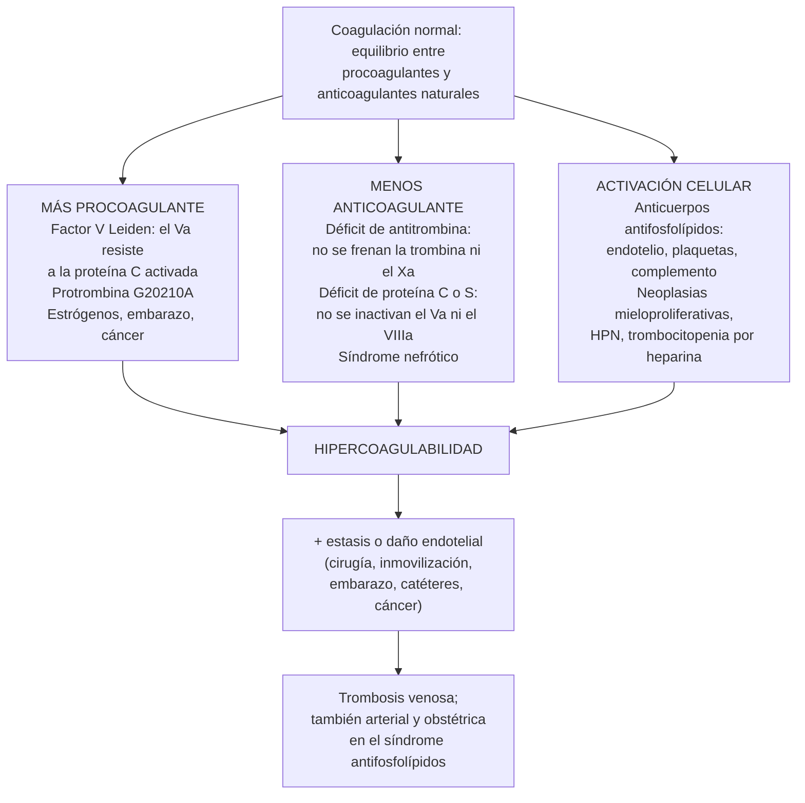

---
tags:
  - Hemato-oncología
---

# Trombofilias hereditarias y adquiridas

**Subespecialidad**
Hematología · Medicina interna · Ginecología y obstetricia · Reumatología (síndrome antifosfolípidos)

**Guías principales**
ASH 2023: estudio de trombofilia en el tromboembolismo venoso · ASH 2018: tromboembolismo venoso en el embarazo · ASH 2020 y CHEST 2021: tratamiento del tromboembolismo venoso · ACR/EULAR 2023: criterios del síndrome antifosfolípidos · EULAR 2019: tratamiento del síndrome antifosfolípidos

**Otras fuentes**
TRAPS (rivaroxabán frente a warfarina en el síndrome antifosfolípidos, 2018) · Factores protrombóticos en pacientes chilenos con trombosis venosa (Guzmán y Salazar 2010)

**GES**
No

**EUNACOM**
1.08.1.019 Trombofilias (sospecha, inicial, derivar)

**Revisado**
Octubre 2026

!!! abstract "Resumen en 60 segundos"
    - **Trombofilia**: alteración **hereditaria o adquirida** que aumenta el riesgo de **trombosis**, sobre todo **venosa**.
        - **Hereditarias**: **factor V Leiden** y **mutación de la protrombina G20210A** (frecuentes, riesgo **bajo**); **déficit de antitrombina, proteína C o proteína S** (raros, riesgo **alto**).
        - **Adquiridas**: **síndrome antifosfolípidos** (la más importante), cáncer, neoplasias mieloproliferativas, HPN, síndrome nefrótico, estrógenos, embarazo.
    - La mayoría de las trombosis **no se explica** por una trombofilia, y encontrar una **rara vez cambia** el tratamiento: el estudio **no es de rutina**.
    - **Estudiar solo si cambia la conducta** (ASH 2023):
        - **Sí**: TEV provocado por un factor **transitorio no quirúrgico**, por el **embarazo o el posparto** o por **anticonceptivos**; trombosis **cerebral o esplácnica** (si se pensaba suspender el anticoagulante); familiares de un paciente con **déficit de antitrombina, proteína C o S**.
        - **No**: TEV **no provocado** (se anticoagula indefinidamente igual), TEV **posquirúrgico**, ni **antes de indicar anticonceptivos** en la población general.
    - **Cuándo**: las pruebas **funcionales** (antitrombina, proteínas C y S, anticoagulante lúpico) se alteran en la **trombosis aguda** y con los **anticoagulantes**. Las **genéticas** se pueden pedir en cualquier momento. **No pedir MTHFR**.
    - **Tratamiento**: la trombosis se trata igual que en cualquier paciente. **Excepción**: en el **síndrome antifosfolípidos** se usa **warfarina** (no los anticoagulantes orales directos).
    - **Mujeres con trombofilia de alto riesgo o SAF**: **evitar los estrógenos** y usar **profilaxis con heparina** en el embarazo y el posparto según el riesgo.

## Definición

- **Trombofilia**: tendencia **aumentada a la trombosis** por una alteración **hereditaria** o **adquirida** de la coagulación.
- **Trombofilias hereditarias**:
    - **Por ganancia de función** (más procoagulante): **factor V Leiden** (resistencia a la proteína C activada) y **mutación G20210A de la protrombina** (más protrombina).
    - **Por pérdida de función** (menos anticoagulantes naturales): déficit de **antitrombina**, **proteína C** y **proteína S**.
- **Trombofilias adquiridas**: el **síndrome antifosfolípidos (SAF)** y los **estados protrombóticos** (cáncer, neoplasias mieloproliferativas, hemoglobinuria paroxística nocturna, síndrome nefrótico, trombocitopenia inducida por heparina, estrógenos, embarazo, inflamación).
- **Síndrome antifosfolípidos** (ACR/EULAR 2023): **trombosis** (venosa, arterial o microvascular) o **morbilidad obstétrica** + **anticuerpos antifosfolípidos persistentes** (positivos en **2 ocasiones** separadas por **≥ 12 semanas**): **anticoagulante lúpico**, **anticardiolipinas** o **anti-β2-glicoproteína I**. Ver [LES y SAF](../reumatologia/lupus-y-otras-mesenquimopatias.md).
- **TEV provocado**: asociado a un factor de riesgo **transitorio** (cirugía, trauma, inmovilización, embarazo, estrógenos). **No provocado**: sin factor identificable.

### Trombofilias hereditarias

| Trombofilia | Herencia y frecuencia | Prevalencia entre los pacientes con TEV (ASH 2023, mediana) | Riesgo de recurrencia frente a sin trombofilia (RR) | Riesgo de trombosis |
|---|---|---|---|---|
| **Factor V Leiden heterocigoto** | Autosómica dominante; **3–7 %** de las personas de ascendencia europea; **raro** en Asia, África y los pueblos originarios americanos | **17,5 %** | 1,36 | **Bajo** |
| **Factor V Leiden homocigoto** | Raro | 1,5 % | 2,10 | **Alto** |
| **Protrombina G20210A heterocigota** | ~ 1–3 % de las personas de ascendencia europea | **6,1 %** | 1,34 | **Bajo** |
| **Déficit de antitrombina** | Raro (~ 0,02–0,2 %) | 2,2 % | 2,07 | **El más alto** |
| **Déficit de proteína C** | Raro (~ 0,2–0,5 %) | 2,5 % | 2,13 | **Alto** |
| **Déficit de proteína S** | Raro | 2,3 % | 1,30 | **Alto** |
| **Anticuerpos antifosfolípidos** (adquirido) | — | 9,7 % | 1,92 | **Alto** (sobre todo triple positivo) |
| **Cualquier trombofilia** | — | **38 %** | **1,65** | — |

## Epidemiología

### Mundial

- **Tromboembolismo venoso (TEV)**: ~ **1–2 por 1000** adultos al año; aumenta mucho con la edad (ver [TEP](../respiratorio/tromboembolismo-pulmonar.md)).
- Entre los pacientes con TEV, **~ 1 de cada 3** tiene alguna trombofilia (ASH 2023: mediana **38 %**). La mayoría son **de bajo riesgo** (factor V Leiden y protrombina heterocigotos).
- La frecuencia de las trombofilias **varía según el origen étnico**: el **factor V Leiden** y la mutación de la **protrombina** son frecuentes en personas de **ascendencia europea** y casi inexistentes en poblaciones **asiáticas, africanas e indígenas americanas**.
- **Riesgo absoluto**: aun con una trombofilia hereditaria, la mayoría de los portadores **nunca** tendrá una trombosis. El riesgo aparece al sumarse **otros factores** (estrógenos, embarazo, cirugía, inmovilización, cáncer, edad).

### Chile

!!! chile "Datos nacionales"
    - **Estudio en el sur de Chile** (Temuco; Guzmán y Salazar 2010): **87 pacientes** con trombosis venosa profunda confirmada y **174 controles**.
        - **No se encontró el factor V Leiden** (variante *F5* G1691A) en ningún participante.
        - Los defectos más frecuentes fueron la **resistencia a la proteína C activada** (sin factor V Leiden), la **hiperhomocisteinemia** y el **factor VIII elevado**.
        - El polimorfismo ***MTHFR* C677T** se asoció a la trombosis en esta serie, aunque las guías internacionales **no** recomiendan pedirlo.
    - Implicancia: por la **ascendencia mestiza e indígena** de gran parte de la población chilena, el **factor V Leiden** y la mutación de la protrombina son **menos frecuentes** que en Europa; un panel "estándar" tiene aún menos rendimiento.
    - El estudio de trombofilia y los anticoagulantes **no tienen cobertura GES específica**; el TEP y la TVP se manejan en la red asistencial general.

## Etiología y factores de riesgo

| Grupo | Causas |
|---|---|
| **Hereditarias** | Factor V Leiden, protrombina G20210A, déficit de antitrombina, proteína C y proteína S; disfibrinogenemias (raras) |
| **Síndrome antifosfolípidos** | Primario o **asociado a LES** |
| **Neoplasias** | **Cáncer** (páncreas, estómago, pulmón, cerebro, ovario, linfomas); **neoplasias mieloproliferativas** (*JAK2*; ver [mieloproliferativas](neoplasias-mieloproliferativas.md)); **HPN** (ver [aplasia](mielodisplasia-y-aplasia-medular.md)) |
| **Hormonales** | **Anticonceptivos combinados** (estrógenos), **terapia hormonal** de la menopausia, **embarazo** y **posparto**, tamoxifeno, testosterona |
| **Renales e inflamatorias** | **Síndrome nefrótico** (pérdida de antitrombina), **enfermedad inflamatoria intestinal**, infecciones (COVID-19), vasculitis (Behçet) |
| **Inducidas por fármacos** | **Trombocitopenia inducida por heparina** (ver [trombocitopenias](trombocitopenias.md)), asparaginasa, talidomida y lenalidomida |
| **Otras** | **Factor VIII elevado**, hiperhomocisteinemia (riesgo débil; dar vitaminas no previene trombosis), obesidad, edad, inmovilización, cirugía, catéteres venosos |

## Fisiopatología

- **Tríada de Virchow**: **estasis**, **daño endotelial** e **hipercoagulabilidad**. Las trombofilias aportan la **hipercoagulabilidad**; la trombosis aparece casi siempre cuando se **suma** otro factor.
- **Anticoagulantes naturales**:
    - **Antitrombina**: inhibe la **trombina** y el **factor Xa**; la **heparina** la potencia unas 1000 veces. Su déficit produce **resistencia a la heparina**.
    - **Proteína C**: la trombina unida a la **trombomodulina** del endotelio la activa; con su cofactor, la **proteína S**, **inactiva los factores Va y VIIIa**.
        - La proteína C tiene una **vida media corta**: al iniciar la **warfarina** sin heparina, cae antes que los factores procoagulantes, lo que causa un estado protrombótico transitorio (**necrosis cutánea por warfarina**, sobre todo en el déficit de proteína C).
- **Factor V Leiden**: una mutación (Arg506Gln) hace que el factor Va **no pueda ser inactivado** por la proteína C activada (**resistencia a la proteína C activada**).
- **Protrombina G20210A**: aumenta la **cantidad** de protrombina en el plasma.
- **Síndrome antifosfolípidos**: los anticuerpos contra la **β2-glicoproteína I** activan el **endotelio**, las **plaquetas**, los monocitos y el **complemento**; producen trombosis **venosas y arteriales** y daño **placentario**.
- **Estrógenos**: aumentan los factores procoagulantes y reducen la proteína S y la antitrombina; **multiplican** el riesgo de una trombofilia hereditaria.

*Figura 1. Mecanismos de las trombofilias: más procoagulantes, menos anticoagulantes naturales o activación celular, que se suman a otros factores de riesgo. Esquema propio basado en ASH 2023 y EULAR 2019.*

## Clasificación

| Según el riesgo de trombosis | Ejemplos |
|---|---|
| **Bajo** | Factor V Leiden **heterocigoto**; protrombina G20210A **heterocigota** |
| **Alto** | Déficit de **antitrombina**, **proteína C** o **proteína S**; factor V Leiden o protrombina **homocigotos**; **dobles heterocigotos** (factor V Leiden + protrombina) |
| **Muy alto** | **Síndrome antifosfolípidos triple positivo** (anticoagulante lúpico + anticardiolipinas + anti-β2-glicoproteína I) o con trombosis **arterial** |

## Clínica

- **Lo más frecuente**: **TVP** de las piernas y **TEP**.
- **Claves que sugieren una trombofilia**:
    - TEV a una **edad joven** (< 45–50 años), en especial con un factor provocador **menor**;
    - **TEV recurrente**;
    - trombosis en **sitios inusuales**: **senos venosos cerebrales**, **venas esplácnicas** (porta, mesentéricas, suprahepáticas), venas de las extremidades superiores sin catéter;
    - **antecedente familiar** fuerte de TEV en familiares de primer grado;
    - TEV con **anticonceptivos**, en el **embarazo** o el **posparto**;
    - **necrosis cutánea** al iniciar la **warfarina** (déficit de proteína C);
    - **resistencia a la heparina** (déficit de antitrombina);
    - **púrpura fulminante neonatal** (déficit homocigoto de proteína C).
- **Claves del síndrome antifosfolípidos**:
    - trombosis **arterial** en un **joven** (ACV, IAM);
    - **abortos recurrentes** o **muertes fetales**, preeclampsia grave o insuficiencia placentaria;
    - **livedo racemosa**, **trombocitopenia**, valvulopatía (Libman-Sacks), nefropatía;
    - **TTPA prolongado** que **no corrige** con plasma normal;
    - **LES** u otra enfermedad autoinmune.
- **Las trombofilias hereditarias no causan trombosis arteriales** de forma relevante; ante una trombosis arterial en un joven, buscar un **SAF**, una cardiopatía embólica, una disección o tóxicos.

!!! alarma "Signos de alarma"
    - **Trombosis de los senos venosos cerebrales**: cefalea intensa y progresiva, convulsiones, déficit focal, hipertensión endocraneana.
    - **Trombosis esplácnica**: dolor abdominal, ascitis, hemorragia digestiva (Budd-Chiari, trombosis portal o mesentérica con isquemia intestinal).
    - **Síndrome antifosfolípidos catastrófico**: trombosis en **≥ 3 órganos** en < 1 semana (riñón, pulmón, cerebro, piel), con mortalidad alta: UCI, anticoagulación, corticoides, recambio plasmático o inmunoglobulina.
    - **Necrosis cutánea** al iniciar la warfarina.
    - **TEP** con inestabilidad hemodinámica (ver [TEP](../respiratorio/tromboembolismo-pulmonar.md)).

## Diagnóstico

- **Primero, buscar la causa de la trombosis** (aunque no se estudie una trombofilia):
    - ¿Provocada (cirugía, trauma, inmovilización, estrógenos, embarazo)?
    - **Cáncer**: historia, examen, hemograma, pruebas hepáticas, radiografía de tórax y el **tamizaje según la edad** (no se recomienda una búsqueda extensa con TC en todos).
    - **Hemograma**: policitemia o trombocitosis (NMP), trombocitopenia (TIH, SAF, HPN), hemólisis (HPN).
    - **Orina**: proteinuria (síndrome nefrótico).
- **¿Estudiar una trombofilia?** Solo si el resultado **cambiará la conducta** (figura 2).

!!! guia "Estudio de trombofilia (ASH 2023)"
    - **Se sugiere estudiar** (y anticoagular indefinidamente si se encuentra una trombofilia):
        - TEV provocado por un factor de riesgo **transitorio mayor no quirúrgico**;
        - TEV asociado al **embarazo o el posparto**;
        - TEV asociado a **anticonceptivos combinados**;
        - trombosis de **senos venosos cerebrales** o **esplácnica**, en los lugares donde de otro modo se **suspendería** la anticoagulación a los 3–6 meses.
    - **Se sugiere estudiar** a los familiares de un paciente con **déficit de antitrombina, proteína C o proteína S** (para decidir la profilaxis ante riesgos menores y evitar los estrógenos), y a las **embarazadas** con familiares con una trombofilia de **alto riesgo**.
    - **Se sugiere no estudiar**: TEV **no provocado**, TEV **posquirúrgico**, TEV no especificado, y los familiares de pacientes con **factor V Leiden o protrombina heterocigotos** o con trombofilia **desconocida**.
    - **Se recomienda no estudiar** (recomendación **fuerte**) a las mujeres de la **población general** antes de indicar **anticonceptivos combinados**.

<figure markdown>
![Esquema de dos columnas titulado a quién estudiar por trombofilia según ASH 2023; estudiar solo si el resultado cambia la conducta: duración de la anticoagulación, profilaxis o uso de estrógenos. Columna verde, se sugiere estudiar: tromboembolismo venoso provocado por un factor transitorio mayor no quirúrgico, como inmovilización o trauma; asociado al embarazo, al posparto o a los anticonceptivos combinados; trombosis de senos venosos cerebrales o esplácnica si de otro modo se suspendería el anticoagulante; familiar con déficit de antitrombina, proteína C o S, antes de estrógenos o ante un riesgo menor; embarazada o que planea un embarazo con un familiar con trombofilia de alto riesgo. Columna roja, no se sugiere estudiar: tromboembolismo venoso no provocado, porque se anticoagula de forma indefinida igual; provocado por una cirugía, con riesgo de recurrencia bajo; antes de indicar anticonceptivos combinados en la población general, recomendación fuerte; familiar con factor V Leiden o mutación de la protrombina heterocigotos; familiar con tromboembolismo pero sin trombofilia conocida. Abajo, si se estudia, qué y cuándo: factor V Leiden y mutación de la protrombina, que son genéticos y se pueden pedir en cualquier momento; antitrombina, proteína C y proteína S, que son funcionales; anticuerpos antifosfolípidos, anticoagulante lúpico, anticardiolipinas y anti beta 2 glicoproteína I, repetidos a las 12 semanas. Las pruebas funcionales se alteran en la trombosis aguda y con los anticoagulantes: la heparina baja la antitrombina, el TACO baja las proteínas C y S y los anticoagulantes orales directos alteran el anticoagulante lúpico; idealmente medirlas después de suspender el tratamiento. No pedir MTHFR](../assets/figuras/trombofilias/cuando-estudiar-trombofilia.svg){ loading=lazy }
<figcaption>Figura 2. A quién estudiar por trombofilia y cómo interpretar los exámenes. Esquema propio basado en las recomendaciones de ASH 2023.</figcaption>
</figure>

## Laboratorio

| Examen | Qué detecta | Interferencias y momento |
|---|---|---|
| **Factor V Leiden** (PCR) o resistencia a la proteína C activada | Mutación del factor V | **Genético**: no se altera con la trombosis ni los anticoagulantes |
| **Protrombina G20210A** (PCR) | Mutación de la protrombina | **Genético**: en cualquier momento |
| **Antitrombina** (actividad) | Déficit de antitrombina | **Baja** en la trombosis aguda, con **heparina**, en el síndrome nefrótico, la hepatopatía y la CID |
| **Proteína C** (actividad) | Déficit de proteína C | **Baja** con **warfarina** (TACO), en la hepatopatía, la CID y el déficit de vitamina K |
| **Proteína S libre** | Déficit de proteína S | **Baja** con **warfarina**, en el **embarazo**, con **estrógenos**, en la inflamación aguda |
| **Anticoagulante lúpico** | SAF | Falsos positivos con **heparina**, **TACO** y **anticoagulantes orales directos**; también en la fase aguda |
| **Anticardiolipinas** y **anti-β2-glicoproteína I** (IgG, IgM) | SAF | No se alteran con los anticoagulantes; títulos **moderados o altos** (> 40 unidades) |
| **Hemograma**, orina, pruebas hepáticas | Causas adquiridas (NMP, HPN, síndrome nefrótico) | — |

- **Momento ideal** para las pruebas funcionales: **después** de terminar el tratamiento inicial (3–6 meses) y con el anticoagulante **suspendido** (≥ 2 semanas para la warfarina; ≥ 48 horas para los anticoagulantes orales directos), si es seguro.
- **Un resultado bajo aislado** de antitrombina, proteína C o S **debe repetirse** antes de rotular un déficit.
- **Anticuerpos antifosfolípidos**: deben ser **persistentes** (repetir a las **≥ 12 semanas**).
- **No pedir**: **MTHFR**, homocisteína como "trombofilia", PAI-1 ni otros polimorfismos: no cambian el manejo.

## Imágenes

- **Ecografía Doppler venosa** de compresión: diagnóstico de la **TVP**.
- **Angio-TC de tórax**: **TEP**.
- **Angio-RM o venografía por TC cerebral**: trombosis de los **senos venosos**.
- **Ecografía Doppler abdominal** o **angio-TC**: trombosis **portal, mesentérica o suprahepática**.
- **Ecocardiograma**: en el SAF con trombosis arterial (valvulopatía de Libman-Sacks) y en el ACV del joven (foramen oval permeable).

## Diagnóstico diferencial

| Situación | Pensar en |
|---|---|
| **TEV no provocado en un adulto mayor** | **Cáncer oculto** (tamizaje según la edad), neoplasia mieloproliferativa |
| **Trombosis + trombocitopenia** | **TIH** (heparina 5–10 días antes), **SAF**, **HPN**, **CID** (cáncer), microangiopatía trombótica, trombocitopenia trombótica inducida por vacuna |
| **Trombosis esplácnica o cerebral** | **Neoplasia mieloproliferativa** (*JAK2*), **HPN**, SAF, anticonceptivos, cirrosis, infecciones locales |
| **Trombosis arterial en un joven** | **SAF**, cardioembolia (foramen oval permeable, endocarditis), disección, cocaína, vasculitis |
| **TVP de una extremidad superior sin catéter** | **Síndrome del opérculo torácico** (Paget-Schroetter), cáncer |
| **TVP ilíaca izquierda en una mujer joven** | **Síndrome de May-Thurner** (compresión de la vena ilíaca izquierda) |
| **Trombosis + proteinuria** | **Síndrome nefrótico** (nefropatía membranosa) |

## Tratamiento

### Lo que hace el interno

- **Tratar la trombosis** como en cualquier paciente (ver [TEP](../respiratorio/tromboembolismo-pulmonar.md)): **heparina de bajo peso molecular** o un **anticoagulante oral directo**.
- **No pedir el "panel de trombofilia"** en la fase aguda ni con anticoagulantes, salvo los estudios **genéticos** o los **anticuerpos antifosfolípidos** (anticardiolipinas y anti-β2-glicoproteína I) si se sospecha un SAF.
- **Suspender los estrógenos** si la trombosis se asoció a ellos.
- **Derivar** a hematología si se sospecha un SAF, una trombofilia de alto riesgo, una trombosis en un sitio inusual o recurrente.

### Duración de la anticoagulación

- La decide sobre todo el **tipo de TEV**, **no** la trombofilia:
    - **Provocado por un factor transitorio mayor** (cirugía): **3 meses**.
    - **No provocado** o con un factor de riesgo **persistente** (cáncer activo, SAF): **indefinida** si el riesgo de sangrado lo permite (ASH 2020; CHEST 2021).
- Según ASH 2023, el hallazgo de una trombofilia **sí cambia** la duración (de 3–6 meses a **indefinida**) en el TEV provocado por un factor **no quirúrgico**, el **embarazo**, los **anticonceptivos** y en las trombosis **cerebrales o esplácnicas**.
- Con anticoagulación **indefinida**, la recurrencia de TEV baja mucho (RR **0,15**), pero el **sangrado mayor** aumenta (RR **2,17**): hay que reevaluar el balance cada año.

### Situaciones especiales

| Situación | Conducta |
|---|---|
| **Síndrome antifosfolípidos con trombosis** (EULAR 2019) | **Warfarina** con **INR 2–3** de forma **indefinida**. **Evitar los anticoagulantes orales directos** en el SAF **triple positivo** (TRAPS: más trombosis **arteriales** con rivaroxabán que con warfarina) y en el SAF con trombosis arterial |
| **SAF obstétrico** | **Aspirina en dosis baja + heparina de bajo peso molecular** durante el embarazo; la warfarina es **teratogénica** |
| **Déficit de antitrombina** | **Resistencia a la heparina** no fraccionada; se puede usar HBPM (con anti-Xa), un anticoagulante oral directo o **concentrado de antitrombina** en cirugías o el parto |
| **Déficit de proteína C** | Iniciar la **warfarina** con **heparina superpuesta** (≥ 5 días y hasta INR en rango), en **dosis bajas**, para evitar la **necrosis cutánea** |
| **Anticoncepción** | En el SAF y las trombofilias de **alto riesgo**: **evitar los estrógenos** (anticonceptivos combinados y terapia hormonal); preferir **DIU de cobre** o **de levonorgestrel** u otros métodos solo con progestina |
| **Embarazo** (ASH 2018) | La **profilaxis con HBPM** antes o después del parto depende del **tipo de trombofilia** y de los antecedentes **personales y familiares**; las de **alto riesgo** con antecedentes la requieren en el **anteparto y el posparto** |
| **Familiares asintomáticos** | Estudiar solo si en la familia hay un déficit de **antitrombina, proteína C o S**; si son portadores: **profilaxis** ante situaciones de riesgo y **evitar los estrógenos** |
| **Situaciones de riesgo** (cirugía, inmovilización, viajes largos) en portadores | Profilaxis según el riesgo de la situación y de la trombofilia |

!!! dosis "Dosis de referencia (adulto)"
    - **Enoxaparina**:
        - **tratamiento**: **1 mg/kg SC cada 12 horas** (o 1,5 mg/kg/día);
        - **profilaxis**: **40 mg SC al día** (ajustar en la insuficiencia renal y en la obesidad).
    - **Warfarina** (o acenocumarol): ajustar a un **INR 2–3**; superponer con heparina por **≥ 5 días** y hasta 2 INR en rango con 24 horas de diferencia.
    - **Rivaroxabán**: **15 mg cada 12 horas** por 21 días y luego **20 mg/día** con comida (fase extendida: 10–20 mg/día).
    - **Apixabán**: **10 mg cada 12 horas** por 7 días y luego **5 mg cada 12 horas** (fase extendida: 2,5–5 mg cada 12 horas).
    - **Aspirina** (SAF obstétrico): **100 mg/día**.
    - Los **anticoagulantes orales directos** están **contraindicados** en el **embarazo** y la **lactancia**, y **no se recomiendan** en el **SAF triple positivo**.

## Complicaciones

| Complicación | Claves |
|---|---|
| **TEV recurrente** | Más en las trombofilias de alto riesgo y el SAF; al suspender el anticoagulante |
| **Síndrome postrombótico** | Dolor, edema, várices y úlceras en la pierna tras una TVP |
| **Hipertensión pulmonar tromboembólica crónica** | Disnea persistente meses después de un TEP |
| **Sangrado** por la anticoagulación | El principal costo de anticoagular de forma indefinida |
| **Complicaciones obstétricas** | Abortos, muerte fetal, preeclampsia y restricción del crecimiento (SAF) |
| **Necrosis cutánea por warfarina** | Déficit de proteína C o S |
| **SAF catastrófico** | Falla multiorgánica por microtrombosis |
| **Consecuencias del rótulo** | Ansiedad, costos de seguros y estudios innecesarios en familiares |

## Pronóstico y seguimiento

- La mayoría de los portadores de una trombofilia hereditaria **no tendrá nunca** una trombosis; el riesgo es **condicional** a otros factores.
- Las trombofilias de **bajo riesgo** casi **no aumentan** la recurrencia (RR ~ 1,3); las de **alto riesgo** y el **SAF** la aumentan alrededor del **doble**.
- **SAF**: alto riesgo de recurrencia, sobre todo **triple positivo**; requiere anticoagulación indefinida y control del INR.
- **Seguimiento**:
    - **Reevaluar cada año** el balance entre el riesgo de recurrencia y de sangrado si está con anticoagulación indefinida.
    - **Asesoría** antes de un **embarazo**, sobre **anticoncepción** y ante cirugías.
    - **Evitar factores de riesgo** modificables: tabaco, obesidad, inmovilidad.

## Perlas para el internado

!!! perla "Para recordar en la sala"
    - **No pidas un "panel de trombofilia" a todos**: pregunta primero **qué harás con el resultado**.
    - **TEV no provocado**: no estudiar trombofilia (se anticoagula indefinidamente igual); sí pensar en un **cáncer** y hacer el tamizaje según la edad.
    - **Nunca** estudiar la antitrombina, la proteína C o la S **en la trombosis aguda** ni con **anticoagulantes**: salen falsamente bajas.
    - **Proteína S baja en el embarazo o con anticonceptivos**: es esperable, **no** es un déficit.
    - **Necrosis de la piel al iniciar la warfarina**: déficit de **proteína C**; por eso se superpone la **heparina**.
    - **Necesita dosis altísimas de heparina no fraccionada sin lograr el TTPA**: pensar en un déficit de **antitrombina**.
    - **Trombosis + abortos recurrentes + TTPA prolongado + trombocitopenia**: **síndrome antifosfolípidos**. Tratar con **warfarina**, no con anticoagulantes orales directos.
    - **MTHFR**: no se pide; no es una trombofilia clínicamente útil.
    - **Trombosis de la porta o de las suprahepáticas**: pedir ***JAK2* V617F** y citometría para **HPN**.
    - **Mujer con trombofilia de alto riesgo o SAF**: **sin estrógenos**; anticoncepción con DIU o progestinas.

## Preguntas de repaso

??? repaso "1. Mujer de 24 años que usa anticonceptivos orales combinados desde hace 6 meses y consulta por una TVP femoral izquierda. No tiene otros factores de riesgo. ¿Se estudia una trombofilia y cómo se maneja?"
    - **TEV asociado a anticonceptivos combinados**: ASH 2023 **sugiere estudiar** una trombofilia, porque el resultado puede cambiar la duración del tratamiento (**indefinida** si se encuentra una).
    - **Manejo**:
        - **Anticoagulación** (HBPM o anticoagulante oral directo) por al menos **3 meses**.
        - **Suspender los estrógenos** de forma definitiva.
        - **Anticoncepción** sin estrógenos (DIU de cobre o de levonorgestrel), porque los anticoagulantes orales directos son teratogénicos.
    - **Estudio**: factor V Leiden y protrombina (genéticos, en cualquier momento); antitrombina, proteínas C y S, y anticoagulante lúpico **después** de la fase aguda y sin anticoagulante; anticardiolipinas y anti-β2-glicoproteína I.

??? repaso "2. Hombre de 56 años con un TEP no provocado, ya estable, que se anticoagulará de forma indefinida. El residente pide un \"panel de trombofilia completo\". ¿Es útil?"
    - **No** (ASH 2023: se sugiere **no estudiar** en el TEV **no provocado**): el paciente se anticoagulará indefinidamente **igual**, y el resultado no cambia la conducta.
    - Además, en la fase aguda y con anticoagulantes, las pruebas funcionales **salen alteradas**.
    - **Sí corresponde**: historia y examen dirigidos, hemograma, pruebas hepáticas, radiografía de tórax y el **tamizaje de cáncer según la edad**. Considerar un **SAF** si hay pistas (porque cambiaría el anticoagulante a warfarina).

??? repaso "3. Mujer de 29 años cuyo hermano tuvo un TEP a los 31 años y tiene un déficit de antitrombina confirmado. Ella quiere iniciar anticonceptivos orales combinados. ¿Qué hace?"
    - ASH 2023 **sugiere estudiar** la trombofilia **conocida en la familia** (antitrombina) en este caso.
    - **Si tiene el déficit**:
        - **Evitar los anticonceptivos combinados** y la terapia hormonal con estrógenos; usar DIU de cobre o de levonorgestrel u otro método con progestina.
        - **Tromboprofilaxis** ante situaciones de riesgo (cirugía, inmovilización, posparto) y planificar un eventual **embarazo** con hematología (profilaxis con HBPM).
    - **Si no lo tiene**: puede usar anticonceptivos combinados con el riesgo de la población general.

??? repaso "4. Mujer de 34 años con 3 abortos espontáneos antes de las 10 semanas y una TVP hace 1 mes. El TTPA está prolongado y no corrige con plasma normal; plaquetas 110 000/µL. ¿Qué sospecha, cómo lo confirma y cómo la trata?"
    - **Síndrome antifosfolípidos** (trombosis venosa + morbilidad obstétrica + TTPA prolongado por el anticoagulante lúpico + trombocitopenia).
    - **Confirmación**: **anticoagulante lúpico**, **anticardiolipinas** y **anti-β2-glicoproteína I**, positivos en **2 ocasiones** separadas por **≥ 12 semanas** (criterios ACR/EULAR 2023). Buscar un **LES** (ANA, anti-DNA, complemento).
    - **Tratamiento**:
        - **Warfarina** con **INR 2–3** de forma **indefinida** (no anticoagulantes orales directos, sobre todo si es triple positiva).
        - **Embarazo**: cambiar a **HBPM en dosis terapéuticas + aspirina 100 mg/día** antes de las 6 semanas de gestación (la warfarina es teratogénica).
        - **Sin estrógenos**.

??? repaso "5. Hombre de 41 años con una TVP que inició warfarina sin heparina. Al cuarto día presenta placas dolorosas, violáceas y luego necróticas en los muslos y el abdomen. ¿Qué ocurrió y qué hace?"
    - **Necrosis cutánea por warfarina**: la **proteína C** (vida media corta) cae antes que los factores procoagulantes, y se produce una trombosis de la microcirculación de la piel; es típica del **déficit de proteína C** (o S).
    - **Manejo**:
        - **Suspender la warfarina** y dar **vitamina K**.
        - Anticoagular con **heparina** (HBPM o no fraccionada) o un anticoagulante oral directo.
        - **Concentrado de proteína C** o **plasma fresco congelado** en los casos graves.
        - Cuidado de las heridas (a veces cirugía).
    - **Después**: estudiar la **proteína C y la S** fuera de la fase aguda; si se reinicia la warfarina, hacerlo en **dosis bajas** y con **heparina superpuesta**.

??? repaso "6. Paciente con una TVP desde hace 3 días, en tratamiento con enoxaparina. Los exámenes muestran antitrombina 62 %, proteína C 58 % y proteína S libre 48 %. ¿Tiene una trombofilia?"
    - **No se puede afirmar**: en la **trombosis aguda** se **consumen** los anticoagulantes naturales, y la **heparina** baja la antitrombina. Los resultados no son interpretables.
    - **Conducta**:
        - No rotular al paciente como portador.
        - Si hay una indicación real de estudio (según ASH 2023), **repetir** las pruebas funcionales **después** del tratamiento inicial y **sin anticoagulante**.
        - Las pruebas **genéticas** (factor V Leiden, protrombina) y las **anticardiolipinas** y **anti-β2-glicoproteína I** sí son válidas en este momento.

## Referencias

1. Middeldorp S, Nieuwlaat R, Baumann Kreuziger L, et al. American Society of Hematology 2023 guidelines for management of venous thromboembolism: thrombophilia testing. *Blood Adv.* 2023;7(22):7101–7138. doi:[10.1182/bloodadvances.2023010177](https://doi.org/10.1182/bloodadvances.2023010177)
2. Bates SM, Rajasekhar A, Middeldorp S, et al. American Society of Hematology 2018 guidelines for management of venous thromboembolism: venous thromboembolism in the context of pregnancy. *Blood Adv.* 2018;2(22):3317–3359. doi:[10.1182/bloodadvances.2018024802](https://doi.org/10.1182/bloodadvances.2018024802)
3. Ortel TL, Neumann I, Ageno W, et al. American Society of Hematology 2020 guidelines for management of venous thromboembolism: treatment of deep vein thrombosis and pulmonary embolism. *Blood Adv.* 2020;4(19):4693–4738. doi:[10.1182/bloodadvances.2020001830](https://doi.org/10.1182/bloodadvances.2020001830)
4. Stevens SM, Woller SC, Baumann Kreuziger L, et al. Antithrombotic therapy for VTE disease: second update of the CHEST guideline and expert panel report. *Chest.* 2021;160(6):e545–e608. doi:[10.1016/j.chest.2021.07.055](https://doi.org/10.1016/j.chest.2021.07.055)
5. Barbhaiya M, Zuily S, Naden R, et al. 2023 ACR/EULAR antiphospholipid syndrome classification criteria. *Ann Rheum Dis.* 2023;82(10):1258–1270. doi:[10.1136/ard-2023-224609](https://doi.org/10.1136/ard-2023-224609)
6. Tektonidou MG, Andreoli L, Limper M, et al. EULAR recommendations for the management of antiphospholipid syndrome in adults. *Ann Rheum Dis.* 2019;78(10):1296–1304. doi:[10.1136/annrheumdis-2019-215213](https://doi.org/10.1136/annrheumdis-2019-215213)
7. Pengo V, Denas G, Zoppellaro G, et al. Rivaroxaban vs warfarin in high-risk patients with antiphospholipid syndrome. *Blood.* 2018;132(13):1365–1371. doi:[10.1182/blood-2018-04-848333](https://doi.org/10.1182/blood-2018-04-848333)
8. Guzmán N, Salazar LA. Frequency of prothrombotic risk factors in patients with deep venous thrombosis and controls: their implications for thrombophilia screening in Chilean subjects. *Genet Test Mol Biomarkers.* 2010;14(5):599–602. doi:[10.1089/gtmb.2010.0012](https://doi.org/10.1089/gtmb.2010.0012)
