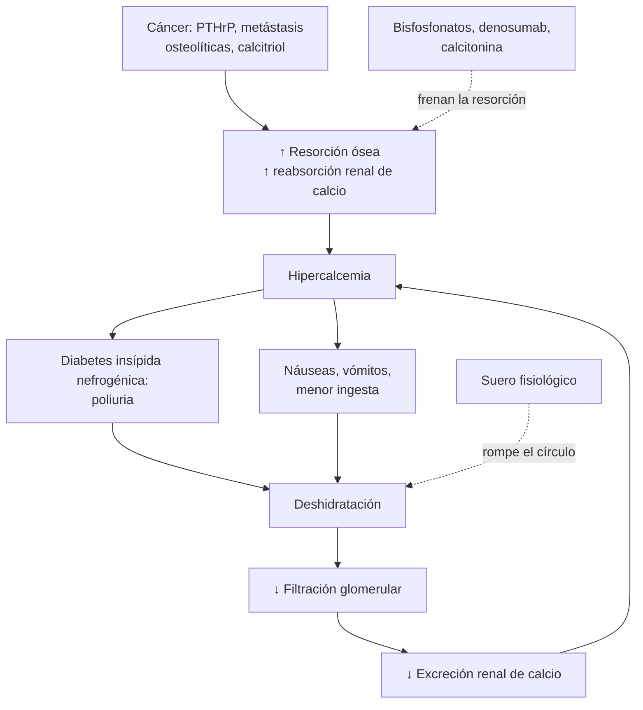

---
tags:
  - Hemato-oncología
  - Urgencia
  - Frecuente en sala
---

# Urgencias oncológicas: neutropenia febril, lisis tumoral, hipercalcemia, compresión medular y síndrome de vena cava superior

**Subespecialidad**
Hemato-oncología · Medicina de urgencia · Medicina interna

**Guías principales**
ASCO/IDSA 2018: manejo ambulatorio de la neutropenia febril · IDSA 2010: antimicrobianos en el paciente neutropénico con cáncer · ESMO 2016: neutropenia febril · Endocrine Society 2023: hipercalcemia maligna · NICE NG234 (2023): metástasis vertebrales y compresión medular

**Otras fuentes**
Clasificación de Cairo-Bishop (2004) para la lisis tumoral · Índice MASCC · Clasificación de Yu (2008) para el síndrome de vena cava superior · Ensayo de Patchell (2005)

**GES**
No como problema propio. Los cánceres que las producen suelen tener GES (leucemias, linfomas, cáncer de mama, pulmón, próstata, etc.), igual que el alivio del dolor y los cuidados paliativos por cáncer avanzado

**EUNACOM**
1.08.2.004 Hipercalcemia · 1.03.2.004 Hipercalcemia aguda · 1.08.2.005 Lisis tumoral aguda · 1.08.2.006 Neutropenia febril (específico, inicial, derivar) · 1.08.2.007 Síndrome de compresión medular · 1.08.2.008 Síndrome de vena cava superior (específico, inicial, derivar)

**Revisado**
Septiembre 2026

!!! abstract "Resumen en 60 segundos"
    - **Neutropenia febril**: fiebre **≥ 38,3 °C** (o ≥ 38 °C por 1 h) con **RAN < 500/mm³**.
        - Es una **emergencia**: **antibiótico de amplio espectro con cobertura de *Pseudomonas* en la primera hora** (cefepime, piperacilina-tazobactam o meropenem), tras tomar los hemocultivos.
        - Si el **MASCC es ≥ 21** (bajo riesgo), puede tratarse por vía oral y en forma ambulatoria.
    - **Síndrome de lisis tumoral**: **hiperuricemia, hiperkalemia, hiperfosfemia e hipocalcemia**, con **LRA**, tras iniciar la quimioterapia en tumores de alta carga (linfoma de Burkitt, leucemias agudas).
        - **Prevenirlo** con **hidratación abundante** y **alopurinol**, o **rasburicasa** si el riesgo es alto.
    - **Hipercalcemia maligna**: la **PTHrP** es la causa más frecuente. Da compromiso de conciencia, poliuria, deshidratación y constipación.
        - Tratamiento: **suero fisiológico**, luego **ácido zoledrónico 4 mg EV** o **denosumab**, y **calcitonina** si es grave.
    - **Compresión medular**: **dolor de espalda nuevo** en un paciente con cáncer.
        - Hacer una **RM de toda la columna** en las primeras **24 h**.
        - Dar **dexametasona 16 mg**, y luego radioterapia o cirugía. El pronóstico depende de la **capacidad de caminar** al diagnóstico.
    - **Síndrome de vena cava superior**: edema facial y de brazos, circulación colateral, disnea. Lo causan el cáncer pulmonar y el linfoma.
        - **Primero el diagnóstico histológico**, salvo compromiso de la vía aérea o edema cerebral (**stent** endovascular).

## Definición

| Urgencia | Definición |
|---|---|
| **Neutropenia febril** | **Fiebre** (una medición oral **≥ 38,3 °C**, o **≥ 38,0 °C** sostenida por 1 hora) + **recuento absoluto de neutrófilos (RAN) < 500/mm³**, o < 1.000/mm³ con descenso esperado a < 500 en 48 h. **Neutropenia profunda**: RAN < 100/mm³ |
| **Síndrome de lisis tumoral (SLT)** | **De laboratorio** (Cairo-Bishop): ≥ 2 de estas alteraciones, desde 3 días antes hasta 7 días después del tratamiento: **ácido úrico ≥ 8 mg/dL**, **potasio ≥ 6 mEq/L**, **fósforo ≥ 4,5 mg/dL**, **calcio ≤ 7 mg/dL** (o un cambio de 25 % respecto del basal). **Clínico**: el anterior + **creatinina ≥ 1,5 veces** el límite superior, **arritmia** o **convulsiones** |
| **Hipercalcemia maligna** | Calcio corregido > 10,5 mg/dL por un cáncer. **Leve** < 12, **moderada** 12–14, **grave > 14 mg/dL** (o sintomática) |
| **Compresión medular metastásica** | Compresión del saco dural y de la médula o la cola de caballo por una metástasis vertebral o epidural, con **dolor** y/o **déficit neurológico** |
| **Síndrome de vena cava superior (SVCS)** | Obstrucción del flujo de la vena cava superior, por compresión extrínseca, invasión tumoral o trombosis |

## Epidemiología

### Mundial

- **Neutropenia febril**:
    - Ocurre en **10–50 %** de los pacientes con tumores sólidos y en **> 80 %** con neoplasias hematológicas durante la quimioterapia.
    - Mortalidad de **~ 5 %** en los tumores sólidos y hasta **~ 10–20 %** con sepsis o alto riesgo.
    - Sólo en **20–30 %** de los episodios se identifica la infección.
- **Hipercalcemia**: afecta a hasta **~ 20–30 %** de los pacientes con cáncer avanzado (pulmón escamoso, mama, **mieloma**, riñón, cabeza y cuello, linfomas). Es un **marcador de mal pronóstico** (sobrevida media de semanas a pocos meses si no hay tratamiento eficaz del cáncer).
- **Compresión medular**: en **~ 3–5 %** de los pacientes con cáncer. La causan sobre todo el cáncer de **mama**, **pulmón** y **próstata** (~ 50 % entre los tres), el **mieloma**, el cáncer renal y los linfomas. En **~ 20 %** es la **primera manifestación** del cáncer.
- **SVCS**:
    - **60–85 %** de causa maligna: **cáncer pulmonar** (sobre todo de células pequeñas) y **linfoma no Hodgkin**.
    - El resto es benigno, con aumento de las **trombosis por catéteres** y marcapasos.
- **Síndrome de lisis tumoral**: frecuente en el **linfoma de Burkitt** y las **leucemias agudas** con recuento alto. Es raro en los tumores sólidos, pero posible en los muy quimiosensibles o voluminosos.

### Chile

!!! chile "Datos nacionales"
    - El **cáncer** es la **primera o segunda causa de muerte** en Chile, con cifras similares a las de las enfermedades circulatorias. En varias regiones ya es la primera causa (DEIS).
    - La **Ley Nacional del Cáncer** (Ley 21.258, 2020) y el **Plan Nacional de Cáncer 2018–2028** organizan la red oncológica.
    - Los protocolos de quimioterapia del sistema público se rigen por el **PANDA** (Programa Nacional de Drogas Antineoplásicas del Adulto).
    - Muchos de los cánceres que causan estas urgencias tienen **GES**: leucemias y linfomas en ≥ 15 años, mieloma múltiple, cáncer de mama, pulmón, próstata, riñón, colorrectal y gástrico. También lo tiene el **alivio del dolor y los cuidados paliativos**.
    - En la práctica, el interno ve estas urgencias en el **servicio de urgencia** y en la **sala de medicina**, muchas veces **antes** que el oncólogo.

## Etiología y factores de riesgo

| Urgencia | Factores de riesgo |
|---|---|
| **Neutropenia febril** | Quimioterapia mielotóxica (nadir a los **7–14 días**), neoplasia hematológica, edad > 65 años, neutropenia profunda o prolongada (> 7 días), mucositis, catéteres venosos centrales, EPOC, comorbilidades |
| **Lisis tumoral** | **Alta carga tumoral** y **alta tasa de proliferación**: **linfoma de Burkitt**, leucemia linfoblástica aguda, **leucemia mieloide aguda** con leucocitos > 100.000, **LDH alta**, tumor voluminoso (> 10 cm). Factores del paciente: **ERC**, deshidratación, oliguria, **ácido úrico basal alto**. Fármacos muy eficaces: **venetoclax**, anticuerpos anti-CD20, terapia CAR-T |
| **Hipercalcemia** | **PTHrP** (humoral, ~ **80 %**): carcinomas escamosos (pulmón, cabeza y cuello, esófago), mama, riñón, vejiga, ovario · **Osteolítica local** (~ 20 %): **mieloma**, mama metastásica · **Calcitriol**: **linfomas** (Hodgkin y no Hodgkin) · PTH ectópica: rara |
| **Compresión medular** | Metástasis óseas vertebrales (columna **torácica ~ 60–70 %**, lumbosacra 20–25 %, cervical 10–15 %) |
| **SVCS** | Cáncer pulmonar (**células pequeñas**), **linfoma** mediastínico, timoma, tumores germinales, metástasis (mama) · **Trombosis por catéter** o cables de marcapasos · Mediastinitis fibrosante (rara) |

## Fisiopatología

- **Neutropenia febril**: la quimioterapia destruye los precursores medulares y la **mucosa** (mucositis). Las bacterias de la **propia flora** (intestino, piel, catéteres) invaden sin encontrar la respuesta de los neutrófilos. Por eso la infección progresa **en horas** y los **signos inflamatorios** (pus, infiltrado, piuria) **pueden faltar**.
    - **Bacilos gramnegativos** (*E. coli*, *Klebsiella*, ***Pseudomonas***): más letales.
    - **Cocos grampositivos** (estafilococos coagulasa negativos, *S. aureus*, estreptococos): más frecuentes en los hemocultivos.
    - Si la neutropenia se prolonga: **hongos** (*Candida*, *Aspergillus*).
- **Lisis tumoral**: la destrucción masiva de células tumorales libera **potasio**, **fósforo** y **ácidos nucleicos**. Las purinas se degradan a **ácido úrico**. El ácido úrico y el **fosfato de calcio** precipitan en los túbulos y producen una **LRA**, y el calcio baja al precipitar con el fosfato.
- **Hipercalcemia**: la PTHrP activa la resorción ósea y la reabsorción renal de calcio. El calcio alto produce **diabetes insípida nefrogénica**: **poliuria**, **deshidratación**, caída de la filtración y más hipercalcemia (**círculo vicioso**). Por eso el primer tratamiento es el **volumen**.

*Figura 1. Círculo vicioso de la hipercalcemia maligna y dónde actúa el tratamiento. Esquema propio.*

- **Compresión medular**: la metástasis del cuerpo vertebral crece hacia el espacio epidural o produce el colapso vertebral. Comprime la médula: primero hay **edema vasogénico** (reversible, por eso sirven los corticoides) y luego **isquemia** e **infarto** medular (irreversible).
- **SVCS**: la obstrucción aumenta la presión venosa de la cabeza, el cuello y los brazos. Se desarrolla **circulación colateral** en semanas: por eso la instalación lenta se tolera mejor que la brusca (trombosis).

<figure markdown>
{ loading=lazy width="520" }
<figcaption>Figura 2. Patogenia de la lesión renal aguda en el síndrome de lisis tumoral: cristales de ácido úrico y de fosfato de calcio, y daño independiente de los cristales. Fuente: Lupușoru G, Ailincăi I, Frățilă G, et al. Tumor Lysis Syndrome: An Endless Challenge in Onco-Nephrology. <em>Biomedicines.</em> 2022;10:1012, figura 1. Licencia <a href="https://creativecommons.org/licenses/by/4.0/">CC BY 4.0</a>.</figcaption>
</figure>

## Clasificación

### Neutropenia febril: riesgo según el índice MASCC

| Característica | Puntos |
|---|---|
| **Carga de enfermedad**: sin síntomas o leves | **5** |
| Carga de enfermedad: síntomas moderados | 3 |
| **Sin hipotensión** (PAS > 90 mmHg) | **5** |
| **Sin EPOC** | 4 |
| **Tumor sólido**, o neoplasia hematológica sin infección fúngica previa | 4 |
| **Sin deshidratación** que requiera sueros EV | 3 |
| **Paciente ambulatorio** al inicio de la fiebre | 3 |
| **Edad < 60 años** | 2 |

- **MASCC ≥ 21**: **bajo riesgo** (complicaciones graves < 5 %). Se puede considerar el **tratamiento oral ambulatorio** si hay condiciones sociales y acceso rápido al hospital.
- **MASCC < 21**, o **alto riesgo clínico**: **hospitalizar** y dar **antibióticos EV**. Son de alto riesgo por clínica:
    - Neoplasia hematológica o trasplante.
    - Neutropenia profunda (< 100) o prolongada (> 7 días).
    - Inestabilidad hemodinámica.
    - Neumonía, mucositis grave o diarrea.
    - Infección de catéter.
    - Compromiso de conciencia.
    - Insuficiencia hepática o renal.

### Síndrome de vena cava superior: gravedad (Yu, 2008)

| Grado | Clínica |
|---|---|
| 0 | Asintomático (hallazgo en la imagen) |
| 1 | Leve: edema de cabeza y cuello, cianosis, plétora |
| 2 | Moderado: con alteración funcional (disfagia leve, tos, alteraciones visuales) |
| 3 | Grave: edema cerebral leve (cefalea, mareos) o laríngeo leve, síncope al agacharse |
| 4 | **Riesgo vital**: **edema cerebral** con compromiso de conciencia, **estridor** por edema laríngeo, compromiso hemodinámico |

## Clínica

| Urgencia | Síntomas y signos |
|---|---|
| **Neutropenia febril** | **Fiebre** (a veces el **único** signo). Buscar el foco en la **boca** (mucositis), la **piel**, el sitio del **catéter**, la **región perianal** (**sin tacto rectal**), el pulmón, el abdomen (enterocolitis neutropénica o tiflitis) y los senos paranasales. Vigilar la hipotensión y la taquipnea (sepsis) |
| **Lisis tumoral** | Náuseas, vómitos, letargia, **oliguria**, orina turbia. **Arritmias** (hiperkalemia). **Tetania**, calambres y **convulsiones** (hipocalcemia) |
| **Hipercalcemia** | "**Huesos, piedras, quejidos y gemidos**": dolor óseo, litiasis renal, **constipación**, náuseas, anorexia, pancreatitis, úlcera, **polidipsia y poliuria**, **deshidratación**, **debilidad**, **confusión**, somnolencia, coma. ECG: **QT corto**, bradiarritmias |
| **Compresión medular** | **Dolor de espalda** (**~ 95 %**, precede en semanas al déficit): localizado o radicular, **peor al acostarse**, con la tos o la maniobra de Valsalva, que despierta al paciente. Luego **debilidad** de las piernas, **nivel sensitivo**, **retención urinaria** y constipación (tardíos). Cola de caballo: anestesia en silla de montar, arreflexia |
| **SVCS** | **Edema facial** y cervical, **edema de los brazos**, **plétora** y cianosis facial, **ingurgitación yugular** sin pulso, **circulación colateral** en el tórax, **disnea**, tos, disfonía. **Empeora al acostarse o al agacharse**. Signo de Pemberton |

<figure markdown>
![Ilustración de la columna vertebral con la frecuencia de las metástasis y las manifestaciones de la compresión según el segmento. Columna cervical (10 a 15 %): tetraplejia, pérdida de sensibilidad y dolor, insuficiencia ventilatoria, shock neurogénico. Columna torácica (60 a 70 %): paraplejia, pérdida de sensibilidad, shock neurogénico sobre T4, incontinencia fecal y retención urinaria. Columna lumbosacra (20 a 25 %): paraparesia distal, pérdida de sensibilidad, incontinencia fecal y retención urinaria. Compromiso de múltiples segmentos en 17 a 30 %. Nota: no hay médula bajo L1-L2](../assets/figuras/oncologia/compresion-medular-niveles-esperanca-martins-2023.jpg){ loading=lazy width="520" }
<figcaption>Figura 3. Compresión medular metastásica: distribución por segmento y manifestaciones neurológicas. Bajo L1–L2 no hay médula, y los síntomas se deben a la compresión de las raíces (cola de caballo). Fuente: Esperança-Martins M, Roque D, Barroso T, et al. Multidisciplinary Approach to Spinal Metastases and Metastatic Spinal Cord Compression—A New Integrative Flowchart for Patient Management. <em>Cancers (Basel).</em> 2023;15:1796, figura 1. Licencia <a href="https://creativecommons.org/licenses/by/4.0/">CC BY 4.0</a>.</figcaption>
</figure>

!!! alarma "Signos de alarma"
    - **Paciente en quimioterapia con fiebre**: es una **neutropenia febril hasta demostrar lo contrario**. No esperar el hemograma para dar el antibiótico si la demora es > 1 hora.
    - **Dolor de espalda nuevo o distinto en un paciente con cáncer**: es una compresión medular hasta demostrar lo contrario. **No esperar el déficit motor**.
    - **Confusión o somnolencia en un paciente con cáncer**: medir el **calcio** (y el sodio y la glicemia).
    - **Estridor** o **compromiso de conciencia** en un SVCS: urgencia vital (vía aérea, stent).

## Diagnóstico

### Neutropenia febril

**Paso 1. Triage inmediato**: signos vitales, evaluación de la sepsis y cálculo del **MASCC**.

**Paso 2. Exámenes** (sin retrasar el antibiótico):

- **Hemograma con recuento diferencial**.
- **Dos sets de hemocultivos**: periférico y de cada lumen del **catéter central**, si lo tiene.
- Creatinina, electrolitos, pruebas hepáticas, lactato.
- **Orina completa y urocultivo**.
- Cultivos dirigidos según el foco.
- **Radiografía de tórax** si hay síntomas respiratorios.

**Paso 3. Antibiótico en la primera hora** (ver tratamiento).

**Paso 4. Si la fiebre persiste 4–7 días**:

- TC de tórax y de senos paranasales.
- **Galactomanano**.
- Evaluación por **infectología** (hongos).

### Lisis tumoral

- **Prevención**: en todo paciente que inicia la quimioterapia con riesgo intermedio o alto, medir **antes y cada 6–12 h** (en el alto riesgo): creatinina, **potasio**, **fósforo**, **calcio**, **ácido úrico** y LDH, y la **diuresis**.
- **ECG** si el potasio está alto.
- **SLT espontáneo**: en los linfomas agresivos y las leucemias, puede aparecer **antes** del tratamiento.

### Hipercalcemia

- **Calcio corregido** = calcio medido + 0,8 × (4 − albúmina en g/dL). También se puede medir el **calcio iónico**, más confiable.
- **PTH intacta**:
    - **Baja o suprimida** en la hipercalcemia maligna.
    - Una PTH **normal o alta** sugiere un **hiperparatiroidismo primario** (la causa más frecuente en los pacientes ambulatorios; puede coexistir con el cáncer).
- Según el caso:
    - **PTHrP** (alta en la humoral).
    - **1,25-(OH)₂ vitamina D** (alta en el linfoma).
    - **25-OH vitamina D**.
    - **Electroforesis de proteínas** e inmunofijación en la sospecha de **mieloma**.
- **Creatinina**, fósforo, magnesio y **ECG**.

### Compresión medular

- **RM de toda la columna** (con y sin gadolinio). Toda la columna, porque en el **17–30 %** hay varios niveles comprometidos.
- **Urgencia** (NICE NG234):
    - Con **síntomas neurológicos**: RM en las primeras **24 h**, idealmente de inmediato.
    - Con **dolor sugerente sin déficit**: RM en **menos de 1 semana**.
- **TC** si la RM está contraindicada (mielografía por TC).
- La radiografía es **insuficiente**: puede ser normal.
- Si no hay un cáncer conocido: estudio del tumor primario y **biopsia**.

### Síndrome de vena cava superior

- **TC de tórax con contraste**: confirma la obstrucción, su causa (masa o trombo) y la circulación colateral, y guía la biopsia.
- **Diagnóstico histológico** antes de tratar, porque el tratamiento depende del tipo de tumor. Opciones:
    - Biopsia por broncoscopía, EBUS o mediastinoscopía.
    - Biopsia de un ganglio supraclavicular.
    - Citología de un derrame pleural.
    - Biopsia de médula ósea.

## Laboratorio

| Urgencia | Exámenes clave |
|---|---|
| **Neutropenia febril** | Hemograma con RAN, **hemocultivos × 2** (periférico y del catéter), orina completa y urocultivo, creatinina, electrolitos, pruebas hepáticas, **lactato**, PCR y procalcitonina (apoyo) |
| **Lisis tumoral** | **K, P, Ca, ácido úrico, creatinina, LDH** cada 6–12 h; gases (acidosis); ECG |
| **Hipercalcemia** | **Calcio corregido o iónico**, **PTH**, PTHrP, 1,25-(OH)₂ vitamina D, fósforo, creatinina, electroforesis de proteínas; ECG (QT corto) |
| **Compresión medular** | Hemograma, calcio, creatinina (antes del gadolinio); antígeno prostático específico o electroforesis de proteínas si el primario es desconocido |
| **SVCS** | Hemograma, LDH (linfoma), β-hCG y alfa-fetoproteína (tumor germinal en el hombre joven), coagulación antes de los procedimientos |

## Imágenes

- **Neutropenia febril**:
    - **Radiografía de tórax**, que puede ser normal aunque haya neumonía por la falta de neutrófilos.
    - **TC de tórax** si la fiebre persiste (hongos: signo del halo).
    - **TC de abdomen** si hay dolor abdominal: **enterocolitis neutropénica** (engrosamiento del ciego).
- **Compresión medular**: **RM de toda la columna** (figura 3).
- **SVCS**: **TC de tórax con contraste**.
- **Hipercalcemia**: cintigrafía ósea o TC para buscar metástasis, según el caso.

## Diagnóstico diferencial

| Cuadro | Diferencial |
|---|---|
| **Neutropenia febril** | Fiebre por el tumor (linfoma), por fármacos (citarabina), por transfusiones o por una trombosis. **Siempre tratar como una infección** mientras haya neutropenia |
| **Lisis tumoral** | LRA por nefrotoxicidad (cisplatino, metotrexato), contraste, obstrucción urinaria, sepsis |
| **Hipercalcemia maligna** | **Hiperparatiroidismo primario** (PTH alta), intoxicación por vitamina D, tiazidas, litio, inmovilización, sarcoidosis y otras enfermedades granulomatosas, hipertiroidismo, síndrome leche-alcali |
| **Compresión medular** | Hernia discal, fractura osteoporótica, **absceso epidural** (fiebre, drogas EV), hematoma epidural (anticoagulantes), mielitis transversa, carcinomatosis meníngea, síndrome de Guillain-Barré |
| **SVCS** | Insuficiencia cardíaca derecha, taponamiento cardíaco (pulso paradójico), angioedema, trombosis de la yugular |

## Tratamiento

### Neutropenia febril

!!! guia "IDSA 2010, ASCO/IDSA 2018 y ESMO 2016"
    - **Antibiótico empírico** en los primeros **60 minutos** desde el triage. No esperar el hemograma si se va a demorar.
    - **Alto riesgo** (MASCC < 21 o criterios clínicos): hospitalizar y dar **monoterapia EV con un betalactámico antipseudomónico**.
    - **Bajo riesgo** (MASCC ≥ 21): **tratamiento oral** con ciprofloxacino + amoxicilina-ácido clavulánico, ambulatorio o con alta precoz. Observar **≥ 4 horas** tras la primera dosis antes del alta. No usarlo si recibía profilaxis con quinolonas.
    - Ajustar según los cultivos y la epidemiología local (BLEE, *Pseudomonas* resistente, SARM).
    - **Antifúngico empírico** si la fiebre persiste **4–7 días** con neutropenia prolongada esperada.
    - **Duración**: hasta estar **afebril ≥ 48 h** con un RAN **> 500** en recuperación, o según el foco identificado.

!!! dosis "Antibióticos en la neutropenia febril (función renal normal)"
    - **Alto riesgo, monoterapia EV** (elegir uno):
        - **Cefepime 2 g EV cada 8 h**.
        - **Piperacilina-tazobactam 4,5 g EV cada 6 h**.
        - **Meropenem 1 g EV cada 8 h**: con **shock**, colonización o riesgo de BLEE, o infección abdominal.
    - **Agregar vancomicina** (15–20 mg/kg EV cada 8–12 h) sólo si:
        - Hay **inestabilidad hemodinámica**.
        - Se sospecha una **infección del catéter** o de **piel y partes blandas**.
        - Hay **neumonía**, **colonización por SARM** o **cocos grampositivos** en el hemocultivo.
        - Hay **mucositis grave** con profilaxis previa con quinolonas.
        - Suspenderla a las 48–72 h si no se confirma un grampositivo.
    - **Agregar un aminoglucósido** (amikacina) en el **shock séptico** o con sospecha de resistencia.
    - **Bajo riesgo, oral**: **ciprofloxacino 750 mg cada 12 h** + **amoxicilina-ácido clavulánico 875/125 mg cada 12 h** (clindamicina si hay alergia a la penicilina).
    - **Factores estimulantes de colonias** (filgrastim): **no de rutina** en la neutropenia febril establecida. Se consideran en el alto riesgo con sepsis. Su uso principal es la **profilaxis**, que indica el oncólogo.
    - **Catéter central**: retirarlo en la infección por *S. aureus*, *Pseudomonas*, hongos o micobacterias, en la infección del túnel o en la bacteriemia persistente.

### Síndrome de lisis tumoral

!!! dosis "Prevención y tratamiento del SLT"
    - **Hidratación**: **2,5–3 L/m²/día** de suero fisiológico, con meta de **diuresis ≥ 80–100 mL/h** (en adultos). Diuréticos sólo si hay sobrecarga de volumen con una buena volemia.
    - **Riesgo bajo o intermedio**: **alopurinol 100–300 mg VO cada 8 h** (máximo 800 mg/día), 1–2 días antes de la quimioterapia. Ajustarlo a la función renal. Previene la formación de ácido úrico, pero **no** baja el que ya existe.
    - **Riesgo alto o SLT establecido**: **rasburicasa 0,2 mg/kg EV** al día (a menudo basta una dosis). Degrada el ácido úrico ya formado.
        - **Contraindicada en el déficit de G6PD** (hemólisis y metahemoglobinemia).
        - La muestra de ácido úrico debe ir **en hielo** (la rasburicasa sigue actuando en el tubo).
    - **No alcalinizar la orina** de rutina (favorece la precipitación del fosfato de calcio).
    - **Hiperkalemia**: tratamiento estándar (ver [trastornos del potasio](../nefrologia/trastornos-del-potasio.md)).
    - **Hiperfosfemia**: restringir el fósforo y usar quelantes.
    - **Hipocalcemia**: tratar **sólo** si es **sintomática** (tetania, arritmia, convulsiones), con **gluconato de calcio** en la menor dosis eficaz. Si se da calcio con el fósforo alto, precipita más fosfato de calcio.
    - **Diálisis**:
        - **Hiperkalemia** o **hiperfosfemia** refractarias.
        - **Sobrecarga de volumen**.
        - **Oliguria** persistente o **uremia**.
        - Hipocalcemia sintomática con fósforo muy alto.

### Hipercalcemia maligna

!!! guia "Endocrine Society 2023"
    - En la hipercalcemia maligna **grave o sintomática**:
        1. **Hidratación EV**.
        2. **Denosumab** o **bisfosfonato EV**. Entre los bisfosfonatos, se prefiere el **ácido zoledrónico** al pamidronato.
        3. **Calcitonina** al inicio en los casos graves, por su efecto rápido pero transitorio.
    - **Hipercalcemia refractaria o recurrente** con bisfosfonatos: **denosumab**.
    - **Hipercalcemia por calcitriol** (linfomas): **corticoides**.
    - **Diálisis** en la hipercalcemia grave con falla renal o sobrecarga de volumen.
    - **Tratar el cáncer** es la única forma de controlar la hipercalcemia a largo plazo.

!!! dosis "Hipercalcemia grave (Ca > 14 mg/dL o sintomática)"
    1. **Suero fisiológico** **200–300 mL/h** (según la volemia y la función cardíaca y renal), con meta de **diuresis de 100–150 mL/h**.
    2. **Suspender** los fármacos que suben el calcio: calcio, vitamina D, **tiazidas**, litio.
    3. **Calcitonina 4 UI/kg SC o IM cada 12 h** por **48 h** como máximo (taquifilaxia). Baja el calcio en **4–6 h**, pero sólo 1–2 mg/dL.
    4. **Ácido zoledrónico 4 mg EV** en 15 minutos. Efecto a las **48–72 h**, con una duración de 2–4 semanas. Ajustarlo o evitarlo en la falla renal (con TFGe < 30, preferir el denosumab). Alternativa: **pamidronato 60–90 mg EV** en 2–4 h.
    5. **Denosumab 120 mg SC** en la falla renal o si no responde al bisfosfonato. Vigilar la **hipocalcemia** posterior.
    6. **Prednisona 40–60 mg/día** en los **linfomas**, las enfermedades granulomatosas o el mieloma.
    7. **Furosemida**: **sólo** si hay **sobrecarga de volumen** tras la hidratación. **No** se usa de rutina.
    8. **Hemodiálisis** con baño bajo en calcio si es grave con insuficiencia renal o cardíaca.

### Compresión medular metastásica

!!! dosis "Compresión medular (NICE NG234 2023)"
    - **Dexametasona 16 mg VO o EV** lo antes posible si hay **déficit neurológico**. Luego se disminuye tras el tratamiento definitivo. Agregar un **IBP** y controlar la **glicemia**.
    - **Analgesia** (opioides), inmovilización relativa si hay inestabilidad, **profilaxis de TVP**, manejo de la vejiga (sonda si hay retención) y del intestino.
    - **Tratamiento definitivo**, en las primeras **24 h**, decidido con oncología, radioterapia y neurocirugía:
        - **Cirugía descompresiva** + radioterapia: pacientes seleccionados con **buen estado funcional** y **sobrevida esperada > 3–6 meses**, compresión de un solo nivel o **inestabilidad** de la columna. En el ensayo de Patchell (2005), la cirugía + radioterapia permitió **caminar a más pacientes** que la radioterapia sola.
        - **Radioterapia** sola: la mayoría de los pacientes, los tumores **radiosensibles** (linfoma, mieloma, cáncer de células pequeñas) y los de mal pronóstico.
        - **Quimioterapia** u hormonoterapia en tumores muy sensibles (linfoma, tumores germinales, próstata sin castración previa).
    - **Pronóstico funcional**: **~ 80 %** de los que **caminan** al diagnóstico siguen caminando, pero pocos de los parapléjicos recuperan la marcha. **El tiempo es médula**.

### Síndrome de vena cava superior

- **Medidas generales**: **cabecera elevada**, oxígeno, evitar las punciones venosas en los brazos.
- **Obtener el diagnóstico histológico** antes de los corticoides o la radioterapia, porque pueden impedir el diagnóstico del linfoma.
- **Grado 4** (estridor, edema cerebral): **stent endovascular** urgente, que alivia en **horas a días**. Se agregan corticoides si hay edema de la vía aérea.
- **Tratamiento del tumor**:
    - **Quimioterapia** en el **cáncer de células pequeñas**, el **linfoma** y los tumores germinales.
    - **Radioterapia** en el cáncer de células no pequeñas.
    - Stent en los casos sintomáticos o recurrentes.
- **Corticoides** (dexametasona): sólo en el **linfoma** o el **timoma** (tras la biopsia), o durante la radioterapia con compromiso de la vía aérea.
- **Trombosis por catéter**: **anticoagulación** y retiro del catéter si no es necesario (o trombólisis dirigida en casos seleccionados).

## Complicaciones

- **Neutropenia febril**: **shock séptico**, falla multiorgánica, infección fúngica invasora, **enterocolitis neutropénica** (tiflitis), retraso de la quimioterapia con peor control del cáncer.
- **Lisis tumoral**: **LRA** con necesidad de diálisis, **arritmias** y **muerte súbita**, **convulsiones**.
- **Hipercalcemia**: LRA, arritmias, coma. Las recaídas son la regla si el cáncer no se controla.
- **Compresión medular**: **paraplejia o tetraplejia permanente**, retención urinaria, úlceras por presión, TVP, dolor neuropático.
- **SVCS**: edema cerebral, obstrucción de la vía aérea, trombosis, complicaciones del stent (migración, oclusión).

## Pronóstico y seguimiento

- La mayoría de estas urgencias ocurre en un cáncer **avanzado**. El pronóstico depende del tumor y de su **sensibilidad al tratamiento**. Discutir los **objetivos del cuidado** con el paciente y la familia (cuidados paliativos) forma parte del manejo.
- **Neutropenia febril**: la mortalidad es de ~ 5 % en los pacientes de bajo riesgo tratados a tiempo, y mayor con sepsis. Después de un episodio, el oncólogo evalúa la **profilaxis con factor estimulante** o la reducción de las dosis.
- **Hipercalcemia maligna**: sobrevida media corta si no hay un tratamiento eficaz del cáncer.
- **Compresión medular**: la capacidad de **caminar** al diagnóstico predice el resultado funcional.
- **Perfil EUNACOM**:
    - **Neutropenia febril** y **SVCS**: diagnóstico específico.
    - **Hipercalcemia**, **lisis tumoral** y **compresión medular**: sospecha.
    - En todas: **tratamiento inicial** (antibiótico en la primera hora, hidratación, dexametasona) y **derivación** urgente al centro oncológico.

## Perlas para el internado

!!! perla "Para la sala y el turno"
    - **Paciente con quimioterapia reciente (7–14 días) y fiebre**: hemocultivos y **cefepime o piperacilina-tazobactam en la primera hora**. No esperes el hemograma ni el foco.
    - **Nunca hagas tacto rectal** ni pongas supositorios o enemas en un paciente neutropénico.
    - Una **radiografía de tórax normal** no descarta una neumonía en el neutropénico.
    - **Dolor de espalda + cáncer** = RM de **toda** la columna. No esperes a que aparezca la debilidad.
    - **Compromiso de conciencia en un paciente con cáncer**: calcio, sodio, glicemia, y piensa en metástasis cerebrales y fármacos (opioides).
    - En la **hipercalcemia**, primero el **volumen**: la furosemida no es el tratamiento inicial.
    - **Rasburicasa**: descartar el **déficit de G6PD** y mandar el ácido úrico en hielo.
    - En el **SVCS** sin compromiso vital, **no des corticoides antes de la biopsia**: pueden esconder un linfoma.

## Preguntas de repaso

??? repaso "1. Mujer de 52 años con cáncer de mama que recibió quimioterapia hace 10 días. Consulta por fiebre de 38,6 °C. PA 110/70, FC 105, sin foco evidente. RAN 200/mm³. ¿Cuál es el manejo?"
    Es una **neutropenia febril**. Calcular el **MASCC**: síntomas leves 5, sin hipotensión 5, sin EPOC 4, tumor sólido 4, sin deshidratación 3, ambulatoria 3, < 60 años 2 = **26** (bajo riesgo).

    - **Hemocultivos × 2**, orina completa y urocultivo, radiografía de tórax, creatinina y electrolitos.
    - **Antibiótico en la primera hora**.
    - Por el bajo riesgo, podría tratarse con **ciprofloxacino + amoxicilina-ácido clavulánico** oral, con observación de ≥ 4 h y control estrecho, si tiene buen apoyo y acceso al hospital (y no recibía profilaxis con quinolonas).
    - Si hay dudas, **hospitalizar** con **cefepime 2 g cada 8 h**.

??? repaso "2. Hombre de 28 años con un linfoma de Burkitt con gran masa abdominal, que inició la quimioterapia hace 24 h. Ahora está oligúrico: K 6,8 mEq/L, P 9 mg/dL, Ca 6,5 mg/dL, ácido úrico 14 mg/dL, creatinina 3,2 mg/dL. ¿Qué tiene y cómo lo tratas?"
    **Síndrome de lisis tumoral clínico**: hiperkalemia, hiperfosfemia, hipocalcemia e hiperuricemia con **LRA**. El manejo:

    1. **Monitoreo cardíaco** y **ECG**.
    2. Tratar la **hiperkalemia**: gluconato de calcio si hay cambios en el ECG, insulina con glucosa, salbutamol.
    3. **Hidratación** si la volemia lo permite.
    4. **Rasburicasa** 0,2 mg/kg, tras descartar el déficit de G6PD.
    5. **No** corregir la hipocalcemia si es asintomática.
    6. **Hemodiálisis** precoz por la oliguria, la hiperkalemia y la hiperfosfemia.
    7. Traslado a la **UCI** y contacto con nefrología y hematología.

??? repaso "3. Hombre de 70 años con cáncer pulmonar escamoso, traído por somnolencia, poliuria, constipación y deshidratación. Ca corregido 15,2 mg/dL, creatinina 1,8 mg/dL, PTH suprimida. ¿Cuál es el manejo?"
    **Hipercalcemia maligna grave**, probablemente humoral (PTHrP). El manejo:

    1. **Suero fisiológico** 200–300 mL/h, con meta de diuresis de 100–150 mL/h.
    2. **Calcitonina 4 UI/kg cada 12 h** por 48 h.
    3. **Ácido zoledrónico 4 mg EV** (ajustado a la función renal), o **denosumab 120 mg SC** si la TFGe es < 30.
    4. Suspender el calcio, la vitamina D y las tiazidas.
    5. Furosemida **sólo** si hay sobrecarga de volumen.
    6. Monitorizar el calcio, la creatinina y el ECG.
    7. Discutir el pronóstico y los objetivos del cuidado con oncología.

??? repaso "4. Mujer de 65 años con cáncer de mama metastásico, con dolor dorsal de 3 semanas que empeora al acostarse, y desde ayer debilidad de las piernas y un nivel sensitivo en T8. ¿Qué haces?"
    **Compresión medular metastásica** con déficit neurológico: **urgencia**.

    1. **Dexametasona 16 mg** de inmediato, con IBP y control de la glicemia.
    2. **RM de toda la columna** en las primeras horas (< 24 h).
    3. Analgesia, manejo de la vejiga (descartar la retención) y profilaxis de TVP.
    4. Contacto urgente con **neurocirugía y radioterapia** para la **cirugía descompresiva** y/o **radioterapia** en las primeras 24 h, según su estado funcional, el pronóstico y la estabilidad de la columna.

??? repaso "5. Hombre de 60 años, fumador, con edema facial y de los brazos, venas del cuello y del tórax dilatadas, y disnea que empeora al acostarse, de 3 semanas de evolución. Sin estridor ni compromiso de conciencia. ¿Qué haces?"
    **Síndrome de vena cava superior**, probablemente por un **cáncer pulmonar** (células pequeñas) o un linfoma. No tiene criterios de riesgo vital (grado 1–2).

    1. **Cabecera elevada** y oxígeno si lo necesita.
    2. **TC de tórax con contraste**.
    3. **Diagnóstico histológico** (broncoscopía, EBUS o biopsia de un ganglio) **antes** de los corticoides o la radioterapia.
    4. El tratamiento depende del tipo de tumor: quimioterapia en el de células pequeñas o el linfoma, radioterapia en el de células no pequeñas.
    5. **Stent** si empeora o aparece el estridor o el edema cerebral.

## Referencias

1. Freifeld AG, Bow EJ, Sepkowitz KA, et al. Clinical practice guideline for the use of antimicrobial agents in neutropenic patients with cancer: 2010 update by the Infectious Diseases Society of America. *Clin Infect Dis.* 2011;52:e56–e93. doi:[10.1093/cid/cir073](https://doi.org/10.1093/cid/cir073)
2. Taplitz RA, Kennedy EB, Bow EJ, et al. Outpatient Management of Fever and Neutropenia in Adults Treated for Malignancy: American Society of Clinical Oncology and Infectious Diseases Society of America Clinical Practice Guideline Update. *J Clin Oncol.* 2018;36:1443–1453. doi:[10.1200/JCO.2017.77.6211](https://doi.org/10.1200/JCO.2017.77.6211)
3. Klastersky J, de Naurois J, Rolston K, et al. Management of febrile neutropaenia: ESMO Clinical Practice Guidelines. *Ann Oncol.* 2016;27(Suppl 5):v111–v118. doi:[10.1093/annonc/mdw325](https://doi.org/10.1093/annonc/mdw325)
4. Klastersky J, Paesmans M. The Multinational Association for Supportive Care in Cancer (MASCC) risk index score: 10 years of use for identifying low-risk febrile neutropenic cancer patients. *Support Care Cancer.* 2013;21:1487–1495. doi:[10.1007/s00520-013-1758-y](https://doi.org/10.1007/s00520-013-1758-y)
5. Cairo MS, Bishop M. Tumour lysis syndrome: new therapeutic strategies and classification. *Br J Haematol.* 2004;127:3–11. doi:[10.1111/j.1365-2141.2004.05094.x](https://doi.org/10.1111/j.1365-2141.2004.05094.x)
6. Howard SC, Jones DP, Pui CH. The tumor lysis syndrome. *N Engl J Med.* 2011;364:1844–1854. doi:[10.1056/NEJMra0904569](https://doi.org/10.1056/NEJMra0904569)
7. El-Hajj Fuleihan G, Clines GA, Hu MI, et al. Treatment of Hypercalcemia of Malignancy in Adults: An Endocrine Society Clinical Practice Guideline. *J Clin Endocrinol Metab.* 2023;108:507–528. doi:[10.1210/clinem/dgac621](https://doi.org/10.1210/clinem/dgac621)
8. National Institute for Health and Care Excellence. Spinal metastases and metastatic spinal cord compression (NG234). London: NICE; 2023. [nice.org.uk](https://www.nice.org.uk/guidance/ng234)
9. Lawton AJ, Lee KA, Cheville AL, et al. Assessment and Management of Patients With Metastatic Spinal Cord Compression: A Multidisciplinary Review. *J Clin Oncol.* 2019;37:61–71. doi:[10.1200/JCO.2018.78.1211](https://doi.org/10.1200/JCO.2018.78.1211)
10. Patchell RA, Tibbs PA, Regine WF, et al. Direct decompressive surgical resection in the treatment of spinal cord compression caused by metastatic cancer: a randomised trial. *Lancet.* 2005;366:643–648. doi:[10.1016/S0140-6736(05)66954-1](https://doi.org/10.1016/S0140-6736(05)66954-1)
11. Wilson LD, Detterbeck FC, Yahalom J. Clinical practice. Superior vena cava syndrome with malignant causes. *N Engl J Med.* 2007;356:1862–1869. doi:[10.1056/NEJMcp067190](https://doi.org/10.1056/NEJMcp067190)
12. Yu JB, Wilson LD, Detterbeck FC. Superior vena cava syndrome—a proposed classification system and algorithm for management. *J Thorac Oncol.* 2008;3:811–814. doi:[10.1097/JTO.0b013e3181804791](https://doi.org/10.1097/JTO.0b013e3181804791)
13. Lupușoru G, Ailincăi I, Frățilă G, et al. Tumor Lysis Syndrome: An Endless Challenge in Onco-Nephrology. *Biomedicines.* 2022;10:1012. doi:[10.3390/biomedicines10051012](https://doi.org/10.3390/biomedicines10051012)
14. Esperança-Martins M, Roque D, Barroso T, et al. Multidisciplinary Approach to Spinal Metastases and Metastatic Spinal Cord Compression—A New Integrative Flowchart for Patient Management. *Cancers (Basel).* 2023;15:1796. doi:[10.3390/cancers15061796](https://doi.org/10.3390/cancers15061796)
