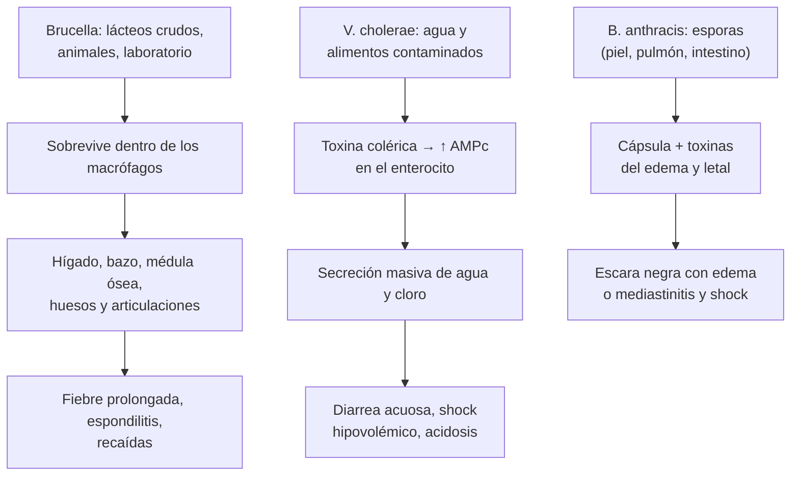
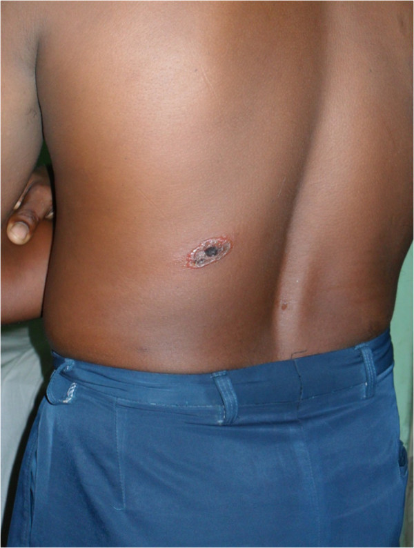
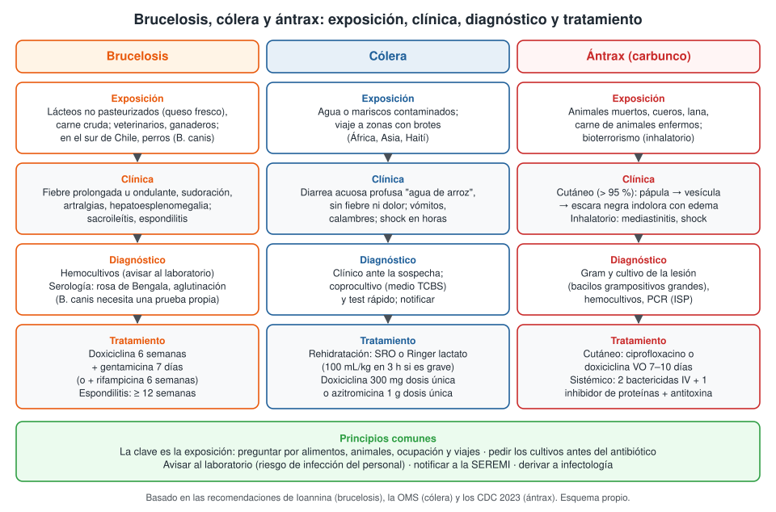

---
tags:
  - Infectología
---

# Brucelosis, cólera y ántrax

**Subespecialidad**
Infectología · Medicina interna · Salud pública

**Guías principales**
Recomendaciones de Ioannina para el tratamiento de la brucelosis (*PLoS Med* 2007) · Nota descriptiva y recomendaciones de la OMS sobre el cólera (2026) · Guías CDC 2023 de prevención y tratamiento del ántrax (*MMWR Recomm Rep*)

**Otras fuentes**
Estimación mundial de la incidencia de brucelosis (*Emerg Infect Dis* 2023) · Seminario del *Lancet* 2017 sobre cólera · Series chilenas de brucelosis (*Rev Chilena Infectol* 2017; *Rev Med Chil* 2025) · Epidemia de cólera en Chile y Latinoamérica (*Rev Med Chil* 1991; *Rev Chilena Infectol* 2010; *Rev Panam Salud Publica* 2013) · Último brote de ántrax cutáneo en Chile (*Rev Chilena Infectol* 2018)

**GES**
No. Las tres son **enfermedades de notificación obligatoria** (Decreto 7 de 2019).

**EUNACOM**
1.04.1.004 Brucelosis · 1.04.1.007 Cólera · 1.04.1.003 Ántrax (las tres: sospecha, inicial, derivar)

**Revisado**
Octubre 2026

!!! abstract "Resumen en 60 segundos"
    - Son tres infecciones **poco frecuentes en Chile**, pero **graves** y de **notificación obligatoria**. La pista clave es la **exposición**.
    - **Brucelosis** (zoonosis por *Brucella*):
        - Por **lácteos no pasteurizados** (queso fresco de cabra o vaca), carne cruda o contacto con animales. En el sur de Chile predomina ***B. canis*** (perros).
        - **Fiebre prolongada** u ondulante, sudoración, artralgias, hepatoesplenomegalia; foco **osteoarticular** (sacroileítis, **espondilitis**).
        - Diagnóstico: **hemocultivos** (avisar al laboratorio) y **serología**.
        - Tratamiento: **doxiciclina 6 semanas + gentamicina 7 días** (o + rifampicina 6 semanas).
    - **Cólera** (*Vibrio cholerae* O1/O139):
        - **Diarrea acuosa** muy abundante ("**agua de arroz**"), sin fiebre, con **deshidratación** y **shock en horas**.
        - El tratamiento es la **rehidratación** (SRO o **Ringer lactato**), más una dosis única de **doxiciclina** o **azitromicina** en los casos con deshidratación.
        - Con buen manejo, la letalidad es **< 1 %**.
    - **Ántrax** o carbunco (*Bacillus anthracis*):
        - **Cutáneo** (> 95 %): pápula que evoluciona a una **escara negra indolora** con mucho **edema**, tras manipular **animales muertos**, cueros o lana.
        - Formas **inhalatoria**, gastrointestinal y por inyección: graves, con shock y **mediastinitis**. Pensar en **bioterrorismo**.
        - Cutáneo: **ciprofloxacino** o **doxiciclina** oral por **7–10 días**. Sistémico: combinación IV y antitoxina.
    - **Avisar al laboratorio** (riesgo de infección del personal), **notificar** a la SEREMI y **derivar** a infectología.

## Definición

- **Brucelosis**: zoonosis causada por bacterias del género ***Brucella*** (cocobacilos gramnegativos intracelulares).
    - Especies humanas: ***B. melitensis*** (cabras y ovejas; la más virulenta), ***B. abortus*** (vacunos), ***B. suis*** (cerdos) y ***B. canis*** (perros).
    - También se llama fiebre de Malta o fiebre ondulante.
- **Cólera**: infección intestinal aguda por ***Vibrio cholerae*** **toxigénico** (serogrupos **O1** y O139). La **toxina colérica** produce una diarrea secretora masiva.
- **Ántrax** (en Chile también **carbunco**): zoonosis por ***Bacillus anthracis***, bacilo grampositivo **formador de esporas** que sobreviven décadas en el suelo.
    - Formas: **cutánea**, **inhalatoria**, **gastrointestinal** y **por inyección** (usuarios de heroína).
    - Es un **agente de bioterrorismo** de categoría A.

## Epidemiología

### Mundial

- **Brucelosis**:
    - Es la zoonosis bacteriana más frecuente del mundo. La estimación conservadora es de **2,1 millones** de casos humanos al año (Laine 2023), muy por encima de lo que se suponía.
    - Concentrada en **África**, **Asia**, el **Mediterráneo** y **Medio Oriente**; también hay zonas de riesgo en las Américas.
- **Cólera** (OMS):
    - Se estiman **1,3 a 4 millones** de casos y **21.000 a 143.000 muertes** al año.
    - En **2025**, **47 países** notificaron **451.499 casos** y **7.870 muertes**: la mayor cifra de muertes notificadas desde 1999.
    - La **séptima pandemia** (biotipo El Tor) llegó a Latinoamérica en **1991** desde el **Perú**. Entre 1991 y 2011 se notificaron **1,84 millones** de casos y **19.538 muertes** en la región (letalidad 1,06 %); el gran brote de **Haití** comenzó en 2010 (Harvez 2013).
- **Ántrax**:
    - Endémico en zonas ganaderas de África, Asia central y del sur y Medio Oriente, con brotes por consumo o manipulación de **animales muertos**.
    - La forma **cutánea** es más del **95 %** de los casos humanos; con tratamiento, su mortalidad es **< 2 %** (CDC 2023).
    - En **2001** hubo en EE. UU. un ataque de bioterrorismo con esporas enviadas por correo (casos inhalatorios y cutáneos).

### Chile

!!! chile "Datos nacionales"
    - **Brucelosis**:
        - **Olivares 2017**: primera serie chilena de adultos, **13 casos** en tres centros de la Región Metropolitana (2000–2016). Edad media de **50 años**; **8** consumieron **lácteos no pasteurizados**. El foco más frecuente fue la **columna**. Solo **1** tuvo hemocultivo positivo; el resto se diagnosticó por **serología**. Todos se curaron.
        - **Fica 2025**: **10 casos** de ***Brucella canis*** en el sur de Chile (2020–2024), **9** con exposición a **perros**. Se presentaron como fiebre prolongada (40 %), **espondilodiscitis** (20 %), miopericarditis, meningoencefalitis, hepatitis y adenopatías. Todos los hemocultivos fueron **negativos**. La serología para *B. canis* está disponible en Chile desde **2017**, y la mayoría de los casos chilenos se deben a esta especie y se concentran en el sur.
        - Hay casos chilenos de **meningitis** por *Brucella* (Campero 2020).
    - **Cólera**:
        - Chile estuvo libre de cólera durante casi un siglo, hasta el brote que comenzó en **abril de 1991**, como parte de la séptima pandemia (Garín 1991).
        - Las consecuencias fueron **mucho menores que en el Perú** gracias a la respuesta del sistema de salud: un **comité nacional del cólera**, planificación de los servicios, refuerzo de la **vigilancia epidemiológica** y de los laboratorios, **educación** de la población y medidas preventivas (Valenzuela 2010).
        - Hoy el riesgo principal son los **casos importados** de viajeros.
    - **Ántrax**: en Chile se han descrito brotes de **ántrax cutáneo**; el último fue publicado en 2018 (Arellano 2018). El contagio ocurre al manipular o consumir **animales enfermos** o sus productos.
    - El **ISP** es el laboratorio de referencia para confirmar *Brucella*, *V. cholerae* y *B. anthracis*.

## Etiología y factores de riesgo

| | Brucelosis | Cólera | Ántrax |
|---|---|---|---|
| **Agente** | *Brucella melitensis*, *B. abortus*, *B. suis*, *B. canis* | *Vibrio cholerae* O1 (El Tor) y O139 | *Bacillus anthracis* (esporas) |
| **Reservorio** | Cabras, ovejas, vacunos, cerdos, **perros** | **Agua** contaminada; ser humano | **Suelo**; herbívoros (vacunos, ovejas, caballos) |
| **Transmisión** | **Lácteos no pasteurizados**, carne cruda, contacto con animales o placentas, **laboratorio** (aerosoles) | **Fecal-oral**: agua y alimentos contaminados, mariscos crudos | **Contacto** con animales muertos, cueros, lana; **ingesta** de carne contaminada; **inhalación** de esporas; inyección de heroína |
| **Grupos de riesgo** | Ganaderos, veterinarios, trabajadores de mataderos, **personal de laboratorio**, consumidores de quesos artesanales, dueños de perros (*B. canis*) | Zonas sin agua potable ni alcantarillado, campos de refugiados, desastres; viajeros | Campesinos, faenadores, curtidores, trabajadores de la lana; bioterrorismo |
| **Incubación** | **1–4 semanas** (hasta meses) | **12 h a 5 días** | Cutáneo: **1–7 días**; inhalatorio: hasta **60 días** |
| **Transmisión entre personas** | Excepcional | **Sí** (fecal-oral) | **No** |

## Fisiopatología

- **Brucelosis**:
    - *Brucella* entra por la mucosa digestiva, respiratoria o la piel y es fagocitada por los **macrófagos**, dentro de los cuales **sobrevive y se multiplica**.
    - Se disemina al **sistema reticuloendotelial** (hígado, bazo, ganglios, médula ósea) y a los **huesos y articulaciones**.
    - La vida **intracelular** explica la **evolución crónica**, las **recaídas** y la necesidad de **tratamientos largos y combinados**.
    - Forma **granulomas** (como la TBC, con la que se confunde).
- **Cólera**:
    - *V. cholerae* coloniza el **intestino delgado** (se necesita un inóculo alto; la **aclorhidria** y los antiácidos facilitan la infección).
    - La **toxina colérica** activa la **adenilato ciclasa** del enterocito: aumenta el **AMPc**, se secreta **cloro y agua** y se bloquea la absorción de sodio.
    - Resultado: **diarrea secretora** isotónica masiva (hasta **1 L/h**), sin inflamación ni invasión de la mucosa.
    - Consecuencias: **deshidratación**, **shock hipovolémico**, **acidosis metabólica** (pérdida de bicarbonato), **hipokalemia** y **falla renal** prerrenal.
- **Ántrax**:
    - Las **esporas** germinan en el sitio de entrada (piel, pulmón, intestino).
    - La bacteria produce una **cápsula** (evita la fagocitosis) y **toxinas**: la **toxina del edema** (edema masivo) y la **toxina letal** (muerte celular, shock).
    - En el **inhalatorio**, las esporas van a los **ganglios del mediastino**: **mediastinitis hemorrágica**, derrame pleural, bacteriemia y meningitis.

*Figura 1. Mecanismos de la brucelosis, el cólera y el ántrax. Esquema propio basado en las recomendaciones de Ioannina, la OMS y los CDC 2023.*

## Clasificación

| Enfermedad | Formas clínicas |
|---|---|
| **Brucelosis** | **Aguda** (< 2 meses) · **subaguda** (2–12 meses) · **crónica** (> 1 año) · **focal**: osteoarticular (**sacroileítis**, **espondilitis**), genitourinaria (**orquiepididimitis**), neurobrucelosis, **endocarditis** (principal causa de muerte), hepática, pulmonar · **recaída** |
| **Cólera** | **Sin deshidratación** · **con algo de deshidratación** · **deshidratación grave** (clasificación OMS, como en la [diarrea aguda](../gastroenterologia/diarrea-aguda-y-clostridioides-difficile.md)) |
| **Ántrax** | **Cutáneo** (con o sin compromiso sistémico) · **inhalatorio** · **gastrointestinal** (orofaríngeo o intestinal) · **por inyección** · **meningitis** por ántrax (complicación de cualquier forma) |

## Clínica

### Brucelosis

- **Fiebre** prolongada, a veces **ondulante** (períodos con fiebre y sin ella) o vespertina, con **sudoración profusa** de olor característico.
- **Artralgias**, mialgias, **dolor lumbar**, astenia, baja de peso, cefalea, depresión.
- **Hepatomegalia**, **esplenomegalia** y **adenopatías**.
- **Focos**:
    - **Osteoarticular** (el más frecuente): **sacroileítis** (jóvenes), **espondilitis** lumbar (adultos mayores), artritis periférica.
    - **Orquiepididimitis**.
    - **Neurobrucelosis**: meningitis linfocitaria crónica, encefalitis.
    - **Endocarditis** (rara, pero la principal causa de muerte).
- Es una causa clásica de **síndrome febril prolongado** (ver [síndrome febril prolongado](sindrome-febril-prolongado.md)).

### Cólera

- Inicio brusco de **diarrea acuosa** abundante, **sin dolor** abdominal importante ni **fiebre**, con aspecto de "**agua de arroz**" y olor a pescado.
- **Vómitos** y **calambres** musculares (hipokalemia, hipocalcemia).
- **Deshidratación** rápida: sed, ojos hundidos, pliegue cutáneo, oliguria, compromiso de conciencia.
- **Shock hipovolémico** en pocas horas; **hipoglicemia** en niños.
- La mayoría de los infectados son **asintomáticos** o tienen diarrea leve.

### Ántrax

- **Cutáneo** (en las zonas expuestas: manos, brazos, cara, cuello):
    - **Pápula** pruriginosa indolora → **vesícula** → **úlcera** con **escara negra** en 1–2 semanas.
    - **Edema** extenso, desproporcionado, sin dolor; adenopatías regionales.
    - Sin pus (no es un absceso). Riesgo de **compromiso sistémico** si hay edema masivo (cara, cuello), fiebre o shock.
- **Inhalatorio**:
    - Fase inicial parecida a una **gripe** (fiebre, tos, malestar) y luego deterioro brusco: **disnea**, **shock**, **mediastino ensanchado** en la radiografía, **derrame pleural** hemorrágico.
    - Alta mortalidad pese al tratamiento.
- **Gastrointestinal**: tras comer carne contaminada; úlceras orofaríngeas o intestinales, dolor abdominal, hemorragia digestiva, ascitis.
- **Por inyección**: infección grave de partes blandas en usuarios de heroína.
- **Meningitis** hemorrágica en cualquier forma sistémica.

<figure markdown>
{ loading=lazy }
<figcaption>Figura 2. Ántrax cutáneo: lesión con escara negra central en la espalda, en un brote en Bangladesh. Tomada de Siddiqui MA, Khan MA, Ahmed SS, et al. <em>Recent outbreak of cutaneous anthrax in Bangladesh: clinico-demographic profile and treatment outcome of cases attended at Rajshahi Medical College Hospital.</em> BMC Res Notes. 2012;5:464 (figura 3). Licencia CC BY 2.0.</figcaption>
</figure>

## Diagnóstico

!!! guia "Cómo se confirma cada una"
    **Brucelosis**

    - **Hemocultivos** (2–3 sets): **avisar al laboratorio** que se sospecha *Brucella* (riesgo de infección del personal). La sensibilidad es mayor en la fase aguda.
    - **Serología**: **rosa de Bengala** (tamizaje), **aglutinación** en tubo (Wright) y **Coombs anti-*Brucella***; un título alto o en ascenso apoya el diagnóstico.
    - ***B. canis*** **no** se detecta con las pruebas habituales: necesita una **serología específica** (en Chile, aglutinación rápida con 2-mercaptoetanol).
    - **Cultivo** de médula ósea, tejido o líquido articular; **PCR**.
    - Buscar el foco: **RM de columna** si hay dolor lumbar, ecocardiograma si hay soplo, punción lumbar si hay síntomas neurológicos.

    **Cólera**

    - El diagnóstico es **clínico y epidemiológico**: no se espera la confirmación para rehidratar.
    - **Coprocultivo** en medio selectivo **TCBS** (avisar al laboratorio) y **test rápido**; confirmación y serogrupo en el **ISP**.
    - **Notificación inmediata** del caso sospechoso.

    **Ántrax**

    - **Gram** y **cultivo** del líquido de la vesícula o de debajo de la escara: **bacilos grampositivos grandes**, encapsulados.
    - **Hemocultivos** (casi siempre positivos en el inhalatorio), **PCR** e inmunohistoquímica en el ISP.
    - **Radiografía o TC de tórax**: **mediastino ensanchado** y derrame pleural en el inhalatorio.
    - **Punción lumbar** si hay compromiso sistémico (meningitis).

<figure markdown>
{ loading=lazy }
<figcaption>Figura 3. Exposición, clínica, diagnóstico y tratamiento de la brucelosis, el cólera y el ántrax. Esquema propio basado en las recomendaciones de Ioannina (2007), la OMS y las guías CDC 2023.</figcaption>
</figure>

## Laboratorio

| Examen | Brucelosis | Cólera | Ántrax |
|---|---|---|---|
| **Hemograma** | Leucopenia o recuento normal, **linfocitosis** relativa, anemia, trombocitopenia | Hemoconcentración, leucocitosis | Leucocitosis; hemoconcentración en el sistémico |
| **Bioquímica** | Transaminasas levemente elevadas | **Acidosis metabólica**, **hipokalemia**, **falla renal** prerrenal, hipoglicemia | Hiponatremia, falla renal en el sistémico |
| **PCR y VHS** | Elevadas moderadamente | — | Elevadas |
| **Pruebas específicas** | **Hemocultivos**, **serología** (rosa de Bengala, aglutinación, Coombs; prueba propia para *B. canis*), PCR | **Coprocultivo** (TCBS), test rápido | **Gram y cultivo** de la lesión, **hemocultivos**, PCR |
| **Otros** | Líquido articular, LCR (linfocitario), biopsia (granulomas) | — | LCR hemorrágico en la meningitis |

## Imágenes

- **Brucelosis**:
    - **RM de columna**: **espondilodiscitis** (más lumbar, con menos destrucción y menos abscesos que la TBC); sacroileítis (ver [osteomielitis](osteomielitis.md)).
    - **Ecografía abdominal**: hepatoesplenomegalia, abscesos.
    - **Ecocardiograma** si hay soplo o hemocultivos persistentemente positivos.
- **Cólera**: no necesita imágenes.
- **Ántrax**:
    - **Radiografía de tórax**: **ensanchamiento mediastínico**, **derrame pleural** e infiltrados en el inhalatorio.
    - **TC de tórax**: ganglios mediastínicos hiperdensos (hemorrágicos).
    - **TC o RM cerebral** si hay meningitis.

## Diagnóstico diferencial

| Cuadro | Diagnósticos diferenciales |
|---|---|
| **Brucelosis** | **Tuberculosis** (espondilitis torácica, abscesos fríos), fiebre tifoidea, **endocarditis**, linfoma, fiebre Q, leishmaniasis visceral, enfermedades reumatológicas; espondilodiscitis piógena por *S. aureus* |
| **Cólera** | Diarrea por **ETEC** (diarrea del viajero), ***Campylobacter***, ***Salmonella***, ***Shigella*** (estos con fiebre y disentería), rotavirus y norovirus, *C. difficile*, intoxicación alimentaria (ver [diarrea aguda](../gastroenterologia/diarrea-aguda-y-clostridioides-difficile.md)) |
| **Ántrax cutáneo** | **Picadura de araña de rincón** (*Loxosceles*; loxoscelismo cutáneo: placa livedoide dolorosa), **ectima gangrenoso** (*Pseudomonas* en neutropénicos), tularemia, rickettsiosis (escara), **impétigo** y ectima, celulitis, **orf** (ectima contagioso), pioderma gangrenoso (ver [piel y partes blandas](infecciones-piel-partes-blandas.md)) |
| **Ántrax inhalatorio** | Neumonía grave, **influenza**, **hantavirus** (ver [hantavirus](hantavirus-y-leptospirosis.md)), disección aórtica (mediastino ensanchado), mediastinitis por otras causas |

## Tratamiento

### Brucelosis

- **Siempre combinado** y **prolongado** (para evitar las recaídas), según las recomendaciones de **Ioannina**:
    - **Doxiciclina por 6 semanas + estreptomicina por 2–3 semanas**, o **+ gentamicina por 7 días** (esquemas de elección).
    - **Doxiciclina + rifampicina por 6 semanas**: alternativa oral, con algo más de recaídas.
- **Espondilitis**: tratamiento por **al menos 12 semanas** (doxiciclina + rifampicina, con un aminoglucósido al inicio); cirugía si hay absceso epidural o inestabilidad.
- **Neurobrucelosis** y **endocarditis**: tres fármacos (doxiciclina + rifampicina + ceftriaxona o aminoglucósido) por **meses**; la endocarditis suele requerir **cirugía valvular**.
- **Embarazo y niños < 8 años**: rifampicina + cotrimoxazol (no doxiciclina).
- **Prevención**: **pasteurización** de la leche, control veterinario, protección del personal de laboratorio. Profilaxis con doxiciclina + rifampicina por 3 semanas tras una exposición de laboratorio.

### Cólera

- **Rehidratación**: es lo que salva la vida.
    - **Sin deshidratación o con algo de deshidratación**: **sales de rehidratación oral** (SRO) en volumen igual a las pérdidas.
    - **Deshidratación grave o shock**: **Ringer lactato IV** (el suero fisiológico es la alternativa). En el adulto, **100 mL/kg en 3 h**: **30 mL/kg en los primeros 30 min** y **70 mL/kg en las 2,5 h siguientes** (plan C de la OMS). Luego SRO apenas pueda beber.
    - Reponer el **potasio** y vigilar la **glicemia**.
- **Antibióticos** (en la deshidratación moderada o grave; acortan la diarrea y la excreción del vibrión): **una dosis única**.
- **Medidas de salud pública**: **notificación inmediata**, estudio de contactos, agua segura, saneamiento, **vacunas orales** en brotes y zonas endémicas.

### Ántrax

- **Cutáneo sin compromiso sistémico**: **un antibiótico oral** por **7–10 días** (ciprofloxacino o doxiciclina). Si la exposición fue por **aerosol** (bioterrorismo), completar **60 días** (profilaxis posexposición).
- **Sistémico** (inhalatorio, gastrointestinal, meningitis o cutáneo con compromiso sistémico): **UCI**.
    - **Dos antibióticos bactericidas IV** de clases distintas (por ejemplo **ciprofloxacino + meropenem**) **+ un inhibidor de la síntesis de proteínas** (**linezolid** o clindamicina) por **al menos 2 semanas**.
    - **Antitoxina** (anticuerpos monoclonales: obiltoxaximab o raxibacumab) como terapia adyuvante.
    - **Drenaje** de los derrames pleurales; manejo del **edema cerebral** en la meningitis.
- **Profilaxis posexposición** por aerosol: ciprofloxacino o doxiciclina por **60 días** + **vacuna** (CDC 2023).
- **No se transmite entre personas**: no requiere aislamiento respiratorio (precauciones estándar; contacto si hay lesiones con secreción).

!!! dosis "Dosis habituales en el adulto (coordinar con infectología)"
    | Enfermedad | Fármaco | Dosis |
    |---|---|---|
    | **Brucelosis** | **Doxiciclina** | 100 mg VO cada 12 h por **6 semanas** |
    | | **Gentamicina** | 5 mg/kg IV o IM cada 24 h por **7 días** |
    | | **Estreptomicina** | 1 g IM cada 24 h por 2–3 semanas |
    | | **Rifampicina** | 600–900 mg VO cada 24 h por **6 semanas** |
    | **Cólera** | **Doxiciclina** | **300 mg VO dosis única** |
    | | **Azitromicina** (embarazo, niños) | **1 g VO dosis única** (niños: 20 mg/kg) |
    | | **Ciprofloxacino** | 1 g VO dosis única (resistencia creciente) |
    | | **Ringer lactato** (deshidratación grave) | 100 mL/kg IV en 3 h (30 mL/kg en 30 min y 70 mL/kg en 2,5 h) |
    | **Ántrax cutáneo** | **Ciprofloxacino** | 500 mg VO cada 12 h por 7–10 días |
    | | **Doxiciclina** | 100 mg VO cada 12 h por 7–10 días |
    | **Ántrax sistémico** | **Ciprofloxacino** | 400 mg IV cada 8 h |
    | | **Meropenem** | 2 g IV cada 8 h |
    | | **Linezolid** | 600 mg IV cada 12 h |

!!! alarma "Derivar u hospitalizar de urgencia"
    - **Cólera** con **deshidratación grave** o shock: rehidratación IV inmediata; **notificar de inmediato** a la SEREMI.
    - **Ántrax** con **compromiso sistémico** (fiebre, edema masivo de cara o cuello, shock), sospecha **inhalatoria** o **meningitis**: UCI e infectología. Ante sospecha de **bioterrorismo**, avisar a la autoridad sanitaria.
    - **Brucelosis** con **espondilitis** y déficit neurológico, **neurobrucelosis** o **endocarditis**.
    - En las tres: **avisar al laboratorio** y **notificar**.

## Complicaciones

- **Brucelosis**: espondilitis con **absceso epidural** o paravertebral, **endocarditis** (principal causa de muerte), neurobrucelosis, orquiepididimitis, abscesos hepáticos o esplénicos, **recaídas** (sobre todo con tratamientos cortos o con un solo fármaco), dolor y fatiga crónicos.
- **Cólera**: **shock hipovolémico**, **falla renal aguda**, **hipokalemia** (arritmias, íleo), **hipoglicemia** (niños), acidosis metabólica; aborto en embarazadas; edema pulmonar por exceso de fluidos.
- **Ántrax**: **obstrucción de la vía aérea** por edema de cuello (cutáneo de cara o cuello), **sepsis**, **meningitis hemorrágica**, mediastinitis, derrame pleural recurrente, hemorragia digestiva; cicatrices y ectropión en el cutáneo facial.

## Pronóstico y seguimiento

- **Brucelosis**: buen pronóstico con tratamiento combinado y completo (en la serie chilena de Olivares, **todos** se curaron). Recaídas en una minoría, casi siempre en los primeros 6 meses. Control clínico y serológico tras el tratamiento.
- **Cólera**: con **rehidratación** precoz la letalidad es **< 1 %** (meta de la OMS en los centros de tratamiento); sin tratamiento, la forma grave puede matar en horas.
- **Ántrax**:
    - **Cutáneo** tratado: mortalidad **< 2 %**; la escara sana sin cambios tras el antibiótico (no indica fracaso).
    - **Inhalatorio**: mortalidad alta incluso con tratamiento; mejora con el tratamiento precoz combinado y la antitoxina.
- **Seguimiento**: control de los contactos y de la fuente (alimentos, animales, agua) por la autoridad sanitaria y el SAG (animales).

## Perlas para el internado

!!! perla "Para recordar en la sala"
    - **Fiebre prolongada + sudoración + dolor lumbar + queso fresco artesanal = brucelosis**: hemocultivos y serología.
    - En el **sur de Chile**, la brucelosis se asocia a **perros** (*B. canis*), y la serología habitual sale **negativa**.
    - **Avisar al laboratorio** si sospecha *Brucella*: es una de las infecciones adquiridas en el laboratorio más frecuentes.
    - **Brucelosis = tratamiento combinado y largo** (doxiciclina 6 semanas + aminoglucósido o rifampicina); la monoterapia recae.
    - **Cólera = diarrea "agua de arroz" sin fiebre**: lo que salva es la **rehidratación** (Ringer lactato si es grave), no el antibiótico.
    - **Cólera**: una **dosis única** de doxiciclina o azitromicina.
    - **Escara negra indolora con mucho edema** en alguien que manipuló un animal muerto = **ántrax cutáneo**. En Chile, diferenciar del **loxoscelismo** (que duele).
    - **Mediastino ensanchado + cuadro gripal grave** sin explicación = pensar en ántrax inhalatorio (bioterrorismo).
    - Las tres son de **notificación obligatoria**.

## Preguntas de repaso

??? repaso "1. Hombre de 55 años, agricultor del sur de Chile, con fiebre de 6 semanas, sudoración nocturna, baja de peso y dolor lumbar. Consume queso fresco de cabra que hace un vecino. Hemograma con leucopenia leve; VHS de 60 mm/h. ¿Qué sospecha y cómo lo estudia?"
    - **Brucelosis** con probable **espondilitis**.
    - **Hemocultivos** (avisando al laboratorio), **serología** (rosa de Bengala, aglutinación; y prueba para *B. canis* si tiene perros), **RM de columna**.
    - Diferencial con **TBC** y espondilodiscitis piógena.
    - Tratamiento: doxiciclina + rifampicina (con aminoglucósido al inicio) por **≥ 12 semanas** por la espondilitis.

??? repaso "2. ¿Cuál es el tratamiento de elección de la brucelosis no complicada y por qué no basta un solo antibiótico?"
    - **Doxiciclina 100 mg cada 12 h por 6 semanas + gentamicina 5 mg/kg/día por 7 días** (o estreptomicina 2–3 semanas). Alternativa oral: **doxiciclina + rifampicina por 6 semanas**.
    - *Brucella* vive **dentro de los macrófagos**: la **monoterapia** y los tratamientos cortos tienen muchas **recaídas**.

??? repaso "3. Mujer de 40 años vuelve de un viaje a Haití. Hace 8 horas comenzó con diarrea acuosa muy abundante, blanquecina, sin fiebre ni dolor, y vómitos. Está somnolienta, con pulso débil, PA 70/40 mmHg y pliegue cutáneo. ¿Qué tiene y qué hace?"
    - **Cólera** con **deshidratación grave** y shock hipovolémico.
    - **Ringer lactato IV**: **100 mL/kg en 3 h** (30 mL/kg en 30 min y 70 mL/kg en 2,5 h), reevaluando; luego **SRO**.
    - **Doxiciclina 300 mg** (o azitromicina 1 g) en **dosis única** cuando tolere la vía oral.
    - Electrolitos (potasio), glicemia, función renal; **coprocultivo** en TCBS; **notificar de inmediato**.

??? repaso "4. Hombre de 38 años, campesino, faenó una vaca que murió de forma repentina. A los 4 días aparece en el antebrazo una pápula indolora que se transforma en una úlcera con costra negra y gran edema del brazo, sin dolor. Está afebril. ¿Qué sospecha y cómo lo trata?"
    - **Ántrax cutáneo** sin compromiso sistémico.
    - **Gram y cultivo** del líquido de la lesión, hemocultivos; **notificar** y avisar al ISP.
    - **Ciprofloxacino 500 mg cada 12 h** o **doxiciclina 100 mg cada 12 h** por **7–10 días**.
    - No desbridar la escara. Buscar a otros expuestos y avisar a la autoridad sanitaria y al SAG.

??? repaso "5. Funcionario de correos con fiebre, tos y malestar por 3 días, que luego empeora con disnea y shock. La radiografía muestra mediastino ensanchado y derrame pleural bilateral. ¿Qué diagnóstico debe considerar y cuál es el manejo?"
    - **Ántrax inhalatorio** (posible **bioterrorismo**).
    - **UCI**, hemocultivos, punción lumbar si es posible (descartar meningitis), drenaje pleural.
    - **Ciprofloxacino + meropenem + linezolid IV** y **antitoxina**; mínimo 2 semanas y luego completar 60 días.
    - **Avisar a la autoridad sanitaria**; profilaxis de 60 días a los expuestos al mismo aerosol.

??? repaso "6. ¿Qué diferencia clínica ayuda a distinguir el ántrax cutáneo del loxoscelismo cutáneo, frecuente en Chile?"
    - **Ántrax**: lesión **indolora**, con **escara negra** y **edema extenso**, antecedente de contacto con **animales muertos**, cueros o lana; Gram con bacilos grampositivos.
    - **Loxoscelismo**: lesión **muy dolorosa**, **placa livedoide** (violácea, con zonas pálidas e isquémicas), antecedente de mordedura de araña de rincón en el hogar; puede dar hemólisis (loxoscelismo cutáneo-visceral).

## Referencias

1. Ariza J, Bosilkovski M, Cascio A, et al. Perspectives for the Treatment of Brucellosis in the 21st Century: The Ioannina Recommendations. *PLoS Med.* 2007;4(12):e317. doi:[10.1371/journal.pmed.0040317](https://doi.org/10.1371/journal.pmed.0040317)
2. Laine CG, Johnson VE, Scott HM, Arenas-Gamboa AM. Global Estimate of Human Brucellosis Incidence. *Emerg Infect Dis.* 2023;29(9):1789–1797. doi:[10.3201/eid2909.230052](https://doi.org/10.3201/eid2909.230052)
3. Pappas G, Papadimitriou P, Akritidis N, et al. The new global map of human brucellosis. *Lancet Infect Dis.* 2006;6(2):91–99. doi:[10.1016/S1473-3099(06)70382-6](https://doi.org/10.1016/S1473-3099(06)70382-6)
4. Olivares R, Vidal P, Sotomayor C, et al. Brucelosis en Chile: Descripción de una serie de 13 casos. *Rev Chilena Infectol.* 2017;34(3):243–247. doi:[10.4067/S0716-10182017000300006](https://doi.org/10.4067/S0716-10182017000300006)
5. Fica A, Pinos Y, Delama I, et al. Serologic Evidence of Zoonotic Infections by *Brucella canis* in Southern Chile: A Neglected Emerging Disease. *Rev Med Chil.* 2025;153(10):695–707. doi:[10.4067/s0034-98872025001000695](https://doi.org/10.4067/s0034-98872025001000695)
6. Campero M, Espinoza R, Silva C. La brucelosis en el diagnóstico diferencial de las meningitis asépticas: a propósito de un caso. *Rev Med Chil.* 2020;148(12):1844–1847. doi:[10.4067/S0034-98872020001201844](https://doi.org/10.4067/S0034-98872020001201844)
7. World Health Organization. Cholera. Fact sheet. Geneva: WHO; actualizada en 2026. [Página de la OMS](https://www.who.int/news-room/fact-sheets/detail/cholera)
8. Clemens JD, Nair GB, Ahmed T, et al. Cholera. *Lancet.* 2017;390(10101):1539–1549. doi:[10.1016/S0140-6736(17)30559-7](https://doi.org/10.1016/S0140-6736(17)30559-7)
9. Garín MA. [Cholera. Epidemiologic clinical analysis of 7 cases]. *Rev Med Chil.* 1991;119(12):1387–1395. [PubMed](https://pubmed.ncbi.nlm.nih.gov/9723095/)
10. Valenzuela T, Salinas H, Cárcamo M, et al. Estrategias para el enfrentamiento del cólera: La experiencia chilena desde una perspectiva de salud pública. *Rev Chilena Infectol.* 2010;27(5):407–410. doi:[10.4067/s0716-10182010000600005](https://doi.org/10.4067/s0716-10182010000600005)
11. Harvez CB, Avila VS. La epidemia de cólera en América Latina: reemergencia y morbimortalidad. *Rev Panam Salud Publica.* 2013;33(1):40–46. doi:[10.1590/s1020-49892013000100006](https://doi.org/10.1590/s1020-49892013000100006)
12. Bower WA, Yu Y, Person MK, et al. CDC Guidelines for the Prevention and Treatment of Anthrax, 2023. *MMWR Recomm Rep.* 2023;72(6):1–47. doi:[10.15585/mmwr.rr7206a1](https://doi.org/10.15585/mmwr.rr7206a1)
13. Arellano S, Soto D, Reeves MB, et al. Ántrax cutáneo, último brote diagnosticado en Chile. *Rev Chilena Infectol.* 2018;35(2):195–197. doi:[10.4067/s0716-10182018000200195](https://doi.org/10.4067/s0716-10182018000200195)
14. Siddiqui MA, Khan MA, Ahmed SS, et al. Recent outbreak of cutaneous anthrax in Bangladesh: clinico-demographic profile and treatment outcome of cases attended at Rajshahi Medical College Hospital. *BMC Res Notes.* 2012;5:464. doi:[10.1186/1756-0500-5-464](https://doi.org/10.1186/1756-0500-5-464)
