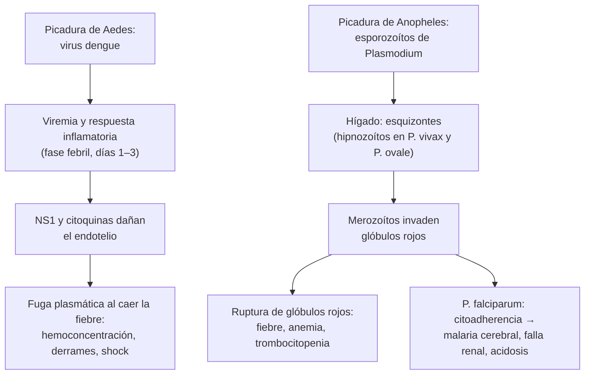

---
tags:
  - Infectología
---

# Dengue y malaria

**Subespecialidad**
Infectología · Medicina del viajero · Medicina interna

**Guías principales**
Guía OMS 2025 de manejo clínico de arbovirosis: dengue, chikungunya, Zika y fiebre amarilla · Guía OPS 2022 de dengue, chikungunya y Zika en las Américas · Guías OMS de malaria (versión vigente en línea)

**Otras fuentes**
Seminario del *Lancet* 2024 sobre dengue · Ensayos SEAQUAMAT (*Lancet* 2005) y AQUAMAT (*Lancet* 2010) de artesunato frente a quinina · Informe mundial de malaria OMS 2025 · Malaria en Chile 1913–2001 (*Rev Med Chil* 2002) · Comité de Inmunizaciones de la Sociedad Chilena de Infectología sobre dengue en Isla de Pascua (*Rev Chilena Infectol* 2016) · Comunicados MINSAL sobre *Aedes aegypti* (2016 y 2026)

**GES**
No. Ambas son **enfermedades de notificación obligatoria** (Decreto 7 de 2019).

**EUNACOM**
1.04.1.008 Dengue · 1.04.1.018 Malaria (ambas: sospecha, inicial, derivar)

**Revisado**
Octubre 2026

!!! abstract "Resumen en 60 segundos"
    - **Fiebre en un viajero** que vuelve de zonas tropicales: pensar siempre en **malaria** (sobre todo si viene de **África**) y en **dengue** (sobre todo si viene de **Latinoamérica** o el **Sudeste Asiático**). En Chile continental **no hay transmisión local** de ninguna de las dos.
    - **Dengue** (virus transmitido por el mosquito *Aedes aegypti*):
        - Fiebre alta, cefalea retroocular, mialgias, artralgias, exantema.
        - **Fase crítica al caer la fiebre** (días 3–7): fuga plasmática, **hemoconcentración**, shock.
        - **Signos de alarma**: dolor abdominal intenso, vómitos persistentes, sangrado de mucosas, letargia, hepatomegalia, hematocrito en aumento con plaquetas en caída.
        - Tratamiento de soporte: **hidratación oral**, **paracetamol** o **metamizol**. **Nunca AINE** ni corticoides. **Cristaloides** guiados por el **llene capilar** y el **lactato** en el dengue grave.
    - **Malaria** (*Plasmodium*, transmitida por el mosquito *Anopheles*):
        - Fiebre (a veces cíclica), calofríos, cefalea, anemia, trombocitopenia, esplenomegalia.
        - ***P. falciparum*** puede ser **mortal en horas**: compromiso de conciencia, acidosis, falla renal, hipoglicemia, anemia grave.
        - **Diagnóstico**: **gota gruesa y frotis** (repetir cada 12–24 h si son negativos) y prueba rápida.
        - **Malaria grave**: **artesunato IV** (reduce la mortalidad frente a la quinina). **No complicada**: **artemeter-lumefantrina**. *P. vivax* y *P. ovale*: agregar **primaquina** (medir antes la G6PD).
    - **Hospitalizar** el dengue con signos de alarma o grave y **toda malaria por *P. falciparum***. **Notificar** ambos casos.

## Definición

- **Dengue**: infección por el **virus dengue** (flavivirus, **4 serotipos**: DENV-1 a DENV-4), transmitida por la picadura del mosquito ***Aedes aegypti*** (y *Ae. albopictus*).
    - **Dengue sin signos de alarma**, **con signos de alarma** y **grave** (clasificación OMS 2009, actualizada por la OPS 2022).
    - **Dengue grave**: **fuga plasmática grave** (shock o acumulación de líquido con dificultad respiratoria), **sangrado grave** o **daño grave de órganos** (hígado, SNC, corazón, riñón).
- **Malaria** (paludismo): infección de los glóbulos rojos por parásitos del género ***Plasmodium***, transmitida por la picadura del mosquito hembra ***Anopheles***.
    - Cinco especies infectan al ser humano: ***P. falciparum*** (la más grave), ***P. vivax***, *P. ovale*, *P. malariae* y *P. knowlesi* (Sudeste Asiático).
    - **Malaria grave**: malaria con parásitos asexuados en la sangre y **disfunción de órganos** o **hiperparasitemia** (criterios OMS).

## Epidemiología

### Mundial

- **Dengue**:
    - Es la arbovirosis más frecuente del mundo; la mayoría de las infecciones son **asintomáticas**.
    - **2024 fue un año récord en las Américas**: más de **11,7 millones** de casos hasta septiembre, más del doble que en 2023 (OPS), con los **4 serotipos** circulando.
    - La **segunda infección** por un serotipo **distinto** aumenta el riesgo de dengue grave.
    - La expansión de *Aedes* se asocia al cambio climático, la urbanización y los viajes.
- **Malaria** (Informe mundial OMS 2025):
    - **282 millones** de casos y **610.000 muertes** estimadas en **2024**.
    - La **Región de África** concentra el **94 %** de los casos y el **95 %** de las muertes; la mayoría de los fallecidos son **niños menores de 5 años**.
    - Crece la **resistencia** a los derivados de la artemisinina (África oriental, Sudeste Asiático).
    - En Latinoamérica predomina ***P. vivax***; las zonas de mayor transmisión están en la Amazonía (Venezuela, Brasil, Colombia, Perú).

### Chile

!!! chile "Datos nacionales"
    - **Dengue**:
        - **Isla de Pascua (Rapa Nui)**: dengue **autóctono** desde **2002**, con brotes recurrentes de distintos serotipos y presencia permanente de *Ae. aegypti* (Fica 2016). Su hospital no tiene UCI ni plaquetas, y el traslado al continente es lento y caro.
        - **Chile continental**: el mosquito fue **erradicado en 1963** y se **volvió a detectar en Arica en 2016** (MINSAL).
        - En enero de **2026** el MINSAL informó la presencia del vector en **Arica y Parinacota, Tarapacá, Valparaíso** y la **Región Metropolitana** (aeropuerto de Santiago), con **alerta sanitaria** vigente.
        - **No hay casos autóctonos en Chile continental**: todos son **importados** de viajeros.
    - **Malaria** (Schenone 2002):
        - Existió solo en la actual **Región de Arica y Parinacota y la de Tarapacá** (vector *Anopheles pseudopunctipennis*). En 1936 afectaba a más del **50 %** de la población local.
        - **Sin casos autóctonos desde 1945**, gracias a una campaña antimalárica.
        - Hoy solo hay **casos importados**: entre 1980 y 2001 se registraron **66** casos con **5 muertes** (8,8 %).
        - En 2018 se describió en Chile un caso importado de Nigeria con **resistencia a atovacuona-proguanil** (Chenet 2021).
    - El **ISP** es el laboratorio de referencia para confirmar los casos. Ambos son de **notificación obligatoria**.

## Etiología y factores de riesgo

| | Dengue | Malaria |
|---|---|---|
| **Agente** | Virus dengue (4 serotipos) | *P. falciparum*, *P. vivax*, *P. ovale*, *P. malariae*, *P. knowlesi* |
| **Vector** | *Aedes aegypti* (pica de **día**, en zonas urbanas) | *Anopheles* hembra (pica de **noche**, en zonas rurales) |
| **Otras vías** | Transfusión, trasplante, vertical (raras) | **Transfusión**, trasplante, agujas compartidas, **congénita** |
| **Incubación** | **4–10 días** | *P. falciparum*: **7–30 días** (casi siempre en el primer mes). *P. vivax* y *P. ovale*: hasta **meses o años** (hipnozoítos hepáticos) |
| **Riesgo de enfermedad grave** | **Segunda infección** por otro serotipo, embarazo, lactantes, adultos mayores, obesidad, diabetes, HTA, ERC | *P. falciparum*, **viajeros no inmunes** (incluidos los inmigrantes que **visitan a su familia**), embarazo, niños, esplenectomía, adultos mayores, sin quimioprofilaxis |

## Fisiopatología

- **Dengue**:
    - El virus infecta monocitos, células dendríticas y hepatocitos y activa una gran **respuesta inflamatoria**.
    - La proteína viral **NS1** y las citoquinas dañan el **glicocálix endotelial**: **aumenta la permeabilidad capilar** (fuga de plasma) en la fase crítica.
    - La fuga plasmática produce **hemoconcentración** (hematocrito alto), **derrames serosos** y **shock** con presión de pulso estrecha.
    - **Trombocitopenia** por supresión medular y destrucción periférica; **coagulopatía**.
    - **Amplificación dependiente de anticuerpos**: los anticuerpos de una infección previa por otro serotipo facilitan la entrada del virus a las células y explican el mayor riesgo de dengue grave en la segunda infección.
- **Malaria**:
    - El mosquito inocula **esporozoítos** que van al **hígado** (fase hepática, asintomática).
    - Salen **merozoítos** que invaden los **glóbulos rojos** y se multiplican; la **ruptura** sincronizada de los glóbulos rojos produce la **fiebre** y la **anemia**.
    - ***P. falciparum*** infecta glóbulos rojos de **cualquier edad** (alta parasitemia) y los hace **adherirse al endotelio** (**citoadherencia**): obstruye la microcirculación del **cerebro**, el riñón y la placenta.
    - ***P. vivax*** y ***P. ovale*** dejan **hipnozoítos** en el hígado: **recaídas** semanas o meses después; por eso se necesita **primaquina**.

*Figura 1. Mecanismos del dengue y de la malaria. Esquema propio basado en la guía OMS 2025 de arbovirosis, Paz-Bailey 2024 y las guías OMS de malaria.*

## Clasificación

| Enfermedad | Categorías |
|---|---|
| **Dengue** (OMS 2009, OPS 2022) | **Sin signos de alarma** (manejo ambulatorio) · **con signos de alarma** (hospitalizar) · **grave**: shock por fuga plasmática o acumulación de líquido con dificultad respiratoria, sangrado grave, daño grave de órganos (transaminasas ≥ 1.000 UI/L, compromiso de conciencia, miocarditis, falla renal) |
| **Malaria** | **No complicada** · **grave** (criterios OMS, ver abajo). Por especie: *P. falciparum* frente a las no *falciparum* |

!!! alarma "Criterios de malaria grave (OMS), con parásitos asexuados en la sangre"
    - **Compromiso de conciencia** (Glasgow < 11 en el adulto) o **convulsiones** repetidas.
    - **Postración** (no puede sentarse ni caminar sin ayuda).
    - **Acidosis** (bicarbonato < 15 mmol/L o lactato ≥ 5 mmol/L) y respiración acidótica.
    - **Hipoglicemia** (< 40 mg/dL).
    - **Anemia grave** (Hb < 7 g/dL en el adulto) con parasitemia > 10.000/µL.
    - **Falla renal** (creatinina > 3 mg/dL).
    - **Ictericia** (bilirrubina > 3 mg/dL) con parasitemia > 100.000/µL.
    - **Edema pulmonar** o SatO2 < 92 % con taquipnea.
    - **Sangrado** significativo.
    - **Shock** (PAS < 80 mmHg en el adulto con mala perfusión).
    - **Hiperparasitemia**: > 10 % de glóbulos rojos parasitados.

## Clínica

### Dengue

- **Fase febril** (días 1–3, a veces hasta 7):
    - **Fiebre alta** de inicio brusco, **cefalea**, **dolor retroocular**, **mialgias** y **artralgias** intensas ("fiebre quebrantahuesos"), náuseas.
    - **Exantema** maculopapular o "islas blancas en un mar rojo" (en la convalecencia), petequias.
    - **Prueba del torniquete** positiva; leucopenia.
- **Fase crítica** (al **caer la fiebre**, días 3–7, dura 24–48 h):
    - **Fuga plasmática**: hematocrito en aumento, **ascitis**, **derrame pleural**, edema de la pared vesicular.
    - **Shock** con **presión de pulso estrecha** (≤ 20 mmHg), llene capilar lento, extremidades frías; al principio con presión arterial normal.
    - **Sangrados**: gingivorragia, epistaxis, metrorragia, hemorragia digestiva.
- **Signos de alarma** (OPS 2022 y OMS 2025): indican **hospitalizar**.
    - **Dolor abdominal** intenso y continuo.
    - **Vómitos persistentes**.
    - **Acumulación de líquidos** (ascitis, derrame pleural).
    - **Sangrado de mucosas**.
    - **Letargia o irritabilidad**.
    - **Hepatomegalia** > 2 cm.
    - **Hematocrito en aumento** progresivo (y plaquetas en descenso rápido).
- **Fase de recuperación**: reabsorción del líquido (riesgo de **sobrecarga** y edema pulmonar si se siguen dando fluidos), bradicardia, exantema pruriginoso, astenia prolongada.

<figure markdown>
{ loading=lazy }
<figcaption>Figura 2. Fases del dengue: el mayor riesgo de shock aparece cuando cae la fiebre, junto con el aumento del hematocrito y el nadir de las plaquetas. Esquema propio adaptado de las guías OMS 2009, OPS 2022 y OMS 2025 (curvas ilustrativas).</figcaption>
</figure>

### Malaria

- **Fiebre** en un viajero (o inmigrante) que estuvo en una zona endémica, aunque haya tomado quimioprofilaxis.
    - **Calofríos**, sudoración, **cefalea**, mialgias, malestar general; a veces diarrea y tos (se confunde con una gripe o una gastroenteritis).
    - Los **ciclos clásicos** (fiebre cada 48 h en *P. vivax* y *P. ovale*, cada 72 h en *P. malariae*) son **poco frecuentes al inicio**: no esperar el patrón para sospecharla.
- **Examen**: palidez, **ictericia** leve, **esplenomegalia**, hepatomegalia.
- **Malaria grave por *P. falciparum***: compromiso de conciencia y convulsiones (**malaria cerebral**), dificultad respiratoria (acidosis, edema pulmonar), oliguria, ictericia, sangrados, shock.
- **Embarazo**: más riesgo de malaria grave, hipoglicemia, aborto, parto prematuro.

## Diagnóstico

!!! guia "Enfoque de la fiebre en el viajero (OMS)"
    1. Preguntar siempre **dónde viajó**, **cuándo** volvió, qué **profilaxis** tomó, vacunas, picaduras, contactos y actividades (agua dulce, animales, sexo).
    2. **Malaria** primero: es la causa de fiebre del viajero que más rápido mata.
        - **Gota gruesa y frotis** (microscopía): confirma, identifica la **especie** y cuantifica la **parasitemia**.
        - **Prueba rápida** de antígenos (HRP2, LDH): útil si no hay microscopista disponible, pero no reemplaza la gota gruesa.
        - Si es negativa y persiste la sospecha: **repetir cada 12–24 h hasta 3 veces**.
        - **PCR** (ISP): confirmación y especies.
    3. **Dengue**:
        - **Días 1–5** de fiebre: **RT-PCR** o **antígeno NS1**.
        - **Desde el día 5**: **IgM** (serología). La IgG sola indica infección pasada.
        - Reacción cruzada con otros flavivirus (Zika, fiebre amarilla, vacunas).
    4. Diferenciar de **chikungunya**, **Zika**, **fiebre amarilla**, **leptospirosis**, **fiebre tifoidea**, **rickettsiosis** e **influenza**.
    5. **Notificar** a la autoridad sanitaria (SEREMI) los casos sospechosos.

- **Dengue**: en la evaluación inicial definir la **fase**, la presencia de **signos de alarma**, las **comorbilidades** y la **situación social** (si puede volver a control). Con eso se decide el manejo ambulatorio o la hospitalización.
- **Malaria**: con la especie y la parasitemia se clasifica en **grave** o **no complicada**, lo que define el tratamiento.

## Laboratorio

| Examen | Dengue | Malaria |
|---|---|---|
| **Hemograma** | **Leucopenia**, **trombocitopenia** progresiva; **hematocrito en aumento** (≥ 20 % sobre el basal = fuga plasmática) | **Anemia** (hemolítica), **trombocitopenia** (muy frecuente), leucocitos normales o bajos |
| **Transaminasas** | Elevadas (AST > ALT); ≥ 1.000 UI/L = dengue grave | Elevadas leves |
| **Bilirrubina, LDH, haptoglobina** | — | Hemólisis: bilirrubina indirecta y LDH altas, haptoglobina baja |
| **Glicemia** | — | **Hipoglicemia** (malaria grave, quinina, embarazo) |
| **Creatinina, electrolitos** | Falla renal en el dengue grave | **Falla renal** aguda en *P. falciparum* |
| **Gases y lactato** | **Lactato** para guiar los fluidos (OMS 2025) | **Acidosis** y lactato alto = malaria grave |
| **Albúmina, coagulación** | Hipoalbuminemia por fuga; TTPA prolongado | CID en la malaria grave |
| **Pruebas específicas** | **NS1** o **RT-PCR** (días 1–5); **IgM** (desde el día 5) | **Gota gruesa y frotis**, prueba rápida, PCR |
| **G6PD** | — | **Antes de la primaquina** o la tafenoquina (riesgo de hemólisis) |

## Imágenes

- **Dengue**:
    - **Ecografía** abdominal y pulmonar: detecta precozmente la **fuga plasmática** (líquido libre, derrame pleural, **engrosamiento de la pared vesicular**) antes que el hematocrito.
    - **Radiografía de tórax**: derrame pleural (más frecuente a derecha).
- **Malaria**:
    - **Radiografía de tórax**: edema pulmonar o SDRA en la malaria grave.
    - **TC cerebral**: en la malaria cerebral para descartar otras causas (no es diagnóstica).
    - **Ecografía**: esplenomegalia; riesgo de **rotura esplénica** (rara).

## Diagnóstico diferencial

| Diagnóstico | Claves |
|---|---|
| **Chikungunya** | **Artralgias** y **artritis** muy intensas e incapacitantes, que pueden durar meses; menos trombocitopenia |
| **Zika** | Fiebre baja o ausente, **exantema pruriginoso**, **conjuntivitis**; riesgo de microcefalia en el embarazo y de Guillain-Barré |
| **Fiebre amarilla** | **Ictericia**, hepatitis grave, sangrado, falla renal; antecedente de no vacunación en zona endémica |
| **Leptospirosis** | Exposición a agua o barro, **mialgias de pantorrillas**, inyección conjuntival, ictericia con falla renal (ver [leptospirosis](hantavirus-y-leptospirosis.md)) |
| **Hantavirus** | Exposición rural en Chile; trombocitopenia, hemoconcentración e **inmunoblastos**; falla respiratoria (ver [hantavirus](hantavirus-y-leptospirosis.md)) |
| **Fiebre tifoidea** | Fiebre progresiva, bradicardia relativa, dolor abdominal (ver [fiebre tifoidea](fiebre-tifoidea-y-paratifoidea.md)) |
| **Rickettsiosis** | Escara de inoculación, exantema |
| **Influenza y COVID-19** | Síntomas respiratorios; test viral (ver [influenza y COVID-19](influenza-y-covid-19.md)) |
| **Sepsis bacteriana, meningitis** | Foco, hemocultivos, LCR (ver [sepsis](sepsis-y-shock-septico.md)) |
| **Hepatitis virales agudas** | Transaminasas muy altas, ictericia, serologías |
| **Púrpura trombocitopénica, leucemia aguda** | Trombocitopenia sin fiebre o con blastos en el frotis |

## Tratamiento

### Dengue

- **No existe tratamiento antiviral**. El tratamiento es de **soporte** y depende del grupo:
    - **Sin signos de alarma**, tolera la vía oral, sin comorbilidades de riesgo: **manejo ambulatorio**.
        - **Hidratación oral** abundante y **protocolizada** (agua, sales de rehidratación, jugos, sopas), reposo.
        - **Paracetamol** o **metamizol** para la fiebre y el dolor (OMS 2025).
        - **Control diario** con hemograma hasta 48 h después de la caída de la fiebre; enseñar los **signos de alarma**.
    - **Con signos de alarma**, embarazo, comorbilidades, adulto mayor, intolerancia oral o mala situación social: **hospitalizar**.
        - **Cristaloides** (no coloides) IV, ajustados según la clínica.
        - Control seriado del **hematocrito**, el **llene capilar**, la diuresis y el **lactato**.
    - **Dengue grave (shock)**: **UCI**. Bolos de cristaloides con reevaluación frecuente; la **elevación pasiva de piernas** ayuda a decidir si dar más volumen (OMS 2025). Transfundir glóbulos rojos si hay sangrado con caída del hematocrito.
- **Qué no hacer** (OMS 2025):
    - **No usar AINE** (ibuprofeno, ketorolaco, ácido acetilsalicílico): recomendación **fuerte** en contra.
    - **No usar corticoides** ni **inmunoglobulinas**.
    - **No transfundir plaquetas de forma profiláctica** en pacientes sin sangrado activo, aunque tengan menos de 50.000/µL.
    - Evitar las inyecciones intramusculares y los procedimientos invasivos innecesarios.
    - **Reducir los fluidos IV** al terminar la fase crítica para evitar la sobrecarga.
- **Prevención**: control del vector (eliminar criaderos de agua), repelentes, mosquiteros. **Vacunas** (TAK-003, Qdenga) en algunos países para personas de zonas endémicas o viajeros, según las recomendaciones locales.

!!! dosis "Dengue: dosis habituales en el adulto"
    | Medida | Dosis |
    |---|---|
    | **Paracetamol** | 500 mg–1 g VO cada 6–8 h (máximo **3–4 g/día**; menos si hay daño hepático) |
    | **Metamizol** | 500 mg–1 g VO o IV cada 8 h |
    | **Hidratación oral** | Ingesta abundante y protocolizada (en general más de 2–3 L/día en el adulto, según el peso y la tolerancia) |
    | **Cristaloides IV** (con signos de alarma) | Bolos de **5–10 mL/kg** en 1 h y luego infusión decreciente según la respuesta (llene capilar, hematocrito, diuresis, lactato) |
    | **Shock** | Bolos de **10–20 mL/kg** de cristaloides con reevaluación tras cada bolo; evitar bolos grandes y rápidos repetidos sin reevaluar |

### Malaria

- **Hospitalizar**: toda malaria por ***P. falciparum*** (o de especie desconocida), toda **malaria grave**, embarazadas, niños, intolerancia oral.
- **Malaria grave** (cualquier especie):
    - **Artesunato IV**: es el tratamiento de elección. Redujo la mortalidad frente a la quinina en **34,7 %** en adultos (SEAQUAMAT: 15 % frente a 22 %) y en **22,5 %** en niños africanos (AQUAMAT).
    - Si no hay artesunato: **quinina IV** (o artemeter IM) mientras se consigue.
    - **UCI**: manejo de la hipoglicemia, la acidosis, las convulsiones, la falla renal (diálisis) y la anemia. Fluidos con cautela (riesgo de edema pulmonar).
    - Completar con un **tratamiento oral combinado con artemisinina** (TCA) cuando tolere la vía oral.
- **Malaria no complicada por *P. falciparum***: **TCA** oral, por ejemplo **artemeter-lumefantrina** por 3 días. Alternativa: atovacuona-proguanil.
- ***P. vivax* y *P. ovale***:
    - **Cloroquina** (donde siga siendo sensible) o **TCA**.
    - **Primaquina** por 14 días para eliminar los **hipnozoítos** y evitar las **recaídas** (cura radical). Antes, medir la **G6PD**; contraindicada en el **embarazo** y la lactancia.
- **Seguimiento**: gota gruesa diaria hasta que sea negativa; control al día 28 (recrudescencia).
- **Prevención en viajeros**: consulta previa al viaje, **quimioprofilaxis** según el destino (atovacuona-proguanil, doxiciclina o mefloquina), repelentes y mosquiteros.
- En Chile los antimaláricos **no están disponibles en todas las farmacias**: coordinar el tratamiento con infectología y la autoridad sanitaria.

!!! dosis "Malaria: dosis habituales en el adulto (OMS; coordinar con infectología)"
    | Fármaco | Dosis | Comentario |
    |---|---|---|
    | **Artesunato IV** | **2,4 mg/kg** a las 0, 12 y 24 h, luego **cada 24 h** hasta tolerar la vía oral (mínimo 24 h de tratamiento IV) | **Malaria grave**. Después, TCA oral completo por 3 días. Vigilar **hemólisis tardía** (días 7–30) |
    | **Quinina IV** (si no hay artesunato) | 20 mg/kg de carga en 4 h, luego 10 mg/kg cada 8 h | Riesgo de **hipoglicemia** y arritmias; monitorizar ECG y glicemia. Combinar con doxiciclina o clindamicina |
    | **Artemeter-lumefantrina** (20/120 mg) | **4 comprimidos** a las 0, 8, 24, 36, 48 y 60 h (6 dosis, adulto ≥ 35 kg), con comida grasa | **Malaria no complicada** por *P. falciparum* (y otras especies) |
    | **Atovacuona-proguanil** (250/100 mg) | **4 comprimidos** juntos al día por **3 días** | Alternativa en la malaria no complicada |
    | **Cloroquina** | 10 mg base/kg los días 1 y 2, 5 mg base/kg el día 3 (total 25 mg/kg) | *P. vivax*, *P. ovale*, *P. malariae* sensibles |
    | **Primaquina** | **0,25–0,5 mg base/kg/día** por **14 días** | Cura radical de *P. vivax* y *P. ovale*. **Medir G6PD antes**. No en el embarazo |

!!! alarma "Derivar u hospitalizar de urgencia"
    - **Dengue con signos de alarma** o **grave**: hospitalizar; UCI si hay shock, sangrado grave o daño de órganos.
    - **Dengue** en **embarazadas**, adultos mayores, con comorbilidades o sin posibilidad de control diario.
    - **Toda sospecha de malaria por *P. falciparum***: hospitalizar, gota gruesa urgente e infectología.
    - **Malaria grave**: UCI y **artesunato IV** sin demora.
    - **Fiebre en un viajero** desde una zona endémica de malaria: descartar malaria **el mismo día**.

## Complicaciones

- **Dengue**:
    - **Shock** por fuga plasmática; **hemorragias** graves (digestiva, metrorragia).
    - **Hepatitis** grave y falla hepática; **encefalitis** y encefalopatía; **miocarditis**; falla renal.
    - **Sobrecarga de volumen** en la fase de recuperación (edema pulmonar).
    - **Síndrome hemofagocítico** (raro).
    - En el **embarazo**: hemorragia, parto prematuro, transmisión vertical.
- **Malaria**:
    - **Malaria cerebral** (coma, convulsiones, secuelas neurológicas).
    - **SDRA**, **falla renal** aguda, **acidosis láctica**, **hipoglicemia**, **anemia grave**, CID, shock (sepsis bacteriana asociada).
    - **Rotura esplénica**.
    - **Recaídas** de *P. vivax* y *P. ovale* sin primaquina.
    - **Hemólisis tardía** tras el artesunato; **hemólisis por primaquina** con déficit de G6PD.
    - En el **embarazo**: anemia, aborto, bajo peso al nacer, malaria congénita.

## Pronóstico y seguimiento

- **Dengue**: la mayoría se recupera en **1–2 semanas**, con astenia que puede durar semanas. Con un manejo adecuado de los fluidos, la letalidad es **baja**; las muertes se asocian sobre todo a un reconocimiento tardío del shock o a un mal manejo de los fluidos.
- **Malaria**:
    - La no complicada tratada a tiempo tiene **buen pronóstico**.
    - La **malaria grave** por *P. falciparum* sigue teniendo **alta mortalidad** pese al artesunato (15 % en adultos en el SEAQUAMAT); el retraso del diagnóstico es el principal factor evitable.
- **Seguimiento**:
    - Dengue: hemograma diario hasta 48 h después de la caída de la fiebre; controlar los signos de alarma.
    - Malaria: **gota gruesa** hasta su negativización y al **día 28**; hemograma por la **hemólisis tardía** tras el artesunato (días 7–30); controlar las recaídas en *P. vivax*.
- **Notificación** de todos los casos a la SEREMI (enfermedades de notificación obligatoria).

## Perlas para el internado

!!! perla "Para recordar en la sala"
    - **Fiebre en un viajero que volvió del trópico = malaria hasta demostrar lo contrario**: gota gruesa el mismo día y repetirla si es negativa.
    - La **quimioprofilaxis no descarta** la malaria. *P. vivax* puede aparecer **meses** después del viaje.
    - **Dengue**: el peligro está **cuando cae la fiebre** (fase crítica), no en el peak febril.
    - **Hematocrito que sube con plaquetas que bajan** = fuga plasmática: hospitalizar.
    - En el dengue **no dar AINE ni aspirina**: solo **paracetamol** o **metamizol**.
    - **No transfundir plaquetas** de forma profiláctica en el dengue sin sangrado.
    - **Malaria grave = artesunato IV**: es mejor que la quinina.
    - **Antes de la primaquina, medir la G6PD**.
    - En Chile: dengue autóctono **solo en Rapa Nui**; *Aedes* ya está en el norte y en Santiago, así que hay que estar atentos a la transmisión local.

## Preguntas de repaso

??? repaso "1. Mujer de 28 años vuelve hace 5 días de Brasil. Tuvo 3 días de fiebre de 39,5 °C, cefalea retroocular y mialgias. Hoy está afebril, pero tiene dolor abdominal intenso, vómitos repetidos y gingivorragia. Hematocrito de 48 % (basal 39 %), plaquetas de 40.000/µL. ¿Qué tiene y qué hace?"
    - **Dengue con signos de alarma** en la **fase crítica** (caída de la fiebre, dolor abdominal, vómitos persistentes, sangrado de mucosas, hemoconcentración).
    - **Hospitalizar**; **cristaloides IV** guiados por el llene capilar, la diuresis, el hematocrito y el lactato; ecografía para buscar derrames.
    - **Paracetamol**; **no** AINE, **no** corticoides, **no** plaquetas profilácticas.
    - Confirmar con **NS1/RT-PCR** o **IgM** y **notificar**.

??? repaso "2. Hombre de 40 años, ingeniero, volvió hace 12 días de Nigeria. No tomó profilaxis. Consulta por fiebre, calofríos y cefalea de 2 días. Está somnoliento, con Glasgow 12. Hb 8 g/dL, plaquetas 35.000/µL, creatinina 3,5 mg/dL, glicemia 50 mg/dL. ¿Qué sospecha y qué hace?"
    - **Malaria grave por *P. falciparum***: compromiso de conciencia, falla renal, hipoglicemia, anemia y trombocitopenia, tras un viaje a África sin profilaxis.
    - **Gota gruesa y frotis urgentes** (parasitemia) y prueba rápida.
    - **UCI**, **artesunato IV 2,4 mg/kg** (0, 12 y 24 h y luego diario), corrección de la **hipoglicemia** y manejo de la falla renal. Completar con TCA oral.
    - **Notificar** e infectología.

??? repaso "3. Hombre de 25 años, venezolano, vive en Chile hace 4 meses. Presenta fiebre cada 48 h con calofríos intensos y sudoración. Está estable. La gota gruesa muestra *Plasmodium vivax*. ¿Cómo lo trata?"
    - **Malaria no complicada por *P. vivax*** (recaída o infección tardía: los hipnozoítos explican la aparición meses después).
    - **Cloroquina** (o TCA) por 3 días + **primaquina** por 14 días para la cura radical.
    - **Medir la G6PD** antes de la primaquina.
    - Notificar a la SEREMI (la confirmación la hace el ISP).

??? repaso "4. Paciente con dengue sin signos de alarma, en el día 3 de fiebre, pregunta si puede tomar ibuprofeno para el dolor. ¿Qué le responde y qué indicaciones le da?"
    - **No**: los **AINE** están contraindicados en el dengue (riesgo de sangrado y daño renal); la OMS 2025 lo recomienda con fuerza.
    - Usar **paracetamol** o **metamizol**.
    - **Hidratación oral** abundante, reposo y **control diario** con hemograma.
    - **Consultar de inmediato** ante signos de alarma: dolor abdominal intenso, vómitos persistentes, sangrados, somnolencia, mareo o disminución de la orina, sobre todo **cuando baje la fiebre**.

??? repaso "5. Un paciente con dengue grave en la UCI recibió 6 L de cristaloides en 48 h. Ahora, en el día 8, está afebril, con hematocrito de 34 %, disnea, crépitos y SatO2 de 89 %. ¿Qué pasó?"
    - **Sobrecarga de volumen** en la **fase de recuperación**: el líquido extravasado se reabsorbe.
    - **Suspender o reducir los fluidos IV**, oxígeno y considerar **diuréticos** si está hemodinámicamente estable.
    - Lección: reducir los fluidos al terminar la fase crítica y guiarlos por la clínica, el hematocrito y el lactato.

??? repaso "6. Mujer de 35 años con fiebre tras viajar a Tailandia. La prueba rápida de malaria es negativa. ¿Descarta la malaria?"
    - **No**. Una prueba negativa no descarta la malaria (especies no *falciparum*, parasitemia baja).
    - **Repetir la gota gruesa y el frotis cada 12–24 h hasta 3 veces**, y pedir **PCR** si persiste la duda.
    - Estudiar en paralelo **dengue** (NS1, RT-PCR), chikungunya, Zika, leptospirosis, rickettsiosis y fiebre tifoidea.

## Referencias

1. World Health Organization. WHO guidelines for clinical management of arboviral diseases: dengue, chikungunya, Zika and yellow fever. Geneva: WHO; 2025. [Página de la OMS](https://www.who.int/news/item/10-07-2025-new-who-guidelines-for-clinical-management-of-arboviral-diseases--dengue--chikungunya--zika-and-yellow-fever)
2. Organización Panamericana de la Salud. Directrices para el diagnóstico clínico y el tratamiento del dengue, el chikunguña y el zika. Washington, D.C.: OPS; 2022. [Repositorio OPS](https://iris.paho.org/handle/10665.2/55125)
3. World Health Organization. WHO guidelines for malaria. Geneva: WHO (versión en línea vigente). [Página de la OMS](https://www.who.int/publications/i/item/guidelines-for-malaria)
4. World Health Organization. World malaria report 2025. Geneva: WHO; 2025. [Página de la OMS](https://www.who.int/teams/global-malaria-programme/reports/world-malaria-report-2025)
5. Paz-Bailey G, Adams LE, Deen J, et al. Dengue. *Lancet.* 2024;403(10427):667–682. doi:[10.1016/S0140-6736(23)02576-X](https://doi.org/10.1016/S0140-6736(23)02576-X)
6. Dondorp A, Nosten F, Stepniewska K, et al. Artesunate versus quinine for treatment of severe falciparum malaria: a randomised trial. *Lancet.* 2005;366(9487):717–725. doi:[10.1016/S0140-6736(05)67176-0](https://doi.org/10.1016/S0140-6736(05)67176-0)
7. Dondorp AM, Fanello CI, Hendriksen IC, et al. Artesunate versus quinine in the treatment of severe falciparum malaria in African children (AQUAMAT): an open-label, randomised trial. *Lancet.* 2010;376(9753):1647–1657. doi:[10.1016/S0140-6736(10)61924-1](https://doi.org/10.1016/S0140-6736(10)61924-1)
8. Organización Panamericana de la Salud. In record year of dengue cases, PAHO urges countries to strengthen response as seasonal transmission set to begin in South America (8 de octubre de 2024). [Comunicado OPS](https://www.paho.org/en/news/8-10-2024-record-year-dengue-cases-paho-urges-countries-strengthen-response-seasonal)
9. Schenone H, Olea A, Rojas A, et al. Malaria en Chile: 1913-2001. *Rev Med Chil.* 2002;130(10):1170–1176. doi:[10.4067/s0034-98872002001000013](https://doi.org/10.4067/s0034-98872002001000013)
10. Chenet SM, Oyarce A, Fernandez J, et al. Atovaquone/Proguanil Resistance in an Imported Malaria Case in Chile. *Am J Trop Med Hyg.* 2021;104(5):1811–1813. doi:[10.4269/ajtmh.20-1095](https://doi.org/10.4269/ajtmh.20-1095)
11. Fica A, Potin M, Moreno G, et al. Razones para recomendar la vacunación contra el dengue en Isla de Pascua: Opinión del Comité de Inmunizaciones de la Sociedad Chilena de Infectología. *Rev Chilena Infectol.* 2016;33(4):452–454. doi:[10.4067/S0716-10182016000400010](https://doi.org/10.4067/S0716-10182016000400010)
12. Ministerio de Salud de Chile. Ministerio de Salud confirma hallazgo de mosquito *Aedes aegypti* en Arica y anuncia plan de prevención (18 de abril de 2016). [MINSAL](https://www.minsal.cl/?p=7976)
13. Ministerio de Salud de Chile. ISP confirma detección de mosquito *Aedes aegypti* en aeropuerto de Santiago y mantiene medidas de vigilancia (29 de enero de 2026). [MINSAL](https://www.minsal.cl/isp-confirma-deteccion-de-mosquito-aedes-aegypti-en-aeropuerto-de-santiago-y-mantiene-medidas-de-vigilancia/)
