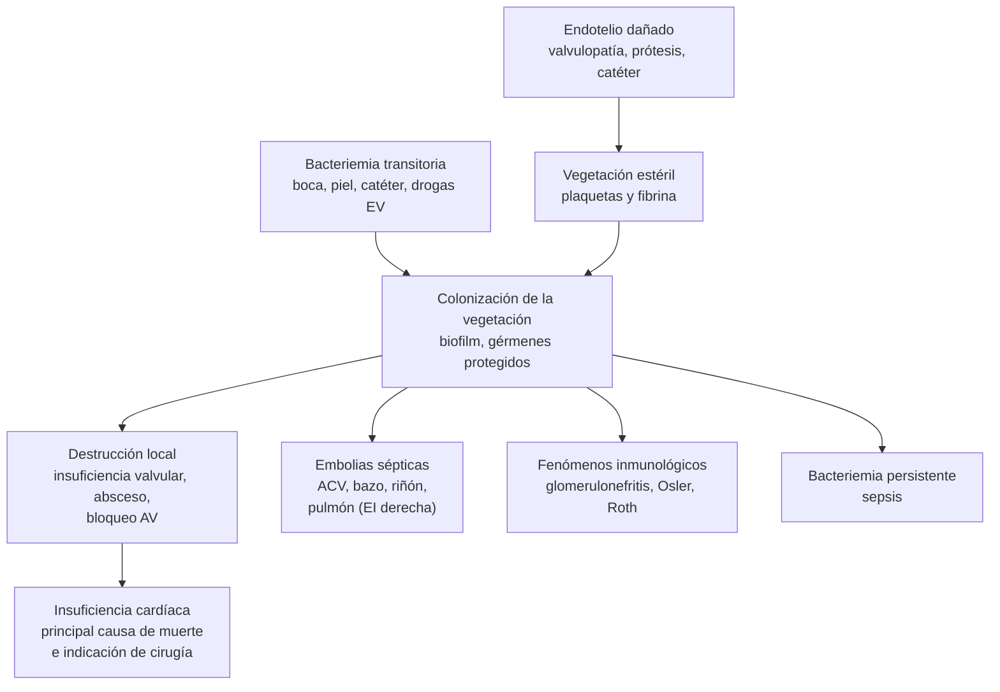
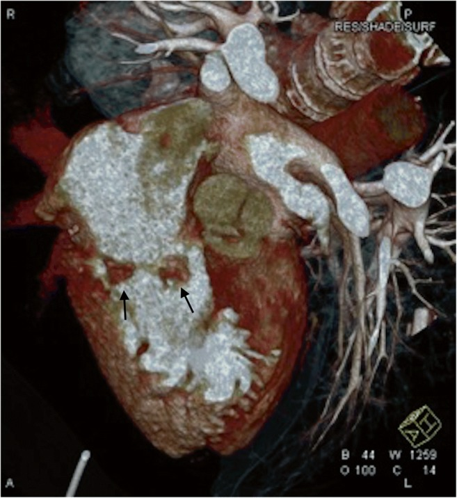

---
tags:
  - Infectología
  - Cardiología
  - Urgencia
  - Frecuente en sala
---

# Endocarditis infecciosa

**Subespecialidad**
Infectología · Cardiología · Cirugía cardíaca ("equipo de endocarditis")

**Guías principales**
ESC 2023: manejo de la endocarditis (*Eur Heart J*) · Criterios de Duke-ISCVID 2023 (*Clin Infect Dis*) · AHA 2015: endocarditis infecciosa del adulto

**Otras fuentes**
Ensayos POET (2019) y EASE (2012) · Estudio cooperativo chileno (Oyonarte, 2012) · Revisión sistemática chilena (Del Castillo, 2025)

**GES**
No

**EUNACOM**
1.04.2.003 Endocarditis bacteriana (sospecha, inicial, derivar)

**Revisado**
Septiembre 2026

!!! abstract "Resumen en 60 segundos"
    - **Endocarditis infecciosa (EI)**: infección del **endocardio**, habitualmente valvular, con **vegetaciones**. Mortalidad hospitalaria de **~ 20–25 %** (en Chile, **~ 25 %**).
    - **Sospéchala** ante:
        - **Fiebre + soplo nuevo**.
        - Fiebre con **factores de riesgo**: prótesis valvular, EI previa, valvulopatía, dispositivos intracardíacos, hemodiálisis, drogas EV.
        - Fiebre con **fenómenos embólicos** (ACV, infarto esplénico o renal).
        - **Bacteriemia por *S. aureus***, estreptococos o enterococos.
    - **Diagnóstico** con los **criterios de Duke-ISCVID 2023**:
        - **≥ 3 hemocultivos** separados **antes del antibiótico**.
        - **Ecocardiograma transtorácico** y luego **transesofágico**.
        - TC cardíaca o PET/TC en las prótesis.
    - **Microbiología**: ***S. aureus*** es hoy el más frecuente, luego los **estreptococos** del grupo *viridans*, ***S. gallolyticus*** (buscar un cáncer de colon) y los **enterococos**. En Chile, **~ 1/3 tiene hemocultivos negativos**, sobre todo por antibióticos previos.
    - **Tratamiento**: antibióticos **bactericidas EV** por **4–6 semanas**, según el germen. Tras ≥ 10 días de tratamiento EV, un **cambio a vía oral** es posible en los pacientes estables (POET).
    - **Cirugía precoz** en tres situaciones:
        - **Insuficiencia cardíaca** (la indicación más frecuente).
        - **Infección no controlada** (absceso, bacteriemia persistente, hongos, gérmenes resistentes).
        - **Prevención de embolias** (vegetación ≥ 10 mm con embolia o con valvulopatía grave).
    - Decisiones en un **equipo de endocarditis** (cardiólogo, infectólogo, cirujano cardíaco).

## Definición

- **Endocarditis infecciosa**: infección microbiana del endocardio. Afecta sobre todo las **válvulas** (nativas o protésicas), pero también el endocardio mural o los **dispositivos intracardíacos** (marcapasos, desfibriladores).
- **Por la válvula**:
    - **EI de válvula nativa**.
    - **EI de válvula protésica** (EVP): **precoz** (< 1 año de la cirugía; gérmenes nosocomiales) o **tardía** (> 1 año; gérmenes similares a los de la válvula nativa).
    - **EI asociada a dispositivos**.
- **Por la adquisición**: comunitaria, **asociada a la atención de salud** (catéteres, hemodiálisis) o en **usuarios de drogas EV** (sobre todo el lado **derecho**: válvula tricúspide).
- **Por la evolución**: **aguda** (días; *S. aureus*, muy destructiva) o **subaguda** (semanas a meses; estreptococos *viridans*, síntomas inespecíficos).

## Epidemiología

### Mundial

- Incidencia de **~ 3–10 por 100.000** habitantes por año, en aumento. Es más frecuente en los **hombres** y en los **> 65 años**.
- El perfil cambió: menos **cardiopatía reumática** y más **adultos mayores**, **prótesis valvulares**, **dispositivos intracardíacos**, **hemodiálisis**, **infecciones asociadas a la atención de salud** y **drogas EV**.
- ***S. aureus*** es hoy el **germen más frecuente** en los países de altos ingresos (~ 25–30 %), seguido de los estreptococos orales y los **enterococos** (en aumento en los adultos mayores).
- **Mortalidad hospitalaria** de **15–30 %**, y **~ 30–40 %** al año. **~ 50 %** de los pacientes requiere **cirugía** durante el episodio.

### Chile

!!! chile "Datos nacionales"
    - **Estudio cooperativo chileno** (506 pacientes en 1998–2008; Oyonarte, 2012):
        - **Cardiopatía reumática** previa en el **22 %**; uso de drogas EV en sólo el **0,7 %**.
        - ***S. aureus*** en el **29 %** de los hemocultivos y **hemocultivos negativos en el 33 %**.
        - **Insuficiencia cardíaca** en el **52 %**; **válvula nativa** en el **86 %**.
        - **Mortalidad hospitalaria** de **26 %**. Fueron factores de mal pronóstico la infección persistente y la **falta de cirugía** cuando estaba indicada.
    - **Revisión sistemática de registros chilenos** (Del Castillo, 2025):
        - Edad media de 54 años y 64 % de hombres.
        - Presentación **aguda** en el 63 %, **válvula aórtica** en el 72 %.
        - ***Staphylococcus*** en el 28 % y **estudio microbiológico negativo** en el **34 %**.
        - **Mortalidad hospitalaria de 24,8 %**.
    - **El problema chileno**: la alta proporción de **hemocultivos negativos**, sobre todo por **antibióticos indicados antes de tomar los hemocultivos**, y el acceso limitado a la cirugía precoz.

## Etiología y factores de riesgo

### Factores de riesgo

- **Cardíacos**:
    - **Prótesis valvular** (incluidas las transcatéter, TAVI).
    - **EI previa**.
    - **Valvulopatía** reumática o degenerativa (estenosis aórtica, insuficiencia mitral), prolapso mitral con insuficiencia.
    - **Cardiopatías congénitas**.
    - **Dispositivos intracardíacos** (marcapasos, DAI).
    - Miocardiopatía hipertrófica obstructiva.
- **No cardíacos**:
    - **Hemodiálisis**.
    - **Catéteres venosos centrales**.
    - **Uso de drogas EV**.
    - **Diabetes**, inmunosupresión, edad avanzada.
    - **Mala salud dental**, procedimientos invasivos.

### Microorganismos

| Germen | Contexto y claves |
|---|---|
| ***Staphylococcus aureus*** | **El más frecuente**; **aguda y destructiva**; nosocomial, catéteres, hemodiálisis, **drogas EV** (tricúspide), diabetes. **Toda bacteriemia por *S. aureus* obliga a descartar una EI** (ecocardiograma) |
| **Estreptococos del grupo *viridans*** (orales) | Clásico de la EI **subaguda** de válvula nativa; mala salud dental |
| ***Streptococcus gallolyticus*** (antes *S. bovis*) | Asociado a **pólipos y cáncer de colon**: hacer una **colonoscopía** |
| ***Enterococcus faecalis*** | Adultos mayores; foco urinario o digestivo; ahora es un germen "típico" en los criterios de Duke |
| **Estafilococos coagulasa negativos** | **EI protésica precoz** y de dispositivos (*S. epidermidis*). ***S. lugdunensis***: agresivo como *S. aureus* |
| **Grupo HACEK** (*Haemophilus*, *Aggregatibacter*, *Cardiobacterium*, *Eikenella*, *Kingella*) | Crecimiento lento; causa de hemocultivos "negativos" |
| **Hongos** (*Candida*, *Aspergillus*) | Prótesis, catéteres, nutrición parenteral, inmunosupresión; vegetaciones grandes; **requieren cirugía** |
| **Hemocultivos negativos** | Sobre todo por **antibióticos previos**. También *Coxiella burnetii* (fiebre Q), *Bartonella*, *Brucella*, *Tropheryma whipplei*: serología y PCR |

- **Endocarditis no infecciosa** (marántica, de Libman-Sacks): cáncer avanzado, lupus, síndrome antifosfolípido. Produce embolias con hemocultivos negativos.

## Fisiopatología

1. Un **endotelio dañado** (flujo turbulento de una valvulopatía, material protésico, catéteres) expone la matriz subendotelial. Sobre ella se depositan **plaquetas y fibrina**, y se forma una **vegetación estéril**.
2. Una **bacteriemia** transitoria (boca, piel, catéteres, drogas EV, tubo digestivo o urinario) coloniza la vegetación. Los gérmenes con adhesinas (*S. aureus*, estreptococos) se adhieren y se multiplican **protegidos** por la fibrina y el **biofilm**, lejos de los neutrófilos. Por eso se necesitan **antibióticos bactericidas**, en **dosis altas** y por **semanas**.
3. **Consecuencias**:
    - **Destrucción valvular** local: insuficiencia valvular, insuficiencia cardíaca, **absceso perivalvular**, fístulas, bloqueo AV.
    - **Embolias sépticas**: ACV, bazo, riñón, extremidades; pulmón en la EI derecha; **aneurismas micóticos**.
    - **Fenómenos inmunológicos**: glomerulonefritis, nódulos de Osler, manchas de Roth, factor reumatoide positivo.
    - **Bacteriemia persistente** y **sepsis**.

*Figura 1. Patogenia de la endocarditis infecciosa y sus complicaciones. Esquema propio.*

## Clasificación

**Criterios de Duke-ISCVID 2023** (resumen):

| Tipo | Criterios |
|---|---|
| **Mayor: microbiológico** | Gérmenes **típicos** en **≥ 2 hemocultivos separados** (*S. aureus*, *S. lugdunensis*, *E. faecalis*, estreptococos *viridans*, *S. gallolyticus*, HACEK, entre otros) · Gérmenes no típicos en hemocultivos **persistentemente positivos** · PCR o serología positiva para *Coxiella* (IgG fase I > 1:800), *Bartonella* o *T. whipplei* |
| **Mayor: imagen** | **Ecocardiograma** o **TC cardíaca**: vegetación, perforación valvular, **absceso**, pseudoaneurisma, fístula, dehiscencia protésica nueva · **PET/TC** con actividad anormal en una prótesis (> 3 meses de la cirugía) |
| **Mayor: quirúrgico** | Evidencia de EI en la inspección durante la cirugía |
| **Menores** | **Predisposición** (EI previa, prótesis, valvulopatía, cardiopatía congénita, dispositivo, drogas EV) · **Fiebre > 38 °C** · **Fenómenos vasculares** (embolias, infartos pulmonares sépticos, abscesos cerebrales o esplénicos, aneurisma micótico, hemorragia intracraneana, hemorragias conjuntivales, **lesiones de Janeway**) · **Fenómenos inmunológicos** (factor reumatoide positivo, **nódulos de Osler**, **manchas de Roth**, glomerulonefritis) · Evidencia microbiológica que no cumple el criterio mayor · Soplo de insuficiencia **nuevo** al auscultar, si no hay ecocardiograma |

- **EI definitiva**: **2 mayores**, **1 mayor + 3 menores** o **5 menores** (o criterios anatomopatológicos).
- **EI posible**: 1 mayor + 1 menor, o 3 menores.
- **EI descartada**: diagnóstico alternativo firme, resolución con ≤ 4 días de antibióticos, o no cumple los criterios.

## Clínica

- **Fiebre**: **~ 90 %** (puede faltar en los adultos mayores, los inmunosuprimidos y los que recibieron antibióticos).
- **Soplo**: **~ 85 %**. Es significativo si es **nuevo** o **cambia**, sobre todo si es de insuficiencia.
- **Síntomas generales** en la EI subaguda: fatiga, **baja de peso**, sudoración nocturna, artralgias, anorexia. Se confunde con un cáncer o una enfermedad reumatológica ("**fiebre de origen desconocido**").
- **Insuficiencia cardíaca**: ~ 40–50 %, por insuficiencia valvular aguda (aórtica o mitral).
- **Embolias**: **20–50 %**.
    - **ACV** (la más grave).
    - **Infarto esplénico** (dolor en el hipocondrio izquierdo) o **renal** (dolor en el flanco, hematuria).
    - Isquemia de extremidades.
    - En la **EI tricuspídea**: **embolias pulmonares sépticas** (nódulos cavitados, tos, dolor pleurítico).
- **Signos periféricos** (hoy poco frecuentes, pero clásicos):
    - **Petequias** conjuntivales y del paladar.
    - **Hemorragias en astilla** subungueales.
    - **Lesiones de Janeway**: máculas indoloras en palmas y plantas (embólicas).
    - **Nódulos de Osler**: nódulos **dolorosos** en los pulpejos (inmunológicos).
    - **Manchas de Roth**: hemorragias retinianas de centro pálido.
    - **Esplenomegalia**, **acropaquia** en la EI de larga evolución.
- **Renal**: **hematuria**, proteinuria, LRA (glomerulonefritis, infartos, nefrotoxicidad).
- **Neurológico**: ACV, meningitis, absceso, **hemorragia** por un aneurisma micótico.
- **Trastornos de la conducción** (bloqueo AV nuevo): sugieren un **absceso perivalvular aórtico**.

!!! alarma "Situaciones que exigen descartar una endocarditis"
    - **Bacteriemia por *S. aureus***: siempre ecocardiograma (transesofágico si hay factores de riesgo o bacteriemia persistente).
    - **Fiebre en un paciente con prótesis valvular o dispositivo intracardíaco**: hemocultivos **antes** de cualquier antibiótico.
    - **ACV o embolia periférica con fiebre**: EI hasta demostrar lo contrario. En ese caso, la **trombólisis está contraindicada** (riesgo de hemorragia por aneurismas micóticos).
    - **Bloqueo AV nuevo** en un paciente con EI: **absceso perivalvular**; cirugía urgente.
    - **Edema pulmonar en la EI**: **cirugía de emergencia**.

## Diagnóstico

**Paso 1. Hemocultivos**:

- **≥ 3 sets** (aeróbico y anaeróbico) de **punciones venosas separadas**, idealmente con **30 minutos** de diferencia, **antes de iniciar los antibióticos**.
- Un volumen adecuado: **10 mL** por frasco.
- En el paciente **grave** (sepsis), tomar los 3 sets en menos de 1 hora e iniciar el tratamiento empírico de inmediato.
- En el paciente **estable** con EI subaguda, se puede esperar el resultado de los hemocultivos antes de tratar.

**Paso 2. Ecocardiograma**:

- **Transtorácico (ETT)** primero: sensibilidad de ~ 70 % en la válvula nativa y **menor en las prótesis**.
- **Transesofágico (ETE)**:
    - Si el ETT es **negativo** con una sospecha **alta**.
    - En **todos** los pacientes con una **prótesis** o un **dispositivo**.
    - En la **bacteriemia por *S. aureus***.
    - Para buscar **complicaciones** (absceso).
    - Sensibilidad > 90 %.
- **Repetir** el ecocardiograma en **5–7 días** si el primero es negativo y la sospecha persiste.

**Paso 3. Otras imágenes**:

- **TC cardíaca**: abscesos y pseudoaneurismas (figura 2).
- **PET/TC con ¹⁸F-FDG** o SPECT con leucocitos marcados: **EI protésica** y de dispositivos.
- **TC o RM cerebral**, **TC de tórax, abdomen y pelvis**: embolias silentes y abscesos.

**Paso 4. Aplicar los criterios de Duke-ISCVID 2023** y presentar el caso al **equipo de endocarditis**.

**Paso 5. Si los hemocultivos son negativos**:

- Serología para ***Coxiella*** y ***Bartonella***.
- **PCR** del tejido valvular si se opera.
- Considerar la endocarditis no infecciosa.

<figure markdown>
{ loading=lazy width="460" }
<figcaption>Figura 2. Vegetaciones en la válvula mitral (flechas) en una TC cardíaca con sincronización electrocardiográfica, reconstrucción volumétrica. Fuente: Hryniewiecki T, Zatorska K, Abramczuk E, et al. The usefulness of cardiac CT in the diagnosis of perivalvular complications in patients with infective endocarditis. <em>Eur Radiol.</em> 2019;29:4368, figura 5. Licencia <a href="https://creativecommons.org/licenses/by/4.0/">CC BY 4.0</a>.</figcaption>
</figure>

## Laboratorio

| Examen | Hallazgos y uso |
|---|---|
| **Hemocultivos × 3** | **El examen clave**; repetirlos cada 24–48 h hasta que se negativicen (bacteriemia persistente = complicación o falla del tratamiento) |
| **Hemograma** | **Anemia** normocítica (enfermedades crónicas), leucocitosis (aguda), trombocitopenia |
| **PCR, VHS, procalcitonina** | Elevadas; útiles para el seguimiento |
| **Creatinina, orina completa** | **Hematuria**, proteinuria, cilindros (glomerulonefritis), LRA |
| **Factor reumatoide, complemento** | FR positivo (criterio menor); complemento bajo en la glomerulonefritis |
| **ECG** | **PR largo o bloqueo AV nuevo**: absceso perivalvular |
| **Serología de *Coxiella* y *Bartonella*** | Hemocultivos negativos |
| **Niveles de vancomicina y gentamicina** | Monitoreo terapéutico |

## Imágenes

- **Ecocardiograma transtorácico y transesofágico**: vegetaciones, destrucción valvular, abscesos, función ventricular.
- **TC cardíaca**: complicaciones perivalvulares (pseudoaneurismas, abscesos), estudio coronario antes de la cirugía.
- **PET/TC**: EI protésica y de dispositivos; embolias y focos a distancia.
- **Neuroimagen** (TC o RM): embolias y hemorragias cerebrales. Es importante antes de la cirugía cardíaca, por la anticoagulación del circuito extracorpóreo.
- **Radiografía o TC de tórax**: nódulos sépticos en la EI derecha.

## Diagnóstico diferencial

| Cuadro | Claves |
|---|---|
| **Bacteriemia sin endocarditis** (catéter, foco urinario) | Ecocardiograma sin vegetaciones; responde rápido al retiro del foco y a los antibióticos |
| **Fiebre reumática aguda** | Faringitis estreptocócica previa, poliartritis migratoria, carditis; hemocultivos negativos, ASO alta |
| **Lupus y síndrome antifosfolípido** (Libman-Sacks) | Vegetaciones estériles; ANA, anticuerpos antifosfolípidos |
| **Endocarditis marántica** | Cáncer avanzado (páncreas, pulmón); embolias con hemocultivos negativos |
| **Mixoma auricular** | Masa en la aurícula izquierda, embolias, síntomas generales |
| **Linfoma, vasculitis, tuberculosis** | Fiebre de origen desconocido sin hemocultivos positivos ni vegetaciones |
| **Trombo o fibrina en una prótesis o un cable** | Sin bacteriemia; ETE y PET/TC |

## Tratamiento

!!! guia "ESC 2023"
    - **Equipo de endocarditis** en un centro de referencia con cirugía cardíaca, para todos los pacientes con EI complicada o protésica.
    - **Antibióticos bactericidas EV** en **dosis altas** por **4–6 semanas**, contados desde el primer día con hemocultivos negativos (o desde la cirugía si los cultivos de la válvula son positivos).
    - **Tratamiento oral parcial**: en la EI **izquierda** estable por estreptococos, *E. faecalis*, *S. aureus* o estafilococos coagulasa negativos, se puede pasar a **antibióticos orales** tras **≥ 10 días** de tratamiento EV (≥ 7 días después de la cirugía). Requiere buena respuesta, sin abscesos y con un ETE sin complicaciones (ensayo **POET**: no fue inferior al tratamiento EV completo).
    - **Cirugía precoz** según las indicaciones (tabla más abajo).
    - **Profilaxis antibiótica** antes de los **procedimientos dentales** de riesgo **sólo** en los pacientes de **alto riesgo**: prótesis valvular o reparación con material, EI previa, cardiopatías congénitas cianóticas o reparadas con material protésico, dispositivos de asistencia ventricular.

!!! dosis "Antibióticos en la endocarditis (función renal normal; ajustar al antibiograma y a la función renal)"
    **Empírico** (tras los hemocultivos, si el paciente está grave):

    - **Válvula nativa o protésica tardía, comunitaria**: **ampicilina 12 g/día EV** (en 4–6 dosis) + **cloxacilina 12 g/día EV** (en 4–6 dosis) ± **gentamicina 3 mg/kg/día**.
    - **Riesgo de SARM** (nosocomial, hemodiálisis, catéter) o **alergia a los betalactámicos**: **vancomicina 30–60 mg/kg/día EV**, en 2–3 dosis, con niveles.
    - **Protésica precoz o asociada a la atención de salud**: **vancomicina** + **gentamicina** (+ rifampicina tras los cultivos, en la EVP por estafilococos).

    **Dirigido** (principales esquemas):

    | Germen | Válvula nativa | Duración |
    |---|---|---|
    | **Estreptococos sensibles a penicilina** (*viridans*, *S. gallolyticus*) | **Penicilina G 12–18 millones U/día EV** o **ceftriaxona 2 g/día EV** | **4 semanas** (2 semanas con gentamicina en casos no complicados); 6 semanas en las prótesis |
    | ***S. aureus* sensible a meticilina** | **Cloxacilina 12 g/día EV** o **cefazolina 6 g/día EV** | **4–6 semanas**; sin gentamicina en la válvula nativa |
    | ***S. aureus* resistente (SARM)** | **Vancomicina** (niveles) o **daptomicina 10 mg/kg/día** | 4–6 semanas |
    | **EI protésica por estafilococos** | Cloxacilina o vancomicina + **rifampicina 900 mg/día** + **gentamicina** (2 semanas) | **≥ 6 semanas** |
    | ***Enterococcus faecalis*** | **Ampicilina 12 g/día + ceftriaxona 2 g cada 12 h** (preferida, sin nefrotoxicidad), o ampicilina + gentamicina | **6 semanas** |
    | **Hongos** | Anfotericina B liposomal ± flucitosina, luego azoles; **cirugía** | Prolongada; supresión crónica |

    - **Anticoagulación**: no se inicia por la EI. En los pacientes que ya la usan y tienen un ACV, se suele suspender transitoriamente (decisión del equipo). **No** dar antiagregantes para prevenir embolias.

**Indicaciones de cirugía (ESC 2023)**:

| Indicación | Situación | Momento |
|---|---|---|
| **Insuficiencia cardíaca** | Insuficiencia valvular aguda grave, obstrucción o fístula con **edema pulmonar refractario** o **shock cardiogénico** | **Emergencia** (< 24 h) |
| | Insuficiencia cardíaca o signos ecocardiográficos de mala tolerancia hemodinámica | **Urgente** (3–5 días) |
| **Infección no controlada** | **Absceso**, pseudoaneurisma, fístula, **vegetación que crece**, bloqueo AV nuevo | Urgente |
| | **Hemocultivos persistentemente positivos** tras **1 semana** de antibióticos adecuados, o foco metastásico no controlado | Urgente |
| | **Hongos** o gérmenes **multirresistentes**; EI protésica por *S. aureus* o gramnegativos no HACEK | Urgente o electiva |
| **Prevención de embolias** | **Vegetación ≥ 10 mm** con un **episodio embólico** a pesar del tratamiento | Urgente |
| | Vegetación ≥ 10 mm con estenosis o insuficiencia valvular grave y bajo riesgo quirúrgico | Urgente |

- En el ensayo **EASE** (2012), la cirugía **precoz** (< 48 h) en pacientes con vegetaciones grandes redujo el compuesto de muerte y embolias frente a la estrategia convencional.
- **ACV isquémico** sin hemorragia ni coma: **no** es contraindicación para operar. La **hemorragia intracraneana** suele obligar a diferir la cirugía.
- **EI de dispositivos**: **retiro completo del sistema** (generador y cables) más antibióticos.

## Complicaciones

- **Cardíacas**:
    - **Insuficiencia cardíaca**: la más frecuente y la principal causa de muerte.
    - **Absceso perivalvular**, fístulas.
    - **Bloqueo AV**.
    - Pericarditis, IAM embólico.
- **Embolias**:
    - **ACV** (**20–40 %**; el riesgo es máximo en las **primeras 2 semanas** y baja rápido con los antibióticos).
    - Bazo, riñón, extremidades, pulmón (EI derecha).
- **Neurológicas**: ACV isquémico, **hemorragia** (aneurismas micóticos), absceso cerebral, meningitis, encefalopatía.
- **Infecciosas**: **sepsis**, **abscesos metastásicos** (espondilodiscitis, absceso esplénico, artritis séptica), bacteriemia persistente.
- **Renales**: LRA por **glomerulonefritis**, infartos, sepsis o **nefrotoxicidad** (gentamicina, vancomicina).
- **Recurrencia** y reinfección, sobre todo en los usuarios de drogas EV y los pacientes en hemodiálisis.

## Pronóstico y seguimiento

- **Mortalidad hospitalaria** de **~ 20–25 %** (26 % en el estudio chileno).
- **Peor pronóstico**:
    - ***S. aureus***, hongos.
    - **Insuficiencia cardíaca**, **abscesos**.
    - **EI protésica**.
    - Edad avanzada, diabetes, ERC y hemodiálisis.
    - ACV.
    - **Cirugía indicada pero no realizada**.
- **Perfil EUNACOM**: **sospecha** (fiebre + soplo, bacteriemia por *S. aureus*, embolias), **tratamiento inicial** (hemocultivos antes del antibiótico, antibiótico empírico en el paciente grave) y **derivación** a un centro con cardiología, infectología y cirugía cardíaca.
- **Seguimiento**:
    - **Hemocultivos** hasta su negativización.
    - Ecocardiograma al final del tratamiento (nueva línea de base).
    - Evaluación dental.
    - **Colonoscopía** si el germen es *S. gallolyticus* o *E. faecalis* sin foco.
    - Educación sobre los signos de recurrencia y la **higiene dental**.
    - **Profilaxis** en los procedimientos de riesgo.
    - Tratamiento de la adicción en los usuarios de drogas EV.

## Perlas para el internado

!!! perla "Para la sala y el turno"
    - **Fiebre + soplo = hemocultivos (3 sets) ANTES del antibiótico**. Un antibiótico "por si acaso" en la urgencia puede dejar sin diagnóstico microbiológico a la mitad de las endocarditis.
    - **Toda bacteriemia por *S. aureus* requiere un ecocardiograma** y hemocultivos de control a las 48–72 h. Nunca es un "contaminante".
    - ***S. gallolyticus* (*S. bovis*) en un hemocultivo = colonoscopía.**
    - **Fiebre en un paciente en hemodiálisis con catéter**: piensa en una EI por *S. aureus*.
    - **ACV + fiebre**: piensa en una EI antes de trombolizar.
    - Un **PR que se alarga** en el ECG diario de un paciente con EI aórtica sugiere un **absceso**: avisa al equipo.
    - **La gentamicina es nefrotóxica**: controla la creatinina y los niveles, y úsala sólo cuando está indicada.
    - **Profilaxis dental** (amoxicilina 2 g VO 30–60 min antes) sólo en los pacientes de **alto riesgo**, no en todos los valvulópatas.

## Preguntas de repaso

??? repaso "1. Hombre de 68 años con prótesis aórtica biológica hace 3 años, con fiebre de 2 semanas, baja de peso y un soplo diastólico nuevo. ¿Qué haces?"
    Sospecha de **endocarditis de válvula protésica tardía**.

    1. **3 sets de hemocultivos** separados antes de cualquier antibiótico.
    2. Hemograma, PCR, creatinina, orina completa y **ECG** (bloqueo AV por absceso).
    3. **Ecocardiograma transtorácico** y **transesofágico** (obligatorio en las prótesis). Si no es concluyente, **TC cardíaca** o **PET/TC**.
    4. Si está estable, se puede esperar el resultado de los hemocultivos. Si está grave, iniciar el tratamiento empírico (vancomicina + gentamicina ± rifampicina según el protocolo).
    5. **Derivar** a un centro con equipo de endocarditis y cirugía cardíaca.

??? repaso "2. Mujer de 45 años en hemodiálisis por catéter, con fiebre y calofríos. 3 de 3 hemocultivos con *S. aureus* resistente a meticilina. ¿Cuál es el manejo?"
    **Bacteriemia por SARM asociada a catéter**, con alto riesgo de EI.

    - **Vancomicina** EV (dosis según la diálisis y los niveles) o daptomicina.
    - **Retiro del catéter**.
    - **Ecocardiograma transesofágico**.
    - **Hemocultivos de control** a las 48–72 h.
    - Si se confirma una EI: vancomicina o daptomicina por **4–6 semanas** y evaluación de la cirugía según las complicaciones.
    - Buscar focos metastásicos (espondilodiscitis, abscesos).

??? repaso "3. ¿Cuáles son las tres grandes indicaciones de cirugía en la endocarditis?"
    1. **Insuficiencia cardíaca** por destrucción valvular: de **emergencia** si hay edema pulmonar refractario o shock.
    2. **Infección no controlada**: absceso, pseudoaneurisma, fístula, **bloqueo AV nuevo**, hemocultivos positivos tras 1 semana de tratamiento, hongos o gérmenes multirresistentes.
    3. **Prevención de embolias**: vegetación **≥ 10 mm** con una embolia durante el tratamiento, o con una valvulopatía grave.

??? repaso "4. Paciente con endocarditis por *Streptococcus gallolyticus* en tratamiento con ceftriaxona. ¿Qué estudio adicional pides y por qué?"
    Una **colonoscopía**, porque *S. gallolyticus* (antes *S. bovis* biotipo I) se asocia a **pólipos adenomatosos y cáncer colorrectal**. La lesión colónica es la probable puerta de entrada.

??? repaso "5. Hombre de 30 años usuario de drogas EV, con fiebre, tos, dolor pleurítico, múltiples nódulos cavitados en la TC de tórax y un soplo sistólico que aumenta con la inspiración. ¿Qué sospechas?"
    **Endocarditis tricuspídea** (derecha) por ***S. aureus***, con **embolias pulmonares sépticas**. El soplo de insuficiencia tricuspídea aumenta con la inspiración (signo de Rivero-Carvallo).

    - **Hemocultivos**, **ecocardiograma** y cobertura antiestafilocócica (cloxacilina o vancomicina según el riesgo de SARM).
    - La EI derecha tiene mejor pronóstico que la izquierda.
    - Tratar también la **adicción** y evaluar el VIH y las hepatitis B y C.

## Referencias

1. Delgado V, Ajmone Marsan N, de Waha S, et al. 2023 ESC Guidelines for the management of endocarditis. *Eur Heart J.* 2023;44:3948–4042. doi:[10.1093/eurheartj/ehad193](https://doi.org/10.1093/eurheartj/ehad193)
2. Fowler VG, Durack DT, Selton-Suty C, et al. The 2023 Duke-International Society for Cardiovascular Infectious Diseases Criteria for Infective Endocarditis: Updating the Modified Duke Criteria. *Clin Infect Dis.* 2023;77:518–526. doi:[10.1093/cid/ciad271](https://doi.org/10.1093/cid/ciad271)
3. Baddour LM, Wilson WR, Bayer AS, et al. Infective Endocarditis in Adults: Diagnosis, Antimicrobial Therapy, and Management of Complications: A Scientific Statement for Healthcare Professionals From the American Heart Association. *Circulation.* 2015;132:1435–1486. doi:[10.1161/CIR.0000000000000296](https://doi.org/10.1161/CIR.0000000000000296)
4. Iversen K, Ihlemann N, Gill SU, et al. Partial Oral versus Intravenous Antibiotic Treatment of Endocarditis (POET). *N Engl J Med.* 2019;380:415–424. doi:[10.1056/NEJMoa1808312](https://doi.org/10.1056/NEJMoa1808312)
5. Kang DH, Kim YJ, Kim SH, et al. Early surgery versus conventional treatment for infective endocarditis (EASE). *N Engl J Med.* 2012;366:2466–2473. doi:[10.1056/NEJMoa1112843](https://doi.org/10.1056/NEJMoa1112843)
6. Cahill TJ, Prendergast BD. Infective endocarditis. *Lancet.* 2016;387:882–893. doi:[10.1016/S0140-6736(15)00067-7](https://doi.org/10.1016/S0140-6736(15)00067-7)
7. Oyonarte M, Montagna R, Braun S, et al. Clinical characteristics, complications and mortality in 506 patients with infective endocarditis and determinants of survival rate at 10 years [artículo en español]. *Rev Med Chile.* 2012;140:1517–1528. doi:[10.4067/S0034-98872012001200001](https://doi.org/10.4067/S0034-98872012001200001)
8. Del Castillo C, Tapia A, Begazo A, et al. Clinical and epidemiological profile of infective endocarditis in Chile – A systematic review of descriptive analysis. *Am Heart J Plus.* 2025;52:100511. doi:[10.1016/j.ahjo.2025.100511](https://doi.org/10.1016/j.ahjo.2025.100511)
9. Hryniewiecki T, Zatorska K, Abramczuk E, et al. The usefulness of cardiac CT in the diagnosis of perivalvular complications in patients with infective endocarditis. *Eur Radiol.* 2019;29:4368. doi:[10.1007/s00330-018-5965-2](https://doi.org/10.1007/s00330-018-5965-2)
