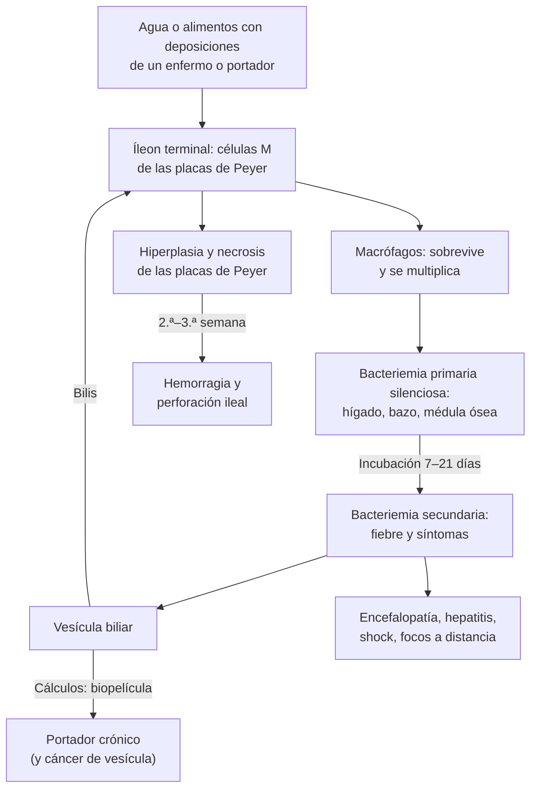

---
tags:
  - Infectología
---

# Fiebre tifoidea y paratifoidea

**Subespecialidad**
Infectología · Gastroenterología · Salud pública

**Guías principales**
BIA 2022: diagnóstico y manejo de la fiebre entérica · OMS 2018: vacunas contra la fiebre tifoidea (documento de posición) · MINSAL, Decreto 7 (2019): notificación obligatoria

**Otras fuentes**
Carga mundial de la fiebre tifoidea y paratifoidea (GBD 2017) · Revisión de *Lancet* (Wain 2015) · Revisión de *Clin Microbiol Rev* (Crump 2015) · Fiebre tifoidea en Chile 1969–2012 (Marco 2018) · Portadores crónicos en Santiago 2017–2019 (Lagos 2024)

**GES**
No es GES. Es una **enfermedad de notificación obligatoria** dentro de 24 horas desde la confirmación.

**EUNACOM**
1.04.1.012 Fiebre tifoidea y paratifoidea (específico, completo, completo)

**Revisado**
Octubre 2026

!!! abstract "Resumen en 60 segundos"
    - **Fiebre entérica**: infección **sistémica** por ***Salmonella* Typhi** (fiebre tifoidea) o ***S.* Paratyphi A, B o C** (paratifoidea). El único reservorio es el **ser humano**. Se transmite por vía **fecal-oral**: agua o alimentos contaminados por enfermos o **portadores**.
    - **Mundo**: ~**14 millones** de casos y ~**136 000** muertes al año (2017), sobre todo en el **sur de Asia** y África.
    - **Chile**: fue **hiperendémica** en Santiago (**220/100 000** en 1983). Bajó **> 95 %** con el control del riego con aguas servidas, la vacunación escolar y el control de manipuladores y portadores. Hoy es **rara** (~0,4/100 000 en 2015).
    - Los casos actuales son **importados** (viajeros, inmigrantes) o vienen de **portadoras crónicas** mayores con **litiasis biliar**.
    - **Clínica**: **fiebre progresiva "en escalera"** por días, cefalea, malestar, dolor abdominal, **constipación o diarrea**. Puede haber **bradicardia relativa**, **roséola tífica**, hepatoesplenomegalia y "estado tífico".
        - Desde la **2.ª–3.ª semana**: **hemorragia** y **perforación ileal**.
    - **Laboratorio**: leucocitos **normales o bajos**, **eosinófilos en cero**, PCR y transaminasas elevadas.
    - **Diagnóstico**: **hemocultivos** (2 pares, idealmente antes del antibiótico). El **mielocultivo** es el estándar de oro. **No usar el Widal**.
    - **Tratamiento** (BIA 2022):
        - **No complicada**: **azitromicina** VO 7 días.
        - **Complicada o necesita vía EV**: **ceftriaxona 2 g/día**.
        - **Ciprofloxacino** solo si la cepa es **sensible**: las cepas chilenas recientes lo son; muchas del sur de Asia, no.
        - **Viajero desde Pakistán** (cepas **XDR**): azitromicina **más meropenem** si es grave.
    - **Notificar** dentro de 24 horas; estudiar a los **contactos del hogar** y a los **manipuladores de alimentos**. Prevención: agua segura, higiene de los alimentos, **vacuna** para viajeros.

## Definición

| Concepto | Definición |
|---|---|
| **Fiebre entérica** | Infección **sistémica** por *Salmonella enterica* serotipos **Typhi** o **Paratyphi A, B o C**, adaptados solo al ser humano |
| **Fiebre tifoidea** | Causada por ***S.* Typhi** (~**76 %** de la fiebre entérica en el mundo) |
| **Fiebre paratifoidea** | Causada por ***S.* Paratyphi A, B o C**. Cuadro similar, a menudo **más leve** |
| **Salmonelosis no tifoidea** | Otros serotipos (*S.* Enteritidis, *S.* Typhimurium), con reservorio **animal**: casi siempre **gastroenteritis** autolimitada ([ver diarrea aguda](../gastroenterologia/diarrea-aguda-y-clostridioides-difficile.md)) |
| **Portador convaleciente** | Sigue excretando *S.* Typhi o Paratyphi en las deposiciones tras el tratamiento, por **menos de 12 meses** |
| **Portador crónico** | Excreta *S.* Typhi o Paratyphi por **más de 12 meses**; habitualmente desde la **vesícula biliar**. Algunos nunca tuvieron una tifoidea sintomática |
| **Recaída** | Reaparición de la fiebre y de la bacteriemia semanas después de terminar el tratamiento |

## Epidemiología

- **Mundial** (GBD 2017):
    - **14,3 millones** de casos de fiebre tifoidea y paratifoidea en 2017, **44,6 % menos** que en 1990. La incidencia estandarizada es de **198 por 100 000**.
    - *S.* Typhi causó el **76,3 %** de los casos.
    - Letalidad global **0,95 %**: ~**136 000** muertes. Es mayor en niños, adultos mayores y países de bajos ingresos.
    - Concentrada en el **sur de Asia** y el **África subsahariana**, por falta de agua potable y saneamiento.
- **Resistencia antimicrobiana**:
    - Muy alta resistencia a las **fluoroquinolonas** en el sur de Asia.
    - Desde **2016**, brote de ***S.* Typhi extensamente resistente (XDR)** en **Pakistán**: resistente a ampicilina, cloranfenicol, cotrimoxazol, fluoroquinolonas y **cefalosporinas de tercera generación**, y sensible a la **azitromicina** y los **carbapenémicos**.
    - Hay casos aislados productores de **BLEE** en Irak, India y Bangladesh.
- **En países no endémicos**: casi todos los casos son **importados** por viajeros. La letalidad es **< 1 %**.

!!! chile "Datos nacionales"
    - **Historia**:
        - Entre **1975 y 1983**, Santiago vivió una **epidemia** de fiebre tifoidea, con una incidencia de **219,6 por 100 000** en 1983 (**9825** casos en la Región Metropolitana).
        - Ocurrió pese a que ~96 % de la población tenía agua potable. Se atribuyó a la transmisión de persona a persona y por alimentos, al **riego de hortalizas con aguas servidas** (se aisló *S.* Typhi en el 10 % de las muestras de agua de riego) y a muchos **portadores crónicos** (alta prevalencia de **colelitiasis**).
    - **Control** (figura 1):
        - **1983–1984**: **vacunación oral** de escolares (Ty21a, ~486 000 niños), control de los **manipuladores de alimentos**, búsqueda de **portadores**, educación masiva y regulación del riego. La incidencia bajó **51 %** y siguió bajando ~10 % al año.
        - **1991**: ante la llegada del **cólera**, se **prohibió el cultivo y la venta de hortalizas regadas con aguas servidas**. La incidencia bajó otro **77 %**.
        - En 2012 hubo solo **65 casos** en la Región Metropolitana.
    - **Hoy**: incidencia de ~**0,4 por 100 000** (2015). Entre 2007 y 2015, el 87 % de los casos fue fiebre tifoidea y el 8 % paratifoidea.
    - **Santiago, 2017–2019**: 25 cultivos positivos.
        - **19** casos **autóctonos** y **6** relacionados con viajes o inmigración desde países endémicos.
        - **5 de 16** casos autóctonos agudos se ligaron a **4 portadoras crónicas** del hogar: mujeres de **69–79 años** con **enfermedad vesicular**, con cepas de genotipos de la epidemia de los años 80.
        - Las cepas chilenas fueron **sensibles a todos los antibióticos útiles, incluido el ciprofloxacino** (salvo una).
    - **Notificación obligatoria** dentro de **24 horas** desde la confirmación (Decreto 7 de 2019 del MINSAL). El ISP confirma y tipifica las cepas.

<figure markdown>
![Gráfico de líneas de la incidencia de fiebre tifoidea por 100 000 habitantes en Chile entre 1950 y 2012. La línea continua naranja de la Región Metropolitana oscila entre 50 y 140 hasta 1975, sube bruscamente a más de 200 en 1978 y alcanza el máximo de unos 220 en 1983; luego cae a menos de 80 hacia 1985, tiene un pico menor en 1989 y se desploma a menos de 10 desde 1992, hasta casi cero en 2012. La línea discontinua azul del resto de Chile se mantiene entre 30 y 70 hasta los años 80 y luego desciende de forma gradual hasta casi cero](../assets/figuras/tifoidea/incidencia-chile-1950-2012-marco-2018.jpg){ loading=lazy }
<figcaption>Figura 1. Incidencia de fiebre tifoidea por 100 000 habitantes en la Región Metropolitana (línea continua) y en el resto de Chile (línea discontinua), 1950–2012. Se ven la epidemia de 1975–1983 y las caídas tras las intervenciones de 1983–1984 y de 1991. Fuente: Marco C, Delgado I, Vargas C, et al. Typhoid fever in Chile 1969–2012: analysis of an epidemic and its control. <em>Am J Trop Med Hyg.</em> 2018;99(3 Suppl):26–33, figura 1. Licencia <a href="https://creativecommons.org/licenses/by/4.0/">CC BY</a>.</figcaption>
</figure>

## Etiología

| Aspecto | Detalle |
|---|---|
| **Agente** | *Salmonella enterica* serotipo **Typhi** (cápsula **Vi**); serotipos **Paratyphi A, B y C**. Bacilos gramnegativos, **intracelulares facultativos** |
| **Reservorio** | **Exclusivamente humano**: enfermos, convalecientes y **portadores crónicos** |
| **Transmisión** | **Fecal-oral**: **agua** contaminada con deposiciones; **alimentos** preparados por portadores; **hortalizas regadas con aguas servidas**; **mariscos** crudos de aguas contaminadas; contacto en el hogar |
| **Incubación** | **7–21 días** en promedio (hasta ~41 días); depende del inóculo |
| **Factores de riesgo** | **Viaje** a zonas endémicas (sur de Asia, África, algunos países de América Latina) en los 28 días previos; **contacto en el hogar** con un caso o portador; **menor acidez gástrica** (IBP, gastrectomía); en el portador: **litiasis biliar**, sexo femenino, edad avanzada |

## Fisiopatología

- **Ingesta y paso gástrico**: la acidez gástrica destruye gran parte del inóculo; con menos ácido basta un inóculo menor.
- **Invasión intestinal**: en el **íleon terminal**, la bacteria cruza la mucosa por las **células M** de las **placas de Peyer**. Allí la fagocitan los **macrófagos**, dentro de los cuales **sobrevive y se multiplica**.
- **Bacteriemia primaria** (silenciosa): llega a los ganglios mesentéricos y al **sistema reticuloendotelial** (hígado, bazo, médula ósea), donde se multiplica durante la incubación.
- **Bacteriemia secundaria**: comienzan la **fiebre** y los síntomas. La **cápsula Vi** evade el complemento y la **toxina tifoídica** contribuye al cuadro sistémico.
- **Vesícula biliar**: se infecta por vía hematógena o biliar y **reinfecta el intestino** a través de la bilis. En las vesículas con **cálculos**, la bacteria forma **biopelículas** y se perpetúa: **portación crónica**. Esta se asocia a **cáncer de vesícula** (OR ~4 en un metaanálisis), relevante en Chile.
- **Placas de Peyer**: se hiperplasian, se **necrosan** y se **ulceran** en el eje longitudinal del íleon. Desde la **2.ª–3.ª semana** pueden **sangrar** o **perforarse**.
- **Respuesta inflamatoria**: predomina la respuesta **mononuclear** (macrófagos), lo que explica los **leucocitos normales o bajos**, la eosinopenia, la hepatoesplenomegalia y la hepatitis.

*Figura 2. Patogenia de la fiebre tifoidea. Esquema propio.*

## Clasificación

- **Por agente**: **fiebre tifoidea** (*S.* Typhi) o **paratifoidea** (*S.* Paratyphi A, B, C).
- **Por gravedad** (para decidir la vía y el lugar del tratamiento):
    - **No complicada**: fiebre y síntomas sistémicos, tolera la vía oral, sin signos de gravedad. Puede tratarse **ambulatoriamente** si los síntomas son leves y no vomita.
    - **Complicada o grave**: **hemorragia digestiva**, **perforación intestinal**, **encefalopatía** (compromiso de conciencia, delirium), **shock**, vómitos que impiden la vía oral, focos a distancia o miocarditis.
- **Por resistencia**:
    - **Sensible**.
    - **Resistente a fluoroquinolonas**: frecuente en el sur de Asia.
    - **Multirresistente (MDR)**: ampicilina, cloranfenicol y cotrimoxazol.
    - **Extensamente resistente (XDR)**: MDR más fluoroquinolonas y ceftriaxona; Pakistán.
- **Por evolución**: **aguda**, **recaída**, **portación convaleciente** o **crónica**.

<figure markdown>
![Esquema en columnas para la incubación y las semanas 1 a 4 de la fiebre tifoidea sin tratamiento. Arriba, una curva de temperatura: plana en la incubación, sube en escalera durante la semana 1, se mantiene en meseta de 39 a 40 grados en las semanas 2 y 3 y desciende en lisis en la semana 4. Fila de clínica: incubación asintomática con bacteriemia primaria silenciosa; semana 1 con fiebre progresiva, cefalea, malestar, tos, dolor abdominal y constipación o diarrea; semana 2 con postración, estado tífico, roséola tífica, hepatoesplenomegalia y lengua saburral; semana 3 con fiebre y compromiso persistentes y delirium en los casos graves; semana 4 con mejoría lenta y recaída posible. Fila de complicaciones: raras en la semana 1; encefalopatía, hepatitis, colecistitis y shock en la semana 2; hemorragia intestinal y perforación ileal, de máximo riesgo, en la semana 3; portación crónica del 1 al 5 por ciento en la vesícula con litiasis después. Abajo, barras de rendimiento: el hemocultivo es máximo en la semana 1 y cae después; el mielocultivo se mantiene alto todas las semanas; el coprocultivo aumenta desde la semana 2; el Widal tiene rendimiento bajo y no sirve para diagnosticar](../assets/figuras/tifoidea/curso-clinico-por-semanas.svg){ loading=lazy }
<figcaption>Figura 3. Curso clásico de la fiebre tifoidea sin tratamiento y rendimiento relativo de los exámenes según la semana de enfermedad. Esquema propio basado en BIA 2022 (Nabarro 2022), Wain 2015 y Crump 2015.</figcaption>
</figure>

## Clínica

- **Fiebre**: síntoma **cardinal**, casi universal.
    - Clásicamente sube **en escalera** durante la primera semana y luego se mantiene en **meseta de 39–40 °C**.
    - Se acompaña de **calofríos**, **cefalea** (20–80 %), mialgias, artralgias, anorexia y malestar.
- **Gastrointestinales** (~**80 %** tiene al menos uno):
    - **Dolor abdominal** (32–60 %).
    - **Diarrea** (35–84 %), clásicamente "en sopa de arvejas".
    - **Constipación**, en adultos y niños mayores (4–16 %).
    - Distensión abdominal.
- **Otros**: **tos seca** (13–44 %), **lengua saburral**.
- **Signos clásicos** (pueden faltar):
    - **Bradicardia relativa** (signo de Faget): pulso más bajo que lo esperado para la fiebre, sobre todo en la primera semana. Su presencia es variable.
    - **Roséola tífica**: máculas rosadas de **2–4 mm** que **desaparecen a la presión**, en el **tronco** y el abdomen, durante la **2.ª semana**. Aparecen en hasta el **19 %** y se ven poco en la piel oscura.
    - **Hepatomegalia** y **esplenomegalia**, más frecuentes desde la 2.ª–3.ª semana.
    - **"Estado tífico"**: apatía, obnubilación, **delirium** (*typhos* = humo, estupor). Es propio de la enfermedad **grave** (~12 % en zonas endémicas).
- **Paratifoidea**: cuadro similar, a menudo **más corto y leve**.
- **Adultos mayores, inmunosuprimidos o con tratamiento antibiótico previo**: cuadro **atípico** o **fiebre prolongada sin foco**.

!!! alarma "Signos de tifoidea complicada: hospitalizar y tratar por vía EV"
    - **Dolor abdominal súbito**, **defensa**, **distensión** o shock: **perforación ileal**. Llamar al **cirujano**.
    - **Hemorragia digestiva** (melena o hematoquecia).
    - **Compromiso de conciencia**, delirium o convulsiones (**encefalopatía tifoídica**).
    - **Hipotensión** o **shock**.
    - **Vómitos** persistentes, deshidratación, intolerancia oral.
    - **Más de 10 días** de evolución: el riesgo de complicaciones aumenta.
    - **Viajero desde Pakistán** (posible cepa **XDR**).

## Diagnóstico

!!! guia "Diagnóstico de la fiebre entérica (BIA 2022)"
    - **Sospechar** ante **fiebre** (sobre todo de varios días y sin foco claro) con:
        - **viaje** a una zona endémica en los **28 días** previos (hasta 60 días si la sospecha es alta), o
        - **contacto en el hogar** con un caso confirmado.
        - En Chile: también si hay **brote familiar**, contacto con un **portador** o ingesta de mariscos o verduras crudas de riesgo.
    - **Hemocultivos**: examen **de elección**, **antes** del antibiótico.
        - En el adulto, al menos **2 pares** (20 mL por par): el volumen de sangre aumenta el rendimiento.
        - Sensibilidad **40–80 %**; cae después de la **primera semana** y con antibióticos.
    - **Coprocultivo** (o hisopado rectal), **urocultivo** y cultivo de pus: muestras complementarias que aumentan el rendimiento. Sensibilidad del coprocultivo **30–40 %**.
    - **Mielocultivo**: **estándar de oro**. La carga bacteriana en la médula es mayor y el rendimiento se mantiene pese a varios días de antibióticos o de evolución. Considerarlo si hubo **antibióticos previos**, si la consulta es **tardía** o si hay **falla del tratamiento**.
    - **No usar el test de Widal** ni las pruebas rápidas serológicas para diagnosticar: tienen baja sensibilidad y especificidad (reactividad cruzada, vacunación previa). Las técnicas moleculares no reemplazan al cultivo.
    - Pedir el **antibiograma** (ceftriaxona, azitromicina, ciprofloxacino, meropenem) y **notificar** el caso.

## Laboratorio

| Examen | Hallazgo típico |
|---|---|
| **Hemograma** | **Leucocitos normales o bajos** (la leucocitosis sugiere perforación u otro diagnóstico); **linfopenia** (20–40 %); **eosinófilos en cero**; **anemia** (16–44 % de los adultos; mayor si hay hemorragia); **trombocitopenia** (16–32 %) |
| **PCR** | **Elevada** en el 80–100 % |
| **Pruebas hepáticas** | **Transaminasas elevadas** en el 47–82 % de los adultos (a menudo 2–3 veces el valor normal); hiperbilirrubinemia leve |
| **Electrolitos, creatinina** | Deshidratación, LRA en los casos graves; hiponatremia |
| **Lactato, gases** | Si hay shock o sepsis |
| **Hemocultivos, coprocultivo, urocultivo** | Ver Diagnóstico |
| **Serología de hepatitis A, VIH; frotis y test rápido de malaria en el viajero** | Para el diagnóstico diferencial |

## Imágenes

- **Ecografía abdominal**:
    - **Hepatoesplenomegalia**, adenopatías mesentéricas y engrosamiento del íleon terminal.
    - **Colecistitis** (a menudo alitiásica).
    - **Colelitiasis** en el estudio del portador.
- **Radiografía de tórax de pie o de abdomen**: **neumoperitoneo** si hay perforación.
- **TC de abdomen con contraste**: perforación, absceso, colecciones. De elección si hay dolor abdominal importante o sospecha de complicación.
- **Ecocardiograma** si hay soplo nuevo o sospecha de miocarditis o endocarditis.

## Diagnóstico diferencial

| Diagnóstico | Claves para distinguir |
|---|---|
| **Hepatitis A aguda** | Ictericia, transaminasas > 10 veces el valor normal, IgM anti-VHA ([ver](../gastroenterologia/hepatitis-aguda-e-insuficiencia-hepatica-aguda.md)) |
| **Pielonefritis, colangitis, absceso hepático** | Foco en el examen, la orina o la ecografía; leucocitosis |
| **Malaria y dengue** (viajero) | Zona de viaje; frotis y test rápido de malaria; trombocitopenia y hemoconcentración en el dengue |
| **Rickettsiosis** | Viaje, escara de inoculación, exantema; responde a la doxiciclina |
| **Leptospirosis** | Exposición a agua o roedores, mialgias en las pantorrillas, sufusión conjuntival, LRA ([ver](hantavirus-y-leptospirosis.md)) |
| **Brucelosis** | Leche o quesos no pasteurizados, sudoración, artritis sacroilíaca; hemocultivo prolongado y serología |
| **Tuberculosis miliar o extrapulmonar** | Fiebre prolongada, baja de peso, imágenes; cultivos para micobacterias |
| **Endocarditis infecciosa** | Soplo, factores de riesgo, hemocultivos con otros gérmenes ([ver](endocarditis-infecciosa.md)) |
| **Síndrome mononucleósico, VIH agudo** | Faringitis, adenopatías, linfocitos atípicos; serología |
| **Gastroenteritis por *Salmonella* no tifoidea, *Shigella*, *Campylobacter*** | Diarrea predominante, inicio brusco, horas de incubación; coprocultivo |
| **Linfoma, enfermedades autoinmunes** | Fiebre prolongada sin cultivos positivos; estudio de síndrome febril prolongado |

## Tratamiento

!!! guia "Tratamiento antibiótico de la fiebre entérica (BIA 2022)"
    - **No complicada** (procedente de Chile o de zonas sin cepas XDR): **azitromicina oral** **7 días**. Si mejora y la cepa es sensible, completar los 7 días.
    - **Complicada o necesita vía EV**: **ceftriaxona EV**. Al mejorar, **pasar a la vía oral** (azitromicina o ciprofloxacino si es sensible) hasta completar el tratamiento.
    - **Ciprofloxacino**: **no** como tratamiento **empírico** en viajeros del sur de Asia (la mayoría de esas cepas es resistente). Es una buena opción si el antibiograma muestra **sensibilidad**: en Chile, las cepas autóctonas recientes son sensibles.
    - **Viajero desde Pakistán** (zona de cepas **XDR**):
        - **Azitromicina** si es no complicada.
        - **Azitromicina más meropenem** si es complicada o necesita vía EV.
    - **Agregar cobertura** (doble terapia) si:
        - Hay **perforación intestinal**: cubrir los anaerobios y la flora entérica.
        - Se sospecha otra infección: **doxiciclina** si se sospecha una rickettsiosis en un viajero grave, o una sepsis de otro origen.
    - **Manejo ambulatorio** posible si los síntomas son leves y tolera la vía oral sin vómitos.
    - **Falla del tratamiento**: sospecharla si hay **fiebre y síntomas después de 7 días** de un antibiótico efectivo, **bacteriemia persistente** al día 7, o si aparecen complicaciones o empeora **después del día 5**.
        - La fiebre baja lento: **no cambiar** el antibiótico antes de tiempo si el paciente está estable.
        - **No repetir los hemocultivos** antes del día 7, salvo deterioro.

- **Medidas generales**: hidratación, antipiréticos (de preferencia paracetamol), alimentación según tolerancia y vigilancia del abdomen.
    - **Evitar los antidiarreicos** (loperamida).
- **Perforación ileal**: **cirugía de urgencia** (sutura o resección del segmento) más **antibióticos de amplio espectro** con cobertura de **anaerobios**. El pronóstico empeora con la demora ([ver abdomen agudo](../gastroenterologia/abdomen-agudo.md)).
- **Hemorragia digestiva**: soporte, transfusión según la necesidad; habitualmente cede con el tratamiento. Si es masiva, endoscopía, angiografía o cirugía.
- **Shock**: manejo de la [sepsis](sepsis-y-shock-septico.md) más el antibiótico efectivo.
- **Corticoides**: son **controvertidos**.
    - En **1984**, un ensayo en Indonesia mostró menor mortalidad con **dexametasona en dosis altas** en la tifoidea grave con compromiso de conciencia o shock (10 % vs 56 %, en 38 pacientes tratados con cloranfenicol).
    - La **BIA 2022 no los recomienda** por la debilidad de esa evidencia.
    - Decidir caso a caso con **infectología**.
- **Salud pública**:
    - **Notificar** dentro de 24 horas.
    - **Estudiar a los contactos del hogar**: coprocultivos, buscando sobre todo a los **portadores crónicos**, que en Santiago explicaron casi un tercio de los casos autóctonos.
    - Los **manipuladores de alimentos**, el personal de salud y los cuidadores de niños o de personas dependientes **no deben trabajar** hasta tener **coprocultivos negativos** tras el tratamiento (por ejemplo, 3 muestras separadas por 48 h, desde 1 semana después de terminar el antibiótico).
- **Portador crónico**:
    - Ofrecer **tratamiento**: **ciprofloxacino** 28 días si la cepa es sensible; alternativas: azitromicina o amoxicilina 28 días.
    - Hacer una **ecografía** para buscar **colelitiasis**.
    - Si el antibiótico fracasa, considerar la **colecistectomía**: además reduce el riesgo de cáncer de vesícula ([ver litiasis biliar](../gastroenterologia/litiasis-biliar-colecistitis-colangitis.md)).
    - Controlar con coprocultivos **mensuales** tras el tratamiento.

!!! dosis "Antibióticos de la fiebre entérica (adulto, BIA 2022)"
    | Fármaco | Dosis | Uso |
    |---|---|---|
    | **Azitromicina** | **1 g VO** el primer día, luego **500 mg/día** (VO o EV), **7 días** en total | No complicada; paso a la vía oral; cepas XDR sensibles |
    | **Ceftriaxona** | **2 g EV cada 24 h**, **7–10 días** (o hasta el paso a la vía oral) | Complicada o necesita vía EV |
    | **Ciprofloxacino** | **750 mg VO cada 12 h**, **7 días** | Solo si la cepa es **sensible**. Precaución en los mayores de 60 años (tendinopatía, aneurisma aórtico, QT largo) |
    | **Meropenem** | **1 g EV cada 8 h**, **≥ 10 días** (hasta 48 h después de la defervescencia) | Cepas **XDR** complicadas, junto con azitromicina |
    | **Portación crónica** | **Ciprofloxacino 750 mg VO cada 12 h × 28 días**; o **azitromicina 500 mg/día × 28 días**; o **amoxicilina 1 g VO cada 8 h × 28 días** | Según la sensibilidad, con infectología |

## Complicaciones

| Complicación | Comentario |
|---|---|
| **Hemorragia intestinal** | Desde la 2.ª–3.ª semana, por ulceración de las placas de Peyer; la más frecuente de las graves |
| **Perforación ileal** | **Íleon terminal**, 3.ª semana. Dolor súbito, peritonitis, neumoperitoneo; puede ser **solapada** en el paciente con estado tífico o con corticoides. **Cirugía de urgencia** |
| **Encefalopatía tifoídica** | Delirium, obnubilación, coma, convulsiones; marcador de gravedad |
| **Shock séptico** | Más frecuente con consulta tardía |
| **Hepatitis, colecistitis** | Transaminasas altas; colecistitis a menudo alitiásica |
| **Miocarditis**, endocarditis | Raras; más en valvulopatías previas. Arritmias, alteraciones del ECG |
| **Focos a distancia** | Osteomielitis, artritis, abscesos (hígado, bazo), meningitis, neumonía |
| **Otras** | CID, síndrome hemofagocítico, pancreatitis, LRA |
| **Recaída** | Más frecuente con ciclos cortos de ceftriaxona (**5–15 %** con 3–7 días en algunos estudios); baja con azitromicina. Repetir los cultivos y tratar de nuevo según la sensibilidad |
| **Portación crónica** | **1–5 %** tras la enfermedad aguda; más en **mujeres**, **mayores** y con **colelitiasis**. Riesgo de **transmisión** y de **cáncer de vesícula** |

## Pronóstico y seguimiento

- **Pronóstico**:
    - Con tratamiento oportuno, la letalidad es **< 1 %** en los países no endémicos; la letalidad global estimada es **~1 %**.
    - Empeora con la **consulta tardía** (> 10 días), la **perforación**, la **encefalopatía** y el **shock**, en los niños pequeños, los adultos mayores y con las cepas resistentes.
- **Respuesta esperada**: la fiebre cede en **días** (más lento con azitromicina y en la tifoidea grave). Es esperable que persista algunos días pese a un antibiótico efectivo.
- **Seguimiento**:
    - Control clínico al terminar el tratamiento. **Educar** sobre la **recaída** (fiebre en las semanas siguientes): consultar y repetir los hemocultivos.
    - **Coprocultivos de control** en los manipuladores de alimentos, el personal de salud y los cuidadores (portación convaleciente). Si siguen positivos más allá de 12 meses, es un **portador crónico**.
    - **Ecografía** si se confirma la portación crónica.
- **Prevención**:
    - **Agua potable** y alcantarillado; **no regar hortalizas con aguas servidas**.
    - **Lavado de manos**; cocer los **mariscos**; lavar y desinfectar las verduras crudas. En el viaje: "hiérvalo, cocínelo, pélelo o déjelo".
    - Control de los **manipuladores de alimentos** y de los **portadores**.
    - **Vacunas** (OMS 2018):
        - La **vacuna conjugada** (TCV) es la **preferida** a todas las edades, desde los 6 meses, en **1 dosis**.
        - Alternativas: la **polisacárida Vi** (desde los 2 años, refuerzo cada ~3 años) y la **oral Ty21a** (cápsulas, desde los ~6 años), la misma que se usó en los escolares chilenos en los años 80.
        - En Chile se indican a los **viajeros** a zonas endémicas. **No** protegen por completo, menos aún contra la paratifoidea: mantener las medidas de higiene.

## Perlas para el internado

!!! perla "Para recordar en la sala"
    - **Fiebre de más de 5–7 días, sin foco, con leucocitos normales o bajos y eosinófilos en cero**: piensa en tifoidea y toma **hemocultivos** antes de cualquier antibiótico.
    - **Pregunta siempre por viajes o inmigración reciente** desde zonas endémicas (sur de Asia, África, parte de América Latina y el Caribe) y por **contactos en el hogar**. En Chile, la fuente puede ser la **abuela con cálculos en la vesícula** (portadora crónica).
    - **El Widal no diagnostica**: un título "positivo" no confirma y uno negativo no descarta.
    - **Bradicardia relativa** (39,5 °C con pulso de 80) + roséola + esplenomegalia: la tríada clásica, pero **la mayoría no la tiene completa**.
    - **No complicada = azitromicina oral**; **complicada = ceftriaxona EV**. **Ciprofloxacino solo con antibiograma sensible** (las cepas chilenas recientes lo son).
    - **Viajero desde Pakistán**: piensa en **XDR** (resistente a la ceftriaxona): azitromicina, más **meropenem** si está grave.
    - **Dolor abdominal nuevo en la 2.ª–3.ª semana = perforación ileal** hasta demostrar lo contrario: TC y cirujano.
    - **La fiebre tarda en bajar**: no cambies el antibiótico al día 3 si el paciente está estable.
    - **Notifica** dentro de 24 horas y pide **coprocultivos** a los contactos del hogar y a los manipuladores de alimentos.

## Preguntas de repaso

??? repaso "1. Mujer de 26 años, de Santiago, con 9 días de fiebre progresiva hasta 39,8 °C, cefalea, dolor abdominal difuso y constipación. FC 82 lpm. Bazo palpable. Leucocitos 3800/mm³ con eosinófilos 0, PCR 95 mg/L, GOT 140 y GPT 160 U/L. Su abuela, que vive con ella, tiene colelitiasis. ¿Sospecha, estudio y manejo?"
    - **Fiebre tifoidea**: fiebre prolongada, **bradicardia relativa**, esplenomegalia, **leucopenia** con **eosinófilos en cero** y transaminasas elevadas. La abuela con **colelitiasis** puede ser una **portadora crónica**.
    - **Estudio**:
        - **2 pares de hemocultivos** antes del antibiótico, más coprocultivo y urocultivo.
        - Serología de hepatitis A para el diferencial.
        - Ecografía abdominal si hay dolor importante.
    - **Tratamiento**: no complicada y tolera la vía oral, así que **azitromicina** 1 g el día 1 y luego 500 mg/día hasta completar 7 días. Ajustar según el antibiograma (ciprofloxacino si es sensible).
    - **Notificar** dentro de 24 horas y **estudiar a los contactos del hogar** (coprocultivos de la abuela).

??? repaso "2. Hombre de 34 años que volvió hace 12 días de Pakistán. Fiebre de 6 días, vómitos que impiden la vía oral, PA 88/54 mmHg y somnolencia. ¿Qué tratamiento empírico indica?"
    - Sospecha de **fiebre entérica complicada** (hipotensión, compromiso de conciencia, sin vía oral) en un viajero desde una **zona de cepas XDR** (resistentes a fluoroquinolonas y **ceftriaxona**).
    - **Hemocultivos** antes del antibiótico; frotis y test rápido de **malaria** si estuvo en una zona de riesgo.
    - Iniciar **meropenem 1 g EV cada 8 h más azitromicina**, con manejo de la **sepsis** (volumen, vasopresores si se requieren).
    - Considerar **doxiciclina** si se sospecha una rickettsiosis. Ajustar según el antibiograma y manejar con infectología.

??? repaso "3. Paciente en la tercera semana de una fiebre tifoidea, en tratamiento con ceftriaxona, presenta dolor abdominal súbito, abdomen en tabla y taquicardia. ¿Qué sospecha y qué hace?"
    - **Perforación ileal**: complicación clásica de la **tercera semana** por necrosis de las placas de Peyer del **íleon terminal**.
    - **Manejo**:
        1. Régimen cero y volumen.
        2. **Radiografía de tórax de pie o TC** para buscar **neumoperitoneo**.
        3. **Cirujano de inmediato**: **cirugía de urgencia**.
        4. **Ampliar la cobertura** a **anaerobios** y flora entérica (por ejemplo, agregar metronidazol, o cambiar a un esquema de amplio espectro).
    - La demora empeora el pronóstico.

??? repaso "4. Un paciente con fiebre de 3 días trae un test de Widal \"positivo 1/160\" de un laboratorio particular. Está en buen estado y no tiene otros hallazgos. ¿Cómo lo interpreta?"
    - El **Widal no sirve para diagnosticar** fiebre tifoidea: tiene **baja sensibilidad y especificidad**. Hay reacción cruzada con otras salmonelas y enterobacterias, influye la vacunación previa y el resultado depende del momento de la enfermedad.
    - El diagnóstico se basa en los **cultivos**: **hemocultivos** (de elección), coprocultivo y, en casos seleccionados, mielocultivo.
    - Evaluar la fiebre de forma completa y **no tratar** como tifoidea solo por el Widal.

??? repaso "5. Mujer de 72 años, manipuladora de alimentos en un casino, asintomática. Su nieto tuvo una fiebre tifoidea confirmada y el coprocultivo de ella es positivo para *S.* Typhi. Tiene colelitiasis en la ecografía. ¿Qué es y cómo se maneja?"
    - Probable **portadora crónica** de *S.* Typhi: mujer mayor con **colelitiasis**, la vesícula como reservorio y fuente del caso secundario.
    - **Manejo**:
        - **Notificar** y suspender la **manipulación de alimentos** hasta tener coprocultivos negativos.
        - **Tratamiento** con infectología: **ciprofloxacino 750 mg cada 12 h por 28 días** si la cepa es sensible (alternativas: azitromicina o amoxicilina por 28 días).
        - Si fracasa, **colecistectomía**, que además reduce el riesgo de **cáncer de vesícula**.
        - Coprocultivos **mensuales** de control.

??? repaso "6. Hombre de 40 años con fiebre tifoidea confirmada (cepa sensible), al cuarto día de ceftriaxona sigue con 38,5 °C, pero está hemodinámicamente estable, sin dolor abdominal y come mejor. ¿Cambia el antibiótico?"
    - **No**. La defervescencia de la fiebre tifoidea es **lenta** (días), incluso con un antibiótico efectivo.
    - Se considera **falla** si persisten la fiebre y los síntomas **después de 7 días** de tratamiento efectivo, si hay bacteriemia persistente al día 7, o si aparecen complicaciones o empeora después del día 5.
    - Continuar, vigilar el abdomen y la conciencia, y **no repetir los hemocultivos** antes del día 7 salvo deterioro. Pasar a la vía oral (azitromicina o ciprofloxacino si es sensible) cuando mejore.

## Referencias

1. Nabarro LE, McCann N, Herdman MT, et al. British Infection Association guidelines for the diagnosis and management of enteric fever in England. *J Infect.* 2022;84(4):469–489. doi:[10.1016/j.jinf.2022.01.014](https://doi.org/10.1016/j.jinf.2022.01.014)
2. World Health Organization. Typhoid vaccines: WHO position paper – March 2018. *Wkly Epidemiol Rec.* 2018;93(13). [who.int](https://www.who.int/publications-detail-redirect/typhoid-vaccines-who-position-paper-march-2018)
3. Ministerio de Salud de Chile. Decreto 7: aprueba el reglamento sobre notificación de enfermedades transmisibles de declaración obligatoria y su vigilancia. 2019. [texto en faolex.fao.org](https://faolex.fao.org/docs/pdf/chi206424.pdf)
4. GBD 2017 Typhoid and Paratyphoid Collaborators. The global burden of typhoid and paratyphoid fevers: a systematic analysis for the Global Burden of Disease Study 2017. *Lancet Infect Dis.* 2019;19(4):369–381. doi:[10.1016/S1473-3099(18)30685-6](https://doi.org/10.1016/S1473-3099(18)30685-6)
5. Wain J, Hendriksen RS, Mikoleit ML, et al. Typhoid fever. *Lancet.* 2015;385(9973):1136–1145. doi:[10.1016/S0140-6736(13)62708-7](https://doi.org/10.1016/S0140-6736(13)62708-7)
6. Crump JA, Sjölund-Karlsson M, Gordon MA, Parry CM. Epidemiology, clinical presentation, laboratory diagnosis, antimicrobial resistance, and antimicrobial management of invasive *Salmonella* infections. *Clin Microbiol Rev.* 2015;28(4):901–937. doi:[10.1128/CMR.00002-15](https://doi.org/10.1128/CMR.00002-15)
7. Marco C, Delgado I, Vargas C, et al. Typhoid fever in Chile 1969–2012: analysis of an epidemic and its control. *Am J Trop Med Hyg.* 2018;99(3 Suppl):26–33. doi:[10.4269/ajtmh.18-0125](https://doi.org/10.4269/ajtmh.18-0125)
8. Lagos RM, Sikorski MJ, Hormazábal JC, et al. Detecting residual chronic *Salmonella* Typhi carriers on the road to typhoid elimination in Santiago, Chile, 2017–2019. *J Infect Dis.* 2024;230(2):e254–e267. doi:[10.1093/infdis/jiad585](https://doi.org/10.1093/infdis/jiad585)
9. Sanhueza Palma NC, Farías Molina S, Calzadilla Riveras J, Hermoso A. Fiebre tifoidea: reporte de caso y revisión de la literatura. *Medwave.* 2016;16(5):e6474. doi:[10.5867/medwave.2016.05.6474](https://doi.org/10.5867/medwave.2016.05.6474)
10. Hoffman SL, Punjabi NH, Kumala S, et al. Reduction of mortality in chloramphenicol-treated severe typhoid fever by high-dose dexamethasone. *N Engl J Med.* 1984;310(2):82–88. doi:[10.1056/NEJM198401123100203](https://doi.org/10.1056/NEJM198401123100203)
