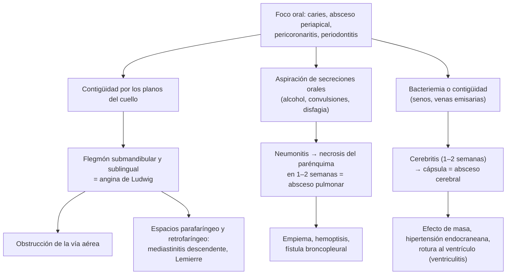

---
tags:
  - Infectología
  - GES
  - Urgencia
---

# Infecciones por flora oral: flegmón del piso de la boca (angina de Ludwig), absceso pulmonar y absceso cerebral

**Subespecialidad**
Infectología · Otorrinolaringología y cirugía maxilofacial · Respiratorio · Neurocirugía

**Guías principales**
ESCMID 2024: diagnóstico y tratamiento del absceso cerebral · Revisión basada en la evidencia de la angina de Ludwig (Bridwell, *Am J Emerg Med* 2021) · GES N.° 46: urgencia odontológica ambulatoria

**Otras fuentes**
Cohorte nacional danesa de absceso cerebral (Bodilsen, *Brain* 2023) · Metaanálisis de absceso cerebral (Brouwer, *Neurology* 2014) · Absceso pulmonar: ensayos de clindamicina vs. penicilina (Levison 1983) y de ampicilina-sulbactam vs. clindamicina (Allewelt 2004); cohortes de Maitre (2021) y Chiang (2023) · Caso chileno de angina de Ludwig (Guzmán-Letelier 2017)

**GES**
Sí para el flegmón odontogénico (N.° 46: urgencia odontológica ambulatoria)

**EUNACOM**
1.04.2.004 Flegmón submaxilar, submandibular y del piso de la boca (sospecha, inicial, derivar) · 1.05.1.001 Absceso pulmonar (específico, inicial, derivar) · 1.04.2.001 Absceso cerebral (sospecha, inicial, derivar)

**Revisado**
Septiembre 2026

!!! abstract "Resumen en 60 segundos"
    - La **flora de la boca** (estreptococos del grupo *anginosus*, anaerobios como *Fusobacterium*, *Prevotella* y *Peptostreptococcus*) causa tres infecciones graves: el **flegmón del piso de la boca**, el **absceso pulmonar** y el **absceso cerebral**. En todas hay que **buscar y tratar el foco dental**.
    - **Angina de Ludwig**:
        - Celulitis **bilateral** de los espacios submandibular, sublingual y submentoniano, casi siempre por un **molar inferior**.
        - Piso de la boca **leñoso**, lengua elevada, **trismus**, disfagia, **estridor**.
        - **El riesgo es la vía aérea**: posición sentada, anestesia y otorrino de inmediato; **intubación con fibroscopio despierto** con la **vía aérea quirúrgica** preparada.
        - **Antibiótico EV** (ampicilina-sulbactam, o ceftriaxona + metronidazol, o clindamicina), **drenaje quirúrgico** y extracción del diente.
    - **Absceso pulmonar**:
        - Cavidad necrótica > 2 cm con **nivel hidroaéreo**, por **aspiración** (alcohol, convulsiones, disfagia, mala dentadura).
        - Tos con **expectoración pútrida**, fiebre y baja de peso de semanas.
        - **Ampicilina-sulbactam** o **clindamicina**, por **3–6 semanas** o más, hasta la resolución. Drenaje si no responde.
        - **Broncoscopía** si no hay un factor de aspiración (descartar un **cáncer**).
    - **Absceso cerebral**:
        - La tríada clásica (fiebre, cefalea y déficit focal) está en sólo el **20 %**.
        - **RM con difusión**: anillo fino con **restricción central**. **No hacer punción lumbar**.
        - **Aspiración neuroquirúrgica** + **cefalosporina de 3.ª generación + metronidazol** por **6–8 semanas** (ESCMID 2024).
        - Buscar el foco: dental, senos paranasales, oído, **endocarditis**.
    - En Chile, el **flegmón orocervicofacial de origen odontogénico** tiene garantía **GES N.° 46**: confirmación en **24 h** y tratamiento **inmediato**.

## Definición

- **Flegmón (celulitis) del cuello**: infección difusa, sin pus localizado al inicio, de los tejidos blandos. Se habla de **absceso** cuando hay una colección.
- **Angina de Ludwig**:
    - Celulitis **bilateral y rápidamente progresiva** de los espacios **submandibular, sublingual y submentoniano**.
    - Casi siempre de **origen dental**: 2.º y 3.er molar inferior, cuyas raíces llegan bajo el músculo milohioideo.
    - Desplaza la lengua hacia arriba y atrás y **obstruye la vía aérea**.
- **Infecciones profundas del cuello**: incluyen los espacios **parafaríngeo** y **retrofaríngeo**, que comunican con el **mediastino**.
- **Absceso pulmonar**: cavidad de **necrosis** del parénquima de **más de 2 cm**, habitualmente con **nivel hidroaéreo**.
    - La **neumonía necrotizante** tiene varias cavidades pequeñas (< 2 cm).
    - **Primario**: aspiración en una persona sin otra enfermedad pulmonar. **Secundario**: obstrucción bronquial (cáncer, cuerpo extraño), émbolos sépticos o inmunosupresión.
    - **Agudo** (< 4–6 semanas) o **crónico**.
- **Absceso cerebral**: colección focal de pus en el parénquima cerebral, rodeada de una **cápsula**.
    - Pasa por una fase de **cerebritis** (primeras 1–2 semanas) antes de encapsularse.

## Epidemiología

### Mundial

- **Absceso cerebral** (cohorte nacional de Dinamarca, 485 adultos, 2007–2020; Bodilsen 2023):
    - La incidencia **subió de 0,4 a 0,8 por 100.000 adultos**.
    - Mediana de edad de 59 años; **40 % inmunocomprometidos**.
    - Focos: **infección dental en el 19 %** y **otorrinolaringológica en el 14 %**. Agentes: **bacterias de la cavidad oral en el 59 %**, *S. aureus* 6 %, enterobacterias 3 %.
    - Mortalidad: **6 % al alta** y **12 % a los 6 meses**. Riesgo mayor con la **rotura intraventricular** (RR 3,48), la inmunosupresión (2,84), la edad > 65 años (2,18) y un absceso > 3 cm (1,81).
- **Absceso cerebral** (metaanálisis de 9.699 pacientes; Brouwer 2014):
    - Predominio **masculino** (2,4:1) y factor predisponente en el **86 %**.
    - *Streptococcus* 34 %, *Staphylococcus* 18 %.
    - La **tríada clásica** estuvo en sólo el **20 %**.
    - La letalidad **bajó de 40 % a 10 %** en 50 años gracias a la TC y la RM, la neurocirugía y los antibióticos.
- **Absceso pulmonar**: poco frecuente desde la era antibiótica (64 casos en 20 años en una unidad de infectología de Francia; Maitre 2021).
    - Evolución: **secuelas radiológicas 46,9 %**, **recaída 12,5 %**, **muerte 4,8 %**.
    - Peor evolución con el absceso **broncogénico** (por aspiración) y con **menos de 6 semanas** de antibiótico.
- **Angina de Ludwig**: más frecuente con **mala higiene dental** e **inmunosupresión** (diabetes, alcoholismo, VIH) (Bridwell 2021).

### Chile

!!! chile "Datos nacionales"
    - **GES N.° 46, urgencia odontológica ambulatoria**:
        - Incluye el **flegmón orocervicofacial de origen odontogénico**, los **abscesos de los espacios anatómicos** bucomaxilofaciales, la **pericoronaritis** y los abscesos submucosos, subperiósticos o apicales.
        - Acceso a **tratamiento inicial de urgencia**, **confirmación diagnóstica dentro de 24 h** desde la sospecha y **tratamiento inmediato**.
    - **Caso de Valdivia** (Guzmán-Letelier 2017):
        - Hombre de 42 años con **diabetes descompensada** (HbA1c 17,6 %) y una **pericoronaritis del tercer molar inferior** tratada con amoxicilina-clavulánico oral.
        - Evolucionó a una angina de Ludwig con **estridor**. Requirió **traqueostomía**, **cervicotomía con debridamiento** de tejido necrótico, drenaje continuo y clindamicina + ceftriaxona.
        - Es un ejemplo del paciente típico: diabético, con un foco dental y un tratamiento inicial insuficiente.
    - Otros abscesos: no hay datos nacionales de incidencia publicados. Los egresos se registran en el DEIS.

## Etiología y factores de riesgo

| Cuadro | Microbiología | Factores de riesgo y focos |
|---|---|---|
| **Flegmón del piso de la boca / angina de Ludwig** | **Polimicrobiana**: estreptococos del grupo *viridans* y ***anginosus*** (*milleri*), **anaerobios** (*Prevotella*, *Fusobacterium*, *Peptostreptococcus*, *Bacteroides*), *S. aureus*; gramnegativos en diabéticos e inmunosuprimidos | **Caries y abscesos de molares inferiores**, **pericoronaritis**, extracción dental reciente, **diabetes**, alcoholismo, VIH, inmunosupresión, mala higiene oral |
| **Absceso pulmonar** | **Anaerobios** de la boca (*Peptostreptococcus*, *Prevotella*, *Fusobacterium*), ***S. anginosus***, *S. aureus* (post-influenza, embolias sépticas), ***K. pneumoniae*** (diabéticos, alcohólicos), *Pseudomonas* (nosocomial), *Nocardia*, **TB** y hongos (diferencial) | **Aspiración**: alcoholismo, convulsiones, **compromiso de conciencia**, disfagia, **mala dentadura**; **obstrucción bronquial** (**cáncer**, cuerpo extraño); **émbolos sépticos** (**endocarditis tricuspídea** en usuarios de drogas EV, **síndrome de Lemierre**) |
| **Absceso cerebral** | **Estreptococos** (*anginosus*), **anaerobios** de la boca, *S. aureus* (trauma, cirugía, endocarditis), enterobacterias (otógenos); en inmunosuprimidos: ***Toxoplasma***, ***Nocardia***, hongos (*Aspergillus*), *Listeria*, TB | **Contigüidad**: dental, **sinusitis**, **otitis o mastoiditis**. **Hematógeno**: **endocarditis**, absceso pulmonar, bronquiectasias, **malformaciones arteriovenosas pulmonares** (Osler), cardiopatías congénitas cianóticas. Trauma penetrante, neurocirugía. **Criptogénico** en ~ 15 % (sin factor predisponente) |

- **Localización del absceso cerebral según el foco**:
    - Sinusal o dental: **frontal**.
    - Otógeno: **temporal** o **cerebeloso**.
    - Hematógeno: **múltiple**, en la unión córtico-subcortical del territorio de la cerebral media.
- **Localización del absceso pulmonar por aspiración**: segmentos **posteriores de los lóbulos superiores** y **superiores de los lóbulos inferiores** (los declives en decúbito), más a **derecha**.

## Fisiopatología

*Figura 1. Las tres vías por las que la flora oral produce infecciones graves: contigüidad cervical, aspiración y diseminación al cerebro. Esquema propio.*

- **Angina de Ludwig**:
    - La infección de las raíces de los molares inferiores perfora la cortical lingual de la mandíbula, bajo el milohioideo.
    - Se extiende al espacio **submandibular**, cruza al **sublingual** y al lado contrario.
    - El edema empuja la **lengua** hacia arriba y atrás, y la infección puede bajar al **mediastino**.
- **Absceso pulmonar**: el inóculo aspirado (grande y rico en anaerobios) produce una **neumonitis** que se **necrosa** en 1–2 semanas. La cavidad drena al bronquio y deja un **nivel hidroaéreo**; de ahí la **expectoración pútrida**.
- **Absceso cerebral**: las bacterias llegan por **contigüidad** o por la **sangre**.
    - Primero una **cerebritis** (inflamación sin cápsula).
    - Luego una **cápsula** de colágeno, más **delgada hacia el ventrículo**: ahí puede **romperse** y causar una ventriculitis de mal pronóstico.

## Clasificación

| Cuadro | Categorías |
|---|---|
| **Infección cervical odontogénica** | Absceso **localizado** (periapical, submucoso) · **Flegmón** de un espacio (submandibular unilateral) · **Angina de Ludwig** (bilateral, 3 espacios) · Infección **profunda** (parafaríngea, retrofaríngea) · **Mediastinitis** descendente o **fascitis necrotizante** cervical |
| **Absceso pulmonar** | **Primario** (aspiración) o **secundario** (obstrucción, embolias sépticas, inmunosupresión) · **Agudo** (< 4–6 semanas) o **crónico** · Por mecanismo: **broncogénico** o **hematógeno** |
| **Absceso cerebral** | Por origen: **contigüidad**, **hematógeno**, **postraumático o posquirúrgico**, **criptogénico** · Por huésped: **inmunocompetente** o **inmunosuprimido** · **Único** o **múltiple** · Etapa: **cerebritis** o absceso **encapsulado** |

## Clínica

### Flegmón del piso de la boca y angina de Ludwig

- Antecedente de **dolor dental**, extracción reciente o pericoronaritis.
- **Aumento de volumen submandibular bilateral**, doloroso, **indurado** ("leñoso"), sin fluctuación al inicio.
- **Piso de la boca elevado**, **lengua protruida** y desplazada hacia arriba.
- **Disfagia**, **odinofagia**, **sialorrea** (no puede tragar la saliva), voz apagada ("en papa caliente").
- **Trismus**: es un **hallazgo tardío**.
- **Signos de obstrucción de la vía aérea**:
    - **Estridor**, disnea, **posición sentada con el cuello extendido** (posición de trípode).
    - Agitación, cianosis.
- Fiebre, taquicardia, compromiso del estado general; **sepsis** en los casos avanzados.
- **Dolor torácico**, disnea o crepitación que baja al tórax: **mediastinitis descendente**.

### Absceso pulmonar

- Curso **subagudo** (1–3 semanas o más): fiebre, sudoración nocturna, **baja de peso**, anemia.
- Tos con **expectoración abundante, purulenta y de mal olor** (pútrida), sobre todo si drena al bronquio. A veces **hemoptisis**.
- Antecedente de **factores de aspiración** y **mala dentadura**.
    - Si el paciente es **desdentado** y no tiene factores de aspiración, sospechar un **cáncer bronquial** obstructivo.
- Hipocratismo digital en los casos crónicos.
- **Émbolos sépticos**: múltiples nódulos cavitados en un usuario de drogas EV (endocarditis tricuspídea) o en un joven con faringitis reciente, dolor cervical y trombosis de la yugular interna (**síndrome de Lemierre**, *Fusobacterium necrophorum*).

### Absceso cerebral

- **Cefalea** (el síntoma más frecuente), a menudo **progresiva** y localizada.
- **Déficit neurológico focal** (82 % en la cohorte danesa), **fiebre** (sólo en ~ la mitad), **convulsiones**, compromiso de conciencia, náuseas y vómitos.
- La **tríada clásica** (fiebre, cefalea y déficit focal) está en sólo el **20 %**: **la ausencia de fiebre no descarta** el absceso.
- **Empeoramiento brusco**, con meningismo y compromiso de conciencia: sospechar una **rotura al ventrículo** o una herniación.
- En el **inmunosuprimido** puede ser más solapado. Hay que pensar en *Toxoplasma* (VIH), *Nocardia* (corticoides, trasplante; con lesiones pulmonares o cutáneas) y hongos.

## Diagnóstico

!!! alarma "Angina de Ludwig: la vía aérea primero"
    - **No acostar al paciente** para la TC si no tolera el decúbito, y **no sedarlo** en la urgencia.
    - Llamar de inmediato a **anestesia** y **otorrinolaringología o cirugía maxilofacial**.
    - Primera opción para asegurar la vía aérea: **intubación con fibroscopio flexible con el paciente despierto**, idealmente en pabellón, con la **vía aérea quirúrgica preparada** (cricotirotomía o **traqueostomía** con anestesia local) (Bridwell 2021).
    - La intubación con laringoscopía directa tras inducción y relajación puede ser **imposible** y precipitar una obstrucción completa.
    - Hospitalizar en la **UCI** para vigilar la vía aérea.

- **Flegmón y angina de Ludwig**:
    - El diagnóstico es **clínico**.
    - **TC de cuello con contraste** (si el paciente puede acostarse con seguridad): extensión, **colecciones drenables**, gas, compromiso de la vía aérea y del mediastino.
    - **Ecografía** al lado de la cama si no tolera el decúbito.
    - **Ortopantomografía** para ubicar el diente causal.
- **Absceso pulmonar**:
    - **Radiografía**: cavidad con **nivel hidroaéreo**.
    - **TC de tórax con contraste**: confirma, mide y distingue del **empiema** (Imágenes).
    - **Hemocultivos**; expectoración (poco útil para los anaerobios); **baciloscopías y cultivo de micobacterias**.
    - **Broncoscopía** si hay sospecha de **obstrucción** (desdentado, sin factores de aspiración, fumador, sin respuesta).
- **Absceso cerebral** (ESCMID 2024):
    - **RM con difusión**: el examen de elección (recomendación fuerte). **TC con contraste** si no hay RM.
    - **No hacer punción lumbar** ante una lesión con efecto de masa: riesgo de **herniación** y rendimiento bajo.
    - **Aspiración o excisión** del absceso para Gram, **cultivo aerobio y anaerobio**, estudio de micobacterias y hongos si corresponde, y **PCR molecular** (16S) si los cultivos son negativos.
    - **Hemocultivos** antes de los antibióticos.

!!! guia "ESCMID 2024: buscar el origen del absceso cerebral"
    - **Evaluación dental** y ortopantomografía.
    - **TC de senos paranasales y oídos**.
    - **Ecocardiograma** (endocarditis).
    - **TC de tórax**: absceso pulmonar, **malformaciones arteriovenosas pulmonares**.
    - **Test de VIH** y estudio de la inmunidad.
    - Si no hay foco (criptogénico), considerar una **malformación arteriovenosa pulmonar**.

## Laboratorio

| Examen | Hallazgo o utilidad |
|---|---|
| **Hemograma**, **PCR**, procalcitonina | Leucocitosis y PCR alta (pueden faltar en el absceso cerebral) |
| **Glicemia, HbA1c** | **Diabetes** descompensada (angina de Ludwig, *Klebsiella*) |
| **Hemocultivos** (2 sets) | Antes de los antibióticos, en todos |
| **Creatinina**, electrolitos, lactato, gases | Sepsis; dosis de antibióticos |
| **Cultivo del pus** (drenaje, aspiración) con **anaerobios** | Ajustar la terapia; enviar rápido en un medio para anaerobios |
| **Baciloscopías y cultivo de Koch** | Absceso pulmonar (diferencial con TB cavitaria) |
| **Test de VIH** | Todos los abscesos pulmonares y cerebrales |
| **Serología de *Toxoplasma*** | Absceso cerebral en inmunosuprimidos |

## Imágenes

- **Angina de Ludwig**: la TC muestra **celulitis difusa** del piso de la boca, **colecciones**, **gas** y el **estrechamiento de la vía aérea** (Figura 2). Buscar la extensión **parafaríngea, retrofaríngea y mediastínica**.
- **Absceso pulmonar**:
    - **Absceso**: redondeado, **pared gruesa e irregular**, **ángulo agudo** con la pared torácica, sin desplazar los vasos.
    - **Empiema**: **lenticular**, **ángulos obtusos**, **pleuras separadas** (signo de la pleura dividida), comprime el pulmón.
    - Nódulos cavitados múltiples y periféricos sugieren **émbolos sépticos**.
    - El drenaje percutáneo guiado por TC es una opción en los abscesos que no responden (Figura 3).
- **Absceso cerebral**:
    - Lesión con **refuerzo en anillo fino y regular**, **edema** alrededor y **restricción de la difusión** en el centro (DWI brillante, ADC bajo).
    - El tumor necrótico **no** restringe en el centro (Figura 4).

<figure markdown>
{ loading=lazy width="380" }
<figcaption>Figura 2. Angina de Ludwig por una pericoronaritis del tercer molar inferior en un hombre diabético de Valdivia: elevación y protrusión de la lengua, compromiso de la vía aérea y una gran colección hipodensa del piso de la boca. Imagen recortada para omitir los datos del examen. Tomado de Guzmán-Letelier M, Crisosto-Jara C, Diaz-Ricouz C, Peñarrocha-Diago M, Peñarrocha-Oltra D. Severe odontogenic infection: an emergency. Case report. <em>J Clin Exp Dent</em> 2017;9:e319 (figura 3). Licencia <a href="https://creativecommons.org/licenses/">CC BY</a>.</figcaption>
</figure>

<figure markdown>
{ loading=lazy }
<figcaption>Figura 3. Absceso pulmonar en una mujer de 69 años con 2 semanas de fiebre y tos: (A) zona necrótica hipodensa de 3,7 cm con gas (flecha); (B) drenaje percutáneo guiado por TC el mismo día. Tomado de Chiang PC, Lin CY, Hsu YC, Huang LT, et al. Early drainage reduces the length of hospital stay in patients with lung abscess. <em>Front Med</em> 2023;10:1206419 (figura 1). Licencia <a href="https://creativecommons.org/licenses/by/4.0/">CC BY</a>.</figcaption>
</figure>

<figure markdown>
![Esquema de cuatro cortes cerebrales. El absceso piógeno tiene un anillo fino y regular, más delgado hacia el ventrículo, con el centro brillante en la difusión y edema alrededor. El tumor necrótico, glioblastoma o metástasis, tiene un anillo grueso, irregular y nodular, con el centro sin restricción de la difusión. La toxoplasmosis, en pacientes con VIH y CD4 bajo 100, da lesiones múltiples en los ganglios basales con el signo de la diana excéntrica, y mejora con tratamiento empírico en 10 a 14 días. La neurocisticercosis da quistes con un punto interno, el escólex, en varios estadios y con calcificaciones, en pacientes de zonas endémicas con convulsiones](../assets/figuras/abscesos/lesiones-en-anillo.svg){ loading=lazy }
<figcaption>Figura 4. Diagnóstico diferencial de las lesiones cerebrales con refuerzo en anillo en la RM: la restricción de la difusión en el centro orienta a absceso. Esquema propio.</figcaption>
</figure>

## Diagnóstico diferencial

| Cuadro | Diferencial |
|---|---|
| **Aumento de volumen submandibular** | **Absceso dental** localizado, **sialoadenitis** submandibular o litiasis salival, **adenitis** (bacteriana, TB, arañazo de gato), **angioedema** (sin fiebre ni dolor; IECA), tumor, absceso periamigdalino o parafaríngeo |
| **Cavidad pulmonar** | **Tuberculosis**, **cáncer pulmonar cavitado** (escamoso), **granulomatosis con poliangeítis**, émbolos sépticos, **aspergilosis**, *Nocardia*, quiste hidatídico infectado, bula infectada, **empiema** con nivel hidroaéreo |
| **Lesión cerebral con refuerzo en anillo** | **Tumor necrótico** (glioblastoma, **metástasis**), **toxoplasmosis**, **neurocisticercosis**, tuberculoma, linfoma (en inmunosuprimidos), ACV subagudo, lesión desmielinizante tumefacta (Figura 4) |

## Tratamiento

### Flegmón del piso de la boca y angina de Ludwig

1. **Vía aérea** (recuadro de alarma): sentado, oxígeno, anestesia y otorrino o maxilofacial de inmediato, fibroscopía despierto o vía aérea quirúrgica, y **UCI**.
2. **Antibiótico EV empírico** contra estreptococos y anaerobios. Ampliar en diabéticos, inmunosuprimidos o con sepsis.
3. **Control quirúrgico del foco**:
    - **Drenaje** de las colecciones (cervicotomía) y **debridamiento** si hay necrosis.
    - **Extracción del diente** causal.
    - No retrasarlo esperando que el antibiótico "madure" la infección.
4. **Controlar la glicemia** y tratar la sepsis.
5. Los **corticoides** para el edema de la vía aérea se usan en algunos centros, pero sin evidencia sólida.

!!! dosis "Antibióticos en la angina de Ludwig y el flegmón cervical (adulto, función renal normal)"
    | Situación | Esquema EV |
    |---|---|
    | **Inmunocompetente** | **Ampicilina-sulbactam 3 g c/6 h**, o **ceftriaxona 2 g/día + metronidazol 500 mg c/8 h** |
    | **Alergia a la penicilina** | **Clindamicina 600–900 mg c/8 h** (considerar agregar ceftriaxona para los gramnegativos) |
    | **Diabético descompensado, inmunosuprimido, sepsis** | **Piperacilina-tazobactam 4,5 g c/6 h** o un carbapenem; **+ vancomicina** si hay riesgo de SAMR |

    Pasar a la vía oral (amoxicilina-clavulánico o clindamicina) cuando mejore y el foco esté controlado. La duración total depende de la evolución y del control quirúrgico del foco.

### Absceso pulmonar

- **Antibiótico** contra anaerobios y estreptococos orales.
- **Duración**: hasta la resolución clínica y la **resolución o estabilidad radiológica**, habitualmente **3–6 semanas** o más.
    - En la cohorte de Maitre (2021), recibir **menos de 6 semanas** se asoció a más recaídas, secuelas y muertes.
- **Drenaje**:
    - Casi todos drenan espontáneamente por el bronquio: favorecer la **tos** y la **kinesioterapia**.
    - **Drenaje percutáneo** guiado por TC o **endoscópico** si no hay respuesta tras 1–2 semanas, o si el absceso es muy grande. En una cohorte, el drenaje precoz (< 1 semana) acortó la hospitalización sin más complicaciones (Chiang 2023).
    - **Cirugía** (resección) si fracasa lo anterior, hay **hemoptisis masiva** o un **cáncer**.
- **Broncoscopía** si hay sospecha de **obstrucción** o no responde.
- Tratar el **foco dental** y los factores de aspiración (alcohol, disfagia).

!!! dosis "Antibióticos en el absceso pulmonar"
    | Situación | Esquema |
    |---|---|
    | **Comunitario (aspiración)** | **Ampicilina-sulbactam 3 g EV c/6 h** → **amoxicilina-clavulánico 875/125 mg VO c/8–12 h** |
    | **Alergia a la penicilina** | **Clindamicina 600 mg EV c/8 h** → 300–450 mg VO c/6–8 h. Fue superior a la penicilina en un ensayo (Levison 1983) y equivalente a la ampicilina-sulbactam (Allewelt 2004) |
    | **Nosocomial o con riesgo de *Pseudomonas* o *Klebsiella* resistente** | **Piperacilina-tazobactam 4,5 g c/6 h** o un **carbapenem**, según los cultivos |
    | **Sospecha de *S. aureus*** (post-influenza, embolias sépticas) | Cloxacilina, o **vancomicina** si hay riesgo de SAMR |

### Absceso cerebral

!!! dosis "Absceso cerebral (ESCMID 2024)"
    1. **Neurocirugía**:
        - **Aspiración** (estereotáctica o guiada) o **excisión** del absceso **siempre que sea factible** (recomendación fuerte), salvo la **toxoplasmosis**. Da el diagnóstico microbiológico y descomprime.
        - En el paciente **sin gravedad**, se puede **esperar a la aspiración** para iniciar los antibióticos si se hace en **< 24 h**. En el paciente **grave**, antibiótico **de inmediato**.
    2. **Antibiótico empírico**:
        - **Comunitario en el inmunocompetente**: **cefalosporina de 3.ª generación + metronidazol**:
            - **Ceftriaxona 2 g EV c/12 h**, o cefotaxima 2 g EV c/4–6 h.
            - **Metronidazol 500 mg EV c/8 h**.
        - **Inmunosupresión grave**: agregar **cotrimoxazol** (*Nocardia*, *Toxoplasma*) y **voriconazol** (*Aspergillus*).
        - **Posneurocirugía**: **carbapenem** (meropenem 2 g c/8 h) + **vancomicina** o **linezolid**.
    3. **Duración**: **6–8 semanas** de tratamiento EV. **No** se recomienda de rutina la consolidación oral posterior. Ajustar según los cultivos y el control con **RM**.
    4. **Corticoides** (dexametasona) **sólo** si hay **edema** con síntomas graves o riesgo de **herniación**.
    5. **No** dar **antiepilépticos profilácticos**; tratar las convulsiones si aparecen.
    6. **Tratar el foco**: dental, sinusal, ótico, endocarditis.

## Complicaciones

- **Angina de Ludwig**:
    - **Obstrucción de la vía aérea** y **muerte por asfixia**.
    - **Mediastinitis necrotizante descendente**.
    - **Fascitis necrotizante** cervical.
    - **Síndrome de Lemierre**: tromboflebitis séptica de la yugular interna, con émbolos pulmonares sépticos.
    - Erosión de la carótida.
    - **Neumonía aspirativa**, sepsis.
- **Absceso pulmonar**:
    - **Empiema** y fístula broncopleural.
    - **Hemoptisis** (a veces masiva).
    - Diseminación del pus al pulmón sano.
    - **Absceso cerebral** metastásico.
    - Recaída y cavidad residual con bronquiectasias.
- **Absceso cerebral**:
    - **Rotura intraventricular** (ventriculitis; la mayor mortalidad).
    - **Herniación**, hidrocefalia.
    - **Epilepsia** tardía.
    - Déficits neurológicos permanentes y **muerte** (12 % a los 6 meses en la cohorte danesa).

## Pronóstico y seguimiento

- **Angina de Ludwig**: con la vía aérea asegurada, el drenaje y los antibióticos, la mortalidad es baja. La **diabetes** y la demora en consultar empeoran el pronóstico.
    - Seguimiento dental para **tratar las caries**.
- **Absceso pulmonar**: responde bien en la mayoría, pero las secuelas radiológicas son frecuentes.
    - **Radiografía o TC de control** hasta la resolución.
    - Si una cavidad persiste o reaparece, **broncoscopía** para descartar un cáncer.
- **Absceso cerebral**: la mortalidad bajó a ~ 10 %, pero muchos quedan con secuelas o **epilepsia**.
    - **RM seriadas** durante el tratamiento.
    - Seguimiento neurológico.
    - Evaluar la conducción de vehículos si hubo convulsiones.

## Perlas para el internado

!!! perla "Para la sala y el turno"
    - Paciente con **aumento de volumen submandibular bilateral**, piso de la boca duro, **sialorrea** y voz apagada: **angina de Ludwig**. No lo acuestes, no lo sedes y **llama a anestesia y a otorrino ya**.
    - Todo flegmón dental en un **diabético** o inmunosuprimido es grave: **hospitaliza**, antibiótico EV y **drenaje** precoz. El antibiótico oral solo no basta cuando hay un flegmón.
    - **Expectoración de mal olor** + cavidad con nivel hidroaéreo en un alcohólico con mala dentadura = **absceso pulmonar**. Si el paciente **no tiene dientes**, piensa en un **cáncer**.
    - En el absceso pulmonar, el error más común es **acortar el antibiótico**: trátalo semanas, no días.
    - **Cefalea progresiva + déficit focal**, aunque **no haya fiebre**: RM. La mayoría de los abscesos cerebrales **no tiene la tríada**.
    - **Nunca punción lumbar** antes de la neuroimagen en un paciente con déficit focal.
    - Ante un absceso cerebral, busca el origen: **boca, senos, oídos, corazón** (ecocardiograma) y pulmón.

## Preguntas de repaso

??? repaso "1. Hombre de 45 años, diabético mal controlado, con 3 días de dolor en un molar inferior y ahora aumento de volumen submandibular bilateral, duro y doloroso, fiebre de 39 °C, sialorrea, voz apagada y dificultad para tragar su saliva. Está sentado inclinado hacia adelante y tiene un estridor leve. ¿Qué haces?"
    **Angina de Ludwig con compromiso inminente de la vía aérea**.

    - **Mantenerlo sentado**, oxígeno, monitoreo. **No sedarlo ni acostarlo**.
    - Llamar de inmediato a **anestesia** y a **otorrino o cirugía maxilofacial**. Asegurar la vía aérea en pabellón con **intubación con fibroscopio despierto** y la vía aérea quirúrgica preparada, o **traqueostomía** con anestesia local.
    - **Antibiótico EV**: ampicilina-sulbactam 3 g c/6 h, o ceftriaxona + metronidazol. Por ser diabético descompensado y séptico, considerar piperacilina-tazobactam.
    - **Hemocultivos**, glicemia (insulina), creatinina.
    - **TC de cuello** con contraste una vez asegurada la vía aérea. **Drenaje quirúrgico** y **extracción del diente**. UCI.
    - GES N.° 46 (flegmón orocervicofacial odontogénico).

??? repaso "2. Hombre de 58 años, alcohólico, con mala dentadura y convulsiones por abstinencia hace 3 semanas. Consulta por 2 semanas de fiebre, sudoración nocturna, baja de peso y tos con expectoración abundante y de muy mal olor. La radiografía muestra una cavidad de 5 cm con nivel hidroaéreo en el segmento superior del lóbulo inferior derecho. ¿Diagnóstico y manejo?"
    **Absceso pulmonar primario por aspiración** (alcoholismo, convulsiones, mala dentadura; ubicación típica en un segmento declive).

    - **Hospitalizar**. **Hemocultivos**, expectoración, **baciloscopías** (diferencial con TB), **VIH**.
    - **TC de tórax** con contraste (tamaño, diferencial con el empiema).
    - **Ampicilina-sulbactam 3 g EV c/6 h** (o clindamicina si es alérgico), con paso a **amoxicilina-clavulánico** oral. **3–6 semanas** o hasta la resolución radiológica.
    - Kinesioterapia; **drenaje percutáneo** si no mejora en 1–2 semanas.
    - Tratar la dentadura, **tiamina** y manejo del alcoholismo.

??? repaso "3. Mujer de 67 años, exfumadora y desdentada, sin factores de aspiración, con una cavidad de pared gruesa e irregular en el lóbulo superior derecho y baja de peso. Recibió 3 semanas de amoxicilina-clavulánico sin cambios. ¿Qué te preocupa?"
    Un **cáncer pulmonar cavitado** (carcinoma escamoso) o un **absceso secundario a una obstrucción bronquial**. Una persona **sin dientes** y sin factores de aspiración es muy improbable que tenga un absceso anaeróbico primario.

    - **TC de tórax** con contraste.
    - **Broncoscopía** con biopsia y lavado, con baciloscopías y cultivos: descartar un cáncer, una **TB** y hongos.
    - Considerar una granulomatosis con poliangeítis (ANCA) y *Nocardia* según el contexto.

??? repaso "4. Hombre de 35 años con 10 días de cefalea progresiva, hemiparesia derecha leve y una crisis convulsiva. Afebril. Tuvo un tratamiento de conducto dental hace un mes. La TC muestra una lesión frontal izquierda con refuerzo en anillo y edema. ¿Qué haces?"
    **Sospecha de absceso cerebral** de origen dental. La **ausencia de fiebre no lo descarta**: la tríada clásica sólo está en el 20 %.

    - **No hacer punción lumbar**.
    - **RM con difusión**: la restricción central orienta a absceso y lo diferencia de un tumor necrótico.
    - **Hemocultivos** e interconsulta urgente a **neurocirugía** para la **aspiración** (Gram, cultivo aerobio y anaerobio, PCR).
    - Si está estable y la aspiración se hace en < 24 h, se puede esperarla para iniciar el antibiótico. Después: **ceftriaxona 2 g c/12 h + metronidazol 500 mg c/8 h** EV por **6–8 semanas**.
    - Tratar la convulsión, pero **sin profilaxis antiepiléptica** de rutina. **Dexametasona** sólo si hay edema grave.
    - Buscar el foco: **evaluación dental**, senos, **ecocardiograma**, **VIH**.

??? repaso "5. Paciente de 28 años, usuario de drogas EV, con fiebre, un soplo sistólico nuevo en el borde esternal izquierdo y múltiples nódulos pulmonares periféricos, algunos cavitados. ¿Qué sospechas?"
    **Émbolos sépticos pulmonares** por una **endocarditis de la válvula tricúspide**, probablemente por ***S. aureus***.

    - **Hemocultivos** (3 sets) antes del antibiótico y **ecocardiograma**.
    - Antibiótico empírico con cobertura de **SAMR**: vancomicina o cloxacilina según el riesgo (ver [endocarditis infecciosa](endocarditis-infecciosa.md)).
    - VIH, VHB, VHC.
    - Diferencial: **síndrome de Lemierre** (faringitis previa, trombosis de la yugular interna, *Fusobacterium*).

??? repaso "6. ¿Cuáles son las diferencias en la imagen entre un absceso pulmonar y un empiema con nivel hidroaéreo, y por qué importa?"
    | | **Absceso pulmonar** | **Empiema** |
    |---|---|---|
    | Forma | **Redondeada** | **Lenticular**, se adapta a la pared |
    | Ángulo con la pared torácica | **Agudo** | **Obtuso** |
    | Pared | **Gruesa e irregular** | Fina y lisa; **pleuras separadas** (signo de la pleura dividida) |
    | Vasos y bronquios | Terminan en la lesión, no se desplazan | Comprime y desplaza el pulmón |
    | Tratamiento | **Antibióticos** por semanas; drenaje sólo si no responde | **Drenaje pleural** (tubo) + antibióticos |

    Importa porque el empiema **necesita drenaje pleural**, mientras que el absceso se trata con antibiótico y un tubo pleural podría crear una **fístula broncopleural**.

## Referencias

1. Bodilsen J, D'Alessandris QG, Humphreys H, et al. European Society of Clinical Microbiology and Infectious Diseases guidelines on diagnosis and treatment of brain abscess in children and adults. *Clin Microbiol Infect.* 2024;30:66–89. doi:[10.1016/j.cmi.2023.08.016](https://doi.org/10.1016/j.cmi.2023.08.016)
2. Bodilsen J, Duerlund LS, Mariager T, et al. Clinical features and prognostic factors in adults with brain abscess. *Brain.* 2023;146:1637–1647. doi:[10.1093/brain/awac312](https://doi.org/10.1093/brain/awac312)
3. Brouwer MC, Coutinho JM, van de Beek D. Clinical characteristics and outcome of brain abscess: systematic review and meta-analysis. *Neurology.* 2014;82:806–813. doi:[10.1212/WNL.0000000000000172](https://doi.org/10.1212/WNL.0000000000000172)
4. Bridwell R, Gottlieb M, Koyfman A, Long B. Diagnosis and management of Ludwig's angina: an evidence-based review. *Am J Emerg Med.* 2021;41:1–5. doi:[10.1016/j.ajem.2020.12.030](https://doi.org/10.1016/j.ajem.2020.12.030)
5. Levison ME, Mangura CT, Lorber B, et al. Clindamycin compared with penicillin for the treatment of anaerobic lung abscess. *Ann Intern Med.* 1983;98:466–471. doi:[10.7326/0003-4819-98-4-466](https://doi.org/10.7326/0003-4819-98-4-466)
6. Allewelt M, Schüler P, Bölcskei PL, et al. Ampicillin + sulbactam vs clindamycin ± cephalosporin for the treatment of aspiration pneumonia and primary lung abscess. *Clin Microbiol Infect.* 2004;10:163–170. doi:[10.1111/j.1469-0691.2004.00774.x](https://doi.org/10.1111/j.1469-0691.2004.00774.x)
7. Maitre T, Ok V, Calin R, et al. Pyogenic lung abscess in an infectious disease unit: a 20-year retrospective study. *Ther Adv Respir Dis.* 2021;15:17534666211003012. doi:[10.1177/17534666211003012](https://doi.org/10.1177/17534666211003012)
8. Chiang PC, Lin CY, Hsu YC, et al. Early drainage reduces the length of hospital stay in patients with lung abscess. *Front Med (Lausanne).* 2023;10:1206419. doi:[10.3389/fmed.2023.1206419](https://doi.org/10.3389/fmed.2023.1206419)
9. Guzmán-Letelier M, Crisosto-Jara C, Diaz-Ricouz C, Peñarrocha-Diago M, Peñarrocha-Oltra D. Severe odontogenic infection: an emergency. Case report. *J Clin Exp Dent.* 2017;9:e319. doi:[10.4317/jced.53308](https://doi.org/10.4317/jced.53308)
10. Superintendencia de Salud / aseguradoras. Problema de salud GES N.° 46: urgencia odontológica ambulatoria (cartilla informativa). [colmena.cl](https://www.colmena.cl/source/wp-content/uploads/2025/12/editable-ges46.pdf)
