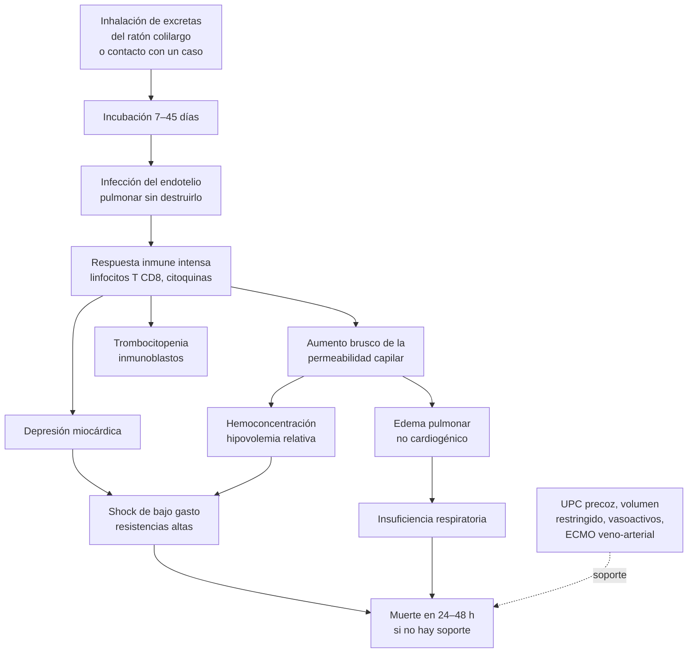

---
tags:
  - Infectología
  - Urgencia
---

# Síndrome cardiopulmonar por hantavirus y leptospirosis

**Subespecialidad**
Infectología · Medicina intensiva · Medicina de urgencia · Salud pública

**Guías principales**
MINSAL 2013: guía clínica de prevención, diagnóstico y tratamiento del síndrome cardiopulmonar por hantavirus · Revisión de alcance de *Clin Microbiol Infect* 2026 (diagnóstico y manejo del virus Andes) · Revisión clínica de leptospirosis de *Lancet Infect Dis* 2026

**Otras fuentes**
Cohorte nacional chilena 2019–2024 (*Intensive Care Med* 2026) · Notificaciones y mortalidad en Chile 2005–2022 · Ensayo chileno de metilprednisolona (*Clin Infect Dis* 2013) · Plasma inmune (*Antivir Ther* 2015) · Brote de Epuyén, transmisión persona a persona (*NEJM* 2020)

**GES**
No. Notificación **inmediata** a la autoridad sanitaria (hantavirus)

**EUNACOM**
1.04.2.008 Síndrome pulmonar por hantavirus (sospecha, inicial, derivar) · 1.04.1.017 Leptospirosis (sospecha, inicial, derivar)

**Revisado**
Septiembre 2026

!!! abstract "Resumen en 60 segundos"
    - **Hantavirus en Chile**: el **virus Andes**, transmitido por el **ratón colilargo** (*Oligoryzomys longicaudatus*), causa el **síndrome cardiopulmonar por hantavirus (SCPH)**.
        - **~ 50 casos al año**, sobre todo en **hombres jóvenes rurales** del **centro-sur** (Maule a Aysén).
        - **Letalidad hospitalaria ~ 20 %** en la última década (era ~ 60 % en los años 90).
        - Es el **único hantavirus con transmisión persona a persona** documentada.
    - **Sospecharlo**: **fiebre, mialgias intensas, cefalea y síntomas digestivos** + **exposición rural o a roedores** (o a un caso) en las **6 semanas** previas + **trombocitopenia**.
    - **Hemograma = la clave precoz**: **plaquetas < 150.000**, **inmunoblastos > 10 %**, leucocitosis con desviación a izquierda y **hemoconcentración**.
    - Tras **1–6 días** de pródromo, pasa bruscamente a la **fase cardiopulmonar**: **edema pulmonar no cardiogénico** y **shock de bajo gasto**. Las muertes ocurren en las primeras **24–48 h**.
    - **Manejo**:
        - **Traslado inmediato** a un centro con **UPC** (idealmente con **ECMO**), aunque el paciente esté bien. **No esperar** la confirmación ni "estabilizar" antes.
        - **Evitar la sobrecarga de volumen**. **Norepinefrina o adrenalina**.
        - **ECMO veno-arterial** en el shock refractario.
        - **No** usar ribavirina ni corticoides en dosis altas.
    - **Leptospirosis**: fiebre, **mialgias** (pantorrillas), **inyección conjuntival**; en la forma grave, **ictericia + LRA + hemorragia pulmonar** (enfermedad de Weil). Tratar precozmente con **doxiciclina** (leve) o **penicilina o ceftriaxona** (grave).

## Definición

- **Hantavirus**: virus ARN de la familia *Hantaviridae* (antes *Bunyaviridae*), transmitidos por roedores. Causan 2 síndromes:
    - **Viejo Mundo** (Europa y Asia): **fiebre hemorrágica con síndrome renal**.
    - **Nuevo Mundo** (América): **síndrome cardiopulmonar por hantavirus (SCPH)**. En Chile el **único agente** es el **virus Andes** (*Orthohantavirus andesense*).
- **Caso sospechoso de SCPH** (MINSAL): persona con **fiebre, mialgias, cefalea**, con o sin síntomas gastrointestinales, con **trombocitopenia**, con o sin infiltrados intersticiales en la radiografía, y con **actividades de riesgo o exposición a roedores silvestres** en las **6 semanas previas**, o **contacto con un caso confirmado** en el mismo período.
- **Caso confirmado**: IgM específica o **RT-PCR** positiva en un laboratorio de referencia (ISP o reconocido por el ISP).
- **Enfermedad leve por hantavirus**: infección confirmada sin compromiso cardiopulmonar (~ 5 % de los casos notificados).
- **Leptospirosis**: zoonosis bacteriana por espiroquetas del género ***Leptospira***, que se transmite por contacto de la piel lesionada o las mucosas con **agua o suelo contaminados con orina de animales** (roedores, perros, ganado).

## Epidemiología

### Mundial

- **SCPH**: sólo en **América**. El primer brote se describió en 1993 en el suroeste de EE. UU. (virus Sin Nombre). El **virus Andes** se identificó en 1995 en la Patagonia argentina.
- El virus Andes es el **único hantavirus con transmisión persona a persona** demostrada:
    - En el brote de **Epuyén** (Argentina, 2018–2019), 3 personas sintomáticas que asistieron a eventos sociales concurridos generaron la mayoría de los casos ("**superdiseminadores**"). La transmisión se asoció a una **carga viral alta**, sobre todo en la fase febril inicial (Martínez, 2020).
    - En **2026**, un brote asociado a un **crucero** mostró su potencial de diseminación internacional (Fama, 2026).
- **Leptospirosis**: distribución mundial, con la mayor carga en los **países tropicales de ingresos bajos y medios**, en brotes tras **inundaciones** y desastres naturales. Es una causa frecuente y subdiagnosticada de **fiebre aguda indiferenciada** (Lee, 2026).

### Chile

!!! chile "Contexto nacional"
    - **Reservorio**: el **ratón colilargo**, distribuido desde el sur del desierto de Atacama hasta Magallanes. Su población aumenta con la **floración de la quila y el colihue** ("**ratadas**") y las lluvias; los **incendios forestales** lo desplazan hacia zonas habitadas.
    - **Casos**:
        - Entre 2005 y 2022 se notificaron **886 casos** en 187 comunas (**~ 49 casos al año**). Las notificaciones se asociaron a comunas más **rurales**, con más **hombres** y con más **superficie quemada** por incendios forestales (Diethelm-Varela, 2026).
        - Más del **60 %** de los casos reside en **zonas rurales** y casi **1/3** trabaja en el sector **agrícola-forestal**; **~ 16 %** ocurre en **conglomerados** (MINSAL).
        - Se presentan desde **Valparaíso-O'Higgins hasta Aysén**, con el mayor riesgo **entre Biobío y Aysén** (Los Ríos, Biobío, Los Lagos y Maule con las tasas más altas).
    - **Estacionalidad**: **~ 70 %** de los casos entre **noviembre y marzo**. En las comunas andinas de **Los Lagos** predominan en **invierno** (Riquelme, 2015; Figura 3).
    - **Seroprevalencia** (ENS 2003): **0,3 %** nacional, **1,1 %** en las zonas rurales y 0,14 % en las urbanas.
    - **Letalidad**:
        - Bajó de **~ 60 %** en 1997 a **~ 30 %** hacia 2011–2012 (MINSAL).
        - **19,7 %** hospitalaria en 2010–2020, mayor en los **mayores**, las **mujeres** y las personas de **pueblos originarios** (Diethelm-Varela, 2026).
        - **Cohorte nacional 2019–2024** (215 pacientes, 31 hospitales): **69 %** hombres; de los que necesitaron soporte respiratorio, **14 %** recibió VMNI, **37 %** ventilación mecánica y **49 %** **ECMO**. Mortalidad hospitalaria de **20,5 %** (30 % con ventilación mecánica y 33 % con ECMO), **mayor durante la pandemia de COVID-19** (Meza-Fuentes, 2026).
    - **Actividades de riesgo**: manipular **leña**, entrar o limpiar **recintos cerrados** rurales (bodegas, cabañas), **desmalezar**, internarse en bosques, **excursionismo y camping**, recolectar frutos silvestres.
    - Es una **enfermedad profesional** cuando se adquiere por el trabajo, y de **notificación inmediata**.
    - **Leptospirosis**: casos esporádicos, más en las zonas **rurales** y en personas con exposición a **animales** o a **agua contaminada**; se ha detectado ADN de *Leptospira* patógena en ecosistemas agrícolas de la zona central (San Martin, 2026). Es parte del **diagnóstico diferencial** del hantavirus.

## Etiología

| | Hantavirus (SCPH) | Leptospirosis |
|---|---|---|
| **Agente** | **Virus Andes** (ARN, *Hantaviridae*) | ***Leptospira interrogans*** y otras especies patógenas |
| **Reservorio** | **Ratón colilargo** (portador crónico asintomático) | Roedores (**ratas**), perros, **bovinos**, cerdos |
| **Transmisión** | **Inhalación de aerosoles** de orina, heces y saliva del roedor; contacto con mucosas; excepcionalmente mordedura. **Persona a persona** (contactos estrechos, pareja, sobre todo en la fase prodrómica) | Contacto de la **piel erosionada o las mucosas** con **agua, barro o suelo** contaminados con orina; contacto directo con animales |
| **Incubación** | **7–45 días** (habitualmente 1–3 semanas; mediana ~ 18 días) | 2–30 días (habitualmente 5–14) |
| **Grupos de riesgo** | Residentes rurales, trabajadores agrícolas y forestales, excursionistas | Agricultores, lecheros, veterinarios, trabajadores de alcantarillados, deportes acuáticos, inundaciones |

## Fisiopatología

1. **Hantavirus**:
    - El virus infecta el **endotelio** (sobre todo el **pulmonar**) a través de las integrinas β3, **sin destruirlo**.
    - La **respuesta inmune** (linfocitos T CD8, citoquinas) aumenta bruscamente la **permeabilidad capilar**: **edema pulmonar no cardiogénico** (rico en proteínas) y **hemoconcentración**.
    - Hay **depresión miocárdica**: **shock de bajo gasto** con resistencias vasculares altas (a diferencia del shock séptico). El **compromiso cardiovascular** es lo que determina la muerte (shock refractario, arritmias).
    - La **trombocitopenia** refleja la activación y el consumo de plaquetas en el endotelio infectado.
    - La **viremia** es máxima **al inicio** de los síntomas: por eso el contagio persona a persona ocurre en la fase prodrómica.
2. **Leptospirosis**:
    - Las espiroquetas atraviesan la piel o las mucosas, se diseminan por la sangre (**fase leptospirémica**, primera semana) y se localizan en el **riñón** y el **hígado** (**fase inmune**, segunda semana, con eliminación por la orina).
    - Producen **vasculitis** capilar: **LRA** (nefritis intersticial con **pérdida de potasio**), **ictericia** colestásica con transaminasas poco elevadas, **hemorragias** y el **síndrome de hemorragia pulmonar**.

*Figura 1. Fisiopatología del síndrome cardiopulmonar por hantavirus. Esquema propio.*

## Clasificación

- **SCPH según la gravedad cardiovascular** (MINSAL):
    - **Leve**: sin hipotensión en toda la evolución.
    - **Moderado**: shock (PAM < 70 mmHg) que **responde rápido** a los vasoactivos.
    - **Grave**: shock que, pese a una respuesta inicial, **se mantiene inestable**, con alto riesgo de muerte (candidato a ECMO).
- **Leptospirosis**:
    - **Anictérica** (~ 90 %): cuadro febril autolimitado, a veces con meningitis aséptica en la fase inmune.
    - **Grave**: **enfermedad de Weil** (ictericia + LRA + hemorragias) y **síndrome de hemorragia pulmonar** (la forma más letal).

## Clínica

<figure markdown>
![Esquema en cuatro columnas sobre una línea de tiempo. Incubación de 7 a 45 días, por inhalación de excretas del ratón colilargo o por contacto estrecho con un caso; vigilar a los expuestos por 6 semanas. Fase prodrómica de 1 a 6 días, con fiebre, mialgias, cefalea, náuseas, vómitos y dolor abdominal, en la que el hemograma muestra plaquetas bajo 150.000, inmunoblastos sobre 10 por ciento, leucocitosis con desviación a izquierda y hemoconcentración. Fase cardiopulmonar de horas a pocos días, con tos, disnea, edema pulmonar no cardiogénico y shock de bajo gasto, con los signos de gravedad del MINSAL y muertes en las primeras 24 a 48 horas. Convalecencia de semanas a 3 meses, con poliuria, recuperación de la función cardiopulmonar y posibles secuelas, con seguimiento de al menos 6 meses](../assets/figuras/hantavirus/fases-hantavirus.svg){ loading=lazy }
<figcaption>Figura 2. Fases clínicas del síndrome cardiopulmonar por hantavirus y sus hallazgos clave. Esquema propio basado en la guía clínica MINSAL.</figcaption>
</figure>

### Hantavirus

- **Fase prodrómica** (**1–6 días**):
    - **Fiebre**, **mialgias intensas** (sobre todo **lumbares** y de las extremidades), **cefalea**, calofríos.
    - **Síntomas digestivos** frecuentes: **náuseas, vómitos, dolor abdominal**, diarrea (puede simular un **abdomen agudo**).
    - Pocos síntomas respiratorios altos (a diferencia de la influenza).
- **Fase cardiopulmonar** (inicio **brusco**):
    - **Tos** seca, **disnea**, **taquipnea**, hipoxemia; broncorrea serosa.
    - **Taquicardia**, **hipotensión** y shock.
    - **Hemorragias** (hematuria, petequias, sitios de punción), **LRA**, compromiso neurológico.
    - La insuficiencia respiratoria puede progresar a SDRA en **4–10 horas**. La mayoría de las muertes ocurre en las **primeras 24–48 h** de esta fase.
- **Convalecencia**: **poliuria**, recuperación de la función pulmonar y cardíaca; **astenia** y debilidad prolongadas; secuelas visuales, auditivas, cognitivas y de salud mental.

!!! alarma "Signos de gravedad del hantavirus (MINSAL): traslado inmediato a UPC de alta complejidad"
    - **Taquicardia**, **polipnea**, **hipotensión**.
    - **Leucocitos > 20.000/µL**.
    - **Hematocrito > 45 %** (hemoconcentración).
    - **Plaquetas < 50.000/µL**.
    - **Inmunoblastos > 45 %**.
    - **pH < 7,25** y **lactato > 2 mmol/L**.
    - En el paciente con **sospecha** de hantavirus, **el traslado a un centro con UPC es una emergencia aunque esté en buenas condiciones**: la evolución es fulminante e impredecible.

### Leptospirosis

- **Fase leptospirémica** (primera semana): **fiebre alta** de inicio brusco, calofríos, **cefalea** intensa, **mialgias** (típicamente en las **pantorrillas** y la región lumbar), **inyección conjuntival** (sufusión, sin secreción; muy sugerente), náuseas y vómitos.
- **Fase inmune** (segunda semana): meningitis aséptica, uveítis.
- **Formas graves**:
    - **Enfermedad de Weil**: **ictericia** (bilirrubina muy alta con transaminasas poco elevadas), **LRA** a menudo **no oligúrica** con **hipokalemia**, **hemorragias**, trombocitopenia, miocarditis.
    - **Síndrome de hemorragia pulmonar**: hemoptisis, infiltrados alveolares e insuficiencia respiratoria; puede ocurrir **sin ictericia** y ser el principal diferencial del hantavirus.

## Diagnóstico

**Hantavirus**:

1. **Sospecha clínica** (definición de caso) + **exposición** en las 6 semanas previas: es una **emergencia**.
2. **Hemograma con frotis**, repetido: **trombocitopenia** (el hallazgo más precoz), **inmunoblastos**, leucocitosis con desviación a izquierda, **hematocrito en ascenso**. En la serie chilena, **87 %** tenía hemoconcentración, leucocitosis y trombocitopenia, hallazgos muy infrecuentes en la neumonía comunitaria.
3. **Confirmación**:
    - **Test rápido** (recomendado por el ISP) en el laboratorio local para el diagnóstico **presuntivo**.
    - **IgM de captura (ELISA)** y **RT-PCR** en el **ISP** o en los laboratorios reconocidos (Universidad Austral de Chile en Valdivia, Pontificia Universidad Católica en Santiago). **Enviar todas las muestras** al ISP, cualquiera sea el resultado local.
    - La **IgM aparece al final del pródromo** o al inicio de la fase cardiopulmonar: **un test rápido o ELISA negativo precoz no descarta** el diagnóstico (mantener en observación). La **RT-PCR** es sensible desde la fase prodrómica.
    - **No** hacer serología ni test rápido a las **personas expuestas asintomáticas**.
4. **Notificación inmediata** a la autoridad sanitaria (SEREMI) e investigación epidemiológica.

**Leptospirosis**:

- **Primera semana**: **PCR** en sangre y hemocultivos (medios especiales).
- **Segunda semana**: **PCR en orina**; **IgM (ELISA)** como tamizaje y confirmación por **aglutinación microscópica (MAT)** con seroconversión en muestras pareadas.
- **No esperar** la confirmación para tratar si la sospecha es razonable.

## Laboratorio

| Examen | Hantavirus | Leptospirosis |
|---|---|---|
| **Plaquetas** | **↓↓** (precoz, < 150.000; < 50.000 = grave) | ↓ |
| **Hematocrito** | **↑** (hemoconcentración; > 45 % = grave) | Normal o ↓ (hemorragia) |
| **Leucocitos** | **↑ con desviación a izquierda**; **inmunoblastos** (> 10 %; > 45 % = grave) | ↑ con neutrofilia |
| **Creatinina** | ↑ en muchos (hemodiálisis en una minoría) | **↑** (LRA no oligúrica, **hipokalemia**) |
| **Bilirrubina / transaminasas** | Transaminasas ↑ moderadamente | **Bilirrubina muy ↑** con transaminasas poco ↑ |
| **CK** | ↑ | **↑** (miositis) |
| **LDH** | ↑ | ↑ |
| **Coagulación** | TP y TTPa prolongados | TP prolongado |
| **Albúmina** | ↓ (fuga capilar) | Variable |
| **Gases y lactato** | **Acidosis metabólica**, lactato ↑ (bajo gasto) | Según la gravedad |
| **Orina** | Proteinuria, hematuria | Proteinuria, hematuria, cilindros |

## Imágenes

- **Radiografía de tórax** (hantavirus):
    - **Pródromo**: normal o con infiltrado intersticial leve.
    - **Fase cardiopulmonar**: **edema intersticial bilateral** con **líneas B de Kerley**, que progresa en horas a **edema alveolar** extenso; puede haber **derrame pleural**. La **silueta cardíaca es normal** (edema no cardiogénico).
- **Ecocardiograma**: función sistólica **deprimida** en los casos graves; útil para decidir el soporte (inótropos, ECMO).
- **Leptospirosis**: infiltrados alveolares difusos o nodulares en la hemorragia pulmonar.

<figure markdown>
{ loading=lazy }
<figcaption>Figura 3. Estacionalidad del hantavirus: en todo Chile (n = 785; negro) predominan los casos en verano, mientras que en las provincias de Llanquihue y Palena (n = 103; blanco) predominan en invierno, 1995–2012. Tomado de Riquelme R, et al. <em>Emerg Infect Dis</em> 2015;21:562–568 (figura 3). Dominio público (<em>Emerging Infectious Diseases</em>, CDC).</figcaption>
</figure>

## Diagnóstico diferencial

| Cuadro | Claves para distinguirlo del hantavirus |
|---|---|
| **Influenza y otras virosis respiratorias** | Invierno, síntomas de **vía aérea superior** (tos, odinofagia, coriza), sin hemoconcentración marcada; test de influenza |
| **Neumonía comunitaria** (incluida la atípica) | Condensación, leucocitosis **sin** trombocitopenia ni hemoconcentración (ver [neumonía](../respiratorio/neumonia-adquirida-en-la-comunidad.md)) |
| **Leptospirosis** | Inyección conjuntival, mialgias de pantorrillas, **ictericia**, **LRA con hipokalemia**, exposición a agua o animales |
| **Sepsis y shock séptico** de otra causa | Foco infeccioso, shock **distributivo** (gasto alto, resistencias bajas) (ver [sepsis](sepsis-y-shock-septico.md)) |
| **Insuficiencia cardíaca** | Antecedentes cardíacos, **cardiomegalia**, BNP muy alto, sin fiebre |
| **Abdomen agudo** | Dolor continuo con irritación peritoneal; **sin** trombocitopenia ni hemoconcentración |
| **Pielonefritis aguda** | Dolor lumbar persistente, sedimento urinario alterado, sin trombocitopenia |
| **Rickettsiosis** | Exantema maculopapular, **escara** de inoculación, garrapata |
| **Meningococcemia** | Petequias y púrpura precoces, hemocultivos |
| **Fiebre tifoidea**, triquinosis, psitacosis | Bradicardia relativa y leucopenia (tifoidea); **eosinofilia** y edema palpebral (triquinosis); contacto con aves (psitacosis) |

## Tratamiento

### Hantavirus

!!! guia "MINSAL 2013 y evidencia actual"
    - **No existe un antiviral eficaz**: el tratamiento es el **soporte** circulatorio y respiratorio en la **UPC**, y puede requerir **ECMO** para evitar la muerte.
    - **Todo caso sospechoso** debe **trasladarse lo antes posible** a un centro con UPC (idealmente con ECMO), **sin esperar** a estabilizarlo (el retraso y la sobrehidratación aumentan la mortalidad).
    - **Evitar la sobrecarga de volumen**: el balance positivo empeora el edema pulmonar por aumento de la permeabilidad. **No usar diuréticos**. Aceptar la oliguria.
    - **Vasoactivos**: preferir **norepinefrina** o **adrenalina**; agregar un inótropo (dobutamina) si el gasto es bajo.
    - **ECMO veno-arterial** en el shock cardiogénico refractario (el veno-venoso **no** está indicado). La sobrevida con ECMO en centros con experiencia es mayor, aunque la evidencia es observacional.
    - **No se recomienda la ribavirina** (sin beneficio).
    - **No se recomiendan los corticoides en dosis altas**: en el ensayo chileno, la **metilprednisolona** (16 mg/kg/día por 3 días) **no redujo** el desenlace compuesto ni la mortalidad (Vial, 2013).
    - **Plasma inmune** de convalecientes: seguro, con una reducción de la letalidad de significación limítrofe (**14 % vs 32 %**) en un estudio no aleatorizado; sigue siendo **experimental** (Vial, 2015).
    - **Antibióticos empíricos** (ceftriaxona + macrólido o quinolona) mientras no se pueda distinguir de una neumonía u otra infección grave; **suspenderlos** al confirmar el hantavirus.

!!! dosis "Soporte en el SCPH"
    - **Oxígeno** para una **SaO2 > 90 %**; **intubación precoz** en los pacientes con signos de gravedad; **ventilación protectora** (volumen corriente de **6 mL/kg** de peso ideal, presión meseta ≤ 30 cmH2O) (ver [insuficiencia respiratoria aguda](../respiratorio/insuficiencia-respiratoria-aguda.md)).
    - **Volumen**: sólo en **alícuotas pequeñas** (por ejemplo, 250 mL de Ringer lactato) con reevaluación de la perfusión; evitar las grandes cargas.
    - **Norepinefrina** para una PAM ≥ 65 mmHg; **dobutamina** o **adrenalina** si el índice cardíaco es bajo.
    - **Monitoreo**: ECG continuo, **presión arterial invasiva**, oximetría, diuresis, **gases y lactato** cada 12 h o más seguido, hemograma, creatinina y coagulación diarios, radiografía de tórax diaria.
    - **Criterios de ECMO** (grupo de Nuevo México, citados por la guía MINSAL): SCPH típico (trombocitopenia, hemoconcentración, **≥ 10 % de inmunoblastos**) + **índice cardíaco < 2,0 L/min/m²** pese al soporte inotrópico máximo + al menos uno de: **shock refractario**, **lactato > 4 mmol/L**, **PaO2/FiO2 < 60**, **taquicardia o fibrilación ventricular**.
    - **Precauciones**: **estándar + gotitas** para el personal de salud.

!!! chile "Prevención y manejo de los contactos (MINSAL)"
    - **Ventilar** por al menos 30 minutos los recintos cerrados antes de entrar; **no barrer en seco**: humedecer con **cloro** diluido y limpiar con guantes y mascarilla.
    - **Mantener** los alrededores de las casas **libres de malezas** y a 30 metros; guardar los alimentos y la leña en lugares cerrados y alejados.
    - En el camping, usar **carpas con piso** y sitios habilitados; **no** tomar agua de esteros ni recoger frutos silvestres del suelo.
    - **Contactos estrechos** de un caso (pareja, convivientes): **seguimiento clínico por 6 semanas** (período máximo de incubación) y consulta inmediata ante fiebre; hemograma precoz si aparecen síntomas.

### Leptospirosis

!!! dosis "Tratamiento de la leptospirosis (iniciarlo precozmente, ante la sospecha)"
    - **Leve** (ambulatoria): **doxiciclina 100 mg VO cada 12 h por 7 días** (alternativas: amoxicilina, azitromicina).
    - **Grave** (hospitalizada): **penicilina sódica 1,5 millones UI EV cada 6 h** o **ceftriaxona 1–2 g EV/día** por **7 días**.
    - **Soporte**: hidratación, **reposición de potasio**, **diálisis** precoz en la LRA grave, ventilación en la hemorragia pulmonar.
    - Puede ocurrir una **reacción de Jarisch-Herxheimer** al iniciar el antibiótico.
    - **Profilaxis**: doxiciclina 200 mg semanal en exposiciones de alto riesgo (inundaciones, deportes de aventura en zonas endémicas).

## Complicaciones

- **Hantavirus**:
    - **Shock cardiogénico refractario**, **arritmias** (taquicardia y fibrilación ventricular), **SDRA**, paro cardiorrespiratorio.
    - **LRA** (hemodiálisis en una minoría), hemorragias, compromiso neurológico (meningitis aséptica, hemorragias intracraneales).
    - **Complicaciones del ECMO**: sangrado, isquemia de la extremidad canulada, trombosis, infecciones.
    - **Secuelas** a largo plazo: debilidad muscular, alteraciones visuales y auditivas, déficit cognitivo, síntomas de salud mental; afectan la calidad de vida incluso tras la sobrevida con ECMO.
- **Leptospirosis**: **LRA**, **hemorragia pulmonar** (letalidad muy alta), miocarditis y arritmias, meningitis, **uveítis** tardía.

## Pronóstico y seguimiento

- **Hantavirus**: **letalidad de ~ 20–30 %** en Chile, con muertes concentradas en las primeras 48 h de la fase cardiopulmonar.
    - **Factores asociados a la muerte**: **frecuencia respiratoria alta** y **creatinina elevada** al ingreso (Riquelme, 2015); **mayor edad**, **sexo femenino** y pertenencia a **pueblos originarios** (Diethelm-Varela, 2026); shock (causa de muerte en **~ 75 %** de los fallecidos).
    - La mejora de la letalidad en el tiempo refleja la **experiencia acumulada** (UPC, ECMO, traslado precoz), no un tratamiento farmacológico nuevo.
    - Los sobrevivientes se recuperan completamente de la función cardiopulmonar, pero con una **convalecencia prolongada**.
- **Leptospirosis**: la forma anictérica tiene un buen pronóstico; la **enfermedad de Weil** y la **hemorragia pulmonar** tienen una letalidad alta.
- **Perfil EUNACOM**:
    - **Hantavirus**: **sospecha** (clínica + exposición + hemograma), **tratamiento inicial** (oxígeno, volumen restringido, vasoactivos, **no** sobrehidratar), **notificación** y **derivación inmediata** a un centro con UPC.
    - **Leptospirosis**: sospecha, **antibiótico precoz** y derivación si hay compromiso orgánico.
- **Seguimiento**: controles **por al menos 6 meses** tras el alta del SCPH (secuelas oculares, auditivas, renales, respiratorias y de salud mental).

## Perlas para el internado

!!! perla "Para la sala y el turno"
    - **Fiebre + mialgias + "algo rural" en el centro-sur = pide un hemograma con frotis.** Si hay **plaquetas bajas**, **inmunoblastos** o **hematocrito alto**, piensa en **hantavirus**.
    - Pregunta siempre por **leña, bodegas, cabañas cerradas, desmalezamiento, camping y trabajo forestal** en las **últimas 6 semanas**, y por **contacto con un caso**.
    - **Un test rápido negativo al inicio no descarta el hantavirus**: la IgM aparece tarde.
    - **No esperes la confirmación para trasladar**: el paciente que "está bien" puede estar en shock en pocas horas.
    - **Hantavirus ≠ shock séptico**: es un shock de **bajo gasto** con fuga capilar. **Menos volumen**, más vasoactivos e inótropos; **ECMO veno-arterial** en el refractario.
    - **No** metilprednisolona ni ribavirina.
    - **Notificación inmediata** y seguimiento de los **contactos estrechos** por 6 semanas.
    - **Ojos rojos sin secreción + dolor de pantorrillas + ictericia + LRA con potasio bajo = leptospirosis**: penicilina o ceftriaxona sin esperar la serología.

## Preguntas de repaso

??? repaso "1. Hombre de 28 años, trabajador forestal de la Araucanía, con fiebre, mialgias lumbares intensas, cefalea y vómitos de 3 días. PA 118/70, FC 104, SatO2 95 %. Hemograma: leucocitos 14.500 con desviación a izquierda, plaquetas 92.000, hematocrito 47 %, 12 % de inmunoblastos. Radiografía de tórax con leve infiltrado intersticial. ¿Qué sospechas y qué haces?"
    **Síndrome cardiopulmonar por hantavirus** en fase prodrómica o inicio de la fase cardiopulmonar: exposición de riesgo + fiebre y mialgias + **trombocitopenia, inmunoblastos y hemoconcentración**.

    1. Considerarlo una **emergencia**: **traslado inmediato** a un centro con **UPC** (idealmente con ECMO), aunque esté estable.
    2. Oxígeno según la saturación, **evitar la sobrecarga de volumen**, monitorización.
    3. **Test rápido** local y **muestras al ISP** (IgM, RT-PCR); un resultado negativo precoz no lo descarta.
    4. Antibióticos empíricos (ceftriaxona + macrólido) si no se puede descartar una neumonía; suspenderlos al confirmar.
    5. **Notificación inmediata** y estudio de los contactos.

??? repaso "2. ¿Qué signos clínicos y de laboratorio indican un hantavirus grave según el MINSAL?"
    - **Clínicos**: taquicardia, polipnea, hipotensión.
    - **Laboratorio**: **leucocitos > 20.000/µL**, **hematocrito > 45 %**, **plaquetas < 50.000/µL**, **inmunoblastos > 45 %**, **pH < 7,25** y **lactato > 2 mmol/L**.

    Estos pacientes requieren traslado inmediato a una UPC de alta complejidad, manejo agresivo de la insuficiencia respiratoria y del shock, y evaluación para **ECMO**.

??? repaso "3. Paciente con hantavirus confirmado, intubado, con PAM de 58 mmHg pese a norepinefrina en dosis altas, índice cardíaco de 1,8 L/min/m² y lactato de 6 mmol/L. El residente propone 2 litros de suero fisiológico. ¿Qué opinas?"
    **No**: el SCPH es un **shock de bajo gasto con fuga capilar**; las grandes cargas de volumen empeoran el **edema pulmonar** sin mejorar el gasto.

    - Volumen sólo en alícuotas pequeñas y con reevaluación.
    - **Inótropo** (dobutamina o adrenalina) y vasopresor.
    - Cumple **criterios de ECMO** (índice cardíaco < 2,0 con soporte máximo + lactato > 4): **ECMO veno-arterial** en un centro con experiencia.

??? repaso "4. ¿Por qué el hantavirus en Chile obliga a vigilar a la pareja y los convivientes de un caso?"
    Porque el **virus Andes** es el **único hantavirus con transmisión persona a persona** demostrada. En Chile se ha observado en brotes familiares, sobre todo en la **pareja** del caso índice, y en Argentina (Epuyén, 2018–2019) hubo "superdiseminadores" con carga viral alta en la **fase febril inicial**.

    - Seguimiento clínico de los **contactos estrechos** por **6 semanas** (incubación máxima), con consulta inmediata y hemograma ante fiebre.
    - **No** se recomienda la serología en los expuestos asintomáticos.
    - En el hospital: precauciones **estándar + gotitas**.

??? repaso "5. Agricultor de 45 años del sur de Chile con fiebre alta, dolor intenso de las pantorrillas, ojos rojos sin secreción e ictericia. Creatinina 3,8 mg/dL, K 3,1 mEq/L, bilirrubina 12 mg/dL con transaminasas en 110 U/L, plaquetas 60.000/µL. ¿Diagnóstico probable y tratamiento?"
    **Leptospirosis grave** (enfermedad de **Weil**): inyección conjuntival, mialgias de pantorrillas, **ictericia** con transaminasas poco elevadas, **LRA con hipokalemia** y trombocitopenia.

    - **Penicilina sódica 1,5 millones UI EV cada 6 h** o **ceftriaxona 1–2 g/día** por 7 días, **sin esperar** la confirmación.
    - Soporte: hidratación, reposición de potasio, **diálisis** si es necesaria; vigilar la **hemorragia pulmonar**.
    - Estudio: PCR en sangre y orina, IgM (ELISA) y MAT pareada.

## Referencias

1. Ministerio de Salud de Chile. Guía clínica de prevención, diagnóstico y tratamiento del síndrome cardiopulmonar por hantavirus. Santiago: MINSAL; 2013. [diprece.minsal.cl](https://diprece.minsal.cl/wrdprss_minsal/wp-content/uploads/2015/02/Gu%C3%ADa-HANTA-completa.pdf)
2. Fama F, Molà F, Rizzo A, et al. Andes virus-associated cardiopulmonary syndrome: diagnostic approaches, clinical management, and evidence gaps-a scoping review. *Clin Microbiol Infect.* 2026;32:1435–1447. doi:[10.1016/j.cmi.2026.06.013](https://doi.org/10.1016/j.cmi.2026.06.013)
3. Meza-Fuentes G, Delgado I, Vial PA, et al. Temporal trends in critical care burden and outcomes of Andes virus-associated hantavirus cardiopulmonary syndrome: a national Chilean cohort. *Intensive Care Med.* 2026 (publicación electrónica previa a la impresión). doi:[10.1007/s00134-026-08599-9](https://doi.org/10.1007/s00134-026-08599-9)
4. Diethelm-Varela B, Atero N, Sánchez-Rodríguez F, et al. Ecological and Individual-Level Factors Associated With Hantavirus Cardiopulmonary Syndrome Notifications and in-Hospital Mortality Among Hospitalized Patients in Chile, 2005-2022. *Zoonoses Public Health.* 2026 (publicación electrónica previa a la impresión). doi:[10.1111/zph.70084](https://doi.org/10.1111/zph.70084)
5. Riquelme R, Rioseco ML, Bastidas L, et al. Hantavirus pulmonary syndrome, Southern Chile, 1995-2012. *Emerg Infect Dis.* 2015;21:562–568. doi:[10.3201/eid2104.141437](https://doi.org/10.3201/eid2104.141437)
6. Vial PA, Valdivieso F, Ferres M, et al. High-dose intravenous methylprednisolone for hantavirus cardiopulmonary syndrome in Chile: a double-blind, randomized controlled clinical trial. *Clin Infect Dis.* 2013;57:943–951. doi:[10.1093/cid/cit394](https://doi.org/10.1093/cid/cit394)
7. Vial PA, Valdivieso F, Calvo M, et al. A non-randomized multicentre trial of human immune plasma for treatment of hantavirus cardiopulmonary syndrome caused by Andes virus. *Antivir Ther.* 2015;20:377–386. doi:[10.3851/IMP2875](https://doi.org/10.3851/IMP2875)
8. Martínez VP, Di Paola N, Alonso DO, et al. "Super-Spreaders" and Person-to-Person Transmission of Andes Virus in Argentina. *N Engl J Med.* 2020;383:2230–2241. doi:[10.1056/NEJMoa2009040](https://doi.org/10.1056/NEJMoa2009040)
9. Lee N, Tanaka T, Koizumi N, et al. Leptospirosis-clinical review and updates on therapeutics. *Lancet Infect Dis.* 2026;26:e294–e307. doi:[10.1016/S1473-3099(26)00060-5](https://doi.org/10.1016/S1473-3099(26)00060-5)
10. San Martin MF, Quiroga N, Casanovas-Massana A, et al. Environmental Detection of Pathogenic Leptospira DNA in Agricultural Ecosystems from a Mediterranean-Climate Region of Central Chile. *Pathogens.* 2026;15:661. doi:[10.3390/pathogens15070661](https://doi.org/10.3390/pathogens15070661)
