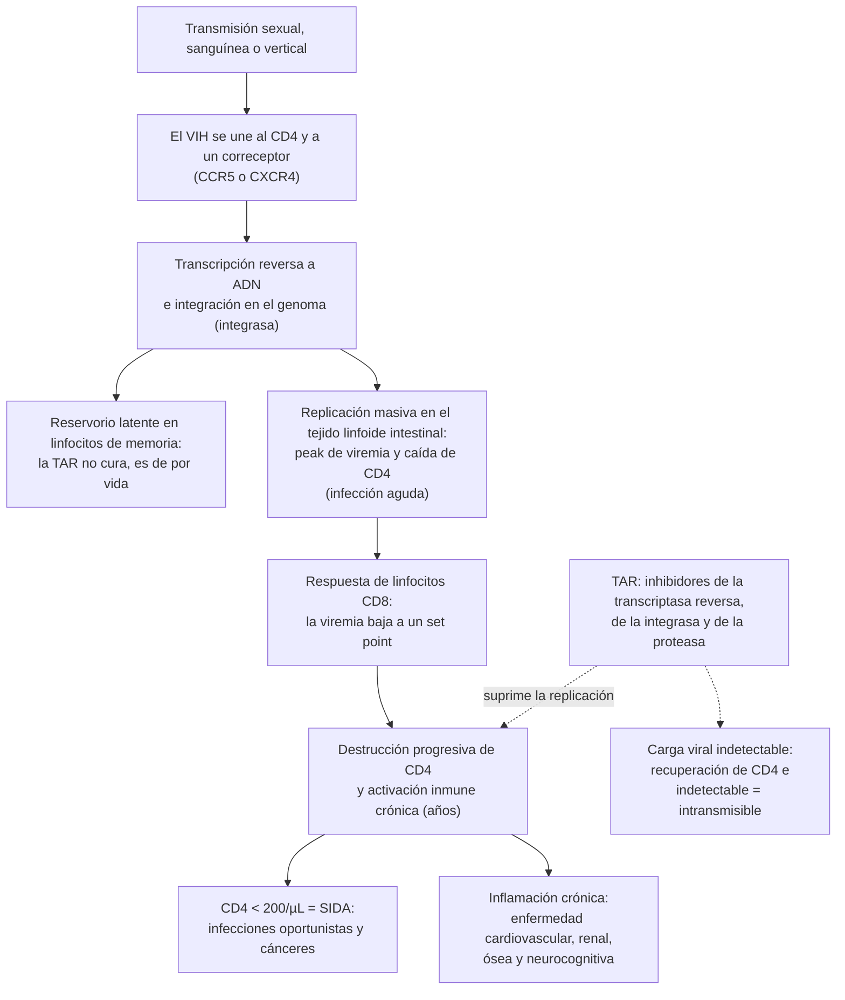
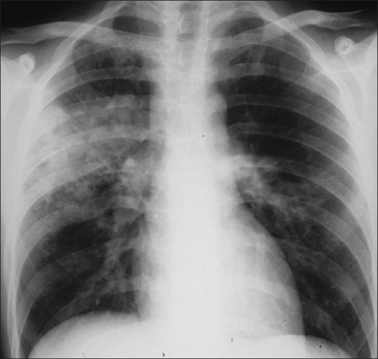

---
tags:
  - Infectología
  - GES
  - Frecuente en sala
---

# Infección por VIH y SIDA, candidiasis orofaríngea y esofágica, y diarrea en inmunosuprimidos

**Subespecialidad**
Infectología

**Guías principales**
IAS-USA 2024: tratamiento y prevención del VIH en adultos (*JAMA*, 2025) · Orientaciones para el uso de terapia antirretroviral en Chile (*Rev Chilena Infectol*, 2024) · DHHS: guías de terapia antirretroviral en adultos, y NIH/CDC/HIVMA-IDSA: infecciones oportunistas (ambas de actualización continua) · CDC 2025: profilaxis post-exposición no ocupacional · US PHS 2025: exposición ocupacional · IDSA 2016: candidiasis · IDSA 2017: diarrea infecciosa

**Otras fuentes**
ONUSIDA 2026 (datos 2025) · Prochazka, *J Int AIDS Soc* 2026 (América Latina, datos 2024) · ISP (casos confirmados 2024) · GES N.° 18 · Ensayos START, HPTN 052, PARTNER, ACTG A5164, COAT, REPRIEVE, PURPOSE 1 y 2

**GES**
Sí (N.° 18: Síndrome de la inmunodeficiencia adquirida VIH/SIDA)

**EUNACOM**
1.04.1.014 Infección por virus de inmunodeficiencia humana (SIDA) (específico, inicial, derivar) · 1.04.1.005 Candidiasis oral y esofágica (específico, completo, derivar) · 1.06.1.012 Diarrea en inmunosuprimidos (sospecha, inicial, derivar)

**Revisado**
Septiembre 2026

!!! abstract "Resumen en 60 segundos"
    - El **VIH** destruye los **linfocitos CD4**. Sin tratamiento, en unos **10 años** lleva al **SIDA**: **CD4 < 200/µL** o una enfermedad definitoria (infecciones oportunistas y cánceres).
    - **Pide el VIH con liberalidad**: ITS, **TB**, herpes zóster, **candidiasis oral**, neumonía recurrente o por *Pneumocystis*, síndrome mononucleósico, baja de peso, citopenias, hepatitis B o C y embarazo.
        - Tamizaje con un test de **4.ª generación** (antígeno p24 + anticuerpos) o un test rápido. En Chile, todo resultado **reactivo se confirma en el ISP**.
    - **Terapia antirretroviral (TAR) para todos**, con cualquier CD4, **lo antes posible** (idealmente en días). El GES exige iniciarla **dentro de 7 días** desde la indicación.
        - Esquema preferente: un **inhibidor de integrasa** (bictegravir o dolutegravir) + 2 inhibidores nucleósidos, por ejemplo **TAF/FTC/BIC** o **TDF/3TC/DTG** en 1 comprimido al día.
    - **Indetectable = intransmisible**: con la carga viral suprimida **no hay transmisión sexual** (PARTNER: **0** transmisiones en ~ 76.000 relaciones sin condón).
    - **Profilaxis**: **cotrimoxazol** si los **CD4 < 200** (*Pneumocystis*), o **< 100 con IgG de *Toxoplasma* positiva**.
        - Con una infección oportunista, iniciar la TAR **dentro de 2 semanas**. Excepción: la **meningitis criptocócica**, a las **4–6 semanas** (más mortalidad si se inicia antes).
    - **Candidiasis orofaríngea**: clotrimazol o nistatina si es leve; **fluconazol 100–200 mg/día por 7–14 días** si es moderada. **Esofágica** (odinofagia): **fluconazol 200–400 mg/día por 14–21 días**; la endoscopía se reserva para la que no responde.
    - **Diarrea en el inmunosuprimido**: además de los agentes habituales, buscar ***Cryptosporidium*, *Cystoisospora*, microsporidios, CMV, MAC y *C. difficile***. El mejor tratamiento de las parasitosis crónicas del VIH es **recuperar los CD4 con la TAR**.
    - **Profilaxis post-exposición (PEP)**: iniciar **lo antes posible, hasta 72 h** después, y mantener **28 días**.

## Definición

- **Infección por VIH**: infección crónica por un retrovirus que infecta los linfocitos T **CD4**, los macrófagos y las células dendríticas.
    - El **VIH-1** causa casi todos los casos en el mundo. El VIH-2 (África occidental) es menos transmisible y progresa más lento.
- **SIDA** (estadio 3 de los CDC, 2014): **CD4 < 200/µL** (o < 14 % de los linfocitos) o una **enfermedad definitoria de SIDA**, con cualquier recuento.
- **Enfermedad avanzada por VIH** (OMS): CD4 < 200/µL o estadio clínico 3 o 4 de la OMS. Concentra la mortalidad y necesita un paquete de tamizaje y profilaxis.
- **Infección aguda o primoinfección**: primeras semanas tras el contagio, con una **carga viral muy alta** y anticuerpos aún negativos o en formación.
- **Persona que vive con VIH (PVVIH)**: término preferido; evitar "portador" o "sidoso".

## Epidemiología

### Mundial

!!! guia "ONUSIDA, datos de 2025 (hoja informativa 2026)"
    - **41,0 millones** de personas viven con VIH.
    - **1,2 millones** de nuevas infecciones y **570.000** muertes por causas relacionadas con el SIDA en 2025.
    - **32,1 millones** de personas en TAR.
    - Cascada de atención: el **88 %** de las PVVIH conocía su diagnóstico; el **89 %** de ellas estaba en TAR, y el **95 %** de las tratadas tenía la carga viral suprimida. En total, sólo el **74 %** de todas las PVVIH estaba suprimida.

- La meta de ONUSIDA es **95-95-95**: 95 % diagnosticadas, 95 % de ellas en tratamiento y 95 % de las tratadas con carga viral suprimida.
- La **tuberculosis** sigue siendo la principal causa de muerte en las PVVIH.
- Con la TAR, la esperanza de vida de una PVVIH diagnosticada a tiempo se acerca a la de la población general. Hoy predominan las **enfermedades no asociadas al SIDA**: cardiovasculares, cánceres, renales y hepáticas.

### Chile

!!! chile "Datos nacionales"
    - **ONUSIDA 2024** (Prochazka, 2026):
        - **~ 91.000** PVVIH (81.000–100.000) y **~ 3.400** nuevas infecciones al año.
        - Cascada: **95 %** conoce su diagnóstico, **75 %** de ellas está en TAR, y el **95 %** de las tratadas está suprimida.
        - Chile es el **único país de América Latina y el Caribe con > 95 % en dos de los tres pilares**. La brecha está en el segundo: **vincular y retener** en tratamiento a quienes ya tienen el diagnóstico.
    - **Casos confirmados por el ISP**:
        - **4.327 en 2024**, la cifra **más baja desde 2015**; hubo 4.795 en 2023 y 5.401 en 2022.
        - El máximo fue **más de 7.000 en 2018**.
        - Se procesaron **~ 1,6 millones** de exámenes al año en 2023 y 2024.
    - **Profilaxis pre-exposición**: **3.150** personas la usaron al menos una vez en 2024 (ONUSIDA).
    - **Resistencia transmitida** (estudio chileno 2023–2024, resultados preliminares): **11,9 %** a los inhibidores de integrasa de **primera generación** (raltegravir, elvitegravir) y **7,1 %** a **efavirenz y rilpivirina**. Por eso se prefieren el **dolutegravir** y el **bictegravir**.
    - **GES N.° 18**, para toda persona con sospecha o diagnóstico de VIH:
        - **Diagnóstico** dentro de **45 días** desde la sospecha.
        - **TAR** dentro de **7 días** desde la indicación médica, también en la embarazada.
        - Protocolo de **prevención de la transmisión vertical**: antirretrovirales al recién nacido dentro de las **4 horas** del nacimiento y fórmula láctea en vez de lactancia.
        - **Copago 0 %** en FONASA.
    - **Marco legal**:
        - **Ley 19.779** y **Decreto 182** (reglamento del examen): el examen es **voluntario y confidencial**, con **consejería**.
        - El resultado se entrega **en forma personal**.
        - Los **tests rápidos** fuera del laboratorio (APS, espacios comunitarios) se rigen por el **Decreto 78 de 2018**.

## Etiología y factores de riesgo

**Vías de transmisión**:

| Vía | Comentario |
|---|---|
| **Sexual** | La principal en Chile y el mundo. Mayor riesgo en el **sexo anal receptivo** |
| **Sanguínea** | Compartir jeringas; transfusión (excepcional con el tamizaje de la sangre donada) |
| **Vertical** | Embarazo, parto y **lactancia**. Con TAR y carga viral indetectable, el riesgo es muy bajo |
| **Ocupacional** | Pinchazo con sangre infectada: **~ 0,23 %**; exposición de mucosas: **~ 0,09 %** (US PHS 2025) |

**Factores que aumentan la transmisión**:

- **Carga viral alta** de la fuente, sobre todo en la **infección aguda**.
- **Otras ITS**, en especial las **úlceras genitales** (sífilis, herpes).
- Relaciones **sin condón**, múltiples parejas, uso de drogas asociado al sexo (*chemsex*).

**Grupos con mayor prevalencia**: hombres que tienen sexo con hombres, **mujeres trans**, trabajadores sexuales, personas que usan drogas inyectables, personas privadas de libertad y parejas de PVVIH sin supresión viral. En Chile, la **gran mayoría** de los casos son **hombres jóvenes**.

## Fisiopatología

*Figura 1. Fisiopatología de la infección por VIH y sitio de acción de la terapia antirretroviral. Esquema propio.*

<figure markdown>
![Gráfico de la historia natural del VIH sin tratamiento. Los CD4 bajan bruscamente en las primeras semanas, cuando la carga viral tiene su peak, se recuperan en parte y luego caen de forma lenta y progresiva durante años de latencia clínica hasta menos de 200 por microlitro, cuando aparece el SIDA y la carga viral vuelve a subir. A la derecha, un panel lista las infecciones que aparecen según el recuento de CD4: con cualquier recuento, tuberculosis, neumonía neumocócica, herpes zóster y sífilis; bajo 500, candidiasis oral, leucoplasia vellosa y sarcoma de Kaposi; bajo 200, Pneumocystis, candidiasis esofágica, leucoencefalopatía multifocal progresiva y TB diseminada; bajo 100, toxoplasmosis cerebral, criptococosis y criptosporidiosis crónica; bajo 50, CMV, MAC diseminado y linfoma primario del sistema nervioso central](../assets/figuras/vih/historia-natural-vih.svg){ loading=lazy }
<figcaption>Figura 2. Historia natural de la infección por VIH sin tratamiento y enfermedades que aparecen según el recuento de CD4. Esquema propio, ilustrativo, con los umbrales de las guías de infecciones oportunistas de NIH/CDC/HIVMA-IDSA.</figcaption>
</figure>

**Familias de antirretrovirales** (dónde actúan):

| Familia | Fármacos (abreviatura) | Claves |
|---|---|---|
| **Inhibidores nucleósidos/nucleótidos de la transcriptasa reversa (INTR)** | Tenofovir disoproxil (**TDF**) o alafenamida (**TAF**), emtricitabina (**FTC**), lamivudina (**3TC**), abacavir (**ABC**) | El "esqueleto" del esquema. TDF, TAF, FTC y 3TC también son activos contra el **VHB** |
| **Inhibidores de la integrasa (INI)** | **Dolutegravir (DTG)**, **bictegravir (BIC)**; raltegravir, elvitegravir; cabotegravir (inyectable) | Tercer fármaco preferido: potentes, **alta barrera genética** (DTG, BIC), pocas interacciones |
| **Inhibidores no nucleósidos (INNTR)** | Efavirenz, rilpivirina, doravirina | Baja barrera genética (efavirenz, rilpivirina) |
| **Inhibidores de la proteasa (IP)** | Darunavir reforzado con cobicistat o ritonavir | Alta barrera, pero **muchas interacciones** (inhiben el CYP3A4) |
| **Inhibidor de la cápside** | Lenacapavir | Inyectable **semestral** (PrEP y multirresistencia) |

## Clasificación

**Estadios de los CDC (2014)**, según el recuento de CD4:

| Estadio | CD4 (células/µL) | % de CD4 |
|---|---|---|
| **0** | Infección precoz: test negativo o indeterminado **< 180 días** antes del primer positivo | — |
| **1** | **≥ 500** | ≥ 26 % |
| **2** | **200–499** | 14–25 % |
| **3 (SIDA)** | **< 200**, o una enfermedad definitoria de SIDA | < 14 % |

**Enfermedades definitorias de SIDA** (las más importantes):

| Tipo | Enfermedades |
|---|---|
| **Infecciones** | Neumonía por ***Pneumocystis***; **candidiasis esofágica** o traqueobronquial (no la oral); **toxoplasmosis cerebral**; **criptococosis** extrapulmonar; **tuberculosis**; **MAC** diseminado; **CMV** (retinitis, o fuera del hígado, el bazo y los ganglios); criptosporidiosis o cistoisosporiasis con **diarrea > 1 mes**; herpes simple crónico (> 1 mes) o esofágico; **neumonía bacteriana recurrente** (≥ 2 en 12 meses); sepsis recurrente por *Salmonella*; **leucoencefalopatía multifocal progresiva** (LMP, virus JC); histoplasmosis diseminada |
| **Cánceres** | **Sarcoma de Kaposi** (VHH-8); **linfomas** (primario del SNC, Burkitt, inmunoblástico); **cáncer cervicouterino invasor** |
| **Otras** | **Encefalopatía por VIH** (demencia); **síndrome de emaciación** (baja de peso > 10 % con diarrea o fiebre crónicas) |

**Estadios clínicos de la OMS** (útiles sin CD4):

- **1**: asintomático o linfadenopatía generalizada persistente.
- **2**: baja de peso < 10 %, herpes zóster, infecciones respiratorias recurrentes, queilitis angular, úlceras orales recurrentes, prurigo.
- **3**: baja de peso > 10 %, diarrea o fiebre > 1 mes, **candidiasis oral persistente**, leucoplasia vellosa oral, **TB pulmonar**, infecciones bacterianas graves.
- **4**: las enfermedades definitorias de SIDA.

## Clínica

### Infección aguda (síndrome retroviral agudo)

- Aparece **2–4 semanas** después del contagio, en la mitad o más de los casos. Dura 1–2 semanas y se resuelve sola.
- Es un **síndrome mononucleósico**:
    - **Fiebre**, **odinofagia**, **adenopatías**.
    - **Exantema maculopapular** en el tronco y **úlceras** orales o genitales.
    - Mialgias, cefalea, diarrea; a veces **meningitis aséptica**.
- Laboratorio: linfopenia, trombocitopenia, transaminasas elevadas.
- Es el momento de **mayor contagio** (carga viral altísima), y los tests de anticuerpos pueden ser **negativos**.

### Latencia clínica

- Años **asintomáticos** o con **linfadenopatía generalizada persistente**, mientras los CD4 caen de forma lenta.
- Pistas de inmunodeficiencia: **candidiasis oral**, **leucoplasia vellosa oral** (placas blancas en los bordes laterales de la lengua, que **no se desprenden**; VEB), **herpes zóster**, dermatitis seborreica extensa, baja de peso, fiebre, **diarrea crónica** y **citopenias**.

### SIDA: infecciones oportunistas por órgano

| Órgano | Cuadro | Claves |
|---|---|---|
| **Pulmón** | ***Pneumocystis*** (CD4 < 200) | Disnea **subaguda**, tos seca, **desaturación al esfuerzo**, LDH alta, vidrio esmerilado (ver [neumonía en inmunosuprimidos](neumonia-nosocomial-inmunosuprimidos-y-cateter.md)) |
| | **TB** (cualquier CD4) | Con CD4 bajos: **atípica** (lóbulos inferiores, **sin cavernas**, adenopatías, miliar) (ver [tuberculosis](../respiratorio/tuberculosis.md)) |
| | **Neumonía bacteriana** | Neumococo; más frecuente y recurrente que en la población general |
| **SNC** | **Toxoplasmosis** (CD4 < 100) | Cefalea, fiebre, focalidad, convulsiones; **lesiones múltiples con refuerzo en anillo** en los ganglios basales |
| | **Meningitis criptocócica** (CD4 < 100) | Cefalea **subaguda**, fiebre, **hipertensión endocraneana**; pocos signos meníngeos. **Antígeno criptocócico** en suero y LCR |
| | **LMP** (virus JC) | Déficit progresivo; lesiones de la **sustancia blanca sin efecto de masa ni refuerzo** |
| | **Linfoma primario del SNC** (CD4 < 50) | Lesión **única** con refuerzo; **VEB** en el LCR |
| **Ojo** | **Retinitis por CMV** (CD4 < 50) | Visión borrosa, **moscas volantes**, escotomas; exudados y hemorragias en el fondo de ojo |
| **Tubo digestivo** | **Candidiasis esofágica**, esofagitis por CMV o herpes, **colitis por CMV**, diarrea crónica | Ver las secciones de candidiasis y de diarrea |
| **Piel** | **Sarcoma de Kaposi** | Pápulas y placas **violáceas** en la piel, la boca, el tubo digestivo o el pulmón |
| **Sistémico** | **MAC diseminado** (CD4 < 50) | Fiebre, sudoración nocturna, **baja de peso**, diarrea, **hepatoesplenomegalia**, anemia |

### Candidiasis orofaríngea y esofágica

- ***Candida albicans*** en la mayoría de los casos.
- **Factores de riesgo**: **VIH** (sobre todo con CD4 < 200), **corticoides inhalados** o sistémicos, **diabetes**, **prótesis dentales**, antibióticos de amplio espectro, quimioterapia, radioterapia de cabeza y cuello, xerostomía.
- **Formas orofaríngeas**:
    - **Pseudomembranosa** (muguet): **placas blancas** que **se desprenden** con el bajalenguas y dejan una base eritematosa.
    - **Eritematosa** (atrófica): parches rojos en el paladar y el dorso de la lengua; frecuente con prótesis dentales.
    - **Queilitis angular**: fisuras en las comisuras labiales.
- **Esofágica**: **odinofagia** y disfagia retroesternal. Suele acompañarse de candidiasis oral, aunque **su ausencia no la descarta**. En el VIH es **definitoria de SIDA**.

### Diarrea en el inmunosuprimido

| Huésped | Causas a buscar |
|---|---|
| **VIH con CD4 < 200, sobre todo < 100** | ***Cryptosporidium*** (diarrea acuosa crónica, a veces coleriforme), ***Cystoisospora belli*** (con **eosinofilia**), **microsporidios**, *Cyclospora*, *Giardia*; **colitis por CMV** (dolor, fiebre, hematoquecia; CD4 < 50); **MAC** (CD4 < 50, con fiebre y baja de peso); bacterias (***Salmonella*** no tífica con **bacteriemia recurrente**, *Shigella*, *Campylobacter*); ***C. difficile***; sarcoma de Kaposi o linfoma intestinal; fármacos (IP reforzados); enteropatía por VIH (diagnóstico de exclusión) |
| **Trasplante de órgano sólido** | **CMV**, ***C. difficile***, **norovirus crónico**; causas no infecciosas frecuentes: **micofenolato** y tacrolimus |
| **Trasplante de progenitores hematopoyéticos** | Lo anterior + **enfermedad de injerto contra huésped** intestinal |
| **Neutropenia o quimioterapia** | ***C. difficile***, mucositis, **enterocolitis neutropénica** (tiflitis: fiebre, dolor en la fosa ilíaca derecha y engrosamiento del ciego en la TC) |
| **Corticoides en dosis altas** | ***Strongyloides*** (**hiperinfección** con sepsis por gramnegativos), *C. difficile*, CMV |

## Diagnóstico

### Cuándo pedir el examen de VIH

- **A toda persona**, al menos una vez en la vida, y en forma periódica si tiene conductas de riesgo.
- **Siempre** ante:
    - **ITS** (sífilis, gonorrea, clamidia, herpes genital, VPH).
    - **TB**, **herpes zóster** en un adulto joven, **candidiasis oral** sin causa aparente, neumonía recurrente o por *Pneumocystis*.
    - **Síndrome mononucleósico** o fiebre sin foco tras una exposición de riesgo.
    - Baja de peso, **diarrea crónica**, **citopenias** o linfadenopatía sin explicación.
    - Hepatitis B o C, linfoma, cáncer cervicouterino o anal.
    - **Embarazo**, donación de sangre y profilaxis pre o post-exposición.

!!! guia "Diagnóstico de laboratorio (Decreto 182; ISP)"
    1. **Tamizaje**:
        - **Test de 4.ª generación** en el laboratorio: detecta el **antígeno p24** y los **anticuerpos** contra el VIH-1 y el VIH-2, y acorta el período de ventana.
        - O un **test rápido visual**, en APS o en espacios comunitarios.
    2. Todo resultado **reactivo** se envía al **ISP** para su **confirmación** con técnicas suplementarias. No se informa como positivo hasta que se confirma.
    3. **Entrega personal** del resultado confirmado, con **consejería**, y **derivación inmediata** al centro de atención de VIH (GES).
    4. **Sospecha de infección aguda** con un tamizaje negativo o indeterminado: pedir la **carga viral** (ARN del VIH), que se positiviza antes que el antígeno y los anticuerpos, y **repetir** el tamizaje.

## Laboratorio

**Evaluación inicial de la persona con VIH**:

| Examen | Para qué |
|---|---|
| **Recuento de CD4** (absoluto y %) | Estadio, riesgo de oportunistas y profilaxis |
| **Carga viral** (ARN del VIH) | Basal y para seguir la respuesta a la TAR |
| **Genotipificación** (test de resistencia) | Por la resistencia transmitida; **no retrasar** la TAR esperándola |
| **HLA-B\*5701** | Antes de usar **abacavir** (si es positivo, riesgo de hipersensibilidad grave) |
| Hemograma, creatinina con VFG, orina completa y proteinuria, pruebas hepáticas, glicemia, perfil lipídico | Basal para la toxicidad de la TAR y las comorbilidades |
| **HBsAg, anti-HBs y anti-HBc**; **anti-VHC**; IgG anti-VHA | Coinfecciones (definen el esquema si hay **VHB**) y vacunas |
| **VDRL o RPR** y otras ITS (PCR de gonorrea y clamidia según la exposición) | ITS asociadas |
| **IgG anti-*Toxoplasma*** | Profilaxis si los CD4 < 100 |
| **IGRA o PPD** (≥ 5 mm es positivo) y **radiografía de tórax** | TB latente o activa |
| **Antígeno criptocócico** en suero si los CD4 < 100 | Criptococosis subclínica: tratar antes de que llegue a meningitis |
| Test de embarazo; **PAP** o test de VPH | Esquema en la embarazada; mayor riesgo de cáncer cervicouterino |

**Estudio de la diarrea en el inmunosuprimido** (IDSA 2017):

- **Coprocultivo**, toxina o PCR de ***C. difficile***, virus y **parásitos**. Idealmente, un **panel molecular (PCR multiplex)** gastrointestinal.
- En el **SIDA con diarrea persistente**, buscar en forma dirigida ***Cryptosporidium*, *Cyclospora*, *Cystoisospora*, microsporidios, MAC y CMV**: tinción de **Ziehl-Neelsen modificada** para los tres primeros y tinción especial para los microsporidios.
- **Hemocultivos** en todo inmunosuprimido con diarrea y compromiso sistémico; **hemocultivos para micobacterias** si los CD4 < 50.
- **Colonoscopía** o endoscopía con **biopsias** (CMV, MAC, Kaposi, linfoma) si la diarrea persiste sin diagnóstico.

**Candidiasis**: el diagnóstico es **clínico**. Hacer **KOH o cultivo** con antifungigrama si no responde o recurre, por la posible resistencia a los azoles.

## Imágenes

- **Radiografía de tórax** en todo diagnóstico nuevo, para buscar la TB. **TC de tórax** si la radiografía es normal y hay hipoxemia (*Pneumocystis*).
- **TC de cerebro con contraste**, o mejor **RM**, ante cefalea, focalidad, convulsiones o compromiso de conciencia. **Antes de la punción lumbar** si hay focalidad o compromiso de conciencia.
    - **Toxoplasmosis**: lesiones **múltiples** con **refuerzo en anillo** en los ganglios basales y la unión corticosubcortical. Si mejora con el tratamiento empírico en **10–14 días**, se confirma el diagnóstico.
    - **Linfoma primario del SNC**: lesión **única**, periventricular, que no responde al tratamiento de toxoplasmosis.
    - **LMP**: lesiones de la sustancia blanca **sin efecto de masa**.
- **Fondo de ojo** (oftalmología) si los CD4 < 50 o hay síntomas visuales: retinitis por CMV.
- **TC de abdomen** en la diarrea con dolor, fiebre o signos de colitis: colitis por CMV, enterocolitis neutropénica, adenopatías (MAC, TB, linfoma).

<figure markdown>
{ loading=lazy width="380" }
<figcaption>Figura 3. Tuberculosis en un paciente con VIH y CD4 bajos: consolidación del lóbulo superior derecho y del campo medio izquierdo con adenopatías, <strong>sin cavitación</strong>. Con la inmunosupresión avanzada, la TB se parece a una TB primaria. Tomado de Allen CM, Al-Jahdali HH, Irion KL, Al Ghanem S, Gouda A, Khan AN. Imaging lung manifestations of HIV/AIDS. <em>Ann Thorac Med</em> 2010;5:201–216 (figura 25). Licencia <a href="https://creativecommons.org/licenses/by/2.0/">CC BY 2.0</a>.</figcaption>
</figure>

## Diagnóstico diferencial

| Cuadro | Diferencial principal |
|---|---|
| **Síndrome retroviral agudo** | Mononucleosis por **VEB** o **CMV**, toxoplasmosis aguda, **sífilis secundaria**, hepatitis viral aguda, influenza o COVID-19, exantemas virales, farmacodermia |
| **Baja de peso y fiebre prolongada** | TB, linfoma y otros cánceres, endocarditis, hipertiroidismo, depresión |
| **Lesiones blancas orales** | **Candidiasis** (se desprende), **leucoplasia vellosa** (no se desprende, bordes laterales de la lengua), leucoplasia, liquen plano |
| **Odinofagia en el VIH** | **Candidiasis esofágica**, esofagitis por **CMV** (úlceras grandes y profundas) o **herpes** (úlceras pequeñas), úlceras aftosas idiopáticas, esofagitis por fármacos (doxiciclina, AINE) |
| **Lesión cerebral con refuerzo** | **Toxoplasmosis**, **linfoma primario**, TB (tuberculoma), absceso bacteriano, criptococoma |
| **Diarrea crónica en el inmunosuprimido** | Parásitos oportunistas, CMV, MAC, *C. difficile*, fármacos (micofenolato, IP), EICH, enfermedad celíaca, enfermedad inflamatoria intestinal, cáncer |

## Tratamiento

### Principios de la terapia antirretroviral

- **Para todas las PVVIH, con cualquier recuento de CD4.** El ensayo **START** (2015) asignó a personas con CD4 > 500/µL a TAR inmediata o diferida. Con la TAR inmediata, el evento grave (SIDA, evento grave no asociado a SIDA o muerte) bajó de **4,1 % a 1,8 %** (HR **0,43**).
- **Inicio rápido**, lo antes posible y aun el mismo día si la persona está preparada (IAS-USA 2024):
    - No esperar los CD4 ni la genotipificación.
    - Antes, **descartar la meningitis criptocócica y la TB** si hay síntomas o CD4 bajos.
    - El GES exige iniciarla dentro de **7 días** desde la indicación.
- Es **de por vida**, por el reservorio latente. La **adherencia** es el principal determinante del éxito.
- **Meta**: carga viral **indetectable** (< 50 copias/mL), habitualmente dentro de **6 meses**.
- **Previene la transmisión**:
    - **HPTN 052** (2016): la TAR precoz redujo un **93 %** las infecciones ligadas en la pareja, y **no hubo transmisión** con la carga viral suprimida en forma estable.
    - **PARTNER** (2019): **0 transmisiones** en parejas de hombres con la carga viral suprimida, en ~ **76.000** relaciones sin condón.

!!! dosis "Esquemas de inicio (orientaciones chilenas 2024; IAS-USA 2024)"
    **Preferentes** (1 comprimido al día):

    | Esquema | Condiciones |
    |---|---|
    | **TAF/FTC/BIC** (tenofovir alafenamida/emtricitabina/bictegravir) | El más usado para el inicio rápido; sirve con **VHB**. **No con rifampicina** |
    | **TDF/3TC/DTG** (tenofovir disoproxil/lamivudina/dolutegravir) | Genérico; sirve con VHB. Evitar el TDF en la ERC y la osteoporosis |
    | **ABC/3TC/DTG** (abacavir/lamivudina/dolutegravir) | Sólo con **HLA-B\*5701 negativo** y **HBsAg negativo** |
    | **DTG/3TC** (biterapia) | Sólo con **HBsAg negativo** y **carga viral < 500.000 copias/mL**; no si la infección ocurrió durante la PrEP |

    **Alternativos**:

    - Darunavir/cobicistat + TAF/FTC (o TDF/FTC).
    - TDF/3TC/doravirina.
    - Raltegravir o elvitegravir/cobicistat sólo con una genotipificación **sin resistencia**.

    **Ya suprimidos**: **cabotegravir + rilpivirina inyectables** cada 2 meses (HBsAg negativo, sin resistencias).

**Situaciones especiales**:

- **Hepatitis B**: el esquema **debe incluir tenofovir (TDF o TAF) + FTC o 3TC**. Suspender el tenofovir puede causar un brote grave de hepatitis.
- **TB con rifampicina**: la rifampicina **reduce** los niveles de muchos antirretrovirales (orientaciones chilenas 2024).
    - Usar **dolutegravir 50 mg c/12 h** (dosis doble) o raltegravir 800 mg c/12 h, o efavirenz sin ajuste.
    - **Contraindicados**: bictegravir, elvitegravir, **TAF**, los IP, la rilpivirina y la doravirina.
- **ERC u osteoporosis**: preferir **TAF** sobre TDF, o esquemas sin tenofovir; ajustar las dosis a la VFG.
- **Embarazo**: **esquemas con dolutegravir**; nunca suspender la TAR. Seguir el protocolo GES de transmisión vertical.
- **Interacciones**:
    - Los **antiácidos y los suplementos de calcio, hierro o magnesio** reducen la absorción del DTG y el BIC: separarlos varias horas.
    - El DTG **aumenta la metformina**.
    - El **cobicistat y el ritonavir** interactúan con las estatinas, los anticoagulantes orales y la **fluticasona**, que puede dar un síndrome de **Cushing iatrogénico**.
    - **Revisar siempre** en [hiv-druginteractions.org](https://www.hiv-druginteractions.org).
- **Efectos adversos**:
    - INI: **aumento de peso**, insomnio. El DTG y el BIC **suben la creatinina ~ 0,1 mg/dL** sin daño renal real, porque inhiben su secreción tubular.
    - **TDF**: tubulopatía proximal y pérdida de masa ósea.
    - **Abacavir**: hipersensibilidad (HLA-B\*5701).
    - **Efavirenz**: síntomas neuropsiquiátricos.
    - IP: dislipidemia y síntomas digestivos.

### Profilaxis de infecciones oportunistas

!!! dosis "Profilaxis primaria (guías NIH/CDC/HIVMA-IDSA; orientaciones chilenas 2024)"
    | Riesgo | Indicación | Esquema | Suspender |
    |---|---|---|---|
    | ***Pneumocystis*** | **CD4 < 200**, o candidiasis orofaríngea, o CD4 < 14 % | **Cotrimoxazol forte (160/800 mg) 1 comprimido al día** (o 80/400 mg al día) | CD4 > 200 por ≥ 3 meses con TAR |
    | ***Toxoplasma*** | **IgG positiva y CD4 < 100** | Cotrimoxazol forte 1 comprimido al día | CD4 > 200 por ≥ 3 meses con TAR |
    | **TB latente** | **IGRA positivo o PPD ≥ 5 mm**, descartada la TB activa | En Chile: **isoniazida + rifapentina 1 vez por semana por 12 semanas** + piridoxina. Alternativas: isoniazida 6 meses o rifampicina 4 meses | — |
    | **Criptococo** | **Antígeno criptocócico positivo** en suero, sin meningitis (hacer PL) | Fluconazol preventivo, con infectología | — |
    | **MAC** | **No** se recomienda si se inicia la TAR de inmediato | — | — |

    **Vacunas**: neumococo, influenza anual, VHB (si no es inmune), VHA, VPH, COVID-19 y zóster recombinante. **Evitar las vacunas vivas** (tresvírica, varicela) si los CD4 < 200.

### Tratamiento de las infecciones oportunistas más importantes

!!! dosis "Esquemas de primera línea (guías NIH/CDC/HIVMA-IDSA; OMS 2022 para criptococo)"
    | Infección | Tratamiento |
    |---|---|
    | ***Pneumocystis*** | **Cotrimoxazol 15–20 mg/kg/día de trimetoprima** en 3–4 dosis por **21 días**. **Prednisona** si PaO2 < 70 mmHg: 40 mg c/12 h por 5 días, 40 mg/día por 5 días y 20 mg/día hasta el día 21 |
    | **Toxoplasmosis cerebral** | **Pirimetamina** 200 mg de carga y luego 50–75 mg/día + **sulfadiazina** 1–1,5 g c/6 h + **ácido folínico** 10–25 mg/día, por **≥ 6 semanas**. Alternativa: **cotrimoxazol** (trimetoprima 5 mg/kg c/12 h) |
    | **Meningitis criptocócica** | **Inducción**: **anfotericina B liposomal + flucitosina** (la OMS recomienda una dosis única de 10 mg/kg de anfotericina liposomal + 14 días de flucitosina y fluconazol). **Consolidación** con fluconazol 800 mg/día y **mantención** con 200 mg/día. **Punciones lumbares evacuadoras** si la presión de apertura es ≥ 25 cm H2O |
    | **Retinitis por CMV** | **Valganciclovir 900 mg c/12 h** por 14–21 días (± inyecciones intravítreas si amenaza la visión), luego 900 mg/día |
    | **TB** | Esquema habitual **2HRZE/4HR** (norma chilena 2022) con piridoxina, más el ajuste de la TAR a la rifampicina |
    | **MAC diseminado** | **Claritromicina 500 mg c/12 h** (o azitromicina) + **etambutol 15 mg/kg/día**, ± rifabutina |

**Cuándo iniciar la TAR si hay una infección oportunista**:

- **La mayoría** (*Pneumocystis*, infecciones bacterianas, toxoplasmosis): **dentro de 2 semanas**. En el ensayo **ACTG A5164** (2009), iniciarla a una mediana de 12 días en vez de 45 días redujo la progresión a SIDA o la muerte (**14 % vs. 24 %**).
- **TB** (orientaciones chilenas 2024):
    - Dentro de **2 semanas** si los CD4 < 50.
    - Entre **2 y 8 semanas** si los CD4 ≥ 50. La OMS recomienda dentro de 2 semanas en todos.
    - En la **meningitis TB**, diferirla 4–8 semanas.
- **Meningitis criptocócica**: a las **4–6 semanas** del tratamiento antifúngico. En el ensayo **COAT** (2014), iniciarla a las 1–2 semanas aumentó la mortalidad (**45 % vs. 30 %**).
- **Retinitis por CMV**: después de las **2 semanas** de inducción.

!!! alarma "Síndrome inflamatorio de reconstitución inmune (SIRI)"
    - **Qué es**: empeoramiento **paradójico** de una infección ya tratada, o aparición de una infección **no diagnosticada** ("desenmascarada"). Ocurre en las primeras semanas o meses de la TAR, al recuperarse la inmunidad.
    - **Más riesgo**: **CD4 muy bajos**, carga viral alta, e inicio de la TAR muy cerca del tratamiento de la infección oportunista (TB, criptococo, MAC, CMV).
    - **Manejo**:
        - **No suspender la TAR**. Continuar el tratamiento de la infección y descartar el fracaso del tratamiento, la resistencia o una segunda infección.
        - AINE si es leve; **prednisona** si es moderado o grave (sobre todo el SIRI por TB).
        - **No dar corticoides** en el SIRI por **sarcoma de Kaposi**, porque lo empeoran.

### Candidiasis orofaríngea y esofágica

!!! dosis "Tratamiento (IDSA 2016)"
    **Orofaríngea**:

    - **Leve**: **clotrimazol** en tabletas bucales 10 mg 5 veces al día o **miconazol** en tableta mucoadhesiva 50 mg 1 vez al día por **7–14 días**. Alternativa: **nistatina** en suspensión (100.000 U/mL) **4–6 mL 4 veces al día** por 7–14 días.
    - **Moderada a grave**: **fluconazol 100–200 mg/día** por **7–14 días**.
    - **Refractaria a fluconazol**: itraconazol en solución o posaconazol; voriconazol o una equinocandina EV como alternativa.

    **Esofágica**:

    - **Fluconazol 200–400 mg/día (3–6 mg/kg)** por **14–21 días**. Si no tolera la vía oral: fluconazol 400 mg EV o una **equinocandina**.
    - Es razonable una **prueba terapéutica** con fluconazol **antes de la endoscopía**. Si no mejora en pocos días, **endoscopía con biopsia** (CMV, herpes, úlceras aftosas, *Candida* resistente).
    - **Refractaria**: itraconazol o **voriconazol 200 mg c/12 h** por 14–21 días, o una equinocandina.

    **Recurrencias**: la **TAR** es lo que más las reduce. Terapia supresora con fluconazol 3 veces por semana sólo si son frecuentes o graves.

- **Corregir la causa**: TAR en el VIH, control de la diabetes, higiene y retiro nocturno de la **prótesis dental** (tratarla también), y **enjuagarse la boca** después de cada inhalación de corticoides (con espaciador).

### Diarrea en el inmunosuprimido

- **Hidratación** y reposición de electrolitos; hospitalizar si hay deshidratación, fiebre alta o sangre.
- **Antibiótico empírico** si el inmunosuprimido está grave o tiene **diarrea con sangre** (IDSA 2017). Evitar la loperamida hasta descartar *C. difficile* y una diarrea invasora.
- **Tratamiento según la causa** (guías NIH/CDC/HIVMA-IDSA):

| Agente | Tratamiento |
|---|---|
| ***Cryptosporidium*** | **TAR** (la recuperación de los CD4 es lo que cura) + soporte; **nitazoxanida** 500–1000 mg c/12 h por 14 días como complemento |
| ***Cystoisospora belli*** | **Cotrimoxazol forte c/6 h por 10 días** (o c/12 h por 7–10 días), luego profilaxis secundaria 3 veces por semana |
| ***Cyclospora*** | Cotrimoxazol forte c/12 h por 7–10 días |
| **Microsporidios** | **TAR**; **albendazol 400 mg c/12 h** (activo contra *Encephalitozoon intestinalis*) |
| **CMV (colitis o esofagitis)** | **Ganciclovir 5 mg/kg EV c/12 h**, luego valganciclovir 900 mg c/12 h cuando tolere la vía oral, por **21–42 días** |
| **MAC** | Claritromicina + etambutol (ver arriba) |
| ***Salmonella*** no tífica | **Tratar siempre** en el VIH (riesgo de bacteriemia): ciprofloxacino; más largo si los CD4 < 200 o hay bacteriemia |
| ***C. difficile*** | Fidaxomicina o vancomicina oral (ver [diarrea aguda y *C. difficile*](../gastroenterologia/diarrea-aguda-y-clostridioides-difficile.md)) |
| ***Strongyloides*** | **Ivermectina**; tamizar (serología) antes de dar corticoides en dosis altas a personas de zonas endémicas |

- En el **trasplante**: reducir o cambiar el **micofenolato** con el equipo tratante; en la **enterocolitis neutropénica**, antibióticos de amplio espectro con cobertura de anaerobios y evaluación quirúrgica.

### Prevención

!!! dosis "Profilaxis post-exposición (PEP)"
    - **Indicación**: exposición de **mucosas o piel no intacta** a sangre o fluidos de riesgo, cuando la fuente tiene VIH **sin supresión viral sostenida** o su estado es **desconocido**.
    - **Cuándo**: **lo antes posible**, idealmente **dentro de 24 h** y **nunca después de 72 h**. **No esperar** los exámenes para dar la primera dosis.
    - **Esquema preferente por 28 días** (CDC 2025 no ocupacional; US PHS 2025 ocupacional): **BIC/FTC/TAF** 1 comprimido al día, o **DTG 50 mg/día + (TAF o TDF) + (FTC o 3TC)**.
    - **Exámenes**: VIH basal con test rápido o de 4.ª generación; VHB, VHC y sífilis de la persona expuesta y de la fuente.
    - **Seguimiento**: control a las **24–72 h**, y test de VIH a las **4–6 semanas** y a las **12 semanas**.
    - **Ocupacional**: lavar con agua y jabón, sin exprimir la herida. Notificar como **accidente laboral** (Ley 16.744) y seguir el protocolo del establecimiento.
    - Si la exposición se repetirá, ofrecer la **PrEP** al terminar la PEP.

- **Profilaxis pre-exposición (PrEP)** para personas con riesgo sustancial:
    - **TDF/FTC oral diaria**. En hombres que tienen sexo con hombres también sirve "a demanda": 2 comprimidos 2–24 h antes del sexo, 1 a las 24 h y otro a las 48 h.
    - **Inyectables**: cabotegravir cada 2 meses, o **lenacapavir cada 6 meses**:
        - **PURPOSE 1** (2024): **0 infecciones** en 2.134 mujeres jóvenes de Sudáfrica y Uganda.
        - **PURPOSE 2** (2025): en hombres y personas de género diverso, sólo **2 infecciones** con lenacapavir (0,10 por 100 personas-año), **96 % menos** que la incidencia de fondo.
    - Antes de iniciarla y en cada control: **test de VIH**, función renal e ITS.
- **Indetectable = intransmisible**, **condón**, tamizaje y tratamiento de las **ITS**, programas para personas que usan drogas.
- **Transmisión vertical**:
    - **Tamizaje en el embarazo** y TAR en toda embarazada con VIH.
    - Manejo del parto según la carga viral (protocolo GES).
    - TAR al recién nacido y **sin lactancia materna**.

## Complicaciones

- **Infecciones oportunistas** y **cánceres definitorios**: Kaposi, linfomas, cervicouterino.
- **Cánceres no definitorios**: **anal** (VPH), pulmón, Hodgkin, hepatocarcinoma (coinfección con VHB o VHC).
- **SIRI** al iniciar la TAR.
- **Fracaso virológico**: carga viral confirmada **> 200 copias/mL**, casi siempre por **mala adherencia** o interacciones. Hacer una **genotipificación** y derivar para cambiar el esquema.
- **Enfermedades no asociadas al SIDA**, por la inflamación crónica y la toxicidad:
    - **Cardiovascular** (mayor riesgo que en la población general).
    - **Renal**: nefropatía asociada al VIH (colapsante) o por tenofovir.
    - **Ósea**: osteoporosis.
    - **Hepática**: coinfecciones, esteatosis.
    - **Deterioro neurocognitivo**, hasta la **demencia por VIH**.
- **Síndrome de emaciación** y fragilidad precoz.
- **Candidiasis**: la esofágica recurrente lleva a la desnutrición; **resistencia a los azoles** con los tratamientos repetidos.
- **Diarrea crónica**: deshidratación, **hipokalemia**, desnutrición, bacteriemia (*Salmonella*), perforación por CMV.

## Pronóstico y seguimiento

- **Con TAR precoz y buena adherencia**, la esperanza de vida se acerca a la de la población general.
    - El pronóstico empeora con el **diagnóstico tardío** (CD4 < 200), la TB, la mala adherencia y el consumo de alcohol y drogas.
    - Sin tratamiento, la mediana hasta el SIDA es de unos 10 años, y la muerte ocurre 1–2 años después.
- **Controles** (con el equipo de VIH):
    - **Carga viral** a las **4–8 semanas** de iniciar o cambiar la TAR, luego cada **3–6 meses**.
    - **CD4** cada 3–6 meses los primeros 2 años; después pueden espaciarse si la carga viral se mantiene suprimida.
    - En cada control: **adherencia**, **interacciones**, función renal y hepática, lípidos, glicemia, **salud mental** y consumo de sustancias.
- **Riesgo cardiovascular**:
    - Estatina en la mayoría de las PVVIH de **40–75 años**, incluso con un riesgo bajo o intermedio (IAS-USA 2024).
    - En **REPRIEVE** (2023), **pitavastatina 4 mg** redujo los eventos cardiovasculares mayores (**4,81 vs. 7,32 por 1.000 personas-año**; HR **0,65**).
- **Tamizajes**:
    - Cáncer cervicouterino con **más frecuencia** que en la población general; considerar el tamizaje de cáncer anal.
    - ITS periódicas, TB y densitometría en los mayores de 50 años.
- **Candidiasis**: si recurre sin causa aparente, **pedir el VIH** y buscar diabetes. En la esofágica que no responde, endoscopía.
- **Diarrea en el inmunosuprimido**: reevaluar a las 48–72 h. Si persiste sin diagnóstico, **colonoscopía con biopsias** y derivar a infectología o gastroenterología.

## Perlas para el internado

!!! perla "Para la sala y el turno"
    - **Pide el VIH** a todo paciente con TB, ITS, herpes zóster, candidiasis oral, neumonía por *Pneumocystis*, síndrome mononucleósico, citopenias o baja de peso sin explicación. **Nunca es "demasiado"**.
    - Un **test rápido negativo** no descarta una **infección aguda**: si la sospecha es alta, pide la **carga viral** y repite el test.
    - El resultado positivo se entrega **personalmente**, con **consejería** y confidencialidad. No se deja en la ficha a la vista de todos ni se informa por teléfono.
    - En el **VIH con CD4 < 100 y cefalea**: TC y **punción lumbar con presión de apertura** y **antígeno criptocócico**. La meningitis criptocócica tiene pocos signos meníngeos.
    - **No retrases la TAR** en la mayoría de las oportunistas (2 semanas), pero **sí en la meningitis criptocócica** (4–6 semanas).
    - Antes de indicar **rifampicina, claritromicina, estatinas, antiácidos o corticoides inhalados** a un paciente con TAR, **revisa las interacciones**.
    - **Nunca suspendas la TAR** de un paciente hospitalizado sin hablar con infectología. Si tiene **VHB**, suspender el tenofovir puede causar una hepatitis fulminante.
    - Muguet + **odinofagia** = candidiasis esofágica: **fluconazol** y observar la respuesta antes de pedir la endoscopía.
    - Diarrea crónica con **eosinofilia** en el SIDA: piensa en ***Cystoisospora*** (responde a cotrimoxazol).
    - **Accidente cortopunzante**: lava, notifica e inicia la **PEP en horas**, no en días.

## Preguntas de repaso

??? repaso "1. Hombre de 26 años con fiebre, odinofagia, adenopatías cervicales, exantema maculopapular en el tronco y úlceras orales, 3 semanas después de una relación sexual sin condón con una pareja ocasional. El test rápido de VIH es negativo. ¿Qué sospechas y qué haces?"
    **Síndrome retroviral agudo** (infección aguda por VIH). En esta fase, los tests basados en anticuerpos pueden ser **negativos**.

    - Pedir un **test de 4.ª generación** (antígeno p24 + anticuerpos) y **carga viral** (ARN del VIH), que se positiviza primero.
    - Estudiar otras ITS: **VDRL o RPR**, VHB, VHC, gonorrea y clamidia.
    - Diferencial: mononucleosis por VEB o CMV, sífilis secundaria, toxoplasmosis aguda.
    - Si se confirma: derivar al centro de VIH (GES) e iniciar la **TAR lo antes posible**. Es el período de **mayor contagio**: condón y estudio de las parejas.

??? repaso "2. Mujer de 34 años con VIH recién confirmado por el ISP, asintomática. CD4 80/µL, carga viral 250.000 copias/mL, IgG anti-Toxoplasma positiva, HBsAg negativo. ¿Qué indicas?"
    - **TAR rápida** (GES: dentro de 7 días): **TAF/FTC/BIC** o **TDF/3TC/DTG**. No usar DTG/3TC mientras no se tenga la genotipificación, por la carga viral alta y los CD4 bajos. No esperar la genotipificación para iniciar.
    - **Cotrimoxazol forte 1 comprimido al día**: cubre ***Pneumocystis*** (CD4 < 200) y ***Toxoplasma*** (IgG positiva con CD4 < 100).
    - **Antígeno criptocócico** en suero (CD4 < 100). Buscar **TB** con radiografía de tórax, síntomas e IGRA.
    - PAP o test de VPH, test de embarazo, vacunas (sin vacunas vivas).
    - Controlar la carga viral a las 4–8 semanas y educar sobre la adherencia y el **SIRI**.

??? repaso "3. Hombre de 40 años con VIH sin tratamiento, CD4 35/µL, con 3 semanas de cefalea progresiva, fiebre y confusión leve. TC de cerebro normal. Punción lumbar: presión de apertura 34 cm H2O, 20 células/mm³ con predominio linfocitario, antígeno criptocócico positivo. ¿Cómo lo manejas?"
    **Meningitis criptocócica** con **hipertensión endocraneana**.

    - **Inducción**: **anfotericina B liposomal + flucitosina**, seguida de fluconazol en dosis altas (consolidación) y de mantención.
    - **Punciones lumbares evacuadoras** diarias hasta que la presión de apertura sea < 20 cm H2O. La hipertensión endocraneana es la principal causa de muerte precoz; no usar acetazolamida ni corticoides.
    - **Diferir la TAR 4–6 semanas** (COAT: más mortalidad si se inicia a las 1–2 semanas).
    - Cotrimoxazol profiláctico; buscar otras oportunistas (**fondo de ojo** por CD4 < 50: CMV).

??? repaso "4. Hombre de 38 años con SIDA (CD4 45/µL) que abandonó la TAR, con 6 semanas de diarrea acuosa de gran volumen, baja de 8 kg y eosinofilia de 900/µL. ¿Qué causas consideras y qué estudias?"
    **Diarrea crónica en el SIDA avanzado**. La **eosinofilia** orienta a ***Cystoisospora belli***; también considerar *Cryptosporidium*, microsporidios, *Cyclospora*, **CMV**, **MAC**, *C. difficile* y *Salmonella*.

    - Estudio (IDSA 2017): **coprocultivo**, *C. difficile*, **panel molecular** gastrointestinal y **Ziehl-Neelsen modificado** en deposiciones (*Cryptosporidium*, *Cystoisospora*, *Cyclospora*). También tinción para microsporidios, **hemocultivos** incluyendo micobacterias (CD4 < 50), electrolitos y función renal.
    - **Colonoscopía con biopsias** si no hay diagnóstico (CMV, MAC).
    - Tratamiento: **hidratación** y reposición de potasio. Para *Cystoisospora*, **cotrimoxazol forte c/6 h por 10 días** y luego profilaxis secundaria.
    - **Reiniciar la TAR** con infectología, reforzando la adherencia; es el tratamiento más eficaz de las parasitosis crónicas del SIDA.

??? repaso "5. Hombre de 45 años con VIH y CD4 150/µL que consulta por dolor al tragar desde hace 5 días. Al examen, placas blancas en la lengua y el paladar que se desprenden con el bajalenguas. ¿Diagnóstico y tratamiento?"
    **Candidiasis orofaríngea con probable candidiasis esofágica** (odinofagia), una **enfermedad definitoria de SIDA**.

    - **Fluconazol 200–400 mg/día VO por 14–21 días** (IDSA 2016); EV si no tolera la vía oral.
    - Es razonable tratar **antes de la endoscopía**. Si no mejora en pocos días, **endoscopía con biopsia** para buscar CMV (úlceras grandes), herpes, úlceras aftosas o *Candida* resistente.
    - **TAR** (reduce las recurrencias) y **cotrimoxazol** profiláctico (CD4 < 200).

??? repaso "6. Una interna de medicina se pincha con la aguja con la que tomó sangre a un paciente con VIH que abandonó la TAR y cuya carga viral se desconoce. Consulta 1 hora después. ¿Qué hace?"
    **Exposición percutánea de riesgo** (riesgo de transmisión ~ 0,23 % sin PEP).

    - **Lavar** con agua y jabón, sin exprimir. **Notificar** como accidente laboral (Ley 16.744).
    - **Iniciar la PEP de inmediato**, sin esperar exámenes: **BIC/FTC/TAF** 1 comprimido al día, o **DTG + TDF/FTC**, por **28 días** (US PHS 2025).
    - **Exámenes basales**:
        - De la expuesta: VIH, VHB (anti-HBs), VHC y test de embarazo.
        - Del paciente fuente: carga viral y VHB/VHC.
    - **Control a las 24–72 h** (tolerancia y adherencia). **Test de VIH final a las 12 semanas** (antígeno/anticuerpo + carga viral).
    - Condón hasta completar el seguimiento.

## Referencias

1. Gandhi RT, Landovitz RJ, Sax PE, et al. Antiretroviral drugs for treatment and prevention of HIV in adults: 2024 recommendations of the International Antiviral Society–USA Panel. *JAMA.* 2025;333:609–628. doi:[10.1001/jama.2024.24543](https://doi.org/10.1001/jama.2024.24543)
2. Ceballos ME, Bernal F, Herrera P, et al. Orientaciones para el uso de terapia antirretroviral en personas que viven con VIH en Chile. *Rev Chilena Infectol.* 2024;41(6):711–756. [revinf.cl](https://revinf.cl/index.php/revinf/article/view/2179)
3. Panel on Antiretroviral Guidelines for Adults and Adolescents (DHHS). Guidelines for the use of antiretroviral agents in adults and adolescents with HIV. [clinicalinfo.hiv.gov](https://clinicalinfo.hiv.gov/en/guidelines/adult-and-adolescent-arv)
4. Panel on Guidelines for the Prevention and Treatment of Opportunistic Infections in Adults and Adolescents With HIV (NIH, CDC, HIVMA/IDSA). Guidelines for the prevention and treatment of opportunistic infections in adults and adolescents with HIV. [clinicalinfo.hiv.gov](https://clinicalinfo.hiv.gov/en/guidelines/hiv-clinical-guidelines-adult-and-adolescent-opportunistic-infections)
5. Tanner MR, O'Shea JG, Byrd KM, et al. Antiretroviral postexposure prophylaxis after sexual, injection drug use, or other nonoccupational exposure to HIV — CDC recommendations, United States, 2025. *MMWR Recomm Rep.* 2025;74(1):1–56. doi:[10.15585/mmwr.rr7401a1](https://doi.org/10.15585/mmwr.rr7401a1)
6. Kofman AD, Struble KA, Heneine W, et al. 2025 US Public Health Service guidelines for the management of occupational exposures to human immunodeficiency virus and recommendations for post-exposure prophylaxis in healthcare settings. *Infect Control Hosp Epidemiol.* 2025;46:863–873. doi:[10.1017/ice.2025.10254](https://doi.org/10.1017/ice.2025.10254)
7. Pappas PG, Kauffman CA, Andes DR, et al. Clinical practice guideline for the management of candidiasis: 2016 update by the Infectious Diseases Society of America. *Clin Infect Dis.* 2016;62:e1–e50. doi:[10.1093/cid/civ933](https://doi.org/10.1093/cid/civ933)
8. Shane AL, Mody RK, Crump JA, et al. 2017 Infectious Diseases Society of America clinical practice guidelines for the diagnosis and management of infectious diarrhea. *Clin Infect Dis.* 2017;65:e45–e80. doi:[10.1093/cid/cix669](https://doi.org/10.1093/cid/cix669)
9. Centers for Disease Control and Prevention. Revised surveillance case definition for HIV infection — United States, 2014. *MMWR Recomm Rep.* 2014;63(RR-03):1–10. [PubMed](https://pubmed.ncbi.nlm.nih.gov/24717910/)
10. World Health Organization. Guidelines for diagnosing, preventing and managing cryptococcal disease among adults, adolescents and children living with HIV. Ginebra: OMS; 2022. [who.int](https://www.who.int/publications/i/item/9789240052178)
11. INSIGHT START Study Group; Lundgren JD, Babiker AG, Gordin F, et al. Initiation of antiretroviral therapy in early asymptomatic HIV infection. *N Engl J Med.* 2015;373:795–807. doi:[10.1056/NEJMoa1506816](https://doi.org/10.1056/NEJMoa1506816)
12. Cohen MS, Chen YQ, McCauley M, et al. Antiretroviral therapy for the prevention of HIV-1 transmission. *N Engl J Med.* 2016;375:830–839. doi:[10.1056/NEJMoa1600693](https://doi.org/10.1056/NEJMoa1600693)
13. Rodger AJ, Cambiano V, Bruun T, et al. Risk of HIV transmission through condomless sex in serodifferent gay couples with the HIV-positive partner taking suppressive antiretroviral therapy (PARTNER): final results of a multicentre, prospective, observational study. *Lancet.* 2019;393:2428–2438. doi:[10.1016/S0140-6736(19)30418-0](https://doi.org/10.1016/S0140-6736(19)30418-0)
14. Zolopa A, Andersen J, Powderly W, et al. Early antiretroviral therapy reduces AIDS progression/death in individuals with acute opportunistic infections: a multicenter randomized strategy trial. *PLoS One.* 2009;4:e5575. doi:[10.1371/journal.pone.0005575](https://doi.org/10.1371/journal.pone.0005575)
15. Boulware DR, Meya DB, Muzoora C, et al. Timing of antiretroviral therapy after diagnosis of cryptococcal meningitis. *N Engl J Med.* 2014;370:2487–2498. doi:[10.1056/NEJMoa1312884](https://doi.org/10.1056/NEJMoa1312884)
16. Grinspoon SK, Fitch KV, Zanni MV, et al. Pitavastatin to prevent cardiovascular disease in HIV infection. *N Engl J Med.* 2023;389:687–699. doi:[10.1056/NEJMoa2304146](https://doi.org/10.1056/NEJMoa2304146)
17. Bekker LG, Das M, Abdool Karim Q, et al. Twice-yearly lenacapavir or daily F/TAF for HIV prevention in cisgender women. *N Engl J Med.* 2024;391:1179–1192. doi:[10.1056/NEJMoa2407001](https://doi.org/10.1056/NEJMoa2407001)
18. Kelley CF, Acevedo-Quiñones M, Agwu AL, et al. Twice-yearly lenacapavir for HIV prevention in men and gender-diverse persons. *N Engl J Med.* 2025;392:1261–1276. doi:[10.1056/NEJMoa2411858](https://doi.org/10.1056/NEJMoa2411858)
19. ONUSIDA. Global HIV & AIDS statistics — Fact sheet (datos de 2025). [unaids.org](https://www.unaids.org/en/resources/fact-sheet)
20. Prochazka M, Konda KA, Sued O, et al. Latin America and the Caribbean: challenges and opportunities for HIV treatment and prevention. *J Int AIDS Soc.* 2026;29(Suppl 3):e70170. doi:[10.1002/jia2.70170](https://doi.org/10.1002/jia2.70170)
21. Observatorio de Enfermedades Infecciosas UC. Casos de VIH registran la cifra más baja desde 2015 (datos del Instituto de Salud Pública). [observatorio.medicina.uc.cl](https://observatorio.medicina.uc.cl/casos-de-vih-registran-la-cifra-mas-baja-desde-2025/)
22. Superintendencia de Salud. Síndrome de inmunodeficiencia adquirida VIH/SIDA (GES N.° 18). [superdesalud.gob.cl](https://www.superdesalud.gob.cl/orientacion-en-salud/sindrome-de-inmunodeficiencia-adquirida-vih-sida/)
23. Ministerio de Salud de Chile. Decreto 182: Reglamento del examen para la detección del virus de la inmunodeficiencia humana. [bcn.cl](https://www.bcn.cl/leychile/navegar?idNorma=257203)
24. Allen CM, Al-Jahdali HH, Irion KL, et al. Imaging lung manifestations of HIV/AIDS. *Ann Thorac Med.* 2010;5:201–216. doi:[10.4103/1817-1737.69106](https://doi.org/10.4103/1817-1737.69106)
