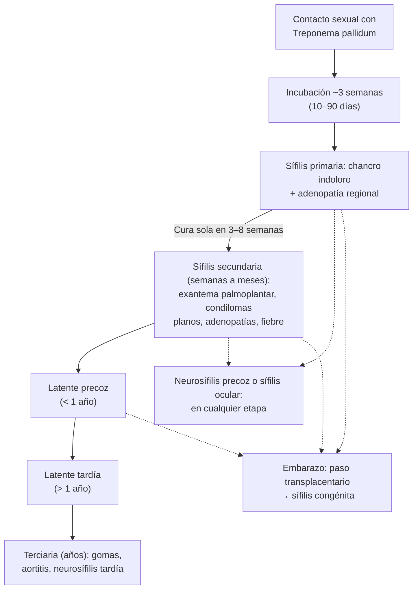

---
tags:
  - Infectología
---

# Infecciones de transmisión sexual y sífilis

**Subespecialidad**
Infectología · Dermatología · Ginecología · Urología

**Guías principales**
MINSAL 2016: Norma General Técnica N.° 187 de profilaxis, diagnóstico y tratamiento de las ITS · CDC 2021: guía de tratamiento de las ITS · OMS 2024: tratamiento de gonorrea, clamidia y sífilis, y pruebas de sífilis · CDC 2024: recomendaciones de laboratorio para sífilis · CDC 2024: doxiciclina como profilaxis posexposición

**Otras fuentes**
OMS 2025: nota descriptiva de las ITS · MINSAL: informes anuales de sífilis y gonorrea 2025 · Sífilis congénita en Chile 2010–2022 (Alfaro-Fierro 2025) · Figura: Takei 2023 (CC BY 4.0)

**GES**
Las ITS **no son GES**, salvo el **VIH (GES 18)**. En la red pública, el diagnóstico, el tratamiento y el control de las ITS son **gratuitos y confidenciales** (Reglamento de ITS), en APS y en las unidades especializadas (**UNACESS**). La sífilis y la gonorrea son de **notificación obligatoria**.

**EUNACOM**
1.04.1.010 Enfermedades de transmisión sexual (específico, completo, completo) · 1.04.1.023 Sífilis secundaria, terciaria y congénita (sospecha, inicial, derivar)

**Revisado**
Octubre 2026

!!! abstract "Resumen en 60 segundos"
    - Se adquiere **más de 1 millón de ITS curables al día** en el mundo; la mayoría son **asintomáticas**. En Chile la **sífilis** llegó en 2025 a **55,2 por 100.000**, la tasa más alta de la década.
    - Se piensa por **síndromes**:
        - **Secreción uretral o cervicitis**: gonococo, clamidia, *Mycoplasma genitalium*, tricomonas.
        - **Úlcera genital**: **sífilis** (indolora, indurada) o **herpes** (dolorosa, vesículas).
        - **Flujo vaginal**: vaginosis, candidiasis, tricomonas.
        - **Dolor pélvico** con dolor a la movilización cervical: **enfermedad inflamatoria pélvica (EIP)**.
    - **Toda persona con una ITS**: ofrecer **VIH, sífilis, hepatitis B** (y C), tratar a las **parejas**, condón, vacunas (VHB, VPH) y evaluar la **PrEP**.
    - **Tratamientos de primera línea** (CDC 2021, OMS 2024):
        - **Gonorrea**: **ceftriaxona 500 mg IM** dosis única (OMS: 1 g). Si no se descartó la clamidia, agregar doxiciclina.
        - **Clamidia** y uretritis no gonocócica: **doxiciclina 100 mg c/12 h × 7 días**.
        - **Herpes**: aciclovir o valaciclovir.
        - **Tricomonas**: metronidazol.
    - **Sífilis**:
        - **Precoz** (< 1 año): **primaria** (chancro indoloro), **secundaria** (exantema **palmoplantar**, condilomas planos) o latente precoz.
        - **Tardía** (> 1 año): latente tardía y **terciaria** (gomas, aortitis). La **neurosífilis** puede aparecer **en cualquier etapa**.
        - Diagnóstico con **VDRL o RPR** (actividad, seguimiento) + **prueba treponémica** (confirma; positiva de por vida).
        - Tratamiento: **penicilina benzatina 2,4 millones UI IM**. Precoz: 1 dosis (CDC/OMS; norma chilena 2016: 2 semanales). Tardía: 3 semanales. Neurosífilis: **penicilina sódica EV** 10–14 días.
    - **Embarazo**: VDRL en el **ingreso**, a las **24 semanas**, a las **32–34 semanas** y en el **parto**. Todo VDRL reactivo se trata **de inmediato** con penicilina.

## Definición

| Concepto | Definición |
|---|---|
| **Infección de transmisión sexual (ITS)** | Infección cuya principal vía de transmisión es el **contacto sexual** (vaginal, anal u oral). Muchas también se transmiten por sangre o al recién nacido |
| **Uretritis** | Inflamación de la uretra con **secreción** y/o **disuria**. **Gonocócica** o **no gonocócica** (clamidia, *M. genitalium*, tricomonas) |
| **Cervicitis** | Secreción endocervical **mucopurulenta** y/o sangrado endocervical fácil al tomar la muestra |
| **Enfermedad inflamatoria pélvica (EIP)** | Infección **ascendente** del tracto genital superior: endometritis, salpingitis, absceso tubo-ovárico, peritonitis pelviana |
| **Úlcera genital** | Pérdida de epitelio en genitales, periné o ano |
| **Sífilis precoz** | Primaria, secundaria y **latente precoz** (adquirida hace **< 1 año**). Es la etapa **contagiosa** por vía sexual |
| **Sífilis tardía** | **Latente tardía** (> 1 año o de duración desconocida) y **terciaria** |
| **Sífilis latente** | Serología reactiva **sin** síntomas ni signos |
| **Neurosífilis** | Infección del **sistema nervioso central** por *T. pallidum*. Puede ocurrir **en cualquier etapa**. La **sífilis ocular** y la **ótica** se tratan igual |
| **Sífilis congénita** | Transmisión **transplacentaria**. **Precoz** (< 2 años) o **tardía** (> 2 años) |

## Epidemiología

### Mundial

- **OMS** (nota descriptiva 2025):
    - Más de **1 millón** de ITS **curables** se adquieren **cada día** (15–49 años), la mayoría **sin síntomas**.
    - En 2020 hubo **129 millones** de infecciones nuevas por **clamidia**, **82 millones** por **gonorrea**, **7,1 millones** por **sífilis** y **156 millones** por **tricomonas**. La sífilis subió a **8 millones** en 2022.
    - **520 millones** de personas de 15–49 años tienen **herpes genital** (VHS-2).
    - En 2022, **1,1 millones** de embarazadas tenían sífilis, con más de **390.000** malos resultados del embarazo.
- **Resistencia del gonococo**: es creciente a la penicilina, las **quinolonas**, las tetraciclinas y la azitromicina, y aparecen cepas con menor sensibilidad a la **ceftriaxona**. Por eso las guías subieron la dosis de ceftriaxona.
- Las ITS **ulcerativas** e inflamatorias **aumentan la transmisión del VIH**.

!!! chile "Datos nacionales"
    - **Sífilis** (informe anual 2025, MINSAL):
        - La tasa de notificación llegó a **55,2 por 100.000** en 2025: **2,4 veces** la de 2016 y un **37 %** más que en 2021.
        - El **65 %** son **hombres** y el **58 %** tiene **20–39 años**.
        - Las tasas más altas están en el **norte**: Tarapacá, Arica y Parinacota y Antofagasta.
    - **Sífilis congénita**:
        - Tendencia al alza desde 2018, con un máximo en **2021**. El **63 %** de los casos fue sífilis congénita **precoz** (Alfaro-Fierro 2025).
        - El informe 2025 del MINSAL reporta una baja de **67 casos (2021) a 29 (2025)**.
    - **Gonorrea** (informe anual 2025, MINSAL):
        - **13,3 por 100.000** en 2025. El **79 %** son **hombres** y el **87 %** tiene **15–39 años**.
        - En **menores de 15 años**, los casos subieron de **11 a 25** entre 2024 y 2025: **sospechar abuso sexual**.
    - **Resistencia del gonococo** (ISP, 2014): **53,5 %** resistente a **ciprofloxacino**; **100 %** sensible a **ceftriaxona**. **No** usar quinolonas.
    - **Norma técnica N.° 187 (2016)**:
        - La atención de ITS en la red pública es **gratuita y confidencial**.
        - Tamizaje de sífilis en el **embarazo** en **4 momentos**: ingreso, 24 semanas, 32–34 semanas y parto.
        - Los esquemas chilenos para la sífilis precoz y la gonorrea **difieren** de las guías internacionales más recientes (ver Tratamiento).

## Etiología

| Síndrome | Agentes |
|---|---|
| **Uretritis y cervicitis** | ***Neisseria gonorrhoeae*** (diplococo gramnegativo) · ***Chlamydia trachomatis*** (serovares D–K) · ***Mycoplasma genitalium*** · *Trichomonas vaginalis* · VHS, adenovirus |
| **Úlcera genital** | ***Treponema pallidum*** (sífilis) · **virus herpes simple** 1 y 2 · *Haemophilus ducreyi* (chancroide; raro en Chile) · *C. trachomatis* serovares **L1–L3** (linfogranuloma venéreo) · *Klebsiella granulomatis* (donovanosis; muy raro) · **mpox** |
| **Flujo vaginal** | **Vaginosis bacteriana** y **candidiasis** (no son ITS en sentido estricto) · ***Trichomonas vaginalis*** (sí es ITS) |
| **EIP** | Gonococo, clamidia, *M. genitalium*, **anaerobios** y flora vaginal |
| **Proctitis** (sexo anal receptivo) | Gonococo, clamidia (incluido el **linfogranuloma venéreo**), herpes, sífilis |
| **Verrugas anogenitales** | **VPH 6 y 11** (los tipos **16 y 18** causan cáncer cervicouterino, anal y orofaríngeo) |
| **Ectoparásitos** | *Pthirus pubis* (ladillas), sarna |
| **Sistémicas** | **VIH**, **hepatitis B**, hepatitis C (sobre todo en hombres que tienen sexo con hombres), hepatitis A |

- **Factores de riesgo**: edad joven, **parejas nuevas o múltiples**, uso **inconsistente del condón**, **ITS previa**, hombres que tienen sexo con hombres, trabajo sexual, consumo de alcohol y drogas (incluido el *chemsex*), **VIH** o uso de **PrEP** (más pruebas y más exposición).

## Fisiopatología

- ***Treponema pallidum***:
    - Atraviesa la mucosa o la piel con microabrasiones y se multiplica en el sitio de entrada: **chancro** a las ~3 semanas.
    - Se disemina por vía linfática y **sanguínea** desde muy temprano: **sífilis secundaria** semanas a meses después.
    - La respuesta inmune controla la infección, pero no la elimina: **latencia** por años. Una parte de los no tratados desarrolla **sífilis terciaria**: **gomas**, **aortitis** (endarteritis de los *vasa vasorum*) y **neurosífilis** tardía.
    - Cruza la **placenta** en cualquier etapa (más en la sífilis precoz): aborto, mortinato o **sífilis congénita**.
- **Gonococo y clamidia**:
    - Infectan el **epitelio columnar** (uretra, endocérvix, recto, faringe, conjuntiva).
    - Si **ascienden**, producen **EIP** o **epididimitis**. La cicatriz tubaria causa **infertilidad**, **embarazo ectópico** y dolor pélvico crónico.
    - El gonococo puede pasar a la sangre: **infección gonocócica diseminada** (artritis-dermatitis).
- **Herpes simple**: tras la primoinfección, queda **latente** en los **ganglios sacros** y se reactiva (**recurrencias**). Hay **excreción asintomática**: la mayoría de los contagios ocurre sin lesiones visibles.
- **VPH**: infecta las células basales; los tipos 6 y 11 producen **condilomas**; los tipos de alto riesgo (16, 18) integran oncogenes (E6, E7) y causan **neoplasias**.

*Figura 1. Historia natural de la sífilis sin tratamiento. Esquema propio.*

## Clasificación

### Etapas de la sífilis

<figure markdown>
![Esquema de la sífilis sin tratamiento. Arriba, seis etapas en una línea de tiempo: incubación (10 a 90 días), primaria (chancro y adenopatía), secundaria (exantema palmoplantar), latente precoz (sin síntomas, menos de 1 año), latente tardía (sin síntomas, más de 1 año) y terciaria (años o décadas). Una barra roja indica que la sífilis precoz se contagia por vía sexual y una azul que la tardía no. Al centro, un gráfico: la prueba treponémica sube en la etapa primaria y queda reactiva de por vida; la no treponémica (VDRL o RPR) sube un poco después, alcanza títulos altos en la secundaria y baja lentamente en la latencia. Abajo, el tratamiento con penicilina benzatina según la etapa y la neurosífilis con penicilina sódica endovenosa](../assets/figuras/its/sifilis-etapas-y-serologia.svg){ loading=lazy }
<figcaption>Figura 2. Etapas de la sífilis, comportamiento de las pruebas treponémicas y no treponémicas, y tratamiento según la etapa. Esquema propio basado en la norma técnica N.° 187 (MINSAL 2016), CDC 2021 y OMS 2024.</figcaption>
</figure>

| Etapa | Tiempo | Clínica | Serología |
|---|---|---|---|
| **Primaria** | ~3 semanas tras el contagio (10–90 días) | **Chancro**: úlcera **única**, **indolora**, de **base indurada** y bordes netos, con **adenopatía regional indolora**. Desaparece sola en **3–8 semanas** | VDRL o RPR puede ser **no reactivo** los primeros ~10 días: si hay chancro, **tratar igual** |
| **Secundaria** | Semanas a 6 meses | Exantema **maculopapular no pruriginoso**, con compromiso **palmoplantar**; **condilomas planos**, placas mucosas, **alopecia en parches** y de la cola de las cejas, **adenopatías generalizadas**, fiebre, malestar. A veces hepatitis, glomerulonefritis, **uveítis**, meningitis | **Siempre reactiva**, con títulos **altos** (> 1:4 según la norma chilena). Si es no reactiva con clínica típica, pedir diluir la muestra (**fenómeno de prozona**) |
| **Latente precoz** | < 1 año | Sin síntomas | Reactiva |
| **Latente tardía** | > 1 año o desconocida | Sin síntomas | Reactiva, a menudo con títulos **bajos** |
| **Terciaria** | Años o décadas | **Gomas** (piel, mucosas, hueso), **aortitis** (insuficiencia aórtica, aneurisma de la aorta ascendente), neurosífilis tardía | Treponémica reactiva; VDRL reactivo, a veces bajo |
| **Neurosífilis** (cualquier etapa) | Precoz o tardía | **Precoz**: meningitis, **ACV** (meningovascular), pares craneanos, **uveítis o retinitis**, **hipoacusia** y tinnitus. **Tardía**: **tabes dorsal** (dolores lancinantes, ataxia, arreflexia, **pupila de Argyll Robertson**), **parálisis general** (demencia, psicosis) | **VDRL en LCR** reactivo (específico, poco sensible), pleocitosis, proteínas altas |

### Sífilis congénita

- **Precoz** (< 2 años): **rinitis** serosanguinolenta, lesiones **ampollares palmoplantares**, hepatoesplenomegalia, ictericia, anemia, **periostitis**, prematurez, bajo peso.
- **Tardía** (> 2 años): **dientes de Hutchinson**, **queratitis intersticial**, **sordera** (tríada de Hutchinson), **nariz en silla de montar**, **tibias en sable**.
- Sin tratamiento, la sífilis en el embarazo termina en **aborto** en ~25 % y **mortinato** en ~25 %; el resto de los recién nacidos tiene alta probabilidad de estar infectado (MINSAL 2016). **Con tratamiento oportuno se evita casi siempre**.

## Clínica

<figure markdown>
{ loading=lazy }
<figcaption>Figura 3. Sífilis secundaria: exantema maculopapular difuso en el tronco (A) y máculas eritematosas o rojo-parduscas, algunas con descamación, en las palmas (B) y las plantas (C). Fuente: Takei S, Suzuki K, Otsuka H, Watanabe S. Secondary syphilis rash. <em>JMA J.</em> 2023;6(4):546–547, figura 1. Licencia <a href="https://creativecommons.org/licenses/by/4.0/">CC BY 4.0</a>.</figcaption>
</figure>

| Síndrome o ITS | Claves clínicas |
|---|---|
| **Uretritis gonocócica** | Hombre con secreción uretral **purulenta**, abundante, y **disuria**, a los **2–7 días** de la exposición. En la mujer suele ser **asintomática** o da cervicitis |
| **Clamidia y uretritis no gonocócica** | Secreción **escasa, mucosa** o ausente; muy a menudo **asintomática** (sobre todo en mujeres) |
| **Cervicitis** | Secreción mucopurulenta, **sangrado intermenstrual o poscoital**, cuello friable |
| **EIP** | Dolor **abdominal bajo**, dolor a la **movilización cervical**, dolor **anexial** o uterino al tacto vaginal; fiebre, flujo. Puede haber **perihepatitis** (Fitz-Hugh-Curtis: dolor en el hipocondrio derecho) |
| **Epididimitis** | Dolor y aumento de volumen **testicular unilateral**, progresivo, con uretritis. En < 35 años: gonococo o clamidia; en > 35 años y en sexo anal insertivo: también **enterobacterias** |
| **Infección gonocócica diseminada** | **Tenosinovitis**, **poliartralgias migratorias**, **pústulas** acrales escasas, o **artritis séptica** monoarticular. Ver [monoartritis](../reumatologia/monoartritis-gota-artritis-septica.md) |
| **Herpes genital** | **Vesículas** agrupadas, **dolorosas**, que dejan **úlceras** superficiales; adenopatías inguinales dolorosas. La **primoinfección** es más intensa (fiebre, disuria, retención urinaria, meningitis aséptica). Las **recurrencias** son más leves, con pródromo (ardor, parestesias) |
| **Chancro sifilítico** | Úlcera **única, indolora, indurada**, limpia, con adenopatía indolora |
| **Chancroide** | Úlceras **dolorosas**, de bordes irregulares y fondo sucio, con **adenopatía supurada** (bubón) |
| **Linfogranuloma venéreo** | Pápula o úlcera transitoria, luego **adenopatía inguinal** dolorosa que fistuliza (signo del surco); en hombres que tienen sexo con hombres, **proctitis** que simula una enfermedad inflamatoria intestinal |
| **Tricomoniasis** | Flujo **amarillo-verdoso, espumoso**, prurito, **cuello "en frambuesa"**, pH vaginal > 4,5. El hombre suele ser asintomático |
| **Vaginosis bacteriana** | Flujo **gris, homogéneo**, olor a **pescado** (test de aminas positivo), pH > 4,5, **células clave**; sin inflamación |
| **Candidiasis vulvovaginal** | Flujo **blanco grumoso**, **prurito** intenso, eritema vulvar, pH normal (≤ 4,5) |
| **Condilomas acuminados** | Pápulas **verrugosas** o en "coliflor", indoloras, en genitales, periné y ano |
| **Mpox** | Lesiones **umbilicadas** o pustulosas que se ulceran, **dolorosas**, a menudo anogenitales; proctitis; fiebre y adenopatías |

!!! alarma "Situaciones que no pueden esperar"
    - **Neurosífilis o sífilis ocular u ótica**: cefalea, meningismo, déficit neurológico focal, **disminución de la agudeza visual**, uveítis, **hipoacusia** súbita en una persona con sífilis (o con VIH). Riesgo de **ceguera** y sordera permanentes: **hospitalizar**, punción lumbar, evaluación oftalmológica y **penicilina EV**.
    - **EIP con criterios de hospitalización** (CDC 2021): no se puede descartar una urgencia quirúrgica (**apendicitis**, **embarazo ectópico**), **absceso tubo-ovárico**, **embarazo**, compromiso del estado general, vómitos o fiebre alta, o falla del tratamiento oral. Siempre pedir **β-hCG**.
    - **Dolor testicular agudo**: descartar la **torsión testicular** antes de diagnosticar una epididimitis (ecografía Doppler; urología urgente).
    - **Sífilis en el embarazo**: tratar **el mismo día** con penicilina benzatina. Si hay **alergia**, **desensibilizar**: no hay alternativa que proteja al feto.
    - **Infección gonocócica diseminada** o artritis séptica gonocócica: hospitalizar y ceftriaxona EV.
    - **ITS en una niña, niño o adolescente menor de 14 años**: sospechar **abuso sexual**. El médico está **obligado a denunciar** en un plazo de **24 horas** (Código Procesal Penal, art. 175 y 176).

## Diagnóstico

!!! guia "Enfoque de la persona con una ITS o en riesgo (MINSAL 2016; CDC 2021; OMS 2024)"
    1. **Historia sexual** sin juicios: parejas (número, sexo), prácticas (vaginal, anal, oral), uso de condón, ITS previas, embarazo, PrEP, consumo de drogas.
    2. **Examen** de genitales, periné, ano, boca, piel (palmas y plantas) y ganglios. Especuloscopía en la mujer.
    3. **Muestras según el síndrome** (ver Laboratorio). Si el seguimiento es incierto, **tratar en la primera consulta** según el síndrome, sin esperar los resultados.
    4. **A toda persona con una ITS**: ofrecer **VIH**, **sífilis** (VDRL o RPR), **hepatitis B** (HBsAg) y, según el riesgo, hepatitis C. Test de embarazo si corresponde.
    5. **Parejas sexuales**: citarlas, evaluarlas y **tratarlas siempre** (MINSAL 2016). La OMS 2024 recomienda ofrecer **servicios de notificación a las parejas**.
    6. **Prevención**: condón, **abstinencia** hasta 7 días después del tratamiento y hasta que la pareja esté tratada; vacunas contra **hepatitis B** y **VPH**; evaluar la **PrEP** para VIH; en grupos seleccionados, **doxiciclina posexposición** (CDC 2024).

### Sífilis: cómo leer la serología

- **Pruebas no treponémicas** (**VDRL**, **RPR**):
    - Detectan anticuerpos contra cardiolipina. Se informan **cuantificadas** (diluciones: 1:2, 1:4, 1:8…).
    - Sirven para **tamizaje**, **etapificación** y **seguimiento**: miden la **actividad**.
    - Para comparar, usar **siempre la misma técnica**: VDRL y RPR no son intercambiables.
- **Pruebas treponémicas** (**MHA-TP**, **FTA-Abs**, TPPA, EIA o quimioluminiscencia, **tests rápidos**):
    - **Confirman** la infección.
    - Quedan **reactivas de por vida**, aun después del tratamiento: **no** sirven para el seguimiento ni para diagnosticar una reinfección.
- **Algoritmo**:
    - **Clásico** (Chile): tamizaje con VDRL o RPR y confirmación treponémica.
    - **Inverso**: tamizaje treponémico automatizado (EIA, quimioluminiscencia), luego VDRL o RPR, y una segunda prueba treponémica si son discordantes (CDC 2024).
    - Los **tests rápidos duales** (treponémico + no treponémico) permiten diagnosticar y tratar en la misma visita (OMS 2024).

| VDRL o RPR | Treponémica | Interpretación |
|---|---|---|
| No reactivo | No reactiva | Sin sífilis, o infección **muy reciente** (repetir en 2–4 semanas si hay sospecha; si hay chancro, tratar) |
| **Reactivo** | No reactiva | **Falso positivo biológico**: embarazo, **LES** y **síndrome antifosfolípidos**, VIH, hepatitis, TBC, endocarditis, vacunas, uso de drogas EV, edad avanzada. Suele tener título bajo |
| No reactivo | **Reactiva** | **Sífilis tratada** en el pasado, sífilis **muy precoz** o **latente tardía** con VDRL negativo. Evaluar antecedentes de tratamiento |
| **Reactivo** | **Reactiva** | **Sífilis activa** (no tratada) o tratada recientemente o **reinfección**: comparar con títulos previos. Un alza de ≥ 2 diluciones (4 veces) indica reinfección o fracaso |

- **Punción lumbar** (norma técnica N.° 187):
    - Toda persona con sífilis y **síntomas neurológicos, oftalmológicos** (uveítis, retinitis) **u otológicos**.
    - **Respuesta serológica inadecuada** tras un tratamiento correcto.
    - Persona con **VIH** y sífilis con **CD4 < 350**, **VDRL ≥ 1:16** o **RPR ≥ 1:32**, o con signos neurológicos.
    - **Sífilis terciaria**.
- **LCR compatible con neurosífilis**: **> 5 leucocitos/mm³** (≥ 20 en inmunocomprometidos), **proteínas > 45 mg/dL** y/o **VDRL reactivo** a cualquier dilución.

## Laboratorio

| Examen | Uso |
|---|---|
| **Gram de la secreción uretral** | En el hombre: **diplococos gramnegativos intracelulares** = gonorrea; **PMN sin diplococos** = uretritis no gonocócica. Bajo rendimiento en la mujer |
| **Cultivo en Thayer-Martin** | Gonococo, con **estudio de susceptibilidad** (vigilancia de la resistencia). Útil en la falla de tratamiento |
| **Técnicas de amplificación de ácidos nucleicos (TAAN, PCR)** | **Gonococo** y **clamidia** (y *M. genitalium*, tricomonas): **orina de primer chorro** en el hombre, **hisopado vaginal** en la mujer, y **rectal y faríngeo** según las prácticas. Las más sensibles |
| **VDRL o RPR cuantitativo** | Tamizaje, etapa y seguimiento de la sífilis. **VDRL en LCR** para la neurosífilis |
| **MHA-TP, FTA-Abs, test rápido treponémico** | Confirmación de la sífilis |
| **Microscopía de campo oscuro o PCR de la lesión** | *T. pallidum* en el chancro o en las lesiones húmedas (poco disponible) |
| **PCR de virus herpes de la úlcera** | Herpes genital (más sensible que el cultivo; el test de Tzanck está en desuso) |
| **Examen al fresco, pH y test de aminas del flujo** | Tricomonas (móviles), **células clave** (vaginosis), levaduras e hifas (candida con KOH) |
| **VIH, HBsAg, anticuerpos contra hepatitis C** | A toda persona con una ITS |
| **β-hCG** | En la EIP y antes de tratar (cambia el esquema) |

## Imágenes

- **Ecografía transvaginal**: en la EIP grave o sin respuesta, busca un **absceso tubo-ovárico** o un hidrosálpinx.
- **Ecografía testicular con Doppler**: epididimitis (flujo **aumentado**) frente a **torsión** (flujo ausente).
- **Sífilis terciaria**: **radiografía de tórax** y **ecocardiograma** (dilatación de la aorta ascendente, insuficiencia aórtica), **angio-TC** de la aorta; radiografía de huesos largos (periostitis, gomas). La norma pide un estudio **radiológico y cardiovascular** en la neurosífilis tardía.
- **Neurosífilis**: **RM cerebral** (infartos en la forma meningovascular, realce meníngeo, gomas).

## Diagnóstico diferencial

| Condición | Claves |
|---|---|
| **Úlcera genital no infecciosa** | **Behçet** (úlceras orales recurrentes, uveítis), **exantema fijo por fármacos** (reaparece en el mismo sitio), trauma, **cáncer** (úlcera que no cura en un adulto mayor) |
| **Herpes vs. sífilis primaria** | Herpes: **dolorosa**, **múltiple**, vesículas previas. Sífilis: **indolora**, **única**, indurada. Pueden coexistir: pedir **ambos** estudios |
| **Exantema de la sífilis secundaria** | Pitiriasis rosada, **toxicodermia**, exantemas virales (incluida la **infección aguda por VIH**), psoriasis, liquen plano. La sífilis afecta **palmas y plantas** |
| **Uretritis vs. infección urinaria** | Uretritis: **secreción**, joven sexualmente activo, urocultivo negativo. Ver [infección urinaria](../nefrologia/infeccion-urinaria.md) |
| **EIP** | **Embarazo ectópico** (β-hCG), **apendicitis**, torsión o quiste ovárico roto, endometriosis, ITU alta. Ver [abdomen agudo](../gastroenterologia/abdomen-agudo.md) |
| **Epididimitis** | **Torsión testicular** (inicio brusco, testículo alto, reflejo cremastérico ausente, Doppler sin flujo) |
| **Artritis gonocócica** | Artritis séptica por otros gérmenes, **artritis reactiva** (clamidia: uretritis + conjuntivitis + artritis), gota |
| **Neurosífilis** | Otras meningitis crónicas (TBC, criptococo), ACV de otra causa en jóvenes, demencias, psicosis |
| **Proctitis por linfogranuloma** | **Enfermedad inflamatoria intestinal** (pedir TAAN rectal de clamidia antes de inmunosuprimir) |

## Tratamiento

!!! guia "Principios del tratamiento (CDC 2021; OMS 2024; MINSAL 2016)"
    - **Tratar en la primera consulta** cuando hay un síndrome claro, con **dosis única observada** si es posible.
    - **Tratar a las parejas** sexuales (CDC: las de los últimos **60 días**) aunque no tengan síntomas.
    - **Abstinencia sexual** hasta 7 días después de un tratamiento de dosis única y hasta que la pareja esté tratada.
    - **Volver a testear** a los **3 meses** a quienes tuvieron gonorrea, clamidia o tricomonas: la **reinfección** es frecuente (CDC 2021).
    - **No usar quinolonas** para la gonorrea.
    - **Sífilis**: la **penicilina** es el tratamiento de elección en todas las etapas, y en el **embarazo** es la única que protege al **feto** (OMS 2024).
    - **Doxiciclina posexposición** (CDC 2024): **200 mg** dentro de las **72 horas** después de un contacto sexual sin condón. Reduce la sífilis y la clamidia en > 70 % y la gonorrea en ~50 %. Se ofrece a hombres que tienen sexo con hombres y mujeres trans con una ITS bacteriana en los últimos 12 meses. No está en la norma chilena 2016.

!!! dosis "Esquemas de tratamiento"
    - **Gonorrea no complicada** (uretra, cuello, recto, faringe):
        - **Ceftriaxona 500 mg IM**, dosis única (**1 g** si pesa ≥ 150 kg; CDC 2021). La **OMS 2024** sugiere **1 g IM**.
        - Si **no se descartó la clamidia**: agregar **doxiciclina 100 mg c/12 h × 7 días**.
        - Alergia grave a cefalosporinas: **gentamicina 240 mg IM + azitromicina 2 g VO**, dosis única.
        - *Norma chilena 2016*: ceftriaxona **250 mg IM** + **azitromicina 1 g VO**. Las guías posteriores subieron la dosis de ceftriaxona por la menor sensibilidad del gonococo.
        - **Infección gonocócica diseminada o artritis**: **ceftriaxona 1 g EV c/24 h** (norma chilena: 10 días).
    - **Clamidia y uretritis no gonocócica**:
        - **Doxiciclina 100 mg c/12 h × 7 días** (preferida por CDC 2021 y OMS 2024; mejor que la azitromicina en la infección rectal).
        - Alternativa: **azitromicina 1 g VO** dosis única (de elección en el **embarazo**).
    - ***M. genitalium***: doxiciclina 100 mg c/12 h × 7 días, seguida de **moxifloxacino 400 mg/día × 7 días**.
    - **Tricomoniasis**:
        - Mujer: **metronidazol 500 mg c/12 h × 7 días**. Hombre: **metronidazol 2 g VO** dosis única (CDC 2021).
        - *Norma chilena*: metronidazol 2 g VO + óvulo de 500 mg × 7 noches.
    - **Vaginosis bacteriana**: metronidazol 500 mg c/12 h × 7 días. **Candidiasis**: **fluconazol 150 mg VO** dosis única.
    - **Herpes genital**:
        - **Primer episodio**: **aciclovir 400 mg c/8 h** o **valaciclovir 1 g c/12 h**, por **7–10 días**.
        - **Recurrencia**: valaciclovir 500 mg c/12 h × 3 días, o aciclovir 800 mg c/12 h × 5 días (norma chilena: aciclovir 400 mg c/8 h o valaciclovir 500 mg c/12 h × 5 días).
        - **Supresión** (norma chilena: > 6 brotes al año): aciclovir 400 mg c/12 h o valaciclovir 500 mg/día.
        - **Grave** (diseminado, meningitis, hepatitis): **aciclovir 5–10 mg/kg EV c/8 h**.
    - **Linfogranuloma venéreo**: **doxiciclina 100 mg c/12 h × 21 días**.
    - **Chancroide**: azitromicina 1 g VO o ceftriaxona 250 mg IM, dosis única.
    - **EIP ambulatoria**: **ceftriaxona 500 mg IM** dosis única + **doxiciclina 100 mg c/12 h** + **metronidazol 500 mg c/12 h**, ambos por **14 días** (CDC 2021). Control en **72 horas**; si no mejora, hospitalizar.

### Sífilis

| Situación | CDC 2021 y OMS 2024 | Norma chilena (2016) |
|---|---|---|
| **Precoz** (primaria, secundaria, latente < 1 año) | **Penicilina benzatina 2,4 millones UI IM**, **1 dosis** | Penicilina benzatina 2,4 millones UI IM **semanal × 2** |
| **Tardía** (latente > 1 año o desconocida; terciaria sin neurosífilis) | Penicilina benzatina 2,4 millones UI IM **semanal × 3** | Igual (semanal × 3) |
| **Neurosífilis, ocular u ótica** | **Penicilina G sódica 3–4 millones UI EV c/4 h** (18–24 millones/día) × **10–14 días** | Igual, × **14 días**, **hospitalizado** |
| **Alergia a la penicilina** (no embarazada) | **Doxiciclina 100 mg c/12 h**: **14 días** (precoz) o **28 días** (tardía) | Doxiciclina 100 mg c/12 h: **15 días** (precoz) o **30 días** (tardía). Neurosífilis: **ceftriaxona 2 g/día × 14 días** con monitoreo, o doxiciclina 200 mg c/12 h × 28 días |
| **Embarazo** | **Solo penicilina** según la etapa; si hay alergia, **desensibilizar** | Todo VDRL reactivo: **primera dosis inmediata**; precoz × 2, tardía × 3 semanales. La ceftriaxona y la azitromicina **no** previenen la sífilis congénita |
| **Persona con VIH** | Igual que sin VIH | Todas las etapas no neurológicas: **semanal × 3** |

- **Reacción de Jarisch-Herxheimer**:
    - **Fiebre, cefalea, mialgias** y exacerbación del exantema **4–12 horas** después de la primera dosis; cede en **24 horas**.
    - Es más frecuente en la sífilis **secundaria** (~90 %) y primaria (~50 %).
    - **No es alergia**: no suspender la penicilina. Antipiréticos y reposo. En el embarazo puede gatillar contracciones.
- **Alergia a la penicilina**: la mayoría de los que la refieren **no** son alérgicos. Reevaluar la alergia antes de usar alternativas (MINSAL 2016).
- **Seguimiento serológico** (norma chilena): VDRL o RPR **cuantitativo**, con la **misma técnica**, a los **1, 3, 6 y 12 meses**.
    - **Respuesta adecuada**: caída de **≥ 2 diluciones** (4 veces; por ejemplo, de 1:32 a 1:8). La CDC la espera **dentro de 12 meses** en la sífilis precoz.
    - **Fracaso o reinfección**: el título se mantiene o **sube ≥ 2 diluciones**. Reevaluar (VIH, punción lumbar) y repetir el tratamiento.
    - Algunas personas quedan con títulos bajos persistentes (**serofast**) pese a un buen tratamiento.

## Complicaciones

- **Gonorrea y clamidia**:
    - **EIP** → **infertilidad** tubaria, **embarazo ectópico**, **dolor pélvico crónico**, absceso tubo-ovárico.
    - **Epididimitis**, prostatitis.
    - **Infección gonocócica diseminada**; **artritis reactiva** (clamidia).
    - **Conjuntivitis neonatal** y neumonía del recién nacido.
- **Sífilis**: **neurosífilis** (ACV en jóvenes, demencia, tabes), **sífilis ocular** (ceguera), **otosífilis** (sordera), **aortitis** (insuficiencia aórtica, aneurisma), gomas, **sífilis congénita**, aborto y mortinato.
- **Herpes**: recurrencias, **meningitis** aséptica, retención urinaria, **herpes neonatal** (grave) si hay lesiones en el parto, impacto psicosocial.
- **VPH**: **cáncer cervicouterino**, anal, de pene y orofaríngeo.
- **Todas las ITS**: **aumentan la transmisión del VIH**.

## Pronóstico y seguimiento

- Las ITS bacterianas tratadas a tiempo **se curan** sin secuelas; el daño viene de la **demora** (EIP, sífilis tardía, sífilis congénita).
- **Reinfección**: frecuente. **Repetir los exámenes a los 3 meses** del tratamiento de gonorrea, clamidia y tricomonas (CDC 2021). La norma chilena indica un control a los **7 días** en la gonorrea y la clamidia.
- **Prueba de curación** en la **gonorrea faríngea** (7–14 días después; CDC 2021) y en el **embarazo**.
- **Sífilis**: VDRL cuantitativo a los **1, 3, 6 y 12 meses**. En la neurosífilis, **punción lumbar cada 6 meses** hasta que el VDRL en el LCR se negativice; si no ocurre a los **24 meses**, repetir el tratamiento (MINSAL 2016).
- **Embarazada con sífilis**: se considera **adecuadamente tratada** si recibió **penicilina benzatina** con la última dosis **al menos 1 mes antes del parto** y su VDRL **bajó ≥ 2 diluciones**. Si no, se estudia y trata al recién nacido.
- **Herpes**: es una infección **crónica**; la supresión reduce las recurrencias en 70–80 % y la transmisión.

## Perlas para el internado

- **Úlcera indolora + adenopatía indolora = sífilis** hasta demostrar lo contrario. **Úlcera dolorosa con vesículas = herpes**. Pide siempre **ambos** estudios.
- **Exantema con palmas y plantas** en un adulto joven: pide **VDRL** (y VIH).
- Un **VDRL no reactivo** no descarta un **chancro** (primeros ~10 días) ni una sífilis secundaria con **prozona**.
- La **prueba treponémica** queda positiva **de por vida**: para seguir el tratamiento se usa el **VDRL o RPR cuantitativo** con la **misma técnica**.
- **Fiebre unas horas después de la penicilina** en una sífilis: **Jarisch-Herxheimer**, no alergia.
- Hoy la **clamidia** se trata con **doxiciclina 7 días**; la azitromicina queda para el **embarazo** o la mala adherencia.
- La **ceftriaxona** para la gonorrea subió a **500 mg** (CDC) o **1 g** (OMS): el gonococo es cada vez más resistente. **Nunca ciprofloxacino**.
- **Toda ITS** → VIH, sífilis, hepatitis B, tratar a las **parejas** y conversar de **prevención** (condón, vacunas, PrEP).
- **Dolor pélvico en una mujer joven**: **β-hCG** antes que nada.
- En la **embarazada**, la sífilis solo se trata con **penicilina**; si es alérgica, se **desensibiliza**.

## Preguntas de repaso

??? repaso "1. Hombre de 24 años con secreción uretral purulenta y disuria desde hace 3 días. Tuvo una pareja sexual nueva hace una semana. El Gram muestra diplococos gramnegativos intracelulares. ¿Cuál es el diagnóstico y el tratamiento?"
    **Uretritis gonocócica**.

    - **Ceftriaxona 500 mg IM** dosis única (CDC 2021; OMS 2024: 1 g). La norma chilena 2016 indica 250 mg IM + azitromicina 1 g.
    - Como **no se descartó la clamidia** (coinfección frecuente): **doxiciclina 100 mg c/12 h × 7 días**.
    - **No** ciprofloxacino: más de la mitad de los gonococos en Chile son resistentes.
    - Ofrecer **VIH, VDRL, HBsAg**. Citar y **tratar a las parejas**. Abstinencia por 7 días. Volver a testear a los 3 meses. **Notificar**.

??? repaso "2. Hombre de 30 años con una úlcera en el surco balanoprepucial, indolora, de base dura, aparecida hace 10 días, con una adenopatía inguinal indolora. El VDRL es no reactivo. ¿Qué hace?"
    **Sífilis primaria** (chancro) hasta demostrar lo contrario. El VDRL puede ser **no reactivo** en los primeros días del chancro.

    - Pedir una **prueba treponémica** (o test rápido) y, si está disponible, PCR o campo oscuro de la lesión; **PCR de herpes** de la úlcera; **VIH**.
    - **Tratar igual** por la sospecha: **penicilina benzatina 2,4 millones UI IM** (1 dosis según CDC/OMS; norma chilena: semanal × 2).
    - Advertir sobre la **reacción de Jarisch-Herxheimer**.
    - Repetir el VDRL cuantitativo a los 1, 3, 6 y 12 meses. Tratar a las parejas.

??? repaso "3. Mujer de 28 años con un exantema no pruriginoso en el tronco, las palmas y las plantas, placas blanquecinas en la boca, alopecia en parches y adenopatías generalizadas. VDRL 1:64 y MHA-TP reactivo. ¿Diagnóstico, tratamiento y seguimiento?"
    **Sífilis secundaria**.

    - **Penicilina benzatina 2,4 millones UI IM**: 1 dosis (CDC/OMS) o semanal × 2 (norma chilena). Si es alérgica (y no está embarazada): doxiciclina 100 mg c/12 h × 14–15 días.
    - **Test de embarazo** (si está embarazada, solo penicilina). VIH, hepatitis B.
    - Buscar **síntomas neurológicos, visuales o auditivos**: si los hay, punción lumbar y penicilina EV.
    - **Seguimiento**: VDRL a los 1, 3, 6 y 12 meses. Se espera que baje **≥ 2 diluciones** (a 1:16 o menos).
    - Muy probable la **reacción de Jarisch-Herxheimer** (~90 % en la secundaria).

??? repaso "4. Embarazada de 26 semanas con VDRL reactivo 1:8 en el control. Refiere \"alergia a la penicilina\" por un exantema en la infancia. ¿Qué hace?"
    Es un **caso probable de sífilis gestacional**: se trata **de inmediato**, sin esperar la confirmación (norma chilena).

    - Confirmar con una prueba treponémica y precisar la etapa (VDRL previos). Si no se puede precisar, tratar como **latente tardía** (semanal × 3).
    - La "alergia" referida suele no ser real: **evaluar** la alergia. Si es una alergia verdadera, **desensibilizar** y tratar con **penicilina benzatina**.
    - **No** usar ceftriaxona, azitromicina ni eritromicina: **no previenen la sífilis congénita**. La doxiciclina está contraindicada.
    - Seguimiento con VDRL mensual. Tratar a la pareja. Informar al equipo neonatal.

??? repaso "5. Mujer de 22 años con dolor abdominal bajo y flujo de 4 días, fiebre de 38 °C. Al tacto vaginal hay dolor a la movilización cervical y dolor anexial bilateral. β-hCG negativa. ¿Diagnóstico y manejo?"
    **Enfermedad inflamatoria pélvica**.

    - **Ecografía transvaginal** para descartar un **absceso tubo-ovárico**. Descartar apendicitis si la clínica lo sugiere.
    - TAAN para **gonococo y clamidia**, VIH, VDRL.
    - **Ambulatoria** si no hay criterios de gravedad: **ceftriaxona 500 mg IM** + **doxiciclina 100 mg c/12 h** + **metronidazol 500 mg c/12 h** × **14 días**. Control en **72 horas**.
    - **Hospitalizar** si: absceso tubo-ovárico, embarazo, compromiso general o vómitos, duda diagnóstica quirúrgica o falla del tratamiento oral.
    - Tratar a las parejas de los últimos 60 días.

??? repaso "6. Hombre de 45 años con VIH (CD4 280) y VDRL 1:32. Refiere visión borrosa del ojo derecho desde hace una semana. ¿Qué sospecha y cómo lo trata?"
    **Sífilis ocular** (una forma de neurosífilis), con riesgo de **ceguera**.

    - **Hospitalizar**. Evaluación **oftalmológica** urgente (uveítis, retinitis).
    - **Punción lumbar**: célula, proteínas y **VDRL en LCR**. En este caso está indicada también por el VIH con CD4 < 350 y VDRL ≥ 1:16.
    - Tratamiento: **penicilina G sódica 3–4 millones UI EV c/4 h × 10–14 días** (norma chilena: 14 días). La sífilis ocular se trata como neurosífilis **aunque el LCR sea normal**.
    - Optimizar la **terapia antirretroviral**. Seguimiento con VDRL sérico y, si hubo neurosífilis, punción lumbar cada 6 meses.

## Referencias

1. Ministerio de Salud de Chile. Norma General Técnica N.° 187 de profilaxis, diagnóstico y tratamiento de las infecciones de transmisión sexual (ITS). Santiago: MINSAL; 2016. [diprece.minsal.cl](https://diprece.minsal.cl/wrdprss_minsal/wp-content/uploads/2014/11/NORMA-GRAL.-TECNICA-N%C2%B0-187-DE-PROFILAXIS-DIAGNOSTICO-Y-TRATAMIENTO-DE-LAS-ITS.pdf)
2. Workowski KA, Bachmann LH, Chan PA, et al. Sexually Transmitted Infections Treatment Guidelines, 2021. *MMWR Recomm Rep.* 2021;70(4):1–187. doi:[10.15585/mmwr.rr7004a1](https://doi.org/10.15585/mmwr.rr7004a1)
3. World Health Organization. Updated recommendations for the treatment of *Neisseria gonorrhoeae*, *Chlamydia trachomatis* and *Treponema pallidum* (syphilis), and new recommendations on syphilis testing and partner services. Geneva: WHO; 2024. [iris.who.int](https://iris.who.int/server/api/core/bitstreams/3cb57ec4-fc62-435c-a295-5cbaa5bd0676/content)
4. Papp JR, Park IU, Fakile Y, et al. CDC Laboratory Recommendations for Syphilis Testing, United States, 2024. *MMWR Recomm Rep.* 2024;73(1):1–32. doi:[10.15585/mmwr.rr7301a1](https://doi.org/10.15585/mmwr.rr7301a1)
5. Bachmann LH, Barbee LA, Chan P, et al. CDC Clinical Guidelines on the Use of Doxycycline Postexposure Prophylaxis for Bacterial Sexually Transmitted Infection Prevention, United States, 2024. *MMWR Recomm Rep.* 2024;73(2):1–8. doi:[10.15585/mmwr.rr7302a1](https://doi.org/10.15585/mmwr.rr7302a1)
6. World Health Organization. Sexually transmitted infections (STIs): fact sheet. 10 de septiembre de 2025. [who.int](https://www.who.int/news-room/fact-sheets/detail/sexually-transmitted-infections-(stis))
7. Ministerio de Salud de Chile, Departamento de Epidemiología. Informe anual breve 2025: sífilis. 2026. [epi.minsal.cl](https://epi.minsal.cl/wp-content/uploads/2026/06/Informe_anual_breve_2025_sifilis.pdf)
8. Ministerio de Salud de Chile, Departamento de Epidemiología. Informe anual breve 2025: gonorrea. 2026. [epi.minsal.cl](https://epi.minsal.cl/wp-content/uploads/2026/06/Informe_anual_breve_2025_gonorrea.pdf)
9. Alfaro-Fierro V, Vergara Pinto P, Yutronic J, Horna-Campos O. Epidemiological situation of new cases of congenital syphilis in Chile, 2010–2022. *Andes Pediatr.* 2025;96(6):745–750. doi:[10.32641/andespediatr.v96i6.5737](https://doi.org/10.32641/andespediatr.v96i6.5737)
10. Takei S, Suzuki K, Otsuka H, Watanabe S. Secondary syphilis rash. *JMA J.* 2023;6(4):546–547. doi:[10.31662/jmaj.2023-0068](https://doi.org/10.31662/jmaj.2023-0068)
