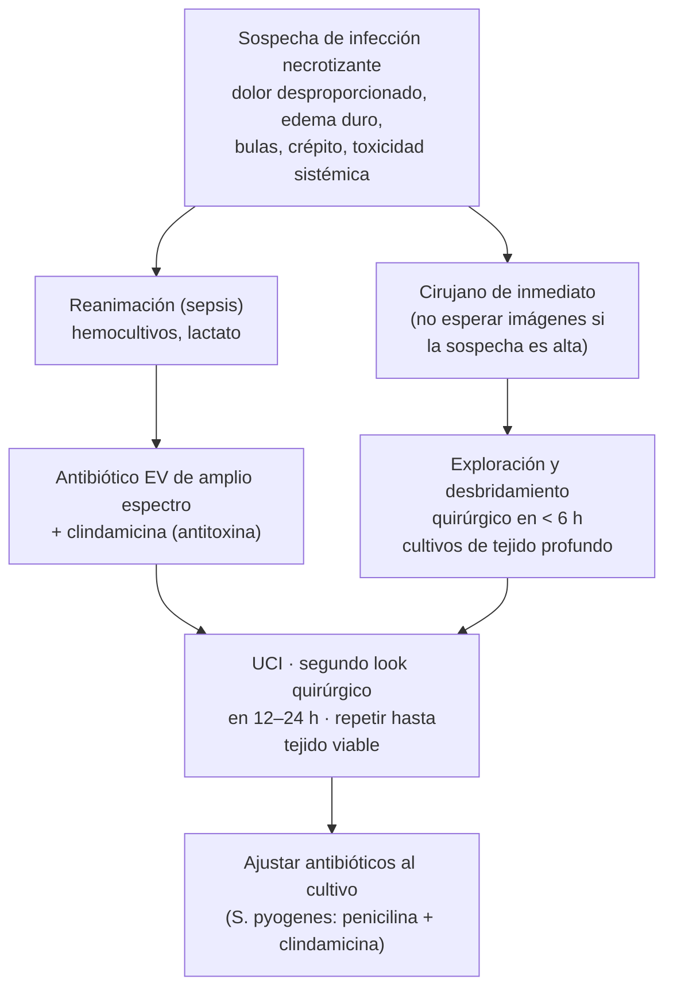

---
tags:
  - Infectología
  - Urgencia
  - Frecuente en sala
  - Diabetes
---

# Infecciones de piel y partes blandas

**Subespecialidad**
Infectología · Cirugía · Diabetes · Urgencia

**Guías principales**
IDSA 2014: infecciones de piel y partes blandas · WSES/GAIS/WSIS/SIS-E/AAST 2022: rutas clínicas globales · IWGDF/IDSA 2023: infección del pie diabético

**Otras fuentes**
MINSAL 2024: lineamientos de manejo de la enfermedad invasora por *Streptococcus pyogenes* · Vigilancia del ISP de *S. pyogenes* invasor

**EUNACOM**
1.04.1.006 Celulitis bacteriana (específico, completo, completo) · 1.04.2.005 Infección invasiva de partes blandas: celulitis, fasceítis, miositis necrotizantes o septicémicas (sospecha, inicial, derivar) · 1.02.1.014 Pie diabético y otras infecciones en diabetes (específico, inicial, derivar)

**Revisado**
Septiembre 2026

!!! abstract "Resumen en 60 segundos"
    - Primero distingue **purulenta** (absceso, forúnculo: *S. aureus*) de **no purulenta** (celulitis, erisipela: **estreptococo β-hemolítico**), y luego la **gravedad** (leve, moderada, grave).
    - **Absceso**: el tratamiento es el **drenaje**; antibiótico sólo si es grande, hay celulitis extensa, signos sistémicos, inmunosupresión o localización difícil.
    - **Celulitis no purulenta leve**: **cefadroxilo o cefalexina** (o amoxicilina/clavulánico) por **5 días**, extensible si no mejora. **Eleva la extremidad** y **trata la puerta de entrada** (intertrigo, tiña pedis).
    - **Fascitis necrotizante**: **dolor desproporcionado**, progresión en horas, bulas hemorrágicas, crépito, anestesia de la piel, shock. Es una **urgencia quirúrgica**: **desbridamiento en < 6 horas**, antibióticos de amplio espectro con **clindamicina** (antitoxina). **No esperar imágenes**.
    - En Chile aumentó desde 2023 la **enfermedad invasora por *S. pyogenes*** (fascitis, shock tóxico): sigue **100 % sensible a penicilina**.
    - **Pie diabético infectado**: clasificar (leve, moderada, grave, ± osteomielitis), **cultivo de tejido profundo**, radiografía, evaluar isquemia y **derivar**.

## Definición

| Cuadro | Definición y capa afectada |
|---|---|
| **Impétigo** | Infección de la **epidermis** superficial: pústulas y **costras mielicéricas** (color miel); ampollas en el impétigo buloso (*S. aureus*) |
| **Erisipela** | Infección de la **dermis superficial** y sus **linfáticos**: placa roja, brillante, **solevantada**, con **borde neto**; típicamente en piernas o cara. Casi siempre **estreptocócica** |
| **Celulitis** | Infección de la **dermis profunda** y el **tejido subcutáneo**: eritema, edema y calor con **bordes difusos** |
| **Foliculitis, forúnculo, ántrax** | Infección del **folículo piloso**: pústula (foliculitis), nódulo con pus (forúnculo) o varios forúnculos confluentes (ántrax). *S. aureus* |
| **Absceso cutáneo** | **Colección de pus** en la dermis o el subcutáneo: nódulo **fluctuante**, doloroso |
| **Infección necrotizante de partes blandas** | Infección con **necrosis** que avanza rápido por los planos: **celulitis necrotizante** (subcutáneo), **fascitis necrotizante** (fascia), **miositis o mionecrosis** (músculo). La **gangrena de Fournier** es la forma perineal y genital |
| **Infección del pie diabético** | Infección de partes blandas o hueso **bajo los maléolos** en una persona con diabetes, habitualmente a partir de una **úlcera** |

<figure markdown>
![Corte esquemático de la piel con epidermis, dermis con vasos y linfáticos, tejido subcutáneo, fascia y músculo, con un folículo piloso y una colección de pus. A la derecha, llaves que indican la profundidad de cada infección: impétigo en la epidermis, erisipela en la dermis superficial y linfáticos, celulitis en la dermis profunda y el subcutáneo, foliculitis, forúnculo y absceso alrededor del folículo, fascitis necrotizante en el subcutáneo profundo y la fascia, y miositis o mionecrosis en el músculo](../assets/figuras/piel/profundidad-infecciones-piel.svg){ loading=lazy }
<figcaption>Figura 1. Profundidad de las infecciones de piel y partes blandas. Esquema propio.</figcaption>
</figure>

## Epidemiología

### Mundial

- Las infecciones de piel y partes blandas son una de las **causas más frecuentes de consulta** en urgencia y APS, y de hospitalización por infección.
- ***S. aureus*** es el microorganismo más aislado en las infecciones **purulentas**; los **estreptococos β-hemolíticos** (sobre todo grupo A, *S. pyogenes*) causan la mayoría de las **celulitis y erisipelas** no purulentas.
- La prevalencia de **SAMR** en infecciones de piel varía mucho entre países (< 1 % a > 50 %); en América Latina ~ 29 % de los *S. aureus* de piel en un estudio multinacional, con gran variación local.
- Las **infecciones necrotizantes** son raras (~ 0,3–15 casos por 100.000 habitantes al año) pero **letales**: mortalidad de **~ 20–30 %**, que aumenta cuando la cirugía se retrasa (19 % con cirugía en < 6 h vs 32 % con > 6 h).
- **Pie diabético**: ~ **50 %** de las úlceras del pie diabético se infectan, y la infección es la causa inmediata más frecuente de **amputación** en personas con diabetes.

### Chile

!!! chile "Datos nacionales"
    - Desde fines de **2023** aumentaron las cepas de ***S. pyogenes* invasor** confirmadas por el **ISP**, aún más en **2024**, concentradas en la Región Metropolitana. El MINSAL emitió una **alerta** y **lineamientos técnicos de manejo** (junio 2024).
    - Susceptibilidad de *S. pyogenes* (ISP): **100 % sensible a penicilina** y cefotaxima; **clindamicina 91 %** sensible; **resistencia a azitromicina 26,8 %** (2023). Los **macrólidos no son una buena alternativa** empírica.
    - El **SAMR comunitario** es menos frecuente en Chile que en EE. UU.; el SAMR es sobre todo **asociado a la atención de salud**. Por eso, en la celulitis y los abscesos comunitarios sin factores de riesgo, **no se cubre SAMR de rutina**.
    - La **diabetes** afecta a ~ 12 % de los adultos (ENS 2016–2017). El GES de DM2 incluye la **curación avanzada** de las úlceras del pie diabético en la APS.

## Etiología y fisiopatología

| Infección | Microorganismos principales |
|---|---|
| **Erisipela y celulitis no purulenta** | **Estreptococos β-hemolíticos** (grupos A, B, C, G) |
| **Absceso, forúnculo, celulitis purulenta** | ***S. aureus*** (incluido SAMR según epidemiología) |
| **Impétigo** | *S. aureus* y *S. pyogenes* |
| **Fascitis necrotizante tipo I (polimicrobiana)** | Aerobios y anaerobios mixtos: la más frecuente; en **diabéticos**, posoperatorio, **Fournier** |
| **Fascitis necrotizante tipo II (monomicrobiana)** | ***S. pyogenes*** (± *S. aureus*); en personas **sanas**, a veces tras un trauma menor o varicela; se asocia a **shock tóxico** |
| **Otras necrotizantes** | *Clostridium perfringens* (**gangrena gaseosa**, trauma), *Vibrio vulnificus* (agua de mar, cirróticos), *Aeromonas* (agua dulce) |
| **Mordeduras** | *Pasteurella* (gato, perro), *Capnocytophaga* (perro, esplenectomizados), flora oral humana (*Eikenella*), anaerobios |
| **Pie diabético** | **Cocos grampositivos** (*S. aureus*, estreptococos) en las infecciones leves; **polimicrobiana** (gramnegativos, anaerobios) en las crónicas, profundas o isquémicas; *Pseudomonas* en climas cálidos o pies macerados |

- **Puerta de entrada**: **intertrigo** y **tiña pedis** interdigital, úlceras, heridas, picaduras, cirugía, inyecciones.
- **Factores de riesgo de celulitis**: **linfedema** y **edema crónico**, insuficiencia venosa, **obesidad**, **celulitis previa** (recurrencias frecuentes), diabetes, safenectomía, vaciamiento ganglionar.
- **Infección necrotizante**: las bacterias producen **toxinas** (superantígenos) y **trombosis** de los vasos que nutren la piel → **isquemia** y necrosis que avanza por la **fascia** antes de que la piel cambie mucho: por eso el **dolor** es desproporcionado a lo que se ve.
- **Pie diabético**: la **neuropatía** (pérdida de sensibilidad, deformidades), la **enfermedad arterial periférica** y la **inmunidad alterada** permiten que una úlcera se infecte y progrese a hueso (**osteomielitis**).

## Clasificación

### Por tipo y gravedad (IDSA 2014, WSES 2022)

| Gravedad | Purulenta (absceso, forúnculo) | No purulenta (celulitis, erisipela) |
|---|---|---|
| **Leve** | Sin signos sistémicos | Sin signos sistémicos |
| **Moderada** | Con signos sistémicos de infección | Con signos sistémicos de infección |
| **Grave** | Fracaso del drenaje + antibiótico oral, signos sistémicos con **SIRS**, **hipotensión** o **inmunosupresión** | Fracaso del antibiótico oral, **SIRS**, hipotensión, inmunosupresión o **sospecha de infección profunda o necrotizante** |

### Infección del pie diabético (IWGDF/IDSA 2023)

| Grado | Criterios |
|---|---|
| **1. No infectado** | Sin signos locales ni sistémicos |
| **2. Leve** | ≥ 2 de: edema o induración, **eritema de 0,5–2 cm** alrededor de la herida, dolor, calor, secreción purulenta; limitado a **piel y subcutáneo**; sin signos sistémicos |
| **3. Moderada** | Eritema **> 2 cm** o compromiso de estructuras **profundas** (absceso, **osteomielitis**, artritis séptica, fascitis); **sin** signos sistémicos |
| **4. Grave** | Cualquier infección con **signos sistémicos** (≥ 2 criterios de SIRS) |
| **(O)** | Se agrega "(O)" si hay **osteomielitis** (p. ej., 3(O)) |

## Clínica

| Cuadro | Claves |
|---|---|
| **Erisipela** | Inicio **brusco** con fiebre y calofríos; placa roja brillante, **solevantada**, **borde neto**; a veces ampollas; **adenopatía** regional |
| **Celulitis** | Eritema, edema, calor y dolor de **bordes difusos**, generalmente **unilateral** en la pierna; fiebre en casos moderados; linfangitis |
| **Absceso** | Nódulo doloroso, **fluctuante**, con eritema alrededor; puede drenar pus |
| **Fascitis necrotizante** | **Dolor intenso desproporcionado** al aspecto de la piel, **edema duro** más allá del eritema, progresión en **horas**, **bulas** (a veces hemorrágicas), piel gris o violácea, **anestesia** cutánea, **crépito** (gas), **toxicidad sistémica** y **shock** |
| **Síndrome de shock tóxico estreptocócico** | Hipotensión + falla multiorgánica (renal, hepática, coagulopatía, SDRA, exantema) con *S. pyogenes* aislado |
| **Pie diabético infectado** | Eritema, calor, secreción, mal olor, **hueso visible o palpable** (osteomielitis); los signos pueden ser **atenuados** por la neuropatía y la isquemia; la **hiperglicemia inexplicada** puede ser un signo |

!!! alarma "Signos de alarma de infección necrotizante"
    **Dolor desproporcionado** · edema duro que sobrepasa el eritema · **bulas** · piel **gris, violácea o necrótica** · **crépito** · **anestesia** de la zona · progresión rápida pese al antibiótico · **shock** o falla orgánica · **hiponatremia**, creatinina alta, leucocitosis marcada. Ante la sospecha: **cirujano de inmediato**. La exploración quirúrgica es diagnóstica y terapéutica.

!!! perla "La celulitis bilateral casi nunca es celulitis"
    Un eritema en **ambas piernas** suele ser **dermatitis por estasis** venosa, **lipodermatoesclerosis**, eccema o edema: la celulitis es casi siempre **unilateral**. El sobrediagnóstico de celulitis es muy frecuente (~ 30 % de los casos derivados).

## Diagnóstico

- **Clínico** en la celulitis, la erisipela y el absceso.
- **Marcar el borde** del eritema con un plumón para seguir la evolución.
- **Cultivos**:
    - **Absceso**: cultivo del **pus** drenado (sobre todo si hay tratamiento antibiótico, recurrencia o factores de riesgo de SAMR).
    - **Celulitis no complicada**: **no** se necesitan cultivos (rendimiento bajo).
    - **Hemocultivos** en la celulitis **moderada o grave**, inmunosuprimidos, neutropénicos, mordeduras o inmersión en agua.
    - **Infección necrotizante**: cultivos de **tejido profundo** obtenidos en la cirugía y hemocultivos.
    - **Pie diabético**: **muestra de tejido profundo** (curetaje o biopsia tras limpiar la herida), **no hisopado superficial**; biopsia ósea si hay osteomielitis dudosa.
- **Puntaje LRINEC** (apoyo, no descarta): PCR ≥ 150 mg/L (4 puntos) · leucocitos 15–25 (1) o > 25 × 10³/µL (2) · Hb 11–13,5 (1) o < 11 g/dL (2) · Na < 135 (2) · creatinina > 1,6 mg/dL (2) · glicemia > 180 mg/dL (1). **≥ 6** sugiere infección necrotizante, pero un **puntaje bajo no la descarta**.
- **Pie diabético**: **test de sonda-hueso** (*probe-to-bone*) positivo sugiere osteomielitis; evaluar **pulsos**, **índice tobillo-brazo** y sensibilidad (monofilamento).

## Laboratorio

| Examen | Para qué |
|---|---|
| **Hemograma, PCR** | Gravedad; leucocitosis marcada o PCR muy alta sugieren infección profunda o necrotizante |
| **Creatinina, electrolitos, CK** | Disfunción renal, hiponatremia (LRINEC), CK alta en miositis |
| **Lactato** | Hipoperfusión, sepsis |
| **Glicemia, HbA1c** | Diabetes (a veces no diagnosticada) |
| **Hemocultivos** | Celulitis moderada o grave, sepsis |
| **Cultivo de pus o tejido profundo** | Absceso, infección necrotizante, pie diabético |
| **VHS y PCR** | Seguimiento de la osteomielitis del pie diabético (VHS > 70 mm/h la sugiere) |

## Imágenes

- **Ecografía de partes blandas**: distingue **celulitis** de **absceso** (colección drenable) y guía el drenaje.
- **Infección necrotizante**: la **TC con contraste** muestra **gas** en los tejidos, líquido y engrosamiento a lo largo de la **fascia**; la RM es más sensible pero lenta. **Nunca retrasar la cirugía por una imagen** si la sospecha es alta; una radiografía normal **no** la descarta.
- **Pie diabético**: **radiografía** de pie en todos (osteomielitis, gas, cuerpo extraño, deformidades; repetir a las 2–4 semanas si la inicial es normal); **RM** si hay dudas sobre osteomielitis o abscesos profundos. Evaluar la **perfusión** (índice tobillo-brazo, presión de ortejos, ecodoppler arterial).
- **Ecodoppler venoso** si la celulitis se confunde con una **trombosis venosa profunda**.

## Diagnóstico diferencial

- **Trombosis venosa profunda**, **dermatitis por estasis** venosa, lipodermatoesclerosis, **dermatitis de contacto**, **gota** o **pseudogota** (artritis con eritema periarticular), **bursitis**, picadura con reacción local, **eritema migrans**, **herpes zóster** (fase preeruptiva), reacción a fármacos, **síndrome compartimental**, **pioderma gangrenoso** (empeora con el desbridamiento).
- **Pie diabético**: **pie de Charcot agudo** (pie caliente, rojo, edematoso **sin úlcera**; el eritema baja al elevar el pie), gota, TVP.

## Tratamiento

!!! guia "Principios (IDSA 2014, WSES 2022)"
    - **Absceso** → **incisión y drenaje** (es el tratamiento principal).
    - **Celulitis no purulenta** → antibiótico contra **estreptococos** (± *S. aureus* sensible a meticilina).
    - **Infección necrotizante** → **cirugía urgente** + antibióticos de amplio espectro + soporte.
    - **Duración**: **5 días** en la celulitis no complicada, **extender** si no mejora.
    - **Medidas generales**: **elevar** la extremidad, tratar la **puerta de entrada** (tiña, intertrigo), manejar el **edema** crónico.

### Celulitis y erisipela (no purulentas)

!!! dosis "Antibióticos para la celulitis y erisipela no purulentas"
    **Leve (ambulatoria)**, VO, **5 días** (hasta 10 si no hay resolución):

    - **Cefadroxilo 500 mg–1 g c/12 h** o **cefalexina 500 mg c/6 h**.
    - **Amoxicilina/clavulánico 875/125 mg c/12 h** (o 500/125 c/8 h).
    - Erisipela típica: **amoxicilina** o penicilina (estreptococo casi siempre).
    - **Alergia a β-lactámicos**: **clindamicina 300–450 mg c/8 h** (considerar ~ 9 % de resistencia de *S. pyogenes* en Chile).

    **Moderada o grave (hospitalizada)**, EV:

    - **Cefazolina 1–2 g c/8 h** (o cloxacilina 1–2 g c/4–6 h).
    - **Penicilina sódica** o ceftriaxona como alternativas.
    - **Agregar vancomicina** (25–30 mg/kg de carga y luego 15–20 mg/kg c/8–12 h) o **linezolid 600 mg c/12 h** si hay **riesgo de SAMR**: contacto o colonización con SAMR, hospitalización o antibióticos recientes, inmunosupresión, **uso de drogas inyectables**, trauma penetrante, falta de respuesta al primer esquema, sepsis.
    - Paso a vía oral con la mejoría clínica.

- **Elevar la extremidad** acelera la resolución. El eritema puede **empeorar en las primeras 24–48 h** aunque el antibiótico funcione (liberación de toxinas): no cambiar el esquema sólo por eso si el paciente mejora.
- **Celulitis recurrente** (3–4 episodios al año): tratar el edema (compresión), la tiña y la obesidad; considerar **profilaxis** con **penicilina benzatina** mensual o **penicilina oral** diaria.

### Absceso, forúnculo y ántrax

- **Incisión y drenaje** (con anestesia local, explorar y romper los tabiques). Forúnculos pequeños: **calor húmedo**.
- **Antibiótico adicional** si: absceso > 2 cm, **celulitis** extensa alrededor, **signos sistémicos**, **inmunosupresión**, **extremos de edad**, localización difícil de drenar (cara, mano, genitales), abscesos múltiples o **falta de respuesta** al drenaje. Opciones VO por 5–7 días: **cefadroxilo** o **amoxicilina/clavulánico**; si hay riesgo de SAMR: **cotrimoxazol 160/800 mg (1–2 comprimidos) c/12 h**, doxiciclina 100 mg c/12 h o clindamicina.
- **Recurrencia**: buscar un **quiste pilonidal**, **hidradenitis supurativa** o cuerpos extraños; descolonización (mupirocina nasal, jabón de clorhexidina) en casos seleccionados.

### Infecciones necrotizantes de partes blandas

!!! dosis "Infección necrotizante: antibiótico empírico (WSES 2022)"
    Cubrir **grampositivos (incluido SAMR), gramnegativos y anaerobios**, más un **inhibidor de toxinas**:

    - **Piperacilina/tazobactam 4,5 g c/6–8 h** (o **meropenem 1 g c/8 h** si hay alta prevalencia de BLEE) **+ vancomicina** (o linezolid) **+ clindamicina 600–900 mg c/8 h**.
    - ***S. pyogenes* confirmado**: **penicilina G** (4 millones U c/4 h) **+ clindamicina** (inhibe la síntesis de toxinas) por al menos 48–72 h.
    - **Inmunoglobulina EV**: puede considerarse en el **shock tóxico estreptocócico** (evidencia limitada).
    - **Oxígeno hiperbárico**: sólo si está disponible y **nunca** retrasa la cirugía ni la UCI.

- **Cirugía**: el **desbridamiento precoz y amplio** (idealmente en **< 6 horas**) es el determinante principal de la sobrevida; **segunda revisión** a las 12–24 h y repetir hasta que el tejido sea viable. **Gangrena de Fournier**: desbridamiento, a veces colostomía de protección.
- **Soporte**: manejo de la sepsis y del shock (ver [Sepsis y shock séptico](sepsis-y-shock-septico.md)), nutrición, reconstrucción posterior (injertos).

### Pie diabético infectado (IWGDF/IDSA 2023)

- **No tratar con antibióticos** una úlcera **no infectada** (no previene la infección).
- **Leve**: antibiótico **oral** contra **grampositivos** (cefadroxilo, cefalexina, amoxicilina/clavulánico; clindamicina en alérgicos) por **1–2 semanas**; curación local y **descarga** de la presión.
- **Moderada o grave**: **hospitalizar** (la grave siempre); **antibiótico EV** de mayor espectro (amoxicilina/clavulánico o ampicilina/sulbactam; **ceftriaxona + metronidazol**; **piperacilina/tazobactam** si hay riesgo de *Pseudomonas* o infección grave; agregar anti-SAMR si hay riesgo); **evaluación quirúrgica urgente** (abscesos, gangrena, fascitis) y **vascular** (revascularización si hay isquemia).
- **Osteomielitis**: **6 semanas** de antibiótico si no se reseca el hueso; **~ 3 semanas** tras una amputación menor con hueso residual infectado; unos pocos días si se reseca todo el hueso infectado.
- **Otros pilares**: **control glicémico**, **descarga** (bota de yeso o *walker*), **desbridamiento** de la úlcera, curación avanzada, manejo de la **isquemia**, educación y **calzado adecuado**.

### Otras infecciones asociadas a la diabetes (alerta)

- **Otitis externa maligna** (*Pseudomonas*): otalgia intensa y otorrea en un adulto mayor diabético; puede comprometer la base del cráneo.
- **Mucormicosis rinocerebral**: diabético con **cetoacidosis**, dolor facial, necrosis negra en paladar o cornetes: urgencia (anfotericina B + cirugía).
- **Pielonefritis enfisematosa** (ver [Infección del tracto urinario](../nefrologia/infeccion-urinaria.md)), **colecistitis enfisematosa**, **gangrena de Fournier**.

### Mordeduras (perro, gato, humana)

- Lavado abundante, desbridamiento, evaluar **profilaxis antitetánica** y **antirrábica**.
- **Profilaxis antibiótica** (3–5 días) con **amoxicilina/clavulánico** en heridas profundas, en manos o cara, mordeduras de **gato** o **humanas**, inmunosuprimidos o esplenectomizados.

## Complicaciones

- **Bacteriemia**, **sepsis**, **shock tóxico** (estreptocócico o estafilocócico).
- **Absceso**, **tromboflebitis**, **linfedema** crónico y **celulitis recurrente**.
- **Glomerulonefritis postestreptocócica** (tras impétigo).
- **Infección necrotizante**: amputación, **síndrome compartimental**, falla multiorgánica, muerte (~ 20–30 %).
- **Pie diabético**: **osteomielitis**, **amputación** (menor o mayor), mortalidad elevada a 5 años tras una amputación mayor.

## Pronóstico y seguimiento

- **Celulitis**: control a las **48–72 horas** (mejoría del dolor, la fiebre y el borde marcado). Si no mejora: revisar el diagnóstico, buscar un **absceso** (ecografía), considerar SAMR u otra causa.
- **Seguimiento completo** de la celulitis (perfil EUNACOM): prevenir recurrencias (tratar la tiña, el edema y la piel seca; control del peso).
- **Infección necrotizante** y **pie diabético infectado**: sospecha, tratamiento inicial (antibiótico, reanimación) y **derivación urgente** a cirugía.
- **Pie diabético**: tras la infección, control en el **programa de salud cardiovascular** o en una unidad de pie diabético; **inspección diaria** del pie, calzado adecuado y control de la diabetes.

## Perlas para el internado

!!! perla "Para la sala y el turno"
    - **Dolor que no calza con lo que ves** = infección necrotizante hasta demostrar lo contrario: llama al **cirujano**.
    - **Pus → drenaje.** El antibiótico no reemplaza al bisturí en un absceso.
    - **Marca el borde** del eritema con plumón y anota la fecha y hora.
    - **Mira entre los dedos**: la **tiña interdigital** es la puerta de entrada de muchas celulitis de la pierna.
    - **Eleva la pierna.** Es barato y acelera la mejoría.
    - Los **macrólidos** no son una buena alternativa para *S. pyogenes* en Chile (~ 27 % de resistencia a azitromicina).
    - En el **pie diabético**, el **hisopado superficial** no sirve: pide **tejido profundo** y una **radiografía**.

## Preguntas de repaso

??? repaso "1. Mujer de 55 años con obesidad y tiña interdigital, con eritema caliente y doloroso de bordes difusos en la pierna derecha desde hace 2 días, sin fiebre ni signos sistémicos. ¿Diagnóstico y tratamiento?"
    **Celulitis no purulenta leve**. Tratamiento ambulatorio: **cefadroxilo 1 g c/12 h** (o cefalexina, o amoxicilina/clavulánico) por **5 días**, **elevar la pierna**, **marcar el borde**, analgesia y **tratar la tiña interdigital** (antifúngico tópico). Control a las 48–72 h. No requiere cultivos ni cobertura de SAMR.

??? repaso "2. Hombre de 30 años con un nódulo fluctuante de 3 cm en el glúteo, con eritema de 1 cm alrededor, afebril. ¿Qué haces?"
    **Absceso cutáneo**: **incisión y drenaje** (tratamiento principal), con cultivo del pus. Con un absceso > 2 cm puede agregarse un antibiótico oral corto (cefadroxilo o amoxicilina/clavulánico; cotrimoxazol si hay riesgo de SAMR). Si es recurrente, buscar un quiste pilonidal o hidradenitis.

??? repaso "3. Diabético de 62 años con dolor intenso en el muslo, edema duro y eritema poco extenso, bulas violáceas, crépito, PA 88/50 y Na 129 mEq/L. ¿Qué sospechas y qué haces primero?"
    **Infección necrotizante de partes blandas** (fascitis necrotizante, probable tipo I polimicrobiana) con **shock séptico**. Simultáneamente: **reanimación** (cristaloides, noradrenalina), hemocultivos y lactato, **antibiótico EV de amplio espectro** (piperacilina/tazobactam o meropenem **+ vancomicina + clindamicina**) y **cirujano de inmediato** para **desbridamiento en < 6 h** (sin esperar imágenes). UCI y segunda revisión quirúrgica en 12–24 h.

??? repaso "4. Diabético de 68 años con una úlcera plantar bajo el primer metatarsiano, con eritema de 3 cm alrededor, sin fiebre ni SIRS; al introducir una sonda estéril se toca hueso. ¿Cómo lo clasificas y qué estudios pides?"
    **Infección moderada del pie diabético con probable osteomielitis: grado 3(O)** (IWGDF/IDSA 2023). Estudios: **radiografía del pie** (y RM si hay dudas), **VHS y PCR**, **cultivo de tejido profundo** (no hisopado), **evaluación vascular** (pulsos, índice tobillo-brazo), glicemia y HbA1c. Manejo: antibiótico (según gravedad y cultivo), **evaluación quirúrgica y vascular**, descarga y control glicémico; **derivar**. Si se trata sin resección ósea, la duración es de ~ 6 semanas.

??? repaso "5. ¿Por qué se agrega clindamicina en la fascitis necrotizante por *S. pyogenes* si la bacteria es sensible a penicilina?"
    Porque la **clindamicina inhibe la síntesis de proteínas bacterianas**, incluidas las **toxinas** (superantígenos) responsables del shock tóxico, y su efecto no depende de la fase de crecimiento (efecto **Eagle**: la penicilina es menos eficaz cuando hay una gran carga bacteriana en fase estacionaria). Se usa **penicilina + clindamicina**; en Chile ~ 9 % de las cepas son resistentes a clindamicina, por lo que nunca se usa sola.

## Referencias

1. Stevens DL, Bisno AL, Chambers HF, et al. Practice guidelines for the diagnosis and management of skin and soft tissue infections: 2014 update by the Infectious Diseases Society of America. *Clin Infect Dis.* 2014;59:e10–e52.
2. Sartelli M, Coccolini F, Kluger Y, et al. WSES/GAIS/WSIS/SIS-E/AAST global clinical pathways for patients with skin and soft tissue infections. *World J Emerg Surg.* 2022;17:3. doi:[10.1186/s13017-022-00406-2](https://doi.org/10.1186/s13017-022-00406-2)
3. Senneville É, Albalawi Z, van Asten SA, et al. IWGDF/IDSA guidelines on the diagnosis and treatment of diabetes-related foot infections (IWGDF/IDSA 2023). *Diabetes Metab Res Rev.* 2024;40(3):e3687 (y *Clin Infect Dis.* 2023).
4. Ministerio de Salud de Chile. Lineamientos técnicos de manejo clínico de enfermedad invasora por *Streptococcus pyogenes*. Junio 2024. [minsal.cl](https://www.minsal.cl/wp-content/uploads/2024/06/Lineamientos-S.-Pyogenes-7-junio-2024.pdf)
5. Instituto de Salud Pública de Chile. Informe de vigilancia de laboratorio de enfermedad invasora por *Streptococcus pyogenes*, Chile. *Rev Chilena Infectol.* 2024;41(4). [scielo.cl](https://www.scielo.cl/scielo.php?pid=S0716-10182024000400480&script=sci_arttext)
6. Wong CH, Khin LW, Heng KS, et al. The LRINEC (Laboratory Risk Indicator for Necrotizing Fasciitis) score: a tool for distinguishing necrotizing fasciitis from other soft tissue infections. *Crit Care Med.* 2004;32:1535–1541.
