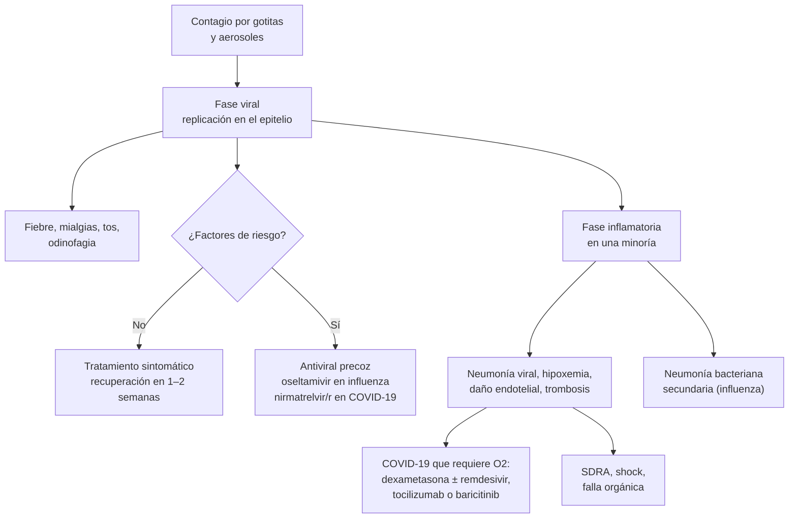

---
tags:
  - Infectología
  - Respiratorio
  - Frecuente en sala
---

# Influenza, COVID-19 y bronquitis aguda

**Subespecialidad**
Infectología · Respiratorio · Atención primaria · Medicina de urgencia

**Guías principales**
MINSAL 2025: directrices de uso de oseltamivir (adaptación de la guía OMS) · OMS 2024: guía clínica de influenza · IDSA 2025: tratamiento antiviral de la COVID-19 leve a moderada en adultos (y guía viva de COVID-19) · ACP/CDC 2016: uso apropiado de antibióticos en las infecciones respiratorias agudas

**Otras fuentes**
RECOVERY (dexametasona, *NEJM* 2021) · EPIC-HR (nirmatrelvir/ritonavir, *NEJM* 2022) · Baloxavir y transmisión (*NEJM* 2025) · Revisión Cochrane de antibióticos en la bronquitis aguda (2017) · Vigilancia de virus respiratorios del ISP · Campaña de vacunación MINSAL 2026

**GES**
No. La vacunación anual contra influenza y COVID-19 es gratuita para los grupos objetivo del PNI

**EUNACOM**
1.04.1.016 Influenza (específico, completo, completo) · 1.04.1.029 Enfermedad leve a moderada por SARS-CoV-2 (específico, completo, completo) · 1.04.2.011 Enfermedad grave por SARS-CoV-2 (específico, inicial, derivar) · 1.05.1.005 Bronquitis aguda (específico, completo, completo)

**Revisado**
Septiembre 2026

!!! abstract "Resumen en 60 segundos"
    - **Influenza**: inicio **súbito** de **fiebre alta, mialgias, cefalea, malestar**, tos seca y odinofagia. Epidemias en **otoño-invierno**.
    - **Oseltamivir (MINSAL 2025)**:
        - **No** en la influenza **no grave sin factores de riesgo** (recomendación fuerte en contra).
        - **Sí** en la influenza **no grave con factores de riesgo** (> 65 años, embarazo, enfermedades crónicas, inmunosupresión, IMC ≥ 40) y en la **influenza grave** u hospitalizada: **75 mg cada 12 h por 5 días**, lo antes posible (idealmente < 48 h; en el grave, aunque haya pasado más tiempo).
        - **Profilaxis** sólo en los expuestos de **riesgo extremadamente alto**.
    - **COVID-19**:
        - **Leve a moderada con alto riesgo** de progresar: **nirmatrelvir/ritonavir por 5 días** (en los primeros **5 días** de síntomas); revisar las **interacciones**. Alternativa: **remdesivir** por 3 días.
        - **Sin factores de riesgo**: tratamiento sintomático.
        - **Grave (requiere oxígeno)**: **dexametasona 6 mg/día por 10 días** (**no** si no necesita oxígeno), tromboprofilaxis, prono vigil; **tocilizumab o baricitinib** si progresa.
    - **Bronquitis aguda**: tos < 3 semanas, casi siempre **viral**, con signos vitales y examen pulmonar normales: **sin radiografía y sin antibióticos**. La tos dura **2–3 semanas**.
    - **La vacunación anual** (influenza y COVID-19) es la principal medida de prevención en los grupos de riesgo.

## Definición

- **Influenza**: infección respiratoria aguda por los **virus influenza A** (subtipos H1N1 y H3N2, y zoonóticos como H5N1) y **B**.
    - **Enfermedad tipo influenza (ETI)** (vigilancia): cuadro de fiebre alta de inicio brusco con tos y síntomas generales (mialgias, odinofagia o cefalea) en un paciente ambulatorio.
    - **Infección respiratoria aguda grave (IRAG)**: cuadro respiratorio agudo febril que **requiere hospitalización**.
    - **Influenza grave** (OMS): la que requiere hospitalización (neumonía con hipoxemia, sepsis, exacerbación grave de una enfermedad crónica); **crítica** si hay SDRA, shock o falla orgánica.
- **COVID-19**: enfermedad por el coronavirus **SARS-CoV-2**. Gravedad (IDSA):
    - **Leve a moderada**: sin necesidad de oxígeno (leve: sin compromiso respiratorio bajo; moderada: neumonía con **SatO2 ≥ 94 %** ambiental).
    - **Grave**: **SatO2 < 94 %** ambiental o necesidad de **oxígeno** (frecuencia respiratoria > 30, PaO2/FiO2 < 300, infiltrados > 50 %).
    - **Crítica**: ventilación mecánica, ECMO, shock o falla multiorgánica.
    - **Condición post-COVID** ("COVID prolongado"): síntomas que persisten o aparecen ≥ 3 meses después de la infección, sin otra explicación.
- **Bronquitis aguda**: inflamación autolimitada de las vías aéreas grandes, con **tos** (con o sin expectoración) de **< 3 semanas**, **sin neumonía** ni otra causa (resfrío, sinusitis, asma, EPOC).

## Epidemiología

### Mundial

- **Influenza**: epidemias anuales con **~ 1.000 millones de casos**, 3–5 millones de casos graves y **290.000–650.000 muertes** respiratorias al año (estimaciones de la OMS). La carga se concentra en los **mayores de 65 años**, los niños pequeños, las **embarazadas** y los enfermos crónicos.
- **COVID-19**: tras la pandemia (2020–2023), el SARS-CoV-2 es **endémico**, con olas asociadas a nuevas subvariantes. La mortalidad cayó mucho por la **inmunidad** poblacional (vacunas e infecciones previas); el riesgo de hospitalización se concentra en los **mayores**, los **inmunocomprometidos** y los **no vacunados**.
- **Bronquitis aguda**: una de las consultas más frecuentes en la atención primaria y una de las principales causas de **prescripción inapropiada de antibióticos**. Más de **90 %** es viral.

### Chile

!!! chile "Contexto nacional"
    - **Vigilancia**: la influenza es de **notificación obligatoria** desde **2002** (vigilancia centinela de la ETI); la vigilancia de las **IRAG** comenzó en **2009**. El **ISP** es el laboratorio nacional de referencia.
    - **Estacionalidad**: la circulación de influenza aumenta en **otoño-invierno**, con el máximo habitualmente entre **mayo y julio**.
        - En **2025** hubo una ola de **influenza A(H1N1)pdm09** en el primer semestre y un **nuevo brote de A(H3N2)** desde **septiembre** (MINSAL 2025).
        - En la semana 44 de 2025, la positividad de virus respiratorios en la ETI fue de **61,8 %**: **influenza A 25 %**, rinovirus 13,9 %, parainfluenza 7,9 %, **SARS-CoV-2 5,0 %**, influenza B 4,6 %, metapneumovirus 2,5 % y VRS 0,4 %.
    - **Campaña de vacunación 2026** (desde el **1 de marzo**, meta de cobertura de **85 %**): vacunas contra **influenza** y **COVID-19**, además de neumococo, coqueluche y anticuerpo monoclonal contra el VRS en los lactantes.
        - **Grupos objetivo de influenza**: **personal de salud**; **≥ 60 años**; **enfermos crónicos de 11 a 59 años** (pulmonares, neurológicos, ERC etapa 4 o más o diálisis, hepatopatía, **diabetes**, cardiopatías, **HTA en tratamiento**, **obesidad IMC ≥ 30**, enfermedad mental grave, TB activa, enfermedades autoinmunes, cáncer en tratamiento, inmunodeficiencias); **embarazadas** (cualquier trimestre); niños de **6 meses a 5.º básico**; convivientes de prematuros y lactantes inmunocomprometidos; trabajadores de la educación y **avícolas o de criaderos** de cerdos.
        - Persisten brechas de cobertura en los **mayores de 60 años**, los **niños pequeños** y las **embarazadas**.
    - **Oseltamivir**: está aprobado por el ISP para el tratamiento desde el año de edad. Las **directrices MINSAL 2025** reemplazaron las guías de 2014 y 2015, y **ya no recomiendan tratar a todas las personas con ETI**: sólo a las de riesgo y a los casos graves.

## Etiología

| | Influenza | COVID-19 | Bronquitis aguda |
|---|---|---|---|
| **Agente** | Influenza **A** (H1N1pdm09, H3N2) y **B** | **SARS-CoV-2** (subvariantes de ómicron) | Virus (**> 90 %**): rinovirus, influenza, coronavirus, VRS, parainfluenza, metapneumovirus, adenovirus. Bacterias (< 10 %): ***Bordetella pertussis***, *Mycoplasma*, *Chlamydophila* |
| **Transmisión** | **Gotitas** y aerosoles, contacto con superficies | **Aerosoles** y gotitas; transmisión presintomática | Según el agente |
| **Incubación** | **1–4 días** (promedio 2) | **2–5 días** con ómicron (hasta 14) | — |
| **Contagiosidad** | Desde 1 día antes hasta ~ 5–7 días después del inicio (más en niños e inmunocomprometidos) | Máxima 1–2 días antes y los primeros días de síntomas | — |

## Fisiopatología

1. **Influenza**:
    - La **hemaglutinina** se une al ácido siálico del epitelio respiratorio; la **neuraminidasa** libera los viriones nuevos (blanco del **oseltamivir**). La polimerasa viral es el blanco del **baloxavir**.
    - El virus **destruye el epitelio ciliado** (tos, pérdida del aclaramiento mucociliar) y predispone a la **neumonía bacteriana secundaria** (neumococo, ***S. aureus***, *S. pyogenes*).
    - Los **cambios antigénicos** (deriva: *drift*; y salto: *shift* en el virus A) explican las epidemias anuales, las pandemias y la necesidad de **vacunarse cada año**.
2. **COVID-19**:
    - La proteína **espícula (S)** se une a la enzima convertidora de angiotensina 2 (**ECA2**) de las células respiratorias y endoteliales.
    - **Fase viral** (primeros días): replicación del virus → aquí sirven los **antivirales**.
    - **Fase inflamatoria** (desde la 2.ª semana, en una minoría): respuesta inmune desregulada, **daño endotelial** y **trombosis** → **neumonía con hipoxemia** y SDRA → aquí sirven la **dexametasona** y los **inmunomoduladores** (tocilizumab, baricitinib).
3. **Bronquitis aguda**: inflamación transitoria del epitelio bronquial con **hiperreactividad** que explica la tos prolongada (2–3 semanas) tras resolverse la infección.

*Figura 1. Evolución de las infecciones respiratorias virales y momento de cada tratamiento. Esquema propio.*

## Clasificación

- **Por la gravedad** (ver la definición): influenza no grave, grave y crítica; COVID-19 leve a moderada, grave y crítica.
- **Por el riesgo de progresión** (define el uso de antivirales):

| Factores de riesgo de **influenza grave** (MINSAL 2025) | Riesgo **extremadamente alto** (profilaxis) | Factores de riesgo de **COVID-19 grave** |
|---|---|---|
| Enfermedades crónicas **neurológicas, hepáticas, renales, respiratorias y cardiovasculares** | **> 80 años** | **Edad ≥ 65 años** (sobre todo ≥ 75) |
| **Diabetes** | **Inmunocomprometidos** | **Inmunocompromiso** (cáncer, trasplante, VIH avanzado, inmunosupresores) |
| **Inmunosupresión** | **Múltiples comorbilidades** (cardiovascular, neurológica, respiratoria) | **No vacunado** o con vacunación incompleta |
| **Obesidad mórbida** (IMC ≥ 40) | **Embarazadas** | Diabetes, **obesidad**, ERC, cardiopatía, EPOC, hepatopatía |
| **> 65 años** | Hospitalizados por otra causa expuestos a un caso | Embarazo |
| **Embarazo** (hasta 2 semanas posparto) | **≥ 65 años en residencias** de larga estadía | Enfermedad neurológica o discapacidad |

## Clínica

- **Influenza**:
    - Inicio **súbito** ("me cayó de golpe"): **fiebre alta** (38–40 °C), **calofríos**, **mialgias** intensas, **cefalea**, **postración**.
    - **Tos seca**, **odinofagia**, rinorrea.
    - En los **adultos mayores**: puede presentarse sólo con **compromiso del estado general**, confusión o descompensación de una enfermedad crónica, **sin fiebre**.
    - Duración de **3–7 días**; la tos y la astenia pueden durar **2 semanas** o más.
- **COVID-19**:
    - Similar a otras virosis: **fiebre**, **tos**, odinofagia, rinorrea, **fatiga**, mialgias, cefalea; a veces diarrea. La **anosmia** y la ageusia son menos frecuentes con ómicron.
    - **Neumonía** (disnea, taquipnea, hipoxemia), típicamente desde el **día 5–10**.
    - **Hipoxemia silenciosa**: SatO2 baja con poca disnea (medir siempre la saturación).
    - Complicaciones **trombóticas** (TEP, TVP), miocarditis, delirium en los ancianos.
- **Bronquitis aguda**: **tos** (al inicio seca, luego con expectoración, que puede ser purulenta **sin** significar infección bacteriana), a veces sibilancias y dolor torácico por la tos. **Sin** fiebre alta persistente, taquicardia, taquipnea ni signos focales.

!!! alarma "Signos de gravedad: hospitalizar"
    - **Disnea**, **taquipnea** (FR > 24–30), **SatO2 < 94 %** (< 90–92 % en EPOC), cianosis.
    - **Hipotensión**, compromiso de conciencia, **deshidratación**.
    - **Neumonía** con criterios de gravedad (ver [neumonía](../respiratorio/neumonia-adquirida-en-la-comunidad.md)) o **sepsis** (ver [sepsis](sepsis-y-shock-septico.md)).
    - **Descompensación** de una enfermedad crónica (EPOC, asma, insuficiencia cardíaca, diabetes).
    - **Empeoramiento tras una mejoría inicial** (fiebre que reaparece, expectoración purulenta, disnea): **neumonía bacteriana secundaria** (neumococo, ***S. aureus***).
    - **Dolor torácico**, hemoptisis, confusión o convulsiones.

## Diagnóstico

- **Influenza**:
    - En la temporada, el diagnóstico es **clínico**.
    - **Pedir un examen** (PCR, idealmente un **panel respiratorio** que incluya SARS-CoV-2, o test de antígeno) cuando **cambie la conducta**: pacientes **hospitalizados**, de **alto riesgo**, inmunocomprometidos, brotes en instituciones, embarazadas.
    - **No esperar el resultado** para iniciar el oseltamivir en un caso grave u hospitalizado.
- **COVID-19**:
    - **Test de antígeno** (rápido, útil en los sintomáticos; un resultado negativo precoz puede repetirse en 48 h) o **RT-PCR**.
    - En el hospitalizado: **PCR** o panel respiratorio.
- **Bronquitis aguda**: diagnóstico **clínico**. **Radiografía de tórax sólo si** hay sospecha de neumonía (ACP/CDC 2016): **FC > 100**, **FR > 24**, **T > 38 °C** o **signos focales** al examen pulmonar (o adulto mayor con síntomas atípicos).
    - Tos > 2–3 semanas con **paroxismos**, **estridor inspiratorio** ("gallito") o vómitos después de toser: pensar en **coqueluche** (PCR para *B. pertussis*).

## Laboratorio

| Examen | Uso |
|---|---|
| **PCR para influenza y SARS-CoV-2** (panel respiratorio) | Confirmación en los hospitalizados y de alto riesgo; vigilancia |
| **Test de antígeno** | Rápido; sensibilidad menor que la PCR |
| **Hemograma** | Leucocitos normales o bajos en las virosis; **linfopenia** en la COVID-19 (marcador de gravedad); **leucocitosis con neutrofilia** sugiere sobreinfección bacteriana |
| **PCR (proteína C reactiva), procalcitonina** | Una procalcitonina baja apoya la ausencia de coinfección bacteriana |
| **Gases arteriales, lactato** | Hipoxemia, insuficiencia respiratoria, sepsis |
| **Dímero D, ferritina, LDH, troponina** | Marcadores de gravedad e inflamación en la COVID-19; sospecha de TEP o miocarditis |
| **Creatinina, electrolitos, glicemia** | Ajuste de dosis (oseltamivir, nirmatrelvir), descompensación diabética (sobre todo con dexametasona) |
| **CK** | Miositis y rabdomiólisis (influenza) |
| **Hemocultivos y cultivo de expectoración** | Si se sospecha una **neumonía bacteriana** secundaria |

## Imágenes

- **Radiografía de tórax**:
    - Normal en la influenza no complicada, la COVID-19 leve y la bronquitis aguda.
    - **Neumonía viral**: infiltrados intersticiales o en vidrio esmerilado bilaterales.
    - **COVID-19**: opacidades **periféricas y basales** bilaterales.
    - **Neumonía bacteriana secundaria**: **consolidación lobar**, cavitación (***S. aureus***), derrame pleural.
- **TC de tórax**: no es necesaria para el diagnóstico. En la COVID-19 muestra **vidrio esmerilado periférico y multifocal**, patrón en "empedrado" (*crazy paving*) y consolidaciones; la influenza tiende más a **consolidaciones** y **derrame** (Figura 2). Útil si se sospecha un **TEP** (angio-TC).
- **Ecografía pulmonar**: líneas B y consolidaciones subpleurales; útil en la cabecera del paciente.

<figure markdown>
{ loading=lazy }
<figcaption>Figura 2. TC de tórax en la COVID-19 (A y B: vidrio esmerilado periférico y multifocal, patrón en empedrado) y en la neumonía por influenza (C y D: atelectasia con derrame pleural y consolidaciones basales). Tomado de Yang Z, Lin D, Chen X, et al. <em>Front Microbiol</em> 2022;13:847836 (figura 4). Licencia <a href="https://creativecommons.org/licenses/by/4.0/">CC BY 4.0</a>.</figcaption>
</figure>

## Diagnóstico diferencial

| Cuadro | Claves |
|---|---|
| **Resfrío común** | Rinorrea y congestión predominantes, **poca fiebre**, sin postración |
| **Influenza vs COVID-19** | Clínicamente **indistinguibles**: el test define el tratamiento antiviral |
| **Neumonía bacteriana** | Fiebre persistente, expectoración purulenta, **signos focales**, consolidación, leucocitosis (ver [neumonía](../respiratorio/neumonia-adquirida-en-la-comunidad.md)) |
| **Coqueluche** | Tos **paroxística** > 2 semanas, estridor, vómitos postusivos; adultos vacunados hace años |
| **Exacerbación de asma o EPOC** | Sibilancias, antecedentes (ver [asma](../respiratorio/asma.md) y [EPOC](../respiratorio/epoc.md)) |
| **Hantavirus** | Exposición rural, **trombocitopenia**, hemoconcentración, sin síntomas altos (ver [hantavirus](hantavirus-y-leptospirosis.md)) |
| **Insuficiencia cardíaca** | Ortopnea, edema, crepitaciones basales, BNP alto |
| **TEP** | Disnea y taquicardia desproporcionadas, factores de riesgo; en la COVID-19 el riesgo aumenta (ver [TEP](../respiratorio/tromboembolismo-pulmonar.md)) |
| **Tos crónica** (> 8 semanas) | Goteo retronasal, asma, reflujo, IECA, tabaco, TB, cáncer |

## Tratamiento

### Influenza

!!! guia "MINSAL 2025 (adaptación de la guía OMS 2024)"
    1. Influenza **no grave sin factores de riesgo**: **no usar oseltamivir** (recomendación **fuerte en contra**, certeza alta: no ofrece beneficio neto).
    2. Influenza **grave** (sospechada o confirmada): **usar oseltamivir** (condicional a favor, certeza muy baja).
    3. Influenza **no grave con factores de riesgo** de evolucionar a una forma grave: **se sugiere** oseltamivir.
    4. **Profilaxis** en los expuestos en las últimas **48 h**:
        - **Sin riesgo extremadamente alto**: **no** usar oseltamivir (fuerte en contra).
        - **Con riesgo extremadamente alto**: **se sugiere** oseltamivir (condicional a favor).
    - La **OMS 2024** sugiere además **baloxavir** (dosis única) en la influenza no grave con alto riesgo de progresión, y recomienda **no usar antibióticos** en la influenza no grave (fuerte) ni **corticoides** en la grave. En un ensayo, el baloxavir redujo la **transmisión** a los convivientes (**9,5 % vs 13,4 %**) (Monto, 2025).

!!! dosis "Oseltamivir (MINSAL 2025)"
    - **Tratamiento** (adultos y ≥ 13 años, > 40 kg): **75 mg VO cada 12 h por 5 días**. Iniciarlo **lo antes posible** (el beneficio es mayor en las primeras **48 h**; en el paciente grave u hospitalizado, **darlo igual** aunque hayan pasado más de 48 h).
    - **Ajuste renal** (tratamiento):

    | Clearance de creatinina (mL/min) | Dosis |
    |---|---|
    | **> 60** | 75 mg cada 12 h por 5 días |
    | **> 30 a 60** | **30 mg cada 12 h** por 5 días |
    | **> 10 a 30** | **30 mg al día** por 5 días |
    | **≤ 10** (sin diálisis) | No se recomienda |
    | **Hemodiálisis** | 30 mg después de cada sesión |
    | **Peritoneodiálisis** | 30 mg dosis única |

    - **Profilaxis**: **75 mg VO al día por 10 días** (con ajuste renal).
    - Efectos adversos: **náuseas y vómitos** (tomar con alimentos); raramente síntomas neuropsiquiátricos.
    - **Medidas generales**: reposo, hidratación, **paracetamol** para la fiebre (evitar la **aspirina** en los menores de 18 años: síndrome de Reye), aislamiento domiciliario mientras tenga fiebre, higiene de manos y mascarilla.

### COVID-19

!!! guia "IDSA 2025: COVID-19 leve a moderada en adultos (no hospitalizados)"
    - **Alto riesgo** de progresión: **nirmatrelvir/ritonavir** en lugar de no tratar (recomendación **fuerte**, certeza moderada).
    - **Riesgo aumentado, pero no alto**: se **sugiere** nirmatrelvir/ritonavir (condicional).
    - **Sin factores de riesgo**: se sugiere **no** usarlo de rutina.
    - **Remdesivir** (3 días EV) para los pacientes de alto riesgo que **no pueden** usar nirmatrelvir/ritonavir (por ejemplo, por **interacciones**).
    - **Molnupiravir** sólo si los anteriores no están disponibles ni se pueden usar.
    - Con la inmunidad actual, el objetivo principal es **prevenir la hospitalización**.

!!! dosis "COVID-19: antivirales y tratamiento del hospitalizado"
    - **Nirmatrelvir/ritonavir**: **300 mg/100 mg VO cada 12 h por 5 días**, dentro de los **5 días** desde el inicio de los síntomas. **TFG 30–60**: **150 mg/100 mg** cada 12 h; con **TFG < 30**, usar un esquema especial o una alternativa según el protocolo local. Evitarlo en la insuficiencia hepática grave.
        - **Revisar las interacciones del ritonavir** (inhibidor del CYP3A4): **estatinas** (suspender simvastatina y lovastatina durante el tratamiento), **anticoagulantes** (rivaroxabán, apixabán, acenocumarol), **amiodarona**, antiarrítmicos, **tacrolimus y ciclosporina**, algunos antipsicóticos, sedantes (midazolam), **colchicina**, rifampicina y anticonvulsivantes (reducen su efecto).
        - En **EPIC-HR** (NEJM 2022; adultos **no vacunados** de alto riesgo), redujo la hospitalización o muerte a los 28 días de **7,0 % a 0,8 %** (reducción relativa **~ 89 %**) cuando se inició en los primeros 3 días.
    - **Remdesivir** (ambulatorio): **200 mg EV el día 1 y 100 mg EV los días 2 y 3**, dentro de los **7 días** desde el inicio.
    - **Molnupiravir**: 800 mg VO cada 12 h por 5 días (no en el embarazo).
    - **Hospitalizado sin necesidad de oxígeno**: **no dar dexametasona** (en RECOVERY, tendencia a mayor mortalidad: 17,8 % vs 14,0 %). Antiviral si tiene alto riesgo.
    - **Hospitalizado con oxígeno**:
        - **Dexametasona 6 mg/día VO o EV por 10 días** (o hasta el alta). En **RECOVERY** redujo la mortalidad a 28 días en los pacientes con **oxígeno** (**23,3 % vs 26,2 %**) y con **ventilación mecánica** (**29,3 % vs 41,4 %**).
        - **Remdesivir por 5 días** en los que usan oxígeno de bajo flujo.
        - **Tocilizumab** (8 mg/kg EV, dosis única) o **baricitinib** (4 mg/día VO hasta 14 días) si progresa (alto flujo, VMNI) o tiene marcadores inflamatorios altos, **además** de la dexametasona.
        - **Tromboprofilaxis** con heparina (dosis terapéutica en casos seleccionados no críticos con dímero D alto y bajo riesgo de sangrado).
        - **Prono vigil**, cánula nasal de alto flujo o VMNI (ver [insuficiencia respiratoria aguda](../respiratorio/insuficiencia-respiratoria-aguda.md)).
        - **Controlar la glicemia** (la dexametasona produce hiperglicemia).
    - **No usar**: ivermectina, hidroxicloroquina, azitromicina ni antibióticos de rutina (sólo si se sospecha una coinfección bacteriana).

### Bronquitis aguda

!!! guia "ACP/CDC 2016 y revisión Cochrane 2017"
    - **No indicar antibióticos** en la bronquitis aguda sin neumonía.
        - En la revisión Cochrane (17 ensayos, 5.099 pacientes), los antibióticos **no aumentaron** la proporción de pacientes mejorados; acortaron la tos en apenas **~ 0,5 días** y **aumentaron los efectos adversos** (1 de cada 24 tratados).
    - **Informar** que la tos dura **2–3 semanas** en promedio (mejora la satisfacción más que un antibiótico).
    - **Tratamiento sintomático**: miel, pastillas para la garganta, analgésicos; **salbutamol inhalado** sólo si hay sibilancias o hiperreactividad; los antitusivos tienen un beneficio modesto.
    - **Excepciones**: **coqueluche** confirmado o muy probable (**azitromicina** 500 mg el día 1 y 250 mg los días 2–5; también profilaxis de los contactos de riesgo) e **influenza** en los grupos de riesgo (oseltamivir).

## Complicaciones

- **Influenza**:
    - **Neumonía viral primaria** y **neumonía bacteriana secundaria** (neumococo, ***S. aureus*** incluido el resistente a meticilina, *S. pyogenes*, *H. influenzae*): la principal causa de muerte.
    - **Descompensación** de EPOC, asma, insuficiencia cardíaca y diabetes; **IAM** (el riesgo aumenta varias veces en la primera semana tras la infección) y ACV.
    - **Miositis** y rabdomiólisis, **miocarditis**, pericarditis, encefalitis, Guillain-Barré.
    - **Aspergilosis pulmonar** asociada a influenza en los pacientes críticos.
- **COVID-19**: SDRA, **TEP y trombosis**, miocarditis, arritmias, **delirium**, LRA, sobreinfecciones, **condición post-COVID** (fatiga, disnea, alteraciones cognitivas).
- **Bronquitis aguda**: **tos postinfecciosa** prolongada; neumonía (poco frecuente); desencadena exacerbaciones en los asmáticos y la EPOC.

## Pronóstico y seguimiento

- **Influenza**: autolimitada en la mayoría. La mortalidad se concentra en los **adultos mayores** y los **enfermos crónicos**, sobre todo por la neumonía bacteriana y la descompensación de sus enfermedades de base.
- **COVID-19**: la mortalidad bajó mucho con la inmunidad y los tratamientos; sigue siendo relevante en los **mayores de 75 años** y los **inmunocomprometidos**.
- **Bronquitis aguda**: excelente; si la tos dura **> 3–8 semanas**, estudiar otras causas (tos subaguda y crónica).
- **Perfil EUNACOM**:
    - **Influenza**, **COVID-19 leve a moderada** y **bronquitis aguda**: **diagnóstico específico**, **tratamiento completo** y **seguimiento** en la APS (incluida la **indicación correcta** o la **no indicación** de antivirales y antibióticos).
    - **COVID-19 grave**: diagnóstico específico, **tratamiento inicial** (oxígeno, dexametasona si requiere oxígeno, tromboprofilaxis) y **derivación**.
- **Prevención**:
    - **Vacuna anual contra influenza** y **vacuna contra COVID-19** en los grupos objetivo (PNI); **vacuna antineumocócica** en los ≥ 65 años y los enfermos crónicos; **dTpa** en las embarazadas (coqueluche).
    - Higiene de manos, **mascarilla** con síntomas respiratorios, ventilación de los espacios, **quedarse en casa** mientras haya fiebre.

## Perlas para el internado

!!! perla "Para la sala y el turno"
    - **Influenza no grave en un adulto sano: no dar oseltamivir** (MINSAL 2025). Sí en los **> 65 años, embarazadas, enfermos crónicos, inmunosuprimidos, IMC ≥ 40** y en los **hospitalizados**.
    - En el **hospitalizado con influenza**, el oseltamivir va **aunque hayan pasado más de 48 h**.
    - **Ajusta el oseltamivir a la función renal**: con clearance 30–60, 30 mg cada 12 h.
    - **Nirmatrelvir/ritonavir**: antes de indicarlo, **revisa todos los fármacos** del paciente (estatinas, anticoagulantes, inmunosupresores, amiodarona).
    - **Dexametasona sólo si la COVID-19 requiere oxígeno**; sin oxígeno, puede hacer daño.
    - **Mide la saturación** en todo paciente con COVID-19: la hipoxemia puede ser silenciosa.
    - **"Mejoró y volvió a empeorar"** tras una influenza = **neumonía bacteriana secundaria** (piensa en ***S. aureus***).
    - **Bronquitis aguda = sin antibióticos.** La expectoración verde **no** significa bacteria.
    - Radiografía de tórax sólo si hay **FC > 100, FR > 24, T > 38 °C o signos focales**.
    - Aprovecha cada consulta para **vacunar** a los grupos de riesgo.

## Preguntas de repaso

??? repaso "1. Mujer de 34 años, sana, con fiebre de 39 °C, mialgias, cefalea y tos seca de 1 día, en pleno brote de influenza. SatO2 98 %, examen pulmonar normal. ¿Indicas oseltamivir?"
    **No**. Es una **influenza no grave sin factores de riesgo**: el MINSAL 2025 **recomienda no usar oseltamivir** (recomendación fuerte, certeza alta: no ofrece beneficio neto).

    - Tratamiento **sintomático**: paracetamol, hidratación, reposo.
    - **Aislamiento** domiciliario mientras tenga fiebre, higiene de manos y mascarilla.
    - **Signos de alarma** para consultar: disnea, dolor torácico, fiebre que persiste > 3–5 días o reaparece, compromiso del estado general.
    - Si estuviera **embarazada**, sí correspondería el oseltamivir.

??? repaso "2. Hombre de 72 años con EPOC y diabetes, con fiebre, tos y mialgias de 36 horas. PCR positiva para influenza A. SatO2 93 %, FR 20, creatinina con clearance de 45 mL/min. ¿Qué indicas?"
    **Influenza no grave en un paciente con factores de riesgo** (> 65 años, EPOC, diabetes): **se sugiere oseltamivir**, lo antes posible.

    - Dosis ajustada a su clearance (**> 30 a 60 mL/min**): **30 mg cada 12 h por 5 días**.
    - Vigilar la **descompensación de la EPOC** y la glicemia; evaluar la saturación (su basal) y la necesidad de hospitalizar.
    - Control precoz; consultar si empeora (neumonía bacteriana secundaria).
    - Recordar la **vacuna anual** contra influenza y la antineumocócica.

??? repaso "3. Hombre de 68 años, trasplantado renal con tacrolimus y con atorvastatina, que consulta al día 2 de síntomas de COVID-19 (test de antígeno positivo), sin disnea y con SatO2 97 %. ¿Qué antiviral eliges?"
    Tiene **alto riesgo** (edad, inmunosupresión): **corresponde un antiviral**.

    - El **nirmatrelvir/ritonavir** tiene una **interacción grave con el tacrolimus** (el ritonavir aumenta mucho sus niveles). Salvo manejo especializado con ajuste del tacrolimus, conviene **evitarlo**.
    - **Alternativa (IDSA 2025)**: **remdesivir EV por 3 días** (200 mg el día 1 y 100 mg los días 2 y 3), dentro de los 7 días desde el inicio.
    - Molnupiravir sólo si ninguno de los anteriores es posible.

??? repaso "4. Mujer de 58 años hospitalizada por COVID-19 al día 8 de síntomas, con SatO2 89 % ambiental que sube a 94 % con 3 L/min de oxígeno. ¿Qué tratamiento indicas?"
    **COVID-19 grave** (requiere oxígeno).

    - **Dexametasona 6 mg/día por 10 días** (reduce la mortalidad en los pacientes con oxígeno: RECOVERY).
    - **Remdesivir por 5 días** (oxígeno de bajo flujo).
    - **Tromboprofilaxis** con heparina.
    - Oxígeno con meta de SatO2 92–96 %, **prono vigil**; control de la glicemia.
    - Si progresa a alto flujo o VMNI con inflamación alta: agregar **tocilizumab o baricitinib**.
    - **No** antibióticos de rutina, ni ivermectina ni hidroxicloroquina.

??? repaso "5. Hombre de 45 años con tos con expectoración amarillenta de 10 días tras un resfrío. Afebril, FC 82, FR 16, examen pulmonar normal. Pide un antibiótico \"porque la flema está verde\". ¿Qué haces?"
    **Bronquitis aguda**: casi siempre **viral**.

    - **No** pedir radiografía (signos vitales y examen normales).
    - **No** indicar antibióticos: no mejoran la evolución (acortan la tos ~ medio día) y aumentan los efectos adversos (Cochrane 2017). El color de la expectoración **no** indica una infección bacteriana.
    - Explicar que la tos puede durar **2–3 semanas**; tratamiento sintomático.
    - Reconsultar si aparece fiebre alta, disnea, dolor torácico o si la tos dura > 3 semanas (o paroxismos: coqueluche).

??? repaso "6. Paciente con influenza que mejoraba y al día 6 presenta de nuevo fiebre alta, disnea, expectoración purulenta y una consolidación con cavitaciones en la radiografía. ¿Qué sospechas y cómo lo tratas?"
    **Neumonía bacteriana secundaria a la influenza**; las **cavitaciones** sugieren ***Staphylococcus aureus*** (incluido el resistente a meticilina).

    - Hospitalizar, hemocultivos y cultivo de expectoración.
    - **Antibiótico** para neumonía comunitaria grave **con cobertura de *S. aureus*** (agregar vancomicina o linezolid si se sospecha resistencia a meticilina), además del **oseltamivir**.
    - Evaluar la gravedad (CURB-65, criterios de UCI).

## Referencias

1. Ministerio de Salud de Chile. Directrices uso de oseltamivir 2025. Resolución exenta N.° 52. Santiago: MINSAL, División de Prevención y Control de Enfermedades; 2025. [diprece.minsal.cl](https://diprece.minsal.cl/wp-content/uploads/2026/01/RES.-EXENTA-N%C2%B0-52-DIRECTRICES.pdf)
2. Vandvik PO, Agarwal A, Rylance J, et al. Summary of WHO clinical practice guidelines for influenza. *BMJ.* 2026;392:e087397. doi:[10.1136/bmj-2025-087397](https://doi.org/10.1136/bmj-2025-087397)
3. Uyeki TM, Hui DS, Zambon M, et al. Influenza. *Lancet.* 2022;400:693–706. doi:[10.1016/S0140-6736(22)00982-5](https://doi.org/10.1016/S0140-6736(22)00982-5)
4. Monto AS, Kuhlbusch K, Bernasconi C, et al. Efficacy of Baloxavir Treatment in Preventing Transmission of Influenza. *N Engl J Med.* 2025;392:1582–1593. doi:[10.1056/NEJMoa2413156](https://doi.org/10.1056/NEJMoa2413156)
5. Shumaker AH, Bhimraj A, Bedimo R, et al. 2025 Clinical Practice Guideline Update by the Infectious Diseases Society of America on the Treatment and Management of COVID-19: Antiviral Treatment for Mild to Moderate COVID-19 in Adults. *Clin Infect Dis.* 2026;82(Suppl 3):i1–i17. doi:[10.1093/cid/ciaf680](https://doi.org/10.1093/cid/ciaf680)
6. Infectious Diseases Society of America. IDSA Guidelines on the Treatment and Management of Patients with COVID-19 (guía viva). [idsociety.org](https://www.idsociety.org/practice-guideline/covid-19-guideline-treatment-and-management/)
7. RECOVERY Collaborative Group, Horby P, Lim WS, et al. Dexamethasone in Hospitalized Patients with Covid-19. *N Engl J Med.* 2021;384:693–704. doi:[10.1056/NEJMoa2021436](https://doi.org/10.1056/NEJMoa2021436)
8. Hammond J, Leister-Tebbe H, Gardner A, et al. Oral Nirmatrelvir for High-Risk, Nonhospitalized Adults with Covid-19. *N Engl J Med.* 2022;386:1397–1408. doi:[10.1056/NEJMoa2118542](https://doi.org/10.1056/NEJMoa2118542)
9. Harris AM, Hicks LA, Qaseem A. Appropriate Antibiotic Use for Acute Respiratory Tract Infection in Adults: Advice for High-Value Care From the American College of Physicians and the Centers for Disease Control and Prevention. *Ann Intern Med.* 2016;164:425–434. doi:[10.7326/M15-1840](https://doi.org/10.7326/M15-1840)
10. Smith SM, Fahey T, Smucny J, Becker LA. Antibiotics for acute bronchitis. *Cochrane Database Syst Rev.* 2017;6:CD000245. doi:[10.1002/14651858.CD000245.pub4](https://doi.org/10.1002/14651858.CD000245.pub4)
11. Yang Z, Lin D, Chen X, et al. Distinguishing COVID-19 From Influenza Pneumonia in the Early Stage Through CT Imaging and Clinical Features. *Front Microbiol.* 2022;13:847836. doi:[10.3389/fmicb.2022.847836](https://doi.org/10.3389/fmicb.2022.847836)
12. Ministerio de Salud de Chile. Campaña de vacunación 2026 contra influenza: grupos objetivo. [minsal.cl](https://www.minsal.cl/campana-vacunacion-2026-contra-influenza/)
