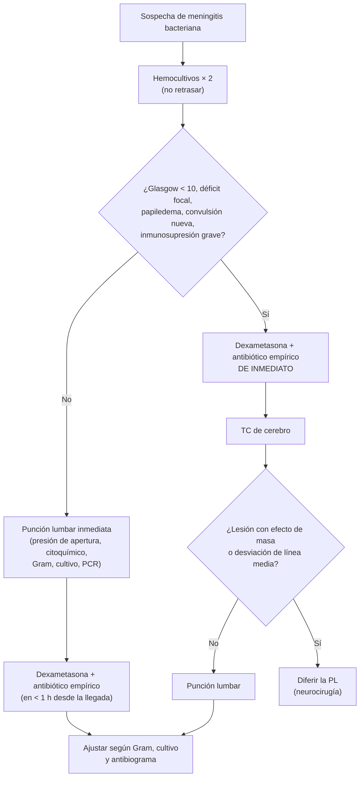

---
tags:
  - Infectología
  - Neurología
  - Urgencia
---

# Meningitis y encefalitis agudas

**Subespecialidad**
Infectología · Neurología · Urgencia

**Guías principales**
OMS 2025: primeras guías globales de diagnóstico, tratamiento y cuidado de la meningitis · ESCMID 2016: meningitis bacteriana aguda · NICE NG240 (2024): meningitis bacteriana y enfermedad meningocócica

**Otras fuentes**
IDSA 2008 (encefalitis) · Metaanálisis de letalidad en 80 años (JAMA Netw Open 2024) · Vigilancia de laboratorio del ISP (meningitis bacteriana 2024)

**EUNACOM**
1.04.2.006 Meningitis aguda (específico, inicial, derivar) · 1.10.2.016 Síndromes meníngeos con meningitis purulenta o bacteriana (específico, completo, derivar) · 1.04.2.002 Encefalitis aguda (específico, inicial, derivar)

**Revisado**
Septiembre 2026

!!! abstract "Resumen en 60 segundos"
    - **Meningitis bacteriana** = emergencia: **fiebre, cefalea, rigidez de nuca, compromiso de conciencia** (la tríada clásica está en < 50 %, pero **~ 95 % tiene al menos 2 de estos 4**). Mortalidad **~ 15–25 %**.
    - **Antibiótico en < 1 hora**: **ceftriaxona 2 g EV c/12 h** (+ **vancomicina** donde hay neumococo con susceptibilidad disminuida) (+ **ampicilina 2 g c/4 h** si > 50–60 años, embarazo, inmunosupresión o alcoholismo: *Listeria*).
    - **Dexametasona 10 mg EV c/6 h × 4 días**, **junto con o antes** de la primera dosis de antibiótico; mantenerla sólo si es **neumocócica** (y en niños, *H. influenzae*).
    - **Punción lumbar** lo antes posible, pero **nunca retrasar el antibiótico**. **TC antes de la PL** sólo si: Glasgow < 10, **déficit focal**, papiledema, **convulsión nueva**, inmunosupresión grave.
    - **LCR bacteriano**: turbio, **> 1.000 leucocitos** con **neutrófilos**, **glucosa LCR/sangre < 0,4**, proteínas altas, lactato > 3,5 mmol/L.
    - **Encefalitis** (alteración de conciencia, conducta o convulsiones + fiebre): **aciclovir 10 mg/kg EV c/8 h** empírico **de inmediato** (herpes simple), PCR en LCR y **RM**.
    - **Meningococo**: **notificación inmediata** y **quimioprofilaxis** de los contactos cercanos.

## Definición

| Término | Definición |
|---|---|
| **Meningitis** | Inflamación de las **meninges** (aracnoides y piamadre) y del espacio subaracnoideo, con **pleocitosis** en el LCR |
| **Meningitis bacteriana aguda** | Meningitis por bacterias, de evolución en **horas a pocos días**, con LCR purulento |
| **Meningitis "aséptica"** | Meningitis con cultivo bacteriano negativo; la mayoría **viral** (enterovirus, herpes), pero también fármacos, tumores, enfermedades autoinmunes |
| **Encefalitis** | Inflamación del **parénquima cerebral**: **alteración de conciencia, conducta o personalidad** (> 24 h) más ≥ 2 de: fiebre, convulsiones, déficit focal, pleocitosis en el LCR, alteraciones en la RM o el EEG |
| **Meningoencefalitis** | Compromiso de ambas estructuras |
| **Meningitis subaguda o crónica** | Evolución de semanas: **tuberculosa**, criptocócica, sífilis, carcinomatosa (fuera del alcance de las guías OMS de meningitis aguda) |

## Epidemiología

### Mundial

- La meningitis sigue siendo una causa importante de muerte y discapacidad, sobre todo en el **"cinturón de la meningitis"** de África.
- **Etiología en adultos** (comunitaria): ***Streptococcus pneumoniae*** (la más frecuente), ***Neisseria meningitidis***, ***Listeria monocytogenes*** (> 50 años, inmunosuprimidos), *Haemophilus influenzae* (poco frecuente tras la vacunación) y otras.
- **Letalidad**: en un metaanálisis de 157.656 episodios en 80 años, la letalidad global fue **18 %**, bajando de 32 % antes de 1961 a **15 % después de 2010**. Por microorganismo: ***Listeria* 27 %**, **neumococo 24 %**, *H. influenzae* 11 %, **meningococo 9 %**.
- Hasta **~ 1 de cada 3** sobrevivientes de meningitis neumocócica queda con **secuelas** (hipoacusia, déficit cognitivo, focalidad, epilepsia).
- **Encefalitis**: el **virus herpes simple tipo 1** es la causa viral esporádica más frecuente y grave; la **encefalitis autoinmune** (anti-NMDA y otras) es casi tan frecuente como la infecciosa en adultos jóvenes.

<figure markdown>
{ loading=lazy width="680" }
<figcaption>Figura 1. Proporción de los microorganismos causantes de meningitis bacteriana comunitaria por década (1935–2022). La vacunación contra <em>H. influenzae</em> tipo b redujo mucho su participación; hoy predominan <strong>neumococo</strong> y <strong>meningococo</strong>. Fuente: van Ettekoven CN, Liechti FD, Brouwer MC, Bijlsma MW, van de Beek D. Global Case Fatality of Bacterial Meningitis During an 80-Year Period: A Systematic Review and Meta-Analysis. <em>JAMA Netw Open</em>. 2024;7:e2424802. Licencia <a href="https://creativecommons.org/licenses/by/4.0/">CC BY 4.0</a>. Texto de la figura en inglés.</figcaption>
</figure>

### Chile

!!! chile "Datos nacionales"
    - La **meningitis bacteriana** y la **enfermedad meningocócica** son de **notificación obligatoria inmediata** (ante la sospecha).
    - **Vigilancia del ISP (enero–junio 2024)**: 29 casos confirmados de *N. meningitidis*: **serogrupo B 45 %**, **W 38 %**, C 10 %, Y 10 %. En 2023–2024 aumentó la proporción del serogrupo **W** (el que causó el brote de 2012, de alta letalidad y presentación atípica: diarrea, neumonía).
    - La incidencia de enfermedad meningocócica en **menores de 1 año** subió de 2,5 a 5,9 por 100.000 entre 2022 y 2023, y bajó a 1,2 por 100.000 en 2024 tras una **estrategia de vacunación**.
    - El **Programa Nacional de Inmunizaciones** incluye vacunas contra **Hib**, **neumococo** (conjugada en lactantes y vacunación de adultos mayores) y **meningococo** conjugada (ACWY en lactantes desde 2014).
    - Una proporción de los neumococos aislados de meningitis en Chile tiene **susceptibilidad disminuida a penicilina**: por eso los protocolos locales agregan **vancomicina** empírica hasta conocer la susceptibilidad.

## Etiología y fisiopatología

| Grupo | Microorganismos más probables |
|---|---|
| **Adulto 18–50 años** | *S. pneumoniae*, *N. meningitidis* |
| **> 50 años** (> 60 en la guía OMS), alcoholismo, embarazo, inmunosupresión (corticoides, trasplante, cáncer, diabetes) | *S. pneumoniae*, *N. meningitidis*, ***L. monocytogenes***, bacilos gramnegativos |
| **Fístula de LCR, fractura de base de cráneo, otitis o sinusitis, esplenectomía, alcoholismo** | ***S. pneumoniae*** |
| **Déficit de complemento terminal**, uso de **eculizumab**, asplenia | ***N. meningitidis*** |
| **Neurocirugía, derivación ventricular, TEC penetrante** | *S. aureus*, *S. epidermidis*, gramnegativos (*Pseudomonas*, *Acinetobacter*) — meningitis **asociada a la atención de salud** |
| **Meningitis viral** | **Enterovirus** (verano-otoño), **VHS-2** (a veces recurrente: Mollaret), VVZ, VIH agudo, arbovirus |
| **Encefalitis** | **VHS-1**, VVZ, enterovirus, arbovirus; **autoinmune** (anti-NMDA, anti-LGI1), paraneoplásica |

- **Patogenia**: colonización nasofaríngea → **bacteriemia** → cruce de la **barrera hematoencefálica** → multiplicación en el LCR (pocas defensas) → **inflamación** intensa (citoquinas) → **edema cerebral**, **hipertensión intracraneana**, vasculitis e **isquemia**, hidrocefalia. El daño se debe en gran parte a la **respuesta inflamatoria**: por eso la **dexametasona** mejora el pronóstico en la meningitis neumocócica.
- **Encefalitis herpética**: reactivación del VHS-1 con compromiso necrohemorrágico de los **lóbulos temporales** y frontales basales.

## Clasificación

- **Por etiología**: bacteriana, viral, tuberculosa, fúngica, parasitaria, no infecciosa.
- **Por evolución**: **aguda** (< 5 días), subaguda o **crónica** (> 4 semanas).
- **Por origen**: **comunitaria** o **asociada a la atención de salud** (posneuroquirúrgica, derivativa).
- **Por huésped**: inmunocompetente o **inmunosuprimido** (considerar *Listeria*, *Cryptococcus*, tuberculosis, toxoplasma).

## Clínica

- **Síntomas**: **fiebre**, **cefalea** intensa, **rigidez de nuca**, **compromiso de conciencia** (confusión a coma), náuseas y vómitos, fotofobia.
    - La **tríada clásica** (fiebre, rigidez de nuca, alteración de conciencia) está en **~ 40–45 %**; **~ 95 %** tiene al menos **2 de 4** (cefalea, fiebre, rigidez de nuca, alteración de conciencia).
- **Signos meníngeos**: **rigidez de nuca**, signos de **Kernig** y **Brudzinski** (muy específicos pero **poco sensibles**: su ausencia no descarta).
- **Otros**: **convulsiones** (~ 15–25 %), **déficit focal** o de pares craneales (VI, VII, VIII), **hipoacusia**, papiledema (raro al inicio).
- **Enfermedad meningocócica**: **exantema petequial o purpúrico** que **no desaparece a la presión** (~ 60 %), **púrpura fulminante**, **shock** (síndrome de Waterhouse-Friderichsen: hemorragia suprarrenal).
- ***Listeria***: puede dar **romboencefalitis** (compromiso de tronco: pares craneales, ataxia).
- **Adultos mayores e inmunosuprimidos**: presentación **solapada** (confusión, fiebre baja, sin rigidez de nuca).
- **Encefalitis**: fiebre + **alteración de conciencia o de conducta**, **convulsiones**, **afasia**, alteraciones de memoria, alucinaciones olfatorias (lóbulo temporal); los signos meníngeos pueden faltar.

!!! alarma "Todo paciente con fiebre y petequias, o fiebre y compromiso de conciencia, es una meningitis hasta demostrar lo contrario"
    **Hemocultivos → dexametasona → antibiótico en < 1 hora.** Si no se puede hacer la PL de inmediato, **no esperar**: tratar primero, puncionar después.

## Diagnóstico

- **Contraindicaciones absolutas de la PL** (OMS 2025): **coagulopatía** o trombocitopenia significativa, **infección de piel** o absceso epidural en el sitio de punción, **inestabilidad** hemodinámica o respiratoria que requiera estabilización.
- **Hemocultivos**: positivos en **50–80 %** de las meningitis bacterianas (útiles si la PL se retrasa).
- La **TC** no debe hacerse de rutina (OMS 2025): sólo con las indicaciones de la figura.

### Líquido cefalorraquídeo

| Parámetro | Normal | **Bacteriana** | **Viral** | Tuberculosa o fúngica |
|---|---|---|---|---|
| **Aspecto** | Claro ("agua de roca") | **Turbio** | Claro | Claro o xantocrómico |
| **Presión de apertura** | 5–20 cmH₂O | **Alta** (> 25–30) | Normal o algo alta | Alta |
| **Leucocitos** (/µL) | < 5 | **> 1.000** (100–10.000) | 5–500 | 50–500 |
| **Predominio** | Linfocitos | **Neutrófilos** | **Linfocitos** (neutrófilos al inicio) | **Linfocitos** |
| **Proteínas** (mg/dL) | 15–45 | **> 100–200** | Normales o < 100 | **Muy altas** (100–500) |
| **Glucosa LCR/sangre** | > 0,6 | **< 0,4** | Normal | **Baja** (< 0,5) |
| **Lactato** (mmol/L) | < 3,5 | **> 3,5** | < 3,5 | Variable |
| **Estudio etiológico** | — | **Gram** (+ en 60–90 %), **cultivo**, **PCR** multiplex, antígenos | **PCR** (enterovirus, VHS, VVZ) | ADA, PCR (GeneXpert), cultivo; **tinta china y antígeno criptocócico** |

!!! perla "Antibiótico antes de la PL"
    El Gram y el cultivo pierden sensibilidad **horas después** del antibiótico, pero el **citoquímico** (neutrófilos, glucosa baja, proteínas altas) y la **PCR** siguen siendo útiles. Por eso **nunca se retrasa el antibiótico** para puncionar.

## Laboratorio

| Examen | Para qué |
|---|---|
| **Hemocultivos** | Antes del antibiótico; positivos en la mitad o más |
| **LCR**: citoquímico, **Gram**, cultivo, **PCR** multiplex, lactato | Diagnóstico y etiología (la OMS recomienda con fuerza la PCR en LCR) |
| **Glicemia simultánea** | Para calcular la relación glucosa LCR/sangre |
| **Hemograma, PCR, procalcitonina** | Apoyo (la procalcitonina alta orienta a bacteriana) |
| **Electrolitos** | **Hiponatremia** (SIADH, frecuente) |
| **Creatinina, pruebas hepáticas, coagulación** | Disfunción orgánica, CID (meningococemia) |
| **VIH** | En todo paciente con meningitis o encefalitis |
| **PCR de VHS-1/2 y VVZ en LCR** | Encefalitis; si es negativa precozmente (< 72 h) y la sospecha es alta, **repetir** |
| **Anticuerpos antineuronales** (LCR y suero) | Sospecha de encefalitis autoinmune |

## Imágenes

- **TC de cerebro**: antes de la PL **sólo** si hay indicación; en complicaciones (hidrocefalia, empiema, infarto, absceso).
- **RM de cerebro**: la mejor para la **encefalitis** (hiperintensidad en FLAIR y difusión de los **lóbulos temporales** mediales, ínsula y región frontal basal en el VHS) y para complicaciones.
- **TC de senos paranasales y oídos** si se sospecha un foco parameníngeo (otitis, sinusitis, mastoiditis) en la meningitis neumocócica.

<figure markdown>
{ loading=lazy }
<figcaption>Figura 2. Encefalitis por virus herpes simple en la RM: hiperintensidad en <strong>FLAIR</strong> y <strong>difusión (DWI)</strong> de los <strong>lóbulos temporales</strong> (bilateral y asimétrica), a veces con compromiso de la ínsula, el tálamo o lesiones extensas. Fuente: Sarton B, Jaquet P, Belkacemi D, et al. Assessment of Magnetic Resonance Imaging Changes and Functional Outcomes Among Adults With Severe Herpes Simplex Encephalitis. <em>JAMA Netw Open</em>. 2021;4:e2114328. Licencia <a href="https://creativecommons.org/licenses/by/4.0/">CC BY 4.0</a>. Texto de la figura en inglés.</figcaption>
</figure>

## Diagnóstico diferencial

- **Hemorragia subaracnoidea** (cefalea "en estallido", LCR hemorrágico o xantocrómico).
- **Absceso cerebral**, empiema subdural, trombosis de senos venosos.
- **Meningitis tuberculosa, criptocócica** (VIH), carcinomatosa.
- **Meningitis por fármacos** (AINE, cotrimoxazol, inmunoglobulina EV) y autoinmunes (LES, sarcoidosis, Behçet).
- **Encefalopatías** metabólicas o tóxicas, **síndrome neuroléptico maligno**, golpe de calor, **malaria** cerebral (viajeros).
- **Sepsis** de otro foco con encefalopatía.
- **Encefalitis autoinmune** (psicosis, discinesias, convulsiones, disautonomía; anticuerpos anti-NMDA).

## Tratamiento

### Meningitis bacteriana: tratamiento empírico

!!! dosis "Primera hora (OMS 2025, ESCMID 2016)"
    1. **Dexametasona 10 mg EV c/6 h × 4 días** (0,15 mg/kg c/6 h), iniciada **10–20 min antes o junto con** la primera dosis de antibiótico. Si no hay dexametasona, **hidrocortisona** o metilprednisolona en dosis equivalente. **Suspenderla** si se descarta el neumococo (salvo *H. influenzae* en niños); no se inicia si ya pasaron > 4 h del antibiótico (ESCMID).
    2. **Ceftriaxona 2 g EV c/12 h** (o cefotaxima 2 g c/4–6 h).
    3. **+ Vancomicina** 15–20 mg/kg EV c/8–12 h (carga de 25–30 mg/kg en graves) donde hay **neumococo con resistencia a penicilina o cefalosporinas** (práctica habitual en Chile) hasta conocer la susceptibilidad. Alternativa (ESCMID): **rifampicina**.
    4. **+ Ampicilina 2 g EV c/4 h** si hay **riesgo de *Listeria***: **> 50 años** (ESCMID; > 60 años según OMS), **embarazo**, **inmunosupresión**, alcoholismo, diabetes, cáncer.
    5. **Asociada a neurocirugía o derivación**: **vancomicina + cefepime o meropenem** (cubrir *Pseudomonas*).
    6. **Alergia grave a β-lactámicos**: vancomicina + moxifloxacino (o cotrimoxazol si hay riesgo de *Listeria*); consultar a infectología.

### Tratamiento dirigido y duración (OMS 2025)

| Microorganismo | Tratamiento | Duración |
|---|---|---|
| ***S. pneumoniae*** sensible a penicilina | Penicilina G o ampicilina | **10–14 días** |
| *S. pneumoniae* resistente a penicilina, sensible a cefalosporinas | **Ceftriaxona** | 10–14 días |
| *S. pneumoniae* resistente a cefalosporinas | **Vancomicina + rifampicina**, o vancomicina (o rifampicina) + ceftriaxona | 10–14 días |
| ***N. meningitidis*** | Penicilina G, ampicilina o **ceftriaxona** | **5–7 días** |
| ***H. influenzae*** | Ampicilina (β-lactamasa negativa) o **ceftriaxona** | 7–10 días |
| ***L. monocytogenes*** | **Ampicilina** (± gentamicina) | **21 días** |
| *S. agalactiae* | Penicilina G o ampicilina | 14–21 días |
| Sin microorganismo identificado, con buena evolución | Suspender el empírico | Considerar a los **7 días** |

### Medidas de soporte

- **UCI** si hay compromiso de conciencia importante, shock, convulsiones o insuficiencia respiratoria.
- **Hipertensión intracraneana**: cabecera a 30°, normocapnia, **manitol** o **NaCl hipertónico** como medida transitoria; **no** usar glicerol.
- **Volumen**: **no restringir** los líquidos de rutina; usar **soluciones isotónicas** (suero fisiológico o Ringer lactato).
- **Convulsiones**: tratarlas (benzodiacepinas, luego levetiracetam o fenitoína); no se recomienda la profilaxis universal.
- **Hiponatremia**, fiebre, glicemia: corregir y vigilar.

### Meningitis viral

- **Soporte** (analgesia, hidratación); la mayoría es **autolimitada** (7–10 días).
- **Aciclovir** si se sospecha **VHS** o VVZ con compromiso importante, o mientras se descarta una encefalitis.
- Mientras no se descarte una bacteriana (LCR dudoso), **mantener el antibiótico empírico**.

### Encefalitis

!!! dosis "Encefalitis: tratamiento empírico inmediato"
    - **Aciclovir 10 mg/kg EV c/8 h** (ajustar a la función renal, **hidratar** para evitar la nefrotoxicidad por cristales), iniciado **de inmediato** ante la sospecha, **sin esperar** la PCR ni la RM.
    - Duración: **14–21 días** en la encefalitis por VHS confirmada (repetir la PCR al final en casos graves).
    - Suspender si la **PCR de VHS es negativa** en un LCR tomado > 72 h desde el inicio, la RM no es sugerente y hay otro diagnóstico.
    - Agregar **antibióticos** (esquema de meningitis bacteriana) hasta descartarla.
    - **Encefalitis autoinmune**: inmunoterapia (corticoides, inmunoglobulina, plasmaféresis) con neurología; buscar tumor (teratoma ovárico en anti-NMDA).

### Enfermedad meningocócica: medidas de salud pública

- **Notificación inmediata** a la autoridad sanitaria (SEREMI) ante la **sospecha**.
- **Aislamiento respiratorio por gotitas** durante las primeras **24 horas** de tratamiento antibiótico efectivo.
- **Quimioprofilaxis** a los **contactos cercanos** (convivientes, contactos íntimos, personal de salud expuesto a secreciones sin protección, p. ej., intubación), idealmente en las primeras **24 horas**:
    - **Ciprofloxacino 500 mg VO, dosis única** (adultos).
    - **Rifampicina 600 mg VO c/12 h × 2 días** (niños 10 mg/kg c/12 h).
    - **Ceftriaxona 250 mg IM, dosis única** (de elección en **embarazadas**).
- El caso índice tratado con penicilina (no con ceftriaxona) también debe recibir profilaxis para erradicar el estado de portador.

## Complicaciones

- **Neurológicas**: **edema cerebral** e hipertensión intracraneana, **hidrocefalia**, **convulsiones**, **infartos** (vasculitis, trombosis venosa), **empiema subdural**, absceso, **hipoacusia neurosensorial** (hasta ~ 20–30 % en la neumocócica), déficit cognitivo, parálisis de pares craneales.
- **Sistémicas**: **shock séptico**, **CID**, **púrpura fulminante** y necrosis de extremidades (meningococo), **insuficiencia suprarrenal aguda** (Waterhouse-Friderichsen), SDRA, **hiponatremia** (SIADH).
- **Encefalitis herpética**: epilepsia, amnesia, trastornos de conducta; **encefalitis autoinmune anti-NMDA** posherpética (recaída a las semanas).

## Pronóstico y seguimiento

- Letalidad **~ 15–25 %** (mayor en la **neumocócica** y por ***Listeria***); secuelas en hasta **1 de cada 3** sobrevivientes de meningitis neumocócica.
- **Factores de mal pronóstico**: edad avanzada, **Glasgow bajo**, convulsiones, taquicardia, hemocultivo positivo, VHS alta, **leucocitos bajos en el LCR** (< 1.000, indica respuesta pobre con alta carga bacteriana), **retraso del antibiótico**.
- **Encefalitis herpética**: con aciclovir precoz la mortalidad baja de ~ 70 % a **~ 10–20 %**, pero muchas personas quedan con secuelas.
- **Seguimiento** (derivar): **audiometría** en todos los sobrevivientes de meningitis bacteriana (idealmente antes del alta o en las primeras semanas: posible implante coclear), evaluación neurocognitiva, rehabilitación.
- **Prevención**: vacunas del PNI (neumococo, meningococo, Hib), vacunación de **esplenectomizados** e inmunosuprimidos, reparación de fístulas de LCR.

## Perlas para el internado

!!! perla "Para la sala y el turno"
    - **No retrases el antibiótico** por la TC o la PL: hemocultivos, dexametasona y ceftriaxona en la **primera hora**.
    - **Dexametasona antes o junto** con la primera dosis de antibiótico; si ya pasó mucho tiempo, pierde su beneficio.
    - **Mayor de 50 años** o inmunosuprimido: **agrega ampicilina** (las cefalosporinas **no cubren *Listeria***).
    - **Petequias + fiebre** = meningococemia hasta demostrar lo contrario: antibiótico inmediato, notificación y profilaxis de contactos.
    - **Confusión + fiebre** sin rigidez de nuca: piensa en **encefalitis** y deja **aciclovir** mientras estudias.
    - El **Kernig** y el **Brudzinski** negativos **no descartan** una meningitis.
    - Pide **audiometría** antes del alta a todo sobreviviente de meningitis bacteriana.

## Preguntas de repaso

??? repaso "1. Hombre de 35 años con fiebre, cefalea intensa, vómitos y rigidez de nuca de 12 horas de evolución, Glasgow 14, sin déficit focal. ¿Qué haces y en qué orden?"
    **Hemocultivos**, luego **punción lumbar inmediata** (no hay indicación de TC previa: Glasgow ≥ 10, sin focalidad, sin papiledema, sin convulsiones ni inmunosupresión), y **dexametasona 10 mg EV** seguida de **ceftriaxona 2 g EV** (+ vancomicina según epidemiología local) **en la primera hora**. Si la PL se va a demorar, dar primero la dexametasona y el antibiótico. Notificar si se sospecha meningococo.

??? repaso "2. LCR: turbio, 2.800 leucocitos/µL con 90 % de neutrófilos, proteínas 250 mg/dL, glucosa 20 mg/dL (glicemia 110 mg/dL), Gram con diplococos grampositivos. ¿Diagnóstico y tratamiento?"
    **Meningitis bacteriana neumocócica** (diplococos grampositivos; relación glucosa LCR/sangre 0,18). **Ceftriaxona 2 g c/12 h + vancomicina** hasta conocer la susceptibilidad, y **dexametasona 10 mg c/6 h × 4 días** (se mantiene porque es neumocócica). Duración **10–14 días**. Buscar un foco parameníngeo (otitis, sinusitis, fístula de LCR) y pedir **audiometría**.

??? repaso "3. Mujer de 72 años con fiebre, confusión y rigidez de nuca. ¿Qué agregas al esquema empírico y por qué?"
    **Ampicilina 2 g EV c/4 h** (además de ceftriaxona ± vancomicina y dexametasona), porque a esta edad aumenta el riesgo de ***Listeria monocytogenes***, que es **resistente a todas las cefalosporinas**. Si se confirma *Listeria*, suspender la dexametasona y tratar con ampicilina por 21 días.

??? repaso "4. Hombre de 45 años con 3 días de fiebre, cambios de conducta, alucinaciones olfatorias y una convulsión. LCR: 80 leucocitos/µL (linfocitos), proteínas 80 mg/dL, glucosa normal, eritrocitos 150/µL. ¿Qué sospechas y cómo tratas?"
    **Encefalitis por virus herpes simple** (compromiso temporal: conducta, alucinaciones olfatorias, convulsión; LCR linfocitario con eritrocitos). **Aciclovir 10 mg/kg EV c/8 h** de inmediato (con hidratación y ajuste renal), **PCR de VHS en LCR**, **RM de cerebro** (hiperintensidad temporal) y EEG. Mantener antibióticos hasta descartar una bacteriana. Duración 14–21 días si se confirma.

??? repaso "5. Estudiante de 19 años hospitalizada por meningitis meningocócica. ¿Qué medidas tomas con su familia y compañeros de pieza?"
    **Notificación inmediata** a la SEREMI. **Quimioprofilaxis** a los **contactos cercanos** (convivientes y compañeros de pieza) en las primeras 24 h: **ciprofloxacino 500 mg VO dosis única** (o rifampicina 600 mg c/12 h × 2 días; **ceftriaxona 250 mg IM** en embarazadas). Aislamiento por gotitas de la paciente durante las primeras 24 h de antibiótico. Si la paciente se trató con penicilina, también debe recibir profilaxis.

## Referencias

1. World Health Organization. WHO guidelines on meningitis diagnosis, treatment and care. Geneva: WHO; 2025. [who.int](https://www.who.int/publications/i/item/9789240108042)
2. van de Beek D, Cabellos C, Dzupova O, et al. ESCMID guideline: diagnosis and treatment of acute bacterial meningitis. *Clin Microbiol Infect.* 2016;22(Suppl 3):S37–S62.
3. National Institute for Health and Care Excellence. Meningitis (bacterial) and meningococcal disease: recognition, diagnosis and management (NG240). London: NICE; 2024.
4. Tunkel AR, Glaser CA, Bloch KC, et al. The management of encephalitis: clinical practice guidelines by the Infectious Diseases Society of America. *Clin Infect Dis.* 2008;47:303–327.
5. van de Beek D, de Gans J, Spanjaard L, et al. Clinical features and prognostic factors in adults with bacterial meningitis. *N Engl J Med.* 2004;351:1849–1859.
6. de Gans J, van de Beek D. Dexamethasone in adults with bacterial meningitis. *N Engl J Med.* 2002;347:1549–1556.
7. van Ettekoven CN, Liechti FD, Brouwer MC, Bijlsma MW, van de Beek D. Global Case Fatality of Bacterial Meningitis During an 80-Year Period: A Systematic Review and Meta-Analysis. *JAMA Netw Open.* 2024;7:e2424802. doi:[10.1001/jamanetworkopen.2024.24802](https://doi.org/10.1001/jamanetworkopen.2024.24802)
8. Sarton B, Jaquet P, Belkacemi D, et al. Assessment of Magnetic Resonance Imaging Changes and Functional Outcomes Among Adults With Severe Herpes Simplex Encephalitis. *JAMA Netw Open.* 2021;4:e2114328. doi:[10.1001/jamanetworkopen.2021.14328](https://doi.org/10.1001/jamanetworkopen.2021.14328)
9. Instituto de Salud Pública de Chile. Informe de resultados de vigilancia de laboratorio: meningitis bacteriana, Chile, SE 1–26 de 2024. Santiago: ISP; 2024.
