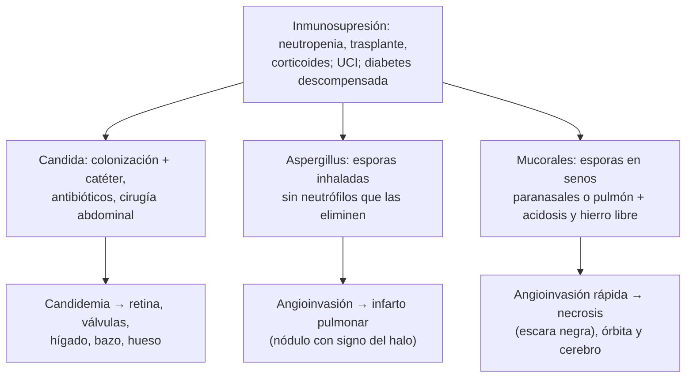
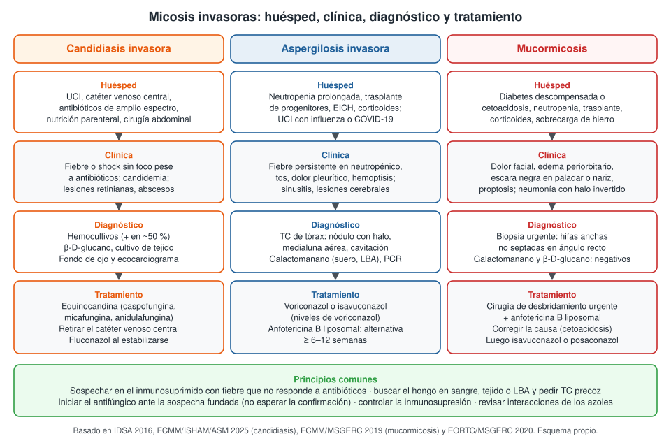

---
tags:
  - Infectología
  - Hematología
---

# Micosis invasoras (candidiasis, aspergilosis y mucormicosis)

**Subespecialidad**
Infectología · Hematología · Medicina intensiva

**Guías principales**
Guía global de candidiasis ECMM/ISHAM/ASM 2025 (*Lancet Infect Dis*) · Guías IDSA 2016 de candidiasis y de aspergilosis (*Clin Infect Dis*) · Guía global de mucormicosis ECMM/MSGERC 2019 (*Lancet Infect Dis*) · Definiciones EORTC/MSGERC 2020 de enfermedad fúngica invasora (*Clin Infect Dis*)

**Otras fuentes**
Estimación de la carga mundial de micosis graves (*Lancet Infect Dis* 2024) · Revisión chilena de aspergilosis invasora (*Rev Chilena Infectol* 2018) · Serie de candidemias de Valdivia (*Rev Chilena Infectol* 2017) · *Candida auris* en Latinoamérica (*J Mycol Med* 2025)

**GES**
No.

**EUNACOM**
1.04.1.019 Micosis invasora: aspergilosis, candidiasis, mucormicosis (sospecha, inicial, derivar)

**Revisado**
Octubre 2026

!!! abstract "Resumen en 60 segundos"
    - **Micosis invasora**: infección por hongos de la sangre o de tejidos profundos. Afecta sobre todo a **inmunosuprimidos** y pacientes **críticos**, y tiene **mortalidad alta**.
    - **Candidiasis invasora** (la más frecuente en el hospital):
        - Paciente de **UCI** con **catéter venoso central**, **antibióticos de amplio espectro**, **nutrición parenteral** o **cirugía abdominal**.
        - Tratamiento: **equinocandina**, **retirar el catéter**, **fondo de ojo** y **ecocardiograma**; tratar **14 días** desde el primer hemocultivo negativo.
    - **Aspergilosis invasora**:
        - **Neutropenia prolongada**, trasplante de progenitores hematopoyéticos, **corticoides** en dosis altas, UCI con **influenza o COVID-19**.
        - **TC de tórax** (nódulo con **signo del halo**) y **galactomanano**. Tratamiento: **voriconazol** o **isavuconazol**.
    - **Mucormicosis**:
        - **Diabetes descompensada o cetoacidosis**, neutropenia, corticoides.
        - Forma **rinoorbitocerebral**: dolor facial, edema periorbitario, **escara negra** en el paladar o la nariz.
        - Es una **urgencia**: **biopsia**, **cirugía** de desbridamiento y **anfotericina B liposomal**. El voriconazol **no** sirve.
    - **Sospechar e iniciar el antifúngico precozmente**; el retraso aumenta la mortalidad. Derivar a infectología.

## Definición

- **Micosis invasora** (enfermedad fúngica invasora): infección por hongos que compromete la **sangre** o **tejidos profundos** (pulmón, senos paranasales, sistema nervioso central, hígado, bazo, ojo, hueso).
    - Se distingue de las micosis **superficiales** (piel, uñas) y **mucosas** (candidiasis oral, esofágica o vaginal).
- **Candidiasis invasora**: incluye la **candidemia** (*Candida* en hemocultivos) y la candidiasis **profunda** (peritonitis, abscesos hepatoesplénicos, endoftalmitis, endocarditis, osteomielitis).
- **Aspergilosis invasora**: invasión de tejidos, sobre todo el **pulmón**, por hongos filamentosos del género ***Aspergillus*** (*A. fumigatus* el más frecuente).
- **Mucormicosis**: infección por hongos del orden **Mucorales** (*Rhizopus*, *Mucor*, *Lichtheimia*). Invade los **vasos sanguíneos** y produce **necrosis** de los tejidos.
- **Categorías diagnósticas EORTC/MSGERC 2020** (usadas en investigación y en la práctica):
    - **Probada**: hongo demostrado en tejido (histología o cultivo de un sitio estéril).
    - **Probable**: factor del **huésped** + **clínica o imagen** compatibles + **evidencia micológica** (cultivo, galactomanano, PCR).
    - **Posible**: huésped + clínica o imagen, **sin** evidencia micológica.

## Epidemiología

### Mundial

- **Carga mundial** (Denning 2024; estimación para 2019–2021):
    - Unos **6,5 millones** de infecciones fúngicas invasoras y **3,8 millones de muertes** al año.
    - **Aspergilosis invasora**: más de **2,1 millones** de casos al año (en EPOC, UCI, cáncer pulmonar y neoplasias hematológicas), con una **mortalidad cruda de 85 %**.
    - **Candidiasis invasora y candidemia**: unos **1,6 millones** de casos al año, con una **mortalidad cruda de 64 %**.
- **Candidemia**: es una de las causas más frecuentes de infección del torrente sanguíneo asociada a la atención de salud.
    - Aumentan las especies **no *albicans***, menos sensibles al fluconazol: *Nakaseomyces glabratus* (antes *C. glabrata*) y *C. parapsilosis* resistente.
    - ***Candidozyma auris*** (antes *Candida auris*): hongo **multirresistente** que produce **brotes hospitalarios**; se ha descrito en varios países de Latinoamérica, **incluido Chile** (Lanna 2025).
- **Mucormicosis**: rara en países de altos ingresos, pero aumentó mucho durante la **pandemia de COVID-19** (corticoides y diabetes descompensada), sobre todo en la India.

### Chile

!!! chile "Datos nacionales"
    - **Candidemia en Valdivia** (Márquez 2017; Hospital Base Valdivia, 2009–2011; 27 episodios):
        - Incidencia de **0,3 a 0,7 por 1.000 egresos**, según el servicio clínico.
        - Factores de riesgo: hospitalización, antibióticos previos, edad avanzada, insuficiencia renal, enfermedad cardíaca y pulmonar.
        - Especies: ***C. albicans*** (la más frecuente), luego *C. tropicalis*, *C. glabrata* y *C. krusei*.
    - **Aspergilosis invasora**: la revisión chilena de Rabagliati (2018) resume los factores de riesgo, el uso del **galactomanano** y del **β-D-glucano** y el tratamiento con **voriconazol** o **isavuconazol**.
    - **Mucormicosis**: se han publicado casos chilenos asociados a **COVID-19** y **diabetes descompensada** (Camhi 2023).
    - ***C. auris***: hay casos descritos en Chile; su identificación obliga a **aislamiento de contacto** y notificación al equipo de IAAS del hospital.
    - Las micosis invasoras se concentran en los centros que atienden **pacientes hematológicos, trasplantados y de UCI**.

## Etiología y factores de riesgo

| Micosis | Agentes | Factores de riesgo principales |
|---|---|---|
| **Candidiasis invasora** | *C. albicans*, *C. tropicalis*, *C. parapsilosis*, *N. glabratus*, *C. krusei* (*Pichia kudriavzevii*), *C. auris* | **Catéter venoso central**, **antibióticos de amplio espectro**, **nutrición parenteral**, **cirugía abdominal** o perforación intestinal, pancreatitis necrotizante, UCI prolongada, hemodiálisis, neutropenia, colonización por *Candida* en varios sitios |
| **Aspergilosis invasora** | *A. fumigatus*, *A. flavus*, *A. niger*, *A. terreus* | **Neutropenia** profunda (< 500/µL) y **prolongada** (> 10 días), **trasplante alogénico de progenitores hematopoyéticos**, **enfermedad de injerto contra huésped**, **corticoides** en dosis altas, ibrutinib y otros inmunosupresores, **influenza grave** o **COVID-19** en UCI, EPOC con corticoides, cirrosis |
| **Mucormicosis** | *Rhizopus*, *Mucor*, *Lichtheimia*, *Rhizomucor* | **Diabetes descompensada** y **cetoacidosis**, neoplasias hematológicas y neutropenia, trasplante, **corticoides**, **sobrecarga de hierro** o uso de deferoxamina, trauma con contaminación (quemaduras, accidentes), profilaxis con **voriconazol** (no cubre mucorales) |

## Fisiopatología

- **Candida**: es parte de la **microbiota** de la piel, la boca y el intestino.
    - Los **antibióticos** eliminan las bacterias competidoras y aumenta la **colonización**.
    - Entra a la sangre por el **catéter** (piel, biopelícula) o por el **intestino** dañado (cirugía, mucositis).
    - En la sangre se disemina a la **retina**, las válvulas cardíacas, el hígado, el bazo y el hueso.
- **Aspergillus**: se adquiere al **inhalar esporas** (conidias) del ambiente (construcciones, polvo).
    - En el sano, los **macrófagos alveolares** y los **neutrófilos** las eliminan.
    - Sin neutrófilos, las hifas **invaden los vasos**, producen **trombosis** e **infartos** pulmonares.
    - El **halo** de vidrio esmerilado en la TC corresponde a **hemorragia** alrededor del infarto. Al recuperarse los neutrófilos, el infarto se cavita: **signo de la medialuna aérea**.
- **Mucorales**: esporas inhaladas que germinan en los **senos paranasales** o el pulmón.
    - La **acidosis** y la **hiperglicemia** aumentan el **hierro libre**, que los mucorales necesitan para crecer, y alteran la función de los neutrófilos.
    - Invasión **vascular** muy agresiva: **trombosis**, **necrosis** (escara negra) y extensión a la **órbita** y al **cerebro**.

*Figura 1. Mecanismos de las tres micosis invasoras principales. Esquema propio basado en las guías IDSA 2016, ECMM/ISHAM/ASM 2025 y ECMM/MSGERC 2019.*

## Clasificación

| Micosis | Formas clínicas |
|---|---|
| **Candidiasis** | **Candidemia** (con o sin catéter) · candidiasis **diseminada crónica** (hepatoesplénica, tras la recuperación de una neutropenia) · **peritonitis** · **endoftalmitis** · **endocarditis** · osteomielitis · infección urinaria alta |
| **Aspergilosis** | **Aspergilosis pulmonar invasora** · traqueobronquitis · **sinusitis** invasora · **cerebral** · diseminada. Otras formas no invasoras: **aspergiloma**, aspergilosis pulmonar **crónica**, **aspergilosis broncopulmonar alérgica** (ver [bronquiectasias](../respiratorio/bronquiectasias.md) y [asma](../respiratorio/asma.md)) |
| **Mucormicosis** | **Rinoorbitocerebral** (típica de la diabetes) · **pulmonar** (típica de la neutropenia) · **cutánea** (trauma, quemaduras) · gastrointestinal · diseminada |
| **Categoría EORTC/MSGERC 2020** | Probada · probable · posible |

## Clínica

- **Candidiasis invasora**:
    - **Fiebre** o **shock** sin otro foco en un paciente de UCI que no mejora con antibióticos.
    - **Endoftalmitis** o **coriorretinitis**: visión borrosa, moscas volantes; a menudo **asintomática** (por eso el fondo de ojo).
    - Lesiones cutáneas nodulares (más en neutropénicos).
    - **Candidiasis hepatoesplénica**: fiebre y dolor abdominal al **recuperarse la neutropenia**, con fosfatasa alcalina alta y microabscesos en la imagen.
- **Aspergilosis pulmonar invasora**:
    - **Fiebre persistente** pese a antibióticos de amplio espectro en un **neutropénico**.
    - Tos, **dolor pleurítico**, **hemoptisis** (por los infartos), disnea.
    - En la UCI con influenza o COVID-19: deterioro respiratorio pese al tratamiento.
    - **Sinusitis** invasora y **lesiones cerebrales** (déficit focal, convulsiones) por diseminación.
- **Mucormicosis rinoorbitocerebral**:
    - **Dolor facial** o cefalea, **congestión nasal**, secreción nasal oscura o sanguinolenta.
    - **Edema periorbitario**, **proptosis**, **oftalmoplejia**, pérdida de visión.
    - **Escara negra** en el **paladar** o en los **cornetes** (signo tardío, pero clave).
    - Compromiso de **pares craneales**, trombosis del **seno cavernoso**, compromiso de conciencia.
    - Avanza en **horas a días**.
- **Mucormicosis pulmonar**: similar a la aspergilosis (fiebre, dolor pleurítico, hemoptisis), en un neutropénico que **no responde al voriconazol**.

## Diagnóstico

!!! guia "Cómo se confirma cada micosis (IDSA 2016, ECMM 2019 y 2025, EORTC/MSGERC 2020)"
    **Candidiasis invasora**

    - **Hemocultivos** (2 sets): positivos solo en **cerca de la mitad** de las candidiasis invasoras. Toda *Candida* en un hemocultivo es **infección**, nunca contaminación.
    - **β-D-glucano** en suero: apoya el diagnóstico; un resultado **negativo** ayuda a descartarla. No es específico de *Candida*.
    - **Cultivo** de tejido o de líquidos estériles (peritoneal, abscesos).
    - En toda candidemia: **fondo de ojo** (oftalmología) y **ecocardiograma**; **hemocultivos de control** hasta que sean negativos.
    - **Identificar la especie** y pedir **antifungigrama**.
    - El cultivo de *Candida* en **orina** o en **secreción traqueal** suele ser **colonización**.

    **Aspergilosis invasora**

    - **TC de tórax precoz** en el neutropénico con fiebre persistente: **nódulos** con **signo del halo**, consolidaciones en cuña, **medialuna aérea**, cavitación.
    - **Galactomanano** (componente de la pared de *Aspergillus*) en **suero** y en **lavado broncoalveolar** (LBA). Umbrales EORTC/MSGERC 2020: **≥ 1,0** en suero o en LBA (o ≥ 0,7 en suero con ≥ 0,8 en LBA).
    - **PCR de *Aspergillus*** en sangre o LBA; **cultivo** y **microscopía** del LBA.
    - **Biopsia** si es posible: hifas **delgadas, septadas**, ramificadas en **ángulo agudo** (45°).
    - Las **profilaxis con azoles** reducen la sensibilidad del galactomanano sérico.

    **Mucormicosis**

    - **Sospecha clínica urgente**: no esperar exámenes para derivar.
    - **Endoscopía nasal** y **biopsia** del tejido necrótico: **histología** (hifas **anchas, no septadas o con pocos septos**, ramificadas en **ángulo recto**) y **cultivo**.
    - **TC y RM** de senos paranasales, órbita y cerebro para ver la extensión.
    - **Galactomanano y β-D-glucano** son **negativos** (los mucorales no los tienen).
    - **Signo del halo invertido** en la TC de tórax (vidrio esmerilado rodeado de un anillo de consolidación) en el neutropénico: sugiere mucormicosis.

<figure markdown>
{ loading=lazy }
<figcaption>Figura 2. Huésped, clínica, diagnóstico y tratamiento de las tres micosis invasoras principales. Esquema propio basado en las guías IDSA 2016, ECMM/ISHAM/ASM 2025 (candidiasis), ECMM/MSGERC 2019 (mucormicosis) y las definiciones EORTC/MSGERC 2020.</figcaption>
</figure>

## Laboratorio

| Examen | Utilidad |
|---|---|
| **Hemocultivos** | Diagnóstico de **candidemia**; casi nunca positivos en la aspergilosis o la mucormicosis |
| **β-D-glucano** | Pared de muchos hongos (*Candida*, *Aspergillus*, *Pneumocystis*). **Negativo en la mucormicosis** y en *Cryptococcus*. Falsos positivos con hemodiálisis, albúmina, inmunoglobulinas IV y bacteriemias |
| **Galactomanano** (suero, LBA) | Específico de **Aspergillus**. Más sensible en **neutropénicos** sin profilaxis. Útil también para el seguimiento |
| **Ensayo de flujo lateral de *Aspergillus*** | Prueba rápida en LBA; complementa al galactomanano |
| **PCR fúngica** (*Aspergillus*, mucorales) | En sangre, LBA o tejido; apoya el diagnóstico |
| **Histología y cultivo de tejido** | **Estándar diagnóstico** (enfermedad "probada"); permite identificar la especie y la sensibilidad |
| **Hemograma** | Neutropenia (profundidad y duración) |
| **Glicemia, gases, cetonemia** | **Cetoacidosis** en la mucormicosis rinoorbitocerebral (ver [cetoacidosis](../endocrinologia/cetoacidosis-y-estado-hiperosmolar.md)) |
| **Función renal y hepática, potasio, magnesio** | Antes y durante el tratamiento (anfotericina B, azoles) |
| **Niveles plasmáticos de voriconazol y posaconazol** | Ajustar la dosis: eficacia y toxicidad |

## Imágenes

| Examen | Hallazgos |
|---|---|
| **TC de tórax** (sin contraste basta) | **Aspergilosis**: nódulos con **signo del halo** (precoz), consolidación en cuña, **medialuna aérea** y cavitación (tardíos). **Mucormicosis**: **halo invertido**, nódulos múltiples, derrame pleural. La radiografía es poco sensible |
| **TC y RM de senos, órbita y cerebro** | **Mucormicosis** o aspergilosis sinusal: engrosamiento de la mucosa, **erosión ósea**, extensión a la órbita, al seno cavernoso y al cerebro. La RM detecta antes la extensión intracraneal |
| **Ecocardiograma** (transtorácico; transesofágico si hay sospecha) | **Endocarditis** por *Candida* (ver [endocarditis](endocarditis-infecciosa.md)) |
| **Ecografía, TC o RM de abdomen** | **Candidiasis hepatoesplénica**: microabscesos en "ojo de buey" en el hígado y el bazo |
| **Fondo de ojo** | **Coriorretinitis** o **endoftalmitis** por *Candida* |
| **TC o RM cerebral** | Abscesos fúngicos (aspergilosis, mucormicosis) |

<figure markdown>
{ loading=lazy }
<figcaption>Figura 3. Infección fúngica angioinvasora en un paciente con leucemia linfoblástica aguda y neutropenia febril. A: nódulo irregular con un discreto halo de vidrio esmerilado (<strong>signo del halo</strong>). B: tras iniciar el antifúngico, el nódulo se cavita y queda un nódulo dentro de la cavidad (<strong>signo de la medialuna aérea</strong>). Tomada de Torres PPTeS, Rabahi MF, Moreira MAC, et al. <em>Tomographic assessment of thoracic fungal diseases: a pattern and signs approach.</em> Radiol Bras. 2018;51(5):313–321 (figura 2). Licencia CC BY 4.0.</figcaption>
</figure>

## Diagnóstico diferencial

| Diagnóstico | Diferencias |
|---|---|
| **Sepsis bacteriana** (incluida por bacilos gramnegativos multirresistentes) | Hemocultivos bacterianos; responde a los antibióticos; β-D-glucano negativo (ver [sepsis](sepsis-y-shock-septico.md)) |
| **Neumonía bacteriana o viral en el inmunosuprimido** | Consolidación lobar, cultivos, PCR de virus respiratorios (ver [neumonía en inmunosuprimidos](neumonia-nosocomial-inmunosuprimidos-y-cateter.md)) |
| ***Pneumocystis jirovecii*** | Vidrio esmerilado difuso, LDH alta, β-D-glucano alto, VIH o corticoides; galactomanano negativo |
| **Tuberculosis y micobacterias atípicas** | Evolución más lenta; nódulos con árbol en brote, cavitación apical (ver [tuberculosis](../respiratorio/tuberculosis.md)) |
| **Nocardiosis** | Nódulos y abscesos pulmonares y cerebrales; tinción de Gram y Kinyoun modificado |
| **Metástasis o recaída del cáncer** | Nódulos sin halo; contexto oncológico; biopsia |
| **Embolia séptica** | Nódulos múltiples periféricos que se cavitan; endocarditis derecha, catéter |
| **Sinusitis bacteriana** (diferencial de la mucormicosis) | Sin necrosis ni escara; sin extensión orbitaria rápida (ver [vías aéreas superiores](../respiratorio/infecciones-de-vias-aereas-superiores.md)) |
| **Celulitis orbitaria bacteriana** | Puede ser idéntica: en el diabético descompensado o el neutropénico, **descartar mucormicosis** con endoscopía y biopsia |
| **Otros hongos filamentosos** (*Fusarium*, *Scedosporium*) | Hemocultivos a veces positivos (*Fusarium*), lesiones cutáneas; resistentes a varios antifúngicos |

## Tratamiento

### Principios

- **Iniciar el antifúngico ante una sospecha fundada**, sin esperar la confirmación, sobre todo en el neutropénico y en la mucormicosis.
- **Controlar el foco**: retirar el **catéter venoso central** en la candidemia, **drenar** abscesos, **desbridar** el tejido necrótico en la mucormicosis.
- **Revertir la causa**: corregir la **cetoacidosis** y la hiperglicemia, **reducir los corticoides** y la inmunosupresión, factores estimulantes de colonias en neutropenias seleccionadas (decisión del especialista).
- **Revisar interacciones**: los **azoles** inhiben el citocromo P450 (tacrolimus, ciclosporina, sirolimus, vincristina, estatinas, anticoagulantes orales) y prolongan el **QT**.
- **Duración**:
    - **Candidemia** sin complicaciones: **14 días** desde el **primer hemocultivo negativo** y la resolución de los síntomas.
    - **Aspergilosis invasora**: mínimo **6–12 semanas**, según la respuesta y la inmunosupresión.
    - **Mucormicosis**: meses, hasta la resolución clínica y radiológica y la recuperación inmune.
- **Profilaxis** (decisión del hematólogo): **posaconazol** en la inducción de la leucemia mieloide aguda y en la enfermedad de injerto contra huésped; **fluconazol** en el trasplante de progenitores hematopoyéticos.

!!! dosis "Antifúngicos de uso habitual en el adulto (ajustar según función renal y hepática, niveles e interacciones)"
    **Candidiasis invasora**

    | Fármaco | Dosis | Comentario |
    |---|---|---|
    | **Caspofungina** | 70 mg IV de carga, luego **50 mg/día** | **Equinocandina**: primera línea en la candidemia |
    | **Micafungina** | **100 mg/día** IV | Equinocandina |
    | **Anidulafungina** | 200 mg IV de carga, luego **100 mg/día** | Equinocandina; no necesita ajuste por función hepática |
    | **Fluconazol** | 800 mg (12 mg/kg) de carga, luego **400 mg/día** (6 mg/kg) IV o VO | **Paso a fluconazol** a los **5–7 días** si está estable, con hemocultivos negativos y una especie sensible. No sirve para *C. krusei* y es poco fiable para *N. glabratus* |
    | **Anfotericina B liposomal** | 3–5 mg/kg/día IV | Alternativa (intolerancia, resistencia, endoftalmitis o compromiso del SNC según el caso) |

    **Aspergilosis invasora**

    | Fármaco | Dosis | Comentario |
    |---|---|---|
    | **Voriconazol** | 6 mg/kg IV cada 12 h por 2 dosis, luego **4 mg/kg cada 12 h**; VO 200–300 mg cada 12 h | **Primera línea**. Medir **niveles**. Efectos: alteraciones visuales, alucinaciones, hepatotoxicidad, fotosensibilidad, QT largo |
    | **Isavuconazol** | 200 mg cada 8 h por 6 dosis, luego **200 mg/día** IV o VO | Primera línea alternativa; **menos efectos adversos** e interacciones; también activo contra mucorales |
    | **Anfotericina B liposomal** | 3–5 mg/kg/día IV | Alternativa si no se pueden usar azoles |
    | **Posaconazol** | 300 mg cada 12 h el primer día, luego **300 mg/día** (comprimidos o IV) | Alternativa; también para la profilaxis |

    **Mucormicosis**

    | Fármaco | Dosis | Comentario |
    |---|---|---|
    | **Anfotericina B liposomal** | **5–10 mg/kg/día** IV (10 mg/kg si hay compromiso del SNC) | **Primera línea**, junto con la **cirugía**. Vigilar creatinina, potasio y magnesio |
    | **Isavuconazol** o **posaconazol** | Dosis como en la aspergilosis | Alternativa de primera línea si hay daño renal, o para **continuar por vía oral** tras la respuesta |

    - El **voriconazol no cubre los mucorales**: una infección que progresa con voriconazol puede ser una mucormicosis.
    - Las **equinocandinas no** se usan en la aspergilosis como monoterapia de primera línea ni en la mucormicosis.

!!! alarma "Derivar u hospitalizar de urgencia"
    - **Toda candidemia**: hospitalizar, infectología, retiro del catéter, fondo de ojo y ecocardiograma.
    - **Neutropénico** con fiebre persistente o nódulos en la TC: TC precoz, galactomanano y evaluación por infectología y hematología (ver [neutropenia febril](../hematologia/urgencias-oncologicas.md)).
    - **Diabético descompensado** o neutropénico con **dolor facial, edema periorbitario, escara negra** o compromiso de pares craneales: **mucormicosis hasta demostrar lo contrario**. Otorrinolaringología para **endoscopía y biopsia urgentes**, cirugía y anfotericina B liposomal el mismo día.
    - **Hemoptisis** en un paciente con aspergilosis o mucormicosis pulmonar (riesgo de hemorragia masiva).
    - Aislamiento de ***C. auris***: aislamiento de contacto y aviso al equipo de IAAS.

## Complicaciones

- **Shock séptico** y falla multiorgánica.
- **Candidiasis**: **endoftalmitis** (ceguera), **endocarditis**, tromboflebitis supurada, osteomielitis, abscesos hepatoesplénicos.
- **Aspergilosis**: **hemoptisis masiva** (al cavitarse el nódulo durante la recuperación de los neutrófilos), diseminación al **cerebro**, insuficiencia respiratoria.
- **Mucormicosis**: **ceguera**, trombosis del **seno cavernoso** y de la carótida interna, **infarto y absceso cerebral**, desfiguración facial tras la cirugía.
- **Toxicidad del tratamiento**:
    - **Anfotericina B**: **nefrotoxicidad**, hipokalemia, hipomagnesemia, reacciones a la infusión (menos con la forma liposomal).
    - **Azoles**: hepatotoxicidad, **QT largo**, **interacciones** (toxicidad por inmunosupresores o quimioterapia).
- **Retraso de la quimioterapia** o del trasplante.

## Pronóstico y seguimiento

- **Mortalidad alta**: en la estimación mundial, **64 %** de mortalidad cruda en la candidiasis invasora y **85 %** en la aspergilosis invasora (Denning 2024). La mortalidad depende mucho de la enfermedad de base y del acceso al diagnóstico.
- **Factores de mal pronóstico**: **retraso** del tratamiento antifúngico, catéter no retirado, **neutropenia persistente**, shock, compromiso del **SNC**, diseminación.
- **Mucormicosis**: el pronóstico depende de la **cirugía precoz**, el tratamiento con **anfotericina B** y la **corrección de la causa**. Es peor con compromiso cerebral o diseminado.
- **Seguimiento**:
    - **Candidemia**: hemocultivos de control cada 24–48 h hasta que sean negativos; fondo de ojo.
    - **Aspergilosis**: respuesta clínica, **galactomanano** seriado y **TC** de control (las lesiones pueden crecer en la primera semana o al recuperarse los neutrófilos sin que sea fracaso).
    - **Niveles** de voriconazol o posaconazol, función renal y hepática, electrolitos, ECG (QT).
    - **Profilaxis secundaria** antes de nuevos ciclos de quimioterapia o del trasplante.

## Perlas para el internado

!!! perla "Para recordar en la sala"
    - **Candida en un hemocultivo nunca es contaminación**: equinocandina, **retirar el catéter**, **fondo de ojo**, **ecocardiograma** y hemocultivos de control.
    - **Candida en la orina o en la secreción traqueal** casi siempre es **colonización**: no se trata, salvo excepciones (neutropenia, procedimiento urológico, síntomas).
    - **Neutropénico con fiebre que no cede tras 4–7 días de antibióticos**: pensar en **hongos**, pedir **TC de tórax** y **galactomanano**.
    - **Signo del halo** = aspergilosis angioinvasora precoz; **halo invertido** en el neutropénico = pensar en mucormicosis.
    - **Diabético en cetoacidosis + dolor facial + escara negra en el paladar** = **mucormicosis**: es una urgencia quirúrgica.
    - El **voriconazol no cubre los mucorales**, y la mucormicosis tiene **galactomanano y β-D-glucano negativos**.
    - **Azoles**: revisar siempre las **interacciones** (tacrolimus, ciclosporina, vincristina) y el **QT**.
    - **Anfotericina B**: vigilar la **creatinina**, el **potasio** y el **magnesio** a diario.

## Preguntas de repaso

??? repaso "1. Hombre de 64 años en la UCI hace 15 días tras una perforación de colon, con nutrición parenteral por catéter venoso central y meropenem. Presenta fiebre de 38,8 °C e hipotensión. Los hemocultivos informan levaduras. ¿Qué hace?"
    - **Candidemia** asociada a catéter, con factores de riesgo clásicos (UCI, cirugía abdominal, antibióticos de amplio espectro, nutrición parenteral).
    - Iniciar una **equinocandina** (caspofungina 70 mg de carga, luego 50 mg/día).
    - **Retirar el catéter venoso central**, **fondo de ojo**, **ecocardiograma** y **hemocultivos de control** cada 24–48 h.
    - Identificar la especie y la sensibilidad; pasar a **fluconazol** si es sensible y está estable. Tratar **14 días** desde el primer hemocultivo negativo.

??? repaso "2. Mujer de 45 años con leucemia mieloide aguda en inducción, con neutrófilos en 100/µL hace 14 días. Tiene fiebre persistente pese a 6 días de cefepime y vancomicina, tos y dolor pleurítico. ¿Qué sospecha y qué estudio pide?"
    - **Aspergilosis pulmonar invasora**: neutropenia profunda y prolongada con fiebre persistente pese a antibióticos.
    - **TC de tórax** (buscar nódulos con **signo del halo**), **galactomanano** en suero, fibrobroncoscopía con **LBA** (galactomanano, cultivo, PCR).
    - Iniciar **voriconazol** o **isavuconazol** sin esperar la confirmación. Revisar interacciones con la quimioterapia.

??? repaso "3. Hombre de 52 años con diabetes tipo 2 mal controlada ingresa en cetoacidosis. Al segundo día presenta dolor facial derecho intenso, edema periorbitario, proptosis y una lesión negra en el paladar. ¿Qué tiene y qué hace?"
    - **Mucormicosis rinoorbitocerebral**.
    - **Urgencia**: otorrinolaringología para **endoscopía y biopsia**, **TC y RM** de senos, órbita y cerebro.
    - **Desbridamiento quirúrgico** amplio y precoz + **anfotericina B liposomal** 5–10 mg/kg/día, el mismo día.
    - **Corregir la cetoacidosis** y la hiperglicemia. **No** usar voriconazol.

??? repaso "4. Paciente en la UCI con ventilación mecánica tiene un cultivo de secreción traqueal con *Candida albicans* y un urocultivo con levaduras (sonda Foley). Está afebril y estable. ¿Inicia un antifúngico?"
    - **No**. Ambos hallazgos suelen ser **colonización**.
    - La neumonía por *Candida* es excepcional. La candiduria asintomática se maneja **retirando o cambiando la sonda**.
    - Excepciones para tratar la candiduria: **neutropenia**, procedimiento **urológico** próximo o infección urinaria sintomática.

??? repaso "5. Un paciente con trasplante de progenitores hematopoyéticos recibe voriconazol por una aspergilosis pulmonar. A las 3 semanas aparecen nuevos nódulos y uno con halo invertido. El galactomanano es negativo. ¿Qué sospecha?"
    - **Mucormicosis** (infección de brecha bajo voriconazol, que no cubre los mucorales).
    - **Biopsia** o LBA con cultivo y PCR para mucorales.
    - Cambiar a **anfotericina B liposomal** (o isavuconazol o posaconazol) y evaluar la **cirugía**.

??? repaso "6. Un paciente con candidemia por *Candida albicans* sensible a fluconazol, en tratamiento con caspofungina, tiene hemocultivos negativos desde hace 3 días, está afebril y tolera la vía oral. El catéter fue retirado y el fondo de ojo es normal. ¿Cómo sigue?"
    - **Paso a fluconazol oral** (400 mg/día tras una carga de 800 mg).
    - Completar **14 días** desde el **primer hemocultivo negativo**.
    - Control clínico; el ecocardiograma descarta la endocarditis si no se había hecho.

## Referencias

1. Cornely OA, Sprute R, Bassetti M, et al. Global guideline for the diagnosis and management of candidiasis: an initiative of the ECMM in cooperation with ISHAM and ASM. *Lancet Infect Dis.* 2025;25(5):e280–e293. doi:[10.1016/S1473-3099(24)00749-7](https://doi.org/10.1016/S1473-3099(24)00749-7)
2. Pappas PG, Kauffman CA, Andes DR, et al. Clinical Practice Guideline for the Management of Candidiasis: 2016 Update by the Infectious Diseases Society of America. *Clin Infect Dis.* 2016;62(4):e1–e50. doi:[10.1093/cid/civ933](https://doi.org/10.1093/cid/civ933)
3. Patterson TF, Thompson GR 3rd, Denning DW, et al. Practice Guidelines for the Diagnosis and Management of Aspergillosis: 2016 Update by the Infectious Diseases Society of America. *Clin Infect Dis.* 2016;63(4):e1–e60. doi:[10.1093/cid/ciw326](https://doi.org/10.1093/cid/ciw326)
4. Cornely OA, Alastruey-Izquierdo A, Arenz D, et al. Global guideline for the diagnosis and management of mucormycosis: an initiative of the European Confederation of Medical Mycology in cooperation with the Mycoses Study Group Education and Research Consortium. *Lancet Infect Dis.* 2019;19(12):e405–e421. doi:[10.1016/S1473-3099(19)30312-3](https://doi.org/10.1016/S1473-3099(19)30312-3)
5. Donnelly JP, Chen SC, Kauffman CA, et al. Revision and Update of the Consensus Definitions of Invasive Fungal Disease From the European Organization for Research and Treatment of Cancer and the Mycoses Study Group Education and Research Consortium. *Clin Infect Dis.* 2020;71(6):1367–1376. doi:[10.1093/cid/ciz1008](https://doi.org/10.1093/cid/ciz1008)
6. Denning DW. Global incidence and mortality of severe fungal disease. *Lancet Infect Dis.* 2024;24(7):e428–e438. doi:[10.1016/S1473-3099(23)00692-8](https://doi.org/10.1016/S1473-3099(23)00692-8)
7. Torres PPTeS, Rabahi MF, Moreira MAC, et al. Tomographic assessment of thoracic fungal diseases: a pattern and signs approach. *Radiol Bras.* 2018;51(5):313–321. doi:[10.1590/0100-3984.2017.0223](https://doi.org/10.1590/0100-3984.2017.0223)
8. Rabagliati R. Actualización en el diagnóstico y manejo de aspergilosis invasora en pacientes adultos. *Rev Chilena Infectol.* 2018;35(5):531–544. doi:[10.4067/s0716-10182018000500531](https://doi.org/10.4067/s0716-10182018000500531)
9. Márquez F, Iturrieta I, Calvo M, et al. Epidemiología y susceptibilidad antifúngica de especies causantes de candidemia en la ciudad de Valdivia, Chile. *Rev Chilena Infectol.* 2017;34(5):441–446. doi:[10.4067/S0716-10182017000500441](https://doi.org/10.4067/S0716-10182017000500441)
10. Camhi D, López MI, Wiener A, et al. Mucormicosis invasora en pacientes con COVID-19: reporte de 2 casos. *Rev Med Chil.* 2023;151(1):125–128. doi:[10.4067/s0034-98872023000100125](https://doi.org/10.4067/s0034-98872023000100125)
11. Lanna M, Lovatto J, de Almeida JN Jr, et al. Epidemiological and Microbiological aspects of *Candidozyma auris* (*Candida auris*) in Latin America: A literature review. *J Mycol Med.* 2025;35(2):101546. doi:[10.1016/j.mycmed.2025.101546](https://doi.org/10.1016/j.mycmed.2025.101546)
