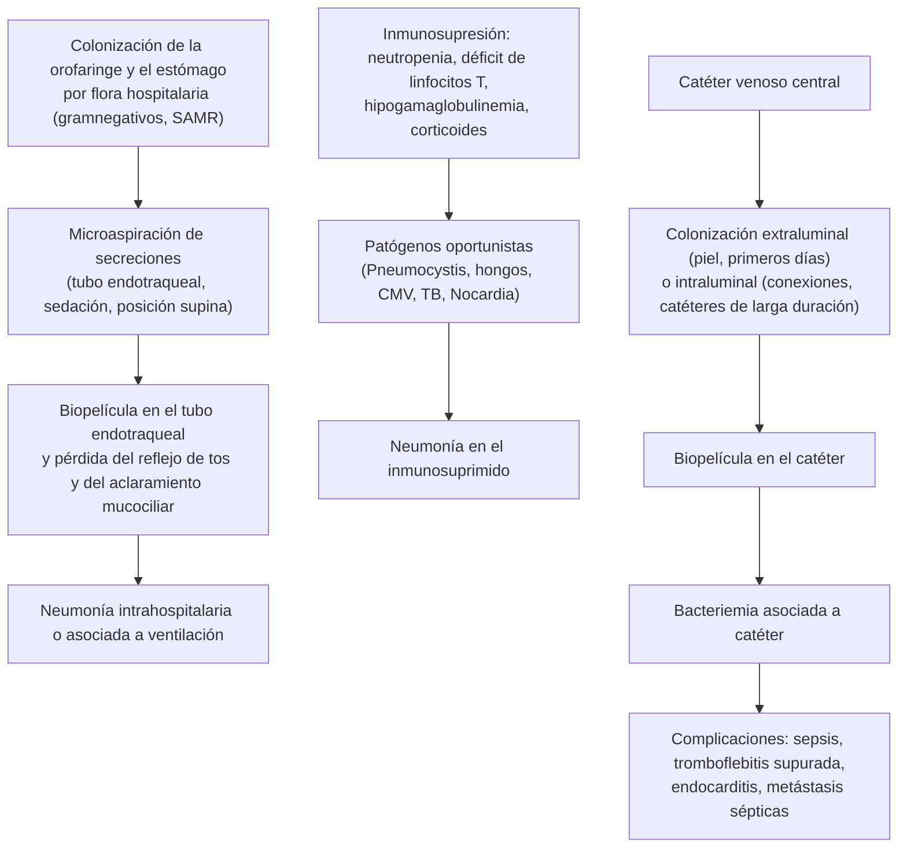
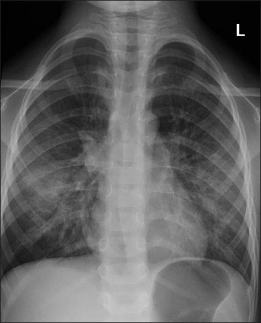
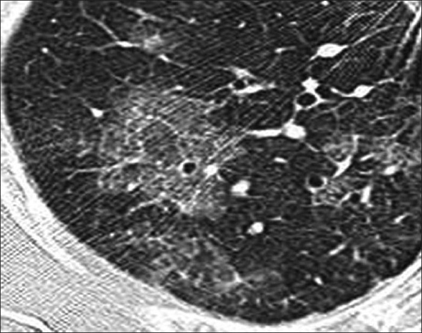

---
tags:
  - Infectología
  - Frecuente en sala
  - Urgencia
---

# Neumonía nosocomial, neumonía en inmunosuprimidos e infección asociada a catéter

**Subespecialidad**
Infectología · Respiratorio · Medicina intensiva

**Guías principales**
IDSA/ATS 2016: neumonía intrahospitalaria y asociada a ventilación mecánica · ERS/ESICM/ESCMID/ALAT 2017 · Consenso de neumonía en inmunosuprimidos (*Chest* 2020) · ECIL 2016: tratamiento y prevención de *Pneumocystis* · IDSA 2009: infección asociada a catéter vascular · SHEA 2022: prevención de la neumonía asociada a ventilación

**Otras fuentes**
Informe de vigilancia de infecciones asociadas a la atención de salud (IAAS), MINSAL 2022 · Experiencia UC en neumonía asociada a ventilación (Ajenjo, *Rev Chilena Infectol* 2013) · Ensayo de 8 vs. 15 días (Chastre, *JAMA* 2003) · IDSA 2016: aspergilosis y candidiasis

**GES**
No

**EUNACOM**
1.05.1.030 Neumonías nosocomiales (específico, inicial, derivar) · 1.05.1.029 Neumonías en inmunosuprimidos (sospecha, inicial, derivar) · 1.04.1.015 Infecciones asociadas a catéteres vasculares (sospecha, inicial, derivar)

**Revisado**
Septiembre 2026

!!! abstract "Resumen en 60 segundos"
    - **Neumonía intrahospitalaria (NIH)**: aparece **≥ 48 h** después del ingreso. **Neumonía asociada a ventilación (NAV)**: **> 48 h** después de la intubación (IDSA/ATS 2016).
    - Diagnóstico: **infiltrado nuevo** + fiebre, secreción purulenta, leucocitosis o empeoramiento de la oxigenación. Tomar **hemocultivos** y una **muestra respiratoria** (aspirado endotraqueal semicuantitativo) **antes** del antibiótico.
    - **Tratamiento empírico según el riesgo y la epidemiología local**: cubrir ***Pseudomonas*** siempre; agregar cobertura de **SAMR** y un **segundo antipseudomónico** si hay factores de riesgo o shock.
        - En los hospitales públicos chilenos (2022), el **~ 35 %** de los *S. aureus* de las IAAS era resistente a cloxacilina y el **~ 70 %** de las *K. pneumoniae* era resistente a ceftriaxona.
    - **Desescalar** según los cultivos y tratar por **7 días**.
    - **Inmunosuprimido** (quimioterapia, trasplante, VIH con CD4 < 200, **prednisona ≥ 20 mg/día** prolongada, biológicos): además de los agentes habituales, pensar en ***Pneumocystis***, **hongos** (*Aspergillus*), **CMV**, TB y *Nocardia* según el defecto inmune.
        - **TC de tórax** y **fibrobroncoscopía con lavado** precoces.
        - ***Pneumocystis***: disnea subaguda, hipoxemia, LDH alta y vidrio esmerilado. Se trata con **cotrimoxazol en dosis altas por 21 días**, más **corticoides** en el VIH con hipoxemia.
    - **Infección asociada a catéter**: fiebre sin otro foco en un paciente con catéter. **Hemocultivos pareados** (catéter y periférico): el del catéter se positiva **≥ 2 h antes**.
        - **Vancomicina** empírica; **retirar el catéter** si hay sepsis grave, tromboflebitis supurada, endocarditis, bacteriemia persistente > 72 h o infección por ***S. aureus***, *Pseudomonas* u **hongos**.

## Definición

- **Neumonía intrahospitalaria (NIH)**: neumonía que **no se estaba incubando** al ingreso y aparece **≥ 48 horas** después, en un paciente **no ventilado** (IDSA/ATS 2016).
- **Neumonía asociada a ventilación mecánica (NAV)**: aparece **> 48 horas** después de la intubación.
- El término "neumonía asociada a la atención de salud" (pacientes de hogares de ancianos o diálisis) **se abandonó**: esos pacientes se manejan como una neumonía comunitaria, evaluando el riesgo individual de resistentes.
- **Paciente inmunosuprimido** (consenso *Chest* 2020): inmunodeficiencia primaria; **cáncer activo** o en el último año, **quimioterapia**; **trasplante** de órgano sólido o de progenitores hematopoyéticos; **VIH con CD4 < 200/µL**; **corticoides** (el riesgo de oportunistas es claro con **≥ 20 mg/día de prednisona** y una dosis acumulada > 600 mg); **inmunosupresores y biológicos**.
- **Infección del torrente sanguíneo asociada a catéter**: bacteriemia en un paciente con un catéter vascular, sin otro foco, con evidencia de que el catéter es la fuente:
    - El mismo microorganismo en un **hemocultivo periférico** y en el **cultivo de la punta** del catéter, o
    - **Tiempo diferencial de positividad ≥ 2 h** (el hemocultivo del catéter se positiva al menos 2 h antes que el periférico), o
    - Recuento **≥ 3 veces** mayor en el hemocultivo cuantitativo del catéter (IDSA 2009).

## Epidemiología

### Mundial

- La NIH y la NAV están entre las **infecciones asociadas a la atención de salud más frecuentes y más letales**, y son una causa principal de uso de antibióticos de amplio espectro en el hospital.
- Los agentes más frecuentes son **bacilos gramnegativos** (*Pseudomonas aeruginosa*, *Klebsiella*, *Enterobacter*, *Acinetobacter*) y ***S. aureus***.
- **Inmunosuprimidos**: la neumonía es la infección grave más frecuente; la etiología depende del tipo de defecto inmune (tabla de clasificación).
- La **bacteriemia asociada a catéter venoso central** es una de las IAAS más prevenibles con medidas de inserción y mantención.

### Chile

!!! chile "Vigilancia nacional de IAAS (MINSAL, 2022)"
    - **Neumonía asociada a ventilación en adultos**: tasa de **7 por 1000 días de ventilación mecánica** (bajó desde 10,55 en 2021). Es la **cuarta** IAAS más frecuente en los estudios de prevalencia.
        - Agentes más frecuentes (todas las edades): ***P. aeruginosa* 23,6 %**, ***S. aureus* 20,9 %**, ***K. pneumoniae* 20,2 %**, *E. coli* 4,8 %, *Enterobacter cloacae* 3,8 %, *Acinetobacter baumannii* 2,7 %.
    - **Bacteriemia en adultos con catéter venoso central**: **2,29 por 1000 días de catéter**. Las infecciones del torrente sanguíneo son la **segunda** IAAS más frecuente.
        - Agentes: ***S. epidermidis* 17,1 %**, ***S. aureus* 16,7 %**, ***K. pneumoniae* 13,7 %**, *P. aeruginosa* 8,1 %, *Candida albicans* 3,3 %. Aparecieron brotes por *Burkholderia cepacia* por productos farmacéuticos contaminados.
    - **Resistencia en IAAS**:
        - *S. aureus*: sólo el **65,5 %** era sensible a **cloxacilina** (~ 35 % SAMR); **100 %** sensible a vancomicina.
        - *K. pneumoniae*: **30,5 %** sensible a **ceftriaxona** (~ 70 % resistente, en general por BLEE); **70,9 %** sensible a **meropenem**. La *K. pneumoniae* productora de **carbapenemasa KPC** fue el agente más frecuente en los **brotes** por resistentes.
    - **Experiencia UC** (Ajenjo, 2013): la NAV tras cirugía cardíaca bajó de **56,7 a 4,7 por 1000 días de ventilación** (1998–2010) con un protocolo de **destete precoz**, personal entrenado en el manejo del ventilador y el uso de **alcohol gel**.

## Etiología

| Contexto | Agentes principales |
|---|---|
| **NIH o NAV precoz sin factores de riesgo** | *S. pneumoniae*, *H. influenzae*, *S. aureus* sensible, enterobacterias sensibles |
| **NIH o NAV con factores de riesgo de resistentes** | ***P. aeruginosa***, **enterobacterias BLEE o productoras de carbapenemasa** (*Klebsiella*), ***Acinetobacter***, **SAMR**, *Stenotrophomonas* |
| **Neutropenia** | *P. aeruginosa*, enterobacterias, *S. aureus*, estreptococos, **hongos filamentosos** (*Aspergillus*, mucorales) |
| **Déficit de linfocitos T** (VIH con CD4 bajo, trasplante, corticoides, antirrechazo) | ***Pneumocystis jirovecii***, **CMV**, **TB** y micobacterias atípicas, ***Nocardia***, *Cryptococcus*, *Legionella*, *Toxoplasma*, hongos endémicos |
| **Hipogamaglobulinemia o asplenia** (mieloma, rituximab, esplenectomía) | **Bacterias encapsuladas**: *S. pneumoniae*, *H. influenzae* |
| **Catéter vascular** | **Estafilococos coagulasa negativos**, ***S. aureus***, **bacilos gramnegativos** (*Klebsiella*, *Pseudomonas*), ***Candida*** (nutrición parenteral, catéter femoral, antibióticos de amplio espectro) |

**Factores de riesgo de gérmenes multirresistentes en la NAV (IDSA/ATS 2016)**: **antibióticos EV en los últimos 90 días**, **shock séptico** al momento de la NAV, **SDRA** previo, **≥ 5 días** de hospitalización antes de la NAV y **terapia de reemplazo renal** aguda previa.

## Fisiopatología

*Figura 1. Fisiopatología de la neumonía nosocomial, de la neumonía en el inmunosuprimido y de la infección asociada a catéter. Esquema propio.*

## Clasificación

| Tipo | Criterios | Implicancia |
|---|---|---|
| **NIH** | ≥ 48 h de hospitalización, sin ventilación | Evaluar el riesgo de SAMR y de *Pseudomonas* resistente |
| **NAV** | > 48 h de ventilación mecánica | Más gramnegativos no fermentadores y resistentes |
| **Neumonía grave** | Requiere ventilación por la neumonía o tiene **shock séptico** | Doble cobertura antipseudomónica y SAMR |
| **Neumonía en inmunosuprimido** | Según el defecto inmune (tabla de etiología) | Estudio amplio, broncoscopía precoz |
| **Bacteriemia asociada a catéter no complicada** | Se resuelve en < 72 h tras retirar el catéter, sin endocarditis ni tromboflebitis | Tratamiento corto |
| **Bacteriemia asociada a catéter complicada** | Bacteriemia persistente > 72 h, endocarditis, tromboflebitis supurada, osteomielitis | 4–6 semanas (o más) |

## Clínica

- **NIH/NAV**:
    - **Fiebre** o hipotermia, **secreciones purulentas** nuevas o aumentadas, **tos**, disnea.
    - En el ventilado: **aumento de los requerimientos de oxígeno** o de PEEP, más secreciones por el tubo.
    - **Infiltrado nuevo o progresivo** en la radiografía.
    - Los signos son **poco específicos**: el diagnóstico diferencial es amplio (ver más abajo).
- **Neumonía en el inmunosuprimido**:
    - La **fiebre** puede ser el único signo; los infiltrados pueden ser mínimos en la neutropenia.
    - ***Pneumocystis***: **disnea progresiva de días a semanas**, **tos seca**, fiebre, **hipoxemia** (sobre todo con el esfuerzo) desproporcionada a la radiografía, **LDH alta**. En el no VIH (corticoides, trasplante, hematológicos) es **más aguda y grave**.
    - ***Aspergillus***: fiebre persistente pese a los antibióticos en un **neutropénico**, dolor pleurítico, **hemoptisis**; nódulos con **signo del halo** en la TC.
    - **CMV**: fiebre, neumonitis, citopenias, en trasplantados (1–6 meses después).
- **Infección asociada a catéter**:
    - **Fiebre** (a veces con calofríos al usar el catéter) **sin otro foco**, en un paciente con un catéter venoso central.
    - Eritema, induración o **pus en el sitio de inserción** (a menudo ausentes).
    - Hipotensión o shock en los casos graves.

!!! alarma "Signos de alarma"
    - **Shock séptico** o necesidad de ventilación por la neumonía: ampliar a **doble cobertura antipseudomónica + SAMR**.
    - **Hipoxemia progresiva** en un inmunosuprimido: UCI precoz, **broncoscopía** y tratamiento empírico de ***Pneumocystis*** si corresponde.
    - **Neutropenia febril**: antibiótico antipseudomónico en **la primera hora** (ver [urgencias oncológicas](../hematologia/urgencias-oncologicas.md)).
    - **Bacteriemia por *S. aureus***: siempre **retirar el catéter**, **ecocardiograma** y ≥ 14 días de tratamiento.
    - **Fiebre o bacteriemia que persiste > 72 h** tras retirar el catéter: buscar **endocarditis**, **tromboflebitis supurada** u osteomielitis.
    - **Candidemia**: retirar el catéter, **fondo de ojo** y ecocardiograma.

## Diagnóstico

!!! guia "Recomendaciones diagnósticas (IDSA/ATS 2016; IDSA 2009)"
    - **NAV**: muestra respiratoria **no invasiva** con **cultivo semicuantitativo** (aspirado endotraqueal) antes de iniciar o cambiar los antibióticos.
    - **NIH**: muestra respiratoria no invasiva (expectoración, aspirado) y **hemocultivos**.
    - Usar **criterios clínicos** para decidir el tratamiento. **No** usar la procalcitonina, la PCR ni el puntaje CPIS para decidir si iniciar antibióticos.
    - **Catéter**: **2 hemocultivos pareados** (uno por el catéter y uno periférico) antes de los antibióticos.
        - **Tiempo diferencial ≥ 2 h** (catéter antes que periférico) o recuento **≥ 3 veces** mayor en el del catéter.
        - Si se retira el catéter: cultivo de los **5 cm distales** de la punta (**> 15 UFC** por técnica semicuantitativa).
        - **No** cultivar las puntas de rutina si no hay sospecha de infección.

- **Inmunosuprimido** (*Chest* 2020): además de los estudios de la neumonía comunitaria (hemocultivos, expectoración, antígenos urinarios de neumococo y *Legionella*, **panel viral respiratorio**):
    - **TC de tórax** precoz (más sensible que la radiografía).
    - **Fibrobroncoscopía con lavado broncoalveolar**, idealmente **antes** de los antimicrobianos empíricos, sobre todo mientras más inmunosuprimido esté el paciente. Estudio del lavado: cultivos, **PCR de *Pneumocystis***, **galactomanano**, PCR de CMV y virus, micobacterias, *Nocardia*.
    - En sangre: **β-D-glucano** (*Pneumocystis* y otros hongos), **galactomanano** (*Aspergillus*), **PCR de CMV**, **antígeno de *Cryptococcus***, **VIH** y **CD4** si no se conoce.
    - En el paciente **no VIH**, una **PCR de *Pneumocystis* negativa** en el lavado permite suspender el tratamiento anti-*Pneumocystis*.

## Laboratorio

- Hemograma (leucocitosis o **neutropenia**), PCR, **procalcitonina** (útil para acortar el tratamiento, no para iniciarlo), función renal y hepática, **lactato**, gases arteriales.
- **Hemocultivos** (2 sets; en la sospecha de catéter, pareados).
- **Muestra respiratoria**: tinción de Gram y cultivo semicuantitativo del aspirado endotraqueal o de la expectoración.
- **Inmunosuprimido**: LDH (alta en *Pneumocystis*), β-D-glucano, galactomanano, PCR de CMV, CD4.
- **Catéter**: hemocultivos pareados; cultivo de la punta si se retira; cultivo de la secreción del sitio de inserción.
- **Niveles de vancomicina** (o AUC) y función renal durante el tratamiento.

## Imágenes

- **Radiografía de tórax**: infiltrado nuevo. En el ventilado es difícil de interpretar (atelectasias, edema, SDRA).
- **TC de tórax**: en el inmunosuprimido y cuando la radiografía no es concluyente.
    - ***Pneumocystis***: **vidrio esmerilado** bilateral, difuso o "geográfico", de predominio central y perihiliar; a veces **quistes** y neumotórax.
    - ***Aspergillus***: **nódulos** con **signo del halo** (precoz) o del **creciente aéreo** (tardío), cavitación.
    - Bacterias: consolidación lobar o segmentaria; **cavitación** con SAMR, *Klebsiella* o *Nocardia*.
- **Ecocardiograma** (transesofágico si el transtorácico es negativo) en la bacteriemia por *S. aureus* o *Candida*.
- **Ecografía Doppler** de la vena canulada si se sospecha una **tromboflebitis**.

<figure markdown>
{ loading=lazy width="360" }
<figcaption>Figura 2. Neumonía por <em>Pneumocystis</em> en un paciente con CD4 &lt; 200/mm³: vidrio esmerilado bilateral perihiliar ("en alas de murciélago"). Tomado de Allen CM, Al-Jahdali HH, Irion KL, Al Ghanem S, Gouda A, Khan AN. Imaging lung manifestations of HIV/AIDS. <em>Ann Thorac Med</em> 2010;5:201–216 (figura 4). Licencia <a href="https://creativecommons.org/licenses/by/2.0/">CC BY 2.0</a>.</figcaption>
</figure>

<figure markdown>
{ loading=lazy width="460" }
<figcaption>Figura 3. Neumonía por <em>Pneumocystis</em> en la TC de alta resolución: vidrio esmerilado de distribución geográfica o en mosaico, el hallazgo característico en un paciente inmunosuprimido. Tomado de Allen CM, et al. <em>Ann Thorac Med</em> 2010;5:201–216 (figura 10). Licencia <a href="https://creativecommons.org/licenses/by/2.0/">CC BY 2.0</a>.</figcaption>
</figure>

## Diagnóstico diferencial

| Diagnóstico | Claves |
|---|---|
| **Atelectasia** | Sin fiebre ni secreción purulenta; mejora con kinesioterapia y reclutamiento |
| **Edema pulmonar cardiogénico o sobrecarga de volumen** | Balance positivo, BNP alto, derrame bilateral, cardiomegalia |
| **SDRA** | Factor desencadenante (sepsis, pancreatitis, transfusión); infiltrados bilaterales |
| **TEP** | Taquicardia e hipoxemia sin infiltrado claro; dímero D, angio-TC |
| **Neumonitis aspirativa química** | Aspiración presenciada; infiltrado en las primeras horas que puede mejorar sin antibióticos |
| **Neumonitis por fármacos o por radiación** (inmunosuprimido) | Bleomicina, metotrexato, amiodarona, inhibidores de puntos de control |
| **Hemorragia alveolar** | Hemoptisis, anemia, trombocitopenia (trasplante de médula) |
| **Otra fuente de fiebre** (catéter) | ITU, *C. difficile*, sinusitis, colecistitis alitiásica, fiebre por fármacos, trombosis venosa |

## Tratamiento

### Neumonía intrahospitalaria y asociada a ventilación (IDSA/ATS 2016)

1. **Cultivos antes** del antibiótico (sin retrasarlo en el paciente grave).
2. **Esquema empírico** según el **riesgo de resistentes**, la **gravedad** y el **antibiograma local**:
    - **Siempre** un **betalactámico antipseudomónico**.
    - **Agregar un segundo antipseudomónico** de otra familia (amikacina o una quinolona) si hay factores de riesgo de resistentes, **shock séptico** o si > 10 % de los gramnegativos de la unidad son resistentes.
    - **Agregar vancomicina o linezolid** (SAMR) si hay factores de riesgo, **shock** o ventilación por la neumonía, o si > 10–20 % de los *S. aureus* de la unidad son SAMR (en Chile, ~ 35 % en 2022).
    - En hospitales con **alta prevalencia de BLEE** (*K. pneumoniae* resistente a ceftriaxona ~ 70 % en Chile), un **carbapenémico** suele ser la base en el paciente grave; si hay **KPC**, discutir con infectología (ceftazidima-avibactam).
3. **Desescalar** según los cultivos y la evolución a las 48–72 h.
4. **Duración: 7 días** en la mayoría (NIH y NAV).
    - En el ensayo de Chastre (2003), **8 días** fueron tan eficaces como 15, con más días libres de antibióticos. Con **no fermentadores** (*Pseudomonas*) hubo más recurrencias con 8 días, pero no peor evolución.
5. **Prevención de la NAV** (SHEA 2022): **cabecera a 30–45°**, **interrupción diaria de la sedación** y **pruebas de ventilación espontánea**, evitar la intubación (VMNI o cánula nasal de alto flujo cuando corresponda), **aspiración subglótica** en ventilaciones prolongadas, **movilización precoz**, higiene de manos.

### Neumonía en el inmunosuprimido

- **Hospitalizar**, con umbral bajo para la **UCI**.
- **Cobertura empírica amplia** según el defecto inmune y la gravedad: betalactámico antipseudomónico ± SAMR (*Chest* 2020), más la cobertura de los oportunistas sospechados:
    - ***Pneumocystis***: **cotrimoxazol en dosis altas** EV u oral por **21 días**.
        - **VIH con PaO2 < 70 mmHg** o gradiente alvéolo-arterial ≥ 35 mmHg: agregar **prednisona** en las primeras 72 h (guía de infecciones oportunistas en VIH).
        - **No VIH**: los corticoides se deciden **caso a caso** (ECIL 2016).
        - Alternativa si hay alergia o intolerancia: **primaquina + clindamicina**.
        - Después, **profilaxis secundaria** mientras dure la inmunosupresión.
    - ***Aspergillus*** (neutropenia prolongada, trasplante de médula): **voriconazol** (IDSA 2016).
    - **CMV**: ganciclovir, según el especialista.
    - **TB** y ***Nocardia***: según los hallazgos (la *Nocardia* responde a cotrimoxazol).
- **Neutropenia febril**: ver el resumen de [urgencias oncológicas](../hematologia/urgencias-oncologicas.md).
- **Profilaxis de *Pneumocystis*** con cotrimoxazol en: VIH con CD4 < 200, leucemia linfoblástica aguda, trasplante de progenitores hematopoyéticos, alemtuzumab, esquemas con fludarabina o rituximab, y **corticoides por > 4 semanas** (ECIL 2016).

### Infección asociada a catéter (IDSA 2009)

- **Hemocultivos pareados** e inicio de **vancomicina** empírica (alta prevalencia de SAMR y estafilococos coagulasa negativos resistentes).
- **Agregar cobertura de gramnegativos** (incluida *Pseudomonas*) si hay **neutropenia**, **sepsis grave**, **catéter femoral** o colonización conocida por resistentes.
- **Antifúngico** (equinocandina) si hay factores de riesgo de *Candida*: nutrición parenteral, antibióticos de amplio espectro prolongados, catéter femoral, colonización múltiple, cáncer hematológico o trasplante.
- **Retirar el catéter** si hay: **sepsis grave o shock**, **tromboflebitis supurada**, **endocarditis**, **bacteriemia persistente > 72 h** pese al antibiótico adecuado, o infección por ***S. aureus***, ***P. aeruginosa***, **hongos** o micobacterias. Los catéteres de **corta duración** con bacteriemia se retiran en general.
- **Duración** (desde el primer hemocultivo negativo):
    - **Estafilococo coagulasa negativo** con catéter retirado: 5–7 días.
    - ***S. aureus***: **≥ 14 días** si es no complicada (catéter retirado, ecocardiograma sin endocarditis, sin prótesis, fiebre y bacteriemia resueltas en 72 h); **4–6 semanas** si es complicada.
    - **Bacilos gramnegativos**: 7–14 días.
    - ***Candida***: **14 días** desde el primer hemocultivo negativo, con retiro del catéter y **fondo de ojo** (IDSA 2016).
- **Prevención**: técnica estéril de inserción (barreras máximas, **clorhexidina**), evitar la vía femoral, revisar a diario la necesidad del catéter y **retirarlo apenas no se necesite**.

!!! dosis "Dosis (función renal normal; ajustar según la TFG)"
    - **Piperacilina-tazobactam** 4,5 g EV c/6 h (idealmente en infusión extendida).
    - **Cefepime** 2 g EV c/8 h.
    - **Meropenem** 1 g EV c/8 h (2 g c/8 h en infusión extendida si es grave).
    - **Amikacina** 15–20 mg/kg EV c/24 h (segundo antipseudomónico, por pocos días).
    - **Vancomicina**: carga de 20–35 mg/kg EV y luego 15–20 mg/kg c/8–12 h, ajustada por niveles o AUC.
    - **Linezolid** 600 mg EV o VO c/12 h (alternativa a la vancomicina en la neumonía por SAMR).
    - **Cotrimoxazol para *Pneumocystis***: **15–20 mg/kg/día de trimetoprima** divididos c/6–8 h por 21 días (aproximadamente 2 comprimidos forte c/8 h en un adulto de 70 kg).
    - **Prednisona en *Pneumocystis* con VIH e hipoxemia**: 40 mg c/12 h (días 1–5), 40 mg/día (días 6–10) y 20 mg/día (días 11–21).
    - **Profilaxis de *Pneumocystis***: cotrimoxazol forte 1 comprimido al día o 3 veces por semana.
    - **Voriconazol** 6 mg/kg EV c/12 h por 2 dosis y luego 4 mg/kg c/12 h (ajustar por niveles).
    - **Equinocandina**: caspofungina 70 mg EV de carga y luego 50 mg/día.

## Complicaciones

- **Shock séptico** y falla multiorgánica; **SDRA**.
- **Empiema**, absceso pulmonar, neumonía necrotizante (SAMR, *Klebsiella*).
- **Selección de resistentes** e infección por ***C. difficile*** por el uso de antibióticos de amplio espectro.
- **Toxicidad** de los antimicrobianos: **nefrotoxicidad** (vancomicina, aminoglucósidos), **hiperkalemia** y **citopenias** (cotrimoxazol en dosis altas), trombocitopenia (linezolid), alteraciones visuales y hepáticas (voriconazol).
- **Catéter**: **endocarditis**, **tromboflebitis supurada**, osteomielitis, abscesos a distancia, endoftalmitis por *Candida*.

## Pronóstico y seguimiento

- La NAV prolonga la ventilación y la estadía en la UCI; su mortalidad depende de la gravedad, el agente (peor con no fermentadores y resistentes) y la precocidad del tratamiento adecuado.
- La **prevención** funciona: en la UC, la NAV tras cirugía cardíaca bajó más de 10 veces con medidas sostenidas (Ajenjo, 2013).
- ***Pneumocystis*** en el no VIH tiene **mayor mortalidad** que en el VIH (presentación más aguda y grave).
- **Seguimiento**: controlar la respuesta clínica a las 48–72 h, **desescalar**, ajustar las dosis a la función renal, **hemocultivos de control** en la bacteriemia por *S. aureus* y *Candida*, y reevaluar la **profilaxis** en los inmunosuprimidos.

## Perlas para el internado

!!! perla "Para la sala y el turno"
    - **Cultiva antes de cambiar el antibiótico**: aspirado endotraqueal, hemocultivos (pareados si hay catéter) y orina.
    - La fiebre del paciente hospitalizado **no siempre es neumonía**: revisa los catéteres, la orina, las deposiciones (*C. difficile*), las heridas, las trombosis y los fármacos.
    - Conoce el **antibiograma de tu hospital**: en Chile, un tercio de los *S. aureus* intrahospitalarios es SAMR y la mayoría de las *Klebsiella* es BLEE.
    - **Siete días** bastan en la mayoría de las neumonías nosocomiales; lo importante es **desescalar**.
    - Un paciente con **corticoides en dosis altas por semanas** y disnea con **vidrio esmerilado** tiene ***Pneumocystis*** hasta demostrar lo contrario: pide **LDH, β-D-glucano** y broncoscopía, y no retrases el cotrimoxazol.
    - **Pide el VIH** a todo paciente con una neumonía atípica o por *Pneumocystis* sin inmunosupresión conocida.
    - Un ***S. aureus*** en un hemocultivo **nunca es contaminante**: retira el catéter, pide **ecocardiograma** y hemocultivos de control.
    - Una ***Candida*** en un hemocultivo también obliga a retirar el catéter y a pedir un **fondo de ojo**.
    - Pregunta cada día: "**¿este catéter sigue siendo necesario?**".

## Preguntas de repaso

??? repaso "1. Hombre de 68 años en ventilación mecánica hace 6 días por un ACV, con fiebre de 38,8 °C, secreciones purulentas, más requerimiento de oxígeno y un infiltrado nuevo en el lóbulo inferior derecho. PA normal. Recibió ceftriaxona hace 10 días. ¿Qué haces?"
    **Neumonía asociada a ventilación** con factores de riesgo de resistentes (**≥ 5 días** de hospitalización y **antibióticos EV en los últimos 90 días**).

    - **Aspirado endotraqueal** semicuantitativo y **hemocultivos** antes del antibiótico.
    - Empírico: **betalactámico antipseudomónico** (piperacilina-tazobactam, cefepime o meropenem según el antibiograma local; en Chile, alta prevalencia de BLEE) + **cobertura de SAMR** (vancomicina o linezolid).
    - Considerar un **segundo antipseudomónico** si la unidad tiene > 10 % de gramnegativos resistentes.
    - **Desescalar** a las 48–72 h según los cultivos; duración de **7 días**.
    - Prevención: cabecera a 30–45°, interrupción de la sedación y evaluación diaria del destete.

??? repaso "2. Mujer de 55 años con artritis reumatoide en tratamiento con prednisona 30 mg/día hace 2 meses y metotrexato, que consulta por 5 días de disnea progresiva y tos seca. SatO2 86 %, LDH alta, TC con vidrio esmerilado bilateral. ¿Qué sospechas y qué haces?"
    **Neumonía por *Pneumocystis jirovecii*** en una paciente inmunosuprimida por corticoides (≥ 20 mg/día por > 4 semanas) sin profilaxis. En el no VIH suele ser más aguda y grave.

    - **Hospitalizar** (UCI si progresa), oxígeno.
    - **Cotrimoxazol en dosis altas** (15–20 mg/kg/día de trimetoprima) de inmediato; no esperar el diagnóstico.
    - **Fibrobroncoscopía con lavado** (PCR de *Pneumocystis*), **β-D-glucano**, hemocultivos, panel viral, **VIH**.
    - Cobertura de bacterias habituales mientras se aclara el diagnóstico.
    - Corticoides adicionales: decisión caso a caso en el no VIH (ECIL 2016); considerar también la **neumonitis por metotrexato** en el diferencial.
    - Después: **profilaxis secundaria** con cotrimoxazol.

??? repaso "3. Paciente con nutrición parenteral por un catéter venoso central, con fiebre y calofríos sin otro foco. El hemocultivo por el catéter se positivó 3 horas antes que el periférico, ambos con *S. aureus* resistente a cloxacilina. ¿Qué haces?"
    **Bacteriemia asociada a catéter por SAMR** (tiempo diferencial ≥ 2 h).

    - **Retirar el catéter** (siempre en *S. aureus*).
    - **Vancomicina** EV ajustada por niveles.
    - **Ecocardiograma** (transesofágico si el transtorácico es negativo) para descartar una endocarditis.
    - **Hemocultivos de control** hasta la negativización.
    - Duración: **≥ 14 días** desde el primer hemocultivo negativo si es no complicada; **4–6 semanas** si la bacteriemia persiste > 72 h, hay endocarditis, tromboflebitis o metástasis sépticas.

??? repaso "4. Hombre de 35 años sin antecedentes conocidos, con 3 semanas de disnea progresiva, tos seca, baja de peso y candidiasis oral. SatO2 90 % en reposo y 82 % al caminar. Radiografía con infiltrado intersticial bilateral perihiliar. ¿Qué sospechas y qué haces?"
    **Neumonía por *Pneumocystis* en una infección por VIH no diagnosticada** (candidiasis oral, baja de peso, curso subagudo, desaturación con el esfuerzo).

    - **VIH** (test rápido y confirmación), **CD4**, carga viral; LDH, **gases arteriales**, β-D-glucano; inducción de esputo o **broncoscopía**.
    - **Cotrimoxazol en dosis altas** por 21 días.
    - Si la **PaO2 < 70 mmHg** o el gradiente A-a ≥ 35: **prednisona** (40 mg c/12 h por 5 días, luego 40 mg/día por 5 días y 20 mg/día hasta el día 21).
    - Iniciar la **terapia antirretroviral** dentro de las primeras 2 semanas (con infectología) y dejar **profilaxis secundaria**.
    - Descartar la **TB** y otras infecciones oportunistas.

??? repaso "5. ¿Cuándo agregas cobertura de SAMR y un segundo antipseudomónico en una neumonía intrahospitalaria?"
    Según IDSA/ATS 2016:

    - **SAMR (vancomicina o linezolid)**: antibióticos EV en los últimos 90 días, **shock séptico** o necesidad de ventilación por la neumonía, o una unidad con **> 10–20 % de SAMR** (o prevalencia desconocida). En Chile, ~ 35 % de los *S. aureus* de las IAAS era SAMR en 2022.
    - **Segundo antipseudomónico**: factores de riesgo de resistentes (antibióticos EV en 90 días, shock séptico, SDRA previo, ≥ 5 días de hospitalización, diálisis aguda), **shock** o una unidad con **> 10 %** de gramnegativos resistentes.
    - Luego **desescalar** según los cultivos, y tratar 7 días.

??? repaso "6. Mujer de 60 años con leucemia mieloide aguda, neutropénica hace 14 días, con fiebre persistente pese a meropenem y dolor pleurítico. La TC muestra nódulos con halo en vidrio esmerilado. ¿Qué sospechas?"
    **Aspergilosis pulmonar invasiva** (neutropenia prolongada, fiebre persistente con antibióticos de amplio espectro, **nódulos con signo del halo**).

    - **Galactomanano** en sangre y en el **lavado broncoalveolar**; cultivo.
    - Iniciar **voriconazol** (IDSA 2016) sin esperar la confirmación.
    - Mantener la cobertura antibacteriana; evaluar los factores de crecimiento según hematología.
    - Diferencial: mucormicosis (no responde al voriconazol), *Fusarium*, otras infecciones.

## Referencias

1. Kalil AC, Metersky ML, Klompas M, et al. Management of adults with hospital-acquired and ventilator-associated pneumonia: 2016 clinical practice guidelines by the Infectious Diseases Society of America and the American Thoracic Society. *Clin Infect Dis.* 2016;63:e61–e111. Resumen ejecutivo: *Clin Infect Dis.* 2016;63:575–582. doi:[10.1093/cid/ciw504](https://doi.org/10.1093/cid/ciw504)
2. Torres A, Niederman MS, Chastre J, et al. International ERS/ESICM/ESCMID/ALAT guidelines for the management of hospital-acquired pneumonia and ventilator-associated pneumonia. *Eur Respir J.* 2017;50:1700582. doi:[10.1183/13993003.00582-2017](https://doi.org/10.1183/13993003.00582-2017)
3. Ramirez JA, Musher DM, Evans SE, et al. Treatment of community-acquired pneumonia in immunocompromised adults: a consensus statement regarding initial strategies. *Chest.* 2020;158:1896–1911. doi:[10.1016/j.chest.2020.05.598](https://doi.org/10.1016/j.chest.2020.05.598)
4. Maschmeyer G, Helweg-Larsen J, Pagano L, et al. ECIL guidelines for treatment of *Pneumocystis jirovecii* pneumonia in non-HIV-infected haematology patients. *J Antimicrob Chemother.* 2016;71:2405–2413. doi:[10.1093/jac/dkw158](https://doi.org/10.1093/jac/dkw158)
5. Maertens J, Cesaro S, Maschmeyer G, et al. ECIL guidelines for preventing *Pneumocystis jirovecii* pneumonia in patients with haematological malignancies and stem cell transplant recipients. *J Antimicrob Chemother.* 2016;71:2397–2404. doi:[10.1093/jac/dkw157](https://doi.org/10.1093/jac/dkw157)
6. Panel on Guidelines for the Prevention and Treatment of Opportunistic Infections in Adults and Adolescents With HIV (NIH, CDC, HIVMA/IDSA). *Pneumocystis* pneumonia. [clinicalinfo.hiv.gov](https://clinicalinfo.hiv.gov/en/guidelines/hiv-clinical-guidelines-adult-and-adolescent-opportunistic-infections/pneumocystis-pneumonia)
7. Mermel LA, Allon M, Bouza E, et al. Clinical practice guidelines for the diagnosis and management of intravascular catheter-related infection: 2009 update by the Infectious Diseases Society of America. *Clin Infect Dis.* 2009;49:1–45. doi:[10.1086/599376](https://doi.org/10.1086/599376)
8. Klompas M, Branson R, Cawcutt K, et al. Strategies to prevent ventilator-associated pneumonia, ventilator-associated events, and nonventilator hospital-acquired pneumonia in acute-care hospitals: 2022 update. *Infect Control Hosp Epidemiol.* 2022;43:687–713. doi:[10.1017/ice.2022.88](https://doi.org/10.1017/ice.2022.88)
9. Chastre J, Wolff M, Fagon JY, et al. Comparison of 8 vs 15 days of antibiotic therapy for ventilator-associated pneumonia in adults: a randomized trial. *JAMA.* 2003;290:2588–2598. doi:[10.1001/jama.290.19.2588](https://doi.org/10.1001/jama.290.19.2588)
10. Patterson TF, Thompson GR 3rd, Denning DW, et al. Practice guidelines for the diagnosis and management of aspergillosis: 2016 update by the Infectious Diseases Society of America. *Clin Infect Dis.* 2016;63:e1–e60. doi:[10.1093/cid/ciw326](https://doi.org/10.1093/cid/ciw326)
11. Pappas PG, Kauffman CA, Andes DR, et al. Clinical practice guideline for the management of candidiasis: 2016 update by the Infectious Diseases Society of America. *Clin Infect Dis.* 2016;62:e1–e50. doi:[10.1093/cid/civ933](https://doi.org/10.1093/cid/civ933)
12. Ministerio de Salud de Chile. Informe de vigilancia de infecciones asociadas a la atención en salud 2022. [minsal.cl](https://www.minsal.cl/wp-content/uploads/2026/02/Informe-de-Vigilancia-2022.pdf)
13. Ajenjo MC, Zambrano A, Eugenin MI, et al. [Reducing the incidence of ventilator-associated pneumonia following heart surgery: 13-year experience of epidemiologic surveillance in a teaching hospital] (artículo en español). *Rev Chilena Infectol.* 2013;30:129–134. doi:[10.4067/S0716-10182013000200002](https://doi.org/10.4067/S0716-10182013000200002)
14. Allen CM, Al-Jahdali HH, Irion KL, et al. Imaging lung manifestations of HIV/AIDS. *Ann Thorac Med.* 2010;5:201–216. doi:[10.4103/1817-1737.69106](https://doi.org/10.4103/1817-1737.69106)
