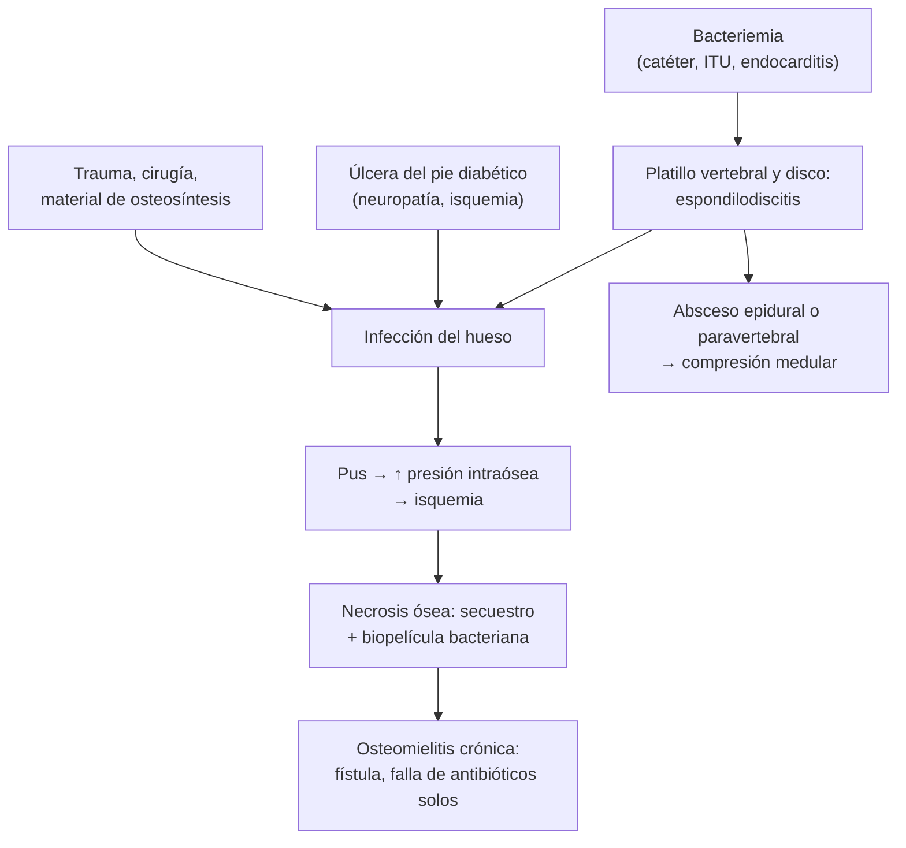

---
tags:
  - Infectología
  - Frecuente en sala
---

# Osteomielitis

**Subespecialidad**
Infectología · Traumatología · Medicina interna

**Guías principales**
Guía IDSA 2015 de osteomielitis vertebral nativa (*Clin Infect Dis*) · Guía IWGDF/IDSA 2023 de infecciones del pie en la diabetes (*Clin Infect Dis*)

**Otras fuentes**
Ensayo OVIVA de antibióticos orales frente a intravenosos (*N Engl J Med* 2019) · Ensayo de 6 frente a 12 semanas en osteomielitis vertebral (*Lancet* 2015) · Revisión de imágenes de la espondilodiscitis (*Microorganisms* 2024) · Seminario del *Lancet* 2004 · Series chilenas de espondilodiscitis (*Rev Med Chil* 2003, *Rev Chilena Infectol* 2016)

**GES**
No como tal. El GES de diabetes mellitus tipo 2 incluye la curación avanzada de las úlceras del pie diabético.

**EUNACOM**
1.04.1.021 Osteomielitis (sospecha, inicial, derivar)

**Revisado**
Octubre 2026

!!! abstract "Resumen en 60 segundos"
    - **Osteomielitis**: infección del hueso, casi siempre **bacteriana**. El agente más frecuente es ***Staphylococcus aureus***.
    - **Tres mecanismos**:
        - **Hematógena**: en el adulto, sobre todo **vertebral** (espondilodiscitis).
        - **Por contigüidad o inoculación directa**: fracturas expuestas, cirugía, prótesis, úlceras por presión.
        - **Con insuficiencia vascular o neuropatía**: **pie diabético**.
    - **Sospechar** ante:
        - Dolor de espalda nuevo, constante y nocturno con fiebre o VHS/PCR altas.
        - Úlcera del pie diabético profunda o que no cicatriza, sobre todo si la **sonda toca el hueso**.
        - Fístula sobre un hueso o material de osteosíntesis.
    - **Estudio**: **hemocultivos**, VHS/PCR y **RM** (el examen de imagen de elección). La radiografía es normal en las primeras 2 semanas.
    - **La biopsia ósea con cultivo** es el estándar diagnóstico. En el paciente estable, **tomar las muestras antes de dar antibióticos**.
    - **Tratamiento**: antibiótico dirigido por **6 semanas** (osteomielitis vertebral y pie diabético sin resección), **cirugía** si hay hueso necrótico, absceso o déficit neurológico, y **paso precoz a la vía oral** (OVIVA).
    - **Derivar** a infectología y traumatología. **Urgencia**: sepsis, déficit neurológico o absceso epidural.

## Definición

- **Osteomielitis**: inflamación del hueso y la médula ósea causada por una **infección**, casi siempre bacteriana.
- **Espondilodiscitis** u **osteomielitis vertebral**: infección del **disco intervertebral** y de los **cuerpos vertebrales adyacentes**. Es la forma hematógena más frecuente del adulto.
- **Osteomielitis aguda**: evolución de **días a semanas**, sin hueso necrótico.
- **Osteomielitis crónica**: evolución de **meses**, con **secuestro** (hueso necrótico desvitalizado), **involucro** (hueso nuevo reactivo) y a menudo **fístula**. No se cura solo con antibióticos.
- **Osteomielitis del pie diabético**: infección ósea secundaria a una úlcera del pie en una persona con diabetes; casi siempre por contigüidad.

## Epidemiología

### Mundial

- **Osteomielitis vertebral**: su incidencia aumenta con el envejecimiento de la población.
    - En Dinamarca (Kehrer 2014), la incidencia de espondilodiscitis piógena subió de **2,2 a 5,8 por 100.000 personas-año** entre 1995 y 2008.
    - Edad mediana de **67 años**. *S. aureus* causó el **55 %** de los casos.
    - La incidencia es mucho mayor en los **mayores de 70 años**.
- **Pie diabético**: la osteomielitis es frecuente en las úlceras **profundas** y en las infecciones **moderadas y graves**. Es una causa importante de **amputación**.
- **Osteomielitis postraumática**: complica las **fracturas expuestas** y la cirugía ortopédica con material de osteosíntesis.
- **Hematógena de huesos largos**: predomina en **niños** (metáfisis).

### Chile

!!! chile "Datos nacionales"
    - **Fica 2003** (Hospital Clínico de la Universidad de Chile, 1989–2002; 25 casos de espondilodiscitis):
        - **Tuberculosis** fue la primera causa (**36 %**), seguida de ***S. aureus*** (20 %).
        - **44 %** tuvo complicaciones neurológicas. La evolución antes del ingreso fue de **4,3 meses** en promedio.
    - **Soto 2016** (hospital general chileno; 37 casos en 8 años):
        - Edad media de **67 años**; **65 %** eran adultos mayores, **35 %** tenían diabetes.
        - **Cocos grampositivos** (sobre todo *S. aureus*) en el **71 %** de los casos con agente identificado; *M. tuberculosis* en solo el **11 %**.
        - **VHS elevada en el 89 %**. La **RM** siempre confirmó el diagnóstico.
        - Estadía hospitalaria promedio de **39 días**; **secuelas motoras en el 19 %**.
    - En Chile la **tuberculosis** sigue siendo una causa a considerar, sobre todo con evolución larga, compromiso torácico o abscesos fríos (ver [tuberculosis](../respiratorio/tuberculosis.md)).
    - **Brucelosis**: poco frecuente en Chile, pero hay evidencia serológica de infección por *Brucella canis* en el sur del país (Fica 2025). Preguntar por contacto con animales y por lácteos no pasteurizados.
    - **Pie diabético**: el **GES de diabetes tipo 2** cubre la curación avanzada de las heridas del pie diabético (ver [complicaciones crónicas de la diabetes](../endocrinologia/complicaciones-cronicas-de-la-diabetes.md)).

## Etiología y factores de riesgo

| Contexto | Agentes más frecuentes |
|---|---|
| **Hematógena (vertebral)** | ***S. aureus*** (el más frecuente), estreptococos, **bacilos gramnegativos** (*E. coli*, tras una ITU o un foco digestivo), *M. tuberculosis*, *Brucella* |
| **Pie diabético** | **Polimicrobiana**: *S. aureus*, estreptococos, enterobacterias, *Pseudomonas*, anaerobios (en la isquemia y la necrosis) |
| **Postraumática o posquirúrgica** | *S. aureus*, **estafilococos coagulasa negativos** (con material de osteosíntesis), bacilos gramnegativos |
| **Usuarios de drogas intravenosas** | *S. aureus*, ***Pseudomonas aeruginosa***; articulaciones esternoclaviculares y sacroilíacas |
| **Herida punzante del pie a través de la zapatilla** | ***Pseudomonas aeruginosa*** |
| **Anemia de células falciformes** | ***Salmonella*** y *S. aureus* |
| **Mordedura de perro o gato** | ***Pasteurella multocida***, anaerobios |
| **Inmunosuprimidos** | Hongos (*Candida*, *Aspergillus*), micobacterias atípicas, *Bartonella* |

- **Factores de riesgo de osteomielitis vertebral**:
    - **Bacteriemia** reciente (endocarditis, catéter venoso, ITU, hemodiálisis).
    - **Diabetes**, edad avanzada, inmunosupresión, uso de drogas intravenosas.
    - Cirugía o procedimientos de columna recientes.
- **Factores de riesgo de osteomielitis en el pie diabético**:
    - Úlcera **profunda**, de **más de 30 días**, **recurrente** o de origen **traumático**.
    - **Enfermedad arterial periférica** y **neuropatía**.
    - Úlcera sobre una prominencia ósea.

## Fisiopatología

- **Vía hematógena**: las bacterias llegan por la sangre a un hueso con mucho flujo y circulación lenta.
    - En el **niño**, la **metáfisis** de los huesos largos.
    - En el **adulto**, el **platillo vertebral**: la arteria segmentaria irriga dos platillos vecinos, por eso la infección compromete **dos vértebras y el disco** entre ellas.
- **Inflamación y necrosis**: el pus aumenta la presión dentro del hueso, comprime los vasos y produce **isquemia** y **necrosis**.
    - El hueso muerto forma el **secuestro**.
    - El periostio forma hueso nuevo alrededor: el **involucro**.
- **Biopelícula (biofilm)**: *S. aureus* y los estafilococos coagulasa negativos se adhieren al hueso necrótico y al **material ortopédico**.
    - Allí son **resistentes a los antibióticos** y a las defensas.
    - Por eso la osteomielitis crónica y la asociada a material necesitan **cirugía**.
- **Diseminación local**: en la columna, el pus puede formar un **absceso epidural** (compresión medular) o **paravertebral** (absceso del psoas).

*Figura 1. Mecanismos de la osteomielitis y su evolución a la cronicidad. Esquema propio basado en Lew y Waldvogel 2004 y en la guía IDSA 2015.*

## Clasificación

| Clasificación | Categorías | Utilidad |
|---|---|---|
| **Por mecanismo (Waldvogel)** | **Hematógena** · por **contigüidad o inoculación directa** · asociada a **insuficiencia vascular** (pie diabético) | Orienta el agente y el estudio |
| **Por evolución** | **Aguda** (días a semanas, sin secuestro) · **crónica** (meses, con secuestro y fístula) | La crónica requiere cirugía |
| **Por localización** | Vertebral, huesos largos, pie, pelvis, esternón, cráneo y mandíbula | Orienta la imagen y la cirugía |
| **Cierny-Mader** (huesos largos) | **Tipo anatómico**: I medular, II superficial, III localizada, IV difusa · **Huésped**: A sano, B comprometido (local o sistémico), C el tratamiento es peor que la enfermedad | La usa el traumatólogo para decidir la cirugía |
| **Material ortopédico** | Infección de **prótesis articular** o de **osteosíntesis** (precoz o tardía) | Manejo especializado; ver [artritis séptica](../reumatologia/monoartritis-gota-artritis-septica.md) |

## Clínica

- **Osteomielitis vertebral (espondilodiscitis)**:
    - **Dolor de espalda o cuello** nuevo, **constante**, que **no cede con el reposo** y empeora en la noche. Es el síntoma principal.
    - **Fiebre**: **ausente en una parte importante** de los pacientes. Su ausencia no descarta la infección.
    - **Sensibilidad a la percusión** de las apófisis espinosas.
    - **Déficit neurológico** (debilidad, alteración sensitiva, retención urinaria): sugiere **absceso epidural**. Es una urgencia.
    - **Lumbar** la más frecuente, luego torácica y cervical. La **TBC** compromete más la columna **torácica** (mal de Pott) y forma abscesos fríos.
    - Diagnóstico **tardío** frecuente: se confunde con un lumbago mecánico (ver [lumbago](../reumatologia/lumbago-lumbociatica-y-cervicalgia.md)).
- **Osteomielitis del pie diabético**:
    - Úlcera **profunda** (más de 2 cm²), **crónica**, con **hueso visible o palpable**.
    - **Dedo en salchicha**: dedo rojo, aumentado de volumen, sin la forma normal.
    - A menudo **sin dolor** (neuropatía) y **sin fiebre**.
- **Osteomielitis aguda de huesos largos**: dolor localizado, calor, aumento de volumen, impotencia funcional y fiebre.
- **Osteomielitis crónica**: **fístula** con secreción intermitente, dolor sordo y episodios de reagudización. Puede haber secuestro visible en la radiografía.
- **Postraumática**: herida que no cicatriza, secreción, dehiscencia o **falta de consolidación** de una fractura.

## Diagnóstico

!!! guia "Pasos del diagnóstico (IDSA 2015 e IWGDF/IDSA 2023)"
    1. **Sospecha clínica**: dolor óseo localizado con marcadores inflamatorios altos, o una úlcera que llega al hueso.
    2. **Hemocultivos** (2 sets) y **VHS/PCR** en todos.
    3. **Imagen**: **RM** (de elección). En el pie diabético, primero **radiografía**.
    4. **Microbiología**:
        - En la osteomielitis vertebral con **hemocultivos positivos** para ***S. aureus***, ***S. lugdunensis*** o serología positiva para ***Brucella***, **no** se necesita biopsia.
        - Si los hemocultivos son negativos: **biopsia por punción guiada por TC** (cultivo aeróbico, anaeróbico, de hongos y micobacterias, e histología).
        - Si la primera biopsia es negativa: repetir la punción o hacer una biopsia quirúrgica.
    5. **Antibióticos**: en el paciente **estable y sin déficit neurológico**, **esperar los cultivos** antes de iniciarlos. Si recibió antibióticos, idealmente suspenderlos 1–2 semanas antes de la biopsia.

- **Pie diabético** (IWGDF/IDSA 2023):
    - **Sonda que toca el hueso** (*probe-to-bone*) + **VHS alta** + **radiografía** sugerente: la combinación hace muy probable el diagnóstico.
    - **VHS > 70 mm/h** apoya el diagnóstico.
    - **Biopsia ósea** (percutánea o quirúrgica, a través de piel sana) para el cultivo cuando hay **duda diagnóstica** o para **elegir el antibiótico**.
    - **No** usar el cultivo de hisopado superficial: refleja la colonización.
- **Crónica o postraumática**: el diagnóstico se confirma con **cultivos óseos intraoperatorios** (varias muestras) e histología. El cultivo del **trayecto fistuloso** no es confiable (salvo para *S. aureus*).

<figure markdown>
{ loading=lazy }
<figcaption>Figura 2. Enfoque de la sospecha de osteomielitis según el contexto clínico. Esquema propio basado en la guía IDSA 2015 de osteomielitis vertebral, la guía IWGDF/IDSA 2023 del pie diabético y el ensayo OVIVA (2019).</figcaption>
</figure>

## Laboratorio

| Examen | Interpretación |
|---|---|
| **VHS y PCR** | Elevadas en la gran mayoría; útiles para el **seguimiento**. Una VHS normal hace menos probable la osteomielitis vertebral, pero no la descarta |
| **Hemograma** | Leucocitosis **inconstante**; puede ser normal, sobre todo en la crónica. Anemia de enfermedad crónica |
| **Hemocultivos** (2 sets) | **Obligatorios** en la sospecha de osteomielitis vertebral. Si son positivos para *S. aureus*: buscar **endocarditis** (ecocardiograma) |
| **Biopsia ósea** | **Estándar diagnóstico**: cultivo (aerobios, anaerobios, hongos, micobacterias) e histología (inflamación, necrosis, granulomas) |
| **Serología de *Brucella*** | Si hay exposición a animales o lácteos no pasteurizados |
| **IGRA o PPD**, baciloscopía y cultivo de Koch de la biopsia | Si se sospecha **TBC** (evolución larga, columna torácica, absceso frío, epidemiología) |
| **Glicemia, HbA1c, creatinina** | Comorbilidades y ajuste de los antibióticos |
| **Urocultivo** | Si hay síntomas urinarios (foco de bacteriemia por gramnegativos) |

## Imágenes

| Examen | Utilidad | Limitaciones |
|---|---|---|
| **Radiografía** | Primer examen en el pie y en los huesos largos. Muestra osteopenia, erosión cortical, reacción perióstica, **secuestro** y gas | **Normal en las primeras 2 semanas** (necesita una pérdida importante de hueso). Repetir en 2–4 semanas si es normal |
| **RM con gadolinio** | **Examen de elección**: alta sensibilidad precoz. Muestra edema óseo, compromiso del disco y **abscesos epidurales y paravertebrales** | Difícil con material metálico; los cambios persisten semanas pese a la mejoría |
| **TC** | Secuestros, destrucción cortical; **guía la biopsia** percutánea | Menos sensible que la RM al inicio |
| **PET-TC con FDG** | Alternativa si no se puede hacer RM o hay material ortopédico; útil en la fiebre sin foco | Disponibilidad y costo |
| **Cintigrafía ósea de tres fases** | Sensible, poco específica (positiva en fracturas, cirugía, Charcot) | Hoy casi reemplazada por la RM |
| **Ecocardiograma** | Si hay bacteriemia por *S. aureus*, estreptococos o enterococos: descartar **endocarditis** (ver [endocarditis](endocarditis-infecciosa.md)) | — |

<figure markdown>
{ loading=lazy }
<figcaption>Figura 3. Espondilodiscitis piógena L2-L3 en la RM sagital ponderada en T1 sin contraste (A) y con gadolinio (B), en un hombre de 54 años. Se ven la alteración completa de la señal del disco, las erosiones de los platillos vertebrales y la captación difusa de contraste de los cuerpos vertebrales (flechas). Tomada de Crombé A, Fadli D, Clinca R, et al. <em>Imaging of Spondylodiscitis: A Comprehensive Updated Review—Multimodality Imaging Findings, Differential Diagnosis, and Specific Microorganisms Detection.</em> Microorganisms. 2024;12(5):893 (figura 4). Licencia CC BY 4.0.</figcaption>
</figure>

## Diagnóstico diferencial

| Diagnóstico | Diferencias |
|---|---|
| **Lumbago mecánico o hernia del núcleo pulposo** | Dolor que cede con el reposo, sin fiebre, VHS/PCR normales; RM sin edema del disco ni de los platillos |
| **Discopatía degenerativa (Modic tipo 1)** | Edema de los platillos en la RM, pero el disco **no** capta contraste ni hay colecciones; marcadores normales |
| **Metástasis vertebrales y mieloma** | **Respetan el disco**; compromiso del pedículo; antecedente de cáncer, baja de peso (ver [mieloma](../hematologia/gammapatias-monoclonales-y-mieloma-multiple.md)) |
| **Fractura osteoporótica** | Antecedente de trauma menor; sin fiebre; disco conservado (ver [osteoporosis](../endocrinologia/osteoporosis.md)) |
| **Espondiloartritis (lesión de Andersson)** | Dolor inflamatorio de larga data, sacroileítis, HLA-B27 |
| **Pie de Charcot agudo** | Pie rojo y caliente **sin úlcera**; mejora con la elevación; compromiso del medio pie más que de los dedos |
| **Celulitis o absceso de partes blandas** | La sonda no toca el hueso; RM sin edema óseo (ver [piel y partes blandas](infecciones-piel-partes-blandas.md)) |
| **Gota, artritis séptica** | Compromiso articular; análisis del líquido sinovial (ver [monoartritis](../reumatologia/monoartritis-gota-artritis-septica.md)) |
| **Tumores óseos primarios** (osteosarcoma, sarcoma de Ewing) | Masa, reacción perióstica agresiva; biopsia |
| **Osteomielitis crónica no bacteriana** | Cultivos negativos repetidos; lesiones multifocales; esternoclavicular |

## Tratamiento

### Principios

- **Muestras antes del antibiótico** en el paciente estable: aumenta mucho la probabilidad de identificar el agente y de dar el antibiótico correcto.
- **Antibiótico empírico inmediato** (tras los hemocultivos) si hay **sepsis**, **shock** o **déficit neurológico**.
- **Duración**:
    - **Osteomielitis vertebral**: **6 semanas** de antibiótico dirigido. El ensayo de Bernard (2015) mostró que 6 semanas no es inferior a 12 (curación de **90,9 %** en ambos grupos).
    - Considerar un tratamiento más largo con **abscesos no drenados**, **SAMR** o **material** de osteosíntesis.
    - **Pie diabético sin resección del hueso**: **6 semanas**. **Tras la resección o amputación menor** con bordes óseos sanos: **3 semanas** (IWGDF/IDSA 2023).
    - **Osteomielitis aguda de huesos largos**: alrededor de **6 semanas**. Crónica: cirugía + 6 semanas o más según el especialista.
- **Vía oral precoz**: el ensayo **OVIVA** (2019; 1.054 adultos con infección ósea o articular) mostró que los antibióticos **orales** durante las primeras 6 semanas **no son inferiores** a los intravenosos (falla de 13,2 % frente a 14,6 % al año).
    - Usar fármacos con **buena biodisponibilidad ósea**, en un paciente **estable** y con buena absorción digestiva.
    - Evita las complicaciones del catéter y acorta la hospitalización.
- **Cirugía**:
    - **Columna**: déficit neurológico progresivo, **absceso epidural** con compresión, inestabilidad o deformidad, falla del tratamiento médico.
    - **Huesos largos**: desbridamiento del hueso necrótico (**secuestrectomía**), manejo del espacio muerto, estabilización.
    - **Pie diabético**: resección del hueso infectado o amputación menor, drenaje de abscesos, **revascularización** si hay isquemia.
    - **Material ortopédico**: según el tiempo de evolución, retención con desbridamiento o retiro del material.
- **Medidas generales**: control de la **glicemia**, **descarga** del pie, nutrición, analgesia, kinesiología.

### Antibióticos

!!! dosis "Esquemas habituales en el adulto con función renal normal (ajustar según el cultivo y la función renal; decidir con infectología)"
    **Empírico con sepsis o déficit neurológico** (tras los hemocultivos):

    - **Vancomicina** 15–20 mg/kg IV cada 8–12 h (ajustar según niveles) **+ ceftriaxona** 2 g IV cada 24 h.
    - Si hay riesgo de *Pseudomonas* (pie diabético grave, hospitalización reciente, usuario de drogas intravenosas): **cefepime** 2 g IV cada 8 h o **piperacilina/tazobactam** 4,5 g IV cada 6–8 h en lugar de la ceftriaxona.

    **Dirigido por el agente**:

    | Agente | Intravenoso | Oral (paso precoz) |
    |---|---|---|
    | ***S. aureus* sensible a meticilina** | **Cefazolina** 2 g IV cada 8 h o **cloxacilina** 2 g IV cada 4–6 h | **Levofloxacino** 750 mg/día o **ciprofloxacino** 750 mg cada 12 h, **+ rifampicina** 600 mg/día; o **cotrimoxazol** forte 2 comprimidos cada 12 h; o **clindamicina** 600 mg cada 8 h (si es sensible) |
    | ***S. aureus* resistente a meticilina** | **Vancomicina** 15–20 mg/kg IV cada 8–12 h (según niveles) o **daptomicina** 6–8 mg/kg/día | **Cotrimoxazol** o **linezolid** 600 mg cada 12 h (vigilar hemograma y neuropatía) ± **rifampicina** |
    | **Estreptococos** | **Ceftriaxona** 2 g IV cada 24 h o penicilina G | **Amoxicilina** 1 g cada 8 h |
    | **Enterobacterias** | **Ceftriaxona** 2 g IV cada 24 h | **Ciprofloxacino** 750 mg cada 12 h |
    | ***Pseudomonas aeruginosa*** | **Cefepime** 2 g IV cada 8 h o **piperacilina/tazobactam** | **Ciprofloxacino** 750 mg cada 12 h |
    | **Pie diabético polimicrobiano** | **Ampicilina/sulbactam** 3 g IV cada 6 h (o según gravedad y cultivos) | **Amoxicilina/ácido clavulánico** 875/125 mg cada 8–12 h ± ciprofloxacino |
    | ***M. tuberculosis*** | — | Esquema antituberculoso de **9–12 meses** (ver [tuberculosis](../respiratorio/tuberculosis.md)) |
    | ***Brucella*** | — | **Doxiciclina** 100 mg cada 12 h **+ rifampicina** 600–900 mg/día (o + estreptomicina o gentamicina), por **≥ 12 semanas** en la espondilitis |

    - La **rifampicina** se usa **siempre combinada** (nunca sola, por resistencia rápida). Es útil contra la biopelícula del material ortopédico. Revisar **interacciones**.
    - Las **quinolonas** aumentan el riesgo de **tendinopatía**, prolongación del QT y diarrea por *C. difficile*.

!!! alarma "Derivar u hospitalizar de urgencia"
    - **Déficit neurológico**, retención urinaria o dolor radicular progresivo con sospecha de **absceso epidural**: **RM urgente** y **neurocirugía**.
    - **Sepsis** o shock séptico (ver [sepsis](sepsis-y-shock-septico.md)).
    - **Pie diabético** con infección **grave**: gas en los tejidos, necrosis, isquemia crítica, fascitis.
    - **Bacteriemia por *S. aureus***: hospitalizar, buscar endocarditis y otros focos.
    - **Fractura expuesta**: antibiótico precoz y aseo quirúrgico.
    - Toda osteomielitis confirmada o probable: **derivar** a infectología y traumatología (o neurocirugía, en la columna).

## Complicaciones

- **Absceso epidural**: compresión medular con **paraplejia** o cuadriplejia; necesita cirugía urgente.
- **Absceso paravertebral o del psoas**: fiebre persistente, dolor a la flexión de la cadera.
- **Inestabilidad y deformidad** de la columna (cifosis, colapso vertebral).
- **Bacteriemia, endocarditis y sepsis**.
- **Osteomielitis crónica**: fístula, recaídas, **fracturas patológicas**, falta de consolidación.
- **Carcinoma escamoso** en el trayecto de una fístula crónica (**úlcera de Marjolin**), raro y tardío.
- **Amiloidosis AA** en la osteomielitis crónica de muchos años.
- **Amputación** en el pie diabético.
- **Efectos adversos de los antibióticos** prolongados: diarrea por *C. difficile*, mielotoxicidad (linezolid), nefrotoxicidad (vancomicina), complicaciones del catéter.

## Pronóstico y seguimiento

- **Osteomielitis vertebral**: la mayoría se cura con 6 semanas de antibiótico, pero las **secuelas** son frecuentes.
    - En Chile: **secuelas motoras en el 19 %** (Soto 2016); **8 %** de mortalidad en los casos por *S. aureus* de la serie de Fica 2003.
    - Tiene **mayor mortalidad** a corto y largo plazo que la población general (Kehrer 2015).
- **Pie diabético**: alto riesgo de **recurrencia** de la úlcera, nueva amputación y mortalidad a mediano plazo.
- **Osteomielitis crónica**: recaídas incluso años después; por eso se habla de **remisión** más que de curación.
- **Seguimiento** (IDSA 2015):
    - Evaluar la **clínica** (dolor, fiebre, función neurológica) y la **VHS/PCR** a las **4 semanas** de tratamiento.
    - **No** repetir la RM de rutina si el paciente mejora: los cambios persisten aunque la infección esté controlada.
    - Repetir la RM si **empeora** (dolor, fiebre, déficit) o si los marcadores no bajan: buscar absceso o falla del tratamiento.
    - Controles clínicos tras terminar el antibiótico para detectar la **recaída**.

## Perlas para el internado

!!! perla "Para recordar en la sala"
    - **Dolor de espalda + fiebre o VHS alta**, sobre todo en un **diabético**, **hemodializado**, **adulto mayor** o paciente con **bacteriemia reciente**: es una espondilodiscitis hasta demostrar lo contrario. Pedir **RM**.
    - La **ausencia de fiebre no descarta** una osteomielitis.
    - **Hemocultivos siempre**. Si salen con *S. aureus*: no se necesita biopsia, pero **sí ecocardiograma**.
    - En el paciente estable, **no dar antibióticos antes de la biopsia**: "tratar a ciegas por 6 semanas" es la peor opción.
    - **Úlcera del pie diabético + sonda que toca el hueso = osteomielitis** hasta demostrar lo contrario.
    - La **radiografía normal** no descarta la osteomielitis aguda: repetir en 2–4 semanas o pedir RM.
    - **Déficit neurológico** en una espondilodiscitis es una **urgencia neuroquirúrgica**.
    - En Chile, pensar en **TBC** en la espondilodiscitis de evolución larga, torácica o con abscesos fríos.
    - **6 semanas** es la duración clave; la **vía oral** es tan buena como la intravenosa si el fármaco es adecuado.

## Preguntas de repaso

??? repaso "1. Hombre de 68 años, diabético y en hemodiálisis por catéter, consulta por dolor lumbar de 3 semanas, constante, que lo despierta en la noche. Temperatura de 37,6 °C, dolor a la percusión de L3. VHS de 95 mm/h y PCR de 110 mg/L. ¿Qué sospecha y cómo lo estudia?"
    - **Espondilodiscitis** (osteomielitis vertebral hematógena), probablemente por ***S. aureus*** desde el catéter.
    - **2 hemocultivos** y **RM de columna lumbar con gadolinio**.
    - Si los hemocultivos son positivos para *S. aureus*: no necesita biopsia; pedir **ecocardiograma** y evaluar el catéter.
    - Si son negativos y está estable: **biopsia guiada por TC** antes de iniciar antibióticos.

??? repaso "2. El mismo paciente presenta, al día siguiente, debilidad de ambas piernas y retención urinaria. ¿Qué hace?"
    - Sospecha de **absceso epidural** con **compresión medular**.
    - **RM urgente** (si no se hizo), **evaluación neuroquirúrgica inmediata** para descompresión y drenaje.
    - **Hemocultivos** y **antibiótico empírico de inmediato**: vancomicina + ceftriaxona (no esperar la biopsia en este caso).

??? repaso "3. Mujer de 62 años con diabetes tipo 2 tiene una úlcera plantar bajo la cabeza del primer metatarsiano desde hace 2 meses. Con una sonda estéril se toca hueso. No tiene fiebre ni celulitis. VHS de 78 mm/h. ¿Cuál es el diagnóstico más probable y cómo sigue?"
    - **Osteomielitis del pie diabético**: sonda que toca el hueso + VHS > 70 mm/h.
    - **Radiografía del pie** (y RM si hay duda).
    - **Biopsia ósea** para el cultivo (no hisopado superficial), evaluación de la **perfusión** (índice tobillo-brazo) y **descarga** del pie.
    - Tratamiento: antibiótico dirigido por **6 semanas** si no se reseca el hueso, o **3 semanas** tras la resección con bordes limpios. Derivar al equipo de pie diabético.

??? repaso "4. Hombre de 45 años con fractura expuesta de tibia operada hace 2 años presenta una fístula con secreción intermitente en la cicatriz. La radiografía muestra un fragmento óseo denso y desvitalizado. ¿Qué tiene y cuál es el tratamiento?"
    - **Osteomielitis crónica postraumática** con **secuestro**.
    - Los antibióticos solos **no** la curan: necesita **cirugía** (desbridamiento y secuestrectomía, manejo del material) con **cultivos óseos intraoperatorios**, más antibiótico dirigido.
    - No basarse en el cultivo del trayecto fistuloso. Derivar a traumatología.

??? repaso "5. Un paciente con osteomielitis vertebral por *S. aureus* sensible a meticilina lleva 10 días con cefazolina IV. Está afebril, con menos dolor, la PCR bajó de 150 a 40 mg/L y tolera la vía oral. ¿Qué opciones tiene?"
    - Puede pasar a **antibiótico oral** con buena biodisponibilidad (ensayo **OVIVA**): por ejemplo **levofloxacino + rifampicina**, o **cotrimoxazol** según la sensibilidad.
    - Completar **6 semanas** en total (Bernard 2015).
    - Seguimiento con **clínica y VHS/PCR**; **no** repetir la RM de rutina si mejora.

??? repaso "6. Mujer de 50 años, de zona rural, con dolor dorsal de 4 meses, baja de peso y sudoración nocturna. La RM muestra compromiso de T8-T9 con un gran absceso paravertebral de paredes finas. Los hemocultivos son negativos. ¿Qué causas sospecha y qué pide?"
    - **Espondilitis tuberculosa** (mal de Pott): evolución larga, columna torácica, absceso frío.
    - También **brucelosis** si hay contacto con animales o lácteos no pasteurizados.
    - **Biopsia guiada por TC** con baciloscopía, cultivo y PCR para micobacterias, histología (granulomas), cultivo corriente; **serología de *Brucella***; IGRA o PPD; radiografía de tórax.

## Referencias

1. Berbari EF, Kanj SS, Kowalski TJ, et al. 2015 Infectious Diseases Society of America (IDSA) Clinical Practice Guidelines for the Diagnosis and Treatment of Native Vertebral Osteomyelitis in Adults. *Clin Infect Dis.* 2015;61(6):e26–e46. doi:[10.1093/cid/civ482](https://doi.org/10.1093/cid/civ482)
2. Senneville É, Albalawi Z, van Asten SA, et al. IWGDF/IDSA Guidelines on the Diagnosis and Treatment of Diabetes-related Foot Infections (IWGDF/IDSA 2023). *Clin Infect Dis.* 2023. doi:[10.1093/cid/ciad527](https://doi.org/10.1093/cid/ciad527)
3. Li HK, Rombach I, Zambellas R, et al. Oral versus Intravenous Antibiotics for Bone and Joint Infection. *N Engl J Med.* 2019;380(5):425–436. doi:[10.1056/NEJMoa1710926](https://doi.org/10.1056/NEJMoa1710926)
4. Bernard L, Dinh A, Ghout I, et al. Antibiotic treatment for 6 weeks versus 12 weeks in patients with pyogenic vertebral osteomyelitis: an open-label, non-inferiority, randomised, controlled trial. *Lancet.* 2015;385(9971):875–882. doi:[10.1016/S0140-6736(14)61233-2](https://doi.org/10.1016/S0140-6736(14)61233-2)
5. Lew DP, Waldvogel FA. Osteomyelitis. *Lancet.* 2004;364(9431):369–379. doi:[10.1016/S0140-6736(04)16727-5](https://doi.org/10.1016/S0140-6736(04)16727-5)
6. Crombé A, Fadli D, Clinca R, et al. Imaging of Spondylodiscitis: A Comprehensive Updated Review—Multimodality Imaging Findings, Differential Diagnosis, and Specific Microorganisms Detection. *Microorganisms.* 2024;12(5):893. doi:[10.3390/microorganisms12050893](https://doi.org/10.3390/microorganisms12050893)
7. Kehrer M, Pedersen C, Jensen TG, et al. Increasing incidence of pyogenic spondylodiscitis: a 14-year population-based study. *J Infect.* 2014;68(4):313–320. doi:[10.1016/j.jinf.2013.11.011](https://doi.org/10.1016/j.jinf.2013.11.011)
8. Kehrer M, Pedersen C, Jensen TG, et al. Increased short- and long-term mortality among patients with infectious spondylodiscitis compared with a reference population. *Spine J.* 2015;15(6):1233–1240. doi:[10.1016/j.spinee.2015.02.021](https://doi.org/10.1016/j.spinee.2015.02.021)
9. Fica A, Bozán F, Aristegui M, et al. Espondilodiscitis. Análisis de una serie de 25 casos. *Rev Med Chil.* 2003;131(5):473–482. [PubMed](https://pubmed.ncbi.nlm.nih.gov/12879807/)
10. Soto A, Fica A, Dabanch J, et al. Espondilodiscitis: experiencia clínica en un hospital general de Chile. *Rev Chilena Infectol.* 2016;33(3):322–330. doi:[10.4067/S0716-10182016000300013](https://doi.org/10.4067/S0716-10182016000300013)
11. Fica A, Pinos Y, Delama I, et al. Serologic Evidence of Zoonotic Infections by *Brucella canis* in Southern Chile: A Neglected Emerging Disease. *Rev Med Chil.* 2025;153(10):695–707. doi:[10.4067/s0034-98872025001000695](https://doi.org/10.4067/s0034-98872025001000695)
