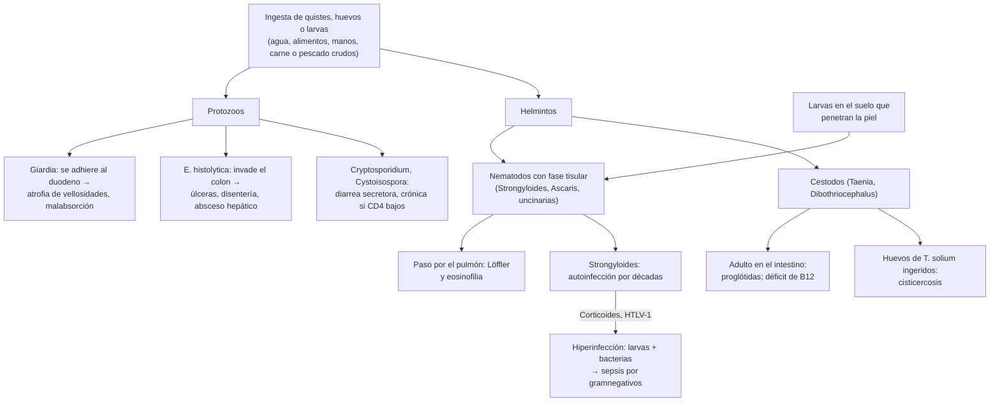
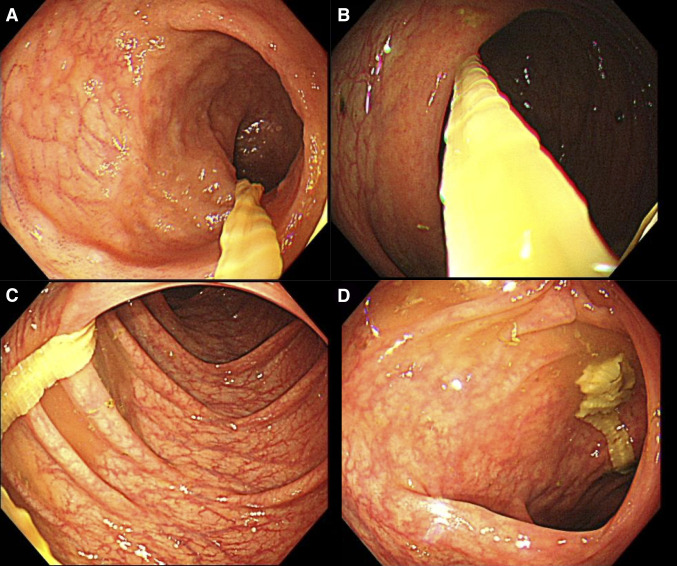

---
tags:
  - Infectología
  - Gastroenterología
---

# Parasitosis intestinales

**Subespecialidad**
Infectología · Gastroenterología · Parasitología · Atención primaria

**Guías principales**
CDC: atención clínica de giardiasis, amebiasis, oxiuriasis, geohelmintos, estrongiloidiasis, teniasis, difilobotriasis, himenolepiasis, ciclosporiasis y *Blastocystis* (2024–2025) · OMS 2017: quimioterapia preventiva de los geohelmintos · IDSA 2017: diarrea infecciosa

**Otras fuentes**
Revisión de la amebiasis (Shirley 2018) · Giardiasis refractaria a nitroimidazoles (Boté-Casamitjana 2026) · Revisión de *Lancet* sobre geohelmintos (Jourdan 2018) · Enteroparasitosis en Talca 1980–2008 (Vidal 2010) · Parasitosis en Los Ríos 2022–2023 (Sanhueza Teneo 2025)

**GES**
No es GES. La **cisticercosis** se notifica dentro de 24 horas (Decreto 7 de 2019 del MINSAL).

**EUNACOM**
1.04.1.022 y 1.06.1.026 Parasitosis intestinales (específico, completo, completo)

**Revisado**
Octubre 2026

!!! abstract "Resumen en 60 segundos"
    - **Dos grandes grupos**:
        - **Protozoos** (unicelulares, se multiplican en el intestino): ***Giardia***, ***Entamoeba histolytica***, *Cryptosporidium*, *Cyclospora*, *Cystoisospora* y *Blastocystis* (patogenicidad discutida).
        - **Helmintos** (gusanos, no se multiplican en el intestino salvo excepciones): nematodos (***Enterobius***, *Ascaris*, *Trichuris*, ***Strongyloides***, uncinarias) y cestodos (***Taenia***, ***Dibothriocephalus***, *Hymenolepis*).
    - **Transmisión**: **fecal-oral** (agua, alimentos, manos), **carne o pescado crudos** (cestodos) o **la piel desnuda en suelos contaminados** (*Strongyloides*, uncinarias).
    - **Chile**:
        - Los patógenos clásicos bajaron mucho con el saneamiento: en Talca, de **9,8 % a 2,5 %** entre 1980 y 2008.
        - ***Blastocystis*** es el más encontrado.
        - Hay **oxiuros** en niños y **giardiasis**.
        - En el **sur**, la **difilobotriasis** viene del pescado de agua dulce o salmónidos crudos.
    - **Pistas clínicas**: diarrea con malabsorción (*Giardia*), disentería (*E. histolytica*), prurito anal nocturno (oxiuro), eliminación de proglótidas (*Taenia*, *Dibothriocephalus*), **eosinofilia** (helmintos con fase tisular, sobre todo ***Strongyloides***), anemia megaloblástica (*Dibothriocephalus*).
    - **Diagnóstico**:
        - **Parasitológico seriado** de deposiciones; **antígeno o PCR** para *Giardia*, *Cryptosporidium* y *E. histolytica*.
        - **Test de Graham** para el oxiuro.
        - **Serología** para *Strongyloides*.
    - **Tratamiento**:
        - *Giardia*: **tinidazol 2 g** en dosis única o **metronidazol**.
        - Amebiasis invasora: **metronidazol** y luego un **amebicida luminal**.
        - Oxiuro: **mebendazol o albendazol** y **repetir a las 2 semanas**, junto con los convivientes.
        - Geohelmintos: **albendazol**.
        - *Strongyloides*: **ivermectina**.
        - Cestodos: **praziquantel**.
    - **Antes de corticoides o inmunosupresión**: descartar ***Strongyloides*** (hiperinfección mortal).

## Definición

| Concepto | Definición |
|---|---|
| **Parasitosis intestinal** | Infección del tubo digestivo por **protozoos** o **helmintos**. Puede ser asintomática (portación) o causar diarrea, dolor, malabsorción, anemia o manifestaciones extraintestinales |
| **Protozoo** | Organismo **unicelular**; se **multiplica** en el huésped. Formas: **trofozoíto** (activa) y **quiste u ooquiste** (infectante, resistente al ambiente y al cloro) |
| **Helminto** | Gusano **multicelular**: **nematodos** (cilíndricos), **cestodos** (planos, segmentados) y trematodos. En general **no se multiplica** dentro del huésped: la carga depende de la exposición. Excepciones: ***Strongyloides*** e ***Hymenolepis nana*** (**autoinfección**) |
| **Comensal** | Protozoo sin poder patógeno demostrado (*Entamoeba coli*, *Endolimax nana*, *Iodamoeba*, *Chilomastix*). No se trata; indica **contaminación fecal** |
| **Hiperinfección por *Strongyloides*** | Aumento masivo de la autoinfección en un **inmunosuprimido** (corticoides, HTLV-1, trasplante), con larvas en el pulmón y otros órganos. Es una **urgencia** |
| **Geohelmintos** | Nematodos que maduran en el **suelo**: *Ascaris*, *Trichuris*, uncinarias y *Strongyloides* |

## Epidemiología

- **Mundial**:
    - **Más de un cuarto** de la población mundial está en riesgo de infección por **geohelmintos** (*Ascaris*, *Trichuris*, uncinarias, *Strongyloides*), sobre todo en zonas tropicales sin saneamiento.
    - La **amebiasis** es una de las principales causas de **diarrea grave** en los niños de países en desarrollo. En EE. UU. causa al menos **5 muertes al año**; se describe más en **hombres que tienen sexo con hombres**.
    - La **giardiasis** es una de las protozoosis intestinales más frecuentes del mundo. Aumenta la **giardiasis refractaria a nitroimidazoles**: en Londres, el **34 %** de los viajeros sin tratamiento previo, con mayor riesgo tras viajar a la **India**.
- **Grupos de riesgo**: niños (jardines infantiles, oxiuros, *Giardia*), **viajeros e inmigrantes** desde zonas endémicas, **inmunosuprimidos** (*Cryptosporidium*, *Cystoisospora*, *Strongyloides*), personas sin agua potable, contacto con animales, consumo de **carne o pescado crudos**.

!!! chile "Datos nacionales"
    - **Talca y la Región del Maule** (escolares y preescolares, 1980–2008):
        - Los **patógenos** clásicos (*Giardia*, *E. histolytica*, *Trichuris*, *Ascaris*, *Hymenolepis*, *Taenia*) bajaron de **9,8 % a 2,5 %**.
        - ***Blastocystis*** subió de **7,6 % a 72,9 %**.
        - El **poliparasitismo** cayó de 64,5 % a 9,6 %.
    - ***Blastocystis*** es la **parasitosis intestinal más frecuente de Chile**.
    - **Los Ríos** (zona rural, 2022–2023):
        - **39 %** de las personas tenía algún parásito, con subtipos **zoonóticos** de *Giardia* y *Blastocystis* compartidos con los perros.
        - El **28,2 %** tenía anticuerpos contra ***Toxocara canis***.
        - El *Blastocystis* se encontró en el **15 %** de las muestras de agua; el agua potable fue protectora.
    - **Niños hospitalizados por diarrea** (Santiago, 2015–2019, panel molecular): *Giardia* en el **3 %** y *Cryptosporidium* en el **1 %**. Predominan los virus.
    - **Difilobotriasis**:
        - Casos esporádicos en el **sur de Chile**, por comer pescado **de agua dulce o marino crudo** o poco cocido. Se identificaron *D. latum* y *D. pacificum*.
        - En la **Patagonia**, los **salmónidos** (truchas, salmones) son fuente de infección humana, lo que importa en el **sushi** y el **ceviche**.
    - **Anisakidosis**: casos por pescado crudo (merluza, congrio); la larva suele quedar en el estómago y se ve en la endoscopía.
    - **Cisticercosis**: notificación obligatoria dentro de 24 horas (Decreto 7 de 2019).

## Etiología

| Parásito | Transmisión | Localización y clínica clave |
|---|---|---|
| ***Giardia duodenalis*** (*lamblia*) | Quistes en **agua** (resisten el cloro), alimentos, persona a persona (jardines infantiles, sexo oral-anal), zoonosis | **Duodeno y yeyuno**: diarrea acuosa o grasosa, **distensión**, flatulencia, **malabsorción**, baja de peso, **intolerancia a la lactosa** posterior |
| ***Entamoeba histolytica*** | Quistes en agua y alimentos; sexo oral-anal | **Colon**: colitis con **disentería**, úlceras "en botón de camisa", ameboma, megacolon tóxico; **absceso hepático** (hombre joven, fiebre, dolor en el hipocondrio derecho) |
| ***Cryptosporidium*** | Ooquistes en agua (piscinas, resisten el cloro), animales | Diarrea acuosa autolimitada; **crónica y grave en el VIH** con CD4 bajos |
| ***Cyclospora cayetanensis*** | Frutas y verduras frescas importadas (berries, hierbas) | Diarrea acuosa prolongada, fatiga; brotes alimentarios |
| ***Cystoisospora belli*** | Fecal-oral | Diarrea crónica en el **VIH**, con **eosinofilia** ([ver VIH](infeccion-por-vih.md)) |
| ***Blastocystis*** | Fecal-oral, agua; zoonótico | Muy frecuente; **patogenicidad discutida** (dolor, diarrea, ¿intestino irritable?) |
| ***Enterobius vermicularis*** (oxiuro) | **Ano-mano-boca**: huevos en los dedos, las uñas, la ropa de cama; autoinfección | **Prurito anal nocturno**, insomnio, irritabilidad, **vulvovaginitis**; rara vez apendicitis |
| ***Ascaris lumbricoides*** | Huevos en el suelo, verduras regadas con aguas contaminadas | Fase pulmonar (**síndrome de Löffler**: tos, infiltrados, eosinofilia); en el intestino suele ser asintomático; carga alta: **obstrucción intestinal**, migración a la vía biliar (colangitis, pancreatitis) |
| ***Trichuris trichiura*** | Huevos en el suelo | **Colon**: con carga alta, disentería, anemia y **prolapso rectal** (niños) |
| **Uncinarias** (*Necator*, *Ancylostoma*) | Larvas del suelo que **penetran la piel** | **Anemia ferropénica**, hipoalbuminemia; en viajeros e inmigrantes desde zonas tropicales |
| ***Strongyloides stercoralis*** | Larvas del suelo que **penetran la piel**; **autoinfección** (persiste décadas) | Asintomático o diarrea, dolor epigástrico, urticaria, *larva currens*, **eosinofilia**. En el **inmunosuprimido**: **hiperinfección** con sepsis por gramnegativos y meningitis |
| ***Taenia saginata*** y ***T. solium*** | **Carne cruda** o poco cocida de **vacuno** (*saginata*) o **cerdo** (*solium*) con cisticercos | Casi asintomática; **eliminación de proglótidas** (se mueven en la ropa interior). Los **huevos de *T. solium*** ingeridos causan **cisticercosis** (neurocisticercosis: epilepsia) |
| ***Dibothriocephalus latus*** (antes *Diphyllobothrium*) | **Pescado de agua dulce o salmónidos crudos** con larvas | Cestodo de hasta varios metros; molestias leves, eliminación de **segmentos**; **déficit de vitamina B12** (anemia megaloblástica) |
| ***Hymenolepis nana*** | Fecal-oral, **autoinfección** | Niños; dolor abdominal, diarrea; puede alcanzar cargas altas |

## Fisiopatología

- **Protozoos**:
    - ***Giardia***: los trofozoítos se **adhieren** al epitelio del duodeno (disco ventral). Acortan las vellosidades, dañan el ribete en cepillo (déficit de **disacaridasas**, como la **lactasa**) y aumentan la secreción. Resultado: diarrea con **malabsorción**. No invade.
    - ***E. histolytica***: los trofozoítos **invaden** la mucosa del colon (lisis por contacto, amebaporos) y causan **úlceras** y disentería. Por la vena porta pueden llegar al **hígado** (**absceso amebiano**).
    - ***Cryptosporidium*** y ***Cystoisospora***: se instalan en el epitelio y causan diarrea **secretora**, autolimitada en el inmunocompetente y crónica si faltan los linfocitos T CD4.
- **Helmintos**:
    - **Nematodos con fase pulmonar** (*Ascaris*, uncinarias, *Strongyloides*): las larvas **migran por el pulmón** (síndrome de Löffler) y en esa fase hay **eosinofilia** marcada.
    - ***Strongyloides***: las larvas maduran **dentro del intestino** y reinfectan al huésped (**autoinfección**). Por eso persiste por **décadas**.
    - **Hiperinfección**: con **corticoides** o el HTLV-1 se pierde el control inmune y la autoinfección se acelera. Las larvas arrastran **bacterias intestinales**: bacteriemia y meningitis por gramnegativos. Los corticoides **reducen** la eosinofilia, que puede faltar.
    - **Cestodos**: el gusano adulto vive en el intestino delgado fijado por el escólex.
        - ***Dibothriocephalus*** **compite por la vitamina B12**: anemia megaloblástica y, rara vez, neuropatía.
        - ***T. solium***: si el ser humano ingiere **huevos** (manos o alimentos contaminados por un portador), las larvas forman **cisticercos** en el cerebro y el músculo.
    - **Eosinofilia**: es una respuesta típica a los **helmintos con fase tisular** (interleuquinas 4, 5 y 13). Los protozoos casi nunca la causan (excepción: *Cystoisospora*), y los helmintos confinados al lumen (oxiuro, tenias adultas) dan poca o ninguna.

*Figura 1. Mecanismos de daño de las principales parasitosis intestinales. Esquema propio.*

## Clasificación

| Grupo | Parásitos | Tratamiento base |
|---|---|---|
| **Protozoos de intestino delgado** | *Giardia*, *Cryptosporidium*, *Cyclospora*, *Cystoisospora* | Nitroimidazoles (*Giardia*); nitazoxanida (*Cryptosporidium*); cotrimoxazol (*Cyclospora*, *Cystoisospora*) |
| **Protozoos de colon** | ***E. histolytica***; *Balantidium coli*; *Blastocystis* y *Dientamoeba* (patogenicidad discutida) | Nitroimidazol + amebicida luminal (*E. histolytica*) |
| **Comensales** | *E. coli*, *E. dispar*, *Endolimax nana*, *Iodamoeba*, *Chilomastix* | **No tratar** |
| **Nematodos intestinales** | *Enterobius*, *Ascaris*, *Trichuris*, uncinarias, ***Strongyloides*** | Benzimidazoles (albendazol, mebendazol); **ivermectina** (*Strongyloides*) |
| **Cestodos** | *Taenia saginata*, *T. solium*, *Dibothriocephalus*, *Hymenolepis nana* | **Praziquantel**; niclosamida |
| **Extraintestinales de origen intestinal o alimentario** | Absceso hepático amebiano, cisticercosis, hidatidosis, toxocariasis, triquinosis, fasciolosis | Ver los resúmenes respectivos |

<figure markdown>
![Seis tarjetas que orientan del síntoma al parásito. Diarrea acuosa, distensión y malabsorción: Giardia, la patógena más frecuente; Cryptosporidium y Cyclospora; Cystoisospora en inmunosuprimidos; Strongyloides con diarrea crónica y eosinofilia; examen: antígeno o PCR y parasitológico seriado. Disentería o colitis: Entamoeba histolytica con absceso hepático; Balantidium coli por contacto con cerdos; Trichuris masiva en niños; descartar Shigella y Campylobacter; examen: PCR o antígeno y serología si hay absceso. Prurito anal nocturno: Enterobius vermicularis, en niños y convivientes, con vulvovaginitis, gusanos blancos de un centímetro, sin eosinofilia; examen: test de Graham al despertar por 3 días. Elimina proglótidas o un gusano: Taenia saginata del vacuno y T. solium del cerdo; Dibothriocephalus latus del pescado de agua dulce o salmónidos crudos del sur de Chile; Ascaris de 15 a 35 centímetros; examen: identificar la proglótida y huevos en heces. Eosinofilia: helmintos con fase tisular como Strongyloides, Ascaris con síndrome de Löffler y uncinarias; extraintestinales como Toxocara, Fasciola y Trichinella; los protozoos casi nunca salvo Cystoisospora; examen: serología de Strongyloides. Anemia: Dibothriocephalus con déficit de vitamina B12 y anemia megaloblástica; uncinarias y Trichuris masiva con ferropenia; Giardia con malabsorción de fierro, B12 y folato; examen: hemograma, VCM, ferritina y B12. Al pie: descartar Strongyloides en inmunosuprimidos o antes de corticoides, y Blastocystis es el más frecuente en Chile y de patogenicidad discutida](../assets/figuras/parasitosis/del-sintoma-al-parasito.svg){ loading=lazy }
<figcaption>Figura 2. Orientación clínica: del síntoma al parásito y al examen. Esquema propio basado en los CDC, Shirley 2018 y Jourdan 2018.</figcaption>
</figure>

## Clínica

- **Asintomática**: frecuente en todas, y es la regla en muchas helmintiasis de baja carga.
- **Diarrea acuosa con malabsorción** (*Giardia*):
    - Inicio 1–2 semanas tras la exposición, con heces **pastosas, fétidas, grasosas**, **distensión**, flatulencia, eructos "a huevo podrido", náuseas y **baja de peso**.
    - Puede volverse **crónica**, con intolerancia a la lactosa secundaria; a veces sigue un **intestino irritable posinfeccioso**.
    - **No** da fiebre alta ni sangre.
- **Disentería** (*E. histolytica*):
    - **Evolución subaguda** (1–3 semanas), con deposiciones con **sangre y mucus**, dolor abdominal y pujo. La fiebre es poco frecuente.
    - En los **corticoides** puede evolucionar a **colitis fulminante** o megacolon tóxico; **no confundir con una colitis ulcerosa**.
    - El **absceso hepático** se presenta con **fiebre**, **dolor en el hipocondrio derecho**, hepatomegalia y leucocitosis, a menudo **sin diarrea actual**.
- **Prurito anal nocturno** (*Enterobius*): en niños y en sus **madres o cuidadores**. Insomnio, rascado con impétigo perianal y vulvovaginitis en las niñas.
- **Síntomas digestivos inespecíficos** (*Blastocystis*, *Dientamoeba*): dolor, meteorismo, deposiciones blandas. Siempre buscar **otra causa** antes de atribuírselos.
- **Eliminación de un gusano o de proglótidas**:
    - ***Taenia***: proglótidas blancas, móviles, de ~1–2 cm, en la ropa interior o las deposiciones.
    - ***Dibothriocephalus***: cadenas de segmentos más anchos que largos.
    - ***Ascaris***: gusano cilíndrico de 15–35 cm, a veces por la boca o la nariz.
- **Manifestaciones extraintestinales**:
    - **Síndrome de Löffler**: tos seca, sibilancias, infiltrados pulmonares migratorios y eosinofilia.
    - *Larva currens*: lesión serpiginosa rápida en los glúteos y el abdomen por *Strongyloides*.
    - **Urticaria**.
    - **Anemia** (ferropénica por uncinarias o *Trichuris*; megaloblástica por *Dibothriocephalus*).
    - **Desnutrición** y retraso del crecimiento en los niños.
- **Complicaciones quirúrgicas** (raras): obstrucción intestinal por *Ascaris*, **ascariasis biliar**, apendicitis (oxiuro, *Ascaris*), perforación o ameboma.

!!! alarma "Situaciones que no pueden pasar inadvertidas"
    - **Paciente que va a recibir corticoides** (prednisona por EPOC, asma, autoinmunidad, quimioterapia) o un trasplante, con **eosinofilia** o con origen o viaje a zonas tropicales: descartar o **tratar empíricamente *Strongyloides*** antes.
    - **Hiperinfección por *Strongyloides***: inmunosuprimido con dolor abdominal, íleo, **infiltrados pulmonares**, hemoptisis, **sepsis o meningitis por gramnegativos**. Es una urgencia: **ivermectina diaria** y reducir la inmunosupresión.
    - **Disentería con sospecha de amebiasis**: **no iniciar corticoides** (por una supuesta colitis ulcerosa) sin descartar *E. histolytica*. Riesgo de **colitis fulminante**.
    - **Fiebre con dolor en el hipocondrio derecho** y viaje o inmigración desde zonas endémicas: **absceso hepático amebiano**.
    - **Convulsión de inicio en un adulto** que viene de zonas con *T. solium*, o con antecedente de teniasis: **neurocisticercosis**.

## Diagnóstico

!!! guia "Cómo pedir los exámenes"
    - **Parasitológico seriado de deposiciones**: **3 muestras** de días distintos, en frasco con **fijador**. Detecta huevos, larvas y quistes de muchos parásitos. Su sensibilidad es limitada, sobre todo para *Strongyloides* y las amebas: una muestra única **no descarta**.
    - **Antígeno o PCR en deposiciones** (más sensibles que la microscopía): ***Giardia***, ***Cryptosporidium*** y ***E. histolytica***. Los **paneles moleculares** gastrointestinales incluyen además *Cyclospora*. La microscopía **no distingue** *E. histolytica* de la comensal *E. dispar*.
    - **Test de Graham** (cinta adhesiva transparente en la región perianal **al despertar**, antes del aseo), **3 días seguidos**: para el **oxiuro**, cuyos huevos casi nunca aparecen en las deposiciones.
    - ***Strongyloides***: **serología** (ELISA) y cultivo en agar o PCR en deposiciones. El parasitológico es poco sensible.
    - **Amebiasis**:
        - **PCR** en deposiciones (estándar de oro), o antígeno.
        - **Serología**, útil en el **absceso hepático** (muy sensible; menos útil en las zonas endémicas, porque queda positiva por años).
        - **Colonoscopía** con biopsia si hay dudas.
    - **Tinción de Ziehl-Neelsen modificada** en deposiciones: *Cryptosporidium*, *Cyclospora*, *Cystoisospora* (inmunosuprimidos).
    - **Identificación de la proglótida o del gusano** eliminado: llevarlo al laboratorio en suero fisiológico o alcohol.
    - **Hemograma**: buscar **eosinofilia** (> 500/mm³) y anemia.

## Laboratorio

| Examen | Hallazgo y utilidad |
|---|---|
| **Hemograma** | **Eosinofilia** en los helmintos tisulares (*Strongyloides*, *Ascaris* en la fase pulmonar, uncinarias, *Toxocara*, *Fasciola*). **Anemia** ferropénica (uncinarias, *Trichuris*) o **megaloblástica** (*Dibothriocephalus*). Leucocitosis en el absceso amebiano |
| **Ferritina, vitamina B12, folato** | Malabsorción (*Giardia*), anemia por cestodos o uncinarias |
| **Albúmina, electrolitos** | Diarrea crónica, desnutrición, hipokalemia en la diarrea profusa |
| **Pruebas hepáticas** | **Fosfatasa alcalina** elevada en el absceso amebiano |
| **Anticuerpos anti-transglutaminasa** | Si la diarrea crónica con malabsorción no se explica por *Giardia* (enfermedad celíaca) |
| **VIH** | En diarrea crónica por *Cryptosporidium*, *Cystoisospora* o microsporidios |
| **HTLV-1** | En la estrongiloidiasis grave o recurrente |

## Imágenes

- **Ecografía abdominal** (o TC):
    - **Absceso hepático amebiano**: lesión habitualmente **única**, del **lóbulo derecho**, subcapsular.
    - Ascaris en la vía biliar.
    - Engrosamiento del colon en la amebiasis.
- **Radiografía de tórax**: infiltrados migratorios (Löffler) o, en la hiperinfección por *Strongyloides*, infiltrados difusos.
- **Colonoscopía**: úlceras amebianas; a veces se ve directamente el parásito (oxiuro, *Trichuris*, cestodos; figura 3).
- **TC o RM de cerebro** si hay convulsiones y sospecha de neurocisticercosis.

<figure markdown>
{ loading=lazy }
<figcaption>Figura 3. Hallazgo en colonoscopía de un cestodo de pescado (<em>Dibothriocephalus nihonkaiensis</em>): en el íleon (A, B) y protruyendo desde el íleon terminal hacia el colon ascendente (C, D). En Chile, la especie habitual es <em>D. latum</em>, adquirida por pescado de agua dulce o salmónidos crudos. Fuente: Adachi E, Nagai H, Saito M, et al. Colonoscopy-based diagnosis of <em>Dibothriocephalus nihonkaiensis</em> infection protruding into the ascending colon. <em>Am J Trop Med Hyg.</em> 2025;113(4):833–835, figura 1. Licencia <a href="https://creativecommons.org/licenses/by/4.0/">CC BY 4.0</a>.</figcaption>
</figure>

## Diagnóstico diferencial

| Cuadro | Diferenciales no parasitarios |
|---|---|
| **Diarrea aguda** | Virus (norovirus, rotavirus), bacterias (*E. coli*, *Shigella*, *Campylobacter*, *Salmonella*), toxinas alimentarias, ***C. difficile*** ([ver diarrea aguda](../gastroenterologia/diarrea-aguda-y-clostridioides-difficile.md)) |
| **Diarrea crónica con malabsorción** | **Enfermedad celíaca**, insuficiencia pancreática, intolerancia a la lactosa, sobrecrecimiento bacteriano, enfermedad inflamatoria intestinal, fármacos ([ver diarrea crónica](../gastroenterologia/constipacion-intestino-irritable-y-diarrea-cronica.md)) |
| **Disentería** | **Shigellosis**, *Campylobacter*, *E. coli* enterohemorrágica, **colitis ulcerosa** o Crohn, colitis isquémica, cáncer de colon |
| **Absceso hepático** | **Absceso piógeno** (adulto mayor, biliar, múltiple), quiste hidatídico, tumor necrótico |
| **Eosinofilia** | **Alergias** y asma, **fármacos**, dermatitis atópica, vasculitis (EGPA), insuficiencia suprarrenal, neoplasias hematológicas, síndrome hipereosinofílico |
| **Prurito anal** | Hemorroides, fisura, dermatitis de contacto, candidiasis, mala higiene o exceso de aseo |
| **Anemia megaloblástica** | **Anemia perniciosa**, gastrectomía, metformina, dieta vegana, alcohol ([ver anemias](../hematologia/anemias.md)) |

## Tratamiento

!!! guia "Principios del tratamiento"
    - **Tratar al paciente sintomático** con un parásito **patógeno** confirmado.
    - **Tratar también al portador asintomático** de *E. histolytica* (riesgo de enfermedad invasora y de transmisión), de **oxiuro** (junto con los convivientes) y de ***Strongyloides*** (autoinfección indefinida y riesgo de hiperinfección).
    - **No tratar a los comensales** (*E. coli*, *E. dispar*, *Endolimax*, *Iodamoeba*). El ***Blastocystis*** solo si hay síntomas persistentes **sin otra causa**.
    - **Hidratación** y manejo de la diarrea; evitar los **antidiarreicos** si hay disentería.
    - **Medidas de higiene**:
        - Lavado de manos, uñas cortas.
        - **Agua potable** o hervida; lavar y desinfectar las verduras crudas.
        - **Cocer** la carne y el pescado: el congelado prolongado también inactiva las larvas de los pescados.
        - Calzado en suelos contaminados.
    - **Control posterior**: en las teniasis y la difilobotriasis, repetir el examen de deposiciones a 1–3 meses. En la estrongiloidiasis, examen de deposiciones a las 2–4 semanas.

!!! dosis "Antiparasitarios (adulto)"
    | Parásito | Primera línea | Alternativas y notas |
    |---|---|---|
    | ***Giardia*** | **Tinidazol 2 g VO dosis única**, o **metronidazol 400 mg VO cada 8 h por 5–7 días** | **Nitazoxanida 500 mg cada 12 h por 3 días**; **secnidazol 2 g** dosis única. **Refractaria**: albendazol 400 mg cada 12 h por 7 días + tinidazol 2 g al inicio y al final; luego **mepacrina** (quinacrina) 100 mg cada 8 h por 7 días |
    | ***E. histolytica*, colitis** | **Metronidazol 750 mg VO cada 8 h por 5–10 días** o **tinidazol 2 g/día por 3–5 días**, **seguido de** un amebicida luminal | Luminal: **paromomicina 25–35 mg/kg/día** dividida cada 8 h por **7 días** (o yodoquinol, furoato de diloxanida). No darla junto con el metronidazol |
    | ***E. histolytica*, absceso hepático** | **Metronidazol 750 mg cada 8 h por 10 días** o **tinidazol 2 g/día por 5 días**, luego un luminal | Drenaje solo si hay riesgo de rotura, mala respuesta o duda diagnóstica (piógeno) |
    | ***E. histolytica*, portador asintomático** | **Paromomicina** 25–35 mg/kg/día cada 8 h por 7 días | — |
    | ***Cryptosporidium*** | **Nitazoxanida 500 mg cada 12 h por 3 días** (inmunocompetente sintomático) | En el VIH: **TAR** (ver [VIH](infeccion-por-vih.md)) |
    | ***Cyclospora*** | **Cotrimoxazol forte (160/800 mg) cada 12 h por 7–10 días** | Más largo en los inmunosuprimidos |
    | ***Blastocystis*** (solo si hay síntomas sin otra causa) | **Metronidazol 250–750 mg cada 8 h por 10 días** | Cotrimoxazol forte cada 12 h por 7 días; nitazoxanida 500 mg cada 12 h por 3 días |
    | ***Enterobius*** (oxiuro) | **Mebendazol 100 mg** dosis única o **albendazol 400 mg** dosis única, **repetir a las 2 semanas** | **Pamoato de pirantel 11 mg/kg** (máximo 1 g), repetir a las 2 semanas. **Tratar a todos los convivientes al mismo tiempo** |
    | ***Ascaris*** | **Albendazol 400 mg** dosis única | Mebendazol 100 mg cada 12 h por 3 días o 500 mg dosis única; ivermectina 150–200 µg/kg dosis única |
    | ***Trichuris*** | **Albendazol 400 mg/día por 3 días** | Mebendazol 100 mg cada 12 h por 3 días; ivermectina 200 µg/kg/día por 3 días |
    | **Uncinarias** | **Albendazol 400 mg** dosis única | Mebendazol 100 mg cada 12 h por 3 días o 500 mg dosis única; tratar la ferropenia |
    | ***Strongyloides*** | **Ivermectina 200 µg/kg/día VO por 1–2 días** | Albendazol 400 mg cada 12 h por 7 días (menos eficaz). **Hiperinfección**: ivermectina **diaria** hasta 2 semanas de exámenes negativos, reducir la inmunosupresión, antibióticos para gramnegativos |
    | ***Taenia*** | **Praziquantel 5–10 mg/kg** dosis única | **Niclosamida 2 g** dosis única. Con *T. solium*, descartar la **neurocisticercosis** antes (el praziquantel puede desencadenar convulsiones). Control de deposiciones a 1 y 3 meses |
    | ***Dibothriocephalus*** | **Praziquantel 5–10 mg/kg** dosis única | Niclosamida. **Vitamina B12** si hay déficit. Control de deposiciones al mes |
    | ***Hymenolepis nana*** | **Praziquantel 25 mg/kg** dosis única (dosis mayor por la autoinfección) | Nitazoxanida 500 mg cada 12 h por 3 días; niclosamida |

- **Embarazo**: diferir el tratamiento si la infección es leve. Los benzimidazoles y la ivermectina se evitan en el primer trimestre; la **paromomicina** es segura para la amebiasis luminal.
- **Efectos adversos**:
    - **Metronidazol y tinidazol**: sabor metálico, náuseas, posible **efecto antabuse** (evitar el alcohol) y neuropatía en los ciclos largos.
    - **Albendazol**: hepatotoxicidad y leucopenia en los ciclos largos.
    - **Ivermectina**: reacciones graves en personas con ***Loa loa*** (África central); preguntar por ese antecedente.

## Complicaciones

| Complicación | Parásito |
|---|---|
| **Desnutrición**, retraso del crecimiento, déficit de micronutrientes | *Giardia*, geohelmintos (niños) |
| **Intolerancia a la lactosa**, intestino irritable posinfeccioso | *Giardia* |
| **Colitis fulminante**, megacolon tóxico, perforación, **ameboma** | *E. histolytica* (sobre todo con corticoides) |
| **Absceso hepático**: rotura al peritoneo, la pleura o el pericardio | *E. histolytica* |
| **Obstrucción intestinal**, colangitis, pancreatitis, apendicitis | *Ascaris* |
| **Anemia** ferropénica o megaloblástica | Uncinarias, *Trichuris*; *Dibothriocephalus* |
| **Hiperinfección y enfermedad diseminada** (mortalidad alta) | *Strongyloides* |
| **Neurocisticercosis** (epilepsia, hipertensión endocraneana) | *T. solium* (huevos) |
| **Prolapso rectal** | *Trichuris* masiva |
| **Vulvovaginitis**, impétigo perianal | *Enterobius* |

## Pronóstico y seguimiento

- **Buen pronóstico** en la gran mayoría con el tratamiento adecuado; las recurrencias suelen deberse a **reinfección** (convivientes, agua, alimentos).
- ***Giardia***:
    - Los síntomas pueden persistir semanas tras la cura (intolerancia a la lactosa transitoria: evitar los lácteos por algunas semanas).
    - Si persisten, comprobar la cura con **PCR o antígeno** al menos 2 semanas después de terminar y considerar la **resistencia** (viaje a la India) o una inmunodeficiencia (déficit de IgA, inmunodeficiencia común variable).
- **Oxiuros**:
    - Recurren con frecuencia.
    - Tratar a **todo el hogar**, repetir la dosis a las 2 semanas, lavar la ropa de cama con agua caliente, uñas cortas y lavado de manos.
- ***Strongyloides***: control para confirmar la erradicación. **Advertir al paciente** que avise del antecedente si alguna vez necesita **corticoides**.
- **Absceso hepático amebiano**: la imagen puede tardar **meses** en resolverse; la respuesta se evalúa por la clínica (fiebre, dolor).
- **Prevención en la comunidad**:
    - Agua potable y saneamiento: explican la gran baja de los patógenos en Chile.
    - Control de los manipuladores de alimentos.
    - **Desparasitación de las mascotas** (*Toxocara*, *Giardia* zoonótica).
    - Cocción del pescado y la carne.
    - La OMS recomienda la **quimioterapia preventiva** periódica (albendazol o mebendazol) **solo en zonas con alta prevalencia** de geohelmintos, que **no** es el caso general de Chile.

## Perlas para el internado

!!! perla "Para recordar en la sala"
    - **Un parasitológico negativo no descarta**: pide **3 muestras** seriadas, o **antígeno o PCR** para *Giardia*, *Cryptosporidium* y *E. histolytica*.
    - **Oxiuro = test de Graham**, no parasitológico de deposiciones. Y se trata **a toda la familia** con dos dosis separadas por 2 semanas.
    - ***Blastocystis* positivo** en un paciente con dolor abdominal: casi siempre es un hallazgo. Busca otra causa antes de tratarlo.
    - ***E. coli*, *Endolimax nana*, *Iodamoeba*** en el informe: son comensales, **no se tratan**, pero indican exposición fecal.
    - **Eosinofilia + corticoides en camino = descartar *Strongyloides***. La hiperinfección mata, y los corticoides borran la eosinofilia.
    - **Disentería en un paciente "con colitis ulcerosa"** que viene de zonas endémicas: descarta amebiasis antes de los corticoides.
    - **Anemia megaloblástica en el sur de Chile** con gusto por el pescado crudo: pide un parasitológico (*Dibothriocephalus*).
    - **Metronidazol y alcohol**: efecto antabuse; avísale al paciente.

## Preguntas de repaso

??? repaso "1. Mujer de 32 años, profesora de jardín infantil, con 3 semanas de deposiciones pastosas, fétidas y flotantes, distensión, eructos y baja de 3 kg. Sin fiebre ni sangre. ¿Diagnóstico probable, estudio y tratamiento?"
    - **Giardiasis**: diarrea con **malabsorción**, sin fiebre ni sangre, con exposición a niños.
    - **Estudio**: **antígeno o PCR de *Giardia*** en deposiciones (más sensibles), o un parasitológico seriado de 3 muestras.
    - **Tratamiento**: **tinidazol 2 g VO en dosis única**, o metronidazol 400 mg cada 8 h por 5–7 días; alternativa, nitazoxanida 500 mg cada 12 h por 3 días.
    - Evitar el alcohol (efecto antabuse) y los lácteos por algunas semanas (intolerancia a la lactosa secundaria).
    - Si los síntomas persisten, comprobar la cura y descartar resistencia, enfermedad celíaca o un déficit de IgA.

??? repaso "2. Niño de 6 años con prurito anal nocturno e insomnio; su madre también tiene prurito. ¿Cómo confirma y trata?"
    - **Oxiuriasis** (*Enterobius vermicularis*).
    - **Confirmación**: **test de Graham** (cinta adhesiva en la región perianal **al despertar**, antes del baño) por **3 días**. El parasitológico de deposiciones suele ser negativo.
    - **Tratamiento**: **mebendazol 100 mg** o **albendazol 400 mg** en dosis única, **repetir a las 2 semanas**, y **tratar a todos los convivientes al mismo tiempo**.
    - Higiene: uñas cortas, lavado de manos, ropa de cama y pijamas lavados con agua caliente.

??? repaso "3. Hombre de 68 años con EPOC, que nació y vivió hasta los 40 años en una zona rural tropical. Tiene eosinofilia de 1200/mm³ y va a iniciar prednisona por una exacerbación prolongada. ¿Qué debe descartar y por qué?"
    - ***Strongyloides stercoralis***: por la **autoinfección** puede persistir **décadas** tras dejar la zona endémica.
    - Con **corticoides**, la autoinfección se acelera: **hiperinfección o enfermedad diseminada**, con larvas en el pulmón y **sepsis o meningitis por gramnegativos**, de alta mortalidad.
    - **Conducta**: **serología** de *Strongyloides* y examen de deposiciones. Si la sospecha es alta y no se puede esperar, dar **ivermectina 200 µg/kg por 1–2 días** antes o al iniciar los corticoides.

??? repaso "4. Hombre de 29 años, recién llegado de un país tropical, con 2 semanas de deposiciones con sangre y mucus, pujo y dolor abdominal, sin fiebre. ¿Qué parásito sospecha, cómo lo confirma y cómo lo trata?"
    - **Colitis amebiana** (*Entamoeba histolytica*): disentería **subaguda**, con poca fiebre, en un paciente de zona endémica.
    - **Confirmación**: **PCR o antígeno** de *E. histolytica* en deposiciones. La microscopía no distingue *E. histolytica* de *E. dispar*. Colonoscopía con biopsia si hay dudas. Descartar la shigelosis y *Campylobacter* con el coprocultivo.
    - **Tratamiento**: **metronidazol 750 mg cada 8 h por 5–10 días** (o tinidazol 2 g/día por 3–5 días), **seguido de** paromomicina 25–35 mg/kg/día por 7 días para erradicar los quistes.
    - **No usar corticoides** pensando en una colitis ulcerosa sin descartar la amebiasis.

??? repaso "5. Mujer de 45 años de Puerto Montt, que come ceviche de trucha con frecuencia, consulta por fatiga y parestesias. Hemoglobina 9,8 g/dL, VCM 112 fL, vitamina B12 baja. Su parasitológico muestra huevos operculados. ¿Diagnóstico y tratamiento?"
    - **Difilobotriasis** (*Dibothriocephalus latus*): cestodo de pescado de agua dulce o salmónidos crudos, que **compite por la vitamina B12** y causa anemia megaloblástica.
    - **Tratamiento**: **praziquantel 5–10 mg/kg** en dosis única (alternativa: niclosamida) y **vitamina B12** parenteral por el déficit y los síntomas neurológicos.
    - **Control** de deposiciones al mes.
    - **Prevención**: **cocer o congelar** el pescado antes de consumirlo crudo.

??? repaso "6. El parasitológico de un paciente asintomático informa *Blastocystis* sp. y *Endolimax nana*. ¿Lo trata?"
    - **No**. ***Endolimax nana*** es un **comensal**: no se trata. ***Blastocystis*** es muy frecuente en Chile y su patogenicidad es discutida.
    - Solo se considera tratar el *Blastocystis* si hay síntomas digestivos persistentes **sin otra causa** demostrada (metronidazol, cotrimoxazol o nitazoxanida).
    - Ambos indican **exposición fecal-oral**: reforzar la higiene y el agua segura.

## Referencias

1. Centers for Disease Control and Prevention. Clinical care of soil-transmitted helminths. [cdc.gov](https://www.cdc.gov/sth/hcp/clinical-care/index.html)
2. Centers for Disease Control and Prevention. Clinical care of *Strongyloides*. [cdc.gov](https://www.cdc.gov/strongyloides/hcp/clinical-care/index.html)
3. Centers for Disease Control and Prevention. Clinical care of taeniasis; of diphyllobothriid tapeworm infection; and of hymenolepiasis. [cdc.gov](https://www.cdc.gov/taeniasis/hcp/clinical-care/index.html), [cdc.gov](https://www.cdc.gov/diphyllobothrium/hcp/clinical-care/index.html), [cdc.gov](https://www.cdc.gov/hymenolepis/hcp/clinical-care/index.html)
4. Centers for Disease Control and Prevention. Clinical care of cyclosporiasis; and of *Blastocystis*; pinworm treatment. [cdc.gov](https://www.cdc.gov/cyclosporiasis/hcp/clinical-care/index.html), [cdc.gov](https://www.cdc.gov/blastocystis/hcp/clinical-care/index.html), [cdc.gov](https://www.cdc.gov/pinworm/hcp/clinical-overview/index.html)
5. Shirley DT, Farr L, Watanabe K, Moonah S. A review of the global burden, new diagnostics, and current therapeutics for amebiasis. *Open Forum Infect Dis.* 2018;5(7):ofy161. doi:[10.1093/ofid/ofy161](https://doi.org/10.1093/ofid/ofy161)
6. Boté-Casamitjana A, Bodhani R, Chiodini PL, et al. Epidemiology and management of nitroimidazole-refractory giardiasis. *J Travel Med.* 2026;33(2):taag002. doi:[10.1093/jtm/taag002](https://doi.org/10.1093/jtm/taag002)
7. Jourdan PM, Lamberton PHL, Fenwick A, Addiss DG. Soil-transmitted helminth infections. *Lancet.* 2018;391(10117):252–265. doi:[10.1016/S0140-6736(17)31930-X](https://doi.org/10.1016/S0140-6736(17)31930-X)
8. Shane AL, Mody RK, Crump JA, et al. 2017 Infectious Diseases Society of America clinical practice guidelines for the diagnosis and management of infectious diarrhea. *Clin Infect Dis.* 2017;65(12):e45–e80. doi:[10.1093/cid/cix669](https://doi.org/10.1093/cid/cix669)
9. Savioli L, Albonico M, Daumerie D, et al. Review of the 2017 WHO guideline: preventive chemotherapy to control soil-transmitted helminth infections in at-risk population groups. An opportunity lost in translation. *PLoS Negl Trop Dis.* 2018;12(4):e0006296. doi:[10.1371/journal.pntd.0006296](https://doi.org/10.1371/journal.pntd.0006296)
10. Vidal S, Toloza L, Cancino B. Evolución de la prevalencia de enteroparasitosis en la ciudad de Talca, Región del Maule, Chile. *Rev Chilena Infectol.* 2010;27(4):336–340. doi:[10.4067/s0716-10182010000500009](https://doi.org/10.4067/s0716-10182010000500009)
11. Mercado R, Schenone H. Blastocistosis: enteroparasitosis más frecuente en Chile. *Rev Med Chil.* 2004;132(8):1015–1016. doi:[10.4067/s0034-98872004000800017](https://doi.org/10.4067/s0034-98872004000800017)
12. Sanhueza Teneo D, Venegas T, Videla F, et al. Prevalence and genetic diversity of parasites in humans and pet dogs in rural areas of Los Ríos Region, southern Chile. *Pathogens.* 2025;14(2):186. doi:[10.3390/pathogens14020186](https://doi.org/10.3390/pathogens14020186)
13. Sanhueza Teneo D, Chesnais CB, Manzano J, et al. Waterborne transmission driving the prevalence of *Blastocystis* sp. in Los Ríos Region, southern Chile. *Microorganisms.* 2025;13(7):1549. doi:[10.3390/microorganisms13071549](https://doi.org/10.3390/microorganisms13071549)
14. Poulain C, Galeno H, Loayza S, et al. Detección molecular de patógenos entéricos en niños con diarrea en un hospital centinela de vigilancia de rotavirus en Chile. *Rev Chilena Infectol.* 2021;38(1):54–60. doi:[10.4067/S0716-10182021000100054](https://doi.org/10.4067/S0716-10182021000100054)
15. Mercado R, Yamasaki H, Kato M, et al. Molecular identification of the *Diphyllobothrium* species causing diphyllobothriasis in Chilean patients. *Parasitol Res.* 2010;106(4):995–1000. doi:[10.1007/s00436-010-1765-6](https://doi.org/10.1007/s00436-010-1765-6)
16. Kuchta R, Radačovská A, Bazsalovicsová E, et al. Host switching of zoonotic broad fish tapeworm (*Dibothriocephalus latus*) to salmonids, Patagonia. *Emerg Infect Dis.* 2019;25(11):2156–2158. doi:[10.3201/eid2511.190792](https://doi.org/10.3201/eid2511.190792)
17. Adachi E, Nagai H, Saito M, et al. Colonoscopy-based diagnosis of *Dibothriocephalus nihonkaiensis* infection protruding into the ascending colon. *Am J Trop Med Hyg.* 2025;113(4):833–835. doi:[10.4269/ajtmh.25-0254](https://doi.org/10.4269/ajtmh.25-0254)
