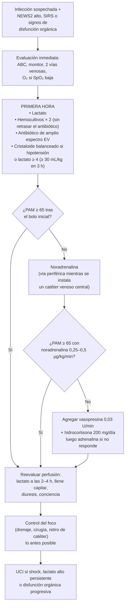

---
tags:
  - Infectología
  - Medicina intensiva
  - Urgencia
  - Frecuente en sala
---

# Sepsis y shock séptico

**Subespecialidad**
Infectología · Medicina intensiva · Urgencia

**Guías principales**
Surviving Sepsis Campaign (SSC): guías internacionales de manejo de sepsis y shock séptico **2026** (SCCM/ESICM, marzo 2026) · Definiciones Sepsis-3 (2016)

**Otras fuentes**
Puntaje SOFA-2 (JAMA 2025) · Carga global de sepsis GBD 2021 (Lancet Glob Health 2025) · Estudio nacional de sepsis en UCI chilenas (Dougnac, Rev Med Chile 2007)

**EUNACOM**
1.04.2.007 Sepsis y shock séptico (sospecha, inicial, derivar) · 1.01.2.007 Shock (específico, inicial, derivar)

**Revisado**
Septiembre 2026

!!! abstract "Resumen en 60 segundos"
    - **Sepsis** = **disfunción orgánica** que amenaza la vida, causada por una **respuesta desregulada** del huésped a una **infección** (aumento del **SOFA ≥ 2 puntos**). **Shock séptico** = sepsis que requiere **vasopresores para PAM ≥ 65 mmHg** y tiene **lactato > 2 mmol/L** pese a volumen adecuado (mortalidad > 40 %).
    - **Tamizaje**: usar **NEWS/NEWS2, MEWS o SIRS**; el **qSOFA no sirve solo** como herramienta de tamizaje (SSC 2026).
    - **Primera hora**: **lactato**, **hemocultivos** (idealmente antes del antibiótico), **antibiótico de amplio espectro en < 1 hora** si hay shock o sepsis probable, **≥ 30 mL/kg de cristaloide balanceado** en las primeras 3 horas si hay hipoperfusión, y **noradrenalina** si la hipotensión persiste.
    - **Meta de PAM 65 mmHg** (**60–65** en ≥ 65 años). **Noradrenalina** de primera línea; agregar **vasopresina** y luego **adrenalina** si no se logra la meta.
    - **Novedades 2026**: β-lactámicos en **infusión prolongada** (recomendación fuerte), **desescalar** siempre que haya cultivo y antibiograma, **cristaloides sin albúmina** en la reanimación inicial, **corticoides EV en el shock séptico**, **cánula nasal de alto flujo** en la insuficiencia respiratoria, **remoción activa de volumen** tras la fase de reanimación, **no** antipiréticos para mejorar el pronóstico, **no** β-bloqueadores.
    - **Controlar el foco** (drenaje, desbridamiento, retirar catéteres) lo antes posible.

## Definición

### Sepsis-3 (2016)

| Término | Definición |
|---|---|
| **Infección** | Invasión de tejidos por microorganismos (sospechada o confirmada) |
| **Sepsis** | **Disfunción orgánica** que amenaza la vida, causada por una **respuesta desregulada del huésped a la infección**. Operativamente: **aumento agudo del SOFA ≥ 2 puntos** (se asume SOFA basal 0 si no hay disfunción previa). Mortalidad hospitalaria **~ 10 %** |
| **Shock séptico** | Sepsis con alteraciones circulatorias, celulares y metabólicas profundas: **vasopresores para mantener PAM ≥ 65 mmHg** **y lactato > 2 mmol/L** pese a una reanimación adecuada con volumen. Mortalidad **> 40 %** |

- Los términos **"sepsis grave"** y **"SIRS"** como definición de sepsis quedaron obsoletos en 2016 (el SIRS se mantiene como herramienta de **tamizaje**).
- **qSOFA** (1 punto cada uno: **FR ≥ 22**, **alteración de conciencia**, **PAS ≤ 100 mmHg**): ≥ 2 identifica pacientes con **mayor riesgo de muerte**, pero es **poco sensible** para tamizar.

### Puntaje SOFA (original, 1996) y SOFA-2 (2025)

| Sistema | 0 | 1 | 2 | 3 | 4 |
|---|---|---|---|---|---|
| **Respiratorio**: PaO₂/FiO₂ | ≥ 400 | < 400 | < 300 | < 200 con soporte ventilatorio | < 100 con soporte ventilatorio |
| **Coagulación**: plaquetas (×10³/µL) | ≥ 150 | < 150 | < 100 | < 50 | < 20 |
| **Hígado**: bilirrubina (mg/dL) | < 1,2 | 1,2–1,9 | 2,0–5,9 | 6,0–11,9 | ≥ 12 |
| **Cardiovascular** | PAM ≥ 70 | PAM < 70 | Dopamina < 5 o dobutamina (cualquier dosis) | Dopamina 5,1–15 o **noradrenalina o adrenalina ≤ 0,1** µg/kg/min | Dopamina > 15 o **noradrenalina o adrenalina > 0,1** |
| **Neurológico**: Glasgow | 15 | 13–14 | 10–12 | 6–9 | < 6 |
| **Renal**: creatinina (mg/dL) o diuresis | < 1,2 | 1,2–1,9 | 2,0–3,4 | 3,5–4,9 o < 500 mL/día | ≥ 5,0 o < 200 mL/día |

<figure markdown>
{ loading=lazy }
<figcaption>Figura 1. Diferencias entre el SOFA original (1996) y el SOFA-2 (2025). El SOFA-2 mantiene 6 sistemas con 0–4 puntos cada uno, pero agrega el <strong>tratamiento farmacológico del delirium</strong> al sistema neurológico, usa <strong>SpO₂/FiO₂</strong> como alternativa, reconoce la cánula nasal de alto flujo, la VMNI y la ECMO, gradúa el sistema cardiovascular por la <strong>dosis sumada de noradrenalina y adrenalina</strong> (≤ 0,2 · > 0,2–0,4 · > 0,4 µg/kg/min) e incorpora la terapia de reemplazo renal. Fuente: Lobo SM, Roepke RML, Myatra SN, Rezende E. Using the SOFA 2.0 score: a quick guide for clinicians and researchers. <em>Crit Care Sci</em>. 2025;37:e20250395. Licencia <a href="https://creativecommons.org/licenses/by/4.0/">CC BY 4.0</a>. Texto de la figura en inglés.</figcaption>
</figure>

## Epidemiología

### Mundial

- **GBD 2021** (Lancet Glob Health 2025): **166 millones de casos** y **21,4 millones de muertes relacionadas con sepsis** en 2021, el **31,5 % de todas las muertes** del mundo. Tras bajar entre 1990 y 2019, aumentaron en 2020–2021 (COVID-19).
- La mayor mortalidad se da en los **≥ 70 años** (9,3 millones de muertes en 2021). La sepsis complica cada vez más enfermedades **no infecciosas** (**ACV**, **EPOC**, **cirrosis**).
- Focos más frecuentes en adultos: **respiratorio** (neumonía, el más frecuente), **abdominal**, **urinario**, **piel y partes blandas**, **catéteres**.
- Factores de riesgo: edad avanzada, **inmunosupresión** (cáncer, quimioterapia, corticoides, VIH, trasplante), diabetes, ERC, cirrosis, alcoholismo, dispositivos invasivos, hospitalización reciente.
- Muchos sobrevivientes quedan con **secuelas** físicas, cognitivas y psicológicas (**síndrome post-sepsis**) y reingresan con frecuencia.

### Chile

!!! chile "Datos nacionales"
    - **Primer estudio nacional** (Dougnac, 2004; 94 % de las UCI del país): el **40 %** de los pacientes en UCI cumplía criterios de **sepsis grave** el día del estudio (definición antigua). **Letalidad a 28 días: 26,7 %** en ellos vs 8,7 % en los demás. Focos: **respiratorio 48 %** y **abdominal 30 %**.
    - La **resistencia antimicrobiana** es un problema creciente en los hospitales chilenos: **enterobacterias productoras de BLEE** y aparición de **carbapenemasas** (KPC, NDM) según la vigilancia del **ISP**. El antibiótico empírico debe guiarse por la **epidemiología local** y el riesgo de multirresistencia de cada paciente.
    - En la red pública, la disponibilidad de camas UCI y de exámenes (lactato, procalcitonina) varía entre hospitales: la SSC 2026 incluye comentarios para **contextos con recursos limitados**, donde lo prioritario es el **reconocimiento precoz** y el **antibiótico oportuno**.

## Etiología y fisiopatología

- **Microorganismos**: bacterias **gramnegativas** (*E. coli*, *Klebsiella*, *Pseudomonas*) y **grampositivas** (*S. aureus*, *S. pneumoniae*, estreptococos) en proporciones similares; hongos (*Candida*) en pacientes críticos con factores de riesgo; virus (influenza, SARS-CoV-2). En **30–40 %** no se identifica el microorganismo.
- **Respuesta desregulada**: el reconocimiento de patrones microbianos (PAMP) y de daño (DAMP) activa una **inflamación sistémica** y, a la vez, una **inmunosupresión**:
    - **Endotelio**: vasodilatación, **aumento de la permeabilidad capilar** (edema, hipovolemia relativa), pérdida del glicocálix.
    - **Coagulación**: activación, microtrombosis y consumo (**CID**).
    - **Microcirculación y mitocondria**: la célula no usa bien el oxígeno aunque llegue ("disoxia"); por eso el **lactato** sube también por estimulación adrenérgica y no sólo por hipoperfusión.
    - **Corazón**: **miocardiopatía séptica** (disfunción reversible).
- **Shock séptico**: shock **distributivo** (vasodilatación con resistencia vascular sistémica baja), con un componente **hipovolémico** (fuga capilar, pérdidas) y a veces **cardiogénico**.
- **Disfunción orgánica**: encefalopatía (delirium), SDRA, lesión renal aguda, disfunción hepática, trombocitopenia y CID, íleo, hiperglicemia, insuficiencia suprarrenal relativa.

## Clasificación

- **Sepsis** vs **shock séptico** (Sepsis-3).
- **Por foco**: respiratorio, abdominal, urinario, piel y partes blandas, sistema nervioso central, endovascular (endocarditis, catéter), desconocido.
- **Por origen**: **comunitaria** vs **asociada a la atención de salud** (mayor riesgo de multirresistencia).
- **Por huésped**: inmunocompetente, **neutropénico**, trasplantado, esplenectomizado (riesgo de sepsis fulminante por neumococo).

### Tipos de shock (diagnóstico diferencial del shock)

| Tipo | Causas | PVC / presión de llenado | Gasto cardíaco | Resistencia vascular sistémica | Piel |
|---|---|---|---|---|---|
| **Hipovolémico** | Hemorragia, deshidratación, quemaduras | ↓ | ↓ | ↑ | Fría, pálida |
| **Cardiogénico** | IAM, miocardiopatía, arritmia, valvulopatía aguda | ↑ | ↓ | ↑ | Fría, congestión pulmonar |
| **Obstructivo** | **TEP masivo**, **taponamiento**, **neumotórax a tensión** | ↑ | ↓ | ↑ | Fría, ingurgitación yugular |
| **Distributivo** | **Sepsis**, anafilaxia, neurogénico, insuficiencia suprarrenal | ↓ o normal | **↑ o normal** | **↓** | **Caliente** al inicio (shock "caliente") |

La **ecografía a pie de cama** (protocolos tipo RUSH: corazón, vena cava inferior, pulmón, abdomen, aorta, venas) ayuda a distinguirlos rápidamente.

## Clínica

- **Signos de infección**: fiebre (o **hipotermia**, de peor pronóstico), calofríos, síntomas del foco (tos, disuria, dolor abdominal, celulitis, rigidez de nuca).
- **Signos de disfunción orgánica** (lo que define la sepsis):
    - **Taquipnea** (FR ≥ 22) e hipoxemia.
    - **Compromiso de conciencia** o **delirium** (a veces el único signo en adultos mayores).
    - **Hipotensión** (PAS ≤ 100 o PAM < 65) y **taquicardia**.
    - **Oliguria** (< 0,5 mL/kg/h).
    - **Hipoperfusión periférica**: **llene capilar > 3 segundos**, piel moteada (*livedo*), extremidades frías.
    - Ictericia, petequias o sangrado (CID).
- **Adultos mayores, inmunosuprimidos y usuarios de β-bloqueadores o corticoides**: la presentación puede ser **atípica** (sin fiebre, sin taquicardia).

!!! alarma "Piensa en sepsis ante todo paciente con infección y cualquiera de estos signos"
    Confusión nueva · FR ≥ 22 · PAS ≤ 100 · SpO₂ baja · oliguria · piel moteada o llene capilar lento · lactato > 2 mmol/L. **La sepsis es una emergencia tiempo-dependiente**, como el IAM o el ACV.

## Diagnóstico

La sepsis es un **diagnóstico clínico**: no se confirma ni descarta con un solo biomarcador (SSC 2026).

1. **Sospechar** (tamizaje con **NEWS2, MEWS o SIRS**; no con qSOFA solo).
2. **Confirmar la disfunción orgánica** (SOFA, lactato, gases, creatinina, bilirrubina, plaquetas, Glasgow).
3. **Buscar el foco** (anamnesis, examen físico completo incluyendo piel, heridas, catéteres y zonas de presión; imágenes dirigidas).
4. **Identificar el microorganismo**: cultivos **antes del antibiótico** si no lo retrasa.

**Criterios de SIRS** (≥ 2, útiles para tamizaje): temperatura > 38 °C o < 36 °C · FC > 90/min · FR > 20/min o PaCO₂ < 32 mmHg · leucocitos > 12.000 o < 4.000/µL o > 10 % de baciliformes.

## Laboratorio

| Examen | Para qué |
|---|---|
| **Lactato** (arterial o venoso) | **Gravedad** y guía de la reanimación: repetir a las **2–4 h** si está > 2 mmol/L. > 4 mmol/L: mayor mortalidad |
| **Hemocultivos** (2 sets, aerobio y anaerobio, de sitios distintos) | Antes del antibiótico, idealmente; **no retrasar** el antibiótico por tomarlos |
| **Cultivos del foco** | Orina, expectoración o aspirado traqueal, líquido pleural, ascítico o cefalorraquídeo, abscesos |
| **Hemograma** | Leucocitosis o leucopenia, **trombocitopenia**, neutropenia |
| **Gases arteriales o venosos** | Acidosis metabólica, PaO₂/FiO₂ |
| **Creatinina, BUN, electrolitos** | Lesión renal aguda (SOFA renal) |
| **Bilirrubina, transaminasas** | Disfunción hepática, colangitis |
| **Pruebas de coagulación** (TP, TTPA, fibrinógeno, dímero D) | CID |
| **PCR y procalcitonina** | Apoyo diagnóstico; la **procalcitonina** ayuda a decidir la **suspensión** del antibiótico junto con la clínica |
| **Glicemia** | Hiperglicemia de estrés; meta 144–180 mg/dL |
| **Pruebas moleculares rápidas** | En pacientes seleccionados según la clínica y la epidemiología local (SSC 2026) |
| **Antígenos urinarios** (neumococo, *Legionella*), panel viral | Neumonía |

## Imágenes

- **Radiografía de tórax**: neumonía, SDRA.
- **Ecografía a pie de cama** (POCUS): tipo de shock, función cardíaca, **vena cava inferior**, derrames, **vía biliar** y riñones (obstrucción), abscesos.
- **TC** dirigida al foco sospechado (abdomen: abscesos, perforación, colangitis, pielonefritis complicada; tórax; partes blandas en la fascitis necrotizante), **cuando el paciente esté estabilizado**.
- **Ecografía renal** en la sepsis urinaria para descartar **obstrucción** (requiere drenaje urgente).
- **Ecocardiograma** si se sospecha endocarditis o disfunción cardíaca.

## Diagnóstico diferencial

- **Otras causas de shock**: hipovolémico (hemorragia digestiva), cardiogénico (IAM), obstructivo (TEP, taponamiento), anafilaxia, **insuficiencia suprarrenal aguda**.
- **SIRS no infeccioso**: **pancreatitis aguda**, trauma, quemaduras, cirugía mayor, reacción a fármacos (DRESS), síndrome de lisis tumoral, tormenta tiroidea, crisis adrenal.
- **Otras causas de fiebre e hipotensión**: síndrome neuroléptico maligno, síndrome serotoninérgico, golpe de calor, reacción transfusional.
- **Hiperlactatemia sin sepsis**: metformina, adrenalina o salbutamol, convulsiones, isquemia mesentérica.

## Tratamiento

!!! guia "SSC 2026: las recomendaciones clave para el internado"
    - **Programas de mejora** en los hospitales: tamizaje sistemático, protocolos y "**código sepsis**".
    - **Antibiótico inmediato, idealmente en < 1 hora**, en el **shock** y en la **sepsis probable o definida**. Si el riesgo de infección es **bajo** y no hay shock, se puede **diferir** y vigilar.
    - **Cristaloides**: **≥ 30 mL/kg** en las primeras **3 horas** en la hipoperfusión o el shock, con **reevaluación frecuente**; **balanceados** mejor que suero fisiológico; **sin albúmina** en la reanimación inicial.
    - **Vasopresor precoz** si la hipotensión persiste tras el bolo inicial; **PAM 65 mmHg** (**60–65** en ≥ 65 años).
    - **Lactato seriado** y **llene capilar** para guiar la reanimación; medidas **dinámicas** de respuesta a volumen mejor que las estáticas.
    - **Infusión prolongada de β-lactámicos** (tras una dosis de carga) y **desescalamiento** con cultivo y antibiograma.
    - **Corticoides EV** en el shock séptico.
    - **Remoción activa de volumen** tras la fase aguda.

### 1. Antibióticos

!!! dosis "Antibiótico empírico"
    - **Momento**: **inmediato, idealmente < 1 hora** desde el reconocimiento en el shock séptico y en la sepsis probable o definida. En ambulancia si se anticipa que llegar al hospital tomará ≥ 60 minutos y hay shock.
    - **Espectro** según el **foco**, el lugar de adquisición, los antibióticos recientes, la colonización previa y la **epidemiología local**:
        - **Cobertura de multirresistentes** (BLEE, *Pseudomonas*, SAMR) **sólo si hay alto riesgo** de un patógeno multirresistente específico (hospitalización o antibióticos recientes, colonización conocida, institucionalizados, diálisis); **no** si el riesgo es bajo.
        - **Cobertura de anaerobios** si hay alto riesgo (foco abdominal, necrosis, aspiración con absceso).
        - **Antifúngico** empírico sólo con alto riesgo de *Candida* (nutrición parenteral, cirugía abdominal con fuga, colonización múltiple, neutropenia).
    - **Ejemplos habituales** (ajustar a la guía local): **neumonía comunitaria grave**: ceftriaxona + macrólido (ver [Neumonía adquirida en la comunidad](../respiratorio/neumonia-adquirida-en-la-comunidad.md)); **intraabdominal comunitaria**: ceftriaxona + metronidazol; **urinaria comunitaria**: ceftriaxona (carbapenémico si hay riesgo de BLEE); **asociada a la atención de salud o foco desconocido con riesgo de multirresistencia**: piperacilina/tazobactam, cefepime o meropenem ± vancomicina; **neutropenia febril**: cefepime o piperacilina/tazobactam.
    - **Infusión prolongada de β-lactámicos** (recomendación **fuerte**, SSC 2026): primera dosis en bolo (carga) y luego infusiones de **3–4 horas** (p. ej., **piperacilina/tazobactam 4,5 g** en 3–4 h cada 6–8 h; **meropenem 1–2 g** en 3 h cada 8 h).
    - **Ajuste de dosis**: la primera dosis se da **completa** aunque haya lesión renal aguda.
    - **Desescalar** (recomendación fuerte) en cuanto haya **microorganismo y antibiograma**.
    - **Duración**: en general **cursos cortos** (5–7 días) con buen control del foco; la **procalcitonina** más la evaluación clínica ayuda a decidir cuándo suspender.

### 2. Reanimación con volumen

- **Cristaloide balanceado** (Ringer lactato, Plasma-Lyte) mejor que suero fisiológico; **≥ 30 mL/kg en las primeras 3 horas** si hay hipotensión o hipoperfusión (lactato ≥ 4), **en bolos** de 250–500 mL con **reevaluación** después de cada uno.
- Tras los 30 mL/kg, si persiste la hipoperfusión, la estrategia **liberal o restrictiva** es aceptable según el paciente y los recursos: guiarse por **medidas dinámicas** de respuesta a volumen (**elevación pasiva de piernas**, variación del volumen sistólico o de la presión de pulso), **llene capilar** y **lactato**.
- **Cuidado** en insuficiencia cardíaca, ERC avanzada y SDRA: bolos más pequeños y evaluación con ecografía (líneas B, vena cava).
- **No usar** almidones (hidroxietilalmidón) ni gelatinas. **No agregar albúmina** en la reanimación inicial (SSC 2026).
- Tras la fase aguda, con el shock resuelto: **remoción activa de volumen** (diuréticos o ultrafiltración) si hay sobrecarga.

### 3. Vasopresores e inótropos

!!! dosis "Vasoactivos en el shock séptico"
    - **Noradrenalina** (primera línea): iniciar **0,05–0,1 µg/kg/min** y titular a **PAM 65 mmHg** (60–65 en ≥ 65 años). Puede **iniciarse por vía periférica** (vena gruesa, proximal, con vigilancia de extravasación) para **no retrasarla** mientras se instala un catéter venoso central (SSC 2021). Preparación habitual: 4 mg en 250 mL (16 µg/mL).
    - **Vasopresina 0,03 U/min** si la PAM no se logra con noradrenalina (habitualmente al llegar a **0,25–0,5 µg/kg/min**) para ahorrar noradrenalina.
    - **Adrenalina** si la PAM sigue baja pese a noradrenalina y vasopresina.
    - **Disfunción cardíaca** con hipoperfusión persistente pese a volumen y PAM adecuados: **dobutamina** (2,5–20 µg/kg/min) sumada a la noradrenalina, o **adrenalina sola**. Con disfunción cardíaca, la noradrenalina es preferible si hay taquiarritmia y la adrenalina si hay bradicardia.
    - **Monitoreo**: **línea arterial** invasiva o presión no invasiva frecuente (ambas aceptables en 2026).
    - **No usar dopamina** (más arritmias). **No usar β-bloqueadores** en el shock séptico (SSC 2026).

### 4. Control del foco

- Identificar y controlar el foco **lo antes posible** (idealmente en **6–12 horas**): **drenaje** de abscesos y empiemas, **desobstrucción** de la vía urinaria (catéter doble J o nefrostomía) o biliar (CPRE), **desbridamiento** de la fascitis necrotizante, **laparotomía** en la peritonitis, **retiro de catéteres** infectados.

### 5. Terapias adicionales

| Medida | Recomendación (SSC 2021/2026) |
|---|---|
| **Corticoides** | **Hidrocortisona EV** en el **shock séptico** (sugerencia 2026). Dosis habitual **200 mg/día** (50 mg cada 6 h o en infusión); en la práctica se inicia cuando se requiere noradrenalina ≥ 0,25 µg/kg/min por ≥ 4 horas (umbral de la guía 2021; el umbral varía entre centros). Algunos protocolos agregan **fludrocortisona 50 µg/día** VO |
| **Oxigenación** | **Cánula nasal de alto flujo** sobre oxigenoterapia convencional y VMNI en la insuficiencia respiratoria hipoxémica; **prono vigil** en no intubados; volumen corriente **6–8 mL/kg** de peso ideal sin SDRA (4–6 mL/kg en el SDRA) |
| **Transfusión** | Glóbulos rojos si **Hb < 7 g/dL** (estrategia restrictiva), salvo isquemia miocárdica o hemorragia activa |
| **Glicemia** | Iniciar **insulina** si la glicemia es **≥ 180 mg/dL**; meta **144–180 mg/dL** |
| **Tromboprofilaxis** | **Heparina de bajo peso molecular** (heparina no fraccionada en la ERC avanzada) |
| **Profilaxis de úlcera de estrés** | **Inhibidor de la bomba de protones** si hay factores de riesgo de sangrado digestivo (coagulopatía, shock, ventilación mecánica prolongada) |
| **Bicarbonato** | **No** en la acidemia láctica con pH ≥ 7,2; considerarlo con **pH ≤ 7,2 y lesión renal aguda KDIGO 2–3** (ver [Trastornos ácido-base](../nefrologia/trastornos-acido-base.md)) |
| **Antipiréticos** | **No** para mejorar el pronóstico (sí para el confort del paciente) |
| **No recomendados** | Vitamina C EV, inmunoglobulinas EV, vitamina D, **probióticos**, hemoperfusión y otras terapias de purificación de la sangre, **β-bloqueadores** |
| **Nutrición** | Enteral precoz (dentro de 72 h) si es posible |

### 6. Metas de cuidado y transición

- Conversar **metas de cuidado** y pronóstico con el paciente y la familia precozmente (idealmente en 72 h).
- **Conciliación de medicamentos** con químico farmacéutico en cada transición (UCI, alta).
- **Seguimiento tras el alta**: rehabilitación física, evaluación cognitiva y de **salud mental**, educación a la familia y comunicación con la **APS**.

## Complicaciones

- **Respiratorias**: **SDRA**, neumonía asociada a ventilación.
- **Renales**: **lesión renal aguda** (la disfunción orgánica más frecuente junto con la respiratoria), necesidad de diálisis.
- **Hematológicas**: **CID**, trombocitopenia.
- **Neurológicas**: **delirium**, encefalopatía séptica, **debilidad adquirida en la UCI**.
- **Cardiovasculares**: **miocardiopatía séptica**, arritmias (fibrilación auricular de novo), IAM tipo 2.
- **Metabólicas**: hiperglicemia, insuficiencia suprarrenal relativa.
- **Iatrogénicas**: **sobrecarga de volumen**, infecciones intrahospitalarias, *Clostridioides difficile*, resistencia antimicrobiana.
- **Síndrome post-sepsis**: deterioro funcional, cognitivo y psicológico (ansiedad, depresión, estrés postraumático), reingresos y mayor mortalidad en el año siguiente.

## Pronóstico y seguimiento

- Mortalidad hospitalaria: **~ 10–20 %** en la sepsis y **> 40 %** en el shock séptico; en Chile, **~ 27 %** a 28 días en la sepsis grave en UCI (2004).
- **Predictores**: edad, comorbilidad, **retraso del antibiótico** (cada hora de retraso en el shock aumenta la mortalidad), lactato alto que **no se aclara**, número de órganos en falla (SOFA), foco no controlado.
- **Perfil EUNACOM**: sospecha diagnóstica, **tratamiento inicial** (volumen, antibiótico, vasopresor) y **derivación** a UCI.
- **Al alta**: control en APS o policlínico en **1–2 semanas**; revisar fármacos, funcionalidad, cognición y ánimo; vacunación (**influenza**, **neumococo**, COVID-19).

## Perlas para el internado

!!! perla "Para la sala y el turno"
    - **La hora cuenta**: antibiótico, cultivos, lactato y volumen **en la primera hora**. Indica el antibiótico y **asegúrate de que se administre**.
    - **No esperes el catéter venoso central** para iniciar la noradrenalina: puede partir por una vía periférica gruesa.
    - Un paciente con infección y **PA "normal"** pero **lactato 4**, **piel moteada** u **oliguria** está en hipoperfusión ("shock críptico"): trátalo como sepsis grave.
    - **Reevalúa después de cada bolo**: crepitaciones, SpO₂, ingurgitación yugular, ecografía. El exceso de volumen también mata.
    - **Busca el foco** en todo el cuerpo: escaras, heridas, catéteres, articulaciones, periné (Fournier). La **pielonefritis obstructiva** y la **colangitis** necesitan **drenaje**, no sólo antibiótico.
    - En la **neumonía grave**, la **fascitis necrotizante** y la **meningitis**, cada minuto de retraso del antibiótico cuenta aún más.
    - **Revisa los cultivos a las 48–72 horas** y **desescala**.

## Preguntas de repaso

??? repaso "1. Hombre de 72 años con fiebre, disuria y confusión. PA 82/48 mmHg (PAM 59), FC 118, FR 26, lactato 4,8 mmol/L, creatinina 2,4 mg/dL. ¿Qué tiene y cuál es el manejo de la primera hora?"
    **Sepsis de foco urinario con hipoperfusión** (probable shock séptico si requiere vasopresores). Primera hora: **2 vías venosas**, **hemocultivos × 2 y urocultivo**, **lactato**, **antibiótico EV inmediato** (p. ej., **ceftriaxona 2 g**; carbapenémico si hay riesgo de BLEE), **cristaloide balanceado ≥ 30 mL/kg** en bolos con reevaluación, y **noradrenalina** si la PAM sigue < 65 (meta 60–65 por tener ≥ 65 años). **Ecografía renal** para descartar **obstrucción** (drenaje urgente). Repetir el lactato a las 2–4 h. Evaluación por UCI.

??? repaso "2. ¿Por qué ya no se recomienda usar el qSOFA solo para tamizar la sepsis? ¿Qué se usa?"
    Porque el qSOFA es **poco sensible**: fue diseñado para identificar a infectados con **mayor riesgo de muerte**, no para detectar precozmente la sepsis; usarlo solo deja pasar muchos casos. La SSC 2026 **recomienda** usar **NEWS, NEWS2, MEWS o SIRS** para el tamizaje en los pacientes hospitalizados.

??? repaso "3. Paciente en shock séptico con noradrenalina a 0,4 µg/kg/min y PAM de 58 mmHg pese a 35 mL/kg de cristaloide. ¿Qué agregas?"
    **Vasopresina 0,03 U/min** (para ahorrar noradrenalina) e **hidrocortisona 200 mg/día** EV (50 mg cada 6 h). Si la PAM sigue baja, agregar **adrenalina**. Evaluar la **función cardíaca** con ecocardiografía: si hay disfunción con hipoperfusión persistente, **dobutamina** o adrenalina. Revisar el **control del foco** y la cobertura antibiótica, y descartar otras causas (hemorragia, neumotórax, taponamiento, insuficiencia suprarrenal).

??? repaso "4. ¿Qué es la infusión prolongada de β-lactámicos y por qué se recomienda?"
    Administrar el β-lactámico (piperacilina/tazobactam, meropenem, cefepime) con una **dosis de carga en bolo** y luego en **infusiones de 3–4 horas** (o continuas) en vez de bolos de 30 minutos. Como la eficacia de los β-lactámicos depende del **tiempo sobre la concentración inhibitoria mínima**, la infusión prolongada mantiene niveles eficaces más tiempo. La SSC 2026 la **recomienda con fuerza** (moderada certeza de evidencia), porque se asocia a menor mortalidad.

??? repaso "5. Mujer de 58 años con sepsis de foco abdominal: al segundo día, el cultivo de líquido peritoneal muestra *E. coli* sensible a ceftriaxona; recibe meropenem. ¿Qué haces?"
    **Desescalar** a **ceftriaxona** (más metronidazol si se requiere cobertura de anaerobios por el foco abdominal), según el antibiograma: la SSC 2026 **recomienda** desescalar cuando hay diagnóstico microbiológico y sensibilidad. Asegurar el **control del foco** (drenaje o cirugía) y planificar una duración corta (≈ 4–7 días tras el control del foco), apoyándose en la evolución clínica y la procalcitonina.

## Referencias

1. Prescott HC, Antonelli M, Alhazzani W, et al. Surviving Sepsis Campaign: International Guidelines for Management of Sepsis and Septic Shock 2026. *Crit Care Med.* 2026;54:725–812 (publicada también en *Intensive Care Med.* 2026;52:863–936). [PubMed](https://pubmed.ncbi.nlm.nih.gov/41869847/)
2. Evans L, Rhodes A, Alhazzani W, et al. Surviving sepsis campaign: international guidelines for management of sepsis and septic shock 2021. *Intensive Care Med.* 2021;47:1181–1247. doi:[10.1007/s00134-021-06506-y](https://doi.org/10.1007/s00134-021-06506-y)
3. Singer M, Deutschman CS, Seymour CW, et al. The Third International Consensus Definitions for Sepsis and Septic Shock (Sepsis-3). *JAMA.* 2016;315:801–810.
4. Ranzani OT, Singer M, Salluh JIF, et al. Development and Validation of the Sequential Organ Failure Assessment (SOFA)-2 Score. *JAMA.* 2025;334:2090. doi:[10.1001/jama.2025.20516](https://doi.org/10.1001/jama.2025.20516)
5. Lobo SM, Roepke RML, Myatra SN, Rezende E. Using the SOFA 2.0 score: a quick guide for clinicians and researchers. *Crit Care Sci.* 2025;37:e20250395. doi:[10.62675/2965-2774.20250395](https://doi.org/10.62675/2965-2774.20250395)
6. Azevedo LCP, Myatra SN, Hammond N. Using the 2026 Surviving Sepsis Campaign Guidelines in Practice. *Crit Care Sci.* 2026;38:e20260036. doi:[10.62675/2965-2774.20260036](https://doi.org/10.62675/2965-2774.20260036)
7. GBD 2021 Global Sepsis Collaborators. Global, regional, and national sepsis incidence and mortality, 1990–2021: a systematic analysis. *Lancet Glob Health.* 2025;13:e2013–e2026. doi:[10.1016/S2214-109X(25)00356-0](https://doi.org/10.1016/S2214-109X(25)00356-0)
8. Dougnac A, Mercado M, Cornejo R, et al. Prevalencia de sepsis grave en las Unidades de Cuidado Intensivo: primer estudio nacional multicéntrico. *Rev Med Chile.* 2007;135:620–630.
