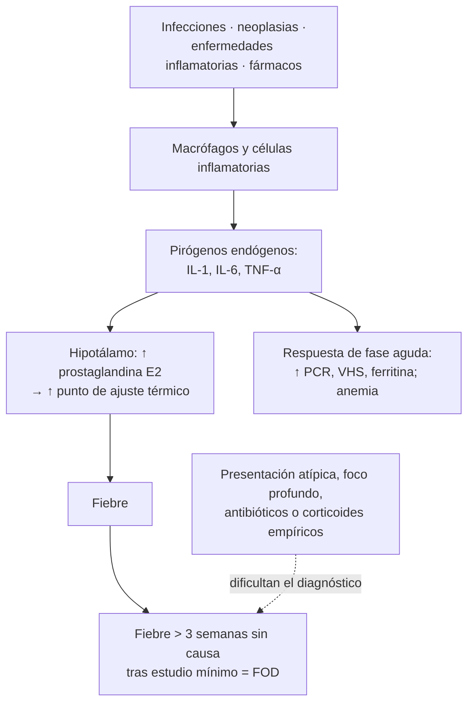
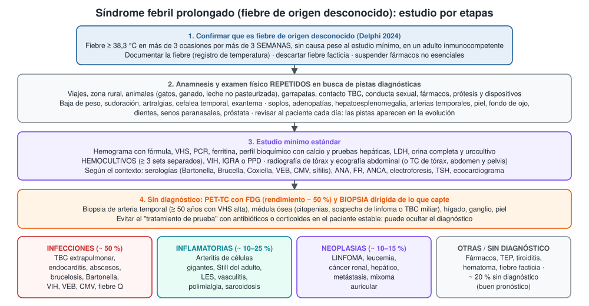

---
tags:
  - Infectología
---

# Síndrome febril prolongado (fiebre de origen desconocido)

**Subespecialidad**
Infectología · Medicina interna · Reumatología · Hematología

**Guías principales**
Consenso Delphi 2024 sobre fiebre e inflamación de origen desconocido (*Open Forum Infect Dis*) · Revisión del estado del arte sobre el manejo ambulatorio de la fiebre de origen desconocido (*Clin Infect Dis* 2026)

**Otras fuentes**
Revisión clínica del *BMJ* 2025 · Estudio internacional de 788 pacientes en 21 países (*Eur J Clin Microbiol Infect Dis* 2023) · Metaanálisis del rendimiento del PET-TC con FDG (*Clin Radiol* 2017) · Estudio prospectivo multicéntrico holandés (*Medicine* 2007) · Serie chilena de enfermedad por arañazo de gato (*Rev Med Chil* 1996)

**GES**
No.

**EUNACOM**
1.04.1.024 Síndrome febril prolongado (sospecha, inicial, derivar)

**Revisado**
Octubre 2026

!!! abstract "Resumen en 60 segundos"
    - **Fiebre de origen desconocido (FOD)** (Delphi 2024): fiebre **≥ 38,3 °C** en **más de 3 ocasiones** por **más de 3 semanas**, **sin causa** tras un **estudio mínimo estándar**, en un adulto **inmunocompetente**.
    - **Causas** (21 países, 2023):
        - **Infecciones ~ 50 %**: TBC extrapulmonar, endocarditis, abscesos, brucelosis, Bartonella.
        - **Neoplasias ~ 11 %**: sobre todo **linfoma**.
        - **Enfermedades inflamatorias ~ 9 %**: Still del adulto, **arteritis de células gigantes**, LES, vasculitis.
        - **Sin diagnóstico ~ 20 %**.
    - **Casi siempre es una enfermedad común que se presenta de forma atípica**, no una enfermedad rara.
    - **La clave es la clínica**: anamnesis y examen físico **repetidos** (viajes, animales, fármacos, prótesis, soplos, adenopatías, arterias temporales).
    - **Estudio mínimo**: hemograma, VHS, PCR, ferritina, bioquímica, orina y urocultivo, **≥ 3 hemocultivos**, VIH, IGRA o PPD, radiografía de tórax y ecografía abdominal (o TC).
    - **Sin pistas tras el estudio mínimo**: **PET-TC con FDG** (orienta el diagnóstico en ~ la mitad) y **biopsia dirigida**.
    - **Paciente estable**: **no** dar antibióticos ni corticoides "de prueba", porque ocultan el diagnóstico. Si queda sin diagnóstico, el pronóstico suele ser **bueno**.

## Definición

- **Fiebre**: temperatura ≥ 38,3 °C (o ≥ 38 °C según la medición). Lo normal varía durante el día (más alta en la tarde).
- **Fiebre de origen desconocido clásica** (Petersdorf y Beeson, 1961): fiebre > 38,3 °C en varias ocasiones, por **más de 3 semanas**, sin diagnóstico tras **1 semana** de estudio hospitalario.
- **Definición actual** (consenso Delphi 2024): **> 3 semanas** de fiebre (≥ 38,3 °C en > 3 ocasiones) **sin explicación**, pese a completar un **estudio mínimo estándar** (en el hospital o ambulatorio), en un **adulto inmunocompetente**.
    - Lo que define la FOD no son los días de hospitalización, sino haber hecho un **estudio mínimo de calidad**.
- **Inflamación de origen desconocido**: el mismo cuadro con **PCR o VHS elevadas** sin fiebre documentada.
- **Otras categorías** (con causas y manejo distintos):
    - **FOD nosocomial**: fiebre que aparece en un paciente hospitalizado.
    - **FOD en neutropénicos**: ver [urgencias oncológicas](../hematologia/urgencias-oncologicas.md).
    - **FOD en personas con VIH**: infecciones oportunistas, linfoma; ver [VIH](infeccion-por-vih.md).
- **Síndrome febril prolongado**: término usado en Chile para la fiebre de más de 7–10 días sin causa evidente (en especial en pediatría). En el adulto se usa como equivalente práctico de la FOD.

## Epidemiología

### Mundial

- **Estudio internacional** (Erdem 2023; 788 pacientes en 21 países, 2016–2021):
    - **Infecciones 51,6 %**.
    - **Neoplasias 11,4 %**.
    - **Enfermedades del colágeno y vasculitis 9,3 %**, más frecuentes en los países de mayores ingresos.
    - **Misceláneas 7,7 %**.
    - **Sin diagnóstico 20,1 %**.
- **Infecciones más frecuentes** en ese estudio:
    - **Tuberculosis** (5,7 %), **brucelosis** (4,9 %), rickettsiosis (2,9 %), **VIH** (2,5 %), fiebre tifoidea (1,6 %).
    - Las **infecciones cardiovasculares** (endocarditis) fueron el síndrome infeccioso más frecuente (7,1 %).
- En los países de **altos ingresos** predominan las **enfermedades inflamatorias no infecciosas** y aumenta la proporción **sin diagnóstico**. En los de menores ingresos predominan las infecciones.
- **PET-TC con FDG**: rendimiento diagnóstico agrupado de **56 %** (metaanálisis de Bharucha 2017; 18 estudios, 905 pacientes).

### Chile

!!! chile "Datos nacionales"
    - No hay series chilenas recientes de FOD en adultos publicadas. La distribución local de causas se infiere de la epidemiología nacional.
    - **Tuberculosis**: sigue siendo una causa clave, sobre todo las formas **extrapulmonares** (ganglionar, miliar, peritoneal, renal) y en migrantes, personas privadas de libertad, con VIH o en situación de calle. Ver [Tuberculosis](../respiratorio/tuberculosis.md).
    - **Bartonella henselae** (enfermedad por arañazo de gato): con series clínicas chilenas publicadas (Abarca 1996).
        - En la serie original, todos los niños tenían contacto con **gatos**.
        - Hubo adenopatías prolongadas, fiebre > 39 °C, síndrome de Parinaud y **granulomas esplénicos**.
        - Es causa clásica de fiebre prolongada con lesiones hepatoesplénicas.
    - **Otras causas propias del país**:
        - **Hidatidosis** (absceso hidatídico infectado).
        - **Fiebre tifoidea** (cada vez menos frecuente).
        - **Enfermedad de Chagas** aguda o reactivada (norte del país).
        - **Brucelosis** (leche y quesos no pasteurizados, rara).
        - **Fiebre Q** y **leptospirosis** (contacto rural o con animales).
        - **Infecciones adquiridas en viajes** (malaria, dengue).
    - **Neoplasias**: el **linfoma** es la principal causa tumoral; también el mieloma (caso chileno de FOD por mieloma múltiple, 2009).

## Etiología y factores de riesgo

| Categoría | Causas principales | Pistas |
|---|---|---|
| **Infecciones** | **TBC extrapulmonar o miliar**, **endocarditis** (incluida la de cultivos negativos), **abscesos** (hepático, subfrénico, renal, prostático, dental), osteomielitis vertebral, **brucelosis**, **Bartonella**, fiebre Q, **VEB, CMV, VIH agudo**, sífilis secundaria, infecciones de prótesis y dispositivos | Viajes, animales, contacto TBC, soplo nuevo, dispositivos, inmunosupresión leve |
| **Enfermedades inflamatorias no infecciosas** | **Arteritis de células gigantes** y polimialgia reumática (> 50 años), **enfermedad de Still del adulto**, **LES**, vasculitis (poliarteritis, ANCA), **sarcoidosis**, enfermedad inflamatoria intestinal, fiebre mediterránea familiar | Cefalea, claudicación mandibular, artralgias, exantema asalmonado, **ferritina muy alta** |
| **Neoplasias** | **Linfoma** (Hodgkin y no Hodgkin), leucemia, **cáncer renal**, hepatocarcinoma o metástasis hepáticas, cáncer de colon, mixoma auricular, síndrome mielodisplásico | Baja de peso, sudoración nocturna, adenopatías, esplenomegalia, LDH alta, citopenias |
| **Misceláneas** | **Fiebre por fármacos**, **TEP** recurrente, **tiroiditis** subaguda, **hematomas**, cirrosis, hipertermia habitual, **fiebre facticia** | Fármaco nuevo, eosinofilia, dolor tiroideo, anticoagulantes |

**Fiebre por fármacos**: aparece días a semanas después de iniciar el fármaco y se resuelve **48–72 horas** después de suspenderlo. Las causas más frecuentes son:

- **Betalactámicos**, sulfonamidas, vancomicina.
- **Anticonvulsivantes** (fenitoína, carbamazepina).
- **Alopurinol**, hidralazina, quinidina, metildopa.

## Fisiopatología

- **Fiebre**: aumento del **punto de ajuste** del centro termorregulador del **hipotálamo**.
    - **Pirógenos exógenos** (microorganismos, endotoxinas) inducen a los macrófagos a liberar **pirógenos endógenos** (**IL-1, IL-6, TNF-α**).
    - Estos estimulan la síntesis de **prostaglandina E2** en el hipotálamo.
    - Por eso los **antipiréticos** (inhibidores de la ciclooxigenasa) bajan la fiebre sin tratar la causa.
- **Por qué una enfermedad común no se diagnostica**:
    1. Presentación **atípica** (sin síntomas localizadores): TBC miliar, endocarditis con cultivos negativos por antibióticos previos, linfoma sin adenopatías palpables.
    2. Localización **profunda** (abscesos, retroperitoneo).
    3. **Antibióticos o corticoides empíricos** que enmascaran la enfermedad.
    4. Estudio incompleto.
- **Patrones de fiebre**: tienen poco valor diagnóstico.
    - La fiebre **doble cotidiana** (dos picos al día) se asocia a la enfermedad de **Still** y a la TBC miliar.
    - La fiebre de **Pel-Ebstein** (semanas con fiebre alternadas con semanas sin ella) es clásica del **linfoma de Hodgkin**.

*Figura 1. Mecanismo de la fiebre y por qué algunas causas comunes quedan sin diagnosticar. Esquema propio basado en el consenso Delphi 2024 y la revisión de Wright 2026.*

## Clasificación

| Tipo | Definición | Causas principales |
|---|---|---|
| **Clásica** | Inmunocompetente, > 3 semanas, estudio mínimo negativo | Infecciones, neoplasias, inflamatorias |
| **Nosocomial** | Hospitalizado sin infección al ingreso; fiebre ≥ 3 días sin causa | Infección de catéter, *C. difficile*, sinusitis, TEP, fármacos, colecistitis alitiásica |
| **Neutropénica** | Neutrófilos < 500/µL | Bacterias, hongos (*Aspergillus*, *Candida*) |
| **Asociada a VIH** | Fiebre prolongada en una persona con VIH | Micobacterias, *Pneumocystis*, criptococo, CMV, histoplasmosis, linfoma |

**Fiebre recurrente**: episodios febriles separados por intervalos sin fiebre de al menos 2 semanas. Tiene más proporción de casos sin diagnóstico y de **síndromes autoinflamatorios**.

## Clínica

- **Fiebre documentada**: pedir un **registro de temperatura** (horario, sitio de medición) y medirla en presencia del personal si se sospecha **fiebre facticia**.
- **Síntomas generales**: sudoración nocturna, **baja de peso**, astenia, anorexia.
- **Anamnesis dirigida** (repetirla, porque los pacientes recuerdan datos nuevos):
    - **Viajes** y residencia (zona endémica de Chagas, trópico).
    - **Animales**: gatos (Bartonella), ganado (brucelosis, fiebre Q), roedores (leptospirosis, hantavirus).
    - **Alimentos**: leche o quesos no pasteurizados (brucelosis).
    - **Contacto con TBC**, privación de libertad.
    - **Conducta sexual**, uso de drogas inyectables.
    - **Fármacos**: todos, incluidos los de venta libre y los naturales.
    - **Prótesis, válvulas, marcapasos**, cirugías y procedimientos dentales recientes.
    - **Antecedentes familiares** (fiebres periódicas).
- **Examen físico completo y repetido** (las pistas aparecen en la evolución):
    - **Piel**: exantema asalmonado evanescente (Still), petequias, lesiones de **Janeway** u **Osler** (endocarditis), nódulos.
    - **Ojos**: fondo de ojo (manchas de Roth, tubérculos coroideos de la TBC miliar), conjuntivas.
    - **Arterias temporales**: dolor, engrosamiento, pulso disminuido (arteritis de células gigantes).
    - **Dientes**, senos paranasales, faringe.
    - **Adenopatías**, **tiroides** dolorosa, **soplos** nuevos.
    - Abdomen: **hepatomegalia**, **esplenomegalia**, dolor localizado.
    - **Columna** (dolor a la percusión: espondilodiscitis), **articulaciones**.
    - **Tacto rectal y próstata**, testículos y examen ginecológico.
- **Pistas potencialmente diagnósticas** (las que orientan el estudio):

| Pista | Pensar en |
|---|---|
| Soplo nuevo, embolias | **Endocarditis** |
| Cefalea, claudicación mandibular, alteración visual, VHS > 50 en > 50 años | **Arteritis de células gigantes** |
| Fiebre en picos, exantema asalmonado, artritis, odinofagia, **ferritina muy alta** | **Enfermedad de Still del adulto** |
| Adenopatías, esplenomegalia, sudoración, LDH alta | **Linfoma** |
| Contacto con gatos, adenopatía regional, lesiones hepatoesplénicas | **Bartonella** |
| Leche no pasteurizada, artralgias, sacroileítis | **Brucelosis** |
| Dolor lumbar a la percusión | **Espondilodiscitis** |
| Tiroides dolorosa, taquicardia | **Tiroiditis subaguda** |
| Eosinofilia, exantema, fármaco nuevo | **Fiebre por fármacos** |

## Diagnóstico

!!! guia "Estudio mínimo estándar (consenso Delphi 2024)"
    1. **Laboratorio**:
        - **Hemograma** con fórmula.
        - **Perfil bioquímico** con **calcio** y **pruebas hepáticas**.
        - **VHS**, **PCR** y **ferritina**.
    2. **Microbiología**:
        - **Hemocultivos**: **≥ 3 sets** separados en el tiempo, **antes** de cualquier antibiótico. Incubación prolongada si se sospecha endocarditis por microorganismos exigentes.
        - **Orina completa** con **urocultivo**.
        - **PPD o IGRA**.
        - **VIH**.
    3. **Imágenes**: **radiografía de tórax** y **ecografía abdominal**, o bien **TC de tórax, abdomen y pelvis**.

- **Siguiente paso, según las pistas** (estudio dirigido):
    - **Serologías**: VEB, CMV, *Bartonella*, *Brucella*, *Coxiella* (fiebre Q), sífilis, hepatitis, toxoplasma; Chagas si hay riesgo epidemiológico.
    - **Inmunología**: ANA, factor reumatoide, anti-CCP, **ANCA**, complemento, crioglobulinas.
    - **Electroforesis de proteínas** (mieloma), LDH.
    - **TSH**.
    - **Ecocardiograma** (transtorácico y luego **transesofágico** si se sospecha endocarditis).
    - **Baciloscopia y cultivo de Koch** de orina, esputo inducido o médula.
- **Sin diagnóstico tras el estudio mínimo**:
    - **PET-TC con FDG**: el examen de imagen de mayor rendimiento en la FOD (**~ 56 %**). Localiza focos para la **biopsia**. Un PET-TC **normal** se asocia a buen pronóstico.
    - **Biopsia dirigida** de la lesión que capte (ganglio, hígado, piel, pulmón).
    - **Biopsia de arteria temporal** o **ecografía** de arterias temporales en mayores de 50 años con VHS alta.
    - **Mielograma y biopsia de médula ósea con cultivos** si hay citopenias o sospecha de linfoma, leucemia, TBC miliar o histoplasmosis.
- **Criterios de Yamaguchi** para la enfermedad de Still del adulto (diagnóstico de exclusión): fiebre ≥ 39 °C por ≥ 1 semana, artralgias, **exantema** típico, leucocitosis con neutrofilia, entre otros. La **ferritina** suele estar muy elevada.

<figure markdown>
{ loading=lazy }
<figcaption>Figura 2. Estudio por etapas del síndrome febril prolongado y distribución aproximada de sus causas. Esquema propio basado en el consenso Delphi 2024, la revisión de Wright 2026 y el estudio internacional de Erdem 2023.</figcaption>
</figure>

## Laboratorio

| Examen | Interpretación |
|---|---|
| **Hemograma** | Leucocitosis con neutrofilia (infección, Still); linfocitosis atípica (VEB, CMV); **eosinofilia** (fármacos, parásitos, vasculitis); **citopenias** (médula infiltrada: linfoma, leucemia, TBC miliar) |
| **VHS** | **> 100 mm/h**: arteritis de células gigantes, mieloma, endocarditis, TBC, linfoma, abscesos |
| **PCR, ferritina** | **Ferritina muy alta** (miles): enfermedad de **Still**, **síndrome hemofagocítico**, linfoma |
| **Pruebas hepáticas** | **Fosfatasa alcalina** elevada: TBC hepática, granulomas, linfoma, arteritis, abscesos |
| **LDH** | Alta en linfoma, hemólisis |
| **Hemocultivos** | Endocarditis, bacteriemias; avisar al laboratorio si se sospechan microorganismos exigentes (HACEK, *Brucella*) |
| **Orina completa** | Piuria estéril (TBC renal), hematuria (endocarditis, cáncer renal, vasculitis) |
| **IGRA o PPD** | Infección por TBC (no distingue latente de activa) |
| **VIH** | Siempre |
| **Serologías dirigidas** | *Bartonella*, *Brucella* (test de Rosa de Bengala, aglutinaciones), fiebre Q, VEB, CMV, sífilis |
| **ANA, ANCA, factor reumatoide** | Mesenquimopatías y vasculitis |
| **Electroforesis de proteínas** | Gammapatía monoclonal (mieloma), hipergammaglobulinemia policlonal (infección crónica, autoinmunidad) |
| **Triglicéridos y fibrinógeno** | **Síndrome hemofagocítico** (ferritina muy alta + citopenias + triglicéridos altos + fibrinógeno bajo) |

## Imágenes

- **Radiografía de tórax**: TBC, linfoma (mediastino), neumonía crónica.
- **Ecografía abdominal**: abscesos, hepatoesplenomegalia, lesiones focales, adenopatías.
- **TC de tórax, abdomen y pelvis con contraste**: abscesos profundos, adenopatías, tumores (renal), TEP.
- **Ecocardiograma** transtorácico y **transesofágico**: vegetaciones.
- **PET-TC con FDG**: localiza el foco inflamatorio, infeccioso o tumoral; muy útil en vasculitis de grandes vasos, linfoma y abscesos.
- **RM de columna**: espondilodiscitis.
- **Ecografía Doppler de arterias temporales**: signo del "halo" en la arteritis de células gigantes.

## Diagnóstico diferencial

| Diagnóstico | Diferencias |
|---|---|
| **Fiebre facticia** | Mujer joven, trabajadora de la salud; temperatura discordante con el pulso; no se confirma al medirla en presencia del personal |
| **Hipertermia habitual** | Temperaturas de 37,2–37,8 °C, sin PCR ni VHS elevadas; benigna |
| **Fiebre por fármacos** | Relación temporal; buen estado general; desaparece 48–72 horas tras suspender el fármaco |
| **Golpe de calor, hipertermia maligna, síndrome neuroléptico maligno** | Contexto agudo; no responde a antipiréticos |
| **Hipertiroidismo** | Termofobia, taquicardia, TSH suprimida (la febrícula es leve) |
| **Síndromes autoinflamatorios** | Fiebre recurrente periódica desde la infancia, historia familiar |

## Tratamiento

- **El tratamiento es el de la causa**. La FOD no se trata "a ciegas".
- **Paciente estable**:
    - **No** iniciar antibióticos ni corticoides empíricos (el consenso Delphi 2024 recomienda limitar la terapia empírica).
    - Estos fármacos pueden **negativizar los hemocultivos**, **ocultar** un linfoma o la TBC y retrasar el diagnóstico.
    - Usar **paracetamol** para el confort.
    - Estudiar en forma **ambulatoria** si el paciente lo permite.
- **Suspender los fármacos no esenciales** (posible fiebre por fármacos) y observar 48–72 horas.
- **Paciente inestable o con sospecha fundada**: tratamiento empírico **después** de tomar las muestras:

!!! dosis "Terapias empíricas en situaciones específicas (tras las muestras y con especialista)"
    - **Sospecha de endocarditis** con hemocultivos tomados: antibióticos según la guía de [endocarditis](endocarditis-infecciosa.md).
    - **Sospecha de TBC miliar o meníngea grave**: tratamiento antituberculoso empírico tras tomar muestras (incluida la biopsia hepática o de médula). Ver [Tuberculosis](../respiratorio/tuberculosis.md).
    - **Sospecha de arteritis de células gigantes con síntomas visuales**: **prednisona 1 mg/kg/día** (40–60 mg) **sin esperar** la biopsia (riesgo de ceguera); la biopsia sigue siendo útil hasta 1–2 semanas después.
    - **Neutropenia febril** o **sepsis**: antibióticos inmediatos ([Sepsis](sepsis-y-shock-septico.md)).
    - **Síndrome hemofagocítico**: hospitalizar; corticoides y tratamiento de la causa en un centro experto.

!!! alarma "Derivar u hospitalizar"
    - **Inestabilidad hemodinámica**, sepsis, compromiso de conciencia.
    - **Sospecha de endocarditis**, TBC miliar, linfoma o síndrome hemofagocítico.
    - **Arteritis de células gigantes** con síntomas visuales.
    - **Baja de peso importante** o deterioro progresivo.
    - Neutropenia o inmunosupresión.

## Complicaciones

- **Retraso diagnóstico** de enfermedades graves tratables (endocarditis, TBC, linfoma).
- **Ceguera** en la arteritis de células gigantes no tratada.
- **Síndrome hemofagocítico** (linfoma, VEB, Still).
- **Desnutrición** y deterioro funcional.
- **Efectos adversos** de las terapias empíricas (resistencia, *C. difficile*, efectos de los corticoides).
- **Procedimientos invasivos** innecesarios.

## Pronóstico y seguimiento

- Depende de la **causa**: peor en las neoplasias (sobre todo en mayores de 65 años) y en las infecciones graves con diagnóstico tardío.
- Los pacientes que quedan **sin diagnóstico** tras un estudio completo, incluido un **PET-TC normal**, suelen tener **buen pronóstico**. En muchos, la fiebre desaparece de forma espontánea.
- **Seguimiento**:
    - Controles periódicos con anamnesis y examen físico, hemograma, VHS y PCR.
    - **Reevaluar** si aparecen nuevas pistas.
    - Repetir el estudio dirigido si la fiebre persiste o el paciente se deteriora.

## Perlas para el internado

!!! perla "Para recordar en la sala"
    - **Primero confirme la fiebre**: registro de temperatura, medición en presencia del personal.
    - En la FOD, **lo frecuente sigue siendo lo frecuente**: TBC, endocarditis, abscesos y linfoma presentados de forma atípica.
    - Tome **3 hemocultivos antes de cualquier antibiótico**.
    - **Pregunte por animales**: gatos (Bartonella), leche no pasteurizada (brucelosis), ganado (fiebre Q).
    - **Mayor de 50 años con fiebre, cefalea y VHS muy alta**: arteritis de células gigantes. Si hay síntomas visuales, corticoides **ya**.
    - **Ferritina en miles**: piense en enfermedad de **Still** o síndrome **hemofagocítico**.
    - **Revise la lista de fármacos**: la fiebre por fármacos es frecuente y se resuelve al suspender.
    - **No dé antibióticos ni corticoides de prueba** al paciente estable.
    - Examine al paciente **todos los días**: un soplo, una adenopatía o un exantema nuevos cambian el diagnóstico.

## Preguntas de repaso

??? repaso "1. Hombre de 45 años con fiebre de 38,5–39 °C de 4 semanas, sudoración nocturna y baja de 6 kg. El examen físico es normal. Hemograma, orina, radiografía de tórax y ecografía abdominal son normales; la VHS es de 80 mm/h. ¿Cómo sigue el estudio?"
    - Cumple criterios de **fiebre de origen desconocido** (> 3 semanas, fiebre documentada).
    - Completar el **estudio mínimo**: **≥ 3 hemocultivos**, urocultivo, **VIH**, **IGRA o PPD**, ferritina, LDH, pruebas hepáticas, calcio.
    - Repetir la anamnesis (viajes, animales, fármacos, contacto TBC) y el examen (adenopatías, soplos, fondo de ojo, testículos, próstata).
    - Si sigue sin diagnóstico: **TC de tórax, abdomen y pelvis** o **PET-TC con FDG**, y **biopsia dirigida** de lo que capte (sospecha de linfoma o TBC).
    - **No** dar antibióticos ni corticoides empíricos mientras esté estable.

??? repaso "2. Mujer de 72 años con fiebre de 3 semanas, cefalea temporal, dolor al masticar y rigidez de hombros. VHS de 105 mm/h. Ayer notó visión borrosa en el ojo derecho. ¿Qué hace?"
    - **Arteritis de células gigantes** con **compromiso visual** (urgencia: riesgo de ceguera bilateral).
    - **Corticoides de inmediato** (prednisona 1 mg/kg/día; considerar pulsos de metilprednisolona), **sin esperar** la biopsia.
    - **Biopsia de arteria temporal** o **ecografía Doppler** (signo del halo) en los días siguientes; derivar a reumatología y oftalmología.

??? repaso "3. Hombre de 30 años, veterinario rural, con fiebre de 5 semanas, sudoración, artralgias y dolor lumbar. Consume quesos caseros no pasteurizados. ¿Qué diagnóstico sospecha y qué pide?"
    - **Brucelosis** (exposición a ganado y lácteos no pasteurizados; fiebre prolongada, sudoración, artralgias, posible **espondilitis** o sacroileítis).
    - **Hemocultivos** (avisar al laboratorio: crecimiento lento y riesgo para el personal), **serología** (Rosa de Bengala, aglutinaciones) y **RM de columna**.
    - El tratamiento es combinado y prolongado (doxiciclina + rifampicina o estreptomicina; ver el resumen de brucelosis).

??? repaso "4. Mujer de 28 años con fiebre en picos de 39,5 °C cada tarde, odinofagia, artritis de muñecas y un exantema rosado evanescente que aparece con la fiebre. Leucocitos 22.000/µL con neutrofilia; ferritina 8.500 ng/mL. Hemocultivos negativos. ¿Qué sospecha?"
    - **Enfermedad de Still del adulto** (fiebre en picos, exantema asalmonado, artritis, leucocitosis, **ferritina muy alta**).
    - Es un **diagnóstico de exclusión**: descartar infecciones (endocarditis, VEB), linfoma y otras mesenquimopatías.
    - Vigilar el **síndrome de activación macrofágica** (citopenias, triglicéridos altos, fibrinógeno bajo).
    - Tratamiento con reumatología (AINE, corticoides, anakinra o tocilizumab).

??? repaso "5. Hombre de 65 años hospitalizado por celulitis, tratado con cefazolina hace 10 días. La celulitis mejoró, pero persiste con fiebre de 38,5 °C; está en buen estado general y tiene eosinofilia de 1.200/µL. ¿Cuál es la causa más probable y qué hace?"
    - **Fiebre por fármacos** (betalactámico): buen estado general, eosinofilia, relación temporal y foco infeccioso resuelto.
    - **Suspender la cefazolina** (o cambiar a otra familia si aún necesita antibiótico); la fiebre debe ceder en **48–72 horas**.
    - Descartar otras causas nosocomiales (flebitis por catéter, *C. difficile*, TEP).

??? repaso "6. Paciente de 55 años con fiebre de 6 semanas y estudio mínimo, TC y ecocardiograma transesofágico normales. El PET-TC muestra captación en ganglios retroperitoneales. ¿Qué hace?"
    - **Biopsia dirigida** del ganglio captante (por TC o laparoscopía) con estudio histológico, inmunohistoquímico y **cultivos para micobacterias y hongos**.
    - Sospechas principales: **linfoma** y **TBC ganglionar**.
    - Mientras tanto, no dar corticoides (pueden impedir el diagnóstico de linfoma).

## Referencias

1. Wright WF, Stelmash L, Betrains A, et al. Recommendations for updating fever and inflammation of unknown origin from a modified Delphi consensus panel. *Open Forum Infect Dis.* 2024;11(7):ofae298. doi:[10.1093/ofid/ofae298](https://doi.org/10.1093/ofid/ofae298)
2. Wright WF, Betrains A, Schoenau V, et al. State-of-the-art review: contemporary ambulatory approach to adult fever of unknown origin. *Clin Infect Dis.* 2026;82(6):909–926. doi:[10.1093/cid/ciag158](https://doi.org/10.1093/cid/ciag158)
3. Wright WF, Durso SC, Forry C, et al. Fever of unknown origin. *BMJ.* 2025;388:e080847. doi:[10.1136/bmj-2024-080847](https://doi.org/10.1136/bmj-2024-080847)
4. Erdem H, Baymakova M, Alkan S, et al. Classical fever of unknown origin in 21 countries with different economic development: an international ID-IRI study. *Eur J Clin Microbiol Infect Dis.* 2023;42(4):387–398. doi:[10.1007/s10096-023-04561-5](https://doi.org/10.1007/s10096-023-04561-5)
5. Bharucha T, Rutherford A, Skeoch S, et al. Diagnostic yield of FDG-PET/CT in fever of unknown origin: a systematic review, meta-analysis, and Delphi exercise. *Clin Radiol.* 2017;72(9):764–771. doi:[10.1016/j.crad.2017.04.014](https://doi.org/10.1016/j.crad.2017.04.014)
6. Bleeker-Rovers CP, Vos FJ, de Kleijn EMHA, et al. A prospective multicenter study on fever of unknown origin: the yield of a structured diagnostic protocol. *Medicine (Baltimore).* 2007;86(1):26–38. doi:[10.1097/MD.0b013e31802fe858](https://doi.org/10.1097/MD.0b013e31802fe858)
7. Abarca K, Vial PA, Rivera M, et al. [*Bartonella henselae* infection in immunocompetent patients: cat scratch disease]. *Rev Med Chil.* 1996;124(11):1341–1349. [PubMed](https://pubmed.ncbi.nlm.nih.gov/9293099/)
8. Ernst D, Sanhueza A L, Rojas L, et al. Fiebre de origen desconocido como forma de presentación atípica de mieloma múltiple: caso clínico. *Rev Med Chil.* 2009;137(8):1051–1053. [PubMed](https://pubmed.ncbi.nlm.nih.gov/19915769/)
