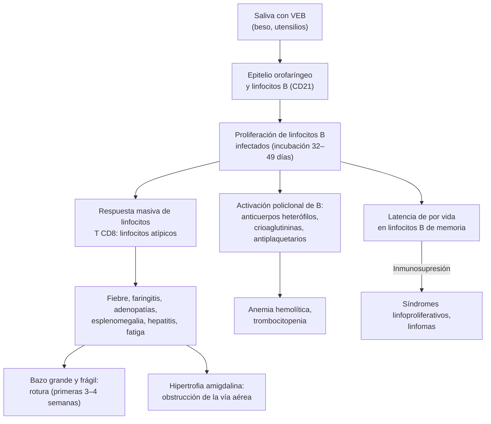

---
tags:
  - Infectología
---

# Síndrome mononucleósico, adenopatías y adenitis

**Subespecialidad**
Infectología · Medicina interna · Hemato-oncología (diagnóstico diferencial)

**Guías principales**
AMSSM 2023: mononucleosis y actividad deportiva · Revisión rápida de evidencia de la mononucleosis (AFP 2023) · Cochrane 2015: corticoides en la mononucleosis · IDSA 2014: infecciones de piel y partes blandas (abscesos, enfermedad por arañazo de gato)

**Otras fuentes**
Enfoque de la adenopatía inexplicada (Gaddey y Riegel 2016) · Estudios prospectivos de mononucleosis en universitarios (Grimm 2016) · Enfermedad por arañazo de gato en adultos chilenos (Eymin 2006) · Seroprevalencia de VEB y CMV en adultos chilenos con VIH (Luchsinger 2010)

**GES**
No es GES.

**EUNACOM**
1.04.1.025 Síndrome mononucleósico (específico, completo, completo) · 1.04.1.001 Adenitis, adenoflegmón (específico, completo, completo)

**Revisado**
Octubre 2026

!!! abstract "Resumen en 60 segundos"
    - **Síndrome mononucleósico**: **fiebre**, **faringitis**, **adenopatías** (sobre todo **cervicales posteriores**) y **linfocitosis con linfocitos atípicos**. La causa principal es el **virus de Epstein-Barr (VEB)**: es la **mononucleosis infecciosa**.
    - El VEB se transmite por la **saliva** (el beso), tiene una **incubación de 32–49 días** y su máximo de incidencia está entre los **15 y 24 años**. Más del **95 %** de los adultos ya se infectó.
    - **Diagnóstico**:
        - Hemograma con **> 10 % de linfocitos atípicos**.
        - **Anticuerpos heterófilos** (Monotest): sensibilidad **87 %**, con **falsos negativos** en la primera semana y en los niños pequeños.
        - Si son negativos: **IgM anti-VCA** (con **anti-EBNA negativo** = infección primaria).
        - Las **transaminasas** suben en la mayoría.
    - **Mononucleosis con heterófilos negativos**: piensa en **CMV**, **VIH agudo** (¡pedir el test!), toxoplasmosis, otros virus, y en **fármacos** o un **linfoma** si no calza.
    - **Tratamiento**: **sintomático** (paracetamol, hidratación).
        - **No** usar antivirales.
        - Usar **corticoides** solo si hay **obstrucción de la vía aérea** o complicaciones graves (anemia hemolítica, trombocitopenia grave).
        - **Evitar la amoxicilina**: causa un exantema frecuente.
    - **Rotura esplénica** (0,1–0,2 %, la mayoría en las primeras 3 semanas): evitar los **deportes de contacto** al menos **3–4 semanas**.
    - **Adenopatías**: la mayoría son benignas y reactivas.
        - **Signos de alarma**: > 40 años, **supraclavicular**, > 2 cm, dura o adherida, síntomas B, > 4 semanas. Con ellos, **biopsia excisional**.
        - **No dar corticoides antes del diagnóstico**.
    - **Adenitis aguda bacteriana**: ganglio rojo, caliente y doloroso, por ***S. aureus*** o ***S. pyogenes***.
        - Se trata con **cefadroxilo** (o amoxicilina/clavulánico si el foco es dental).
        - Si hay un **adenoflegmón** (absceso), **ecografía y drenaje**.
        - Si hubo contacto con gatos: **enfermedad por arañazo de gato** (*Bartonella*; azitromicina).

## Definición

| Concepto | Definición |
|---|---|
| **Síndrome mononucleósico** | Fiebre, faringitis o amigdalitis, adenopatías y **linfocitosis** con **linfocitos atípicos** (reactivos), a menudo con esplenomegalia y elevación de transaminasas |
| **Mononucleosis infecciosa** | Síndrome mononucleósico causado por la **infección primaria por VEB**. Criterios clásicos de Hoagland: fiebre, faringitis, adenopatías, **≥ 50 % de linfocitos** y **≥ 10 % de linfocitos atípicos**, con serología positiva |
| **Síndrome mononucleósico con heterófilos negativos** ("*mono-like*") | Cuadro similar con anticuerpos heterófilos negativos: **CMV**, **VIH agudo**, *Toxoplasma*, VHH-6, adenovirus, hepatitis virales, o un VEB con heterófilos negativos |
| **Adenopatía** | Ganglio linfático **anormal en tamaño** (en general **> 1 cm**; epitroclear > 0,5 cm; inguinal > 2 cm) **o en consistencia**. Los ganglios **supraclaviculares**, poplíteos e ilíacos palpables son siempre anormales |
| **Adenopatía generalizada** | Compromete **2 o más grupos ganglionares no contiguos** |
| **Adenitis** (linfadenitis) | **Inflamación** del ganglio por una infección: aumento de tamaño con **dolor**, calor y eritema |
| **Adenoflegmón** | Adenitis **supurada**: el ganglio se abscede (**fluctuación**). Requiere **drenaje** |

## Epidemiología

- **VEB**:
    - Infecta a **más del 95 %** de los adultos en el mundo.
    - En los países de menores ingresos se adquiere en la **infancia** (asintomático o leve). En los de mayores ingresos se retrasa a la **adolescencia**, cuando produce la **mononucleosis** sintomática.
    - Incidencia de **6–8 casos por 1000 personas-año** entre los **15 y 24 años**, más alta en los internados y las universidades (11–48 por 1000).
    - En universitarios sin anticuerpos seguidos cada 2 semanas, la incidencia de infección primaria fue de **24 por 100 personas-año**. El único factor de riesgo fue el **beso profundo**.
- **Hospitalización**: **< 1 %** (hepatitis grave, obstrucción de la vía aérea, síndrome hemofagocítico).
- **Adenopatías**:
    - Motivo de consulta frecuente en APS.
    - Solo el **1,1 %** se debe a un cáncer: **4 %** en los mayores de 40 años y **0,4 %** en los menores de 40.

!!! chile "Datos nacionales"
    - **No hay** estudios poblacionales recientes de la incidencia de la mononucleosis en Chile.
    - En **400 adultos chilenos con VIH** (2005–2006), la seroprevalencia fue de **99,7 % para el VEB**, **98,5 % para el CMV** y **92,2 % para el VHS-1**. En la población general chilena no había datos.
    - **Enfermedad por arañazo de gato en adultos** (Hospital Clínico UC, 8 pacientes):
        - Fiebre con baja de peso (7 de 8), sudoración y **adenopatías dolorosas** submandibulares y axilares.
        - **PCR elevada** en todos.
        - **Solo 5 recordaban contacto con gatos**.
        - Todos se recuperaron, incluso uno sin antibióticos.
        - En el sur de Chile se ha secuenciado *Bartonella henselae* de gatos (Valdivia).
    - **El VIH agudo es un diferencial obligatorio** del síndrome mononucleósico en Chile, donde los nuevos diagnósticos aumentaron ([ver VIH](infeccion-por-vih.md)). La **tuberculosis ganglionar** también lo es ([ver tuberculosis](../respiratorio/tuberculosis.md)).

## Etiología

| Causa | Claves |
|---|---|
| **VEB** (mononucleosis infecciosa) | Adolescente o adulto joven; **faringitis exudativa**, adenopatías **cervicales posteriores**, **esplenomegalia**, petequias en el paladar, edema palpebral; linfocitos atípicos; **heterófilos positivos** |
| **Citomegalovirus** | Adulto algo mayor; **fiebre prolongada** con poca faringitis y pocas adenopatías; hepatitis leve; heterófilos negativos; IgM anti-CMV |
| **VIH agudo** (síndrome retroviral agudo) | **Exantema**, úlceras orales o genitales, diarrea, mialgias, meningitis aséptica; conducta de riesgo 2–4 semanas antes. **Test de 4.ª generación** (antígeno p24 + anticuerpos) o carga viral |
| ***Toxoplasma gondii*** | Adenopatías **cervicales** indoloras, poca fiebre y poca faringitis; contacto con gatos o carne cruda; IgM e IgG con avidez |
| **Otros virus** | VHH-6, adenovirus, hepatitis A y B, rubéola, sarampión |
| **Faringitis estreptocócica** | Fiebre, exudado, adenopatías **cervicales anteriores** dolorosas, **sin tos**; **test rápido** o cultivo. Puede **coexistir** con el VEB |
| **Fármacos** | **DRESS** (anticonvulsivantes, alopurinol, sulfas): exantema, eosinofilia, linfocitos atípicos, hepatitis |
| **Neoplasias** | **Leucemia aguda** (blastos, citopenias) y **linfoma** (adenopatías persistentes, síntomas B) |

| Causa de adenitis aguda | Claves |
|---|---|
| ***S. aureus*** y ***S. pyogenes*** | Ganglio **cervical o submandibular** (o axilar o inguinal) rojo, caliente y doloroso, con una **puerta de entrada**: piel, faringe, dientes, cuero cabelludo |
| **Origen dental** (anaerobios orales) | Submandibular, con una caries o un absceso dental ([ver flegmón cervical](flegmon-cervical-absceso-pulmonar-y-cerebral.md)) |
| **Enfermedad por arañazo de gato** (*Bartonella henselae*) | Contacto con **gatos** (cachorros); pápula en el sitio de inoculación; adenopatía **regional** dolorosa (axilar, cervical, epitroclear) que puede supurar; fiebre en algunos |
| **Tuberculosis ganglionar** (escrófula) | Adenopatía **cervical** crónica, poco dolorosa, que se fistuliza; a veces sin compromiso pulmonar |
| **Micobacterias no tuberculosas** | Niños pequeños; ganglio violáceo e indoloro |
| **Tularemia, peste, linfogranuloma venéreo, chancroide, sífilis** | Según la exposición; las inguinales en las ITS ([ver ITS](infecciones-de-transmision-sexual-y-sifilis.md)) |

## Fisiopatología

- **VEB**:
    1. **Transmisión**: por la saliva. Infecta el epitelio de la orofaringe y los **linfocitos B** (receptor **CD21**).
    2. **Incubación**: 32–49 días. El virus se replica en la faringe y las células B infectadas **proliferan**.
    3. **Respuesta inmune**: los **linfocitos T CD8** citotóxicos se expanden en forma masiva para controlar a los linfocitos B infectados.
        - Esas células T activadas son los **"linfocitos atípicos"** (reactivos) del frotis.
        - La respuesta T, más que el virus, explica la fiebre, las **adenopatías**, la **esplenomegalia**, la **hepatitis** y la fatiga.
    4. **Activación policlonal de los linfocitos B**: produce los **anticuerpos heterófilos** (aglutinan glóbulos rojos de caballo u oveja: base del Monotest). También produce autoanticuerpos, como las **crioaglutininas anti-i** (anemia hemolítica) y los antiplaquetarios (trombocitopenia).
    5. **Latencia de por vida** en los linfocitos B de memoria.
        - En el **inmunosuprimido** (trasplante, VIH) puede causar **síndromes linfoproliferativos** y linfomas.
        - El VEB se asocia al **linfoma de Hodgkin**, el **linfoma de Burkitt**, el **carcinoma nasofaríngeo** y la **esclerosis múltiple**.
    - **Bazo**: la infiltración linfocitaria lo **agranda y lo hace frágil**: riesgo de **rotura** con traumas menores, sobre todo en las primeras **3–4 semanas**.
    - **Exantema por amoxicilina**: no es una alergia verdadera, sino una reacción inmune transitoria favorecida por la activación de los linfocitos.
- **Adenitis**: las bacterias llegan al ganglio por los **linfáticos** desde la puerta de entrada. Con la inflamación intensa, el ganglio se **necrosa y se abscede** (adenoflegmón).

*Figura 1. Fisiopatología de la mononucleosis por VEB. Esquema propio.*

## Clasificación

- **Síndrome mononucleósico según la serología**:
    - **Con heterófilos positivos**: VEB (casi siempre).
    - **Con heterófilos negativos**: VEB temprano (primera semana) o en niños pequeños; CMV; VIH agudo; toxoplasmosis; otros.
- **Mononucleosis por VEB según la gravedad**:
    - **Típica, autolimitada**: 2–4 semanas.
    - **Complicada**: obstrucción de la vía aérea, rotura esplénica, hepatitis grave, hemólisis, trombocitopenia grave, compromiso neurológico, síndrome hemofagocítico.
    - **Infección crónica activa por VEB**: rara; fiebre, adenopatías y hepatoesplenomegalia persistentes por meses, con carga viral alta.
- **Adenopatías**:
    - Por su **extensión**: **localizada** (una región) o **generalizada** (≥ 2 grupos no contiguos).
    - Por su **duración**: **aguda** (< 2 semanas), **subaguda** o **crónica** (> 4–6 semanas).
    - Por su **causa** (regla nemotécnica en inglés MIAMI): **M**alignidad, **I**nfección, **A**utoinmunidad, causas **M**iscelánea e **I**atrogenia (fármacos, vacunas).
- **Adenitis**: **aguda** (bacteriana, viral), **subaguda o crónica** (arañazo de gato, TBC, micobacterias, toxoplasmosis); **no supurada** o **supurada** (adenoflegmón).

## Clínica

- **Mononucleosis por VEB**:
    - **Pródromo** de malestar y fatiga por algunos días.
    - **Faringitis** intensa con **exudado amigdalino** (~50 %), odinofagia, a veces con **petequias en el paladar** (más sugerentes, aunque menos frecuentes).
    - **Fiebre** de 1–2 semanas.
    - **Adenopatías cervicales posteriores** (el hallazgo más predictivo, LR+ 3,2), también anteriores, axilares o inguinales.
    - **Esplenomegalia**: casi universal en la ecografía, pero el **examen físico la detecta poco** (sensibilidad 20–70 %).
    - Edema **palpebral**, hepatomegalia leve, ictericia ocasional.
    - **Exantema** en < 5 % (sin antibióticos); muy frecuente si se da **amoxicilina** o ampicilina.
    - **Fatiga**: puede durar **semanas o meses** (algunos más de 6 meses).
    - **En el adulto mayor** (raro): más fiebre y hepatitis (ictericia), menos faringitis y menos adenopatías. **Se confunde con una colangitis o un linfoma**.
- **CMV**: fiebre prolongada, malestar, hepatitis leve, poca faringitis y pocas adenopatías.
- **VIH agudo**: fiebre, faringitis **sin exudado**, **exantema** maculopapular, **úlceras** mucosas, mialgias, diarrea, adenopatías generalizadas.
- **Adenitis bacteriana aguda**:
    - Ganglio **aumentado de tamaño, doloroso, caliente y eritematoso**, de evolución en días, a menudo con **fiebre**.
    - Si aparece **fluctuación**, se formó un **adenoflegmón**.
    - Buscar la **puerta de entrada**: faringe, dientes, lesión de la piel o del cuero cabelludo.
- **Enfermedad por arañazo de gato**:
    - **Pápula** en el sitio del rasguño (3–10 días).
    - Luego, en **1–3 semanas**, una **adenopatía regional** dolorosa (axilar, epitroclear, cervical), que puede supurar.
    - Fiebre y malestar en algunos.
    - Formas atípicas: **neurorretinitis**, granulomas hepatoesplénicos, **fiebre de origen desconocido**, endocarditis con hemocultivos negativos.

!!! alarma "Signos de alarma"
    - **Estridor**, babeo, voz apagada, incapacidad de tragar la saliva: **obstrucción de la vía aérea** por hipertrofia amigdalina. Hospitalizar; **corticoides**; evaluación otorrinolaringológica.
    - **Dolor abdominal en el hipocondrio izquierdo**, dolor en el hombro izquierdo (signo de Kehr), hipotensión o taquicardia: **rotura esplénica**. Reanimar, ecografía o TC, cirujano.
    - **Dolor de garganta unilateral intenso**, trismo, desviación de la úvula: **absceso periamigdalino**.
    - **Ictericia**, coagulopatía o compromiso de conciencia: hepatitis grave.
    - **Fiebre persistente con citopenias**, hepatoesplenomegalia, ferritina muy alta: **síndrome hemofagocítico**.
    - **Adenopatía supraclavicular**, dura o adherida, > 2 cm, que crece por > 4 semanas, o con **síntomas B**: estudio de **linfoma o cáncer**.

## Diagnóstico

!!! guia "Diagnóstico del síndrome mononucleósico (AFP 2023; AMSSM 2023)"
    1. **Hemograma con frotis**: **linfocitosis** y **linfocitos atípicos**. Su valor predictivo sube con el porcentaje: > 10 % (LR+ 9), > 20 % (LR+ 28), > 40 % (LR+ 50).
    2. **Anticuerpos heterófilos** (Monotest): sensibilidad **87 %** y especificidad **91 %**.
        - Pueden ser **negativos hasta en el 25 %** de los adultos en la **primera semana**: repetir la prueba.
        - Muy poco sensibles en los **menores de 5 años**.
    3. **Anticuerpos específicos del VEB** (si los heterófilos son negativos y la sospecha persiste). Son más sensibles (97 %) y específicos (94 %):
        - **IgM anti-VCA** positiva con **anti-EBNA negativo** = **infección primaria**.
        - **IgG anti-VCA** con **anti-EBNA positivo** = **infección pasada** (busca otra causa).
    4. **Pruebas hepáticas**: transaminasas elevadas en el **58–100 %**.
    5. **Si es heterófilo negativo o atípico**:
        - **Test de VIH de 4.ª generación** (y carga viral si la sospecha es alta y el test sale negativo).
        - IgM anti-CMV.
        - Serología de *Toxoplasma*.
        - **Test rápido o cultivo de estreptococo** si hay faringitis exudativa.
    6. **Carga viral del VEB (PCR en sangre)**: útil en los **inmunosuprimidos** y las complicaciones (síndrome hemofagocítico, linfoproliferativos), no en la mononucleosis típica.

!!! guia "Diagnóstico de las adenopatías (Gaddey y Riegel 2016)"
    - **Historia**:
        - **Tiempo** de evolución, **síntomas B** (fiebre, sudoración nocturna, baja de peso).
        - **Exposiciones**: gatos, TBC, conductas sexuales, viajes, carne cruda.
        - **Fármacos**: fenitoína, alopurinol, vacunas recientes.
    - **Examen**:
        - Ubicación, **tamaño**, consistencia, dolor, **adherencia**.
        - El **territorio de drenaje**.
        - **Todas las regiones ganglionares**.
        - **Bazo e hígado**.
    - **Localizada con características benignas**: **tratar la causa u observar 4 semanas**.
    - **Generalizada**: hemograma con frotis, VIH, VEB, CMV, VDRL, radiografía de tórax, LDH, y según la clínica ANA o PPD/IGRA.
    - **Biopsia** si hay **factores de riesgo de cáncer** o si **persiste**:
        - Factores de riesgo: edad > 40, sexo masculino, **supraclavicular**, síntomas sistémicos, hepatoesplenomegalia, ganglio duro o adherido.
        - Preferir la **biopsia excisional** del ganglio más anormal. La punción aspirativa (PAAF) tiene una sensibilidad de 85–95 % y **no da la arquitectura** necesaria para el linfoma.
    - **Evitar los corticoides** hasta tener el diagnóstico: pueden **ocultar un linfoma o una leucemia**.
    - **Adenitis**: si se sospecha un **absceso**, **ecografía** (y TC si es profundo o cervical complicado). Cultivar el pus del drenaje.

<figure markdown>
![Gráfico de los anticuerpos contra el VEB en 80 universitarios con infección primaria, desde 10 semanas antes hasta 50 semanas después del inicio de los síntomas. La IgM anti-VCA y la IgG anti-gp350 aparecen primero, con un máximo cerca del inicio de la enfermedad; la IgM anti-VCA cae bajo el valor de corte hacia las semanas 20 a 30. La IgG anti-VCA sube de forma sostenida desde el inicio y se mantiene alta. La IgG anti-EBNA-1 es la más lenta: sube desde la semana 10 y sigue aumentando hasta la semana 50. La respuesta anti-gp350 es bifásica, con un segundo máximo cerca de la semana 40](../assets/figuras/mononucleosis/cinetica-anticuerpos-veb-grimm-2016.jpg){ loading=lazy }
<figcaption>Figura 2. Cinética de los anticuerpos en la infección primaria por VEB (80 universitarios seguidos de forma prospectiva). La IgM anti-VCA aparece primero y luego desaparece; la IgG anti-VCA persiste de por vida; la IgG anti-EBNA-1 aparece tarde (semanas o meses). Por eso, IgM anti-VCA positiva con anti-EBNA negativo indica una infección reciente. Fuente: Grimm JM, Schmeling DO, Dunmire SK, et al. Prospective studies of infectious mononucleosis in university students. <em>Clin Transl Immunology.</em> 2016;5(8):e94, figura 3. Licencia <a href="https://creativecommons.org/licenses/by/4.0/">CC BY 4.0</a>.</figcaption>
</figure>

| Serología del VEB | IgM anti-VCA | IgG anti-VCA | Anti-EBNA | Interpretación |
|---|---|---|---|---|
| **Nunca infectado** | − | − | − | Susceptible |
| **Infección aguda** | **+** | + o − | **−** | **Mononucleosis por VEB** |
| **Infección reciente** (semanas a meses) | + o − | + | − o débil | Convalecencia |
| **Infección pasada** | − | + | **+** | El VEB **no** explica el cuadro actual |

## Laboratorio

| Examen | Hallazgo |
|---|---|
| **Hemograma** | Leucocitosis moderada con **linfocitosis** y **linfocitos atípicos** (> 10 %); **trombocitopenia** leve frecuente; anemia hemolítica rara (crioaglutininas) |
| **Pruebas hepáticas** | **Transaminasas elevadas** (2–3 veces el valor normal) en la mayoría; ictericia en pocos |
| **Anticuerpos heterófilos** | Positivos en el VEB después de la primera semana |
| **Serología específica** | IgM e IgG anti-VCA, anti-EBNA (VEB); IgM anti-CMV; IgM e IgG de *Toxoplasma* con avidez |
| **VIH** | Test de 4.ª generación; **carga viral** si hay sospecha de una infección aguda en el período de ventana |
| **Test rápido de estreptococo** | Faringitis exudativa: el VEB y el estreptococo pueden coexistir |
| **LDH, ácido úrico, frotis** | Si se sospecha un linfoma o una leucemia (blastos, citopenias) |
| **Ferritina, triglicéridos, fibrinógeno** | Si se sospecha un síndrome hemofagocítico |
| **Serología de *Bartonella*** | Adenitis con contacto con gatos (IgG por inmunofluorescencia; en la serie chilena, títulos > 1:256) |
| **PPD o IGRA, cultivo y PCR de micobacterias** | Adenitis crónica o fistulizada |

## Imágenes

- **Ecografía abdominal**: confirma la **esplenomegalia** (el examen físico la subestima). Puede orientar la decisión de volver a los deportes de contacto, aunque el tamaño normal **no garantiza** la ausencia de riesgo.
- **TC de abdomen**: si se sospecha una **rotura esplénica** (dolor, inestabilidad).
- **Ecografía de cuello o del ganglio**: diferencia una **adenitis** de un **absceso** (colección líquida) y guía el drenaje. Muestra signos de malignidad (forma redonda, pérdida del hilio graso, necrosis, vascularización periférica).
- **TC de cuello**: si se sospecha un absceso **profundo** (periamigdalino, parafaríngeo, retrofaríngeo).
- **Radiografía o TC de tórax**: adenopatías **mediastínicas** (linfoma, TBC, sarcoidosis) en el estudio de la adenopatía generalizada o persistente.

<figure markdown>
![Algoritmo para el adulto con adenopatías. Se parte de una adenopatía palpable anormal, mayor de 1 centímetro, epitroclear mayor de medio centímetro o inguinal mayor de 2 centímetros. Si es generalizada, con 2 o más grupos no contiguos, se piensa en un síndrome mononucleósico por VEB, CMV, VIH agudo o toxoplasmosis, en sífilis secundaria, tuberculosis, lupus, sarcoidosis, fármacos, linfoma o leucemia, y se piden hemograma con frotis, VIH, VEB, CMV, VDRL, radiografía de tórax y LDH, con biopsia si no se aclara. Si es localizada, se busca la causa en el territorio de drenaje. Luego se buscan signos de alarma: edad mayor de 40 años, ubicación supraclavicular, tamaño mayor de 2 centímetros, ganglio duro o adherido, indoloro y creciente, fiebre, sudoración nocturna, baja de peso, hepatoesplenomegalia, citopenias o persistencia de más de 4 semanas. Con signos de alarma, biopsia excisional del ganglio más anormal; sin ellos, tratar la causa u observar 4 semanas y biopsiar si persiste o crece. Al pie: la adenitis aguda con ganglio caliente y doloroso es por S. aureus o S. pyogenes, y si fluctúa requiere ecografía, drenaje y antibiótico; no dar corticoides antes del diagnóstico](../assets/figuras/mononucleosis/enfoque-adenopatia.svg){ loading=lazy }
<figcaption>Figura 3. Enfoque del adulto con adenopatías. Esquema propio basado en Gaddey y Riegel 2016 e IDSA 2014.</figcaption>
</figure>

## Diagnóstico diferencial

| Cuadro | Claves |
|---|---|
| **Faringoamigdalitis estreptocócica** | Inicio brusco, adenopatías **anteriores** dolorosas, sin tos, sin esplenomegalia ni linfocitos atípicos; test rápido positivo |
| **VIH agudo** | Exantema, úlceras mucosas, conducta de riesgo; test de 4.ª generación o carga viral |
| **Mononucleosis por CMV** | Fiebre prolongada, poca faringitis, heterófilos negativos, IgM anti-CMV |
| **Toxoplasmosis aguda** | Adenopatías cervicales sin faringitis; serología con avidez baja |
| **Hepatitis viral aguda** | Transaminasas muy altas (> 10 veces), ictericia; serologías A, B, C |
| **Leucemia aguda** | Blastos en el frotis, citopenias, dolor óseo |
| **Linfoma** | Adenopatías **indoloras**, **persistentes**, que crecen; síntomas B; LDH alta |
| **DRESS** | Fármaco iniciado 2–8 semanas antes, exantema, **eosinofilia**, hepatitis |
| **Difteria** (excepcional) | Membrana grisácea adherente, sin vacunación |
| **Adenitis bacteriana vs. otros "bultos" del cuello** | Quiste branquial infectado, quiste tirogloso, **sialoadenitis** (parótida, submandibular), absceso dental, **metástasis** de un carcinoma de cabeza y cuello (adulto fumador) |

## Tratamiento

!!! guia "Mononucleosis infecciosa (AFP 2023; Cochrane 2015; AMSSM 2023)"
    - **Sintomático**:
        - **Paracetamol** o AINE para la fiebre y el dolor (evitar los AINE si hay trombocitopenia importante o hepatitis).
        - **Hidratación**; gárgaras o anestésicos locales.
        - **Reposo relativo** según la tolerancia (no reposo absoluto).
    - **No usar antivirales** (aciclovir, valaciclovir): no mejoran el curso de la mononucleosis no complicada.
    - **Corticoides**:
        - **No** en la mononucleosis no complicada: la evidencia no muestra beneficio sostenido.
        - **Sí** en la **obstrucción de la vía aérea** por hipertrofia amigdalina y en complicaciones graves (**anemia hemolítica**, **trombocitopenia grave**).
    - **Evitar la amoxicilina y la ampicilina**: causan un **exantema maculopapular** muy frecuente. No es una alergia verdadera, pero confunde. Si hay una faringitis estreptocócica concomitante confirmada, puede usarse penicilina benzatina o una alternativa.
    - **Evitar el alcohol** y los hepatotóxicos mientras haya hepatitis.
    - **Actividad física**:
        - Evitar el ejercicio intenso al menos **2 semanas**.
        - Evitar los **deportes de contacto o colisión** al menos **3–4 semanas** desde el inicio de los síntomas, y hasta que el paciente esté **afebril y bien**.
        - Volver de forma **gradual**, empezando por actividad ligera sin contacto.
    - **Contagio**: el virus se excreta en la saliva por meses; no se requiere aislamiento, pero conviene **no compartir utensilios ni besar** en la fase aguda.

!!! guia "Adenitis y adenoflegmón (IDSA 2014; Bass 1998)"
    - **Adenitis bacteriana aguda no supurada**: antibiótico **oral** contra ***S. aureus*** y ***S. pyogenes*** por **7–10 días**, calor local y analgesia; tratar la puerta de entrada.
        - Si el foco es **dental u orofaríngeo**: **amoxicilina/clavulánico** (cubre los anaerobios orales).
        - Si hay **riesgo de SAMR**: cotrimoxazol o clindamicina, según la epidemiología local.
    - **Adenoflegmón** (absceso):
        - **Drenaje** (incisión y drenaje, o aspiración guiada por ecografía), con **cultivo** del pus, más antibiótico.
        - Por vía **EV** (cefazolina) si hay compromiso sistémico, celulitis extensa, inmunosupresión o un absceso profundo del cuello.
    - **Enfermedad por arañazo de gato**:
        - Habitualmente **autolimitada** (2–4 meses).
        - La **azitromicina por 5 días** acelera la reducción del ganglio en el primer mes.
        - Si el ganglio **supura**, se prefiere clásicamente la **aspiración con aguja** a la incisión, para evitar una fístula crónica.
    - **Tuberculosis ganglionar**: esquema antituberculoso estándar (ver [tuberculosis](../respiratorio/tuberculosis.md)).
    - **Control** a las 48–72 horas. Si no mejora, o si persiste después de 4 semanas pese al tratamiento, **reevaluar**: absceso no drenado, otra etiología (TBC, *Bartonella*, micobacterias atípicas) o **neoplasia**. Pedir **biopsia**.

!!! dosis "Dosis (adulto)"
    | Fármaco | Dosis | Uso |
    |---|---|---|
    | **Paracetamol** | 500 mg–1 g VO cada 6–8 h (máximo 3–4 g/día; menos si hay hepatitis) | Fiebre y dolor en la mononucleosis |
    | **Prednisona** | Dosis habitual 40–60 mg/día por algunos días, con disminución rápida (no hay estudios de dosis) | **Solo** en la obstrucción de la vía aérea o las complicaciones inmunes graves |
    | **Cefadroxilo** | **500 mg–1 g VO cada 12 h** por 7–10 días | Adenitis bacteriana aguda |
    | **Amoxicilina/clavulánico** | **875/125 mg VO cada 12 h** por 7–10 días | Adenitis con foco dental u orofaríngeo |
    | **Clindamicina** | **300–450 mg VO cada 8 h** | Alergia a betalactámicos o riesgo de SAMR |
    | **Cefazolina** | **1–2 g EV cada 8 h** | Adenoflegmón con compromiso sistémico |
    | **Azitromicina** | **500 mg** el día 1, luego **250 mg/día** los días 2 a 5 | Enfermedad por arañazo de gato (> 45 kg) |

## Complicaciones

| Complicación | Comentario |
|---|---|
| **Obstrucción de la vía aérea** | Hipertrofia amigdalina masiva; corticoides, vía aérea |
| **Rotura esplénica** | **0,1–0,2 %**, mortalidad de hasta 9 %. El **74 %** ocurre en los primeros **21 días** y el 90 % hacia el día 31; se describe hasta la semana 8. Puede ser espontánea |
| **Hepatitis** | Frecuente y leve; rara vez grave con ictericia |
| **Hematológicas** | **Anemia hemolítica** autoinmune (crioaglutininas), **trombocitopenia**, neutropenia; **síndrome hemofagocítico** (raro, grave) |
| **Neurológicas** | Encefalitis, meningitis aséptica, **Guillain-Barré**, parálisis facial, mielitis transversa |
| **Otras** | Absceso periamigdalino, miocarditis, pericarditis, glomerulonefritis, orquitis |
| **A largo plazo** | **Fatiga** prolongada; asociación con el **linfoma de Hodgkin**, el **carcinoma nasofaríngeo** y la **esclerosis múltiple** |
| **Adenitis** | Adenoflegmón, **celulitis**, fistulización (TBC, arañazo de gato), extensión a los espacios profundos del cuello, bacteriemia |

## Pronóstico y seguimiento

- **Mononucleosis**:
    - **Autolimitada**: el cuadro agudo dura de **3 días a 8 semanas** (habitualmente 2–4 semanas).
    - La **fatiga** puede persistir meses.
    - La mayoría vuelve a sus actividades en 2–4 semanas.
- **Seguimiento**:
    - Control clínico a las **2–4 semanas**.
    - Advertir sobre el **dolor abdominal** (bazo) y la **disnea o el estridor**.
    - Controlar el hemograma y las pruebas hepáticas si estaban alterados.
    - Si las **adenopatías persisten** más de 4–6 semanas, o aparecen citopenias, **reevaluar** (linfoma).
- **Adenopatías**: si se decidió observar, **reevaluar a las 4 semanas**. Si no disminuyen, **biopsia**.
- **Adenitis**: debe mejorar en 48–72 horas con el antibiótico. La resolución completa del ganglio puede tardar semanas; la **arañazo de gato**, meses.

## Perlas para el internado

!!! perla "Para recordar en la sala"
    - **Faringitis + adenopatías cervicales posteriores + esplenomegalia + linfocitos atípicos** = mononucleosis por VEB.
    - **Monotest negativo en la primera semana no descarta**: repítelo o pide la **IgM anti-VCA**.
    - **IgM anti-VCA (+) y anti-EBNA (−)** = infección aguda. **Anti-EBNA (+)** = infección antigua: busca otra causa.
    - **Síndrome mononucleósico = pide VIH** (4.ª generación y, si hay dudas, carga viral). El VIH agudo se pierde si no se busca.
    - **No des amoxicilina** a una faringitis con aspecto de mononucleosis: el exantema es casi la regla.
    - **Nada de corticoides "para que se sienta mejor"**: solo si hay obstrucción de la vía aérea o complicaciones graves.
    - **Sin deportes de contacto por 3–4 semanas** (bazo).
    - **Adenopatía supraclavicular = siempre anormal**: la izquierda (ganglio de Virchow) sugiere un cáncer abdominal.
    - **No uses corticoides en una adenopatía sin diagnóstico**: pueden enmascarar un linfoma.
    - **Adenitis que fluctúa = adenoflegmón**: ecografía y drenaje; el antibiótico solo no basta.

## Preguntas de repaso

??? repaso "1. Estudiante de 19 años con 6 días de fiebre, odinofagia intensa, exudado amigdalino, adenopatías cervicales posteriores y polo de bazo palpable. Leucocitos 13 000/mm³, linfocitos 62 % con 18 % de atípicos, GPT 140 U/L. ¿Diagnóstico, estudio y manejo?"
    - **Mononucleosis infecciosa por VEB**: faringitis, adenopatías **posteriores**, esplenomegalia, **linfocitos atípicos** y transaminasas elevadas.
    - **Estudio**: **Monotest** (anticuerpos heterófilos). Si es negativo, repetirlo o pedir la **IgM anti-VCA** (con anti-EBNA). Considerar el **test de VIH** y el test rápido de estreptococo.
    - **Manejo sintomático**: paracetamol e hidratación; **sin antivirales**, **sin corticoides** (no hay obstrucción de la vía aérea) y **sin amoxicilina**.
    - **Sin deportes de contacto** por al menos 3–4 semanas; consultar si aparece dolor abdominal.

??? repaso "2. Al mismo paciente, otro médico le había indicado amoxicilina por una supuesta amigdalitis bacteriana; al día 7 presenta un exantema maculopapular generalizado. ¿Qué ocurrió y qué hace?"
    - **Exantema por aminopenicilinas en la mononucleosis**: muy frecuente con la amoxicilina o la ampicilina durante una infección por VEB.
    - **No es una alergia verdadera** a la penicilina (en general no contraindica su uso futuro, aunque el registro debe ser cuidadoso).
    - **Suspender la amoxicilina** y dar tratamiento sintomático (antihistamínicos).

??? repaso "3. Hombre de 28 años con fiebre de 10 días, faringitis sin exudado, exantema maculopapular en el tronco, úlceras orales y adenopatías generalizadas. El Monotest es negativo. Relata una relación sexual sin preservativo hace 3 semanas. ¿Qué sospecha y cómo lo estudia?"
    - **Síndrome mononucleósico con heterófilos negativos**: la sospecha principal es la **infección aguda por VIH** (síndrome retroviral agudo). Los marcadores son el exantema, las úlceras mucosas y la exposición de riesgo.
    - **Estudio**: **test de VIH de 4.ª generación** (antígeno p24 y anticuerpos) y **carga viral**, porque en la ventana el test puede ser negativo. También **VDRL** (sífilis secundaria), serología de CMV y de VEB.
    - Si se confirma: derivar para **inicio precoz de la TAR** y estudiar a las parejas.

??? repaso "4. Mujer de 55 años con una adenopatía supraclavicular izquierda de 2,5 cm, dura e indolora, de 6 semanas de evolución, con baja de 5 kg. ¿Qué conducta corresponde?"
    - **Signos de alarma**: edad > 40 años, ubicación **supraclavicular** (siempre anormal; la izquierda, el **ganglio de Virchow**, sugiere un cáncer abdominal, sobre todo **gástrico**), > 2 cm, **dura**, **persistente** y con **baja de peso**.
    - **Conducta**: **biopsia excisional** del ganglio (no solo PAAF) y estudio del primario (endoscopía digestiva, TC de tórax, abdomen y pelvis, hemograma, LDH).
    - **No indicar corticoides** ni observar más tiempo.

??? repaso "5. Hombre de 34 años con un ganglio submandibular derecho de 3 cm, rojo, caliente y muy doloroso, de 4 días de evolución, con fiebre de 38,5 °C. Tiene una caries profunda en un molar inferior. En la ecografía hay una colección de 2 cm. ¿Diagnóstico y manejo?"
    - **Adenoflegmón** submandibular (adenitis supurada), con probable **origen dental**.
    - **Manejo**:
        - **Drenaje** (incisión o aspiración guiada por ecografía) con **cultivo**.
        - **Amoxicilina/clavulánico** 875/125 mg cada 12 h (cubre *S. aureus*, estreptococos y anaerobios orales); clindamicina si hay alergia.
        - **Tratamiento dental** del foco.
    - **Vigilar** la extensión a los espacios profundos del cuello (trismo, disfagia, compromiso del piso de la boca: **angina de Ludwig**) y controlar a las 48–72 horas.

??? repaso "6. Veterinaria de 26 años con un ganglio axilar derecho doloroso de 3 cm, de 3 semanas de evolución, y febrícula. Hace un mes tuvo un rasguño de un gato pequeño en la mano derecha, con una pápula que ya cedió. ¿Qué sospecha y cómo lo maneja?"
    - **Enfermedad por arañazo de gato** (*Bartonella henselae*): adenopatía **regional** (axilar, porque drena la mano) tras un rasguño de gato, con una pápula de inoculación previa.
    - **Estudio**: **serología de *Bartonella*** (IgG por inmunofluorescencia) y ecografía del ganglio.
    - **Tratamiento**: habitualmente autolimitada. La **azitromicina** 500 mg el día 1 y luego 250 mg/día por 4 días acelera la resolución. Si supura, **aspiración con aguja** (evitar la incisión por el riesgo de fístula).
    - Si no mejora en semanas o hay signos de alarma, **biopsia** para descartar un linfoma o una TBC.

## Referencias

1. Sylvester JE, Buchanan BK, Silva TW. Infectious mononucleosis: rapid evidence review. *Am Fam Physician.* 2023;107(1):71–78. [aafp.org](https://www.aafp.org/pubs/afp/issues/2023/0100/infectious-mononucleosis.html)
2. Putukian M, McGrew CA, Benjamin HJ, et al. American Medical Society of Sports Medicine position statement: mononucleosis and athletic participation. *Clin J Sport Med.* 2023;33(4):359–367. doi:[10.1097/JSM.0000000000001161](https://doi.org/10.1097/JSM.0000000000001161)
3. Rezk E, Nofal YH, Hamzeh A, et al. Steroids for symptom control in infectious mononucleosis. *Cochrane Database Syst Rev.* 2015;(11):CD004402. doi:[10.1002/14651858.CD004402.pub3](https://doi.org/10.1002/14651858.CD004402.pub3)
4. Grimm JM, Schmeling DO, Dunmire SK, et al. Prospective studies of infectious mononucleosis in university students. *Clin Transl Immunology.* 2016;5(8):e94. doi:[10.1038/cti.2016.48](https://doi.org/10.1038/cti.2016.48)
5. Dunmire SK, Grimm JM, Schmeling DO, et al. The incubation period of primary Epstein-Barr virus infection: viral dynamics and immunologic events. *PLoS Pathog.* 2015;11(12):e1005286. doi:[10.1371/journal.ppat.1005286](https://doi.org/10.1371/journal.ppat.1005286)
6. Gaddey HL, Riegel AM. Unexplained lymphadenopathy: evaluation and differential diagnosis. *Am Fam Physician.* 2016;94(11):896–903. [aafp.org](https://www.aafp.org/pubs/afp/issues/2016/1201/p896.html)
7. Stevens DL, Bisno AL, Chambers HF, et al. Practice guidelines for the diagnosis and management of skin and soft tissue infections: 2014 update by the Infectious Diseases Society of America. *Clin Infect Dis.* 2014;59(2):e10–e52. doi:[10.1093/cid/ciu444](https://doi.org/10.1093/cid/ciu444)
8. Bass JW, Freitas BC, Freitas AD, et al. Prospective randomized double blind placebo-controlled evaluation of azithromycin for treatment of cat-scratch disease. *Pediatr Infect Dis J.* 1998;17(6):447–452. doi:[10.1097/00006454-199806000-00002](https://doi.org/10.1097/00006454-199806000-00002)
9. Eymin G, Zapata A, Andrade M, et al. Enfermedad por arañazo de gato: características clínicas y de laboratorio en pacientes adultos hospitalizados por fiebre o adenopatías. *Rev Med Chil.* 2006;134(10):1243–1248. doi:[10.4067/s0034-98872006001000005](https://doi.org/10.4067/s0034-98872006001000005)
10. Luchsinger V, Luzoro A, Martínez MJ. Elevada seroprevalencia de citomegalovirus, virus herpes simplex tipo 1 y virus Epstein Barr en adultos con virus de la inmunodeficiencia humana. *Rev Med Chil.* 2010;138(7):809–814. doi:[10.4067/s0034-98872010000700003](https://doi.org/10.4067/s0034-98872010000700003)
11. Sepulveda P, Stegger M, Monti G, et al. Draft genomes of 16 *Bartonella henselae* strains from cats in Valdivia, Chile. *Microbiol Resour Announc.* 2023;12(11):e0064823. doi:[10.1128/MRA.00648-23](https://doi.org/10.1128/MRA.00648-23)
