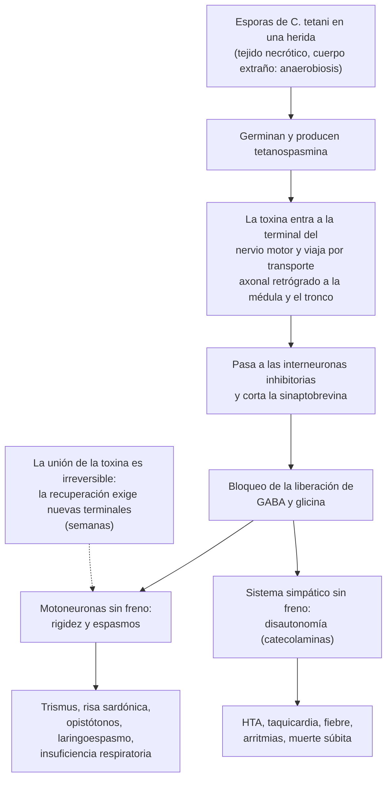

---
tags:
  - Infectología
  - Urgencia
---

# Tétanos

**Subespecialidad**
Infectología · Medicina intensiva · Neurología

**Guías principales**
ACIP 2018: prevención de tos convulsiva, tétanos y difteria (incluye la profilaxis en heridas) · ACIP 2019: uso de dTpa · OMS: hoja informativa de tétanos (2026) · Guías clínicas de Médicos Sin Fronteras (tratamiento) · Revisión de Yen y Thwaites (*Lancet*, 2019)

**Otras fuentes**
Departamento de Epidemiología MINSAL (situación del tétanos en Chile) · Calendario del PNI 2026 · Ensayos de Thwaites 2006 (sulfato de magnesio) y Van Hao 2022 (antitoxina intratecal)

**GES**
No

**EUNACOM**
1.04.2.009 Tétanos (sospecha, inicial, derivar)

**Revisado**
Septiembre 2026

!!! abstract "Resumen en 60 segundos"
    - Lo causa la **tetanospasmina**, toxina de ***Clostridium tetani*** (esporas del suelo) que entra por una **herida**, a veces mínima.
        - La toxina **bloquea las interneuronas inhibitorias** (GABA y glicina): **rigidez y espasmos** con la **conciencia intacta**.
    - **Clínica**: **trismus** (el primer signo), **risa sardónica**, rigidez de la nuca, el abdomen y la espalda (**opistótonos**), y **espasmos** dolorosos desencadenados por el ruido o el tacto. Después, **disautonomía** (HTA y taquicardia lábiles).
    - **El diagnóstico es clínico**: no hay examen que lo confirme ni lo descarte.
    - **Tratamiento**, en paralelo:
        - **UCI** y **vía aérea**.
        - **Inmunoglobulina antitetánica humana 500 UI IM** (neutraliza la toxina libre) y **toxoide tetánico** en otro sitio.
        - **Debridar la herida** y **metronidazol 500 mg EV c/8 h por 7 días**.
        - **Benzodiacepinas**, **sulfato de magnesio** y relajantes musculares con ventilación mecánica para los espasmos.
    - **La enfermedad no deja inmunidad**: completar la **vacunación** al recuperarse.
    - **Prevención en toda herida**, según las dosis previas y el tipo de herida:
        - **Vacuna** si hay menos de 3 dosis, o si la última fue hace **> 10 años** (herida limpia) o **≥ 5 años** (herida sucia).
        - **Inmunoglobulina 250 UI** si la herida es sucia y hay **menos de 3 dosis o se desconoce** la historia.
    - En Chile hay **~ 8 casos al año**, sobre todo en **hombres adultos**. No hay tétanos neonatal desde **1996**.

## Definición

- **Tétanos**: enfermedad aguda, **no contagiosa**, causada por la **tetanospasmina** de *Clostridium tetani*. Se caracteriza por **hipertonía** muscular, **espasmos** dolorosos y **disautonomía**, sin otra causa aparente.
- **Formas clínicas**:
    - **Generalizado**: la forma más frecuente y grave.
    - **Localizado**: rigidez y espasmos limitados a los músculos cercanos a la herida. Puede generalizarse.
    - **Cefálico**: tras heridas de la cabeza, la cara u otitis crónica. Parálisis de pares craneales (el facial, sobre todo) con trismus. Puede generalizarse.
    - **Neonatal**: por la infección del cordón umbilical en hijos de madres no vacunadas.

## Epidemiología

### Mundial

- La OMS recomienda **6 dosis** de vacuna con toxoide tetánico a lo largo de la vida: **3 primarias** en la infancia y **3 refuerzos** hasta la adolescencia.
- **Tétanos neonatal**: poco más de **7.700 muertes en 2021**, **84 % menos** que en 2000. A julio de 2026, sólo **8 países** no habían eliminado el tétanos materno y neonatal (OMS).
- En los países de altos ingresos, el tétanos es **raro** y afecta a **adultos mayores** no vacunados o con vacunación incompleta.
    - **Letalidad** de **10–20 %** aun con cuidados intensivos modernos, y cercana al **100 %** sin ellos (ACIP 2018).
    - En EE. UU., la letalidad bajó de 18 % (1998–2000) a **8 %** (2001–2016).
    - El riesgo de enfermar y de morir es mayor en los **≥ 65 años**.
- **Incubación**: **3–21 días** (mediana **7**), con extremos de 1 día a varios meses (ACIP 2018).

### Chile

!!! chile "Datos nacionales"
    - **Casos esporádicos** y estables: **~ 8 casos al año** en la última década. En **2015**, la tasa fue de **0,04 por 100.000** habitantes y la **letalidad de 12,5 %** (Departamento de Epidemiología MINSAL). En 2015 se notificaron **516 casos** en las Américas, **8** de ellos en Chile.
    - Afecta sobre todo a **adultos**, con predominio de **hombres**, en general sin vacunación completa o sin refuerzos.
    - **Sin tétanos neonatal desde 1996**.
    - La incidencia **cayó 95 %** entre 1963 y 2014, con la introducción de la **vacuna antitetánica en 1974**, la mayor cobertura de la APS y la **atención profesional del parto**.
    - **Vacunación en el PNI 2026**:
        - **Hexavalente** a los 2, 4 y 6 meses, con refuerzo a los 18 meses.
        - **dTpa** en **1.º y 8.º básico**.
        - **dTpa** a las **gestantes** desde la semana 28.
    - Los adultos **no tienen refuerzos programados** en el PNI: la profilaxis se hace **al consultar por una herida**.

## Etiología y factores de riesgo

- ***Clostridium tetani***: bacilo **grampositivo anaerobio estricto**, formador de **esporas** muy resistentes (calor, desinfectantes), presentes en el **suelo**, el polvo y las **heces de animales**.
- **Puerta de entrada**:
    - **Heridas punzantes** (clavos, espinas, astillas), heridas **contaminadas** con tierra o heces, **quemaduras**, fracturas expuestas, **mordeduras**.
    - **Úlceras crónicas** (pie diabético, úlceras venosas), gangrena.
    - Inyecciones de drogas (inyección subcutánea de heroína).
    - Cirugía o aborto en malas condiciones.
    - En algunos casos **no se identifica** la herida.
- **Factores de riesgo**: **vacunación ausente o incompleta** (sobre todo adultos mayores, migrantes de países con baja cobertura), **edad avanzada**, **diabetes**, usuarios de drogas inyectables, trabajo rural o de jardinería.
- Las condiciones **anaeróbicas** de la herida (tejido necrótico, cuerpo extraño, infección) permiten que las esporas germinen y produzcan la toxina.

## Fisiopatología

*Figura 1. Mecanismo de acción de la tetanospasmina. Esquema propio basado en Yen y Thwaites (Lancet, 2019).*

- La **inmunoglobulina** sólo neutraliza la toxina **libre** (la que aún no entró al nervio). Por eso hay que darla **lo antes posible**; no revierte la que ya está unida.
- Los **nervios más cortos** se afectan primero: por eso el primer signo es el **trismus** (nervio trigémino, músculos maseteros).
- La cantidad de toxina es mínima: **la enfermedad no deja inmunidad**, y hay que vacunar al recuperarse.

## Clasificación

**Gravedad del tétanos generalizado (clasificación de Ablett)**:

| Grado | Características |
|---|---|
| **I. Leve** | Trismus leve a moderado, rigidez general, **sin espasmos**, sin compromiso respiratorio, disfagia leve o ausente |
| **II. Moderado** | Trismus moderado, rigidez marcada, **espasmos breves**, compromiso respiratorio moderado (FR > 30/min), disfagia leve |
| **III. Grave** | Trismus intenso, rigidez generalizada, **espasmos prolongados**, FR > 40/min, crisis de **apnea**, disfagia intensa, taquicardia > 120/min |
| **IV. Muy grave** | Grado III + **disautonomía grave**: HTA y taquicardia intensas que alternan con hipotensión y bradicardia |

- **Signos de mal pronóstico**:
    - **Incubación corta** (< 7 días).
    - **Período de inicio corto**: menos de **48 horas** entre el primer síntoma y el primer espasmo.
    - Edad avanzada, heridas cercanas a la cabeza, disautonomía.

## Clínica

<figure markdown>
![Línea de tiempo en días desde la herida. Incubación de 3 a 21 días, con mediana de 7; mientras más corta, más grave. Período de inicio, desde el primer síntoma al primer espasmo: menos de 48 horas es de mal pronóstico. Espasmos en la primera y segunda semanas: trismus, risa sardónica, rigidez de nuca y abdomen, opistótonos, espasmos con el ruido o el tacto y laringoespasmo. Disautonomía en la segunda semana: hipertensión y taquicardia lábiles que alternan con hipotensión y bradicardia, fiebre y sudoración, causa de muerte. Recuperación en 4 a 6 semanas o más. Abajo, qué hacer: UCI y vía aérea, inmunoglobulina antitetánica, debridamiento y metronidazol, y benzodiacepinas, sulfato de magnesio y relajantes con ventilación](../assets/figuras/tetanos/curso-tetanos.svg){ loading=lazy }
<figcaption>Figura 2. Curso del tétanos generalizado y ejes del tratamiento. Esquema propio basado en el ACIP (2018), la OMS y Yen y Thwaites (<em>Lancet</em>, 2019).</figcaption>
</figure>

- **Primeros síntomas**:
    - **Trismus** (dificultad para abrir la boca por la contracción de los maseteros): el signo inicial en la mayoría.
    - Dolor y rigidez de la **mandíbula, el cuello y la espalda**; disfagia.
    - Dolor o rigidez en la zona de la herida.
- **Rigidez generalizada**:
    - **Risa sardónica** (contracción de los músculos faciales).
    - **Rigidez de nuca**, **abdomen en tabla**.
    - **Opistótonos**: arqueo de la espalda por la rigidez de la musculatura paravertebral.
- **Espasmos**:
    - Contracciones generalizadas, **muy dolorosas**, desencadenadas por **estímulos** (ruido, luz, tacto, procedimientos).
    - **Conciencia conservada**: el paciente siente el dolor.
    - **Laringoespasmo** y espasmo de los músculos respiratorios: **apnea**, asfixia y muerte.
    - Fracturas vertebrales y rabdomiólisis.
- **Disautonomía** (desde el final de la 1.ª semana, máxima en la 2.ª):
    - **HTA** y **taquicardia** lábiles que alternan con **hipotensión** y **bradicardia**.
    - **Fiebre**, **sudoración**, arritmias, **paro cardíaco**.
    - Es la **principal causa de muerte** en los pacientes ventilados (Thwaites 2006).
- **Tétanos cefálico**: parálisis facial periférica (u otros pares) del lado de una herida de la cabeza, con trismus.
- **Tétanos localizado**: rigidez persistente de los músculos cercanos a la herida.

## Diagnóstico

!!! guia "El diagnóstico es clínico (OMS; ACIP 2018)"
    - Se basa en **trismus**, **rigidez** y **espasmos** dolorosos con **conciencia conservada**, más el antecedente de una **herida** (que puede faltar) y una **vacunación incompleta o desconocida**.
    - **No hay exámenes que lo confirmen**:
        - El cultivo de la herida es **positivo en una minoría** y también puede serlo sin enfermedad.
        - Los anticuerpos protectores no lo descartan del todo.
    - **No esperar ningún examen** para tratar.
    - Es una **enfermedad de notificación obligatoria**.

- **Prueba de la espátula**: tocar la faringe posterior con un bajalenguas.
    - Lo normal es el reflejo nauseoso, que expulsa la espátula.
    - En el tétanos, se produce un **espasmo reflejo de los maseteros** que **muerde la espátula**. Es una prueba clásica de cabecera para el trismus tetánico.
- **Buscar la puerta de entrada**: revisar toda la piel (pies, uñas, úlceras, heridas antiguas).

## Laboratorio

- **Sin exámenes diagnósticos**. Los exámenes sirven para el **diferencial** y las **complicaciones**:

| Examen | Para qué |
|---|---|
| **Calcio iónico, magnesio**, electrolitos | Descartar la **tetania hipocalcémica**; controlar el magnesio si se usa sulfato de magnesio |
| **CK**, creatinina, orina | **Rabdomiólisis** y LRA por los espasmos |
| Hemograma, PCR, hemocultivos | Infección de la herida, neumonía aspirativa, sepsis |
| **Gases arteriales** | Insuficiencia respiratoria |
| Glicemia | Estrés, diabetes (pie diabético como puerta de entrada) |
| **Punción lumbar** | **Normal** en el tétanos; útil si se sospecha una meningitis o encefalitis |
| Tóxicos en orina | Diferencial con la **estricnina** y los fármacos que dan distonía |

## Imágenes

- **Radiografía** de la herida si se sospecha un **cuerpo extraño** radiopaco o una osteomielitis.
- **Radiografía de tórax**: **neumonía aspirativa**.
- **Neuroimagen** sólo si hay compromiso de conciencia o signos focales: sugieren **otro diagnóstico**, porque en el tétanos la conciencia está conservada.
- Radiografías de columna si hay dolor tras espasmos intensos (**fracturas vertebrales**).

## Diagnóstico diferencial

| Cuadro | Claves para diferenciarlo |
|---|---|
| **Distonía aguda por fármacos** | Antecedente de **metoclopramida**, **haloperidol** u otros antipsicóticos; tortícolis, crisis oculógiras, protrusión de la lengua; **responde en minutos al biperideno o la difenhidramina EV** |
| **Tetania hipocalcémica** | Espasmo carpopedal, parestesias, Chvostek y Trousseau; **calcio iónico bajo** (ver [trastornos del calcio](../endocrinologia/trastornos-del-calcio-fosforo-y-magnesio.md)) |
| **Infección dental, absceso periamigdalino o parafaríngeo** | Trismus **con fiebre**, dolor y aumento de volumen local, sin espasmos generalizados (ver [flegmón cervical](flegmon-cervical-absceso-pulmonar-y-cerebral.md)) |
| **Meningitis o encefalitis** | Fiebre, **compromiso de conciencia**, LCR alterado |
| **Crisis epilépticas** | Pérdida de conciencia y período posictal |
| **Intoxicación por estricnina** | Cuadro casi idéntico pero sin trismus inicial; relajación completa entre los espasmos; tóxicos en orina |
| **Síndrome neuroléptico maligno, síndrome serotoninérgico** | Fármacos, fiebre alta, rigidez, alteración de conciencia, CK muy alta |
| **Rabia** | Mordedura de animal, **hidrofobia**, agitación y compromiso de conciencia progresivos |
| **Luxación de la articulación temporomandibular** | Boca que **no cierra** (no que no se abre); sin rigidez generalizada |
| **Síndrome de la persona rígida** | Rigidez crónica y progresiva, anticuerpos anti-GAD |

## Tratamiento

!!! alarma "Manejo inicial del tétanos"
    - **Hospitalizar en la UCI**, en una **pieza tranquila y en penumbra**, y reducir los estímulos y los procedimientos.
    - **Vía aérea**:
        - Anticipar la necesidad de **intubación** o **traqueostomía** precoz si hay espasmos, disfagia o compromiso respiratorio.
        - La intubación puede desencadenar un **laringoespasmo**: hacerla con **sedación y relajación** por un operador experimentado.
    - Todo lo siguiente se hace **en paralelo** y **sin esperar exámenes**.

!!! dosis "Tratamiento específico (adulto)"
    1. **Neutralizar la toxina libre**:
        - **Inmunoglobulina antitetánica humana 500 UI IM**, dosis única, repartida en 2 sitios (MSF; AAP).
        - En el ensayo de Van Hao (2022), **3.000 UI** de inmunoglobulina humana no fueron mejores que 21.000 U de **antitoxina equina**, que es una alternativa si no hay humana.
        - La vía **intratecal** fue segura, pero **no redujo** la necesidad de ventilación mecánica (43 % vs. 50 %, diferencia no significativa).
    2. **Vacunar**: **toxoide tetánico (dT)** IM en **otro sitio** del cuerpo, y completar 3 dosis después. La enfermedad no deja inmunidad.
    3. **Eliminar la fuente**:
        - **Debridamiento** de la herida y extracción de cuerpos extraños, **después** de la inmunoglobulina.
        - **Metronidazol 500 mg EV c/8 h** por **7 días** (MSF; 7–10 días en otras guías). Alternativa: **penicilina G** (teóricamente antagoniza el GABA).
    4. **Controlar los espasmos y la rigidez**:
        - **Benzodiacepinas en dosis altas**, por ejemplo **diazepam** en infusión desde 0,1 mg/kg/h hasta 0,5 mg/kg/h según la respuesta (MSF), o **midazolam**.
        - **Sulfato de magnesio** EV en infusión continua: en el ensayo de **Thwaites (2006)** no redujo la ventilación mecánica, pero **disminuyó la necesidad de midazolam, de relajantes y de verapamilo** (disautonomía). Vigilar el **reflejo patelar** y la magnesemia.
        - Espasmos graves: **relajantes musculares no despolarizantes** con **ventilación mecánica**. Otras opciones: propofol y baclofeno intratecal.
    5. **Disautonomía**:
        - **Sulfato de magnesio**, sedación profunda y **morfina**.
        - Labetalol o esmolol en infusión para la HTA y la taquicardia.
        - **Evitar el betabloqueo aislado de acción larga** (propranolol): riesgo de hipotensión y paro.
        - Vasopresores si hay hipotensión.
    6. **Soporte**:
        - **Nutrición enteral** precoz: el gasto energético es muy alto.
        - **Profilaxis de trombosis**, cambios de posición y prevención de úlceras.
        - Prevenir las **infecciones intrahospitalarias** y la neumonía aspirativa.
        - **Analgesia** (morfina): los espasmos son muy dolorosos.
        - Hidratación y control de la **rabdomiólisis**.

### Prevención: profilaxis en el manejo de las heridas

!!! dosis "Profilaxis antitetánica en las heridas (ACIP 2018)"
    | Dosis previas de vacuna antitetánica | Herida **limpia y menor**: vacuna | Herida limpia y menor: inmunoglobulina | **Otras heridas**\*: vacuna | Otras heridas: inmunoglobulina |
    |---|---|---|---|---|
    | **Desconocidas o < 3** | **Sí** | No | **Sí** | **Sí** |
    | **≥ 3** | Sólo si la última fue hace **> 10 años** | No | Sólo si la última fue hace **≥ 5 años** | No |

    \* **Otras heridas**: contaminadas con **tierra, heces, saliva**; **punzantes**; **avulsiones**; por **proyectil**, **aplastamiento**, **quemaduras** o **congelación**.

    - **Vacuna**: dT (o dTpa si nunca la recibió; dTpa en las embarazadas) 0,5 mL IM. Si hay menos de 3 dosis, completar el esquema (0, 1 y 6–12 meses).
    - **Inmunoglobulina antitetánica humana 250 UI IM** en un sitio distinto de la vacuna.
    - **VIH o inmunosupresión grave** con herida sucia: **inmunoglobulina siempre**, cualquiera sea la historia de vacunación.
    - **Siempre**: **lavado** y **debridamiento** de la herida. El antibiótico **no** previene el tétanos.

## Complicaciones

- **Respiratorias**:
    - **Laringoespasmo**, insuficiencia respiratoria.
    - **Neumonía aspirativa** y asociada a la ventilación.
    - Complicaciones de la **traqueostomía**.
- **Cardiovasculares**: **disautonomía**, arritmias, **muerte súbita**, TEP.
- **Musculoesqueléticas**: **rabdomiólisis** (LRA), **fracturas vertebrales** por compresión, contracturas.
- **Del tratamiento**: sedación prolongada, **infecciones intrahospitalarias**, debilidad adquirida en la UCI, toxicidad por magnesio, úlceras por presión, trombosis.
- **Secuelas**: rigidez residual, alteraciones del sueño y psicológicas (el paciente estuvo consciente durante los espasmos).

## Pronóstico y seguimiento

- **Letalidad** de 10–20 % con cuidados intensivos modernos (ACIP 2018); en Chile, 12,5 % en 2015. Es mayor en los **adultos mayores**, con incubación corta y con disautonomía.
- La enfermedad dura **4–6 semanas o más**: los espasmos ceden en 2–3 semanas y la rigidez dura más. La recuperación suele ser **completa** si el paciente sobrevive la fase aguda.
- **Seguimiento**:
    - **Completar la vacunación** (3 dosis de dT) y los refuerzos cada 10 años.
    - Rehabilitación kinésica y apoyo psicológico.
    - Buscar y tratar la puerta de entrada crónica (pie diabético, úlceras).

## Perlas para el internado

!!! perla "Para la sala y el turno"
    - Un adulto mayor que **no puede abrir la boca**, con **rigidez de nuca y abdomen** y **conciencia normal**, y que se hirió en el jardín hace una semana: **tétanos** hasta demostrar lo contrario.
    - **Pregunta siempre por la vacuna antitetánica** en toda herida, y registra la profilaxis. En Chile, los adultos no tienen refuerzos programados: la herida es la oportunidad de vacunar.
    - La **inmunoglobulina** se da **antes** de manipular la herida, porque el debridamiento puede liberar más toxina.
    - **No estimules** al paciente con tétanos: cada ruido, luz o procedimiento puede desencadenar un espasmo y un laringoespasmo.
    - Trismus tras recibir **metoclopramida o haloperidol**: es una **distonía aguda**, que se resuelve con **biperideno**.
    - Sobrevivir al tétanos **no protege**: **vacuna al alta**.
    - Es una **enfermedad de notificación obligatoria**.

## Preguntas de repaso

??? repaso "1. Hombre de 74 años, agricultor, que consulta por 3 días de dificultad para abrir la boca y tragar, rigidez de nuca y dolor lumbar. Hace 10 días se clavó una espina en el pie. Está consciente y orientado, afebril. Al tocarlo presenta un espasmo generalizado muy doloroso. No recuerda haber recibido vacunas de adulto. ¿Qué haces?"
    **Tétanos generalizado** (herida punzante, trismus, rigidez, espasmos con conciencia conservada, sin vacunación). El diagnóstico es clínico.

    - **UCI**, ambiente tranquilo, evaluación de la **vía aérea** (intubación o traqueostomía precoz si hay disfagia o espasmos).
    - **Inmunoglobulina antitetánica humana 500 UI IM** y **dT** en otro sitio.
    - **Debridar** la herida del pie y **metronidazol 500 mg EV c/8 h** por 7 días.
    - **Benzodiacepinas** en dosis altas y **sulfato de magnesio**; relajantes con ventilación si los espasmos son graves.
    - Vigilar la **disautonomía** y la rabdomiólisis (CK).
    - **Notificar**. Completar la vacunación al recuperarse.

??? repaso "2. Mujer de 35 años que se cortó la mano con un cuchillo limpio de cocina. Tiene su calendario completo y recibió la última dosis (dTpa de 8.º básico) hace 21 años. ¿Qué profilaxis antitetánica indicas?"
    **Herida limpia y menor** en una persona con **≥ 3 dosis**, pero la última hace **más de 10 años**.

    - **Vacuna dT** (o dTpa) 0,5 mL IM.
    - **Sin inmunoglobulina** (ACIP 2018).
    - Lavado y cierre de la herida.

??? repaso "3. Hombre de 50 años con una herida por aplastamiento contaminada con tierra en la pierna. No sabe si fue vacunado. ¿Qué indicas?"
    **Herida sucia** con **historia de vacunación desconocida**.

    - **Vacuna dT** (o dTpa) IM **y** **inmunoglobulina antitetánica humana 250 UI IM** en sitios distintos.
    - Completar el esquema: 2.ª dosis al mes y 3.ª a los 6–12 meses.
    - **Lavado** y **debridamiento** de la herida (el antibiótico no previene el tétanos).

??? repaso "4. Paciente de 22 años que, tras recibir metoclopramida por vómitos, presenta tortícolis, protrusión de la lengua y dificultad para abrir la boca. Está consciente y asustado. ¿Es un tétanos?"
    Lo más probable es una **distonía aguda por fármacos** (bloqueo dopaminérgico por la metoclopramida), no un tétanos:

    - Antecedente del fármaco, crisis oculógiras, tortícolis y protrusión lingual.
    - **Responde en minutos** a **biperideno 2–5 mg EV o IM** (o difenhidramina).
    - Si no responde, o no hay antecedente del fármaco pero sí de una herida, reconsiderar el tétanos y la tetania hipocalcémica.

??? repaso "5. Paciente con tétanos grave, intubado y en ventilación mecánica en la 2.ª semana, que presenta episodios de PA 210/120 y FC 150 que alternan con hipotensión y bradicardia. ¿Qué pasa y cómo lo manejas?"
    **Disautonomía tetánica** (hiperactividad simpática por la pérdida de la inhibición), la principal causa de muerte en los pacientes ventilados.

    - **Sulfato de magnesio** en infusión (reduce la necesidad de otros fármacos para la inestabilidad cardiovascular; Thwaites 2006).
    - **Sedación profunda** y **morfina**.
    - **Labetalol o esmolol** en infusión para las crisis. **Evitar el propranolol** (betabloqueo de acción larga): riesgo de hipotensión y paro.
    - Monitoreo invasivo y manejo de la hipotensión con volumen o vasopresores.
    - Evitar los estímulos.

??? repaso "6. ¿Por qué hay que vacunar a un paciente que acaba de sobrevivir a un tétanos, y por qué la inmunoglobulina se da lo antes posible?"
    - **La enfermedad no deja inmunidad**: la cantidad de toxina que causa la enfermedad es demasiado pequeña para estimular anticuerpos protectores. El paciente debe recibir la **serie completa de vacuna** (3 dosis) y luego refuerzos.
    - La **inmunoglobulina** sólo neutraliza la toxina **libre**, que todavía no ha entrado al nervio. La toxina ya unida a las terminales nerviosas es **irreversible**, y la recuperación depende de la formación de nuevas terminales (semanas). Por eso se da **al diagnóstico** y **antes del debridamiento**.

## Referencias

1. Liang JL, Tiwari T, Moro P, et al. Prevention of pertussis, tetanus, and diphtheria with vaccines in the United States: recommendations of the Advisory Committee on Immunization Practices (ACIP). *MMWR Recomm Rep.* 2018;67(2):1–44. doi:[10.15585/mmwr.rr6702a1](https://doi.org/10.15585/mmwr.rr6702a1)
2. Havers FP, Moro PL, Hunter P, et al. Use of tetanus toxoid, reduced diphtheria toxoid, and acellular pertussis vaccines: updated recommendations of the Advisory Committee on Immunization Practices — United States, 2019. *MMWR Morb Mortal Wkly Rep.* 2020;69:77–83. doi:[10.15585/mmwr.mm6903a5](https://doi.org/10.15585/mmwr.mm6903a5)
3. Yen LM, Thwaites CL. Tetanus. *Lancet.* 2019;393:1657–1668. doi:[10.1016/S0140-6736(18)33131-3](https://doi.org/10.1016/S0140-6736(18)33131-3)
4. Thwaites CL, Yen LM, Loan HT, et al. Magnesium sulphate for treatment of severe tetanus: a randomised controlled trial. *Lancet.* 2006;368:1436–1443. doi:[10.1016/S0140-6736(06)69444-0](https://doi.org/10.1016/S0140-6736(06)69444-0)
5. Van Hao N, Loan HT, Yen LM, et al. Human versus equine intramuscular antitoxin, with or without human intrathecal antitoxin, for the treatment of adults with tetanus: a 2 × 2 factorial randomised controlled trial. *Lancet Glob Health.* 2022;10:e862–e872. doi:[10.1016/S2214-109X(22)00117-6](https://doi.org/10.1016/S2214-109X(22)00117-6)
6. Organización Mundial de la Salud. Tetanus (hoja informativa). [who.int](https://www.who.int/news-room/fact-sheets/detail/tetanus)
7. Médicos Sin Fronteras. Clinical guidelines: tetanus. [medicalguidelines.msf.org](https://medicalguidelines.msf.org/en/viewport/CG/english/tetanus-16689919.html)
8. Departamento de Epidemiología, Ministerio de Salud de Chile. Tétanos: situación epidemiológica. [epi.minsal.cl](http://epi.minsal.cl/tetanos-situacion-epidemiologica/)
9. Cejudo-García de Alba MP, Valle-Leal JG, Sánchez Beltrán JG, Vázquez-Amparano AJF. Tétanos, una enfermedad vigente en población pediátrica. Reporte de un caso. *Rev Chil Pediatr.* 2017;88:507–510. doi:[10.4067/S0370-41062017000400010](https://doi.org/10.4067/S0370-41062017000400010)
10. Ministerio de Salud de Chile. Calendario del Programa Nacional de Inmunizaciones 2026. [saludresponde.minsal.cl](https://saludresponde.minsal.cl/wp-content/uploads/2025/08/CALENDARIO-INMUNIZACIONES-2026.pdf)
