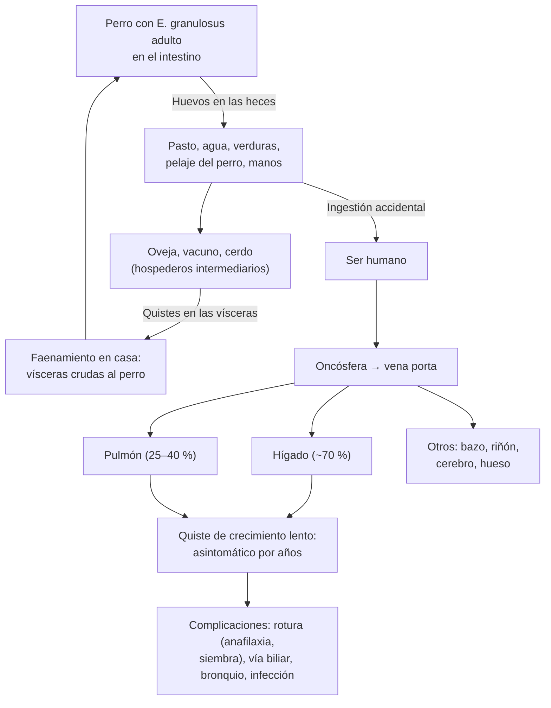

---
tags:
  - Infectología
---

# Triquinosis e hidatidosis

**Subespecialidad**
Infectología · Cirugía digestiva y de tórax · Salud pública (zoonosis)

**Guías principales**
Consenso OMS-IWGE 2010 sobre equinococosis (y actualizaciones 2023) · CDC: atención clínica de la triquinosis y de la equinococosis · MINSAL, Decreto 7 (2019): notificación obligatoria

**Otras fuentes**
Revisión de la triquinosis (Mitic 2026) · Triquinosis en cerdos de traspatio del centro-sur de Chile (Guzmán-Faúndez 2025) · Hidatidosis humana en Chile 2001–2009 (Martínez 2011) · Mortalidad por zoonosis en Chile 1997–2018 (Reyes 2021) · Imágenes de la equinococosis hepática (Calame 2022)

**GES**
No es GES. La **triquinosis** es de **notificación inmediata** y la **hidatidosis**, dentro de **24 horas** (Decreto 7 de 2019).

**EUNACOM**
1.04.1.027 Triquinosis (específico, completo, completo) · 1.04.1.013 Hidatidosis (sospecha, inicial, derivar) · 1.05.1.020 Hidatidosis pulmonar (sospecha, inicial, derivar)

**Revisado**
Octubre 2026

!!! abstract "Resumen en 60 segundos"
    - **Dos zoonosis por helmintos, típicas del centro-sur de Chile y de la vida rural**:
        - **Triquinosis**: por comer **carne de cerdo** (faenado en casa, sin examen) o de **jabalí** cruda o poco cocida, con larvas de ***Trichinella spiralis***.
        - **Hidatidosis**: por ingerir **huevos de *Echinococcus granulosus*** eliminados por **perros** que comieron vísceras crudas de **ovejas** u otro ganado.
    - **Triquinosis**:
        - Incubación de **1–4 semanas**. Puede haber una fase intestinal (diarrea, dolor), seguida de la fase muscular.
        - **Tríada**: **fiebre**, **edema periorbitario o facial** y **mialgias**, con **eosinofilia** marcada y **CK elevada**.
        - Suele haber **brotes familiares** tras una celebración con carne de cerdo.
        - **Tratamiento**: **albendazol 400 mg cada 12 h por 8–14 días**, más **prednisona** en los casos moderados a graves.
        - Las complicaciones graves son la **miocarditis** y la **encefalitis**.
    - **Hidatidosis (equinococosis quística)**:
        - **Quistes** de crecimiento lento, **asintomáticos por años**: en el **hígado** (la mayoría) y el **pulmón** (25–40 %).
        - Se diagnostica con **ecografía** (clasificación **OMS-IWGE CE1–CE5**) y **serología**.
        - **Tratamiento según la etapa**:
            - Quistes activos pequeños: **albendazol**.
            - Grandes: **PAIR o cirugía**.
            - Con vesículas hijas: **cirugía**.
            - Inactivos: **observar**.
        - Riesgos: **rotura** (anafilaxia, siembra), **infección** y **comunicación con la vía biliar o el bronquio** (vómica hidatídica).
    - **Chile**:
        - La triquinosis cayó de **1,9 a 0,03 por 100 000** (1982–2015).
        - La hidatidosis se notifica a **~1,9 por 100 000**, con gran **subnotificación**. Es **hiperendémica** en **La Araucanía** y **Aysén** y causa ~**un cuarto** de las muertes por zoonosis notificables.
    - **Prevención**: **cocer bien el cerdo y el jabalí** y hacer el examen triquinoscópico; **no dar vísceras crudas a los perros** y **desparasitarlos**; lavado de manos y de las verduras.

## Definición

| Concepto | Definición |
|---|---|
| **Triquinosis** (triquinelosis) | Infección por nematodos del género ***Trichinella*** (en Chile, *T. spiralis*), adquirida al comer **carne cruda o poco cocida** con **larvas enquistadas**. Tiene una fase intestinal y una fase **muscular** (parenteral) |
| **Célula nodriza** | Fibra muscular estriada **transformada** por la larva, que vive enquistada en ella por meses o años y luego se **calcifica** |
| **Hidatidosis** (equinococosis quística) | Infección por la **forma larvaria** (metacestodo) de ***Echinococcus granulosus***, que forma **quistes** (hidátides) en el hígado, el pulmón u otros órganos |
| **Hospedero definitivo / intermediario** | En la hidatidosis, el **perro** alberga al gusano adulto en el intestino (definitivo); la **oveja**, el vacuno, la cabra o el cerdo tienen los quistes (intermediarios). El **ser humano** es un intermediario **accidental**: no transmite la enfermedad |
| **Equinococosis alveolar** | Por *E. multilocularis*: lesión hepática infiltrante tipo tumor. Presente en el hemisferio norte; **no** se ha descrito en Chile |

## Epidemiología

- **Triquinosis**:
    - Zoonosis **mundial**, con reservorios **domésticos** (cerdo) y **silvestres** (jabalí, carnívoros).
    - Los brotes ocurren donde se **faena en casa sin control veterinario**, y por el consumo de **carne de caza**.
- **Hidatidosis**: endémica en las zonas **ganaderas ovinas** (cuenca mediterránea, Asia central, China, África del Norte y del Este, y el **Cono Sur** de América). Afecta a personas de todas las edades; la infección suele adquirirse en la **infancia** y manifestarse en la adultez.

!!! chile "Datos nacionales"
    - **Triquinosis**:
        - **Notificación inmediata** (Decreto 7 de 2019).
        - La incidencia humana bajó de **1,9 por 100 000 habitantes en 1982** a **0,03 por 100 000 en 2015**. La mayoría de los casos son del **centro-sur**, con la mayor incidencia en **La Araucanía**.
        - En **cerdos de traspatio** de La Araucanía y Ñuble (2019–2022), la prevalencia fue de **0,9 %** (2608 cerdos examinados). Los cerdos de **mataderos industriales** (más de 50 000 al año) resultaron **negativos**.
        - **El riesgo está en el cerdo de traspatio faenado en casa sin triquinoscopía** y en la carne de **jabalí**.
        - En comunidades mapuche de Contulmo, el **conocimiento** sobre la triquinosis fue alto, pero las **prácticas preventivas** (examen de la carne, eliminación de la carne infectada) fueron menores.
    - **Hidatidosis**:
        - **Notificación dentro de 24 horas**.
        - **2001–2009**: incidencia notificada promedio de **1,9 por 100 000**, mediana de edad de **38 años** y **6,3 egresos hospitalarios por 100 000**. La diferencia entre egresos y notificaciones sugiere una **subnotificación** importante. Mortalidad de **0,2 por 100 000**: 235 muertes entre 2001 y 2008.
        - En **niños** (0–18 años), la incidencia fue de **4,4 por 100 000**: cada caso pediátrico es una **infección reciente** y revela fallas en el control.
        - **Hiperendémica** en **La Araucanía** y **Aysén**. En Aysén, el riesgo es **2 a 19 veces** el esperado según la comuna, mayor en la franja cordillerana oriental. En O'Higgins, el riesgo se concentra hacia la cordillera de la Costa, con más ovejas y menor escolaridad.
        - **1997–2018**: la hidatidosis causó el **24,6 %** de las muertes por zoonosis de notificación obligatoria, segunda después de la enfermedad de Chagas, con **tendencia a la baja**.

## Etiología

| Aspecto | Triquinosis | Hidatidosis |
|---|---|---|
| **Agente** | ***Trichinella spiralis*** (nematodo) | ***Echinococcus granulosus*** (cestodo de 3–6 mm en el perro) |
| **Reservorio** | **Cerdo** (sobre todo de traspatio), **jabalí**, roedores y carnívoros silvestres | Ciclo **perro–oveja** (también vacuno, cabra, cerdo) |
| **Cómo se infecta el ser humano** | Comiendo **carne cruda o poco cocida** con larvas enquistadas: longanizas, prietas, arrollados y cecinas caseras, asados poco cocidos | Ingiriendo **huevos** de las **heces del perro**: manos contaminadas al tocar perros, agua o verduras contaminadas |
| **Factores de riesgo** | **Faenamiento domiciliario sin examen**, carne de caza, celebraciones (brotes familiares) | **Perros alimentados con vísceras crudas** (faenamiento en casa), perros sin desparasitar, ruralidad, ganadería ovina, menor escolaridad |
| **Transmisión entre personas** | **No** | **No** |

## Fisiopatología

- **Triquinosis** (figura 1):
    1. El jugo gástrico libera las **larvas L1** de la carne.
    2. En el **intestino delgado** maduran a **adultos** en días: es la **fase intestinal** (primera semana), con diarrea y dolor abdominal leves o ausentes.
    3. Las hembras liberan **larvas recién nacidas**, que viajan por la linfa y la sangre a los **músculos estriados** más activos: **diafragma**, maseteros, lengua, músculos extraoculares, intercostales y deltoides. Es la **fase muscular**, desde la 2.ª semana.
    4. Allí la larva convierte la fibra en una **célula nodriza** y se enquista.
    - **Respuesta inmune Th2** (interleuquinas 4, 5 y 13): **eosinofilia** marcada, IgE y degranulación de mastocitos. Explica el **edema periorbitario**, el exantema y la miositis. La **CK** y la **LDH** suben por el daño muscular.
    - **Complicaciones graves**: la larva puede pasar por el **miocardio** (miocarditis) y el **SNC** (encefalitis, vasculitis) sin enquistarse, con daño inflamatorio eosinofílico. También hay **trombosis**.
- **Hidatidosis**:
    1. El huevo ingerido libera en el duodeno la **oncósfera**, que cruza la pared intestinal.
    2. Por la **vena porta** llega al **hígado** (primer filtro, ~70 %). Si lo supera, llega al **pulmón** (segundo filtro) y rara vez a otros órganos (bazo, riñón, cerebro, hueso).
    3. Se desarrolla un **quiste** que crece **lento** (milímetros a pocos centímetros por año) y da síntomas por **efecto de masa** o por sus **complicaciones**.
    - **Estructura** (figura 4):
        - **Periquiste**: reacción fibrosa del huésped.
        - **Capa laminada**: acelular; protege del sistema inmune.
        - **Capa germinativa**: produce las **vesículas prolígeras** con **protoescólices** (la "arenilla hidatídica").
        - **Vesículas hijas**.
    - **El líquido hidatídico es muy antigénico**: si el quiste se **rompe** (trauma, punción, cirugía), puede causar **anafilaxia** y **siembra** de protoescólices, cada uno capaz de formar un **quiste secundario** (hidatidosis secundaria peritoneal o pleural).
    - **Comunicación con la vía biliar**: el paso de membranas al colédoco causa **cólico, ictericia y colangitis**. En el pulmón, la comunicación con un **bronquio** produce la **vómica hidatídica**: expectoración de líquido "en agua de roca" y membranas.

<figure markdown>
{ loading=lazy }
<figcaption>Figura 1. Ciclo de <em>Trichinella spiralis</em>: ingestión de larvas L1 en la carne, maduración a adultos en el intestino (IIL: larvas infectantes intestinales; AW: gusanos adultos), liberación de larvas recién nacidas (NBL) y enquistamiento en el músculo estriado como larva muscular (ML) dentro de la célula nodriza. Fuente: Mitic I, Vasilev S, Gruden-Movsesijan A. Trichinellosis: a zoonosis that still requires vigilance. <em>PLoS Negl Trop Dis.</em> 2026;20(1):e0013944, figura 1. Licencia <a href="https://creativecommons.org/licenses/by/4.0/">CC BY 4.0</a>.</figcaption>
</figure>

*Figura 2. Ciclo de la hidatidosis: el ser humano es un hospedero intermediario accidental. Esquema propio.*

## Clasificación

- **Triquinosis por gravedad** (orienta el uso de corticoides y la hospitalización):
    - **Asintomática o leve**: pocas larvas; mialgias y fiebre leves.
    - **Moderada**: tríada completa, eosinofilia y CK alta, sin compromiso de órganos.
    - **Grave**: compromiso **cardíaco** (miocarditis, arritmias), **neurológico** (encefalitis, convulsiones, déficit focal), **respiratorio** (disnea por miositis del diafragma, neumonitis) o **tromboembolia**.
- **Hidatidosis**:
    - **Por localización**: hepática (la más frecuente), pulmonar, combinada (hepatotorácica) y otras.
    - **Por estado**: **no complicada** o **complicada** (rota a la vía biliar, al bronquio, a la pleura o al peritoneo; infectada; con compresión).
    - **Ecográfica OMS-IWGE** (figura 3): **CL** (quiste sin signos patognomónicos), **CE1–CE2** (**activos**), **CE3a–CE3b** (**transicionales**) y **CE4–CE5** (**inactivos**). Define el tratamiento.

<figure markdown>
![Esquema de seis columnas con dibujos tipo ecografía. CE1 activo: quiste unilocular anecoico con pared doble, signo de la doble línea. CE2 activo: quiste multivesicular con vesículas hijas en panal de abejas. CE3a transicional: membrana germinal desprendida flotando, signo del camalote. CE3b transicional: vesículas hijas en una matriz sólida, puede reactivarse. CE4 inactivo: contenido heterogéneo sólido sin vesículas, en ovillo de lana. CE5 inactivo: pared calcificada en cáscara de huevo con sombra acústica. Abajo, el tratamiento del quiste hepático no complicado: CE1 y CE3a menores de 5 centímetros con albendazol, y de 5 o más centímetros con PAIR o cirugía; CE2 y CE3b con cirugía más albendazol; CE4 y CE5 en observación sin tratamiento con control ecográfico; y albendazol 400 miligramos cada 12 horas antes y después de cualquier procedimiento. Notas: el quiste CL requiere serología o repetir la imagen; en el pulmón la cirugía es de elección, sin PAIR, y los quistes complicados van a cirugía](../assets/figuras/zoonosis/clasificacion-oms-quiste-hidatidico.svg){ loading=lazy }
<figcaption>Figura 3. Clasificación ecográfica OMS-IWGE del quiste hidatídico y tratamiento según la etapa en el quiste hepático no complicado. Esquema propio basado en el consenso OMS-IWGE (Brunetti 2010), Calame 2022 y Brunetti y Tamarozzi 2023.</figcaption>
</figure>

## Clínica

- **Triquinosis**:
    - **Incubación**: **7–30 días**. Es más corta y el cuadro más grave cuanto mayor es la carga de larvas.
    - **Fase intestinal** (primera semana, inconstante): náuseas, diarrea, dolor abdominal.
    - **Fase muscular** (desde la 2.ª semana):
        - **Fiebre** (a menudo alta).
        - **Edema periorbitario o facial** bilateral, a veces con **quemosis**.
        - **Mialgias** intensas, **debilidad** y dolor al mover los ojos, al masticar y al respirar.
        - **Hemorragias** subconjuntivales y en astilla subungueales; exantema; cefalea.
    - **Complicaciones** (desde la 2.ª–3.ª semana, en las infecciones intensas): **miocarditis** (arritmias, insuficiencia cardíaca: la principal causa de muerte), **encefalitis** o vasculitis cerebral, **tromboembolia**, neumonitis.
    - **Clave epidemiológica**: **varios convivientes** con el mismo cuadro, días o semanas después de comer cerdo o jabalí **faenado en casa**.
- **Hidatidosis hepática**:
    - Casi siempre **asintomática** por años. A menudo es un **hallazgo** en una ecografía.
    - Con quistes grandes: **dolor** en el hipocondrio derecho, **hepatomegalia** o masa palpable.
    - **Complicaciones**:
        - **Rotura a la vía biliar**: cólico, **ictericia**, **colangitis**.
        - **Infección**: absceso, fiebre.
        - **Rotura al peritoneo** (por trauma): dolor, **anafilaxia** e hidatidosis peritoneal secundaria.
        - **Tránsito hepatotorácico**: a través del diafragma hacia la pleura o el bronquio.
        - Compresión de los vasos o la vía biliar; hipertensión portal.
- **Hidatidosis pulmonar**:
    - Puede ser un **hallazgo radiográfico** (masa redonda).
    - O dar **tos**, **dolor torácico**, disnea y **hemoptisis**.
    - **Vómica hidatídica**: expectoración brusca de **líquido claro y salado** ("agua de roca") y **membranas**, con riesgo de **asfixia** y **anafilaxia**.
    - Tras la rotura quedan el **signo del camalote** (membrana flotando en un nivel hidroaéreo) y el riesgo de **infección** (absceso).
- **Otras localizaciones**: bazo, riñón (hidatiduria), cerebro (hipertensión endocraneana, convulsiones), hueso (fracturas patológicas).

!!! alarma "Situaciones de urgencia"
    - **Triquinosis con dolor torácico, arritmia, disnea, compromiso de conciencia o signos focales**: sospechar **miocarditis** o **encefalitis**. Hospitalizar, ECG, troponina, imagen y **corticoides** más el antiparasitario.
    - **Quiste hidatídico roto**: **anafilaxia** (adrenalina; ver el manejo de la anafilaxia), **colangitis** (antibióticos, CPRE) o **vómica** con riesgo de asfixia.
    - **Nunca puncionar a ciegas un quiste hepático** en una zona endémica sin descartar la hidatidosis: riesgo de anafilaxia y siembra.
    - **Fiebre con quiste hepático conocido**: **quiste infectado**.

## Diagnóstico

!!! guia "Diagnóstico"
    - **Triquinosis** (clínica + epidemiología + laboratorio):
        - Sospechar ante **fiebre, edema periorbitario y mialgias** con **eosinofilia** y **CK elevada**, sobre todo si hay un **antecedente de consumo** de cerdo o jabalí sin control o **casos en el grupo** que comió la misma carne.
        - **Serología** (ELISA, confirmada por *western blot*): se hace positiva desde la **2.ª–5.ª semana**. Una primera muestra negativa **no descarta**: repetirla.
        - **Biopsia muscular** (deltoides): rara vez necesaria; muestra las larvas y permite identificar la especie por PCR.
        - **Examen de la carne sospechosa** (triquinoscopía o digestión artificial): confirma la fuente y orienta el estudio del brote.
        - **Notificar de inmediato** a la autoridad sanitaria.
    - **Hidatidosis**:
        - **Ecografía abdominal**: examen de **primera línea**. Permite clasificar el quiste (OMS-IWGE) y define la conducta.
        - **TC o RM**: planificación quirúrgica, quistes complicados, localizaciones difíciles; la **RM** muestra mejor las membranas y la comunicación biliar.
        - **Radiografía y TC de tórax**: buscar quistes **pulmonares** en todo paciente con hidatidosis hepática (y viceversa).
        - **Serología** (ELISA o hemaglutinación indirecta y confirmación por *western blot*): **apoya** el diagnóstico.
            - Es **menos sensible** en los quistes **pulmonares**, **inactivos** (CE4–CE5) o calcificados.
            - **Una serología negativa no descarta** la hidatidosis.
        - **No puncionar** para diagnosticar si se sospecha un quiste hidatídico.
        - **Notificar** dentro de 24 horas.

## Laboratorio

| Examen | Triquinosis | Hidatidosis |
|---|---|---|
| **Hemograma** | **Eosinofilia** marcada (a menudo > 1000/mm³), leucocitosis | Eosinofilia **poco frecuente**; aparece si hay **fuga** o rotura del quiste |
| **CK, LDH, aldolasa** | **Elevadas** (miositis) | Normales |
| **Pruebas hepáticas** | Normales o transaminasas levemente altas | Colestasis (FA, GGT, bilirrubina) si hay compresión o comunicación con la **vía biliar** |
| **Troponina, ECG** | Si hay síntomas cardíacos o en los casos moderados a graves (**miocarditis**) | — |
| **Serología** | ELISA o *western blot* anti-*Trichinella* (positivos desde las 2–5 semanas) | ELISA o hemaglutinación; *western blot* de confirmación |
| **Otros** | VHS normal o poco elevada; hipoalbuminemia en los casos graves | Hemocultivos si hay un quiste infectado; control de las enzimas hepáticas y del hemograma durante el albendazol |

## Imágenes

- **Triquinosis**: no se requieren imágenes de rutina.
    - **Ecocardiograma o RM cardíaca** si se sospecha **miocarditis**.
    - **TC o RM de cerebro** si hay signos neurológicos (infartos, lesiones inflamatorias).
- **Hidatidosis**:
    - **Ecografía**:
        - **CE1**: quiste unilocular con **pared doble**.
        - **CE2**: **vesículas hijas**, "en panal de abejas" o "en rueda de carreta".
        - **CE3a**: **membrana desprendida** ("signo del camalote" o "del nenúfar").
        - **CE3b**: vesículas hijas en una matriz sólida.
        - **CE4**: contenido heterogéneo "en ovillo de lana".
        - **CE5**: pared **calcificada**.
    - **TC**: calcificaciones de la pared, quistes múltiples, extensión extrahepática.
    - **RM**: membranas, vesículas hijas, comunicación con la vía biliar (colangio-RM), diferencial con las neoplasias quísticas.
    - **Radiografía de tórax**: masa **redonda, homogénea, de bordes nítidos** ("en bala de cañón"). Tras la rotura: nivel hidroaéreo con la membrana flotando (camalote), signo del "menisco" o "doble arco".

<figure markdown>
![Esquema de un quiste hidatídico en corte. Por fuera, el periquiste, capa adventicia del tejido del huésped. Hacia dentro, la hidátide: la capa laminada, acelular, barrera contra la respuesta inmune del huésped; la capa germinativa, que produce los elementos biológicos del metacestodo (líquido, vesículas prolígeras y protoescólices); vesículas hijas en el interior; protoescólices que brotan de las vesículas prolígeras; una vesícula prolígera exógena que se incluye en la capa laminada y es empujada hacia afuera; y en el fondo, la arenilla hidatídica](../assets/figuras/zoonosis/estructura-quiste-hidatidico-calame-2022.jpg){ loading=lazy }
<figcaption>Figura 4. Estructura del quiste hidatídico: periquiste (reacción del huésped) y, dentro, la hidátide con su capa laminada, la capa germinativa, las vesículas hijas, los protoescólices y la arenilla hidatídica (<em>hydatid sand</em>). Fuente: Calame P, Weck M, Busse-Cote A, et al. Role of the radiologist in the diagnosis and management of the two forms of hepatic echinococcosis. <em>Insights Imaging.</em> 2022;13(1):68, figura 3. Licencia <a href="https://creativecommons.org/licenses/by/4.0/">CC BY 4.0</a>.</figcaption>
</figure>

## Diagnóstico diferencial

| Cuadro | Diferenciales |
|---|---|
| **Fiebre + edema facial + mialgias** (triquinosis) | **Dermatomiositis** y polimiositis (sin eosinofilia), **miositis viral** (influenza), leptospirosis, **angioedema** o reacción alérgica, síndrome nefrótico o glomerulonefritis (edema; ver la orina), **fiebre tifoidea**, triquinosis "confundida con un cuadro gripal" |
| **Eosinofilia marcada** | Otras helmintiasis (*Strongyloides*, *Toxocara*, fasciolosis), **fármacos** (DRESS), EGPA, síndrome hipereosinofílico, neoplasias hematológicas |
| **Miocarditis con eosinofilia** | Miocarditis por fármacos, EGPA, síndrome hipereosinofílico |
| **Quiste hepático** | **Quiste simple** (sin pared doble ni contenido; es el diferencial del CL y del CE1), **cistoadenoma** o neoplasia mucinosa quística, **absceso piógeno o amebiano**, metástasis quísticas, enfermedad poliquística, hematoma o biloma |
| **Masa pulmonar redonda** | **Cáncer pulmonar** o metástasis, **absceso pulmonar**, tuberculoma, hamartoma, quiste broncogénico |

## Tratamiento

!!! guia "Triquinosis (CDC; Mitic 2026)"
    - **Antiparasitario**, lo antes posible (es más útil antes de que las larvas se enquisten):
        - **Albendazol 400 mg VO cada 12 h por 8–14 días**, o
        - **Mebendazol 200–400 mg cada 8 h por 3 días**, luego **400–500 mg cada 8 h por 10 días**.
    - **Corticoides** en los casos **moderados a graves**, y siempre con **miocarditis**, compromiso del **SNC** o reacción intensa: **prednisona 30–60 mg/día por 10–15 días**, junto con el antiparasitario (nunca solos, porque prolongan la fase intestinal).
    - **Sintomáticos**: analgésicos y antipiréticos, reposo.
    - **Hospitalizar** si hay compromiso cardíaco, neurológico o respiratorio, una CK muy alta o un adulto mayor con comorbilidad.
    - **Brote**: identificar a **todos los que comieron la carne** (evaluarlos y tratarlos precozmente) y **retener y examinar la carne** sospechosa. **Notificar de inmediato**.
    - **Embarazo y menores de 2 años**: albendazol y mebendazol no se consideran seguros; decidir con especialista.

!!! guia "Hidatidosis: tratamiento según la etapa (consenso OMS-IWGE; Calame 2022)"
    - **Es un manejo de especialista** (cirugía, radiología intervencional, infectología). El internista debe **sospecharla**, **no puncionar**, **etapificar** con ecografía y **derivar**.
    - **Quiste hepático no complicado**:
        - **CE1 y CE3a < 5 cm**: **albendazol** solo puede ser suficiente.
        - **CE1 y CE3a ≥ 5 cm**: **PAIR** (punción, aspiración, inyección de un escolicida y reaspiración, guiada por ecografía) **o cirugía**, según la ubicación y la experiencia local.
        - **CE2 y CE3b** (vesículas hijas): **cirugía** (la técnica de catéter modificado está en evaluación).
        - **CE4 y CE5** (inactivos), asintomáticos: **observar sin tratar** ("*watch and wait*") con control ecográfico; la reactivación es rara.
    - **Cirugía**: la **única curativa** es la **extirpación completa**. Es de elección la **quistectomía total o periquistectomía** sin abrir el quiste. Se protege el campo con compresas con escolicida para evitar la siembra.
    - **Albendazol** asociado a la **cirugía o al PAIR**: antes y después del procedimiento, para disminuir la recurrencia por siembra.
    - **PAIR**: indicado en la recaída tras cirugía, la falla del tratamiento médico o el rechazo de la cirugía.
        - **No** se hace en el **pulmón** ni con **comunicación biliar** (riesgo de colangitis esclerosante química por el escolicida).
        - Premedicar y tener **adrenalina** disponible por el riesgo de **anafilaxia**.
    - **Quistes pulmonares**: **cirugía** (quistectomía conservando el parénquima, cierre de las comunicaciones bronquiales).
    - **Quistes complicados** (rotura biliar o bronquial, infección, compresión): **cirugía**. La colangitis puede requerir **CPRE**.
    - **Seguimiento**: clínico, serológico y con **ecografía por al menos 5 años**, por el riesgo de **recurrencia**.

!!! dosis "Dosis (adulto)"
    - **Triquinosis**:
        - **Albendazol 400 mg VO cada 12 h por 8–14 días**, o **mebendazol** 200–400 mg cada 8 h por 3 días y luego 400–500 mg cada 8 h por 10 días.
        - **Prednisona 30–60 mg/día por 10–15 días** en los casos moderados a graves.
    - **Hidatidosis**:
        - **Albendazol 400 mg VO cada 12 h**, con comidas grasas (mejor absorción), por **1–6 meses** según la indicación, de forma **continua**.
        - Rodear la cirugía o el PAIR con albendazol antes y después.
        - Controlar las **enzimas hepáticas** y el **hemograma** (hepatotoxicidad, leucopenia) durante los primeros meses.
        - **Praziquantel**: útil antes de la cirugía o si hay **derrame del contenido** del quiste durante el procedimiento.
    - **Embarazo**: evitar el albendazol, sobre todo en el primer trimestre.

## Complicaciones

| Complicación | Comentario |
|---|---|
| **Miocarditis triquinósica** | Arritmias, insuficiencia cardíaca, muerte súbita; 2.ª–3.ª semana |
| **Encefalitis y vasculitis del SNC** (triquinosis) | Compromiso de conciencia, convulsiones, déficit focal |
| **Tromboembolia** (triquinosis) | Trombosis venosa y arterial por la inflamación eosinofílica |
| **Debilidad muscular prolongada** (triquinosis) | Mialgias y fatiga por semanas o meses |
| **Rotura a la vía biliar** (hidatidosis) | Ictericia obstructiva, **colangitis**, pancreatitis |
| **Rotura al peritoneo o la pleura** | **Anafilaxia**; hidatidosis secundaria diseminada |
| **Vómica hidatídica** | Rotura al bronquio: asfixia, anafilaxia, neumonía |
| **Quiste infectado** | Absceso hepático o pulmonar |
| **Tránsito hepatotorácico** | Fístula bilio-bronquial (expectoración biliosa) |
| **Recurrencia** | Por siembra durante la cirugía o el PAIR, o por quistes no detectados |
| **Asociadas al albendazol** | Hepatotoxicidad, leucopenia, alopecia |

## Pronóstico y seguimiento

- **Triquinosis**:
    - La mayoría de los casos leves y moderados se **recupera** en semanas.
    - Las mialgias y la fatiga pueden durar **meses**.
    - La letalidad es **baja** y se concentra en las infecciones masivas con **miocarditis** o **encefalitis**.
    - Seguimiento clínico; control del **ECG** y de la **CK** en los casos moderados a graves.
- **Hidatidosis**:
    - **Buen pronóstico** cuando se trata según la etapa.
    - Los quistes **inactivos** suelen permanecer estables.
    - La **recurrencia** posquirúrgica obliga a un seguimiento de **al menos 5 años**.
    - La mortalidad está ligada a las **complicaciones** (rotura, anafilaxia, colangitis) y a la cirugía de los quistes complicados.
- **Prevención** (lo que el médico debe enseñar):
    - **Triquinosis**:
        - **Cocer bien** la carne de cerdo y de jabalí: sin partes rosadas.
        - **No consumir** cecinas caseras ni carne faenada en casa **sin el examen triquinoscópico**.
        - Criar a los cerdos **sin acceso a basura ni roedores**.
        - Eliminar de forma segura la carne infectada.
    - **Hidatidosis**:
        - **No dar vísceras crudas a los perros**.
        - **Desparasitar a los perros con praziquantel**.
        - **Lavado de manos** tras tocar perros; lavar las verduras crudas; agua potable.
        - Faenamiento con control veterinario.
    - **Estudiar a los convivientes**: en la triquinosis, a todos los que comieron la carne; en la hidatidosis pediátrica, a la familia y los perros del hogar (exposición común).

## Perlas para el internado

!!! perla "Para recordar en la sala"
    - **Fiebre + párpados hinchados + dolor muscular + eosinofilia** = triquinosis hasta demostrar lo contrario. Pregunta: "¿comió cerdo o jabalí de faena casera?" y "¿alguien más en la familia está igual?".
    - **CK alta + eosinofilia** separa la triquinosis de un cuadro gripal o de una alergia.
    - **La serología de la triquinosis puede salir negativa al inicio**: repítela a las 2–3 semanas y no esperes el resultado para tratar si la sospecha es alta.
    - **Corticoides en la triquinosis, siempre con el antiparasitario**.
    - **Quiste hepático en un paciente del sur de Chile o del campo**: piensa en hidatidosis antes de puncionarlo.
    - **Ecografía primero**: la etapa OMS-IWGE decide entre albendazol, PAIR, cirugía u observación.
    - **Serología hidatídica negativa no descarta**, sobre todo en los quistes pulmonares e inactivos.
    - **Hidatidosis hepática → busca la pulmonar** (radiografía de tórax), y viceversa.
    - **Vómica de "agua de roca" con membranas** = quiste hidatídico pulmonar roto al bronquio.
    - **Ambas se notifican**: la triquinosis de inmediato y la hidatidosis dentro de 24 horas.

## Preguntas de repaso

??? repaso "1. En marzo consultan tres integrantes de una familia de La Araucanía. Hace 2 semanas celebraron un cumpleaños con longanizas hechas en casa de un cerdo faenado en el patio. El padre, de 45 años, tiene fiebre de 39 °C, edema palpebral bilateral, dolor muscular intenso al masticar y al mover los ojos, y hemorragias subconjuntivales. Eosinófilos 2800/mm³, CK 3200 U/L. ¿Diagnóstico, estudio y manejo?"
    - **Triquinosis** en un **brote familiar**: carne de cerdo de **faenamiento domiciliario sin triquinoscopía**, la **tríada** de fiebre, edema periorbitario y mialgias, **eosinofilia** y **CK** elevada.
    - **Estudio**:
        - **Serología** (ELISA, *western blot*); si es negativa al inicio, repetirla.
        - **ECG** y troponina para descartar miocarditis.
        - Examen de la **carne sobrante**.
    - **Tratamiento**: **albendazol 400 mg cada 12 h por 8–14 días** más **prednisona 30–60 mg/día por 10–15 días** (cuadro moderado). Analgesia.
    - **Notificación inmediata**. Evaluar y tratar a **todos los que comieron** la carne. Educar sobre la cocción y el examen de la carne.

??? repaso "2. Paciente con triquinosis en la tercera semana presenta disnea, palpitaciones y extrasístoles ventriculares frecuentes. Troponina elevada. ¿Qué sospecha y qué hace?"
    - **Miocarditis triquinósica**, la principal causa de muerte en la triquinosis.
    - **Hospitalizar con monitorización**, ecocardiograma o RM cardíaca.
    - **Corticoides** (prednisona 30–60 mg/día o equivalente) **junto con el albendazol**, más el manejo de las arritmias y de la insuficiencia cardíaca.

??? repaso "3. Mujer de 35 años de Aysén, criada en el campo con perros y ovejas, tiene una ecografía por dolor leve en el hipocondrio derecho que muestra un quiste hepático de 7 cm con vesículas hijas \"en panal de abejas\". ¿Qué es, cómo se clasifica y qué conducta corresponde?"
    - **Hidatidosis hepática**, etapa **CE2** de la OMS-IWGE (activa, multivesicular).
    - **Estudio**: **serología** de apoyo, **TC o RM** para planificar, **radiografía de tórax** para buscar quistes pulmonares, pruebas hepáticas.
    - **Conducta**: derivar a **cirugía**, de elección en los quistes CE2 y CE3b, con **albendazol** antes y después para reducir la recurrencia.
    - **No puncionar** fuera de un protocolo (anafilaxia, siembra). **Notificar** dentro de 24 horas.
    - Seguimiento por al menos 5 años.

??? repaso "4. Hombre de 70 años al que se le encuentra, en una TC por otro motivo, un quiste hepático de 4 cm con contenido sólido heterogéneo y la pared parcialmente calcificada. Está asintomático. ¿Qué etapa sugiere y qué conducta corresponde?"
    - Un quiste **inactivo** (**CE4–CE5**: contenido sólido "en ovillo de lana" y calcificación), confirmado con una **ecografía**.
    - Si es **asintomático y no complicado**: **observar sin tratar** ("*watch and wait*") con control ecográfico periódico, porque la reactivación es rara.
    - La serología puede ser **negativa** en los quistes inactivos.

??? repaso "5. Joven de 19 años de una zona rural, con 2 semanas de tos, presenta un acceso de tos con expectoración abundante de un líquido claro y salado, con trozos de \"piel blanca\". La radiografía muestra una cavidad con un nivel hidroaéreo y una membrana flotando. ¿Qué ocurrió y qué hace?"
    - **Quiste hidatídico pulmonar roto al bronquio**, con **vómica hidatídica** ("agua de roca" y membranas). La imagen corresponde al **signo del camalote**.
    - **Riesgos**: **asfixia**, **anafilaxia**, infección del quiste residual y siembra.
    - **Manejo**: vía aérea y oxígeno, tratar la anafilaxia si aparece, antibióticos si hay infección y derivar a **cirugía de tórax** (cirugía de elección en el pulmón). **Albendazol** perioperatorio.
    - Buscar **quistes hepáticos** (ecografía abdominal). Notificar.

??? repaso "6. ¿Qué medidas de prevención indicaría a una familia rural que cría cerdos y ovejas y tiene perros?"
    - **Triquinosis**:
        - **No** consumir carne de cerdo o jabalí **faenada en casa sin examen triquinoscópico**.
        - **Cocer bien** la carne.
        - Criar a los cerdos sin acceso a basura ni roedores.
        - Eliminar de forma segura la carne infectada.
    - **Hidatidosis**:
        - **No dar vísceras crudas** a los perros.
        - **Desparasitarlos con praziquantel** periódicamente.
        - **Lavarse las manos** después de tocarlos y antes de comer.
        - Lavar las verduras y beber agua potable.
        - Faenar con control veterinario.

## Referencias

1. Brunetti E, Kern P, Vuitton DA; Writing Panel for the WHO-IWGE. Expert consensus for the diagnosis and treatment of cystic and alveolar echinococcosis in humans. *Acta Trop.* 2010;114(1):1–16. doi:[10.1016/j.actatropica.2009.11.001](https://doi.org/10.1016/j.actatropica.2009.11.001)
2. Brunetti E, Tamarozzi F. Watch-and-wait approach for inactive echinococcal cysts: scoping review update since the issue of the WHO-IWGE Expert Consensus and current perspectives. *Curr Opin Infect Dis.* 2023;36(5):326–332. doi:[10.1097/QCO.0000000000000943](https://doi.org/10.1097/QCO.0000000000000943)
3. Calame P, Weck M, Busse-Cote A, et al. Role of the radiologist in the diagnosis and management of the two forms of hepatic echinococcosis. *Insights Imaging.* 2022;13(1):68. doi:[10.1186/s13244-022-01190-y](https://doi.org/10.1186/s13244-022-01190-y)
4. Centers for Disease Control and Prevention. Clinical care of echinococcosis. [cdc.gov](https://www.cdc.gov/echinococcosis/hcp/clinical-care/index.html)
5. Mitic I, Vasilev S, Gruden-Movsesijan A. Trichinellosis: a zoonosis that still requires vigilance. *PLoS Negl Trop Dis.* 2026;20(1):e0013944. doi:[10.1371/journal.pntd.0013944](https://doi.org/10.1371/journal.pntd.0013944)
6. Gottstein B, Pozio E, Nöckler K. Epidemiology, diagnosis, treatment, and control of trichinellosis. *Clin Microbiol Rev.* 2009;22(1):127–145. doi:[10.1128/CMR.00026-08](https://doi.org/10.1128/CMR.00026-08)
7. Guzmán-Faúndez J, Crisóstomo-Jorquera V, Landaeta-Aqueveque C, Henríquez A. First assessment of the prevalence of *Trichinella* in backyard-raised pigs in Central-Southern Chile. *Vet Q.* 2025;45(1):1–7. doi:[10.1080/01652176.2025.2475986](https://doi.org/10.1080/01652176.2025.2475986)
8. Grant-Riquelme T, Poblete Y, Fresno M, et al. Trichinellosis knowledge and preventive practices in Mapuche communities of southern Chile: evidence for targeted One Health implementation. *One Health.* 2026;22:101366. doi:[10.1016/j.onehlt.2026.101366](https://doi.org/10.1016/j.onehlt.2026.101366)
9. Martínez GP. Hidatidosis humana: antecedentes generales y situación epidemiológica en Chile, 2001–2009. *Rev Chilena Infectol.* 2011;28(6):585–591. doi:[10.4067/s0716-10182011000700013](https://doi.org/10.4067/s0716-10182011000700013)
10. Martínez P. Hidatidosis humana en menores de edad: manifestación de fracaso en las medidas de control y prevención. Chile, 2001–2011. *Rev Chilena Infectol.* 2015;32(2):158–166. doi:[10.4067/S0716-10182015000300004](https://doi.org/10.4067/S0716-10182015000300004)
11. Medina N, Martínez P, Ayala S, Canals M. Distribución y factores de riesgo de equinococosis quística humana en Aysén 2010–2016. *Rev Chilena Infectol.* 2021;38(3):349–354. doi:[10.4067/S0716-10182021000300349](https://doi.org/10.4067/S0716-10182021000300349)
12. Medina N, Riquelme N, Rodríguez J, et al. Distribución y factores de riesgo de hidatidosis en la Región del Libertador Bernardo O'Higgins entre 2010 y 2016. *Rev Chilena Infectol.* 2019;36(5):591–598. doi:[10.4067/S0716-10182019000500591](https://doi.org/10.4067/S0716-10182019000500591)
13. Reyes R, Yohannessen K, Cuadros N. Caracterización y evolución temporal de la mortalidad por zoonosis bajo declaración obligatoria, entre los años 1997 y 2018. *Rev Chilena Infectol.* 2021;38(5):667–677. doi:[10.4067/s0716-10182021000500667](https://doi.org/10.4067/s0716-10182021000500667)
14. Ministerio de Salud de Chile. Decreto 7: aprueba el reglamento sobre notificación de enfermedades transmisibles de declaración obligatoria y su vigilancia. 2019. [texto en faolex.fao.org](https://faolex.fao.org/docs/pdf/chi206424.pdf)
