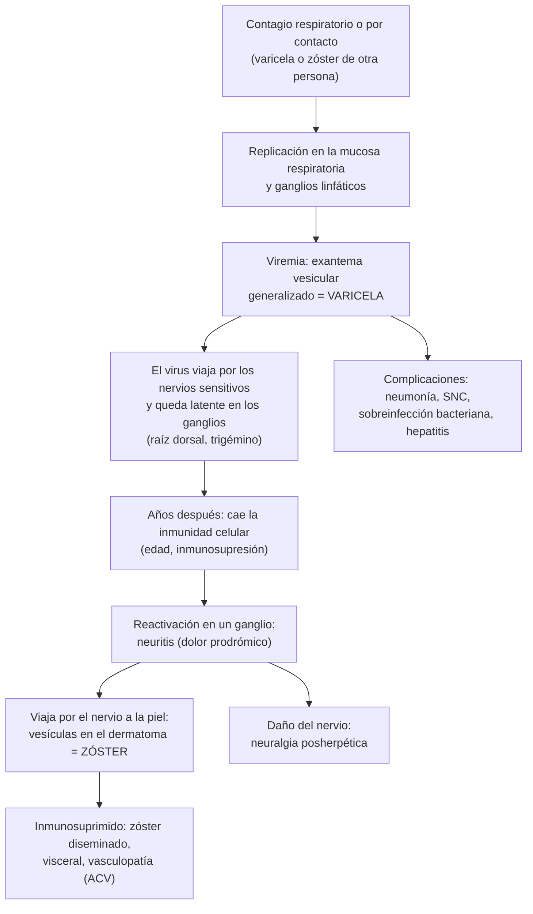
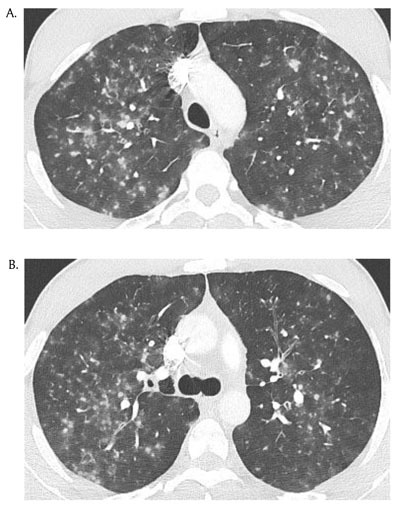

---
tags:
  - Infectología
  - Frecuente en sala
---

# Varicela, herpes zóster y otros exantemas del adulto

**Subespecialidad**
Infectología · Dermatología · Neurología

**Guías principales**
Guía europea de consenso (S2k) de herpes zóster: diagnóstico y tratamiento (EDF/EADV, 2017) · ACIP 2018: vacunas contra el herpes zóster · ACIP 2022: vacuna recombinante en inmunocomprometidos · ACIP 2007: prevención de la varicela · CDC 2013: uso de inmunoglobulina contra varicela-zóster (VariZIG)

**Otras fuentes**
Calendario del Programa Nacional de Inmunizaciones 2026 (MINSAL) · Hospitalizaciones por varicela en niños chilenos (Torres 2021) · Epidemiología del zóster en América Latina (Bardach 2021) · Ensayo ZOE-50 (*NEJM* 2015) · MINSAL: sarampión 2026 · Revisión de Patil 2022

**GES**
No

**EUNACOM**
1.04.1.011 Enfermedades eruptivas no complicadas: varicela, herpes zóster, etc. (específico, completo, completo) · 1.10.1.009 Herpes zóster (específico, completo, completo) · 1.04.2.010 Varicela complicada: neumonitis, cerebelitis, encefalitis (sospecha, inicial, derivar)

**Revisado**
Septiembre 2026

!!! abstract "Resumen en 60 segundos"
    - El **virus varicela-zóster** (VVZ) causa la **varicela** (primoinfección) y queda **latente** en los ganglios sensitivos. Años después se **reactiva** como **herpes zóster**.
    - **Varicela**: fiebre y exantema **pruriginoso**, **centrípeto**, con lesiones en **todas las etapas a la vez** (mácula, pápula, vesícula en "gota de rocío", pústula, costra). Contagia desde **1–2 días antes** del exantema hasta que **todo está en costra**.
    - **En el adulto es más grave**: **neumonía** (fumadores, embarazadas, inmunosuprimidos), sobreinfección bacteriana (*S. pyogenes*), **encefalitis**. En niños predomina la **cerebelitis** (ataxia benigna).
        - **Adulto**: **valaciclovir 1 g c/8 h** o **aciclovir 800 mg 5 veces al día**, idealmente en las primeras **24 h**.
        - **Varicela complicada o inmunosuprimido**: **aciclovir EV 10 mg/kg c/8 h**.
    - **Herpes zóster**: **dolor** en un dermatoma y luego **vesículas agrupadas unilaterales** que no cruzan la línea media.
        - **Antiviral en las primeras 72 h** a los mayores de 50 años, con zóster de cabeza o cuello, grave o inmunosuprimidos: **valaciclovir 1 g c/8 h por 7 días**.
        - **Zóster oftálmico** (V1, signo de **Hutchinson**) = **oftalmología urgente**.
    - **Neuralgia posherpética** (dolor > 90 días): **10–13 %** de los mayores de 50 años. Se trata con gabapentinoides, tricíclicos o lidocaína tópica.
    - **Prevención**:
        - **Vacuna contra la varicela** en el PNI de Chile desde **2020** (18 y 36 meses).
        - **Vacuna recombinante contra el zóster** (2 dosis) para **≥ 50 años** e inmunocomprometidos ≥ 19 años: **97 %** de eficacia (ZOE-50). No está en el PNI.
        - **Post-exposición**: vacuna en **3–5 días** a los susceptibles sanos; **inmunoglobulina** en **≤ 10 días** a los de alto riesgo.
    - Otros exantemas que el internista no puede perder: **sarampión** (notificación inmediata; 3 casos importados en Chile en 2026), **mpox**, **sífilis secundaria**, **meningococcemia** y **farmacodermias graves**.

## Definición

- **Varicela**: primoinfección por el VVZ (herpesvirus humano 3). Da un exantema vesicular generalizado.
- **Herpes zóster** ("culebrilla"): **reactivación** del VVZ latente en un ganglio sensitivo (raíz dorsal o par craneal). Produce dolor y un exantema vesicular en el **dermatoma** correspondiente.
- **Varicela complicada**: varicela con **neumonía**, compromiso del **SNC** (cerebelitis, encefalitis), **sobreinfección bacteriana invasora**, hepatitis, trombocitopenia o hemorragia. También la varicela grave del inmunosuprimido o de la embarazada.
- **Neuralgia posherpética (NPH)**: dolor que **persiste ≥ 90 días** después de la resolución del exantema (ACIP 2018).
- **Zóster diseminado**: lesiones en **más de 3 dermatomas** o vesículas fuera del dermatoma inicial; o compromiso visceral. Casi siempre en inmunosuprimidos.
- **Enfermedades eruptivas (exantemas)**: erupciones cutáneas generalizadas de causa infecciosa, en general viral (varicela, sarampión, rubéola, parvovirus, mpox) o de otra causa (farmacodermias).

## Epidemiología

### Mundial

- **Varicela**: sin vacunación, casi toda la población se infecta en la infancia. Es **más grave** en los adolescentes, los adultos, las embarazadas y los inmunosuprimidos.
- **Herpes zóster** (ACIP 2018):
    - **~ 1 millón de casos al año** en EE. UU.
    - La incidencia **aumenta con la edad**: de **5 por 1.000** personas-año entre los 50 y 59 años a **11 por 1.000** en los ≥ 80 años.
    - La **neuralgia posherpética** es la complicación más frecuente: **10–13 %** de los casos en los mayores de 50 años.
- **América Latina** (metaanálisis, Bardach 2021):
    - **Neuralgia posherpética** en el **16 %** de los inmunocompetentes y el **22 %** de los inmunosuprimidos.
    - **Sobreinfección bacteriana** en el 6,5 % y el 13 %, respectivamente.

### Chile

!!! chile "Datos nacionales"
    - **Vacuna contra la varicela** en el **Programa Nacional de Inmunizaciones desde 2020** (primera dosis a los 18 meses). El calendario **2026** incluye **2 dosis** (18 y 36 meses).
    - **Antes de la vacuna** (2011–2015, 685 niños hospitalizados por varicela en 5 hospitales; Torres 2021):
        - **13 %** requirió una unidad de mayor complejidad.
        - Complicaciones: **infección de piel y partes blandas 42 %**, **neurológicas 8 %**, **shock séptico o tóxico 4 %**.
        - **3 muertes** (0,4 %).
    - **Herpes zóster** (egresos hospitalarios DEIS 2010–2018; Bardach 2021):
        - **~ 440 egresos al año**: 246 por zóster no complicado, ~ 50 por zóster **oftálmico**, ~ 51 con compromiso del **SNC**, ~ 22 **diseminados** y ~ 8 **encefalitis**.
        - La encefalitis tuvo la estadía más larga: **14,5 días** en promedio.
    - **Vacuna contra el zóster**: **no está en el PNI 2026** (disponible en el sector privado). Un modelo para 5 países latinoamericanos, incluido Chile, estimó que hay que vacunar a **9–10 personas ≥ 50 años** para evitar un zóster y a **35–40** para evitar una neuralgia posherpética (Han 2023).
    - **Sarampión**: Chile mantiene el estatus de **eliminación** (sin transmisión local desde **1992**). En **2026** se confirmaron **3 casos importados**; el tercero, en septiembre, en una persona de 18 años **no vacunada** que volvía de Perú (MINSAL).
    - **Mpox**: el calendario 2026 incluye **2 dosis de vacuna** para las personas con **alto riesgo** de infección.

## Etiología y factores de riesgo

- **Transmisión de la varicela**: **aérea** (gotitas y aerosoles) y por **contacto** con las vesículas. Es **muy contagiosa**; la incubación es de **10–21 días**.
- **El zóster contagia varicela** (no zóster) a los susceptibles:
    - Por **contacto** con las lesiones si es localizado.
    - Por **vía aérea** si es **diseminado** o el paciente está inmunosuprimido.
- **Riesgo de varicela grave**: **adultos**, **embarazadas**, **fumadores** (neumonía), **inmunosuprimidos** (leucemia, trasplante, corticoides en dosis altas, VIH), recién nacidos de madres con varicela periparto.
- **Riesgo de herpes zóster**:
    - **Edad** (inmunosenescencia).
    - **Inmunosupresión**: VIH, cáncer hematológico, trasplante, corticoides, **inhibidores de JAK** y otros biológicos.
    - Enfermedades autoinmunes (lupus, artritis reumatoide), diabetes, ERC.

## Fisiopatología

*Figura 1. Ciclo del virus varicela-zóster: primoinfección, latencia y reactivación. Esquema propio.*

<figure markdown>
![Esquema en dos partes. Arriba, la evolución de una lesión de varicela en 24 a 48 horas: mácula roja y plana, pápula roja y solevantada, vesícula en gota de rocío sobre base roja, pústula de contenido turbio y costra, que deja de contagiar; en la varicela conviven todas las etapas. Abajo, tres recuadros comparan la varicela (distribución centrípeta, lesiones en distintas etapas, muy pruriginosa, contagia desde 1 a 2 días antes del exantema hasta que todo es costra), el herpes zóster (dolor 2 a 4 días antes, vesículas agrupadas en un dermatoma unilateral sin cruzar la línea media; si es diseminado, pensar en inmunosupresión y contagia por aire) y la mpox (lesiones en la misma etapa, firmes y umbilicadas, a menudo genitales, perianales u orales y en palmas y plantas, con adenopatías dolorosas; pedir PCR)](../assets/figuras/varicela/lesiones-varicela-zoster-mpox.svg){ loading=lazy }
<figcaption>Figura 2. Evolución de la lesión de la varicela y diferencias con el herpes zóster y la mpox. Esquema propio, ilustrativo.</figcaption>
</figure>

## Clasificación

| Cuadro | Tipos |
|---|---|
| **Varicela** | **No complicada** · **Complicada**: cutánea (impétigo, celulitis, **fascitis necrotizante**, shock tóxico), **pulmonar** (neumonía), **neurológica** (**cerebelitis**, **encefalitis**, mielitis, Guillain-Barré), hepatitis, trombocitopenia, varicela hemorrágica · Varicela en la **embarazada** (síndrome de varicela congénita, varicela neonatal) · Varicela del **inmunosuprimido** (progresiva, visceral) |
| **Herpes zóster** | **Torácico** (el más frecuente) · **Oftálmico** (V1) · **Ótico** (síndrome de **Ramsay Hunt**) · **Diseminado** · **Sin exantema** (*zoster sine herpete*) · **Neurológico**: meningitis, encefalitis, mielitis, **vasculopatía con ACV**, paresias motoras |

## Clínica

### Varicela

- **Pródromo** (más marcado en el adulto): fiebre, malestar, cefalea.
- **Exantema**:
    - Aparece primero en el **cuero cabelludo, la cara y el tronco** y luego se extiende; predomina en el tronco (**centrípeto**).
    - Lesiones en **brotes sucesivos**: máculas → pápulas → **vesículas en "gota de rocío" sobre base eritematosa** → pústulas → **costras**, **todas a la vez** ("cielo estrellado").
    - Muy **pruriginoso**; compromete las **mucosas** (oral, conjuntival, genital).
    - Las costras caen en 1–2 semanas.
- **Neumonía por varicela**:
    - Aparece en los primeros días del exantema (1–6): tos, disnea, dolor pleurítico, a veces **hemoptisis**, e hipoxemia.
    - Más en **adultos fumadores**, **embarazadas** e inmunosuprimidos. Puede evolucionar a SDRA.
- **Cerebelitis aguda**:
    - **Ataxia** de la marcha, nistagmo, disartria y vómitos, días después del exantema.
    - Sobre todo en **niños**; es **benigna** y se resuelve en semanas.
- **Encefalitis**: compromiso de conciencia, convulsiones, focalidad. Es **más grave** y más frecuente en los **adultos** y los inmunosuprimidos.
- **Sobreinfección bacteriana** (*S. pyogenes*, *S. aureus*):
    - Una lesión que se vuelve **dolorosa, indurada y eritematosa**, con fiebre que **reaparece** después del 3.er–4.º día.
    - Hay que descartar una **celulitis**, una **fascitis necrotizante** o un **shock tóxico**.
- **Embarazo**:
    - **Neumonía grave** en la madre.
    - **Síndrome de varicela congénita** (lesiones cicatriciales, hipoplasia de extremidades, alteraciones oculares y del SNC) si la infección ocurre en la **primera mitad** del embarazo; el riesgo es bajo.
    - **Varicela neonatal grave** si la madre inicia el exantema entre **5 días antes y 2 días después** del parto.
- **Inmunosuprimido**: lesiones profusas, hemorrágicas y prolongadas, con compromiso **visceral** (neumonía, hepatitis, CID). El dolor abdominal o de espalda intenso puede anteceder al exantema.

### Herpes zóster

- **Pródromo** de **2–4 días**: dolor quemante, punzante o prurito en un dermatoma.
    - Puede simular una **angina**, una **colecistitis**, un **cólico renal** o una lumbociática.
- **Exantema**:
    - **Pápulas** que pasan a **vesículas agrupadas sobre base eritematosa**, en **un dermatoma** (a veces 2–3 contiguos), **unilateral**, **sin cruzar la línea media**.
    - Pústulas y **costras en 7–10 días**; curación en 2–4 semanas.
    - Los dermatomas **torácicos** son los más frecuentes.
- **Zóster oftálmico** (rama V1 del trigémino):
    - Frente, párpado superior y cuero cabelludo.
    - El **signo de Hutchinson** (vesículas en la **punta o el costado de la nariz**, rama nasociliar) predice el compromiso ocular: queratitis, uveítis, retinitis.
    - **Oftalmología urgente**.
- **Síndrome de Ramsay Hunt**: vesículas en el **conducto auditivo externo** o el pabellón, **parálisis facial periférica**, hipoacusia, tinnitus y vértigo.
- **Zóster diseminado o visceral** en inmunosuprimidos: neumonía, hepatitis, encefalitis.
- **Neuralgia posherpética**:
    - Dolor quemante, **alodinia** (el roce de la ropa duele), prurito.
    - Más frecuente con la **edad**, con el dolor intenso en la fase aguda y en el zóster oftálmico.
- **Vasculopatía por VVZ**: **ACV** o AIT semanas a meses después de un zóster, sobre todo oftálmico.

## Diagnóstico

- **Clínico** en la gran mayoría: exantema típico y contexto (contacto, dermatoma).
- **Confirmación de laboratorio** si la presentación es **atípica**, en inmunosuprimidos, en complicaciones o para control de infecciones:
    - **PCR de VVZ** del **líquido o la base de una vesícula** destechada (o de la costra): el examen de elección.
    - **PCR de VVZ en el LCR** en la encefalitis, la meningitis o la mielitis.
    - **IgG anti-VVZ**: sirve para saber si una persona expuesta es **inmune**. No sirve para el diagnóstico agudo.
    - El frotis de Tzanck (células gigantes multinucleadas) no distingue el VVZ del herpes simple: está en desuso.

!!! guia "Guía europea de herpes zóster (EDF/EADV 2017): cuándo evaluar más"
    - **Zóster en un menor de 50 años**, zóster **recurrente** o **diseminado**: buscar una **inmunosupresión** (VIH, cáncer hematológico, fármacos).
    - **Zóster de cabeza y cuello**: examinar los **ojos** (V1), los **oídos** y la función del **nervio facial**.
    - **Síntomas neurológicos**: punción lumbar y RM.

## Laboratorio

| Examen | Cuándo |
|---|---|
| **PCR de VVZ** en el líquido de la vesícula | Duda diagnóstica, inmunosupresión, diferencial con herpes simple, mpox o viruela símica |
| **Hemograma**, **pruebas hepáticas**, creatinina | Varicela del adulto, complicada o del inmunosuprimido (trombocitopenia, hepatitis); **antes y durante el aciclovir EV** (nefrotoxicidad) |
| **Gases arteriales**, saturación | Neumonía por varicela |
| **Punción lumbar** con PCR de VVZ | Encefalitis, meningitis, mielitis, zóster con compromiso neurológico |
| **Hemocultivos**, **CK**, lactato | Sobreinfección bacteriana grave, sospecha de fascitis necrotizante o shock tóxico |
| **Test de VIH** | Zóster en jóvenes, recurrente o diseminado |
| **IgG anti-VVZ** | Evaluar la inmunidad tras una exposición (embarazadas, inmunosuprimidos, personal de salud) |

## Imágenes

- **Radiografía de tórax** en todo adulto con varicela y tos, disnea o hipoxemia. **TC de tórax**: **nódulos de 5–10 mm mal definidos** con **halo en vidrio esmerilado**, difusos y a veces confluentes (Figura 3).
    - Tras la curación pueden quedar **microcalcificaciones** pulmonares.
- **RM de cerebro** en la encefalitis, la cerebelitis atípica o la sospecha de **vasculopatía** (infartos).
- **TC o RM de partes blandas** si se sospecha una **fascitis necrotizante**, sin retrasar la cirugía.

<figure markdown>
{ loading=lazy width="380" }
<figcaption>Figura 3. Neumonía por varicela en un hombre de 25 años, 3 días después del inicio de la varicela: múltiples nódulos centrolobulillares mal definidos con halo en vidrio esmerilado, de predominio superior. Tomado de Médart L, Liners J, Duquenne JB. Varicella pneumonia. <em>J Belg Soc Radiol</em> 2018;102:52 (figura 2). Licencia <a href="https://creativecommons.org/licenses/by/4.0/">CC BY 4.0</a>.</figcaption>
</figure>

## Diagnóstico diferencial

| Cuadro | Claves para diferenciarlo |
|---|---|
| **Herpes simple** | Vesículas agrupadas **recurrentes en el mismo sitio** (labial, genital), sin dermatoma; PCR |
| **Mpox** | Lesiones en la **misma etapa**, **umbilicadas**, genitales, perianales u orales y en **palmas y plantas**; **adenopatías**, proctitis; contacto sexual de riesgo; PCR de mpox |
| **Sarampión** | Fiebre alta con **tos, coriza y conjuntivitis**, **manchas de Koplik**; exantema **maculopapular** que parte **detrás de las orejas** y baja (cefalocaudal). **Notificación inmediata** y aislamiento respiratorio |
| **Rubéola, parvovirus B19, enterovirus** | Exantemas maculopapulares leves; adenopatías retroauriculares (rubéola); **artralgias** (parvovirus en adultos); mano-pie-boca (enterovirus) |
| **Sífilis secundaria** | Exantema **no pruriginoso**, **palmas y plantas**, lesiones mucosas, adenopatías; VDRL o RPR |
| **Meningococcemia** | **Petequias y púrpura** que no desaparecen a la presión, en un paciente séptico: **urgencia** (ver [meningitis](meningitis-y-encefalitis.md)) |
| **Farmacodermias graves** | **Stevens-Johnson / NET** (ampollas, mucosas, desprendimiento), **DRESS** (fiebre, eosinofilia, hepatitis, 2–8 semanas tras el fármaco) |
| **Dolor prodrómico del zóster** | Angina, colecistitis, cólico renal, radiculopatía: el exantema aparece 2–4 días después |
| **Dermatitis de contacto, picaduras, impétigo ampollar** | Distribución y contexto; sin fiebre ni dermatoma |

## Tratamiento

### Varicela

!!! dosis "Antivirales en la varicela"
    - **Adulto sano** (≥ 13 años), idealmente **dentro de 24 h** del exantema, por **5–7 días**:
        - **Valaciclovir 1 g c/8 h**, o
        - **Aciclovir 800 mg VO 5 veces al día**.
    - **Varicela complicada** (neumonía, encefalitis, hepatitis), **inmunosuprimidos** y **embarazadas con complicaciones**:
        - **Aciclovir EV 10 mg/kg c/8 h** (ajustado a la función renal) por 7–10 días.
        - **Hidratación** abundante: el aciclovir precipita en los túbulos (LRA por cristales).
    - **Cerebelitis** aislada del niño: en general sólo manejo de soporte.
    - **Síntomas**:
        - **Paracetamol** para la fiebre. **Nunca aspirina**, por el riesgo de síndrome de Reye.
        - Antihistamínicos para el prurito; uñas cortas y aseo para evitar la sobreinfección.
    - **Sobreinfección bacteriana**: antibiótico antiestreptocócico y antiestafilocócico (ver [infecciones de piel y partes blandas](infecciones-piel-partes-blandas.md)). Si hay dolor desproporcionado o signos de toxicidad, **cirugía urgente**.
    - **Aislamiento aéreo y de contacto** hasta que **todas las lesiones estén en costra**.

### Herpes zóster

!!! dosis "Antivirales en el herpes zóster (guía europea 2017; Patil 2022)"
    **A quién**: iniciar **dentro de 72 h** del exantema en:

    - Los **≥ 50 años**.
    - El zóster de **cabeza o cuello** (oftálmico, ótico).
    - El zóster **moderado o grave** en el tronco o las extremidades, o con **dolor intenso**.
    - Los **inmunosuprimidos**.

    Después de las 72 h, también se trata si siguen apareciendo vesículas nuevas, en los inmunosuprimidos y en el zóster oftálmico o con complicaciones.

    | Fármaco | Dosis (adulto) |
    |---|---|
    | **Valaciclovir** | **1 g VO c/8 h por 7 días** |
    | **Aciclovir** | **800 mg VO 5 veces al día por 7 días** (baja biodisponibilidad) |
    | **Famciclovir** | 500 mg VO c/8 h por 7 días |
    | **Brivudina** | 125 mg VO 1 vez al día por 7 días. **Contraindicada con 5-fluorouracilo y otras fluoropirimidinas** (capecitabina): toxicidad mortal |
    | **Aciclovir EV** | **10 mg/kg c/8 h** en el zóster **diseminado**, del **inmunosuprimido grave**, con compromiso del **SNC** o visceral, y en el oftálmico complicado |

    Ajustar el aciclovir y el valaciclovir a la función renal: en los adultos mayores con ERC pueden causar **neurotoxicidad**.

- **Dolor agudo**:
    - **Paracetamol** o AINE, y **opioides** débiles o fuertes según la intensidad.
    - **Gabapentina o pregabalina** si hay dolor neuropático intenso.
    - Los **corticoides** no se recomiendan de rutina.
- **Zóster oftálmico**: antiviral oral o EV y **evaluación oftalmológica urgente** (queratitis, uveítis, retinitis).
- **Ramsay Hunt**: antiviral + corticoides (por la parálisis facial) y evaluación otorrinolaringológica.
- **Cuidado local**: mantener las lesiones limpias, secas y **cubiertas**; compresas frías.
- **Aislamiento**:
    - Zóster **localizado** en inmunocompetentes: **contacto** (lesiones cubiertas).
    - Zóster **diseminado** o en inmunosuprimidos: **aéreo y de contacto**.
    - Evitar el contacto con embarazadas no inmunes, recién nacidos e inmunosuprimidos.

### Neuralgia posherpética

- **Primera línea**:
    - **Pregabalina** (75 mg c/12 h, subiendo según la respuesta) o **gabapentina** (300 mg/noche, subiendo hasta 1.800–3.600 mg/día); ajustarlas a la función renal.
    - **Antidepresivos tricíclicos** en dosis bajas (**amitriptilina** o nortriptilina, 10–25 mg de noche), con cuidado en los adultos mayores por los efectos anticolinérgicos, el QT y las caídas.
    - **Parches de lidocaína al 5 %** (útiles y seguros en los adultos mayores).
- **Segunda línea**: parches de **capsaicina al 8 %**, **tramadol**.
- Derivar a una **unidad de dolor** si es refractaria.

### Prevención

!!! dosis "Vacunas y profilaxis post-exposición"
    - **Vacuna contra la varicela** (virus vivo atenuado): **2 dosis**, a los 18 y 36 meses en el PNI.
        - En adolescentes y adultos susceptibles (sin antecedente, sin vacuna, IgG negativa), 2 dosis separadas por **4–8 semanas**, sobre todo en el **personal de salud** y las mujeres en edad fértil.
        - **Contraindicada** en el embarazo y la inmunosupresión.
    - **Vacuna recombinante contra el zóster** (glicoproteína E + adyuvante; **no es viva**):
        - **2 dosis IM separadas por 2–6 meses** (1–2 meses en los inmunosuprimidos).
        - En los **≥ 50 años** (ACIP 2018) y los **inmunocomprometidos ≥ 19 años** (ACIP 2022), aunque ya hayan tenido un zóster.
        - Eficacia **97,2 %** en el ensayo **ZOE-50** y **91,3 %** en los ≥ 70 años (análisis combinado de ZOE-50 y ZOE-70).
        - Reacciones locales y sistémicas frecuentes (síntomas de grado 3 en el **17 %**), pero transitorias.
    - **Post-exposición a varicela o zóster** en una persona **sin evidencia de inmunidad**:
        - **Sana, no embarazada**: **vacuna** dentro de **3 días** (hasta 5) (ACIP 2007).
        - **Alto riesgo con la vacuna contraindicada**: **inmunoglobulina anti-varicela-zóster** lo antes posible y **dentro de 10 días** (CDC 2013). Incluye a los inmunocomprometidos, las **embarazadas**, los recién nacidos de madres con varicela entre 5 días antes y 2 días después del parto, y ciertos prematuros hospitalizados. Si no está disponible, **inmunoglobulina EV**.
        - Observar por **28 días**, e iniciar el antiviral si aparece el exantema.

## Complicaciones

| Cuadro | Complicaciones |
|---|---|
| **Varicela** | **Sobreinfección bacteriana** (celulitis, **fascitis necrotizante**, shock tóxico, bacteriemia), **neumonía** (SDRA), **cerebelitis**, **encefalitis**, mielitis, Guillain-Barré, hepatitis, trombocitopenia, púrpura fulminante, **síndrome de Reye** (con aspirina), síndrome de varicela congénita y varicela neonatal, cicatrices |
| **Herpes zóster** | **Neuralgia posherpética** (la más frecuente), **compromiso ocular** (queratitis, uveítis, necrosis retinal aguda, pérdida de la visión), **parálisis facial** (Ramsay Hunt), paresia motora segmentaria, **meningoencefalitis**, mielitis, **vasculopatía con ACV**, **diseminación visceral** en el inmunosuprimido, sobreinfección bacteriana, cicatrices |
| **Del tratamiento** | **LRA por aciclovir EV** (cristaluria), **neurotoxicidad** por aciclovir o valaciclovir en la ERC (confusión, alucinaciones), sedación y caídas con los gabapentinoides |

## Pronóstico y seguimiento

- **Varicela** del niño sano: benigna. En el adulto, la embarazada y el inmunosuprimido, la **neumonía** y la **encefalitis** tienen una mortalidad relevante.
    - Las 3 muertes de la serie chilena prevacuna ocurrieron en niños hospitalizados.
- **Herpes zóster**: el exantema se resuelve en 2–4 semanas.
    - El riesgo de **neuralgia posherpética** aumenta con la edad y el dolor agudo intenso.
    - Las **recurrencias** son poco frecuentes en los inmunocompetentes y más frecuentes en los inmunosuprimidos.
- **Seguimiento**:
    - Control del **dolor** a las 2–4 semanas.
    - **Oftalmología** en el zóster oftálmico, hasta la resolución.
    - Buscar una **inmunosupresión** en el zóster atípico, diseminado o recurrente.
    - Ofrecer la **vacuna recombinante** una vez resuelto el episodio.

## Perlas para el internado

!!! perla "Para la sala y el turno"
    - Un adulto con varicela y **tos o disnea**: **saturación y radiografía de tórax**. La neumonía por varicela avanza rápido; **aciclovir EV** sin esperar.
    - Varicela con **fiebre que reaparece** y una lesión dolorosa e indurada: **sobreinfección por estreptococo**. Si el dolor es desproporcionado, piensa en **fascitis necrotizante**.
    - Dolor torácico o abdominal **unilateral en banda** en un adulto mayor, con ECG y exámenes normales: mira la piel en 2–3 días, **puede ser un zóster**.
    - **Vesículas en la punta de la nariz** (Hutchinson) = riesgo ocular: **oftalmología hoy**.
    - Zóster en un **joven**, **recurrente** o **diseminado**: pide el **VIH**.
    - En el adulto mayor con **ERC**, **ajusta el valaciclovir**: la neurotoxicidad por aciclovir se confunde con un delirium o una encefalitis.
    - **Nunca brivudina** en un paciente con **5-FU o capecitabina**.
    - Un paciente con zóster **diseminado** va a **aislamiento aéreo**; con zóster localizado, **cubre las lesiones**. Pregunta si hay **embarazadas o inmunosuprimidos** en la sala.
    - Fiebre, tos, coriza, conjuntivitis y exantema en alguien **sin vacuna** o que **viajó**: **sarampión**. Aísla y **notifica de inmediato**.

## Preguntas de repaso

??? repaso "1. Hombre de 32 años, fumador, con varicela desde hace 3 días (contagiado por su hijo). Consulta por tos, disnea y dolor pleurítico. SatO2 89 %. La radiografía muestra nódulos pequeños bilaterales. ¿Qué haces?"
    **Neumonía por varicela** (adulto, fumador), una varicela complicada.

    - **Hospitalizar**, **oxígeno** y vigilancia de la insuficiencia respiratoria (puede progresar a SDRA).
    - **Aciclovir EV 10 mg/kg c/8 h** ajustado a la función renal, con buena hidratación, por 7–10 días.
    - Gases, hemograma, pruebas hepáticas y creatinina; considerar una **TC** (nódulos con halo en vidrio esmerilado).
    - **Aislamiento aéreo y de contacto**.
    - Evaluar la coinfección bacteriana.

??? repaso "2. Niña de 4 años que, 5 días después de una varicela, presenta marcha inestable, caídas, nistagmo y vómitos, sin compromiso de conciencia ni fiebre alta. ¿Qué sospechas?"
    **Cerebelitis aguda post-varicela**, la complicación neurológica más frecuente de la varicela en niños.

    - Evaluación neurológica. **Neuroimagen** si hay compromiso de conciencia, focalidad o signos de hipertensión endocraneana, para descartar una encefalitis, una fosa posterior ocupada o una hemorragia.
    - Suele ser **benigna** y resolverse en días a semanas con **manejo de soporte**.
    - Si hay **encefalitis** (compromiso de conciencia, convulsiones): punción lumbar con PCR de VVZ y **aciclovir EV**.

??? repaso "3. Mujer de 68 años con 3 días de dolor urente en el hemitórax derecho, y hoy vesículas agrupadas sobre base eritematosa en una banda desde la columna hasta el esternón, sin cruzar la línea media. Tiene una VFG de 40 mL/min. ¿Diagnóstico y tratamiento?"
    **Herpes zóster torácico** (dermatoma T5–T6) en una mayor de 50 años.

    - **Antiviral dentro de 72 h**: **valaciclovir** 1 g c/8 h por 7 días, **ajustado a la VFG de 40** (reducir la frecuencia). Alternativa: aciclovir o famciclovir, también ajustados.
    - **Analgesia**: paracetamol ± opioide débil; **pregabalina o gabapentina** ajustadas a la función renal si el dolor es neuropático intenso.
    - Lesiones **cubiertas**; evitar el contacto con embarazadas no inmunes e inmunosuprimidos.
    - Control del dolor. Ofrecer la **vacuna recombinante** después de la resolución.

??? repaso "4. Hombre de 72 años con vesículas en la frente y el párpado superior izquierdo, y también en la punta de la nariz. Refiere dolor ocular y visión borrosa. ¿Qué haces?"
    **Herpes zóster oftálmico** (V1) con **signo de Hutchinson** (rama nasociliar), que predice el compromiso ocular.

    - **Antiviral inmediato**: valaciclovir 1 g c/8 h por 7 días, o **aciclovir EV** si el compromiso es grave.
    - **Evaluación oftalmológica urgente**: queratitis, uveítis, retinitis, aumento de la presión intraocular.
    - Analgesia.
    - Vigilar las complicaciones neurológicas en las semanas siguientes, incluida la **vasculopatía con ACV**.

??? repaso "5. Enfermera de 26 años, sin antecedente de varicela ni vacuna, que atendió sin protección a un paciente con zóster diseminado hace 2 días. Test de embarazo negativo. ¿Qué indicas?"
    **Exposición significativa a VVZ** en una persona **sin evidencia de inmunidad**.

    - Pedir la **IgG anti-VVZ** (si es positiva, es inmune), sin retrasar la conducta.
    - **Vacuna contra la varicela** dentro de **3 a 5 días** de la exposición (ACIP 2007), y segunda dosis a las 4–8 semanas.
    - **Retirarla del contacto con pacientes** (sobre todo inmunosuprimidos y embarazadas) desde el **día 8 al 21** post-exposición, según la norma de control de infecciones del hospital.
    - Si estuviera **embarazada**, la vacuna estaría contraindicada: **inmunoglobulina anti-VVZ** dentro de **10 días** (CDC 2013).

??? repaso "6. Hombre de 29 años con fiebre de 39,5 °C, tos, coriza y ojos rojos desde hace 4 días, y hoy un exantema maculopapular que partió detrás de las orejas y bajó al tronco. Volvió de un viaje hace 10 días y no sabe si está vacunado. ¿Qué haces?"
    **Sospecha de sarampión** (fiebre, **tos, coriza, conjuntivitis** y exantema **cefalocaudal**). En 2026 hubo casos importados en Chile y una alta circulación en las Américas.

    - **Aislamiento respiratorio** (aéreo) inmediato; evitar la sala de espera.
    - **Notificación inmediata** a la autoridad sanitaria, sin esperar la confirmación.
    - Muestras para el ISP (serología IgM y PCR de hisopado nasofaríngeo y orina).
    - Buscar complicaciones (neumonía, encefalitis).
    - Estudio y vacunación de los **contactos** susceptibles.
    - Diferencial: rubéola, dengue, farmacodermia y **sífilis secundaria**.

## Referencias

1. Werner RN, Nikkels AF, Marinović B, et al. European consensus-based (S2k) Guideline on the Management of Herpes Zoster – guided by the European Dermatology Forum (EDF) in cooperation with the European Academy of Dermatology and Venereology (EADV), Part 1: Diagnosis. *J Eur Acad Dermatol Venereol.* 2017;31:9–19. doi:[10.1111/jdv.13995](https://doi.org/10.1111/jdv.13995)
2. Werner RN, Nikkels AF, Marinović B, et al. European consensus-based (S2k) Guideline on the Management of Herpes Zoster – guided by the European Dermatology Forum (EDF) in cooperation with the European Academy of Dermatology and Venereology (EADV), Part 2: Treatment. *J Eur Acad Dermatol Venereol.* 2017;31:20–29. doi:[10.1111/jdv.13957](https://doi.org/10.1111/jdv.13957)
3. Dooling KL, Guo A, Patel M, et al. Recommendations of the Advisory Committee on Immunization Practices for use of herpes zoster vaccines. *MMWR Morb Mortal Wkly Rep.* 2018;67:103–108. doi:[10.15585/mmwr.mm6703a5](https://doi.org/10.15585/mmwr.mm6703a5)
4. Anderson TC, Masters NB, Guo A, et al. Use of recombinant zoster vaccine in immunocompromised adults aged ≥19 years: recommendations of the Advisory Committee on Immunization Practices — United States, 2022. *MMWR Morb Mortal Wkly Rep.* 2022;71:80–84. doi:[10.15585/mmwr.mm7103a2](https://doi.org/10.15585/mmwr.mm7103a2)
5. Marin M, Güris D, Chaves SS, et al. Prevention of varicella: recommendations of the Advisory Committee on Immunization Practices (ACIP). *MMWR Recomm Rep.* 2007;56(RR-4):1–40. [PubMed](https://pubmed.ncbi.nlm.nih.gov/17585291/)
6. Centers for Disease Control and Prevention. Updated recommendations for use of VariZIG — United States, 2013. *MMWR Morb Mortal Wkly Rep.* 2013;62:574–576. [PubMed](https://pubmed.ncbi.nlm.nih.gov/23863705/)
7. Lal H, Cunningham AL, Godeaux O, et al. Efficacy of an adjuvanted herpes zoster subunit vaccine in older adults. *N Engl J Med.* 2015;372:2087–2096. doi:[10.1056/NEJMoa1501184](https://doi.org/10.1056/NEJMoa1501184)
8. Patil A, Goldust M, Wollina U. Herpes zoster: a review of clinical manifestations and management. *Viruses.* 2022;14:192. doi:[10.3390/v14020192](https://doi.org/10.3390/v14020192)
9. Bardach AE, Palermo C, Alconada T, et al. Herpes zoster epidemiology in Latin America: a systematic review and meta-analysis. *PLoS One.* 2021;16:e0255877. doi:[10.1371/journal.pone.0255877](https://doi.org/10.1371/journal.pone.0255877)
10. Han R, Gomez JA, de Veras B, et al. How large could the public health impact of introducing recombinant zoster vaccination for people aged ≥50 years in five Latin American countries be? *Hum Vaccin Immunother.* 2023;19:2164144. doi:[10.1080/21645515.2022.2164144](https://doi.org/10.1080/21645515.2022.2164144)
11. Torres JP, Maza V, Izquierdo G, et al. [Clinical and cost characterization of hospitalization associated with varicella in children from the Metropolitan Region and Valparaíso, Chile] (artículo en español). *Rev Chilena Infectol.* 2021;38:647–654. doi:[10.4067/s0716-10182021000500647](https://doi.org/10.4067/s0716-10182021000500647)
12. Ministerio de Salud de Chile. Minsal incorpora vacuna contra la varicela para el próximo año (octubre de 2019). [minsal.cl](https://www.minsal.cl/minsal-incorpora-vacuna-contra-la-varicela-para-el-proximo-ano/)
13. Ministerio de Salud de Chile. Calendario del Programa Nacional de Inmunizaciones 2026. [saludresponde.minsal.cl](https://saludresponde.minsal.cl/wp-content/uploads/2025/08/CALENDARIO-INMUNIZACIONES-2026.pdf)
14. Ministerio de Salud de Chile. Minsal informa caso importado de sarampión en Chile (septiembre de 2026). [minsal.cl](https://www.minsal.cl/minsal-informa-caso-importado-de-sarampion-en-chile-3/)
15. Médart L, Liners J, Duquenne JB. Varicella pneumonia. *J Belg Soc Radiol.* 2018;102:52. doi:[10.5334/jbsr.1594](https://doi.org/10.5334/jbsr.1594)
