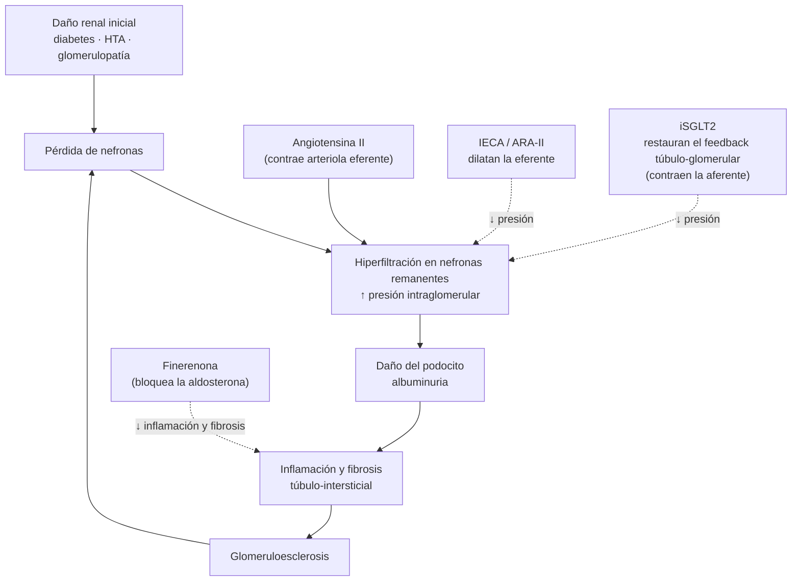
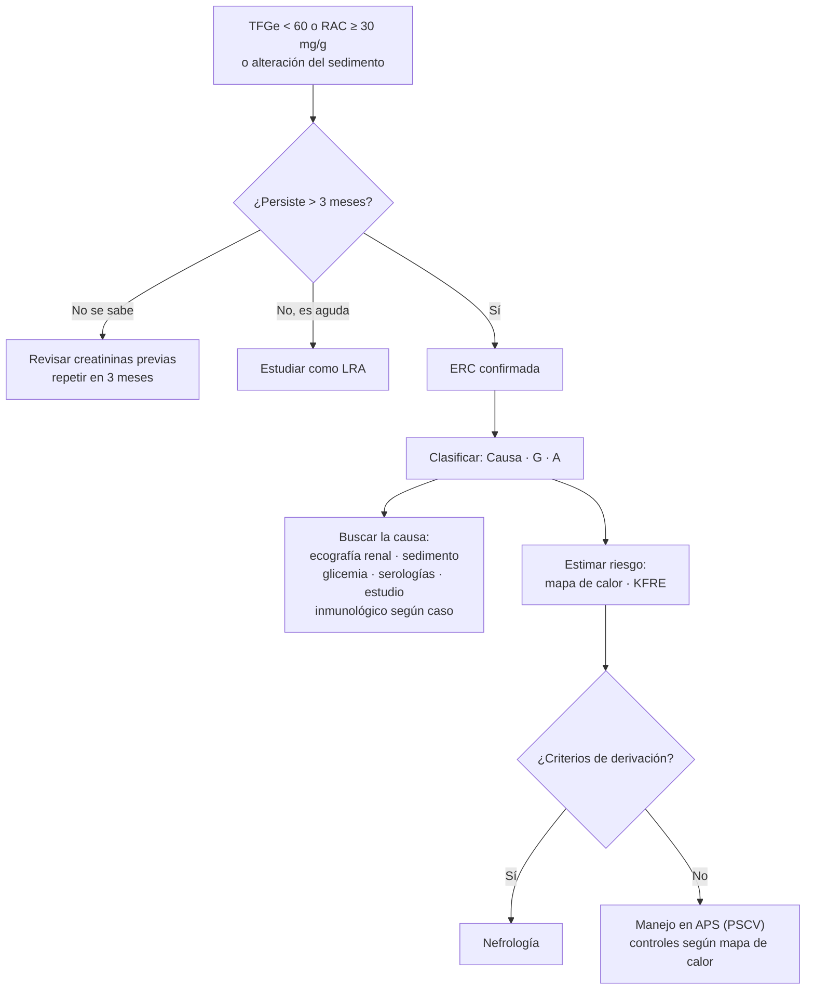
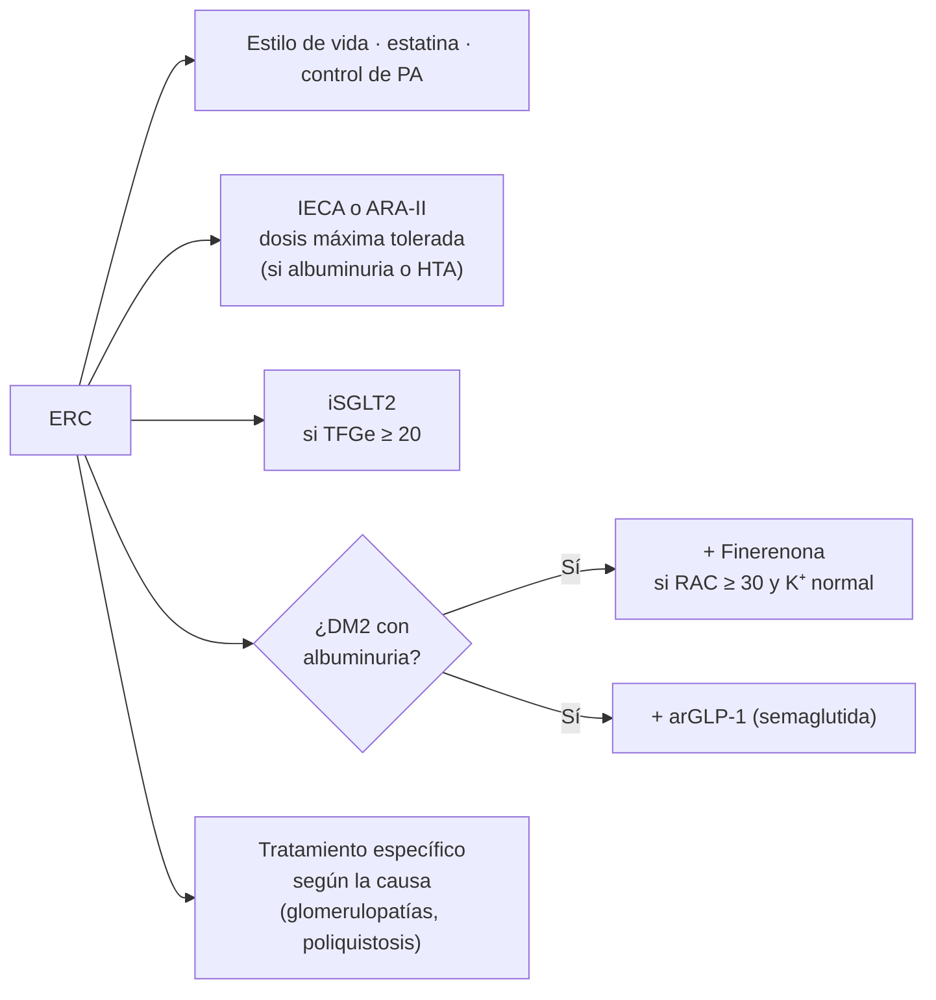

---
tags:
  - Nefrología
  - GES
  - Frecuente en sala
---

# Enfermedad renal crónica

**Subespecialidad**
Nefrología

**Guía principal**
KDIGO 2024: evaluación y manejo de la ERC (Kidney Int, abril 2024)

**Otras fuentes**
ESC/ERA 2026: enfermedad cardiovascular y ERC · KDIGO 2022 diabetes y ERC · KDIGO 2021 presión arterial · KDIGO 2017 CKD-MBD · GBD 2023 · Guías GES MINSAL

**GES**
Sí: prevención secundaria de la ERC terminal, y ERC etapas 4 y 5 (diálisis y trasplante)

**Revisado**
Septiembre 2026

!!! abstract "Resumen en 60 segundos"
    - **ERC** = alteración de la **estructura o función renal por > 3 meses**: **TFGe < 60 mL/min/1,73 m²** y/o marcadores de daño, sobre todo **albuminuria ≥ 30 mg/g**.
    - Se clasifica por **Causa, TFG (G1–G5) y Albuminuria (A1–A3)** (sistema **CGA**). El **mapa de calor** KDIGO resume el riesgo.
    - Las causas principales son la **diabetes** y la **hipertensión**.
    - La mayoría de los pacientes con ERC **muere de causa cardiovascular** antes de llegar a diálisis.
    - **Pilares del tratamiento**: control de PA (PAS **< 120 mmHg** si se tolera), **IECA o ARA-II** en dosis máxima si hay albuminuria, **iSGLT2** (con TFGe ≥ 20), **estatina**, y en DM2 con albuminuria **finerenona** y **semaglutida**.
    - Manejar las complicaciones: **anemia**, **alteraciones minerales y óseas**, **acidosis**, **hiperkalemia** y sobrecarga de volumen.
    - Derivar a nefrología según el **riesgo a 5 años de falla renal (KFRE > 3–5 %)**, TFGe < 30, albuminuria A3 o progresión rápida.

## Definición

!!! guia "Definición KDIGO 2024"
    Anomalías de la **estructura o función renal**, presentes por **más de 3 meses**, con implicancias para la salud. Se requiere al menos uno de:

    - **TFG < 60 mL/min/1,73 m²** (categorías G3a–G5).
    - **Marcadores de daño renal**:
        - **Albuminuria** ≥ 30 mg/24 h o **razón albúmina/creatinina (RAC) ≥ 30 mg/g** (≥ 3 mg/mmol).
        - Alteraciones del sedimento urinario (hematuria glomerular, cilindros).
        - Alteraciones electrolíticas u otras por trastornos tubulares.
        - Alteraciones histológicas.
        - Alteraciones estructurales en imágenes (riñones poliquísticos, cicatrices).
        - Antecedente de **trasplante renal**.

- El criterio de **cronicidad** (> 3 meses) distingue la ERC de la **lesión renal aguda** (LRA) y de la enfermedad renal aguda (7–90 días).
- La **TFG normal** es ~ 90–120 mL/min/1,73 m² en adultos jóvenes y disminuye con la edad (~ 1 mL/min/año desde los 40 años).

## Epidemiología

### Mundial

- **788 millones** de adultos tenían ERC en 2023: **~ 14 % de la población adulta** (GBD 2023). Duplica la cifra de 1990.
- Está entre las **10 primeras causas de muerte** en el mundo (~ 1,5 millones de muertes al año) y explica ~ **11,5 % de las muertes cardiovasculares**.
- Las principales causas son la **diabetes** y la **hipertensión arterial**.
- Solo una minoría de los pacientes conoce su diagnóstico: la ERC es **silenciosa** hasta etapas avanzadas.

### Chile

!!! chile "Datos nacionales"
    - **ENS 2016–2017**: ~ **3 %** de los adultos tiene ERC etapa 3a–5 (TFGe < 60), con aumento respecto de 2009–2010. La prevalencia sube a **~ 12 %** entre los adultos en control del Programa de Salud Cardiovascular (PSCV) de atención primaria.
    - **Hemodiálisis crónica**: **25.841 pacientes (1.286 por millón de habitantes)** al 31 de agosto de 2024 (XLIV Cuenta de Hemodiálisis Crónica, Sociedad Chilena de Nefrología). Es una de las tasas más altas de Latinoamérica.
    - La **nefropatía diabética** es la **principal causa** de ingreso a diálisis (~ 35–45 % de los pacientes), seguida de la nefropatía hipertensiva.
    - **GES**: incluye la **prevención secundaria de la ERC terminal** (manejo en APS de la ERC en etapas iniciales) y la **ERC etapas 4 y 5** (preparación para diálisis, hemodiálisis, peritoneodiálisis y trasplante), con acceso garantizado a la terapia de reemplazo renal.

## Etiología y factores de riesgo

| Causa | Comentario |
|---|---|
| **Enfermedad renal diabética** | La causa más frecuente. Albuminuria progresiva; riñones de tamaño normal o grande |
| **Nefroesclerosis hipertensiva** | Albuminuria baja o moderada; frecuente en adultos mayores |
| **Glomerulopatías** | Nefropatía por IgA, glomeruloesclerosis focal y segmentaria, membranosa, lupus, vasculitis |
| **Enfermedad renal poliquística autosómica dominante** | Historia familiar, quistes bilaterales, riñones grandes, HTA precoz |
| **Enfermedades túbulo-intersticiales** | **AINE**, litio, inhibidores de calcineurina, reflujo vesicoureteral, pielonefritis crónica |
| **Uropatía obstructiva** | Hiperplasia prostática, litiasis, tumores pélvicos, vejiga neurogénica |
| **Enfermedad renovascular** | Estenosis aterosclerótica de la arteria renal, ateroembolia |
| **Paraproteinemias** | **Mieloma múltiple** (riñón de mieloma), amiloidosis |
| **Genéticas** | Enfermedad de Alport, Fabry, variantes de APOL1 |

**Factores de riesgo y de progresión**: diabetes, HTA, **obesidad**, enfermedad cardiovascular, edad > 60 años, historia familiar de ERC, **episodios de LRA**, **nefrotóxicos**, tabaquismo, bajo peso al nacer, **albuminuria** (el principal factor de progresión), acidosis metabólica e hiperuricemia.

## Fisiopatología

La pérdida de nefronas lleva a una **hiperfiltración adaptativa** en las nefronas remanentes: la **angiotensina II** contrae la arteriola **eferente** y aumenta la **presión intraglomerular**. Esto mantiene la TFG a corto plazo, pero a largo plazo daña el podocito, aumenta la **albuminuria** y produce **glomeruloesclerosis** y **fibrosis túbulo-intersticial**. Se genera un **círculo vicioso** de pérdida progresiva de nefronas.

*Figura 1. Mecanismos de progresión de la ERC y sitio de acción de los fármacos nefroprotectores. Esquema propio basado en KDIGO 2024.*

<figure markdown>
{ loading=lazy width="680" }
<figcaption>Figura 2. Enfermedad renal diabética y nefroprotección por iSGLT2. La mayor reabsorción proximal de glucosa y sodio por el SGLT2 "apaga" el feedback túbulo-glomerular, dilata la arteriola aferente y produce hiperfiltración, daño del podocito (fusión y desprendimiento de pedicelos) y albuminuria; además hay hipoxia, estrés oxidativo y disfunción mitocondrial tubular. Los procesos marcados con el ícono de cápsula mejoran con iSGLT2. Fuente: Yan MT, Chao CT, Lin SH. Chronic Kidney Disease: Strategies to Retard Progression. <em>Int J Mol Sci</em>. 2021;22:10084. doi:<a href="https://doi.org/10.3390/ijms221810084">10.3390/ijms221810084</a>. Licencia <a href="https://creativecommons.org/licenses/by/4.0/">CC BY 4.0</a>. Texto de la figura en inglés.</figcaption>
</figure>

!!! perla "Por qué la creatinina sube al iniciar IECA, ARA-II o iSGLT2"
    Al bajar la presión intraglomerular, la TFG cae de forma **hemodinámica y reversible** (hasta ~ 30 %). Es la señal de que el fármaco está protegiendo el riñón. **No hay que suspenderlo** salvo que la caída supere el 30 %, haya hiperkalemia grave o hipovolemia.

**Consecuencias sistémicas de la pérdida de función renal**

- **↓ Eritropoyetina** → anemia.
- **↓ Excreción de fósforo** → ↑ FGF-23 → ↓ calcitriol (1,25-OH vitamina D) → hipocalcemia → **hiperparatiroidismo secundario** → enfermedad ósea y **calcificación vascular**.
- **↓ Excreción de ácido** → acidosis metabólica.
- **↓ Excreción de potasio y sodio** → hiperkalemia, sobrecarga de volumen e HTA.
- **Retención de toxinas urémicas** → síndrome urémico (etapa 5).

## Clasificación

### Sistema CGA (KDIGO)

Siempre se informa la **C**ausa, la categoría de **G** (TFG) y la de **A** (albuminuria). Ejemplo: "ERC por nefropatía diabética G3b A3".

| Categoría TFG | TFG (mL/min/1,73 m²) | Descripción |
|---|---|---|
| **G1** | ≥ 90 | Normal o alta (requiere un marcador de daño para ser ERC) |
| **G2** | 60–89 | Levemente disminuida (requiere un marcador de daño) |
| **G3a** | 45–59 | Leve a moderadamente disminuida |
| **G3b** | 30–44 | Moderada a gravemente disminuida |
| **G4** | 15–29 | Gravemente disminuida |
| **G5** | < 15 | **Falla renal** (G5D si está en diálisis) |

| Categoría de albuminuria | RAC (mg/g) | RAC (mg/mmol) | Descripción |
|---|---|---|---|
| **A1** | < 30 | < 3 | Normal a levemente aumentada |
| **A2** | 30–300 | 3–30 | Moderadamente aumentada (antes "microalbuminuria") |
| **A3** | > 300 | > 30 | Gravemente aumentada (incluye el rango nefrótico, > 2.200 mg/g) |

### Mapa de calor del riesgo (KDIGO 2024)

El color indica el riesgo de progresión, falla renal, eventos cardiovasculares y muerte. El número de cada celda es la **cantidad sugerida de controles de TFGe y RAC al año**.

<table class="kdigo-tabla">
  <thead>
    <tr><th rowspan="2" class="fila">Categoría TFG</th><th colspan="3">Albuminuria (RAC)</th></tr>
    <tr><th>A1 &lt; 30 mg/g</th><th>A2 30–300 mg/g</th><th>A3 &gt; 300 mg/g</th></tr>
  </thead>
  <tbody>
    <tr><th class="fila">G1 · ≥ 90</th><td class="verde">1 si hay ERC</td><td class="amarillo">1</td><td class="naranjo">2</td></tr>
    <tr><th class="fila">G2 · 60–89</th><td class="verde">1 si hay ERC</td><td class="amarillo">1</td><td class="naranjo">2</td></tr>
    <tr><th class="fila">G3a · 45–59</th><td class="amarillo">1</td><td class="naranjo">2</td><td class="rojo">3</td></tr>
    <tr><th class="fila">G3b · 30–44</th><td class="naranjo">2</td><td class="rojo">3</td><td class="rojo">3</td></tr>
    <tr><th class="fila">G4 · 15–29</th><td class="rojo">3</td><td class="rojo">3</td><td class="rojo">4 o más</td></tr>
    <tr><th class="fila">G5 · &lt; 15</th><td class="rojo">4 o más</td><td class="rojo">4 o más</td><td class="rojo">4 o más</td></tr>
  </tbody>
</table>

*Figura 3. Mapa de calor de pronóstico según TFG y albuminuria: verde (riesgo bajo), amarillo (moderado), naranjo (alto) y rojo (muy alto). Adaptado de KDIGO 2024.*

## Clínica

La ERC es **asintomática** en las etapas G1–G3. Se sospecha por laboratorio (creatinina, orina completa, RAC) o por sus causas (diabetes, HTA).

**Síntomas y signos en etapas avanzadas (G4–G5): síndrome urémico**

| Sistema | Manifestaciones |
|---|---|
| General | Fatiga, **anorexia**, baja de peso, desnutrición, **prurito**, aliento urémico (fetor urémico) |
| Digestivo | **Náuseas, vómitos**, disgeusia (sabor metálico), hemorragia digestiva |
| Cardiovascular | **HTA**, **sobrecarga de volumen** (edema, congestión pulmonar), **pericarditis urémica** (frote pericárdico), cardiopatía |
| Neurológico | Somnolencia, dificultad de concentración, **asterixis**, mioclonías, convulsiones, **encefalopatía urémica**, polineuropatía, síndrome de piernas inquietas |
| Hematológico | **Anemia** normocítica normocrómica, **disfunción plaquetaria** (sangrado) |
| Óseo y mineral | Dolor óseo, fracturas, calcificaciones vasculares y de partes blandas, calcifilaxis |
| Endocrino | Amenorrea, disfunción eréctil, resistencia a la insulina (pero **menos requerimientos de insulina** por menor depuración) |
| Piel | Palidez terrosa, equimosis, xerosis, escarcha urémica (muy avanzada) |

!!! alarma "Indicaciones de diálisis urgente (AEIOU)"
    - **A**cidosis metabólica grave refractaria.
    - **E**lectrolitos: **hiperkalemia** grave o con cambios en el ECG refractaria al tratamiento médico.
    - **I**ntoxicaciones dializables (litio, metanol, etilenglicol, salicilatos, metformina con acidosis láctica).
    - **O**verload: **sobrecarga de volumen** refractaria a diuréticos (edema pulmonar).
    - **U**remia sintomática: **pericarditis**, **encefalopatía**, sangrado urémico.

## Diagnóstico

*Figura 4. Enfoque diagnóstico de la ERC. Esquema propio basado en KDIGO 2024.*

### Estimación de la TFG

- Usar una **ecuación** con la creatinina, no la creatinina sola: en Chile y en KDIGO 2024 se recomienda **CKD-EPI 2021** (sin coeficiente de raza).
- **Cistatina C**: cuando esté disponible, la TFGe combinada **creatinina + cistatina C** es más exacta, sobre todo cuando la masa muscular es anormal (sarcopenia, amputados, obesos, culturistas, desnutridos), para confirmar una ERC G3a y antes de decisiones de dosis de fármacos.
- La creatinina tarda en subir: una **creatinina "normal" en un adulto mayor delgado** puede corresponder a una TFG < 60.
- La TFGe **no es válida** en situaciones inestables (LRA): la creatinina no está en equilibrio.
- Medir la TFG directamente (depuración de creatinina en orina de 24 horas o métodos con marcadores exógenos) si se necesita más exactitud.

### Albuminuria

- Medir la **RAC en la primera orina de la mañana** (muestra aislada).
- **Confirmar** con 2 de 3 muestras alteradas en 3–6 meses (el ejercicio, la fiebre, la infección urinaria, la hiperglicemia marcada, la insuficiencia cardíaca y la menstruación la elevan transitoriamente).
- Si no hay RAC disponible: razón proteína/creatinina en orina o tira reactiva (menos exactas).

## Laboratorio

**Para el diagnóstico y el seguimiento**

- **Creatinina y TFGe**, **RAC**, **orina completa con sedimento** (hematuria dismórfica, cilindros eritrocitarios → origen glomerular).
- **Electrolitos**: Na, **K**, Cl, **bicarbonato** (gases venosos).
- **Hemograma**; si hay anemia: **ferritina**, **saturación de transferrina**, reticulocitos, vitamina B12 y folato.
- **Metabolismo mineral**: **calcio, fósforo, PTH**, fosfatasas alcalinas y **25-OH vitamina D** (desde G3a).
- **Glicemia y HbA1c**, **perfil lipídico**, albúmina.
- **Ácido úrico**.

**Para buscar la causa (según el caso)**

- Serologías: **VHB, VHC, VIH**.
- **Complemento C3 y C4**, **ANA**, anti-DNA, **ANCA**, anti-membrana basal glomerular, anti-PLA2R (membranosa).
- **Electroforesis de proteínas** en sangre y orina, **cadenas livianas libres** e inmunofijación (mieloma, sobre todo en > 50 años con ERC sin causa clara).
- **Biopsia renal**: cuando la causa no es clara y el resultado cambiará el tratamiento (proteinuria o hematuria de causa no aclarada, sospecha de glomerulonefritis, deterioro rápido).

## Imágenes

### Ecografía renal y vesical

Examen inicial en toda ERC de causa no clara.

- **Riñones pequeños** (< 9 cm), **hiperecogénicos**, con **pérdida de la diferenciación córtico-medular** y corteza adelgazada: sugieren ERC **avanzada e irreversible**.
- **ERC con riñones de tamaño normal o grande**: **diabetes**, **amiloidosis**, **poliquistosis**, **VIH**, mieloma, uropatía obstructiva en fase inicial.
- **Asimetría > 1,5 cm**: enfermedad **renovascular** unilateral, pielonefritis crónica o malformación.
- **Hidroureteronefrosis**: **obstrucción** (evaluar residuo posmiccional y próstata).
- **Quistes múltiples bilaterales**: poliquistosis.

### Otros estudios

- **Eco-Doppler, angioTC o angioRM de arterias renales**: si se sospecha estenosis de la arteria renal (HTA de inicio reciente o refractaria, caída de la TFG > 30 % con IECA o ARA-II, edema pulmonar "flash", asimetría renal).
- **Contrastes**:
    - **Yodado**: riesgo de LRA menor al que se creía, pero hay que tomar precauciones con TFGe < 30 (hidratación, dosis mínima, evitar nefrotóxicos). No se debe negar un examen necesario.
    - **Gadolinio**: evitar los agentes de mayor riesgo de **fibrosis sistémica nefrogénica** con TFGe < 30; usar agentes del grupo II (macrocíclicos).

## Diagnóstico diferencial

- **Lesión renal aguda** o ERC agudizada (siempre revisar creatininas previas).
- **Elevación de creatinina sin caída real de la TFG**: dieta rica en carne, suplementos de creatina, fármacos que bloquean su secreción tubular (**trimetoprim**, cimetidina, dolutegravir, cobicistat).
- **Albuminuria transitoria**: ejercicio, fiebre, infección urinaria, hiperglicemia, insuficiencia cardíaca descompensada.
- **Enfermedad renal aguda** (7–90 días): p. ej., glomerulonefritis rápidamente progresiva, que requiere estudio urgente.

## Tratamiento

### Enfoque general: "STAMP" (ESC/ERA 2026)

!!! guia "ESC/ERA 2026: primera guía conjunta de enfermedad cardiovascular y ERC"
    Propone el enfoque **STAMP on CKD**: **S**creen (**tamizar** TFGe y albuminuria en **todo paciente con enfermedad cardiovascular**), **T**riage (estratificar el riesgo), **A**ddress risk (tratar el riesgo con los fármacos de beneficio demostrado: bloqueo del SRAA, **iSGLT2**, **finerenona**, **semaglutida**, **estatinas**), **M**odify (adaptar el manejo cardiovascular a la presencia de ERC) y **P**lan (organizar los servicios de salud).

### Medidas generales

- **Sodio < 2 g/día** (< 5 g de sal).
- **Proteínas**: **0,8 g/kg/día** en G3–G5; **evitar > 1,3 g/kg/día** si hay riesgo de progresión. Preferir una dieta basada en **vegetales**. En diálisis los requerimientos aumentan (1,0–1,2 g/kg/día).
- **Actividad física** ≥ 150 minutos a la semana, según tolerancia.
- **Control del peso**, **cese del tabaco**.
- **Evitar nefrotóxicos**: **AINE**, contraste innecesario, aminoglucósidos, fitoterapia no controlada.
- **Ajustar las dosis** de fármacos según la TFGe (antibióticos, anticoagulantes directos, metformina, gabapentinoides, insulina, entre otros).
- **Vacunas**: influenza, neumococo, **hepatitis B** (esquema de dosis alta y control de anticuerpos anti-HBs), COVID-19.

!!! perla "\"Días de enfermedad\": suspender temporalmente"
    Ante **vómitos, diarrea, fiebre alta o ingesta muy reducida** (riesgo de deshidratación y LRA), suspender por 24–48 horas: **IECA/ARA-II**, **diuréticos**, **iSGLT2**, **metformina**, **AINE** y sulfonilureas. Reiniciar al recuperar la ingesta.

### Pilares farmacológicos de la nefroprotección

*Figura 5. Pilares del tratamiento nefroprotector. Esquema propio basado en KDIGO 2024, KDIGO 2022 y ESC/ERA 2026.*

| Intervención | Indicación | Detalles |
|---|---|---|
| **Control de PA** | Todos los pacientes con HTA | Meta **PAS < 120 mmHg** si se tolera, con medición estandarizada (KDIGO 2021); **< 130/80** en guías de otras sociedades y en adultos mayores frágiles |
| **IECA o ARA-II** | **Albuminuria A2–A3** (con o sin diabetes) o HTA | Titular a la **dosis máxima tolerada**. Controlar creatinina y K⁺ a las 2–4 semanas. Aceptable un aumento de creatinina de hasta **30 %**. **No combinar IECA + ARA-II**. **No suspender** al llegar a TFGe < 30 |
| **iSGLT2** (dapagliflozina 10 mg, empagliflozina 10 mg) | **DM2 con ERC y TFGe ≥ 20**; ERC sin diabetes con **TFGe ≥ 20 y RAC ≥ 200 mg/g**, o con **insuficiencia cardíaca**; sugerido también con TFGe 20–45 y RAC < 200 | Iniciar con TFGe ≥ 20 y **mantener hasta la diálisis o el trasplante**. Caída inicial esperable de la TFGe |
| **Finerenona** 10–20 mg/día | **DM2** con TFGe ≥ 25, **K⁺ normal** y **albuminuria ≥ 30 mg/g** pese a IECA o ARA-II en dosis máxima | Controlar K⁺ al mes. Reduce la progresión renal y los eventos cardiovasculares (incluida la IC) |
| **arGLP-1** (semaglutida) | **DM2 con ERC**, especialmente si no se logra la meta glicémica o hay obesidad | Semaglutida redujo la progresión de la ERC y la mortalidad cardiovascular (estudio FLOW) |
| **Estatina** (o estatina + ezetimibe) | **≥ 50 años con TFGe < 60** (sin diálisis) y ≥ 50 años con G1–G2; 18–49 años si hay diabetes, enfermedad coronaria, ACV o riesgo alto | **No iniciar** estatinas en pacientes en diálisis (sin beneficio demostrado), pero **mantenerlas** si ya las usaban |
| **Antiagregación** | Prevención secundaria cardiovascular | Aspirina en dosis bajas |

!!! warning "La guía KDIGO de diabetes y ERC está en actualización"
    En marzo de 2026 KDIGO publicó para revisión pública el borrador de la actualización de su guía de diabetes y ERC. Cuando salga la versión definitiva, revisa si cambian las recomendaciones de finerenona y arGLP-1.

### Manejo de las complicaciones

=== "Anemia"

    - Aparece desde G3 y es casi universal en G5. Es **normocítica normocrómica**, por déficit de **eritropoyetina** y **déficit de hierro** (absoluto o funcional).
    - **Primero descartar otras causas**: déficit de hierro por pérdidas (**hemorragia digestiva**), B12, folato, hemólisis, hipotiroidismo.
    - **Hierro**: si **ferritina ≤ 500 ng/mL y saturación de transferrina ≤ 30 %** (KDIGO 2012): **oral** en ERC no dializada; **endovenoso** en hemodiálisis o si el oral falla o no se tolera.
    - **Agentes estimulantes de la eritropoyesis** (eritropoyetina, darbepoetina): si la **Hb es < 10 g/dL** tras corregir el hierro. **Meta de Hb ~ 10–11,5 g/dL**. **No superar 13 g/dL** (más ACV, trombosis e HTA).
    - Los **inhibidores de la HIF-prolil hidroxilasa** (roxadustat, daprodustat) son alternativas orales en algunos países.
    - Evitar transfusiones cuando sea posible (sensibilización ante un futuro trasplante).

=== "Alteraciones minerales y óseas (CKD-MBD)"

    - **Fósforo**: si está **elevado de forma progresiva**, bajarlo hacia el rango normal: **restricción de fósforo en la dieta** (sobre todo aditivos de alimentos procesados y bebidas cola) y **quelantes de fósforo** con las comidas (**sevelamer**, carbonato de lantano; limitar los quelantes con calcio).
    - **Calcio**: evitar la **hipercalcemia**.
    - **PTH**: en ERC no dializada, si sube de forma progresiva, corregir primero los factores modificables (**hiperfosfatemia**, **hipocalcemia**, **déficit de vitamina D**). No usar calcitriol de rutina en G3–G5 no dializada; reservarlo para el hiperparatiroidismo grave y progresivo. En diálisis: meta de PTH **2–9 veces el límite superior normal**; **cinacalcet**, calcitriol o análogos y, si falla, **paratiroidectomía**.
    - **Vitamina D (25-OH)**: suplementar con colecalciferol si hay déficit.

=== "Acidosis metabólica"

    - Por menor excreción renal de ácido; aparece desde G3b–G4.
    - Tratar si el **bicarbonato sérico es < 18 mEq/L** (KDIGO 2024 sugiere considerarlo para prevenir consecuencias clínicas; muchos nefrólogos intervienen bajo 22 mEq/L): **bicarbonato de sodio oral** y aumentar frutas y verduras.
    - Consecuencias: pérdida muscular, enfermedad ósea y progresión de la ERC.

=== "Hiperkalemia"

    - Causas: menor excreción, **fármacos** (IECA, ARA-II, ARM, finerenona, AINE, trimetoprim, betabloqueadores, heparina), acidosis, dieta.
    - **Manejo crónico**: revisar fármacos, **corregir la acidosis**, **diuréticos de asa o tiazídicos**, educación en dieta (evitar los **sustitutos de sal con potasio**) y **quelantes de potasio** (**patiromer**, **ciclosilicato de sodio y zirconio**).
    - **Preferir tratar la hiperkalemia antes que suspender el bloqueo del SRAA** (KDIGO 2024).
    - **Hiperkalemia aguda** con cambios en el ECG: **gluconato de calcio EV**, **insulina + glucosa**, β2-agonistas nebulizados, diuréticos o diálisis (ver "Alteraciones hidroelectrolíticas graves").

=== "Volumen, HTA y otros"

    - **Sobrecarga de volumen**: restricción de sodio y **diuréticos de asa** (las tiazidas pierden eficacia con TFGe < 30, salvo la clortalidona).
    - **Hiperuricemia**: no tratar la hiperuricemia asintomática para enlentecer la ERC; tratar la gota (alopurinol en dosis ajustada o febuxostat).
    - **Desnutrición**: evaluación nutricional periódica.
    - **Depresión**, deterioro cognitivo y fragilidad: pesquisa activa.

### Derivación a nefrología

!!! alarma "Criterios de derivación (KDIGO 2024)"
    - **Riesgo de falla renal a 5 años > 3–5 %** según la **ecuación KFRE** (*Kidney Failure Risk Equation*: edad, sexo, TFGe y RAC).
    - **TFGe < 30 mL/min/1,73 m²** (G4–G5).
    - **Albuminuria A3** (RAC ≥ 300 mg/g) o proteinuria ≥ 500 mg/24 h.
    - **Progresión rápida**: caída sostenida de la TFGe > 5 mL/min/1,73 m² al año, o paso a una categoría G más baja con una caída ≥ 25 %.
    - **Hematuria glomerular** (cilindros eritrocitarios o > 20 eritrocitos por campo) sin explicación.
    - **HTA refractaria** (≥ 4 fármacos).
    - **Alteraciones persistentes del potasio**, acidosis u otras alteraciones electrolíticas.
    - **Litiasis recurrente o extensa**, **enfermedad renal hereditaria**.
    - **LRA** o caída abrupta de la TFG.

### Preparación para la terapia de reemplazo renal

- **Educación** sobre las opciones (hemodiálisis, **peritoneodiálisis**, **trasplante**, **manejo conservador**) cuando el riesgo de falla renal a 2 años es > 40 % (KFRE).
- **Acceso vascular**: planificar la **fístula arteriovenosa** con meses de anticipación (tarda ~ 2–3 meses en madurar). **Cuidar las venas** del brazo no dominante: no puncionarlas ni instalar vías.
- **Evaluación para trasplante** (idealmente trasplante **anticipado**, antes de iniciar diálisis) cuando la ERC es progresiva y la TFGe se acerca a 20.
- **Inicio de diálisis**: se decide por **síntomas y complicaciones** (síndrome urémico, sobrecarga de volumen, hiperkalemia o acidosis refractarias, desnutrición), no por una cifra exacta de TFG. Habitualmente ocurre con TFGe entre 5 y 10.
- **Manejo conservador** (sin diálisis): opción válida en adultos mayores frágiles o con múltiples comorbilidades, con enfoque paliativo.

## Complicaciones

- **Enfermedad cardiovascular**: la **principal causa de muerte** (enfermedad coronaria, IC, arritmias, muerte súbita, ACV, enfermedad arterial periférica, calcificación vascular).
- **Progresión a falla renal** y necesidad de terapia de reemplazo.
- **Anemia**, **CKD-MBD** (fracturas, calcifilaxis), **acidosis**, **hiperkalemia**.
- **Sobrecarga de volumen** e HTA.
- **Episodios de LRA** (la ERC es el principal factor de riesgo de LRA).
- **Toxicidad por fármacos** no ajustados (hipoglicemia por sulfonilureas o insulina, sangrado por anticoagulantes, neurotoxicidad por aciclovir o gabapentina, hiperkalemia).
- **Infecciones** y menor respuesta a vacunas.
- **Desnutrición**, sarcopenia, deterioro cognitivo y depresión.

## Pronóstico y seguimiento

- El pronóstico depende de la **TFG**, la **albuminuria** (mapa de calor), la **causa** y la **velocidad de progresión**.
- En G3, la probabilidad de **morir de causa cardiovascular** es mayor que la de llegar a diálisis.
- La mortalidad en hemodiálisis es alta: ~ **15–20 % al año** en la mayoría de los registros.
- El **trasplante renal** ofrece la mejor sobrevida y calidad de vida para los candidatos adecuados.
- **Frecuencia de controles** según el mapa de calor (1 a 4 o más veces al año).
- Usar la **ecuación KFRE** para comunicar el riesgo y planificar.

## Perlas para el internado

!!! perla "Para la sala y el turno"
    - **Siempre busca creatininas previas** antes de llamar "ERC" a una creatinina elevada: puede ser una LRA o una ERC agudizada.
    - La **creatinina sola engaña**: calcula siempre la TFGe (y piensa en la masa muscular).
    - La **albuminuria** pesa tanto como la TFG para el pronóstico: pide **RAC** a todo diabético e hipertenso.
    - **Ajusta las dosis** de antibióticos, anticoagulantes, insulina y analgésicos según la TFGe. Revisa las indicaciones al ingreso.
    - **No indiques AINE** a pacientes con ERC (ni con IC o cirrosis).
    - **Cuida el brazo de la fístula** (o el brazo no dominante en ERC avanzada): no tomes presión, no puncionar, no instalar vías.
    - Anemia en ERC: antes de atribuirla a la ERC, descarta **déficit de hierro** y **hemorragia digestiva**.
    - Hiperkalemia en un paciente con ERC: **ECG de inmediato** y tratamiento según cambios; después revisa fármacos y dieta.
    - Un paciente en hemodiálisis que **faltó a su sesión**, con disnea o debilidad: piensa en **hiperkalemia** y **sobrecarga de volumen**.
    - La caída de la TFGe de hasta **30 %** al iniciar IECA, ARA-II o iSGLT2 es esperable: no los suspendas por eso.

## Preguntas de repaso

??? repaso "1. Hombre de 62 años con DM2 e HTA. TFGe 52 mL/min/1,73 m² y RAC 450 mg/g en dos controles separados por 4 meses. ¿Cómo lo clasificas y qué tratamiento corresponde?"
    **ERC por nefropatía diabética G3a A3** (riesgo muy alto, rojo en el mapa de calor). Tratamiento: **IECA o ARA-II en dosis máxima tolerada**, **iSGLT2**, **estatina**, meta de **PAS < 120 mmHg** si se tolera, y agregar **finerenona** (si K⁺ normal) y/o **semaglutida**. Por la albuminuria A3, **derivar a nefrología**.

??? repaso "2. ¿Qué hallazgos ecográficos sugieren ERC avanzada e irreversible? ¿En qué causas de ERC los riñones son de tamaño normal o grande?"
    Riñones **pequeños (< 9 cm)**, **hiperecogénicos**, con **pérdida de la diferenciación córtico-medular** y corteza adelgazada. Riñones normales o grandes: **diabetes**, **amiloidosis**, **poliquistosis**, **VIH** y mieloma.

??? repaso "3. Paciente con ERC G3b que inicia enalapril. A las 3 semanas la creatinina subió de 1,6 a 1,9 mg/dL (19 %) y el K⁺ es 5,2 mEq/L. ¿Qué haces?"
    **Mantener el IECA**: el aumento es < 30 % y el potasio es aceptable. Controlar de nuevo creatinina y K⁺ en 2–4 semanas, reforzar la dieta y revisar otros fármacos que suban el potasio.

??? repaso "4. Paciente en hemodiálisis que faltó a su sesión, llega con debilidad, K⁺ 7,1 mEq/L y ondas T picudas con QRS ancho. ¿Cuál es el manejo?"
    **Gluconato de calcio EV** (estabiliza la membrana), **insulina cristalina 10 U EV + glucosa**, **salbutamol nebulizado** y **hemodiálisis de urgencia** (el tratamiento definitivo). Monitorización continua del ECG.

??? repaso "5. ¿Cuáles son las metas de hemoglobina con agentes estimulantes de la eritropoyesis y por qué no se debe normalizar la Hb?"
    Iniciar cuando la Hb es **< 10 g/dL** tras corregir el hierro, con meta **~ 10–11,5 g/dL** y **sin superar 13 g/dL**. Normalizar la Hb aumentó el riesgo de **ACV**, trombosis del acceso vascular, HTA y eventos cardiovasculares (estudios CHOIR y TREAT).

## Referencias

1. Kidney Disease: Improving Global Outcomes (KDIGO) CKD Work Group. KDIGO 2024 Clinical Practice Guideline for the Evaluation and Management of Chronic Kidney Disease. *Kidney Int.* 2024;105(4S):S117–S314. [kdigo.org](https://kdigo.org/guidelines/ckd-evaluation-and-management/)
2. 2026 ESC Guidelines for the management of cardiovascular disease and chronic kidney disease, in collaboration with the European Renal Association (ERA). *Eur Heart J.* 2026. doi:[10.1093/eurheartj/ehag098](https://doi.org/10.1093/eurheartj/ehag098)
3. KDIGO Diabetes Work Group. KDIGO 2022 Clinical Practice Guideline for Diabetes Management in Chronic Kidney Disease. *Kidney Int.* 2022;102(5S):S1–S127.
4. KDIGO Blood Pressure Work Group. KDIGO 2021 Clinical Practice Guideline for the Management of Blood Pressure in Chronic Kidney Disease. *Kidney Int.* 2021;99(3S):S1–S87.
5. KDIGO CKD-MBD Update Work Group. KDIGO 2017 Clinical Practice Guideline Update for the Diagnosis, Evaluation, Prevention, and Treatment of Chronic Kidney Disease–Mineral and Bone Disorder. *Kidney Int Suppl.* 2017;7:1–59.
6. KDIGO Anemia Work Group. KDIGO Clinical Practice Guideline for Anemia in Chronic Kidney Disease. *Kidney Int Suppl.* 2012;2:279–335.
7. GBD 2023 Chronic Kidney Disease Collaborators. Global, regional, and national burden of chronic kidney disease in adults, 1990–2023, and its attributable risk factors: a systematic analysis for the Global Burden of Disease Study 2023. *Lancet.* 2025. [thelancet.com](https://www.thelancet.com/journals/lancet/article/PIIS0140-6736(25)01853-7/fulltext)
8. Walbaum M, et al. Chronic kidney disease in adults aged 18 years and older in Chile: findings from the cross-sectional Chilean National Health Surveys 2009–2010 and 2016–2017. *BMJ Open.* 2020. [PMC7473630](https://pmc.ncbi.nlm.nih.gov/articles/PMC7473630/)
9. Sociedad Chilena de Nefrología. *XLIV Cuenta de Hemodiálisis Crónica en Chile* (al 31 de agosto de 2024).
10. Ministerio de Salud de Chile. *Guía de Práctica Clínica GES: Prevención secundaria de la enfermedad renal crónica.* 2017.
11. Tangri N, et al. A predictive model for progression of chronic kidney disease to kidney failure (KFRE). *JAMA.* 2011;305:1553–1559.
12. Perkovic V, et al. Effects of Semaglutide on Chronic Kidney Disease Outcomes in Patients with Type 2 Diabetes (FLOW). *N Engl J Med.* 2024;391:109–121.
13. The EMPA-KIDNEY Collaborative Group. Empagliflozin in Patients with Chronic Kidney Disease. *N Engl J Med.* 2023;388:117–127.
14. Heerspink HJL, et al. Dapagliflozin in Patients with Chronic Kidney Disease (DAPA-CKD). *N Engl J Med.* 2020;383:1436–1446.
15. Bhandari S, et al. Renin–Angiotensin System Inhibition in Advanced Chronic Kidney Disease (STOP-ACEi). *N Engl J Med.* 2022;387:2021–2032.
16. Yan MT, Chao CT, Lin SH. Chronic Kidney Disease: Strategies to Retard Progression. *Int J Mol Sci.* 2021;22:10084. doi:[10.3390/ijms221810084](https://doi.org/10.3390/ijms221810084)
