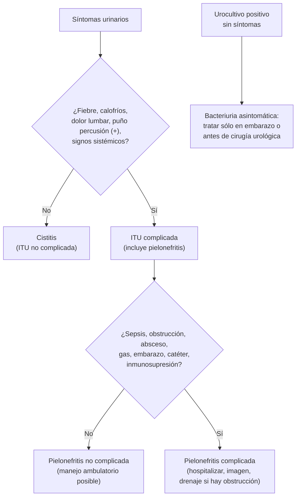
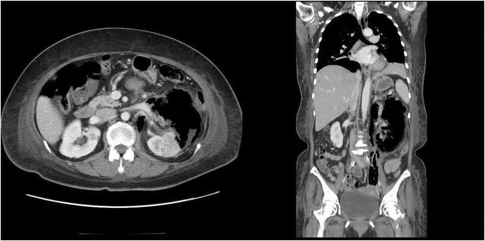

---
tags:
  - Nefrología
  - Infectología
  - Frecuente en sala
  - Atención primaria
---

# Infección del tracto urinario

**Subespecialidad**
Nefrología · Infectología · Urología · Atención primaria

**Guías principales**
IDSA 2025: ITU complicada (selección de antibióticos, paso a vía oral y duración) · IDSA/ESCMID 2010: cistitis y pielonefritis no complicadas en mujeres · IDSA 2019: bacteriuria asintomática

**Otras fuentes**
Guías EAU de infecciones urológicas · Ensayos de duración en hombres (JAMA 2021) y de prevención de recurrencias · Vigilancia de resistencia en urocultivos ambulatorios de Osorno (Rev Chilena Infectol 2025)

**EUNACOM**
1.09.1.011 Cistitis (específico, completo, completo) · 1.09.1.016 Pielonefritis aguda no complicada (específico, completo, completo) · 1.09.2.011 Pielonefritis aguda complicada (sospecha, inicial, completo) · 1.09.1.005 Bacteriuria asintomática (sospecha, inicial, completo)

**Revisado**
Septiembre 2026

!!! abstract "Resumen en 60 segundos"
    - **Cistitis** (disuria, polaquiuria, urgencia, dolor suprapúbico, **sin fiebre ni dolor lumbar**): en la mujer con síntomas típicos se trata **sin urocultivo**. Primera línea en Chile: **nitrofurantoína 100 mg c/12 h × 5 días** o **fosfomicina 3 g dosis única**.
    - **ITU complicada** (IDSA 2025) = infección **más allá de la vejiga**: **fiebre**, calofríos, inestabilidad, **dolor lumbar** o **puño percusión (+)**; incluye la **pielonefritis** y la ITU febril asociada a **catéter**. Ser hombre o diabético **no basta** para llamarla complicada.
    - **Pielonefritis**: **urocultivo siempre**. En Chile, **~ 22 % de *E. coli* comunitaria es resistente a ciprofloxacino**: dar una **dosis inicial de ceftriaxona** y luego un oral según el cultivo. Duración: **5–7 días de fluoroquinolona** o **7 días de otro antibiótico** efectivo.
    - Con **sepsis**, obstrucción, embarazo, vómitos o fracaso ambulatorio: **hospitalizar**. **Obstrucción + infección = drenaje urgente**.
    - **Bacteriuria asintomática**: **no** tamizar ni tratar, **salvo en el embarazo** y **antes de cirugía urológica** con sangrado de la mucosa.

## Definición

| Término | Definición |
|---|---|
| **Cistitis (ITU baja)** | Síntomas vesicales: **disuria**, **urgencia**, **polaquiuria**, **dolor suprapúbico**, a veces **hematuria**, sin signos de compromiso más allá de la vejiga |
| **Pielonefritis aguda** | Infección del **parénquima renal**: **fiebre**, calofríos, **dolor lumbar**, **puño percusión (+)**, con o sin síntomas de cistitis |
| **ITU no complicada** (IDSA 2025) | Confinada a la vejiga: **sin** fiebre, sin signos sistémicos, sin dolor lumbar. **Puede ocurrir** en hombres, diabéticos, inmunosuprimidos o con anomalías urológicas. Los usuarios de **catéter** generalmente no tienen ITU no complicada |
| **ITU complicada** (IDSA 2025) | Infección **más allá de la vejiga**: fiebre, calofríos, inestabilidad hemodinámica, dolor lumbar o sensibilidad del ángulo costovertebral. Incluye la **pielonefritis** y la ITU con síntomas sistémicos asociada a **catéter**. (No incluye prostatitis, epididimitis ni orquitis) |
| **Pielonefritis complicada** (uso clásico y EUNACOM) | Pielonefritis con **obstrucción**, **absceso** renal o perirrenal, **pielonefritis enfisematosa**, **necrosis papilar**, **sepsis**, o en un huésped de riesgo (embarazo, trasplante, catéter, alteración anatómica o funcional) |
| **Bacteriuria asintomática** | **≥ 10⁵ UFC/mL** del mismo microorganismo **sin síntomas** urinarios: en **1 muestra** en el hombre o en **2 muestras** consecutivas en la mujer; **≥ 10² UFC/mL** en una muestra por sondeo |
| **ITU recurrente** | **≥ 2 episodios en 6 meses** o **≥ 3 en 12 meses** |
| **Urosepsis** | Sepsis con foco urinario (ver [Sepsis y shock séptico](../infectologia/sepsis-y-shock-septico.md)) |

!!! perla "Dos formas de decir \"complicada\""
    La guía **IDSA 2025** define la ITU complicada por la **clínica** (¿pasó más allá de la vejiga?), para decidir el tratamiento. La definición **clásica** (EAU, perfil EUNACOM) la define por el **huésped** o la **anatomía** (obstrucción, catéter, embarazo, hombre, inmunosupresión). En la práctica: una **cistitis afebril en un hombre** o en una diabética se trata como cistitis (con más días en el hombre), y una **pielonefritis** siempre merece urocultivo, control estrecho y evaluar obstrucción si no mejora.

## Epidemiología

### Mundial

- Es una de las **infecciones bacterianas más frecuentes**: **~ 50–60 % de las mujeres** tendrá al menos una ITU en su vida, y **~ 25 %** de ellas tendrá una **recurrencia** en los 6 meses siguientes.
- En los hombres es poco frecuente antes de los 50 años; aumenta después por la **hiperplasia prostática**.
- **Bacteriuria asintomática**: 1–5 % de las mujeres premenopáusicas sanas, 2–10 % de las embarazadas, **15–50 %** de los adultos mayores institucionalizados y **~ 100 %** de los pacientes con **catéter permanente** después de 30 días.
- **Microbiología**: *Escherichia coli* causa el **75–95 %** de las cistitis no complicadas; otros: *Klebsiella*, *Proteus* (asociado a **cálculos de estruvita**), *Staphylococcus saprophyticus* (mujeres jóvenes), *Enterococcus*. En las ITU asociadas a la atención de salud aumentan *Pseudomonas*, *Enterococcus*, enterobacterias **productoras de BLEE** y *Candida*.
- *S. aureus* en la orina sin catéter sugiere **bacteriemia** (siembra hematógena): buscar endocarditis o absceso.

### Chile

!!! chile "Resistencia en urocultivos ambulatorios (Osorno, 2023; 1.779 aislados)"
    - ***E. coli***: **86 %** de los aislados.
    - **Resistencia de *E. coli***: ampicilina **43,5 %**, **ciprofloxacino 21,8 %**, **cotrimoxazol 18,1 %**, cefalosporinas de 3.ª generación **8 %** (casi todo por **BLEE**), gentamicina 4 %, **nitrofurantoína 2 %**, amikacina 1,3 %, carbapenémicos 0 %.
    - ***Klebsiella pneumoniae*** (adultos mayores y con comorbilidad): ciprofloxacino 27,7 %, **nitrofurantoína 25,6 %**, cefalosporinas de 3.ª generación 21 %.
    - **Consecuencias prácticas**: la **nitrofurantoína** y la **fosfomicina** son excelentes para la cistitis; las **fluoroquinolonas** y el **cotrimoxazol** superan el umbral de resistencia (10–20 %) para usarlos **empíricamente** en la pielonefritis sin una dosis parenteral inicial o un cultivo que los respalde. Cada centro debe usar su **epidemiología local**.

## Etiología y fisiopatología

- **Vía ascendente** (la más frecuente): la flora **fecal** coloniza el introito vaginal y el periné → uretra → vejiga (**cistitis**) → uréteres → riñón (**pielonefritis**). La uretra corta de la mujer explica su mayor riesgo.
- ***E. coli* uropatógena** tiene factores de virulencia: **fimbrias tipo 1** (adhesión a la vejiga), **fimbrias P** (adhesión al riñón, pielonefritis), toxinas y formación de **comunidades bacterianas intracelulares** (reservorio de recurrencias).
- **Vía hematógena** (rara): *S. aureus*, *Candida*.
- **Factores de riesgo**:
    - **Relaciones sexuales**, **espermicidas**, nueva pareja sexual, ITU previas, antecedente materno de ITU.
    - **Posmenopausia** (déficit de estrógenos: cambia la flora vaginal).
    - **Obstrucción** o estasis: **hiperplasia prostática**, **cálculos**, estenosis, **vejiga neurogénica**, residuo posmiccional, embarazo.
    - **Catéter urinario** (el riesgo aumenta ~ 3–7 % por cada día).
    - **Diabetes** (sobre todo con glucosuria o mal control), **iSGLT2** (riesgo pequeño), inmunosupresión, trasplante renal.

## Clasificación

## Clínica

| Cuadro | Síntomas y signos |
|---|---|
| **Cistitis** | **Disuria**, **polaquiuria**, **urgencia**, **dolor suprapúbico**, orina turbia o con **hematuria**; **sin fiebre** |
| **Pielonefritis** | **Fiebre** (> 38 °C), **calofríos**, **dolor lumbar** o en el flanco, **puño percusión (+)**, náuseas y vómitos; síntomas de cistitis en ~ 50 % |
| **Prostatitis bacteriana aguda** | Fiebre, **dolor perineal** o pélvico, síntomas obstructivos (retención), disuria; **próstata muy dolorosa** al tacto rectal (**no masajear**) |
| **ITU asociada a catéter** | Fiebre, calofríos, dolor en el flanco o suprapúbico, **delirium** o hipotensión **sin otra causa**; la orina turbia o con mal olor **no** es suficiente |
| **Adulto mayor** | Presentación **atípica**: fiebre sin foco, delirium, caídas. Pero **delirium + bacteriuria sin fiebre ni síntomas urinarios** no es ITU: buscar **otra causa** antes de tratar (IDSA 2019) |

!!! perla "Cuándo NO es una cistitis"
    **Flujo vaginal** o **prurito** vaginal → vaginitis (la probabilidad de ITU baja mucho). **Disuria en un joven sexualmente activo** con secreción uretral → **uretritis** (gonococo, clamidia). **Hematuria sin síntomas** → estudiar cáncer urotelial en > 35–40 años o fumadores.

## Diagnóstico

### Cistitis

- **Mujer con síntomas típicos** (disuria + polaquiuria, **sin flujo vaginal**): la probabilidad de cistitis es **> 90 %** → **tratamiento empírico sin exámenes**.
- **Tira reactiva de orina**: **nitritos (+)** (muy específico: enterobacterias) y **esterasa leucocitaria (+)**. Una tira **negativa** no descarta la ITU si la clínica es típica.
- **Urocultivo indicado** en: **pielonefritis**, **hombres**, **embarazo**, **recurrencia** o **fracaso** del tratamiento (o recaída < 4 semanas), síntomas atípicos, antibióticos recientes, **catéter**, ITU asociada a la atención de salud, inmunosupresión.
- **Umbral de urocultivo**: en la mujer con cistitis, **≥ 10³ UFC/mL** de un uropatógeno es significativo; en la pielonefritis **≥ 10⁴**; la **bacteriuria asintomática** requiere ≥ 10⁵. Más de un microorganismo sugiere **contaminación** (repetir con buena técnica: segundo chorro, aseo previo).

### Pielonefritis

- **Urocultivo** (antes del antibiótico), **hemograma**, **PCR**, **creatinina** y electrolitos.
- **Hemocultivos** si hay **sepsis**, hospitalización, inmunosupresión o duda diagnóstica (bacteriemia en ~ 10–30 % de los hospitalizados).
- **Test de embarazo** en mujeres en edad fértil.
- **Imagen** si hay indicación (ver abajo).

## Laboratorio

| Examen | Hallazgos |
|---|---|
| **Orina completa / tira reactiva** | **Leucocituria** (> 5–10 leucocitos por campo), **nitritos (+)**, bacterias, hematuria. **Cilindros leucocitarios** → compromiso renal (pielonefritis) |
| **Urocultivo con antibiograma** | Confirma, identifica y guía el tratamiento dirigido |
| **Hemograma, PCR** | Leucocitosis y PCR alta en la pielonefritis |
| **Creatinina** | Lesión renal aguda (sepsis, obstrucción), ajuste de dosis |
| **Hemocultivos** | En la pielonefritis grave o hospitalizada |
| **Glicemia** | Diabetes descompensada (riesgo de pielonefritis enfisematosa) |
| **Lactato** | Si hay sospecha de sepsis |
| **Antígeno prostático** | **No** medir durante una prostatitis (sube por la inflamación) |

**Leucocituria estéril** (leucocitos sin crecimiento bacteriano): antibiótico previo, **uretritis** (clamidia), **tuberculosis urinaria**, nefritis intersticial, cálculos, tumor.

## Imágenes

- **Cistitis y pielonefritis no complicada con buena respuesta**: **no requieren imágenes**.
- **Ecografía renal y vesical** (primera línea, sin radiación ni contraste) si hay:
    - **Sepsis** o shock.
    - Sospecha de **obstrucción** (antecedente de litiasis, cólico, anuria, **lesión renal aguda**).
    - **Falta de mejoría a las 48–72 horas** de un antibiótico adecuado.
    - **Pielonefritis recurrente**, **hombre** con pielonefritis, embarazo (ecografía), trasplante renal.
- **TC de abdomen y pelvis con contraste** (o **uro-TC**): la **más sensible** para **absceso**, **pielonefritis enfisematosa**, cálculos y obstrucción. En la ERC avanzada, **TC sin contraste** (cálculos, gas, hidronefrosis).
- En el **hombre con ITU febril recurrente**: estudiar **residuo posmiccional**, próstata y vía urinaria.

<figure markdown>
{ loading=lazy width="680" }
<figcaption>Figura 1. Pielonefritis enfisematosa: TC con contraste con <strong>gas en el sistema pielocalicial izquierdo</strong> que se extiende al espacio perirrenal (clase 3B). Es una infección necrotizante casi exclusiva de <strong>diabéticos</strong> y de pacientes con obstrucción; requiere antibióticos, control de la glicemia y, según la extensión, <strong>drenaje percutáneo</strong> o nefrectomía. Fuente: Lu YC, Chiang BJ, Pong YH, et al. Predictors of failure of conservative treatment among patients with emphysematous pyelonephritis. <em>BMC Infect Dis</em>. 2014;14:418. Licencia <a href="https://creativecommons.org/licenses/by/4.0/">CC BY 4.0</a>.</figcaption>
</figure>

## Diagnóstico diferencial

- **Cistitis**: vaginitis, **uretritis** (ITS), cistitis intersticial o síndrome de vejiga dolorosa, cálculo ureteral distal, cáncer de vejiga, cistitis por radiación o ciclofosfamida, **síndrome genitourinario de la menopausia**.
- **Pielonefritis**: **cólico renal** (con o sin infección), apendicitis, colecistitis, **pancreatitis**, **enfermedad inflamatoria pélvica**, **embarazo ectópico**, neumonía basal, herpes zóster, infarto renal, disección aórtica.
- **Hombre con disuria y fiebre**: **prostatitis aguda**, epididimitis u orquitis, uretritis.

## Tratamiento

### Cistitis no complicada

!!! dosis "Cistitis en la mujer (IDSA/ESCMID; adaptado a la resistencia chilena)"
    **Primera línea**:

    - **Nitrofurantoína 100 mg VO c/12 h × 5 días** (macrocristales). Evitar si la **VFG es < 30 mL/min** y en la sospecha de pielonefritis (no alcanza niveles en el riñón).
    - **Fosfomicina trometamol 3 g VO, dosis única** (disolver en agua; un poco menos eficaz que la nitrofurantoína, pero muy cómoda).

    **Alternativas**:

    - **Cotrimoxazol 160/800 mg c/12 h × 3 días**, sólo si la resistencia local es < 20 % o el cultivo es sensible.
    - **β-lactámicos orales** (cefadroxilo 500 mg c/12 h, amoxicilina/clavulánico 500/125 mg c/8–12 h) × **5–7 días**: menos eficaces.
    - **Fluoroquinolonas**: **no** para la cistitis no complicada (reservarlas para infecciones más graves; efectos adversos tendinosos, neurológicos, aórticos y *C. difficile*).

    **Síntomas**: analgésicos (AINE por pocos días), hidratación. Si los síntomas no ceden en 48–72 h o recurren antes de 4 semanas → **urocultivo** y cambiar de antibiótico.

- **Cistitis en el hombre (afebril)**: **7 días** de un antibiótico según el cultivo (ciprofloxacino o cotrimoxazol, 7 días no fueron inferiores a 14 en un ensayo de 2021; nitrofurantoína o fosfomicina tienen poca penetración prostática). **Urocultivo siempre**.
- **Embarazo** (cistitis o bacteriuria asintomática): **nitrofurantoína** (evitar cerca del parto), **fosfomicina**, **cefalosporinas** (cefadroxilo, cefalexina) o amoxicilina/clavulánico, por **5–7 días**, con **urocultivo de control**. **Evitar fluoroquinolonas** y cotrimoxazol (primer trimestre y término).

### Pielonefritis aguda

!!! guia "IDSA 2025: selección del antibiótico en 4 pasos (ITU complicada, incluida la pielonefritis)"
    1. **Gravedad**: ¿hay **sepsis**?
    2. **Riesgo de resistencia**: **evitar** antibióticos a los que el paciente tuvo un **uropatógeno resistente** en urocultivos previos; **evitar fluoroquinolonas** si las recibió en los **últimos 12 meses**.
    3. **Consideraciones del paciente**: alergias, contraindicaciones, interacciones.
    4. **Antibiograma local**: usarlo para ajustar el empírico **en la sepsis**.

    **Sin sepsis**: cefalosporina de **3.ª o 4.ª generación**, **piperacilina/tazobactam** o **fluoroquinolona** (evitar los **carbapenémicos** y los antibióticos nuevos como primera opción).
    **Con sepsis**: cefalosporina de 3.ª o 4.ª generación, **carbapenémico**, piperacilina/tazobactam o fluoroquinolona.
    **Paso a vía oral** apenas mejore, tolere la vía oral y haya una opción oral efectiva (**también con bacteriemia**). **Duración**: **5–7 días de fluoroquinolona** o **7 días de otro antibiótico**, contados desde el primer día de antibiótico **efectivo**.

!!! dosis "Pielonefritis: esquemas habituales"
    **Ambulatoria** (sin sepsis, tolera la vía oral, sin embarazo ni obstrucción, con control asegurado):

    - **Urocultivo** antes del antibiótico.
    - **Ceftriaxona 1 g EV o IM, dosis inicial** (recomendada cuando la resistencia local a fluoroquinolonas es > 10 %, como en Chile), y luego **vía oral** según el cultivo:
        - **Ciprofloxacino 500 mg c/12 h × 7 días** o **levofloxacino 750 mg/día × 5 días** (si es sensible).
        - **Cotrimoxazol 160/800 mg c/12 h × 7 días** (si es sensible).
        - **β-lactámico oral** (cefuroxima 500 mg c/12 h, amoxicilina/clavulánico) × 7 días (más fracasos que las fluoroquinolonas; usar si el cultivo es sensible y no hay otra opción).
    - **Control a las 48–72 horas**.

    **Hospitalizada**:

    - **Sin sepsis**: **ceftriaxona 1–2 g/día EV**.
    - **Riesgo de BLEE** (BLEE previa, antibióticos o hospitalización recientes, institucionalizado): **ertapenem 1 g/día EV** (sin *Pseudomonas*).
    - **Sepsis o shock**: según riesgo: **ceftriaxona**, **piperacilina/tazobactam 4,5 g c/6–8 h**, **cefepime** o **meropenem 1 g c/8 h** (si hay BLEE conocida o shock con alto riesgo de resistencia); en infusión prolongada.
    - Ajustar al **antibiograma** y pasar a **vía oral** con mejoría clínica (afebril 24–48 h).

**Criterios de hospitalización**: sepsis o inestabilidad, **vómitos** o intolerancia oral, **embarazo**, **obstrucción** o sospecha de complicación, lesión renal aguda, inmunosupresión, adulto mayor frágil, fracaso del tratamiento ambulatorio, dudas sobre la adherencia o el acceso a control.

### Pielonefritis complicada

- **Obstrucción infectada** (cálculo, estenosis) o **pionefrosis**: **drenaje urgente** con **nefrostomía percutánea** o **catéter doble J**. Sin drenaje, el antibiótico **no basta**.
- **Absceso renal o perirrenal**: antibiótico prolongado; **drenaje percutáneo** si mide > 3–5 cm o no responde.
- **Pielonefritis enfisematosa** (diabéticos): antibióticos, control de la glicemia, **drenaje percutáneo** y, en los casos extensos que no responden, **nefrectomía**.
- **Necrosis papilar** (diabetes, AINE, anemia falciforme, obstrucción): puede obstruir el uréter.
- Duración más larga (10–14 días o más) según la complicación y el control del foco.

### ITU asociada a catéter urinario

- Sólo tratar si hay **síntomas** (fiebre, dolor, delirium o hipotensión sin otra causa). **No tratar** la bacteriuria asintomática del paciente con catéter.
- **Retirar el catéter** si ya no es necesario, o **cambiarlo** si lleva > 2 semanas, **antes** de tomar el urocultivo (de la nueva sonda).
- **Duración**: **7 días** si la respuesta es rápida; 10–14 días si es lenta.
- **Prevención**: evitar las sondas innecesarias, **retirarlas lo antes posible**, técnica aséptica, sistema cerrado, preferir el cateterismo intermitente cuando se pueda.

### Prostatitis bacteriana aguda (no está en la guía IDSA 2025)

- **Urocultivo y hemocultivos**; **no masajear** la próstata.
- **Ceftriaxona** EV si está grave, luego **fluoroquinolona** o **cotrimoxazol** (buena penetración prostática) por **2–4 semanas** (EAU).
- **Retención urinaria**: preferir el catéter **suprapúbico**. **Absceso prostático** → ecografía transrectal o TC y drenaje.

### Bacteriuria asintomática (IDSA 2019)

| **Tamizar y tratar** | **NO tamizar ni tratar** |
|---|---|
| **Embarazo**: urocultivo al inicio del control prenatal; tratar **4–7 días** y controlar | Mujeres **no embarazadas**, **diabéticos** |
| **Antes de un procedimiento urológico endoscópico con sangrado de la mucosa** (p. ej., **resección transuretral de próstata**): tratamiento corto que empieza 30–60 min antes | **Adultos mayores** en la comunidad o en residencias (incluso con **delirium** sin signos de infección: buscar otra causa) |
| | **Catéter** urinario permanente, **lesión medular** |
| | **Trasplante renal** > 1 mes, antes de cirugía **no urológica** (incluida la de prótesis articulares) |

**Leucocituria**, orina **turbia** o de **mal olor** sin síntomas **no** son indicación de antibiótico.

### ITU recurrente: prevención

- **Descartar** alteraciones anatómicas o funcionales si hay factores de riesgo (recurrencia con *Proteus*, hematuria persistente, hombre).
- **Medidas no antibióticas**:
    - **Aumentar la ingesta de agua** en ~ 1,5 L/día en mujeres que toman poco líquido (redujo las recurrencias casi a la mitad en un ensayo de 2018).
    - **Estrógenos vaginales** en mujeres **posmenopáusicas**.
    - **Productos de arándano rojo** (*cranberry*): reducen el riesgo de ITU sintomática en mujeres con recurrencias (Cochrane 2023).
    - **Hipurato de metenamina** donde esté disponible: no fue inferior a la profilaxis antibiótica (ensayo ALTAR).
    - Inmunoprofilaxis oral con lisado bacteriano (OM-89), sugerida por la EAU.
    - Evitar espermicidas; orinar después de las relaciones sexuales (poca evidencia, sin daño).
- **Profilaxis antibiótica** (si fallan las medidas anteriores): **nitrofurantoína 50–100 mg** en la noche o **postcoital**, o **fosfomicina 3 g cada 10 días**, por 3–6 meses; o **autotratamiento** iniciado por la paciente ante los síntomas.

## Complicaciones

- **Urosepsis** y shock séptico (sobre todo con obstrucción).
- **Absceso** renal o perirrenal, **pionefrosis**, **pielonefritis enfisematosa**, **necrosis papilar**, **pielonefritis xantogranulomatosa** (crónica, con cálculo coraliforme).
- **Lesión renal aguda**; cicatrices renales (sobre todo en niños con reflujo vesicoureteral).
- **Embarazo**: la pielonefritis se asocia a **parto prematuro**, bajo peso al nacer, SDRA y anemia.
- **Prostatitis crónica**, **absceso prostático**.
- **Efectos adversos** de los antibióticos: *C. difficile*, resistencia, fluoroquinolonas (tendinopatía, prolongación del QT, aneurisma aórtico), nitrofurantoína (toxicidad pulmonar o hepática en uso prolongado).

## Pronóstico y seguimiento

- La **cistitis** y la **pielonefritis no complicada** tienen excelente pronóstico con tratamiento adecuado.
- **No se necesita urocultivo de control** si los síntomas desaparecen (**excepto en el embarazo**).
- **Pielonefritis**: control clínico a las **48–72 horas**; si persiste la fiebre, **imagen** para descartar obstrucción o absceso, y revisar el antibiograma.
- **Seguimiento completo** (perfil EUNACOM) para la cistitis, la pielonefritis no complicada y la bacteriuria asintomática: el médico general maneja y previene las recurrencias; **derivar** a urología en la ITU recurrente con sospecha de alteración anatómica, cálculos, hematuria persistente, hombres con ITU recurrentes o pielonefritis complicada.

## Perlas para el internado

!!! perla "Para la sala y el turno"
    - **No trates urocultivos, trata pacientes**: sin síntomas, la bacteriuria (incluso con leucocituria) casi nunca se trata.
    - En la **cistitis**, la **nitrofurantoína** y la **fosfomicina** son la primera línea en Chile; guarda la **ciprofloxacino** para infecciones más graves y con cultivo.
    - **Pielonefritis que no mejora a las 72 h** = pedir **imagen** (obstrucción, absceso) y revisar el antibiograma.
    - **Obstrucción + fiebre** = **urgencia urológica**: el drenaje salva el riñón y la vida.
    - **Diabético con pielonefritis grave** que no responde → **TC** para buscar **gas** (pielonefritis enfisematosa).
    - **Paciente con sonda y fiebre**: primero busca otras causas; si es la orina, **cambia la sonda** y toma el cultivo de la nueva.
    - La **nitrofurantoína** no sirve para la pielonefritis ni con VFG < 30 mL/min.

## Preguntas de repaso

??? repaso "1. Mujer de 26 años, sana, no embarazada, con disuria y polaquiuria de 1 día, sin fiebre, sin flujo vaginal, sin dolor lumbar. ¿Qué exámenes pides y cómo la tratas?"
    **Cistitis no complicada**: diagnóstico **clínico**, **sin urocultivo**. Tratamiento: **nitrofurantoína 100 mg c/12 h × 5 días** o **fosfomicina 3 g dosis única**. Evitar fluoroquinolonas. Urocultivo sólo si no mejora en 48–72 h o recurre antes de 4 semanas.

??? repaso "2. Mujer de 34 años con fiebre de 39 °C, calofríos, dolor lumbar derecho y puño percusión (+), sin náuseas, hemodinámicamente estable, tolera la vía oral. ¿Qué haces?"
    **Pielonefritis aguda no complicada** con manejo **ambulatorio**. **Urocultivo** (y test de embarazo), **ceftriaxona 1 g EV o IM dosis inicial** (la resistencia de *E. coli* a ciprofloxacino en Chile es ~ 22 %) y luego vía oral según el cultivo: **ciprofloxacino 500 mg c/12 h × 7 días** o levofloxacino 750 mg × 5 días si es sensible, o cotrimoxazol × 7 días. **Control a las 48–72 h**; si no mejora, imagen.

??? repaso "3. Hombre de 68 años con antecedente de litiasis, fiebre, dolor lumbar izquierdo, PA 85/50 y creatinina 2,6 mg/dL. La ecografía muestra hidronefrosis izquierda con un cálculo en el uréter proximal. ¿Conducta?"
    **Pielonefritis obstructiva con urosepsis** (pielonefritis complicada). Manejo de la sepsis: hemocultivos y urocultivo, **antibiótico EV inmediato** (según riesgo: ceftriaxona, piperacilina/tazobactam o meropenem si hay BLEE previa o shock), cristaloides y vasopresores si es necesario. **Drenaje urgente** de la vía urinaria (**nefrostomía percutánea** o **catéter doble J**) con urología: sin drenaje el antibiótico fracasa. El cálculo se trata en forma diferida.

??? repaso "4. Mujer de 82 años en una residencia, con demencia, con más confusión que lo habitual. Afebril, sin síntomas urinarios. La orina es turbia y el urocultivo muestra *E. coli* > 10⁵ UFC/mL. ¿La tratas?"
    **No, en principio**: es una **bacteriuria asintomática** (muy frecuente en adultos mayores institucionalizados). La IDSA 2019 recomienda, ante delirium sin fiebre ni signos locales, **buscar otras causas** (fármacos, deshidratación, hipoxemia, retención urinaria, constipación, dolor, otras infecciones) y observar, en vez de dar antibióticos. Tratar sólo si aparecen fiebre, signos sistémicos o síntomas urinarios.

??? repaso "5. Embarazada de 12 semanas asintomática con urocultivo de control prenatal: *E. coli* > 10⁵ UFC/mL, sensible a nitrofurantoína y cefalosporinas. ¿Qué haces?"
    **Tratar**: la bacteriuria asintomática en el **embarazo** sí se trata, porque aumenta el riesgo de **pielonefritis** y de **parto prematuro**. Opciones: **nitrofurantoína** (evitar cerca del término), **cefalexina o cefadroxilo**, o **fosfomicina** por 5–7 días (fosfomicina dosis única). **Urocultivo de control** después del tratamiento y periódicamente durante el embarazo. Evitar fluoroquinolonas y cotrimoxazol.

## Referencias

1. Trautner BW, Cortés-Penfield NW, Gupta K, et al. Clinical Practice Guidelines by the Infectious Diseases Society of America: 2025 Guidelines on Management and Treatment of Complicated Urinary Tract Infections (Introduction and Methods; Selection of Antibiotic Therapy; Timing of IV to Oral Transition; Duration of Antibiotics). *Clin Infect Dis.* 2026;82(Suppl 3):i24–i88. [PubMed](https://pubmed.ncbi.nlm.nih.gov/41419213/)
2. Gupta K, Hooton TM, Naber KG, et al. International clinical practice guidelines for the treatment of acute uncomplicated cystitis and pyelonephritis in women: a 2010 update by the Infectious Diseases Society of America and the European Society for Microbiology and Infectious Diseases. *Clin Infect Dis.* 2011;52:e103–e120.
3. Nicolle LE, Gupta K, Bradley SF, et al. Clinical Practice Guideline for the Management of Asymptomatic Bacteriuria: 2019 Update by the Infectious Diseases Society of America. *Clin Infect Dis.* 2019;68:e83–e110.
4. European Association of Urology. EAU Guidelines on Urological Infections. Arnhem: EAU Guidelines Office; 2025. [uroweb.org](https://uroweb.org/guidelines/urological-infections)
5. Drekonja DM, Trautner B, Amundson C, et al. Effect of 7 vs 14 Days of Antibiotic Therapy on Resolution of Symptoms Among Afebrile Men With Urinary Tract Infection: A Randomized Clinical Trial. *JAMA.* 2021;326:324–331.
6. Hooton TM, Vecchio M, Iroz A, et al. Effect of Increased Daily Water Intake in Premenopausal Women With Recurrent Urinary Tract Infections: A Randomized Clinical Trial. *JAMA Intern Med.* 2018;178:1509–1515.
7. Williams G, Stothart CI, Hahn D, et al. Cranberries for preventing urinary tract infections. *Cochrane Database Syst Rev.* 2023;11:CD001321.
8. Harding C, Chadwick T, Homer T, et al. Methenamine hippurate compared with antibiotic prophylaxis to prevent recurrent urinary tract infections in women: the ALTAR non-inferiority RCT. *Health Technol Assess.* 2022;26(23):1–172.
9. Cifuentes Oyarzun SF, Esparza GF, Ancatrio Rios RE, et al. Panorama epidemiológico de la resistencia bacteriana en aislamientos urinarios de pacientes ambulatorios en la Provincia de Osorno: un estudio descriptivo. *Rev Chilena Infectol.* 2025;42(2). doi:[10.4067/s0716-10182025000200118](https://doi.org/10.4067/s0716-10182025000200118)
10. Lu YC, Chiang BJ, Pong YH, et al. Predictors of failure of conservative treatment among patients with emphysematous pyelonephritis. *BMC Infect Dis.* 2014;14:418. doi:[10.1186/1471-2334-14-418](https://doi.org/10.1186/1471-2334-14-418)
