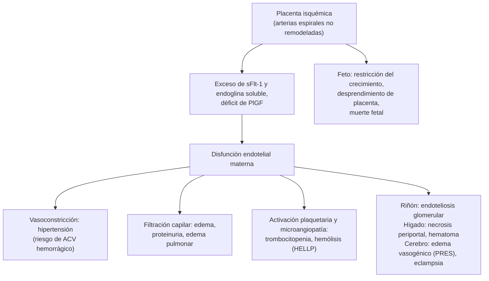

---
tags:
  - Nefrología
  - Urgencia
  - Frecuente en sala
---

# Preeclampsia y síndrome hipertensivo del embarazo

**Subespecialidad**
Nefrología · Obstetricia · Medicina interna

**Guías principales**
ACOG 2020: hipertensión gestacional y preeclampsia (boletín 222) · ACOG 2019: tratamiento de la hipertensión grave aguda (opinión 767) · ISSHP 2021: clasificación, diagnóstico y manejo · ESC 2025: enfermedad cardiovascular y embarazo · Guía Perinatal MINSAL 2015

**Otras fuentes**
OMS: hoja informativa de preeclampsia (2025) · ACOG 2024: biomarcadores sFlt-1/PlGF · Ensayos Magpie, Collaborative Eclampsia Trial, ASPRE, CHAP y HYPITAT · Mortalidad materna en Chile (Flores 2021; González 2023) · Serie de Arica 2018–2022

**GES**
No

**EUNACOM**
1.09.2.012 Preeclampsia (sospecha, inicial, derivar)

**Revisado**
Septiembre 2026

!!! abstract "Resumen en 60 segundos"
    - **Preeclampsia**: hipertensión (**≥ 140/90 mmHg**) que aparece **desde las 20 semanas**, con **proteinuria** o, aun sin ella, **daño de órganos**: plaquetas bajas, creatinina alta, transaminasas altas, edema pulmonar, cefalea o síntomas visuales, o compromiso de la placenta (restricción del crecimiento fetal).
    - Afecta al **3–8 %** de los partos y causa el **~ 16 %** de las muertes maternas del mundo (OMS 2025). En Chile, el síndrome hipertensivo afecta al **7–10 %** de las embarazadas (MINSAL).
    - **Criterios de gravedad**: PA **≥ 160/110**, plaquetas **< 100.000**, transaminasas ≥ 2 veces lo normal o epigastralgia, creatinina **> 1,1 mg/dL**, **edema pulmonar**, **cefalea** o **síntomas visuales**. **HELLP**: hemólisis + enzimas hepáticas altas + plaquetas bajas.
    - **PA ≥ 160/110 = emergencia**: tratar **en 30–60 minutos** con **labetalol EV**, **nifedipino oral** o **hidralazina EV**, para prevenir el **ACV**. **Nunca IECA ni ARA-II** en el embarazo.
    - **Sulfato de magnesio** en la preeclampsia grave y la eclampsia: **4–5 g EV** de carga y **1–2 g/h** hasta **24 h posparto**. Reduce la eclampsia a menos de la mitad (Magpie). Vigilar reflejos, frecuencia respiratoria y diuresis; el antídoto es el **gluconato de calcio**.
    - **El tratamiento definitivo es el parto**:
        - A las **37 semanas** sin criterios de gravedad.
        - A las **34 semanas** (o al diagnóstico, si ya las pasó) con criterios de gravedad.
        - **Antes**, si la madre o el feto se deterioran.
    - **Prevención**: **aspirina 100–150 mg en la noche** desde antes de las **16 semanas** hasta las 36 en las embarazadas de alto riesgo (ASPRE: 1,6 % vs. 4,3 % de preeclampsia de pretérmino).
    - Puede aparecer **hasta 6 semanas posparto**, y **duplica o triplica el riesgo cardiovascular** de por vida.

## Definición

!!! guia "Clasificación de los trastornos hipertensivos del embarazo (ACOG 2020; ISSHP 2021)"
    | Trastorno | Definición |
    |---|---|
    | **Hipertensión crónica** | HTA antes del embarazo o antes de las **20 semanas**, o que persiste más de 12 semanas posparto |
    | **Hipertensión gestacional** | HTA nueva **≥ 20 semanas**, **sin** proteinuria ni daño de órganos |
    | **Preeclampsia** | HTA nueva ≥ 20 semanas **+ proteinuria**, o **sin proteinuria** pero con daño de órganos o de la unidad fetoplacentaria |
    | **Preeclampsia sobreagregada** | Preeclampsia en una mujer con HTA crónica |
    | **Eclampsia** | **Convulsiones** tónico-clónicas nuevas en una mujer con preeclampsia, sin otra causa |
    | **Síndrome HELLP** | **H**emólisis (LDH ≥ 600 UI/L), **e**nzimas hepáticas elevadas (≥ 2 veces lo normal) y **p**laquetas bajas (< 100.000/µL). Puede aparecer sin HTA importante |

- **Hipertensión en el embarazo**: PAS **≥ 140** o PAD **≥ 90 mmHg** en dos mediciones separadas por al menos **4 horas** (ACOG) o **6 horas** (Guía Perinatal MINSAL). **Hipertensión grave**: **≥ 160/110 mmHg**; basta confirmarla en 15 minutos para tratarla.
- **Proteinuria** (ACOG 2020):
    - **≥ 300 mg en orina de 24 h**, o **índice proteinuria/creatininuria ≥ 0,3 mg/mg** en una muestra aislada.
    - O tira reactiva **≥ 2+** si no hay otro método.
- **Daño de órganos** que permite el diagnóstico sin proteinuria:
    - Plaquetas **< 100.000/µL** (la ISSHP usa < 150.000).
    - Creatinina **> 1,1 mg/dL** o el doble de la basal.
    - Transaminasas **≥ 2 veces** lo normal.
    - **Edema pulmonar**.
    - **Cefalea** nueva que no cede con analgésicos, o **síntomas visuales**.
    - La ISSHP agrega la **disfunción uteroplacentaria**: restricción del crecimiento fetal, Doppler umbilical alterado o muerte fetal.

## Epidemiología

### Mundial

- La preeclampsia afecta al **3–8 %** de las mujeres que dan a luz (OMS 2025).
- Los trastornos hipertensivos causan **~ 16 %** de las muertes maternas del mundo: **~ 42.000 muertes en 2023** (OMS).
    - En **América Latina y el Caribe** causan **casi el 26 %** de las muertes maternas (ACOG 2020).
- La mayoría de las muertes son evitables: se deben a la **hipertensión grave no tratada** (**ACV hemorrágico**), a la eclampsia y al HELLP.

### Chile

!!! chile "Datos nacionales"
    - **Prevalencia**: el síndrome hipertensivo afecta al **7–10 %** de las embarazadas (Guía Perinatal MINSAL 2015).
    - Entre **1990 y 1996**, la enfermedad hipertensiva compartió con el aborto séptico el **primer lugar** entre las causas de muerte materna (**20 %** de las muertes).
    - **Razón de mortalidad materna**:
        - **23 por 100.000 nacidos vivos** en promedio entre 1990 y 2018, con un **aumento desde 2004** (Flores y Garmendia, 2021).
        - **17,2** en 2012.
        - **19,1** en 2019 y **28,1** en 2020, durante la pandemia (González, 2023).
    - **Hospital de Arica, 2018–2022** (10.765 partos):
        - **6,2 %** de síndrome hipertensivo, del cual el **59,8 %** era preeclampsia o eclampsia; en las mujeres **aymaras**, el 70,6 %.
        - El **61,6 %** de las preeclampsias tenía algún **criterio de gravedad**, y el 2,1 % de los casos, HELLP.
        - Sólo el **23,9 %** tuvo un **Doppler de arterias uterinas** en el primer trimestre, y el uso de **aspirina** fue bajo incluso en las de alto riesgo.

## Etiología y factores de riesgo

La causa es la **placenta**: la preeclampsia sólo ocurre si hay tejido trofoblástico (incluida la **mola hidatidiforme**), y se resuelve con el parto.

| Riesgo | Factores |
|---|---|
| **Alto** | **Preeclampsia previa** (sobre todo precoz o grave), **HTA crónica**, **diabetes pregestacional**, **enfermedad renal crónica**, **lupus** o **síndrome antifosfolípido**, **embarazo múltiple** |
| **Moderado** | **Nuliparidad**, **obesidad** (IMC > 30), edad **≥ 35 años** (y adolescencia), antecedente familiar de preeclampsia, fertilización asistida, intervalo intergenésico > 10 años, bajo nivel socioeconómico |

- La Guía Perinatal MINSAL destaca como los más importantes el **síndrome antifosfolípido**, la **insuficiencia renal** y la **preeclampsia grave previa**.

## Fisiopatología

La preeclampsia es una enfermedad **en dos etapas**:

1. **Placentación anormal** (primer trimestre): el trofoblasto no remodela bien las **arterias espirales**, que quedan estrechas y de alta resistencia. El resultado es una **placenta isquémica y estresada**.
2. **Síndrome materno** (desde la segunda mitad del embarazo):
    - La placenta libera **factores antiangiogénicos**: **sFlt-1** (receptor soluble que "atrapa" el VEGF y el **PlGF**) y endoglina soluble.
    - Esto produce una **disfunción endotelial** sistémica: **vasoconstricción**, **filtración capilar** y **activación plaquetaria**.

<figure markdown>
![Diagrama de flujo en inglés. Los factores maternos (genéticos, inmunológicos, enfermedades crónicas) causan una placentación anormal, la causa extrínseca. La placenta que crece más que la capacidad uterina y el envejecimiento placentario causan estrés del sincitiotrofoblasto, la causa intrínseca. Ambas llevan a una perfusión placentaria reducida y a la etapa 1, la disfunción placentaria. La placenta libera estrés oxidativo, micropartículas, citoquinas proinflamatorias, un estado antiangiogénico (sFlt-1 y endoglina soluble) y autoanticuerpos contra el receptor AT1. Estos causan disfunción endotelial, modulada por factores maternos, y la etapa 2, los síntomas clínicos](../assets/figuras/embarazo/preeclampsia-dos-etapas-pankiewicz-2021.jpg){ loading=lazy width="620" }
<figcaption>Figura 1. Modelo en dos etapas de la preeclampsia: la disfunción placentaria (etapa 1) libera factores que causan la disfunción endotelial materna y los síntomas (etapa 2). STB: sincitiotrofoblasto; OS: estrés oxidativo; ER: retículo endoplásmico; STBM: micropartículas del sincitiotrofoblasto; sEng: endoglina soluble; AT1-AA: autoanticuerpos contra el receptor AT1 de angiotensina II. Tomado de Pankiewicz K, Fijałkowska A, Issat T, Maciejewski TM. Insight into the key points of preeclampsia pathophysiology: uterine artery remodeling and the role of microRNAs. <em>Int J Mol Sci</em> 2021;22:3132 (figura 1). Licencia <a href="https://creativecommons.org/licenses/by/4.0/">CC BY 4.0</a>.</figcaption>
</figure>

*Figura 2. Consecuencias de la disfunción endotelial por órgano. Esquema propio.*

## Clasificación

**Criterios de gravedad** (ACOG 2020; basta uno):

| Órgano | Criterio |
|---|---|
| **Presión arterial** | **PAS ≥ 160 o PAD ≥ 110 mmHg** en dos mediciones separadas por 4 h (o antes, si ya se inició tratamiento) |
| **Hematológico** | Plaquetas **< 100.000/µL** |
| **Hígado** | Transaminasas **≥ 2 veces** lo normal y/o **dolor persistente en el epigastrio o el hipocondrio derecho** |
| **Riñón** | Creatinina **> 1,1 mg/dL** o el doble de la basal |
| **Pulmón** | **Edema pulmonar** |
| **Sistema nervioso** | **Cefalea** nueva que no responde a analgésicos, **alteraciones visuales** (fotopsias, escotomas, visión borrosa) |

- La **proteinuria masiva** y la **restricción del crecimiento fetal** **ya no son criterios de gravedad** para el ACOG.
- La Guía Perinatal MINSAL 2015 clasifica la preeclampsia como **"moderada" o "severa"** con criterios similares. Agrega la **oliguria < 500 mL/24 h**, el **edema generalizado** y la irritabilidad del SNC (hiperreflexia, tinnitus).
- La **ISSHP 2021** prefiere no hablar de preeclampsia "leve": **toda preeclampsia puede agravarse en horas**.
- **Por momento de aparición**: **precoz** (< 34 semanas; más placentaria, más grave, más restricción del crecimiento fetal) o **tardía** (≥ 34 semanas; más frecuente y más ligada a factores maternos como la obesidad).

## Clínica

- Muchas mujeres son **asintomáticas**: la preeclampsia se detecta al medir la **PA** y la **proteinuria** en el control prenatal. Por eso el control prenatal es clave.
- **Síntomas de alarma** ("síntomas de **vasoespasmo**"):
    - **Cefalea** intensa y persistente.
    - **Fotopsias**, escotomas, visión borrosa, ceguera cortical.
    - **Tinnitus**.
    - **Epigastralgia o dolor en el hipocondrio derecho**, con náuseas y vómitos (distensión de la cápsula hepática).
    - **Disnea** (edema pulmonar).
    - **Oliguria**.
- **Examen**:
    - **HTA**.
    - **Edema** de rápida progresión en la cara y las manos, con alza brusca de peso.
    - **Hiperreflexia y clonus**.
    - Crépitos (edema pulmonar).
    - Sensibilidad en el hipocondrio derecho.
    - Petequias.
- **Eclampsia**:
    - Convulsión **tónico-clónica generalizada**, seguida de un período posictal o coma.
    - Puede ocurrir **antes, durante o después del parto**, incluso con **PA sólo levemente elevada** o **sin proteinuria**.
- **HELLP**:
    - **Epigastralgia**, náuseas y malestar general; parece una "gastritis" o un "cuadro viral".
    - Con **plaquetas bajas**, **LDH alta** y **transaminasas altas**.
    - La HTA puede ser leve o faltar.
- **Posparto**: la preeclampsia puede **aparecer o empeorar hasta 6 semanas después del parto**; la PA suele alcanzar su máximo entre el 3.er y el 6.º día. Toda puérpera con cefalea, síntomas visuales, disnea o convulsiones debe ser evaluada como una preeclampsia.

## Diagnóstico

1. **Medir bien la PA**:
    - Sentada, con el manguito adecuado. En la hospitalizada, en decúbito lateral izquierdo con el manguito en el brazo izquierdo (MINSAL).
    - **Confirmar** con una segunda medición.
2. **Buscar proteinuria**: **índice proteinuria/creatininuria** en una muestra aislada (≥ 0,3 mg/mg) u **orina de 24 horas** (≥ 300 mg).
3. **Buscar daño de órganos**: hemograma con plaquetas, creatinina, transaminasas, LDH (ver Laboratorio). Hacerlo **aunque no haya proteinuria**.
4. **Evaluar al feto**: ecografía con biometría y líquido amniótico, **Doppler de la arteria umbilical**, monitoreo de la frecuencia cardíaca fetal.
5. **Clasificar**: ¿HTA crónica, gestacional o preeclampsia? ¿Hay criterios de gravedad o HELLP?

!!! guia "Biomarcadores angiogénicos (Zeisler 2016; ACOG 2024)"
    - El **cociente sFlt-1/PlGF** refleja el desbalance angiogénico placentario.
    - En embarazadas de **24 a 36 semanas** con sospecha de preeclampsia, un cociente **≤ 38** tuvo un **valor predictivo negativo de 99,3 %** para preeclampsia en la semana siguiente. Sirve para **descartar** y evitar hospitalizaciones.
    - El ACOG (2024) acepta su uso para estimar el riesgo de evolucionar a una **preeclampsia con criterios de gravedad** en las 2 semanas siguientes. **No reemplaza** el diagnóstico clínico.

!!! alarma "Derivar de inmediato a la maternidad (urgencia obstétrica)"
    - Toda embarazada de **≥ 20 semanas** con **PA ≥ 140/90**. En APS, si es < 20 semanas, derivar al policlínico de alto riesgo obstétrico (Guía Perinatal MINSAL).
    - **PA ≥ 160/110**, cefalea, síntomas visuales, epigastralgia, disnea, convulsión o compromiso de conciencia: **urgencia vital**.
    - La **puérpera** (hasta 6 semanas) con cualquiera de esos síntomas.

## Laboratorio

| Examen | Hallazgo en la preeclampsia | Utilidad |
|---|---|---|
| **Hemograma con plaquetas** | **Plaquetas < 100.000** = gravedad; hematocrito alto (hemoconcentración) o bajo (hemólisis) | Gravedad, HELLP |
| **Frotis** | **Esquistocitos** | Hemólisis microangiopática |
| **LDH**, bilirrubina, haptoglobina | **LDH ≥ 600 UI/L**, haptoglobina baja | Hemólisis (HELLP) |
| **Transaminasas** (GOT, GPT) | **≥ 2 veces** lo normal | Compromiso hepático, HELLP |
| **Creatinina** | **> 1,1 mg/dL** (en el embarazo normal es más baja: ~ 0,5–0,8) | Compromiso renal |
| **Índice proteinuria/creatininuria** u orina de 24 h | ≥ 0,3 mg/mg o ≥ 300 mg/24 h | Diagnóstico (no define la gravedad) |
| **Ácido úrico** | Elevado (> 5 mg/dL según MINSAL) | Apoya; no diagnostica |
| **Pruebas de coagulación** y fibrinógeno | Alteradas en la CID | Si hay plaquetas bajas, desprendimiento de placenta o sangrado |
| **Glicemia** | **Hipoglicemia** orienta a **hígado graso agudo** | Diagnóstico diferencial |
| **Magnesemia** | Rango terapéutico 6–8 mEq/L y tóxico > 10 mEq/L (Guía Perinatal MINSAL) | Sólo si hay oliguria, LRA o signos de toxicidad |

## Imágenes

- **Ecografía obstétrica**: biometría fetal (restricción del crecimiento), líquido amniótico, **Doppler de las arterias umbilical, cerebral media y uterinas**. **Doppler de arterias uterinas** en el **primer trimestre** (11–14 semanas) para estimar el riesgo y en las **22–24 semanas** (MINSAL).
- **Neuroimagen** (RM de preferencia, o TC) en la **eclampsia atípica**: déficit focal, compromiso de conciencia prolongado, convulsiones antes de las 20 semanas o más de 48 h posparto, o que no responden al sulfato de magnesio.
    - Hallazgo típico: **síndrome de encefalopatía posterior reversible (PRES)**, con edema vasogénico parietooccipital.
    - Descartar la **hemorragia cerebral**, la **trombosis venosa cerebral** y la hemorragia subaracnoidea.
- **Ecografía o TC de abdomen** ante dolor intenso en el hipocondrio derecho, hipotensión o caída de la hemoglobina en el HELLP: **hematoma subcapsular** o **rotura hepática**.
- **Radiografía de tórax** y **ecocardiograma** si hay **edema pulmonar**: diferenciar de la **miocardiopatía periparto**.

<figure markdown>
![Línea de tiempo de 0 a 42 semanas de gestación y del posparto. A las 11 a 14 semanas: evaluar el riesgo y, en las de alto riesgo, iniciar aspirina de 100 a 150 miligramos en la noche antes de las 16 semanas y hasta las 36. A las 20 semanas: la hipertensión previa es crónica y la nueva es gestacional o preeclampsia. A las 34 semanas: interrumpir la preeclampsia con criterios de gravedad, dando corticoides si es antes. A las 37 semanas: interrumpir la preeclampsia sin criterios de gravedad y la hipertensión gestacional; la hipertensión crónica con buen control, a las 38. En el posparto, hasta 6 semanas, la preeclampsia puede aparecer o empeorar; sulfato de magnesio por 24 horas, control de presión en la primera semana y riesgo cardiovascular aumentado de por vida](../assets/figuras/embarazo/hitos-sindrome-hipertensivo.svg){ loading=lazy }
<figcaption>Figura 3. Hitos del embarazo para decidir en los trastornos hipertensivos: prevención con aspirina, clasificación según las 20 semanas, momento de la interrupción y vigilancia posparto. Esquema propio basado en ACOG 2020, ISSHP 2021, la Guía Perinatal MINSAL 2015, el ensayo ASPRE (2017) y Bellamy (<em>BMJ</em> 2007).</figcaption>
</figure>

## Diagnóstico diferencial

| Cuadro | Claves para diferenciarlo |
|---|---|
| **HTA crónica** | HTA antes de las 20 semanas, hipertrofia ventricular en el ECG, cambios crónicos en el fondo de ojo; persiste > 12 semanas posparto |
| **Hígado graso agudo del embarazo** | **Hipoglicemia**, insuficiencia hepática (INR alto, bilirrubina alta), **CID** precoz, encefalopatía; HTA leve o ausente |
| **Púrpura trombocitopénica trombótica / SHU** | Plaquetas **muy** bajas, compromiso neurológico o **renal marcado**, transaminasas poco alteradas, **ADAMTS13 < 10 %** (PTT); no mejora con el parto |
| **Nefritis lúpica o glomerulopatía** | Proteinuria o hematuria **antes de las 20 semanas**, sedimento activo, complemento bajo, anti-DNA (ver [síndromes glomerulares](sindromes-glomerulares.md)) |
| **Síndrome antifosfolípido catastrófico** | Trombosis en múltiples órganos, anticuerpos antifosfolípidos |
| **Otras causas de convulsión** | Epilepsia, **trombosis venosa cerebral**, hemorragia subaracnoidea, ACV, hipoglicemia, hiponatremia, toxicidad por anestésicos locales |
| **Otras causas de epigastralgia** | Colecistitis, pancreatitis, hepatitis viral, úlcera péptica, **colestasia intrahepática del embarazo** (prurito, ácidos biliares altos) |
| **HTA secundaria** | Feocromocitoma (crisis paroxísticas), hipertiroidismo, drogas (cocaína, anfetaminas) |

## Tratamiento

**Principio**: el único tratamiento que cura la preeclampsia es el **parto** (la salida de la placenta). Mientras tanto, se busca **evitar las complicaciones maternas** (ACV, eclampsia, edema pulmonar, HELLP) y **prolongar el embarazo** si el feto es muy prematuro y la madre está estable. Se maneja **siempre en un centro con obstetricia**; la preeclampsia grave, en uno de alta complejidad.

### Hipertensión grave (≥ 160/110): emergencia

!!! dosis "Antihipertensivos para la crisis (ACOG 2019; Guía Perinatal MINSAL 2015)"
    Tratar **dentro de 30–60 minutos** de confirmada la PA ≥ 160/110. Meta: **140–150 / 90–100 mmHg**. No bajar bruscamente, por el riesgo de hipoperfusión placentaria.

    | Fármaco | Dosis |
    |---|---|
    | **Labetalol EV** (primera línea en la Guía Perinatal) | **20 mg** EV en 2 min → si no responde en 10 min, **40 mg** → luego **80 mg** (repetibles); **máximo 300 mg**. O infusión desde 0,5 mg/min, hasta 4 mg/min (MINSAL). Evitar en el asma, la insuficiencia cardíaca y el bloqueo AV |
    | **Nifedipino oral de acción rápida** | **10 mg** VO → repetir 10–20 mg cada 20–30 min según la respuesta. Por vía **oral**: el ACOG desaconseja la sublingual (hipotensión brusca) |
    | **Hidralazina EV** | **5–10 mg** EV en 2 min → repetir cada 20 min según la respuesta. Causa taquicardia refleja y cefalea |
    | **Nitroprusiato** | Sólo en la crisis **refractaria**, en la UCI, y por el menor tiempo posible (toxicidad fetal por cianuro) |

    - **Contraindicados en el embarazo**: **IECA, ARA-II**, aliskiren (teratogénicos y nefrotóxicos fetales) y **atenolol** (restricción del crecimiento fetal).
    - **Diuréticos**: sólo en el **edema pulmonar** (furosemida 20–40 mg EV).

### Hipertensión no grave

- **Tratar desde 140/90** con meta **< 140/90** (ESC 2025) o **PAD ~ 85 mmHg** (ISSHP 2021).
    - En el ensayo **CHAP** (2022), tratar la HTA crónica leve con meta < 140/90 redujo el desenlace compuesto de preeclampsia grave, parto prematuro < 35 semanas, desprendimiento de placenta o muerte fetal o neonatal (**30,2 % vs. 37,0 %**), **sin** aumentar los recién nacidos pequeños para la edad gestacional.
    - La Guía Perinatal MINSAL 2015 trataba desde una PAD ≥ 100 mmHg; la evidencia posterior justifica umbrales más bajos.
- **Fármacos orales**:
    - **Labetalol**: 50–100 mg c/12 h, hasta 800 mg/día según MINSAL (hasta 2.400 mg/día según ACOG).
    - **Nifedipino** de liberación prolongada: 30–60 mg/día, o 10 mg c/6–8 h (máximo 120 mg/día).
    - **Metildopa**: 250 mg c/12 h, hasta 500 mg c/6 h. Da somnolencia.
- En la mujer con **HTA crónica** que planifica un embarazo o se embaraza: **cambiar los IECA, ARA-II y atenolol** por labetalol, nifedipino o metildopa.

### Sulfato de magnesio

!!! dosis "Sulfato de magnesio (Guía Perinatal MINSAL 2015; ACOG 2020)"
    - **Indicación**: **preeclampsia con criterios de gravedad** (profilaxis de la eclampsia) y **eclampsia** (tratamiento y prevención de nuevas crisis). Durante el trabajo de parto o la cesárea y hasta **24 horas posparto**.
    - **Dosis de carga**: **4–6 g EV** en 20–30 minutos (MINSAL: **5 g**).
    - **Mantención**: **1–2 g/h** EV en infusión continua (MINSAL: 2 g/h en la eclampsia).
    - **Si convulsiona de nuevo**: bolo adicional de 2 g EV.
    - **Vigilar antes de cada hora de infusión**:
        - **Reflejo patelar presente**.
        - **Frecuencia respiratoria > 12/min**.
        - **Diuresis > 100 mL en 4 horas**.
        - En la **insuficiencia renal**, reducir la mantención y medir la magnesemia.
    - **Toxicidad** (magnesemia > 10 mEq/L): primero se pierden los reflejos, y después vienen la depresión respiratoria y el paro. **Suspender** y dar **gluconato de calcio al 10 %, 10 mL EV en 3 minutos**.
    - **Evidencia**:
        - **Magpie** (2002): **58 % menos eclampsia** (0,8 % vs. 1,9 %).
        - En la eclampsia, es **superior al diazepam** (52 % menos crisis recurrentes) y a la **fenitoína** (67 % menos) (Collaborative Eclampsia Trial, 1995).

### Eclampsia

1. **ABC**:
    - Proteger de lesiones y poner en **decúbito lateral izquierdo**.
    - Vía aérea, aspiración de secreciones y **oxígeno**.
    - **No intentar detener la convulsión con fármacos que no sean magnesio**: la mayoría cede sola en 1–2 minutos.
2. **Sulfato de magnesio**: carga y mantención.
3. **Controlar la PA grave**.
4. **Evaluar al feto**: la bradicardia fetal durante la crisis suele recuperarse. **No hacer una cesárea de urgencia en plena convulsión**.
5. **Interrumpir el embarazo** una vez que la madre esté **estabilizada** (crisis controlada, PA controlada, conciencia recuperada), por la vía obstétrica que corresponda.
6. **Crisis repetidas o estado epiléptico** pese al magnesio: anestesia general e intubación (MINSAL). Neuroimagen si la presentación es atípica.

### Momento del parto

| Situación | Conducta |
|---|---|
| **HTA gestacional o preeclampsia sin criterios de gravedad** | Manejo expectante con control materno y fetal estrecho; **interrumpir a las 37 semanas** (HYPITAT: menos resultados maternos adversos con la inducción; MINSAL: 37–38 semanas) |
| **Preeclampsia con criterios de gravedad ≥ 34 semanas** | **Interrumpir** después de estabilizar (PA y sulfato de magnesio) |
| **Preeclampsia con criterios de gravedad < 34 semanas**, madre y feto estables | **Manejo expectante** en un centro terciario: **corticoides** para la madurez pulmonar (**betametasona 12 mg IM c/24 h por 2 dosis**), sulfato de magnesio, antihipertensivos y vigilancia estrecha. Interrumpir a las 34 semanas |
| **Interrupción inmediata** (tras estabilizar, a cualquier edad gestacional) | HTA grave **refractaria**, **eclampsia**, **edema pulmonar**, **HELLP** (se puede esperar 24–48 h para los corticoides si es < 34 semanas y está estable), **desprendimiento de placenta**, LRA progresiva, deterioro fetal o muerte fetal |
| **HTA crónica** (Guía Perinatal MINSAL) | Con mal control: 36 semanas. Con tratamiento y buen control: **38 semanas**. Sin tratamiento: 40 semanas |

- **La vía del parto es obstétrica**: la preeclampsia **no es por sí misma una indicación de cesárea**.
- **Anestesia**: se prefiere la **neuroaxial** (peridural o raquídea), que además baja la PA. Revisar antes el **recuento de plaquetas**.
- **HELLP**:
    - Corregir la coagulopatía y **transfundir plaquetas** según el recuento y la vía del parto; el umbral es más alto para la cesárea y la anestesia neuroaxial.
    - Vigilar la **rotura hepática**.

### Posparto

- **Sulfato de magnesio** por **24 horas**.
- **Tratar** la PA persistente **≥ 150/100 mmHg** (ACOG); la Guía Perinatal fija el límite en < 160/110.
- **Antihipertensivos compatibles con la lactancia**: **enalapril**, **captopril**, **nifedipino**, **labetalol** y propranolol. Evitar el atenolol (MINSAL).
- **Control de la PA en la primera semana** posparto (antes, a las 72 h, si fue grave), y educar sobre los síntomas de alarma.

### Prevención

!!! dosis "Aspirina y calcio"
    - **Aspirina en dosis bajas** para las mujeres con **1 factor de riesgo alto** o varios moderados:
        - **100 mg/día** (MINSAL) o **150 mg** (ASPRE), **en la noche**.
        - Iniciarla entre las **12 y 16 semanas** (antes de las 16) y mantenerla hasta las **36 semanas**.
        - **ASPRE** (2017): preeclampsia de pretérmino **1,6 % vs. 4,3 %** (OR **0,38**) en embarazadas de alto riesgo según un tamizaje combinado del primer trimestre.
    - **Calcio**: 1,5–2 g/día de calcio elemental si la ingesta dietaria es baja (OMS).
    - **No sirven**: la restricción de sal, el reposo absoluto, las vitaminas C y E, ni los diuréticos.

## Complicaciones

- **Maternas**:
    - **ACV hemorrágico**: la principal causa de muerte, y por eso se trata la PA ≥ 160/110.
    - **Eclampsia**, **PRES** y ceguera cortical.
    - **Edema pulmonar**.
    - **LRA** (a veces necrosis tubular o cortical).
    - **HELLP**, **hematoma subcapsular y rotura hepática**.
    - **CID**.
    - **Desprendimiento prematuro de placenta**, asociado a la preeclampsia en ~ 25 % de los casos según la Guía Perinatal.
    - Muerte.
- **Fetales**: **restricción del crecimiento**, **prematurez** (sobre todo iatrogénica), hipoxia, **muerte fetal**.
- **Del tratamiento**: toxicidad por magnesio, hipotensión con compromiso fetal por un descenso brusco de la PA, edema pulmonar por exceso de volumen (en la preeclampsia grave, limitar los fluidos de mantención a ~ 80 mL/h, NICE).
- **A largo plazo** (Bellamy, *BMJ* 2007), comparadas con las mujeres sin preeclampsia:
    - **HTA crónica**: riesgo relativo **3,7**.
    - **Cardiopatía isquémica**: **2,16**.
    - **ACV**: **1,81**.
    - **Tromboembolismo venoso**: **1,79**.
    - **Mortalidad total**: **1,49**.

## Pronóstico y seguimiento

- **La PA y la proteinuria se normalizan** en días a semanas después del parto.
    - Si la HTA persiste **más de 12 semanas**, se trata de una **HTA crónica** y hay que estudiarla (ver [hipertensión arterial](../cardiologia/hipertension-arterial.md)).
    - Si la **proteinuria persiste**, buscar una **enfermedad renal** de base.
- **Recurrencia**: más alta si la preeclampsia fue **precoz o grave**. En el siguiente embarazo: control precoz, evaluación del riesgo y **aspirina** desde el primer trimestre.
- **Riesgo cardiovascular**:
    - La ESC 2025 recomienda **registrar** la preeclampsia y los otros resultados adversos del embarazo en la ficha, y **evaluar el riesgo cardiovascular a largo plazo** (IB).
    - Control **anual** de PA, peso, lípidos y glicemia.
    - Consejería sobre actividad física, dieta y tabaco.
- **Anticoncepción**: la HTA mal controlada contraindica los estrógenos; preferir métodos solo de progestágeno o DIU.

## Perlas para el internado

!!! perla "Para la sala y el turno"
    - Toda embarazada de **≥ 20 semanas** o puérpera con **cefalea, fotopsias, epigastralgia, disnea o convulsiones**: **PA, proteinuria, plaquetas, transaminasas, creatinina y LDH**.
    - La **epigastralgia del tercer trimestre** no es gastritis hasta descartar un **HELLP**.
    - Una **convulsión** en una embarazada de más de 20 semanas o en una puérpera es **eclampsia hasta demostrar lo contrario**: **sulfato de magnesio**, no benzodiacepinas como primera línea.
    - **PA ≥ 160/110 = emergencia**: tratar en menos de 1 hora. La mayoría de las muertes maternas por preeclampsia son **ACV hemorrágicos**.
    - Cuando pongas sulfato de magnesio: **reflejo patelar, frecuencia respiratoria y diuresis** cada hora, y **gluconato de calcio** a mano.
    - Una mujer con HTA en edad fértil que toma **enalapril o losartán** debe saber que tiene que **cambiarlo antes de embarazarse**.
    - Pregunta a toda mujer por **preeclampsia en sus embarazos**: es un factor de riesgo cardiovascular tan real como el tabaco.
    - La preeclampsia puede **debutar después del parto**: ante una cefalea o convulsión en las primeras semanas posparto, **mide la PA**.

## Preguntas de repaso

??? repaso "1. Primigesta de 35 semanas con cefalea intensa y fotopsias. PA 166/112 mmHg, confirmada a los 15 minutos. Índice proteinuria/creatininuria 0,8; plaquetas 135.000; transaminasas normales. ¿Qué haces?"
    **Preeclampsia con criterios de gravedad** (PA ≥ 160/110 y síntomas neurológicos).

    - **Hospitalizar** en la maternidad de alta complejidad.
    - **Antihipertensivo en menos de 1 hora**: **labetalol 20 mg EV** (luego 40 y 80 mg) o **nifedipino 10 mg VO** de acción rápida, con meta de 140–150/90–100.
    - **Sulfato de magnesio**: carga de 4–6 g EV (5 g según MINSAL) y 1–2 g/h, hasta 24 h posparto.
    - Exámenes: hemograma, creatinina, transaminasas, LDH y evaluación fetal.
    - Como tiene **≥ 34 semanas**: **interrumpir el embarazo** una vez estabilizada, por la vía obstétrica que corresponda.

??? repaso "2. Embarazada de 31 semanas con epigastralgia y náuseas desde hace un día, tratada como gastritis. PA 148/96 mmHg. Plaquetas 68.000, GOT 190 U/L, LDH 820 U/L, esquistocitos en el frotis. ¿Diagnóstico y manejo?"
    **Síndrome HELLP** (hemólisis, enzimas hepáticas altas y plaquetas bajas), una forma grave de preeclampsia aunque la PA sea moderada.

    - **Hospitalizar** en un centro terciario: **sulfato de magnesio** y tratar la PA.
    - **Corticoides** para la madurez pulmonar (**betametasona 12 mg IM c/24 h por 2 dosis**), por ser < 34 semanas.
    - **Interrumpir** tras estabilizar, en 24–48 h si la madre y el feto están estables; de inmediato si se deterioran.
    - Coagulación y fibrinógeno (CID); **transfundir plaquetas** según el recuento y la vía del parto.
    - Vigilar el **dolor en el hipocondrio derecho** y la hemoglobina (**hematoma o rotura hepática**).
    - Diferencial: **hígado graso agudo** (hipoglicemia, INR alto) y **PTT** (ADAMTS13).

??? repaso "3. Puérpera de 5 días de un parto vaginal sin complicaciones, que consulta en la urgencia por cefalea intensa y presenta una convulsión tónico-clónica generalizada. PA 172/106 mmHg. ¿Qué haces?"
    **Eclampsia posparto** (la preeclampsia puede aparecer hasta 6 semanas después del parto).

    - **ABC**: decúbito lateral, vía aérea y oxígeno.
    - **Sulfato de magnesio** 4–6 g EV de carga y 1–2 g/h por 24 h.
    - **Tratar la PA grave** (labetalol EV, nifedipino VO o hidralazina EV).
    - Exámenes de preeclampsia y HELLP.
    - **Neuroimagen** (RM de preferencia): es una presentación posparto tardía, y hay que descartar una **trombosis venosa cerebral**, una hemorragia y el PRES.

??? repaso "4. Embarazada con preeclampsia grave en infusión de sulfato de magnesio a 2 g/h. A las 12 horas está somnolienta, con frecuencia respiratoria de 10/min, reflejos patelares abolidos y diuresis de 60 mL en las últimas 4 horas. ¿Qué pasa y qué haces?"
    **Toxicidad por magnesio**, favorecida por la **oliguria** (el magnesio se elimina por el riñón).

    - **Suspender la infusión**.
    - **Gluconato de calcio al 10 %, 10 mL EV en 3 minutos**.
    - **Oxígeno** y soporte ventilatorio si es necesario.
    - Magnesemia, creatinina y electrolitos.
    - Reiniciar con una mantención menor cuando se recuperen los reflejos y la diuresis, ajustada a la función renal.
    - Evaluar la causa de la oliguria (LRA por preeclampsia, hipovolemia) sin sobrecargar de volumen.

??? repaso "5. Mujer de 36 años con HTA crónica tratada con enalapril, que se entera de que tiene 7 semanas de embarazo. PA 138/88 mmHg. ¿Qué indicas?"
    - **Suspender el enalapril** (los IECA y ARA-II son teratogénicos y nefrotóxicos fetales) y cambiar a **labetalol**, **nifedipino** de liberación prolongada o **metildopa**.
    - **Meta < 140/90 mmHg** (ensayo CHAP; ESC 2025).
    - **Aspirina 100–150 mg en la noche** desde las 12 semanas (antes de las 16) hasta las 36, porque la HTA crónica es un factor de riesgo alto.
    - **Exámenes basales**: creatinina, índice proteinuria/creatininuria, hemograma, transaminasas, ácido úrico. Sirven para detectar después una **preeclampsia sobreagregada**.
    - Control en el policlínico de **alto riesgo obstétrico**, con ecografías seriadas del crecimiento fetal.
    - Si evoluciona bien, interrupción a las **38 semanas** (Guía Perinatal MINSAL).

??? repaso "6. Mujer de 48 años consulta por un control de salud. Tuvo preeclampsia en sus dos embarazos. PA 132/84 mmHg. ¿Por qué importa ese antecedente?"
    La preeclampsia es un **factor de riesgo cardiovascular** independiente (Bellamy, *BMJ* 2007):

    - Riesgo relativo de **HTA crónica** de **3,7**, de **cardiopatía isquémica** de **2,16** y de **ACV** de **1,81**.
    - Aumenta también la **mortalidad total** (1,49).

    Conducta:

    - Registrar el antecedente y **evaluar su riesgo cardiovascular** (ESC 2025).
    - **Control de la PA** (está en rango normal-alto), perfil lipídico, glicemia o HbA1c, peso y función renal con albuminuria.
    - Consejería sobre estilo de vida y **seguimiento anual**.

## Referencias

1. American College of Obstetricians and Gynecologists. Gestational hypertension and preeclampsia: ACOG Practice Bulletin, Number 222. *Obstet Gynecol.* 2020;135:e237–e260. doi:[10.1097/AOG.0000000000003891](https://doi.org/10.1097/AOG.0000000000003891)
2. American College of Obstetricians and Gynecologists. Emergent therapy for acute-onset, severe hypertension during pregnancy and the postpartum period: ACOG Committee Opinion No. 767. *Obstet Gynecol.* 2019;133:e174–e180. doi:[10.1097/AOG.0000000000003075](https://doi.org/10.1097/AOG.0000000000003075)
3. Magee LA, Brown MA, Hall DR, et al. The 2021 International Society for the Study of Hypertension in Pregnancy classification, diagnosis & management recommendations for international practice. *Pregnancy Hypertens.* 2022;27:148–169. doi:[10.1016/j.preghy.2021.09.008](https://doi.org/10.1016/j.preghy.2021.09.008)
4. De Backer J, Haugaa KH, Hasselberg NE, et al. 2025 ESC Guidelines for the management of cardiovascular disease and pregnancy. *Eur Heart J.* 2025;46:4462–4568. doi:[10.1093/eurheartj/ehaf193](https://doi.org/10.1093/eurheartj/ehaf193)
5. Ministerio de Salud de Chile. Guía Perinatal 2015. Capítulo VIII: Manejo del síndrome hipertensivo del embarazo. [minsal.cl](https://www.minsal.cl/wp-content/uploads/2015/09/GUIA-PERINATAL_2015.10.08_web.pdf-R.pdf)
6. American College of Obstetricians and Gynecologists. ACOG Clinical Practice Update: Biomarker prediction of preeclampsia with severe features. *Obstet Gynecol.* 2024;143:e153–e154. doi:[10.1097/AOG.0000000000005576](https://doi.org/10.1097/AOG.0000000000005576)
7. Zeisler H, Llurba E, Chantraine F, et al. Predictive value of the sFlt-1:PlGF ratio in women with suspected preeclampsia. *N Engl J Med.* 2016;374:13–22. doi:[10.1056/NEJMoa1414838](https://doi.org/10.1056/NEJMoa1414838)
8. Magpie Trial Collaborative Group (Altman D, Carroli G, Duley L, et al.). Do women with pre-eclampsia, and their babies, benefit from magnesium sulphate? The Magpie Trial: a randomised placebo-controlled trial. *Lancet.* 2002;359:1877–1890. doi:[10.1016/S0140-6736(02)08778-0](https://doi.org/10.1016/S0140-6736(02)08778-0)
9. Which anticonvulsant for women with eclampsia? Evidence from the Collaborative Eclampsia Trial. *Lancet.* 1995;345:1455–1463. [PubMed](https://pubmed.ncbi.nlm.nih.gov/7769899/)
10. Rolnik DL, Wright D, Poon LC, et al. Aspirin versus placebo in pregnancies at high risk for preterm preeclampsia. *N Engl J Med.* 2017;377:613–622. doi:[10.1056/NEJMoa1704559](https://doi.org/10.1056/NEJMoa1704559)
11. Tita AT, Szychowski JM, Boggess K, et al. Treatment for mild chronic hypertension during pregnancy. *N Engl J Med.* 2022;386:1781–1792. doi:[10.1056/NEJMoa2201295](https://doi.org/10.1056/NEJMoa2201295)
12. Koopmans CM, Bijlenga D, Groen H, et al. Induction of labour versus expectant monitoring for gestational hypertension or mild pre-eclampsia after 36 weeks' gestation (HYPITAT): a multicentre, open-label randomised controlled trial. *Lancet.* 2009;374:979–988. doi:[10.1016/S0140-6736(09)60736-4](https://doi.org/10.1016/S0140-6736(09)60736-4)
13. Bellamy L, Casas JP, Hingorani AD, Williams DJ. Pre-eclampsia and risk of cardiovascular disease and cancer in later life: systematic review and meta-analysis. *BMJ.* 2007;335:974. doi:[10.1136/bmj.39335.385301.BE](https://doi.org/10.1136/bmj.39335.385301.BE)
14. Organización Mundial de la Salud. Pre-eclampsia (hoja informativa, diciembre de 2025). [who.int](https://www.who.int/news-room/fact-sheets/detail/pre-eclampsia)
15. Flores M, Garmendia ML. [Trends and causes of maternal deaths from 1990 to 2018] (artículo en español). *Rev Med Chil.* 2021;149:1440–1449. doi:[10.4067/s0034-98872021001001440](https://doi.org/10.4067/s0034-98872021001001440)
16. González R, Viviani P, Merialdi M, et al. Aumento de mortalidad materna y de prematuridad durante pandemia de COVID-19 en Chile. *Rev Med Clin Condes.* 2023;34. doi:[10.1016/j.rmclc.2023.01.009](https://doi.org/10.1016/j.rmclc.2023.01.009)
17. Gutierrez-Contreras P, Castillo-Neira C, Pizarro-González C, et al. Epidemiological characterization of hypertensive disorders of pregnancy in northern Chile: experience from the Regional Hospital of Arica (2018–2022). *Rev Med Chil.* 2026;154:713–720. doi:[10.4067/s0034-98872026000500713](https://doi.org/10.4067/s0034-98872026000500713)
18. National Institute for Health and Care Excellence. Hypertension in pregnancy: diagnosis and management (NG133). 2019, actualizada en 2023. [nice.org.uk](https://www.nice.org.uk/guidance/ng133)
19. Pankiewicz K, Fijałkowska A, Issat T, Maciejewski TM. Insight into the key points of preeclampsia pathophysiology: uterine artery remodeling and the role of microRNAs. *Int J Mol Sci.* 2021;22:3132. doi:[10.3390/ijms22063132](https://doi.org/10.3390/ijms22063132)
