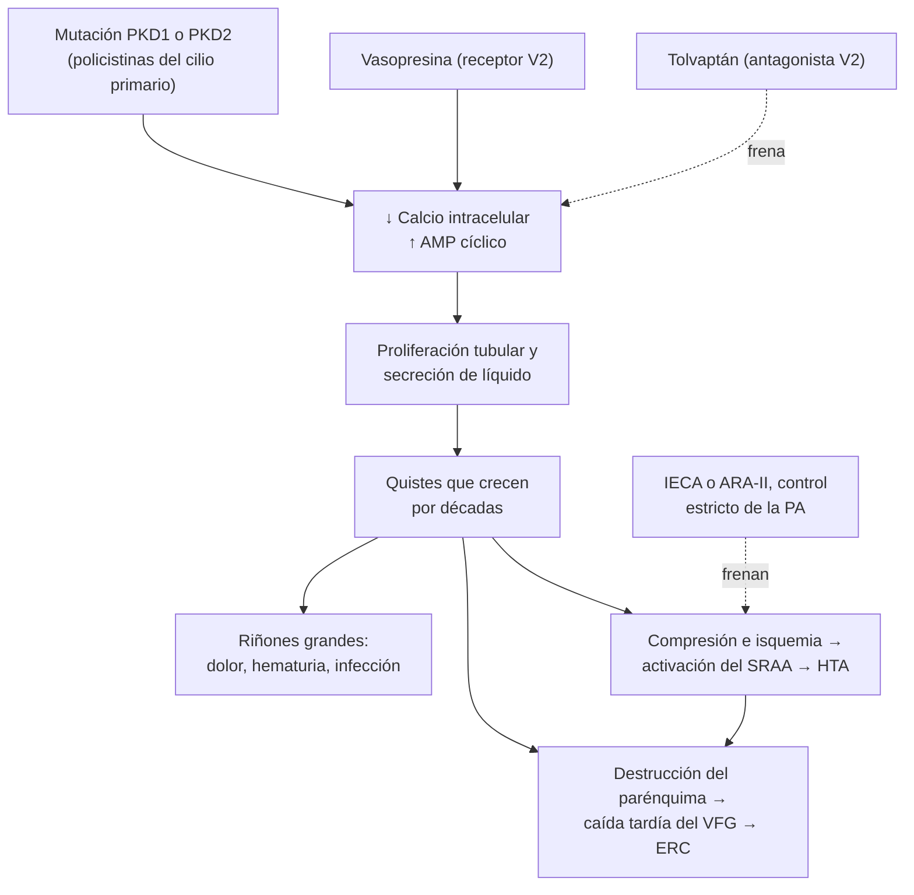
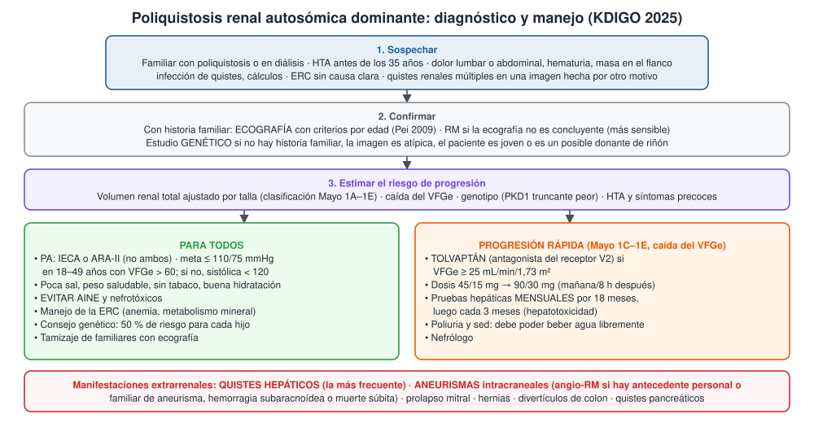
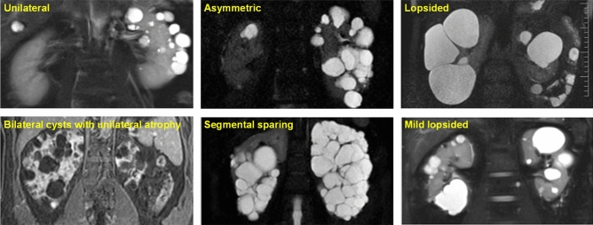

---
tags:
  - Nefrología
---

# Riñón poliquístico (poliquistosis renal autosómica dominante)

**Subespecialidad**
Nefrología · Genética · Atención primaria

**Guías principales**
KDIGO 2025: evaluación, manejo y tratamiento de la poliquistosis renal autosómica dominante (primera guía KDIGO sobre el tema)

**Otras fuentes**
Comentario de la Sociedad Canadiense de Nefrología a la guía KDIGO (2026) · Ensayos TEMPO 3:4 (2012) y REPRISE (2017) con tolvaptán · HALT-PKD (2014) · Criterios ecográficos unificados (Pei 2009) · Serie chilena de trasplante renal en poliquistosis (*Rev Med Chil* 2012)

**GES**
No por sí misma. Cuando llega a enfermedad renal crónica avanzada, la **diálisis** y el **trasplante** están garantizados en el GES de **enfermedad renal crónica etapas 4 y 5**.

**EUNACOM**
1.09.1.019 Riñón poliquístico (sospecha, inicial, derivar)

**Revisado**
Octubre 2026

!!! abstract "Resumen en 60 segundos"
    - **Poliquistosis renal autosómica dominante (PQRAD)**: la enfermedad renal **hereditaria más frecuente** (~ **1 de cada 1.000** personas).
        - Genes **PKD1** (más grave) y **PKD2**.
        - Cada hijo tiene **50 %** de riesgo de heredarla.
    - Muchos **quistes** crecen en ambos riñones y los agrandan; la función renal cae a partir de la 4.ª–5.ª década y la mitad llega a **diálisis**: con PKD1, a una mediana de **58 años**.
    - **Clínica**: **HTA precoz** (antes de los 35 años), **dolor lumbar**, **hematuria**, infección de quistes, **cálculos**, masa en el flanco y **ERC**.
    - **Extrarrenal**: **quistes hepáticos** (lo más frecuente), **aneurismas intracraneales**, prolapso mitral, hernias.
    - **Diagnóstico**: **ecografía** con criterios por edad en quien tiene historia familiar; **RM** si es dudosa; **estudio genético** si es atípica o no hay historia familiar.
    - **Tratamiento**:
        - **Control estricto de la PA** con IECA o ARA-II: meta **≤ 110/75 mmHg** en los jóvenes con buena función renal.
        - **Poca sal**, buena hidratación, **evitar AINE**.
        - **Tolvaptán** si hay riesgo de progresión rápida (clasificación Mayo 1C–1E): frena el crecimiento de los quistes; controlar las **pruebas hepáticas** mensualmente.
    - **Tamizaje de aneurismas** con angio-RM si hay antecedente personal o familiar de aneurisma, hemorragia subaracnoídea o muerte súbita.

## Definición

- **Poliquistosis renal autosómica dominante (PQRAD)**: enfermedad genética caracterizada por el desarrollo progresivo de **múltiples quistes renales bilaterales**, con aumento del tamaño renal, HTA, manifestaciones extrarrenales y pérdida progresiva de la función renal.
- **Herencia autosómica dominante**: basta una copia alterada; cada hijo de un afectado tiene **50 %** de probabilidad de heredarla. Algunos pacientes no tienen historia familiar (mutación nueva, familiar no diagnosticado o forma leve).
- **Volumen renal total ajustado por talla**: el mejor marcador de la carga quística y del riesgo de progresión; base de la **clasificación de imagen de la Clínica Mayo** (1A a 1E según la edad).
- **Quiste renal simple**: quiste único o pocos quistes, cada vez más frecuentes con la edad. No es una poliquistosis.
- **Poliquistosis renal autosómica recesiva**: enfermedad pediátrica (gen PKHD1) con riñones grandes y fibrosis hepática congénita; rara en la consulta del adulto.

## Epidemiología

### Mundial

- **Prevalencia**: ~ **1 de cada 1.000** personas; la causa **monogénica** más frecuente de insuficiencia renal.
- Explica ~ **5–10 %** de los pacientes con terapia de reemplazo renal (en Canadá, **7 %** de los casos nuevos de insuficiencia renal).
- **Genética**:
    - **PKD1** (cromosoma 16): la mayoría de los casos.
    - **PKD2** (cromosoma 4): ~ 15 %.
    - Otros genes raros (GANAB, DNAJB11, IFT140).
- **Edad mediana de llegada a insuficiencia renal** (Cornec-Le Gall 2013):
    - **PKD1**: **58 años** (**55** con variantes truncantes y **67** con no truncantes).
    - **PKD2**: **79 años**.
- **HTA**: aparece en la mayoría **antes de la pérdida de función renal**, a menudo antes de los 35 años.
- **Aneurismas intracraneales**: más frecuentes que en la población general, sobre todo si hay **antecedente familiar** de aneurisma o hemorragia subaracnoídea.

### Chile

!!! chile "Datos nacionales"
    - No hay registros nacionales publicados de prevalencia de la PQRAD. Con la prevalencia mundial (~ 1/1.000), habría del orden de **20.000 personas** afectadas en el país (estimación).
    - **Trasplante renal en poliquistosis** (Vega 2012; 3 hospitales chilenos, 1976–2011):
        - **19 de 406** trasplantados (**4,7 %**) tenían PQRAD.
        - La **sobrevida del paciente y del injerto** a 1, 5, 10 y 15 años fue **igual** que en otras causas de insuficiencia renal.
        - Hubo más hospitalizaciones por **infecciones virales y sepsis**.
    - **Cobertura**: la **hemodiálisis**, la **peritoneodiálisis** y el **trasplante renal** están garantizados en el **GES** de enfermedad renal crónica etapas 4 y 5. El **tolvaptán** es de alto costo y su acceso es limitado.
    - El **tamizaje de familiares** con ecografía es accesible en la red pública y permite el diagnóstico precoz y el control de la PA.

## Etiología y factores de riesgo

| Factor | Efecto |
|---|---|
| **Gen PKD1** (sobre todo variantes truncantes) | Enfermedad más grave y precoz |
| **Gen PKD2** | Enfermedad más leve; insuficiencia renal ~ 20 años más tarde |
| **Volumen renal total grande para la edad** (Mayo 1C–1E) | Progresión rápida |
| **HTA antes de los 35 años**, hematuria macroscópica precoz, proteinuria | Peor pronóstico |
| **Sexo masculino** | Progresión renal algo más rápida |
| **Sexo femenino**, embarazos múltiples, **estrógenos** | **Más quistes hepáticos** |
| **Obesidad**, ingesta alta de sal | Se asocian a mayor crecimiento renal |

## Fisiopatología

- Las **policistinas 1 y 2** (codificadas por PKD1 y PKD2) forman un complejo en el **cilio primario** de las células tubulares, que regula el calcio intracelular.
- Su falta → **baja el calcio** y **sube el AMP cíclico** intracelular → **proliferación** de las células tubulares y **secreción de líquido** hacia la luz → **quistes**.
- La **vasopresina** (receptor V2) aumenta el AMPc en el túbulo: por eso el **tolvaptán** (antagonista V2) **frena el crecimiento** de los quistes.
- Los quistes crecen durante décadas, comprimen y destruyen el parénquima sano. La **función renal se mantiene** por hiperfiltración de las nefronas restantes y **cae tarde**, cuando ya hay mucho daño.
- **HTA**: la compresión de vasos intrarrenales por los quistes produce **isquemia** y activa el **sistema renina-angiotensina-aldosterona**.
- **Dolor**: distensión de la cápsula, hemorragia o infección de un quiste, cálculos.
- **Defecto de concentración** urinaria precoz (poliuria, nicturia).

*Figura 1. Fisiopatología de la poliquistosis renal autosómica dominante y puntos de acción del tratamiento. Esquema propio basado en la guía KDIGO 2025.*

## Clasificación

**Criterios ecográficos de diagnóstico en personas con historia familiar** (Pei 2009, genotipo desconocido):

| Edad | Diagnóstico | Exclusión |
|---|---|---|
| **15–39 años** | **≥ 3 quistes** renales (uni o bilaterales) | — (una ecografía negativa no descarta; considerar RM o genética) |
| **40–59 años** | **≥ 2 quistes en cada riñón** | **< 2 quistes** en total |
| **≥ 60 años** | **≥ 4 quistes en cada riñón** | **< 2 quistes** en total |

**Clasificación de imagen de la Clínica Mayo** (pronóstico):

| Clase | Significado | Conducta |
|---|---|---|
| **1A–1B** | Volumen renal ajustado por talla bajo para la edad: progresión lenta | Medidas generales |
| **1C–1E** | Volumen alto para la edad: **progresión rápida** | Candidatos a **tolvaptán** |
| **2** (atípica) | Quistes unilaterales, asimétricos o segmentarios | No se aplica la clasificación; buscar otro diagnóstico o genética |

## Clínica

- **Asintomática** por años; se diagnostica por **estudio familiar** o por una ecografía hecha por otro motivo.
- **HTA precoz**: la manifestación más frecuente y temprana.
- **Dolor**:
    - **Agudo**: hemorragia de un quiste, infección, cálculo, obstrucción.
    - **Crónico**: lumbar o abdominal por los riñones (e hígado) grandes; saciedad precoz, reflujo, disnea.
- **Hematuria macroscópica** (rotura de un quiste hacia la vía urinaria), generalmente autolimitada.
- **Infección de quistes**: fiebre, dolor localizado, PCR alta, **a menudo con urocultivo negativo**.
- **Nefrolitiasis** (ácido úrico, oxalato de calcio).
- **Poliuria y nicturia** (defecto de concentración).
- **Examen**: **riñones palpables** (masas en los flancos), **hepatomegalia** quística, HTA, soplo de prolapso mitral, hernias.
- **Extrarrenal**:
    - **Quistes hepáticos**: los más frecuentes; aumentan con la edad, el sexo femenino y los estrógenos. Rara vez alteran la función hepática.
    - **Aneurismas intracraneales**: riesgo de **hemorragia subaracnoídea** (cefalea súbita "la peor de la vida").
    - **Prolapso de la válvula mitral**, insuficiencia aórtica.
    - **Hernias** inguinales y abdominales, **divertículos** de colon.
    - Quistes pancreáticos y de vesícula seminal.

## Diagnóstico

- **Con historia familiar**: **ecografía renal** con los criterios por edad (Pei 2009).
- **Sin historia familiar o con imagen atípica**:
    - **RM** (más sensible: detecta quistes pequeños).
    - **Estudio genético** (KDIGO 2025): ausencia de historia familiar, presentación atípica (asimétrica, VFG que cae sin riñones grandes), diagnóstico a edad muy joven, **posible donante de riñón** joven con familiar afectado, planificación familiar.
- **Estimación del pronóstico**:
    - **Volumen renal total ajustado por talla** (RM, TC o ecografía) → **clasificación Mayo**.
    - **Velocidad de caída del VFGe**.
    - Genotipo y puntajes clínicos.
- **Tamizaje de familiares**: ofrecer **ecografía** a los familiares de primer grado adultos tras consejería (KDIGO recomienda la ecografía como primer examen).

<figure markdown>
{ loading=lazy }
<figcaption>Figura 2. Diagnóstico y manejo de la poliquistosis renal autosómica dominante. Esquema propio basado en la guía KDIGO 2025, su comentario canadiense (2026) y los criterios de Pei 2009.</figcaption>
</figure>

## Laboratorio

| Examen | Interpretación |
|---|---|
| **Creatinina y VFGe** | Normal por décadas; seguir la **velocidad de caída** |
| **Orina completa** | Hematuria; proteinuria leve (si es importante, buscar otra causa) |
| **Razón albúmina/creatinina** | Pronóstico |
| **Electrolitos, ácido úrico, calcio, fósforo, PTH, hemograma** | Manejo de la ERC; la anemia suele ser **menos intensa** que en otras causas (más eritropoyetina) |
| **Pruebas hepáticas** | Basales y **mensuales** con **tolvaptán** |
| **Urocultivo, hemocultivos, PCR** | Infección de quistes (el urocultivo puede ser negativo) |
| **Estudio genético** (PKD1, PKD2 y otros) | Casos atípicos, sin historia familiar, donantes |

## Imágenes

- **Ecografía renal**: primer examen; riñones **grandes** con **múltiples quistes bilaterales**; quistes hepáticos.
- **RM** (de elección para medir el volumen renal total) o **TC**.
- **TC sin contraste**: cálculos, hemorragia de quistes.
- **PET-TC con FDG**: ayuda a localizar un quiste infectado cuando la clínica no basta.
- **Angio-RM cerebral sin contraste**: tamizaje de **aneurismas intracraneales** en los pacientes indicados.
- **Ecocardiograma**: si hay soplo (prolapso mitral).

<figure markdown>
{ loading=lazy }
<figcaption>Figura 3. Patrones de imagen atípicos de la poliquistosis en la RM (clase 2 de la clasificación Mayo): compromiso unilateral, asimétrico, "lopsided" (pocos quistes grandes que reemplazan poco parénquima), quistes bilaterales con atrofia unilateral, respeto segmentario y "lopsided" leve. En el panel de respeto segmentario se ven riñones muy aumentados de tamaño y reemplazados por quistes, como en la forma típica. Estos patrones obligan a buscar otro diagnóstico o a hacer un estudio genético. Tomada de Iliuta IA, Win AZ, Lanktree MB, et al. <em>Atypical polycystic kidney disease as defined by imaging.</em> Sci Rep. 2023;13(1):2952 (figura 1). Licencia CC BY 4.0.</figcaption>
</figure>

## Diagnóstico diferencial

| Diagnóstico | Diferencias |
|---|---|
| **Quistes renales simples** | Pocos quistes, adulto mayor, riñones de tamaño normal, sin historia familiar |
| **Quiste renal complejo / cáncer renal** | Tabiques gruesos, nódulos o realce (clasificación de **Bosniak** III–IV) → urología |
| **Enfermedad quística adquirida** | Paciente en **diálisis** por años; riñones **pequeños** con quistes; riesgo de cáncer renal |
| **Poliquistosis autosómica recesiva** | Niños; fibrosis hepática congénita |
| **Complejo esclerosis tuberosa** | **Angiomiolipomas** (grasa), lesiones cutáneas, convulsiones; puede asociarse a PKD1 (deleción contigua) |
| **Enfermedad de von Hippel-Lindau** | Quistes y **carcinomas renales**, hemangioblastomas, feocromocitoma |
| **Enfermedad renal quística medular / tubulointersticial autosómica dominante** | Riñones de tamaño normal o pequeño, gota precoz (UMOD) |
| **Poliquistosis hepática aislada** | Muchos quistes hepáticos con pocos o ningún quiste renal |
| **Hidronefrosis** | Cavidades comunicadas con la pelvis renal en la ecografía |

## Tratamiento

### Medidas para todos

- **Control de la PA** (KDIGO 2025):
    - **IECA o ARA-II** como primera línea (**no combinarlos**).
    - Meta **≤ 110/75 mmHg** en los pacientes de **18–49 años con VFGe > 60** si la toleran (HALT-PKD: menos crecimiento renal y menos masa ventricular).
    - En el resto, **PA sistólica < 120 mmHg** medida en forma estandarizada.
- **Dieta**: **poca sal**, proteínas moderadas, **peso saludable**, actividad física.
- **Hidratación** abundante si la función renal lo permite (la evidencia de beneficio sobre el crecimiento renal es limitada).
- **Evitar** los **AINE** y otros nefrotóxicos; evitar los deportes de contacto si los riñones son muy grandes.
- **Manejo de la ERC**: anemia, metabolismo mineral, acidosis, ajuste de dosis.
- **Consejería genética** y reproductiva; **tamizaje de familiares**.
- **No fumar** (riesgo de aneurisma y de progresión).
- **Estrógenos**: precaución en las mujeres con poliquistosis hepática importante.

### Tolvaptán (progresión rápida)

!!! dosis "Tolvaptán en la PQRAD (lo indica el nefrólogo)"
    - **Indicación** (KDIGO 2025): adultos con **VFGe ≥ 25 mL/min/1,73 m²** y **riesgo de progresión rápida** (clasificación Mayo **1C–1E**, caída rápida del VFGe u otros marcadores).
    - **Dosis**: dos tomas al día (al despertar y 8 horas después): **45/15 mg → 60/30 mg → 90/30 mg**, hasta la máxima tolerada.
    - **Eficacia**:
        - **TEMPO 3:4** (2012): el volumen renal creció **2,8 % al año** frente a **5,5 %** con placebo, con menor caída de la función renal.
        - **REPRISE** (2017, enfermedad más avanzada): VFGe **−2,34** frente a **−3,61** mL/min/1,73 m² en 1 año.
    - **Efectos adversos**:
        - **Acuaresis**: poliuria, **sed**, nicturia. El paciente debe **poder beber agua libremente** (contraindicado si no puede, si tiene hipovolemia o hipernatremia).
        - **Hepatotoxicidad**: **pruebas hepáticas mensuales por 18 meses** y luego cada 3 meses; suspender si suben.
    - **Interacciones**: inhibidores potentes del CYP3A4 (claritromicina, ketoconazol, jugo de pomelo).

- Los **análogos de somatostatina** (octreotide, lanreotide) **no** se recomiendan para la enfermedad renal; pueden usarse en la **poliquistosis hepática sintomática** (centro experto).

### Complicaciones agudas

| Complicación | Manejo |
|---|---|
| **Hemorragia de quiste / hematuria** | Reposo, **hidratación**, analgesia sin AINE; suspender transitoriamente IECA/ARA-II si hay hipovolemia; casi siempre autolimitada |
| **Infección de quiste** | Antibióticos que **penetran en los quistes** (lipofílicos): **fluoroquinolona** (ciprofloxacino) o **cotrimoxazol**, por **4–6 semanas** (KDIGO 2025); drenaje si no responde |
| **Pielonefritis** | Como en otros pacientes ([Infección urinaria](infeccion-urinaria.md)) |
| **Cálculos** | Hidratación, analgesia, citrato de potasio si hay hipocitraturia ([Urolitiasis](urolitiasis-y-colico-renal.md)) |
| **Dolor crónico** | Paracetamol, medidas no farmacológicas; evitar AINE y opioides de forma crónica; aspiración o escleroterapia de quistes grandes, denervación o nefrectomía en casos seleccionados |
| **Cefalea súbita intensa** | **Urgencia**: descartar **hemorragia subaracnoídea** (TC cerebral) |

### Enfermedad renal avanzada

- **Diálisis**: la **peritoneodiálisis es posible** (los riñones grandes no la contraindican).
- **Trasplante renal**: resultados **similares** a otras causas (Vega 2012). **Nefrectomía** de los riñones nativos si son muy grandes (falta de espacio), infectados o sangran.
- **Donante vivo familiar**: descartar la enfermedad en el donante (imagen y, si es joven, **estudio genético**).

### Aneurismas intracraneales

- **Tamizaje con angio-RM** (KDIGO 2025) en los pacientes con **antecedente personal o familiar** de aneurisma intracraneal, **hemorragia subaracnoídea** o **muerte súbita inexplicada**, si son candidatos a tratamiento; también en profesiones de alto riesgo o antes de una cirugía mayor, según el caso.
- Si el tamizaje es negativo: repetir cada **5–10 años**.

## Complicaciones

- **Enfermedad renal crónica** progresiva e insuficiencia renal.
- **HTA**, hipertrofia ventricular izquierda, enfermedad cardiovascular.
- **Hemorragia e infección de quistes**, **nefrolitiasis**, obstrucción.
- **Dolor crónico** y deterioro de la calidad de vida.
- **Poliquistosis hepática masiva**: dolor, saciedad precoz, desnutrición, compresión de la vena cava; rara vez requiere trasplante hepático.
- **Hemorragia subaracnoídea** por rotura de un aneurisma.
- **Embarazo**: más riesgo de **preeclampsia** e HTA.
- **Hernias** y divertículos complicados.

## Pronóstico y seguimiento

- **Variable**: depende del gen (PKD1 truncante peor), del volumen renal para la edad y del control de la PA.
- Con PKD1, la mitad llega a insuficiencia renal cerca de los **58 años**; con PKD2, cerca de los **79**.
- La **sobrevida en diálisis y trasplante** es igual o mejor que en otras causas de insuficiencia renal.
- **Seguimiento** (nefrología):
    - **PA** en cada control y monitoreo domiciliario.
    - **Creatinina y VFGe** al menos una vez al año (más seguido si progresa o usa tolvaptán).
    - **Pruebas hepáticas** con tolvaptán.
    - **Imagen** del volumen renal para el pronóstico cuando cambie la conducta.
    - Reevaluar el **tamizaje de aneurismas** según la historia familiar.

## Perlas para el internado

!!! perla "Para recordar en la sala"
    - **HTA en un joven + riñones grandes palpables + familiar en diálisis** = poliquistosis.
    - Pregunte siempre por la **historia familiar** de enfermedad renal, diálisis, aneurismas o **muerte súbita**.
    - **Pocos quistes en un adulto mayor** no son una poliquistosis: use los **criterios por edad**.
    - En la poliquistosis **evite los AINE**; trate el dolor con paracetamol.
    - **Fiebre + dolor en el flanco + urocultivo negativo** en un poliquístico: piense en **infección de quiste** y use **ciprofloxacino o cotrimoxazol por 4–6 semanas**.
    - **Cefalea súbita "la peor de la vida"** en un poliquístico: **TC cerebral urgente** (hemorragia subaracnoídea).
    - Paciente con **tolvaptán**: pida **pruebas hepáticas mensuales** y asegúrese de que **pueda beber agua** (cuidado si está en régimen cero u hospitalizado).
    - La anemia de la ERC por poliquistosis suele ser **más leve** que la esperada para el VFG.

## Preguntas de repaso

??? repaso "1. Hombre de 28 años con PA de 150/95 mmHg en un examen preocupacional. Su padre está en hemodiálisis por \"riñones con quistes\". La ecografía muestra 5 quistes en el riñón derecho y 4 en el izquierdo. Creatinina 0,9 mg/dL. ¿Diagnóstico y conducta?"
    - **Poliquistosis renal autosómica dominante** (historia familiar + ≥ 3 quistes entre los 15 y 39 años).
    - **IECA o ARA-II** con meta **≤ 110/75 mmHg** (18–49 años con VFGe > 60), dieta con poca sal, evitar AINE.
    - Derivar a **nefrología**: medir el **volumen renal total** (clasificación Mayo) para decidir **tolvaptán**.
    - Consejería genética (50 % para cada hijo) y **ecografía a los hermanos** adultos.
    - Preguntar por aneurismas o hemorragia subaracnoídea en la familia.

??? repaso "2. Mujer de 45 años con poliquistosis conocida consulta por fiebre de 38,8 °C y dolor en el flanco izquierdo de 3 días. El urocultivo es negativo; la PCR es de 180 mg/L. ¿Qué sospecha y cómo la trata?"
    - **Infección de un quiste renal** (fiebre, dolor localizado, PCR alta, **urocultivo negativo**).
    - **Hemocultivos**; imagen (TC; **PET-TC** si hay duda sobre el quiste infectado).
    - Antibiótico que **penetre en los quistes**: **ciprofloxacino** o **cotrimoxazol** por **4–6 semanas**.
    - **Drenaje** del quiste si no responde.

??? repaso "3. Hombre de 35 años con poliquistosis, VFGe de 70 mL/min/1,73 m² y clasificación Mayo 1D. ¿Qué tratamiento específico le ofrecería y qué controles requiere?"
    - **Tolvaptán** (riesgo de progresión rápida con VFGe ≥ 25).
    - Dosis escalonada **45/15 → 60/30 → 90/30 mg** (al despertar y 8 horas después).
    - **Pruebas hepáticas mensuales** por 18 meses y luego cada 3 meses.
    - Advertir la **poliuria y la sed**; debe poder beber agua libremente; evitar inhibidores del CYP3A4.

??? repaso "4. Mujer de 40 años con poliquistosis consulta por la cefalea más intensa de su vida, de inicio súbito mientras hacía ejercicio. ¿Qué sospecha y qué hace?"
    - **Hemorragia subaracnoídea** por la rotura de un **aneurisma intracraneal** (más frecuente en la poliquistosis).
    - **TC cerebral sin contraste** urgente; si es normal y la sospecha persiste, punción lumbar o angio-TC.
    - Manejo neurocrítico y neurocirugía.
    - Tamizaje de aneurismas en los **familiares** con poliquistosis.

??? repaso "5. Hombre de 72 años al que una ecografía abdominal por dolor biliar le muestra 2 quistes simples en el riñón derecho y 1 en el izquierdo. No tiene historia familiar y su creatinina es normal. ¿Tiene una poliquistosis?"
    - **No**: a los 72 años se necesitan **≥ 4 quistes en cada riñón** para el diagnóstico en personas con historia familiar, y este paciente no la tiene.
    - Son **quistes renales simples**, muy frecuentes con la edad.
    - No requieren seguimiento si son **Bosniak I–II**; los complejos (Bosniak IIF–IV) se estudian con TC o RM con contraste.

??? repaso "6. Paciente con poliquistosis en tratamiento con enalapril consulta por hematuria macroscópica tras un esfuerzo físico, sin fiebre. Hemodinámicamente estable. ¿Qué hace?"
    - Probable **hemorragia de un quiste** hacia la vía urinaria.
    - **Reposo**, **hidratación**, analgesia con **paracetamol** (sin AINE).
    - Hemograma y creatinina; ecografía o TC si hay dolor intenso o dudas (cálculo, tumor).
    - Suele ser **autolimitada** en días; evaluar urología si persiste o en mayores de 50 años (descartar cáncer).

## Referencias

1. Kidney Disease: Improving Global Outcomes (KDIGO) ADPKD Work Group. KDIGO 2025 clinical practice guideline for the evaluation, management, and treatment of autosomal dominant polycystic kidney disease (ADPKD). *Kidney Int.* 2025;107(2S):S1–S239. doi:[10.1016/j.kint.2024.07.009](https://doi.org/10.1016/j.kint.2024.07.009)
2. Torres VE, Ahn C, Barten TRM, et al. KDIGO 2025 clinical practice guideline for the evaluation, management, and treatment of autosomal dominant polycystic kidney disease (ADPKD): executive summary. *Kidney Int.* 2025;107(2):234–254. doi:[10.1016/j.kint.2024.07.010](https://doi.org/10.1016/j.kint.2024.07.010)
3. Lanktree MB, Ashawasega N, Bevilacqua M, et al. Canadian Society of Nephrology commentary on the 2025 Kidney Disease Improving Global Outcomes clinical practice guidelines for autosomal dominant polycystic kidney disease. *Can J Kidney Health Dis.* 2026;13:20543581261455635. doi:[10.1177/20543581261455635](https://doi.org/10.1177/20543581261455635)
4. Torres VE, Chapman AB, Devuyst O, et al. Tolvaptan in patients with autosomal dominant polycystic kidney disease. *N Engl J Med.* 2012;367(25):2407–2418. doi:[10.1056/NEJMoa1205511](https://doi.org/10.1056/NEJMoa1205511)
5. Torres VE, Chapman AB, Devuyst O, et al. Tolvaptan in later-stage autosomal dominant polycystic kidney disease. *N Engl J Med.* 2017;377(20):1930–1942. doi:[10.1056/NEJMoa1710030](https://doi.org/10.1056/NEJMoa1710030)
6. Schrier RW, Abebe KZ, Perrone RD, et al. Blood pressure in early autosomal dominant polycystic kidney disease. *N Engl J Med.* 2014;371(24):2255–2266. doi:[10.1056/NEJMoa1402685](https://doi.org/10.1056/NEJMoa1402685)
7. Pei Y, Obaji J, Dupuis A, et al. Unified criteria for ultrasonographic diagnosis of ADPKD. *J Am Soc Nephrol.* 2009;20(1):205–212. doi:[10.1681/ASN.2008050507](https://doi.org/10.1681/ASN.2008050507)
8. Cornec-Le Gall E, Audrézet MP, Chen JM, et al. Type of PKD1 mutation influences renal outcome in ADPKD. *J Am Soc Nephrol.* 2013;24(6):1006–1013. doi:[10.1681/ASN.2012070650](https://doi.org/10.1681/ASN.2012070650)
9. Iliuta IA, Win AZ, Lanktree MB, et al. Atypical polycystic kidney disease as defined by imaging. *Sci Rep.* 2023;13(1):2952. doi:[10.1038/s41598-022-24104-w](https://doi.org/10.1038/s41598-022-24104-w)
10. Vega J, Lira D, Medel S, et al. Resultados del trasplante renal en portadores de riñones poliquísticos. *Rev Med Chil.* 2012;140(8):990–998. doi:[10.4067/S0034-98872012000800004](https://doi.org/10.4067/S0034-98872012000800004)
