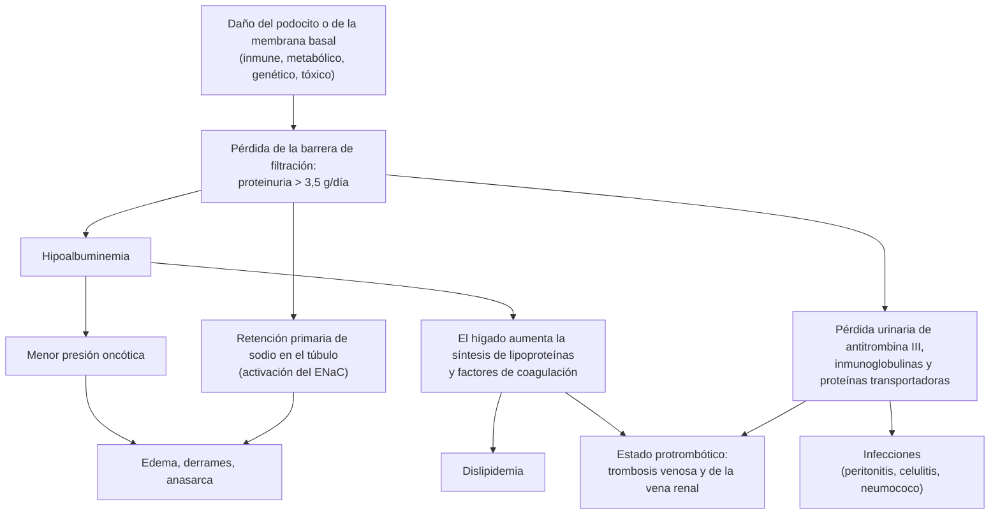
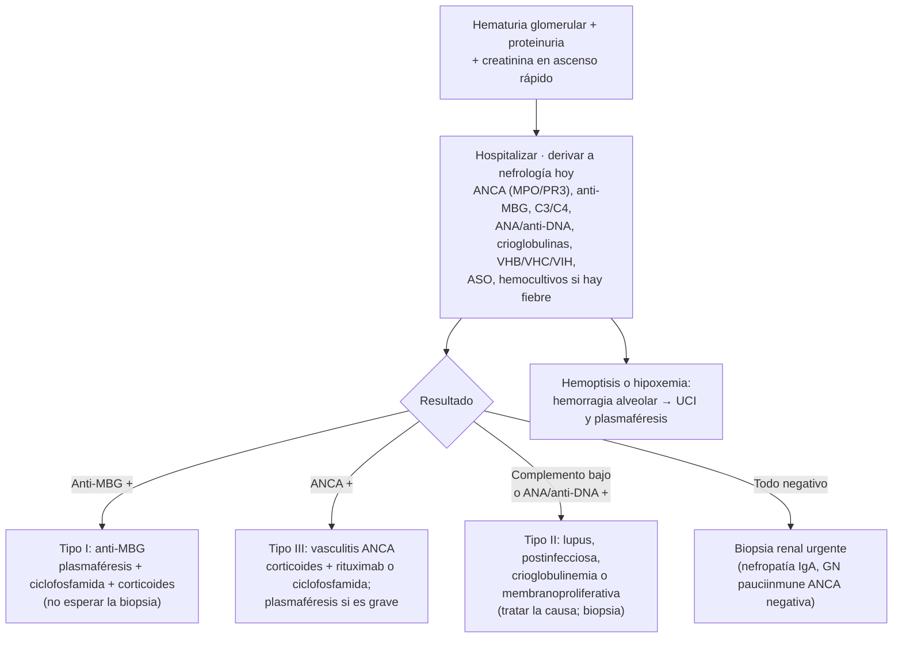
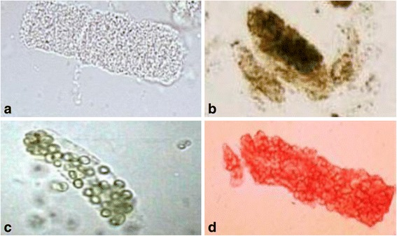

---
tags:
  - Nefrología
  - GES
  - Urgencia
---

# Síndrome nefrótico, síndrome nefrítico y glomerulonefritis rápidamente progresiva

**Subespecialidad**
Nefrología · Reumatología

**Guías principales**
KDIGO 2021: enfermedades glomerulares (*Kidney Int*, octubre) · KDIGO 2024: nefritis lúpica (*Kidney Int*, enero) · KDIGO 2024: vasculitis asociada a ANCA (*Kidney Int*, marzo) · KDIGO 2025: nefropatía IgA y vasculitis IgA · EULAR 2022: vasculitis asociada a ANCA

**Otras fuentes**
Registro chileno de 550 biopsias renales (Valjalo, *Rev Med Chil* 2023) · Serie de nefritis lúpica de Valdivia (Fulgeri, *Nefrología* 2018) · Retractación del ensayo ADVOCATE (avacopán, 2026)

**GES**
Sí: **lupus eritematoso sistémico** (N.° 78). La enfermedad renal crónica etapas 4–5 también es GES (diálisis y trasplante).

**EUNACOM**
1.09.1.022 Síndrome nefrótico (específico, inicial, derivar) · 1.09.1.021 Síndrome nefrítico (específico, inicial, derivar) · 1.09.1.018 Proteinuria (sospecha, inicial, completo) · 1.09.1.020 Edema generalizado (sospecha, inicial, derivar) · 1.09.2.003 Edema generalizado grave, anasarca (sospecha, inicial, derivar) · 1.09.2.013 Vasculitis o glomerulonefritis rápidamente progresiva (sospecha, inicial, derivar) · 1.09.1.006 Glomerulopatía lúpica (sospecha, inicial, derivar)

**Revisado**
Septiembre 2026

!!! abstract "Resumen en 60 segundos"
    - **Síndrome nefrótico**: **proteinuria > 3,5 g/día**, **hipoalbuminemia**, **edema** (hasta **anasarca**) y dislipidemia. Sedimento "limpio" o con pocos glóbulos rojos.
        - En el adulto: **nefropatía membranosa** (la más frecuente en Chile), GEFS, **cambios mínimos**; secundarias a **diabetes**, lupus, amiloidosis, fármacos, infecciones y cáncer.
        - Complicaciones: **trombosis** (sobre todo en la membranosa y con albúmina < 2,5 g/dL), **infecciones**, dislipidemia y LRA.
    - **Síndrome nefrítico**: **hematuria glomerular** (dismórficos, **cilindros hemáticos**), **HTA**, **edema**, oliguria, **caída de la TFG** y proteinuria < 3,5 g/día.
    - **Glomerulonefritis rápidamente progresiva (GNRP)**: nefrítico con **pérdida de ≥ 50 % de la TFG en días a semanas**. Es una **urgencia**.
        - Pedir de inmediato **ANCA (MPO y PR3)**, **anti-MBG**, complemento, ANA y anti-DNA.
        - Tratar **sin esperar la biopsia** si la clínica y los ANCA son compatibles (KDIGO 2024).
        - Tratamiento: corticoides + **rituximab** o **ciclofosfamida**; **plasmaféresis** en la enfermedad anti-MBG y en la vasculitis grave (creatinina > 3,4 mg/dL, diálisis o hemorragia alveolar con hipoxemia).
    - **Síndrome riñón-pulmón** (hemoptisis + GNRP): vasculitis ANCA o anti-MBG. Riesgo vital.
    - **Nefritis lúpica**: buscarla en todo LES con **proteinuria**, sedimento activo o caída de la TFG. **Biopsia** si la proteinuria es ≥ 0,5 g/día. Todos los pacientes con LES reciben **hidroxicloroquina**.
    - Manejo general de toda glomerulopatía: **restricción de sodio**, **diuréticos de asa**, **IECA o ARA-II**, **estatina** si corresponde, vacunas y **derivar a nefrología** para la biopsia.

## Definición

| Síndrome | Criterios |
|---|---|
| **Proteinuria patológica** | > 150 mg/día de proteínas o **albuminuria ≥ 30 mg/g** (RAC) |
| **Proteinuria en rango nefrótico** | **> 3,5 g/día** (o índice proteína/creatinina > 3,5 g/g) |
| **Síndrome nefrótico** | Proteinuria **> 3,5 g/día** + **hipoalbuminemia** (< 3 g/dL) + **edema**; con frecuencia hiperlipidemia y lipiduria |
| **Síndrome nefrítico** | **Hematuria glomerular** (glóbulos rojos **dismórficos**, **acantocitos**, **cilindros hemáticos**) + **HTA** + **edema** + **caída de la TFG** u oliguria; proteinuria habitualmente < 3,5 g/día |
| **GNRP** | Síndrome nefrítico con **pérdida rápida de la función renal** (≥ 50 % en días a pocas semanas, hasta ~ 3 meses). En la biopsia: **semilunas** en la mayoría de los glomérulos |
| **Edema generalizado (anasarca)** | Edema de extremidades, pared abdominal y cara, con **derrames** (pleural, ascitis, pericárdico) |

- Un mismo paciente puede tener un cuadro **mixto** (nefrótico-nefrítico), por ejemplo en la nefritis lúpica o la glomerulonefritis membranoproliferativa.

## Epidemiología

### Mundial

- La **nefropatía IgA** es la glomerulopatía primaria **más frecuente del mundo**. Un **25–30 %** llega a la falla renal en 20–25 años (KDIGO 2021).
- La **enfermedad de cambios mínimos** es la causa principal de nefrótico en **niños**, pero también explica el **10–25 %** del nefrótico del **adulto**.
- En el adulto, la causa más frecuente de proteinuria y de enfermedad renal crónica es la **diabetes** (ver el resumen de [enfermedad renal crónica](enfermedad-renal-cronica.md)).
- La **vasculitis ANCA** es la causa más frecuente de **GNRP** en el adulto mayor.

### Chile

!!! chile "Contexto nacional"
    - **550 biopsias renales** de riñones nativos entre **1999 y 2020** (Hospital del Salvador y Hospital Militar; Valjalo, 2023):
        - Mediana de edad **48 años**, **64 % mujeres**. La principal indicación de biopsia fue el **síndrome nefrótico**.
        - **Primarias**: **nefropatía membranosa 34,1 %**, **nefropatía IgA 31,1 %**, **GEFS 14,1 %**.
        - **Secundarias**: **nefritis lúpica 41,7 %**, **glomerulonefritis pauciinmune (ANCA) 27,1 %**, nefropatía diabética 6,4 %.
        - Comparado con otros registros, Chile tiene una **alta proporción de membranosa y de vasculitis pauciinmune**.
    - **Nefritis lúpica en Valdivia** (134 biopsias, 2002–2014; Fulgeri, 2018):
        - **86 % mujeres**; el **68 %** tenía lesiones **proliferativas** (clases III y IV).
        - Incluso con alteraciones urinarias "leves", el **65 %** era clase III o IV: la clínica **no predice** la histología y la **biopsia es clave**.
    - **GES N.° 78, lupus eritematoso sistémico**: cubre la confirmación diagnóstica (plazo de 60 días desde la sospecha por el especialista) y el tratamiento.

## Etiología

| Síndrome | Causas primarias | Causas secundarias |
|---|---|---|
| **Nefrótico** | **Nefropatía membranosa** (anti-PLA2R), **GEFS**, **cambios mínimos** | **Diabetes**; **amiloidosis** y mieloma; **LES** (clase V); **fármacos** (AINE → cambios mínimos; litio); **infecciones** (VHB → membranosa, VHC → membranoproliferativa, VIH → GEFS colapsante, sífilis); **cáncer** (tumores sólidos → membranosa; linfoma de Hodgkin → cambios mínimos); obesidad (GEFS secundaria) |
| **Nefrítico** | **Nefropatía IgA**; glomerulonefritis membranoproliferativa y glomerulopatía C3 | **Postinfecciosa** (estreptocócica, estafilocócica, **endocarditis**); **LES**; **vasculitis IgA** (púrpura de Schönlein-Henoch); **crioglobulinemia** (VHC) |
| **GNRP** | — | **Tipo I, anti-MBG** (Goodpasture) · **Tipo II, por inmunocomplejos** (lupus, IgA, postinfecciosa, crioglobulinemia) · **Tipo III, pauciinmune** (**vasculitis ANCA**: poliangeítis microscópica, granulomatosis con poliangeítis, granulomatosis eosinofílica; fármacos como **hidralazina** o propiltiouracilo) |

## Fisiopatología

*Figura 1. Fisiopatología del síndrome nefrótico. Esquema propio basado en KDIGO 2021.*

- **Nefrótico**: el daño afecta al **podocito** (cambios mínimos, GEFS) o a la **membrana basal** por inmunocomplejos subepiteliales (membranosa, anticuerpos anti-PLA2R). Hay poca inflamación, por eso el sedimento es "limpio".
- **Nefrítico**: la **inflamación** del glomérulo (proliferación, neutrófilos, necrosis) rompe los capilares. Los glóbulos rojos pasan a la orina, se deforman (**dismórficos**) y forman **cilindros hemáticos**. Cae la TFG y se retiene sodio (**HTA** y edema).
- **GNRP**: la rotura de la pared capilar deja pasar fibrina y células a la cápsula de Bowman y se forman **semilunas**. Sin tratamiento, evolucionan a fibrosis en semanas.

## Clasificación

**Glomerulonefritis rápidamente progresiva según la inmunofluorescencia**

| Tipo | Inmunofluorescencia | Serología | Ejemplos | Complemento |
|---|---|---|---|---|
| **I** | **Lineal** (IgG en la membrana basal) | **Anti-MBG** | Enfermedad anti-MBG (Goodpasture si hay hemorragia pulmonar) | Normal |
| **II** | **Granular** (inmunocomplejos) | ANA, anti-DNA, ASO, crioglobulinas | Lupus, IgA, postinfecciosa, crioglobulinemia | **Bajo** en lupus, postinfecciosa y crioglobulinemia; normal en IgA |
| **III** | **Pauciinmune** (escasa o nula) | **ANCA** (MPO o PR3) | Poliangeítis microscópica, granulomatosis con poliangeítis | Normal |

**Nefritis lúpica (clasificación ISN/RPS)**: I y II (mesangial), **III (focal)** y **IV (difusa)** proliferativas, **V (membranosa)**, VI (esclerosis avanzada). Las clases **III y IV** son las más graves y requieren inmunosupresión intensa.

## Clínica

- **Síndrome nefrótico**:
    - **Edema** blando, con fóvea, que empieza en los **párpados** en la mañana y en las **piernas** en la tarde. Aumento de peso, **orina espumosa**.
    - En casos graves: **anasarca**, derrame pleural, ascitis.
    - Complicaciones de presentación: **trombosis venosa profunda**, **trombosis de la vena renal** (dolor lumbar, hematuria, caída de la TFG), **TEP**, **peritonitis** o celulitis.
- **Síndrome nefrítico**:
    - **Hematuria** (orina "color coca-cola" o té), **HTA**, **edema**, **oliguria**.
    - Postinfeccioso: **1–3 semanas** tras una faringitis o **3–6 semanas** tras una infección cutánea; en el adulto, a menudo con una infección **activa** (estafilococo, endocarditis).
    - **Nefropatía IgA**: hematuria macroscópica **simultánea** (1–3 días) con una infección respiratoria ("sinfaringítica").
- **GNRP y vasculitis**:
    - Síntomas **sistémicos**: fiebre, baja de peso, artralgias, mialgias.
    - **Púrpura palpable**, mononeuritis múltiple, **epiescleritis**.
    - **Sinusitis**, otitis o costras nasales (granulomatosis con poliangeítis).
    - **Hemoptisis** o infiltrados pulmonares (**síndrome riñón-pulmón**).
    - Asma y eosinofilia (granulomatosis eosinofílica).
- **Nefritis lúpica**: LES conocido o de debut (rash, artritis, serositis, citopenias) con proteinuria, hematuria, HTA o caída de la TFG. Puede ser **silente**.

!!! alarma "Signos de alarma"
    - **Creatinina que sube en días** con hematuria y proteinuria: **GNRP** hasta demostrar lo contrario. **Hospitalizar y derivar a nefrología hoy.**
    - **Hemoptisis**, infiltrados pulmonares o **hipoxemia** con compromiso renal: **hemorragia alveolar** (síndrome riñón-pulmón).
    - **Hiperkalemia**, sobrecarga de volumen o **acidosis** refractarias: puede requerir **diálisis**.
    - Nefrótico con **dolor en una pantorrilla**, **disnea súbita**, **dolor lumbar** o hematuria macroscópica nueva: **trombosis** (TVP, TEP o vena renal).
    - Nefrótico con **fiebre y dolor abdominal**: **peritonitis bacteriana** (neumococo).
    - **Anasarca** con derrames que comprometen la respiración o hipoalbuminemia muy grave (< 2 g/dL).

## Diagnóstico

1. **Confirmar y cuantificar la proteinuria**: índice **proteína/creatinina** o **albúmina/creatinina** en una muestra aislada, y **orina de 24 h** (KDIGO la prefiere para el seguimiento de las glomerulopatías).
2. **Orina completa con sedimento** en **todas** las glomerulopatías: glóbulos rojos **dismórficos**, **acantocitos** y **cilindros hemáticos** indican origen glomerular.
3. **Función renal** (creatinina, TFGe) y su **velocidad de cambio**.
4. **Estudio etiológico** según el síndrome (ver el laboratorio).
5. **Biopsia renal**: es el **estándar de referencia** (KDIGO 2021).
    - En el adulto con nefrótico, casi siempre se requiere (la excepción típica es la **diabetes** con retinopatía y evolución compatible).
    - En la **GNRP**: urgente, pero **no debe retrasar** el tratamiento si hay ANCA positivos y un cuadro compatible (KDIGO 2024).
    - En el **LES**: si hay proteinuria **≥ 0,5 g/día**, sedimento activo o caída de la TFG sin otra causa (KDIGO 2024).

*Figura 2. Enfrentamiento inicial de la glomerulonefritis rápidamente progresiva. Esquema propio basado en KDIGO 2021 y 2024.*

!!! guia "Criterios útiles (KDIGO 2021 y 2024)"
    - **Nefrótico**: proteinuria **> 3,5 g/día** con albúmina baja y edema.
    - **Riesgo trombótico alto**: **nefropatía membranosa** y **albúmina < 2,5 g/dL** (por método de verde de bromocresol) son los mejores predictores.
    - **GNRP en la nefropatía IgA**: caída de la TFGe **≥ 50 % en ≤ 3 meses**, descartadas otras causas.
    - **Plasmaféresis en la vasculitis ANCA** (considerar): creatinina **> 3,4 mg/dL**, **diálisis** o creatinina en rápido ascenso, o **hemorragia alveolar con hipoxemia**. Siempre si coexisten **ANCA y anti-MBG**.
    - **Nefritis lúpica**: estudiar con creatinina, orina completa, índice proteína/creatinina, anti-DNA y complemento; **biopsia** si la proteinuria es ≥ 0,5 g/día.

## Laboratorio

- **Orina**:
    - Orina completa con **sedimento** (idealmente mirado por el médico o un nefrólogo).
    - **Índice proteína/creatinina** o **albúmina/creatinina**; orina de 24 h.
- **Sangre**:
    - Creatinina, BUN, electrolitos (**potasio**), gases venosos.
    - **Albúmina**, **perfil lipídico**, glicemia y **HbA1c**.
    - Hemograma (anemia, trombocitopenia en el LES o la microangiopatía trombótica).
- **Estudio etiológico**:
    - **Nefrótico**: **anti-PLA2R** (membranosa primaria), **VHB, VHC, VIH, VDRL**, **electroforesis de proteínas** con inmunofijación y **cadenas livianas libres** (mieloma y amiloidosis, sobre todo en > 50 años), ANA y complemento. Screening de **cáncer** según la edad en la membranosa anti-PLA2R negativa.
    - **Nefrítico y GNRP**: **C3 y C4**, **ANCA (MPO y PR3)**, **anti-MBG**, **ANA y anti-DNA**, **crioglobulinas**, **ASO/anti-DNasa B**, **hemocultivos** si hay fiebre o un soplo (endocarditis), VHB y VHC.
- **Complemento**:
    - **Bajo**: postinfecciosa (C3), **lupus** (C3 y C4), **crioglobulinemia** (C4), membranoproliferativa y glomerulopatía C3, endocarditis.
    - **Normal**: nefropatía IgA, vasculitis ANCA, anti-MBG, cambios mínimos, GEFS, membranosa.

<figure markdown>
{ loading=lazy }
<figcaption>Figura 3. Cilindros en el sedimento urinario: (a) de células tubulares y (b) granulares "fangosos", que sugieren necrosis tubular aguda; (c) leucocitarios, en la nefritis intersticial o la pielonefritis; y (d) <strong>hemático</strong>, que indica una enfermedad glomerular (glomerulonefritis o vasculitis). Tomado de Mohsenin V. <em>J Intensive Care</em> 2017;5:57 (figura 1). Licencia <a href="https://creativecommons.org/licenses/by/4.0/">CC BY 4.0</a>.</figcaption>
</figure>

## Imágenes

- **Ecografía renal** en todos: tamaño renal (riñones **pequeños** sugieren cronicidad y contraindican relativamente la biopsia), obstrucción y número de riñones antes de la biopsia.
- **Radiografía o TC de tórax** en la GNRP: infiltrados (hemorragia alveolar), nódulos o cavitaciones (granulomatosis con poliangeítis).
- **Ecografía Doppler** o **angio-TC** si se sospecha una **trombosis** de la vena renal o un TEP.
- **Ecocardiograma** si se sospecha una endocarditis.

## Diagnóstico diferencial

**Del edema generalizado (anasarca)**

| Causa | Claves |
|---|---|
| **Síndrome nefrótico** | **Proteinuria > 3,5 g/día**, albúmina baja; yugulares normales |
| **Insuficiencia cardíaca** | **Yugulares ingurgitadas**, ortopnea, crepitaciones, BNP alto; proteinuria leve |
| **Cirrosis** | **Ascitis** predominante, estigmas de daño hepático, albúmina baja **sin** proteinuria |
| **ERC avanzada o LRA** | Creatinina alta, oliguria, retención de sodio y agua |
| **Desnutrición o enteropatía perdedora de proteínas** | Albúmina baja **sin proteinuria**; diarrea, malabsorción |
| **Hipotiroidismo** (mixedema) | Edema **sin fóvea**, TSH alta |
| **Fármacos** | **Antagonistas del calcio** dihidropiridínicos, **pregabalina**, glitazonas, minoxidil, AINE, corticoides |
| **Síndrome de fuga capilar** | Sepsis, shock, hipotensión con hemoconcentración |

**De la hematuria**: la hematuria **no glomerular** (litiasis, tumor urotelial o renal, infección, hiperplasia prostática) tiene glóbulos rojos **isomórficos**, sin cilindros hemáticos, y a veces **coágulos**. En un adulto > 40 años con hematuria no glomerular, hay que descartar un **cáncer urológico**.

## Tratamiento

### Medidas generales para toda glomerulopatía (KDIGO 2021)

- **Restricción de sodio**: **1,5–2 g/día de sodio** (60–90 mmol/día).
- **Diuréticos de asa** como primera línea para el edema.
    - Suelen requerir **dosis altas** (llega menos diurético al túbulo) y, a veces, **dos dosis al día**.
    - Si hay resistencia: **agregar una tiazida** (hidroclorotiazida, metolazona o clortalidona) o un **ahorrador de potasio** (amilorida, espironolactona); o pasar a **furosemida EV** en bolo o infusión.
    - **Albúmina EV** sólo en el paciente **resistente** a los diuréticos EV con **albúmina < 2 g/dL**: 25–50 g, 30–60 min antes de la furosemida EV. Su efecto es transitorio.
    - La **ultrafiltración o la diálisis** se reservan para el edema refractario, sobre todo con LRA.
- **IECA o ARA-II** en dosis máximas toleradas si hay proteinuria **> 0,5 g/día**. Reducen la proteinuria un **40–50 %**.
    - Un alza de la creatinina de **10–20 %** es esperable: no obliga a suspender.
    - **No combinar** IECA con ARA-II. No iniciarlos si la TFG está cayendo rápido (GNRP, LRA).
- **Control de la PA** (meta de PAS < 120 mmHg si se tolera, KDIGO).
- **iSGLT2** en la ERC con proteinuria (y en la nefropatía IgA) según la TFGe.
- **Estatina** según el riesgo cardiovascular, sobre todo si la dislipidemia persiste.
- **Anticoagulación**:
    - **Terapéutica** si hay un evento tromboembólico.
    - **Profiláctica** si el riesgo de trombosis supera al de sangrado. KDIGO usa la **albúmina** (umbral de alto riesgo < 2,5 g/dL) y el tipo de glomerulopatía (**membranosa**), junto con el riesgo de sangrado.
- **Vacunas**: **neumococo**, **influenza** (paciente y convivientes) y herpes zóster recombinante.
- **Screening** de TB, VHB, VHC, VIH y sífilis antes de inmunosuprimir.
- **Profilaxis de *Pneumocystis*** con cotrimoxazol si recibe dosis altas de prednisona, rituximab o ciclofosfamida.
- **Dieta**: proteínas ~ 0,8–1 g/kg/día (no hiperproteica).

### Tratamiento específico (derivar a nefrología)

| Enfermedad | Tratamiento según KDIGO |
|---|---|
| **Cambios mínimos** | **Prednisona 1 mg/kg/día** (máximo 80 mg) hasta la remisión (máximo **16 semanas**); bajar la dosis 2 semanas después de la remisión. Recaídas frecuentes: ciclofosfamida, **rituximab**, inhibidores de calcineurina o micofenolato |
| **Membranosa primaria** | Manejo de soporte en todos. Inmunosupresión **sólo si hay riesgo de progresión**: **rituximab**, o **ciclofosfamida** con corticoides alternos por 6 meses, o un inhibidor de calcineurina por ≥ 6 meses. Seguir los **anti-PLA2R** |
| **GEFS primaria** | Corticoides en dosis altas (hasta 16 semanas); si es corticorresistente, **ciclosporina o tacrolimus**. La GEFS **secundaria** (obesidad, VIH, fármacos, genética) **no** se inmunosuprime |
| **Nefropatía IgA** (KDIGO 2025) | Meta de proteinuria **< 0,5 g/día** (idealmente < 0,3); **IECA o ARA-II**, **iSGLT2**; **sparsentán** (antagonista dual de endotelina y angiotensina) o **budesonida de liberación entérica** en pacientes con riesgo. La IgA con **GNRP** se trata como una vasculitis ANCA |
| **Postinfecciosa** | Tratar la **infección**; manejo de soporte (diuréticos, antihipertensivos). Buen pronóstico en los niños; peor en el adulto mayor |
| **Anti-MBG** | **Plasmaféresis + ciclofosfamida + corticoides**, **sin esperar la confirmación**. Plasmaféresis hasta negativizar los anticuerpos; ciclofosfamida 2–3 meses y corticoides ~ 6 meses. No requiere mantención |
| **Vasculitis ANCA** (KDIGO 2024) | Inducción: **corticoides + rituximab o ciclofosfamida** (con creatinina > 4 mg/dL, preferir ciclofosfamida o ambos). **Esquema reducido de prednisona** (PEXIVAS). **Plasmaféresis** si es grave. Mantención con **rituximab** (o azatioprina) por **18 meses a 4 años** |
| **Nefritis lúpica clase III o IV** (KDIGO 2024) | **Hidroxicloroquina** a todos + corticoides (pulsos de metilprednisolona y luego dosis reducidas) + **micofenolato**, o **ciclofosfamida EV en dosis bajas** (Euro-Lupus), o **belimumab** con micofenolato o ciclofosfamida, o **micofenolato + un inhibidor de calcineurina** (voclosporina o tacrolimus) si la TFGe es > 45. Duración total **≥ 36 meses** |

!!! alarma "Avacopán: ensayo ADVOCATE retractado (2026)"
    La guía KDIGO 2024 proponía el **avacopán** como alternativa a los corticoides en la vasculitis ANCA, basada en el ensayo **ADVOCATE** (*NEJM* 2021).

    - A mediados de **2026**, el *NEJM* **retractó** ese ensayo: se habían **readjudicado desenlaces después de abrir el ciego**, sin informar a los autores académicos.
    - La **FDA** pidió retirar el fármaco (también por casos de **daño hepático grave**) y un comité de la **EMA** recomendó revocar su autorización. KDIGO publicó una respuesta en *Kidney International*.
    - En la práctica: la inducción de la vasculitis ANCA se basa en **corticoides en dosis reducidas + rituximab o ciclofosfamida**.

!!! dosis "Dosis de referencia"
    - **Furosemida**: 40–80 mg VO c/12 h, titulando. En el nefrótico suelen necesitarse dosis mayores o la vía **EV**: bolo de 40–120 mg o infusión continua.
    - **Hidroclorotiazida** 25–50 mg/día o **metolazona** 2,5–5 mg/día como sinergia (dar 2–5 h antes del diurético de asa, según KDIGO).
    - **Albúmina al 20 %**: 25–50 g EV, 30–60 min antes de la furosemida EV (sólo en la resistencia a diuréticos con albúmina < 2 g/dL).
    - **Enalapril** 5–20 mg c/12 h o **losartán** 50–100 mg/día; controlar el potasio y la creatinina a los 7–14 días.
    - **Enoxaparina** profiláctica 40 mg SC/día (ajustar a la función renal) cuando está indicada la profilaxis.
    - **Prednisona** (cambios mínimos): 1 mg/kg/día, máximo 80 mg.
    - **Vasculitis ANCA**: prednisolona con esquema reducido (PEXIVAS): semana 1, **50 mg** (< 50 kg), **60 mg** (50–75 kg) o **75 mg** (> 75 kg), con reducción progresiva hasta **5 mg** hacia las semanas 15–20. **Rituximab** 375 mg/m² semanal × 4 o 1 g en las semanas 0 y 2. **Ciclofosfamida EV** 15 mg/kg en las semanas 0, 2, 4, 7, 10 y 13 (reducir por edad y TFG).
    - **Nefritis lúpica**: metilprednisolona **0,25–0,5 g/día EV por hasta 3 días** y luego prednisona oral; **micofenolato mofetil 1–1,5 g c/12 h**; ciclofosfamida Euro-Lupus **500 mg EV c/2 semanas × 6**.
    - **Profilaxis de *Pneumocystis***: cotrimoxazol 800/160 mg 3 veces por semana (o 400/80 mg al día).

## Complicaciones

- **Tromboembolismo**: TVP, **trombosis de la vena renal**, TEP; más frecuente en los **primeros 6 meses** y en la **membranosa**.
- **Infecciones**: peritonitis espontánea, celulitis, neumonía (pérdida de inmunoglobulinas); infecciones oportunistas por la inmunosupresión.
- **Lesión renal aguda**: hipovolemia por diuréticos, trombosis de la vena renal, nefrotoxicidad, la propia GN.
- **Dislipidemia** y aterosclerosis acelerada.
- **Desnutrición** proteica; pérdida de proteínas transportadoras (hipotiroidismo por pérdida de la globulina fijadora de tiroxina, déficit de vitamina D).
- **Enfermedad renal crónica** y **falla renal** (diálisis).
- **Toxicidad del tratamiento**: infecciones, diabetes y osteoporosis por corticoides, citopenias, infertilidad y cáncer por ciclofosfamida (dosis acumulada < 36 g).

## Pronóstico y seguimiento

- **Cambios mínimos**: responde a los corticoides en la mayoría, con excelente pronóstico renal. Hasta **un tercio** recae con frecuencia o se vuelve corticodependiente.
- **Membranosa**: la **remisión espontánea es frecuente** (por ejemplo, ~ 45 % en pacientes con proteinuria > 4 g/día tras 6 meses de tratamiento de soporte), por eso la inmunosupresión se reserva para los pacientes con riesgo. La desaparición de los **anti-PLA2R** precede a la remisión.
- **Nefropatía IgA**: evolución lenta; **25–30 %** llega a la falla renal en 20–25 años.
- **Vasculitis ANCA y anti-MBG**: el pronóstico renal depende de la **creatinina al diagnóstico** y de la **rapidez del tratamiento**. Las recaídas son frecuentes en la vasculitis PR3.
- **Nefritis lúpica**: la biopsia define la clase y la actividad; la respuesta al año predice el pronóstico.
- **Seguimiento**:
    - Proteinuria, creatinina, PA y potasio en cada control.
    - Una **caída de la TFGe ≥ 40 %** en 2–3 años es un marcador de progresión (KDIGO).
    - Controlar los efectos adversos de la inmunosupresión.
    - Planificar el **embarazo** con nefrología y obstetricia (fármacos teratogénicos: micofenolato, ciclofosfamida, IECA/ARA-II).

## Perlas para el internado

!!! perla "Para la sala y el turno"
    - Ante un **edema generalizado**, pide siempre **orina completa** y un **índice proteína/creatinina**: separa el riñón del corazón, el hígado y la desnutrición en minutos.
    - **Mira tú el sedimento**: un **cilindro hemático** cambia el diagnóstico y la urgencia.
    - **Creatinina que sube + hematuria + proteinuria** = llama a nefrología **el mismo día** y pide **ANCA y anti-MBG**. Los resultados no deben retrasar los corticoides si el paciente se deteriora.
    - En el **nefrótico**, la furosemida oral puede **no funcionar** (edema intestinal): pasa a la vía EV antes de concluir que es "resistente".
    - **No des albúmina** a todos los nefróticos: sólo a los resistentes a diuréticos EV con albúmina < 2 g/dL.
    - Todo **nefrótico hospitalizado** necesita evaluar la **tromboprofilaxis** (sobre todo con membranosa o albúmina < 2,5 g/dL).
    - **Complemento bajo** acota el diferencial: **lupus, postinfecciosa, crioglobulinemia, membranoproliferativa, endocarditis**.
    - En una mujer joven con **proteinuria y ANA positivos**, piensa en **nefritis lúpica** y deriva para la **biopsia**: la clínica no predice la clase.
    - En Chile, la **membranosa** y la **vasculitis pauciinmune** son más frecuentes que en otros registros.
    - Un paciente con **hidralazina** o propiltiouracilo que presenta un síndrome nefrítico: piensa en una **vasculitis ANCA inducida por fármacos**.

## Preguntas de repaso

??? repaso "1. Hombre de 55 años con edema progresivo de piernas y párpados de 1 mes. PA 135/80. Orina espumosa, proteinuria 8 g/24 h, albúmina 2,1 g/dL, colesterol 320 mg/dL, creatinina 0,9 mg/dL, sedimento sin cilindros hemáticos. ¿Qué tiene y qué haces?"
    **Síndrome nefrótico** (proteinuria > 3,5 g/día, hipoalbuminemia, edema y dislipidemia) con función renal normal.

    - A su edad, las causas más probables son la **nefropatía membranosa** (la más frecuente en Chile), la GEFS, la diabetes y la **amiloidosis**.
    - Estudio: **anti-PLA2R**, glicemia/HbA1c, **VHB, VHC, VIH, VDRL**, ANA y complemento, **electroforesis con inmunofijación y cadenas livianas**; screening de cáncer según la edad; ecografía renal.
    - Manejo: **restricción de sodio**, **furosemida**, **IECA o ARA-II**, estatina.
    - **Evaluar la anticoagulación profiláctica** (albúmina < 2,5 g/dL, más aún si es membranosa).
    - **Derivar a nefrología** para la biopsia.

??? repaso "2. Mujer de 68 años con 3 semanas de fiebre baja, artralgias y costras nasales. Creatinina 1,1 mg/dL hace 2 meses y 4,2 mg/dL hoy. Orina: hematuria con cilindros hemáticos, proteinuria 1,5 g/día. La radiografía muestra infiltrados y tiene hemoptisis leve. ¿Qué haces?"
    **GNRP con síndrome riñón-pulmón**: probable **vasculitis ANCA** (granulomatosis con poliangeítis) o enfermedad **anti-MBG**.

    - **Hospitalizar** (idealmente en la UCI si hay hipoxemia) y **llamar a nefrología hoy**.
    - Pedir **ANCA (MPO y PR3)**, **anti-MBG**, C3/C4, ANA, hemograma, gases y TC de tórax.
    - **No esperar la biopsia**: pulsos de **metilprednisolona** y luego **rituximab o ciclofosfamida** (con creatinina > 4, preferir ciclofosfamida o ambos).
    - **Plasmaféresis**: creatinina > 3,4 mg/dL y **hemorragia alveolar**; obligatoria si es anti-MBG positivo.
    - Profilaxis de *Pneumocystis*.

??? repaso "3. Joven de 20 años con hematuria macroscópica que apareció 2 días después de iniciar una faringitis. PA normal, creatinina normal, complemento normal. ¿Qué sospechas y en qué se diferencia de la glomerulonefritis postestreptocócica?"
    **Nefropatía IgA** (hematuria "sinfaringítica", 1–3 días tras la infección, **complemento normal**).

    - La **postestreptocócica** aparece **1–3 semanas** después de la faringitis (o 3–6 tras una infección cutánea), con **C3 bajo** que se normaliza en ~ 6–8 semanas, **ASO/anti-DNasa B** positivos y un síndrome nefrítico más florido.
    - Manejo de la IgA: controlar la PA, la proteinuria (meta < 0,5 g/día) y la función renal; **IECA o ARA-II** si hay proteinuria; **derivar** a nefrología (biopsia si hay proteinuria persistente o caída de la TFG).

??? repaso "4. Mujer de 26 años con LES que en el control tiene proteinuria de 1,2 g/día, sedimento con glóbulos rojos dismórficos, anti-DNA alto y C3 bajo. Creatinina 0,8 mg/dL. ¿Qué haces?"
    **Nefritis lúpica activa probable.** Con proteinuria ≥ 0,5 g/día, está indicada la **biopsia renal** (KDIGO 2024): define la clase y el tratamiento. La creatinina normal **no descarta** una clase III o IV (en Valdivia, el 65 % de las alteraciones urinarias "leves" eran clase III o IV).

    - **Hidroxicloroquina** (a todos los pacientes con LES), control de la PA, **IECA o ARA-II**.
    - **Derivar** a nefrología y reumatología (**GES N.° 78**).
    - Si es clase III o IV: corticoides + micofenolato (u otra opción de KDIGO) por ≥ 36 meses en total.
    - Anticoncepción segura (micofenolato teratogénico).

??? repaso "5. Paciente con síndrome nefrótico por nefropatía membranosa (albúmina 1,9 g/dL) que consulta por dolor lumbar izquierdo, hematuria macroscópica y alza de la creatinina. ¿Qué sospechas?"
    **Trombosis de la vena renal**, una complicación típica del nefrótico, sobre todo en la **membranosa** con **albúmina < 2,5 g/dL**.

    - Confirmar con **Doppler renal** o **angio-TC** (evaluar también un TEP).
    - **Anticoagulación terapéutica**.
    - Revisar por qué no estaba con **profilaxis**: en la membranosa con albúmina muy baja y bajo riesgo de sangrado, KDIGO la considera.

??? repaso "6. Hombre de 70 años con insuficiencia cardíaca, cirrosis alcohólica y edema generalizado. ¿Cómo distingues si el edema es renal (nefrótico), cardíaco o hepático?"
    - **Índice proteína/creatinina**: **> 3,5 g/g** orienta a un **nefrótico**; en la insuficiencia cardíaca y la cirrosis la proteinuria es baja.
    - **Yugulares ingurgitadas**, ortopnea, crepitaciones y **BNP** alto: **cardíaco**.
    - **Ascitis** predominante, estigmas de daño hepático, albúmina baja **sin proteinuria**, plaquetas bajas: **hepático**.
    - **Creatinina** y sedimento para evaluar una ERC o LRA.
    - Revisar **fármacos** (amlodipino, pregabalina, AINE) y la nutrición (albúmina baja sin proteinuria ni cirrosis: desnutrición o enteropatía).

## Referencias

1. Kidney Disease: Improving Global Outcomes (KDIGO) Glomerular Diseases Work Group. KDIGO 2021 clinical practice guideline for the management of glomerular diseases. *Kidney Int.* 2021;100(4S):S1–S276. doi:[10.1016/j.kint.2021.05.021](https://doi.org/10.1016/j.kint.2021.05.021)
2. Kidney Disease: Improving Global Outcomes (KDIGO) Lupus Nephritis Work Group. KDIGO 2024 clinical practice guideline for the management of lupus nephritis. *Kidney Int.* 2024;105(1S):S1–S69. doi:[10.1016/j.kint.2023.09.002](https://doi.org/10.1016/j.kint.2023.09.002)
3. Kidney Disease: Improving Global Outcomes (KDIGO) ANCA Vasculitis Work Group. KDIGO 2024 clinical practice guideline for the management of antineutrophil cytoplasmic antibody (ANCA)-associated vasculitis. *Kidney Int.* 2024;105(3S):S71–S116. doi:[10.1016/j.kint.2023.10.008](https://doi.org/10.1016/j.kint.2023.10.008)
4. Kidney Disease: Improving Global Outcomes (KDIGO) IgA Nephropathy Work Group. KDIGO 2025 clinical practice guideline for the management of immunoglobulin A nephropathy (IgAN) and immunoglobulin A vasculitis (IgAV). *Kidney Int.* 2025. [kidney-international.org](https://www.kidney-international.org/article/S0085-2538(25)00279-0/fulltext)
5. Rovin BH, Barratt J, Cook HT, et al. Complement inhibitors and B cell-modifying agents for IgA nephropathy: a Kidney Disease: Improving Global Outcomes (KDIGO) commentary. *Kidney Int.* 2026;110:502–507. doi:[10.1016/j.kint.2026.03.003](https://doi.org/10.1016/j.kint.2026.03.003)
6. Hellmich B, Sanchez-Alamo B, Schirmer JH, et al. EULAR recommendations for the management of ANCA-associated vasculitis: 2022 update. *Ann Rheum Dis.* 2024;83:30–47. doi:[10.1136/ard-2022-223764](https://doi.org/10.1136/ard-2022-223764)
7. Rovin BH, Jayne DRW, Sanders JF, Tesar V, Floege J. Kidney Disease: Improving Global Outcomes (KDIGO) responds to the retraction of the ADVOCATE trial of avacopan for the treatment of ANCA-associated vasculitis. *Kidney Int.* 2026 (en prensa). doi:[10.1016/j.kint.2026.08.012](https://doi.org/10.1016/j.kint.2026.08.012)
8. Retractación: Avacopan for the treatment of ANCA-associated vasculitis. *N Engl J Med.* 2026. [nejm.org](https://www.nejm.org/doi/full/10.1056/NEJMoa2023386)
9. Valjalo R, Mallea MT. Caracterización de enfermedades glomerulares: análisis de 22 años de biopsias renales. *Rev Med Chil.* 2023;151:52–60. doi:[10.4067/s0034-98872023000100052](https://doi.org/10.4067/s0034-98872023000100052)
10. Fulgeri C, Carpio JD, Ardiles L. Kidney injury in systemic lupus erythematosus: lack of correlation between clinical and histological data. *Nefrologia.* 2018;38:386–393. doi:[10.1016/j.nefro.2017.11.016](https://doi.org/10.1016/j.nefro.2017.11.016)
11. Mohsenin V. Practical approach to detection and management of acute kidney injury in critically ill patient. *J Intensive Care.* 2017;5:57. doi:[10.1186/s40560-017-0251-y](https://doi.org/10.1186/s40560-017-0251-y)
12. Superintendencia de Salud. Problema de salud GES N.° 78: lupus eritematoso sistémico. [superdesalud.gob.cl](https://www.superdesalud.gob.cl/difusion/665/w3-article-18922.html)
