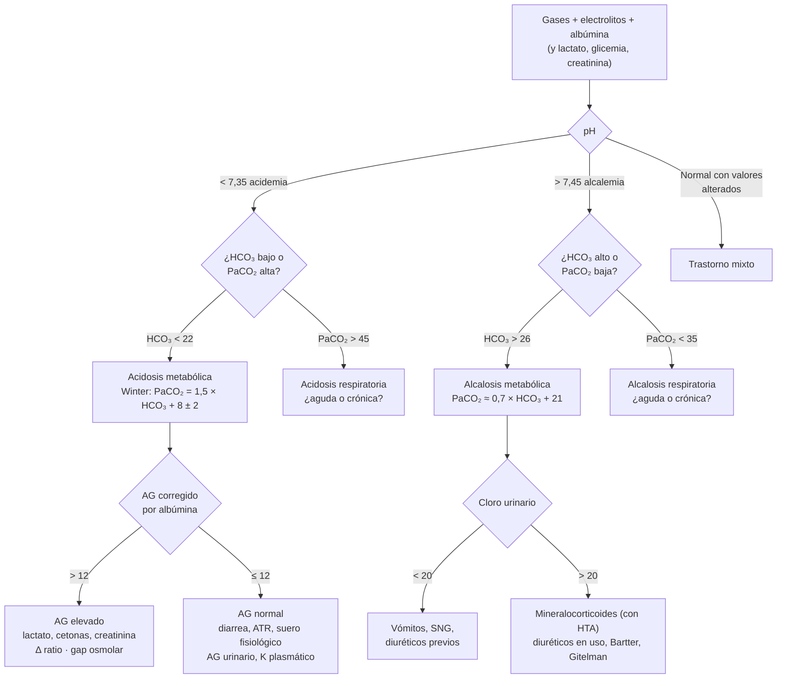

---
tags:
  - Nefrología
  - Medicina intensiva
  - Frecuente en sala
  - Urgencia
---

# Trastornos ácido-base

**Subespecialidad**
Nefrología · Medicina intensiva · Urgencia

**Guías principales**
Guía francesa de diagnóstico y manejo de la acidosis metabólica (SRLF/SFMU, 2019) · KDIGO 2024 ERC (acidosis metabólica crónica)

**Otras fuentes**
Ensayos BICAR-ICU (2018) y BICARICU-2 (JAMA 2025) · Metaanálisis de bicarbonato en el paciente crítico (Crit Care Med 2026) · EXTRIP (metformina) · Revisiones del NEJM (Berend 2014; Kraut y Madias 2014) · Core Curriculum AJKD 2022 (alcalosis metabólica)

**EUNACOM**
1.09.1.002 Acidosis metabólica (específico, inicial, derivar) · 1.09.1.003 Alcalosis metabólica (específico, inicial, completo) · 1.02.2.001 Acidosis láctica (específico, inicial, derivar) · 1.09.1.001 Acidosis e hiperkalemia en la ERC

**Revisado**
Septiembre 2026

!!! abstract "Resumen en 60 segundos"
    - Lee los gases **en orden**: (1) **pH** (¿acidemia o alcalemia?), (2) **trastorno primario** (¿HCO₃ o PaCO₂?), (3) **compensación esperada** (si no calza, hay un trastorno mixto), (4) **anión gap corregido por albúmina**, (5) **delta-delta**, (6) **gap osmolar** si el AG está alto sin causa clara.
    - **Acidosis metabólica con AG elevado**: **lactato**, **cetoacidosis**, **falla renal**, **tóxicos** (metanol, etilenglicol, salicilatos). **Con AG normal (hiperclorémica)**: **diarrea**, **acidosis tubular renal**, **suero fisiológico en grandes volúmenes**.
    - **Winter**: PaCO₂ esperada = **1,5 × HCO₃ + 8 ± 2**.
    - **Acidosis láctica**: lactato > 2 mmol/L es marcador de **gravedad**; tratar la **causa** (shock, sepsis, isquemia). Pensar en **metformina** si hay lesión renal aguda.
    - **Bicarbonato EV**: no de rutina. Considerarlo si **pH ≤ 7,20 con lesión renal aguda KDIGO 2–3** (reduce la necesidad de diálisis, sin efecto claro en la mortalidad), en pérdidas de bicarbonato mal toleradas y en intoxicaciones específicas.
    - **Alcalosis metabólica**: usa el **cloro urinario**: **< 20 mEq/L** (vómitos, SNG, diuréticos previos) → **suero fisiológico + KCl**; **> 20 mEq/L** → exceso de mineralocorticoides, diuréticos en uso, Bartter o Gitelman.

## Definición

| Término | Definición |
|---|---|
| **Acidemia / alcalemia** | pH arterial **< 7,35** / **> 7,45** (el estado de la sangre) |
| **Acidosis / alcalosis** | **Proceso** que tiende a bajar o subir el pH (puede haber más de uno a la vez) |
| **Acidosis metabólica** | **HCO₃ < 22 mEq/L** por ganancia de ácido o pérdida de bicarbonato |
| **Alcalosis metabólica** | **HCO₃ > 26–28 mEq/L** por pérdida de H⁺ o ganancia de bicarbonato, mantenida por el riñón |
| **Acidosis respiratoria** | **PaCO₂ > 45 mmHg** por hipoventilación alveolar |
| **Alcalosis respiratoria** | **PaCO₂ < 35 mmHg** por hiperventilación |
| **Hiperlactatemia / acidosis láctica** | Lactato **> 2 mmol/L**; acidosis láctica si además hay acidemia o HCO₃ bajo (habitualmente lactato **> 4–5 mmol/L**) |

**Valores normales (sangre arterial)**: pH 7,35–7,45 · PaCO₂ 35–45 mmHg · HCO₃ 22–26 mEq/L · anión gap 8–12 mEq/L (depende del laboratorio) · lactato < 2 mmol/L (< 18 mg/dL).

## Epidemiología

### Mundial

- Los trastornos ácido-base son muy frecuentes en los pacientes hospitalizados y **casi universales en la UCI**.
- La **acidemia grave** (pH < 7,20) metabólica o mixta se presenta en **~ 6 % de los ingresos a UCI** y se asocia a una **mortalidad de ~ 57 %**; importa más la **rapidez con que se corrige** que el pH inicial.
- La **hiperlactatemia** es el principal marcador de gravedad en la **sepsis** (lactato > 2 mmol/L con vasopresores define el **shock séptico**).
- La **alcalosis metabólica** se describe como el trastorno ácido-base más frecuente en los hospitalizados (vómitos, sonda nasogástrica, diuréticos).
- La **acidosis metabólica crónica** aumenta a medida que cae la VFG y es común en la **ERC con VFG < 30**.
- La **acidosis láctica asociada a metformina** es rara (~ 10 por 100.000 pacientes-año) pero con mortalidad alta (**16–50 %**).

### Chile

!!! chile "Datos nacionales"
    - No hay registros nacionales de trastornos ácido-base. Las causas más frecuentes en la sala y la urgencia son la **sepsis**, la **cetoacidosis diabética**, la **lesión renal aguda**, la **diarrea** y los **vómitos**.
    - La **metformina** es el fármaco de primera línea para la DM2 en el GES: hay que ajustarla o suspenderla si la **VFG es < 30 mL/min** o hay riesgo de **lesión renal aguda** (deshidratación, contraste, shock).
    - Los **iSGLT2** (empagliflozina, dapagliflozina) se usan cada vez más en diabetes, insuficiencia cardíaca y ERC: pueden causar **cetoacidosis euglicémica** (glicemia casi normal con AG elevado).
    - En el norte de Chile hay mucha **actividad minera sobre 3.000 m**: la **hipoxia de altura** causa **alcalosis respiratoria** (y el mal agudo de montaña se previene con **acetazolamida**, que produce acidosis metabólica hiperclorémica).
    - En la urgencia chilena se usan mucho los **gases venosos**: sirven para el pH, el HCO₃ y el lactato, pero **no para la oxigenación** ni para una PaCO₂ exacta.

## Etiología y fisiopatología

### Regulación normal

- Cada día se producen **~ 1 mEq/kg de ácidos fijos** (del metabolismo de las proteínas) y **~ 15.000 mmol de CO₂** (ácido volátil).
- **Tres líneas de defensa**:
    1. **Tampones** (segundos): bicarbonato/CO₂ en el plasma, hemoglobina, proteínas, fosfato y hueso.
    2. **Pulmón** (minutos a horas): ajusta la ventilación y la **PaCO₂**.
    3. **Riñón** (horas a días): **reabsorbe** el HCO₃ filtrado (80–90 % en el túbulo proximal) y **regenera** HCO₃ excretando **amonio (NH₄⁺)** y acidez titulable.
- **Ecuación de Henderson-Hasselbalch**: pH = 6,1 + log [HCO₃ / (0,03 × PaCO₂)]. En la práctica: **[H⁺] (nEq/L) = 24 × PaCO₂ / HCO₃** (útil para revisar la coherencia de un gas).

### Compensaciones esperadas

| Trastorno primario | Cambio primario | Compensación esperada |
|---|---|---|
| **Acidosis metabólica** | ↓ HCO₃ | **PaCO₂ = 1,5 × HCO₃ + 8 ± 2** (fórmula de Winter). Atajo: la PaCO₂ ≈ los 2 últimos dígitos del pH |
| **Alcalosis metabólica** | ↑ HCO₃ | **PaCO₂ sube 0,7 por cada 1 mEq/L que sube el HCO₃** (PaCO₂ ≈ 0,7 × HCO₃ + 21 ± 2); rara vez > 55 mmHg |
| **Acidosis respiratoria aguda** | ↑ PaCO₂ | HCO₃ sube **1** por cada 10 mmHg de PaCO₂ |
| **Acidosis respiratoria crónica** (> 3–5 días) | ↑ PaCO₂ | HCO₃ sube **3,5–4** por cada 10 mmHg |
| **Alcalosis respiratoria aguda** | ↓ PaCO₂ | HCO₃ baja **2** por cada 10 mmHg |
| **Alcalosis respiratoria crónica** | ↓ PaCO₂ | HCO₃ baja **4–5** por cada 10 mmHg |

!!! perla "La compensación nunca sobrecorrige"
    La compensación lleva el pH **hacia** lo normal, pero **no lo normaliza del todo ni lo pasa al otro lado** (salvo la alcalosis respiratoria crónica, que puede normalizarlo). Si el pH es normal con HCO₃ y PaCO₂ alterados, o la PaCO₂ medida no calza con la esperada, hay un **trastorno mixto**.

### Anión gap (AG)

- **AG = Na − (Cl + HCO₃)**. Normal: **8–12 mEq/L** (cada laboratorio tiene su valor; con los analizadores actuales puede ser menor).
- Representa los **aniones no medidos**, sobre todo la **albúmina**. **Corregir por albúmina**: **AG corregido = AG + 2,5 × (4 − albúmina en g/dL)**. Sin corregir, una hipoalbuminemia (cirrosis, desnutrición, sepsis) **esconde** una acidosis con AG elevado.
- Si se acumula un **ácido con un anión no medido** (lactato, cetoácidos, formato), el HCO₃ baja y el AG **sube**. Si se **pierde bicarbonato**, el riñón retiene **cloro** y el AG **no cambia** (acidosis **hiperclorémica**).

<figure markdown>
{ loading=lazy }
<figcaption>Figura 1. El anión gap como balance de cargas. En ambas acidosis el HCO₃ baja a 10 mEq/L, pero en una lo "reemplaza" un anión no medido (AG alto) y en la otra el cloro (AG normal). Esquema propio.</figcaption>
</figure>

### Delta-delta (¿hay otro trastorno metabólico escondido?)

En una acidosis con AG elevado, compara cuánto subió el AG con cuánto bajó el HCO₃:

- **Δ ratio = (AG − 12) / (24 − HCO₃)**
    - **< 1**: además hay una **acidosis con AG normal** (p. ej., cetoacidosis + diarrea, o fase de recuperación de la cetoacidosis).
    - **1–2**: acidosis con AG elevado **pura** (la láctica tiende a ~ 1,6; la cetoacidosis, a ~ 1).
    - **> 2**: además hay una **alcalosis metabólica** (p. ej., cetoacidosis con vómitos) o una acidosis respiratoria crónica compensada previa.
- Forma equivalente: **HCO₃ corregido = HCO₃ + (AG − 12)**. Si es > 26 hay alcalosis metabólica asociada; si es < 22, acidosis con AG normal asociada.

### Gap osmolar

- **Gap osmolar = osmolalidad medida − calculada** [2 × Na + glucosa/18 + BUN/2,8]. Normal < 10 mOsm/kg.
- **> 10–20**: sospechar **alcoholes tóxicos** (**metanol**, **etilenglicol**, propilenglicol, dietilenglicol) o etanol, manitol, glicerol. Un gap osmolar normal **no descarta** una intoxicación tardía (el alcohol ya se metabolizó a ácidos, que suben el AG).

### Causas de acidosis metabólica

| AG elevado (GOLDMARK) | AG normal (hiperclorémica) |
|---|---|
| **G**licoles (etilenglicol, propilenglicol) | **Diarrea**, fístulas y ostomías de alto débito, drenajes pancreáticos o biliares |
| **O**xoprolina (ácido piroglutámico: paracetamol crónico en desnutridos, sepsis, flucloxacilina) | **Acidosis tubular renal** (tipos 1, 2 y 4) |
| **L-lactato** (acidosis láctica) | **Suero fisiológico** en grandes volúmenes (acidosis dilucional o hiperclorémica) |
| **D-lactato** (síndrome de intestino corto) | **ERC** en etapas iniciales |
| **M**etanol | **Inhibidores de la anhidrasa carbónica** (acetazolamida, topiramato) |
| **A**spirina (salicilatos) | Derivaciones urinarias al intestino (ureterosigmoidostomía) |
| **R**enal: lesión renal aguda o ERC avanzada | **Recuperación de la cetoacidosis** (los cetoaniones se pierden en la orina) |
| **K**etoacidosis (cetoacidosis): diabética, **alcohólica**, por ayuno, **euglicémica por iSGLT2** | Nutrición parenteral, cloruro de amonio |

#### Acidosis tubular renal (ATR)

| | **ATR 1 (distal)** | **ATR 2 (proximal)** | **ATR 4 (hipoaldosteronismo)** |
|---|---|---|---|
| Defecto | No secreta H⁺ en el túbulo distal | No reabsorbe HCO₃ en el túbulo proximal | Falta de aldosterona o resistencia a ella |
| K plasmático | **Bajo** | **Bajo** | **Alto** |
| pH urinario | **> 5,5** siempre | Variable (< 5,5 cuando el HCO₃ baja lo suficiente) | < 5,5 |
| Hallazgos asociados | **Nefrocalcinosis**, **litiasis** | **Síndrome de Fanconi** (glucosuria con glicemia normal, fosfaturia, aminoaciduria), osteomalacia | Hiperkalemia desproporcionada a la VFG |
| Causas en adultos | **Sjögren**, LES, anfotericina B, litio, hipercalciuria | **Mieloma múltiple**, tenofovir, ifosfamida, acetazolamida | **Nefropatía diabética**, IECA/ARA-II, espironolactona, AINE, trimetoprim, heparina, Addison |

- **Anión gap urinario** (Na + K − Cl en orina aislada) estima la excreción de **amonio**: **negativo** (−20 a −50) en la **diarrea** (el riñón responde bien y excreta NH₄Cl); **positivo** en la **ATR distal** (el riñón no excreta amonio). Úsalo sólo si la causa no es obvia.

### Acidosis láctica

| Tipo | Mecanismo | Causas |
|---|---|---|
| **A** (hipoxia tisular) | Menor aporte de O₂ | **Shock** (séptico, cardiogénico, hipovolémico), **paro cardiorrespiratorio**, **isquemia mesentérica** o de extremidades, anemia extrema, **intoxicación por CO o cianuro**, convulsiones, ejercicio extremo |
| **B1** (enfermedad) | Menor depuración o mayor producción | **Insuficiencia hepática**, **sepsis** (además de la hipoperfusión: estimulación adrenérgica), **cáncer** (linfomas, leucemias: efecto Warburg), cetoacidosis |
| **B2** (fármacos y tóxicos) | Alteran la función mitocondrial | **Metformina** (sobre todo con lesión renal aguda), **adrenalina** y **salbutamol** en altas dosis, linezolid, antirretrovirales antiguos (análogos de nucleósidos), **propofol** (síndrome por infusión), **alcoholes tóxicos**, cianuro (nitroprusiato) |
| **B3** | Errores congénitos | Enfermedades mitocondriales |
| — | **Déficit de tiamina** | Alcoholismo, desnutrición, nutrición parenteral sin vitaminas |

- La **acidosis D-láctica** ocurre en el **síndrome de intestino corto**: las bacterias del colon fermentan carbohidratos. Da **encefalopatía** episódica tras comidas ricas en carbohidratos, y el lactato del laboratorio (L-lactato) sale **normal**.

### Alcalosis metabólica

Para que persista se necesitan dos cosas:

1. **Generación**: pérdida de H⁺ (**vómitos**, **sonda nasogástrica**, **diuréticos**, exceso de mineralocorticoides), aporte de álcali (bicarbonato, **citrato** de transfusiones masivas, carbonato de calcio) o **contracción de volumen** alrededor de un HCO₃ constante.
2. **Mantención** (el riñón no elimina el exceso de HCO₃): **depleción de volumen y de cloro**, **hipokalemia**, **hiperaldosteronismo** o **VFG baja**.

| **Cloro urinario < 20 mEq/L** (responde a cloro y volumen) | **Cloro urinario > 20 mEq/L** (no responde) |
|---|---|
| **Vómitos**, **aspiración nasogástrica** | **Con HTA**: **hiperaldosteronismo primario**, estenosis de arteria renal, **Cushing**, **regaliz**, síndrome de Liddle |
| **Diuréticos** (después de que termina su efecto) | **Sin HTA**: **diuréticos en uso**, **Bartter**, **Gitelman**, **hipokalemia** grave (< 2), hipomagnesemia |
| **Alcalosis post-hipercápnica** (EPOC ventilado que baja su PaCO₂ muy rápido) | **Carga de álcali** con falla renal: **síndrome leche-álcali** (carbonato de calcio), bicarbonato, citrato |
| Adenoma velloso, cloridorrea congénita, fibrosis quística | |

!!! perla "Vómitos: el sodio urinario engaña"
    En los primeros días de vómitos, el riñón excreta **bicarbonato de sodio** (bicarbonaturia): el **Na urinario puede estar alto** pese a la hipovolemia. El **cloro urinario** (< 20) es el mejor indicador de depleción de volumen en la alcalosis metabólica.

### Trastornos respiratorios

| **Acidosis respiratoria** (hipoventilación) | **Alcalosis respiratoria** (hiperventilación) |
|---|---|
| **Depresión del centro respiratorio**: opioides, benzodiacepinas, alcohol, ACV de tronco, **oxígeno excesivo en el retenedor de CO₂** | **Hipoxemia**: neumonía, **TEP**, edema pulmonar, **altura** |
| **Neuromuscular**: Guillain-Barré, miastenia gravis, ELA, hipokalemia o hipofosfatemia graves | **Estímulo central**: **ansiedad**, **dolor**, **fiebre**, **sepsis precoz**, ACV, embarazo (progesterona), **cirrosis**, **salicilatos** |
| **Pared torácica**: cifoescoliosis, **síndrome de obesidad-hipoventilación** | Ventilación mecánica excesiva |
| **Vía aérea y pulmón**: **EPOC**, **asma grave** (una PaCO₂ "normal" en una crisis asmática es un signo de **agotamiento**), fatiga respiratoria | Hipertiroidismo |

### Trastornos mixtos frecuentes

| Situación | Trastornos |
|---|---|
| **Intoxicación por salicilatos** | Alcalosis respiratoria + acidosis metabólica con AG elevado |
| **Sepsis** | Acidosis láctica + alcalosis respiratoria |
| **Paro cardiorrespiratorio**, edema pulmonar grave | Acidosis metabólica (láctica) + acidosis respiratoria |
| **Cetoacidosis con vómitos** | Acidosis con AG elevado + alcalosis metabólica (Δ ratio > 2) |
| **EPOC con diuréticos** o corticoides | Acidosis respiratoria crónica + alcalosis metabólica |
| **Cirrosis con vómitos o diuréticos** | Alcalosis respiratoria + alcalosis metabólica |

## Clasificación

- **Por el pH**: acidemia o alcalemia.
- **Por el origen**: metabólico o respiratorio.
- **Por la compensación**: simple (compensado como se espera) o **mixto**.
- **Acidosis metabólica**: con **AG elevado** o **AG normal** (hiperclorémica).
- **Alcalosis metabólica**: **sensible al cloro** (Cl urinario < 20) o **resistente al cloro** (Cl urinario > 20, con o sin HTA).
- **Respiratorios**: **agudos** o **crónicos** según la compensación renal.
- **Por la gravedad** (orientativa): acidemia **grave pH < 7,20** (riesgo de depresión miocárdica, arritmias, vasodilatación y resistencia a los vasopresores); alcalemia **grave pH > 7,55–7,60** (arritmias, convulsiones, hipoventilación).

## Clínica

- **Acidemia grave**: **respiración de Kussmaul** (profunda y rápida), náuseas, vómitos, dolor abdominal, **compromiso de conciencia**, **hipotensión** y menor respuesta a las catecolaminas, **arritmias**, **hiperkalemia** (en la acidosis mineral).
- **Acidosis metabólica crónica** (ERC): **pérdida de masa muscular**, **enfermedad ósea**, progresión de la ERC, retraso del crecimiento en niños.
- **Alcalemia**: **parestesias** peribucales y distales, **calambres**, **tetania** (baja el calcio ionizado), **arritmias** (sobre todo con hipokalemia o digoxina), confusión, **convulsiones**, **hipoventilación** compensatoria (hipoxemia).
- **Hipercapnia**: cefalea, somnolencia, **asterixis**, confusión, **"narcosis por CO₂"**, vasodilatación (piel caliente, papiledema).
- **Claves de la causa**: fondo de ojo con **edema de papila o visión borrosa** ("como en una tormenta de nieve") en el **metanol**; **cristales de oxalato** en la orina, hipocalcemia y lesión renal aguda en el **etilenglicol**; **tinnitus**, fiebre e hiperventilación en los **salicilatos**; **aliento cetónico** en la cetoacidosis.

## Diagnóstico

### Lectura de los gases paso a paso

1. **¿Es coherente?** Revisa que [H⁺] ≈ 24 × PaCO₂ / HCO₃ (pH 7,40 = 40 nEq/L; cada 0,01 de pH ≈ 1 nEq/L en el rango 7,20–7,50).
2. **pH**: acidemia o alcalemia.
3. **Trastorno primario**: el que explica la dirección del pH.
4. **Compensación**: calcula la esperada (tabla). Si no calza, hay un **segundo trastorno**.
5. **AG corregido** (siempre, aunque el pH sea normal).
6. Si el AG está alto: **Δ ratio** y, si no hay lactato, cetonas ni uremia que lo expliquen, **gap osmolar**.
7. Si el AG es normal: **K plasmático**, **pH urinario** y **AG urinario**.
8. **Buscar la causa** con la clínica.

<figure markdown>
![Algoritmo de la guía francesa para el diagnóstico etiológico de la acidemia metabólica: con bicarbonato menor de 20 y pH menor de 7,38, calcular la PaCO2 esperada, luego el anión gap corregido por albúmina; si está elevado, medir lactato, cetonas o salicilatos y calcular el gap osmolar, que si es mayor de 10 sugiere etilenglicol, metanol, propilenglicol o dietilenglicol; si el anión gap es normal, calcular el anión gap urinario: negativo en soluciones ricas en cloro, pérdidas digestivas, acidosis tubular proximal y acetazolamida; positivo o cero en la acidosis tubular distal tipo 1 o 4](../assets/figuras/acido-base/algoritmo-acidosis-metabolica-jung-2019.jpg){ loading=lazy }
<figcaption>Figura 2. Algoritmo recomendado por el panel de expertos francés para el diagnóstico etiológico de la acidemia metabólica (opinión de expertos). Usa el AG corregido con la albúmina en g/L: + 0,25 × (40 − albúmina). Fuente: Jung B, Martinez M, Claessens YE, et al. Diagnosis and management of metabolic acidosis: guidelines from a French expert panel. <em>Ann Intensive Care</em>. 2019;9:92. Licencia <a href="https://creativecommons.org/licenses/by/4.0/">CC BY 4.0</a>. Texto de la figura en inglés.</figcaption>
</figure>

### Ejemplo resuelto

!!! example "Paciente séptico: pH 7,22 · PaCO₂ 24 · HCO₃ 10 · Na 138 · Cl 100 · albúmina 4,0 g/dL"
    1. **Acidemia** (pH 7,22) con **HCO₃ bajo** → **acidosis metabólica**.
    2. **Winter**: 1,5 × 10 + 8 = **23 ± 2** (21–25). PaCO₂ 24 → **compensación adecuada**.
    3. **AG** = 138 − (100 + 10) = **28** (elevado).
    4. **Δ ratio** = (28 − 12) / (24 − 10) = 16/14 ≈ **1,1** → acidosis con AG elevado **pura**.
    5. Causa probable: **acidosis láctica** por shock séptico → medir lactato, reanimar y controlar el foco.

## Laboratorio

| Examen | Para qué |
|---|---|
| **Gases arteriales** | pH, PaCO₂ y HCO₃ exactos; oxigenación (PaO₂). Imprescindibles en los trastornos respiratorios |
| **Gases venosos** | pH (~ 0,03 menor) y HCO₃ (~ 1–2 mayor) útiles; **PvCO₂ ~ 4–6 mmHg mayor** que la arterial; no sirven para la oxigenación |
| **Electrolitos** (Na, K, Cl) y **albúmina** | AG corregido; hipokalemia o hiperkalemia asociadas |
| **Lactato** (arterial o venoso) | Un lactato venoso normal descarta la hiperlactatemia; si está alto, confirmar con arterial. **No usar lactato capilar** |
| **Cetonemia** (β-hidroxibutirato capilar o plasmático) | Preferible a la cetonuria (la tira de orina no mide β-hidroxibutirato) |
| **Glicemia, creatinina, BUN** | Cetoacidosis, falla renal |
| **Osmolalidad plasmática medida** | Gap osmolar (alcoholes tóxicos) |
| **Niveles de salicilato, paracetamol, etanol, metanol**; **CK** | Según sospecha |
| **Orina**: pH, Na, K, Cl, (AG urinario) | Cloro urinario en la alcalosis; ATR en la acidosis con AG normal |
| **Magnesio y fósforo** | Hipomagnesemia (alcalosis con hipokalemia refractaria), hipofosfatemia |

## Imágenes

- No hay un examen de imagen propio del trastorno; las imágenes buscan la **causa**:
    - **Radiografía de tórax** (neumonía, edema, EPOC) en los trastornos respiratorios.
    - **Angio-TC de abdomen** si la acidosis láctica sugiere **isquemia mesentérica** (dolor desproporcionado al examen, fibrilación auricular).
    - **Ecografía renal** (nefrocalcinosis en la ATR 1; obstrucción en la lesión renal aguda).
    - **TC de cerebro** en la intoxicación por metanol (necrosis de los ganglios basales, sobre todo del putamen).

## Diagnóstico diferencial

- **HCO₃ bajo**: acidosis metabólica **o compensación de una alcalosis respiratoria crónica** (el pH lo distingue).
- **HCO₃ alto**: alcalosis metabólica **o compensación de una acidosis respiratoria crónica** (EPOC).
- **AG bajo o negativo**: hipoalbuminemia, **mieloma múltiple** (paraproteína catiónica IgG), intoxicación por litio o bromuro, hipercalcemia o hipermagnesemia graves.
- **Lactato alto sin acidosis**: agonistas β2, adrenalina, convulsión reciente, muestra mal tomada (ligadura prolongada).

## Tratamiento

!!! guia "Principio general"
    El tratamiento es **el de la causa**: reanimar el shock, controlar el foco séptico, dar insulina y volumen en la cetoacidosis, detener la diarrea, suspender el fármaco. El bicarbonato EV **no trata la causa** y tiene indicaciones precisas.

### Acidosis metabólica aguda

- **Acidosis láctica**:
    - **Reanimación**: volumen, **vasopresores** (noradrenalina), **control del foco**, transfusión si hay anemia grave. Medir el lactato **seriado** (a las 2–6 horas) para evaluar la respuesta.
    - **Tiamina** en alcohólicos y desnutridos.
    - **Metformina**: suspenderla; **hemodiálisis** precoz si hay disfunción orgánica, **lactato > 20 mmol/L**, **pH ≤ 7,0**, shock o falla del tratamiento estándar (EXTRIP).
- **Cetoacidosis**: insulina, volumen y potasio (ver [Cetoacidosis y estado hiperglicémico hiperosmolar](../endocrinologia/cetoacidosis-y-estado-hiperosmolar.md)). El bicarbonato **no se recomienda** salvo acidemia extrema.
- **Cetoacidosis alcohólica y por ayuno**: suero glucosado con **tiamina** (antes de la glucosa) y volumen; no necesita insulina.
- **Metanol y etilenglicol**: **fomepizol** (o **etanol** si no hay) para bloquear la alcohol deshidrogenasa, **hemodiálisis** si el AG es > 20 mEq/L, hay lesión renal aguda o alteraciones visuales, y bicarbonato; en el metanol, **ácido fólico**; en el etilenglicol, **tiamina** y **piridoxina**. Llamar al centro de toxicología (**CITUC**, +56 2 2635 3800).
- **Salicilatos**: **alcalinizar la orina** con bicarbonato (cualquiera sea el pH), reponer potasio; **hemodiálisis** si hay compromiso neurológico, salicilemia > 90 mg/dL o pH ≤ 7,20.
- **Acidosis hiperclorémica por suero fisiológico**: cambiar a **cristaloides balanceados** (Ringer lactato, Plasma-Lyte). En los pacientes críticos, los cristaloides balanceados redujeron el compuesto de muerte, diálisis o disfunción renal persistente frente al suero fisiológico (ensayo SMART).

!!! dosis "Bicarbonato de sodio EV: cuándo y cuánto"
    **Indicaciones con respaldo**:

    - **pH ≤ 7,20, PaCO₂ < 45 y lesión renal aguda KDIGO 2–3** en la UCI: el bicarbonato (meta **pH ≥ 7,30**) **reduce la necesidad de diálisis** (35 % vs 50 % en BICARICU-2). **No mejoró la mortalidad** a 90 días en BICARICU-2 (JAMA 2025); el beneficio en supervivencia se había visto en un subgrupo de BICAR-ICU (2018). Un metaanálisis de 2026 confirmó la menor necesidad de diálisis, con un efecto sobre la mortalidad aún incierto.
    - **Pérdida de bicarbonato** (diarrea, ATR) **mal tolerada**.
    - **Hiperkalemia** con acidosis metabólica grave; **intoxicaciones** por salicilatos o por fármacos que bloquean los canales de sodio (antidepresivos tricíclicos).

    **No se recomienda**: de rutina en la **acidosis láctica**, en la **cetoacidosis** ni en el **paro cardiorrespiratorio** (salvo hiperkalemia o tóxicos específicos).

    **Cómo**:

    - En los ensayos se usó **bicarbonato al 4,2 %: 125–250 mL en 30 minutos**, repetido según el pH (máximo 1.000 mL/día).
    - **Déficit estimado de HCO₃ (mEq) = 0,5 × peso (kg) × (HCO₃ deseado − HCO₃ actual)**; dar la mitad y volver a medir. El **bicarbonato al 8,4 %** tiene **1 mEq/mL**.
    - **Riesgos**: **sobrecarga de volumen** e hipernatremia (es sodio hipertónico), **hipokalemia**, **hipocalcemia** ionizada (tetania, arritmias), aumento de la PaCO₂ si el paciente no puede ventilar más (acidosis intracelular paradójica).
    - La **ventilación** debe compensar: en el paciente intubado, subir la frecuencia respiratoria (máximo ~ 35/min) sin generar auto-PEEP. **No intubar** "de rutina" a un paciente que compensa bien (perdería su hiperventilación).

- **Terapia de reemplazo renal** en el shock o la lesión renal aguda si el **pH es ≤ 7,15** pese al tratamiento, en las intoxicaciones dializables o si la acidosis se acompaña de sobrecarga de volumen o hiperkalemia refractaria.

### Acidosis metabólica crónica (ERC)

- **KDIGO 2024**: considerar el tratamiento con **bicarbonato de sodio oral** (con o sin cambios en la dieta) si el **HCO₃ es < 18 mEq/L**, y vigilar que no supere el límite normal. Muchos nefrólogos lo inician desde < 22 mEq/L (KDIGO 2012), sobre todo si hay hiperkalemia.
- Dosis habitual: **bicarbonato de sodio 0,5–1 mEq/kg/día** VO, repartido en 2–3 tomas (1 g = 12 mEq).
- **Dieta** con más frutas y verduras (menor carga ácida), si el potasio lo permite.

### Alcalosis metabólica

- **Cloro urinario < 20 mEq/L (sensible al cloro)**:
    - **Suero fisiológico** (aporta volumen y cloro) y **KCl**.
    - Suspender o bajar el **diurético**; antieméticos; **inhibidores de la bomba de protones** si hay aspiración nasogástrica prolongada.
- **Alcalosis con sobrecarga de volumen** (insuficiencia cardíaca con diuréticos): **acetazolamida 250–500 mg** VO o EV 1–2 veces al día (aumenta la excreción de HCO₃), reponer K.
- **Cloro urinario > 20 mEq/L**:
    - **Hiperaldosteronismo**: **espironolactona** o **amilorida**, y tratar la causa (cirugía de un adenoma).
    - **Bartter, Gitelman**: KCl, magnesio, espironolactona o amilorida.
    - **Síndrome leche-álcali**: suspender el carbonato de calcio, volumen.
- **Alcalemia grave refractaria** (pH > 7,55–7,60 con arritmias o convulsiones): ácido clorhídrico diluido (0,1–0,2 N) por vía venosa central o **hemodiálisis** con baño bajo en bicarbonato. Rara vez necesario.
- **Alcalosis post-hipercápnica**: bajar la PaCO₂ **gradualmente** en el EPOC ventilado; acetazolamida si persiste.

### Trastornos respiratorios

- **Acidosis respiratoria**: tratar la causa y **ventilar**. **Ventilación no invasiva** en la exacerbación de EPOC con **pH < 7,35 y PaCO₂ > 45** (ver [EPOC](../respiratorio/epoc.md)); **naloxona** en la intoxicación por opioides; oxígeno con meta **SpO₂ 88–92 %** en los retenedores de CO₂. **No dar bicarbonato** para una acidosis respiratoria.
- **Alcalosis respiratoria**: tratar la causa (hipoxemia, dolor, fiebre, sepsis, **TEP**). En la hiperventilación ansiosa, **descartar primero causas orgánicas** (TEP, sepsis, cetoacidosis, salicilatos); no hacer respirar en una bolsa (riesgo de hipoxemia).

## Complicaciones

- **Acidemia grave**: shock refractario, arritmias, depresión miocárdica, hiperkalemia, resistencia a la insulina, alteración de conciencia.
- **Alcalemia grave**: arritmias, convulsiones, tetania, **hipokalemia**, hipocalcemia ionizada, **hipoventilación** con hipoxemia.
- **Del tratamiento**: sobrecarga de volumen, hipernatremia, hipokalemia e hipocalcemia (bicarbonato); **alcalosis de rebote** al metabolizarse el lactato o los cetoácidos después de dar bicarbonato; **hipercloremia** (suero fisiológico).

## Pronóstico y seguimiento

- El pronóstico depende de la **causa**: la acidemia grave en la UCI tiene **mortalidad > 50 %**; un **lactato que no baja** en las primeras horas es un signo de mal pronóstico.
- **Acidosis metabólica** (seguimiento: derivar): acidosis tubular renal, ERC y sospecha de tóxicos se derivan a nefrología o toxicología.
- **Alcalosis metabólica** (seguimiento completo): controlar K, Cl, HCO₃ y función renal tras suspender el diurético o corregir los vómitos; estudiar **hiperaldosteronismo** si hay HTA.
- **ERC**: medir el HCO₃ en cada control; mantenerlo en rango normal con bicarbonato oral según KDIGO.

## Perlas para el internado

!!! perla "Para la sala y el turno"
    - **Siempre calcula el AG** y **corrígelo por la albúmina**: en un paciente con albúmina 2 g/dL, un AG "normal" de 12 es en realidad **17**.
    - Una **PaCO₂ que no baja** lo esperado en una acidosis metabólica indica **fatiga respiratoria** inminente: avisa a la UCI.
    - **Lactato alto + metformina + lesión renal aguda** = pensar en acidosis láctica por metformina y en **diálisis precoz**.
    - **Cetoacidosis con glicemia de 180 mg/dL en un usuario de iSGLT2**: es real (**cetoacidosis euglicémica**). Mide la cetonemia.
    - En la alcalosis metabólica, **el cloro urinario** manda: < 20 → **suero fisiológico con KCl**.
    - Un **EPOC con HCO₃ de 34** puede estar compensando una hipercapnia crónica: no es un error ni una alcalosis que haya que "tratar".
    - Grandes volúmenes de **suero fisiológico** causan acidosis hiperclorémica: prefiere **Ringer lactato** en la reanimación (salvo hiponatremia grave o TEC).

## Preguntas de repaso

??? repaso "1. Mujer de 72 años usuaria de metformina, con diarrea de 4 días. pH 7,08 · PaCO₂ 17 · HCO₃ 5 · Na 136 · Cl 98 · lactato 14 mmol/L · creatinina 4,2 mg/dL. ¿Qué tiene y qué haces?"
    **Acidosis metabólica con AG elevado** (AG = 136 − 103 = 33) con **compensación adecuada** (Winter: 1,5 × 5 + 8 = 15,5 ± 2; la PaCO₂ de 17 calza). Δ ratio = 21/19 ≈ 1,1: pura. Por lactato alto, metformina y **lesión renal aguda** (diarrea): **acidosis láctica asociada a metformina**. Suspender la metformina, reanimar con volumen y **hemodiálisis precoz** (acidemia grave con lesión renal aguda y lactato alto, criterios EXTRIP); UCI.

??? repaso "2. Hombre de 40 años con diarrea profusa: pH 7,28 · PaCO₂ 30 · HCO₃ 14 · Na 138 · Cl 114 · K 3,0. AG urinario −30. ¿Diagnóstico?"
    **Acidosis metabólica con AG normal** (AG = 138 − 128 = 10), **hiperclorémica**, con compensación adecuada (Winter: 29 ± 2). El **AG urinario negativo** indica que el riñón excreta amonio normalmente: causa **extrarrenal** (**diarrea**), no una acidosis tubular distal. Tratamiento: volumen (cristaloides balanceados), KCl y tratar la diarrea; bicarbonato sólo si es mal tolerada.

??? repaso "3. Mujer de 55 años con vómitos de 5 días: pH 7,52 · PaCO₂ 47 · HCO₃ 38 · K 2,8 · Cl urinario 8 mEq/L. ¿Diagnóstico y tratamiento?"
    **Alcalosis metabólica** compensada (PaCO₂ esperada ≈ 0,7 × 38 + 21 = 47,6) **sensible al cloro** (Cl urinario < 20) por **vómitos**, con hipokalemia. Tratamiento: **suero fisiológico** (volumen y cloro), **KCl**, antieméticos y tratar la causa de los vómitos.

??? repaso "4. Paciente con EPOC: pH 7,25 · PaCO₂ 75 · HCO₃ 32. ¿Es aguda, crónica o crónica reagudizada?"
    Acidosis respiratoria. Si fuera **aguda**, el HCO₃ esperado sería 24 + 1 × 3,5 ≈ **27,5**; si fuera **crónica**, 24 + 3,5 × 3,5 ≈ **36**. El HCO₃ medido (32) está entre ambos: **acidosis respiratoria crónica reagudizada** (exacerbación de EPOC). Indicación de **ventilación no invasiva** (pH < 7,35 con PaCO₂ > 45).

??? repaso "5. Paciente con cetoacidosis diabética: HCO₃ 10, AG 30. ¿Qué significa un Δ ratio de 1,3? ¿Y si el HCO₃ fuera 20 con el mismo AG?"
    Con HCO₃ 10: Δ ratio = (30 − 12)/(24 − 10) = 18/14 ≈ **1,3** → acidosis con AG elevado **pura**. Con HCO₃ 20: Δ ratio = 18/4 = **4,5** → el HCO₃ bajó mucho menos de lo esperado: hay una **alcalosis metabólica** asociada (típicamente por **vómitos**). El HCO₃ corregido sería 20 + 18 = 38 (> 26).

??? repaso "6. ¿Cuándo está indicado el bicarbonato EV en la acidosis metabólica y qué mostró BICARICU-2?"
    No de rutina (no en la acidosis láctica ni en la cetoacidosis). Se considera en la acidemia grave (**pH ≤ 7,20**) con **lesión renal aguda KDIGO 2–3**, en pérdidas de bicarbonato mal toleradas, en la hiperkalemia con acidosis grave y en intoxicaciones (salicilatos, tricíclicos). **BICARICU-2** (JAMA 2025, 627 pacientes con pH ≤ 7,20 y lesión renal aguda): **no redujo la mortalidad a 90 días** (62 % vs 62 %), pero **redujo el uso de diálisis** (35 % vs 50 %).

## Referencias

1. Jung B, Martinez M, Claessens YE, et al. Diagnosis and management of metabolic acidosis: guidelines from a French expert panel. *Ann Intensive Care.* 2019;9:92. doi:[10.1186/s13613-019-0563-2](https://doi.org/10.1186/s13613-019-0563-2)
2. Jaber S, Paugam C, Futier E, et al. Sodium bicarbonate therapy for patients with severe metabolic acidaemia in the intensive care unit (BICAR-ICU): a multicentre, open-label, randomised controlled, phase 3 trial. *Lancet.* 2018;392:31–40.
3. Jung B, Jabaudon M, De Jong A, et al. Sodium Bicarbonate for Severe Metabolic Acidemia and Acute Kidney Injury: The BICARICU-2 Randomized Clinical Trial. *JAMA.* 2025;334(22):2000–2010. doi:[10.1001/jama.2025.20231](https://doi.org/10.1001/jama.2025.20231)
4. Chen JJ, Lee TH, Chang CH, et al. Sodium Bicarbonate for Acute Metabolic Acidosis in Critically Ill Adults: A Meta-Analysis of Randomized Clinical Trials. *Crit Care Med.* 2026;54(8):1870–1877.
5. Jung B, Rimmele T, Le Goff C, et al. Severe metabolic or mixed acidemia on intensive care unit admission: incidence, prognosis and administration of buffer therapy. *Crit Care.* 2011;15:R238.
6. Berend K, de Vries AP, Gans RO. Physiological approach to assessment of acid-base disturbances. *N Engl J Med.* 2014;371:1434–1445.
7. Kraut JA, Madias NE. Lactic acidosis. *N Engl J Med.* 2014;371:2309–2319.
8. Do C, Vasquez PC, Soleimani M. Metabolic Alkalosis Pathogenesis, Diagnosis, and Treatment: Core Curriculum 2022. *Am J Kidney Dis.* 2022;80:536–551.
9. Calello DP, Liu KD, Wiegand TJ, et al. Extracorporeal Treatment for Metformin Poisoning: Systematic Review and Recommendations From the Extracorporeal Treatments in Poisoning Workgroup. *Crit Care Med.* 2015;43:1716–1730.
10. Semler MW, Self WH, Wanderer JP, et al. Balanced Crystalloids versus Saline in Critically Ill Adults (SMART). *N Engl J Med.* 2018;378:829–839.
11. Kidney Disease: Improving Global Outcomes (KDIGO) CKD Work Group. KDIGO 2024 Clinical Practice Guideline for the Evaluation and Management of Chronic Kidney Disease. *Kidney Int.* 2024;105(4S):S117–S314.
