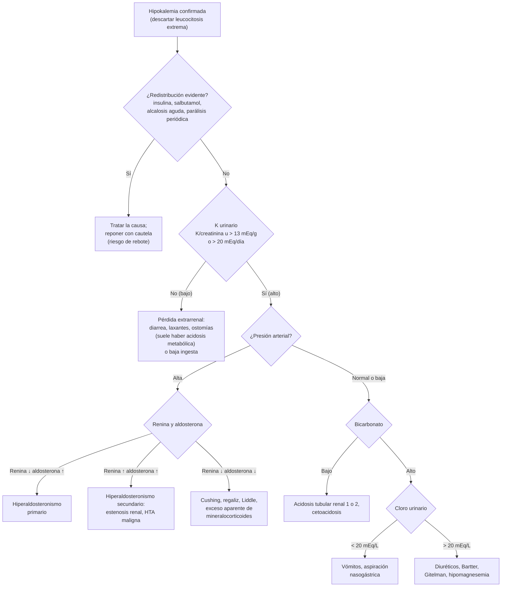
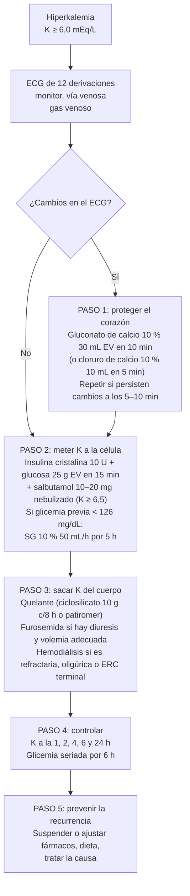

---
tags:
  - Nefrología
  - Frecuente en sala
  - Urgencia
---

# Hipokalemia e hiperkalemia

**Subespecialidad**
Nefrología · Urgencia · Paciente hospitalizado

**Guías principales**
UK Kidney Association (UKKA) 2023: tratamiento de la hiperkalemia aguda en adultos · European Resuscitation Council (ERC) 2025: circunstancias especiales

**Otras fuentes**
Conferencia de controversias KDIGO 2020 sobre potasio · KDIGO 2024 ERC · Endocrine Society 2025 (hiperaldosteronismo primario) · Revisiones de Kardalas 2018 y Dépret 2019

**EUNACOM**
1.09.2.005 Hiperkalemia grave (específico, completo, derivar) · 1.09.2.006 Hipokalemia (específico, completo, completo) · 1.09.1.001 Acidosis e hiperkalemia en la ERC

**Revisado**
Septiembre 2026

!!! abstract "Resumen en 60 segundos"
    - El **98 % del potasio es intracelular**. La kalemia depende del **balance externo** (ingesta y excreción renal) y de la **distribución** entre células y plasma (insulina, catecolaminas, pH).
    - **Hiperkalemia** (K ≥ 5,5 mEq/L; **grave ≥ 6,5**): casi siempre hay **falla renal** y/o **fármacos** (IECA, ARA-II, espironolactona, AINE, trimetoprim). Primero descarta la **pseudohiperkalemia** (hemólisis).
    - **ECG** de inmediato. Tratamiento en 3 pasos: **(1) estabilizar la membrana** con **gluconato de calcio 10 % 30 mL EV en 10 min** si hay cambios en el ECG; **(2) meter el K a la célula** con **insulina cristalina 10 U + 25 g de glucosa** ± **salbutamol nebulizado 10–20 mg**; **(3) sacar el K del cuerpo** con quelantes, diuréticos o **hemodiálisis**.
    - **Hipokalemia** (K < 3,5 mEq/L; **grave < 2,5**): diuréticos, vómitos y diarrea son las causas más frecuentes. Siempre medir y **corregir el magnesio**.
    - Reposición: **oral** si es leve; **EV** si es grave, sintomática o con arritmias: **KCl ≤ 10 mEq/h por vía periférica**, diluido en **suero fisiológico**, **nunca en bolo**.
    - Hipokalemia + **hipertensión** → sospechar **hiperaldosteronismo primario** (medir aldosterona y renina).

## Definición

| Trastorno | Definición | Gravedad (adultos) |
|---|---|---|
| **Hipokalemia** | **K plasmático < 3,5 mEq/L** | **Leve** 3,0–3,4 · **moderada** 2,5–2,9 · **grave < 2,5** (o cualquier valor con síntomas o cambios en el ECG) |
| **Hiperkalemia** | **K ≥ 5,5 mEq/L** (definición ERC y UKKA; muchos laboratorios usan > 5,0) | **Leve** 5,5–5,9 · **moderada** 6,0–6,4 · **grave ≥ 6,5 mEq/L** (UKKA 2023) |

- 1 mEq de K = 1 mmol (el potasio es monovalente): los valores en mmol/L de las guías inglesas se leen igual en mEq/L.
- El **K sérico** (tubo sin anticoagulante) es ~ 0,1–0,5 mEq/L mayor que el **K plasmático** (tubo con heparina), porque las plaquetas liberan K al coagular.
- La **gravedad clínica** depende del valor, de la **velocidad de cambio** y de la presencia de **cambios en el ECG**, no sólo de la cifra.

## Epidemiología

### Mundial

- **Hipokalemia**: la alteración electrolítica más frecuente junto con la hiponatremia. Se encuentra en hasta **~ 20 % de los hospitalizados**, aunque es clínicamente significativa en ~ 4–5 %. Es muy común en usuarios de **diuréticos tiazídicos y de asa**.
- **Hiperkalemia**: incidencia en hospitalizados de **1–10 %**. En la población general (K > 5,5) es de **~ 0,5 %**, y de **~ 4 %** en la ERC; aumenta a medida que cae la VFG (consorcio CKD-PC).
- La relación entre kalemia y mortalidad tiene **forma de U**. La mortalidad intrahospitalaria es de **~ 18 %** con hiperkalemia (vs ~ 4 % con normokalemia) y **> 30 %** con hiperkalemia grave (> 6,5).
- El uso creciente de **bloqueo del sistema renina-angiotensina-aldosterona (SRAA)** en ERC, diabetes e insuficiencia cardíaca aumenta la hiperkalemia, que a su vez lleva a **suspender fármacos que reducen la mortalidad**.

### Chile

!!! chile "Datos nacionales"
    - No hay registros nacionales de trastornos del potasio. Las causas más vistas en la sala y el servicio de urgencia de Chile son las mismas que en el resto del mundo: **ERC**, **lesión renal aguda**, **diabetes** y **fármacos** (losartán, enalapril, espironolactona, AINE, cotrimoxazol).
    - En APS, el esquema **HEARTS** usa **losartán** (tiende a subir el K) y luego **hidroclorotiazida** (lo baja): hay que controlar **K y creatinina** al iniciar y al subir dosis.
    - Las **sales "light" o bajas en sodio** que se venden en supermercados contienen **cloruro de potasio**: pueden causar hiperkalemia en pacientes con ERC o que usan IECA/ARA-II o espironolactona.
    - Un estudio chileno de la Pontificia Universidad Católica (Fardella, 2000) encontró **hiperaldosteronismo primario en ~ 10 % de los hipertensos** considerados "esenciales", la mayoría **sin hipokalemia**.
    - Presentaciones hospitalarias habituales: **KCl 10 % ampolla de 10 mL = 1 g = 13,4 mEq de K**; **gluconato de calcio 10 % ampolla de 10 mL**; **insulina cristalina**. El **ciclosilicato de sodio y circonio** tiene registro en el ISP, pero su disponibilidad en la red pública es limitada; en muchos hospitales la resina disponible sigue siendo el **poliestireno sulfonato**.

## Etiología y fisiopatología

### Homeostasis del potasio

- **Potasio corporal total**: ~ 50 mEq/kg (~ 3.500 mEq en un adulto). **98 % intracelular** (concentración ~ 140–150 mEq/L), sobre todo en el **músculo**; sólo **2 % extracelular**.
- La **bomba Na-K-ATPasa** mantiene este gradiente, que determina el **potencial de reposo de la membrana**. Por eso los cambios de K alteran la excitabilidad del **corazón**, el **músculo** y los **nervios**.
- **Balance externo**: la ingesta es de ~ 70–100 mEq/día; el **90 % se excreta por el riñón** y el 10 % por las heces (el colon excreta más en la ERC avanzada).
- **Riñón**: el K filtrado se reabsorbe casi todo en el túbulo proximal y el asa de Henle. La **secreción regulada** ocurre en la **nefrona distal** (células principales del túbulo colector) y aumenta con:
    - la **aldosterona**;
    - el **flujo tubular** y la **llegada de sodio** al túbulo distal (por eso los diuréticos de asa y tiazidas causan hipokalemia);
    - la **kalemia** misma y la alcalosis.
- **Balance interno** (redistribución, en minutos):
    - **Meten K a la célula**: **insulina**, **agonistas β2** (salbutamol, adrenalina), **alcalosis**.
    - **Sacan K de la célula**: **déficit de insulina** con hiperglicemia, **acidosis metabólica mineral** (no la láctica ni la cetoacidosis), **hiperosmolalidad**, **β-bloqueo**, **digoxina** (inhibe la Na-K-ATPasa), **ejercicio intenso**, **lisis celular**.

<figure markdown>
![Esquema de la homeostasis del potasio: ingesta diaria de 100 mEq; 2 % del potasio en el líquido extracelular y 98 % en el intracelular (músculo 3.000 mEq, hígado 200 mEq, glóbulos rojos 200 mEq); la insulina, la estimulación beta-2 adrenérgica y la alcalosis desplazan el potasio hacia las células; la acidosis, la hiperosmolalidad, la estimulación alfa-adrenérgica y el ejercicio lo desplazan hacia fuera; excreción fecal de 10 mEq al día y urinaria de 90 mEq al día, regulada por aldosterona, kalemia, llegada de sodio, flujo urinario y daño renal](../assets/figuras/potasio/homeostasis-potasio-kardalas-2018.jpg){ loading=lazy width="680" }
<figcaption>Figura 1. Homeostasis del potasio. Balance externo (ingesta y excreción renal y fecal) y balance interno (distribución entre el líquido extracelular, 2 %, y el intracelular, 98 %). ESF: líquido extracelular; ISF: líquido intracelular. Fuente: Kardalas E, Paschou SA, Anagnostis P, et al. Hypokalemia: a clinical update. <em>Endocr Connect</em>. 2018;7:R135–R146. Licencia <a href="https://creativecommons.org/licenses/by-nc/4.0/">CC BY-NC 4.0</a>. Texto de la figura en inglés.</figcaption>
</figure>

### Causas de hipokalemia

| Mecanismo | Causas |
|---|---|
| **Pseudohipokalemia** | Leucocitosis extrema (> 100.000/µL, p. ej., leucemia) con la muestra a temperatura ambiente: las células captan el K en el tubo |
| **Baja ingesta** (rara vez sola) | Anorexia, alcoholismo, dieta de "té y tostadas"; suele sumarse a otra causa |
| **Redistribución** (entra a la célula) | **Insulina** (tratamiento de la cetoacidosis), **salbutamol** y otros β2, estrés adrenérgico (IAM, TEC, sepsis), **alcalosis**, teofilina y cafeína, **síndrome de realimentación**, hematopoyesis acelerada (tratamiento de la anemia por déficit de B12), hipotermia, **parálisis periódica hipokalémica** (familiar o **tirotóxica**), intoxicación por cloroquina o bario |
| **Pérdidas digestivas** | **Diarrea** (con **acidosis metabólica**), laxantes, adenoma velloso, ostomías de alto débito. Los **vómitos** causan hipokalemia sobre todo por **pérdida renal** (alcalosis metabólica y bicarbonaturia) |
| **Pérdidas renales con hipertensión** | **Hiperaldosteronismo primario** (aldosterona alta, renina baja); **hiperaldosteronismo secundario** (estenosis de arteria renal, HTA maligna, tumor productor de renina: aldosterona y renina altas); **aldosterona baja y renina baja**: síndrome de **Cushing**, consumo de **regaliz**, exceso aparente de mineralocorticoides, **síndrome de Liddle**, hiperplasia suprarrenal congénita (déficit de 11β-hidroxilasa o 17α-hidroxilasa) |
| **Pérdidas renales sin hipertensión** | **Diuréticos de asa y tiazidas** (la causa más frecuente), **vómitos**, **hipomagnesemia**, **acidosis tubular renal** tipos 1 y 2, poliuria osmótica (cetoacidosis), poliuria post-obstructiva, síndromes de **Bartter** (parecido a usar furosemida) y **Gitelman** (parecido a usar tiazida, con hipomagnesemia e hipocalciuria), fármacos (**anfotericina B**, aminoglucósidos, cisplatino, penicilinas en altas dosis) |

!!! perla "Por qué hay que corregir el magnesio"
    La **hipomagnesemia** libera el canal de secreción de K de la nefrona distal (ROMK) y mantiene la pérdida renal. Una hipokalemia que **no sube pese a reponer K** suele tener un **magnesio bajo**. Es muy común en alcohólicos, diarrea crónica, diuréticos, inhibidores de la bomba de protones en uso prolongado y cisplatino.

### Causas de hiperkalemia

| Mecanismo | Causas |
|---|---|
| **Pseudohiperkalemia** (artefacto, la más frecuente) | **Hemólisis** de la muestra, **ligadura prolongada** o apretar el puño, **demora en procesar la muestra**, **trombocitosis** (> 500.000–1.000.000/µL) o **leucocitosis** extrema, contaminación con EDTA, pseudohiperkalemia familiar |
| **Redistribución** (sale de la célula) | **Déficit de insulina** con hiperglicemia (cetoacidosis), **acidosis metabólica** mineral, **hiperosmolalidad** (manitol, hiperglicemia), **β-bloqueadores**, **intoxicación digitálica**, **succinilcolina** (en quemados, inmovilizados, neuromusculares), **ejercicio intenso**, **parálisis periódica hiperkalémica** |
| **Lisis celular** | **Rabdomiolisis**, **síndrome de lisis tumoral**, hemólisis intravascular, **quemaduras** extensas, trauma, transfusión masiva de glóbulos rojos antiguos, isquemia intestinal |
| **Menor excreción renal** (causa de casi toda hiperkalemia persistente) | **Lesión renal aguda** oligúrica, **ERC** (sobre todo con VFG < 30), **hipoaldosteronismo**: **hiporreninémico** (**acidosis tubular renal tipo 4**, típica de la **nefropatía diabética**) o por **insuficiencia suprarrenal primaria** (Addison), **fármacos**, menor llegada de Na distal (insuficiencia cardíaca, depleción de volumen) |
| **Fármacos** (la causa corregible más importante) | **IECA, ARA-II**, inhibidores de la renina, **antagonistas del receptor mineralocorticoide** (espironolactona, eplerenona, **finerenona**), **amilorida** y triamtereno, **trimetoprim** (cotrimoxazol, bloquea el canal de Na como la amilorida), pentamidina, **AINE** e inhibidores COX-2, **heparina** (inhibe la síntesis de aldosterona), **inhibidores de calcineurina** (tacrolimus, ciclosporina), drospirenona, digoxina, β-bloqueadores |
| **Aporte excesivo** (sólo si la excreción está alterada) | **Suplementos de KCl**, **sustitutos de la sal** con KCl, penicilina G potásica, nutrición parenteral, dietas muy ricas en K en la ERC avanzada |

## Clasificación

| Hipokalemia | Hiperkalemia |
|---|---|
| **Por gravedad**: leve (3,0–3,4), moderada (2,5–2,9), grave (< 2,5 o con síntomas o ECG alterado) | **Por gravedad (UKKA)**: leve (5,5–5,9), moderada (6,0–6,4), grave (≥ 6,5) |
| **Por mecanismo**: pseudohipokalemia, redistribución, pérdida digestiva, pérdida renal (con o sin HTA) | **Por mecanismo**: pseudohiperkalemia, redistribución, lisis celular, menor excreción renal, aporte excesivo |
| **Por tiempo**: aguda (redistribución) o crónica (déficit corporal) | **Por tiempo**: **aguda** (urgencia) o **crónica** (ERC, fármacos; mejor tolerada) |

## Clínica

### Hipokalemia

Suele ser **asintomática** si K > 3,0 mEq/L.

- **Muscular**: debilidad, **calambres**, mialgias, fatiga; con K < 2,5 puede haber **rabdomiolisis**, y con K < 2,0, **parálisis flácida ascendente** e **insuficiencia respiratoria**.
- **Digestiva**: **constipación** e **íleo paralítico**.
- **Cardíaca**: palpitaciones, **extrasístoles**, **arritmias** auriculares y ventriculares, **torsades de pointes** (QT/QU largo). Riesgo mucho mayor con **digoxina**, **isquemia coronaria**, **insuficiencia cardíaca** o hipertrofia ventricular.
- **Renal**: **diabetes insípida nefrogénica** (poliuria, polidipsia), **alcalosis metabólica** y mayor producción de amonio (puede precipitar **encefalopatía hepática** en cirróticos).
- **Metabólica**: **intolerancia a la glucosa** (menor secreción de insulina; típico de las tiazidas).

### Hiperkalemia

Muchas veces es **asintomática** hasta que aparece una **arritmia grave**: el primer signo puede ser un **paro cardiorrespiratorio**.

- **Neuromuscular**: parestesias, **debilidad** y **parálisis flácida ascendente** (respeta los pares craneales y la respiración, salvo en casos extremos).
- **Cardíaca**: **bradicardia**, **bloqueos AV**, ritmo idioventricular, **fibrilación ventricular** o **asistolía**.
- Síntomas de la causa: oliguria (lesión renal aguda), mialgias y orina oscura (rabdomiolisis), hiperpigmentación e hipotensión (Addison).

### ECG

<figure markdown>
{ loading=lazy }
<figcaption>Figura 2. Cambios del ECG según la kalemia. En la hiperkalemia la secuencia típica es T picuda → P aplanada y PR largo → QRS ancho → patrón sinusoidal → FV o asistolía, pero puede saltarse etapas. En la hipokalemia aparecen T aplanada, ST descendido y onda U. Esquema propio.</figcaption>
</figure>

- En la hiperkalemia, la **T picuda** aparece en sólo **~ 30–35 %** de los pacientes con K > 6,0; **un ECG normal no descarta una hiperkalemia grave**.
- Los hallazgos que se asocian a **eventos adversos** (arritmia, paro) son el **QRS ancho**, la **bradicardia** (< 50/min) y los **ritmos de escape** o bloqueos.
- La hiperkalemia puede simular un **IAM con supradesnivel del ST** ("pseudo-IAM") o un **patrón de Brugada**.

## Diagnóstico

### Hiperkalemia: pasos

1. **¿Es real?** Si el paciente está estable y el ECG es normal, **repetir la muestra** sin ligadura prolongada, procesarla rápido y revisar el **índice de hemólisis**. Un **gas venoso** (K en sangre total) da el resultado en minutos. **Si el ECG está alterado o el K ≥ 6,5, tratar sin esperar la confirmación.**
2. **ECG de 12 derivaciones** a todo paciente hospitalizado con K ≥ 6,0 y **monitor cardíaco continuo** si K ≥ 6,5 o hay cambios en el ECG (UKKA).
3. **Buscar la causa**: creatinina y VFG (¿lesión renal aguda?, ¿ERC?), **revisar los fármacos**, glicemia, **gases venosos** (acidosis), **CK** (rabdomiolisis), ácido úrico, fósforo y LDH (lisis tumoral), hemograma (trombocitosis, leucocitosis).
4. Si la función renal es normal y no hay fármacos que lo expliquen: sospechar **hipoaldosteronismo** (medir **renina, aldosterona y cortisol**).

!!! perla "Acidosis tubular renal tipo 4"
    **Diabético con ERC leve a moderada**, **hiperkalemia** desproporcionada a la VFG y **acidosis metabólica hiperclorémica** (anión gap normal) leve: pensar en **hipoaldosteronismo hiporreninémico**. Empeora con IECA, ARA-II, espironolactona y AINE. Se trata con **dieta**, **diuréticos de asa o tiazidas**, **bicarbonato** y quelantes; a veces fludrocortisona (con cuidado si hay HTA o edema).

### Hipokalemia: pasos

1. **Historia**: vómitos, diarrea, laxantes, **diuréticos**, insulina o salbutamol recientes, regaliz, alcohol, debilidad muscular periódica.
2. **Presión arterial** y **magnesio**.
3. **Potasio urinario** (antes de reponer, si es posible):
    - **Orina de 24 h < 15–20 mEq/día** o **índice K/creatinina urinaria < 13 mEq/g (< 1,5 mEq/mmol)** → **pérdida extrarrenal** o redistribución.
    - **Orina de 24 h > 20 mEq/día** o **índice K/creatinina > 13 mEq/g** → **pérdida renal**.
    - El **gradiente transtubular de potasio (TTKG)** ya **no se recomienda**: sus supuestos fisiológicos no se cumplen.
4. **Gases venosos**: la acidosis orienta a **diarrea**, acidosis tubular renal o cetoacidosis; la alcalosis, a **vómitos**, **diuréticos**, Bartter, Gitelman o **exceso de mineralocorticoides**.
5. **Cloro urinario** si hay alcalosis: **< 20 mEq/L** → vómitos o aspiración gástrica (responde a suero fisiológico); **> 20 mEq/L** → diuréticos (en uso), Bartter, Gitelman, exceso de mineralocorticoides.
6. **Hipokalemia + HTA** → **aldosterona plasmática y actividad de renina** (índice aldosterona/renina).

!!! guia "Hiperaldosteronismo primario (Endocrine Society 2025)"
    La guía de 2025 **sugiere tamizar a todos los hipertensos** con **aldosterona y renina plasmáticas**, no sólo a los que tienen hipokalemia o HTA resistente. La **hipokalemia espontánea o inducida por dosis bajas de diuréticos** en un hipertenso hace muy probable el diagnóstico. Más detalles en [Hipertensión arterial](../cardiologia/hipertension-arterial.md).

## Laboratorio

| Examen | Para qué |
|---|---|
| **Electrolitos plasmáticos** (Na, K, Cl) | Confirmar; en la hiperkalemia, repetir si se sospecha hemólisis |
| **Gases venosos** con K en sangre total | Resultado rápido; estado ácido-base |
| **Creatinina, BUN, VFG** | Principal determinante de la hiperkalemia |
| **Magnesio** (y calcio, fósforo) | Hipomagnesemia en la hipokalemia refractaria; lisis tumoral |
| **Glicemia** | Hiperglicemia (hiperkalemia); control antes y después de insulina |
| **K y creatinina urinarios** (muestra aislada o 24 h), **cloro urinario** | Origen renal o extrarrenal de la hipokalemia |
| **CK, LDH, ácido úrico** | Rabdomiolisis, lisis tumoral, hemólisis |
| **Hemograma** | Trombocitosis o leucocitosis (pseudohiperkalemia), hemólisis |
| **Aldosterona y renina plasmáticas** | Hipokalemia con HTA; hiperkalemia sin causa renal ni farmacológica |
| **Cortisol matinal**, TSH | Addison (hiperkalemia); parálisis periódica tirotóxica (hipokalemia) |
| **Digoxinemia** | Usuarios de digoxina con hiperkalemia o bradiarritmia |

## Imágenes

- El **ECG** es el "examen de imagen" clave: define la urgencia del tratamiento (Figura 2).
- **Ecografía renal** en la lesión renal aguda con hiperkalemia (descartar obstrucción) y en la ERC.
- **TC de suprarrenales** sólo **después** de confirmar bioquímicamente un hiperaldosteronismo primario (el especialista decide si hay que hacer cateterismo de venas suprarrenales).

## Diagnóstico diferencial

- **Debilidad muscular aguda con K alterado**: parálisis periódica (hipo o hiperkalémica), síndrome de Guillain-Barré, miastenia gravis, hipofosfatemia, rabdomiolisis.
- **T picudas**: repolarización precoz, fase hiperaguda del IAM (T amplias, de base ancha y asimétricas), hipertrofia ventricular izquierda, bloqueo de rama.
- **Onda U prominente**: bradicardia, fármacos (antiarrítmicos clase IA y III), hipertrofia ventricular izquierda.
- **Hiperkalemia sin causa renal**: pseudohiperkalemia, hipoaldosteronismo, fármacos.

## Tratamiento

### Hiperkalemia aguda (UKKA 2023 y ERC 2025)

!!! alarma "Emergencia: K ≥ 6,5 mEq/L o cambios en el ECG"
    Monitor cardíaco, vía venosa y tratar **sin esperar la confirmación**. Si hay **paro cardiorrespiratorio**: RCP, **cloruro de calcio 10 % 10 mL EV en bolo**, insulina con glucosa, considerar bicarbonato y **hemodiálisis** (incluso durante la RCP prolongada).

#### Paso 1. Estabilizar la membrana: calcio EV

!!! dosis "Calcio EV"
    - **Gluconato de calcio 10 %: 30 mL (3 ampollas) EV en 10 minutos** si hay **cambios en el ECG**.
    - **Cloruro de calcio 10 %: 10 mL EV en 5 minutos** (tiene 3 veces más calcio elemental). Es el preferido en el **paro o periparo**; idealmente por **vía venosa central** (es muy irritante y necrosa el tejido si se extravasa).
    - Actúa en **1–3 minutos** y dura sólo **30–60 minutos**. **No baja el K**: siempre seguir con los pasos 2 y 3.
    - **Repetir** si los cambios del ECG persisten a los 5–10 minutos.

- No se recomienda dar calcio si el ECG es **normal**.
- **Intoxicación digitálica**: el calcio se evitaba por el riesgo teórico de "corazón de piedra"; la evidencia actual no muestra daño claro, pero el tratamiento de elección es el **anticuerpo antidigoxina (Fab)**.
- No mezclar calcio con **bicarbonato** en la misma vía (precipita).

#### Paso 2. Redistribuir el K hacia la célula

<figure markdown>
{ loading=lazy width="560" }
<figcaption>Figura 3. Cómo bajan el K la insulina, los agonistas β2 (salbutamol) y el bicarbonato: todos activan la <strong>bomba Na-K-ATPasa</strong> del músculo esquelético, que mete K a la célula. El efecto es transitorio: el K corporal total no cambia. Fuente: Dépret F, Peacock WF, Liu KD, et al. Management of hyperkalemia in the acutely ill patient. <em>Ann Intensive Care</em>. 2019;9:32. Licencia <a href="https://creativecommons.org/licenses/by/4.0/">CC BY 4.0</a>. Texto de la figura en inglés.</figcaption>
</figure>

!!! dosis "Insulina con glucosa"
    - **Insulina cristalina 10 U + 25 g de glucosa EV en 15 minutos** (p. ej., 10 U en 50 mL de suero glucosado al 50 %, o en 250 mL de suero glucosado al 10 %). Indicada en la hiperkalemia **grave**; sugerida en la **moderada**.
    - Si la **glicemia previa es < 126 mg/dL (7 mmol/L)**: agregar **suero glucosado al 10 % a 50 mL/h por 5 horas** para evitar la hipoglicemia.
    - Si la **glicemia previa es muy alta** (p. ej., ≥ 250 mg/dL), muchos protocolos locales dan la insulina **sin glucosa**.
    - Baja el K en **0,6–1,0 mEq/L**; empieza a los **15 minutos**, su máximo es a los **30–60 minutos** y dura **4–6 horas** (luego hay **rebote**).
    - **Hipoglicemia** en hasta ~ 1 de cada 4 pacientes: controlar la glicemia a los **0, 30, 60, 90, 120, 180, 240, 300 y 360 minutos**. Mayor riesgo en ERC, bajo peso y glicemia previa baja.

!!! dosis "Salbutamol"
    - **Salbutamol nebulizado 10–20 mg** (2–4 mL de la solución para nebulizar de 5 mg/mL) como **coadyuvante** de la insulina en la hiperkalemia grave (y opcional en la moderada).
    - **Nunca como monoterapia**: en el 20–40 % de los pacientes el K baja < 0,5 mEq/L, y hasta el 40 % de los pacientes con ERC terminal no responde.
    - Insulina + salbutamol baja el K ~ **1,2 mEq/L**, más que cada uno por separado.
    - Precaución en **cardiopatía coronaria** y **taquiarritmias** (causa taquicardia y temblor).

- **Bicarbonato de sodio EV**: **no se usa de rutina** (poco efecto sobre el K). Considerarlo sólo si hay **acidosis metabólica grave** asociada y el paciente no está sobrecargado de volumen, o durante el paro cardiorrespiratorio.

#### Paso 3. Eliminar el K del cuerpo

| Opción | Dosis y comentarios |
|---|---|
| **Ciclosilicato de sodio y circonio** (Lokelma) | **10 g cada 8 h por hasta 72 h** (VO). Actúa en **~ 1 hora** (baja ~ 0,4 mEq/L a la hora). Indicado en la hiperkalemia grave y a considerar en la moderada. Contiene sodio: puede causar **edema** |
| **Patiromer** (Veltassa) | 8,4 g/día VO. Efecto más lento (horas). Se une a otros fármacos: separar su administración 3 horas. Puede causar hipomagnesemia |
| **Poliestireno sulfonato** (Kayexalate, resinas cálcicas) | 15–30 g VO o rectal. Efecto **lento e impredecible**; riesgo de **necrosis intestinal**, sobre todo con sorbitol. La UKKA ya **no lo recomienda** en la hiperkalemia aguda; en Chile a menudo es el único disponible |
| **Diuréticos de asa** | **Furosemida 40–80 mg EV** si hay **diuresis** conservada y el paciente no está hipovolémico. Si está hipovolémico, primero **suero fisiológico** (mejora la llegada de Na distal y la excreción de K) |
| **Hemodiálisis** | Tratamiento **definitivo** y el más rápido para sacar K (baja ~ 1 mEq/L en la primera hora). Indicada en la hiperkalemia **refractaria**, con **lesión renal aguda oligúrica**, **ERC terminal**, o con **liberación continua** de K (rabdomiolisis, lisis tumoral). En pacientes en hemodiálisis con K ≥ 6,5 es la primera opción. Vigilar el **rebote** a las pocas horas |

#### Paso 4 y 5. Control y prevención

- **Potasio** a la **1, 2, 4, 6 y 24 horas** en la hiperkalemia moderada y grave.
- **Suspender** suplementos de K, sustitutos de la sal, **AINE**, **trimetoprim**, heparina, β-bloqueadores no selectivos si es posible.
- **IECA, ARA-II y espironolactona**: suspenderlos transitoriamente durante el episodio agudo, pero **reevaluar su reinicio**: son fármacos que reducen la mortalidad en la insuficiencia cardíaca y la ERC.
- Derivar a nefrología o intensivo si el K ≥ 6,5 no responde, si hay compromiso hemodinámico o si se necesita diálisis.

### Hiperkalemia crónica (ERC, insuficiencia cardíaca, bloqueo del SRAA)

!!! guia "Mantener los fármacos que salvan vidas (KDIGO 2024 y guías de insuficiencia cardíaca)"
    - **Revisar** la **dieta** (orientación individual; evitar sustitutos de la sal con KCl) y **suspender** los fármacos que no aportan (AINE, suplementos).
    - **Diuréticos** de asa o tiazidas si hay HTA o sobrecarga de volumen.
    - **Bicarbonato de sodio oral** si el **bicarbonato plasmático es < 22 mEq/L** en la ERC.
    - **Iniciar iSGLT2**: reducen el riesgo de hiperkalemia grave.
    - **Quelantes de K** (ciclosilicato o patiromer) para **mantener o subir** los IECA, ARA-II o antagonistas mineralocorticoides en vez de suspenderlos.
    - **Controlar K y creatinina** a las **1–2 semanas** de iniciar o subir un IECA, ARA-II o espironolactona.
    - **Finerenona**: iniciar si K ≤ 4,8–5,0 mEq/L y suspender si K > 5,5.

**Conducta ambulatoria (UKKA)**:

- **K 5,5–5,9**: repetir en ≤ 3 días.
- **K 6,0–6,4**: repetir en ≤ 1 día. Evaluar en el hospital si el paciente está enfermo o tiene una lesión renal aguda.
- **K ≥ 6,5**: **derivación urgente al hospital**.

### Hipokalemia

!!! dosis "Reposición de potasio"
    **Estimación del déficit**: por cada **1 mEq/L de caída** bajo 3,5 hay un déficit corporal de **~ 200–400 mEq** (menor si la causa es redistribución).

    **Vía oral** (preferida si K ≥ 2,5–3,0, sin síntomas graves y con tubo digestivo funcionante):

    - **KCl 40–100 mEq/día** repartidos en 2–4 dosis (≤ 20–40 mEq por dosis, con comida para evitar la irritación gástrica).
    - El **cloruro de potasio** es la sal de elección (casi toda hipokalemia tiene alcalosis y déficit de cloro). En la acidosis (acidosis tubular renal, diarrea) se puede usar citrato o bicarbonato de potasio.

    **Vía endovenosa** (K < 2,5, síntomas, arritmias o cambios en el ECG, usuarios de digoxina, IAM, cetoacidosis, sin vía oral):

    - Diluir en **suero fisiológico**, **no en suero glucosado** (la glucosa estimula la insulina y baja más el K).
    - **Vía periférica**: concentración **≤ 40 mEq/L** (hasta 60 mEq/L según el protocolo local) y velocidad **≤ 10 mEq/h**.
    - **Vía venosa central** con **monitor cardíaco**: hasta **20 mEq/h** (excepcionalmente más en la hipokalemia con riesgo vital, en UCI).
    - **Ejemplo**: suero fisiológico 1.000 mL + **KCl 3 g** (3 ampollas de KCl 10 % ≈ 40 mEq) a 250 mL/h = **10 mEq/h**.
    - **Nunca** administrar KCl **en bolo** ni sin diluir: puede causar **paro cardíaco**.
    - Controlar el K cada **2–6 horas** durante la reposición EV.

- **Corregir el magnesio**: si Mg < 1,8 mg/dL (o hay hipokalemia refractaria), **sulfato de magnesio 1–2 g EV** (en 15–60 minutos) y luego según los controles.
- **Tratar la causa**: suspender o bajar el diurético; agregar un **diurético ahorrador de K** (espironolactona, amilorida) si la pérdida renal persiste (Bartter, Gitelman, hiperaldosteronismo primario); antieméticos; tratar la diarrea.
- **Cetoacidosis diabética**: si **K < 3,3 mEq/L**, **no iniciar la insulina** hasta reponer el K (ver [Cetoacidosis y estado hiperglicémico hiperosmolar](../endocrinologia/index.md)).
- **Parálisis periódica** (hipokalemia por redistribución): dosis **bajas** de KCl (riesgo de **hiperkalemia de rebote** al pasar el episodio); en la **tirotóxica**, **propranolol** y tratar el hipertiroidismo.
- **Pacientes con insuficiencia cardíaca o cardiopatía coronaria**: mantener **K ≥ 4,0 mEq/L** (y Mg ≥ 2,0 mg/dL) para reducir las arritmias.

## Complicaciones

- **Hiperkalemia**: bradiarritmias, **FV**, **asistolía** y muerte súbita; parálisis. Iatrogenia del tratamiento: **hipoglicemia** (insulina), **hipercalcemia** o **necrosis tisular** (cloruro de calcio extravasado), **necrosis intestinal** (resinas con sorbitol), **sobrecarga de volumen** (bicarbonato, ciclosilicato).
- **Hipokalemia**: arritmias ventriculares y **torsades de pointes**, rabdomiolisis, íleo, insuficiencia respiratoria, encefalopatía hepática, poliuria. Iatrogenia: **hiperkalemia por sobrecorrección**, flebitis por KCl periférico concentrado.

## Pronóstico y seguimiento

- El pronóstico depende de la **causa** y de la **rapidez del tratamiento**. La hiperkalemia grave tiene mortalidad intrahospitalaria **> 30 %**, en parte por la enfermedad de base.
- **Hiperkalemia**: el **13–18 %** de los pacientes vuelve a tener hiperkalemia en los 30 días siguientes al alta (más si el episodio fue grave), y ~ 20 % se rehospitaliza. Controlar K y creatinina **dentro de la primera semana** después del alta, sobre todo si se reinicia un bloqueador del SRAA.
- **Hipokalemia** (seguimiento completo en el perfil EUNACOM): en usuarios de **diuréticos** controlar el K a las 2–4 semanas de iniciarlos y luego periódicamente; en la HTA con hipokalemia, **estudiar hiperaldosteronismo primario**.
- **Derivar** a nefrología: hiperkalemia recurrente pese a las medidas, sospecha de tubulopatía (Bartter, Gitelman, acidosis tubular renal); a endocrinología: hiperaldosteronismo, Cushing, Addison.

## Perlas para el internado

!!! perla "Para la sala y el turno"
    - **Un K alto en un paciente que "se ve bien" con ECG normal**: pedir otra muestra bien tomada (o un gas venoso) antes de tratar; **hemólisis** es la causa más frecuente de hiperkalemia en el laboratorio.
    - **Un K alto con ECG alterado**: **calcio primero**, después insulina con glucosa. El calcio no baja el K.
    - La **insulina con glucosa** es el tratamiento más confiable para bajar el K rápido; **siempre controlar la glicemia** hasta 6 horas después.
    - **Revisa la hoja de indicaciones**: suero con KCl, cotrimoxazol, enalapril, espironolactona, AINE y heparina son causas frecuentes de hiperkalemia **iatrogénica**.
    - En **hipokalemia**, **pide magnesio** y repón **KCl en suero fisiológico**, **≤ 10 mEq/h por vía periférica**. Una ampolla de KCl 10 % tiene **13,4 mEq**.
    - **Vómitos** → hipokalemia con **alcalosis** (cloro urinario bajo); **diarrea** → hipokalemia con **acidosis**.
    - **Hipertenso con hipokalemia** (incluso "sólo por la tiazida") → **aldosterona y renina**.

## Preguntas de repaso

??? repaso "1. Hombre de 68 años con ERC etapa 4 que usa enalapril y espironolactona, consulta por debilidad. K 7,1 mEq/L, ECG con QRS ancho y T picudas. ¿Cuál es el orden del tratamiento?"
    **Monitor y vía venosa.** (1) **Gluconato de calcio 10 % 30 mL EV en 10 min** para estabilizar la membrana (repetir si el QRS sigue ancho). (2) **Insulina cristalina 10 U + 25 g de glucosa EV** y **salbutamol nebulizado 10–20 mg**; si la glicemia previa es < 126 mg/dL, suero glucosado al 10 % a 50 mL/h por 5 h. (3) **Sacar el K**: quelante (ciclosilicato 10 g c/8 h si está disponible), furosemida si tiene diuresis, y **evaluar hemodiálisis** con nefrología. (4) **Suspender enalapril y espironolactona** y controlar K y glicemia seriados.

??? repaso "2. Mujer de 30 años asintomática con K 6,4 mEq/L en un control de rutina, función renal normal, sin fármacos, ECG normal y plaquetas de 950.000/µL. ¿Qué sospechas?"
    **Pseudohiperkalemia por trombocitosis**: las plaquetas liberan K al coagular en el tubo. Se confirma midiendo el **K plasmático** (tubo con heparina, procesado rápido) o el K en un **gas venoso**, que serán normales. No requiere tratamiento del K; sí estudiar la trombocitosis.

??? repaso "3. Hombre de 50 años hipertenso, con K 2,9 mEq/L sin diuréticos ni síntomas digestivos, y bicarbonato de 30 mEq/L. ¿Qué estudio pides?"
    Hipokalemia con **HTA y alcalosis metabólica**, sin causa evidente: sospechar **hiperaldosteronismo primario**. Pedir **aldosterona plasmática, actividad de renina** e **índice aldosterona/renina** (corrigiendo antes el K, que puede bajar falsamente la aldosterona). Si confirma, derivar a endocrinología para test confirmatorio e imagen suprarrenal.

??? repaso "4. Paciente con K 2,3 mEq/L y extrasístoles ventriculares frecuentes, con vía venosa periférica. ¿Cómo indicas la reposición?"
    Reposición **EV** con **monitor cardíaco**: **KCl diluido en suero fisiológico** (no glucosado), concentración ≤ 40 mEq/L y velocidad **≤ 10 mEq/h** por vía periférica (p. ej., SF 1.000 mL + KCl 3 g a 250 mL/h). Medir y **corregir el magnesio** (sulfato de magnesio EV si está bajo). Controlar el K cada 2–4 horas y agregar KCl oral cuando tolere. Buscar y tratar la causa.

??? repaso "5. ¿Por qué el salbutamol no debe usarse solo en la hiperkalemia grave y cuánto dura el efecto de la insulina?"
    Porque su efecto es **variable**: en el 20–40 % de los pacientes el K baja < 0,5 mEq/L, y hasta el 40 % de los pacientes en diálisis **no responde**; se usa como **coadyuvante** de la insulina con glucosa (juntos bajan ~ 1,2 mEq/L). La insulina actúa en 15 minutos, tiene su máximo a los 30–60 minutos y **dura 4–6 horas**; después el K **vuelve a subir** si no se eliminó del cuerpo (quelantes, diuréticos o diálisis).

## Referencias

1. UK Kidney Association. Clinical Practice Guideline: Treatment of Acute Hyperkalaemia in Adults. Octubre 2023. [ukkidney.org](https://www.ukkidney.org/health-professionals/guidelines/treatment-acute-hyperkalaemia-adults-0)
2. European Resuscitation Council Guidelines 2025: Special Circumstances in Resuscitation. *Resuscitation.* 2025. [resuscitationjournal.com](https://www.resuscitationjournal.com/article/S0300-9572(25)00265-5/fulltext)
3. Clase CM, Carrero JJ, Ellison DH, et al. Potassium homeostasis and management of dyskalemia in kidney diseases: conclusions from a Kidney Disease: Improving Global Outcomes (KDIGO) Controversies Conference. *Kidney Int.* 2020;97:42–61.
4. Kidney Disease: Improving Global Outcomes (KDIGO) CKD Work Group. KDIGO 2024 Clinical Practice Guideline for the Evaluation and Management of Chronic Kidney Disease. *Kidney Int.* 2024;105(4S):S117–S314.
5. Kardalas E, Paschou SA, Anagnostis P, et al. Hypokalemia: a clinical update. *Endocr Connect.* 2018;7:R135–R146. doi:[10.1530/EC-18-0109](https://doi.org/10.1530/EC-18-0109)
6. Dépret F, Peacock WF, Liu KD, et al. Management of hyperkalemia in the acutely ill patient. *Ann Intensive Care.* 2019;9:32. doi:[10.1186/s13613-019-0509-8](https://doi.org/10.1186/s13613-019-0509-8)
7. Kovesdy CP, Matsushita K, Sang Y, et al. Serum potassium and adverse outcomes across the range of kidney function: a CKD Prognosis Consortium meta-analysis. *Eur Heart J.* 2018;39:1535–1542.
8. Gumz ML, Rabinowitz L, Wingo CS. An Integrated View of Potassium Homeostasis. *N Engl J Med.* 2015;373:60–72.
9. Adler GK, et al. Primary Aldosteronism: An Endocrine Society Clinical Practice Guideline. *J Clin Endocrinol Metab.* 2025;110(9):2453–2495. [PubMed](https://pubmed.ncbi.nlm.nih.gov/40658480/)
10. Fardella CE, Mosso L, Gómez-Sánchez C, et al. Primary hyperaldosteronism in essential hypertensives: prevalence, biochemical profile, and molecular biology. *J Clin Endocrinol Metab.* 2000;85:1863–1867. [PubMed](https://pubmed.ncbi.nlm.nih.gov/10843166/)
