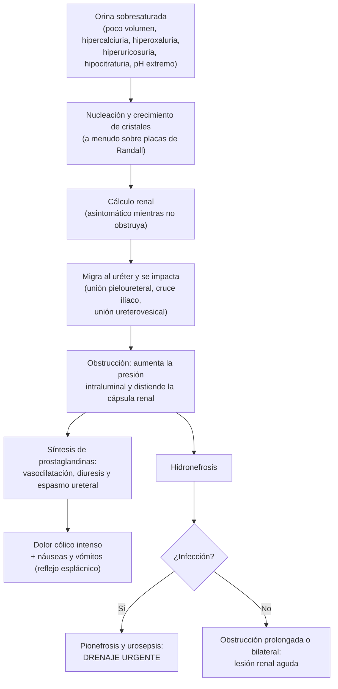

---
tags:
  - Nefrología
  - Frecuente en sala
  - Urgencia
---

# Urolitiasis y cólico renal

**Subespecialidad**
Nefrología · Urología · Medicina de urgencia

**Guías principales**
Guías de la EAU sobre urolitiasis (evaluación metabólica y prevención, *Eur Urol* 2024) · AUA 2026: manejo quirúrgico de los cálculos renales y ureterales (*J Urol*, febrero)

**Otras fuentes**
Ensayo de analgesia de Pathan (*Lancet* 2016) · SUSPEND (*Lancet* 2015) · STONE, ecografía vs. TC (*NEJM* 2014) · Revisión Cochrane de alfabloqueadores (2018) · Revisión Cochrane de fluidos (2012) · Serie chilena de profilaxis secundaria (Ossandón, *Rev Med Chil* 2016)

**GES**
No

**EUNACOM**
1.09.2.001 Cólico nefrítico, urolitiasis y complicaciones: obstrucción, sepsis, insuficiencia renal (sospecha, inicial, completo) · 1.09.1.024 Urolitiasis (sospecha, inicial, derivar)

**Revisado**
Septiembre 2026

!!! abstract "Resumen en 60 segundos"
    - **Cólico renal**: dolor **súbito, intenso y cólico** en la fosa lumbar que **migra** hacia la fosa ilíaca y los genitales. El paciente está **inquieto** (no encuentra posición), con náuseas y vómitos. Hay **hematuria** en la mayoría.
    - **Analgesia primero**: **AINE** (diclofenaco, ketorolaco, ketoprofeno o metamizol) son más eficaces y seguros que la **morfina** (Pathan, 2016). Los opioides quedan para el rescate. La **hidratación forzada no sirve**.
    - **Imagen**: la **TC sin contraste de baja dosis** es el examen de elección. Empezar con **ecografía** es seguro (STONE, 2014) y es obligatorio en el **embarazo**.
    - **Tamsulosina** (terapia expulsiva) en los cálculos **ureterales distales > 5 mm**; en los pequeños no sirve (SUSPEND, 2015; Cochrane, 2018).
    - **Expulsión espontánea**: **~ 68 %** si mide **≤ 5 mm** y **~ 47 %** si mide **5–10 mm**. Si mide > 10 mm, rara vez pasa.
    - **Urgencia urológica**: **obstrucción + fiebre** (riñón obstruido infectado), **anuria**, **riñón único**, **LRA** o dolor intratable. Requieren **antibióticos + drenaje urgente** (nefrostomía o catéter doble J), sin tratar el cálculo hasta resolver la sepsis.
    - **En > 60 años** con un "primer cólico renal", descartar un **aneurisma aórtico roto**.
    - **Prevención**: diuresis **> 2,5 L/día**, **no restringir el calcio** de la dieta, poca sal y proteína animal moderada. Estudio metabólico en los **recurrentes** o de alto riesgo.

## Definición

- **Urolitiasis**: formación de **cálculos** en la vía urinaria (riñón, uréter, vejiga). **Nefrolitiasis** si están en el riñón.
- **Cólico renal (nefrítico o ureteral)**: dolor agudo por la **obstrucción** del flujo urinario, habitualmente por un cálculo que migra por el uréter.
- **Cólico renal complicado**: con **infección** (pielonefritis obstructiva, pionefrosis, urosepsis), **LRA** o **anuria** (obstrucción bilateral o de un riñón único), o **dolor refractario**.

## Epidemiología

### Mundial

- **Prevalencia de ~ 9 %** en Estados Unidos (NHANES 2007–2010): **10,6 %** en hombres y **7,1 %** en mujeres. Es mayor en los **obesos** (11,2 %) y se asocia a la **diabetes** (Scales, 2012).
- En distintas poblaciones llega hasta **~ 15 %** y va en **aumento**.
- **Recurrencia de hasta 50 % en los primeros 5 años** tras el primer episodio (Khan, 2016).
- La mayoría de los cálculos son de **oxalato de calcio**, muchos formados sobre **placas de Randall** (fosfato de calcio en la papila).

### Chile

!!! chile "Contexto nacional"
    - No hay estudios poblacionales recientes de prevalencia en Chile; se usan las cifras internacionales.
    - **Serie chilena de 54 pacientes con alto riesgo de recurrencia** (Ossandón, 2016):
        - De los 29 que completaron el seguimiento (~ 4,5 años), el **79 %** tenía al menos una alteración metabólica.
        - Con tratamiento específico y buena adherencia, el **91 %** no recurrió (21 de 23; los autores lo resumen como un 75 % libre de recurrencia entre los que completaron el seguimiento).
        - Sólo el **42 %** del grupo inicial mantuvo la adherencia completa: la educación y el seguimiento son parte del tratamiento.
    - El cólico renal es una de las consultas más frecuentes en los **servicios de urgencia**. El EUNACOM exige manejar la analgesia y **derivar** las complicaciones.

## Etiología y factores de riesgo

| Tipo de cálculo | Frecuencia y características | Factores de riesgo principales |
|---|---|---|
| **Oxalato de calcio** | El **más frecuente**; radiopaco | **Baja ingesta de líquidos**, **hipercalciuria**, **hiperoxaluria** (enfermedad inflamatoria intestinal, cirugía bariátrica, dieta), **hipocitraturia**, dieta rica en **sal** y proteína animal, obesidad, diabetes |
| **Fosfato de calcio** | Radiopaco | **Acidosis tubular renal tipo 1**, **hiperparatiroidismo primario**, orina alcalina, topiramato |
| **Ácido úrico** | **Radiolúcido** en la radiografía (visible en la TC) | **Orina ácida** (pH < 5,5), **gota**, síndrome metabólico y **diabetes**, lisis tumoral |
| **Estruvita** (infección) | Cálculos **coraliformes** | Infección por bacterias **productoras de ureasa** (***Proteus***, *Klebsiella*); vejiga neurogénica, sondas |
| **Cistina** | Raros; inicio en la **juventud** | **Cistinuria** (genética, autosómica recesiva) |
| **Fármacos** | Raros | Indinavir, atazanavir, sulfadiazina, triamtereno |

Otros factores de riesgo: **sexo masculino**, clima **caluroso**, antecedente **familiar**, riñón en esponja medular, **anomalías anatómicas** (estenosis pieloureteral, riñón en herradura).

## Fisiopatología

*Figura 1. Fisiopatología de la urolitiasis y del cólico renal. Esquema propio.*

- Los **AINE** actúan justo sobre el mecanismo del dolor: bajan la síntesis de **prostaglandinas**, la presión en la vía urinaria y el espasmo del uréter.

## Clasificación

| Criterio | Categorías |
|---|---|
| **Ubicación** | Renal (cálices, pelvis) · **ureteral proximal, medio o distal** · vesical |
| **Tamaño** | ≤ 5 mm · 5–10 mm · > 10 mm (define la probabilidad de expulsión y el tratamiento) |
| **Composición** | Oxalato de calcio · fosfato de calcio · ácido úrico · estruvita · cistina |
| **Presentación** | **No complicado** · **complicado** (infección, LRA, anuria, riñón único, dolor refractario, embarazo) |
| **Riesgo de recurrencia** | Formador ocasional · **formador de alto riesgo** (recurrencias, inicio joven, historia familiar, enfermedad intestinal, hiperparatiroidismo, acidosis tubular, cálculos de ácido úrico, estruvita o cistina, riñón único) |

<figure markdown>
![A la izquierda, un esquema del riñón, el uréter y la vejiga con tres puntos numerados donde se impactan los cálculos: 1, la unión pieloureteral; 2, el cruce del uréter sobre los vasos ilíacos; y 3, la unión ureterovesical, la más estrecha. A la derecha, barras con la probabilidad de expulsión espontánea: alrededor de 68 por ciento para cálculos de 5 mm o menos y alrededor de 47 por ciento para los de 5 a 10 mm; los mayores de 10 mm rara vez pasan. Abajo, dos recuadros: manejo expectante si el dolor está controlado y no hay infección, y drenaje urgente si hay fiebre, anuria, riñón único obstruido, lesión renal aguda o dolor intratable](../assets/figuras/urolitiasis/sitios-y-expulsion.svg){ loading=lazy }
<figcaption>Figura 2. Sitios de impactación de los cálculos ureterales y probabilidad aproximada de expulsión espontánea según el tamaño. Esquema propio basado en la guía AUA/EAU 2007 (Preminger et al.) y en las guías EAU y AUA vigentes.</figcaption>
</figure>

## Clínica

- **Dolor**:
    - **Súbito**, **muy intenso**, cólico (con exacerbaciones) en la **fosa lumbar** o el **flanco**.
    - **Irradiado** hacia la **fosa ilíaca**, la **ingle**, el **testículo** o el **labio mayor**, a medida que el cálculo desciende.
    - El paciente está **inquieto**, cambia de posición constantemente (a diferencia de la peritonitis, en que se queda quieto).
- **Náuseas y vómitos** (muy frecuentes), sudoración, taquicardia.
- **Hematuria** microscópica en la mayoría (a veces macroscópica). **Su ausencia no descarta** el cálculo.
- Cálculo en el **uréter distal** o la unión ureterovesical: **disuria**, **polaquiuria**, **urgencia** y tenesmo vesical.
- **Puño percusión** positiva; abdomen blando, sin signos peritoneales.
- **Fiebre** o calofríos: **infección sobre una obstrucción** hasta demostrar lo contrario.
- Muchos cálculos **renales** son **asintomáticos** (hallazgo en una ecografía o TC).

!!! alarma "Signos de alarma"
    - **Fiebre**, calofríos, hipotensión o leucocitosis con un cálculo obstructivo: **riñón obstruido infectado**. Riesgo de **shock séptico**: antibióticos y **drenaje urgente**.
    - **Anuria** u oliguria: obstrucción **bilateral** o de un **riñón único** (funcional o anatómico, incluido el trasplantado).
    - **Creatinina elevada** (LRA).
    - **Dolor o vómitos intratables** pese a la analgesia adecuada.
    - **Embarazo**.
    - **Paciente > 60 años** con un "primer cólico renal", sobre todo si es hipertenso o fumador, o si tiene hipotensión o una **masa pulsátil**: descartar un **aneurisma de aorta abdominal** complicado.
    - Dolor que **no** se comporta como un cólico (constante, con signos peritoneales, desproporcionado): buscar otra causa (isquemia mesentérica, disección, infarto renal).

## Diagnóstico

- **Clínico**, apoyado por la orina y la imagen. La imagen **no debe retrasar** la analgesia.
- **Imágenes**:
    - **TC sin contraste (pielo-TC) de baja dosis**: el **examen de elección** en el paciente sintomático (EAU). Mide el tamaño, la ubicación y la densidad del cálculo y detecta **diagnósticos alternativos**.
    - **Ecografía**: primera opción en **embarazadas**, niños y pacientes jóvenes con cólicos recurrentes. Muestra la **hidronefrosis** y los cálculos renales y de las uniones pieloureteral y ureterovesical.
        - En el ensayo **STONE**, empezar con ecografía **no aumentó** las complicaciones ni los diagnósticos graves perdidos, y redujo la **radiación** (Smith-Bindman, 2014).
    - **Radiografía simple (riñón, uréter y vejiga)**: útil para **seguir** un cálculo radiopaco ya conocido; no es necesaria si se hará una TC.
    - **Embarazo**: ecografía primero, luego **RM**; la TC de baja dosis es la última opción.

!!! guia "Indicaciones de tratamiento activo del cálculo (EAU y AUA)"
    - Cálculo con **baja probabilidad de expulsión** espontánea (en general, **> 10 mm**, o que no progresa).
    - **Obstrucción** persistente.
    - **Dolor** que persiste pese a una analgesia adecuada.
    - **Función renal comprometida**: insuficiencia renal, **riñón único** u **obstrucción bilateral**.
    - Si el cálculo **no se expulsa en ~ 4–6 semanas** de observación.

    **Riñón obstruido e infectado**: **descompresión urgente** con **nefrostomía percutánea** o **catéter ureteral doble J** (ninguno es superior al otro), con antibióticos. El tratamiento definitivo del cálculo se **difiere** hasta resolver la sepsis. Tomar un **urocultivo** al momento del drenaje.

## Laboratorio

- **Orina completa y sedimento**: **hematuria**; leucocituria, nitritos o bacterias si hay infección; **pH** (< 5,5 sugiere ácido úrico; > 7 sugiere estruvita o fosfato); cristales.
- **Urocultivo** en todos los pacientes con fiebre, leucocituria o síntomas de ITU.
- **Creatinina** y electrolitos (función renal, potasio antes de los AINE).
- **Hemograma y PCR** si se sospecha una infección.
- **β-hCG** en toda mujer en edad fértil.
- **Hemocultivos** si hay fiebre o sepsis.
- **Estudio metabólico** (ambulatorio, después del episodio):
    - **Análisis del cálculo** (pedir al paciente que filtre la orina).
    - **Calcio**, **ácido úrico**, **PTH** si el calcio está alto, bicarbonato.
    - **Orina de 24 h** (volumen, calcio, oxalato, citrato, ácido úrico, sodio, creatinina) en los formadores de **alto riesgo** o recurrentes.

## Imágenes

Ver el diagnóstico (TC sin contraste de baja dosis de elección; ecografía como alternativa segura y de primera línea en el embarazo). En el seguimiento de un cálculo radiopaco, la **radiografía simple** o la **ecografía** evitan repetir la TC.

## Diagnóstico diferencial

| Diagnóstico | Qué lo distingue |
|---|---|
| **Aneurisma aórtico abdominal complicado** | > 60 años, **hipotensión**, masa pulsátil; ecografía o angio-TC. **El diferencial que no se puede perder** |
| **Pielonefritis** | **Fiebre**, dolor lumbar más continuo, leucocituria; puede coexistir con un cálculo (urgencia) |
| **Apendicitis** | Dolor que migra de epigastrio a la fosa ilíaca derecha, fiebre, **signos peritoneales**; el paciente está quieto |
| **Diverticulitis** | Adulto mayor, dolor en la fosa ilíaca izquierda, fiebre, signos peritoneales |
| **Embarazo ectópico** | **β-hCG positiva**, metrorragia, shock |
| **Torsión ovárica o testicular** | Dolor pélvico o escrotal súbito; ecografía Doppler |
| **Cólico biliar** | Dolor en el hipocondrio derecho tras comer, Murphy |
| **Isquemia mesentérica o infarto renal** | Dolor **desproporcionado** al examen, FA; LDH alta en el infarto renal; angio-TC |
| **Herpes zóster** (preeruptivo) | Dolor urente en un dermatoma; luego vesículas |
| **Necrosis papilar o cólico por coágulos** | Diabetes, AINE, anemia falciforme; hematuria macroscópica con coágulos |
| **Dolor lumbar mecánico** | Varía con el movimiento; orina normal |

## Tratamiento

### Analgesia en la urgencia

- **AINE de primera línea** si no hay contraindicación: más eficaces que la morfina, con menos efectos adversos.
    - En el ensayo de **Pathan (2016)**, con 1645 pacientes, el **diclofenaco IM** logró una reducción ≥ 50 % del dolor a los 30 min en el **68 %**, el **paracetamol EV** en el **66 %** y la **morfina EV** en el **61 %**.
- **Paracetamol EV** como alternativa o complemento, sobre todo si los AINE están contraindicados.
- **Opioides** (morfina, tramadol) para el **rescate** si el dolor persiste.
- **Antieméticos** (metoclopramida u ondansetrón).
- **No hidratar en forma forzada**: la revisión Cochrane no mostró beneficio en el dolor ni en la expulsión (Worster, 2012). Hidratar sólo si hay deshidratación o vómitos.
- **Contraindicaciones de los AINE**: **LRA** o ERC avanzada, hemorragia digestiva, **embarazo** (sobre todo el tercer trimestre), alergia, insuficiencia cardíaca descompensada.

### Terapia expulsiva y manejo ambulatorio

- **Alfabloqueador (tamsulosina)**:
    - Indicado en cálculos **ureterales distales > 5 mm** (EAU); la AUA lo ofrece para cálculos distales ≤ 10 mm.
    - En la **revisión Cochrane** (Campschroer, 2018), los alfabloqueadores aumentaron la expulsión (RR **1,45**) sobre todo en los cálculos **> 5 mm**; en los **≤ 5 mm** no hubo diferencia significativa.
    - El ensayo **SUSPEND** (Pickard, 2015), con cálculos mayoritariamente pequeños, no mostró beneficio: ~ **80 %** no necesitó intervención a las 4 semanas, con tamsulosina, nifedipino o placebo.
    - Uso **fuera de ficha técnica**: explicarlo al paciente; efectos adversos: hipotensión ortostática, eyaculación retrógrada.
- **Alta** si el dolor está controlado, tolera la vía oral, no hay infección y la función renal es normal:
    - **AINE por horario** por algunos días y un rescate.
    - **Tamsulosina** si corresponde.
    - **Filtrar la orina** para recuperar el cálculo y analizarlo.
    - **Signos de alarma** por escrito: fiebre, vómitos persistentes, dolor que no cede, disminución de la orina.
    - **Control con urología** e imagen: si el cálculo no se expulsa en **4–6 semanas**, requiere tratamiento activo.

### Tratamiento urológico (derivación)

- **Drenaje urgente** (nefrostomía o catéter doble J) en el riñón obstruido e infectado, la anuria o la LRA obstructiva.
- **Tratamiento del cálculo** según su tamaño, ubicación y la anatomía (AUA 2026 y EAU):
    - **Ureteroscopia** (con láser): cálculos ureterales y renales pequeños a medianos.
    - **Litotricia extracorpórea** con ondas de choque: cálculos renales y ureterales proximales seleccionados.
    - **Nefrolitotomía percutánea**: cálculos renales **> 20 mm** o coraliformes.
- **Cálculos de ácido úrico**: pueden **disolverse** con alcalinización oral (citrato de potasio) con un pH urinario de 6,5–7.

!!! dosis "Dosis"
    - **Diclofenaco** 75 mg **IM** (dosis del ensayo de Pathan), o **ketorolaco** 30 mg EV (15 mg en > 65 años o con ERC leve), o **ketoprofeno** 100 mg EV.
    - **Metamizol** 1–2 g EV lento (alternativa usada en Chile; la EAU lo incluye entre los analgésicos de primera línea).
    - **Paracetamol** 1 g EV c/6–8 h (máximo 4 g/día; 3 g en el adulto mayor o con daño hepático).
    - **Morfina** 0,1 mg/kg EV (dosis del ensayo de Pathan) o bolos de 2–4 mg titulados, como rescate.
    - **Metoclopramida** 10 mg EV u **ondansetrón** 4–8 mg EV.
    - **Tamsulosina** 0,4 mg VO al día por hasta **4 semanas**.
    - **Al alta**: ibuprofeno 400–600 mg c/8 h o ketoprofeno 50 mg c/8 h VO por 3–5 días, con un protector gástrico si hay riesgo.
    - **Riñón obstruido infectado**: antibiótico empírico según la epidemiología local (por ejemplo, **ceftriaxona** 1–2 g EV/día, o un carbapenémico si hay shock o riesgo de BLEE) + drenaje (ver el resumen de [infección urinaria](infeccion-urinaria.md)).

### Prevención de la recurrencia (EAU y AUA)

- **Líquidos**: beber lo necesario para una **diuresis > 2,5 L/día** (orina clara).
- **No restringir el calcio** de la dieta: **1000–1200 mg/día** (la restricción aumenta la absorción de oxalato y los cálculos).
- **Reducir la sal** (sodio ≤ 2300 mg/día) y la **proteína animal**; más **frutas y verduras**.
- Evitar el exceso de alimentos ricos en **oxalato** si hay hiperoxaluria.
- **Tratamiento según el estudio metabólico** (formadores de alto riesgo):
    - **Hipercalciuria**: **tiazida** (hidroclorotiazida o clortalidona).
    - **Hipocitraturia**: **citrato de potasio**.
    - **Ácido úrico** (orina ácida o hiperuricosuria): **citrato de potasio** para alcalinizar; **alopurinol** si hay hiperuricosuria o gota.
    - **Estruvita**: **extracción completa** del cálculo y tratamiento de la infección.
    - **Cistina**: diuresis > 3 L/día, alcalinización y tiopronina.
    - **Hiperparatiroidismo primario**: **paratiroidectomía**.

## Complicaciones

- **Pielonefritis obstructiva**, **pionefrosis** y **urosepsis**: la principal causa de muerte por litiasis.
- **Lesión renal aguda** (obstrucción bilateral o de un riñón único).
- **Hidronefrosis** crónica y pérdida de función renal; **ERC** en los formadores recurrentes.
- **Estenosis ureteral** (cálculos impactados, procedimientos).
- **Recurrencia**.
- Complicaciones de los procedimientos: sangrado, infección, lesión ureteral, **síntomas por el catéter doble J** (los alfabloqueadores los alivian).

## Pronóstico y seguimiento

- La mayoría de los cálculos **pequeños** (≤ 5 mm) se expulsa **sola** en semanas.
    - En SUSPEND, ~ **80 %** de los pacientes con manejo expectante no necesitó intervención a las 4 semanas.
- **Recurrencia de hasta 50 % en 5 años** sin prevención (Khan, 2016). Con estudio metabólico y tratamiento específico, la mayoría de los formadores de alto riesgo no recurre (Ossandón, 2016).
- **Seguimiento**:
    - **Imagen** (radiografía o ecografía) hasta confirmar la expulsión o el tratamiento.
    - **Análisis del cálculo** y **estudio metabólico** (orina de 24 h) en los recurrentes o de alto riesgo.
    - Control de la **función renal** y la **PA**; los formadores de cálculos tienen más HTA y ERC.

## Perlas para el internado

!!! perla "Para la sala y el turno"
    - El paciente con cólico renal **se mueve** (no encuentra posición); el de la peritonitis **se queda quieto**.
    - **Analgesia antes que la imagen**: un **AINE** bien elegido (diclofenaco IM, ketorolaco o ketoprofeno EV) calma más que la morfina. Revisa antes la **creatinina** y el embarazo.
    - **No pongas 3 litros de suero** "para que el cálculo baje": no sirve.
    - **Cólico + fiebre = urgencia urológica**, no un alta con antibiótico oral. Pide **urocultivo, hemocultivos, creatinina** e imagen, inicia **antibiótico EV** y llama a urología para el **drenaje**.
    - Un **adulto mayor** con su "primer cólico renal" es un **aneurisma aórtico** hasta demostrar lo contrario: ecografía al lado de la cama.
    - Pide **β-hCG** a toda mujer en edad fértil antes de la TC y los AINE.
    - La **tamsulosina** ayuda en los cálculos **distales > 5 mm**; en los pequeños casi todos pasan solos.
    - Al alta: **filtrar la orina**, líquidos abundantes, **no restringir el calcio**, signos de alarma escritos y **control con urología** en 4–6 semanas.
    - Un cálculo de **ácido úrico** no se ve en la radiografía simple, pero sí en la TC, y puede **disolverse** con citrato.

## Preguntas de repaso

??? repaso "1. Hombre de 35 años con dolor lumbar derecho súbito, muy intenso, irradiado a la ingle, con vómitos. Está inquieto, afebril. Orina: hematuria. Creatinina normal. ¿Qué haces primero?"
    **Cólico renal no complicado probable.**

    1. **Analgesia de inmediato**: **AINE** (diclofenaco 75 mg IM, ketorolaco 30 mg EV o ketoprofeno 100 mg EV) ± paracetamol EV; **antiemético**. Morfina sólo como rescate.
    2. **Imagen**: **TC sin contraste de baja dosis** (o ecografía primero, que es segura).
    3. Sin hidratación forzada.
    4. Si es un cálculo **distal > 5 mm**: **tamsulosina** 0,4 mg/día.
    5. **Alta** con AINE, filtrar la orina, signos de alarma y **control con urología** con imagen en 4–6 semanas.

??? repaso "2. Mujer de 50 años con cólico renal izquierdo, fiebre de 39 °C, calofríos, PA 90/60. La TC muestra un cálculo de 7 mm en el uréter proximal con hidronefrosis. ¿Qué haces?"
    **Riñón obstruido infectado con sepsis**: urgencia urológica.

    - **Hemocultivos y urocultivo**; **antibiótico EV** empírico de inmediato (por ejemplo, ceftriaxona, o un carbapenémico si hay shock o riesgo de BLEE).
    - **Reanimación** con volumen y vasopresores si no responde (ver sepsis).
    - **Drenaje urgente**: **nefrostomía percutánea** o **catéter doble J** (son equivalentes).
    - **No** tratar el cálculo (ureteroscopia o litotricia) hasta resolver la infección.

??? repaso "3. Hombre de 72 años, hipertenso y fumador, con dolor lumbar izquierdo súbito que interpreta como 'cólico renal'. Está pálido, PA 95/60, FC 115. ¿Qué te preocupa?"
    Un **aneurisma de aorta abdominal complicado** (roto o en expansión), que puede simular un cólico renal.

    - **Ecografía al lado de la cama** (aorta > 3 cm) y **angio-TC** si está estable.
    - Dos vías venosas, grupo y pruebas cruzadas, **hipotensión permisiva**.
    - Llamar de inmediato a **cirugía vascular**.
    - Nunca diagnosticar un "primer cólico renal" en un adulto mayor sin descartar el aneurisma.

??? repaso "4. Embarazada de 28 semanas con dolor lumbar derecho cólico y hematuria microscópica. ¿Qué imagen pides y cómo manejas el dolor?"
    - **Imagen**: **ecografía** renal y vesical primero (considerar que la hidronefrosis derecha leve puede ser fisiológica); si no es concluyente, **RM** sin gadolinio. La TC de baja dosis es la última opción.
    - **Analgesia**: **paracetamol** y, si es necesario, **opioides**. **Evitar los AINE** (sobre todo en el tercer trimestre).
    - **Urocultivo** (la bacteriuria es frecuente) y evaluación obstétrica.
    - Si hay obstrucción con infección o dolor refractario: **drenaje** (catéter doble J o nefrostomía) por urología.

??? repaso "5. Paciente con su tercer episodio de litiasis en 4 años. Pregunta si debe dejar de tomar leche. ¿Qué le recomiendas?"
    - **No restringir el calcio** de la dieta (1000–1200 mg/día): la restricción aumenta la absorción intestinal de oxalato y los cálculos.
    - **Líquidos** para una diuresis **> 2,5 L/día**; menos **sal** y proteína animal; más frutas y verduras.
    - Es un **formador recurrente**: **análisis del cálculo** y **estudio metabólico** (calcio, ácido úrico, PTH si corresponde y **orina de 24 h**).
    - Tratamiento específico según el resultado: **tiazida** (hipercalciuria), **citrato de potasio** (hipocitraturia o ácido úrico), **alopurinol** (hiperuricosuria).

??? repaso "6. Hombre de 40 años con un cálculo de 4 mm en el uréter distal, dolor controlado con AINE, afebril y creatinina normal. ¿Le indicas tamsulosina?"
    **No es necesaria.** Los cálculos **≤ 5 mm** tienen una alta tasa de expulsión espontánea (~ 68 %), y en ellos los alfabloqueadores no mostraron beneficio significativo (Cochrane 2018; SUSPEND 2015).

    - Manejo expectante con **AINE**, líquidos normales, filtrar la orina y signos de alarma.
    - Control con imagen: si no se expulsa en **4–6 semanas** o aparecen complicaciones, **derivar a urología**.
    - La tamsulosina se reserva para los cálculos **distales > 5 mm** (hasta 10 mm).

## Referencias

1. Skolarikos A, Somani B, Neisius A, et al. Metabolic evaluation and recurrence prevention for urinary stone patients: an EAU guidelines update. *Eur Urol.* 2024;86:343–363. doi:[10.1016/j.eururo.2024.05.029](https://doi.org/10.1016/j.eururo.2024.05.029)
2. Pearle MS, Matlaga BR, Antonelli JA, et al. Surgical management of kidney and ureteral stones: AUA guideline (2026). Part I: evaluation and treatment of patients with kidney and/or ureteral stones. *J Urol.* 2026;215:113–123. doi:[10.1097/JU.0000000000004842](https://doi.org/10.1097/JU.0000000000004842)
3. Akram M, Jahrreiss V, Skolarikos A, et al. Urological guidelines for kidney stones: overview and comprehensive update. *J Clin Med.* 2024;13:1114. doi:[10.3390/jcm13041114](https://doi.org/10.3390/jcm13041114)
4. Pathan SA, Mitra B, Straney LD, et al. Delivering safe and effective analgesia for management of renal colic in the emergency department: a double-blind, multigroup, randomised controlled trial. *Lancet.* 2016;387:1999–2007. doi:[10.1016/S0140-6736(16)00652-8](https://doi.org/10.1016/S0140-6736(16)00652-8)
5. Pickard R, Starr K, MacLennan G, et al. Medical expulsive therapy in adults with ureteric colic: a multicentre, randomised, placebo-controlled trial. *Lancet.* 2015;386:341–349. doi:[10.1016/S0140-6736(15)60933-3](https://doi.org/10.1016/S0140-6736(15)60933-3)
6. Campschroer T, Zhu X, Vernooij RWM, Lock TMTW. α-blockers as medical expulsive therapy for ureteric stones: a Cochrane systematic review. *BJU Int.* 2018;122:932–945. doi:[10.1111/bju.14454](https://doi.org/10.1111/bju.14454)
7. Smith-Bindman R, Aubin C, Bailitz J, et al. Ultrasonography versus computed tomography for suspected nephrolithiasis. *N Engl J Med.* 2014;371:1100–1110. doi:[10.1056/NEJMoa1404446](https://doi.org/10.1056/NEJMoa1404446)
8. Worster AS, Bhanich Supapol W. Fluids and diuretics for acute ureteric colic. *Cochrane Database Syst Rev.* 2012;(2):CD004926. doi:[10.1002/14651858.CD004926.pub3](https://doi.org/10.1002/14651858.CD004926.pub3)
9. Preminger GM, Tiselius HG, Assimos DG, et al. 2007 guideline for the management of ureteral calculi. *Eur Urol.* 2007;52:1610–1631. doi:[10.1016/j.eururo.2007.09.039](https://doi.org/10.1016/j.eururo.2007.09.039)
10. Scales CD Jr, Smith AC, Hanley JM, Saigal CS. Prevalence of kidney stones in the United States. *Eur Urol.* 2012;62:160–165. doi:[10.1016/j.eururo.2012.03.052](https://doi.org/10.1016/j.eururo.2012.03.052)
11. Khan SR, Pearle MS, Robertson WG, et al. Kidney stones. *Nat Rev Dis Primers.* 2016;2:16008. doi:[10.1038/nrdp.2016.8](https://doi.org/10.1038/nrdp.2016.8)
12. Ossandón E, Sepúlveda F, Acevedo C. [Impact of secondary prophylaxis in the management of patients with high recurrence risk of urolithiasis] (artículo en español). *Rev Med Chil.* 2016;144:710–715. doi:[10.4067/S0034-98872016000600004](https://doi.org/10.4067/S0034-98872016000600004)
