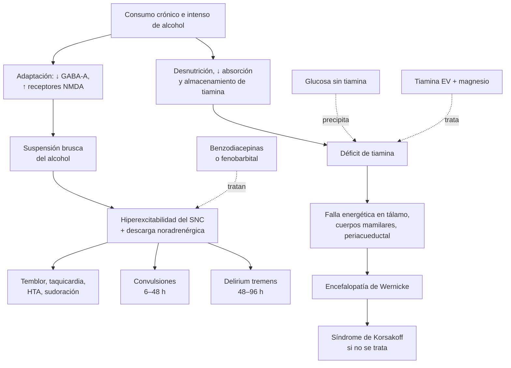

---
tags:
  - Neurología
  - Urgencia
  - Frecuente en sala
---

# Síndrome de abstinencia alcohólica, encefalopatía de Wernicke y complicaciones neurológicas de las sustancias

**Subespecialidad**
Neurología · Medicina interna · Psiquiatría de enlace · Medicina de urgencia

**Guías principales**
ASAM 2020: manejo de la abstinencia alcohólica · EFNS 2010: diagnóstico, tratamiento y prevención de la encefalopatía de Wernicke · Revisión *BMJ* 2025: abstinencia alcohólica en el hospital general

**Otras fuentes**
Examen clínico racional de *JAMA* 2018 (predicción de la abstinencia grave, PAWSS) · Criterios de Caine (1997) · Metaanálisis de fenobarbital en urgencia (2024) · ENS 2016–2017 · OMS 2024: informe mundial sobre alcohol y salud

**GES**
Sí, para los **menores de 20 años**: consumo perjudicial o dependencia de riesgo bajo a moderado de alcohol y drogas (problema N.° 53)

**EUNACOM**
1.02.2.004 Déficit agudo de tiamina (específico, completo, derivar) · 1.10.2.002 Complicaciones neurológicas de abuso de sustancias (específico, inicial, derivar) · 1.10.2.004 Estado confusional agudo alcohólico o tóxico-metabólico (específico, inicial, completo)

**Revisado**
Septiembre 2026

!!! abstract "Resumen en 60 segundos"
    - **Abstinencia alcohólica**: aparece **6–24 h** después del último trago en un bebedor crónico: **temblor**, ansiedad, sudoración, **taquicardia**, HTA, náuseas, insomnio.
        - **Convulsiones**: 6–48 h (máximo ~ 24 h).
        - **Delirium tremens**: **48–96 h**, con delirium, alucinaciones, fiebre e **hiperactividad autonómica**; es potencialmente mortal.
    - **Evaluar la gravedad** con la **CIWA-Ar** (< 10 leve, 10–18 moderada, ≥ 19 grave) y el **riesgo** de abstinencia grave con la **PAWSS** (≥ 4 = alto riesgo).
    - **Tratamiento de primera línea: benzodiacepinas** (diazepam, clordiazepóxido; **lorazepam** si hay hepatopatía grave o es adulto mayor), guiadas por los síntomas. **Fenobarbital** como alternativa o en la abstinencia resistente. **No** usar antipsicóticos solos.
    - **Tiamina a todos, antes de la glucosa**:
        - **Prevención**: 100–300 mg/día.
        - **Sospecha de Wernicke**: **200 mg EV cada 8 h** (EFNS) o más (hasta 500 mg cada 8 h en muchos protocolos).
        - Corregir el **magnesio**.
    - **Encefalopatía de Wernicke**: urgencia neurológica por **déficit de tiamina**. Tríada de **confusión, oftalmoplejia/nistagmo y ataxia**, completa en una minoría: basta con **2 de 4 criterios de Caine** (desnutrición, signos oculares, ataxia, alteración mental). **Tratar ante la sospecha**; si no, evoluciona a **Korsakoff** (amnesia irreversible).
    - **Otras sustancias**: cocaína y pasta base (ACV, convulsiones, síndrome simpaticomimético → **benzodiacepinas**), opioides (depresión respiratoria, miosis → **naloxona**).

## Definición

- **Síndrome de abstinencia alcohólica**: conjunto de síntomas por **hiperexcitabilidad del sistema nervioso central** tras la **suspensión o reducción** brusca del consumo en una persona con **consumo intenso y prolongado** de alcohol (DSM-5).
- **Delirium tremens**: la forma más grave: **delirium** (alteración de la atención y la conciencia de inicio agudo y fluctuante) con **hiperactividad autonómica** marcada (taquicardia, HTA, fiebre, sudoración), **alucinaciones** y agitación.
- **Abstinencia resistente a benzodiacepinas**: síntomas que persisten pese a dosis altas de benzodiacepinas (por ejemplo, > 50 mg de diazepam en la primera hora o > 200 mg en 3–4 h).
- **Encefalopatía de Wernicke**: síndrome neurológico **agudo** por **déficit de tiamina** (vitamina B1), con lesiones en el tálamo medial, los cuerpos mamilares y la sustancia gris periacueductal.
- **Síndrome de Korsakoff**: secuela **crónica** de la encefalopatía de Wernicke no tratada o tratada tarde: **amnesia anterógrada** (y retrógrada) con **confabulación**, con la conciencia y otras funciones relativamente conservadas. Juntos forman el **síndrome de Wernicke-Korsakoff**.

## Epidemiología

### Mundial

- **Alcohol** (OMS, 2024): **2,6 millones de muertes al año** atribuibles al alcohol (**4,7 %** de todas las muertes), la mayoría en **hombres**; **209 millones** de personas con **dependencia** del alcohol.
- Muchos pacientes con trastorno por consumo de alcohol que suspenden el consumo presentan abstinencia, pero la mayoría es **leve**; una minoría (< 5 %) presenta **convulsiones o delirium tremens**. El delirium tremens **no tratado** tiene una mortalidad alta; con tratamiento, de ~ 1–5 %.
- En los **hospitalizados**, la abstinencia suele aparecer en pacientes ingresados **por otra causa** (trauma, cirugía, pancreatitis, hemorragia digestiva, neumonía), sobre todo si no se preguntó por el consumo.
- **Encefalopatía de Wernicke**: se **subdiagnostica** mucho en vida: la **tríada** clásica completa se ve en una **minoría** de los casos y muchos se detectan sólo en la autopsia. Además del **alcohol**, ocurre en la **cirugía bariátrica**, la **hiperemesis gravídica**, el cáncer, los vómitos prolongados, la desnutrición, la **realimentación** y, recientemente, con los fármacos para bajar de peso que causan vómitos.

### Chile

!!! chile "Contexto nacional"
    - **ENS 2016–2017**: **11,7 %** de los chilenos tenía un **consumo riesgoso** de alcohol (AUDIT ≥ 8) en el último año; **14,4 %** entre los 15 y 24 años (menor que el 18,1 % de 2009–2010). Los **hombres** tienen hasta **6 veces** más consumo riesgoso que las mujeres.
    - Se estima que **~ 260.000 adultos** (**2 de cada 100**) tienen un **trastorno por consumo de alcohol**.
    - **GES N.° 53**: consumo perjudicial o dependencia de riesgo bajo a moderado de alcohol y drogas en los **menores de 20 años** (tratamiento y seguimiento, con inicio dentro de **10 días** desde la confirmación).
    - El alcohol es una de las principales causas de **cirrosis** en Chile (ver [cirrosis](../gastroenterologia/cirrosis-y-complicaciones.md)) y de **pancreatitis** (ver [pancreatitis aguda](../gastroenterologia/pancreatitis-aguda.md)).
    - **Pasta base de cocaína**: una forma fumable de cocaína de consumo relevante en Chile, con complicaciones neurológicas y cardiovasculares.
    - En la APS se usan el **AUDIT** (o AUDIT-C) para el tamizaje y las **intervenciones breves**.

## Etiología

| Condición | Causa y factores de riesgo |
|---|---|
| **Abstinencia alcohólica** | Suspensión o disminución del consumo en un **bebedor crónico intenso**: hospitalización, ayuno, cirugía, cárcel, decisión de dejar de beber |
| **Riesgo de abstinencia grave** | **Delirium tremens o convulsiones previas** (el predictor más fuerte), **abstinencias previas** (fenómeno de *kindling*), **PAS basal ≥ 140 mmHg**, **trombocitopenia**, hipokalemia, **alcoholemia alta** con síntomas de abstinencia, **edad > 65 años**, **enfermedad aguda** concomitante, consumo de otros depresores (benzodiacepinas) |
| **Déficit de tiamina (Wernicke)** | **Alcoholismo** (menor ingesta, absorción y almacenamiento), **cirugía bariátrica**, **hiperemesis gravídica**, vómitos prolongados, **desnutrición** y anorexia, **realimentación**, cáncer y quimioterapia, diálisis, nutrición parenteral sin vitaminas, VIH/sida |
| **Desencadenante clásico** | Administrar **glucosa** (suero glucosado) a un paciente con déficit de tiamina: consume la poca tiamina que queda y precipita o empeora el Wernicke |

## Fisiopatología

1. **Abstinencia**:
    - El alcohol **potencia el GABA-A** (inhibidor) e **inhibe el receptor NMDA** de glutamato (excitador).
    - Con el consumo crónico, el cerebro se adapta: **disminuye** la función de los receptores GABA-A y **aumenta** la de los NMDA.
    - Al suspender el alcohol, queda un estado de **hiperexcitabilidad** (menos inhibición y más excitación) con **descarga noradrenérgica**: temblor, taquicardia, HTA, sudoración, convulsiones, alucinaciones y delirium.
    - Las benzodiacepinas y el fenobarbital actúan sobre el **receptor GABA-A** (tolerancia cruzada con el alcohol).
    - Cada episodio de abstinencia **sensibiliza** el cerebro para el siguiente (***kindling***): las abstinencias sucesivas son más graves.
2. **Wernicke**:
    - La **tiamina** (como pirofosfato de tiamina) es cofactor de enzimas clave del metabolismo de la **glucosa** (piruvato deshidrogenasa, α-cetoglutarato deshidrogenasa, transcetolasa).
    - Su déficit produce **falla energética**, acidosis láctica local y daño en las zonas con alto consumo metabólico: **tálamo medial**, **cuerpos mamilares**, **sustancia gris periacueductal**, núcleos oculomotores, vermis cerebeloso.
    - Las reservas corporales de tiamina son pequeñas (se agotan en **~ 2–3 semanas** sin aporte).
    - El **magnesio** es necesario para la acción de la tiamina.

*Figura 1. Fisiopatología de la abstinencia alcohólica y de la encefalopatía de Wernicke. Esquema propio.*

## Clasificación

- **Gravedad de la abstinencia** según la **CIWA-Ar** (ASAM 2020; 10 ítems, puntaje máximo 67):

| Gravedad | CIWA-Ar | Características |
|---|---|---|
| **Leve** | **< 10** | Temblor leve, ansiedad, insomnio; signos vitales casi normales |
| **Moderada** | **10–18** | Temblor evidente, sudoración, taquicardia, HTA, náuseas, ansiedad marcada |
| **Grave** | **≥ 19** | Agitación, alucinaciones, desorientación; riesgo de convulsiones y delirium tremens |
| **Complicada** | — | **Convulsiones** o **delirium tremens** |

- **Ítems de la CIWA-Ar**: náuseas y vómitos, **temblor**, **sudoración**, **ansiedad**, **agitación**, alteraciones **táctiles**, **auditivas** y **visuales**, **cefalea**, y **orientación** (requiere un paciente que pueda comunicarse; no sirve en el paciente intubado o con delirium, en el que se usan escalas de sedación y agitación como la RASS).
- **Riesgo de abstinencia grave**: **PAWSS** (*Prediction of Alcohol Withdrawal Severity Scale*). Con **≥ 4** puntos, el riesgo es alto; con **≤ 3**, la abstinencia grave es muy improbable (razón de verosimilitud 0,07; sensibilidad 99 %) (Wood, 2018).

## Clínica

<figure markdown>
{ loading=lazy }
<figcaption>Figura 2. Curso temporal del síndrome de abstinencia alcohólica. Esquema propio.</figcaption>
</figure>

### Abstinencia alcohólica

- **Abstinencia leve a moderada** (**6–24 h**, máximo a las 24–36 h): **temblor** de las manos, **ansiedad**, irritabilidad, **insomnio**, **sudoración**, **taquicardia**, **HTA**, náuseas y vómitos, cefalea, anorexia. El sensorio está conservado.
- **Alucinosis alcohólica** (**12–48 h**): alucinaciones **visuales** (insectos, animales), **táctiles** o auditivas, con **orientación conservada** y signos vitales poco alterados (a diferencia del delirium tremens).
- **Convulsiones** (**6–48 h**): **tónico-clónicas generalizadas**, habitualmente **únicas o en salvas breves**, sin fase posictal prolongada. Un tercio de los pacientes con convulsiones evoluciona a **delirium tremens** si no se trata.
    - **Convulsiones focales**, un estado epiléptico o convulsiones fuera de este período obligan a buscar **otra causa** (TEC, hematoma subdural, meningitis, hipoglicemia, hiponatremia; ver [crisis epiléptica](crisis-epileptica-y-estado-epileptico.md)).
- **Delirium tremens** (**48–96 h**, dura 1–5 días):
    - **Delirium**: desorientación, inatención, curso fluctuante, **alucinaciones** vívidas, agitación.
    - **Hiperactividad autonómica**: **taquicardia**, **HTA**, **fiebre**, **sudoración profusa**, midriasis, temblor.
    - Complicaciones: deshidratación, hipokalemia, hipomagnesemia, arritmias, **aspiración**, rabdomiólisis, trauma.

### Encefalopatía de Wernicke

- **Tríada clásica** (completa en una **minoría**):
    1. **Alteración del estado mental**: confusión, apatía, desorientación, somnolencia hasta el coma; a veces sólo una **alteración leve de la memoria**.
    2. **Signos oculares**: **nistagmo** (el más frecuente), **parálisis del VI par** (recto lateral) uni o bilateral, oftalmoplejia de la mirada conjugada, ptosis.
    3. **Ataxia**: de la marcha y el tronco (base amplia), cerebelosa y vestibular.
- **Otros**: hipotermia, hipotensión, taquicardia, neuropatía periférica (beriberi seco), insuficiencia cardíaca de gasto alto (**beriberi húmedo**), acidosis láctica inexplicable.
- **Síndrome de Korsakoff**: **amnesia anterógrada** grave (no forma memorias nuevas), amnesia retrógrada, **confabulación**, apatía, con lenguaje y atención relativamente conservados.

!!! alarma "Sospechar Wernicke y tratar sin esperar"
    - **Todo paciente con alcoholismo o desnutrición** con **confusión**, **ataxia** o **alteraciones oculares** (nistagmo, estrabismo, visión doble).
    - **Criterios de Caine** (EFNS 2010; en alcohólicos): **2 de 4**:
        1. **Déficit nutricional**.
        2. **Signos oculomotores**.
        3. **Disfunción cerebelosa** (ataxia).
        4. **Alteración del estado mental** o **leve alteración de la memoria**.
    - Pacientes **no alcohólicos** de riesgo: **posbariátricos**, **hiperemesis**, vómitos prolongados, cáncer, **realimentación**.
    - **Tiamina EV antes de cualquier aporte de glucosa**, sin esperar la RM ni los niveles.
    - Un **coma inexplicado** en un alcohólico (con glicemia normal) puede ser Wernicke.

## Diagnóstico

**Abstinencia alcohólica**:

1. **Anamnesis del consumo**: cantidad, frecuencia, **hora del último trago**, **abstinencias previas**, **convulsiones o delirium tremens previos**, otras sustancias (benzodiacepinas, cocaína, opioides). Preguntar también a los familiares.
2. **Examen**: signos vitales, temblor, sudoración, estado mental, **signos de trauma** (TEC), estigmas de daño hepático, signos oculares y ataxia (Wernicke).
3. **Escalas**: **PAWSS** al ingreso (riesgo) y **CIWA-Ar** seriada (gravedad; cada 1–4 h según el puntaje).
4. **Diagnóstico diferencial activo**: el delirium tremens es un **diagnóstico de exclusión**. Descartar **infección** (neumonía por aspiración, meningitis, PBE), **hipoglicemia**, **TEC** y **hematoma subdural** (TC de cerebro), **encefalopatía hepática**, alteraciones electrolíticas, intoxicación por otras sustancias, **Wernicke**.

**Encefalopatía de Wernicke**:

- Diagnóstico **clínico** (criterios de Caine).
- **Tiamina en sangre** (tomar la muestra **justo antes** de la primera dosis, sin retrasarla): un nivel normal no la descarta.
- **RM de cerebro** (apoya el diagnóstico en alcohólicos y no alcohólicos; EFNS nivel B): hiperintensidades **simétricas** en T2 y FLAIR en el **tálamo medial**, los **cuerpos mamilares**, la **sustancia gris periacueductal** y la placa tectal (Figura 3). Sensibilidad moderada (**una RM normal no la descarta**).

## Laboratorio

| Examen | Hallazgos y uso |
|---|---|
| **Glicemia capilar** | Hipoglicemia (dar **tiamina antes** de la glucosa) |
| **Electrolitos** | **Hipokalemia**, **hipomagnesemia**, **hipofosfatemia** (empeora con la realimentación), hiponatremia (potomanía de cerveza: corregirla **lentamente**) |
| **Hemograma** | **Macrocitosis**, anemia, **trombocitopenia** (tóxica o por hiperesplenismo; predictor de abstinencia grave), leucocitosis (infección) |
| **Pruebas hepáticas** | **GGT** alta, **GOT/GPT > 2**, bilirrubina, albúmina, **INR** (hepatopatía; elección de la benzodiacepina) |
| **Creatinina, CK** | LRA, **rabdomiólisis** |
| **Lipasa** | Pancreatitis |
| **Alcoholemia** (o alcohol en aire espirado) | Confirma el consumo reciente; **puede haber abstinencia con alcoholemia positiva** |
| **Gases, lactato, osmolaridad** | **Cetoacidosis alcohólica**; **brecha osmolar** alta (metanol, etilenglicol) (ver [trastornos ácido-base](../nefrologia/trastornos-acido-base.md)) |
| **Toxicológico en orina** | Cocaína, benzodiacepinas, opioides, anfetaminas |
| **Tiamina en sangre** | Antes de la primera dosis (no retrasar el tratamiento) |

## Imágenes

- **TC de cerebro sin contraste**: ante **convulsiones** (sobre todo la primera, focales o con TEC), **compromiso de conciencia**, focalidad o trauma. Busca **hematoma subdural** (frecuente en los alcohólicos por las caídas y la atrofia), contusiones y hemorragias.
- **RM de cerebro**: la técnica de elección para apoyar el diagnóstico de **Wernicke** y de otras complicaciones (mielinolisis osmótica, Marchiafava-Bignami, atrofia cerebelosa).
- **Radiografía de tórax**: **neumonía por aspiración**.

<figure markdown>
{ loading=lazy width="340" }
<figcaption>Figura 3. Encefalopatía de Wernicke en un hombre de 50 años con consumo crónico de alcohol: hiperintensidad simétrica en FLAIR de los cuerpos mamilares (a) y del tálamo medial (b). Tomado de Manzo G, De Gennaro A, Cozzolino A, et al. <em>Biomed Res Int</em> 2014;2014:503596 (figura 2). Licencia <a href="https://creativecommons.org/licenses/by/3.0/">CC BY 3.0</a>.</figcaption>
</figure>

## Diagnóstico diferencial

| Cuadro | Claves |
|---|---|
| **Delirium de otra causa** | Infección, fármacos, metabólico; sin el antecedente ni el curso temporal de la abstinencia (ver [delirium](../geriatria/delirium.md)) |
| **Encefalopatía hepática** | Asterixis, estigmas de cirrosis, amonio (apoyo), desencadenante (hemorragia, infección) |
| **Hipoglicemia** | Glicemia capilar; frecuente en el alcohólico desnutrido (ver [hipoglicemia](../endocrinologia/hipoglicemia.md)) |
| **TEC y hematoma subdural** | Trauma, focalidad, TC |
| **Meningitis y encefalitis** | Fiebre, rigidez de nuca, punción lumbar |
| **Intoxicación simpaticomimética** (cocaína, anfetaminas) | Midriasis, hipertermia, toxicológico; sin el antecedente de suspensión del alcohol |
| **Abstinencia de benzodiacepinas o barbitúricos** | Cuadro muy similar, más tardío y prolongado |
| **Síndrome serotoninérgico, síndrome neuroléptico maligno** | Clonus e hiperreflexia (serotoninérgico), rigidez (neuroléptico) con fármacos desencadenantes |
| **Tirotoxicosis** | Bocio, oftalmopatía, TSH suprimida |
| **Wernicke vs intoxicación alcohólica** | La ataxia y el nistagmo **persisten** con alcoholemia negativa en el Wernicke |

## Tratamiento

### Síndrome de abstinencia alcohólica

!!! guia "ASAM 2020 y revisión BMJ 2025"
    - **Lugar de manejo**: **ambulatorio** en la abstinencia **leve a moderada** sin factores de riesgo de abstinencia grave (sin delirium tremens ni convulsiones previos, sin enfermedad médica o psiquiátrica inestable, con apoyo familiar). **Hospitalizar** si hay **riesgo alto** (PAWSS ≥ 4), abstinencia **grave**, **convulsiones**, **delirium**, o enfermedad concomitante.
    - **Benzodiacepinas**: **primera línea** (reducen las convulsiones y el delirium tremens). Preferir las de **acción prolongada** (diazepam, clordiazepóxido); **lorazepam** u oxazepam en la **hepatopatía grave**, los **adultos mayores** o con riesgo de sedación excesiva.
    - **Esquemas**:
        - **Guiado por los síntomas** (CIWA-Ar): dosis sólo si el puntaje supera un umbral (por ejemplo, **≥ 10**). Usa menos fármaco y acorta el tratamiento. Requiere personal entrenado y un paciente que pueda responder.
        - **Dosis fija** con disminución progresiva: si no se puede aplicar la CIWA-Ar.
        - **Carga** (*front-loading*): dosis altas iniciales de una benzodiacepina de acción prolongada en la abstinencia moderada a grave.
    - **Fenobarbital**: alternativa o complemento en los centros con experiencia; útil en la **abstinencia resistente** a benzodiacepinas. En el servicio de urgencia, su eficacia y seguridad fueron similares a las de las benzodiacepinas (metaanálisis 2024).
    - **Abstinencia leve ambulatoria**: **carbamazepina** o **gabapentina** son alternativas a las benzodiacepinas (menos abuso y sedación).
    - **Coadyuvantes** (nunca solos): **dexmedetomidina** o **propofol** en la UCI para la abstinencia resistente; **antipsicóticos** (haloperidol) sólo para las alucinaciones o la agitación que persisten pese a una dosis adecuada de benzodiacepinas (bajan el umbral convulsivo); betabloqueadores y clonidina sólo para la HTA o la taquicardia persistentes (enmascaran los signos).
    - **No usar**: alcohol ni los antipsicóticos como tratamiento principal.

!!! dosis "Benzodiacepinas y fenobarbital en la abstinencia"
    - **Diazepam**: **10–20 mg VO** (o 5–10 mg EV lento) cada **1–4 h** según la CIWA-Ar (≥ 10), hasta el control de los síntomas; luego disminuir. En el **delirium tremens**: **10–20 mg EV cada 5–10 min** hasta la sedación leve (un paciente tranquilo y despertable).
    - **Clordiazepóxido**: 50–100 mg VO cada 1–4 h según la CIWA-Ar.
    - **Lorazepam** (hepatopatía, ancianos): **1–4 mg VO o EV** cada 1–4 h según la CIWA-Ar; en el delirium tremens, 1–4 mg EV cada 5–15 min.
    - **Ejemplo de dosis fija** (diazepam): 10 mg cada 6 h el día 1, luego disminuir ~ 25 % al día en 3–4 días.
    - **Fenobarbital** (con monitorización): carga de **~ 10 mg/kg EV** (peso ideal) en 30 min o dosis EV fraccionadas de 130–260 mg; vigilar la **depresión respiratoria**, sobre todo si se combina con benzodiacepinas.
    - **Convulsión por abstinencia**: **benzodiacepina** (diazepam o lorazepam EV). La **fenitoína no es eficaz** para las convulsiones por abstinencia.

!!! dosis "Medidas de soporte (en todos los hospitalizados)"
    - **Tiamina antes de la glucosa**:
        - **Profilaxis** (bebedor crónico sin signos de Wernicke): **100–300 mg/día** (EV o IM al inicio si hay desnutrición o vómitos; luego VO).
        - **Sospecha de Wernicke**: ver abajo.
    - **Hidratación** con suero **glucosado** o fisiológico (tras la tiamina); cuidado con la sobrecarga.
    - **Corregir** potasio, **magnesio** (sulfato de magnesio 1–2 g EV) y **fósforo** (riesgo de **síndrome de realimentación**).
    - **Ácido fólico** 1 mg/día y multivitamínicos.
    - Ambiente tranquilo e iluminado, **reorientación**, presencia de familiares; **evitar las contenciones físicas** (si son imprescindibles, con sedación adecuada).
    - **Profilaxis de la aspiración** (cabecera elevada) y tromboprofilaxis.

### Encefalopatía de Wernicke

!!! guia "EFNS 2010"
    - La tiamina está indicada en la encefalopatía de Wernicke **sospechada** o manifiesta: **200 mg cada 8 h**, preferentemente **EV**, **antes de cualquier carbohidrato** (nivel C).
    - La tiamina es **muy segura** (nivel B); las reacciones anafilácticas son excepcionales.
    - **Tiamina parenteral a todos los pacientes de riesgo** que ingresan a urgencia (buena práctica).
    - Tras la **cirugía bariátrica**, controlar la tiamina por al menos **6 meses** y suplementar por vía parenteral si hay riesgo.

!!! dosis "Tiamina en el Wernicke"
    - **200 mg EV cada 8 h** (EFNS); muchos protocolos usan **500 mg EV cada 8 h por 2–3 días** (diluida en 100 mL de suero fisiológico, en 30 min), seguidos de **250 mg/día EV o IM por 3–5 días** y luego **100 mg/día VO** mientras persista el riesgo.
    - Continuar hasta que **no haya mejoría clínica adicional**.
    - **Magnesio**: corregir la hipomagnesemia (sin magnesio, la tiamina no actúa bien).
    - **Respuesta esperada**: los **signos oculares** mejoran en horas a días; la **ataxia** y la **confusión**, en días a semanas. La amnesia de Korsakoff mejora poco.

### Complicaciones neurológicas de otras sustancias

| Sustancia | Complicaciones neurológicas | Manejo inicial |
|---|---|---|
| **Cocaína y pasta base** | **ACV** isquémico y **hemorrágico**, hemorragia subaracnoidea, **convulsiones**, **síndrome simpaticomimético** (agitación, hipertermia, HTA, taquicardia, midriasis), psicosis | **Benzodiacepinas** (primera línea para la agitación, la HTA y la taquicardia); enfriamiento; **evitar los betabloqueadores solos**; TC si hay focalidad o cefalea |
| **Anfetaminas, MDMA (éxtasis)** | Agitación, **hipertermia**, convulsiones, **hiponatremia** (MDMA), síndrome serotoninérgico, ACV | Benzodiacepinas, enfriamiento, corregir el sodio con cuidado |
| **Opioides** (morfina, heroína, **fentanilo**, tramadol) | **Depresión respiratoria**, **miosis**, **coma**; convulsiones (tramadol); leucoencefalopatía tóxica | **Naloxona** 0,04–0,4 mg EV (repetir cada 2–3 min hasta 2–10 mg); ventilación; vigilar la **resedación** |
| **Benzodiacepinas** | Sedación, ataxia, disartria, coma (en general leve si son solas) | Soporte; **flumazenil no de rutina** (puede precipitar convulsiones en los consumidores crónicos) |
| **Cannabis y cannabinoides sintéticos** | Psicosis, ansiedad, convulsiones (sintéticos), **síndrome de hiperémesis cannabinoide** | Soporte; benzodiacepinas; baños calientes o capsaicina tópica en la hiperémesis |
| **Metanol, etilenglicol** | Compromiso de conciencia, **ceguera** (metanol), convulsiones; acidosis con **brecha aniónica y osmolar** altas | **Fomepizol** o **etanol**, hemodiálisis |
| **Alcohol crónico (otras)** | **Neuropatía periférica**, **degeneración cerebelosa**, miopatía, **mielinolisis osmótica** (corrección rápida de una hiponatremia; ver [sodio](../nefrologia/trastornos-del-sodio.md)), enfermedad de Marchiafava-Bignami, demencia, hematoma subdural | Abstinencia, tiamina, nutrición, corregir el sodio lentamente |

## Complicaciones

- **Abstinencia**: **convulsiones**, **delirium tremens**, **neumonía por aspiración**, arritmias, deshidratación, **rabdomiólisis**, trauma, síndrome de realimentación; **muerte** (hipertermia, arritmias, colapso cardiovascular).
- **Del tratamiento**: **sedación excesiva** y **depresión respiratoria** (benzodiacepinas y fenobarbital combinados), aspiración, delirium paradójico, caídas.
- **Wernicke**: **síndrome de Korsakoff** (hasta en la mayoría de los sobrevivientes no tratados a tiempo), coma y muerte, insuficiencia cardíaca (beriberi húmedo).

## Pronóstico y seguimiento

- **Abstinencia**: la mayoría se resuelve en **5–7 días** con tratamiento. Las abstinencias sucesivas tienden a ser **más graves** (*kindling*).
- **Wernicke**: tratado a tiempo, los signos oculares y la ataxia suelen revertir; con retraso, queda un **Korsakoff** y el paciente puede necesitar cuidados de largo plazo.
- **Perfil EUNACOM**:
    - **Déficit agudo de tiamina**: diagnóstico específico y **tratamiento completo** (tiamina EV antes de la glucosa), con derivación.
    - **Complicaciones neurológicas del abuso de sustancias**: diagnóstico específico, **tratamiento inicial** y derivación.
    - **Estado confusional alcohólico o tóxico-metabólico**: tratamiento inicial y **manejo completo** del seguimiento.
- **Seguimiento: la abstinencia es una oportunidad para tratar el trastorno por consumo de alcohol**:
    - **Intervención breve** motivacional y derivación a un programa de tratamiento (APS, salud mental, SENDA; GES en los menores de 20 años).
    - **Fármacos para prevenir las recaídas**: **naltrexona**, **acamprosato**, disulfiram (con consentimiento y supervisión); topiramato y gabapentina como alternativas.
    - **Tiamina** oral, nutrición, manejo de la hepatopatía y de las comorbilidades psiquiátricas.

## Perlas para el internado

!!! perla "Para la sala y el turno"
    - **Pregunta por el alcohol a todos los pacientes que hospitalizas** (cantidad, último trago, abstinencias y convulsiones previas). El "delirium del día 3" en el posoperatorio suele ser un **delirium tremens**.
    - **PAWSS al ingreso, CIWA-Ar seriada.**
    - **Tiamina antes que glucosa**, siempre. Un suero glucosado sin tiamina puede precipitar un Wernicke.
    - **Wernicke = tratar ante la sospecha** (2 de 4 criterios de Caine); la tríada completa es la excepción.
    - En el **cirrótico** o el **anciano**, usa **lorazepam** (sin metabolitos activos).
    - **No uses haloperidol solo** para el delirium tremens: la base son las benzodiacepinas.
    - **Convulsión por abstinencia**: benzodiacepina; la **fenitoína no sirve**. Si la convulsión es focal o hay TEC: **TC**.
    - Revisa el **magnesio**, el **potasio** y el **fósforo**.
    - **Cocaína con agitación, HTA y taquicardia**: benzodiacepinas primero, **no betabloqueadores solos**.
    - **Coma con miosis y bradipnea**: **naloxona** (y vigila la resedación).

## Preguntas de repaso

??? repaso "1. Hombre de 52 años operado de una fractura de fémur hace 2 días. Hoy está agitado, desorientado, sudoroso, con temblor, ve \"bichos en las paredes\", FC 124, PA 170/100 y T 38,2 °C. Su esposa cuenta que toma 1 litro de pisco al día. ¿Qué tiene y cómo lo tratas?"
    **Delirium tremens** (48–96 h tras el último trago: delirium, alucinaciones e hiperactividad autonómica).

    1. **Descartar otras causas** del delirium y la fiebre: infección (neumonía por aspiración, herida, ITU), TEP, hipoglicemia, electrolitos, TC si hay focalidad o trauma.
    2. **Benzodiacepinas EV**: **diazepam 10–20 mg EV cada 5–10 min** (o lorazepam 1–4 mg EV si hay hepatopatía) hasta una **sedación leve**; considerar la UCI.
    3. **Tiamina EV antes de la glucosa** (dosis de Wernicke si hay confusión, ataxia o signos oculares), **magnesio**, potasio, fósforo, hidratación.
    4. **Abstinencia resistente**: fenobarbital, dexmedetomidina o propofol en la UCI.
    5. Evitar el haloperidol solo y las contenciones sin sedación.

??? repaso "2. Paciente alcohólico desnutrido, traído por confusión, marcha inestable y nistagmo horizontal. Glicemia 62 mg/dL. La enfermera prepara un suero glucosado al 30 %. ¿Qué haces?"
    **Sospecha de encefalopatía de Wernicke** (cumple ≥ 2 criterios de Caine: desnutrición, signos oculares, ataxia y alteración mental).

    - **Tiamina EV antes de la glucosa**: **200–500 mg EV cada 8 h** (según el protocolo), tomando antes una muestra de tiamina sin retrasar la dosis.
    - Luego corregir la **hipoglicemia** (el aporte de glucosa sin tiamina puede empeorar el Wernicke).
    - **Magnesio**, electrolitos, nutrición.
    - RM de cerebro para apoyar el diagnóstico (una RM normal no lo descarta).
    - Continuar la tiamina parenteral por varios días hasta que no haya mejoría adicional.

??? repaso "3. ¿Qué evalúa la CIWA-Ar, cómo se interpreta y cuándo no sirve?"
    - **10 ítems**: náuseas y vómitos, temblor, sudoración, ansiedad, agitación, alteraciones táctiles, auditivas y visuales, cefalea y orientación (máximo **67**).
    - **Interpretación** (ASAM): **< 10 leve**, **10–18 moderada**, **≥ 19 grave**. En el esquema guiado por síntomas se da la benzodiacepina cuando supera el umbral (por ejemplo, ≥ 10).
    - **No sirve** si el paciente **no puede comunicarse** (intubado, delirium, afasia) ni para **predecir** quién tendrá una abstinencia grave (para eso, la **PAWSS**).

??? repaso "4. Hombre de 35 años, bebedor habitual, que presenta una crisis tónico-clónica generalizada a las 24 h de su último consumo, sin trauma y con recuperación completa. ¿Qué indicas? ¿Sirve la fenitoína?"
    **Convulsión por abstinencia alcohólica** (6–48 h, generalizada, única).

    - **Benzodiacepina** (diazepam o lorazepam) para tratar la abstinencia y prevenir nuevas crisis y el delirium tremens.
    - **Fenitoína: no** (no es eficaz para las convulsiones por abstinencia).
    - **Tiamina**, electrolitos (Mg, Na, glicemia) y observación.
    - **TC de cerebro** si es la primera convulsión, si es focal, si hay trauma o si no se recupera por completo.
    - Iniciar el manejo del trastorno por consumo de alcohol.

??? repaso "5. Joven de 24 años traído desde una fiesta, agitado, con PA 190/110, FC 140, T 39,5 °C y midriasis, tras consumir cocaína. ¿Cuál es el tratamiento inicial?"
    **Síndrome simpaticomimético por cocaína.**

    - **Benzodiacepinas EV** (diazepam o lorazepam) en dosis repetidas: primera línea para la **agitación**, la **HTA** y la **taquicardia**.
    - **Enfriamiento** activo de la hipertermia; hidratación; CK y creatinina (rabdomiólisis).
    - **Evitar los betabloqueadores solos** (estimulación alfa sin oposición).
    - **ECG y troponina** (dolor torácico: IAM por cocaína), **TC de cerebro** si hay cefalea intensa o focalidad (ACV hemorrágico).
    - Si la HTA persiste pese a la sedación: vasodilatadores (nitroglicerina, fentolamina).

??? repaso "6. ¿Qué medicamentos puedes ofrecer al alta para prevenir las recaídas en el consumo de alcohol?"
    - **Naltrexona** (50 mg/día VO; contraindicada con opioides y en la insuficiencia hepática aguda).
    - **Acamprosato** (útil en la hepatopatía; ajustar a la función renal).
    - **Disulfiram** (sólo con consentimiento y supervisión; reacción grave si bebe).
    - Alternativas: topiramato, gabapentina.
    - Siempre junto con **intervención psicosocial**, derivación a un programa de tratamiento y controles.

## Referencias

1. Lindsay DL, Freedman K, Jarvis M, et al. Executive Summary of the American Society of Addiction Medicine (ASAM) Clinical Practice Guideline on Alcohol Withdrawal Management. *J Addict Med.* 2020;14:376–392. doi:[10.1097/ADM.0000000000000732](https://doi.org/10.1097/ADM.0000000000000732)
2. Kast KA, Sidelnik SA, Nejad SH, Suzuki J. Management of alcohol withdrawal syndromes in general hospital settings. *BMJ.* 2025;388:e080461. doi:[10.1136/bmj-2024-080461](https://doi.org/10.1136/bmj-2024-080461)
3. Wood E, Albarqouni L, Tkachuk S, et al. Will This Hospitalized Patient Develop Severe Alcohol Withdrawal Syndrome?: The Rational Clinical Examination Systematic Review. *JAMA.* 2018;320:825–833. doi:[10.1001/jama.2018.10574](https://doi.org/10.1001/jama.2018.10574)
4. Lee CM, Dillon DG, Tahir PM, et al. Phenobarbital treatment of alcohol withdrawal in the emergency department: A systematic review and meta-analysis. *Acad Emerg Med.* 2024;31:515–524. doi:[10.1111/acem.14825](https://doi.org/10.1111/acem.14825)
5. Galvin R, Bråthen G, Ivashynka A, et al. EFNS guidelines for diagnosis, therapy and prevention of Wernicke encephalopathy. *Eur J Neurol.* 2010;17:1408–1418. doi:[10.1111/j.1468-1331.2010.03153.x](https://doi.org/10.1111/j.1468-1331.2010.03153.x)
6. Caine D, Halliday GM, Kril JJ, Harper CG. Operational criteria for the classification of chronic alcoholics: identification of Wernicke's encephalopathy. *J Neurol Neurosurg Psychiatry.* 1997;62:51–60. doi:[10.1136/jnnp.62.1.51](https://doi.org/10.1136/jnnp.62.1.51)
7. Manzo G, De Gennaro A, Cozzolino A, et al. MR imaging findings in alcoholic and nonalcoholic acute Wernicke's encephalopathy: a review. *Biomed Res Int.* 2014;2014:503596. doi:[10.1155/2014/503596](https://doi.org/10.1155/2014/503596)
8. World Health Organization. Global status report on alcohol and health and treatment of substance use disorders. Ginebra: OMS; 2024. [who.int](https://www.who.int/publications/i/item/9789240096745)
9. Ministerio de Salud de Chile. Encuesta Nacional de Salud 2016–2017: consumo de alcohol. [minsal.cl](https://www.minsal.cl/encuesta-minsal-revela-alto-nivel-de-consumo-de-alcohol-en-chile/)
10. Superintendencia de Salud. Problema de salud GES N.° 53: consumo perjudicial o dependencia de riesgo bajo a moderado de alcohol y drogas en personas menores de 20 años. [superdesalud.gob.cl](https://www.superdesalud.gob.cl/orientacion-en-salud/consumo-perjudicial-o-dependencia-de-riesgo-bajo-a-moderado-de-alcohol-y-drogas-en-personas-menores-de-20-anos/)
