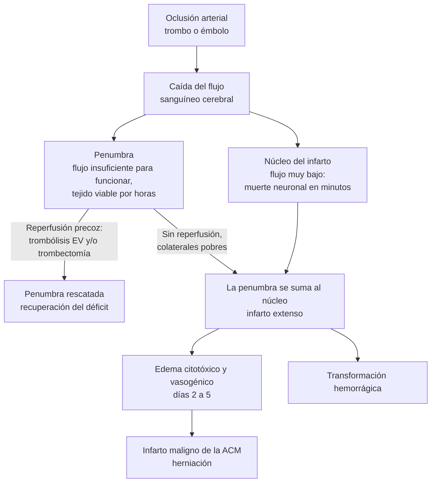

---
tags:
  - Neurología
  - GES
  - Urgencia
  - Frecuente en sala
---

# Accidente cerebrovascular (ACV) y crisis isquémica transitoria

**Subespecialidad**
Neurología vascular · Medicina de urgencia · Medicina interna

**Guías principales**
AHA/ASA 2026: manejo precoz del ACV isquémico agudo (*Stroke*, 2026) · AHA/ASA 2022: hemorragia intracerebral espontánea · AHA/ASA 2021: prevención secundaria del ACV y la crisis isquémica transitoria · AHA/ASA 2023: hemorragia subaracnoidea aneurismática

**Otras fuentes**
Estudio PISCIS (Iquique, *Lancet* 2005) · GBD 2021 Stroke (*Lancet Neurol* 2024) · Ensayos CHANCE, POINT, AcT, TIMELESS, DAWN, ELAN, INTERACT3 y ANNEXA-I

**GES**
Sí: accidente cerebrovascular isquémico en personas de 15 años y más

**EUNACOM**
1.10.2.007 Enfermedad cerebrovascular: isquémica, cardioembólica, hemorrágica y crisis isquémica transitoria (sospecha, inicial, derivar) · 1.10.2.008 Hemorragia subaracnoidea (sospecha, inicial)

**Revisado**
Septiembre 2026

!!! abstract "Resumen en 60 segundos"
    - **ACV** = déficit neurológico **focal y súbito** de origen vascular. **~ 65 % es isquémico**, ~ 29 % hemorragia intracerebral y ~ 6 % hemorragia subaracnoidea (GBD 2021). En Chile es **la primera o segunda causa de muerte**.
    - **"Tiempo es cerebro"**: activar el **código ACV**, medir la **glicemia capilar** y hacer una **TC de cerebro sin contraste** (más **angio-TC** si se sospecha oclusión de un gran vaso) **en los primeros ~ 20–25 minutos**. La TC distingue **isquemia de hemorragia**; la clínica **no**.
    - **Trombólisis EV** en el ACV isquémico **< 4,5 h** del último momento visto sano: **tenecteplase 0,25 mg/kg** en bolo o **alteplase 0,9 mg/kg**. La presión debe estar **≤ 185/110** antes y **< 180/105** durante las 24 h siguientes.
    - **Trombectomía mecánica** en la **oclusión de un gran vaso** (carótida interna, M1, basilar) **hasta 24 h**, según la imagen. **No retrasar** la trombectomía para ver si responde a la trombólisis.
    - Sin terapia de reperfusión, **hipertensión permisiva** (tratar sólo si > **220/120**). Aspirina en las primeras 24–48 h y **doble antiagregación por 21 días** en el ACV menor o la crisis isquémica transitoria (CIT) de alto riesgo.
    - En la **hemorragia intracerebral**: bajar la PAS a **~ 140 mmHg**, **revertir el anticoagulante** de inmediato, y controlar la glicemia, la temperatura y la deglución (*care bundle*).
    - **Prevención secundaria**: estatina de alta intensidad, PA **< 130/80**, anticoagulación con ACOD en la fibrilación auricular (**precoz**, según ELAN), y **endarterectomía** en la estenosis carotídea sintomática de 70–99 % **dentro de 2 semanas**.

## Definición

- **ACV isquémico (infarto cerebral)**: episodio de disfunción neurológica causado por un **infarto** focal del cerebro, la médula o la retina, demostrado por imagen o por la persistencia de los síntomas.
- **Crisis isquémica transitoria (CIT, TIA)**: episodio transitorio de disfunción neurológica por **isquemia focal sin infarto** en la imagen. Suele durar **< 1 hora**. La definición actual es **tisular**, no temporal (la antigua regla de "< 24 h" ya no se usa). Si la RM muestra un infarto, es un ACV aunque los síntomas se hayan resuelto.
- **Hemorragia intracerebral (HIC)**: sangrado espontáneo (no traumático) dentro del parénquima cerebral o de los ventrículos.
- **Hemorragia subaracnoidea (HSA)**: sangrado en el espacio subaracnoideo; **~ 85 %** de las espontáneas se debe a la **rotura de un aneurisma**.
- **Último momento visto sano (*last known well*)**: hora de inicio que se usa para decidir las terapias de reperfusión. Si el paciente despierta con el déficit, es la hora en que se acostó sano.

## Epidemiología

### Mundial

- **GBD 2021**:
    - **11,9 millones** de ACV nuevos al año, **93,8 millones** de personas vivas con un ACV y **7,3 millones de muertes**. Es la **tercera causa de muerte** (**10,7 %** de todas), detrás de la cardiopatía isquémica y el COVID-19.
    - Es la **cuarta causa de años de vida ajustados por discapacidad** (160,5 millones).
    - De los ACV nuevos, **65,3 %** fueron isquémicos, **28,8 %** HIC y **5,8 %** HSA.
    - La reducción de la incidencia se **estancó desde 2015** y aumentó en los menores de 70 años.
- **Más del 80 %** de la carga se atribuye a factores **modificables**: la **hipertensión arterial** es el más importante, seguida de la contaminación del aire, el tabaco, el LDL alto, la diabetes, la obesidad y el sedentarismo.
- **1 de cada 4 adultos** tendrá un ACV a lo largo de su vida.

### Chile

!!! chile "Datos nacionales"
    - **Estudio PISCIS** (Iquique, 2000–2002; Lavados, *Lancet* 2005), el estudio poblacional de referencia:
        - **Incidencia ajustada por edad**: **140,1 por 100.000** (infarto cerebral **87,3**, HIC **27,6**, HSA **6,2**).
        - **Letalidad**: **23,3 % a 30 días** y **33 % a 6 meses**.
        - La proporción de **HIC fue mayor** que en países de altos ingresos.
    - El ACV es la **primera o segunda causa de muerte** en Chile. Afecta a **más de 40.000 personas al año**, con cerca de **una muerte por hora**.
    - La tasa de mortalidad bajó de **52,1 a 40,8 por 100.000** entre 2010 y 2020 (DEIS).
    - **GES**: el **ACV isquémico en personas de 15 años y más** tiene garantía de diagnóstico, tratamiento y rehabilitación. La HIC y la HSA **no** están en ese problema GES.
    - **Red de telemedicina (TeleACV)**: desde 2017 conecta a neurólogos vasculares con hospitales sin neurólogo presencial para indicar la trombólisis y derivar a trombectomía.

## Etiología y factores de riesgo

### ACV isquémico: clasificación TOAST

| Mecanismo | Frecuencia aproximada | Claves |
|---|---|---|
| **Aterosclerosis de gran arteria** | ~ 20 % | Estenosis carotídea o intracraneal ≥ 50 %; CIT previas en el mismo territorio |
| **Cardioembolia** | **~ 20–25 %** | **Fibrilación auricular** (la más frecuente), IAM reciente con trombo, FEVI muy baja, prótesis mecánica, endocarditis, estenosis mitral. Déficit **máximo desde el inicio**, varios territorios, transformación hemorrágica |
| **Oclusión de pequeño vaso (lacunar)** | ~ 20–25 % | Hipertensión y diabetes; infartos < 15 mm en ganglios basales, cápsula interna, tálamo o protuberancia; **sin compromiso cortical** |
| **Otra causa determinada** | ~ 5 % | **Disección arterial** (el ACV del **joven**; cervicalgia, Horner), trombofilias, vasculitis, drogas (cocaína), anemia falciforme, síndrome antifosfolípido |
| **Criptogénico o indeterminado** | ~ 25–30 % | Estudio completo negativo o más de una causa. **ESUS**: infarto no lacunar de aspecto embólico sin fuente identificada (buscar fibrilación auricular paroxística, foramen oval permeable) |

### Hemorragia intracerebral

- **Hipertensión arterial** (ganglios basales, tálamo, protuberancia, cerebelo): la causa más frecuente.
- **Angiopatía amiloide** (hemorragias **lobares** en adultos mayores).
- **Anticoagulantes** (antagonistas de la vitamina K, ACOD) y antiagregantes.
- Malformaciones arteriovenosas y cavernomas (jóvenes), tumores, trombosis venosa cerebral, drogas simpaticomiméticas, coagulopatías.

### Factores de riesgo

- **No modificables**: edad, sexo masculino, antecedentes familiares, ACV o CIT previos.
- **Modificables**: **hipertensión** (el más importante), fibrilación auricular, diabetes, dislipidemia, **tabaquismo**, alcohol, obesidad, sedentarismo, dieta, apnea del sueño, estenosis carotídea.

## Fisiopatología

- **Isquemia**: la oclusión arterial reduce el flujo sanguíneo cerebral.
    - En el **núcleo (*core*)** el flujo es muy bajo y la muerte neuronal ocurre en minutos: falla energética, despolarización, excitotoxicidad por glutamato, entrada de calcio y edema citotóxico.
    - En la **penumbra** el flujo es insuficiente para funcionar pero suficiente para sobrevivir **horas**. Es **tejido rescatable** y es el blanco de la reperfusión.
    - Sin reperfusión, el núcleo crece a costa de la penumbra. En un ACV de gran vaso se pierden **~ 1,9 millones de neuronas por minuto**.
    - La velocidad de crecimiento depende de la **circulación colateral**. Por eso la selección por **imagen** (perfusión) permite tratar algunos pacientes hasta las 24 h.
- **Hemorragia intracerebral**: el hematoma daña por **efecto de masa** y aumento de la presión intracraneana. **Un tercio crece** en las primeras horas (más aún con anticoagulantes), y luego aparecen edema perihematoma e inflamación.

*Figura 1. Núcleo y penumbra en el ACV isquémico. Esquema propio.*

## Clasificación

- **Por tipo**: isquémico (incluye la CIT), hemorragia intracerebral, hemorragia subaracnoidea y trombosis venosa cerebral.
- **Por mecanismo** (isquémico): **TOAST** (tabla anterior).
- **Por territorio** (Oxfordshire o Bamford): orienta sobre el pronóstico.

| Síndrome (Oxfordshire) | Clínica | Pronóstico |
|---|---|---|
| **TACI** (circulación anterior total) | **Las tres**: hemiparesia o hemihipoestesia (≥ 2 de cara, brazo y pierna) + **hemianopsia** + **disfunción cortical** (afasia, negligencia) | El peor: alta mortalidad al año |
| **PACI** (circulación anterior parcial) | Dos de las tres, o disfunción cortical aislada | Alto riesgo de recurrencia precoz |
| **LACI** (lacunar) | Motor puro, sensitivo puro, sensitivo-motor, **hemiparesia atáxica**, disartria-mano torpe; **sin** signos corticales | El mejor pronóstico vital |
| **POCI** (circulación posterior) | Signos de tronco o cerebelo, **síndromes cruzados** (par craneal de un lado y déficit motor del otro), hemianopsia aislada, compromiso bilateral | Variable; la oclusión de la **basilar** es muy grave |

- **Por gravedad**: escala **NIHSS** (0–42). **ACV menor**: NIHSS ≤ 3–5. Un NIHSS ≥ 6 sugiere oclusión de gran vaso.

## Clínica

### Signos de alarma para la población: BE-FAST

- **B**alance: pérdida brusca del equilibrio.
- **E**yes: pérdida de visión.
- **F**ace: desviación de la comisura.
- **A**rm: debilidad de un brazo.
- **S**peech: alteración del lenguaje.
- **T**ime: llamar de inmediato (SAMU 131) y anotar la hora.

### Síndromes vasculares

| Arteria | Clínica |
|---|---|
| **Cerebral media (ACM)** | Hemiparesia y hemihipoestesia **faciobraquial** > crural contralateral, **hemianopsia**, desviación de la mirada **hacia la lesión**. **Afasia** si es el hemisferio dominante (izquierdo); **negligencia** y anosognosia si es el derecho |
| **Cerebral anterior** | Paresia **crural** (pierna > brazo) contralateral, abulia, incontinencia |
| **Cerebral posterior** | **Hemianopsia homónima** contralateral, alexia sin agrafia, alteraciones de la memoria (tálamo) |
| **Vertebrobasilar** | **Vértigo con signos neurológicos**, diplopía, disartria, disfagia, ataxia, **síndromes cruzados**, compromiso de conciencia, cuadriparesia. **Oclusión basilar**: coma o síndrome de enclaustramiento |
| **Cerebelo** | Vértigo, vómitos, ataxia de la marcha; riesgo de **hidrocefalia y compresión del tronco** en los días siguientes |
| **Amaurosis fugaz** | Pérdida **monocular** transitoria de la visión ("una cortina"): isquemia retiniana por **estenosis carotídea** ipsilateral |

- **Hemorragia intracerebral**: el déficit focal se acompaña con más frecuencia de **cefalea**, vómitos, **compromiso de conciencia** progresivo y PA muy elevada. Aun así, **sólo la imagen** distingue una hemorragia de un infarto.
- **Hemorragia subaracnoidea**: ver la sección propia más abajo.

!!! alarma "Simuladores de ACV (*stroke mimics*)"
    - **Hipoglicemia**: mide la **glicemia capilar** a todo paciente con déficit focal, antes de cualquier otra cosa.
    - Otros simuladores:
        - **Crisis epiléptica** con parálisis de Todd.
        - **Migraña con aura**.
        - Trastorno **funcional**.
        - **Recrudescencia** de un ACV antiguo por una infección, una hiponatremia o una hipotensión.
        - Tumor o hematoma subdural.
        - Encefalopatía de Wernicke.
        - Síncope.
    - La trombólisis de un simulador rara vez produce complicaciones. **No retrases** la trombólisis por la duda si la glicemia es normal y el cuadro es compatible.

## Diagnóstico

**Paso 1. Sospecha y activación del código ACV**:

- Déficit focal súbito.
- Anotar la **hora del último momento visto sano**.
- **Glicemia capilar**.
- **Escala NIHSS**.
- Dos vías venosas.
- Exámenes basales.
- **Sin** retrasar la imagen.

**Paso 2. Imagen urgente**: **TC de cerebro sin contraste** en los primeros **~ 20–25 minutos** desde la llegada.

- Primero **descarta una hemorragia**.
- Luego busca **signos precoces de isquemia**:
    - Pérdida de la diferenciación entre sustancia gris y blanca.
    - Borramiento de surcos.
    - Hipodensidad del núcleo lenticular o de la ínsula.
    - **Arteria cerebral media hiperdensa** (el trombo).
- Cuantifica la extensión con el **ASPECTS** (10 = normal; se resta 1 punto por cada región afectada).

**Paso 3. Angio-TC** de vasos intra y extracraneales si el paciente es candidato a trombectomía (NIHSS ≥ 6 o sospecha de oclusión de gran vaso).

- **No esperar** la creatinina para hacerla.
- La **perfusión** (TC o RM) se agrega en las ventanas extendidas (4,5–24 h) o en el ACV al despertar.

**Paso 4. Decidir la reperfusión** (trombólisis y/o trombectomía) **sin esperar** exámenes, salvo:

- La glicemia.
- Las plaquetas y la coagulación, **sólo** si hay sospecha de alteración o uso de anticoagulantes.

**Paso 5. Estudio etiológico**, en las primeras 24–48 h:

- **ECG** y **monitoreo cardíaco** (buscar fibrilación auricular; Holter prolongado si el ACV parece embólico).
- **Estudio de carótidas** con eco-Doppler o angio-TC.
- **Ecocardiograma**.
- Perfil lipídico, HbA1c.
- En el joven: estudio de disección, trombofilias y drogas.

### Crisis isquémica transitoria: estratificación del riesgo

- El riesgo de ACV después de una CIT es **máximo en las primeras 48 horas**.
- Toda CIT se estudia **en forma urgente** (idealmente en < 24 h), con imagen cerebral, estudio vascular y ECG.
- El **puntaje ABCD²** ayuda a priorizar, pero **no** reemplaza el estudio. Una **estenosis carotídea** o una **fibrilación auricular** implican alto riesgo cualquiera sea el puntaje.

| ABCD² | Criterio | Puntos |
|---|---|---|
| **A**ge | Edad ≥ 60 años | 1 |
| **B**lood pressure | PA ≥ 140/90 en la primera evaluación | 1 |
| **C**linical | **Debilidad unilateral**: 2 · Alteración del lenguaje sin debilidad: 1 | 1–2 |
| **D**uration | ≥ 60 min: 2 · 10–59 min: 1 | 1–2 |
| **D**iabetes | Presente | 1 |

**Puntaje ≥ 4** = alto riesgo: hospitalizar o estudiar de inmediato y dar **doble antiagregación** si no hay contraindicación.

## Laboratorio

| Examen | Para qué |
|---|---|
| **Glicemia capilar** | **Obligatoria antes de la trombólisis**: la hipoglicemia simula un ACV. Corregir si < 50 mg/dL |
| **Hemograma y plaquetas** | Contraindicación de trombólisis si hay < 100.000/mm³; no esperar el resultado salvo sospecha |
| **TP/INR, TTPA** | En usuarios de anticoagulantes o con sospecha de coagulopatía (trombólisis contraindicada si INR > 1,7) |
| **Creatinina, electrolitos** | Función renal (ACOD, contraste); **no esperar** para la angio-TC |
| **Troponina, ECG** | IAM concomitante, fibrilación auricular |
| **Perfil lipídico, HbA1c** | Prevención secundaria |
| **Toxicología, pruebas de embarazo** | Según el contexto (cocaína y anfetaminas en el joven) |
| **Estudio de trombofilia, anticuerpos antifosfolípidos, VIH, VDRL** | Jóvenes o ACV criptogénico |

## Imágenes

- **TC sin contraste**: la primera imagen, rápida y disponible.
    - La **hemorragia** se ve **hiperdensa** desde el inicio (sensibilidad cercana al 100 %).
    - El **infarto** puede verse normal en las primeras horas.
- **Angio-TC**: identifica la **oclusión de gran vaso** (candidato a trombectomía), la estenosis carotídea, la disección y el "*spot sign*" en la HIC (predice el crecimiento del hematoma).
- **Perfusión (TC o RM)**: estima el **núcleo** y la **penumbra** (*mismatch*). Se usa para seleccionar la trombólisis y la trombectomía en las ventanas extendidas.
- **RM con difusión (DWI)**: la más sensible para el infarto agudo (positiva en minutos). El ***mismatch* DWI-FLAIR** (lesión visible en difusión y aún no en FLAIR) sugiere un inicio < 4,5 h y permite trombolizar el ACV al despertar.
- **Eco-Doppler carotídeo**: estudio de la estenosis carotídea en la CIT y el ACV de circulación anterior.
- **Ecocardiograma** transtorácico; **transesofágico** si se sospecha endocarditis, trombo en la aurícula izquierda, foramen oval permeable o ateroma del arco aórtico.

<figure markdown>
![Cuatro imágenes axiales de cerebro de una mujer de 77 años con oclusión de la arteria cerebral media izquierda. A: TC sin contraste con las diez regiones del ASPECTS delineadas en amarillo y dos regiones afectadas en rojo (núcleo caudado y lenticular), ASPECTS 8. B: angio-TC con el puntaje de colaterales. C: mapa de perfusión con un núcleo pequeño en rojo y la zona hipoperfundida en amarillo. D: RM de difusión a las 36 horas, tras una recanalización completa, que muestra sólo un infarto pequeño del estriado](../assets/figuras/acv/mokli-2019-aspects-perfusion.jpg){ loading=lazy }
<figcaption>Figura 2. Oclusión M1 izquierda (NIHSS 17) con buenas colaterales. A: ASPECTS 8 (núcleo caudado y lenticular afectados). B: angio-TC con colaterales del 54 %. C: perfusión con zona hipoperfundida pequeña. D: RM de difusión a las 36 h tras la trombectomía (mTICI 3), con infarto limitado al estriado; la paciente se recuperó por completo (NIHSS 0). Fuente: Mokli Y, Pfaff J, Pinto dos Santos D, Herweh C, Nagel S. Computer-aided imaging analysis in acute ischemic stroke – background and clinical applications. <em>Neurol Res Pract.</em> 2019;1:23, figura 4. Licencia <a href="https://creativecommons.org/licenses/by/4.0/">CC BY 4.0</a>.</figcaption>
</figure>

## Diagnóstico diferencial

| Cuadro | Claves |
|---|---|
| **Hipoglicemia** | Glicemia capilar baja; el déficit revierte con glucosa |
| **Crisis epiléptica con parálisis de Todd** | Convulsión presenciada, antecedente de epilepsia, déficit que mejora en horas |
| **Migraña con aura** | Síntomas **positivos** (luces, parestesias) que **progresan** en minutos ("marcha"), seguidos de cefalea; antecedente de episodios similares |
| **Hematoma subdural** | Caída o trauma, anticoagulantes, instalación subaguda; se ve en la TC |
| **Tumor cerebral** | Instalación progresiva, cefalea, crisis; puede sangrar y debutar en forma brusca |
| **Encefalitis o absceso** | Fiebre, compromiso de conciencia, crisis |
| **Vértigo periférico** | Vértigo aislado con nistagmo horizontal unidireccional, sin otros signos. El **HINTS** ayuda a diferenciarlo de un infarto cerebeloso |
| **Parálisis facial periférica (Bell)** | Compromete **toda la hemicara**, incluida la frente (en el ACV se respeta la frente). Ver [parálisis facial periférica](paralisis-facial-periferica.md) |
| **Trastorno funcional** | Inconsistencias en el examen (signo de Hoover) |
| **Síncope** | Pérdida de conciencia transitoria **sin** déficit focal |

## Tratamiento

### ACV isquémico agudo: medidas generales

!!! guia "AHA/ASA 2026: ACV isquémico agudo"
    - Sistemas organizados de **código ACV**, traslado directo a centros capaces de hacer trombectomía cuando se sospecha oclusión de gran vaso, **unidades móviles** y **telemedicina**.
    - **Trombólisis EV** con **tenecteplase** o **alteplase** en las primeras **4,5 h** (recomendación clase 1).
    - En pacientes seleccionados, trombólisis también entre **4,5 y 24 h** (o en el ACV al despertar) si la imagen muestra **tejido rescatable**.
    - **Trombectomía** hasta **24 h** en la oclusión de gran vaso anterior, incluidos algunos **núcleos grandes** (ASPECTS bajo) y la oclusión de la **basilar**.
    - En los hospitales sin perfusión, el ASPECTS de la TC basta para seleccionar.
    - **No** se recomienda de rutina la trombectomía en las oclusiones de vasos medianos o distales.
    - En los candidatos a ambas terapias, dar la trombólisis y **no esperar** su respuesta para la trombectomía.

**Medidas generales** (en todos):

- **Unidad de tratamiento del ACV** (reduce la mortalidad y la dependencia).
- Cabecera a 0–30°.
- **SpO₂ > 94 %** (sin oxígeno si está normal).
- **Evaluación de la deglución** antes de dar cualquier cosa por boca.
- **Glicemia 140–180 mg/dL**, evitando la hipoglicemia.
- **Normotermia** (tratar la fiebre y buscar su causa).
- Suero fisiológico (evitar soluciones hipotónicas y glucosadas).
- **Prevención de la TVP** con compresión neumática intermitente (no medias elásticas).
- **Movilización y rehabilitación** precoces, pero **no** muy intensas en las primeras 24 h.

### Presión arterial

| Situación | Meta | Cómo |
|---|---|---|
| **Candidato a trombólisis** | **≤ 185/110** antes de iniciarla | Labetalol o nicardipino EV |
| **Durante y 24 h después de la trombólisis** | **< 180/105** | Controles cada 15 min por 2 h, cada 30 min por 6 h y luego cada hora |
| **Tras la trombectomía** | < 180/105 | **No** bajar a < 140 (el ensayo de metas intensivas tuvo **peor** evolución funcional) |
| **Sin terapia de reperfusión** | **Hipertensión permisiva**: tratar sólo si **> 220/120** | Bajar **~ 15 %** en las primeras 24 h. Excepciones: IAM, disección aórtica, edema pulmonar o encefalopatía hipertensiva |
| **Después de 48–72 h**, estable | Reiniciar o iniciar los antihipertensivos | Meta crónica **< 130/80** |

### Trombólisis endovenosa

!!! dosis "Trombolíticos en el ACV isquémico"
    - **Tenecteplase**: **0,25 mg/kg** EV en **bolo único** de 5 segundos (máximo **25 mg**). Tan eficaz y segura como la alteplase (AcT, 2022) y más simple, sobre todo cuando se traslada al paciente a trombectomía.
    - **Alteplase**: **0,9 mg/kg** (máximo **90 mg**). El **10 %** va en bolo en 1 minuto y el **90 %** restante en infusión de 60 minutos.
    - **Tiempo puerta-aguja**: meta **≤ 60 minutos** (ideal ≤ 45).
    - **Después de la trombólisis**:
        - **No** antiagregantes ni anticoagulantes por **24 h**. Antes de iniciarlos, hacer una TC de control.
        - Evitar sondas y punciones arteriales en las primeras horas.
        - Vigilar el **angioedema orolingual** (más frecuente con IECA).
    - **Hemorragia sintomática** (~ 2–6 %): la sospechas ante un deterioro neurológico, una cefalea intensa, vómitos o una alza brusca de la PA. **Suspender la infusión**, hacer una TC urgente y pedir fibrinógeno. Si hay sangrado: **crioprecipitado** (10 U) y ácido tranexámico 1 g EV.

**Contraindicaciones principales de la trombólisis**:

- **Hemorragia** en la TC, o **hipodensidad extensa** ya establecida.
- **ACV isquémico** o **TEC grave** en los últimos **3 meses**.
- **Cirugía intracraneana o raquimedular** en los últimos 3 meses.
- Antecedente de **hemorragia intracraneana**.
- **Tumor intracraneal intraaxial**.
- **Hemorragia digestiva** en los últimos 21 días.
- **Endocarditis infecciosa** o **disección aórtica**.
- **Plaquetas < 100.000**, **INR > 1,7**, uso de **heparina** en dosis terapéutica o de un **ACOD en las últimas 48 h**. Excepción: si las pruebas específicas son normales.
- **PA no controlable** > 185/110.
- **Glicemia < 50 mg/dL** (corregir y reevaluar).

!!! perla "Déficit leve y no discapacitante"
    Si el déficit es **leve y no discapacitante** (por ejemplo, una hipoestesia aislada, NIHSS 0–5), la trombólisis **no** aporta beneficio. En esos pacientes se prefiere la **doble antiagregación**.

### Trombectomía mecánica

**Indicaciones** (AHA/ASA 2026):

- **Oclusión de gran vaso** de la circulación anterior (**carótida interna o M1**) con NIHSS ≥ 6.
- En las primeras **6 h**: ASPECTS ≥ 3 (incluye núcleos grandes seleccionados).
- Entre **6 y 24 h**: selección por la imagen (desproporción entre el déficit y el núcleo; ensayos DAWN y DEFUSE-3).
- **Oclusión de la basilar**: también es candidata.
- Se puede considerar con **discapacidad previa leve o moderada**.

**Cómo se hace**: con stent recuperador y/o aspiración. **Siempre** se da la trombólisis a los candidatos, y **no** se espera su efecto antes de la trombectomía.

**Número necesario a tratar**: ~ **2,6** para que un paciente tenga menos discapacidad. Es una de las terapias más eficaces de la medicina.

### Antiagregación y ACV menor

!!! dosis "Antitrombóticos en el ACV isquémico y la CIT"
    - **ACV no menor sin trombólisis**: **aspirina 160–325 mg** en las primeras **24–48 h**, luego 75–100 mg al día.
    - **ACV menor (NIHSS ≤ 3) o CIT de alto riesgo (ABCD² ≥ 4), no cardioembólicos**: **doble antiagregación por 21 días** (CHANCE 2013, POINT 2018), iniciada en las primeras **24 h**.
        - **Clopidogrel** carga de **300–600 mg**, luego 75 mg al día.
        - **Aspirina** carga de **160–325 mg**, luego 75–100 mg al día.
        - Después sigue **un solo antiagregante**.
        - Alternativa: **ticagrelor** 180 mg de carga y 90 mg cada 12 h + aspirina por 30 días (NIHSS ≤ 5).
    - **Estatina de alta intensidad**: **atorvastatina 40–80 mg**, con meta de **LDL < 70 mg/dL**.
    - **Anticoagulación en el ACV isquémico agudo**: **no** se usa de rutina, ni siquiera en la fibrilación auricular, en las primeras horas.

### ACV cardioembólico por fibrilación auricular

- **ACOD** en vez de antagonistas de la vitamina K (salvo prótesis mecánica o estenosis mitral moderada a grave).
- **Inicio precoz** según el tamaño del infarto (ELAN, 2023; seguro y sin más hemorragias):
    - **Menor o moderado**: en las primeras **48 h**.
    - **Mayor**: al **día 6–7**.
- **No** agregar aspirina al anticoagulante.
- Si hay contraindicación de anticoagular: **cierre de la orejuela**.

### Edema cerebral e infarto maligno

- Sospecha el **infarto maligno** ante un infarto extenso de la ACM (> 50 % del territorio) en un paciente con deterioro de conciencia entre los días **2 y 5**.
- **Craniectomía descompresiva** en las primeras **48 h**: reduce la mortalidad a la mitad, sobre todo en los **< 60 años**.
- En los infartos **cerebelosos** extensos: vigilar la **hidrocefalia** y la **compresión del tronco** (ventriculostomía o descompresión suboccipital).
- Mientras tanto:
    - Cabecera a 30°.
    - **Suero salino hipertónico** o **manitol**.
    - **No** usar corticoides.

### Hemorragia intracerebral

!!! guia "AHA/ASA 2022 e INTERACT3"
    - **Presión arterial**:
        - En la HIC leve a moderada con PAS de 150–220, **bajar a ~ 140 mmHg** (rango 130–150).
        - Hacerlo en forma **suave y sostenida**, sin caídas bruscas.
        - **No** bajar a < 130 mmHg.
    - ***Care bundle*** precoz (INTERACT3 redujo la mala evolución funcional):
        - PAS < 140.
        - **Glicemia** 110–140 (sin diabetes) o 140–180 (con diabetes).
        - **Temperatura** ≤ 37,5 °C.
        - **Revertir la anticoagulación** en la primera hora.
    - **Suspender** antiagregantes y anticoagulantes. **No transfundir plaquetas** a usuarios de antiagregantes que no van a cirugía (ensayo PATCH: peor evolución).
    - **Neurocirugía**:
        - **Hematoma cerebeloso** > 3 cm, con compresión del tronco o hidrocefalia: **evacuación urgente**.
        - **Hidrocefalia**: ventriculostomía.
        - **Hematomas supratentoriales lobares**: la cirugía mínimamente invasiva está en evaluación.
    - **Profilaxis de TVP**: compresión neumática desde el ingreso; **heparina** en dosis profilácticas a las **24–48 h** si el hematoma está estable.
    - **Crisis epilépticas**: tratarlas, pero **no** usar anticonvulsivantes profilácticos.

!!! dosis "Reversión de anticoagulantes en la hemorragia intracraneana"
    | Anticoagulante | Reversión |
    |---|---|
    | **Warfarina o acenocumarol** (INR ≥ 1,4) | **Concentrado de complejo protrombínico de 4 factores** (25–50 U/kg según el INR) + **vitamina K 10 mg EV**. El plasma fresco congelado es inferior (más lento y con más volumen) |
    | **Dabigatrán** | **Idarucizumab 5 g** EV (2 × 2,5 g) |
    | **Rivaroxabán, apixabán, edoxabán** | **Andexanet alfa** (ANNEXA-I, 2024: mejor control del hematoma pero **más eventos trombóticos**) o **complejo protrombínico 50 U/kg** (la opción disponible habitualmente) |
    | **Heparina no fraccionada** | **Protamina** 1 mg por cada 100 U de heparina de las últimas 2–3 h (máximo 50 mg) |
    | **Heparina de bajo peso molecular** | Protamina (reversión parcial) |
    | **Trombólisis** reciente | Crioprecipitado, ácido tranexámico |

**Puntaje ICH (Hemphill)** para estimar la mortalidad a 30 días. Se usa para informar a la familia, **no** para limitar el tratamiento en las primeras 24 h.

| Criterio | Puntos |
|---|---|
| **Glasgow** 3–4 / 5–12 / 13–15 | 2 / 1 / 0 |
| **Volumen del hematoma** ≥ 30 mL (fórmula ABC/2) | 1 |
| **Inundación ventricular** | 1 |
| **Origen infratentorial** | 1 |
| **Edad ≥ 80 años** | 1 |

**Mortalidad a 30 días según el puntaje**: 0 puntos = 0 %; 1 = 13 %; 2 = 26 %; 3 = 72 %; 4 = 97 %; 5 = 100 %.

### Hemorragia subaracnoidea (HSA)

- **Clínica**:
    - **Cefalea en trueno**: súbita, **máxima en < 1 minuto**, "la peor de mi vida".
    - Vómitos, **rigidez de nuca** (aparece en horas), fotofobia.
    - Compromiso de conciencia, crisis.
    - Parálisis del III par (aneurisma de la comunicante posterior).
    - Puede haber una **cefalea centinela** días antes.
- **Diagnóstico**:
    - **TC sin contraste**: sensibilidad cercana al **100 % en las primeras 6 h**, y luego disminuye.
    - Si la TC es negativa y han pasado **> 6 h**: **punción lumbar**. Se busca **xantocromía** (a partir de las 12 h) y glóbulos rojos que no disminuyen entre el primer y el último tubo.
    - Luego **angio-TC** o angiografía para buscar el aneurisma.
- **Gravedad**: escalas de **Hunt y Hess** y de la **WFNS** (clínica); escala de **Fisher modificada** (sangre en la TC, predice el vasoespasmo).
- **Tratamiento inicial** (AHA/ASA 2023):
    - Traslado urgente a un centro con neurocirugía y neurorradiología intervencional.
    - **Asegurar el aneurisma lo antes posible** (idealmente < 24 h), con **embolización endovascular** (*coiling*) o **clipaje**.
    - **Controlar la PA** para evitar el resangrado mientras el aneurisma no está asegurado (en general PAS < 160).
    - **Nimodipino 60 mg VO cada 4 h por 21 días**: previene la isquemia cerebral diferida y mejora el pronóstico.
    - Analgesia, antieméticos, **euvolemia** (no hipervolemia profiláctica).
    - Revertir los anticoagulantes.
    - Ventriculostomía si hay hidrocefalia.
- **Complicaciones**:
    - **Resangrado**: sobre todo en las primeras 24 h; muy letal.
    - **Vasoespasmo e isquemia cerebral diferida** (días **3–14**).
    - **Hidrocefalia**.
    - **Hiponatremia**: SIADH o cerebro perdedor de sal. **No restringir volumen**.
    - Crisis epilépticas, arritmias y miocardiopatía por estrés (Takotsubo), edema pulmonar neurogénico.

### Prevención secundaria

| Medida | Recomendación (AHA/ASA 2021) |
|---|---|
| **Presión arterial** | Meta **< 130/80** en la mayoría. Iniciar o reiniciar tras las primeras 48–72 h |
| **Lípidos** | **Atorvastatina 80 mg**; meta de **LDL < 70 mg/dL** (agregar ezetimiba o iPCSK9 si es necesario) |
| **Antiagregación** (no cardioembólico) | **Aspirina**, **clopidogrel** o aspirina + dipiridamol **a largo plazo**. La doble antiagregación sólo por **21–30 días** (o 90 días en la estenosis intracraneal grave) |
| **Fibrilación auricular** | **ACOD** (ver arriba) |
| **Estenosis carotídea sintomática** | **70–99 %**: **endarterectomía**, idealmente en las primeras **2 semanas**. **50–69 %**: según la edad, el sexo y las comorbilidades. **< 50 %**: sólo tratamiento médico. Angioplastia con stent como alternativa en casos seleccionados |
| **Foramen oval permeable** | **Cierre percutáneo** en los pacientes de **18–60 años** con infarto embólico sin otra causa |
| **Diabetes** | HbA1c < 7 %; preferir **arGLP-1** o **iSGLT2** con beneficio cardiovascular |
| **Estilo de vida** | **Dejar de fumar**, limitar el alcohol, actividad física, dieta mediterránea, bajar de peso, tratar la **apnea del sueño** |
| **Después de una HIC** | Control estricto de la PA. En la fibrilación auricular, reiniciar la anticoagulación o evaluar el cierre de la orejuela según el riesgo (decisión del especialista) |

## Complicaciones

- **Neurológicas**:
    - **Edema** e **infarto maligno**, **transformación hemorrágica**.
    - **Hidrocefalia** (cerebelo, HIC con inundación ventricular, HSA).
    - **Crisis epilépticas**, recurrencia precoz.
- **Médicas**:
    - **Neumonía aspirativa**: la complicación más frecuente. Evitarla con la **evaluación de la deglución**.
    - Infección urinaria, **TVP y TEP**, úlceras por presión, caídas.
    - **Delirium**, **depresión posACV** (en un tercio de los pacientes), dolor de hombro.
    - **Hiponatremia**, hiperglicemia, IAM y arritmias.
- **A largo plazo**: **discapacidad** (el ACV es una de las principales causas de dependencia), espasticidad, **deterioro cognitivo y demencia vascular**, epilepsia.

## Pronóstico y seguimiento

- **Mortalidad**: en Chile (PISCIS), un **23 % a 30 días** y un **33 % a 6 meses**, mayor en la HIC que en el infarto.
- De los sobrevivientes, **un tercio** queda con dependencia.
- **Riesgo de recurrencia**:
    - Tras una CIT: **~ 5 % a 90 días**, la mitad en las primeras 48 h.
    - Tras un ACV: ~ 10 % al año, y hasta 25–30 % a 5 años si no hay prevención secundaria.
- **Escala de Rankin modificada** (0–6): la medida de la discapacidad que usan los ensayos. Un Rankin 0–2 se considera independencia funcional.
- **Perfil EUNACOM** (sospecha, inicial, derivar). El médico general debe:
    1. **Reconocer** el ACV.
    2. **Activar el código ACV** y derivar de inmediato a un centro con TC y trombólisis.
    3. Conocer las **medidas iniciales**: glicemia, ABC, régimen cero, PA permisiva, **no** bajar la PA en forma brusca.
    4. Hacer la **prevención secundaria** en la APS.
- **Seguimiento**:
    - Rehabilitación kinésica, fonoaudiológica y de terapia ocupacional.
    - Control de los factores de riesgo en la APS.
    - Pesquisa de la depresión, la disfagia y el deterioro cognitivo.
    - Educación en BE-FAST a la familia.

## Perlas para el internado

!!! perla "Para la sala y el turno"
    - **Glicemia capilar** a todo déficit focal agudo, **antes** de pensar en otra cosa.
    - **Anota la hora del último momento visto sano**, no la hora en que lo encontraron. Si se despertó con el déficit, la hora es la de acostarse.
    - **Nunca** bajes la PA en forma brusca en un ACV isquémico sin trombólisis. La nifedipino sublingual está **proscrita**.
    - **Régimen cero** hasta evaluar la deglución: la neumonía aspirativa mata más que el propio ACV en muchos pacientes.
    - La **clínica no distingue** la isquemia de la hemorragia: **no des aspirina** antes de la TC.
    - Una **hemiparesia con desviación de la mirada**, **afasia** o **negligencia** sugiere **oclusión de gran vaso**: pide angio-TC y avisa al centro con trombectomía.
    - **Vértigo agudo + un solo signo neurológico** (diplopía, disartria, ataxia) = **ACV de fosa posterior** hasta demostrar lo contrario.
    - En la **HIC con anticoagulante**, la reversión es tan urgente como la TC.
    - **CIT = urgencia**: estúdiala en < 24 h y da doble antiagregación si el riesgo es alto.

## Preguntas de repaso

??? repaso "1. Hombre de 68 años, hipertenso, con hemiparesia derecha y afasia de inicio a las 10:30 h. Llega a las 11:40 h. Glicemia 128 mg/dL, PA 196/104, NIHSS 16. La TC no muestra hemorragia (ASPECTS 9). ¿Qué haces?"
    Está en ventana (< 4,5 h) y el NIHSS alto sugiere **oclusión de gran vaso**.

    1. Bajar la PA a **≤ 185/110** con **labetalol** o **nicardipino** EV.
    2. **Trombólisis EV**: tenecteplase 0,25 mg/kg en bolo, o alteplase 0,9 mg/kg.
    3. Hacer una **angio-TC** de inmediato.
    4. Si hay oclusión de la carótida interna o de M1: **trombectomía**, sin esperar la respuesta a la trombólisis. Si el hospital no la hace, trasladar.
    5. Después: PA **< 180/105** por 24 h, y **no** dar antiagregantes en las primeras 24 h.

??? repaso "2. Mujer de 74 años que tuvo 30 minutos de debilidad del brazo izquierdo y disartria, ya resueltos. PA 150/90, diabética. ¿Cuál es su riesgo y cuál es el manejo?"
    Es una **CIT** con **ABCD² = 6**: edad 1, PA 1, debilidad 2, duración 30 min 1, diabetes 1. Es de **alto riesgo**.

    - **Estudio urgente**, idealmente en < 24 h: imagen cerebral (RM si es posible), **estudio carotídeo** (eco-Doppler o angio-TC), ECG y monitoreo del ritmo, perfil lipídico.
    - **Doble antiagregación** por **21 días**: clopidogrel 300–600 mg de carga y 75 mg/día, más aspirina.
    - **Atorvastatina 80 mg**.
    - **Endarterectomía** en < 2 semanas si hay una estenosis carotídea derecha de 70–99 %.

??? repaso "3. Hombre de 80 años, usuario de apixabán por fibrilación auricular, con cefalea, hemiparesia izquierda y Glasgow 13. PA 205/110. La TC muestra un hematoma talámico derecho de 20 mL sin inundación ventricular. ¿Cuál es el manejo inicial?"
    **Hemorragia intracerebral asociada a un anticoagulante**.

    - **Suspender el apixabán** y **revertir** con complejo protrombínico (50 U/kg) o andexanet alfa.
    - **Bajar la PAS a ~ 140 mmHg** (130–150) en forma suave con labetalol o nicardipino EV.
    - *Care bundle*: glicemia, temperatura, evaluación de la deglución.
    - Hospitalizar en una **unidad de paciente crítico o de ACV**, con TC de control por riesgo de crecimiento.
    - **Puntaje ICH = 1** (edad ≥ 80): mortalidad estimada de ~ 13 %.

??? repaso "4. Mujer de 45 años con cefalea súbita \"la peor de mi vida\", vómitos y rigidez de nuca, de 8 horas de evolución. La TC de cerebro es normal. ¿Qué haces?"
    Sospecha de **hemorragia subaracnoidea**. Como han pasado **> 6 h**, una TC normal **no la descarta**: hacer una **punción lumbar** y buscar **xantocromía** y glóbulos rojos que no se aclaran.

    Si es positiva:

    1. **Angio-TC** para buscar el aneurisma.
    2. Traslado a un centro con neurocirugía para **asegurarlo precozmente** (*coiling* o clipaje).
    3. **Nimodipino 60 mg cada 4 h por 21 días**.
    4. Control de la PA (PAS < 160) y analgesia.
    5. Vigilar el resangrado, el vasoespasmo (días 3–14), la hidrocefalia y la hiponatremia.

??? repaso "5. Paciente con un ACV isquémico de 6 horas de evolución que no recibió trombólisis ni trombectomía. PA 190/100. ¿Tratas la presión? ¿Cuándo anticoagulas si tiene una fibrilación auricular?"
    **No** tratas la PA: en el ACV isquémico sin reperfusión se permite hasta **220/120** (hipertensión permisiva para mantener la perfusión de la penumbra). Si supera esa cifra, bajar ~ 15 % en 24 h. Das **aspirina** tras la TC.

    Para la **fibrilación auricular**, usar un **ACOD** con **inicio precoz** según el tamaño del infarto (ELAN):

    - Infarto menor o moderado: en las primeras **48 h**.
    - Infarto mayor: al **día 6–7**.

    No se anticoagula en las primeras horas ni se usa heparina "puente".

??? repaso "6. ¿Cómo distingues una parálisis facial central de una periférica?"
    - **Central** (ACV, lesión supranuclear): afecta **sólo la mitad inferior** de la cara. La **frente se respeta** porque tiene inervación cortical bilateral. Suele acompañarse de hemiparesia del mismo lado de la parálisis.
    - **Periférica** (Bell, lesión del VII par): afecta **toda la hemicara**, incluida la frente (no arruga la frente ni cierra el ojo; signo de Bell), sin otros déficits.

## Referencias

1. Prabhakaran S, Gonzalez NR, Zachrison KS, et al. 2026 Guideline for the Early Management of Patients With Acute Ischemic Stroke: A Guideline From the American Heart Association/American Stroke Association. *Stroke.* 2026;57(8):e316–e436.
2. Greenberg SM, Ziai WC, Cordonnier C, et al. 2022 Guideline for the Management of Patients With Spontaneous Intracerebral Hemorrhage: A Guideline From the American Heart Association/American Stroke Association. *Stroke.* 2022;53:e282–e361.
3. Kleindorfer DO, Towfighi A, Chaturvedi S, et al. 2021 Guideline for the Prevention of Stroke in Patients With Stroke and Transient Ischemic Attack: A Guideline From the American Heart Association/American Stroke Association. *Stroke.* 2021;52:e364–e467.
4. Hoh BL, Ko NU, Amin-Hanjani S, et al. 2023 Guideline for the Management of Patients With Aneurysmal Subarachnoid Hemorrhage: A Guideline From the American Heart Association/American Stroke Association. *Stroke.* 2023;54:e314–e370. doi:[10.1161/STR.0000000000000436](https://doi.org/10.1161/STR.0000000000000436)
5. GBD 2021 Stroke Risk Factor Collaborators. Global, regional, and national burden of stroke and its risk factors, 1990–2021: a systematic analysis for the Global Burden of Disease Study 2021. *Lancet Neurol.* 2024;23:973–1003. doi:[10.1016/S1474-4422(24)00369-7](https://doi.org/10.1016/S1474-4422(24)00369-7)
6. Lavados PM, Sacks C, Prina L, et al. Incidence, 30-day case-fatality rate, and prognosis of stroke in Iquique, Chile: a 2-year community-based prospective study (PISCIS project). *Lancet.* 2005;365:2206–2215.
7. Wang Y, Wang Y, Zhao X, et al. Clopidogrel with aspirin in acute minor stroke or transient ischemic attack (CHANCE). *N Engl J Med.* 2013;369:11–19. doi:[10.1056/NEJMoa1215340](https://doi.org/10.1056/NEJMoa1215340)
8. Johnston SC, Easton JD, Farrant M, et al. Clopidogrel and Aspirin in Acute Ischemic Stroke and High-Risk TIA (POINT). *N Engl J Med.* 2018;379:215–225.
9. Menon BK, Buck BH, Singh N, et al. Intravenous tenecteplase compared with alteplase for acute ischaemic stroke in Canada (AcT). *Lancet.* 2022;400:161–169.
10. Albers GW, Jumaa M, Purdon B, et al. Tenecteplase for Stroke at 4.5 to 24 Hours with Perfusion-Imaging Selection (TIMELESS). *N Engl J Med.* 2024;390:701–711. doi:[10.1056/NEJMoa2310392](https://doi.org/10.1056/NEJMoa2310392)
11. Nogueira RG, Jadhav AP, Haussen DC, et al. Thrombectomy 6 to 24 Hours after Stroke with a Mismatch between Deficit and Infarct (DAWN). *N Engl J Med.* 2018;378:11–21. doi:[10.1056/NEJMoa1706442](https://doi.org/10.1056/NEJMoa1706442)
12. Fischer U, Koga M, Strbian D, et al. Early versus Later Anticoagulation for Stroke with Atrial Fibrillation (ELAN). *N Engl J Med.* 2023;388:2411–2421. doi:[10.1056/NEJMoa2303048](https://doi.org/10.1056/NEJMoa2303048)
13. Ma L, Hu X, Song L, et al. The third Intensive Care Bundle with Blood Pressure Reduction in Acute Cerebral Haemorrhage Trial (INTERACT3). *Lancet.* 2023;402:27–40. doi:[10.1016/S0140-6736(23)00806-1](https://doi.org/10.1016/S0140-6736(23)00806-1)
14. Connolly SJ, Sharma M, Cohen AT, et al. Andexanet for Factor Xa Inhibitor-Associated Acute Intracerebral Hemorrhage (ANNEXA-I). *N Engl J Med.* 2024;390:1745–1755. doi:[10.1056/NEJMoa2313040](https://doi.org/10.1056/NEJMoa2313040)
15. Johnston SC, Rothwell PM, Nguyen-Huynh MN, et al. Validation and refinement of scores to predict very early stroke risk after transient ischaemic attack. *Lancet.* 2007;369:283–292. doi:[10.1016/S0140-6736(07)60150-0](https://doi.org/10.1016/S0140-6736(07)60150-0)
16. North American Symptomatic Carotid Endarterectomy Trial Collaborators. Beneficial effect of carotid endarterectomy in symptomatic patients with high-grade carotid stenosis. *N Engl J Med.* 1991;325:445–453.
17. Mokli Y, Pfaff J, Pinto dos Santos D, Herweh C, Nagel S. Computer-aided imaging analysis in acute ischemic stroke – background and clinical applications. *Neurol Res Pract.* 2019;1:23. doi:[10.1186/s42466-019-0028-y](https://doi.org/10.1186/s42466-019-0028-y)
