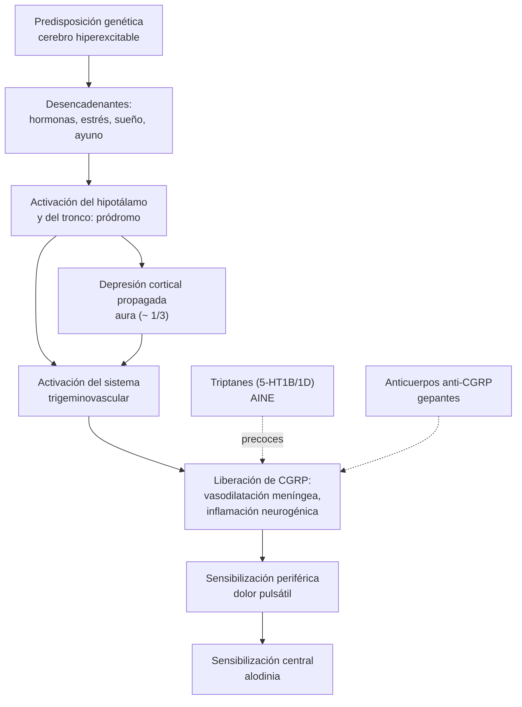

---
tags:
  - Neurología
  - Urgencia
  - Frecuente en sala
---

# Cefalea: enfoque en urgencia, migraña, cefalea tensional y neuralgia del trigémino

**Subespecialidad**
Neurología · Medicina de urgencia · APS

**Guías principales**
ICHD-3 (2018): clasificación internacional de las cefaleas · AHS 2025: tratamiento agudo de la migraña en el servicio de urgencia (*Headache*, 2026) · AHS 2021 y 2024: integración de los tratamientos nuevos de la migraña y terapias anti-CGRP como primera línea preventiva · ACEP 2019: cefalea aguda en urgencia

**Otras fuentes**
Lista de signos de alarma SNNOOP10 (*Neurology* 2019) · Regla de Ottawa para la hemorragia subaracnoidea · GBD 2023 Headache (*Lancet Neurol* 2025) · Estudio de prevalencia de migraña en Santiago (Lavados, 1997)

**GES**
No

**EUNACOM**
1.10.2.001 Cefalea aguda en urgencia (específico, inicial, derivar) · 1.10.1.012 Migraña (específico, completo, completo) · 1.10.1.001 Cefalea tensional (específico, completo, completo) · 1.10.2.018 Status migrañoso (específico, inicial) · 1.10.1.013 Neuralgia esencial del trigémino

**Revisado**
Septiembre 2026

!!! abstract "Resumen en 60 segundos"
    - **La tarea principal en la urgencia es distinguir una cefalea primaria (benigna) de una secundaria (peligrosa)**. Para eso se buscan los **signos de alarma (SNNOOP10)**.
        - Inicio **súbito** ("en trueno").
        - **Déficit neurológico** o compromiso de conciencia.
        - **Fiebre** o rigidez de nuca.
        - **> 50 años** con cefalea nueva.
        - Cambio de patrón.
        - Cefalea **posicional** o con la tos o el esfuerzo.
        - **Papiledema**.
        - Embarazo o puerperio.
        - Inmunosupresión o cáncer.
        - Trauma o anticoagulantes.
    - **Cefalea en trueno**: **TC de cerebro** (sensibilidad cercana al 100 % en las primeras 6 h para la **hemorragia subaracnoidea**); si es negativa y han pasado > 6 h, **punción lumbar**.
    - **Migraña**: episodios de **4–72 h**, unilateral, pulsátil, moderada a intensa, que empeora con la actividad, con **náuseas** o **fotofobia y fonofobia**. Afecta al **7 %** de los adultos de Santiago (**12 % de las mujeres**).
    - **Crisis de migraña**:
        - En casa: **AINE** o **triptán** precoces, ± antiemético.
        - En la urgencia (AHS 2025): **proclorperazina o metoclopramida EV**, **ketorolaco**, **sumatriptán SC**, **bloqueo del nervio occipital mayor**.
        - **Dexametasona** para prevenir la recurrencia.
        - **No usar opioides**.
    - **Prevención de la migraña** si hay **≥ 4 días de migraña al mes** o crisis incapacitantes: **propranolol**, **amitriptilina**, topiramato, flunarizina, candesartán, o **anticuerpos anti-CGRP**.
    - **Cefalea tensional**: bilateral, opresiva, leve a moderada, sin náuseas ni empeoramiento con la actividad. **AINE o paracetamol**; **amitriptilina** si es crónica.
    - **Cefalea por uso excesivo de analgésicos**: una causa frecuente de cefalea crónica. Limitar los analgésicos a **< 10–15 días al mes**.

## Definición

- **Cefalea primaria**: la cefalea **es** la enfermedad (migraña, cefalea tensional, cefaleas trigémino-autonómicas como la cefalea en racimos). Son **> 90 %** de las cefaleas en la población.
- **Cefalea secundaria**: síntoma de otra enfermedad (hemorragia subaracnoidea, meningitis, tumor, arteritis de células gigantes, trombosis venosa, hipertensión endocraneana, crisis hipertensiva, abuso de analgésicos).
- **Migraña sin aura** (ICHD-3): **≥ 5 crisis** de **4–72 h** con **≥ 2** de estas características: **unilateral**, **pulsátil**, intensidad **moderada o grave**, **empeora con la actividad física** habitual. Además, **≥ 1** de: **náuseas o vómitos**, o **fotofobia y fonofobia**.
- **Migraña con aura**: ≥ 2 crisis con síntomas neurológicos **completamente reversibles** (visuales, sensitivos, del lenguaje) que se **extienden gradualmente** en ≥ 5 min y duran **5–60 min**, seguidos o acompañados de cefalea.
- **Migraña crónica**: cefalea **≥ 15 días al mes** por > 3 meses, con características de migraña ≥ 8 días al mes.
- **Estado migrañoso (status migrañoso)**: crisis de migraña incapacitante que dura **> 72 horas**.
- **Cefalea tensional**: cefalea **bilateral**, **opresiva** o en "cintillo", **leve a moderada**, que **no empeora** con la actividad y sin náuseas (puede haber fotofobia **o** fonofobia, no ambas). Episódica o crónica (≥ 15 días al mes).
- **Cefalea en racimos**: dolor **orbitario unilateral muy intenso** de 15–180 min, con **síntomas autonómicos ipsilaterales** (lagrimeo, rinorrea, ptosis, miosis), agitación, en "racimos" de semanas.
- **Neuralgia del trigémino**: dolor **eléctrico**, **paroxístico** (segundos), unilateral, en una o más ramas del trigémino, desencadenado por estímulos leves (hablar, masticar, cepillarse los dientes).
- **Cefalea por uso excesivo de medicamentos**: cefalea ≥ 15 días al mes en un paciente con una cefalea previa, con uso regular de analgésicos (≥ 15 días al mes de AINE o paracetamol, o ≥ 10 días al mes de triptanes, opioides o combinaciones) por > 3 meses.

## Epidemiología

### Mundial

- **GBD 2023**: **2.900 millones** de personas tienen una cefalea (prevalencia estandarizada de **34,6 %**). La **migraña** explica la mayor parte de la discapacidad, que es **más del doble en las mujeres**.
- La **cefalea por uso excesivo de medicamentos** explica **más de la mitad** de la discapacidad por cefalea tensional y una parte importante de la de la migraña: es **prevenible**.
- La **migraña** afecta al **~ 15 %** de la población, con un pico entre los **25 y 55 años**, y es **2–3 veces más frecuente en las mujeres**. Es una de las primeras causas de discapacidad en los adultos jóvenes (GBD 2021).
- La **cefalea tensional** es la cefalea más frecuente (hasta **~ 40 %** al año), pero consulta menos.
- En la **urgencia**, la cefalea es **~ 2–4 %** de las consultas. **~ 1–4 %** tiene una causa grave, y la **hemorragia subaracnoidea** es **~ 1 %** de las cefaleas agudas (y hasta **~ 10 %** de las cefaleas en trueno).

### Chile

!!! chile "Datos nacionales"
    - En una muestra representativa de adultos de la provincia de **Santiago** (1.385 personas), el **37 %** refirió cefaleas recurrentes en el último año (Lavados y Tenhamm, 1997).
        - **Prevalencia de migraña**: **7,3 %**, con **11,9 % en las mujeres** y **2 % en los hombres**, sin diferencias por nivel socioeconómico.
        - **Migraña con aura**: 3,5 %.
        - Las crisis duraban **2–6 h** en la mayoría, con una frecuencia de **~ 3 por mes**, y muchas ocurrían **durante el trabajo**.
    - La migraña **no tiene GES**. Los triptanes, la amitriptilina, el propranolol y la flunarizina están disponibles en la APS o el mercado. Los anticuerpos anti-CGRP y la toxina botulínica están disponibles sobre todo en el sector privado.
    - La **automedicación con analgésicos** de venta libre (incluidas las combinaciones con cafeína o ergotamina) es frecuente y favorece la cefalea por uso excesivo de medicamentos.

## Etiología y factores de riesgo

### Causas de cefalea secundaria grave (buscarlas en la urgencia)

| Causa | Claves |
|---|---|
| **Hemorragia subaracnoidea** | **Cefalea en trueno** (máxima en < 1 min), "la peor de mi vida", vómitos, rigidez de nuca, compromiso de conciencia (ver [ACV](accidente-cerebrovascular.md)) |
| **Meningitis y encefalitis** | Fiebre, rigidez de nuca, compromiso de conciencia, exantema (ver [meningitis](../infectologia/meningitis-y-encefalitis.md)) |
| **Hemorragia intracerebral, ACV** | Déficit focal |
| **Trombosis venosa cerebral** | Mujer joven, anticonceptivos, embarazo o puerperio, trombofilia; cefalea progresiva, papiledema, crisis, déficit |
| **Disección arterial** (carotídea o vertebral) | Cefalea o cervicalgia con **síndrome de Horner** o déficit, tras un trauma menor o manipulación cervical |
| **Arteritis de células gigantes** | **> 50 años**, cefalea temporal nueva, **claudicación mandibular**, **VHS/PCR altas**, polimialgia reumática; riesgo de **ceguera** |
| **Tumor o absceso cerebral** | Cefalea progresiva, peor al despertar o con Valsalva, vómitos, crisis, déficit, antecedente de cáncer |
| **Hipertensión intracraneana idiopática** | Mujer joven obesa, **papiledema**, alteraciones visuales, tinnitus pulsátil |
| **Hipotensión de LCR** | Cefalea **ortostática** (mejora al acostarse), tras una punción lumbar o espontánea |
| **Hematoma subdural** | Adulto mayor, caídas, **anticoagulantes**, alcohol |
| **Glaucoma agudo de ángulo cerrado** | Ojo rojo y doloroso, midriasis media arreactiva, visión borrosa, halos |
| **Emergencia hipertensiva, PRES, preeclampsia** | PA muy elevada, alteraciones visuales, crisis; embarazo o puerperio |
| **Intoxicación por monóxido de carbono** | Varios afectados en la misma casa, **calefactores o braseros** (invierno), mejora al salir |
| **Apoplejía hipofisaria** | Cefalea súbita, alteraciones visuales, oftalmoplejía, hipotensión |

### Factores desencadenantes de la migraña

- **Hormonales**: menstruación, anticonceptivos.
- **Estrés** y su resolución ("migraña del fin de semana").
- **Sueño**: falta o exceso.
- **Ayuno**, deshidratación.
- **Alcohol** (vino tinto), ciertos alimentos (en una minoría).
- **Estímulos sensoriales**: luces, olores, ruido.
- Cambios de clima o de altitud.
- **Uso excesivo de analgésicos** (cronificación).

## Fisiopatología

- **Migraña**: es un trastorno **neurovascular** con base **genética** (hiperexcitabilidad cerebral).
    1. El **pródromo** refleja la activación del **hipotálamo** y del tronco cerebral, horas antes del dolor.
    2. El **aura** corresponde a la **depresión cortical propagada**: una onda de despolarización neuronal seguida de supresión que avanza ~ 3 mm/min por la corteza (por eso los síntomas "marchan").
    3. El dolor se produce por la activación del **sistema trigeminovascular**: las fibras del trigémino que inervan las meninges y sus vasos liberan **CGRP** y otros neuropéptidos, que producen **vasodilatación e inflamación neurogénica**.
    4. Se produce una **sensibilización periférica** (dolor pulsátil que empeora con el movimiento) y **central** (**alodinia**: dolor al peinarse).
    5. Una vez establecida la sensibilización central, los **triptanes pierden eficacia**. Por eso el tratamiento debe ser **precoz**.
- **Dianas terapéuticas**:
    - **Triptanes**: agonistas **5-HT1B/1D**; vasoconstricción e inhibición de la liberación de CGRP.
    - **Anticuerpos anti-CGRP** y **gepantes**: bloquean el CGRP o su receptor.
    - **Ditanes** (lasmiditán): agonistas **5-HT1F**, sin vasoconstricción.
- **Cefalea tensional**: mecanismos periféricos (tensión y sensibilidad de los músculos pericraneales) y, en la forma crónica, **sensibilización central**.
- **Cefalea por uso excesivo de medicamentos**: el uso frecuente de analgésicos produce cambios en las vías del dolor que **cronifican** la cefalea.

*Figura 1. Fisiopatología de la migraña y sitio de acción de los tratamientos. Esquema propio.*

## Clasificación

**ICHD-3 (2018)**:

1. **Cefaleas primarias**: migraña; cefalea tensional; cefaleas trigémino-autonómicas (en racimos, hemicránea paroxística); otras (primaria de la tos, del ejercicio, de la actividad sexual, en trueno primaria, cefalea diaria persistente de novo).
2. **Cefaleas secundarias**: atribuidas a trauma, trastornos vasculares, trastornos no vasculares intracraneales, sustancias o su supresión (incluido el **uso excesivo de medicamentos**), infecciones, trastornos de la homeostasis, estructuras craneales o cervicales, trastornos psiquiátricos.
3. **Neuropatías craneales dolorosas** y otros dolores faciales (neuralgia del trigémino).

| Característica | **Migraña** | **Tensional** | **En racimos** |
|---|---|---|---|
| **Sexo** | Mujeres (3:1) | Ambos | **Hombres** (3:1) |
| **Localización** | **Unilateral** (a veces bilateral) | **Bilateral**, "en cintillo" | **Orbitaria unilateral**, siempre del mismo lado |
| **Calidad** | **Pulsátil** | **Opresiva** | Punzante, "taladro" |
| **Intensidad** | Moderada a grave | Leve a moderada | **Muy grave** |
| **Duración** | 4–72 h | 30 min a 7 días | **15–180 min**, 1–8 veces al día, a la misma hora |
| **Actividad física** | **Empeora** | No empeora | **Agitación** (no puede quedarse quieto) |
| **Síntomas asociados** | **Náuseas**, **fotofobia y fonofobia**, aura | Ninguno o uno leve | **Autonómicos ipsilaterales**: lagrimeo, ojo rojo, rinorrea, ptosis, miosis |

## Clínica

- **Migraña**:
    - Cefalea típica con las fases de la figura 2.
    - El paciente busca la **oscuridad y el silencio** y se acuesta.
    - El **aura visual** típica es un **escotoma centelleante** o espectro de fortificación (líneas en zigzag) que se expande en 5–20 min. El aura sensitiva produce parestesias que avanzan de la mano a la cara.
    - Examen neurológico **normal** entre las crisis.
- **Cefalea tensional**: opresiva, bilateral, que permite seguir trabajando; sensibilidad de los músculos pericraneales.
- **Cefalea en racimos**: dolor orbitario terrible, nocturno, con síntomas autonómicos. El paciente camina o se golpea la cabeza.
- **Neuralgia del trigémino**:
    - Dolor en **descarga eléctrica** de segundos, en la 2.ª o 3.ª rama (mejilla, mandíbula).
    - Tiene **zonas gatillo**.
    - Examen neurológico **normal**. Un examen anormal o la edad < 40 años sugieren una causa secundaria (esclerosis múltiple, tumor): pedir RM.

<figure markdown>
![Esquema de las cuatro fases de una crisis de migraña en una línea de tiempo: pródromo (horas a 2 días antes: bostezos, cansancio, irritabilidad, antojos, rigidez de cuello, fotofobia), aura en un tercio de los pacientes (5 a 60 minutos: visual, sensitiva o del lenguaje, que progresa gradualmente), cefalea (4 a 72 horas: unilateral, pulsátil, moderada a intensa, empeora con la actividad, con náuseas, fotofobia y fonofobia) y pósdromo (horas a un día: cansancio, dificultad para concentrarse). Una curva muestra que la intensidad del dolor sube al inicio de la cefalea, con la indicación de tratar precozmente](../assets/figuras/cefalea/fases-migrana.svg){ loading=lazy }
<figcaption>Figura 2. Fases de una crisis de migraña. Esquema propio basado en la ICHD-3.</figcaption>
</figure>

!!! alarma "Signos de alarma (SNNOOP10): buscar una cefalea secundaria"
    - **S**íntomas sistémicos: **fiebre**, baja de peso.
    - **N**eoplasia (antecedente de cáncer).
    - **N**eurológico: **déficit focal**, **compromiso de conciencia**, crisis.
    - **O**nset (inicio) **súbito o en trueno**.
    - **O**lder: edad **> 50 años** con cefalea nueva (arteritis, tumor).
    - **P**atrón: **cambio** de una cefalea previa o cefalea **nueva**.
    - **P**osicional (hipertensión o hipotensión de LCR).
    - **P**recipitada por la **tos**, el esfuerzo o la maniobra de Valsalva.
    - **P**apiledema.
    - **P**rogresiva.
    - **P**regnancy: **embarazo o puerperio** (trombosis venosa, preeclampsia).
    - **P**ainful eye: ojo doloroso con síntomas autonómicos (glaucoma).
    - **P**ostraumática.
    - **P**atología del sistema inmune (**VIH**, inmunosupresión).
    - **P**ainkiller: uso excesivo de analgésicos.

## Diagnóstico

**Paso 1. Anamnesis detallada**:

- Forma de **inicio** (súbito o gradual).
- Localización, calidad, intensidad, duración y frecuencia.
- Síntomas asociados.
- Desencadenantes.
- **Cefaleas previas** similares.
- **Uso de analgésicos** (días al mes).
- Fármacos, anticonceptivos, embarazo.
- Trauma, anticoagulantes, inmunosupresión.

**Paso 2. Examen**:

- **PA**, **temperatura**.
- **Rigidez de nuca**.
- **Fondo de ojo** (papiledema).
- Examen neurológico completo.
- **Arterias temporales** (> 50 años).
- Ojos (glaucoma), senos paranasales, columna cervical.

**Paso 3. ¿Tiene signos de alarma?**

- **No**, y el cuadro cumple los criterios de una cefalea primaria: diagnóstico **clínico**; **no** se necesitan imágenes.
- **Sí**: estudiar según la sospecha.

**Paso 4. Cefalea en trueno** (sospecha de hemorragia subaracnoidea):

- **Regla de Ottawa** (en los ≥ 15 años con cefalea no traumática que alcanzó su máximo en 1 hora, conciente y sin déficit). Se estudia si hay **cualquiera** de estos criterios:
    - Edad **≥ 40 años**.
    - **Dolor o rigidez de cuello**.
    - **Pérdida de conciencia presenciada**.
    - Inicio con el **esfuerzo**.
    - Inicio **instantáneo** (cefalea en trueno).
    - **Limitación de la flexión** del cuello al examen.
- Si hay algún criterio: **TC de cerebro sin contraste**.
    - En las primeras **6 h**, una TC normal, leída por un radiólogo con un equipo moderno, prácticamente **descarta** la HSA.
    - Después de 6 h, si la TC es normal: **punción lumbar** (**xantocromía**, glóbulos rojos que no disminuyen) o **angio-TC**.
- Si la TC y la punción son normales, considerar el síndrome de vasoconstricción cerebral reversible, la disección y la trombosis venosa (angio-TC o angio-RM).

**Paso 5. Otros estudios según la sospecha**:

- **VHS y PCR** en los > 50 años (arteritis de células gigantes).
- **Punción lumbar** si hay fiebre y rigidez de nuca (tras la TC si hay signos focales o compromiso de conciencia).
- **RM con venografía** si se sospecha una trombosis venosa.
- Carboxihemoglobina en la sospecha de intoxicación por CO.
- **Diario de cefaleas** en la cefalea crónica (frecuencia, analgésicos, desencadenantes).

## Laboratorio

| Examen | Uso |
|---|---|
| **VHS, PCR** | **Arteritis de células gigantes** (> 50 años) |
| **Hemograma, PCR, hemocultivos** | Sospecha de infección |
| **Punción lumbar** (presión de apertura, citoquímico, cultivo, xantocromía) | HSA con TC negativa > 6 h, meningitis, hipertensión intracraneana idiopática (presión > 25 cmH₂O) |
| **Carboxihemoglobina** (cooximetría) | Intoxicación por CO |
| **Glicemia, electrolitos, creatinina** | Contexto sistémico |
| **β-hCG** | Mujeres en edad fértil (fármacos, trombosis venosa, preeclampsia) |
| **Proteinuria, pruebas hepáticas, plaquetas** | Preeclampsia o síndrome HELLP en el embarazo o el puerperio |

## Imágenes

- **No** se piden imágenes en la **cefalea primaria típica** sin signos de alarma: no cambian el manejo y generan hallazgos incidentales.
- **TC de cerebro sin contraste**: la primera imagen en la urgencia (hemorragias, masas, hidrocefalia).
- **Angio-TC**: aneurisma, disección, síndrome de vasoconstricción.
- **RM de cerebro** (con venografía): trombosis venosa, tumores, lesiones de fosa posterior, hipotensión de LCR (realce paquimeníngeo), causas secundarias de neuralgia del trigémino.
- **Ecografía Doppler de las arterias temporales** (signo del halo) o **biopsia**: arteritis de células gigantes.

## Diagnóstico diferencial

| Cuadro | Claves que la distinguen de la migraña |
|---|---|
| **Hemorragia subaracnoidea** | Inicio **en trueno**, "la peor de la vida", rigidez de nuca; primera vez |
| **Meningitis** | Fiebre, rigidez de nuca, compromiso de conciencia |
| **AIT o ACV** | Síntomas **negativos** de inicio **súbito** (el aura migrañosa es **positiva** y **progresiva**); edad y factores de riesgo |
| **Crisis epiléptica occipital** | Fenómenos visuales coloreados, breves, circulares |
| **Arteritis de células gigantes** | > 50 años, claudicación mandibular, VHS alta |
| **Trombosis venosa cerebral** | Embarazo o anticonceptivos, cefalea progresiva, papiledema, crisis |
| **Sinusitis** | Rinorrea purulenta, fiebre, dolor facial; la "cefalea sinusal" recurrente suele ser una migraña |
| **Cefalea por uso excesivo de medicamentos** | Cefalea casi diaria en un paciente con migraña o tensional que usa analgésicos ≥ 10–15 días al mes |

## Tratamiento

### Crisis de migraña (ambulatoria)

!!! guia "AHS 2021 y 2024"
    - Tratar **precozmente**, cuando el dolor aún es **leve**, con la **dosis adecuada**.
    - **Crisis leves a moderadas**: **AINE** o **paracetamol**, ± **antiemético** (metoclopramida o domperidona).
    - **Crisis moderadas a graves**, o si fallan los AINE: **triptán**, o **triptán + AINE** (más eficaz que cada uno por separado).
    - Si los triptanes están contraindicados o no funcionan: **gepantes** (ubrogepant, rimegepant) o **lasmiditán**.
    - **Evitar** los **opioides** y los **barbitúricos** (menor eficacia, más cronificación y dependencia).
    - **Limitar** el uso de analgésicos: **< 10 días al mes** con triptanes o combinaciones, y **< 15 días al mes** con AINE o paracetamol.

!!! dosis "Tratamiento agudo de la migraña"
    - **Ibuprofeno 400–600 mg**, **naproxeno 500–550 mg**, **ketoprofeno 100 mg** o **diclofenaco 50–100 mg** VO. **Paracetamol 1 g** (en el embarazo).
    - **Metoclopramida 10 mg VO** (o domperidona 10–20 mg): mejora las náuseas y la absorción.
    - **Sumatriptán 50–100 mg VO** (repetir a las 2 h si recurre; máximo 200 mg/día), **6 mg SC** o 20 mg intranasal. Otros: naratriptán, zolmitriptán, eletriptán, rizatriptán.
        - **Contraindicados** en la **cardiopatía coronaria**, el **ACV** o AIT, la enfermedad arterial periférica, la HTA no controlada, el embarazo (relativo) y la migraña con aura del tronco o hemipléjica.
        - Precaución con los ISRS (síndrome serotoninérgico, raro).
    - **No** usar la ergotamina de rutina (vasoconstricción, cronificación).

### Migraña en el servicio de urgencia

!!! guia "AHS 2025 (tratamiento parenteral de la migraña en la urgencia)"
    - **Deben ofrecerse** (nivel A): **proclorperazina EV** y el **bloqueo del nervio occipital mayor**.
    - **Deberían ofrecerse** (nivel B): **metoclopramida EV**, **ketorolaco EV**, **dexketoprofeno EV**, **sumatriptán SC** y el bloqueo del nervio supraorbitario.
    - **Pueden ofrecerse** (nivel C): clorpromazina EV, **dexametasona EV** (reduce la recurrencia en las 72 h siguientes) y valproato EV.
    - **No deben ofrecerse**: la **hidromorfona EV** (nivel A) ni, en general, los **opioides**. Tampoco el **paracetamol EV** (nivel C).

!!! dosis "Migraña en la urgencia y estado migrañoso"
    - **Hidratación** con suero fisiológico EV si hay vómitos o deshidratación.
    - **Metoclopramida 10 mg EV** lento (en 15 min) **o proclorperazina 10 mg EV**. Para prevenir la **acatisia**, se puede agregar **difenhidramina 25 mg EV**.
    - **Ketorolaco 15–30 mg EV** (o dexketoprofeno 50 mg EV).
    - **Sumatriptán 6 mg SC** si no lo usó en las 24 h previas y no tiene contraindicaciones.
    - **Dexametasona 10 mg EV**: previene la recurrencia.
    - **Bloqueo del nervio occipital mayor** con anestésico local (lidocaína o bupivacaína), si hay alguien entrenado.
    - **Estado migrañoso** (> 72 h): los mismos fármacos, más **valproato EV** (500–1.000 mg) o dexametasona. **Hospitalizar** si no responde, hay vómitos incoercibles o se sospecha una causa secundaria. Revisar el uso excesivo de analgésicos.
    - **Evitar los opioides**: más visitas de retorno y cronificación.

### Prevención de la migraña

- **Indicaciones**:
    - **≥ 4 días de migraña al mes**, o crisis **incapacitantes** a pesar del tratamiento agudo.
    - Contraindicación, falla o uso excesivo del tratamiento agudo.
    - Auras prolongadas o atípicas.
- **Meta**: reducir los días de cefalea ≥ 50 %. Evaluar la respuesta a los **2–3 meses** con la dosis adecuada.

!!! dosis "Preventivos de la migraña (elegir según las comorbilidades)"
    | Fármaco | Dosis | Útil en | Evitar en |
    |---|---|---|---|
    | **Propranolol** | 40–160 mg/día | HTA, ansiedad, temblor | Asma, bradicardia, depresión |
    | **Amitriptilina** | **10–50 mg** en la noche | **Insomnio**, depresión, **cefalea tensional** asociada | Adultos mayores (anticolinérgico), glaucoma, arritmias, obesidad |
    | **Topiramato** | 50–100 mg/día (subir 25 mg/semana) | Obesidad, epilepsia | **Embarazo** (teratogénico), litiasis renal, deterioro cognitivo; reduce la eficacia de los anticonceptivos en dosis altas |
    | **Flunarizina** | 5–10 mg en la noche | Muy usada en Chile y Latinoamérica | **Depresión**, parkinsonismo, aumento de peso |
    | **Candesartán** | 16 mg/día | HTA | Embarazo, hipotensión |
    | **Valproato** | 500–1.000 mg/día | Epilepsia | **Mujeres en edad fértil** (teratogénico), hepatopatía |
    | **Anticuerpos anti-CGRP** (erenumab, fremanezumab, galcanezumab; eptinezumab EV) | SC mensual o trimestral | **Primera línea** según la AHS 2024; buena tolerancia | Embarazo; costo; el erenumab puede producir constipación e HTA |
    | **Toxina onabotulínica A** | 155 U cada 12 semanas | **Migraña crónica** | — |

- **Medidas no farmacológicas**: **diario de cefaleas**, regularidad del sueño y de las comidas, ejercicio aeróbico, manejo del estrés (terapia cognitivo-conductual, relajación), identificar los desencadenantes.

### Cefalea tensional

- **Aguda**: **AINE** (ibuprofeno 400 mg, naproxeno 500 mg) o **paracetamol 1 g**.
- **Crónica o frecuente**: **amitriptilina 10–50 mg** en la noche; terapia física, ejercicio, manejo del estrés.
- **Evitar** el uso excesivo de analgésicos.

### Cefalea por uso excesivo de medicamentos

- **Educación** y **suspensión** del analgésico usado en exceso (brusca para los analgésicos simples y los triptanes; gradual para los opioides y los barbitúricos).
- **Iniciar un preventivo** al mismo tiempo (por ejemplo, amitriptilina, topiramato o anti-CGRP).
- Puede haber un empeoramiento transitorio (1–2 semanas).

### Cefalea en racimos

- **Crisis**: **oxígeno al 100 %** con mascarilla con reservorio a **12–15 L/min** por 15 min, o **sumatriptán 6 mg SC**.
- **Prevención**: **verapamilo** (240–480 mg/día; ECG por el bloqueo AV). **Prednisona** en un curso corto como puente.

### Neuralgia del trigémino

- **Carbamazepina** (de elección): 100–200 mg cada 12 h, subiendo hasta 600–1.200 mg/día. Vigilar la **hiponatremia**, la leucopenia, el exantema y las interacciones. **Oxcarbazepina** como alternativa.
- Si es refractaria o hay una compresión vascular: derivar a neurocirugía (descompresión microvascular, radiocirugía).

## Complicaciones

- **Migraña**:
    - **Cronificación** (sobre todo con el uso excesivo de analgésicos).
    - **Estado migrañoso**, deshidratación.
    - **Infarto migrañoso** (raro): aura que persiste con una lesión isquémica en la imagen.
    - La **migraña con aura** aumenta levemente el riesgo de **ACV isquémico**, sobre todo en las mujeres fumadoras que usan **anticonceptivos combinados**.
    - Depresión, ansiedad, discapacidad laboral.
- **Del tratamiento**:
    - AINE: gastropatía, nefrotoxicidad.
    - Triptanes: dolor torácico, vasoespasmo (raro).
    - **Metoclopramida y proclorperazina**: **distonía aguda** y **acatisia**.
    - Topiramato y valproato: **teratogenia**.
    - Amitriptilina: efectos anticolinérgicos.
    - Flunarizina: depresión, parkinsonismo.
- **Cefaleas secundarias no reconocidas**: muerte o secuelas (HSA, meningitis, arteritis con ceguera).

## Pronóstico y seguimiento

- La **migraña** tiende a disminuir con la edad y tras la menopausia (y suele mejorar en el 2.º y 3.er trimestre del embarazo). Con el tratamiento adecuado, la mayoría controla sus crisis.
- **Perfil EUNACOM**:
    - **Migraña** y **cefalea tensional**: diagnóstico específico, **tratamiento completo** (agudo y preventivo) y **seguimiento completo** en la APS.
    - **Cefalea aguda en urgencia**: diagnóstico específico, tratamiento inicial y **derivación** de las secundarias.
    - **Status migrañoso**: tratamiento inicial.
- **Seguimiento**:
    - **Diario de cefaleas** (días de cefalea y de analgésicos).
    - Evaluar la respuesta al preventivo a los **2–3 meses** y mantenerlo **6–12 meses** antes de intentar suspenderlo.
    - **Anticoncepción**: en la **migraña con aura**, **evitar los anticonceptivos con estrógenos** (usar progestágenos solos o métodos no hormonales).
    - Derivar a neurología si hay dudas diagnósticas, falla de dos preventivos o migraña crónica.

## Perlas para el internado

!!! perla "Para la sala y el turno"
    - **"La peor cefalea de mi vida", de inicio instantáneo** = TC de cerebro **ya**. Si es normal y han pasado > 6 h, **punción lumbar**.
    - **Cefalea nueva en un paciente > 50 años**: pide **VHS y PCR**. Si sospechas una arteritis de células gigantes, inicia la **prednisona** sin esperar la biopsia (riesgo de ceguera).
    - **Cefalea + fiebre + rigidez de nuca**: hemocultivos y **antibiótico** antes de la TC si la punción se va a demorar.
    - **Cefalea en varios miembros de una familia en invierno**, que mejora al salir de la casa: piensa en **monóxido de carbono**.
    - **No trates la migraña con opioides** en la urgencia: usa **metoclopramida o proclorperazina + ketorolaco + dexametasona**.
    - Si das **metoclopramida EV**, pásala **lento** y considera la difenhidramina: la **acatisia** es frecuente y muy desagradable.
    - **Mejorar con un analgésico no descarta** una cefalea secundaria (una HSA también puede aliviarse).
    - Pregunta **cuántos días al mes** usa analgésicos: el uso excesivo es la causa más frecuente de cefalea diaria.
    - **Mujer con migraña con aura**: **no** a los anticonceptivos combinados.

## Preguntas de repaso

??? repaso "1. Mujer de 28 años con cefaleas recurrentes desde la adolescencia: hemicraneales, pulsátiles, de 12 horas, con náuseas y fotofobia, que empeoran al subir escaleras, 2 veces al mes. Examen normal. ¿Qué tiene y cómo la tratas?"
    **Migraña sin aura** (criterios ICHD-3), sin signos de alarma: **no** necesita imágenes.

    - **Tratamiento agudo precoz**: **ibuprofeno 400–600 mg** o **naproxeno 550 mg** ± **metoclopramida 10 mg**. Si no responde: **sumatriptán 50–100 mg**, o sumatriptán + naproxeno.
    - Con 2 crisis al mes **no** requiere prevención, salvo que sean incapacitantes.
    - **Diario de cefaleas**, identificar los desencadenantes, regularidad del sueño y de las comidas.
    - Limitar los analgésicos a < 10–15 días al mes.
    - Si usa anticonceptivos y tiene aura: evitar los combinados.

??? repaso "2. Hombre de 45 años con cefalea súbita y explosiva durante el ejercicio, máxima en segundos, con vómitos. Examen neurológico normal. Llega 3 horas después. ¿Qué haces?"
    **Cefalea en trueno**: sospecha de **hemorragia subaracnoidea** (regla de Ottawa positiva: edad ≥ 40, inicio con el esfuerzo e instantáneo).

    - **TC de cerebro sin contraste** urgente: en las primeras 6 h, una TC normal prácticamente descarta la HSA.
    - Si la TC muestra sangre: **angio-TC**, nimodipino, control de la PA y **neurocirugía**.
    - Si la TC es normal: considerar las otras causas de cefalea en trueno (síndrome de vasoconstricción cerebral reversible, disección, trombosis venosa) con angio-TC o angio-RM.

??? repaso "3. Paciente con migraña de 2 días que no responde a los AINE ni al sumatriptán oral, con vómitos. ¿Qué le indicas en la urgencia?"
    **Crisis de migraña refractaria** (aún no es un estado migrañoso, que dura > 72 h).

    - **Hidratación EV**.
    - **Metoclopramida 10 mg EV** lento o **proclorperazina 10 mg EV** (± difenhidramina para prevenir la acatisia).
    - **Ketorolaco 15–30 mg EV**.
    - **Dexametasona 10 mg EV** para prevenir la recurrencia.
    - **Bloqueo del nervio occipital mayor** si está disponible.
    - **Sin opioides**.
    - Revisar los signos de alarma y el uso excesivo de analgésicos.
    - Al alta, evaluar el tratamiento preventivo.

??? repaso "4. Mujer de 35 años con migraña 8 días al mes, que toma analgésicos 18 días al mes y tiene cefalea casi diaria. ¿Qué pasa y qué haces?"
    **Migraña con cefalea por uso excesivo de medicamentos** (y probable migraña crónica).

    1. **Educación**.
    2. **Suspensión** del analgésico usado en exceso (brusca si son AINE o triptanes).
    3. **Iniciar un preventivo**: amitriptilina, propranolol, topiramato (con anticoncepción eficaz) o anticuerpos anti-CGRP.
    4. Un "tratamiento de rescate" limitado (por ejemplo, naproxeno ≤ 2 días por semana).
    5. **Diario de cefaleas**.
    6. Esperar un empeoramiento transitorio de 1–2 semanas.
    7. Derivar a neurología si no mejora.

??? repaso "5. Hombre de 72 años con cefalea temporal derecha nueva, dolor al masticar y visión borrosa transitoria. VHS 85 mm/h. ¿Qué haces?"
    Sospecha de **arteritis de células gigantes** con síntomas visuales (riesgo de **ceguera** irreversible).

    - Iniciar **de inmediato** corticoides: **prednisona 40–60 mg/día**, o **metilprednisolona EV** en pulsos si hay pérdida visual.
    - **No** esperar la biopsia.
    - Confirmar con la **ecografía Doppler de las arterias temporales** (signo del halo) o la **biopsia** (dentro de las 1–2 semanas; sigue siendo útil aunque se hayan iniciado los corticoides).
    - Derivar a reumatología y oftalmología.
    - Considerar la aspirina y la protección ósea y gástrica.

??? repaso "6. Mujer de 60 años con dolor en descarga eléctrica de segundos en la mejilla derecha, desencadenado al cepillarse los dientes. Examen neurológico normal. ¿Diagnóstico y tratamiento?"
    **Neuralgia del trigémino** (rama maxilar, V2), probablemente clásica (compresión vascular).

    - **Carbamazepina** 100–200 mg cada 12 h, subiendo según la respuesta (vigilar el sodio, el hemograma y el exantema). Oxcarbazepina como alternativa.
    - **RM de cerebro** para descartar causas secundarias (esclerosis múltiple, tumor del ángulo pontocerebeloso) y ver la compresión vascular.
    - Si es refractaria: derivación a neurocirugía (descompresión microvascular).

## Referencias

1. Headache Classification Committee of the International Headache Society (IHS). The International Classification of Headache Disorders, 3rd edition. *Cephalalgia.* 2018. [ichd-3.org](https://ichd-3.org/)
2. Robblee J, Minen MT, Friedman BW, et al. 2025 guideline update to acute treatment of migraine for adults in the emergency department: The American Headache Society evidence assessment of parenteral pharmacotherapies. *Headache.* 2026;66:53–76. doi:[10.1111/head.70016](https://doi.org/10.1111/head.70016)
3. Ailani J, Burch RC, Robbins MS; Board of Directors of the American Headache Society. The American Headache Society Consensus Statement: Update on integrating new migraine treatments into clinical practice. *Headache.* 2021;61:1021–1039. doi:[10.1111/head.14153](https://doi.org/10.1111/head.14153)
4. Charles AC, Digre KB, Goadsby PJ, et al. Calcitonin gene-related peptide-targeting therapies are a first-line option for the prevention of migraine: An American Headache Society position statement update. *Headache.* 2024;64:333–341. doi:[10.1111/head.14692](https://doi.org/10.1111/head.14692)
5. American College of Emergency Physicians Clinical Policies Subcommittee on Acute Headache; Godwin SA, Cherkas DS, et al. Clinical Policy: Critical Issues in the Evaluation and Management of Adult Patients Presenting to the Emergency Department With Acute Headache. *Ann Emerg Med.* 2019;74:e41–e74. doi:[10.1016/j.annemergmed.2019.07.009](https://doi.org/10.1016/j.annemergmed.2019.07.009)
6. Do TP, Remmers A, Schytz HW, et al. Red and orange flags for secondary headaches in clinical practice: SNNOOP10 list. *Neurology.* 2019;92:134–144. doi:[10.1212/WNL.0000000000006697](https://doi.org/10.1212/WNL.0000000000006697)
7. Perry JJ, Sivilotti MLA, Sutherland J, et al. Validation of the Ottawa Subarachnoid Hemorrhage Rule in patients with acute headache. *CMAJ.* 2017;189:E1379–E1385. doi:[10.1503/cmaj.170072](https://doi.org/10.1503/cmaj.170072)
8. GBD 2023 Headache Collaborators. Global, regional, and national burden of headache disorders, 1990–2023: a systematic analysis for the Global Burden of Disease Study 2023. *Lancet Neurol.* 2025;24:1005–1015. doi:[10.1016/S1474-4422(25)00402-8](https://doi.org/10.1016/S1474-4422(25)00402-8)
9. Lavados PM, Tenhamm E. Epidemiology of migraine headache in Santiago, Chile: a prevalence study. *Cephalalgia.* 1997;17:770–777. doi:[10.1046/j.1468-2982.1997.1707770.x](https://doi.org/10.1046/j.1468-2982.1997.1707770.x)
10. Eigenbrodt AK, Ashina H, Khan S, et al. Diagnosis and management of migraine in ten steps. *Nat Rev Neurol.* 2021;17:501–514. doi:[10.1038/s41582-021-00509-5](https://doi.org/10.1038/s41582-021-00509-5)
11. Ashina S, Mitsikostas DD, Lee MJ, et al. Tension-type headache. *Nat Rev Dis Primers.* 2021;7:24. doi:[10.1038/s41572-021-00257-2](https://doi.org/10.1038/s41572-021-00257-2)
