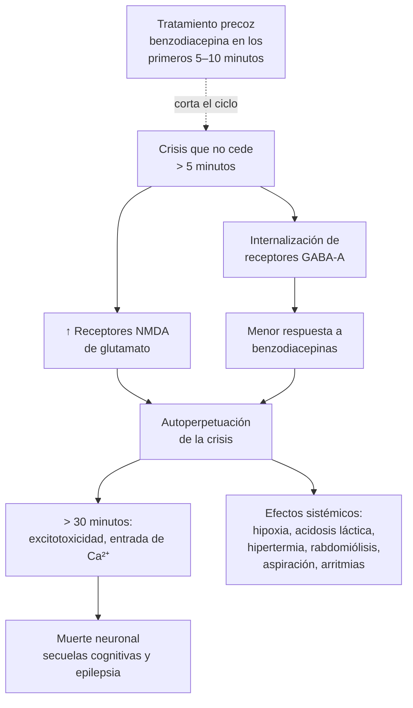

---
tags:
  - Neurología
  - GES
  - Urgencia
  - Frecuente en sala
---

# Crisis epiléptica, epilepsia y estado epiléptico

**Subespecialidad**
Neurología · Medicina de urgencia · Medicina interna

**Guías principales**
ILAE 2025: clasificación actualizada de las crisis epilépticas (*Epilepsia*) · ILAE 2015: definición y clasificación del estado epiléptico · AES 2016: tratamiento del estado epiléptico convulsivo · AAN/AES 2015: primera crisis no provocada en adultos · NICE NG217 (2022): epilepsias

**Otras fuentes**
ILAE 2014: definición clínica de epilepsia · Ensayos ESETT (2019) y RAMPART (2012) · Estudio epidemiológico chileno de Lavados (1992)

**GES**
Sí: epilepsia no refractaria en personas de 15 años y más (también en niños de 1 a 14 años)

**EUNACOM**
1.10.2.003 Crisis convulsiva · 1.10.2.015 y 1.10.1.022 Síndromes convulsivos sintomáticos · 1.10.2.017 Status convulsivo (sospecha, inicial, derivar) · 1.10.1.007 Epilepsia (sospecha, inicial)

**Revisado**
Septiembre 2026

!!! abstract "Resumen en 60 segundos"
    - **Crisis epiléptica**: síntomas transitorios por **actividad neuronal excesiva o sincrónica**. No toda crisis es una epilepsia: primero hay que buscar una **causa aguda** (crisis **provocada** o sintomática aguda).
        - **Hipoglicemia**, hiponatremia, hipocalcemia.
        - **Abstinencia de alcohol** o de benzodiacepinas, drogas.
        - ACV, TEC, **infección del SNC**, eclampsia.
    - **Epilepsia** (ILAE 2014):
        - **Dos crisis no provocadas** separadas por > 24 h.
        - O **una crisis no provocada** con alto riesgo de recurrencia (≥ 60 %), por ejemplo por una lesión estructural o un EEG epileptiforme.
        - O un síndrome epiléptico.
    - **Clasificación ILAE 2025**: **focal** (con conciencia preservada o alterada), **generalizada**, **de origen desconocido** o no clasificada. La crisis **tónico-clónica bilateral** puede ocurrir en las tres.
    - **Estado epiléptico**: crisis tónico-clónica de **≥ 5 minutos**, o crisis repetidas sin recuperar la conciencia entre ellas. Es una **emergencia**: a los **30 minutos** empieza el daño neuronal.
    - **Tratamiento escalonado del estado epiléptico**:
        1. **0–5 min**: ABC, glicemia (**tiamina + glucosa** si hay hipoglicemia).
        2. **5–20 min**: **benzodiacepina** (midazolam 10 mg IM, lorazepam 4 mg EV o diazepam 10 mg EV).
        3. **20–40 min**: **levetiracetam 60 mg/kg**, **valproato 40 mg/kg** o **fenitoína 20 mg/kg** (igual de eficaces, ESETT).
        4. **> 40 min**: anestésicos en la **UCI**.
    - En una **primera crisis** en un adulto: glicemia, electrolitos, **TC de cerebro**, luego **EEG y RM**. En general, **no** se inicia un antiepiléptico después de una primera crisis no provocada sin factores de riesgo.

## Definición

- **Crisis epiléptica**: aparición **transitoria** de signos o síntomas por una actividad neuronal **anormal, excesiva o sincrónica** en el cerebro.
- **Crisis sintomática aguda (provocada)**: crisis en **estrecha relación temporal** con una agresión aguda del SNC:
    - Alteración metabólica o tóxica.
    - ACV (primera semana).
    - TEC (primera semana).
    - Infección del SNC.
    - Abstinencia de alcohol (7–48 h tras la última ingesta).

    **No** es una epilepsia.
- **Crisis no provocada**: sin un factor desencadenante agudo identificable. Puede tener una causa **remota** (ACV antiguo, secuela de TEC, tumor).
- **Epilepsia** (ILAE 2014): enfermedad del cerebro definida por cualquiera de estas condiciones:
    1. **≥ 2 crisis no provocadas** separadas por **> 24 h**.
    2. **Una crisis no provocada** con una probabilidad de recurrencia **≥ 60 %** en los próximos 10 años (similar al riesgo tras dos crisis).
    3. Diagnóstico de un **síndrome epiléptico**.
- **Estado epiléptico** (ILAE 2015): se define por dos tiempos.
    - **t1**: momento en que la crisis debe considerarse **prolongada** y se debe **tratar**.
    - **t2**: momento desde el cual hay **riesgo de daño neuronal** permanente.

| Tipo de estado epiléptico | t1 (tratar) | t2 (daño) |
|---|---|---|
| **Tónico-clónico** | **5 minutos** | **30 minutos** |
| **Focal con alteración de la conciencia** | 10 minutos | > 60 minutos |
| **De ausencias** | 10–15 minutos | Desconocido |

- **Estado epiléptico refractario**: persiste a pesar de una benzodiacepina y un antiepiléptico de segunda línea.
- **Estado epiléptico superrefractario**: persiste ≥ 24 h a pesar de la anestesia.

## Epidemiología

### Mundial

- La **epilepsia** afecta a **~ 50 millones** de personas en el mundo. Prevalencia de **~ 0,5–1 %**, mayor en los países de ingresos bajos y medios.
- **~ 10 %** de las personas tendrá **al menos una crisis** en su vida; la mayoría no desarrolla una epilepsia.
- **Distribución bimodal**: mayor incidencia en la **infancia** y en los **> 65 años** (por ACV, demencia y tumores).
- **Tras una primera crisis no provocada**, el riesgo de recurrencia es de **21–45 %** en 2 años. Es mayor si hay una lesión cerebral previa, un **EEG epileptiforme**, una **lesión en la imagen** o crisis nocturnas (AAN/AES 2015).
- **Estado epiléptico**: incidencia de **~ 10–40 por 100.000** por año, con una **mortalidad de ~ 15–20 %** en adultos (mayor en los adultos mayores y en los de causa anóxica).
- **Muerte súbita inesperada en la epilepsia (SUDEP)**: su principal factor de riesgo son las crisis tónico-clónicas no controladas.

### Chile

!!! chile "Datos nacionales"
    - En un estudio poblacional del norte de Chile (Copiapó, 1984–1988), la **prevalencia** de epilepsia activa fue de **17,7 por 1.000** y la **incidencia** de **113 por 100.000** por año. Ambas cifras son más altas que en los países de altos ingresos, y la prevalencia es mayor en los niveles socioeconómicos bajos (Lavados, 1992). Las crisis **focales** fueron las más frecuentes (54 %).
    - **Neurocisticercosis**: es una causa clásica de epilepsia en Latinoamérica, aunque hoy es poco frecuente en Chile.
    - **GES**: la **epilepsia no refractaria en personas de 15 años y más** tiene garantía de diagnóstico y tratamiento. La **epilepsia refractaria** se deriva a centros especializados, para evaluar la cirugía.
    - **Alcohol**: el consumo de riesgo es frecuente en Chile, y las **crisis por abstinencia alcohólica** son una causa habitual de consulta en el servicio de urgencia.

## Etiología y factores de riesgo

### Causas de crisis sintomáticas agudas (buscarlas siempre)

| Grupo | Causas |
|---|---|
| **Metabólicas** | **Hipoglicemia**, hiperglicemia no cetósica, **hiponatremia** (< 120 mEq/L, sobre todo aguda), **hipocalcemia**, hipomagnesemia, uremia, encefalopatía hepática, hipoxia |
| **Tóxicas** | **Abstinencia de alcohol** o de **benzodiacepinas**; cocaína, anfetaminas. **Fármacos**: **tramadol**, bupropión, **carbapenémicos** (imipenem), **cefepime** (en la falla renal), quinolonas, isoniazida, teofilina, litio, antidepresivos tricíclicos, **meperidina** |
| **Estructurales agudas** | **ACV** isquémico o hemorrágico, **TEC**, hemorragia subaracnoidea, **trombosis venosa cerebral**, **encefalopatía hipertensiva o PRES**, **eclampsia** |
| **Infecciosas** | **Meningitis**, **encefalitis** (herpes simple), absceso cerebral, neurocisticercosis, toxoplasmosis (VIH) |

### Causas de epilepsia en el adulto

- **Estructurales**: **secuela de ACV** (la primera causa en los > 60 años), TEC, **tumores**, malformaciones del desarrollo cortical, esclerosis temporal mesial, neurocisticercosis.
- **Neurodegenerativas**: **demencia** (Alzheimer).
- **Genéticas**: epilepsias generalizadas idiopáticas (mioclónica juvenil, de ausencias).
- **Autoinmunes**: encefalitis anti-NMDA o anti-LGI1.
- **Desconocida**: ~ un tercio.

**Desencadenantes de crisis en un epiléptico conocido**:

- **Mala adherencia** al tratamiento (la causa más frecuente).
- **Privación de sueño**, alcohol.
- Infecciones y fiebre.
- Interacciones farmacológicas.
- Estrés, menstruación (catamenial).

## Fisiopatología

- Una crisis ocurre cuando se pierde el **equilibrio** entre la **excitación** (glutamato) y la **inhibición** (GABA). Grupos de neuronas descargan en forma **hipersincrónica** y la descarga se propaga.
    - **Focal**: se inicia en una red de un hemisferio.
    - **Generalizada**: compromete desde el inicio redes de ambos hemisferios.
- **Por qué una crisis se prolonga hasta el estado epiléptico**:
    - Los **receptores GABA-A** se **internalizan** (desaparecen de la membrana). Por eso las **benzodiacepinas pierden eficacia** con el tiempo.
    - Aumentan los **receptores NMDA** de glutamato (más excitación).
    - Resultado: **cuanto antes se trata, mejor responde**.
- **Daño por el estado epiléptico**:
    - **Excitotoxicidad** (entrada de calcio, muerte neuronal).
    - Consecuencias sistémicas: **hipoxia**, acidosis láctica, **hipertermia**, **rabdomiólisis**, hiperkalemia, arritmias, edema pulmonar neurogénico, aspiración.

*Figura 1. Por qué el estado epiléptico se autoperpetúa y por qué el tratamiento debe ser precoz. Esquema propio.*

## Clasificación

**Clasificación de las crisis (ILAE 2025)**: mantiene **cuatro clases principales** y reemplaza el término "*awareness*" por **conciencia** (preservada o alterada), evaluada por la **memoria** del episodio y la **respuesta** a órdenes.

| Clase | Tipos y ejemplos |
|---|---|
| **Focal** | **Con conciencia preservada** (antes "parcial simple": por ejemplo, clonías de una mano, síntomas sensitivos, aura) · **Con conciencia alterada** (antes "parcial compleja": mirada fija, **automatismos** oroalimentarios o manuales; típica del lóbulo temporal) · **Focal a tónico-clónica bilateral** (antes "secundariamente generalizada") |
| **Generalizada** | **Ausencias** (desconexión breve de segundos, típica del niño) · **Tónico-clónica generalizada** · **Mioclónica** (sacudidas breves, matinales en la epilepsia mioclónica juvenil) · Atónica, tónica, clónica, mioclonía negativa |
| **Desconocida** (si es focal o generalizada) | Por ejemplo, una crisis tónico-clónica sin testigos del inicio: "**tónico-clónica bilateral**" |
| **No clasificada** | Información insuficiente |

Descriptores básicos: crisis **con** o **sin manifestaciones observables** (motoras, afásicas, autonómicas o alteración de conciencia).

<figure markdown>
![Versión básica de la clasificación de crisis epilépticas de la ILAE 2025: tres columnas para las clases focal (conciencia preservada o alterada), desconocida si es focal o generalizada (conciencia preservada o alterada) y generalizada (ausencias y otras crisis generalizadas). Una franja amarilla muestra que la crisis tónico-clónica puede ocurrir en las tres clases: focal a tónico-clónica bilateral, tónico-clónica bilateral y tónico-clónica generalizada. Abajo, los descriptores básicos (con o sin manifestaciones observables) y la clase no clasificada](../assets/figuras/epilepsia/clasificacion-crisis-ilae-2025.jpg){ loading=lazy width="480" }
<figcaption>Figura 2. Clasificación básica de las crisis epilépticas (ILAE 2025). Las crisis tónico-clónicas bilaterales, las de mayor morbimortalidad, pueden ocurrir en las tres clases principales. Fuente: Beniczky S, Trinka E, Wirrell E, et al. Updated classification of epileptic seizures: Position paper of the International League Against Epilepsy. <em>Epilepsia.</em> 2025;66:1804–1823, figura 1. Licencia <a href="https://creativecommons.org/licenses/by/4.0/">CC BY 4.0</a>.</figcaption>
</figure>

- **Estado epiléptico (ILAE 2015)**:
    - **Con síntomas motores prominentes**: el **convulsivo tónico-clónico**, el más grave, y el mioclónico, focal motor o tónico.
    - **Sin síntomas motores prominentes**: el **no convulsivo**. Se sospecha ante un **compromiso de conciencia sin causa**, sobre todo en la UCI o tras una crisis, y se confirma con el **EEG**.

## Clínica

- **Crisis tónico-clónica**:
    - Pérdida brusca de conciencia, a veces con un grito.
    - **Fase tónica** (rigidez de 10–20 s), seguida de una **fase clónica** (sacudidas rítmicas de 1–2 min).
    - Cianosis, **mordedura lateral de la lengua**, sialorrea, **incontinencia urinaria**.
- **Estado postictal**: **confusión**, somnolencia, cefalea y mialgias por **minutos a horas**. Puede haber una **parálisis de Todd** (déficit focal transitorio de hasta 24–48 h, que sugiere un origen focal).
- **Aura** (una crisis focal con conciencia preservada): sensación epigástrica ascendente, *déjà vu*, olores o sabores extraños (lóbulo temporal); síntomas visuales (occipital).
- **Crisis focal con conciencia alterada**: mirada fija, falta de respuesta, **automatismos** (chupeteo, manipulación de objetos) de 1–2 minutos, con amnesia del episodio.
- **Crisis por abstinencia alcohólica**:
    - Generalizadas tónico-clónicas, a menudo **en racimos**.
    - Aparecen **6–48 h** después de la última ingesta.
    - Pueden preceder al *delirium tremens*.

!!! alarma "Signos de alarma en una crisis"
    - **Crisis que dura > 5 minutos** o **crisis repetidas sin recuperar la conciencia**: **estado epiléptico**. Tratar de inmediato.
    - **Fiebre, rigidez de nuca o compromiso de conciencia prolongado**: meningitis o encefalitis (punción lumbar y **aciclovir** empírico).
    - **Déficit focal persistente**, **cefalea intensa**, **TEC** o **anticoagulantes**: TC urgente (hemorragia, ACV, tumor).
    - **Embarazo** (> 20 semanas) o **puerperio** con HTA: **eclampsia** (**sulfato de magnesio**).
    - **Paciente que "no despierta"** 30–60 minutos después de la crisis: estado epiléptico **no convulsivo** (EEG).

## Diagnóstico

**Paso 1. ¿Fue una crisis epiléptica?** La **anamnesis del testigo** es la herramienta principal.

| Característica | **Crisis epiléptica** | **Síncope** (incluso el convulsivo) | **Crisis psicógena no epiléptica** |
|---|---|---|---|
| **Desencadenante** | Privación de sueño, alcohol, luces | **De pie**, dolor, calor, micción, emoción; esfuerzo (cardíaco) | Estrés; a menudo con testigos |
| **Pródromo** | Aura (epigástrica, *déjà vu*) | **Mareo, visión en túnel, sudoración, palidez** | Variable |
| **Movimientos** | Tónico-clónicos rítmicos de **1–2 min** | **Mioclonías breves** (< 15–30 s) e irregulares | Asincrónicos, **movimientos de pelvis**, lado a lado de la cabeza, **ojos cerrados**, larga duración |
| **Mordedura de lengua** | **Lateral** (muy específica) | Rara | Punta de la lengua, rara |
| **Recuperación** | **Lenta**: confusión postictal de minutos a horas | **Rápida** (segundos a minutos), orientado | Variable; recuerdo a veces conservado |
| **Otros** | Incontinencia (poco específica), CK y lactato altos | Palidez; ECG anormal en el síncope cardíaco | Resistencia a abrir los ojos; normal en el video-EEG |

**Paso 2. Buscar una causa aguda**:

- **Glicemia capilar** de inmediato.
- Electrolitos (**Na**, **Ca**, **Mg**), creatinina, pruebas hepáticas.
- **Alcohol** y tóxicos, prueba de embarazo.
- **Niveles de antiepilépticos** en los epilépticos conocidos.
- Hemograma y PCR si hay fiebre.

**Paso 3. Neuroimagen**:

- **TC de cerebro urgente** en toda **primera crisis** en un adulto, y en los epilépticos conocidos si hay un **cambio** en el patrón, un déficit focal, un TEC, anticoagulantes, fiebre, inmunosupresión o un compromiso de conciencia persistente.
- **RM de cerebro** (protocolo de epilepsia) en forma **diferida**: es más sensible para tumores, displasias y esclerosis mesial.

**Paso 4. Punción lumbar**: si hay **fiebre**, rigidez de nuca, inmunosupresión o compromiso de conciencia sin causa, tras la TC.

**Paso 5. EEG**:

- Idealmente en las primeras **24–48 h**.
- Un EEG **normal no descarta** una epilepsia (sensibilidad ~ 50 % en el primer registro).
- El **EEG continuo** se usa en la sospecha de un estado epiléptico no convulsivo.

**Paso 6. ECG** (siempre): arritmias, QT largo, síndrome de Brugada. Un **síncope cardíaco** puede simular una crisis.

## Laboratorio

| Examen | Uso |
|---|---|
| **Glicemia capilar** | **Primero** |
| **Na, Ca, Mg, creatinina, BUN, pruebas hepáticas** | Causas metabólicas |
| **Hemograma, PCR** | Infección; leucocitosis transitoria tras la crisis |
| **CK** | Sube a las 24–48 h tras una crisis tónico-clónica; rabdomiólisis en el estado epiléptico |
| **Lactato** | Sube transitoriamente tras una crisis tónico-clónica (se normaliza en ~ 2 h); apoya el diagnóstico vs. síncope o crisis psicógena |
| **Prolactina** (10–20 min tras el evento) | Sube tras las crisis tónico-clónicas y focales con alteración de conciencia; poco usada |
| **Alcoholemia, tóxicos en orina** | Abstinencia, cocaína, anfetaminas |
| **β-hCG** | Mujeres en edad fértil (eclampsia; elección del antiepiléptico) |
| **Niveles plasmáticos** (fenitoína, valproato, carbamazepina) | Adherencia, toxicidad |
| **Gases arteriales** | Estado epiléptico (acidosis láctica, hipoxemia) |

## Imágenes

- **TC de cerebro sin contraste**: la primera imagen en la urgencia (hemorragia, ACV, tumor, edema).
- **RM de cerebro** con protocolo de epilepsia: la imagen de elección para el estudio etiológico (esclerosis mesial temporal, displasias, tumores de bajo grado, cavernomas). Se hace en forma diferida, salvo sospecha de encefalitis o trombosis venosa.
- **EEG**: apoya el diagnóstico, clasifica la epilepsia (focal vs. generalizada) y diagnostica el estado epiléptico no convulsivo.

## Diagnóstico diferencial

| Cuadro | Claves |
|---|---|
| **Síncope** (vasovagal, ortostático, cardíaco) | Pródromo, palidez, recuperación rápida; mioclonías breves. **ECG** siempre |
| **Crisis psicógena no epiléptica** | Movimientos asincrónicos, ojos cerrados, larga duración, resistencia a la apertura ocular; diagnóstico con video-EEG. **Pueden coexistir** con una epilepsia |
| **CIT o ACV** | Síntomas **negativos** (pérdida de función) de inicio súbito; las crisis producen síntomas **positivos** que "marchan" |
| **Migraña con aura** | Aura visual que progresa en minutos, seguida de cefalea |
| **Hipoglicemia** | Glicemia baja; síntomas adrenérgicos previos |
| **Amnesia global transitoria** | Amnesia anterógrada aislada de horas, sin otros síntomas, con preguntas repetitivas |
| **Trastornos del movimiento, mioclonías metabólicas** | Asterixis, mioclonías urémicas o hepáticas sin compromiso de conciencia |
| **Narcolepsia con cataplejia, parasomnias** | Cataplejia con las emociones; trastornos del sueño REM |

## Tratamiento

### Manejo de una crisis en curso y del estado epiléptico

!!! guia "AES 2016, ILAE 2015 y ESETT"
    - El tratamiento es **escalonado y por tiempos**. No se espera que la crisis ceda sola después de **5 minutos**.
    - **Primera línea**: una **benzodiacepina** en **dosis adecuada** (la subdosificación es el error más frecuente). El **midazolam IM** es tan eficaz como el lorazepam EV cuando no hay vía venosa (RAMPART).
    - **Segunda línea**: **levetiracetam**, **valproato** o **fosfenitoína/fenitoína** tienen una **eficacia similar** (~ **45–47 %** de cese de la crisis en el ESETT). Se elige según la disponibilidad y el perfil del paciente. El **fenobarbital** es una alternativa.
    - **Tercera línea** (estado epiléptico refractario): **intubación** y **anestésicos** en infusión (midazolam, propofol, tiopental) con **monitoreo EEG continuo**, en la UCI.

!!! dosis "Protocolo del estado epiléptico convulsivo en el adulto"
    **0–5 minutos: estabilización**

    - ABC y **O₂**; posición lateral de seguridad; **no introducir objetos en la boca**.
    - Monitoreo, vía venosa, **glicemia capilar**.
    - Si la glicemia es < 60 mg/dL: **tiamina 100–250 mg EV** y luego **glucosa 50 %, 50 mL EV**.
    - Exámenes: electrolitos, Ca, Mg, niveles de antiepilépticos, tóxicos, β-hCG.

    **5–20 minutos: benzodiacepina** (una opción; se puede repetir **una vez**):

    - **Midazolam 10 mg IM** (si pesa > 40 kg; 5 mg si pesa 13–40 kg). También por vía **intranasal o bucal**.
    - **Lorazepam 0,1 mg/kg EV** (máximo **4 mg** por dosis).
    - **Diazepam 0,15–0,2 mg/kg EV** (máximo **10 mg** por dosis), la opción más disponible en Chile. Por vía rectal, 0,2–0,5 mg/kg (máximo 20 mg).

    **20–40 minutos: antiepiléptico EV de segunda línea** (uno):

    - **Levetiracetam 60 mg/kg EV** (máximo **4.500 mg**) en 10–15 minutos. Pocas interacciones; seguro en la hepatopatía y el embarazo.
    - **Valproato 40 mg/kg EV** (máximo **3.000 mg**) en 10 minutos. **Evitarlo** en el **embarazo**, la **hepatopatía**, las enfermedades mitocondriales y la trombocitopenia.
    - **Fenitoína 20 mg/kg EV** (máximo ~ 1.500 mg) a **≤ 50 mg/min**, sólo en **suero fisiológico**. Produce **hipotensión, bradicardia y arritmias**: usar **monitoreo** y una vía gruesa (riesgo de necrosis por extravasación). Fosfenitoína 20 mg EF/kg a ≤ 150 mg/min, si está disponible.
    - **Fenobarbital 15–20 mg/kg EV** a 50–100 mg/min, si no hay otras opciones (depresión respiratoria e hipotensión).

    **Más de 40 minutos: estado epiléptico refractario (UCI)**

    - **Intubación** y ventilación.
    - **Midazolam** (carga de 0,2 mg/kg, infusión de 0,05–2 mg/kg/h) o **propofol** (carga de 1–2 mg/kg, infusión de 20–200 µg/kg/min) o **tiopental**.
    - Meta: **supresión de las crisis en el EEG continuo** por 24–48 h, y luego un retiro gradual.
    - Buscar la causa: **encefalitis** (autoinmune, herpes), **trombosis venosa**, tóxicos.

    **Situaciones especiales**:

    - **Eclampsia**: **sulfato de magnesio** 4–6 g EV en 15–20 min, y luego 1–2 g/h.
    - **Isoniazida**: **piridoxina** EV (1 g por cada gramo ingerido, o 5 g empíricos).
    - **Hiponatremia grave**: **suero salino hipertónico al 3 %**, 100–150 mL en bolo.
    - **Abstinencia de alcohol**: **benzodiacepinas** y tiamina. La **fenitoína no sirve**.

### Después de una crisis única

- **Crisis provocada** (sintomática aguda): **tratar la causa**. En general, **no** se indica un antiepiléptico crónico. En algunos casos se usa uno transitorio (por ejemplo, tras una hemorragia cerebral o un TEC grave con crisis).
- **Primera crisis no provocada** (AAN/AES 2015):
    - El riesgo de recurrencia es de **21–45 %** a 2 años.
    - Iniciar un antiepiléptico **reduce ese riesgo ~ 35 %** en los primeros 2 años, pero **no cambia la remisión a largo plazo** y tiene efectos adversos (7–31 %).
    - **Decisión individual**. Se inicia el tratamiento si ya cumple la **definición de epilepsia**: lesión estructural en la imagen, **EEG epileptiforme**, crisis previas no reconocidas, déficit neurológico o crisis nocturna.
- **Derivar a neurología** (GES) toda primera crisis no provocada para completar el estudio (EEG, RM) y decidir el tratamiento.
- **Consejería**:
    - **No conducir** vehículos hasta la evaluación por neurología (según la normativa local).
    - Evitar las alturas y **bañarse o nadar solo**.
    - Dormir bien y **evitar el alcohol**.

### Tratamiento crónico de la epilepsia (manejo por neurología; conocer los principales)

| Fármaco | Uso | Efectos adversos y precauciones |
|---|---|---|
| **Levetiracetam** (500–1.500 mg cada 12 h) | Focal y generalizada; de primera línea en muchos adultos | **Irritabilidad**, depresión, somnolencia; ajustar a la función renal; pocas interacciones |
| **Lamotrigina** | Focal y generalizada; **de elección en mujeres en edad fértil** | **Exantema y síndrome de Stevens-Johnson** (titulación lenta; más riesgo con valproato) |
| **Carbamazepina / oxcarbazepina** | Focal | **Hiponatremia**, exantema (HLA-B*15:02 en asiáticos), **inductor enzimático** (interacciones con anticonceptivos y anticoagulantes), leucopenia |
| **Valproato** | Generalizada (mioclónica juvenil, ausencias) | **Teratogénico** (malformaciones y trastornos del neurodesarrollo): **evitarlo en mujeres en edad fértil**. Hepatotoxicidad, pancreatitis, **hiperamonemia**, trombocitopenia, temblor, aumento de peso |
| **Fenitoína** | Focal y tónico-clónica (uso en disminución) | **Hiperplasia gingival**, hirsutismo, ataxia, nistagmo, osteomalacia; cinética no lineal; inductor enzimático |
| **Lacosamida** | Focal; EV en el estado epiléptico (fuera de protocolo) | Prolongación del **PR**, mareos |

- **Monoterapia** en la dosis mínima eficaz. **~ 2/3** de los pacientes quedan **libres de crisis**. Si fallan **dos fármacos** bien elegidos y bien tolerados, la epilepsia es **farmacorresistente**: derivar a un centro de epilepsia (**cirugía**).
- **Embarazo**: planificarlo con neurología, usar **ácido fólico** en dosis altas, y preferir la **lamotrigina** o el **levetiracetam**.

## Complicaciones

- **De la crisis**: **TEC** y fracturas (hombro: luxación posterior), **quemaduras**, aspiración, **mordedura de lengua**, **ahogamiento**, accidentes de tránsito.
- **Del estado epiléptico**:
    - Muerte (~ 15–20 %).
    - **Daño neuronal** permanente, deterioro cognitivo, epilepsia secundaria.
    - Rabdomiólisis y **LRA**, hipertermia, acidosis.
    - **Edema pulmonar neurogénico**, arritmias, miocardiopatía de Takotsubo.
    - **Neumonía aspirativa**.
- **SUDEP**, depresión y ansiedad, estigma social y laboral.
- **De los fármacos**: exantema grave, hepatotoxicidad, hiponatremia, teratogenia, osteoporosis (inductores), interacciones.

## Pronóstico y seguimiento

- **~ 60–70 %** de las epilepsias se controlan con el primer o segundo fármaco. Un tercio es farmacorresistente.
- Tras **2–5 años sin crisis**, se puede evaluar la **suspensión gradual** con el neurólogo, según el síndrome, el EEG y la imagen.
- **Estado epiléptico**: la mortalidad y las secuelas dependen de la **causa** (anoxia, ACV, encefalitis: peor pronóstico; abandono de fármacos en un epiléptico conocido: mejor pronóstico) y del **tiempo** hasta el tratamiento.
- **Perfil EUNACOM**:
    - **Crisis convulsiva**, **status** y **síndromes convulsivos sintomáticos**: sospecha, **tratamiento inicial** (protocolo del estado epiléptico, búsqueda de la causa) y **derivación**.
    - **Epilepsia**: sospecha y tratamiento inicial.
- **Seguimiento** (neurología y APS, GES):
    - Adherencia.
    - Efectos adversos: hemograma, pruebas hepáticas y sodio según el fármaco.
    - Niveles plasmáticos si están indicados.
    - Anticoncepción y planificación del embarazo.
    - Salud mental.
    - Consejería de seguridad.

## Perlas para el internado

!!! perla "Para la sala y el turno"
    - Ante toda crisis: **glicemia capilar primero**. Si hay alcohol o desnutrición, **tiamina antes de la glucosa**.
    - **Cronometra la crisis**: a los **5 minutos** es un estado epiléptico. Da la benzodiacepina en **dosis completa** (diazepam 10 mg EV o midazolam 10 mg IM); no la fracciones en dosis pequeñas.
    - **Sin vía venosa**: **midazolam IM** o intranasal. No pierdas minutos buscando la vena.
    - La **fenitoína** va en suero fisiológico, lento (≤ 50 mg/min) y con monitor. Si hay hipotensión o arritmias, prefiere el **levetiracetam**.
    - **Crisis por abstinencia alcohólica**: benzodiacepinas; la fenitoína no las previene.
    - **Paciente que no recupera la conciencia** después de una crisis: piensa en un **estado epiléptico no convulsivo** y pide un EEG.
    - **No indiques valproato** a una mujer en edad fértil sin discutirlo con neurología.
    - Revisa la hoja de indicaciones: **tramadol**, **imipenem**, **cefepime** en la ERC, **bupropión** y **quinolonas** bajan el umbral convulsivo.
    - **Toda "convulsión" con recuperación inmediata**, sobre todo si ocurre **de pie** o con el esfuerzo, puede ser un **síncope**: pide un **ECG**.

## Preguntas de repaso

??? repaso "1. Hombre de 45 años que convulsiona en la sala de urgencia. La crisis tónico-clónica lleva 6 minutos. No tiene vía venosa. ¿Qué haces?"
    Es un **estado epiléptico** (≥ 5 minutos).

    1. ABC, oxígeno, posición lateral y monitoreo.
    2. **Glicemia capilar**.
    3. **Midazolam 10 mg IM** de inmediato, sin esperar la vía venosa (RAMPART).
    4. Instalar la vía venosa y tomar los exámenes (electrolitos, Ca, Mg, tóxicos, niveles de antiepilépticos).
    5. Si la crisis persiste 5 minutos después: repetir la benzodiacepina **una vez**.
    6. Si persiste a los 20 minutos: **levetiracetam 60 mg/kg EV** (o valproato 40 mg/kg, o fenitoína 20 mg/kg).
    7. Si no cede: **intubación y anestésicos** en la UCI.

??? repaso "2. Mujer de 35 años con una primera crisis tónico-clónica generalizada, sin antecedentes. Recupera la conciencia en 30 minutos. Glicemia, electrolitos y examen neurológico normales. ¿Qué estudio pides y la tratas?"
    Primera crisis aparentemente **no provocada**.

    - **TC de cerebro** en la urgencia y luego **RM** de cerebro.
    - **EEG**, idealmente en 24–48 h.
    - **ECG**.
    - **β-hCG** y tóxicos.
    - **Derivar a neurología** (GES).
    - **No** iniciar un antiepiléptico de rutina: el riesgo de recurrencia es de ~ 21–45 % a 2 años, y el tratamiento precoz reduce la recurrencia inmediata pero no cambia el pronóstico a largo plazo. Se inicia si la RM muestra una lesión o el EEG es epileptiforme (cumple la definición de epilepsia).
    - Consejería: no conducir, evitar el alcohol y la privación de sueño.
    - Si se trata, preferir la **lamotrigina o el levetiracetam** (mujer en edad fértil).

??? repaso "3. Hombre de 50 años, bebedor, que tuvo dos crisis tónico-clónicas 24 horas después de dejar de beber. Está temblando y sudoroso. ¿Cómo lo manejas?"
    **Crisis sintomáticas agudas por abstinencia alcohólica**.

    1. **Tiamina** EV antes de la glucosa.
    2. **Glicemia**, electrolitos (Na, **Mg**, K, fósforo).
    3. **Benzodiacepinas**: diazepam o lorazepam, según una escala de abstinencia (CIWA-Ar). Previenen nuevas crisis y el *delirium tremens*.
    4. **No** indicar fenitoína ni otro antiepiléptico crónico: no previenen estas crisis.
    5. **TC de cerebro** si es la primera crisis, hay un TEC o las crisis son focales (los bebedores tienen más hematomas subdurales).
    6. Consejería y derivación para el tratamiento de la dependencia.

??? repaso "4. Paciente de 70 años que tuvo una crisis tónico-clónica hace 1 hora y sigue sin responder, con desviación sutil de la mirada y mioclonías palpebrales. ¿Qué sospechas?"
    **Estado epiléptico no convulsivo** (o convulsivo sutil, tras un estado convulsivo que no se controló por completo). Un estado postictal que se prolonga más de 30–60 minutos sin mejoría es sospechoso.

    - Pedir un **EEG urgente** (idealmente continuo).
    - Tratar como un estado epiléptico: benzodiacepina y antiepiléptico de segunda línea.
    - Buscar la causa: ACV, hemorragia, metabólica, infección, fármacos como el cefepime.

??? repaso "5. ¿Cómo distingues un síncope convulsivo de una crisis epiléptica?"
    El **síncope** suele ocurrir **de pie**, con un **pródromo** (mareo, visión en túnel, sudoración, palidez) y un desencadenante (dolor, calor, micción). Las **mioclonías** son **breves** (< 15–30 s) e irregulares, y la **recuperación** es **rápida**, con el paciente orientado.

    La **crisis epiléptica** tiene movimientos tónico-clónicos más prolongados (1–2 min), **mordedura lateral de la lengua** y una **confusión postictal** de minutos a horas. El lactato y la CK suben.

    El **ECG** es obligatorio: un síncope arrítmico (QT largo, bloqueo AV, Brugada) puede parecer una crisis y es potencialmente mortal.

## Referencias

1. Beniczky S, Trinka E, Wirrell E, et al. Updated classification of epileptic seizures: Position paper of the International League Against Epilepsy. *Epilepsia.* 2025;66:1804–1823. doi:[10.1111/epi.18338](https://doi.org/10.1111/epi.18338)
2. Fisher RS, Acevedo C, Arzimanoglou A, et al. ILAE official report: a practical clinical definition of epilepsy. *Epilepsia.* 2014;55:475–482. doi:[10.1111/epi.12550](https://doi.org/10.1111/epi.12550)
3. Trinka E, Cock H, Hesdorffer D, et al. A definition and classification of status epilepticus—Report of the ILAE Task Force on Classification of Status Epilepticus. *Epilepsia.* 2015;56:1515–1523. doi:[10.1111/epi.13121](https://doi.org/10.1111/epi.13121)
4. Glauser T, Shinnar S, Gloss D, et al. Evidence-Based Guideline: Treatment of Convulsive Status Epilepticus in Children and Adults: Report of the Guideline Committee of the American Epilepsy Society. *Epilepsy Curr.* 2016;16:48–61. doi:[10.5698/1535-7597-16.1.48](https://doi.org/10.5698/1535-7597-16.1.48)
5. Kapur J, Elm J, Chamberlain JM, et al. Randomized Trial of Three Anticonvulsant Medications for Status Epilepticus (ESETT). *N Engl J Med.* 2019;381:2103–2113. doi:[10.1056/NEJMoa1905795](https://doi.org/10.1056/NEJMoa1905795)
6. Silbergleit R, Durkalski V, Lowenstein D, et al. Intramuscular versus intravenous therapy for prehospital status epilepticus (RAMPART). *N Engl J Med.* 2012;366:591–600. doi:[10.1056/NEJMoa1107494](https://doi.org/10.1056/NEJMoa1107494)
7. Krumholz A, Wiebe S, Gronseth GS, et al. Evidence-based guideline: Management of an unprovoked first seizure in adults: Report of the Guideline Development Subcommittee of the American Academy of Neurology and the American Epilepsy Society. *Neurology.* 2015;84:1705–1713. doi:[10.1212/WNL.0000000000001487](https://doi.org/10.1212/WNL.0000000000001487)
8. Gonzalez-Viana E, Sen A, Bonnon A, et al. Epilepsies in children, young people, and adults: summary of updated NICE guidance. *BMJ.* 2022;378:o1446. doi:[10.1136/bmj.o1446](https://doi.org/10.1136/bmj.o1446)
9. Lavados J, Germain L, Morales A, Campero M, Lavados P. A descriptive study of epilepsy in the district of El Salvador, Chile, 1984–1988. *Acta Neurol Scand.* 1992;85:249–256. doi:[10.1111/j.1600-0404.1992.tb04040.x](https://doi.org/10.1111/j.1600-0404.1992.tb04040.x)
10. GBD 2016 Epilepsy Collaborators. Global, regional, and national burden of epilepsy, 1990–2016: a systematic analysis for the Global Burden of Disease Study 2016. *Lancet Neurol.* 2019;18:357–375. doi:[10.1016/S1474-4422(18)30454-X](https://doi.org/10.1016/S1474-4422(18)30454-X)
