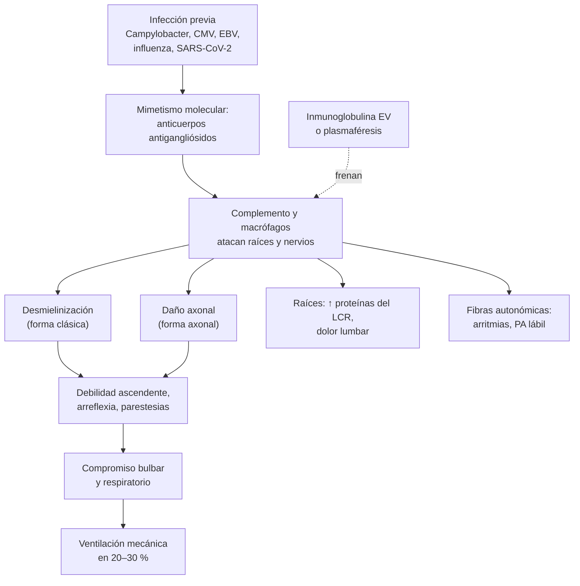

---
tags:
  - Neurología
  - Urgencia
---

# Debilidad aguda: síndrome de Guillain-Barré, paraplejia y cuadriplejia aguda y trauma raquimedular

**Subespecialidad**
Neurología · Neurocirugía · Medicina intensiva · Medicina de urgencia

**Guías principales**
EAN/PNS 2023: diagnóstico y tratamiento del síndrome de Guillain-Barré · Guía internacional "en 10 pasos" (*Nat Rev Neurol* 2019) · AO Spine/Praxis 2024: lesión medular aguda (descompresión y manejo hemodinámico) · AO Spine 2017: metilprednisolona en la lesión medular

**Otras fuentes**
Puntaje mEGRIS (riesgo de ventilación mecánica, 2023) · Incidencia de Guillain-Barré en Chile (2013–2022) · Revisiones del *NEJM*: compresión medular aguda (2017) y absceso epidural espinal (2026) · Regla canadiense de columna cervical

**GES**
No para el Guillain-Barré. Sí: **politraumatizado grave** (N.° 48)

**EUNACOM**
1.10.2.011 Paraplejia aguda (sospecha, inicial, no requiere) · 1.10.2.012 Síndrome cuadriplégico agudo (sospecha, inicial, no requiere) · 1.10.2.013 Síndrome cuadriparético fláccido: polirradiculoneuritis aguda, Guillain-Barré (sospecha, inicial, no requiere) · 1.10.2.021 Traumatismo raquimedular (sospecha, inicial, derivar)

**Revisado**
Septiembre 2026

!!! abstract "Resumen en 60 segundos"
    - **Debilidad aguda de las extremidades = urgencia**. Primero, **localizar** la lesión:
        - **Médula**: **nivel sensitivo**, compromiso de **esfínteres**, dolor de espalda. Al inicio puede ser **fláccida y arrefléctica** (shock medular).
        - **Nervio periférico** (Guillain-Barré): debilidad **ascendente y simétrica** con **arreflexia**, parestesias distales, **sin nivel sensitivo**.
    - **Paraplejia o cuadriplejia aguda con nivel sensitivo**: **RM de columna urgente** (compresión por metástasis, absceso o hematoma epidural = cirugía o radioterapia en horas).
    - **Guillain-Barré**:
        - Polirradiculoneuropatía inmune, a menudo **tras una infección** (*Campylobacter*, virus). Nadir en **≤ 4 semanas**.
        - **LCR** con **disociación albúmino-citológica** (puede ser normal la 1.ª semana) y estudio **electrofisiológico**.
        - **Vigilar la capacidad vital** (< 20 mL/kg = intubar), la **disfagia** y la **disautonomía**.
        - Tratamiento si **no camina sin ayuda**: **inmunoglobulina EV 0,4 g/kg/día por 5 días** o **plasmaféresis**. **Los corticoides no sirven.**
    - **Trauma raquimedular**:
        - **Restricción de movimiento** de la columna y **TC** (reglas NEXUS o canadiense).
        - Evitar la hipotensión: **PAM 75–80 a 90–95 mmHg por 3–7 días**.
        - **Descompresión quirúrgica en < 24 h**.
        - Distinguir el **shock neurogénico** (hipotensión con **bradicardia**) del hemorrágico.

## Definición

- **Paraplejia (paraparesia) aguda**: debilidad de **ambas piernas** instalada en horas a días. Sugiere una lesión **medular** (torácica o lumbar) o de la **cola de caballo**, o, menos a menudo, una lesión cerebral parasagital o de los nervios periféricos.
- **Cuadriplejia (cuadriparesia) aguda**: debilidad de las **4 extremidades**: médula **cervical**, tronco cerebral, **nervio periférico** (Guillain-Barré), unión neuromuscular o músculo.
- **Síndrome de Guillain-Barré (SGB)**: **polirradiculoneuropatía aguda inmunomediada**, con debilidad **simétrica** progresiva y **arreflexia**, que alcanza su máxima intensidad (nadir) en **≤ 4 semanas**.
    - Si la progresión continúa **más de 8 semanas**, considerar una polineuropatía desmielinizante inflamatoria crónica de inicio agudo (**~ 5 %** de los casos).
- **Mielopatía aguda**: disfunción de la médula espinal de instalación aguda, **compresiva** (tumor, absceso, hematoma, hernia, fractura) o **no compresiva** (mielitis transversa, infarto medular, desmielinizante, metabólica).
- **Trauma raquimedular**: lesión traumática de la columna vertebral con o sin **lesión medular**, que puede ser **completa** (sin función motora ni sensitiva bajo el nivel, incluidos los segmentos sacros) o **incompleta**.

## Epidemiología

### Mundial

- **Guillain-Barré**: incidencia de **~ 1–2 por 100.000** habitantes al año; aumenta con la **edad** y es algo más frecuente en **hombres**. Es la causa más frecuente de **parálisis flácida aguda** en el mundo tras la eliminación de la poliomielitis.
    - **~ 2/3** de los pacientes tuvo una **infección** en las semanas previas: ***Campylobacter jejuni***, citomegalovirus, virus de Epstein-Barr, *Mycoplasma pneumoniae*, influenza, virus hepatitis E, Zika y SARS-CoV-2. Excepcionalmente, tras una vacuna.
    - **~ 20–30 %** requiere **ventilación mecánica**.
- **Lesión medular traumática**: predomina en **hombres jóvenes** (accidentes de tránsito, caídas, deportes, violencia) y, cada vez más, en **adultos mayores** (caídas de baja energía con lesiones cervicales sobre una columna degenerada).
- **Absceso epidural espinal**: poco frecuente, pero en aumento (uso de drogas intravenosas, procedimientos espinales, diabetes). ***S. aureus*** causa **> 50 %** de los casos (Tande, 2026).

### Chile

!!! chile "Contexto nacional"
    - **Guillain-Barré**: la incidencia en Chile es **alta** según los egresos hospitalarios, pero las estimaciones varían según cómo se cuentan los casos (la duplicación de egresos por reingresos o traslados):
        - **2013–2022**: 5.096 egresos, tasa estandarizada de **2,60 por 100.000**; **58,6 %** hombres; máximo entre los **70 y 79 años**; un **gradiente hacia el sur** (Sur 4,55 y Extremo Sur 4,86 por 100.000, frente a 1,86 en el Extremo Norte) (Galiá-Llaña, 2026).
        - **2013–2019**, con otra definición de caso: **1,46 por 100.000**, **58,8 %** hombres, edad media 47 años y **mortalidad hospitalaria de 1,7 %** (Idiáquez, 2026).
    - **Trauma**: el **politraumatizado grave** (GES N.° 48) y el **TEC moderado o grave** (GES N.° 49) tienen garantías de atención de urgencia y derivación.
    - **HTLV-1**: causa de **paraparesia espástica progresiva** (mielopatía asociada al HTLV-1); está presente en Chile y debe buscarse en la paraparesia espástica sin otra causa.

## Etiología

| Localización | Causas de debilidad aguda |
|---|---|
| **Cerebro y tronco** | ACV de la arteria **basilar** (cuadriplejia, síndrome de enclaustramiento), infarto bilateral de las arterias **cerebrales anteriores** o meningioma parasagital (paraparesia), mielinolisis pontina |
| **Médula espinal: compresiva** | **Metástasis** epidural (pulmón, mama, próstata, mieloma; ver [urgencias oncológicas](../hematologia/urgencias-oncologicas.md)), **absceso epidural**, **hematoma epidural** (anticoagulantes, punciones), hernia discal, **fractura** o luxación traumática, espondilosis cervical |
| **Médula espinal: no compresiva** | **Mielitis transversa** (idiopática, esclerosis múltiple, **neuromielitis óptica**, MOGAD, lupus, infecciones), **infarto medular** (cirugía o **disección aórtica**), mielopatía por radiación, **déficit de B12 o cobre** (subaguda), **HTLV-1**, VIH |
| **Raíces y nervios periféricos** | **Guillain-Barré** y variantes, polineuropatía del paciente crítico, porfiria aguda intermitente, neuropatía tóxica (arsénico, organofosforados), **difteria**, **parálisis por garrapata** |
| **Unión neuromuscular** | **Crisis miasténica**, **botulismo** (debilidad **descendente** con midriasis y compromiso bulbar), intoxicación por organofosforados |
| **Músculo** | **Parálisis periódica hipokalémica** (tirotoxicosis; ver [potasio](../nefrologia/trastornos-del-potasio.md)), **hiperkalemia** grave, miopatía del paciente crítico, **rabdomiólisis**, miositis |

## Fisiopatología

1. **Guillain-Barré**:
    - **Mimetismo molecular**: la infección previa (por ejemplo, los lipooligosacáridos de *C. jejuni*) induce **anticuerpos** que reaccionan contra los **gangliósidos** de los nervios periféricos (GM1, GD1a, **GQ1b**).
    - Los anticuerpos y el **complemento** dañan la **mielina** (forma **desmielinizante**, la más frecuente en Europa y América) o el **axón** en los nodos de Ranvier (forma **axonal**, más frecuente en Asia y tras *C. jejuni*).
    - El compromiso de las **raíces** explica el aumento de las **proteínas del LCR** y el dolor lumbar; el de las fibras autonómicas, la **disautonomía**.
2. **Mielopatía compresiva**: la compresión produce **edema** e **isquemia** medular; el daño se vuelve irreversible si la descompresión se retrasa (horas a pocos días).
3. **Lesión medular traumática**:
    - **Lesión primaria**: el impacto mecánico.
    - **Lesión secundaria** (horas a días): isquemia, edema, inflamación y excitotoxicidad, que empeoran con la **hipotensión** y la hipoxia. Por eso se mantiene la **PAM alta** y se descomprime precozmente.
    - **Shock medular**: pérdida transitoria de los reflejos y del tono bajo la lesión (parálisis **fláccida arrefléctica**), que en días a semanas da paso a la **espasticidad**.
    - **Shock neurogénico**: en las lesiones **sobre T6**, pérdida del tono simpático → **vasodilatación** (hipotensión) y **bradicardia** (predominio vagal).

*Figura 1. Fisiopatología del síndrome de Guillain-Barré. Esquema propio.*

## Clasificación

- **Variantes del Guillain-Barré** (Figura 2):
    - **Clásica sensitivo-motora** (la más frecuente).
    - **Motora pura** (forma axonal, neuropatía axonal motora aguda).
    - **Paraparética**, **faringo-cérvico-braquial**, **diplejia facial** con parestesias, **sensitiva pura**.
    - **Síndrome de Miller Fisher**: **oftalmoplejia**, **ataxia** y **arreflexia** (anticuerpos **anti-GQ1b**).
    - **Encefalitis de tronco de Bickerstaff**: Miller Fisher con **compromiso de conciencia**.
- **Lesión medular**: escala de la **ASIA** (AIS):

| Grado | Descripción |
|---|---|
| **A** | **Completa**: sin función motora ni sensitiva en los segmentos sacros S4–S5 |
| **B** | Incompleta **sensitiva**: sensibilidad conservada bajo el nivel (incluido S4–S5), sin función motora |
| **C** | Incompleta **motora**: más de la mitad de los músculos clave bajo el nivel con fuerza **< 3** |
| **D** | Incompleta **motora**: al menos la mitad de los músculos clave con fuerza **≥ 3** |
| **E** | **Normal** |

- **Síndromes medulares incompletos**:
    - **Central**: más debilidad en las **extremidades superiores** que en las inferiores (adulto mayor con hiperextensión cervical sobre una espondilosis).
    - **Anterior**: pérdida **motora** y de la sensibilidad **dolorosa y térmica**, con **propiocepción conservada** (infarto de la arteria espinal anterior, cirugía aórtica).
    - **Brown-Séquard** (hemisección): debilidad y pérdida de la propiocepción **del mismo lado**, pérdida de la sensibilidad dolorosa y térmica del lado **opuesto**.
    - **Cono medular y cola de caballo**: anestesia **en silla de montar**, disfunción de los **esfínteres**, debilidad de las piernas (arrefléctica en la cola de caballo).

## Clínica

| Característica | Guillain-Barré | Mielopatía aguda |
|---|---|---|
| **Distribución** | **Ascendente**, simétrica; puede comprometer los pares craneales (facial bilateral) y los músculos respiratorios | Bajo un **nivel** (paraparesia si es torácica, cuadriparesia si es cervical) |
| **Reflejos** | **Arreflexia** o hiporreflexia (~ 90 %) | **Abolidos al inicio** (shock medular); luego **hiperreflexia** y **Babinski** |
| **Sensibilidad** | Parestesias distales, **sin nivel sensitivo** | **Nivel sensitivo** (clave) |
| **Esfínteres** | En general conservados (retención leve posible) | **Retención urinaria** y fecal **precoz** |
| **Dolor** | **Lumbar** o radicular frecuente | Dolor **dorsal** localizado (metástasis, absceso, hematoma, disección) |
| **Otros** | **Disautonomía**: taquicardia o bradicardia, PA lábil, íleo | Fiebre (absceso), cáncer conocido, anticoagulación, trauma |

- **Guillain-Barré**:
    - Parestesias en los pies y las manos, luego **debilidad de las piernas** que asciende en días.
    - **Dolor** lumbar o en las extremidades (~ 2/3).
    - **Pares craneales**: diplejia facial, disfagia, disartria; oftalmoplejia en el Miller Fisher.
    - **Insuficiencia respiratoria**: disnea, respiración paradójica, voz débil, **tos ineficaz**, incapacidad de contar hasta 20 en una respiración.
    - **Disautonomía**: arritmias (que pueden ser fatales), HTA o hipotensión, íleo, retención urinaria.
- **Trauma raquimedular**: dolor cervical o dorsal, deformidad, déficit motor y sensitivo con **nivel**, priapismo, **shock neurogénico** (hipotensión con **bradicardia** y piel caliente), respiración diafragmática (lesiones cervicales altas: C3–C5 inervan el diafragma).

!!! alarma "Debilidad aguda: signos de gravedad"
    - **Nivel sensitivo**, **retención urinaria**, dolor dorsal y debilidad de las piernas: **compresión medular** hasta demostrar lo contrario → **RM de columna urgente** (horas).
    - **Fiebre + dolor dorsal + déficit neurológico**: **absceso epidural** (hemocultivos, RM con gadolinio, neurocirugía).
    - **Anticoagulado** o tras una punción lumbar o una anestesia neuroaxial con debilidad de las piernas: **hematoma epidural** (revertir la anticoagulación y cirugía).
    - **Guillain-Barré**: **capacidad vital < 20 mL/kg**, **presión inspiratoria máxima < 30 cmH2O** (menos negativa que −30), **presión espiratoria máxima < 40 cmH2O**, **disfagia**, tos ineficaz o **disautonomía** → **UCI**.
    - **Dolor torácico o dorsal súbito + paraplejia**: **disección aórtica** con infarto medular (ver [síndrome aórtico agudo](../cardiologia/sindrome-aortico-agudo.md)).
    - **Debilidad descendente con pupilas dilatadas y compromiso bulbar**: **botulismo**.

## Diagnóstico

**Paso 1. Localizar** con el examen neurológico: fuerza, **reflejos**, **nivel sensitivo**, pares craneales, esfínteres (**tono anal**, globo vesical), función respiratoria.

**Paso 2. Si hay sospecha de mielopatía**: **RM de toda la columna con gadolinio, urgente**. Si hay compresión: **neurocirugía** (y corticoides y radioterapia si es tumoral). Si no hay compresión: punción lumbar, anticuerpos contra la acuaporina 4 y MOG, RM de cerebro, B12, VIH, HTLV-1, sífilis.

**Paso 3. Si hay sospecha de Guillain-Barré**:

- **Diagnóstico clínico** apoyado por:
    - **Punción lumbar**: **disociación albúmino-citológica** (proteínas altas con **< 50 células/µL**). Las proteínas pueden ser **normales en la primera semana** (~ 1/3 o más): no descartan el diagnóstico. **> 50 células/µL** obliga a pensar en otra causa (infección, VIH, linfoma, sarcoidosis).
    - **Electromiografía y velocidades de conducción**: patrón **desmielinizante** o **axonal**; apoyan el diagnóstico y lo clasifican (pueden ser normales al inicio).
    - **Anticuerpos anti-GQ1b** si se sospecha un **Miller Fisher** (los otros antigangliósidos tienen poco valor en la forma típica).
    - **RM de columna** en los casos atípicos (realce de las raíces; descarta una mielopatía).
- **Evaluar el riesgo respiratorio**: **capacidad vital** seriada (cada 2–6 h al inicio), presiones inspiratoria y espiratoria máximas, contar hasta 20, deglución.
    - **mEGRIS** (EAN/PNS 2023): predice el riesgo de ventilación mecánica con el tiempo desde el inicio de la debilidad hasta el ingreso, la **parálisis bulbar** y la debilidad de la **flexión del cuello** y de la **cadera**.
- **ECG y monitoreo** continuo (disautonomía).

**Paso 4. Trauma raquimedular**:

- **ABCDE** con **restricción del movimiento** de la columna.
- **Imágenes de la columna cervical** según las reglas **NEXUS** o **canadiense** (Stiell, 2003):
    - **NEXUS**: no hacen falta imágenes si **no hay** dolor en la línea media posterior, déficit neurológico focal, alteración de conciencia, intoxicación ni una lesión distractora.
    - **Regla canadiense**: imágenes si hay factores de **alto riesgo** (edad ≥ 65, mecanismo peligroso, parestesias en las extremidades); si hay factores de bajo riesgo y el paciente **puede rotar el cuello 45°** a ambos lados, no se necesitan.
- **TC** de columna (de elección para las fracturas) y **RM** si hay déficit neurológico (médula, ligamentos, hematoma, disco).

## Laboratorio

| Examen | Uso |
|---|---|
| **LCR** | **Guillain-Barré**: proteínas ↑ con células normales. **Mielitis**: pleocitosis, bandas oligoclonales. Infecciones |
| **Electrolitos: K, Ca, P, Mg** | Parálisis por **hipokalemia** o hiperkalemia, hipofosfatemia |
| **CK** | Miositis, rabdomiólisis |
| **Hemograma, PCR, hemocultivos** | **Absceso epidural** (leucocitosis, VHS y PCR altas) |
| **Coagulación** | Hematoma epidural en anticoagulados |
| **B12, cobre, VIH, HTLV-1, VDRL** | Mielopatías metabólicas e infecciosas |
| **Anti-acuaporina 4, anti-MOG** | Neuromielitis óptica, MOGAD |
| **Serología o cultivo de deposiciones para *Campylobacter***, CMV, EBV | Desencadenante del Guillain-Barré |
| **Gases arteriales** | La hipercapnia es un signo **tardío** de falla respiratoria neuromuscular (no esperar a que aparezca) |

## Imágenes

- **RM de columna completa con gadolinio**: el examen clave en la **debilidad aguda con nivel sensitivo** o disfunción de esfínteres. Muestra la compresión (tumor, absceso, hematoma, disco), las lesiones inflamatorias de la mielitis y el infarto medular. En el Guillain-Barré puede mostrar **realce de las raíces** de la cola de caballo.
- **TC de columna**: fracturas y luxaciones en el trauma; alternativa si no hay RM (mielo-TC).
- **RM de cerebro**: en la mielitis (esclerosis múltiple, neuromielitis), en la cuadriparesia con signos de tronco.
- **Angio-TC de aorta**: si se sospecha una disección con infarto medular.

<figure markdown>
![Ocho siluetas humanas que muestran la distribución de los síntomas en las variantes del síndrome de Guillain-Barré. Clásica sensitivo-motora: síntomas motores y sensitivos en las cuatro extremidades, el tronco y la cara. Motora pura: sólo síntomas motores difusos. Paraparética: síntomas en las piernas. Faringo-cérvico-braquial: síntomas en la cara, el cuello, los brazos y la parte alta del tronco. Diplejia facial con parestesias: cara y parestesias distales. Sensitiva pura: síntomas sensitivos distales. Síndrome de Miller Fisher: ataxia y compromiso ocular. Encefalitis de tronco de Bickerstaff: síntomas motores y sensitivos con ataxia y compromiso de conciencia](../assets/figuras/neuro/variantes-guillain-barre-leonhard-2019.jpg){ loading=lazy }
<figcaption>Figura 2. Distribución de los síntomas en las variantes del síndrome de Guillain-Barré: rayas rojas, síntomas motores; azules, sensitivos; halo rosado, compromiso de conciencia; líneas onduladas, ataxia. Tomado de Leonhard SE, Mandarakas MR, Gondim FAA, et al. <em>Nat Rev Neurol</em> 2019;15:671–683 (figura 2). Licencia <a href="https://creativecommons.org/licenses/by/4.0/">CC BY 4.0</a>.</figcaption>
</figure>

## Diagnóstico diferencial

| Cuadro | Claves para distinguirlo del Guillain-Barré |
|---|---|
| **Mielopatía aguda** | **Nivel sensitivo**, **esfínteres** precoces, hiperreflexia tardía; RM |
| **Crisis miasténica** | Fatigabilidad, **ptosis y diplopía** fluctuantes, **reflejos conservados**, sin alteración sensitiva |
| **Botulismo** | Parálisis **descendente**, **midriasis**, compromiso bulbar precoz, sin alteración sensitiva; alimentos caseros en conserva |
| **Parálisis periódica hipokalémica** | K muy bajo, episodios previos, tirotoxicosis, recuperación rápida con K |
| **Polineuropatía o miopatía del paciente crítico** | Sepsis y UCI prolongada, dificultad para el destete del ventilador |
| **ACV del tronco** (basilar) | Inicio **súbito**, signos de tronco, alteración de conciencia |
| **Polineuropatía desmielinizante inflamatoria crónica de inicio agudo** | Progresión **> 8 semanas** o ≥ 3 recaídas |
| **Neuropatía por porfiria, tóxicos, vasculitis** | Dolor abdominal y orina oscura (porfiria), exposición, compromiso asimétrico (mononeuritis múltiple) |
| **Trastorno neurológico funcional** | Signo de Hoover, inconsistencias al examen, reflejos normales |

## Tratamiento

### Síndrome de Guillain-Barré

!!! guia "EAN/PNS 2023"
    - **Inmunoglobulina EV 0,4 g/kg/día por 5 días** (2 g/kg en total) en los pacientes que **no pueden caminar sin ayuda**, dentro de las **2 semanas** desde el inicio de la debilidad (buena práctica: también entre las 2 y 4 semanas).
    - **O plasmaféresis**: **12–15 L** en **4–5 recambios** durante 1–2 semanas, dentro de las **4 semanas**, en los que no pueden caminar sin ayuda.
    - **No** usar plasmaféresis seguida de inmunoglobulina.
    - **No** dar un **segundo ciclo** de inmunoglobulina a los pacientes con mal pronóstico.
    - **No** usar **corticoides** orales (recomendación en contra) ni EV (recomendación débil en contra).
    - **Dolor**: **gabapentinoides**, antidepresivos tricíclicos o carbamazepina (recomendación débil).
    - Usar el **mEGOS** para estimar el pronóstico y el **mEGRIS** para el riesgo de ventilación mecánica.
    - **Fluctuación relacionada con el tratamiento** (empeoramiento tras una mejoría inicial, en las primeras 8 semanas): se suele **repetir** el tratamiento.

!!! dosis "Guillain-Barré: tratamiento y soporte"
    - **Inmunoglobulina EV**: **0,4 g/kg/día por 5 días** (infusión lenta al inicio; vigilar la función renal, la trombosis y la meningitis aséptica; medir la IgA si hay antecedentes de alergia).
    - **Criterios de UCI**: progresión rápida, **capacidad vital < 20 mL/kg**, disfunción **bulbar** con riesgo de aspiración, **disautonomía** grave, tos ineficaz, mEGRIS alto.
    - **Criterios de intubación ("regla 20/30/40")**: capacidad vital **< 20 mL/kg**, presión inspiratoria máxima **< 30 cmH2O** en valor absoluto, presión espiratoria máxima **< 40 cmH2O**; hipoxemia o signos de fatiga. **No esperar la hipercapnia.**
    - **Evitar la succinilcolina** (hiperkalemia) al intubar.
    - **Tromboprofilaxis** con HBPM hasta que camine.
    - **Disautonomía**: monitoreo continuo; tratar la HTA y las arritmias con **fármacos de acción corta** (fluctúa); cuidado con la **bradicardia** al aspirar la vía aérea.
    - **Kinesiterapia** motora y respiratoria precoz, prevención de las úlceras por presión, manejo de la vejiga y el intestino, **apoyo psicológico**.

### Mielopatía aguda y paraplejia

- **Compresión medular maligna**: **dexametasona** (10 mg EV y luego 4 mg cada 6 h, o 16 mg/día) y **radioterapia** o **cirugía** urgentes (ver [urgencias oncológicas](../hematologia/urgencias-oncologicas.md)).
- **Absceso epidural espinal**: **hemocultivos**, **RM con gadolinio**, **neurocirugía** e infectología precoces; **antibióticos** empíricos contra ***S. aureus*** (incluido el resistente a meticilina) y bacilos gramnegativos (por ejemplo, **vancomicina + ceftriaxona o cefepime**), ajustados al cultivo por **6–8 semanas**. La mayoría requiere **drenaje quirúrgico**, sobre todo si hay déficit neurológico.
- **Hematoma epidural**: **revertir la anticoagulación** (ver [coagulopatías](../hematologia/coagulopatias-cid-y-reversion-de-anticoagulantes.md)) y **descompresión quirúrgica** urgente.
- **Mielitis transversa**: **metilprednisolona 1 g EV/día por 3–5 días**; **plasmaféresis** si no responde o es grave; buscar esclerosis múltiple y neuromielitis óptica.
- **Infarto medular**: soporte, mantener la PA; en la cirugía aórtica, drenaje de LCR.
- **Cuidados generales**: **sonda vesical** (retención), prevención de las úlceras por presión, **tromboprofilaxis**, manejo del intestino, rehabilitación precoz.

### Trauma raquimedular

!!! guia "AO Spine/Praxis 2024 y AO Spine 2017"
    - **Descompresión quirúrgica en las primeras 24 h** del trauma: **recomendada** como opción de tratamiento en la lesión medular aguda.
    - **Manejo hemodinámico**: se **sugiere** una **PAM de 75–80 a 90–95 mmHg** durante **3–7 días** tras la lesión.
    - **Metilprednisolona** (controvertida):
        - **No** ofrecerla si han pasado **más de 8 horas** desde la lesión, ni en infusión de **48 h**.
        - Una infusión de **24 h** dentro de las primeras **8 horas** puede **ofrecerse** como opción (recomendación débil; beneficio motor modesto).
        - Otras guías no la recomiendan de rutina: la decisión es del **neurocirujano**, según el protocolo local.

!!! dosis "Manejo inicial del trauma raquimedular"
    - **Restricción del movimiento** de la columna (collar cervical, tabla sólo para el traslado), movilización en bloque.
    - **Vía aérea**: intubación con **estabilización manual en línea** (lesiones cervicales altas: riesgo de falla respiratoria).
    - **Shock**: descartar primero el **hemorrágico** (politrauma). **Shock neurogénico** (hipotensión con **bradicardia**): volumen con prudencia, **vasopresores** (norepinefrina) para la meta de PAM y **atropina** si la bradicardia es sintomática.
    - **Sonda vesical**, sonda nasogástrica (íleo), **protección gástrica**, **tromboprofilaxis** precoz (en cuanto el riesgo de sangrado lo permita), prevención de las **úlceras por presión**.
    - **Derivación** a un centro con **neurocirugía** y UCI (GES del politraumatizado grave).

## Complicaciones

- **Guillain-Barré**: **insuficiencia respiratoria**, **neumonía por aspiración**, **arritmias** y muerte súbita por disautonomía, **TVP y TEP**, úlceras por presión, **dolor** neuropático, fatiga persistente, depresión; hiponatremia (SIADH).
- **Lesión medular**:
    - **Aguda**: shock neurogénico, insuficiencia respiratoria, íleo, **TVP y TEP**, úlceras por presión, ITU, neumonía.
    - **Crónica**: **disreflexia autonómica** (lesiones sobre T6: crisis hipertensiva desencadenada por un estímulo bajo la lesión, como la **vejiga distendida** o la impactación fecal; tratamiento: sentar al paciente, **vaciar la vejiga**, antihipertensivos de acción corta), espasticidad, vejiga neurogénica, osteoporosis, dolor neuropático, depresión.

## Pronóstico y seguimiento

- **Guillain-Barré**:
    - La mayoría mejora: **~ 80 %** camina sin ayuda a los **6 meses**. La recuperación puede continuar por **años**.
    - Mortalidad de **~ 3–7 %** en los países de ingresos altos (por complicaciones respiratorias, disautonomía e infecciones); **1,7 %** hospitalaria en Chile (2013–2019).
    - **Peor pronóstico**: **edad avanzada**, **diarrea previa** (*Campylobacter*), debilidad grave al ingreso (mEGOS).
    - **Recurrencia**: rara (~ 2–5 %).
- **Mielopatía compresiva**: el **estado neurológico al tratamiento** es el principal predictor: quien camina al momento de la cirugía o la radioterapia suele seguir caminando.
- **Lesión medular**: depende del **grado ASIA** inicial; las lesiones **completas** (A) tienen una recuperación motora limitada.
- **Perfil EUNACOM**:
    - **Paraplejia**, **cuadriplejia** y **Guillain-Barré**: **sospecha** (localización y signos de alarma) y **tratamiento inicial** (vía aérea, monitoreo respiratorio y autonómico, RM urgente), sin seguimiento especializado.
    - **Trauma raquimedular**: sospecha, **tratamiento inicial** (restricción de movimiento, manejo del shock, PAM) y **derivación**.

## Perlas para el internado

!!! perla "Para la sala y el turno"
    - **Debilidad de piernas + retención urinaria + nivel sensitivo = RM de columna ahora.** Los reflejos pueden estar **abolidos** al inicio (shock medular): no te confundas con un Guillain-Barré.
    - **Guillain-Barré: mide la capacidad vital, no la saturación.** La SatO2 y los gases se alteran tarde.
    - **Pide que cuente hasta 20** en una respiración: si no llega a 10, llama a la UCI.
    - **Corticoides en el Guillain-Barré: no.**
    - **LCR normal la primera semana no descarta Guillain-Barré.** Más de 50 células/µL: piensa en otra cosa.
    - **Fiebre + dolor dorsal + déficit = absceso epidural** (*S. aureus*).
    - **Anticoagulado + dolor dorsal + paraparesia = hematoma epidural**: revierte y llama al neurocirujano.
    - **Trauma + hipotensión + bradicardia = shock neurogénico** (pero descarta primero el hemorrágico).
    - En el lesionado medular crónico con **cefalea y HTA súbitas**: **disreflexia autonómica** → vacía la vejiga.

## Preguntas de repaso

??? repaso "1. Hombre de 38 años con diarrea hace 2 semanas. Consulta por hormigueo en los pies y debilidad de las piernas que en 4 días subió a los brazos; ahora no puede caminar sin ayuda. Arreflexia generalizada, sin nivel sensitivo, esfínteres normales. ¿Qué sospechas y qué haces?"
    **Síndrome de Guillain-Barré** (probable desencadenante: *Campylobacter jejuni*).

    1. **Hospitalizar** con monitoreo cardíaco y **capacidad vital seriada** (cada 2–6 h al inicio), evaluación de la deglución.
    2. **Punción lumbar** (disociación albúmino-citológica; puede ser normal la primera semana) y **electromiografía**.
    3. **Inmunoglobulina EV 0,4 g/kg/día por 5 días** (no camina sin ayuda y está dentro de las 2 semanas) o plasmaféresis.
    4. **Tromboprofilaxis**, manejo del dolor (gabapentinoides), kinesiterapia.
    5. **UCI** si la capacidad vital es < 20 mL/kg, hay disfunción bulbar o disautonomía. **No** corticoides.

??? repaso "2. Paciente con Guillain-Barré, internado, cuya capacidad vital bajó de 35 a 18 mL/kg en 12 horas. SatO2 96 % y PaCO2 38 mmHg. ¿Lo intubas?"
    **Sí, se debe planificar la intubación en la UCI** (o al menos el traslado inmediato a la UCI para una intubación electiva).

    - La **capacidad vital < 20 mL/kg** (regla 20/30/40) y su **caída rápida** predicen la falla respiratoria.
    - En la debilidad neuromuscular, la **saturación y la PaCO2 se alteran tarde**: esperar la hipercapnia lleva a una intubación de urgencia con más complicaciones.
    - Evitar la succinilcolina.

??? repaso "3. Mujer de 62 años con cáncer de mama que consulta por dolor dorsal de 3 semanas y, desde ayer, debilidad de las piernas y retención urinaria. Nivel sensitivo en T8. ¿Qué haces?"
    **Compresión medular maligna**: urgencia oncológica.

    1. **Dexametasona** EV (por ejemplo, 10 mg y luego 4 mg cada 6 h).
    2. **RM de toda la columna con gadolinio urgente** (puede haber varios niveles).
    3. **Neurocirugía** y **radioterapia** en horas (según la estabilidad, el tipo de tumor y el pronóstico).
    4. **Sonda vesical**, analgesia, tromboprofilaxis.

    El pronóstico depende del **estado neurológico al tratamiento**: cada hora cuenta.

??? repaso "4. Motociclista de 25 años con trauma cervical. PA 78/42, FC 48, piel caliente y seca, sin movilidad de las extremidades y con respiración abdominal. ¿Qué tipo de shock tiene y cómo lo manejas?"
    **Shock neurogénico** por una **lesión medular cervical** (hipotensión con **bradicardia** y piel caliente por la pérdida del tono simpático).

    - **ABCDE** con restricción del movimiento cervical; vigilar la **vía aérea** (lesión alta: riesgo de falla respiratoria; intubar con estabilización en línea).
    - **Descartar el shock hemorrágico** (politrauma: FAST, radiografía de pelvis, TC).
    - **Volumen** con prudencia y **norepinefrina** para una **PAM de 75–80 a 90–95 mmHg** por 3–7 días; **atropina** si la bradicardia es sintomática.
    - TC y RM de columna; **descompresión quirúrgica en < 24 h**; sonda vesical; derivación a un centro con neurocirugía (GES del politraumatizado grave).

??? repaso "5. ¿Cómo distingues clínicamente un Guillain-Barré de una mielopatía aguda?"
    | | Guillain-Barré | Mielopatía |
    |---|---|---|
    | **Nivel sensitivo** | **No** | **Sí** |
    | **Esfínteres** | Conservados | **Compromiso precoz** |
    | **Reflejos** | Arreflexia | Abolidos al inicio (shock medular), luego **hiperreflexia y Babinski** |
    | **Pares craneales** | Frecuente (facial) | No (salvo lesiones altas) |
    | **LCR** | Disociación albúmino-citológica | Variable |
    | **Examen clave** | Punción lumbar, electromiografía | **RM de columna urgente** |

## Referencias

1. van Doorn PA, Van den Bergh PYK, Hadden RDM, et al. European Academy of Neurology/Peripheral Nerve Society Guideline on diagnosis and treatment of Guillain-Barré syndrome. *Eur J Neurol.* 2023;30:3646–3674. doi:[10.1111/ene.16073](https://doi.org/10.1111/ene.16073)
2. Leonhard SE, Mandarakas MR, Gondim FAA, et al. Diagnosis and management of Guillain-Barré syndrome in ten steps. *Nat Rev Neurol.* 2019;15:671–683. doi:[10.1038/s41582-019-0250-9](https://doi.org/10.1038/s41582-019-0250-9)
3. Luijten LWG, Doets AY, Arends S, et al. Modified Erasmus GBS Respiratory Insufficiency Score: a simplified clinical tool to predict the risk of mechanical ventilation in Guillain-Barré syndrome. *J Neurol Neurosurg Psychiatry.* 2023;94:300–308. doi:[10.1136/jnnp-2022-329937](https://doi.org/10.1136/jnnp-2022-329937)
4. Galiá-Llaña R, Ronda-Rojas D, Del Solar-Benavides A, et al. Incidence of Guillain-Barré Syndrome in Chile: A Population-Based Study Between 2013 and 2022. *J Peripher Nerv Syst.* 2026;31:e70103. doi:[10.1111/jns.70103](https://doi.org/10.1111/jns.70103)
5. Idiáquez JF, Salinas R, Cea G. Guillain-Barré Syndrome in Chile: Incidence and Mortality (2013-2019). *Neuroepidemiology.* 2026;60:615–621. doi:[10.1159/000547305](https://doi.org/10.1159/000547305)
6. Kwon BK, Tetreault LA, Evaniew N, et al. AO Spine/Praxis Clinical Practice Guidelines for the Management of Acute Spinal Cord Injury: An Introduction, Rationale, and Scope. *Global Spine J.* 2024;14(3 Suppl):5S–9S. doi:[10.1177/21925682231189928](https://doi.org/10.1177/21925682231189928)
7. Fehlings MG, Wilson JR, Tetreault LA, et al. A Clinical Practice Guideline for the Management of Patients With Acute Spinal Cord Injury: Recommendations on the Use of Methylprednisolone Sodium Succinate. *Global Spine J.* 2017;7(3 Suppl):203S–211S. doi:[10.1177/2192568217703085](https://doi.org/10.1177/2192568217703085)
8. Stiell IG, Clement CM, McKnight RD, et al. The Canadian C-spine rule versus the NEXUS low-risk criteria in patients with trauma. *N Engl J Med.* 2003;349:2510–2518. doi:[10.1056/NEJMoa031375](https://doi.org/10.1056/NEJMoa031375)
9. Ropper AE, Ropper AH. Acute Spinal Cord Compression. *N Engl J Med.* 2017;376:1358–1369. doi:[10.1056/NEJMra1516539](https://doi.org/10.1056/NEJMra1516539)
10. Tande AJ, Currier BL, Osmon DR. Spinal Epidural Abscess. *N Engl J Med.* 2026;394:1621–1633. doi:[10.1056/NEJMra2412728](https://doi.org/10.1056/NEJMra2412728)
11. Superintendencia de Salud. Problemas de salud GES N.° 48 (politraumatizado grave) y N.° 49 (traumatismo cráneo encefálico moderado o grave). [superdesalud.gob.cl](https://www.superdesalud.gob.cl/orientacion-en-salud/politraumatizado-grave/)
