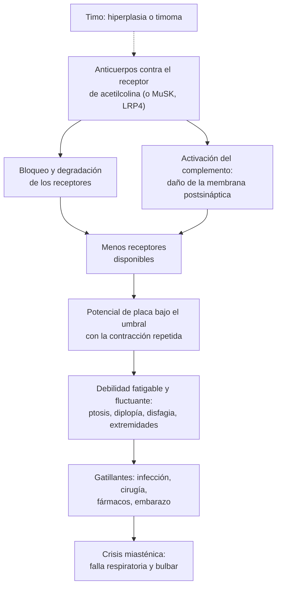

---
tags:
  - Neurología
  - Urgencia
---

# Debilidad muscular: enfoque de la parálisis, síndrome miasténico y síndrome miopático

**Subespecialidad**
Neurología · Medicina interna · Medicina intensiva

**Guías principales**
Consenso internacional para el manejo de la miastenia gravis, actualización 2020 (MGFA) · Guía alemana de síndromes miasténicos 2023 (Wiendl) · Clasificación clínica MGFA (2000) · Consenso de la Sociedad Europea de Aterosclerosis 2015: síntomas musculares asociados a estatinas

**Otras fuentes**
Ensayo MGTX de timectomía (NEJM 2016) · Metaanálisis del Cholesterol Treatment Trialists' Collaboration sobre síntomas musculares con estatinas (Lancet 2022) · Epidemiología de la miastenia en Chile (Cea 2018) y en Latinoamérica (Salutto 2026) · Prevalencia mundial de la miastenia (Salari 2021)

**GES**
La miastenia, las miopatías y las distrofias **no son GES**. El **ACV isquémico en personas de 15 años y más** (causa principal de hemiparesia aguda) **sí** lo es. El **botulismo** es de **notificación inmediata** (Decreto 7 de 2019).

**EUNACOM**
1.10.1.015 Parálisis: tetraparesia, hemiparesia, etc. (sospecha, inicial, no requiere) · 1.10.1.020 Síndrome miasténico (sospecha, inicial, no requiere) · 1.10.1.021 Síndrome miopático: distrofias musculares, polimiositis (sospecha, inicial, no requiere)

**Revisado**
Octubre 2026

!!! abstract "Resumen en 60 segundos"
    - **Localiza la lesión** siguiendo la vía motora:
        - **Hemiparesia** con la cara: cerebro (ACV).
        - **Cruzada**: tronco.
        - **Para o tetraparesia con nivel sensitivo y vejiga**: médula.
        - **Distal con hipoestesia**: nervio.
        - **Fatigable** con ptosis y diplopía: **unión neuromuscular**.
        - **Proximal simétrica sin alteración sensitiva**: **músculo**.
    - **Motoneurona superior**: reflejos aumentados y Babinski. **Inferior**: reflejos disminuidos, atrofia y fasciculaciones.
    - **Miastenia gravis**: debilidad **fluctuante y fatigable** que empeora en la tarde, con **ptosis** y **diplopía** (inicio ocular en casi la mitad). Sensibilidad y reflejos **normales**.
        - Diagnóstico: **anticuerpos antirreceptor de acetilcolina** (~85 % de las generalizadas), estimulación repetitiva y **TC de tórax** (timoma).
        - Tratamiento: **piridostigmina**, **corticoides** (subir lento) y ahorradores (azatioprina); **timectomía** en la generalizada seropositiva < 65 años.
    - **Crisis miasténica**: debilidad **respiratoria o bulbar**. **UCI**, medir la **capacidad vital** (< 20 mL/kg: intubar), **inmunoglobulina EV o plasmaféresis**. Revisar **fármacos** gatillantes (aminoglucósidos, quinolonas, macrólidos, magnesio).
    - **Síndrome miopático**: debilidad **proximal** simétrica (subir escaleras, peinarse) con **CK alta**. Busca **fármacos** (estatinas, corticoides), **hipotiroidismo**, **potasio**, miopatías **inflamatorias** y, en jóvenes, **distrofias**.
    - **Rabdomiólisis**: CK muy alta, orina oscura y **LRA**: suero fisiológico **precoz** y abundante, vigilar el **potasio**.

## Definición

| Concepto | Definición |
|---|---|
| **Paresia / plejia** | Disminución (paresia) o pérdida total (plejia) de la fuerza muscular |
| **Hemiparesia** | Debilidad de un **hemicuerpo** (brazo y pierna del mismo lado, con o sin la cara) |
| **Paraparesia** | Debilidad de **ambas piernas** |
| **Tetraparesia** (cuadriparesia) | Debilidad de las **cuatro extremidades** |
| **Monoparesia** | Debilidad de **una extremidad** |
| **Síndrome de motoneurona superior** (piramidal) | Lesión de la corteza motora o la vía corticoespinal: debilidad con **espasticidad**, **hiperreflexia**, **Babinski** y sin atrofia precoz |
| **Síndrome de motoneurona inferior** | Lesión del asta anterior, la raíz o el nervio: debilidad con **hipotonía**, **hiporreflexia**, **atrofia** y **fasciculaciones** |
| **Síndrome miasténico** | Debilidad **fatigable** por alteración de la **transmisión neuromuscular**: miastenia gravis, síndrome de Lambert-Eaton, botulismo |
| **Miastenia gravis** | Enfermedad **autoinmune** postsináptica por anticuerpos contra el **receptor de acetilcolina** (AChR), la cinasa específica del músculo (**MuSK**) o LRP4 |
| **Crisis miasténica** | Empeoramiento con debilidad **respiratoria** o **bulbar** que requiere **ventilación** (invasiva o no) o protección de la vía aérea |
| **Síndrome miopático** | Debilidad por enfermedad del **músculo**: proximal, simétrica, sin alteraciones sensitivas, a menudo con **CK elevada** |
| **Distrofia muscular** | Miopatía **hereditaria** y **progresiva** con degeneración y necrosis de fibras musculares |
| **Rabdomiólisis** | Necrosis muscular aguda con liberación de **mioglobina**, CK, potasio y fósforo a la sangre |

## Epidemiología

### Mundial

- **Debilidad aguda**: la **hemiparesia** es casi siempre un **ACV**. Ver [ACV](accidente-cerebrovascular.md).
- **Miastenia gravis**:
    - Prevalencia mundial **12,4 por 100 000** habitantes (metaanálisis de 63 estudios; Salari 2021).
    - Dos picos: **mujeres jóvenes** (20–40 años) y **hombres mayores** de 60 años. El inicio **tardío** (> 65 años) está aumentando.
    - **Timoma** en el **10–15 %**; hiperplasia tímica en buena parte de los de inicio precoz con anticuerpos AChR.
- **Síntomas musculares con estatinas** (CTT 2022; 23 ensayos, 154 664 participantes):
    - Dolor o debilidad muscular en el **27,1 %** con estatina vs. **26,6 %** con placebo.
    - Solo **1 de cada 15** de esos reportes en el primer año se debe realmente a la estatina; **> 90 %** **no** se deben a ella.
    - Exceso absoluto de **11 eventos por 1000 personas-año** en el primer año; después del primer año, no hay exceso.
- **Distrofias musculares**:
    - **Duchenne**: ~1 de cada **3500–5000 varones**; la más frecuente de la infancia.
    - **Distrofia miotónica tipo 1**: la distrofia muscular **más frecuente del adulto**.

!!! chile "Datos nacionales"
    - **Miastenia gravis en Chile** (Cea 2018):
        - Prevalencia de **8,36 por 100 000** adultos en el Servicio de Salud Metropolitano Sur Oriente (captura-recaptura con el registro de piridostigmina).
        - Encuesta nacional de **405 pacientes**: razón mujer/hombre **2,2:1** y edad media de inicio **38,7 años**.
        - Inicio **ocular en 46,4 %**; generalizado 21,4 %; bulbar 8,9 %.
        - **Timoma en 13,3 %**, más frecuente en pacientes de **comunas mineras**. Inicio ≥ 60 años en el **19,5 %**.
    - **Acceso** (Salutto 2026, 12 países de Latinoamérica):
        - Los **anticuerpos anti-AChR** y **anti-MuSK** se envían a un **laboratorio en el extranjero** y los **paga el paciente**.
        - La **piridostigmina** está disponible en el sistema público y en el privado. El **rituximab** se usa fuera de indicación en el sistema público.
        - El tratamiento estándar mensual (prednisona, azatioprina y piridostigmina) cuesta cerca del **15 % del sueldo mínimo**.
    - La miastenia **no es GES**.
    - El **botulismo** es de **notificación inmediata** ante la sospecha (Decreto 7 de 2019).
    - Las **estatinas** son parte del GES de prevención cardiovascular: la mayoría de las mialgias **no** se deben a ellas (ver [dislipidemia](../endocrinologia/dislipidemia.md)).

## Etiología y factores de riesgo

| Patrón | Causas principales | Causas agudas que no se pueden pasar por alto |
|---|---|---|
| **Hemiparesia** | **ACV** isquémico o hemorrágico, tumor, absceso, hematoma subdural, esclerosis múltiple | ACV (código ACV), **hipoglicemia** (puede imitar un ACV), parálisis de Todd poscrisis |
| **Paraparesia** | **Compresión medular** (metástasis, absceso epidural, hernia, trauma), mielitis, déficit de B12, infarto medular, Guillain-Barré inicial | **Compresión medular** y **cauda equina**: RM urgente |
| **Tetraparesia** | Mielopatía cervical, **Guillain-Barré**, miastenia, miopatías, **hipokalemia**, lesión de tronco, debilidad adquirida en la UCI | Guillain-Barré, crisis miasténica, **botulismo**, **hipo o hiperkalemia**, organofosforados |
| **Monoparesia** | Lesión cortical pequeña, plexopatía, radiculopatía, mononeuropatía | ACV cortical |
| **Síndrome miasténico** | **Miastenia gravis** (autoinmune), **Lambert-Eaton** (paraneoplásico en fumadores: cáncer pulmonar de células pequeñas), **botulismo**, fármacos (penicilamina, inhibidores de puntos de control inmunológico) | Crisis miasténica, botulismo |
| **Síndrome miopático** | **Fármacos** (estatinas, **corticoides**, colchicina, hidroxicloroquina, alcohol, zidovudina), **endocrinas** (**hipotiroidismo**, hipertiroidismo, Cushing, osteomalacia), **electrolitos** (K, fósforo, calcio), **inflamatorias** (dermatomiositis, polimiositis, necrotizante, cuerpos de inclusión), **infecciosas** (influenza, VIH, **triquinosis**), **distrofias**, metabólicas (McArdle), debilidad adquirida en la UCI | **Rabdomiólisis**, miositis con disfagia o falla respiratoria |

- **Factores que precipitan una crisis miasténica**: **infecciones** (la causa más frecuente), cirugía, embarazo y puerperio, suspensión de la medicación, inicio de corticoides en dosis altas, y **fármacos** (Wiendl 2023):
    - **Evitar**: telitromicina, **toxina botulínica**, **D-penicilamina**; **fluoroquinolonas** si es posible; **magnesio EV** (p. ej., en la eclampsia).
    - **Usar con precaución** si no hay alternativa: otros **macrólidos** (azitromicina, claritromicina, eritromicina), **aminoglucósidos** (incluso en colirio), **betabloqueadores**, quinina y cloroquina, procainamida, estatinas, bloqueadores neuromusculares.
    - **Inhibidores de puntos de control inmunológico** (pembrolizumab, nivolumab): pueden **inducir** o agravar la miastenia, con casos fatales.
    - Las **cefalosporinas** se consideran **seguras** (útiles en la neumonía aspirativa).

## Fisiopatología

- **Motoneurona superior vs. inferior**: la vía corticoespinal **inhibe** los reflejos medulares. Su lesión libera los reflejos (hiperreflexia, espasticidad, Babinski). La lesión de la motoneurona inferior **desconecta** el músculo: pierde tono y reflejos y se atrofia (denervación).
- **En la fase aguda** de una lesión medular o cerebral grande puede haber **flacidez y arreflexia** ("shock medular"); la espasticidad aparece en días a semanas.
- **Miastenia gravis**:
    - Los anticuerpos **anti-AChR** bloquean el receptor, aceleran su degradación y activan el **complemento**, que destruye la membrana postsináptica.
    - Con menos receptores, el potencial de placa no alcanza el umbral con el uso repetido: la debilidad es **fatigable** y aparece **decremento** en la estimulación repetitiva.
    - El **timo** participa en la autoinmunidad (hiperplasia, timoma): base de la **timectomía**.
    - Los músculos **oculares** (pocos receptores y alta frecuencia de descarga) se afectan primero y con más frecuencia.
    - Anticuerpos **anti-MuSK**: predominio **bulbar** y cervical, mala respuesta a la piridostigmina, sin beneficio de la timectomía; buena respuesta al **rituximab**.
- **Lambert-Eaton**: anticuerpos contra los **canales de calcio presinápticos** (P/Q). Se libera menos acetilcolina; con el **esfuerzo** sostenido la liberación aumenta, por lo que la fuerza **mejora** brevemente con la contracción (facilitación). Da debilidad proximal, **arreflexia** y **disautonomía** (boca seca).
- **Botulismo**: la toxina **bloquea la liberación** presináptica de acetilcolina: parálisis **descendente** simétrica que empieza por los **pares craneales**, con **pupilas dilatadas** y sin fiebre ni alteración de conciencia.
- **Miopatías**: daño de la fibra muscular (necrosis, inflamación, alteración metabólica o estructural) que libera **CK** a la sangre. Los músculos **proximales** (cinturas) son los más afectados.
- **Rabdomiólisis**: la necrosis muscular libera **mioglobina** (tóxica para el túbulo, sobre todo con hipovolemia y orina ácida), **potasio**, **fósforo** y ácidos. El calcio se deposita en el músculo (**hipocalcemia** precoz).

*Figura 1. Fisiopatología de la miastenia gravis y de la crisis miasténica. Esquema propio basado en Wiendl 2023 y Narayanaswami 2021.*

## Clasificación

<figure markdown>
![Esquema de la vía motora a la izquierda, con la corteza, el tronco y la médula (motoneurona superior, en azul), el asta anterior, la raíz y el plexo y el nervio (motoneurona inferior, en naranja), la unión neuromuscular (morado) y el músculo (rojo), numerados del 1 al 8. A la derecha, una tarjeta por nivel. 1, corteza o cápsula interna: hemiparesia con la cara del mismo lado, afasia o negligencia; instalación en minutos, ACV hasta demostrar lo contrario. 2, tronco: pares craneales de un lado y hemiparesia del otro (cruzado), con diplopía, disartria, disfagia, vértigo o ataxia. 3, médula: para o tetraparesia con nivel sensitivo, vejiga e intestino; con dolor de espalda o cáncer, compresión medular y RM urgente. 4, asta anterior (ELA, superior e inferior): atrofia y fasciculaciones con reflejos vivos, sin alteraciones sensitivas. 5, raíz y plexo: dolor irradiado, debilidad y sensibilidad de un miotoma y dermatoma, reflejo de esa raíz disminuido. 6, nervio periférico: distal y simétrica con hipoestesia en guante y calcetín; en el Guillain-Barré, ascendente en días con arreflexia. 7, unión neuromuscular: fatigable y fluctuante, con ptosis, diplopía y disfagia, y sensibilidad y reflejos normales (miastenia). 8, músculo: proximal y simétrica (subir escaleras, levantarse, peinarse), sensibilidad normal, reflejos conservados y CK alta. Abajo: la motoneurona superior da debilidad de patrón piramidal, tono y reflejos aumentados, Babinski y sin atrofia (en la fase aguda puede haber flacidez y arreflexia); la inferior da tono y reflejos disminuidos, atrofia y fasciculaciones; la unión neuromuscular y el músculo no dan atrofia precoz ni fasciculaciones](../assets/figuras/debilidad/topografia-debilidad.svg){ loading=lazy }
<figcaption>Figura 2. Topografía de la debilidad a lo largo de la vía motora. Esquema propio.</figcaption>
</figure>

**Escala de fuerza muscular del Medical Research Council (MRC)**:

| Grado | Fuerza |
|---|---|
| **0** | Sin contracción |
| **1** | Contracción visible o palpable, sin movimiento |
| **2** | Movimiento **sin gravedad** |
| **3** | Movimiento **contra la gravedad**, sin resistencia |
| **4** | Movimiento contra **alguna resistencia** |
| **5** | Fuerza **normal** |

**Clasificación clínica de la miastenia gravis (MGFA; Jaretzki 2000)**:

| Clase | Descripción |
|---|---|
| **I** | **Ocular** pura (puede haber debilidad del cierre palpebral) |
| **II** | Generalizada **leve** (IIa: predominio de extremidades y axial; IIb: predominio **orofaríngeo** o respiratorio) |
| **III** | Generalizada **moderada** (IIIa o IIIb, igual que la II) |
| **IV** | Generalizada **grave** (IVb incluye la necesidad de sonda de alimentación sin intubación) |
| **V** | **Intubación**, con o sin ventilación mecánica (excepto en el posoperatorio de rutina) |

- **Miastenia según los anticuerpos**: anti-AChR (la mayoría), anti-MuSK, anti-LRP4 y **seronegativa**.
- **Según el timo**: con **timoma** (paraneoplásica) o sin timoma (hiperplasia o timo normal).
- **Según la edad de inicio**: precoz (< 50 años, predominio femenino), tardío (≥ 50 años) y muy tardío (> 65 años).

## Clínica

### Enfoque del paciente con debilidad

- **¿Es debilidad real?** Distinguirla de la **fatiga** o el cansancio (anemia, hipotiroidismo, depresión, insuficiencia cardíaca), del dolor que limita el movimiento y de la apraxia.
- **Tiempo**:
    - **Segundos a minutos**: vascular (ACV, isquemia medular).
    - **Horas a días**: Guillain-Barré, mielitis, compresión medular, crisis miasténica, botulismo, **hipokalemia**, rabdomiólisis.
    - **Semanas a meses**: tumor, CIDP, miopatías inflamatorias, por fármacos o endocrinas, miastenia.
    - **Años**: distrofias, ELA, neuropatías hereditarias.
- **Distribución** (Figura 2): hemi, para, tetra o monoparesia; **proximal** (músculo, unión neuromuscular, Guillain-Barré) o **distal** (nervio); **craneal** (ptosis, diplopía, disartria, disfagia).
- **Acompañantes**: nivel sensitivo y vejiga (médula), alteración sensitiva distal (nervio), **fluctuación** (unión neuromuscular), **mialgias** y orina oscura (rabdomiólisis), exantema (dermatomiositis), fiebre y dolor de espalda (absceso epidural).
- **Debilidad funcional**: patrón no anatómico, **signo de Hoover** (al flectar la cadera sana, la pierna "débil" empuja hacia abajo con fuerza), fuerza que "cede" de golpe.

### Miastenia gravis

- **Ocular** (inicio en casi la **mitad**): **ptosis** asimétrica y fluctuante, **diplopía**, que empeoran al final del día, con el calor y al mirar sostenido hacia arriba. **Pupilas normales**.
- **Bulbar**: disartria nasal, **disfagia** (líquidos por la nariz), masticación fatigable (no puede terminar de comer), debilidad facial ("sonrisa horizontal").
- **Extremidades y cuello**: debilidad **proximal** fatigable, caída de la cabeza.
- **Respiratoria**: disnea, ortopnea, tos débil: **crisis**.
- La **sensibilidad**, los **reflejos** y las **pupilas** son **normales**.
- **Maniobras**: **mirada sostenida hacia arriba** por 60 s (la ptosis aumenta), **contar en voz alta** de 1 a 50 (la voz se apaga), abducción sostenida de los brazos.
- **Prueba del hielo**: hielo sobre el párpado caído por **2 minutos**; la ptosis **mejora** ≥ 2 mm (el frío mejora la transmisión neuromuscular).
- La forma **ocular** se **generaliza** en una parte importante de los pacientes, casi siempre en los **primeros 2 años**.

!!! alarma "Crisis miasténica: hospitalizar en UCI"
    - **Disnea**, ortopnea, tos débil, voz que se apaga, **disfagia** con atoro, incapacidad de manejar secreciones.
    - **Capacidad vital < 20 mL/kg**, presión inspiratoria máxima **< 30 cmH2O** en valor absoluto o presión espiratoria máxima < 40 cmH2O: **intubar**. **No esperar** la hipercapnia ni la hipoxemia: aparecen tarde.
    - La **saturación** y los **gases** pueden ser **normales** hasta el colapso.
    - Diferenciar de la **crisis colinérgica** (exceso de piridostigmina): **miosis**, salivación, diarrea, bradicardia, **fasciculaciones**. Es rara con las dosis habituales.

### Síndrome de Lambert-Eaton y botulismo

- **Lambert-Eaton**: debilidad **proximal** de las piernas (cuesta levantarse), **arreflexia** que mejora tras el esfuerzo, **boca seca**, disfunción eréctil; ptosis leve. En **fumadores**, buscar un **cáncer pulmonar de células pequeñas**.
- **Botulismo**: parálisis **descendente** (diplopía, ptosis, **pupilas dilatadas**, disartria, disfagia → extremidades → respiratoria), **sin fiebre**, conciencia lúcida y sensibilidad normal. Conservas caseras, heridas (drogas inyectables) o lactantes (miel).

### Síndrome miopático

- Debilidad **proximal** y **simétrica**: cuesta **subir escaleras**, **levantarse de una silla**, **peinarse** o colgar ropa. Signo de **Gowers** en los niños (se "trepa" sobre sí mismo para levantarse).
- **Flexores del cuello** débiles; disfagia en las miositis.
- **Sensibilidad normal**; reflejos **conservados** hasta etapas avanzadas.
- **Mialgias** (miositis, rabdomiólisis, estatinas, hipotiroidismo); la mayoría de las miopatías crónicas **no duelen**.
- **Pistas**:
    - **Exantema** en heliotropo y pápulas de Gottron: **dermatomiositis**.
    - Debilidad de **cuádriceps** y **flexores de los dedos** en un mayor de 50 años: miositis por **cuerpos de inclusión**.
    - **Miotonía** (no puede soltar la mano después de apretar), ptosis, debilidad facial y **distal**, cataratas, calvicie frontal, **trastornos de conducción**: **distrofia miotónica tipo 1**.
    - Niño varón con **pantorrillas grandes** y Gowers: **Duchenne**.
    - **Orina oscura** tras ejercicio intenso, convulsión, trauma o inmovilización: **rabdomiólisis**.
    - Uso crónico de **corticoides** con debilidad de cintura pélvica y **CK normal**: miopatía **esteroidal**.

## Diagnóstico

!!! guia "Diagnóstico de la miastenia gravis (Wiendl 2023)"
    - Se basa en la **historia** y el **examen** de una debilidad **fatigable y fluctuante**.
    - Se **confirma** con al menos uno de:
        - **Anticuerpos**: **anti-AChR**; si son negativos, **anti-MuSK** y anti-LRP4.
        - **Electrofisiología**: **estimulación nerviosa repetitiva** (decremento ≥ 10 %) y **electromiografía de fibra única** (la más sensible).
        - **Prueba farmacológica** (respuesta a los inhibidores de la acetilcolinesterasa).
    - A **todo** paciente con miastenia se le busca un **timoma** con **TC o RM de tórax**.

- Los **anti-AChR** son positivos en cerca del **85 %** de las formas generalizadas, pero solo en alrededor de la **mitad** de las oculares: un resultado negativo no descarta una miastenia ocular.
- **Lambert-Eaton**: anticuerpos contra los **canales de calcio P/Q** (~85 %); en la electromiografía, potenciales motores **pequeños** que **aumentan > 60 %** tras 10 s de contracción máxima. **TC de tórax** y, si es normal, **PET-CT**; repetir cada 3–6 meses por al menos 2 años (Wiendl 2023).
- **Botulismo**: diagnóstico **clínico**; confirmación de la toxina en suero, deposiciones o alimento (ISP). **Notificar de inmediato** y pedir la **antitoxina** sin esperar el resultado.
- **Síndrome miopático**: CK, electrolitos, TSH, electromiografía (potenciales **miopáticos**: pequeños, cortos y polifásicos), **RM muscular** y **biopsia muscular** (elige el músculo afectado).

## Laboratorio

| Examen | Para qué |
|---|---|
| **Glicemia capilar** | Toda debilidad aguda (la hipoglicemia imita un ACV) |
| **Electrolitos**: **K**, fósforo, calcio, magnesio | **Hipo o hiperkalemia**, hipofosfatemia, hipercalcemia. Ver [potasio](../nefrologia/trastornos-del-potasio.md) |
| **CK** | **Muy alta** (> 10 veces) en la rabdomiólisis, miositis, miopatía necrotizante y Duchenne; normal o poco elevada en la miopatía esteroidal, la miastenia y las neuropatías |
| **TSH y T4 libre** | Miopatía hipotiroidea (CK alta) o tirotóxica; la miastenia se asocia a enfermedad tiroidea autoinmune |
| **Creatinina, orina completa** | Rabdomiólisis: **mioglobinuria** (tira **positiva para sangre sin glóbulos rojos** en el sedimento) y LRA |
| **Anticuerpos anti-AChR**, anti-MuSK | Miastenia (en Chile se envían al extranjero) |
| **Anticuerpos de miositis** (anti-Jo-1, anti-HMGCR, anti-MDA5, anti-TIF1γ), ANA | Miopatías inflamatorias; **anti-HMGCR** en la miopatía necrotizante por **estatinas**. Ver [miopatías inflamatorias](../reumatologia/lupus-y-otras-mesenquimopatias.md) |
| **Capacidad vital** y presiones inspiratoria y espiratoria máximas | Riesgo respiratorio en el Guillain-Barré y la miastenia: seriadas cada 2–6 h al inicio |
| **Gases arteriales** | Hipercapnia (signo **tardío**) |
| **Estudio genético** | Distrofias (Duchenne, Becker, miotónica) |

## Imágenes

- **TC de cerebro** sin contraste (y angio-TC) urgente en la **hemiparesia aguda**: código ACV.
- **RM de columna urgente** en la **paraparesia o tetraparesia** con nivel sensitivo, vejiga o dolor de espalda (compresión medular, absceso epidural, mielitis).
- **TC de tórax con contraste** en toda **miastenia** (timoma) y en el **Lambert-Eaton** (cáncer pulmonar).
- **RM muscular**: localiza la inflamación o el edema y guía la **biopsia**.
- **Ecocardiograma y Holter**: distrofias (miocardiopatía en Duchenne y Becker; bloqueos y arritmias en la miotónica).

## Diagnóstico diferencial

| Condición | Claves |
|---|---|
| **Miastenia vs. ACV de tronco** | La miastenia **fluctúa**, empeora con el esfuerzo, sin signos piramidales ni sensitivos; pupilas normales |
| **Ptosis por miastenia vs. parálisis del III par** | En el III par hay **midriasis** (compresiva) y el ojo está "abajo y afuera"; en el **síndrome de Horner**, ptosis leve con **miosis** |
| **Miastenia vs. Lambert-Eaton** | Lambert-Eaton: predominio **proximal de piernas**, **arreflexia**, disautonomía, la fuerza **mejora** con el esfuerzo breve, fumador |
| **Miastenia vs. botulismo** | Botulismo: **descendente**, rápido, con **pupilas dilatadas** y arreflexia; contexto alimentario o de herida |
| **Miastenia vs. Guillain-Barré** | Guillain-Barré: **arreflexia**, parestesias, dolor, LCR con disociación albúmino-citológica. Ver [Guillain-Barré](debilidad-aguda-guillain-barre-y-mielopatias.md) |
| **Miopatía vs. neuropatía** | Miopatía: **proximal**, sin alteraciones sensitivas, reflejos conservados, CK alta. Neuropatía: **distal**, hipoestesia, hiporreflexia. Ver [neuropatías](neuropatias-perifericas-y-sindromes-sensitivos.md) |
| **Miopatía vs. polimialgia reumática** | Polimialgia: **dolor** y rigidez de cinturas en > 50 años, con **fuerza normal**, VHS alta y **CK normal** |
| **Miopatía vs. ELA** | ELA: atrofia **asimétrica**, **fasciculaciones** e hiperreflexia en el mismo músculo; CK normal o poco alta |
| **Debilidad vs. fatiga** | Fatiga: cansancio sin pérdida objetiva de fuerza (anemia, hipotiroidismo, depresión, insuficiencia cardíaca, apnea del sueño) |
| **Parálisis periódica** | Episodios de tetraparesia flácida con **hipokalemia** (tirotóxica: hombre joven, tras carbohidratos o ejercicio) |

## Tratamiento

!!! guia "Miastenia gravis (Narayanaswami 2021; Wiendl 2023)"
    - **Sintomático**: **piridostigmina** en todas las formas, en la dosis más baja que controle los síntomas. Menos del 20 % de las formas generalizadas se mantienen estables solo con ella.
    - **Inmunoterapia** si los síntomas persisten:
        - **Corticoides orales** (prednisona) como base, en la **menor dosis** y por el **menor tiempo** posibles. Iniciar con dosis **bajas y subir gradualmente**: las dosis altas de inicio pueden **empeorar** transitoriamente la debilidad.
        - **Azatioprina** como ahorrador de corticoides de primera elección. Alternativas: micofenolato, metotrexato, tacrolimus, ciclosporina.
        - Meta: mantener la prednisona **≤ 7,5 mg/día**.
    - **Timectomía**:
        - Siempre si hay **timoma**.
        - Sin timoma: en la miastenia **generalizada anti-AChR positiva** de **18 a 65 años**, lo antes posible (idealmente en los primeros **2 años**, máximo 5). **No** en la anti-MuSK.
    - **Enfermedad activa o refractaria**: **rituximab** (sobre todo anti-MuSK), **inhibidores del complemento** (eculizumab, ravulizumab, con vacuna antimeningocócica previa) o **moduladores del receptor FcRn** (efgartigimod) en la anti-AChR positiva.
    - **Crisis o empeoramiento grave**: **UCI**, **inmunoglobulina EV** o **plasmaféresis** (eficacia similar).

<figure markdown>
![Tabla de la terapia modificadora de la enfermedad en la miastenia gravis, según la forma y los anticuerpos. Miastenia ocular: glucocorticoides y/o azatioprina, o como alternativa micofenolato, ciclosporina o metotrexato. Miastenia generalizada con anticuerpos anti-receptor de acetilcolina, actividad leve o moderada: primera elección glucocorticoides y/o azatioprina y timectomía; segunda elección micofenolato, ciclosporina, metotrexato o tacrolimus. Con anticuerpos anti-MuSK, actividad leve o moderada: primera elección glucocorticoides y/o azatioprina; segunda elección micofenolato, ciclosporina, metotrexato o tacrolimus. Actividad alta o refractaria, con o sin glucocorticoides: en la anti-receptor de acetilcolina, primera elección inhibidores del complemento (eculizumab, ravulizumab), moduladores del receptor FcRn (efgartigimod), anticuerpos anti-CD20 (rituximab) y timectomía; segunda elección inmunoglobulina EV, plasmaféresis o inmunoadsorción y, de forma excepcional, trasplante autólogo de progenitores hematopoyéticos, bortezomib o ciclofosfamida. En la anti-MuSK, primera elección rituximab; segunda elección inmunoglobulina EV, efgartigimod, plasmaféresis o las terapias excepcionales. En la crisis: inmunoglobulina EV, plasmaféresis o inmunoadsorción y pulsos de corticoides](../assets/figuras/debilidad/tratamiento-miastenia-wiendl-2023.jpg){ loading=lazy }
<figcaption>Figura 3. Terapia modificadora de la miastenia gravis según la forma (ocular o generalizada), los anticuerpos (anti-receptor de acetilcolina o anti-MuSK) y la actividad de la enfermedad; en cursiva, los usos fuera de indicación. Tomado de Wiendl H, Abicht A, Chan A, et al. Guideline for the management of myasthenic syndromes. <em>Ther Adv Neurol Disord.</em> 2023;16:17562864231213240. Licencia <a href="https://creativecommons.org/licenses/by/4.0/">CC BY 4.0</a>.</figcaption>
</figure>

- **Ensayo MGTX** (Wolfe 2016; 126 pacientes con miastenia generalizada anti-AChR sin timoma):
    - La **timectomía** más prednisona fue mejor que la prednisona sola a 3 años.
    - Puntaje de miastenia **6,15 vs. 8,99** y menor dosis de prednisona (**44 vs. 60 mg** en días alternos).
    - Menos azatioprina (**17 % vs. 48 %**) y menos hospitalizaciones por exacerbación (**9 % vs. 37 %**).
- **Crisis miasténica**:
    1. **UCI**; **capacidad vital** y presiones respiratorias seriadas; deglución (régimen cero y sonda si hay disfagia).
    2. **Ventilación**: intubar ante los criterios de la alarma; la **ventilación no invasiva** puede evitar la intubación si no hay compromiso bulbar importante.
    3. **Inmunoglobulina EV** o **plasmaféresis**.
    4. Buscar y tratar el **gatillante** (infección) y **suspender los fármacos** que empeoran la miastenia.
    5. Iniciar o ajustar los **corticoides** (después de la inmunoglobulina o la plasmaféresis, por el riesgo de empeoramiento inicial).
    6. La **piridostigmina** suele suspenderse transitoriamente mientras el paciente está intubado (aumenta las secreciones).
- **Lambert-Eaton**: **amifampridina** (3,4-diaminopiridina) y piridostigmina; **tratar el tumor**; corticoides y azatioprina si se necesitan.
- **Botulismo**: **antitoxina** lo antes posible, soporte ventilatorio y notificación inmediata.
- **Miopatías**:
    - **Por estatinas** (consenso EAS 2015; CTT 2022):
        - Medir la **CK**.
        - Con síntomas tolerables y CK < 4 veces el límite superior: seguir o pausar y reexponer.
        - Con síntomas intolerables o CK > 4 veces: suspender y reexponer a otra estatina o a dosis menor tras resolverse.
        - Con CK > 10 veces o rabdomiólisis: suspender.
        - Si la debilidad y la CK **persisten** tras suspenderla: pensar en una miopatía **necrotizante anti-HMGCR** y derivar.
        - Ver [dislipidemia](../endocrinologia/dislipidemia.md).
    - **Endocrinas y por electrolitos**: corregir el hipotiroidismo, el potasio o el fósforo; la fuerza se recupera en semanas a meses.
    - **Esteroidal**: reducir la dosis de corticoides y hacer ejercicio.
    - **Inflamatorias**: corticoides e inmunosupresores; derivar a reumatología o neurología.
    - **Distrofias**: manejo multidisciplinario (kinesiología, ortopedia, función **respiratoria** y **cardíaca**). En la **Duchenne**, los **corticoides** retrasan la pérdida de la marcha. En la **miotónica**, ECG y Holter periódicos (marcapasos si hay bloqueo).
- **Rabdomiólisis**:
    - **Suero fisiológico** precoz y abundante para lograr una **diuresis de ~200–300 mL/h**, vigilando la sobrecarga de volumen.
    - Tratar la **hiperkalemia** (riesgo de arritmias) y **no** corregir la hipocalcemia asintomática (rebota a hipercalcemia).
    - El **bicarbonato** y el **manitol** no han demostrado beneficio de rutina.
    - **Diálisis** si hay hiperkalemia refractaria, sobrecarga o anuria.
    - Buscar un **síndrome compartimental** (fasciotomía). Ver [LRA](../nefrologia/lesion-renal-aguda.md).

!!! dosis "Dosis clave"
    - **Piridostigmina**: **30–60 mg VO c/4–6 h** durante la vigilia; ajustar según la respuesta (dosis máxima habitual **720 mg/día**; Wiendl 2023). Efectos muscarínicos: cólicos, diarrea, salivación (se pueden tratar con un anticolinérgico).
    - **Prednisona** (miastenia generalizada): iniciar con **10–20 mg/día** y subir **5–10 mg por semana** hasta la remisión estable (dosis objetivo **0,5–1,5 mg/kg/día**); luego reducir lentamente hasta **≤ 7,5 mg/día**. Vigilar el empeoramiento inicial de los síntomas bulbares en las primeras 2 semanas. Protección ósea y gástrica, control de glicemia y presión arterial (Wiendl 2023).
    - **Azatioprina**: **2–3 mg/kg/día** (mantención 1,5–2 mg/kg/día); medir la **actividad de TPMT** antes si está disponible, y controlar el hemograma y las pruebas hepáticas. Empieza a actuar a los **6–9 meses**; el efecto completo se evalúa a los **18–24 meses**.
    - **Inmunoglobulina EV**: **0,4 g/kg/día por 5 días** o **1 g/kg/día por 2 días** (Wiendl 2023).
    - **Plasmaféresis**: **5 sesiones** en días alternos (habitualmente 5–10 hasta estabilizar).
    - **Rabdomiólisis**: suero fisiológico ajustado para una diuresis de **~200–300 mL/h**.

## Complicaciones

- **Insuficiencia respiratoria** (crisis miasténica, Guillain-Barré, botulismo, miopatías avanzadas): la causa principal de muerte.
- **Aspiración** y neumonía por disfagia.
- **Timoma** invasor o recidivante.
- **Del tratamiento**: efectos de los **corticoides** (diabetes, osteoporosis, infecciones, cataratas, miopatía), **azatioprina** (mielotoxicidad, hepatitis, linfoma), inmunoglobulina (trombosis, LRA, meningitis aséptica), plasmaféresis (hipotensión, infección del catéter), infecciones por **meningococo** con los inhibidores del complemento.
- **Rabdomiólisis**: **LRA**, **hiperkalemia** con arritmias, síndrome compartimental, CID.
- **Distrofias**: **miocardiopatía**, **arritmias** y muerte súbita, insuficiencia respiratoria, escoliosis, contracturas.
- **Hemiparesia o paraparesia**: tromboembolismo, úlceras por presión, espasticidad, caídas, vejiga neurogénica. Ver [inmovilidad](../geriatria/inmovilidad-y-ulceras-por-presion.md).

## Pronóstico y seguimiento

- **Miastenia gravis**: con el tratamiento actual, la mayoría logra un **buen control** y una esperanza de vida cercana a la normal. Cerca del **10 %** es refractaria. La mortalidad de la crisis bajó mucho con la UCI moderna.
- **Ocular**: una parte importante se generaliza, casi siempre en los **primeros 2 años**.
- **Timoma**: el pronóstico depende de su estadio y de la resección completa.
- **Lambert-Eaton paraneoplásico**: depende del **cáncer** pulmonar.
- **Miopatías tóxicas, endocrinas y por electrolitos**: **reversibles** al corregir la causa.
- **Duchenne**: pérdida de la marcha en la niñez o adolescencia; sobrevida actual hasta la tercera o cuarta década con soporte respiratorio y cardíaco.
- **Seguimiento**: el EUNACOM pide **sospecha y manejo inicial**. En la práctica, derivar a **neurología** toda miastenia, Lambert-Eaton, miopatía inflamatoria o distrofia. Educar al paciente con miastenia sobre los **fármacos que debe evitar** (que lo informe en cada consulta).

## Perlas para el internado

!!! perla "Para la sala y el turno"
    - Ante una **hemiparesia aguda**, **glicemia capilar** primero y luego **código ACV**.
    - **Paraparesia con nivel sensitivo o retención urinaria** = **RM de columna urgente** (compresión medular).
    - **Tetraparesia aguda**: piensa en el **potasio**, Guillain-Barré, miastenia y botulismo; mide la **capacidad vital**.
    - **Ptosis y diplopía que empeoran en la tarde** con pupilas normales = **miastenia** hasta demostrar lo contrario. Prueba del **hielo** en la cama.
    - En una crisis miasténica, la **saturación normal no tranquiliza**: mide la capacidad vital y pide al paciente que cuente en voz alta.
    - Antes de indicar un **antibiótico** a un paciente con miastenia, revisa la lista: **evita** aminoglucósidos, quinolonas y macrólidos.
    - **No** des **magnesio EV** a una embarazada con miastenia (preeclampsia): puede desencadenar una crisis.
    - **Mialgias con estatinas**: casi siempre **no** son por la estatina. Mide la CK antes de suspenderla.
    - **CK muy alta y orina oscura**: **rabdomiólisis**. Suero fisiológico ya y potasio en el ECG.
    - **Debilidad proximal + exantema heliotropo**: dermatomiositis; **busca un cáncer**.

## Preguntas de repaso

??? repaso "1. Mujer de 28 años con 2 meses de visión doble y párpados caídos que empeoran en la tarde. Últimamente le cuesta terminar de masticar la carne y la voz se le pone nasal al hablar mucho. Pupilas normales, reflejos y sensibilidad normales. ¿Qué sospecha, cómo lo confirma y qué hace?"
    **Miastenia gravis generalizada** con compromiso **ocular y bulbar** (MGFA IIb): debilidad **fatigable y fluctuante**, pupilas y examen sensitivo normales.

    - En la cama: **mirada sostenida hacia arriba**, contar en voz alta, **prueba del hielo**.
    - Confirmar: **anticuerpos anti-AChR** (si son negativos, anti-MuSK), **estimulación nerviosa repetitiva** o electromiografía de fibra única.
    - **TC de tórax** (timoma), TSH.
    - Evaluar la **deglución** y la **capacidad vital** (riesgo de crisis por el compromiso bulbar).
    - Iniciar **piridostigmina 30–60 mg c/4–6 h** y derivar a **neurología**: corticoides en dosis crecientes y azatioprina; **timectomía** si es anti-AChR positiva (18–65 años).

??? repaso "2. Hombre de 60 años con miastenia en tratamiento con piridostigmina, hospitalizado por una neumonía. Recibió azitromicina y ahora tiene disnea, voz débil, se atora con la saliva y no logra contar más allá de 10 en una respiración. SpO2 95 %. ¿Qué tiene y qué hace?"
    **Crisis miasténica** gatillada por la **infección** y probablemente por la **azitromicina** (macrólido).

    - La **saturación normal no descarta** la falla ventilatoria inminente.
    - **UCI**: **capacidad vital** y presiones respiratorias; **intubar** si la capacidad vital es < 20 mL/kg, la presión inspiratoria máxima < 30 cmH2O o hay mal manejo de secreciones.
    - **Suspender la azitromicina**; tratar la neumonía con un antibiótico más seguro (p. ej., una **cefalosporina**).
    - **Inmunoglobulina EV 0,4 g/kg/día por 5 días** o **plasmaféresis**.
    - Régimen cero y sonda si hay disfagia; ajustar después los corticoides.

??? repaso "3. Hombre de 65 años, fumador de 50 paquetes-año, con 3 meses de dificultad para levantarse de la silla y subir escaleras, boca seca y disfunción eréctil. Reflejos rotulianos abolidos que aparecen tras contraer el cuádriceps por 10 segundos. Leve ptosis. ¿Qué sospecha y qué estudia?"
    **Síndrome miasténico de Lambert-Eaton**, probablemente **paraneoplásico** (fumador, disautonomía): debilidad **proximal de piernas**, **arreflexia con facilitación** tras el esfuerzo y boca seca.

    - **Anticuerpos contra canales de calcio P/Q**.
    - **Electromiografía**: potenciales motores pequeños que aumentan > 60 % tras la contracción máxima.
    - **TC de tórax** (cáncer pulmonar de **células pequeñas**) y, si es normal, **PET-CT**; repetir cada 3–6 meses por al menos 2 años.
    - Tratamiento: el del **tumor**, **amifampridina** y piridostigmina; derivar a neurología.

??? repaso "4. Mujer de 55 años con 3 meses de debilidad para peinarse y subir escaleras, sin dolor ni alteraciones sensitivas. Toma atorvastatina 40 mg hace 2 años. Reflejos normales. CK 4800 U/L (normal < 170). Suspendió la estatina hace 2 meses y la debilidad y la CK no cambiaron. ¿Qué piensa?"
    **Síndrome miopático** proximal con **CK muy alta** que **persiste** pese a suspender la estatina: sospechar una **miopatía necrotizante inmunomediada anti-HMGCR** (asociada a estatinas).

    - Descartar **hipotiroidismo** (TSH), alteraciones del **potasio** y otros fármacos.
    - **Anticuerpos anti-HMGCR** y otros de miositis, **electromiografía**, **RM muscular** y **biopsia**.
    - Derivar a **neurología o reumatología**: requiere **inmunosupresión** (corticoides, inmunosupresores, inmunoglobulina).
    - La miopatía tóxica común por estatinas, en cambio, **mejora** en semanas al suspenderla.

??? repaso "5. Hombre de 22 años que corrió una maratón sin hidratarse. Ahora tiene dolor muscular intenso, debilidad y orina color \"Coca-Cola\". CK 85 000 U/L, creatinina 1,9 mg/dL, K 6,1 mEq/L. Tira reactiva de orina positiva para sangre, sin glóbulos rojos en el sedimento. ¿Diagnóstico y manejo?"
    **Rabdomiólisis por ejercicio** con **mioglobinuria**, **LRA** e **hiperkalemia**.

    - **ECG** y tratamiento de la **hiperkalemia** (gluconato de calcio si hay cambios, insulina con glucosa, salbutamol).
    - **Suero fisiológico** abundante para una **diuresis de ~200–300 mL/h**, con balance hídrico estricto.
    - Controlar **creatinina, K, fósforo, calcio** y CK; no corregir la hipocalcemia si es asintomática.
    - **Diálisis** si la hiperkalemia es refractaria, hay sobrecarga de volumen o anuria.
    - Si las rabdomiólisis se repiten con el ejercicio o el ayuno, estudiar una **miopatía metabólica** (McArdle, déficit de CPT2).

??? repaso "6. Hombre de 35 años con debilidad de las manos para soltar objetos (\"se le quedan pegadas\"), ptosis bilateral, cara alargada, calvicie frontal y cataratas a temprana edad. Su madre tiene un marcapasos. ¿Qué sospecha y qué no debe olvidar?"
    **Distrofia miotónica tipo 1** (la distrofia más frecuente del adulto): **miotonía** de prensión, debilidad **facial y distal**, ptosis, cataratas precoces y calvicie frontal; herencia **autosómica dominante** (antecedente familiar).

    - Confirmar con **estudio genético** (expansión de tripletes CTG) y electromiografía (descargas miotónicas).
    - **No olvidar el corazón**: **ECG y Holter** periódicos por **trastornos de conducción** y riesgo de **muerte súbita** (marcapasos o desfibrilador si corresponde).
    - Buscar **diabetes**, hipogonadismo, apnea del sueño y disfagia; precaución con la **anestesia** (sensibilidad a sedantes).
    - Derivar a **neurología** y **consejo genético**.

## Referencias

1. Narayanaswami P, Sanders DB, Wolfe G, et al. International consensus guidance for management of myasthenia gravis: 2020 update. *Neurology.* 2021;96(3):114–122. doi:[10.1212/WNL.0000000000011124](https://doi.org/10.1212/WNL.0000000000011124)
2. Wiendl H, Abicht A, Chan A, et al. Guideline for the management of myasthenic syndromes. *Ther Adv Neurol Disord.* 2023;16:17562864231213240. doi:[10.1177/17562864231213240](https://doi.org/10.1177/17562864231213240)
3. Jaretzki A 3rd, Barohn RJ, Ernstoff RM, et al. Myasthenia gravis: recommendations for clinical research standards. Task Force of the Medical Scientific Advisory Board of the Myasthenia Gravis Foundation of America. *Neurology.* 2000;55(1):16–23. doi:[10.1212/wnl.55.1.16](https://doi.org/10.1212/wnl.55.1.16)
4. Wolfe GI, Kaminski HJ, Aban IB, et al. Randomized trial of thymectomy in myasthenia gravis. *N Engl J Med.* 2016;375(6):511–522. doi:[10.1056/NEJMoa1602489](https://doi.org/10.1056/NEJMoa1602489)
5. Salari N, Fatahi B, Bartina Y, et al. Global prevalence of myasthenia gravis and the effectiveness of common drugs in its treatment: a systematic review and meta-analysis. *J Transl Med.* 2021;19(1):516. doi:[10.1186/s12967-021-03185-7](https://doi.org/10.1186/s12967-021-03185-7)
6. Cea G, Martinez D, Salinas R, et al. Clinical and epidemiological features of myasthenia gravis in Chilean population. *Acta Neurol Scand.* 2018;138(4):338–343. doi:[10.1111/ane.12967](https://doi.org/10.1111/ane.12967)
7. Salutto VL, Navarro CE, Urra Pincheira A, et al. Myasthenia gravis in Latin America and the Caribbean: epidemiology, resources, and accessibility to diagnosis and treatment. *Front Public Health.* 2026;14:1791605. doi:[10.3389/fpubh.2026.1791605](https://doi.org/10.3389/fpubh.2026.1791605)
8. Cholesterol Treatment Trialists' Collaboration. Effect of statin therapy on muscle symptoms: an individual participant data meta-analysis of large-scale, randomised, double-blind trials. *Lancet.* 2022;400(10355):832–845. doi:[10.1016/S0140-6736(22)01545-8](https://doi.org/10.1016/S0140-6736(22)01545-8)
9. Stroes ES, Thompson PD, Corsini A, et al. Statin-associated muscle symptoms: impact on statin therapy—European Atherosclerosis Society Consensus Panel Statement on Assessment, Aetiology and Management. *Eur Heart J.* 2015;36(17):1012–1022. doi:[10.1093/eurheartj/ehv043](https://doi.org/10.1093/eurheartj/ehv043)
10. Ministerio de Salud de Chile. Decreto 7: aprueba el reglamento sobre notificación de enfermedades transmisibles de declaración obligatoria y su vigilancia. 2019. [texto en faolex.fao.org](https://faolex.fao.org/docs/pdf/chi206424.pdf)
