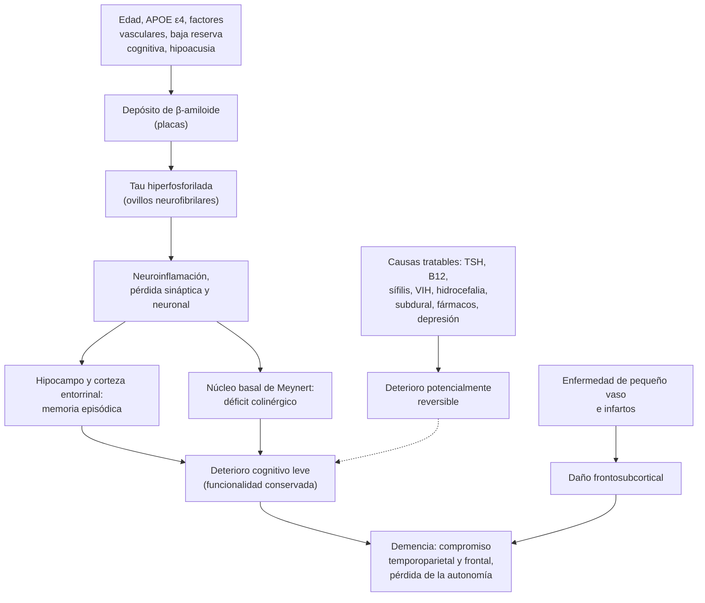
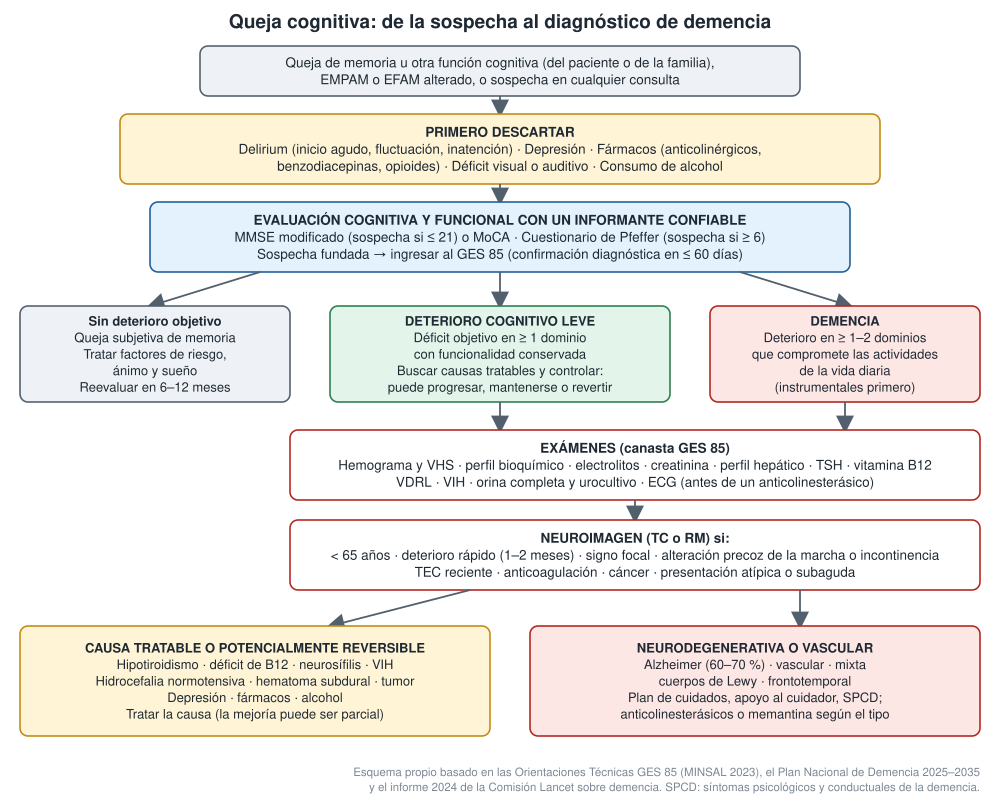

---
tags:
  - Neurología
  - Geriatría
  - GES
---

# Demencia, deterioro cognitivo leve y causas reversibles de deterioro cognitivo

**Subespecialidad**
Neurología · Geriatría · Psiquiatría

**Guías principales**
Comisión Lancet 2024: prevención, intervención y cuidado de la demencia · Criterios revisados de la enfermedad de Alzheimer (Alzheimer's Association 2024) · Guía de biomarcadores en sangre (Alzheimer's Association 2025) · Consenso de demencia por cuerpos de Lewy (2017) · Criterios de la variante conductual de la demencia frontotemporal (2011) · Orientaciones Técnicas GES 85 (MINSAL 2023) · Plan Nacional de Demencia 2025–2035

**Otras fuentes**
OMS, nota descriptiva de demencia (2026) · Ensayos CLARITY AD (lecanemab, 2023) y TRAILBLAZER-ALZ 2 (donanemab, 2023) · Manejo de los síntomas conductuales (Kales 2015)

**GES**
**GES 85: enfermedad de Alzheimer y otras demencias** (desde 2019), para personas de cualquier edad con sospecha realizada por un médico. Confirmación diagnóstica en **≤ 60 días** desde la sospecha y tratamiento en **≤ 60 días** desde la confirmación. Copago: FONASA 0 %, isapre 20 %.

**EUNACOM**
1.07.1.003 Demencia (sospecha, inicial, derivar) · 1.10.1.005 Demencia: Alzheimer, vascular, VIH, etc. (sospecha, inicial, derivar) · 1.10.1.003 Deterioro orgánico cerebral potencialmente reversible: hipotiroidismo, déficit de B12, etc. (sospecha, inicial, no requiere) · 1.10.1.004 Déficit de funciones cerebrales superiores: afasia, apraxia, agnosia (sospecha, inicial, derivar)

**Revisado**
Septiembre 2026

!!! abstract "Resumen en 60 segundos"
    - **Demencia** = deterioro cognitivo **adquirido** en uno o más dominios que **compromete la autonomía** en las actividades de la vida diaria. No se explica por delirium ni por una enfermedad psiquiátrica.
    - **Deterioro cognitivo leve (DCL)**: déficit objetivo con **funcionalidad conservada**. Puede progresar, mantenerse o revertir.
    - **Causas**:
        - **Alzheimer** (60–70 %), **vascular** y mixta, **cuerpos de Lewy** y **frontotemporal**.
        - Menos del **10 %** son **secundarias**; parte de ellas son **tratables**: hipotiroidismo, déficit de B12, neurosífilis, VIH, hidrocefalia normotensiva, hematoma subdural, depresión y fármacos.
    - **Chile**:
        - **7,0 %** de los mayores de 60 años, **~ 200.000 personas**.
        - Es la **primera causa de muerte en mujeres** (2025).
        - **GES 85** desde 2019. Sospecha fundada en APS: **MMSE modificado ≤ 21** y **Pfeffer ≥ 6**.
    - **Evaluación**:
        1. **Primero descartar el delirium, la depresión y los fármacos** (anticolinérgicos, benzodiacepinas).
        2. Evaluar la cognición y la funcionalidad **con un informante**.
        3. **Exámenes**: hemograma, perfil bioquímico, electrolitos, creatinina, perfil hepático, **TSH, B12, VDRL, VIH**, orina y ECG.
        4. **Neuroimagen** si tiene < 65 años, deterioro rápido, focalidad, marcha alterada precoz, TEC, anticoagulación o cáncer.
    - **Tratamiento**:
        - **No farmacológico** primero: educación, **apoyo al cuidador**, actividad física y social, seguridad, planificación anticipada.
        - **Anticolinesterásicos** (donepezilo, rivastigmina, galantamina) en el Alzheimer, en la demencia por cuerpos de Lewy y en la del Parkinson. **Memantina** en la etapa moderada a grave.
        - Beneficio **modesto**; los indica el especialista.
    - **Síntomas conductuales**: buscar el gatillo (dolor, constipación, retención urinaria, infección, fármacos) y usar medidas no farmacológicas. Antipsicóticos solo si hay peligro: **aumentan la mortalidad**.
    - **Prevención**: 14 factores modificables explican **~ 45 %** de los casos en el mundo (**62 % en Chile**). Los más importantes son la **hipoacusia** y el **LDL alto** (7 % cada uno).

## Definición

| Término | Definición |
|---|---|
| **Demencia (trastorno neurocognitivo mayor)** | Declinación cognitiva **adquirida** respecto del nivel previo, en uno o más dominios (memoria, lenguaje, función ejecutiva, atención, visuoespacial, cognición social), que **interfiere con la independencia** en las actividades cotidianas. No ocurre solo durante un delirium ni se explica mejor por otro trastorno mental |
| **Deterioro cognitivo leve (trastorno neurocognitivo menor)** | Declinación cognitiva **objetiva**, mayor que la esperada para la edad y la escolaridad, con **independencia funcional conservada** (puede requerir más esfuerzo o estrategias compensatorias) |
| **Queja cognitiva subjetiva** | Percepción de empeoramiento cognitivo con **pruebas normales** |
| **Enfermedad de Alzheimer (definición biológica, 2024)** | Enfermedad definida por sus **biomarcadores** (amiloide y tau). Existe desde la etapa **asintomática**; la demencia es su etapa tardía |
| **Demencia potencialmente reversible** | Deterioro cognitivo causado por una condición **tratable** (endocrina, carencial, infecciosa, estructural, tóxica o psiquiátrica), cuya corrección puede mejorarlo total o parcialmente |
| **Demencia rápidamente progresiva** | Evolución de semanas a pocos meses: obliga a buscar causas **priónicas**, **autoinmunes**, infecciosas, neoplásicas o tóxicas |
| **Síntomas psicológicos y conductuales de la demencia (SPCD)** | Apatía, depresión, ansiedad, agitación, agresividad, psicosis (delirios, alucinaciones), trastornos del sueño y de la conducta alimentaria. Afectan a casi todos los pacientes en algún momento |

## Epidemiología

### Mundial

- En 2021, **57 millones** de personas vivían con demencia; **más del 60 %** en países de ingresos bajos y medios. Hay casi **10 millones de casos nuevos** al año (OMS).
- Es la **séptima causa de muerte** en el mundo y una de las principales causas de **dependencia** en las personas mayores (OMS).
- El Alzheimer explica el **60–70 %** de los casos. Las **mujeres** tienen más carga de enfermedad y aportan el **70 %** de las horas de cuidado (OMS).
- En 2019 costó **US$ 1,3 billones**; la mitad corresponde al cuidado informal (OMS).
- **Comisión Lancet 2024**: 14 factores modificables a lo largo de la vida explican **~ 45 %** de los casos:
    - Infancia y adolescencia: **baja escolaridad**.
    - Edad media: **hipoacusia**, **LDL alto**, depresión, TEC, inactividad física, diabetes, tabaquismo, HTA, obesidad y alcohol excesivo.
    - Vejez: **aislamiento social**, contaminación del aire y **pérdida de visión**.

!!! chile "Datos nacionales"
    - **Prevalencia** (Plan Nacional de Demencia 2025–2035):
        - **1,06 %** de la población general y **7,0 %** de los mayores de 60 años.
        - Mayor en **mujeres** (7,7 % vs 5,9 %) y en zonas **rurales** (10,3 % vs 6,3 %).
        - Se estiman **~ 200.000 personas** con demencia.
    - **ENS 2016–2017**: el **10 %** de los mayores de 60 años tenía deterioro cognitivo según el MMSE.
    - **Mortalidad**: el Alzheimer y otras demencias fueron la **cuarta causa específica de muerte** en 2024 y la **primera causa de muerte en mujeres** en 2025 (DEIS).
    - **Envejecimiento**: el **14,0 %** de la población tiene 65 años o más (Censo 2024; 11,4 % en 2017).
    - **Factores modificables**: explicarían el **62 %** de los casos en Chile (45 % en el mundo). Pesan sobre todo la **obesidad**, la **HTA** y el **sedentarismo**.
    - **GES 85** (octubre de 2019):
        - Entre 2019 y 2024 se abrieron **122.065 casos** con sospecha o diagnóstico.
        - Se ha identificado a ~ **55 %** de la prevalencia estimada. Sigue en tratamiento el **27,5 %**.
    - **Red**:
        - **APS**: sospecha, diagnóstico y tratamiento de **mediana complejidad**.
        - **Especialidad**: Unidades de Memoria y **Centros de Apoyo Comunitario para Personas con Demencia** (el primero, "Kintún", en Peñalolén, 2013).
        - **GES 56**: audífonos para la hipoacusia bilateral desde los 65 años (factor de riesgo modificable).

## Etiología

| Tipo | Frecuencia | Claves |
|---|---|---|
| **Enfermedad de Alzheimer** | **60–70 %** (sola o mixta) | Inicio **insidioso** con **memoria episódica** reciente; luego lenguaje (anomia), visuoespacial y ejecutivo. **Anosognosia**. Factores: **edad**, **APOE ε4**, síndrome de Down, formas familiares precoces (APP, PSEN1, PSEN2) |
| **Demencia vascular** | 20–30 % (a menudo **mixta** con Alzheimer) | Relación temporal con **ACV** o enfermedad de **pequeño vaso**. Curso **escalonado** o progresivo; **disfunción ejecutiva** y enlentecimiento más que amnesia; signos focales, **marcha** alterada, incontinencia, labilidad afectiva |
| **Demencia por cuerpos de Lewy** | ~ 5 % | **Fluctuaciones** de la atención, **alucinaciones visuales** bien formadas, **trastorno conductual del sueño REM** y **parkinsonismo**. **Hipersensibilidad grave a los antipsicóticos**. La demencia aparece antes o dentro del primer año del parkinsonismo |
| **Demencia en la enfermedad de Parkinson** | Frecuente en el Parkinson avanzado | Parkinsonismo **más de 1 año antes** de la demencia |
| **Demencia frontotemporal** | 3 % desde los 65 años; **10 % antes de los 65** | Inicio **< 65 años**. **Variante conductual**: desinhibición, apatía, pérdida de empatía, conductas compulsivas, hiperoralidad, disfunción ejecutiva, **memoria relativamente conservada**. **Afasias primarias progresivas** |
| **Secundarias (potencialmente reversibles)** | < 10 % | Ver tabla siguiente |

### Causas potencialmente reversibles o tratables

| Grupo | Causas | Pistas |
|---|---|---|
| **Endocrinas** | **Hipotiroidismo**, hipertiroidismo (apatético en el anciano), hipo e hiperparatiroidismo (calcio), Cushing, hipoglicemias repetidas | TSH, calcio, glicemia |
| **Carenciales** | **Déficit de vitamina B12**, de folato y de **tiamina** (Wernicke-Korsakoff) | Metformina, IBP, gastrectomía, vegetarianos, alcohol; **anemia macrocítica** y **neuropatía o mielopatía** |
| **Infecciosas** | **Neurosífilis**, **VIH** (trastorno neurocognitivo asociado), meningitis crónicas (tuberculosa, criptococo), leucoencefalopatía multifocal progresiva | VDRL, VIH, punción lumbar |
| **Estructurales** | **Hidrocefalia normotensiva**, **hematoma subdural crónico**, **tumores** (frontales, metástasis) | Tríada de marcha, incontinencia y demencia; caídas o anticoagulación; cefalea y focalidad |
| **Tóxicas y fármacos** | **Anticolinérgicos** (oxibutinina, tricíclicos, antihistamínicos de primera generación), **benzodiacepinas**, opioides, antiepilépticos, **alcohol**, litio | Relación temporal; revisar **todos** los fármacos |
| **Psiquiátricas** | **Depresión** ("seudodemencia"), trastorno bipolar, esquizofrenia de inicio tardío | Síntomas afectivos, quejas cognitivas exageradas, respuestas "no sé" |
| **Inflamatorias y autoinmunes** | LES, vasculitis del SNC, **encefalitis autoinmune** (anti-LGI1, anti-NMDA) | Curso subagudo, crisis epilépticas, hiponatremia (LGI1) |
| **Otras** | **Apnea del sueño**, insuficiencia orgánica (renal, hepática), epilepsia no convulsiva | Somnolencia, ronquido; laboratorio |

## Fisiopatología

- **Alzheimer**:
    - Depósito extracelular de **β-amiloide** (placas) y agregación intracelular de **tau hiperfosforilada** (ovillos neurofibrilares).
    - Siguen la **neuroinflamación**, la pérdida sináptica y la muerte neuronal.
    - Comienza en la corteza **entorrinal** y el **hipocampo** (memoria) y se extiende a la corteza **temporoparietal** y frontal.
    - La pérdida de neuronas colinérgicas del **núcleo basal de Meynert** es la base de los **anticolinesterásicos**.
    - Los cambios biológicos preceden en **15–20 años** a los síntomas.
- **Vascular**: infartos estratégicos (tálamo, hipocampo), múltiples infartos corticales, o **enfermedad de pequeño vaso** (lesiones de sustancia blanca, lagunas, microhemorragias) que desconecta los circuitos **frontosubcorticales**.
- **Cuerpos de Lewy**: agregados de **α-sinucleína** en la corteza y el tronco. Hay déficit colinérgico marcado (buena respuesta a los anticolinesterásicos) y **dopaminérgico** (parkinsonismo, sensibilidad a los antipsicóticos).
- **Frontotemporal**: degeneración de los lóbulos frontales y temporales anteriores, con inclusiones de **tau**, **TDP-43** o **FUS**.
- **Reserva cognitiva**: la escolaridad, la actividad intelectual y social y la audición permiten tolerar más patología antes de tener síntomas. Por eso esos factores son modificables.

## Clasificación

### Por etapa (según la funcionalidad)

| Etapa | Funcionalidad |
|---|---|
| **Deterioro cognitivo leve** | Independiente, con dificultad leve en tareas complejas |
| **Demencia leve** | Pierde las actividades **instrumentales** (finanzas, medicamentos, transporte, compras); se mantiene en las **básicas** |
| **Demencia moderada** | Necesita ayuda en las actividades **básicas** (vestirse, bañarse); aparecen o aumentan los SPCD |
| **Demencia grave** | **Dependencia total**, lenguaje mínimo, incontinencia, disfagia, postración |

- La Alzheimer's Association (2024) define etapas **biológicas** (por biomarcadores) y **clínicas** del 0 (asintomático, con biomarcadores anormales) al 6 (demencia grave).

### Por localización y patrón clínico

- **Cortical** (Alzheimer, frontotemporal): afasia, apraxia, agnosia, amnesia.
- **Subcortical** (vascular de pequeño vaso, Parkinson, hidrocefalia, VIH): enlentecimiento, disfunción ejecutiva, apatía y alteración de la marcha, con lenguaje relativamente conservado.

### Funciones cerebrales superiores (afasia, apraxia, agnosia)

| Síndrome | Clínica | Localización habitual |
|---|---|---|
| **Afasia de Broca** (motora) | Lenguaje **no fluente**, esforzado, agramatical; **comprensión conservada**; repetición alterada; el paciente se da cuenta | Frontal inferior **izquierdo** |
| **Afasia de Wernicke** (sensitiva) | Lenguaje **fluente** con **parafasias** y neologismos; **comprensión alterada**; repetición alterada; **no se da cuenta** | Temporal superior posterior **izquierdo** |
| **Afasia de conducción** | Fluente, comprensión conservada, **repetición muy alterada** | Fascículo arqueado (parietal izquierdo) |
| **Afasia global** | No fluente, comprensión y repetición alteradas | Territorio de la ACM izquierda extenso |
| **Afasias transcorticales** | Como Broca o Wernicke, pero con la **repetición conservada** | Zonas limítrofes |
| **Anomia** | Dificultad para nombrar | Inespecífica; precoz en el **Alzheimer** |
| **Apraxia ideomotora** | No ejecuta un gesto a la orden (saludar, peinarse) teniendo fuerza y comprensión | Parietal **izquierdo** |
| **Apraxia construccional y del vestir** | No copia figuras, no se viste | Parietal **derecho** |
| **Agnosia visual** | Ve, pero no reconoce objetos | Occipitotemporal |
| **Prosopagnosia** | No reconoce caras conocidas | Fusiforme (derecha o bilateral) |
| **Heminegligencia y anosognosia** | Ignora el hemiespacio izquierdo; niega el déficit | Parietal **derecho** |
| **Síndrome de Gerstmann** | Agrafia, acalculia, agnosia digital, confusión derecha-izquierda | Giro angular **izquierdo** |
| **Síndrome disejecutivo** | Planificación, flexibilidad y juicio alterados, perseveración | Frontal dorsolateral |
| **Síndrome orbitofrontal y mesial** | Desinhibición, impulsividad; o **apatía** y abulia | Frontal orbitario / mesial |
| **Amnesia** | No forma recuerdos nuevos | **Hipocampo**, tálamo, cuerpos mamilares (Korsakoff) |

- Un déficit **agudo** de estas funciones es un **ACV hasta demostrar lo contrario** (activar el código ACV). Uno **progresivo** sugiere una enfermedad neurodegenerativa o un tumor.

## Clínica

- **Anamnesis con un informante confiable** (el paciente con Alzheimer suele minimizar los síntomas):
    - **Cómo empezó**: insidioso, escalonado, subagudo o agudo.
    - **Qué dominio** se afectó primero: memoria, lenguaje, conducta, orientación espacial, marcha.
    - **Cómo evoluciona**: lenta, rápida o fluctuante.
    - **Impacto funcional**: finanzas, medicamentos, cocina, transporte, teléfono.
    - **SPCD**, sueño (actuación de los sueños), caídas, incontinencia, alucinaciones.
    - **Fármacos**, alcohol, factores vasculares, TEC, antecedentes familiares, escolaridad, audición y visión.
- **Señales de alarma de demencia**:
    - Repite las mismas preguntas y olvida hechos recientes.
    - Se pierde en lugares conocidos y tiene problemas con el dinero o los medicamentos.
    - Deja de lado sus actividades.
    - Cambia de carácter.
- **Examen físico y neurológico**:
    - PA ortostática, soplos carotídeos, signos de hipotiroidismo o de alcoholismo.
    - **Focalidad**, parkinsonismo, **marcha** (magnética en la hidrocefalia, a pequeños pasos en la vascular).
    - Signos de liberación frontal, **mioclonías** (Creutzfeldt-Jakob, Alzheimer avanzado).
    - Movimientos oculares (parálisis supranuclear de la mirada vertical en la parálisis supranuclear progresiva).
    - **Vibración y posición** (déficit de B12, sífilis), audición y visión.

| Rasgo | **Delirium** | **Demencia** | **Depresión ("seudodemencia")** |
|---|---|---|---|
| **Inicio** | **Agudo** (horas a días) | **Insidioso** (meses a años) | Subagudo (semanas a meses) |
| **Curso** | **Fluctuante** | Progresivo | Variable, con el ánimo |
| **Atención** | **Muy alterada** | Normal al inicio | Menor esfuerzo, pero conservada |
| **Conciencia** | Alterada | Normal | Normal |
| **Quejas cognitivas** | Pocas | **Minimiza** (anosognosia) | **Exagera** ("no sé", "no puedo") |
| **Conducta** | Agitación o hipoactividad | Intenta responder, confabula | Apatía, tristeza, anhedonia |
| **Reversibilidad** | Habitualmente reversible | No (salvo las causas tratables) | Mejora con el tratamiento |

- El delirium y la depresión **pueden coexistir** con la demencia. La demencia es el principal factor de riesgo de delirium, y la depresión tardía puede ser su pródromo. Ver [delirium](../geriatria/delirium.md).

## Diagnóstico

!!! guia "Sospecha y confirmación en la APS (GES 85, MINSAL 2023)"
    - **Consulta 0 (sospecha)**: queja cognitiva, EMPAM o EFAM alterado, consulta de morbilidad, programas de APS o derivación del intersector.
    - **Sospecha fundada**: síntomas compatibles + **Mini-Mental modificado ≤ 21 puntos** + **Pfeffer ≥ 6 puntos** (cuestionario funcional respondido por el informante).
        - **Ingresar al SIGGES**: abre la garantía.
        - **Consulta 1** con el médico en **≤ 30 días**.
    - **Consulta 1**: anamnesis con el cuidador, examen físico y neurológico, instrumentos y **exámenes**.
    - **Consulta 2**: visita domiciliaria integral o consulta familiar (≤ 45 días tras la consulta 1).
    - **Consulta 3**: se informa el diagnóstico, o se deriva si persiste la duda o es un caso complejo.
    - Un puntaje "normal" **no debe impedir** el estudio si la sospecha clínica es fundada. Las pruebas tienen falsos positivos con **baja escolaridad** o **déficits sensoriales**.

- **Instrumentos**:
    - **MMSE** o **MoCA** (este último es más sensible para el DCL y la disfunción ejecutiva, pero depende más de la escolaridad).
    - **Test del reloj**.
    - Escalas funcionales: **Pfeffer**, Lawton (instrumentales), Barthel (básicas).
    - Ánimo: **Yesavage** (escala de depresión geriátrica).
- **Diagnóstico de demencia**: declinación cognitiva **documentada** + **compromiso funcional**, tras excluir el delirium y la depresión como causa.
- **Diagnóstico etiológico**: el patrón clínico orienta. En la especialidad se complementa con **RM**, neuropsicología y **biomarcadores**:
    - **LCR**: Aβ42/40, p-tau.
    - **PET** de amiloide, tau o FDG.
    - **Biomarcadores en sangre** (p-tau217): la Alzheimer's Association (2025) los acepta en **atención especializada** con pruebas validadas.
    - **SPECT con transportador de dopamina** (DaT-SCAN) si se sospecha una demencia por cuerpos de Lewy.

<figure markdown>
{ loading=lazy }
<figcaption>Figura 1. Enfoque de la queja cognitiva: descartar el delirium, la depresión y los fármacos; evaluar la cognición y la funcionalidad; pedir los exámenes del GES 85; indicar neuroimagen según los criterios; y distinguir las causas tratables de las neurodegenerativas. Esquema propio basado en las Orientaciones Técnicas GES 85 (MINSAL 2023), el Plan Nacional de Demencia 2025–2035 y la Comisión Lancet 2024.</figcaption>
</figure>

## Laboratorio

- **Canasta de la APS (GES 85)**:
    - Hemograma con VHS.
    - Perfil bioquímico (glicemia, **calcio**, albúmina, ácido úrico), **electrolitos** (sodio) y creatinina.
    - **Perfil hepático**.
    - **TSH**.
    - **Vitamina B12**.
    - **VDRL** y **VIH**.
    - Orina completa y urocultivo.
    - **ECG**: previo a los anticolinesterásicos (bradicardia, bloqueos).
- **Según la sospecha**: folato, T4 libre, perfil lipídico, HbA1c, amonio, niveles de fármacos (litio, antiepilépticos), anticuerpos (encefalitis autoinmune), ANA.
- **Punción lumbar**:
    - Si hay sospecha de neurosífilis (VDRL sérico positivo con clínica neurológica), de **infección crónica**, de encefalitis autoinmune o de **Creutzfeldt-Jakob** (RT-QuIC, 14-3-3).
    - Si la demencia es **rápidamente progresiva** o comienza **antes de los 65 años**.
    - Para los biomarcadores de Alzheimer (especialidad).
- **EEG**: fluctuación o sospecha de **crisis no convulsivas** o de Creutzfeldt-Jakob (complejos periódicos).
- **Polisomnografía**: sospecha de apnea del sueño o de trastorno conductual del sueño REM.

## Imágenes

- **No todos necesitan neuroimagen**. Indicarla (TC o RM) si:
    - Edad **< 65 años**.
    - Deterioro **rápido** (1–2 meses) sin explicación, o instalación **subaguda**.
    - **TEC** reciente importante, **anticoagulación** o coagulopatía.
    - Alteración precoz de la **marcha** o **incontinencia** (hidrocefalia normotensiva).
    - **Signo focal** (hemiparesia, Babinski).
    - Presentación **atípica** (afasia progresiva, cambio conductual).
    - Antecedente de **cáncer**.
    - Sospecha de **enfermedad cerebrovascular** que cambie el manejo.
- **TC**: descarta **hematoma subdural**, tumor, hidrocefalia e infartos grandes.
- **RM** (preferible en la especialidad):
    - **Atrofia hipocampal** y temporal medial (Alzheimer).
    - **Lesiones de sustancia blanca**, lagunas y microhemorragias (vascular).
    - Atrofia **frontotemporal**.
    - Restricción cortical y de los ganglios basales en difusión (**Creutzfeldt-Jakob**).
    - **Ventriculomegalia desproporcionada** (índice de Evans > 0,3) con surcos altos estrechos (hidrocefalia normotensiva).
- **Medicina nuclear** (especialidad): PET-FDG (patrones de hipometabolismo), PET de amiloide y de tau, y **SPECT con transportador de dopamina** (captación estriatal reducida en la demencia por cuerpos de Lewy).
- **Antes de los anticuerpos antiamiloide**: RM basal y controles por **ARIA** (edema y microhemorragias).

## Diagnóstico diferencial

| Condición | Claves para diferenciarla |
|---|---|
| **Envejecimiento normal** | Enlentecimiento, olvidos benignos de nombres que **luego se recuerdan**, **sin impacto funcional**, pruebas normales para la edad y la escolaridad |
| **Delirium** | Inicio **agudo**, **inatención**, **fluctuación**, causa médica. Ver [delirium](../geriatria/delirium.md) |
| **Depresión** | Síntomas afectivos, quejas exageradas, esfuerzo pobre; mejora con el tratamiento. Puede ser un pródromo de demencia |
| **Déficit sensorial** | **Hipoacusia** o baja visión que simulan un deterioro en las pruebas; corregirlos antes de evaluar |
| **Fármacos y alcohol** | Anticolinérgicos, benzodiacepinas, opioides; mejoría al suspender |
| **Afasia aguda** | **ACV** (código ACV), no una demencia |
| **Encefalopatía de Wernicke y síndrome de Korsakoff** | Alcohol, desnutrición, **posbariátrico**; confusión, oftalmoplejia, ataxia; amnesia con **confabulación**. Ver [Wernicke](abstinencia-alcoholica-y-wernicke.md) |
| **Enfermedad de Creutzfeldt-Jakob** | Demencia **rápidamente progresiva** (meses), **mioclonías**, ataxia, RM en difusión, EEG, RT-QuIC en LCR |
| **Encefalitis autoinmune** | Subaguda, **crisis epilépticas**, alteraciones psiquiátricas, hiponatremia (LGI1), LCR inflamatorio |
| **Hidrocefalia normotensiva** | **Marcha magnética** precoz, **incontinencia urinaria** y demencia subcortical; ventriculomegalia. Mejora con la punción evacuadora y la **válvula** |
| **Hematoma subdural crónico** | Anciano con caídas, alcohol o **anticoagulantes**; cefalea, fluctuación, focalidad leve; TC |

## Tratamiento

### Tratamiento de las causas reversibles

!!! dosis "Causas tratables"
    | Causa | Tratamiento |
    |---|---|
    | **Déficit de B12** | **Cianocobalamina 1.000 µg IM** diaria por 1 semana, luego semanal por 1 mes y después mensual (de por vida si la causa persiste). Alternativa: **1.000–2.000 µg/día VO** si no hay alteración neurológica grave. Ver [anemias](../hematologia/anemias.md) |
    | **Hipotiroidismo** | **Levotiroxina**; en el anciano o el cardiópata, iniciar con **12,5–25 µg/día** y subir lento. Ver [tiroides](../endocrinologia/hipotiroidismo-e-hipertiroidismo.md) |
    | **Neurosífilis** | **Penicilina G sódica 18–24 millones U/día EV** (3–4 millones U c/4 h) por **10–14 días** |
    | **VIH** | **Terapia antirretroviral**. Ver [VIH](../infectologia/infeccion-por-vih.md) |
    | **Hidrocefalia normotensiva** | Derivar a neurocirugía: punción evacuadora de prueba y **válvula ventriculoperitoneal**. Mejora más la **marcha** que la cognición |
    | **Hematoma subdural crónico** | Neurocirugía (drenaje); suspender o revertir la anticoagulación según el caso |
    | **Fármacos** | **Suspender** o cambiar los anticolinérgicos, las benzodiacepinas y los hipnóticos Z |
    | **Depresión** | **ISRS** (sertralina, escitalopram). Evitar los tricíclicos (anticolinérgicos) |
    | **Wernicke** | **Tiamina EV en dosis altas antes de la glucosa** |

### Tratamiento no farmacológico (la base)

- **Comunicar el diagnóstico** con cuidado, al paciente y a la familia.
- **Educación y apoyo al cuidador**: psicoeducación, manejo de las conductas, grupos de apoyo, prevención de la **sobrecarga** (escala de Zarit) y respiro.
- **Estimulación cognitiva**, **actividad física** regular y **participación social**.
- **Corregir la audición** (audífonos, **GES 56**) y la **visión**.
- **Tratar los factores de riesgo vascular**: PA, diabetes, LDL, tabaco.
- **Seguridad**:
    - Conducción de vehículos, armas, cocina y gas.
    - **Deambulación errante**: identificación.
    - Prevención de **caídas**.
    - Supervisión de los **medicamentos** y del **dinero** (riesgo de abuso).
- **Planificación anticipada**: voluntades anticipadas, decisiones legales y financieras mientras el paciente conserva la capacidad.
- **Coordinar** con el centro diurno o de apoyo comunitario y con las redes sociales.

### Fármacos para los síntomas cognitivos (especialista)

!!! dosis "Anticolinesterásicos y memantina"
    | Fármaco | Dosis | Indicación |
    |---|---|---|
    | **Donepezilo** | **5 mg/día** en la noche; subir a **10 mg/día** tras 4–6 semanas | Alzheimer leve a grave; cuerpos de Lewy; Parkinson |
    | **Rivastigmina** | **Parche 4,6 mg/24 h**, subir a **9,5 mg/24 h** tras 4 semanas (máximo 13,3 mg/24 h). Oral: 1,5 mg c/12 h, subir 1,5 mg c/12 h cada 2–4 semanas hasta 6 mg c/12 h | Alzheimer leve a moderado; **Parkinson** y cuerpos de Lewy |
    | **Galantamina** | Liberación prolongada **8 mg/día** × 4 semanas → **16 mg/día** (máximo 24 mg) | Alzheimer leve a moderado; alternativa en Lewy o Parkinson si no toleran los otros |
    | **Memantina** | **5 mg/día**, subir 5 mg cada semana hasta **20 mg/día** (10 mg/día si el clearance de creatinina es < 30) | Alzheimer **moderado a grave**, o intolerancia a los anticolinesterásicos; se puede combinar con donepezilo |

    - **Efectos adversos de los anticolinesterásicos**:
        - Náuseas, vómitos, diarrea, **baja de peso**.
        - **Bradicardia**, **síncope** y bloqueo AV (**ECG previo**).
        - Sueños vívidos, calambres, incontinencia urinaria.
    - **Contraindicaciones de los anticolinesterásicos**: **bradicardia** marcada, bloqueo AV o enfermedad del nódulo sinusal sin marcapasos. Precaución en el asma o la EPOC grave y en la úlcera péptica activa.
    - **Efectos adversos de la memantina**: mareo, cefalea, constipación, confusión.
    - **No se indican** en el **DCL** ni en la queja subjetiva. Tampoco en la demencia **frontotemporal** ni en la **vascular pura** (sin Alzheimer, Lewy ni Parkinson asociados).
    - **Beneficio modesto**: la respuesta se evalúa a los **3–6 meses**. Aproximadamente un tercio mejora, un tercio se estabiliza y un tercio no responde (OO. TT. GES 85). **Deprescribir** en la etapa terminal.

!!! guia "Anticuerpos antiamiloide (solo en centros especializados)"
    - **Lecanemab** (CLARITY AD):
        - **10 mg/kg EV cada 2 semanas**.
        - A los 18 meses la CDR-SB empeoró **0,45 puntos menos** que con placebo (1,21 vs 1,66).
        - **ARIA con edema** en **12,6 %**; reacciones a la infusión en 26,4 %.
    - **Donanemab** (TRAILBLAZER-ALZ 2):
        - EV **cada 4 semanas**; se suspende cuando se limpia el amiloide.
        - Enlenteció la progresión a las 76 semanas (CDR-SB −0,7).
        - **ARIA con edema** en **24 %**.
    - **Candidatos**: solo **DCL o demencia leve** por Alzheimer, con **amiloide confirmado** (PET o LCR).
    - Requieren **RM seriadas**. El riesgo de ARIA es mayor en los **homocigotos APOE ε4**, y se evitan si hay **anticoagulación**.
    - En Europa se aprobaron en 2025 solo para **no portadores o heterocigotos** de APOE ε4. **No están en el GES** y su costo y logística limitan su uso.

### Síntomas psicológicos y conductuales

- **Enfoque DICE** (Kales 2015):
    - **Describir** la conducta (qué, cuándo, con quién).
    - **Investigar** las causas: **dolor**, **constipación**, **retención urinaria**, infección, hambre, sueño, fármacos, déficit sensorial, ambiente, cuidador sobrepasado.
    - **Crear** un plan no farmacológico con el cuidador.
    - **Evaluar** el resultado.
- **Fármacos** solo si hay **riesgo** para el paciente o para otros, o un sufrimiento importante que no cede:
    - **Depresión o ansiedad**: **sertralina** o **citalopram** (este último con dosis bajas por el QT; en CitAD redujo la agitación).
    - **Psicosis o agitación grave**: **antipsicótico atípico** en dosis bajas (risperidona **0,25–0,5 mg/día**; máximo 1–2 mg), por el menor tiempo posible.
        - **Aumentan la mortalidad** y el ACV.
        - Reevaluar a las **4 semanas** e intentar retirarlo antes de **4 meses**.
    - **Cuerpos de Lewy y Parkinson**: **evitar el haloperidol** y los antipsicóticos típicos (reacciones graves). Si es imprescindible: **quetiapina** en dosis bajas, y optimizar el anticolinesterásico.
    - **Insomnio**: higiene del sueño, luz de día, actividad. Evitar las benzodiacepinas y los hipnóticos Z.
    - Ver [agitación psicomotora](../geriatria/agitacion-psicomotora-y-agresividad.md).

### Demencia avanzada y fin de vida

- Objetivos de **confort**: control del dolor, cuidados de la piel, nutrición oral asistida.
- En la demencia avanzada con disfagia se prefiere la **alimentación asistida cuidadosa por boca** a la **gastrostomía**: la sonda no prolonga la vida ni previene la aspiración.
- **Neumonía aspirativa**, **úlceras por presión**, infecciones urinarias y desnutrición son las complicaciones terminales habituales.
- **Deprescribir** (estatinas, anticolinesterásicos, antihipertensivos) y ofrecer **cuidados paliativos**.

## Complicaciones

- **Delirium** superpuesto (riesgo muy alto en la hospitalización y la cirugía).
- **Caídas** y **fractura de cadera**. Ver [caídas](../geriatria/caidas-hipotension-ortostatica-y-fractura-de-cadera.md).
- **Desnutrición**, deshidratación, **disfagia** y **neumonía aspirativa**.
- Incontinencia, **úlceras por presión**, infecciones urinarias.
- **SPCD**: agitación, agresividad, psicosis, deambulación errante.
- **Maltrato**, abuso financiero, abandono.
- **Sobrecarga del cuidador**: depresión y enfermedad del cuidador.
- **Iatrogenia**: anticolinérgicos, sedantes y antipsicóticos.
- **Crisis epilépticas** en el Alzheimer avanzado.

## Pronóstico y seguimiento

- La mayoría de las demencias neurodegenerativas son **progresivas**. La sobrevida desde el diagnóstico varía mucho: menor con mayor edad, en la demencia por cuerpos de Lewy y en las formas rápidamente progresivas.
- **DCL**: una parte progresa a demencia, otra se mantiene y otra **revierte** (sobre todo si había una causa tratable). Requiere **control periódico**.
- Las causas **reversibles** mejoran con el tratamiento, a veces solo **parcialmente**. Cuanto antes se traten, mejor.
- **Seguimiento en APS (GES 85)**:
    - **Controles periódicos**: cognición, funcionalidad, SPCD, nutrición, peso, caídas, **fármacos** (efectos adversos, deprescripción) y **sobrecarga del cuidador**.
    - Derivar a la especialidad (**alta complejidad**):
        - Menores de 65 años o presentación atípica.
        - Deterioro rápido o duda diagnóstica.
        - SPCD refractarios.
        - Indicación de antidemenciantes.

## Perlas para el internado

!!! perla "Para la sala y el turno"
    - Un adulto mayor que "amaneció confundido" tiene un **delirium** hasta demostrar lo contrario, **no** una demencia. Busca la causa médica.
    - **Nunca diagnostiques demencia** durante un delirium, una depresión grave o una hospitalización aguda: reevalúa cuando se estabilice.
    - Pide siempre **TSH, B12 y VDRL** (y VIH). Son baratos y detectan causas tratables.
    - **Marcha magnética + incontinencia + deterioro cognitivo** = hidrocefalia normotensiva. **Caídas + anticoagulante + deterioro fluctuante** = hematoma subdural. Pide una **TC**.
    - **Alucinaciones visuales + fluctuaciones + parkinsonismo** = cuerpos de Lewy. **No le des haloperidol**.
    - Revisa la lista de fármacos: **oxibutinina, clorfenamina, amitriptilina, benzodiacepinas**. Retirarlos puede "curar" una demencia.
    - Antes de un anticolinesterásico, pide un **ECG**. Si el paciente consulta por **síncope** o bradicardia, sospecha el donepezilo.
    - Pregunta siempre por el **cuidador**: su agotamiento predice la institucionalización y el maltrato.

## Preguntas de repaso

??? repaso "1. Mujer de 76 años, traída por su hija porque en el último año repite las mismas preguntas, olvida pagar las cuentas y se perdió volviendo del supermercado. Se viste y come sola. Niega problemas. MMSE modificado 18, Pfeffer 9. ¿Qué haces?"
    **Sospecha fundada de demencia** (probable Alzheimer leve): inicio insidioso con **memoria episódica**, compromiso de las actividades **instrumentales** y **anosognosia**. Cumple MMSE modificado ≤ 21 y Pfeffer ≥ 6.

    - **Ingresar al GES 85** (SIGGES) y citar a la consulta médica en ≤ 30 días.
    - Descartar el **delirium**, la **depresión** (Yesavage) y los **fármacos**; revisar la audición y la visión.
    - **Exámenes**: hemograma, VHS, perfil bioquímico, electrolitos, creatinina, perfil hepático, **TSH, B12, VDRL, VIH**, orina y **ECG**.
    - Neuroimagen si hay criterios (no los tiene de entrada).
    - Visita domiciliaria. Educación y apoyo a la hija. Seguridad: dinero, cocina, salidas solas.
    - Si se confirma: plan de cuidados en APS. Anticolinesterásico según el protocolo local.

??? repaso "2. Hombre de 72 años con DM2 en tratamiento con metformina hace 12 años, con olvidos, apatía y hormigueo en los pies desde hace meses. Tiene marcha inestable, Romberg positivo y vibración abolida en los tobillos. Hb 11 g/dL, VCM 108 fL. ¿Qué sospechas?"
    **Déficit de vitamina B12** (asociado a la metformina): **deterioro cognitivo potencialmente reversible** con **anemia macrocítica** y compromiso de los **cordones posteriores** (degeneración combinada subaguda).

    - Medir **B12** (y ácido metilmalónico u homocisteína si el valor es limítrofe), folato, reticulocitos y frotis.
    - **Tratar**: **cianocobalamina 1.000 µg IM** diaria por 1 semana, semanal por 1 mes y luego mensual. Las alteraciones neurológicas pueden quedar como **secuelas** si se tarda.
    - Mantener la metformina con **control anual de B12**.
    - Reevaluar la cognición tras 3–6 meses de tratamiento.

??? repaso "3. Hombre de 78 años con 6 meses de marcha lenta, a pasos cortos, \"como pegado al suelo\", urgencia e incontinencia urinaria y olvidos. La TC muestra ventrículos muy dilatados, sin atrofia cortical proporcional. ¿Diagnóstico y conducta?"
    **Hidrocefalia normotensiva**: la tríada de **marcha magnética**, **incontinencia urinaria** y **deterioro cognitivo** subcortical, con **ventriculomegalia desproporcionada** (índice de Evans > 0,3).

    - Derivar a **neurología o neurocirugía**. **Punción lumbar evacuadora** de prueba (30–50 mL) con evaluación de la marcha antes y después.
    - Si mejora: **válvula ventriculoperitoneal**. La marcha es lo que más mejora; la cognición, menos.
    - Diferencial: parkinsonismo vascular, Parkinson, estenosis del canal lumbar.

??? repaso "4. Mujer de 74 años con deterioro cognitivo de 1 año con fluctuaciones marcadas: hay días en que está \"ida\" y otros casi normal. Ve niños y animales en la casa y tiene rigidez y bradicinesia leves. Su marido dice que \"pelea dormida\". En el SU la agitan las alucinaciones y le indican haloperidol. ¿Qué opinas?"
    **Probable demencia por cuerpos de Lewy**: fluctuaciones, **alucinaciones visuales** bien formadas, **trastorno conductual del sueño REM** y **parkinsonismo**.

    - **Evitar el haloperidol** y los antipsicóticos típicos: pueden causar **reacciones graves** (rigidez intensa, síndrome neuroléptico maligno, compromiso de conciencia).
    - Primero buscar un **delirium** superpuesto (infección, fármacos, retención urinaria) y usar medidas no farmacológicas.
    - Si es imprescindible: **quetiapina** en dosis baja.
    - **Rivastigmina o donepezilo**: suelen mejorar las alucinaciones y la cognición.
    - Derivar a neurología (GES 85, alta complejidad).

??? repaso "5. Hombre de 58 años, contador, que desde hace 2 años hace comentarios inapropiados, gasta dinero sin control, come compulsivamente dulces y perdió el interés por su familia. Se orienta bien y recuerda los hechos recientes. ¿Qué sospechas?"
    **Demencia frontotemporal, variante conductual**: inicio **antes de los 65 años**, **desinhibición**, **apatía**, pérdida de **empatía**, conductas compulsivas e **hiperoralidad** (dulces), con **memoria relativamente conservada**.

    - Estudio completo (exámenes GES, **RM**: atrofia frontal o temporal anterior) y derivación a neurología: es **menor de 65** y atípica.
    - Diferencial: trastorno bipolar o depresión, tumor frontal, sífilis, VIH.
    - **Los anticolinesterásicos no están indicados** (pueden empeorar la conducta). Manejo conductual, ISRS para la conducta compulsiva, apoyo familiar y protección financiera y legal.

??? repaso "6. Mujer de 81 años con demencia moderada, que se hospitaliza por neumonía. Al segundo día está agitada en la noche, se saca la vía venosa y grita. Toma donepezilo, oxibutinina por incontinencia y lorazepam para dormir. ¿Cómo la manejas?"
    **Delirium superpuesto a la demencia**, desencadenado por la **neumonía**, el ambiente hospitalario y **fármacos deliriógenos**.

    - **Buscar y tratar las causas**: hipoxemia, dolor, **retención urinaria**, constipación, deshidratación, hiponatremia, glicemia.
    - **Suspender la oxibutinina** (anticolinérgica). **Retirar el lorazepam** de forma gradual (sin suspenderlo bruscamente si lo usaba crónicamente).
    - **Medidas no farmacológicas**: familiar presente, reorientación, lentes y audífonos, luz de día, sueño nocturno, movilización precoz, retirar las vías innecesarias.
    - Si hay **peligro**: antipsicótico en dosis baja por el menor tiempo posible.
    - Mantener el donepezilo si no hay bradicardia.
    - Al alta: reevaluar la cognición cuando se recupere, educar a la familia y revisar la necesidad de los fármacos.

## Referencias

1. Livingston G, Huntley J, Liu KY, et al. Dementia prevention, intervention, and care: 2024 report of the Lancet standing Commission. *Lancet.* 2024;404(10452):572–628. doi:[10.1016/S0140-6736(24)01296-0](https://doi.org/10.1016/S0140-6736(24)01296-0)
2. Jack CR Jr, Andrews JS, Beach TG, et al. Revised criteria for diagnosis and staging of Alzheimer's disease: Alzheimer's Association Workgroup. *Alzheimers Dement.* 2024;20(8):5143–5169. doi:[10.1002/alz.13859](https://doi.org/10.1002/alz.13859)
3. Palmqvist S, Whitson HE, Allen LA, et al. Alzheimer's Association clinical practice guideline on the use of blood-based biomarkers in the diagnostic workup of suspected Alzheimer's disease within specialized care settings. *Alzheimers Dement.* 2025;21(7):e70535. doi:[10.1002/alz.70535](https://doi.org/10.1002/alz.70535)
4. McKeith IG, Boeve BF, Dickson DW, et al. Diagnosis and management of dementia with Lewy bodies: fourth consensus report of the DLB Consortium. *Neurology.* 2017;89(1):88–100. doi:[10.1212/WNL.0000000000004058](https://doi.org/10.1212/WNL.0000000000004058)
5. Rascovsky K, Hodges JR, Knopman D, et al. Sensitivity of revised diagnostic criteria for the behavioural variant of frontotemporal dementia. *Brain.* 2011;134(Pt 9):2456–2477. doi:[10.1093/brain/awr179](https://doi.org/10.1093/brain/awr179)
6. Ministerio de Salud de Chile. Orientaciones técnicas para la implementación de GES N.º 85 de Alzheimer y otras demencias. 2023. [diprece.minsal.cl](https://diprece.minsal.cl/wp-content/uploads/2023/10/2023.07.21-OOTT-GES-Alzheimer-y-otras-Demencias-RV2.pdf)
7. Ministerio de Salud de Chile. Plan Nacional de Demencia 2025–2035. 2026. [diprece.minsal.cl](https://diprece.minsal.cl/wp-content/uploads/2026/03/2026.03.04_PLAN-NACIONAL-DE-DEMENCIA-2025-2035.pdf)
8. Superintendencia de Salud. Problema de salud 85: enfermedad de Alzheimer y otras demencias (ficha GES). 2024. [superdesalud.gob.cl](https://www.superdesalud.gob.cl/app/uploads/2024/03/articles-18929_archivo_fuente.pdf)
9. Organización Mundial de la Salud. Dementia (nota descriptiva, actualizada en julio de 2026). [who.int](https://www.who.int/news-room/fact-sheets/detail/dementia)
10. van Dyck CH, Swanson CJ, Aisen P, et al. Lecanemab in early Alzheimer's disease. *N Engl J Med.* 2023;388(1):9–21. doi:[10.1056/NEJMoa2212948](https://doi.org/10.1056/NEJMoa2212948)
11. Sims JR, Zimmer JA, Evans CD, et al. Donanemab in early symptomatic Alzheimer disease: the TRAILBLAZER-ALZ 2 randomized clinical trial. *JAMA.* 2023;330(6):512–527. doi:[10.1001/jama.2023.13239](https://doi.org/10.1001/jama.2023.13239)
12. Kales HC, Gitlin LN, Lyketsos CG. Assessment and management of behavioral and psychological symptoms of dementia. *BMJ.* 2015;350:h369. doi:[10.1136/bmj.h369](https://doi.org/10.1136/bmj.h369)
13. Nakajima M, Yamada S, Miyajima M, et al. Guidelines for management of idiopathic normal pressure hydrocephalus (third edition). *Neurol Med Chir (Tokyo).* 2021;61(2):63–97. doi:[10.2176/nmc.st.2020-0292](https://doi.org/10.2176/nmc.st.2020-0292)
14. Porsteinsson AP, Drye LT, Pollock BG, et al. Effect of citalopram on agitation in Alzheimer disease: the CitAD randomized clinical trial. *JAMA.* 2014;311:682–691. doi:[10.1001/jama.2014.93](https://doi.org/10.1001/jama.2014.93)
15. European Medicines Agency. Kisunla (donanemab): questions and answers on the outcome of the re-examination. 2025. [ema.europa.eu](https://www.ema.europa.eu/en/documents/medicine-qa/questions-answers-approval-marketing-authorisation-kisunla-donanemab-outcome-re-examination_en.pdf)
