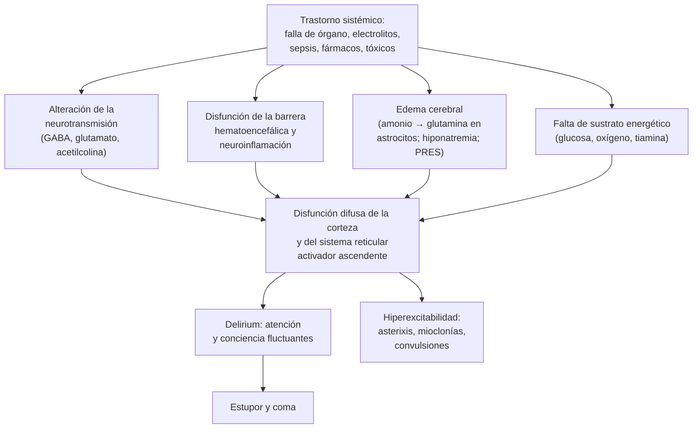

---
tags:
  - Neurología
  - Urgencia
  - Frecuente en sala
---

# Encefalopatías tóxico-metabólicas: urémica, hepática, hipercápnica, séptica, hipertensiva y por fármacos

**Subespecialidad**
Neurología · Medicina interna · Medicina intensiva · Toxicología

**Guías y consensos principales**
Nomenclatura de delirium y encefalopatía aguda de diez sociedades (Slooter 2020) · EASL 2022: encefalopatía hepática · EXTRIP 2015: tratamiento extracorpóreo en la intoxicación por litio · Revisión de la encefalopatía asociada a sepsis (Sonneville 2023) · Revisión del síndrome de encefalopatía posterior reversible (Fugate 2015)

**Otras fuentes**
Revisiones sistemáticas de neurotoxicidad por cefepime (Appa 2017), metronidazol (Sørensen 2020), aciclovir (Brandariz-Núñez 2021) e hiperamonemia por valproato (Wong 2023) · Registros del Centro de Información Toxicológica UC (CITUC)

**GES**
No

**EUNACOM**
1.10.2.006 Encefalopatías tóxico-metabólicas: urémica, hepática, etc. (específico, inicial, derivar)

**Revisado**
Septiembre 2026

!!! abstract "Resumen en 60 segundos"
    - **Encefalopatía aguda** = disfunción cerebral **difusa** de instalación rápida (< 4 semanas) que se expresa como **delirium o coma**. Las causas **tóxico-metabólicas** son las **más frecuentes** en la sala y en la UCI, y son **reversibles** si se tratan a tiempo.
    - Claves de una causa metabólica: curso **fluctuante**, **pupilas simétricas y reactivas**, examen motor **simétrico**, **asterixis** y **mioclonías multifocales**.
    - La **focalidad**, la **anisocoria** o la pérdida de reflejos de tronco sugieren una **lesión estructural**: **TC urgente**.
    - **Los primeros 5 minutos**: ABC, **glicemia capilar**, **tiamina antes de la glucosa** si hay riesgo, **naloxona** si hay miosis y bradipnea, gases arteriales.
    - **Revisa la hoja de indicaciones**: **cefepime**, metronidazol, aciclovir, opioides (morfina en la ERC), benzodiacepinas, anticolinérgicos, litio y valproato, sobre todo con **falla renal**.
    - Causas clave:
        - **Urémica**: asterixis, mioclonías y convulsiones en la ERC avanzada o la LRA; es indicación de **diálisis urgente**.
        - **Hepática**: buscar el **desencadenante**; **lactulosa** y **rifaximina**.
        - **Hipercápnica**: pH < 7,35 y PaCO₂ > 45 → **VMNI**; cuidado con el oxígeno excesivo en la EPOC.
        - **Séptica**: la más frecuente en la UCI; es un diagnóstico de **exclusión**.
        - **Encefalopatía posterior reversible (PRES)**: HTA, preeclampsia o inmunosupresores; cefalea, convulsiones y **alteración visual**.
    - **EEG** si la encefalopatía no se explica o fluctúa: descarta un **estado epiléptico no convulsivo**.

## Definición

| Término | Definición |
|---|---|
| **Encefalopatía aguda** | Proceso cerebral de **desarrollo rápido (< 4 semanas)** que se expresa clínicamente como **delirium subsindromático, delirium o coma**, y que puede tener otros signos (convulsiones, alteraciones motoras) (Slooter 2020) |
| **Encefalopatía tóxico-metabólica** | Encefalopatía aguda causada por un trastorno **sistémico** (falla de un órgano, alteración hidroelectrolítica o de la glicemia, endocrinopatía, déficit vitamínico, sepsis, fármaco o tóxico), **sin una lesión estructural primaria** del encéfalo |
| **Delirium** | Alteración aguda y fluctuante de la **atención** y la **conciencia** con compromiso cognitivo (DSM-5). Es la forma clínica más frecuente de la encefalopatía aguda (ver [delirium](../geriatria/delirium.md)) |
| **Coma** | Estado de **no respuesta** con ojos cerrados, del que el paciente no puede ser despertado |

!!! guia "Nomenclatura de diez sociedades (Slooter 2020)"
    - "Delirium" y "encefalopatía aguda" se usaban en literaturas **separadas** (geriatría, psiquiatría y UCI vs neurología y medicina interna) para el **mismo fenómeno**.
    - Recomendación: usar **encefalopatía aguda** para el **proceso** cerebral subyacente y **delirium o coma** para su **expresión clínica**.
    - Evitar términos como "estado confusional agudo", "compromiso de conciencia cualitativo" o "falla cerebral aguda" sin describir lo que se encuentra.
    - Nombrar la **causa** cuando se conoce: por ejemplo, "delirium por encefalopatía séptica" o "coma por encefalopatía hepática".

## Epidemiología

### Mundial

- Las causas tóxico-metabólicas y sistémicas son la **causa más frecuente** de compromiso de conciencia **no traumático** en los servicios de urgencia y en la sala de medicina.
- **Encefalopatía asociada a sepsis** (Sonneville 2023):
    - Afecta al **53 %** de los pacientes sépticos en una cohorte multicéntrica francesa de UCI y hasta al **68 %** en bases de datos estadounidenses.
    - La forma más frecuente es el **coma o el delirium hipoactivo**; la **agitación** se ve en **~ 10 %**.
- **Neurotoxicidad por cefepime** (Appa 2017; 198 casos):
    - **87 %** tenía **disfunción renal** y la mitad recibía **dosis sobre la recomendada** para su función renal.
    - Inicio a los **5 días** en promedio. **Compromiso de conciencia** en **80 %**, desorientación o agitación en 47 % y **mioclonías** en **40 %**.
    - El EEG mostró un **estado epiléptico no convulsivo** en el **31 %**; hubo convulsiones clínicas en el 11 %.
- **Encefalopatía por metronidazol** (Sørensen 2020; 136 pacientes):
    - **Disartria**, **inestabilidad de la marcha**, incoordinación y alteración mental; a menudo con **polineuropatía**.
    - La **enfermedad hepática** fue la comorbilidad más frecuente. La RM mostró lesiones en los **núcleos dentados** del cerebelo en el **90 %**.
- **Neurotoxicidad por aciclovir y valaciclovir** (Brandariz-Núñez 2021; 119 casos):
    - **83 %** tenía **deterioro renal** y el **60 %** recibió **más dosis** de la recomendada para su función renal.
    - Inicio a los **3 días** en promedio: **confusión**, **alucinaciones**, agitación y **disartria**. El **74 %** se recuperó en ≤ 7 días.
- **Hiperamonemia por valproato** (Wong 2023): asintomática en **5–73 %** de los usuarios y sintomática en **0,7–22 %**, **aun con niveles terapéuticos** de valproato.

### Chile

!!! chile "Datos nacionales"
    - **CITUC** (Centro de Información Toxicológica de la Pontificia Universidad Católica), primeros 10 años (1992–2002; Mena 2004):
        - **96.468 llamadas** analizadas; **16,9 %** por exposiciones **intencionales**.
        - Los **medicamentos** fueron la causa más frecuente (**49,2 %**), y los que actúan sobre el **SNC** fueron los más reportados.
    - **Paracetamol con fines suicidas** (CITUC, 2019–2023; Iturra 2025):
        - **11.039** exposiciones a paracetamol; el **68,8 %** relacionadas con **ideación suicida**, con un aumento de **11 %** desde 2020.
        - El **80,3 %** eran **mujeres**, y el **56,6 %** alcanzó dosis **potencialmente hepatotóxicas**.
    - Terreno de riesgo en la sala chilena:
        - **25.841 pacientes** en **hemodiálisis crónica** (2024; ver [ERC](../nefrologia/enfermedad-renal-cronica.md)), expuestos a la acumulación de fármacos.
        - La **cirrosis** causa más de **3.200 muertes al año** (ver [cirrosis](../gastroenterologia/cirrosis-y-complicaciones.md)).
        - El **delirium** está presente en el **53 %** de los adultos mayores al ingresar a una sala de medicina (ver [delirium](../geriatria/delirium.md)).
    - El **CITUC** atiende consultas toxicológicas las **24 horas** (**+56 2 2635 3800**).

## Etiología

| Grupo | Causas |
|---|---|
| **Falla de órgano** | **Hepática** (cirrosis, insuficiencia hepática aguda), **urémica** (ERC terminal, LRA), **respiratoria** (**hipercapnia**, hipoxemia), **cardíaca** (bajo gasto, poscirugía cardíaca) |
| **Glicemia** | **Hipoglicemia**, cetoacidosis, estado hiperglicémico hiperosmolar (ver [hipoglicemia](../endocrinologia/hipoglicemia.md) y [CAD/EHH](../endocrinologia/cetoacidosis-y-estado-hiperosmolar.md)) |
| **Electrolitos y osmolalidad** | **Hiponatremia** e hipernatremia, **hipercalcemia**, hipomagnesemia, hipofosfatemia grave (ver [sodio](../nefrologia/trastornos-del-sodio.md) y [calcio](../endocrinologia/trastornos-del-calcio-fosforo-y-magnesio.md)) |
| **Endocrinas** | **Coma mixedematoso**, tormenta tiroidea (ver [tiroides](../endocrinologia/hipotiroidismo-e-hipertiroidismo.md)), **crisis suprarrenal** (ver [insuficiencia suprarrenal](../endocrinologia/insuficiencia-suprarrenal.md)) |
| **Carenciales** | **Tiamina** (Wernicke), vitamina B12, niacina (pelagra) |
| **Sepsis** | **Encefalopatía asociada a sepsis** (sin infección del SNC) |
| **Vascular difusa** | **Encefalopatía hipertensiva** y **PRES**, vasculitis del SNC, microangiopatías trombóticas |
| **Fármacos** | **Cefepime** (y otros betalactámicos y carbapenémicos), **metronidazol**, **aciclovir**, quinolonas, **opioides**, **benzodiacepinas**, **anticolinérgicos**, **litio**, **valproato** (hiperamonemia), antiepilépticos, baclofeno, **inhibidores de la calcineurina** (tacrolimus, ciclosporina), ifosfamida, metotrexato |
| **Tóxicos** | **Alcohol** e intoxicación o abstinencia, **monóxido de carbono**, metanol y etilenglicol, salicilatos, tricíclicos, drogas (ver [abstinencia y sustancias](abstinencia-alcoholica-y-wernicke.md)) |
| **Físicas** | **Hipotermia**, **golpe de calor** |

**Factores de riesgo**: edad avanzada, **demencia**, **falla renal o hepática**, polifarmacia, **dosis no ajustadas** a la función renal, desnutrición, alcoholismo y hospitalización en la UCI.

## Fisiopatología

*Figura 1. Mecanismos comunes de las encefalopatías tóxico-metabólicas. Esquema propio.*

- La **conciencia** depende de la **corteza de ambos hemisferios** y del **sistema reticular activador** del tronco. Un trastorno **sistémico** las afecta **de forma difusa y simétrica**. Por eso predomina la alteración de la **atención** y hay **pocos signos focales**.
- **Encefalopatía hepática**:
    - El **amonio** que el hígado no depura entra al cerebro y los **astrocitos** lo convierten en **glutamina**, que los hincha (edema).
    - Contribuyen la **inflamación**, las **infecciones** y la mayor sensibilidad **GABAérgica** (sedantes).
- **Urémica**: acumulación de **toxinas urémicas**, alteración de neurotransmisores, del calcio y de la PTH.
- **Hipercápnica**: el CO₂ difunde al cerebro, **acidifica el LCR** y produce **vasodilatación** con aumento de la presión intracraneana (cefalea, papiledema).
- **Séptica**: **neuroinflamación**, disfunción de la barrera hematoencefálica y de la **microcirculación**, y alteración de neurotransmisores. Se suman la **hipotensión**, la **hipoxemia**, los **trastornos metabólicos** y los **fármacos** sedantes.
- **PRES**: la **HTA** supera la **autorregulación** cerebral, o el **endotelio** se daña (inmunosupresores, quimioterapia, preeclampsia, sepsis). El resultado es **edema vasogénico**, sobre todo **parieto-occipital** (la circulación posterior tiene menos inervación simpática).
- **Fármacos**:
    - **Cefepime** y carbapenémicos: **antagonismo del receptor GABA-A**, con mioclonías y convulsiones.
    - **Anticolinérgicos**: bloqueo **muscarínico** central.
    - **Morfina** en la ERC: acumulación de sus **metabolitos** (morfina-6- y 3-glucurónido).
    - **Valproato**: **hiperamonemia** por inhibición del ciclo de la urea, con déficit de **carnitina**.

## Clasificación

**Por la gravedad** (expresión clínica):

| Nivel | Características | Escala útil |
|---|---|---|
| **Delirium hipoactivo** | Somnolencia, apatía, bradipsiquia. **El más frecuente y el más subdiagnosticado** | CAM, CAM-ICU (ver [delirium](../geriatria/delirium.md)) |
| **Delirium hiperactivo o mixto** | Agitación, alucinaciones, inversión del ciclo sueño-vigilia | CAM, RASS |
| **Estupor** | Responde solo a estímulos intensos | Glasgow |
| **Coma** | Sin respuesta, ojos cerrados | **Glasgow ≤ 8**: proteger la vía aérea. Escala **FOUR** (incluye reflejos de tronco y respiración) |

- La **encefalopatía hepática** tiene su propia escala (**West Haven**, grados 1–4; ver [cirrosis](../gastroenterologia/cirrosis-y-complicaciones.md)).

**Por la causa**: ver Etiología. Una mnemotecnia útil para el coma es **AEIOU TIPS**:

- **A**lcohol.
- **E**pilepsia, **e**lectrolitos, **e**ncefalopatía (hepática, urémica, hipertensiva).
- **I**nsulina (hipo e hiperglicemia).
- **O**pioides, **o**xígeno (hipoxia, hipercapnia, CO).
- **U**remia.
- **T**rauma, **t**emperatura.
- **I**nfección (sepsis, meningitis, encefalitis).
- **P**sicosis y **p**oison (tóxicos, fármacos).
- **S**hock, **s**troke (ACV), hemorragia **s**ubaracnoidea.

## Clínica

### Rasgos comunes

- **Alteración de la atención** (primer signo): no sigue la conversación, se distrae, no puede decir los meses al revés.
- **Fluctuación** a lo largo del día, **inversión del ciclo sueño-vigilia**, desorientación, alucinaciones visuales.
- **Examen neurológico simétrico** y **pupilas reactivas** (Figura 2).
- **Movimientos anormales**:
    - **Asterixis** ("flapping"): pérdida breve del tono postural, que se ve con las manos en dorsiflexión. Aparece en la encefalopatía **hepática**, **urémica** e **hipercápnica**, y con fármacos (antiepilépticos, litio).
    - **Mioclonías multifocales**: **uremia**, **cefepime**, opioides en la ERC, **litio**, síndrome serotoninérgico y anoxia.
    - **Temblor** grueso: litio, abstinencia alcohólica, tirotoxicosis.
- **Convulsiones**: **hiponatremia**, **hipoglicemia**, **hipocalcemia**, uremia, **PRES**, abstinencia, **cefepime** y carbapenémicos, litio, tramadol, tricíclicos.

<figure markdown>
![Tabla comparativa en dos columnas. A la izquierda, en verde, lo que sugiere una causa tóxico-metabólica: inicio en horas a días y curso fluctuante; pupilas simétricas y reactivas aun en coma; examen motor simétrico con asterixis, mioclonías multifocales o temblor; reflejos de tronco conservados; respiración de Kussmaul o bradipnea; exámenes clave como glicemia capilar, sodio, calcio, creatinina, gases, amonio, niveles de fármacos y EEG. A la derecha, en rojo, lo que sugiere una lesión estructural y obliga a una TC urgente: inicio súbito o progresivo con cefalea, trauma o fiebre; anisocoria o pupila dilatada y fija; hemiparesia, Babinski unilateral o desviación conjugada de la mirada; pérdida de reflejos de tronco; respiración irregular o atáxica. Abajo, un recuadro de trampas: la hipoglicemia y la hiponatremia pueden dar hemiparesia, y una causa metabólica no descarta una estructural](../assets/figuras/encefalopatia/metabolica-vs-estructural.svg){ loading=lazy }
<figcaption>Figura 2. ¿Encefalopatía tóxico-metabólica o lesión estructural? Claves del examen en el compromiso de conciencia. Esquema propio basado en el examen neurológico del coma (Posner et al., 2019) y en Angel y Young (2011).</figcaption>
</figure>

### Pistas de causas específicas

| Encefalopatía | Contexto | Pistas clínicas |
|---|---|---|
| **Hepática** | Cirrosis con un **desencadenante** (infección, **HDA**, constipación, diuréticos, hipokalemia, sedantes), insuficiencia hepática aguda | **Asterixis**, bradipsiquia, inversión del sueño, **fetor hepático**, estigmas de daño hepático |
| **Urémica** | ERC etapa 5 o LRA grave, diálisis insuficiente | Asterixis, **mioclonías**, **convulsiones**, **hipo**, náuseas, prurito, **frote pericárdico** |
| **Síndrome de desequilibrio dialítico** | **Primeras sesiones** de hemodiálisis con nitrógeno ureico muy alto | Cefalea, náuseas, confusión y convulsiones **durante o tras la diálisis** (edema cerebral por el descenso brusco de la urea) |
| **Hipercápnica** | **EPOC**, obesidad-hipoventilación, neuromuscular, **opioides o benzodiacepinas**, **oxígeno sin control** | **Somnolencia**, **cefalea matinal**, asterixis, piel caliente, **papiledema**, bradipnea o respiración superficial |
| **Séptica** | Sepsis sin infección del SNC | **Delirium hipoactivo** o coma, a veces **antes** de que la sepsis sea evidente (adulto mayor) |
| **Hipertensiva y PRES** | **HTA grave**, **preeclampsia o eclampsia**, **tacrolimus o ciclosporina**, quimioterapia, ERC, **LES**, sepsis | **Cefalea**, **convulsiones**, **alteración visual** (visión borrosa, **ceguera cortical**), compromiso de conciencia |
| **Wernicke** | **Alcoholismo**, desnutrición, vómitos prolongados, cirugía bariátrica | Confusión, **oftalmoplejia o nistagmo**, **ataxia** (ver [Wernicke](abstinencia-alcoholica-y-wernicke.md)) |
| **Hiperamonémica por valproato** | Usuario de **valproato** (aun con niveles normales) y **hígado normal** | Letargia, vómitos, confusión, asterixis, aumento de las crisis |
| **Cefepime** | **Falla renal**, dosis no ajustada, **~ 5 días** de tratamiento | Compromiso de conciencia, **mioclonías**, **estado epiléptico no convulsivo** |
| **Metronidazol** | **Hepatopatía**, tratamientos prolongados | **Disartria**, **ataxia**, nistagmo, confusión; polineuropatía |
| **Aciclovir o valaciclovir** | **Falla renal** (o diálisis), dosis no ajustada, **~ 3 días** | Confusión, **alucinaciones**, agitación, disartria |
| **Litio** | **Deshidratación**, **IECA o ARA-II**, **tiazidas**, **AINE**, LRA | **Temblor grueso**, **ataxia**, disartria, mioclonías, confusión, convulsiones; vómitos y diarrea en la intoxicación aguda |
| **Opioides** | Sobredosis, **morfina o tramadol en la ERC**, parches de fentanilo con fiebre | **Miosis**, **bradipnea**, sopor; mioclonías (metabolitos) |
| **Anticolinérgico** | Antihistamínicos (clorfenamina, difenhidramina), **tricíclicos**, biperideno, oxibutinina, escopolamina, **plantas** (*Datura*, *Brugmansia*) | Delirium con **alucinaciones**, **midriasis**, **piel seca y roja**, **hipertermia**, taquicardia, **retención urinaria**, íleo ("seco como un hueso, rojo como un tomate, loco como una cabra") |
| **Hipotiroidismo grave (coma mixedematoso)** | Adulto mayor, invierno, infección, suspensión de la levotiroxina | **Hipotermia**, bradicardia, hiponatremia, hipoventilación, edema |

## Diagnóstico

El diagnóstico es **sindromático** (delirium o coma) y luego **etiológico**. Suele haber **más de una causa** a la vez (adulto mayor séptico, con hiponatremia, falla renal y opioides).

!!! alarma "Primeros minutos ante un paciente con compromiso de conciencia"
    1. **ABC**: vía aérea (**Glasgow ≤ 8** o sin reflejos protectores → intubación), oxigenación y PA.
    2. **Glicemia capilar** de inmediato.
    3. **Tiamina EV antes o junto con la glucosa** si hay alcoholismo, desnutrición o vómitos.
    4. **Naloxona** si hay **miosis y bradipnea**.
    5. **Gases arteriales** (PaCO₂, pH, lactato; **carboxihemoglobina** si se sospecha CO).
    6. Examen neurológico dirigido: **Glasgow**, **pupilas**, reflejos de tronco, **focalidad**, **signos meníngeos**, asterixis y mioclonías.
    7. Si hay **focalidad**, trauma, anticoagulación o signos de herniación: **TC de cerebro urgente**.
    8. Fiebre con rigidez de nuca o inmunosupresión: hemocultivos, **antibióticos** y aciclovir empíricos sin esperar la punción lumbar (ver [meningitis](../infectologia/meningitis-y-encefalitis.md)).

- **Anamnesis a terceros**: inicio, curso, fármacos, alcohol y drogas, comorbilidad (cirrosis, ERC, EPOC, diabetes, epilepsia, VIH), ideación suicida, trauma.
- **Revisar la hoja de indicaciones** en todo paciente hospitalizado que se "encefalopatiza":
    - Fármacos **nuevos** o con **dosis subidas**.
    - Dosis **no ajustadas** a la función renal: **cefepime**, **aciclovir**, **morfina**, **tramadol**, gabapentina y pregabalina.
    - Benzodiacepinas, **anticolinérgicos** y antihistamínicos.
- **EEG**:
    - Está indicado si la encefalopatía **no se explica**, **fluctúa** o no mejora al corregir la causa, y si hay **mioclonías sutiles**, nistagmo o desviación de la mirada.
    - Descarta un **estado epiléptico no convulsivo**, frecuente en la UCI y con el **cefepime** (31 % en Appa 2017).
    - El **enlentecimiento difuso** se correlaciona con la gravedad. Las **ondas trifásicas** sugieren una causa metabólica (hepática, urémica, séptica, cefepime, litio), pero pueden confundirse con actividad epileptiforme.

!!! guia "Encefalopatía asociada a sepsis: un diagnóstico de exclusión (Sonneville 2023)"
    - Buscar **en todos** los factores que contribuyen: **hipoglicemia**, **déficit de tiamina**, **hipernatremia** (Na > 145), **hipercapnia** (PaCO₂ > 45 mmHg), **fecaloma** y **retención urinaria**.
    - **Neuroimagen** si hay **focalidad** o reflejos de tronco alterados; **punción lumbar** si hay fiebre o meningismo; **ecocardiograma** si hay bacteriemia (endocarditis).
    - **EEG**, **niveles de fármacos** y **amonio** si hay convulsiones o mioclonías; **TSH y cortisol** si persiste.
    - La **TC** tiene bajo rendimiento en la encefalopatía aguda no traumática (alterada en **~ 11 %**). En los sépticos con encefalopatía persistente, convulsiones o focalidad, la **RM** detecta lesiones en **más de la mitad**, sobre todo **vasculares** y de la sustancia blanca.

<figure markdown>
![Algoritmo en tres columnas: situación clínica, estudio y diagnósticos. En todo paciente séptico que ingresa a la UCI con delirium o coma, descartar factores contribuyentes: hipoglicemia, déficit de tiamina, hipernatremia, hipercapnia, fecaloma y retención urinaria. Si hay signos focales o respuestas de tronco alteradas, neuroimagen para buscar infartos múltiples o lesiones de sustancia blanca. Si hay fiebre o meningismo, análisis del LCR para buscar una infección del SNC. Si hay bacteriemia, ecocardiograma para buscar una endocarditis. Si hay convulsiones o mioclonías, EEG para crisis electrográficas, niveles de fármacos para neurotoxicidad y amonemia para encefalopatía hepática. Si la encefalopatía persiste, TSH y cortisol para buscar endocrinopatías](../assets/figuras/encefalopatia/algoritmo-encefalopatia-septica-sonneville-2023.jpg){ loading=lazy width="760" }
<figcaption>Figura 3. Algoritmo simplificado para el diagnóstico de la encefalopatía asociada a sepsis. Tomado de Sonneville R, Benghanem S, Jeantin L, et al. The spectrum of sepsis-associated encephalopathy: a clinical perspective. <em>Crit Care.</em> 2023;27:386 (figura 2). Licencia <a href="https://creativecommons.org/licenses/by/4.0/">CC BY 4.0</a>; sin modificaciones salvo el tamaño.</figcaption>
</figure>

## Laboratorio

| Examen | Utilidad |
|---|---|
| **Glicemia** | Hipoglicemia, hiperglicemia; **siempre primero** (capilar) |
| **Sodio, potasio, calcio iónico, magnesio, fósforo** | Hipo e hipernatremia, hipercalcemia, hipomagnesemia, hipofosfatemia |
| **Creatinina y nitrógeno ureico** | Uremia; **ajustar dosis** de fármacos |
| **Pruebas hepáticas, INR, albúmina** | Falla hepática, coagulopatía antes de procedimientos |
| **Amonio** | **Normal** hace poco probable una encefalopatía hepática (EASL 2022); **alto** sin hepatopatía sugiere **valproato**, sangrado digestivo, derivación portosistémica o un defecto del ciclo de la urea. Muestra **sin torniquete**, en hielo, procesada rápido |
| **Gases arteriales y lactato** | **Hipercapnia**, acidosis (Kussmaul), **brecha aniónica** |
| **Osmolalidad plasmática** | **Brecha osmolar** (metanol, etilenglicol) |
| Hemograma, PCR, procalcitonina, **hemocultivos**, orina, radiografía de tórax | **Sepsis** y su foco |
| **Niveles de fármacos** | **Litio**, **valproato**, fenitoína, carbamazepina, digoxina; **paracetamol** y **etanol** en toda ingestión intencional |
| **TSH y T4 libre, cortisol** | Coma mixedematoso, crisis suprarrenal |
| **CK** | Rabdomiólisis (coma prolongado, convulsiones, SNM) |
| **ECG** | **QRS ancho** (tricíclicos), QT largo, bloqueos (litio), arritmias |
| **Punción lumbar** | Fiebre, meningismo, inmunosupresión o encefalopatía **sin causa** clara (**encefalitis herpética** o autoinmune) |
| Vitamina B12 | Encefalopatía subaguda con anemia macrocítica o neuropatía |

## Imágenes

- **TC de cerebro sin contraste**:
    - Si hay **focalidad**, **trauma**, **anticoagulación**, cefalea súbita, **primera presentación** sin causa clara o **falta de mejoría** al corregir la causa.
    - Antes de la **punción lumbar** si hay compromiso de conciencia o focalidad.
    - El cirrótico y el alcohólico **se caen** y tienen **coagulopatía**: buscar un **hematoma subdural**.
- **RM de cerebro**, cuando la TC es normal y la encefalopatía persiste:
    - **PRES**: **edema vasogénico** en **FLAIR**, subcortical, **bilateral** y **parieto-occipital**, que se resuelve en días a semanas (Fugate 2015).
    - **Wernicke**: señal en el **tálamo medial**, los **cuerpos mamilares** y la región periacueductal.
    - **Metronidazol**: lesiones **simétricas** de los **núcleos dentados** del cerebelo (90 %), reversibles.
    - **Desmielinización osmótica**: lesión **pontina** (y extrapontina) días después de corregir rápido una hiponatremia.
    - **Hepatopatía crónica**: hiperintensidad en T1 de los **globos pálidos** (depósito de **manganeso**).
    - **Encefalopatía séptica** persistente: infartos, microhemorragias y lesiones de la sustancia blanca.

## Diagnóstico diferencial

| Cuadro | Claves |
|---|---|
| **Lesión estructural** (ACV, hematoma subdural, tumor, absceso) | **Focalidad**, anisocoria, inicio súbito; TC o RM (ver [ACV](accidente-cerebrovascular.md) y [TEC](tec-e-hipertension-endocraneana.md)) |
| **Trombosis de la arteria basilar** | Coma súbito con **signos de tronco** (pupilas, mirada, cuadriparesia); angio-TC urgente |
| **Meningitis o encefalitis** | Fiebre, cefalea, meningismo, convulsiones, focalidad; **punción lumbar** (ver [meningitis y encefalitis](../infectologia/meningitis-y-encefalitis.md)) |
| **Estado epiléptico no convulsivo** o estado posictal | Fluctuación, automatismos, nistagmo, mioclonías sutiles; **EEG** (ver [crisis epiléptica](crisis-epileptica-y-estado-epileptico.md)) |
| **Síndrome neuroléptico maligno** y **serotoninérgico** | **Rigidez** o **clonus**, hipertermia y fármaco desencadenante (ver [trastornos del movimiento por fármacos](trastornos-del-movimiento-por-farmacos.md)) |
| **Demencia** | Deterioro **crónico** sin alteración de la atención; pero la demencia es el principal factor de riesgo de delirium |
| **Psicosis, catatonia, trastorno conversivo** | Atención y orientación conservadas, EEG normal; diagnóstico de exclusión |
| **Hipotermia** o **golpe de calor** | Temperatura central |

## Tratamiento

**Principios**:

1. **Soporte**: vía aérea, oxigenación (meta **SpO₂ 88–92 %** en los retenedores de CO₂), PA, **glicemia**, hidratación. Posición semisentada y **régimen cero** hasta evaluar la deglución (**aspiración**).
2. **Tratar la causa** y **todos los factores contribuyentes**, que suelen ser varios.
3. **Suspender o ajustar** los fármacos sospechosos: es la intervención más eficaz en las encefalopatías por fármacos.
4. **Evitar los sedantes**: las **benzodiacepinas** empeoran casi todas las encefalopatías, salvo la **abstinencia** alcohólica y las **convulsiones**.
5. Si hay agitación peligrosa, usar **dosis bajas** de un antipsicótico (ver [delirium](../geriatria/delirium.md)) y medidas **no farmacológicas** (reorientación, familia, anteojos y audífonos, sueño nocturno, movilización precoz, evitar las contenciones).
6. Prevenir las complicaciones: **aspiración**, **úlceras por presión**, TVP, caídas y desnutrición.

!!! dosis "Tratamiento específico según la causa"
    | Causa | Tratamiento |
    |---|---|
    | **Hipoglicemia** | **Glucosa EV 10–25 g** (p. ej., glucosa al 30 %: 20 mL = 6 g), luego infusión. **Tiamina** antes si hay riesgo (ver [hipoglicemia](../endocrinologia/hipoglicemia.md)) |
    | **Wernicke** | **Tiamina 200–500 mg EV c/8 h** y corregir el **magnesio** (ver [Wernicke](abstinencia-alcoholica-y-wernicke.md)) |
    | **Hepática** | Tratar el **desencadenante**. **Lactulosa 25 mL c/1–2 h** hasta la primera deposición, luego ajustar a **2–3 deposiciones/día**. **Rifaximina 550 mg c/12 h** si recurre. **No restringir proteínas** (ver [cirrosis](../gastroenterologia/cirrosis-y-complicaciones.md)) |
    | **Urémica** | **Diálisis** (la encefalopatía urémica es indicación de diálisis urgente; ver [LRA](../nefrologia/lesion-renal-aguda.md)). Las primeras sesiones deben ser **cortas y de baja eficiencia** para prevenir el síndrome de desequilibrio |
    | **Hipercápnica** | **VMNI** si **pH < 7,35 y PaCO₂ > 45**; intubación si fracasa o si el Glasgow es muy bajo. Oxígeno controlado. Suspender opioides y benzodiacepinas (ver [insuficiencia respiratoria aguda](../respiratorio/insuficiencia-respiratoria-aguda.md)) |
    | **Séptica** | **Antibióticos precoces** y **control del foco** (ver [sepsis](../infectologia/sepsis-y-shock-septico.md)), corregir la hipotensión, la hipoxemia y los trastornos metabólicos. Evitar los fármacos neurotóxicos (midazolam, cefepime sin ajuste) |
    | **Hipertensiva y PRES** | Bajar la **PA media no más de 20–25 %** en la primera hora con fármacos EV (ver [crisis hipertensiva](../cardiologia/crisis-hipertensiva.md)). **Retirar** el inmunosupresor o el citotóxico. Tratar las convulsiones. En la **eclampsia**: **sulfato de magnesio** e interrupción del embarazo (ver [preeclampsia](../nefrologia/preeclampsia-y-sindrome-hipertensivo-del-embarazo.md)) |
    | **Hiponatremia** | Con síntomas graves: **NaCl 3 % 150 mL EV en 20 min**, repetir hasta subir 5 mEq/L; corrección máxima de **10 mEq/L en 24 h** (8 si hay alto riesgo) (ver [sodio](../nefrologia/trastornos-del-sodio.md)) |
    | **Valproato (hiperamonemia)** | **Suspender** el valproato. En la intoxicación con compromiso de conciencia, **L-carnitina EV 100 mg/kg** (una vez) y luego **50 mg/kg c/8 h** (máximo 3 g por dosis) hasta que baje el amonio y mejore el paciente (Perrott 2010). Hemodiálisis en los casos graves |
    | **Cefepime** | **Suspender** o cambiar el antibiótico; **benzodiacepinas** si hay mioclonías o estado no convulsivo. **Hemodiálisis** en la falla renal grave (se usó en el 14 %; Appa 2017). Suele mejorar en pocos días |
    | **Metronidazol** | **Suspender**; mejora en días a semanas |
    | **Aciclovir** | **Suspender** o ajustar la dosis, hidratar; **hemodiálisis** si es grave |
    | **Litio** | **Suspender**, **suero fisiológico** EV, suspender IECA, ARA-II, tiazidas y AINE. **Hemodiálisis** (EXTRIP 2015): **recomendada** con litio **> 4,0 mEq/L y falla renal**, o con **compromiso de conciencia, convulsiones o arritmias** graves sea cual sea el nivel; **sugerida** con litio **> 5,0**, confusión importante o si se espera que tarde **> 36 h** en bajar de 1,0 |
    | **Opioides** | **Naloxona 0,04–0,4 mg EV**, repetir cada 2–3 min según la respuesta; **infusión** si el opioide es de acción larga (metadona). Vigilar la **resedación** |
    | **Benzodiacepinas** | Soporte. **Flumazenil** (0,2 mg EV) **solo** para revertir una sedación iatrogénica en quien **no** es consumidor crónico: puede precipitar **convulsiones** |
    | **Anticolinérgico** | Suspender el fármaco, **benzodiacepinas** para la agitación, enfriamiento, **sonda vesical** si hay retención. **Fisostigmina** en centros con experiencia, según disponibilidad |
    | **Tricíclicos** | **Bicarbonato de sodio 1–2 mEq/kg EV** si el **QRS > 100 ms**, arritmias o hipotensión |
    | **Monóxido de carbono** | **Oxígeno al 100 %**; cámara hiperbárica en casos seleccionados (ver [CO](../respiratorio/intoxicacion-por-co-ahogamiento-y-cuerpo-extrano.md)) |
    | **Coma mixedematoso, crisis suprarrenal** | **Hidrocortisona** EV y levotiroxina EV (ver [tiroides](../endocrinologia/hipotiroidismo-e-hipertiroidismo.md) e [insuficiencia suprarrenal](../endocrinologia/insuficiencia-suprarrenal.md)) |

!!! perla "Prevención en la sala"
    - **Ajusta a la función renal** (TFGe o clearance de creatinina) el **cefepime**, el **aciclovir**, los opioides, la gabapentina y los antibióticos en general.
    - En la **ERC**, prefiere opioides sin metabolitos activos (**fentanilo**, buprenorfina) a la **morfina** y el **tramadol**.
    - Evita los **anticolinérgicos** en los adultos mayores (criterios de Beers): clorfenamina, difenhidramina, hidroxicina, oxibutinina, tricíclicos.
    - Da **tiamina** a todo alcohólico o desnutrido que recibe suero glucosado.

**Derivación** (el temario pide **derivar**): los casos con coma, **necesidad de diálisis** o de **VMNI** o intubación, PRES, intoxicación grave, estado epiléptico no convulsivo o causa no aclarada deben manejarse con **UCI, nefrología, neurología** o **toxicología** (CITUC).

## Complicaciones

- **Aspiración** y neumonía, **insuficiencia respiratoria**, pérdida de la vía aérea.
- **Convulsiones** y **estado epiléptico no convulsivo**.
- **Edema cerebral** y **herniación**: encefalopatía hepática en la **insuficiencia hepática aguda**, hiponatremia aguda, PRES grave con edema de fosa posterior o hemorragia.
- **Desmielinización osmótica** por corrección rápida de una hiponatremia.
- Caídas, trauma, **úlceras por presión**, **TVP**, rabdomiólisis.
- Del **delirium**: estadía prolongada, **deterioro funcional** y **cognitivo** persistente, institucionalización, **mortalidad**.
- Encefalopatía séptica: se asocia a **epilepsia** posterior, **deterioro cognitivo** y **trastorno de estrés postraumático** en los sobrevivientes (Sonneville 2023).

## Pronóstico y seguimiento

- Las encefalopatías tóxico-metabólicas son **potencialmente reversibles**; el pronóstico depende de la **causa**, la **rapidez** del tratamiento y la **reserva cerebral** (edad, demencia).
- La **encefalopatía séptica** y el **coma** se asocian a mayor **mortalidad** y a secuelas cognitivas a largo plazo.
- **Encefalopatía hepática** manifiesta: marca una **cirrosis descompensada** de mal pronóstico → evaluar el **trasplante hepático**.
- **Encefalopatía urémica**: indica que se necesita **terapia de reemplazo renal**.
- Las encefalopatías por fármacos suelen resolverse en **días** al suspender el fármaco (**74 %** en ≤ 7 días con aciclovir). El **litio** puede dejar secuelas **cerebelosas** persistentes.
- **Seguimiento**: registrar la **reacción adversa** en la ficha, educar sobre los fármacos, controlar la función cognitiva tras el alta (**secuelas del delirium**), y evaluar a salud mental en toda **intoxicación intencional**.

## Perlas para el internado

!!! perla "Para la sala y el turno"
    - Paciente que "está raro" o "más somnoliento": **glicemia capilar** primero, luego **sodio, calcio, creatinina, gases** y la **hoja de indicaciones**.
    - **Pupilas reactivas en un paciente en coma** apuntan a una causa **metabólica o tóxica**. Una **pupila dilatada y fija** es **estructural** hasta que se demuestre lo contrario.
    - **Asterixis**: piensa en el **hígado**, el **riñón** y el **CO₂**.
    - **Mioclonías** en un paciente con **falla renal** que recibe **cefepime**: suspéndelo y pide un **EEG**.
    - Paciente con **EPOC** que se duerme con **oxígeno a alto flujo**: **gases arteriales** y **VMNI**, no más oxígeno ni sedantes.
    - **Cefalea, convulsiones y ceguera** en una puérpera, un trasplantado con **tacrolimus** o un hipertenso grave: **PRES**; pide una **RM**.
    - Un cirrótico que no mejora con **lactulosa**: busca la **PBE**, una **HDA**, la **hipokalemia**, los **sedantes** y un **hematoma subdural**.
    - **Amonio normal** en un paciente confuso: busca otra causa.
    - En toda ingestión intencional pide **paracetamol y etanol**, y llama al **CITUC**.
    - Casi siempre hay **más de una causa**: sigue buscando aunque encuentres la primera.

## Preguntas de repaso

??? repaso "1. Hombre de 74 años con ERC etapa 4 (TFGe 18 mL/min), hospitalizado por una neumonía nosocomial y tratado con cefepime 2 g c/8 h. Al quinto día está somnoliento, desorientado y con sacudidas mioclónicas de las extremidades. Glicemia, sodio y calcio normales; sin focalidad. ¿Qué sospechas y qué haces?"
    **Neurotoxicidad por cefepime**: falla renal con **dosis no ajustada**, inicio a los ~ 5 días, compromiso de conciencia y **mioclonías** (Appa 2017).

    - **Suspender** el cefepime y cambiar a otro antibiótico con ajuste renal.
    - **EEG** urgente: en ~ 1 de cada 3 hay un **estado epiléptico no convulsivo**. Si lo hay, **benzodiacepinas**.
    - Considerar la **hemodiálisis** si el cuadro es grave.
    - Descartar otras causas contribuyentes: gases, amonio, fármacos sedantes, TC si hay focalidad.
    - Registrar la reacción y ajustar a la función renal todos los fármacos.

??? repaso "2. Hombre de 68 años con EPOC grave, que ingresa por una exacerbación. Recibió oxígeno por mascarilla a 10 L/min y lorazepam por ansiedad. Dos horas después está somnoliento, con asterixis y cefalea. SpO₂ 99 %. Gases: pH 7,24, PaCO₂ 78 mmHg. ¿Diagnóstico y manejo?"
    **Encefalopatía hipercápnica** (acidosis respiratoria aguda sobre crónica), precipitada por el **oxígeno excesivo** y la **benzodiacepina**.

    - **Bajar el oxígeno** a una meta de **SpO₂ 88–92 %** (Venturi o naricera a bajo flujo).
    - **VMNI** (pH < 7,35 y PaCO₂ > 45). Intubar si no mejora en 1–2 h o si el Glasgow cae.
    - Suspender las benzodiacepinas y los opioides.
    - Tratar la exacerbación: broncodilatadores, corticoides y antibióticos si corresponde.

??? repaso "3. Mujer de 45 años con trasplante renal, en tratamiento con tacrolimus, que presenta cefalea intensa, visión borrosa, una convulsión tónico-clónica generalizada y PA de 200/115 mmHg. La TC es normal. ¿Qué sospechas y cómo lo confirmas y tratas?"
    **Síndrome de encefalopatía posterior reversible (PRES)**: HTA grave, **inhibidor de la calcineurina**, cefalea, **alteración visual** y convulsiones.

    - **RM** de cerebro: **edema vasogénico** bilateral **parieto-occipital** en FLAIR.
    - Bajar la **PA media 20–25 %** en la primera hora con un antihipertensivo EV (labetalol o nicardipino).
    - Tratar las convulsiones (benzodiacepina y luego un antiepiléptico).
    - **Suspender o cambiar el tacrolimus** junto con nefrología y el equipo de trasplante.
    - Suele ser **reversible** en días a semanas si se trata a tiempo.

??? repaso "4. Mujer de 34 años con trastorno bipolar en tratamiento con litio, a quien se le agregó enalapril e hidroclorotiazida. Consulta por diarrea, vómitos, temblor grueso, ataxia, disartria y confusión. Creatinina 2,1 mg/dL. Litio 4,6 mEq/L. ¿Diagnóstico y manejo?"
    **Intoxicación por litio** (crónica agudizada), por la **deshidratación**, el **IECA** y la **tiazida**, que disminuyen su excreción renal.

    - **Suspender** el litio, el enalapril y la hidroclorotiazida. **Suero fisiológico** EV.
    - **Hemodiálisis** (EXTRIP 2015): está **recomendada** porque tiene **litio > 4,0 con falla renal** y además **compromiso de conciencia**.
    - Monitoreo con ECG (bradicardia, QT largo), control de los niveles tras la diálisis (**rebote**).
    - Evaluación psiquiátrica y cambio del estabilizador del ánimo.

??? repaso "5. Hombre de 58 años con epilepsia en tratamiento con ácido valproico y pruebas hepáticas normales. Lo traen por letargia progresiva, vómitos y asterixis. Nivel de valproato dentro de rango. Amonio 190 µg/dL (alto). ¿Diagnóstico y manejo?"
    **Encefalopatía hiperamonémica por valproato**: puede ocurrir **con niveles terapéuticos** y **sin daño hepático** (Wong 2023).

    - **Suspender** el valproato y cambiar a otro antiepiléptico (levetiracetam), con neurología.
    - **L-carnitina** EV (100 mg/kg y luego 50 mg/kg c/8 h, máximo 3 g por dosis; Perrott 2010), sobre todo con compromiso de conciencia.
    - Descartar otras causas: glicemia, electrolitos, EEG (crisis no convulsivas), TC si hay focalidad o trauma.
    - Hemodiálisis en los casos graves (coma profundo, hiperamonemia grave), junto con toxicología.

??? repaso "6. Mujer de 81 años con demencia leve, hospitalizada por una pielonefritis. Al segundo día está somnolienta y desatenta, y fluctúa durante el día. Recibe tramadol, clorfenamina por prurito y ceftriaxona. Tiene un globo vesical. ¿Qué causas buscas y qué haces?"
    **Delirium hipoactivo** por una **encefalopatía multifactorial**: **sepsis** urinaria, **fármacos** (tramadol, clorfenamina **anticolinérgica**) y **retención urinaria** (anticolinérgico y posiblemente fecaloma).

    - **Suspender** la clorfenamina y el tramadol (usar paracetamol); sonda vesical y tratar la constipación.
    - Glicemia, **sodio**, calcio, creatinina, gases; hemocultivos y control del foco.
    - Medidas **no farmacológicas**: familia, reorientación, anteojos y audífonos, sueño nocturno, movilización.
    - Evitar las benzodiacepinas; antipsicótico en dosis bajas solo si hay agitación peligrosa.
    - Informar a la familia: el delirium puede durar días y dejar secuelas.

## Referencias

1. Slooter AJC, Otte WM, Devlin JW, et al. Updated nomenclature of delirium and acute encephalopathy: statement of ten Societies. *Intensive Care Med.* 2020;46:1020–1022. doi:[10.1007/s00134-019-05907-4](https://doi.org/10.1007/s00134-019-05907-4)
2. Sonneville R, Benghanem S, Jeantin L, et al. The spectrum of sepsis-associated encephalopathy: a clinical perspective. *Crit Care.* 2023;27:386. doi:[10.1186/s13054-023-04655-8](https://doi.org/10.1186/s13054-023-04655-8)
3. Angel MJ, Young GB. Metabolic encephalopathies. *Neurol Clin.* 2011;29:837–882. doi:[10.1016/j.ncl.2011.08.002](https://doi.org/10.1016/j.ncl.2011.08.002)
4. Posner JB, Saper CB, Schiff ND, Claassen J. *Plum and Posner's Diagnosis and Treatment of Stupor and Coma.* 5.ª ed. Oxford University Press; 2019.
5. European Association for the Study of the Liver. EASL Clinical Practice Guidelines on the management of hepatic encephalopathy. *J Hepatol.* 2022;77:807–824.
6. Seifter JL, Samuels MA. Uremic encephalopathy and other brain disorders associated with renal failure. *Semin Neurol.* 2011;31:139–143. doi:[10.1055/s-0031-1277984](https://doi.org/10.1055/s-0031-1277984)
7. Fugate JE, Rabinstein AA. Posterior reversible encephalopathy syndrome: clinical and radiological manifestations, pathophysiology, and outstanding questions. *Lancet Neurol.* 2015;14:914–925. doi:[10.1016/S1474-4422(15)00111-8](https://doi.org/10.1016/S1474-4422(15)00111-8)
8. Appa AA, Jain R, Rakita RM, Hakimian S, Pottinger PS. Characterizing cefepime neurotoxicity: a systematic review. *Open Forum Infect Dis.* 2017;4:ofx170. doi:[10.1093/ofid/ofx170](https://doi.org/10.1093/ofid/ofx170)
9. Sørensen CG, Karlsson WK, Amin FM, Lindelof M. Metronidazole-induced encephalopathy: a systematic review. *J Neurol.* 2020;267:1–13. doi:[10.1007/s00415-018-9147-6](https://doi.org/10.1007/s00415-018-9147-6)
10. Brandariz-Nuñez D, Correas-Sanahuja M, Maya-Gallego S, Martín Herranz I. Neurotoxicity associated with acyclovir and valacyclovir: a systematic review of cases. *J Clin Pharm Ther.* 2021;46:918–926. doi:[10.1111/jcpt.13464](https://doi.org/10.1111/jcpt.13464)
11. Wong YJ, Fan J, Wan A, Mihic T, Gnyra M. Valproic acid-associated hyperammonemia: a systematic review. *J Clin Psychopharmacol.* 2023;43:283–294. doi:[10.1097/JCP.0000000000001689](https://doi.org/10.1097/JCP.0000000000001689)
12. Perrott J, Murphy NG, Zed PJ. L-carnitine for acute valproic acid overdose: a systematic review of published cases. *Ann Pharmacother.* 2010;44:1287–1293. doi:[10.1345/aph.1P135](https://doi.org/10.1345/aph.1P135)
13. Decker BS, Goldfarb DS, Dargan PI, et al. Extracorporeal treatment for lithium poisoning: systematic review and recommendations from the EXTRIP workgroup. *Clin J Am Soc Nephrol.* 2015;10:875–887. doi:[10.2215/CJN.10021014](https://doi.org/10.2215/CJN.10021014)
14. Mena C, Bettini M, Cerda P, Concha F, Paris E. [Epidemiology of intoxications in Chile: ten years of registry] (artículo en español). *Rev Med Chil.* 2004;132:493–499. doi:[10.4067/s0034-98872004000400013](https://doi.org/10.4067/s0034-98872004000400013)
15. Iturra P, Silva L, Bettini M, Medel P, Solari S, Ríos JC. [Increase in intentional paracetamol poisoning in Chile (2019–2023): a study from the UC Toxicology Information Center] (artículo en español). *Rev Med Chil.* 2025;153:85–95. doi:[10.4067/s0034-98872025000200085](https://doi.org/10.4067/s0034-98872025000200085)
