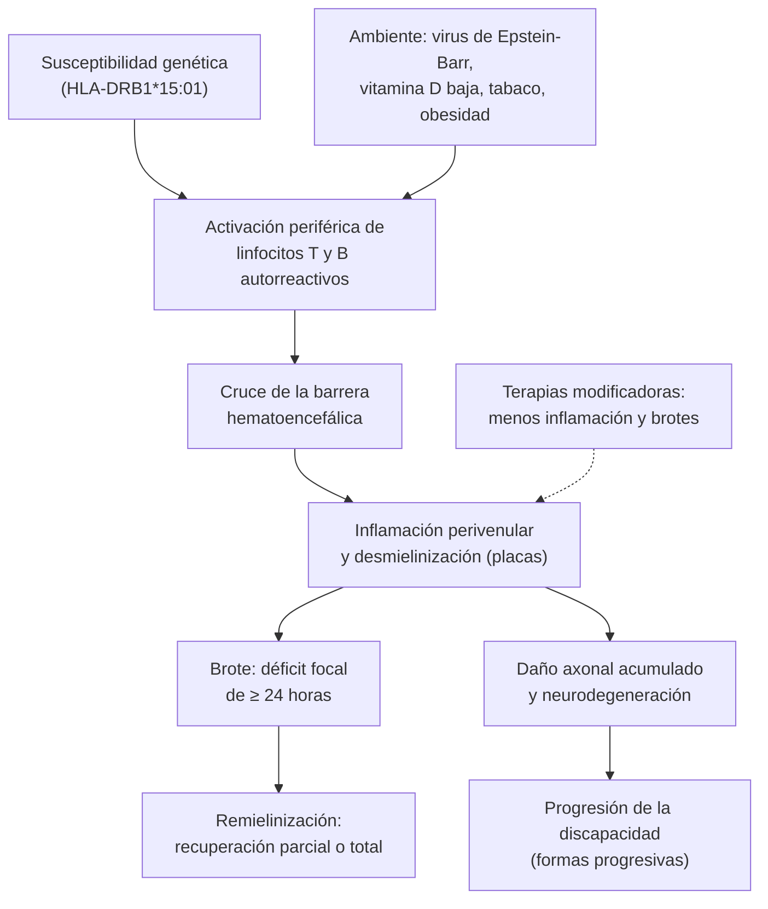

---
tags:
  - Neurología
  - GES
---

# Esclerosis múltiple

**Subespecialidad**
Neurología · Neuroinmunología

**Guías principales**
Criterios de McDonald 2024 (*Lancet Neurol* 2025) · ECTRIMS/EAN 2018: tratamiento farmacológico de la esclerosis múltiple (actualización en curso) · Fenotipos clínicos de Lublin 2013 · Criterios internacionales de los trastornos del espectro de la neuromielitis óptica (2015) · MINSAL: guía clínica GES de esclerosis múltiple remitente recurrente (2010) y protocolo de la Ley Ricarte Soto (2019)

**Otras fuentes**
Atlas of MS, 3.ª edición (2020) · Epstein-Barr y riesgo de esclerosis múltiple (Bjornevik 2022) · Aplicación de los criterios de 2024 en la práctica (Brownlee 2026; Konen 2026) · Incidencia en Chile (Díaz 2012) · Cohorte GES (Vargas Osses 2024) · Mortalidad en Chile (Arriagada 2025) · Imágenes en esclerosis múltiple y neuromielitis óptica (Kuchling 2020)

**GES**
**Sí**: **esclerosis múltiple remitente recurrente** (desde 2010), con confirmación diagnóstica y tratamiento con inmunomoduladores. La **Ley Ricarte Soto** cubre el tratamiento de **segunda línea** (fingolimod, natalizumab, alemtuzumab, cladribina u ocrelizumab) y el **ocrelizumab** en la forma primaria progresiva.

**EUNACOM**
1.10.1.008 Esclerosis múltiple (sospecha, inicial, no requiere)

**Revisado**
Octubre 2026

!!! abstract "Resumen en 60 segundos"
    - Enfermedad **inflamatoria, desmielinizante y neurodegenerativa** del SNC. Típica de **mujeres de 20–40 años** (razón 2:1 a 3:1). Es la principal causa **no traumática** de discapacidad neurológica en adultos jóvenes.
    - **Sospéchala** ante un **brote**: síntomas neurológicos focales que duran **≥ 24 horas**, sin fiebre ni infección.
        - **Neuritis óptica**: visión borrosa de un ojo con **dolor al mover el ojo**.
        - **Mielitis parcial**: hormigueo ascendente, **signo de Lhermitte**, vejiga.
        - **Tronco**: diplopía (oftalmoplejia internuclear), vértigo, ataxia.
    - **Diagnóstico** (McDonald 2024): lesiones típicas en la **RM** en distintas regiones del SNC (**diseminación en el espacio**), con evidencia de **diseminación en el tiempo** o del **LCR** (bandas oligoclonales), **sin una explicación mejor**. El **nervio óptico** es ahora la **quinta región**.
    - **Brote incapacitante**: **metilprednisolona 1 g/día por 3–5 días**. Antes, descarta un **pseudobrote** (fiebre, infección urinaria, calor).
    - **Terapia modificadora precoz** en la forma con brotes: reduce los brotes y la discapacidad. En Chile, **GES** (primera línea) y **Ley Ricarte Soto** (segunda línea).
    - **Banderas rojas** de otro diagnóstico: mielitis **extensa** (≥ 3 segmentos), neuritis óptica **bilateral grave**, **hipo o vómitos incoercibles**, fiebre, encefalopatía o > 50 años. Piensa en **neuromielitis óptica** (anti-AQP4) o **MOGAD** (anti-MOG).

## Definición

| Concepto | Definición |
|---|---|
| **Esclerosis múltiple (EM)** | Enfermedad **inmunomediada crónica** del SNC con **inflamación**, **desmielinización** y **daño axonal**, en lesiones diseminadas en el **espacio** y en el **tiempo** |
| **Brote** (recaída) | Síntomas neurológicos compatibles con desmielinización, de **≥ 24 horas**, **sin fiebre ni infección**, separados ≥ 30 días de un brote previo |
| **Pseudobrote** | Empeoramiento **transitorio** de síntomas antiguos por **fiebre, infección o calor** (fenómeno de Uhthoff), sin inflamación nueva |
| **Síndrome clínico aislado** | **Primer** episodio clínico desmielinizante que aún no cumple los criterios de EM |
| **Síndrome radiológico aislado** | Lesiones típicas de EM en una **RM** pedida por otro motivo, sin síntomas. Con los criterios de 2024 **puede** cumplir los criterios de EM |
| **EM remitente recurrente** | Brotes con **recuperación** completa o parcial, sin progresión entre ellos. **~80 %** de los casos al inicio |
| **EM secundaria progresiva** | Empeoramiento **gradual** de la discapacidad tras una fase remitente recurrente |
| **EM primaria progresiva** | Progresión **desde el inicio**, sin brotes. **10–15 %** de los casos |
| **Diseminación en el espacio** | Lesiones en **≥ 2** de las 5 regiones típicas del SNC |
| **Diseminación en el tiempo** | Lesiones de **distinta edad**: con y sin gadolinio a la vez, o una lesión **nueva** en una RM de control |
| **EDSS** | Escala expandida del estado de discapacidad (0 = normal; 6 = necesita bastón; 10 = muerte por EM) |

## Epidemiología

### Mundial

- **Atlas of MS 2020** (Walton 2020):
    - **2,8 millones** de personas con EM en el mundo (**35,9 por 100 000**).
    - La prevalencia **aumentó** en todas las regiones desde 2013.
    - Incidencia **2,1 por 100 000** al año; edad media al diagnóstico **32 años**.
    - Las mujeres tienen el **doble** de riesgo.
- Prevalencia **mayor** lejos del ecuador (norte de Europa y Norteamérica) y menor en Latinoamérica, Asia y África.
- **Virus de Epstein-Barr**: en una cohorte de más de 10 millones de militares estadounidenses, el riesgo de EM aumentó **32 veces** después de la infección por el virus de Epstein-Barr, y no con otros virus (Bjornevik 2022). Es el factor de riesgo **más fuerte** conocido.

!!! chile "Datos nacionales"
    - **Prevalencia**: alrededor de **14 por 100 000** habitantes, unas **2400 personas** (MINSAL 2019). No hay estudios de representatividad nacional.
        - Región de **Magallanes**: **13,4 por 100 000** (captura-recaptura).
        - **Santiago**: **11,7 por 100 000**.
    - **Incidencia** (hospitalizaciones 2002–2006; Díaz 2012):
        - **0,90 por 100 000** al año.
        - **Magallanes** tuvo una incidencia mucho mayor (**3,54**) que el resto del país, sin relación con la latitud ni la radiación UV en las demás regiones.
    - **GES desde 2010** (EM remitente recurrente). En la cohorte del sistema público 2008–2018 (Vargas Osses 2024):
        - **921 pacientes**, edad media **34,5 años**, razón mujer/hombre **2,2:1**.
        - El **40,5 %** ingresó con un **EDSS ≥ 3**; el acceso no dependió de la edad, el sexo ni la región.
    - **Ley Ricarte Soto** (protocolo 2019): fingolimod, natalizumab, alemtuzumab, cladribina u ocrelizumab ante **falla de los inmunomoduladores**, y ocrelizumab en la forma **primaria progresiva**.
    - La **mortalidad** estandarizada por EM en Chile **disminuye** desde 2005 (Arriagada 2025).

## Etiología y factores de riesgo

- **Genéticos**: el principal es el alelo **HLA-DRB1\*15:01**; riesgo mayor en familiares de primer grado.
- **Ambientales**:
    - **Infección por virus de Epstein-Barr** (sobre todo la mononucleosis sintomática).
    - **Déficit de vitamina D** y poca exposición solar (latitud).
    - **Tabaquismo** (también empeora la progresión).
    - **Obesidad** en la adolescencia.
- **Sexo femenino** (2–3:1 en las formas con brotes; ~1:1 en la primaria progresiva).

## Fisiopatología

- **Linfocitos T y B autorreactivos** se activan en la periferia (probablemente por mimetismo molecular, p. ej., con el virus de Epstein-Barr), cruzan la **barrera hematoencefálica** y atacan la **mielina** del SNC.
- Se forman **placas** de desmielinización alrededor de las **vénulas** (de ahí el **signo de la vena central** en la RM), sobre todo en la sustancia blanca **periventricular**, **yuxtacortical**, **infratentorial**, la **médula** y el **nervio óptico**.
- La **desmielinización** enlentece o bloquea la conducción: aparecen los síntomas del **brote**. La **remielinización** y la redistribución de los canales de sodio permiten la **recuperación**.
- El **calor** empeora la conducción en los axones desmielinizados: **fenómeno de Uhthoff** (empeoramiento transitorio con el baño caliente, el ejercicio o la fiebre).
- Con el tiempo predomina la **neurodegeneración** (pérdida axonal, atrofia cerebral, inflamación crónica "latente" en lesiones con anillo paramagnético): **progresión** de la discapacidad independiente de los brotes.
- Los **fármacos modificadores** actúan sobre la inflamación (brotes y lesiones nuevas); tienen poco efecto sobre la neurodegeneración ya establecida. Por eso se tratan **precozmente**.

*Figura 1. Fisiopatología de la esclerosis múltiple. Esquema propio basado en Montalban 2025 y Bjornevik 2022.*

## Clasificación

**Fenotipos clínicos** (Lublin 2013):

| Fenotipo | Descripción | Modificadores |
|---|---|---|
| **Síndrome clínico aislado** | Primer episodio desmielinizante | Activo / no activo |
| **Síndrome radiológico aislado** | Hallazgo en la RM sin síntomas | Puede cumplir criterios de EM (McDonald 2024) |
| **Remitente recurrente** | Brotes con recuperación | **Activa** (brotes o lesiones nuevas o con gadolinio) / no activa |
| **Secundaria progresiva** | Progresión tras una fase con brotes | Activa / no activa · con progresión / sin progresión |
| **Primaria progresiva** | Progresión desde el inicio | Activa / no activa · con progresión / sin progresión |

- **Actividad**: brotes clínicos o lesiones **nuevas** o **captantes de gadolinio** en la RM (evaluada al menos una vez al año).
- **Progresión**: empeoramiento de la discapacidad **independiente** de los brotes.

## Clínica

- **Persona típica**: mujer de **20–40 años** con un déficit focal **subagudo** (se instala en horas a días, máximo en días a 2 semanas) que mejora en semanas.
- **Neuritis óptica** (forma de inicio frecuente):
    - Pérdida **unilateral** de visión en días, con **dolor al mover el ojo**.
    - **Desaturación de colores** (el rojo se ve "deslavado"), **escotoma central**.
    - **Defecto pupilar aferente relativo** (pupila de Marcus Gunn).
    - Fondo de ojo **normal** (retrobulbar) o con papila levemente edematosa.
- **Mielitis parcial**:
    - Hormigueo o adormecimiento que **asciende** desde las piernas, o una banda en el tronco.
    - **Signo de Lhermitte**: sensación eléctrica que baja por la espalda al **flectar el cuello**.
    - Debilidad, **urgencia urinaria** o retención.
- **Tronco y cerebelo**:
    - **Diplopía** por **oftalmoplejia internuclear** (al mirar al lado, el ojo que aduce no cruza la línea media y el que abduce tiene nistagmo). **Bilateral** en un joven es muy sugerente de EM.
    - **Vértigo**, ataxia, disartria, **neuralgia del trigémino** en un joven.
- **Síntomas crónicos frecuentes**:
    - **Fatiga** (muy frecuente e incapacitante).
    - **Espasticidad**, dolor, alteraciones de la marcha.
    - **Vejiga** (urgencia, incontinencia, retención) e intestino; disfunción sexual.
    - **Cognitivos** (velocidad de procesamiento, memoria), **depresión** y ansiedad.
- **Fenómeno de Uhthoff**: los síntomas empeoran con el calor y el ejercicio, y se recuperan al enfriarse.
- **Primaria progresiva**: típicamente > 40 años, **paraparesia espástica** progresiva en años, sin brotes.

!!! alarma "Banderas rojas: probablemente no es esclerosis múltiple"
    - **Mielitis longitudinalmente extensa** (≥ 3 segmentos vertebrales), neuritis óptica **bilateral** o **muy grave** (visión ≤ 20/200 sin recuperación) o del **quiasma**.
    - **Síndrome del área postrema**: **hipo** o **vómitos incoercibles** → **neuromielitis óptica** (anti-AQP4).
    - **Fiebre**, **encefalopatía**, cefalea intensa, crisis epilépticas, meningismo.
    - **Inicio > 50 años** o factores de riesgo **vascular** importantes (lesiones de sustancia blanca por enfermedad de pequeño vaso).
    - Síntomas **sistémicos**: artritis, exantema, úlceras orales, uveítis, adenopatías, compromiso renal o pulmonar.
    - **LCR** con > 50 células o proteínas muy altas; **RM normal** con síntomas "graves".

## Diagnóstico

!!! guia "Criterios de McDonald 2024 (Montalban 2025)"
    - Se aplican a una persona con síntomas compatibles **o** con un hallazgo de RM típico (síndrome radiológico aislado), **siempre que no haya una explicación mejor**.
    - **Cinco regiones** del SNC: **periventricular**, **cortical o yuxtacortical**, **infratentorial**, **médula espinal** y **nervio óptico** (nueva; se demuestra con RM orbitaria, potenciales evocados visuales u OCT).
    - **≥ 4 de 5 regiones** comprometidas: basta para el diagnóstico.
    - **2–3 regiones**: se necesita además **diseminación en el tiempo** en la RM **y/o** **LCR positivo** (bandas oligoclonales específicas o índice de **cadenas ligeras libres kappa**).
    - El **signo de la vena central** y las **lesiones con anillo paramagnético** (RM especializada) aportan **especificidad** cuando están disponibles.
    - Un **único marco** para las formas con brotes y las progresivas, en todas las edades, con más cautela en los **≥ 50 años** y con **comorbilidad vascular**.

<figure markdown>
![Esquema de los criterios de McDonald 2024. A la izquierda, un corte sagital del sistema nervioso central con lesiones típicas en cinco regiones numeradas: 1 periventricular, 2 cortical o yuxtacortical, 3 infratentorial (tronco y cerebelo), 4 médula espinal y 5 nervio óptico (demostrado con RM, potenciales evocados visuales u OCT, nuevo en 2024); las lesiones típicas son ovoides, de 3 mm o más y perpendiculares a los ventrículos (dedos de Dawson). A la derecha, el algoritmo: ante un síntoma o una RM compatible con desmielinización, se cuentan las regiones con lesiones típicas. Con 4 o más regiones, el diagnóstico es esclerosis múltiple. Con 2 a 3 regiones, se necesita además al menos uno de: diseminación en el tiempo en la RM, bandas oligoclonales o índice kappa en el LCR, o signo de la vena central o lesiones con anillo paramagnético si están disponibles. Con 1 región, en general no basta: seguimiento clínico y con RM, y derivar a neurología. La diseminación en el tiempo en la RM son lesiones con y sin gadolinio a la vez, o una lesión nueva en una RM de control; en personas de 50 años o más o con factores de riesgo vascular se exige más evidencia. Arriba se recuerda que siempre hay que descartar una explicación mejor: neuromielitis óptica, MOGAD, vasculitis, infecciones y lesiones vasculares](../assets/figuras/em/mcdonald-2024.svg){ loading=lazy }
<figcaption>Figura 2. Criterios de McDonald 2024: lesiones en el espacio y en el tiempo. Esquema propio simplificado basado en Montalban 2025, Brownlee 2026 y Konen 2026.</figcaption>
</figure>

- **En la práctica** (Brownlee 2026; Konen 2026): con los criterios de 2024 se diagnostica la EM **antes** que con los de 2017, sobre todo por la inclusión del **nervio óptico** y del síndrome radiológico aislado. El **LCR** sigue siendo importante para el diagnóstico y para descartar diferenciales.
- El diagnóstico lo confirma el **neurólogo**. El rol del médico general es **sospechar**, descartar urgencias y otras causas, tratar el brote incapacitante y **derivar** (GES).

## Laboratorio

| Examen | Hallazgo o para qué |
|---|---|
| **LCR** | **Bandas oligoclonales** específicas del LCR (ausentes en el suero) en la **mayoría** de los pacientes; o índice de **cadenas ligeras libres kappa** elevado. Células normales o levemente aumentadas (**< 50/µL**), proteínas normales o poco elevadas |
| **Hemograma, VHS, PCR, glicemia, función renal y hepática** | Descartar otras causas; basales antes de las terapias modificadoras |
| **Vitamina B12, TSH** | Mielopatía por déficit de B12; comorbilidad |
| **VIH, VDRL o RPR, HTLV-1** | Mielopatías infecciosas (HTLV-1: paraparesia espástica progresiva) |
| **ANA, anti-Ro y anti-La, ANCA, ECA** | LES, Sjögren, vasculitis, sarcoidosis |
| **Anti-AQP4 y anti-MOG** (técnica de células) | Ante **banderas rojas**: mielitis extensa, neuritis óptica grave o bilateral, área postrema |
| **Potenciales evocados visuales** y **OCT** | Lesión del **nervio óptico** (quinta región en McDonald 2024) |
| **Serologías antes del tratamiento** | **VHB** (reactivación con anti-CD20), VHC, VIH, **varicela-zóster**, **virus JC** (natalizumab), tuberculosis latente |

## Imágenes

- **RM de cerebro con gadolinio** (y **RM de médula** cervical y dorsal): examen **clave**. Lesiones T2 o FLAIR **hiperintensas**:
    - **Ovoides**, de ≥ 3 mm, **perpendiculares** a los ventrículos ("**dedos de Dawson**").
    - En el **cuerpo calloso**, yuxtacorticales, en el tronco y los pedúnculos cerebelosos.
    - En la médula: lesiones **cortas** (< 3 segmentos), **periféricas** (posterolaterales).
    - El **gadolinio** muestra las lesiones **activas** (inflamación de < 4–6 semanas).
- **RM de órbitas**: neuritis óptica (realce del nervio).
- **TC**: casi siempre normal; **no** sirve para diagnosticar la EM.
- **Seguimiento**: RM anual (o según el protocolo) para evaluar la **actividad** y la respuesta al tratamiento, y vigilar la **leucoencefalopatía multifocal progresiva** con natalizumab.

<figure markdown>
{ loading=lazy }
<figcaption>Figura 3. Signo de la vena central (flechas rojas) en una lesión de esclerosis múltiple (A), ausente en las lesiones de la neuromielitis óptica con anticuerpos anti-AQP4 (B). RM de 3 T, FLAIR con susceptibilidad magnética. Tomado de Kuchling J, Paul F. Visualizing the central nervous system: imaging tools for multiple sclerosis and neuromyelitis optica spectrum disorders. <em>Front Neurol.</em> 2020;11:450. Licencia <a href="https://creativecommons.org/licenses/by/4.0/">CC BY 4.0</a>.</figcaption>
</figure>

## Diagnóstico diferencial

| Condición | Claves |
|---|---|
| **Neuromielitis óptica** (NMOSD; anti-AQP4) | Neuritis óptica **grave o bilateral**, **mielitis extensa** (≥ 3 segmentos), síndrome del **área postrema** (hipo, vómitos). Más en mujeres mayores y no caucásicas. Algunos tratamientos de la EM (interferón, natalizumab, fingolimod) la **empeoran** |
| **MOGAD** (anti-MOG) | Neuritis óptica con **edema de papila** (a veces bilateral), mielitis extensa o del cono, cuadro tipo **ADEM**; más en niños y jóvenes |
| **Encefalomielitis aguda diseminada (ADEM)** | **Monofásica**, tras una infección o vacuna, con **encefalopatía**, más en niños; lesiones grandes y simultáneas |
| **Enfermedad de pequeño vaso** | > 50 años, hipertensión, diabetes, tabaco; lesiones puntiformes **subcorticales**, sin realce, sin lesiones en el cuerpo calloso ni en la médula |
| **Migraña** | Lesiones puntiformes inespecíficas de sustancia blanca; examen normal |
| **LES, Sjögren, vasculitis, neurosarcoidosis, Behçet** | Síntomas sistémicos, anticuerpos, ECA, uveítis, úlceras |
| **Infecciones**: VIH, **sífilis**, **HTLV-1**, Lyme, leucoencefalopatía multifocal progresiva | Serologías, contexto epidemiológico, LCR |
| **Déficit de B12 o de cobre** | Mielopatía de **cordones posteriores** simétrica; macrocitosis. Ver [neuropatías](neuropatias-perifericas-y-sindromes-sensitivos.md) |
| **Tumores** (linfoma, glioma) y **compresión medular** | Lesión única que crece, efecto de masa, dolor. Ver [Guillain-Barré y mielopatías](debilidad-aguda-guillain-barre-y-mielopatias.md) |
| **Neuritis óptica no inflamatoria** (isquémica) | > 50 años, **indolora**, edema de papila, factores vasculares |
| **Trastorno neurológico funcional** | Signos de inconsistencia; RM normal. Puede coexistir con la EM |

<figure markdown>
![Imágenes de RM sagital T2 de la médula espinal en tres pacientes seguidos en el tiempo. Arriba, una mujer de 30 años con esclerosis múltiple remitente recurrente: una lesión corta, de menos de 3 segmentos, en C3 (flecha roja), que se atenúa en los controles. Al medio, una mujer de 36 años con neuromielitis óptica con anticuerpos anti-AQP4: una mielitis longitudinalmente extensa de C2 a T1 (flechas rojas) que deja atrofia medular (cabezas de flecha). Abajo, una mujer de 41 años con enfermedad asociada a anticuerpos anti-MOG: una mielitis extensa de C3 a C7 que se alarga con una recaída (flechas amarillas) y luego deja atrofia](../assets/figuras/em/rm-medular-em-nmosd-mogad-kuchling-2020.jpg){ loading=lazy }
<figcaption>Figura 4. Mielitis en la esclerosis múltiple (A: lesión corta, de menos de 3 segmentos) frente a la neuromielitis óptica con anti-AQP4 (B) y la enfermedad por anti-MOG (C), con mielitis longitudinalmente extensas y atrofia posterior. Tomado de Kuchling J, Paul F. <em>Front Neurol.</em> 2020;11:450. Licencia <a href="https://creativecommons.org/licenses/by/4.0/">CC BY 4.0</a>.</figcaption>
</figure>

## Tratamiento

!!! guia "Tratamiento (MINSAL GES 2010; ECTRIMS/EAN 2018; Ley Ricarte Soto 2019)"
    - **Brote**:
        - **Metilprednisolona 1 g/día** VO o EV por **5 días** (en la **neuritis óptica**, 1 g/día por 3 días). Acelera la recuperación; no cambia la discapacidad a largo plazo.
        - En los brotes **graves** que no responden a los corticoides: **plasmaféresis** (7 recambios en 14 días).
    - **Terapias modificadoras** (ECTRIMS/EAN 2018):
        - Ofrecer tratamiento **precoz** en la EM remitente recurrente **activa** (brotes o actividad en la RM).
        - Considerar interferón beta o acetato de glatiramer en el **síndrome clínico aislado** con RM sugerente.
        - **Ocrelizumab** en la **primaria progresiva** precoz con actividad.
        - Elegir según la actividad, la comorbilidad, la seguridad, el deseo de embarazo y el acceso; **cambiar** a un fármaco más eficaz si hay actividad pese al tratamiento.
    - **Chile**:
        - **GES**: primera línea con **interferón beta** (1a o 1b) o **acetato de glatiramer** (guía 2010).
        - **Ley Ricarte Soto**: segunda línea con **fingolimod, natalizumab, alemtuzumab, cladribina u ocrelizumab** si fallan los inmunomoduladores; **ocrelizumab** en la primaria progresiva.

- **Antes de tratar un brote**:
    - Confirmar que es un **brote** (nuevo, ≥ 24 horas) y no un **pseudobrote**: medir la temperatura y pedir un **examen de orina** (la **infección urinaria** es el gatillante más frecuente).
    - Los brotes **leves** (solo sensitivos) pueden no tratarse.
- **Terapias modificadoras según su eficacia** (las indica el neurólogo):

    | Eficacia | Fármacos | Riesgos principales |
    |---|---|---|
    | **Moderada** | **Interferón beta**, **acetato de glatiramer** (inyectables), **teriflunomida**, **dimetilfumarato** (orales) | Síntomas pseudogripales, reacción local, alteración hepática; teriflunomida **teratogénica**; linfopenia con dimetilfumarato |
    | **Alta** | Moduladores de **S1P** (**fingolimod**, siponimod, ozanimod), **cladribina** | Bradicardia con la primera dosis, edema macular, infecciones por herpes; linfopenia |
    | **Muy alta** | **Natalizumab**, anti-CD20 (**ocrelizumab**, ofatumumab, rituximab fuera de indicación), **alemtuzumab** | **Leucoencefalopatía multifocal progresiva** (natalizumab con virus JC positivo), infecciones e **hipogammaglobulinemia**, reactivación del **VHB**; autoinmunidad tiroidea y trombocitopenia con alemtuzumab |

- **Tratamiento sintomático y rehabilitación**:
    - **Espasticidad**: kinesiología, **baclofeno** o tizanidina; toxina botulínica focal.
    - **Fatiga**: ejercicio aeróbico, higiene del sueño, tratar la depresión y la apnea del sueño; evitar el calor.
    - **Vejiga**: **antimuscarínicos** si es hiperactiva; **cateterismo intermitente** si hay residuo alto; tratar las infecciones urinarias. Ver [incontinencia urinaria](../geriatria/incontinencia-urinaria.md).
    - **Dolor neuropático**: gabapentinoides, duloxetina o amitriptilina; **carbamazepina** en la neuralgia del trigémino.
    - **Marcha**: fampridina (4-aminopiridina) en casos seleccionados.
    - **Depresión**: tamizaje y tratamiento (mayor riesgo de suicidio).
    - **Medidas generales**: dejar de **fumar**, actividad física, **vitamina D** si está baja, **vacunas** al día (evitar las vacunas **vivas** con algunas terapias).
- **Embarazo**: la tasa de brotes **disminuye** durante la gestación, sobre todo en el **tercer trimestre**, y **aumenta** en los primeros meses del **posparto**. Planificar el embarazo con el neurólogo (algunas terapias son **teratogénicas**: teriflunomida, fingolimod, cladribina).

!!! dosis "Dosis clave"
    - **Brote**: **metilprednisolona 1 g/día** VO o EV por **5 días** (neuritis óptica: 3 días; MINSAL 2010). Agregar protección gástrica y controlar la glicemia, la presión arterial y el ánimo.
    - **Brote grave refractario**: plasmaféresis, **7 recambios en 14 días**.
    - **Baclofeno** (espasticidad): **5 mg c/8 h**, subir cada 3 días; máximo habitual **80 mg/día**. No suspender bruscamente (abstinencia con convulsiones).
    - **Carbamazepina** (neuralgia del trigémino): 100–200 mg c/12 h, subir según la respuesta.

## Complicaciones

- **Discapacidad** motora, sensitiva, visual y **cognitiva** progresiva; pérdida de la marcha.
- **Infecciones urinarias** recurrentes, retención urinaria, **neumonía aspirativa** en etapas avanzadas.
- **Úlceras por presión**, contracturas, **caídas** y fracturas (también por **osteoporosis** con los corticoides).
- **Depresión** (muy frecuente), ansiedad, **suicidio**.
- **Pérdida del trabajo** y de la funcionalidad social.
- **De las terapias**: **leucoencefalopatía multifocal progresiva**, infecciones graves, reactivación del VHB, autoinmunidad secundaria, teratogenicidad.

## Pronóstico y seguimiento

- **Muy variable**. Sin tratamiento, una parte importante de las formas remitentes recurrentes pasa a la **secundaria progresiva** con los años; las terapias modificadoras precoces han mejorado este curso.
- **Mejor pronóstico**: mujer, inicio joven, inicio con **neuritis óptica** o síntomas **sensitivos**, buena recuperación de los brotes, pocos brotes iniciales y pocas lesiones en la RM.
- **Peor pronóstico**: hombre, inicio tardío, inicio **motor**, **cerebeloso** o **esfinteriano**, brotes frecuentes con mala recuperación en los primeros años, muchas lesiones (sobre todo **infratentoriales** y **medulares**), forma **progresiva**, tabaquismo.
- **Seguimiento**: el EUNACOM pide **sospecha y manejo inicial**. El seguimiento lo hace el **neurólogo** (GES): control clínico y EDSS, RM periódica, vigilancia de los efectos adversos de las terapias. En APS: manejo de las comorbilidades, las infecciones urinarias, la depresión, las vacunas y la rehabilitación.

## Perlas para el internado

!!! perla "Para la sala y el turno"
    - **Mujer joven con visión borrosa de un ojo y dolor al moverlo**: neuritis óptica. Busca el **defecto pupilar aferente** y pide una **RM de cerebro**.
    - **Oftalmoplejia internuclear bilateral** en un joven: **EM** hasta demostrar lo contrario.
    - **Signo de Lhermitte**: sensación eléctrica al flectar el cuello; piensa en una lesión cervical (EM, déficit de B12, compresión).
    - **Antes de dar corticoides por un "brote"**: temperatura y **orina completa**. El pseudobrote por infección urinaria no se trata con metilprednisolona.
    - **Hipo o vómitos incoercibles** con una mielitis o neuritis óptica: **neuromielitis óptica**. Pide **anti-AQP4** antes de iniciar un tratamiento de EM (algunos la empeoran).
    - **Mielitis de ≥ 3 segmentos**: no es típica de EM.
    - La **TC normal no descarta** la EM: el examen es la **RM**.
    - Paciente con **natalizumab** y síntomas cognitivos o conductuales nuevos: piensa en una **leucoencefalopatía multifocal progresiva**.
    - Paciente con **anti-CD20** (ocrelizumab): pide **VHB** antes de iniciar; infecciones más frecuentes.
    - La **EM remitente recurrente es GES**: deriva a neurología con la sospecha fundada.

## Preguntas de repaso

??? repaso "1. Mujer de 27 años con 4 días de visión borrosa del ojo derecho y dolor al mover el ojo. Agudeza visual 20/80 en el ojo derecho, ve los colores \"apagados\", defecto pupilar aferente relativo derecho, fondo de ojo normal. ¿Diagnóstico y conducta?"
    **Neuritis óptica retrobulbar derecha**, típica de la EM (unilateral, dolorosa, con defecto pupilar aferente).

    - **RM de cerebro y órbitas con gadolinio** (y de médula): las lesiones típicas predicen el riesgo de EM y pueden cumplir los criterios de McDonald 2024 (el nervio óptico es la **quinta región**).
    - Tratamiento: **metilprednisolona 1 g/día por 3 días** (acelera la recuperación visual).
    - Derivar a **neurología** y oftalmología (GES si se confirma EM remitente recurrente).
    - Si fuera **bilateral**, muy grave o sin recuperación: pedir **anti-AQP4 y anti-MOG**.

??? repaso "2. Mujer de 32 años con EM remitente recurrente que consulta por empeoramiento de su debilidad de piernas desde ayer. Temperatura 38,4 °C, disuria y orina turbia. ¿Es un brote?"
    Probablemente es un **pseudobrote**: empeoramiento **transitorio** de un déficit antiguo por **fiebre** e **infección urinaria**, sin inflamación nueva.

    - Pedir **orina completa y urocultivo**; tratar la **infección urinaria** y la fiebre.
    - **No** dar metilprednisolona.
    - Si el déficit persiste más de 24 horas **después** de resolver la fiebre, o hay un síntoma **nuevo**, reevaluar como brote (RM).

??? repaso "3. Hombre de 25 años con 1 semana de hormigueo que asciende desde los pies hasta el ombligo, y \"corriente\" por la espalda al agachar la cabeza. Antecedente de un episodio de visión doble hace 2 años que se resolvió solo. ¿Qué sospecha y qué pide?"
    **Mielitis parcial** (nivel sensitivo dorsal, signo de **Lhermitte**) en un joven con un episodio previo de **diplopía**: dos episodios en distintas regiones, muy sugerentes de **EM**.

    - **RM de cerebro y médula (cervical y dorsal) con gadolinio**: lesiones típicas en ≥ 2 regiones, con o sin lesiones activas.
    - **Punción lumbar**: **bandas oligoclonales**.
    - Exámenes para descartar otras causas: **B12**, VIH, VDRL, HTLV-1, ANA.
    - Si es incapacitante: metilprednisolona. Derivar a **neurología**: probable EM remitente recurrente (GES).

??? repaso "4. Mujer de 40 años con neuritis óptica bilateral grave hace 1 año, que ahora presenta paraparesia y nivel sensitivo T4. La RM muestra una lesión medular de C6 a T6. La semana previa tuvo hipo y vómitos persistentes. ¿Es esclerosis múltiple?"
    **No** es típica de EM: **neuritis óptica bilateral grave**, **mielitis longitudinalmente extensa** (≥ 3 segmentos) y síndrome del **área postrema** (hipo y vómitos). Sospechar un **trastorno del espectro de la neuromielitis óptica**.

    - Pedir **anticuerpos anti-AQP4** (y anti-MOG si son negativos).
    - Tratamiento agudo: **metilprednisolona** en dosis altas y **plasmaféresis** precoz si la respuesta es mala.
    - Derivar a **neurología**: necesita inmunosupresión específica. Algunos tratamientos de la EM (interferón, natalizumab, fingolimod) pueden **empeorarla**.

??? repaso "5. Paciente con EM remitente recurrente tratado con natalizumab hace 3 años, con anticuerpos contra el virus JC positivos, que presenta en semanas torpeza de la mano derecha, afasia leve y cambios de conducta, sin fiebre. ¿Qué debe sospechar?"
    **Leucoencefalopatía multifocal progresiva** (infección oportunista del SNC por el **virus JC**), complicación grave del **natalizumab**, más probable con virus JC positivo, más de 2 años de tratamiento e inmunosupresión previa.

    - **Suspender el natalizumab** de inmediato.
    - **RM de cerebro** (lesiones subcorticales sin efecto de masa) y **PCR de virus JC en el LCR**.
    - Derivación urgente a neurología; puede requerir **plasmaféresis** para eliminar el fármaco (riesgo de síndrome inflamatorio de reconstitución inmune).

??? repaso "6. Mujer de 30 años con EM remitente recurrente en tratamiento con interferón beta, que desea embarazarse. ¿Qué le explica?"
    - El **embarazo** no empeora el curso a largo plazo de la EM: la tasa de **brotes baja** durante la gestación, sobre todo en el **tercer trimestre**, y **sube** en los primeros meses del **posparto**.
    - **Planificar** el embarazo con el neurólogo, idealmente con la enfermedad **estable**.
    - Revisar la terapia: algunas son **teratogénicas** (teriflunomida, fingolimod, cladribina) y requieren un período de lavado; otras se pueden mantener o suspender según el riesgo.
    - Ácido fólico, vitamina D y control prenatal habitual; plan para el **posparto** (riesgo de brotes, lactancia).

## Referencias

1. Montalban X, Lebrun-Frénay C, Oh J, et al. Diagnosis of multiple sclerosis: 2024 revisions of the McDonald criteria. *Lancet Neurol.* 2025;24(10):850–865. doi:[10.1016/S1474-4422(25)00270-4](https://doi.org/10.1016/S1474-4422(25)00270-4)
2. Montalban X, Gold R, Thompson AJ, et al. ECTRIMS/EAN guideline on the pharmacological treatment of people with multiple sclerosis. *Mult Scler.* 2018;24(2):96–120. doi:[10.1177/1352458517751049](https://doi.org/10.1177/1352458517751049)
3. Lublin FD, Reingold SC, Cohen JA, et al. Defining the clinical course of multiple sclerosis: the 2013 revisions. *Neurology.* 2014;83(3):278–286. doi:[10.1212/WNL.0000000000000560](https://doi.org/10.1212/WNL.0000000000000560)
4. Wingerchuk DM, Banwell B, Bennett JL, et al. International consensus diagnostic criteria for neuromyelitis optica spectrum disorders. *Neurology.* 2015;85(2):177–189. doi:[10.1212/WNL.0000000000001729](https://doi.org/10.1212/WNL.0000000000001729)
5. Walton C, King R, Rechtman L, et al. Rising prevalence of multiple sclerosis worldwide: insights from the Atlas of MS, third edition. *Mult Scler.* 2020;26(14):1816–1821. doi:[10.1177/1352458520970841](https://doi.org/10.1177/1352458520970841)
6. Bjornevik K, Cortese M, Healy BC, et al. Longitudinal analysis reveals high prevalence of Epstein-Barr virus associated with multiple sclerosis. *Science.* 2022;375(6578):296–301. doi:[10.1126/science.abj8222](https://doi.org/10.1126/science.abj8222)
7. Brownlee WJ, Maccarrone D, Nistri R, et al. Performance of the 2024 McDonald criteria in patients under evaluation for suspected multiple sclerosis. *Neurology.* 2026;106(6):e214688. doi:[10.1212/WNL.0000000000214688](https://doi.org/10.1212/WNL.0000000000214688)
8. Konen FF, Mahmoudi N, Albers LM, et al. Applying the 2024-revised McDonald criteria for multiple sclerosis using conventional diagnostic tools: a single-centre prospective cohort study in Germany. *EClinicalMedicine.* 2026;98:104098. doi:[10.1016/j.eclinm.2026.104098](https://doi.org/10.1016/j.eclinm.2026.104098)
9. Kuchling J, Paul F. Visualizing the central nervous system: imaging tools for multiple sclerosis and neuromyelitis optica spectrum disorders. *Front Neurol.* 2020;11:450. doi:[10.3389/fneur.2020.00450](https://doi.org/10.3389/fneur.2020.00450)
10. Díaz V, Barahona J, Antinao J, et al. Incidence of multiple sclerosis in Chile. A hospital registry study. *Acta Neurol Scand.* 2012;125(1):71–75. doi:[10.1111/j.1600-0404.2011.01571.x](https://doi.org/10.1111/j.1600-0404.2011.01571.x)
11. Vargas Osses J, Aracena Conte LR, Cepeda Zumaeta S, et al. Care and treatment guarantee plan for patients with multiple sclerosis: impact on beneficiaries of the Chilean public system 2008–2018. *Rev Med Chil.* 2024;152(7):787–797. doi:[10.4067/s0034-98872024000700787](https://doi.org/10.4067/s0034-98872024000700787)
12. Arriagada Opazo J, Farah González V, González Delgadillo M, et al. Multiple sclerosis mortality trends by sex in Chile, 1997–2019. *Neurologia (Engl Ed).* 2025;40(9):840–848. doi:[10.1016/j.nrleng.2025.10.003](https://doi.org/10.1016/j.nrleng.2025.10.003)
13. Ministerio de Salud de Chile. Guía clínica: esclerosis múltiple. Santiago: MINSAL; 2010. [PDF en diprece.minsal.cl](https://diprece.minsal.cl/wrdprss_minsal/wp-content/uploads/2014/12/Esclerosis-M%C3%BAltiple.pdf)
14. Ministerio de Salud de Chile. Protocolo 2019: tratamiento de segunda línea basado en fingolimod, natalizumab, alemtuzumab, cladribina u ocrelizumab para personas con esclerosis múltiple recurrente remitente con falla a inmunomoduladores, y ocrelizumab para la esclerosis múltiple primaria progresiva (Ley 20.850). [PDF en minsal.cl](https://www.minsal.cl/wp-content/uploads/2019/03/04_Protocolo-Esclerosis-M%C3%BAltiple.pdf)
