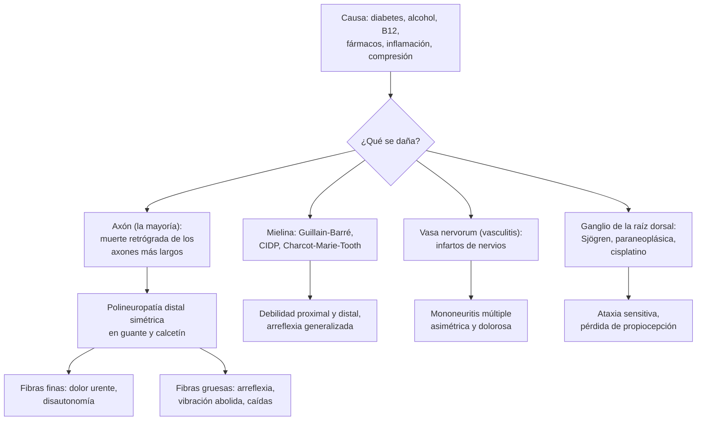

---
tags:
  - Neurología
  - Frecuente en sala
---

# Neuropatías periféricas (polineuropatías, mononeuropatías y radiculopatías) y síndromes sensitivos

**Subespecialidad**
Neurología · Medicina interna · Diabetes

**Guías principales**
AAN 2009: evaluación de la polineuropatía distal simétrica (laboratorio y estudio genético) · NeuPSIG 2025: tratamiento farmacológico y neuromodulación del dolor neuropático · ADA Standards of Care 2026, sección 12: neuropatía diabética · EAN/PNS 2021: polirradiculoneuropatía desmielinizante inflamatoria crónica (CIDP)

**Otras fuentes**
Enfoque por patrones clínicos (Lehmann 2020) · Revisión de la polineuropatía distal simétrica (Callaghan 2015) · Estudio de Rotterdam (Taams 2022) · Neuropatía alcohólica (Julian 2019) · Dolor central post-ACV (Andersen 1995) · Neuropatía diabética en Latinoamérica (Yovera-Aldana 2021)

**GES**
Las neuropatías **no son GES** como problema propio. Sí lo son la **diabetes mellitus tipo 1 y tipo 2** (incluye el examen anual del pie) y el **alivio del dolor y los cuidados paliativos por cáncer avanzado**.

**EUNACOM**
1.10.1.017 Polineuropatías, radiculopatías, mononeuropatías (sospecha, inicial, no requiere) · 1.10.1.023 Síndromes sensitivos: polineuropatía, hemihipoestesia, dolor talámico (sospecha, inicial, no requiere)

**Revisado**
Octubre 2026

!!! abstract "Resumen en 60 segundos"
    - **Primero, el patrón**: ¿dónde está el déficit, qué fibras afecta (sensitivas, motoras, autonómicas) y en cuánto tiempo apareció?
        - **Polineuropatía**: distal y simétrica, en **guante y calcetín**, con aquilianos abolidos.
        - **Mononeuropatía**: territorio de un nervio (mediano en el carpo, cubital en el codo, peroneo en la cabeza del peroné).
        - **Mononeuritis múltiple**: varios nervios asimétricos, en semanas: **vasculitis** hasta demostrar lo contrario.
        - **Radiculopatía**: dolor irradiado por un **dermatoma**, con debilidad y reflejo de esa raíz.
    - **La causa más frecuente es la diabetes**; le siguen las idiopáticas (~25 %), el **alcohol**, los **fármacos** (quimioterapia) y el **déficit de B12**. Un **20 %** tiene más de una causa.
    - **Exámenes de mayor rendimiento** (AAN 2009): **glicemia** (± PTGO), **vitamina B12** (± ácido metilmalónico) y **electroforesis de proteínas con inmunofijación**. Agrega TSH, creatinina, hemograma y pruebas hepáticas.
    - La **electromiografía** confirma, distingue **axonal** de **desmielinizante** y busca imitadores. **No** se necesita en la polineuropatía diabética típica.
    - **Banderas rojas**: inicio **agudo o subagudo**, **asimetría**, predominio **motor** o **proximal**, ataxia sensitiva, disautonomía marcada, síntomas sistémicos. Derivar con urgencia.
    - **Dolor neuropático** (NeuPSIG 2025): primera línea **amitriptilina**, **pregabalina o gabapentina**, **duloxetina**. Luego lidocaína o capsaicina tópica. Los opioides, en tercera línea.
    - **Síndromes sensitivos centrales**: un **nivel sensitivo** es una mielopatía (urgencia); **cara de un lado y cuerpo del otro**, el tronco; **hemicuerpo completo con la cara**, el tálamo o el hemisferio.

## Definición

| Concepto | Definición |
|---|---|
| **Neuropatía periférica** | Daño de los nervios periféricos (raíces, plexos, nervios), sensitivos, motores o autonómicos |
| **Polineuropatía** | Compromiso **difuso**, casi siempre **distal, simétrico** y **dependiente de la longitud** del nervio: empieza en los **pies** |
| **Mononeuropatía** | Compromiso de **un nervio** (casi siempre por **atrapamiento** o compresión) |
| **Mononeuritis múltiple** (mononeuropatía múltiple) | Compromiso **asimétrico** de **varios nervios** no contiguos, simultáneo o sucesivo |
| **Radiculopatía** | Compromiso de una **raíz** nerviosa: dolor irradiado, déficit en un **dermatoma** y un **miotoma** |
| **Plexopatía** | Compromiso del plexo braquial o lumbosacro: déficit de **varias raíces y nervios** de una extremidad |
| **Polirradiculoneuropatía** | Compromiso de raíces y nervios, **proximal y distal** (Guillain-Barré, CIDP) |
| **Neuronopatía sensitiva** (ganglionopatía) | Daño del **ganglio de la raíz dorsal**: **ataxia sensitiva**, no dependiente de la longitud (Sjögren, paraneoplásica, cisplatino) |
| **Neuropatía de fibra fina** | Daño de las fibras pequeñas (dolor, temperatura, autonómicas): **dolor urente** con fuerza, reflejos y **electromiografía normales** |
| **Axonal / desmielinizante** | Lesión del **axón** (amplitudes bajas en la electromiografía) o de la **mielina** (velocidades lentas, bloqueos de conducción) |
| **Dolor neuropático** | Dolor causado por una **lesión o enfermedad** del sistema nervioso **somatosensitivo** (IASP) |
| **Síndrome sensitivo** | Patrón de pérdida o alteración sensitiva que indica la **topografía** de la lesión: nervio, raíz, médula, tronco, tálamo o corteza |

## Epidemiología

### Mundial

- **Neuropatía periférica** (Lehmann 2020):
    - Incidencia **77 por 100 000** habitantes al año.
    - Prevalencia **1–12 %**, y hasta **30 %** en los adultos mayores.
- **Estudio de Rotterdam** (Taams 2022; 4114 personas ≥ 40 años):
    - Prevalencia de **polineuropatía axonal crónica** estandarizada a la población mundial **2,3 %**; aumenta con la edad.
    - El **54,5 %** no estaba diagnosticado.
    - Factores de riesgo: **diabetes** (34,1 %) y **déficits vitamínicos** (15,1 %). **20,4 %** tenía **varios** factores a la vez.
- **Causas** en series de Noruega, Países Bajos y EE. UU. (Lehmann 2020):
    - **Diabetes 18–46 %**.
    - **Idiopática** (axonal crónica) **12–28 %**.
    - **Tóxica** (alcohol, fármacos, quimioterapia) **10–14 %**.
    - **Inmunomediada 8–16 %**; **hereditaria 5–14 %**; **déficit de B12 1–4 %**.
- **Diabetes**: la polineuropatía afecta hasta a la **mitad** de las personas con diabetes de larga evolución (ADA).
- **Alcohol**: **46 %** de los consumidores crónicos tiene neuropatía en la electromiografía; el principal factor es la **dosis total** de alcohol en la vida (Julian 2019).
- **Túnel carpiano**: la neuropatía por atrapamiento **más frecuente**.
- **Dolor central post-ACV** (dolor talámico): **8 %** de los pacientes en el primer año tras un ACV (Andersen 1995).

!!! chile "Datos nacionales"
    - **Diabetes** en el **12,3 %** de los adultos (ENS 2016–2017): es la principal causa de polineuropatía en Chile.
    - En **Latinoamérica y el Caribe** la prevalencia combinada de neuropatía diabética fue **46,5 %**, con mucha heterogeneidad y pocos estudios chilenos (Yovera-Aldana 2021).
    - El **examen anual del pie** con **monofilamento** es parte del control de la diabetes en el **PSCV** (GES). Ver [complicaciones crónicas de la diabetes](../endocrinologia/complicaciones-cronicas-de-la-diabetes.md).
    - La **metformina**, primera línea en la DM2 en el GES, reduce la **vitamina B12**: medirla en los usuarios crónicos con neuropatía.

## Etiología y factores de riesgo

| Grupo | Causas | Pistas |
|---|---|---|
| **Metabólica** | **Diabetes** y **prediabetes**, **ERC**, **hipotiroidismo**, hepatopatía crónica | La más frecuente; sensitiva distal, lenta |
| **Carencial** | **Vitamina B12** (metformina, IBP, gastritis atrófica, vegetarianos, cirugía bariátrica; **óxido nitroso** recreativo en jóvenes, que inactiva la B12), **tiamina** (alcohol), cobre, B6 (déficit o **exceso**) | Ataxia, signos de cordones posteriores, anemia macrocítica |
| **Tóxica** | **Alcohol** | Sensitiva dolorosa, axonal; desnutrición asociada |
| **Fármacos** | **Quimioterapia** (platinos, taxanos, **vincristina**, **bortezomib**), **isoniazida** (sin piridoxina), **metronidazol** prolongado, **nitrofurantoína**, **linezolid**, amiodarona, colchicina, fenitoína | Relación temporal; dependiente de la dosis |
| **Inmunomediada** | **Guillain-Barré**, **CIDP**, neuropatía motora multifocal, **paraneoplásica** (anti-Hu: cáncer pulmonar de células pequeñas) | Aguda o subaguda, proximal y distal, arreflexia |
| **Vasculitis y mesenquimopatías** | **Poliarteritis nodosa**, **vasculitis ANCA** (granulomatosis eosinofílica con poliangeítis), **crioglobulinemia** (hepatitis C), **Sjögren**, LES, AR, sarcoidosis | **Mononeuritis múltiple**, dolorosa, con síntomas sistémicos |
| **Infecciosa** | **VIH**, hepatitis C, **sífilis**, lepra, Lyme (viajeros), difteria | Contexto epidemiológico |
| **Paraproteinemias** | **Gammapatía monoclonal** de significado incierto (sobre todo IgM, anti-MAG), **mieloma**, **amiloidosis AL**, POEMS | Electroforesis con inmunofijación; disautonomía en la amiloidosis |
| **Hereditaria** | **Charcot-Marie-Tooth**, amiloidosis por transtiretina hereditaria, neuropatía hereditaria con susceptibilidad a la parálisis por presión | Décadas de evolución, **pies cavos**, dedos en martillo, antecedentes familiares |
| **Compresiva** | **Túnel carpiano**, cubital en el codo, **peroneo** en la cabeza del peroné, radial, femorocutáneo lateral | Postura, trabajo repetitivo, embarazo, hipotiroidismo, diabetes, baja de peso rápida |
| **Idiopática** | Polineuropatía axonal crónica idiopática | Adulto mayor, lenta, sensitiva, curso **benigno**; diagnóstico de exclusión |

## Fisiopatología

- **Dependencia de la longitud**: los axones **más largos** (los de los pies) son los más vulnerables al daño metabólico y tóxico ("muerte retrógrada"). Por eso la polineuropatía empieza en los **ortejos**, sube hasta las rodillas y **recién entonces** aparece en las **manos** (guante y calcetín).
- **Tipos de fibra**:
    - **Gruesas** mielinizadas: **vibración**, **propiocepción**, tacto fino, **reflejos** y **motoras**. Su daño da **ataxia**, Romberg positivo, arreflexia y debilidad.
    - **Finas** (poco o nada mielinizadas): **dolor**, **temperatura** y **autonómicas**. Su daño da **dolor urente**, alodinia y disautonomía, con electromiografía **normal**.
- **Axonal vs. desmielinizante**:
    - **Axonal** (la mayoría: diabetes, alcohol, tóxicos): pérdida de axones, recuperación **lenta** e incompleta.
    - **Desmielinizante** (Guillain-Barré, CIDP, Charcot-Marie-Tooth tipo 1): conducción lenta o bloqueada; puede recuperarse **rápido** con la remielinización.
- **Vasculitis**: **infartos** de nervios por isquemia de los vasa nervorum: déficits **súbitos**, dolorosos y **asimétricos** (mononeuritis múltiple).
- **Atrapamiento**: compresión crónica en un túnel osteofibroso → isquemia, desmielinización focal y luego daño axonal.
- **Dolor neuropático**: descargas **ectópicas** de los axones dañados, **sensibilización** periférica y central, y pérdida de la inhibición. Por eso responde a fármacos que reducen la excitabilidad (gabapentinoides) o refuerzan la inhibición descendente (antidepresivos).
- **Dolor talámico** (central post-ACV): una lesión de la vía espinotalámica (sobre todo en el **tálamo**) deja **hipoestesia** y, semanas o meses después, **dolor** quemante en la misma zona, con **alodinia** al frío o al roce.

*Figura 1. Mecanismos de daño del nervio periférico y el patrón clínico que producen. Esquema propio basado en Lehmann 2020 y Callaghan 2015.*

## Clasificación

<figure markdown>
![Dos paneles. Arriba (a), un gráfico del déficit neurológico en el tiempo: el patrón 1, hereditario, avanza lentamente durante décadas; el patrón 2, metabólico o tóxico, avanza en años; los patrones 3 a 5, inmunomediados, vasculíticos o paraneoplásicos, aparecen y empeoran en semanas. Abajo (b), cinco siluetas humanas: el patrón 1 con déficit sensitivo distal simétrico en manos y piernas (azul); el patrón 2 con déficit motor distal y atrofia en piernas y antebrazos (rojo); el patrón 3 con compromiso sensitivo y motor proximal y distal de todo el cuerpo (magenta); el patrón 4 con compromiso multifocal asimétrico, con dolor y disautonomía (líneas verdes) en algunas extremidades; y el patrón 5 con pérdida de propiocepción en manos y pies (café), propio de la neuropatía atáxica sensitiva](../assets/figuras/neuropatias/patrones-neuropatia-lehmann-2020.jpg){ loading=lazy }
<figcaption>Figura 2. Patrones clínicos de la neuropatía periférica según su evolución en el tiempo (a) y su distribución (b): azul, déficit sensitivo; rojo, motor; magenta, sensitivo-motor; verde, dolor o disautonomía; café, pérdida de propiocepción. Patrón 1: sensitiva distal simétrica (diabetes, alcohol, fármacos); 2: motora con atrofia y deformidad de los pies (hereditaria); 3: subaguda o proximal (inmunomediada); 4: multifocal, dolorosa, con disautonomía (vasculitis, amiloidosis, paraneoplásica); 5: atáxica sensitiva (neuronopatía). Tomado de Lehmann HC, Wunderlich G, Fink GR, Sommer C. Diagnosis of peripheral neuropathy. <em>Neurol Res Pract.</em> 2020;2:20. Licencia <a href="https://creativecommons.org/licenses/by/4.0/">CC BY 4.0</a>.</figcaption>
</figure>

| Criterio | Tipos |
|---|---|
| **Distribución** | Polineuropatía distal simétrica · mononeuropatía · mononeuritis múltiple · radiculopatía · plexopatía · polirradiculoneuropatía · neuronopatía |
| **Fibras** | Sensitiva · motora · sensitivo-motora · autonómica · de fibra fina |
| **Patología** (electromiografía) | **Axonal** · **desmielinizante** · mixta |
| **Tiempo** | **Aguda** (< 4 semanas: Guillain-Barré, vasculitis, tóxica) · **subaguda** (4–8 semanas) · **crónica** (> 8 semanas: diabetes, alcohol, CIDP, hereditaria) |

## Clínica

- **Síntomas sensitivos**:
    - **Positivos**: hormigueo, ardor, "pinchazos", **alodinia** (dolor con el roce de la sábana), dolor que empeora de **noche**.
    - **Negativos**: adormecimiento, "pies de algodón", inestabilidad en la oscuridad, quemaduras o heridas que no siente.
- **Síntomas motores**: tropiezos, **pie caído**, dificultad para abrir frascos, calambres, atrofia, fasciculaciones.
- **Síntomas autonómicos**: **hipotensión ortostática**, taquicardia de reposo, piel seca, gastroparesia, diarrea nocturna, **disfunción eréctil**, vejiga neurogénica.
- **Examen en la cama del paciente**:
    - **Sensibilidad**: **monofilamento de 10 g**, **pinchazo** y temperatura (fibras finas), **diapasón de 128 Hz** en el ortejo mayor y **propiocepción** (fibras gruesas). Buscar el **límite** (tobillo, rodilla) y comparar los lados.
    - **Reflejos**: **aquilianos** abolidos o disminuidos (primer signo); arreflexia generalizada en las desmielinizantes.
    - **Fuerza**: dorsiflexión del pie y de los ortejos, marcha en **talones** (L5, peroneo) y en **puntas** (S1).
    - **Romberg** positivo y marcha atáxica si hay pérdida de propiocepción.
    - **Pies**: deformidades (pie cavo, dedos en martillo), callosidades, **úlceras**, pulsos.

### Mononeuropatías frecuentes

| Nervio y sitio | Causa típica | Clínica |
|---|---|---|
| **Mediano en el carpo** (**túnel carpiano**) | Trabajo manual repetitivo, embarazo, hipotiroidismo, diabetes, AR | Parestesias **nocturnas** de los dedos 1.º–3.º, Phalen y Tinel; atrofia **tenar** si es grave. Ver [túnel carpiano](../reumatologia/artrosis-y-reumatismos-de-partes-blandas.md) |
| **Cubital en el codo** | Apoyar el codo, flexión prolongada | Parestesias de los dedos **4.º–5.º**, debilidad de los **interóseos**, mano en garra, signo de Froment |
| **Radial en el canal de torsión** (húmero) | Dormir con el brazo colgando ("**parálisis del sábado en la noche**"), fractura de húmero | **Mano caída** (extensores de muñeca y dedos), hipoestesia del dorso de la mano; tríceps conservado |
| **Peroneo común en la cabeza del peroné** | **Cruzar las piernas**, yeso, baja de peso rápida, cuclillas | **Pie caído** (dorsiflexión y **eversión** débiles) con **inversión conservada**; hipoestesia del dorso del pie |
| **Femorocutáneo lateral** (meralgia parestésica) | Obesidad, embarazo, cinturones apretados | Ardor y adormecimiento de la cara **anterolateral del muslo**, **sin** debilidad ni cambios de reflejos |
| **Facial** | Parálisis de Bell | Ver [parálisis facial periférica](paralisis-facial-periferica.md) |
| **III par** "diabético" | Isquemia del nervio | Ptosis y ojo "abajo y afuera" con **pupila respetada** (una pupila dilatada sugiere un **aneurisma**) |

### Radiculopatías

| Raíz | Dolor y sensibilidad | Debilidad | Reflejo |
|---|---|---|---|
| **C5** | Hombro y cara **lateral del brazo** | Abducción del hombro (deltoides), flexión del codo | **Bicipital** |
| **C6** | Cara lateral del antebrazo, **pulgar** e índice | Flexión del codo, **extensión de la muñeca** | **Estilorradial** (braquiorradial) |
| **C7** (la más frecuente cervical) | **Dedo medio** | **Extensión del codo** (tríceps) y de la muñeca | **Tricipital** |
| **C8** | Dedos **4.º–5.º**, borde medial del antebrazo | Flexores de los dedos, intrínsecos de la mano | Ninguno |
| **L4** | Cara anterior del muslo y **medial de la pierna** | Extensión de la rodilla (cuádriceps) | **Rotuliano** |
| **L5** | Cara lateral de la pierna, **dorso del pie** y ortejo mayor | **Dorsiflexión del ortejo mayor** y del pie, **inversión** y abducción de la cadera; marcha en talones | Ninguno confiable |
| **S1** | Cara posterior de la pierna, **borde lateral y planta del pie** | **Flexión plantar**; marcha en puntas | **Aquiliano** |

- Una **hernia del núcleo pulposo** L4-L5 comprime casi siempre la raíz **L5**; una L5-S1, la **S1**. Ver [lumbago y lumbociática](../reumatologia/lumbago-lumbociatica-y-cervicalgia.md).
- **Pie caído: ¿L5 o peroneo?** En la **radiculopatía L5** también están débiles la **inversión** del pie y la abducción de la cadera, y hay dolor lumbar irradiado. En la neuropatía del **peroneo**, la inversión está **conservada**.

### Síndromes sensitivos: el patrón indica dónde está la lesión

<figure markdown>
![Seis siluetas humanas vistas de frente, con el lado derecho del paciente a la izquierda de la imagen, que muestran patrones de compromiso sensitivo. Polineuropatía: pérdida de todas las modalidades en manos y pies, en guante y calcetín, distal y simétrica, con aquilianos abolidos. Radiculopatía L5 derecha: franja en la cara lateral de la pierna y el dorso del pie derechos, con dolor irradiado y Lasègue positivo. Mielopatía transversa a nivel T10: pérdida bilateral desde el ombligo hacia abajo, respetando los brazos, con paraparesia y retención urinaria, que es una urgencia y requiere RM. Hemisección medular derecha (Brown-Séquard): bajo el nivel, del lado derecho, pérdida de propiocepción y vibración con debilidad de la pierna, y del lado izquierdo, pérdida de dolor y temperatura. Síndrome bulbar lateral derecho (Wallenberg): pérdida de dolor y temperatura en la mitad derecha de la cara y en el lado izquierdo del cuerpo, con vértigo y ataxia. Lesión del tálamo o del hemisferio izquierdo: pérdida de todas las modalidades en todo el hemicuerpo derecho, incluida la cara, que puede dejar un dolor talámico (síndrome de Déjérine-Roussy)](../assets/figuras/neuropatias/sindromes-sensitivos.svg){ loading=lazy }
<figcaption>Figura 3. Síndromes sensitivos y topografía de la lesión. Esquema propio.</figcaption>
</figure>

| Topografía | Patrón sensitivo | Claves asociadas |
|---|---|---|
| **Nervio periférico** | Territorio del nervio (mononeuropatía) o **guante y calcetín** (polineuropatía) | Reflejos disminuidos, atrofia |
| **Raíz** | **Dermatoma** | **Dolor irradiado** que aumenta con la tos o el Valsalva; Lasègue; reflejo de esa raíz |
| **Médula: lesión transversa** | **Nivel sensitivo** bilateral en el tronco | Para o tetraparesia, **vejiga** e intestino, hiperreflexia y Babinski (en la fase aguda puede haber arreflexia). **Urgencia: RM** |
| **Médula: hemisección** (Brown-Séquard) | Bajo la lesión: **propiocepción** y vibración abolidas del **mismo lado**; **dolor y temperatura** del lado **opuesto** | Debilidad del **mismo lado**; trauma penetrante, tumor, esclerosis múltiple |
| **Médula: centromedular** (siringomielia, trauma cervical en extensión) | Pérdida de dolor y temperatura "**en esclavina**" (hombros y brazos), con tacto conservado (disociada) | Debilidad mayor en los brazos que en las piernas |
| **Médula: cordones posteriores** (**déficit de B12**, sífilis terciaria) | **Vibración** y **propiocepción** abolidas, con dolor y temperatura conservados | **Romberg positivo**, ataxia; en la B12, signos piramidales más neuropatía (degeneración combinada subaguda) |
| **Médula: arteria espinal anterior** | Dolor y temperatura abolidos bajo la lesión; **propiocepción conservada** | Paraplejia súbita, vejiga; tras cirugía de aorta |
| **Tronco** (Wallenberg) | **Cruzado**: cara del **mismo lado** y cuerpo del lado **opuesto** (dolor y temperatura) | Vértigo, disfagia, disfonía, Horner, ataxia del mismo lado. Ver [vértigo](vertigo.md) |
| **Tálamo** | **Hemihipoestesia** de **todas** las modalidades del lado opuesto, **incluida la cara** | **Dolor talámico** (síndrome de **Déjérine-Roussy**) semanas o meses después |
| **Corteza parietal** | Sensibilidad primaria casi normal, pero **cortical** alterada: **astereognosia**, agrafestesia, discriminación de dos puntos, **extinción** | Heminegligencia, afasia o apraxia según el lado |
| **Funcional** | No sigue territorios anatómicos: corte exacto en la línea media, límites cambiantes | Examen inconsistente; diagnóstico **positivo**, no solo de exclusión |

!!! alarma "Banderas rojas en una neuropatía: derivar con urgencia"
    - Inicio **agudo o subagudo** (días a semanas) o progresión **rápida**: Guillain-Barré, vasculitis, tóxica. Ver [Guillain-Barré](debilidad-aguda-guillain-barre-y-mielopatias.md).
    - **Asimetría** o **mononeuritis múltiple**: **vasculitis** (puede dejar secuelas graves en días).
    - Predominio **motor** o debilidad **proximal**: CIDP, neuropatía motora multifocal, enfermedad de motoneurona, miopatía.
    - **Nivel sensitivo**, retención urinaria o signos piramidales: **mielopatía** (compresión medular).
    - **Ataxia sensitiva** de inicio en las **manos**: neuronopatía (Sjögren, paraneoplásica).
    - **Disautonomía** marcada, síntomas **sistémicos** (baja de peso, fiebre), dolor intenso.
    - **Compromiso respiratorio** o bulbar.

## Diagnóstico

!!! guia "Evaluación de la polineuropatía distal simétrica (AAN 2009; Lehmann 2020)"
    - El diagnóstico es **clínico**: síntomas, signos y **patrón** (distribución, fibras y tiempo).
    - **Exámenes de tamizaje** en toda polineuropatía. Los de **mayor rendimiento**:
        - **Glicemia** (y **PTGO** si la glicemia es normal, en la neuropatía sensitiva distal).
        - **Vitamina B12** con sus metabolitos (**ácido metilmalónico**, con o sin homocisteína).
        - **Electroforesis de proteínas con inmunofijación** (alterada en ~1 de cada 10 pacientes).
    - **Estudio genético** si el fenotipo sugiere una neuropatía **hereditaria** (pies cavos, décadas de evolución, familia afectada).
    - Con la historia, el examen, la electromiografía y el laboratorio se encuentra la causa en hasta **4 de cada 5** pacientes.

- **Electromiografía con velocidades de conducción** (estudio de conducción nerviosa):
    - **Confirma** la neuropatía y su extensión.
    - Distingue **axonal** (amplitudes bajas) de **desmielinizante** (velocidades lentas, latencias prolongadas, bloqueos de conducción).
    - Descarta **imitadores**: radiculopatía, miopatía, enfermedad de motoneurona.
    - **No** es necesaria en la **polineuropatía diabética típica**; sí en la atípica (asimétrica, motora, rápida).
    - Es **normal** en la neuropatía de **fibra fina**: el diagnóstico se apoya en la **biopsia de piel** (densidad de fibras intraepidérmicas).
- **Neuropatía diabética**: tamizaje **anual** desde el diagnóstico de la DM2 (y a los **5 años** de la DM1) con **monofilamento de 10 g** más otra prueba (ADA 2026).
- **Mononeuropatía**: diagnóstico clínico; la electromiografía localiza y gradúa (necesaria antes de una cirugía).
- **Radiculopatía**: diagnóstico clínico; **RM** solo si hay déficit progresivo, banderas rojas o se plantea cirugía.

## Laboratorio

| Nivel | Exámenes | Cuándo |
|---|---|---|
| **Básicos** | **Glicemia en ayunas y HbA1c** (± PTGO), **vitamina B12** (± ácido metilmalónico), **electroforesis de proteínas con inmunofijación**, **TSH**, **creatinina**, **hemograma**, VHS, pruebas hepáticas | Toda polineuropatía |
| **Según la sospecha** | **VIH**, **VHC**, **VDRL o RPR** | Factores de riesgo, curso subagudo |
| | **ANA**, anti-Ro y anti-La, **ANCA**, factor reumatoide, **crioglobulinas**, complemento | Mononeuritis múltiple, síntomas sistémicos |
| | **Anticuerpos antitransglutaminasa** | Síntomas digestivos, ataxia |
| | **Anticuerpos antigangliósidos**, anti-MAG, antineuronales (**anti-Hu**) | Inmunomediada o paraneoplásica |
| | **Punción lumbar** (disociación albúmino-citológica en Guillain-Barré y CIDP; pleocitosis en las infecciosas) | Aguda o subaguda, proximal, inflamatoria |
| | **Biopsia de nervio** (sural) | Sospecha de **vasculitis** no sistémica |

## Imágenes

- **RM de columna** (cervical, dorsal o lumbar):
    - **Urgente** si hay **nivel sensitivo**, paraparesia, retención urinaria o síndrome de **cauda equina**.
    - En la radiculopatía con **déficit motor progresivo**, banderas rojas (fiebre, cáncer, baja de peso) o si se plantea cirugía.
- **RM de cerebro**: síndromes sensitivos **centrales** (hemihipoestesia, síndrome cruzado), sospecha de esclerosis múltiple.
- **Ecografía de nervio**: túnel carpiano (área del mediano), engrosamiento de nervios en las neuropatías inflamatorias y hereditarias.
- **TC de tórax, abdomen y pelvis** (o PET): sospecha de neuropatía **paraneoplásica**.
- **Radiografía de tórax**: sarcoidosis, cáncer pulmonar.

## Diagnóstico diferencial

| Condición | Claves |
|---|---|
| **Mielopatía** (espondilótica, por B12, compresiva) | **Hiperreflexia**, Babinski, nivel sensitivo, vejiga. La B12 puede dar mielopatía **y** neuropatía a la vez |
| **Radiculopatía lumbar o estenosis del canal** | Dolor lumbar irradiado, asimétrico, claudicación neurogénica (alivia al flectar el tronco) |
| **Enfermedad de motoneurona** (ELA) | Debilidad y atrofia **sin** alteraciones sensitivas, **fasciculaciones**, hiperreflexia |
| **Miopatía** | Debilidad **proximal** simétrica, **sin** alteraciones sensitivas, CK elevada |
| **Miastenia gravis** | Debilidad **fluctuante** y fatigable, ptosis, diplopía; sin alteraciones sensitivas |
| **Enfermedad arterial periférica** | **Claudicación** al caminar que cede al detenerse; pulsos ausentes; índice tobillo-brazo |
| **Síndrome de piernas inquietas** | Necesidad de mover las piernas en reposo y de noche, que **alivia al moverlas**; buscar déficit de hierro |
| **Fibromialgia** | Dolor difuso, fatiga, sueño no reparador; examen neurológico **normal** |
| **Trastorno neurológico funcional** | Patrones no anatómicos, signos de inconsistencia (signo de Hoover) |

## Tratamiento

!!! guia "Dolor neuropático (NeuPSIG 2025, revisión sistemática de 313 ensayos)"
    - **Primera línea** (recomendación **fuerte**):
        - **Antidepresivos tricíclicos** (amitriptilina): **NNT 4,6**.
        - **Ligandos α2δ** (pregabalina, gabapentina): **NNT 8,9**.
        - **Inhibidores de la recaptación de serotonina y noradrenalina** (duloxetina, venlafaxina): **NNT 7,4**.
    - **Segunda línea** (débil): **parches de capsaicina 8 %**, **crema de capsaicina**, **parches de lidocaína 5 %** (dolor localizado).
    - **Tercera línea** (débil): **toxina botulínica** tipo A (dolor periférico localizado), **estimulación magnética transcraneal**, **opioides**.
    - Los beneficios son **modestos**: la meta es aliviar el dolor un **30–50 %**, y mejorar el sueño y la función.

- **Tratar la causa** (lo más importante):
    - **Diabetes**: buen control glicémico (previene más en la DM1 que en la DM2), **cuidado de los pies**. Ver [complicaciones crónicas de la diabetes](../endocrinologia/complicaciones-cronicas-de-la-diabetes.md).
    - **Alcohol**: **abstinencia**, **tiamina** y complejo B, nutrición. Ver [abstinencia alcohólica y Wernicke](abstinencia-alcoholica-y-wernicke.md).
    - **Déficit de B12**: reponer **por vía IM** si hay compromiso neurológico; suspender el óxido nitroso. Ver [desnutrición y síndromes carenciales](../endocrinologia/desnutricion-y-sindromes-carenciales.md).
    - **Fármacos**: suspender o ajustar la dosis (con el oncólogo en la quimioterapia); **piridoxina** con la isoniazida.
    - **Hipotiroidismo**, **ERC**: tratar.
    - **Inmunomediadas** (Guillain-Barré, CIDP) y **vasculitis**: derivar a neurología o reumatología. La CIDP responde a **inmunoglobulina EV**, **corticoides** o **plasmaféresis** (EAN/PNS 2021); la vasculitis, a **corticoides** con ciclofosfamida o rituximab.
- **Dolor neuropático**:
    - Elegir según la **comorbilidad**:
        - **Insomnio**: amitriptilina o pregabalina en la noche.
        - **Depresión o ansiedad**: duloxetina.
        - **Adulto mayor o cardiópata**: evitar la amitriptilina; preferir gabapentinoides en dosis bajas o duloxetina.
        - **ERC**: ajustar los gabapentinoides; evitar la duloxetina si la VFG es < 30.
    - **Iniciar con dosis bajas** y subir cada 1–2 semanas. Evaluar la respuesta a las **4–6 semanas** en dosis adecuadas antes de cambiar.
    - Si hay respuesta **parcial**, **combinar** fármacos de primera línea de distinto mecanismo.
    - El **dolor talámico** (central post-ACV) se trata con los mismos fármacos de primera línea; suele ser más **refractario**.
    - **Evitar** el uso prolongado de **opioides** (incluido el tramadol). **No** usar AINE ni paracetamol solos: no son eficaces en el dolor neuropático.
- **Medidas generales**:
    - **Cuidado de los pies**: inspección diaria, calzado adecuado, no caminar descalzo, podología.
    - **Prevención de caídas**: kinesiología, ejercicios de equilibrio, revisar los fármacos sedantes. Ver [caídas](../geriatria/caidas-hipotension-ortostatica-y-fractura-de-cadera.md).
    - **Órtesis**: férula **antiequino** en el pie caído; **férula nocturna** de muñeca en el túnel carpiano.
- **Mononeuropatías compresivas**: evitar la postura o la presión que la produce (no cruzar las piernas, no apoyar el codo). La mayoría mejora en **semanas a meses**. **Cirugía** si hay déficit motor, atrofia o compromiso grave en la electromiografía.
- **Radiculopatía**: manejo **conservador** (analgesia, actividad); **cirugía** si hay déficit motor **progresivo**, dolor refractario o **cauda equina** (urgencia). Ver [lumbago y lumbociática](../reumatologia/lumbago-lumbociatica-y-cervicalgia.md).

!!! dosis "Dosis clave (dolor neuropático del adulto)"
    | Fármaco | Inicio | Dosis habitual | Precauciones |
    |---|---|---|---|
    | **Amitriptilina** | **10–25 mg** en la noche | Subir cada 1–2 semanas hasta **25–75 mg** | Anticolinérgicos (boca seca, retención urinaria, confusión), **arritmias** (ECG si hay cardiopatía), caídas. Evitar en adultos mayores, glaucoma de ángulo cerrado y cardiopatía isquémica reciente |
    | **Pregabalina** | **75 mg c/12 h** (25–50 mg en adultos mayores) | **150–300 mg c/12 h** | Somnolencia, mareo, **edema**, aumento de peso; **ajustar a la función renal**; potencial de abuso |
    | **Gabapentina** | **300 mg** en la noche | Subir hasta **1200–3600 mg/día** en **3 dosis** | Somnolencia, mareo; **ajustar a la función renal** |
    | **Duloxetina** | **30 mg/día** por 1 semana | **60 mg/día** (máximo 120 mg) | Náuseas; evitar en la hepatopatía y la VFG < 30; riesgo **serotoninérgico** con tramadol u otros ISRS |
    | **Lidocaína parche 5 %** | 1–3 parches sobre la zona dolorosa | 12 h puestos y 12 h sin parche | Irritación local; para dolor **localizado** |
    | **Tramadol** (tercera línea) | 50 mg c/8–12 h | Máximo 400 mg/día (300 mg en > 75 años) | Náuseas, mareo, **convulsiones**, **síndrome serotoninérgico**, dependencia |

    - **Tiamina** en el consumo de alcohol: **100 mg/día VO** (EV si hay sospecha de Wernicke).
    - **Vitamina B12** con compromiso neurológico: **cianocobalamina 1000 µg IM** diaria o en días alternos por 1–2 semanas, luego semanal y después **mensual**.
    - **Piridoxina** con la isoniazida: 25–50 mg/día.

## Complicaciones

- **Úlceras del pie**, infección, **amputación** y **pie de Charcot** (neuropatía diabética).
- **Caídas** y fracturas (pérdida de propiocepción, debilidad, hipotensión ortostática, fármacos sedantes).
- **Dolor crónico**, **insomnio**, **depresión** y mala calidad de vida.
- **Disautonomía**: hipotensión ortostática, gastroparesia, vejiga neurogénica, disfunción eréctil.
- **Quemaduras** y heridas que el paciente no siente.
- **Secuelas motoras**: pie caído, mano en garra, atrofia.
- **Del tratamiento**: sedación y **caídas** con gabapentinoides y tricíclicos, **efectos anticolinérgicos** y arritmias con tricíclicos, **síndrome serotoninérgico** (duloxetina más tramadol), abuso de gabapentinoides y opioides.
- **Mielopatía no reconocida** (tratada como "neuropatía") con daño medular irreversible.

## Pronóstico y seguimiento

- **Polineuropatía diabética**: lentamente **progresiva**; el control glicémico y de los factores de riesgo la enlentece. El riesgo principal es el **pie**.
- **Polineuropatía idiopática** del adulto mayor: curso **benigno** y lento; saber el diagnóstico evita estudios repetidos.
- **Alcohólica**: mejora **parcialmente** con la abstinencia y la nutrición.
- **Déficit de B12**: **reversible** si se trata **precozmente**; el daño de larga evolución puede quedar.
- **Inducida por fármacos**: suele mejorar al suspenderlos, pero la de los **platinos** puede **empeorar** algunos meses después de terminar ("efecto de arrastre").
- **Compresivas**: buen pronóstico si se elimina la compresión; peor si ya hay **atrofia**.
- **Vasculitis y CIDP**: dependen de la **rapidez** del tratamiento inmunosupresor.
- **Seguimiento**: el EUNACOM pide **sospecha y manejo inicial**. En la práctica:
    - Control en APS para revisar la **respuesta al dolor** (4–6 semanas), los **efectos adversos** y los **pies**.
    - **Derivar a neurología** si hay **banderas rojas**, si la causa no está clara tras los exámenes básicos, o si progresa a pesar del tratamiento.

## Perlas para el internado

!!! perla "Para la sala y el turno"
    - **Mira los pies y saca los zapatos**: monofilamento, diapasón, aquilianos y pulsos en todo diabético.
    - **Guante y calcetín** que empezó en las **manos** o es **asimétrico** no es una polineuropatía metabólica típica.
    - **Pide B12** a todo diabético con neuropatía que usa **metformina**, y al adulto mayor que usa **IBP**.
    - **Electroforesis con inmunofijación** en toda polineuropatía sin causa clara, sobre todo en mayores de 50 años (gammapatía, mieloma, amiloidosis).
    - **Pie caído**: si la **inversión** del pie está débil, es **L5**; si está conservada, piensa en el **peroneo** (¿cruza las piernas?, ¿bajó de peso?).
    - **Mononeuritis múltiple** con fiebre, baja de peso o púrpura: **vasculitis**; deriva el mismo día.
    - **Nivel sensitivo** en el tronco o **retención urinaria**: no es neuropatía, es una **mielopatía**. RM urgente.
    - **Cara de un lado y cuerpo del otro**: lesión del **tronco** (Wallenberg). **Hemicuerpo completo con la cara**: **tálamo** o hemisferio.
    - **Dolor neuropático**: no sirven el paracetamol ni los AINE solos. Parte con **dosis bajas** y sube lento, sobre todo en los adultos mayores.
    - **Amitriptilina** en un adulto mayor: caídas, retención urinaria, confusión y arritmias. Mejor pregabalina en dosis bajas o duloxetina.

## Preguntas de repaso

??? repaso "1. Hombre de 62 años con DM2 hace 12 años, en metformina 2 g/día y omeprazol, con ardor y \"hormigueo\" en ambos pies hasta los tobillos, que empeora de noche. Aquilianos abolidos, vibración disminuida en los ortejos y monofilamento ausente en 3 de 4 puntos. ¿Diagnóstico, estudio y tratamiento?"
    **Polineuropatía diabética distal simétrica dolorosa** con **pérdida de la sensibilidad protectora**.

    - Exámenes: **HbA1c**, **vitamina B12** (metformina e IBP: déficit frecuente), **TSH**, **creatinina**, hemograma y **electroforesis de proteínas con inmunofijación**.
    - **No** necesita electromiografía si el cuadro es típico.
    - Dolor: **pregabalina 75 mg c/12 h** (subir a 150 mg c/12 h) o **duloxetina 30 → 60 mg/día**. Amitriptilina con cautela por la edad.
    - Si la B12 está baja, **reponerla** (IM si hay compromiso neurológico).
    - **Pie de riesgo**: educación, calzado, inspección diaria, podología y control más frecuente. Optimizar la glicemia.

??? repaso "2. Hombre de 45 años que despertó con la mano derecha \"caída\" después de una noche de mucho alcohol en que durmió sentado con el brazo sobre el respaldo de la silla. No puede extender la muñeca ni los dedos; la extensión del codo es normal. Tiene hipoestesia del dorso de la mano. ¿Qué tiene y qué hace?"
    **Neuropatía del nervio radial** por compresión en el **canal de torsión del húmero** ("parálisis del sábado en la noche"): mano caída con **tríceps conservado** (la compresión es distal a la rama del tríceps).

    - Descartar una lesión central (un ACV puede dar una "mano caída" pseudoperiférica): examen neurológico completo.
    - **Férula** de muñeca en extensión, kinesiología y evitar la compresión.
    - Suele recuperarse en **semanas a pocos meses** (neuroapraxia). Electromiografía si no mejora a las 3–4 semanas.
    - Aprovechar de abordar el **consumo de alcohol** (tiamina).

??? repaso "3. Mujer de 58 años con asma de inicio tardío y eosinofilia de 18 %, que en 3 semanas presenta pie caído derecho y luego debilidad de la mano izquierda con dolor urente. Tiene baja de peso. ¿Qué patrón es y qué sospecha?"
    **Mononeuritis múltiple**: compromiso **asimétrico** de varios nervios (peroneo derecho, cubital o mediano izquierdo) en semanas, doloroso.

    - En una persona con **asma tardía** y **eosinofilia**, sospechar una **granulomatosis eosinofílica con poliangeítis** (vasculitis ANCA).
    - Exámenes: **ANCA**, VHS, PCR, función renal, sedimento de orina, crioglobulinas, VHB y VHC, radiografía de tórax.
    - **Electromiografía** y eventual **biopsia de nervio** (o de otro órgano afectado).
    - **Derivación urgente** a reumatología o neurología: **corticoides** precoces (± ciclofosfamida o rituximab). Ver [vasculitis](../reumatologia/lupus-y-otras-mesenquimopatias.md).

??? repaso "4. Hombre de 30 años con 2 meses de hormigueo en pies y manos, inestabilidad en la oscuridad y caídas. Usa \"globos\" de óxido nitroso en fiestas varias veces por semana. Romberg positivo, vibración abolida en las piernas, reflejos rotulianos vivos y aquilianos abolidos, Babinski bilateral. ¿Qué tiene y qué hace?"
    **Degeneración combinada subaguda** (mielopatía de **cordones posteriores** y laterales) más neuropatía, por **inactivación de la vitamina B12** por el **óxido nitroso**.

    - Pedir **vitamina B12**, **ácido metilmalónico** y **homocisteína** (la B12 puede ser normal; los metabolitos están altos), y hemograma (macrocitosis).
    - **RM de columna**: hiperintensidad de los cordones posteriores ("V invertida").
    - Tratamiento: **suspender el óxido nitroso** y **cianocobalamina 1000 µg IM** diaria y luego semanal y mensual; kinesiología.
    - El pronóstico depende de la **precocidad** del tratamiento.

??? repaso "5. Mujer de 68 años que 4 meses después de un ACV talámico izquierdo presenta un dolor quemante en todo el hemicuerpo derecho, que empeora con el frío y el roce de la ropa. En el examen tiene hipoestesia del hemicuerpo derecho, incluida la cara. ¿Qué tiene y cómo lo trata?"
    **Dolor central post-ACV** (síndrome de **Déjérine-Roussy**, dolor talámico): dolor neuropático en la zona con déficit sensitivo, con **alodinia** al frío y al roce. Afecta a cerca del **8 %** de los pacientes en el primer año tras un ACV.

    - Descartar un ACV nuevo si el cuadro es brusco o hay déficits nuevos.
    - Fármacos de **primera línea** del dolor neuropático: **amitriptilina** (10–25 mg en la noche, con cuidado por la edad) o **pregabalina** (75 mg c/12 h, subiendo).
    - Explicar que suele ser **refractario** y que la meta es aliviarlo y mejorar el sueño; derivar a una unidad del dolor si no responde.

??? repaso "6. Hombre de 40 años con dolor lumbar que se irradia por la cara posterior del muslo y la pierna izquierda hasta el borde lateral del pie. Lasègue positivo a 40°, no puede caminar en puntas del pie izquierdo y el aquiliano izquierdo está abolido. Sin alteración de esfínteres. ¿Qué raíz está comprometida y qué hace?"
    **Radiculopatía S1 izquierda**, probablemente por una **hernia del disco L5-S1**: dolor y sensibilidad del **borde lateral del pie**, **flexión plantar** débil y **aquiliano** abolido.

    - Manejo **conservador**: analgesia, mantenerse activo, kinesiología.
    - **RM lumbar** si el déficit **progresa**, el dolor es refractario a 6 semanas de tratamiento o se plantea cirugía.
    - **Urgencia** si aparecen **retención urinaria**, anestesia en silla de montar o debilidad bilateral (síndrome de **cauda equina**). Ver [lumbago y lumbociática](../reumatologia/lumbago-lumbociatica-y-cervicalgia.md).

## Referencias

1. England JD, Gronseth GS, Franklin G, et al. Practice parameter: evaluation of distal symmetric polyneuropathy: role of laboratory and genetic testing (an evidence-based review). Report of the American Academy of Neurology, American Association of Neuromuscular and Electrodiagnostic Medicine, and American Academy of Physical Medicine and Rehabilitation. *Neurology.* 2009;72(2):185–192. doi:[10.1212/01.wnl.0000336370.51010.a1](https://doi.org/10.1212/01.wnl.0000336370.51010.a1)
2. Soliman N, Moisset X, Ferraro MC, et al. Pharmacotherapy and non-invasive neuromodulation for neuropathic pain: a systematic review and meta-analysis. *Lancet Neurol.* 2025;24(5):413–428. doi:[10.1016/S1474-4422(25)00068-7](https://doi.org/10.1016/S1474-4422(25)00068-7)
3. American Diabetes Association Professional Practice Committee for Diabetes. 12. Retinopathy, neuropathy, and foot care: Standards of Care in Diabetes—2026. *Diabetes Care.* 2026;49(Suppl 1):S261–S276. doi:[10.2337/dc26-S012](https://doi.org/10.2337/dc26-S012)
4. Van den Bergh PYK, van Doorn PA, Hadden RDM, et al. European Academy of Neurology/Peripheral Nerve Society guideline on diagnosis and treatment of chronic inflammatory demyelinating polyradiculoneuropathy: report of a joint Task Force—Second revision. *Eur J Neurol.* 2021;28(11):3556–3583. doi:[10.1111/ene.14959](https://doi.org/10.1111/ene.14959)
5. Lehmann HC, Wunderlich G, Fink GR, Sommer C. Diagnosis of peripheral neuropathy. *Neurol Res Pract.* 2020;2:20. doi:[10.1186/s42466-020-00064-2](https://doi.org/10.1186/s42466-020-00064-2)
6. Callaghan BC, Price RS, Feldman EL. Distal symmetric polyneuropathy: a review. *JAMA.* 2015;314(20):2172–2181. doi:[10.1001/jama.2015.13611](https://doi.org/10.1001/jama.2015.13611)
7. Taams NE, Drenthen J, Hanewinckel R, et al. Prevalence and risk factor profiles for chronic axonal polyneuropathy in the general population. *Neurology.* 2022;99(20):e2234–e2240. doi:[10.1212/WNL.0000000000201168](https://doi.org/10.1212/WNL.0000000000201168)
8. Julian T, Glascow N, Syeed R, Zis P. Alcohol-related peripheral neuropathy: a systematic review and meta-analysis. *J Neurol.* 2019;266(12):2907–2919. doi:[10.1007/s00415-018-9123-1](https://doi.org/10.1007/s00415-018-9123-1)
9. Andersen G, Vestergaard K, Ingeman-Nielsen M, Jensen TS. Incidence of central post-stroke pain. *Pain.* 1995;61(2):187–193. doi:[10.1016/0304-3959(94)00144-4](https://doi.org/10.1016/0304-3959(94)00144-4)
10. Yovera-Aldana M, Velásquez-Rimachi V, Huerta-Rosario A, et al. Prevalence and incidence of diabetic peripheral neuropathy in Latin America and the Caribbean: a systematic review and meta-analysis. *PLoS One.* 2021;16(5):e0251642. doi:[10.1371/journal.pone.0251642](https://doi.org/10.1371/journal.pone.0251642)
11. Ministerio de Salud de Chile. Encuesta Nacional de Salud 2016–2017. [Resultados](http://epi.minsal.cl/encuesta-ens/)
