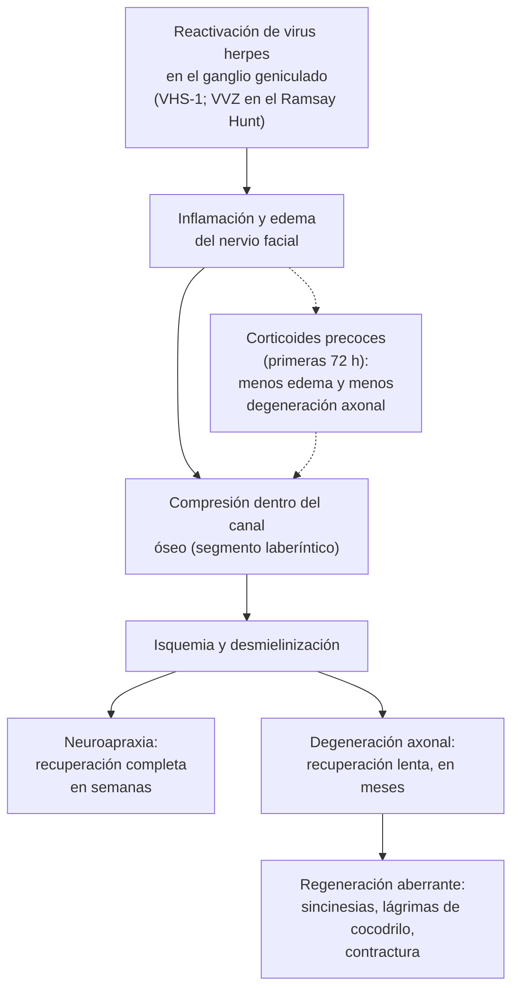

---
tags:
  - Neurología
  - Frecuente en sala
---

# Parálisis facial periférica (parálisis de Bell y síndrome de Ramsay Hunt)

**Subespecialidad**
Neurología · Otorrinolaringología · Medicina de urgencia y APS

**Guías principales**
AAO-HNS 2013: guía de práctica clínica de la parálisis de Bell · AAN 2012: corticoides y antivirales en la parálisis de Bell · Guía canadiense (CMAJ 2014) · Task force de la Sociedad Brasileña de Otología 2024 · Guía de la Sociedad Española de ORL 2020

**Otras fuentes**
Revisiones Cochrane de corticoides (2016) y antivirales (2019) · Ensayos de Sullivan (NEJM 2007) y Engström (Lancet Neurol 2008) · Estudio de Copenhague sobre la evolución natural (Peitersen 2002) · Escala de House-Brackmann (1985)

**GES**
La parálisis facial **no es GES**. El **ACV isquémico en personas de 15 años y más** sí lo es (ver [ACV](accidente-cerebrovascular.md)).

**EUNACOM**
1.10.1.016 Parálisis facial periférica (específico, completo, completo)

**Revisado**
Octubre 2026

!!! abstract "Resumen en 60 segundos"
    - La **parálisis de Bell** es la parálisis facial periférica **aguda** (máximo en **72 h**), **unilateral** y **sin causa identificable**. Es un **diagnóstico de exclusión**, pero es la causa de **~70 %** de las parálisis faciales periféricas.
    - **Central o periférica**: la periférica afecta **toda la hemicara**, incluida la **frente**, y no deja cerrar el ojo. La central (ACV) **respeta la frente** y se acompaña de otros déficits: **código ACV**.
    - **Busca una causa** antes de etiquetarla como Bell: **otoscopia** (otitis, colesteatoma, **vesículas** del Ramsay Hunt), **parótida**, piel, trauma, otros pares craneales, instalación **lenta** o progresiva, **bilateral** o recurrente.
    - **Sin exámenes ni imágenes de rutina**. Pídelos solo si el cuadro es atípico o no mejora.
    - **Prednisona en las primeras 72 h** (≥ 16 años): **60 mg/día por 5 días y descenso en 5 días**, o prednisolona 50 mg/día por 10 días. Reduce la recuperación incompleta de **28 %** a **17 %** (NNT **10**).
    - **Nunca antiviral solo**. Se puede **sumar valaciclovir** en la parálisis **grave o completa**. En el **Ramsay Hunt**, antiviral **siempre** más corticoide.
    - **Protege el ojo** en todos: lágrimas artificiales de día, ungüento y oclusión de noche. **Reevalúa** si aparecen déficits nuevos, síntomas oculares o si no hay recuperación completa a los **3 meses**.

## Definición

| Concepto | Definición |
|---|---|
| **Parálisis facial periférica** | Debilidad de los músculos de la mímica por lesión del **VII par** o de su **núcleo** en la protuberancia. Afecta **toda la hemicara** (frente, ojo y boca) |
| **Parálisis facial central** | Debilidad por lesión **supranuclear** (corteza o vía corticobulbar). Afecta la **mitad inferior** de la cara y **respeta la frente**, porque la parte superior recibe inervación cortical **bilateral** |
| **Parálisis de Bell** | Parálisis facial periférica **aguda** (alcanza su máximo en **≤ 72 h**), **unilateral**, de causa **desconocida**. Es un diagnóstico de **exclusión** (AAO-HNS 2013) |
| **Síndrome de Ramsay Hunt** | Parálisis facial periférica por **reactivación del virus varicela-zóster** en el **ganglio geniculado**, con **vesículas** en el oído o la boca y frecuente compromiso del **VIII par** (hipoacusia, vértigo) |
| ***Zoster sine herpete*** | Parálisis facial por varicela-zóster **sin vesículas**, con evidencia virológica (PCR o seroconversión). Clínicamente se confunde con la parálisis de Bell |
| **Lagoftalmo** | Cierre **incompleto** del párpado |
| **Fenómeno de Bell** | Al intentar cerrar los ojos, el globo ocular del lado paralizado **gira hacia arriba** y se ve la esclera (reflejo normal que queda a la vista porque el párpado no cierra) |
| **Sincinesia** | Movimiento involuntario de un grupo muscular al mover otro (p. ej., se cierra el ojo al sonreír). Secuela de la **regeneración aberrante** |

## Epidemiología

### Mundial

- **Incidencia**:
    - **11,5–53,3** por 100 000 personas-año según la población (AAO-HNS 2013).
    - La guía canadiense estima **20–30** por 100 000 al año; **1 de cada 60** personas la tendrá en su vida (de Almeida 2014).
- **Proporción**:
    - Es la causa de **~70 %** de las parálisis faciales periféricas (AAO-HNS 2013).
    - En el estudio de Copenhague, **1701 de 2570** parálisis periféricas (**66 %**) fueron de Bell (Peitersen 2002).
- **Edad y sexo**: afecta a todas las edades y a ambos sexos; es más frecuente entre los **15 y 45 años**.
- **Factores de riesgo**:
    - **Embarazo** (sobre todo el **tercer trimestre** y el **puerperio inmediato**: riesgo 2–4 veces mayor) y **preeclampsia grave**.
    - **Diabetes**, **obesidad**, **hipertensión**.
    - **Infección respiratoria alta** reciente.
- **Ramsay Hunt**:
    - **~5 por 100 000** al año en EE. UU.
    - **4–12 %** de las parálisis faciales periféricas (116 de 2570, **4,5 %**, en Copenhague).
    - Más frecuente en los **mayores de 60 años**.
- **Vacunas contra el COVID-19**: en Hong Kong, la vacuna inactivada **CoronaVac** se asoció a un **pequeño exceso** de parálisis de Bell (**4,8 casos más por 100 000** vacunados). El beneficio de la vacuna supera ampliamente este riesgo (Wan 2022).

!!! chile "Datos nacionales"
    - No hay datos poblacionales chilenos de incidencia de la parálisis de Bell.
    - **No es GES**. Se maneja en **APS o urgencia** y se deriva a otorrinolaringología o neurología si es atípica o no se recupera.
    - **CoronaVac** se usó ampliamente en Chile. Una parálisis de Bell después de la vacuna se maneja igual que cualquier otra y debe **notificarse** como evento adverso supuestamente atribuible a la vacunación (ESAVI).
    - La escala de **Sunnybrook** para evaluar la parálisis facial tiene una versión en **español validada lingüísticamente en población chilena** (Galindo 2021).
    - La **vacuna recombinante contra el herpes zóster** (previene el Ramsay Hunt) **no está en el PNI**; está disponible en el sector privado. Ver [varicela y herpes zóster](../infectologia/varicela-y-herpes-zoster.md).

## Etiología y factores de riesgo

| Grupo | Causas | Pistas |
|---|---|---|
| **Idiopática** | **Parálisis de Bell** (~70 %) | Aguda, unilateral, aislada; a veces con dolor retroauricular |
| **Infecciosa** | **Ramsay Hunt** (varicela-zóster) | **Vesículas** en el conducto auditivo, el pabellón o el paladar; **dolor intenso**; hipoacusia, vértigo |
| | **Otitis media aguda**, **colesteatoma**, mastoiditis, **otitis externa maligna** (diabético mayor) | Otalgia, otorrea, hipoacusia, membrana timpánica anormal |
| | **VIH** (seroconversión), mononucleosis (VEB), **sífilis**, Lyme (viajeros a zonas endémicas), meningitis, **tétanos cefálico** | Fiebre, adenopatías, exantema, otros pares, LCR alterado |
| **Tumoral** | **Tumor de parótida**, schwannoma del facial o del VIII, metástasis, cáncer de piel con invasión perineural, meningitis carcinomatosa | Instalación **lenta** (> 72 h) o progresiva, **ramas aisladas**, masa, **recurrente del mismo lado**, sin recuperación a los 3–6 meses |
| **Traumática** | **Fractura del hueso temporal**, cirugía de oído o parótida, trauma facial | Antecedente de trauma; parálisis inmediata (sección) o tardía (edema) |
| **Neurológica y autoinmune** | **Guillain-Barré** (puede ser **bilateral**), **sarcoidosis** (fiebre uveoparotídea o síndrome de Heerfordt), esclerosis múltiple | **Bilateral**, arreflexia, uveítis, parotiditis |
| **Central (nuclear)** | ACV o tumor de la **protuberancia** | Parálisis de tipo periférico **con** otros signos de tronco: VI par, hemiparesia contralateral |
| **Otras** | **Diabetes** (mononeuropatía), **embarazo**, síndrome de **Melkersson-Rosenthal** (parálisis recurrente, edema labial y lengua fisurada), congénita (Moebius) | |

!!! alarma "Parálisis facial bilateral"
    La parálisis de Bell **bilateral** es excepcional. Una parálisis facial bilateral obliga a buscar **Guillain-Barré**, **sarcoidosis**, **VIH**, **Lyme**, **leucemia o linfoma**, **meningitis** (infecciosa o carcinomatosa) y **sífilis**. Ver [Guillain-Barré](debilidad-aguda-guillain-barre-y-mielopatias.md).

## Fisiopatología

- **Anatomía** (Figura 1):
    - El núcleo del facial está en la **protuberancia**. El nervio sale por el ángulo pontocerebeloso junto al VIII par, entra al **conducto auditivo interno** y recorre el **canal de Falopio** en el hueso temporal.
    - Segmentos del canal: **laberíntico** (el más **estrecho**), **ganglio geniculado**, timpánico y mastoideo. Sale por el **agujero estilomastoideo** y se divide en la **parótida** en sus ramas terminales.
    - **Ramas intratemporales**:
        - **Nervio petroso mayor** (desde el ganglio geniculado): glándula **lagrimal** y glándulas nasales.
        - **Nervio del estapedio**: amortigua el sonido; su lesión da **hiperacusia**.
        - **Cuerda del tímpano**: **gusto** de los **2/3 anteriores** de la lengua y glándulas submandibular y sublingual.
- **Parálisis de Bell**:
    - Se atribuye a la **reactivación** de un **virus herpes** latente en el **ganglio geniculado**, sobre todo el **virus herpes simple 1**. En un tercio de los pacientes hay evidencia de reactivación de virus herpes (simple o varicela-zóster) sin vesículas.
    - La **inflamación** y el **edema** del nervio dentro del canal óseo, sobre todo en el segmento laberíntico, producen **compresión**, isquemia y desmielinización. Es la base del uso de **corticoides**.
- **Grado de daño**:
    - **Neuroapraxia** (bloqueo de conducción sin daño axonal): recuperación **completa** en semanas.
    - **Axonotmesis** (degeneración axonal): recuperación lenta, en meses, por **regeneración**; puede ser **aberrante** (axones que llegan al músculo equivocado): **sincinesias**, **lágrimas de cocodrilo** (lagrimeo al comer) y contractura.
- **Ramsay Hunt**: reactivación del **varicela-zóster** en el ganglio geniculado, con inflamación más intensa, más degeneración axonal y compromiso del VIII par vecino. Por eso tiene **peor pronóstico** que el Bell.

<figure markdown>
![Esquema anatómico del nervio facial dividido en niveles. Arriba, la corteza cerebral con la vía supranuclear que baja hasta el núcleo del facial en el tronco (nivel nuclear). Luego el nivel infranuclear: el nervio facial y el nervio intermedio, junto al nervio vestibulococlear, recorren el segmento intracraneal y el intratemporal, donde salen ramas hacia el sistema vestibular, la cóclea, la glándula lagrimal, el estribo, la lengua y las glándulas submandibular y sublingual. Finalmente, el segmento extratemporal se abre en abanico hacia los músculos faciales](../assets/figuras/facial/anatomia-nervio-facial-pauna-2024.jpg){ loading=lazy }
<figcaption>Figura 1. Trayecto del nervio facial: niveles supranuclear, nuclear e infranuclear, y segmentos intracraneal, intratemporal y extratemporal con las estructuras que inerva. Tomado de Pauna HF, Silva VAR, Lavinsky J, et al. Task force of the Brazilian Society of Otology — evaluation and management of peripheral facial palsy. <em>Braz J Otorhinolaryngol.</em> 2024;90(3):101374. Licencia <a href="https://creativecommons.org/licenses/by/4.0/">CC BY 4.0</a>.</figcaption>
</figure>

*Figura 2. Fisiopatología de la parálisis de Bell y fundamento del corticoide precoz. Esquema propio basado en AAO-HNS 2013 y Pauna 2024.*

## Clasificación

<figure markdown>
![Dos caras dibujadas a las que se les pidió arrugar la frente, cerrar los ojos con fuerza y mostrar los dientes, con el lado derecho del paciente afectado. A la izquierda, la parálisis central (por ejemplo, un ACV): la frente se arruga en ambos lados, el ojo cierra o casi y solo la comisura bucal está caída con el surco nasogeniano borrado. A la derecha, la parálisis periférica (por ejemplo, Bell): la frente está lisa en el lado afectado, el ojo no cierra y se ve el globo girar hacia arriba (fenómeno de Bell), y la comisura está caída con el surco borrado. Abajo, una tabla comparativa: frente, se arruga en la central por la inervación cortical bilateral y no se arruga en la periférica; cierre del ojo, conservado o con debilidad leve en la central e incompleto en la periférica; mitad inferior, débil en ambas; instalación, minutos en el ACV y horas con un máximo a las 72 horas en el Bell; acompañantes, hemiparesia, disartria y afasia en la central, y dolor retroauricular, hiperacusia, alteración del gusto y ojo seco en la periférica. Notas: una lesión del núcleo en la protuberancia da una parálisis de tipo periférico con otros signos de tronco, y un tumor de parótida puede afectar solo algunas ramas y respetar la frente](../assets/figuras/facial/central-vs-periferica.svg){ loading=lazy }
<figcaption>Figura 3. Parálisis facial central y periférica. Esquema propio basado en AAO-HNS 2013 y Pauna 2024.</figcaption>
</figure>

**Escala de House-Brackmann** (la más usada para graduar la gravedad y el seguimiento; House 1985, AAO-HNS 2013):

| Grado | Función | Frente | Cierre del ojo | Boca |
|---|---|---|---|---|
| **I** | **Normal** | Normal | Normal | Normal |
| **II** | **Leve**: debilidad visible solo de cerca | Función moderada a buena | **Completo** con esfuerzo mínimo | Asimetría leve con esfuerzo máximo |
| **III** | **Moderada**: diferencia evidente, no desfigurante; sincinesias notorias pero no graves | Leve o ningún movimiento | **Completo** con esfuerzo máximo | Asimetría evidente con esfuerzo máximo |
| **IV** | **Moderadamente grave**: debilidad evidente o asimetría desfigurante | **Sin** movimiento | **Incompleto** con esfuerzo máximo | Asimétrica con esfuerzo máximo |
| **V** | **Grave**: movimiento apenas perceptible; asimetría en reposo | Sin movimiento | Incompleto | Leve movimiento |
| **VI** | **Parálisis total** | Sin movimiento | Sin movimiento | Sin movimiento |

- **Clave práctica**: el **cierre del ojo** separa el grado **III** (cierra con esfuerzo) del **IV** (no cierra).
- **Parálisis incompleta** (paresia, grados II–V) vs. **completa** (grado VI): la completa tiene **peor pronóstico**.
- La revisión Cochrane 2019 considera **grave** la parálisis de grados **V–VI**; es el grupo en que se discute sumar un antiviral.
- Otra escala: **Sunnybrook** (más detallada; mide reposo, movimiento voluntario y sincinesias).

## Clínica

- **Instalación**: en **horas**, con el máximo en **≤ 72 h**. A menudo el paciente lo nota **al despertar** o se lo hace notar otra persona.
- **Pródromo**: **dolor retroauricular** o en el oído uno o dos días antes, o infección respiratoria alta reciente.
- **Motor** (toda la hemicara del lado afectado):
    - **Frente lisa**, ceja caída, no arruga la frente.
    - **Lagoftalmo** con **fenómeno de Bell**; parpadeo débil.
    - **Surco nasogeniano borrado**, **comisura caída**, no puede silbar ni inflar las mejillas.
    - **Escape de líquidos** y comida por la comisura; muerde la mejilla.
    - **Sensación de adormecimiento** de la cara (sin déficit sensitivo real: el V par está indemne).
- **Otros síntomas según la altura de la lesión**:
    - **Hiperacusia** (nervio del estapedio).
    - **Alteración del gusto** en los 2/3 anteriores de la lengua (cuerda del tímpano).
    - **Ojo seco** (nervio petroso mayor) o, más a menudo, **epífora**: las lágrimas caen porque el párpado inferior no bombea.
- **Ramsay Hunt**:
    - **Dolor de oído intenso**, más que en el Bell.
    - **Vesículas** en el **conducto auditivo externo** y el pabellón (**76 %**) o en la **boca** y el paladar (**13 %**).
    - Las vesículas pueden **preceder**, coincidir o **aparecer días después** de la parálisis: pide al paciente que **vigile su oído y su boca**.
    - **Hipoacusia** (20–70 %), **tinnitus**, **vértigo** y nistagmo (compromiso del VIII par).
    - La parálisis suele ser **más grave** (más a menudo completa).

!!! alarma "Lo que no es Bell: busca otra causa"
    - **Respeta la frente** o hay **hemiparesia**, disartria, afasia, ataxia o diplopía: **ACV** hasta demostrar lo contrario (activa el código ACV).
    - **Otros pares craneales** afectados (V, VI, VIII, IX–XII).
    - Instalación **lenta** (> 72 h) o **progresiva** después de 3 semanas.
    - **Ramas aisladas** (solo la boca o solo el párpado) o **masa parotídea**.
    - **Bilateral** o **recurrente del mismo lado** (tumor).
    - **Otorrea**, otitis crónica, **vesículas**, fiebre, adenopatías, exantema.
    - **Sin ningún signo de recuperación** a las **3 semanas** o recuperación incompleta a los **3 meses**.

## Diagnóstico

!!! guia "Diagnóstico de la parálisis de Bell (AAO-HNS 2013; Pauna 2024)"
    - El diagnóstico es **clínico** y de **exclusión**: parálisis facial periférica **aguda** (máximo en ≤ 72 h), **unilateral**, sin otra causa identificable.
    - **Historia y examen** dirigidos a **excluir** otras causas:
        - Examen de **todos los pares craneales** y examen neurológico completo.
        - **Otoscopia**: conducto, membrana timpánica, vesículas.
        - Palpación de la **parótida** y el cuello.
        - Piel de la cabeza y la cara (cáncer de piel).
    - **No** pedir **exámenes de laboratorio** de rutina.
    - **No** pedir **imágenes** de rutina.
    - **No** pedir **estudios electrofisiológicos** en la parálisis **incompleta**. Se pueden ofrecer en la parálisis **completa** (pronóstico).

- **Gradúa la gravedad** con House-Brackmann al ingreso y en cada control.
- **Examina el cierre del ojo** sentado y acostado, y la córnea (lagoftalmo, ojo rojo).
- **Ramsay Hunt**: el diagnóstico es **clínico** (vesículas). Sin vesículas, sospéchalo si el **dolor es intenso** o hay **hipoacusia o vértigo**.

## Laboratorio

- **No** se piden de rutina en la parálisis de Bell típica (AAO-HNS 2013).
- **Pídelos según la sospecha**:
    - **Glicemia** o HbA1c si hay factores de riesgo de diabetes (además, antes de dar corticoides en un diabético conocido).
    - **VIH**, **VDRL o RPR**, serología de VEB si hay fiebre, adenopatías o exantema.
    - **Serología de Lyme** solo en viajeros a zonas endémicas (Norteamérica, Europa).
    - Hemograma (leucemia), ECA y calcio (sarcoidosis) en la parálisis **bilateral** o atípica.
    - **Punción lumbar** si hay signos meníngeos, parálisis bilateral o sospecha de Guillain-Barré.
    - **PCR de varicela-zóster** de las lesiones o del exudado del oído en el Ramsay Hunt dudoso.
- **Estudios electrofisiológicos**:
    - **Electroneurografía**: compara la amplitud del potencial motor con el lado sano. Es informativa desde el **día 7** aprox. (antes la degeneración walleriana aún progresa) y menos confiable después de los **14–21 días**. Una **pérdida > 90 %**, con un EMG sin actividad voluntaria, predice peor recuperación, aunque parte de esos pacientes igual se recupera bien.
    - Útiles solo en la parálisis **completa** o con mala evolución: pronóstico y selección de candidatos a cirugía.

## Imágenes

- **No** se piden de rutina en la parálisis de Bell (AAO-HNS 2013).
- **RM de cerebro y del trayecto del facial con gadolinio** (examen de elección) si:
    - Hay **otros pares craneales** o **déficits neurológicos** afectados.
    - La parálisis **progresa** más allá de 3 semanas o **no mejora** a los 3 meses.
    - Es **recurrente** del mismo lado o **bilateral**.
    - Afecta solo **algunas ramas** o hay asimetría entre las zonas de la cara.
    - Se plantea una **cirugía**.
- **TC de hueso temporal (peñasco)**: en el **trauma** o en las complicaciones de la otitis crónica (colesteatoma).
- **TC o RM de cerebro urgente** si se sospecha un **ACV**.
- En el Bell, la RM puede mostrar **realce** del nervio (sobre todo cerca del ganglio geniculado), pero no cambia el tratamiento.

## Diagnóstico diferencial

| Condición | Claves |
|---|---|
| **ACV** (parálisis central) | **Respeta la frente**; hemiparesia, disartria o afasia; instalación en minutos. Ver [ACV](accidente-cerebrovascular.md) |
| **Lesión del tronco** (protuberancia) | Parálisis de tipo periférico **con** paresia del VI par, hemiparesia contralateral u otros signos de tronco |
| **Ramsay Hunt** | **Vesículas** en el oído o la boca, **dolor intenso**, hipoacusia, vértigo. Ver [herpes zóster](../infectologia/varicela-y-herpes-zoster.md) |
| **Otitis media aguda o crónica** (colesteatoma), **otitis externa maligna** | Otalgia, otorrea, hipoacusia, membrana timpánica anormal; diabético mayor con dolor nocturno. Ver [infecciones de vías aéreas superiores](../respiratorio/infecciones-de-vias-aereas-superiores.md) |
| **Tumor de parótida** u otro tumor del facial | Instalación **lenta** o progresiva, **ramas aisladas**, masa palpable, **recurrente del mismo lado**, sin recuperación |
| **Schwannoma vestibular** | **Hipoacusia unilateral progresiva** y tinnitus; la parálisis facial es tardía |
| **Guillain-Barré** | Parálisis facial **bilateral**, debilidad ascendente, **arreflexia**. Ver [Guillain-Barré](debilidad-aguda-guillain-barre-y-mielopatias.md) |
| **Sarcoidosis** | Bilateral; uveítis, parotiditis, fiebre (síndrome de Heerfordt); adenopatías hiliares |
| **VIH, sífilis, mononucleosis** | Fiebre, adenopatías, exantema, otros pares, meningitis. Ver [VIH](../infectologia/infeccion-por-vih.md), [sífilis](../infectologia/infecciones-de-transmision-sexual-y-sifilis.md) y [síndrome mononucleósico](../infectologia/sindrome-mononucleosico-y-adenitis.md) |
| **Trauma** (fractura del temporal) | Antecedente de TEC; hemotímpano, otorragia, equimosis retroauricular (signo de Battle) |
| **Tétanos cefálico** | Parálisis facial del lado de una **herida en la cabeza**, con **trismus**. Ver [tétanos](../infectologia/tetanos.md) |
| **Melkersson-Rosenthal** | Parálisis facial **recurrente**, **edema labial** y lengua fisurada |

## Tratamiento

!!! guia "Parálisis de Bell (AAO-HNS 2013; AAN 2012; CMAJ 2014; Cochrane 2016 y 2019)"
    - **Corticoides orales en las primeras 72 h** a todos los pacientes de **16 años o más** (recomendación **fuerte**, evidencia de alta calidad).
        - Cochrane 2016 (7 ensayos, 895 pacientes): recuperación incompleta **17 %** con corticoides vs. **28 %** sin ellos (RR **0,63**; **NNT 10**). También reducen las **sincinesias**.
        - Ensayo de Sullivan (NEJM 2007): recuperación a los **9 meses** **94 %** con prednisolona vs. **82 %** sin ella.
    - **No** dar **antivirales solos** (no son mejores que el placebo).
    - **Antiviral + corticoide**: **opción** (AAO-HNS). La guía canadiense lo **sugiere** en la parálisis **grave o completa** (grados V–VI) y **no** en la leve o moderada.
        - Cochrane 2019: probablemente **poco o ningún** efecto adicional sobre la recuperación incompleta, pero **menos secuelas** tardías (sincinesias, lágrimas de cocodrilo: RR **0,56**).
    - **Protección ocular** a todos los que no cierran bien el ojo (recomendación **fuerte**).
    - **No** hay recomendación sobre **descompresión quirúrgica**, **acupuntura** ni **kinesiología** en la fase aguda.
    - **Reevaluar o derivar** si: aparecen déficits neurológicos **nuevos** o empeoran, aparecen **síntomas oculares**, o la recuperación es **incompleta a los 3 meses**.

<figure markdown>
![Algoritmo del enfoque de la debilidad facial aguda unilateral. Paso 1: si respeta la frente o hay hemiparesia, disartria, diplopía, ataxia u otros pares craneales afectados, se trata de una lesión central o de tronco y se activa el código ACV con TC o RM. Si no, es periférica. Paso 2: buscar una causa identificable con la historia, la otoscopia, la parótida y la piel: vesículas en el oído o el paladar con dolor intenso (Ramsay Hunt), otitis o colesteatoma, masa parotídea, trauma, parálisis bilateral o recurrente del mismo lado, instalación de más de 72 horas o progresiva, fiebre, inmunosupresión o VIH. Si la hay, estudio dirigido con RM con gadolinio, TC de peñasco y serologías, y derivar a otorrinolaringología o neurología. Paso 3: si no, parálisis de Bell, sin exámenes ni imágenes de rutina. Tres columnas de tratamiento: todos deben proteger el ojo con lágrimas artificiales cada 1 a 2 horas, ungüento y oclusión nocturna y lentes de sol, y consultar si hay dolor, ojo rojo o baja de visión; dentro de las 72 horas y desde los 16 años, corticoide: prednisona 60 mg al día por 5 días con descenso en 5 días, o prednisolona 50 mg al día por 10 días, controlando la glicemia en los diabéticos e individualizando en el embarazo; en la parálisis grave o completa, grados V a VI de House-Brackmann, considerar sumar valaciclovir 1 g cada 8 horas por 7 días, nunca un antiviral solo; en el Ramsay Hunt, antiviral siempre más corticoide. Paso 4: control a las 1 a 2 semanas y luego mensual; reevaluar o derivar si hay déficits nuevos o progresión, síntomas oculares o ninguna mejoría a las 3 semanas; si la recuperación es incompleta a los 3 meses, RM, otorrinolaringología o neurología, kinesiología facial y toxina botulínica](../assets/figuras/facial/enfoque-paralisis-facial.svg){ loading=lazy }
<figcaption>Figura 4. Enfoque y tratamiento de la debilidad facial aguda unilateral. Esquema propio basado en AAO-HNS 2013, de Almeida 2014 (CMAJ) y Pauna 2024.</figcaption>
</figure>

- **Corticoides**:
    - Empezar **lo antes posible**, idealmente en las **primeras 72 h**. Después de 72 h el beneficio es incierto.
    - **Diabetes**: no es contraindicación absoluta, pero exige **control de glicemia** (capilar varias veces al día) y ajuste de la insulina o de los hipoglicemiantes.
    - **Embarazo**: la parálisis del embarazo tiene **peor pronóstico** y a menudo **no se trata** por temor. Las guías recomiendan **ofrecer** el corticoide tras una conversación **individualizada**, con control de **glicemia y presión arterial**. Buscar **preeclampsia** (asociación descrita). Ver [preeclampsia](../nefrologia/preeclampsia-y-sindrome-hipertensivo-del-embarazo.md).
    - **Niños**: la mayoría se recupera sin tratamiento; el beneficio de los corticoides no está demostrado.
    - Otras precauciones: úlcera péptica activa, psicosis previa, infección no controlada, obesidad mórbida.
- **Antivirales**:
    - En el **Bell**: solo **asociados** al corticoide y de preferencia en la parálisis **grave o completa** (decisión compartida).
    - En el **Ramsay Hunt**: **siempre**, idealmente en las primeras **72 h**, junto con el corticoide.
    - **Ajustar a la función renal** (neurotoxicidad en la ERC).
- **Protección ocular** (todos los que no cierran bien el ojo):
    - **Lágrimas artificiales** sin preservantes cada **1–2 h** durante el día.
    - **Ungüento oftálmico** lubricante en la noche y **cierre del párpado** con cinta adhesiva hipoalergénica (horizontal, sin presionar el globo) o **cámara húmeda**.
    - **Lentes de sol** o protectores al salir (viento, polvo).
    - Derivar a **oftalmología** si hay **dolor ocular**, **ojo rojo**, **baja de visión** o lesión corneal con fluoresceína.
- **Kinesiología facial y fonoaudiología**:
    - **No** se recomiendan de rutina en la fase aguda (AAO-HNS 2013).
    - La guía canadiense sugiere **ejercicios faciales** si la debilidad **persiste**.
    - **No** usar **electroestimulación** (la guía canadiense sugiere no usarla).
- **Secuelas**:
    - **Toxina botulínica** para las sincinesias y la hiperactividad del lado sano.
    - Cirugía: **peso de oro** en el párpado superior (lagoftalmo persistente), reanimación facial (injertos y transferencias nerviosas o musculares) en centros especializados.
- **Descompresión quirúrgica**: no se recomienda de rutina (riesgo de **hipoacusia** y fístula de LCR, evidencia de muy baja calidad).
- **Información al paciente**: la mayoría se **recupera**; las mejoras empiezan en **2–3 semanas**; consultar si aparecen síntomas nuevos o molestias oculares.

!!! dosis "Dosis clave (adultos)"
    - **Parálisis de Bell** (en las primeras 72 h):
        - **Prednisona 60 mg/día VO por 5 días**, luego **descender 10 mg/día** en 5 días (esquema de Engström), **o**
        - **Prednisolona 50 mg/día VO por 10 días** (esquema de Sullivan; prednisona y prednisolona son equivalentes mg a mg).
        - Dar en la mañana, con protección gástrica si hay riesgo de úlcera.
    - **Antiviral asociado** (parálisis grave o completa, opcional):
        - **Valaciclovir 1 g VO c/8 h por 7 días**, **o**
        - **Aciclovir 400 mg VO 5 veces al día por 10 días** (dosis usada en los ensayos; menor biodisponibilidad).
    - **Ramsay Hunt** (en las primeras 72 h, idealmente):
        - **Valaciclovir 1 g VO c/8 h por 7 días** o **aciclovir 800 mg VO 5 veces al día por 7–10 días**.
        - Más **prednisona** como en el Bell.
        - **Aciclovir EV 10 mg/kg c/8 h** si es grave, con compromiso de varios pares, encefalitis o inmunosupresión.
    - **Ojo**: lágrimas artificiales **1 gota c/1–2 h**; ungüento lubricante al acostarse.

## Complicaciones

- **Oculares**: **queratitis por exposición**, **úlcera corneal** y, rara vez, pérdida de visión. Son la complicación aguda más importante y **prevenible**.
- **Recuperación incompleta**: debilidad residual y asimetría (**~30 %** sin tratamiento).
- **Secuelas por regeneración aberrante**:
    - **Sincinesias** (p. ej., se cierra el ojo al sonreír).
    - **Contractura** y **espasmo hemifacial**.
    - **Lágrimas de cocodrilo** (lagrimeo al comer).
- **Psicosociales**: alteración de la imagen corporal, **ansiedad**, **depresión** y aislamiento social.
- **Del tratamiento**: **hiperglicemia**, alza de la presión arterial, insomnio, alteraciones del ánimo y psicosis por corticoides; neurotoxicidad por antivirales en la ERC.
- **Ramsay Hunt**: **hipoacusia** residual, tinnitus, disfunción vestibular y **neuralgia posherpética**.

## Pronóstico y seguimiento

- **Evolución natural** (sin tratamiento; Peitersen 2002, 2570 pacientes):
    - El **85 %** empieza a recuperarse en **3 semanas**; el resto, a los **3–5 meses**.
    - El **71 %** recupera una función **normal**.
    - Secuelas **leves** en 12 %, **moderadas** en 13 % y **graves** en 4 %.
- **Según la gravedad inicial** (sin tratamiento): recuperación completa en el **94 %** de las parálisis **incompletas** y en el **61–70 %** de las **completas** (de Almeida 2014; AAO-HNS 2013).
- **Con corticoides**: recuperación de **~94 %** a los 9 meses (Sullivan 2007).
- **Factores de mal pronóstico**:
    - Parálisis **completa** (House-Brackmann VI) y gravedad a la semana del inicio.
    - **Ningún signo de recuperación** a las **3 semanas**.
    - Pérdida **> 90 %** en la electroneurografía con EMG sin actividad voluntaria.
    - **Ramsay Hunt** (peor si es grado IV o más, o en mayores de 50 años).
    - **Embarazo** (tercer trimestre y puerperio).
    - En una cohorte japonesa de 679 adultos, la edad, la diabetes y la hipertensión **no** predijeron la falta de recuperación una vez considerada la gravedad a la semana (Fujiwara 2014).
- **Seguimiento**:
    - Control a la **1–2 semanas** (cumplimiento del corticoide, ojo, glicemia en los diabéticos).
    - Luego **mensual** hasta la recuperación completa; revisar el ojo en cada control los primeros 3 meses.
    - **Derivar** a otorrinolaringología o neurología (y RM) si: aparecen **déficits nuevos** o empeora, **síntomas oculares**, **ninguna mejoría a las 3 semanas** o recuperación **incompleta a los 3 meses**.
    - Explicar que puede **recurrir** (de cualquiera de los lados); una recurrencia del **mismo lado** obliga a descartar un **tumor**.

## Perlas para el internado

!!! perla "Para la sala y el turno"
    - **Pide que arrugue la frente**: si la frente se mueve, piensa en un **ACV** (central) y no en un Bell.
    - Una parálisis de tipo periférico **con** diplopía, hemiparesia u otros pares es una **lesión del tronco**, no un Bell.
    - **Siempre otoscopia**: las **vesículas** del Ramsay Hunt cambian el tratamiento (antiviral siempre). Pídele que vigile el oído y la boca los días siguientes.
    - **Prednisona en las primeras 72 h**: no la retrases por pedir exámenes ni imágenes, que no se necesitan en el Bell típico.
    - **Nunca antiviral solo** en el Bell.
    - **No te olvides del ojo**: lágrimas de día, ungüento y cinta de noche. Un ojo rojo y doloroso es una **urgencia oftalmológica**.
    - **Diabético con corticoides**: controla la glicemia y ajusta la insulina; no dejes de tratar.
    - **Embarazada**: ofrécele el corticoide y controla la presión arterial (asociación con **preeclampsia**).
    - **Bilateral**: no es Bell. Piensa en **Guillain-Barré**, sarcoidosis, VIH, Lyme o leucemia.
    - **Recurrente del mismo lado** o **lentamente progresiva**: busca un **tumor** (parótida, schwannoma) con **RM**.

## Preguntas de repaso

??? repaso "1. Hombre de 35 años, sano, despierta con la cara \"chueca\" a la derecha. Ayer tuvo dolor detrás de la oreja derecha. No arruga la frente ni cierra el ojo derecho, y la comisura derecha está caída. El resto del examen neurológico y la otoscopia son normales. Lleva 12 horas. ¿Diagnóstico y tratamiento?"
    **Parálisis de Bell derecha**: periférica (compromete la **frente**), aguda, aislada, con otoscopia normal y sin otras causas. Es grado V aprox. de House-Brackmann (no cierra el ojo, movimiento mínimo).

    - **Sin exámenes ni imágenes** de rutina.
    - **Prednisona 60 mg/día por 5 días con descenso en 5 días** (o prednisolona 50 mg/día por 10 días), ya que está dentro de las **72 h**.
    - Como la parálisis es **grave**, se puede **considerar** sumar **valaciclovir 1 g c/8 h por 7 días** (beneficio pequeño, sobre las secuelas tardías).
    - **Protección ocular**: lágrimas artificiales cada 1–2 h, ungüento y cierre del párpado con cinta en la noche.
    - Control en 1–2 semanas; consultar si aparecen síntomas nuevos o molestias oculares.

??? repaso "2. Mujer de 72 años, hipertensa y fumadora, con debilidad de la cara a la izquierda desde hace 1 hora. Al pedirle que arrugue la frente, lo hace en ambos lados; cierra ambos ojos. La comisura izquierda está caída y tiene dificultad para hablar. ¿Qué piensa y qué hace?"
    **Parálisis facial central**: **respeta la frente** y se acompaña de **disartria**. Es un **ACV** hasta demostrar lo contrario (lesión supranuclear derecha).

    - **Activar el código ACV**: glicemia capilar, **NIHSS**, **TC o RM de cerebro urgente** con angio-TC.
    - Evaluar **trombólisis** o trombectomía según la ventana y las contraindicaciones (**GES**).
    - **No** es una parálisis de Bell: **no** dar corticoides. Ver [ACV](accidente-cerebrovascular.md).

??? repaso "3. Hombre de 68 años con dolor intenso del oído derecho desde hace 3 días y desde hoy parálisis facial derecha completa. Refiere zumbido y oye menos por ese oído. En la otoscopia hay vesículas en el conducto auditivo y el pabellón. ¿Diagnóstico y tratamiento?"
    **Síndrome de Ramsay Hunt** (herpes zóster ótico): parálisis facial periférica con **vesículas** en el oído, **dolor intenso** y compromiso del **VIII par** (hipoacusia, tinnitus).

    - **Valaciclovir 1 g c/8 h por 7 días** (o aciclovir 800 mg 5 veces al día), **ajustado a la función renal**.
    - Más **prednisona** (60 mg/día por 5 días con descenso).
    - **Protección ocular**.
    - **Audiometría** y evaluación por **otorrinolaringología**.
    - Analgesia; vigilar la **neuralgia posherpética**.
    - Explicar que el pronóstico es **peor** que el del Bell. Una vez recuperado, ofrecer la **vacuna recombinante contra el zóster**.

??? repaso "4. Paciente con parálisis de Bell en tratamiento con prednisona. A los 4 días consulta por dolor y ardor en el ojo afectado, con ojo rojo y visión borrosa. ¿Qué pasó y qué hace?"
    Probable **queratitis por exposición** (o úlcera corneal) por el **lagoftalmo**.

    - Examinar con **fluoresceína** y derivar **urgente a oftalmología**.
    - **Intensificar la lubricación**: lágrimas cada hora, ungüento y **cierre del párpado** con cinta o cámara húmeda.
    - **Lentes de sol** de día.
    - Las guías indican **reevaluar o derivar** a todo paciente con Bell que presente **síntomas oculares** en cualquier momento.

??? repaso "5. Mujer de 50 años con parálisis facial derecha que empezó en la boca hace 2 meses y ha ido empeorando lentamente. Ahora tampoco cierra bien el ojo. Tuvo un episodio parecido en el mismo lado hace 2 años. Se palpa un nódulo preauricular derecho. ¿Qué sospecha y qué pide?"
    No es una parálisis de Bell: la instalación es **lenta y progresiva**, empezó en **ramas aisladas**, es **recurrente del mismo lado** y hay una **masa parotídea**. Sospechar un **tumor de parótida** (o del nervio facial).

    - **RM con gadolinio** de la parótida y del trayecto del facial (o TC si no hay RM).
    - Derivar a **otorrinolaringología o cirugía de cabeza y cuello**; estudio citológico (punción con aguja fina guiada por ecografía).
    - **No** tratar como Bell con corticoides y esperar.

??? repaso "6. Mujer de 30 años, embarazada de 34 semanas, con parálisis facial periférica izquierda aguda de 24 horas, aislada, con otoscopia normal. Teme tomar corticoides por el embarazo. ¿Qué le explica y qué hace?"
    **Parálisis de Bell en el embarazo** (el tercer trimestre y el puerperio aumentan el riesgo 2–4 veces). Tiene **peor pronóstico** y a menudo se deja sin tratar, lo que empeora el resultado.

    - **Ofrecer prednisona** dentro de las 72 h tras una **conversación individualizada**: el beneficio es claro y los riesgos al final del embarazo son bajos. Controlar la **glicemia** y la **presión arterial**.
    - **Buscar preeclampsia** (presión arterial, proteinuria, síntomas): se ha descrito una asociación. Ver [preeclampsia](../nefrologia/preeclampsia-y-sindrome-hipertensivo-del-embarazo.md).
    - El antiviral se puede ofrecer si la parálisis es completa (aciclovir y valaciclovir se usan en el embarazo).
    - **Protección ocular** y control obstétrico y neurológico.

## Referencias

1. Baugh RF, Basura GJ, Ishii LE, et al. Clinical practice guideline: Bell's palsy. *Otolaryngol Head Neck Surg.* 2013;149(3 Suppl):S1–S27. doi:[10.1177/0194599813505967](https://doi.org/10.1177/0194599813505967)
2. Gronseth GS, Paduga R; American Academy of Neurology. Evidence-based guideline update: steroids and antivirals for Bell palsy: report of the Guideline Development Subcommittee of the American Academy of Neurology. *Neurology.* 2012;79(22):2209–2213. doi:[10.1212/WNL.0b013e318275978c](https://doi.org/10.1212/WNL.0b013e318275978c)
3. de Almeida JR, Guyatt GH, Sud S, et al. Management of Bell palsy: clinical practice guideline. *CMAJ.* 2014;186(12):917–922. doi:[10.1503/cmaj.131801](https://doi.org/10.1503/cmaj.131801)
4. Pauna HF, Silva VAR, Lavinsky J, et al. Task force of the Brazilian Society of Otology — evaluation and management of peripheral facial palsy. *Braz J Otorhinolaryngol.* 2024;90(3):101374. doi:[10.1016/j.bjorl.2023.101374](https://doi.org/10.1016/j.bjorl.2023.101374)
5. Lassaletta L, Morales-Puebla JM, Altuna X, et al. Parálisis facial: guía de práctica clínica de la Sociedad Española de ORL. *Acta Otorrinolaringol Esp.* 2020;71(2):99–118. doi:[10.1016/j.otorri.2018.12.004](https://doi.org/10.1016/j.otorri.2018.12.004)
6. Madhok VB, Gagyor I, Daly F, et al. Corticosteroids for Bell's palsy (idiopathic facial paralysis). *Cochrane Database Syst Rev.* 2016;7(7):CD001942. doi:[10.1002/14651858.CD001942.pub5](https://doi.org/10.1002/14651858.CD001942.pub5)
7. Gagyor I, Madhok VB, Daly F, Sullivan F. Antiviral treatment for Bell's palsy (idiopathic facial paralysis). *Cochrane Database Syst Rev.* 2019;9(9):CD001869. doi:[10.1002/14651858.CD001869.pub9](https://doi.org/10.1002/14651858.CD001869.pub9)
8. Sullivan FM, Swan IR, Donnan PT, et al. Early treatment with prednisolone or acyclovir in Bell's palsy. *N Engl J Med.* 2007;357(16):1598–1607. doi:[10.1056/NEJMoa072006](https://doi.org/10.1056/NEJMoa072006)
9. Engström M, Berg T, Stjernquist-Desatnik A, et al. Prednisolone and valaciclovir in Bell's palsy: a randomised, double-blind, placebo-controlled, multicentre trial. *Lancet Neurol.* 2008;7(11):993–1000. doi:[10.1016/S1474-4422(08)70221-7](https://doi.org/10.1016/S1474-4422(08)70221-7)
10. Peitersen E. Bell's palsy: the spontaneous course of 2,500 peripheral facial nerve palsies of different etiologies. *Acta Otolaryngol Suppl.* 2002;(549):4–30. [PubMed](https://pubmed.ncbi.nlm.nih.gov/12482166/)
11. House JW, Brackmann DE. Facial nerve grading system. *Otolaryngol Head Neck Surg.* 1985;93(2):146–147. doi:[10.1177/019459988509300202](https://doi.org/10.1177/019459988509300202)
12. Wan EYF, Chui CSL, Lai FTT, et al. Bell's palsy following vaccination with mRNA (BNT162b2) and inactivated (CoronaVac) SARS-CoV-2 vaccines: a case series and nested case-control study. *Lancet Infect Dis.* 2022;22(1):64–72. doi:[10.1016/S1473-3099(21)00451-5](https://doi.org/10.1016/S1473-3099(21)00451-5)
13. Fujiwara T, Hato N, Gyo K, Yanagihara N. Prognostic factors of Bell's palsy: prospective patient collected observational study. *Eur Arch Otorhinolaryngol.* 2014;271(7):1891–1895. doi:[10.1007/s00405-013-2676-9](https://doi.org/10.1007/s00405-013-2676-9)
14. Galindo PL, Sandoval AS, Cerda JJ, et al. Homologación lingüística al idioma español, en población chilena, de la herramienta Sunnybrook Facial Grading System para evaluar parálisis facial. Estudio piloto. *Rev Otorrinolaringol Cir Cabeza Cuello.* 2021;81(1):33–39. doi:[10.4067/S0718-48162021000100033](https://doi.org/10.4067/S0718-48162021000100033)
