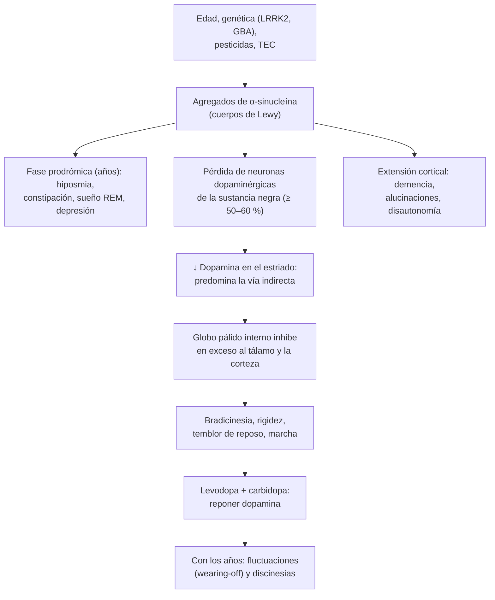

---
tags:
  - Neurología
  - Geriatría
  - GES
---

# Enfermedad de Parkinson, temblor, trastornos de la marcha y síndrome atáxico

**Subespecialidad**
Neurología · Geriatría · Medicina física y rehabilitación

**Guías principales**
MDS 2015: criterios clínicos de la enfermedad de Parkinson · MDS 2018: revisión de tratamientos motores del Parkinson · AAN 2021: tratamiento dopaminérgico inicial del Parkinson · MINSAL 2017: guía de práctica clínica del tratamiento farmacológico y quirúrgico del Parkinson · MDS 2018: clasificación de los temblores · MDS 2019: tratamientos del temblor esencial · Guías mundiales de caídas 2022

**Otras fuentes**
Revisión del Parkinson (Armstrong y Okun, JAMA 2020) · Proyección de prevalencia del Parkinson al 2050 (Su 2025) · Parkinson en Chile (Leiva 2019) · Prevalencia mundial del temblor esencial (Louis y Ferreira 2010)

**GES**
**Enfermedad de Parkinson (GES 62)**, a cualquier edad, desde la confirmación diagnóstica: **tratamiento en ≤ 20 días**; atención por especialista en ≤ 60 días desde la derivación; ayudas técnicas (bastón, cojín, colchón, órtesis) en ≤ 20 días y silla de ruedas o andador en ≤ 30 días en menores de 65 años. Copago: FONASA 0 %, isapre 20 %.

**EUNACOM**
1.10.1.006 Enfermedad de Parkinson y parkinsonismos (sospecha, inicial, no requiere) · 1.07.1.016 Temblor (sospecha, inicial, no requiere) · 1.10.1.026 Temblor esencial (sospecha, inicial, no requiere) · 1.07.1.017 Trastornos de la marcha (específico, completo, derivar) · 1.10.1.018 Síndrome atáxico (sospecha, inicial, no requiere)

**Revisado**
Octubre 2026

!!! abstract "Resumen en 60 segundos"
    - **Parkinsonismo** = **bradicinesia** (obligatoria) + **temblor de reposo** y/o **rigidez**.
        - La causa más frecuente es la **enfermedad de Parkinson**: asimétrica, con buena respuesta a la **levodopa**.
        - Siempre descarta los **fármacos**: antipsicóticos, **metoclopramida**, **flunarizina** y **cinarizina**.
        - Busca **banderas rojas** de parkinsonismo atípico: caídas precoces, falla autonómica grave, parálisis de la mirada vertical, signos cerebelosos, mala respuesta a la levodopa.
    - El Parkinson **no es solo motor**: años antes aparecen **hiposmia**, **trastorno conductual del sueño REM**, **constipación** y **depresión**; luego, hipotensión ortostática, demencia y psicosis.
    - **Tratamiento**: **ejercicio** y kinesiología siempre. **Levodopa** (la más eficaz) o **agonistas dopaminérgicos** (pramipexol, ropinirol). **GES 62**: tratamiento en ≤ 20 días desde la confirmación.
    - **Paciente con Parkinson hospitalizado**:
        - **No suspender la levodopa** y darla a la hora (riesgo de un síndrome tipo neuroléptico maligno).
        - **No usar haloperidol ni metoclopramida**. Para las náuseas, **domperidona**; para la psicosis o la agitación, **quetiapina**.
    - **Temblor**: clasificarlo por **cuándo aparece**.
        - **Reposo**: parkinsonismo.
        - **Postural y de acción**: fisiológico exacerbado (**TSH**, fármacos, cafeína) o **temblor esencial**.
        - **Intención**: cerebelo.
    - **Temblor esencial**: bilateral en las manos, de acción, familiar, mejora con alcohol. **Propranolol** o **primidona**.
    - **Marcha**: reconoce el patrón (parkinsoniana, apráxica de la **hidrocefalia normotensiva**, atáxica, espástica, en *steppage*, miopática). La **ataxia aguda** con cefalea y vómitos es un **ACV de fosa posterior** hasta demostrar lo contrario.

## Definición

| Concepto | Definición |
|---|---|
| **Parkinsonismo** | Síndrome con **bradicinesia** (lentitud **y** disminución progresiva de la amplitud o la velocidad de los movimientos repetidos) más **temblor de reposo**, **rigidez** o ambos (MDS 2015) |
| **Enfermedad de Parkinson** | Enfermedad **neurodegenerativa** con pérdida de neuronas **dopaminérgicas** de la **sustancia negra** y depósitos de **α-sinucleína** (cuerpos de Lewy). Es la causa más frecuente de parkinsonismo |
| **Parkinsonismos atípicos** ("Parkinson plus") | Atrofia multisistémica, parálisis supranuclear progresiva, degeneración corticobasal, demencia por cuerpos de Lewy. Peor respuesta a la levodopa y progresión más rápida |
| **Parkinsonismo secundario** | Por **fármacos**, **vascular**, **hidrocefalia normotensiva**, tóxicos, postencefalítico, enfermedad de Wilson |
| **Temblor** | Movimiento **involuntario, rítmico y oscilatorio** de una parte del cuerpo |
| **Temblor esencial** | Temblor de **acción** bilateral de las extremidades superiores de **≥ 3 años**, con o sin temblor de cabeza, voz o piernas, **sin** otros signos neurológicos (distonía, ataxia, parkinsonismo) (MDS 2018) |
| **Ataxia** | Falta de coordinación del movimiento y del equilibrio, **sin** debilidad. Puede ser **cerebelosa**, **sensitiva** (propioceptiva) o **vestibular** |
| **Trastorno de la marcha** | Alteración de la forma de caminar (velocidad, base, longitud del paso, estabilidad) que aumenta el riesgo de **caídas** |

## Epidemiología

### Mundial

- **Parkinson**:
    - Unas **11,9 millones** de personas en 2021, con una proyección de **25,2 millones** en 2050 (+112 %), sobre todo por el **envejecimiento** (Su 2025).
    - Más frecuente en **hombres** (razón de prevalencia ~1,5:1). Suele comenzar **después de los 60 años**; antes de los 50 años, pensar en formas genéticas o en otras causas.
- **Temblor esencial**: el **trastorno del movimiento más frecuente** del adulto. Prevalencia de **4,6 %** en los **≥ 65 años**, y aumenta con la edad (Louis y Ferreira 2010).
- **Subtipos del Parkinson** (Armstrong y Okun 2020): la forma **motora leve** (**49–53 %**) responde bien y progresa lento; la forma **maligna difusa** (**9–16 %**) tiene síntomas motores y no motores precoces, mala respuesta y progresión rápida.

!!! chile "Datos nacionales"
    - Según el estudio de carga global de enfermedad, entre 1990 y 2016 la prevalencia del Parkinson en Chile aumentó un **19,9 %**, el **mayor aumento de Latinoamérica**, y las muertes atribuidas un **16,5 %** (Leiva 2019). Afecta a ~**1 de cada 100** mayores de 60 años.
    - **GES 62** (enfermedad de Parkinson, a cualquier edad):
        - **Tratamiento** en ≤ **20 días** desde la confirmación diagnóstica.
        - **Especialista** en ≤ **60 días** desde la derivación.
        - **Ayudas técnicas** en menores de 65 años: bastón, cojín, colchón u órtesis en ≤ 20 días; silla de ruedas o andador en ≤ 30 días.
    - **Guía MINSAL 2017** (tratamiento farmacológico y quirúrgico):
        - Sugiere **agonistas dopaminérgicos** en el Parkinson **de novo**, y su asociación con levodopa si la monoterapia no basta.
        - Sugiere **inhibidores de la COMT** en las fluctuaciones y **amantadina** en las discinesias.
        - Sugiere **no usar anticolinérgicos de rutina**.
        - Sugiere la **estimulación cerebral profunda subtalámica** en las fluctuaciones y discinesias refractarias.
        - Recomienda **no** usar radiocirugía ni **células madre**.
    - **Fármacos que causan parkinsonismo**: en Chile se usan mucho la **flunarizina** y la **cinarizina** (vértigo, migraña) y la **metoclopramida**. Ver [trastornos del movimiento por fármacos](trastornos-del-movimiento-por-farmacos.md).

## Etiología

- **Parkinsonismo**:
    - **Enfermedad de Parkinson**: la causa más frecuente.
        - Factores de riesgo: **edad**, sexo masculino, **pesticidas**, traumatismo encefálico, antecedente familiar.
        - Genes: **LRRK2**, **GBA**, **SNCA**, **PRKN** (formas juveniles). Se asocia **inversamente** con el tabaco y el café.
    - **Por fármacos**: **antipsicóticos** (típicos y risperidona), **metoclopramida**, **flunarizina**, **cinarizina**, valproato, litio, tetrabenazina.
    - **Atípicos**: atrofia multisistémica, parálisis supranuclear progresiva, degeneración corticobasal, demencia por cuerpos de Lewy.
    - **Vascular**: infartos lacunares múltiples; predomina en las **piernas** (*lower body parkinsonism*).
    - **Hidrocefalia normotensiva**, tumores, hematoma subdural.
    - **Enfermedad de Wilson** (< 40 años), tóxicos (manganeso, monóxido de carbono, MPTP).
- **Temblor**:
    - **Fisiológico exacerbado**: **hipertiroidismo**, hipoglicemia, **cafeína**, ansiedad, **abstinencia** de alcohol o benzodiacepinas.
    - **Fármacos**: **β-agonistas**, **litio**, **valproato**, **amiodarona**, ISRS, teofilina, corticoides, tacrolimus.
    - **Esencial**: a menudo **familiar** (herencia autosómica dominante).
    - **Parkinsoniano**, **distónico**, **cerebeloso**, **de Holmes** (lesión del mesencéfalo), neuropático, **funcional**.
- **Ataxia**:
    - **Aguda** (horas a días): **ACV o hemorragia cerebelosa**, intoxicación (**alcohol**, fenitoína, carbamazepina, litio, benzodiacepinas), **Wernicke**, esclerosis múltiple, cerebelitis infecciosa o posinfecciosa, Miller Fisher.
    - **Subaguda** (semanas a meses): **alcohol crónico**, déficit de **B1, B12 o vitamina E**, **hipotiroidismo**, enfermedad **celíaca**, **paraneoplásica** (ovario, mama, pulmón), tumor de fosa posterior, priones.
    - **Crónica** (años): **hereditaria** (ataxias espinocerebelosas, Friedreich), atrofia multisistémica cerebelosa.
    - **Sensitiva**: polineuropatía, **déficit de B12** (degeneración combinada subaguda), **tabes dorsal** (sífilis), ganglionopatía (Sjögren, paraneoplásica, cisplatino).

## Fisiopatología

- Las neuronas **dopaminérgicas** de la **sustancia negra compacta** proyectan al **estriado**. La dopamina **facilita** el movimiento: activa la **vía directa** e inhibe la **vía indirecta** de los ganglios basales.
- En el Parkinson, cuando se ha perdido ~**50–60 %** de estas neuronas (y más dopamina estriatal), predomina la vía indirecta. El **globo pálido interno** inhibe en exceso al **tálamo** y a la corteza motora: **bradicinesia** y **rigidez**.
- El depósito de **α-sinucleína** empieza fuera de la sustancia negra (núcleo dorsal del vago, bulbo olfatorio, sistema nervioso entérico). Por eso aparecen **hiposmia**, **constipación** y **trastorno del sueño REM** años antes de los síntomas motores. Luego se extiende a la corteza: **demencia**.
- **Levodopa**: precursor que cruza la barrera hematoencefálica y se convierte en dopamina. Se combina con **carbidopa** o **benserazida** (inhiben la descarboxilasa periférica: menos náuseas e hipotensión).
    - Con la progresión, el cerebro pierde la capacidad de almacenar dopamina: aparecen las **fluctuaciones motoras** ("wearing-off") y las **discinesias**.
- **Temblor esencial**: disfunción de la red **cerebelo-tálamo-cortical**.
- **Ataxia cerebelosa**: el cerebelo coordina el movimiento **del mismo lado** (lesión derecha, ataxia derecha). El vermis controla la marcha y el tronco; los hemisferios, las extremidades.

*Figura 1. Fisiopatología de la enfermedad de Parkinson y de las complicaciones motoras del tratamiento. Esquema propio.*

## Clasificación

### Tipos de temblor

<figure markdown>
![Árbol de decisión del temblor. Arriba, observar el temblor en reposo, en postura y en acción. Tres ramas: en reposo (desaparece al moverse, 4 a 6 Hz, asimétrico) lleva a buscar bradicinesia; si la hay, es un parkinsonismo (enfermedad de Parkinson, fármacos como antipsicóticos, metoclopramida, flunarizina, cinarizina y valproato, o atípicos); si no, temblor distónico, de Holmes o funcional. Postural y de acción: primero descartar el temblor fisiológico exacerbado (hipertiroidismo, hipoglicemia, cafeína, ansiedad, abstinencia, fármacos como beta-agonistas, litio, valproato, amiodarona, ISRS, teofilina, corticoides y tacrolimus); si no, temblor esencial (bilateral, de 3 o más años, familiar, mejora con alcohol). De intención (aumenta al acercarse al objetivo): lesión cerebelosa con dismetría, ataxia, nistagmo y disartria, por ACV o tumor de fosa posterior, esclerosis múltiple, alcohol, fármacos o déficit vitamínico; si es agudo con déficit focal, neuroimagen urgente. Abajo, notas sobre el temblor funcional y la asterixis](../assets/figuras/temblor/enfoque-temblor.svg){ loading=lazy }
<figcaption>Figura 2. Enfoque del temblor según cuándo aparece. Esquema propio basado en la clasificación de los temblores de la MDS (Bhatia 2018) y los criterios de la MDS para la enfermedad de Parkinson (Postuma 2015).</figcaption>
</figure>

| Característica | Parkinsoniano | Esencial | Fisiológico exacerbado | Cerebeloso |
|---|---|---|---|---|
| **Cuándo** | **Reposo** (disminuye al moverse; reaparece al mantener la postura) | **Postural y de acción** | Postural | **Intención** |
| **Frecuencia** | 4–6 Hz | 4–12 Hz | 8–12 Hz (fino) | < 5 Hz |
| **Distribución** | **Asimétrico**; mano ("contar monedas"), mentón, pierna | **Bilateral** en las manos; cabeza ("sí-sí", "no-no") y voz | Simétrico, manos | Extremidades del lado de la lesión, tronco |
| **Signos asociados** | Bradicinesia, rigidez, hipomimia, **micrografía** | Ninguno (a veces leve inestabilidad en tándem) | Taquicardia, sudoración, ansiedad | Dismetría, ataxia, nistagmo, disartria |
| **Escritura y espiral** | Letra **pequeña** (micrografía) | Letra **grande y temblorosa**, espiral irregular | Normal o leve | Irregular, dismétrica |
| **Mejora con** | **Levodopa** | **Alcohol**, propranolol, primidona | Tratar la causa | — |

### Parkinsonismo: criterios de la MDS (2015)

- **Paso 1**: hay **parkinsonismo** (bradicinesia + temblor de reposo o rigidez).
- **Paso 2**: buscar criterios de apoyo, de exclusión y banderas rojas.

| Criterios de **apoyo** | Criterios de **exclusión absoluta** (sugieren otro diagnóstico) | **Banderas rojas** (parkinsonismo atípico) |
|---|---|---|
| Respuesta **clara y marcada** a la terapia dopaminérgica | Signos **cerebelosos** | Deterioro de la marcha **rápido** (silla de ruedas en < 5 años) |
| **Discinesias** inducidas por levodopa | **Parálisis de la mirada vertical** hacia abajo | Ausencia total de progresión en 5 años |
| **Temblor de reposo** de una extremidad | Demencia frontotemporal o afasia progresiva en los primeros 5 años | Disfunción **bulbar** precoz (disfagia, disartria graves) |
| **Hiposmia** o denervación simpática cardíaca (MIBG) | Parkinsonismo limitado a las piernas por > 3 años | **Estridor** inspiratorio |
| | Tratamiento con **bloqueadores dopaminérgicos** compatible con parkinsonismo por fármacos | **Falla autonómica grave** precoz (hipotensión ortostática, retención o incontinencia urinaria) |
| | **Sin respuesta** a dosis altas de levodopa | **Caídas** recurrentes por inestabilidad en los primeros 3 años |
| | Pérdida sensitiva cortical, apraxia, afasia | Anterocolis desproporcionado o contracturas |
| | Imagen funcional presináptica dopaminérgica **normal** (DaTSCAN) | Signos **piramidales** inexplicados |
| | Otra causa documentada | Parkinsonismo **bilateral simétrico** |

- **Parkinson clínicamente establecido**: ≥ 2 criterios de apoyo, sin exclusiones ni banderas rojas.
- **Parkinson clínicamente probable**: sin exclusiones; banderas rojas compensadas por criterios de apoyo (máximo 2).

| Parkinsonismo atípico | Claves |
|---|---|
| **Atrofia multisistémica** | **Disautonomía grave** precoz (hipotensión ortostática, disfunción eréctil, vejiga), signos **cerebelosos** o parkinsonismo simétrico, estridor |
| **Parálisis supranuclear progresiva** | **Caídas hacia atrás** en el primer año, **parálisis de la mirada vertical**, rigidez **axial**, cara de asombro |
| **Degeneración corticobasal** | Parkinsonismo muy **asimétrico** con **apraxia**, mioclonías, "mano ajena", pérdida sensitiva cortical |
| **Demencia por cuerpos de Lewy** | **Demencia** antes o en el primer año, **alucinaciones visuales**, fluctuaciones, **hipersensibilidad a los antipsicóticos**. Ver [demencia](demencia-y-deterioro-cognitivo.md) |
| **Parkinsonismo por fármacos** | **Simétrico**, con antecedente de bloqueadores dopaminérgicos; mejora al suspenderlos (en semanas a meses) |
| **Parkinsonismo vascular** | Predomina en las **piernas** (marcha), poco temblor, factores de riesgo vascular, lesiones de sustancia blanca; mala respuesta a la levodopa |

### Patrones de marcha

| Marcha | Cómo se ve | Causas |
|---|---|---|
| **Parkinsoniana** | Pasos **cortos** y arrastrados, flexión del tronco, **sin braceo**, giros en bloque, **festinación**, **congelamiento** | Parkinson y parkinsonismos |
| **Apráxica o frontal** ("magnética") | Base amplia, pies "pegados al suelo", dificultad para iniciar; los brazos se mueven bien | **Hidrocefalia normotensiva**, enfermedad de pequeño vaso, demencia frontal |
| **Atáxica cerebelosa** | **Base amplia**, inestable, "de ebrio", no puede caminar en **tándem**; **Romberg negativo** (igual con ojos abiertos o cerrados) | ACV de fosa posterior, alcohol, fármacos, esclerosis múltiple |
| **Atáxica sensitiva** ("taloneante") | Mira el suelo, golpea con los talones; **Romberg positivo** (cae al cerrar los ojos) | **Déficit de B12**, polineuropatía, tabes dorsal |
| **Espástica hemiparética** | Pierna rígida en extensión, **circunducción** ("en segador") | ACV |
| **Espástica paraparética** | Piernas rígidas, pasos cortos, "en **tijera**" | **Mielopatía cervical** espondilótica, B12, esclerosis múltiple, parálisis cerebral |
| **En *steppage*** | Levanta mucho la rodilla por **pie caído**; ruido al apoyar | Lesión del **peroneo**, radiculopatía **L5**, polineuropatía |
| **Miopática** ("de pato") | Balanceo de la pelvis (**Trendelenburg**), hiperlordosis; **Gowers** al levantarse | Miopatías (polimiositis, distrofias), osteomalacia |
| **Antálgica** | Apoyo **breve** sobre el lado doloroso | Artrosis, fractura |
| **Vestibular** | Desviación hacia un lado, peor con los ojos cerrados | Neuritis vestibular, Ménière. Ver [vértigo](vertigo.md) |
| **Cautelosa** | Lenta, base amplia, busca apoyo; mejora con ayuda mínima | **Miedo a caer**, adulto mayor |
| **Funcional** | Inconsistente, extravagante, mejora con la distracción | Trastorno neurológico funcional |

## Clínica

- **Parkinson motor**:
    - Inicio **unilateral** y lento.
    - **Temblor de reposo** ("contar monedas"), **bradicinesia** (hipomimia, **micrografía**, hipofonía, menos parpadeo y braceo), **rigidez** "en rueda dentada".
    - Más tarde: **inestabilidad postural** (prueba del empujón alterada), **congelamiento** de la marcha, caídas.
- **Parkinson no motor**:
    - **Prodrómicos** (años antes): **hiposmia**, **trastorno conductual del sueño REM** (actúa los sueños), **constipación**, **depresión** y ansiedad.
    - **Disautonomía**: **hipotensión ortostática**, urgencia urinaria, disfunción eréctil, sialorrea, sudoración.
    - **Cognitivo y psiquiátrico**: **deterioro cognitivo** y **demencia** (en la enfermedad avanzada), **alucinaciones visuales** y psicosis (a menudo por fármacos), apatía.
    - **Sueño**: insomnio, somnolencia diurna, síndrome de piernas inquietas. **Dolor**, fatiga.
    - **Disfagia** tardía (riesgo de **neumonía aspirativa**, una causa frecuente de muerte).
- **Complicaciones del tratamiento** (enfermedad avanzada):
    - **Fluctuaciones motoras**: **"wearing-off"** (el efecto de cada dosis dura menos), fenómeno **on-off**.
    - **Discinesias**: movimientos coreicos en el pico de la dosis.
    - **Trastornos del control de impulsos** (juego, compras, sexualidad, comida), sobre todo con **agonistas**.
    - **Alucinaciones** y psicosis.
- **Temblor esencial**:
    - Temblor **bilateral** de las manos al **sostener objetos**, beber o escribir; a veces de **cabeza** o **voz**.
    - Lentamente progresivo; antecedente **familiar** frecuente; **mejora con el alcohol**.
    - No hay bradicinesia ni rigidez.
- **Síndrome atáxico**:
    - Cerebeloso: **dismetría** (dedo-nariz, talón-rodilla), **disdiadococinesia**, temblor de intención, **nistagmo**, **disartria escandida**, marcha de base amplia.
    - Sensitivo: **Romberg positivo**, pérdida de la vibración y la posición, arreflexia.

!!! alarma "Derivar con urgencia u hospitalizar"
    - **Ataxia aguda** con **cefalea**, vómitos, vértigo o compromiso de conciencia: **hemorragia o infarto cerebeloso** hasta demostrar lo contrario. **Neuroimagen urgente** (puede comprimir el tronco o causar hidrocefalia). Ver [ACV](accidente-cerebrovascular.md).
    - **Ataxia + oftalmoplejia + confusión** en un alcohólico o desnutrido: **Wernicke**. **Tiamina EV** antes de la glucosa. Ver [Wernicke](abstinencia-alcoholica-y-wernicke.md).
    - **Paciente con Parkinson que suspende la levodopa** (ayuno, cirugía, sonda) o recibe **bloqueadores dopaminérgicos**: riesgo de **síndrome de hiperpirexia-parkinsonismo** (rigidez, fiebre, CK alta, disautonomía, como un síndrome neuroléptico maligno). Reiniciar la levodopa (por sonda si es necesario). Ver [trastornos del movimiento por fármacos](trastornos-del-movimiento-por-farmacos.md).
    - **Parkinson con psicosis aguda o delirium**: buscar infección, fármacos (anticolinérgicos, agonistas, amantadina) y deshidratación. Usar **quetiapina**; **nunca haloperidol**.
    - **Paraparesia espástica progresiva** con nivel sensitivo o trastorno esfinteriano: **mielopatía compresiva**. RM urgente. Ver [mielopatías](debilidad-aguda-guillain-barre-y-mielopatias.md).

## Diagnóstico

!!! guia "Diagnóstico del Parkinson (MDS 2015; Armstrong y Okun 2020)"
    - El diagnóstico es **clínico**: historia y examen.
        - **Golpeteo de dedos**, abrir y cerrar la mano, golpeteo del pie: buscar **lentitud y disminución progresiva** de la amplitud.
        - Rigidez con maniobras de activación.
        - Temblor de reposo. Marcha y prueba del empujón.
    - **Revisar los fármacos** siempre (antipsicóticos, metoclopramida, flunarizina, cinarizina, valproato).
    - Buscar **banderas rojas** de parkinsonismo atípico.
    - Una **respuesta clara a la levodopa** apoya el diagnóstico.
    - **DaTSCAN** (SPECT del transportador de dopamina) solo si hay **duda** entre un parkinsonismo degenerativo y uno sin déficit dopaminérgico: temblor esencial, por fármacos, funcional.
    - **RM cerebral** si hay atipias: parkinsonismo vascular, hidrocefalia, atrofias características de los atípicos, tumores.
    - **Derivar a neurología** para confirmar (GES 62).

- **Temblor**:
    1. Observarlo en **reposo**, **postura** (brazos extendidos) y **acción** (dedo-nariz, beber, **espiral de Arquímedes**, escritura).
    2. Buscar **bradicinesia** y rigidez (Parkinson), dismetría y nistagmo (cerebelo), distonía.
    3. **Revisar los fármacos**, la cafeína y el alcohol (consumo y abstinencia).
    4. Exámenes: **TSH**, glicemia, función renal y hepática, electrolitos. En < 40–50 años con temblor y otros signos: **ceruloplasmina** (Wilson).
    5. Neuroimagen si el temblor es de **intención**, de inicio **agudo**, unilateral atípico o con otros signos.
- **Trastorno de la marcha**:
    1. **Historia**: inicio (agudo o progresivo), caídas, dolor, debilidad, síntomas urinarios, deterioro cognitivo, **fármacos** (sedantes, antihipertensivos), **alcohol**.
    2. **Examen**: patrón de marcha, **Romberg**, marcha en **tándem**, fuerza, reflejos, sensibilidad (vibración), signos parkinsonianos, columna y articulaciones, pies, **visión**.
    3. **Medir**: **velocidad de marcha** (alterada ≤ 0,8 m/s) o **Timed Up and Go** (alterado > 15 s), como en las guías de caídas. Ver [caídas](../geriatria/caidas-hipotension-ortostatica-y-fractura-de-cadera.md).
    4. **Exámenes** según la sospecha: hemograma, **B12**, TSH, glicemia o HbA1c, función renal, VDRL, VIH.
    5. **Imágenes**: **RM cerebral** (hidrocefalia, pequeño vaso, ACV), **RM de columna cervical** (mielopatía), electromiografía (neuropatía, miopatía).
- **Hidrocefalia normotensiva**:
    - Tríada de **marcha** apráxica, **incontinencia** urinaria y **deterioro cognitivo** (la marcha aparece primero).
    - **Ventriculomegalia** desproporcionada a la atrofia en la TC o la RM (índice de Evans > 0,3).
    - Una **punción lumbar evacuadora** (*tap test*) que mejora la marcha predice la respuesta a la **derivación ventrículo-peritoneal**. Es una causa **tratable**.

## Laboratorio

| Examen | Indicación |
|---|---|
| **TSH** | Todo temblor (hipertiroidismo) y deterioro de la marcha o cognitivo (hipotiroidismo, ataxia) |
| **Glicemia, electrolitos, función renal y hepática** | Temblor y asterixis metabólicos; ajuste de fármacos (amantadina, primidona) |
| **Vitamina B12** (± ácido metilmalónico) | Ataxia sensitiva, mielopatía, polineuropatía, deterioro cognitivo |
| **Ceruloplasmina** y cobre urinario | Parkinsonismo, temblor o distonía en **< 40–50 años** (enfermedad de Wilson) |
| **Niveles de fármacos** | Ataxia o temblor con litio, fenitoína, carbamazepina, valproato |
| **VDRL, VIH** | Ataxia sensitiva, demencia o mielopatía de causa no clara |
| **Anticuerpos antitransglutaminasa** | Ataxia de causa no aclarada (celíaca) |
| **Anticuerpos onconeuronales** | Ataxia subaguda progresiva (paraneoplásica) |

## Imágenes

- **RM cerebral**: no es necesaria en un Parkinson típico. Se pide si hay **atipias**:
    - Lesiones vasculares, hidrocefalia, tumores.
    - Signos de los atípicos: atrofia del **mesencéfalo** ("signo del colibrí") en la parálisis supranuclear progresiva; "signo de la **cruz**" pontina en la atrofia multisistémica.
- **DaTSCAN**: **reducido** en el Parkinson y los parkinsonismos degenerativos; **normal** en el temblor esencial, el parkinsonismo por fármacos y el funcional.
- **TC o RM urgente**: ataxia aguda (**fosa posterior**: la RM es mejor que la TC), traumatismo, anticoagulación.
- **RM de columna cervical**: marcha espástica, mielopatía.
- **TC o RM** con ventriculomegalia en la sospecha de hidrocefalia normotensiva.

## Diagnóstico diferencial

| Condición | Claves |
|---|---|
| **Temblor esencial vs. Parkinson** | Esencial: **bilateral**, de **acción**, cabeza o voz, familiar, mejora con alcohol, **sin bradicinesia**. Parkinson: **reposo**, asimétrico, con bradicinesia y micrografía |
| **Parkinsonismo por fármacos** | **Simétrico**, temblor postural además del de reposo; antecedente de antipsicóticos, metoclopramida, flunarizina o cinarizina; DaTSCAN normal |
| **Depresión** | Hipomimia, enlentecimiento y apatía sin bradicinesia verdadera ni rigidez (aunque la depresión es frecuente en el Parkinson) |
| **Hipotiroidismo** | Enlentecimiento global, piel seca, reflejos lentos; TSH alta |
| **Artrosis o dolor** | Limitación mecánica, marcha antálgica, sin rigidez en rueda dentada |
| **Asterixis** | Caída intermitente de las manos extendidas; encefalopatía hepática, urémica o hipercápnica. Ver [encefalopatías tóxico-metabólicas](encefalopatias-toxico-metabolicas.md) |
| **Mioclonías** | Sacudidas breves, no rítmicas |
| **Distonía** | Posturas anormales sostenidas; el temblor distónico es irregular y mejora con un "truco sensitivo" |
| **Trastorno funcional** | Inicio brusco, variabilidad, distractibilidad, arrastre del temblor por la otra mano |

## Tratamiento

### Enfermedad de Parkinson

!!! guia "Tratamiento del Parkinson (MDS 2018; AAN 2021; MINSAL 2017)"
    - **Siempre**: **ejercicio** aeróbico y de fuerza, **kinesiología** (marcha, equilibrio, prevención de caídas), **fonoaudiología** (voz, deglución), terapia ocupacional, educación y apoyo al cuidador.
    - **Iniciar fármacos** cuando los síntomas afectan la función o la calidad de vida. No hay un tratamiento que modifique la enfermedad.
    - **Elección inicial**:
        - **Levodopa** (con carbidopa o benserazida): es la **más eficaz** sobre los síntomas motores. Da más **discinesias** con los años. La AAN 2021 la sugiere como inicio en la mayoría.
        - **Agonistas dopaminérgicos** (pramipexol, ropinirol, rotigotina): menos discinesias, pero menos eficaces y más **trastornos del control de impulsos**, **somnolencia** súbita, edema y alucinaciones. **MINSAL 2017** los sugiere en el Parkinson **de novo**, sobre todo en **jóvenes**. Evitarlos en adultos mayores o con deterioro cognitivo.
        - **IMAO-B** (rasagilina, selegilina): efecto **leve**, en síntomas iniciales leves.
        - **Anticolinérgicos** (trihexifenidilo): **no de rutina** (MINSAL 2017). Solo en jóvenes con temblor predominante y sin deterioro cognitivo. **Evitar en adultos mayores** (confusión, retención urinaria, constipación).
    - **Complicaciones motoras**:
        - **Wearing-off**: fraccionar la levodopa (dosis más frecuentes), agregar un **inhibidor de la COMT** (entacapona; MINSAL), un IMAO-B o un agonista.
        - **Discinesias**: reducir las dosis individuales de levodopa y agregar **amantadina** (MINSAL).
        - **Refractarias**: **estimulación cerebral profunda subtalámica** (MINSAL 2017), levodopa en gel intestinal, apomorfina subcutánea.
        - MINSAL 2017: **no** usar radiocirugía ni **células madre**.
    - **Síntomas no motores**:
        - **Constipación**: fibra, líquidos, **polietilenglicol**.
        - **Hipotensión ortostática**: revisar los antihipertensivos, sal y líquidos, medias compresivas, **fludrocortisona** o **midodrina**.
        - **Depresión**: **ISRS** o IRSN.
        - **Demencia**: **rivastigmina**.
        - **Psicosis**: primero reducir los fármacos (anticolinérgicos, amantadina, agonistas); luego **quetiapina** o **clozapina** en dosis bajas. **Nunca** haloperidol ni antipsicóticos típicos.
        - **Trastorno del sueño REM**: melatonina o clonazepam, y seguridad del dormitorio.
        - **Náuseas**: **domperidona** (no cruza la barrera hematoencefálica). **No metoclopramida**.
    - **Hospitalizado**: dar la levodopa **a la hora**; **no suspenderla** en ayuno (usar sonda nasogástrica si es necesario); evitar los bloqueadores dopaminérgicos.

### Temblor esencial

!!! guia "Tratamiento del temblor esencial (MDS 2019)"
    - **No tratar** si no molesta. Si afecta la función, educación, evitar la cafeína, pesas en las muñecas, adaptar los utensilios.
    - **Primera línea** ("clínicamente útiles"): **propranolol** y **primidona**. **Topiramato** solo en dosis > 200 mg/día.
    - **Posiblemente útiles**: alprazolam, **toxina botulínica** (temblor de manos o cabeza).
    - **Refractario e incapacitante**: **estimulación cerebral profunda** del núcleo ventral intermedio del tálamo, talamotomía por radiofrecuencia o por **ultrasonido focalizado guiado por RM**.

### Ataxia y trastornos de la marcha

- Tratar la **causa**:
    - Suspender el **alcohol** y los fármacos responsables.
    - **Tiamina** y **B12** si hay déficit.
    - **Levotiroxina** si hay hipotiroidismo.
    - **Cirugía** en la mielopatía compresiva.
    - **Derivación ventrículo-peritoneal** en la hidrocefalia normotensiva con *tap test* positivo.
    - Dieta sin gluten en la ataxia por enfermedad celíaca.
- **Rehabilitación**: kinesiología de marcha, equilibrio y fuerza; **ayudas técnicas** (bastón, andador); terapia ocupacional; adaptación del hogar.
- **Prevención de caídas** y de sus complicaciones: revisar los psicofármacos, la hipotensión ortostática, la visión, el calzado y la vitamina D. Ver [caídas](../geriatria/caidas-hipotension-ortostatica-y-fractura-de-cadera.md) y [osteoporosis](../endocrinologia/osteoporosis.md).

!!! dosis "Dosis clave"
    - **Levodopa/carbidopa** (250/25 mg) o **levodopa/benserazida** (200/50 mg):
        - Iniciar con **50–100 mg de levodopa c/8 h** (por ejemplo, ¼ a ½ comprimido de 250/25 mg).
        - Subir cada 1–2 semanas según la respuesta; la dosis habitual inicial es de **300–600 mg/día**.
        - Tomarla **30–60 minutos antes de las comidas** (las proteínas compiten con su absorción).
    - **Pramipexol**: **0,125 mg c/8 h**, con aumento semanal hasta **0,5–1 mg c/8 h** (máximo 4,5 mg/día; ajustar en la falla renal).
    - **Ropinirol**: 0,25 mg c/8 h, con aumento semanal (dosis habitual de 3–24 mg/día).
    - **Rasagilina**: **1 mg/día**.
    - **Entacapona**: **200 mg con cada dosis de levodopa**.
    - **Amantadina**: **100 mg c/12 h** (máximo 300–400 mg/día; reducir en la falla renal).
    - **Quetiapina** (psicosis del Parkinson): **12,5–25 mg en la noche**, con aumento lento.
    - **Domperidona** (náuseas): 10 mg hasta c/8 h, con precaución por el QT largo.
    - **Temblor esencial**:
        - **Propranolol**: iniciar 20–40 mg c/12 h; dosis habitual **60–240 mg/día**. Contraindicado en el asma, la bradicardia y el bloqueo AV.
        - **Primidona**: iniciar con **12,5–25 mg en la noche** (la primera dosis puede dar náuseas, mareo y sedación), con aumento lento hasta 250 mg/día o más.

## Complicaciones

- **Parkinson**:
    - **Caídas** y **fracturas** (cadera).
    - **Disfagia** y **neumonía aspirativa** (una causa frecuente de muerte).
    - **Demencia** y **psicosis**; **delirium** al hospitalizarse.
    - **Hipotensión ortostática** y síncope. Constipación grave, **retención urinaria**.
    - Discinesias, fluctuaciones, **trastornos del control de impulsos**.
    - **Síndrome de hiperpirexia-parkinsonismo** si se suspende la levodopa.
    - Úlceras por presión e inmovilidad en la etapa avanzada.
- **Temblor esencial**: discapacidad para comer, escribir y vestirse; aislamiento social.
- **Trastornos de la marcha y ataxia**: **caídas**, fracturas, **miedo a caer**, pérdida de autonomía, institucionalización.

## Pronóstico y seguimiento

- **Parkinson**:
    - Es **progresivo**: el ritmo es muy variable según el subtipo. La forma motora leve progresa lento y responde bien; la maligna difusa progresa rápido.
    - La **luna de miel** con la levodopa dura varios años; luego aparecen las fluctuaciones y las discinesias.
    - En la etapa avanzada dominan los síntomas **resistentes a la levodopa**: inestabilidad postural, congelamiento, disfagia, demencia.
    - **Cuidados paliativos** como parte del manejo (Armstrong y Okun 2020).
    - **Seguimiento**: neurología (GES 62) y APS. En cada control, preguntar por caídas, ortostatismo, deglución, ánimo, cognición, sueño, alucinaciones, control de impulsos y adherencia.
- **Temblor esencial**: lentamente progresivo; no acorta la vida. Algunos desarrollan deterioro cognitivo leve.
- **Ataxia y marcha**: dependen de la causa. Las causas **reversibles** (fármacos, B12, hipotiroidismo, Wernicke precoz, hidrocefalia normotensiva, mielopatía compresiva) mejoran si se tratan **a tiempo**.

## Perlas para el internado

- Sin **bradicinesia** no hay parkinsonismo. El temblor solo no basta.
- Antes de diagnosticar un Parkinson, **revisa los fármacos**: flunarizina, cinarizina, metoclopramida y antipsicóticos.
- **Parkinsonismo simétrico**, con caídas precoces o disautonomía grave: piensa en un **atípico** o en fármacos, y deriva.
- **Temblor bilateral de acción que mejora con el alcohol**: **esencial**. Pide **TSH** antes.
- **Micrografía** = Parkinson; **letra grande y temblorosa** = temblor esencial.
- En un **paciente con Parkinson hospitalizado**: levodopa **a la hora**, **nunca suspenderla** de golpe, **domperidona** para las náuseas y **quetiapina** para la agitación.
- **Marcha magnética + incontinencia + deterioro cognitivo** = **hidrocefalia normotensiva**: es tratable.
- **Romberg positivo** = ataxia **sensitiva** (B12, neuropatía, tabes); en la ataxia cerebelosa el paciente es inestable **con los ojos abiertos**.
- **Ataxia aguda + cefalea + vómitos** = **fosa posterior** hasta demostrar lo contrario.
- Los agonistas dopaminérgicos causan **ludopatía** y compras compulsivas: pregunta **siempre**.

## Preguntas de repaso

??? repaso "1. Hombre de 66 años con 1 año de temblor de la mano derecha en reposo, que desaparece al tomar un vaso. Escribe con letra cada vez más pequeña y su señora nota que \"camina arrastrando los pies\". Al examen, golpeteo de dedos lento y decreciente a derecha, rigidez en rueda dentada. ¿Qué sospecha y qué hace?"
    **Enfermedad de Parkinson** (parkinsonismo asimétrico con temblor de reposo, bradicinesia, rigidez y micrografía).

    - **Revisar los fármacos**: flunarizina, cinarizina, metoclopramida, antipsicóticos, valproato.
    - Buscar **banderas rojas**: caídas precoces, disautonomía grave, alteración de la mirada vertical, signos cerebelosos, demencia precoz.
    - Preguntar por síntomas **no motores**: hiposmia, sueño REM, constipación, ánimo.
    - **TSH**. RM solo si hay atipias.
    - **Derivar a neurología** (GES 62: tratamiento en ≤ 20 días desde la confirmación). Indicar **ejercicio** y kinesiología desde ya.

??? repaso "2. Mujer de 58 años con temblor de ambas manos de 10 años, que empeora al sostener la taza o escribir, y mejora con una copa de vino. Su madre tenía lo mismo. Sin bradicinesia ni rigidez. ¿Diagnóstico, exámenes y tratamiento?"
    **Temblor esencial**: temblor de acción bilateral, de > 3 años, familiar, que mejora con el alcohol, sin otros signos.

    - Exámenes: **TSH**, glicemia; revisar la **cafeína** y los fármacos (salbutamol, litio, valproato, ISRS, amiodarona).
    - Tratamiento si molesta: **propranolol** (iniciar 20–40 mg c/12 h; habitual 60–240 mg/día) si no hay asma ni bradicardia, o **primidona** (iniciar 12,5–25 mg en la noche).
    - Si es refractario e incapacitante: topiramato, toxina botulínica o derivar a neurocirugía funcional.

??? repaso "3. Hombre de 74 años con Parkinson hace 8 años, en levodopa. Ingresa por neumonía y queda en ayunas \"por si necesita intubación\". A las 36 horas está rígido, febril (39,5 °C), confuso, con PA lábil y CK de 4.500 U/L. ¿Qué ocurrió y qué hace?"
    **Síndrome de hiperpirexia-parkinsonismo** (similar al síndrome neuroléptico maligno) por la **suspensión brusca de la levodopa**.

    - **Reiniciar la levodopa** de inmediato (por **sonda nasogástrica** si no puede tragar), a la dosis previa.
    - Medidas de soporte: hidratación EV (rabdomiólisis), enfriamiento físico, tratar la neumonía.
    - Evitar los bloqueadores dopaminérgicos (haloperidol, metoclopramida).
    - En casos graves, el especialista puede indicar otras medidas (apomorfina, agonistas transdérmicos).
    - Prevención: **nunca suspender la levodopa** en el paciente con Parkinson hospitalizado.

??? repaso "4. Mujer de 79 años con 6 meses de rigidez y lentitud simétricas, sin temblor. Hace un año toma flunarizina por \"mareos\" y metoclopramida por dispepsia. ¿Qué sospecha y qué hace?"
    **Parkinsonismo por fármacos** (simétrico, en una adulta mayor, con dos bloqueadores dopaminérgicos).

    - **Suspender** la flunarizina y la metoclopramida. La mejoría puede tardar **semanas a meses**.
    - **No** iniciar levodopa de entrada.
    - Estudiar el "mareo" según su tipo (ver [vértigo](vertigo.md)). Para la dispepsia, un IBP si corresponde.
    - Si no mejora tras 6 meses sin los fármacos, o es asimétrico: puede haber un Parkinson subyacente desenmascarado. Derivar a neurología (DaTSCAN si hay duda).

??? repaso "5. Hombre de 72 años con 1 año de marcha lenta, de base amplia, con \"los pies pegados al suelo\", urgencia e incontinencia urinaria, y olvidos. La TC muestra ventrículos dilatados desproporcionados a la atrofia. ¿Diagnóstico y conducta?"
    **Hidrocefalia normotensiva**: tríada de marcha apráxica, incontinencia urinaria y deterioro cognitivo, con ventriculomegalia (índice de Evans > 0,3).

    - Derivar a **neurología o neurocirugía**.
    - **Punción lumbar evacuadora** (*tap test*): si la marcha mejora, predice la respuesta a la **derivación ventrículo-peritoneal**.
    - Es una causa **reversible** de demencia y trastorno de la marcha, sobre todo si se trata precozmente.
    - Mientras tanto: prevención de caídas y kinesiología.

??? repaso "6. Hombre de 55 años, bebedor, con 2 días de inestabilidad para caminar, cefalea occipital y vómitos. PA 190/105. No puede caminar sin ayuda, con dismetría derecha y nistagmo. ¿Qué sospecha y qué hace?"
    **ACV de fosa posterior** (hemorragia o infarto **cerebeloso**) hasta demostrar lo contrario. No asumir una "ataxia alcohólica".

    - **Neuroimagen urgente**: TC sin contraste (hemorragia) y, si es negativa, **RM** con difusión (la TC ve mal la fosa posterior).
    - Vigilar la conciencia: un hematoma o un infarto cerebeloso con edema pueden comprimir el tronco y causar **hidrocefalia** (neurocirugía).
    - Manejo de la PA según el tipo de ACV. Ver [ACV](accidente-cerebrovascular.md).
    - Dar **tiamina** en un bebedor antes de la glucosa (Wernicke también da ataxia).

## Referencias

1. Postuma RB, Berg D, Stern M, et al. MDS clinical diagnostic criteria for Parkinson's disease. *Mov Disord.* 2015;30(12):1591–1601. doi:[10.1002/mds.26424](https://doi.org/10.1002/mds.26424)
2. Fox SH, Katzenschlager R, Lim SY, et al. International Parkinson and Movement Disorder Society evidence-based medicine review: update on treatments for the motor symptoms of Parkinson's disease. *Mov Disord.* 2018;33(8):1248–1266. doi:[10.1002/mds.27372](https://doi.org/10.1002/mds.27372)
3. Pringsheim T, Day GS, Smith DB, et al. Dopaminergic therapy for motor symptoms in early Parkinson disease practice guideline summary: a report of the AAN Guideline Subcommittee. *Neurology.* 2021;97(20):942–957. doi:[10.1212/WNL.0000000000012868](https://doi.org/10.1212/WNL.0000000000012868)
4. Ministerio de Salud de Chile. Resumen ejecutivo. Guía de práctica clínica enfermedad de Parkinson: tratamiento farmacológico y quirúrgico. 2017. [diprece.minsal.cl](https://diprece.minsal.cl/wrdprss_minsal/wp-content/uploads/2018/05/RE_GPC-Enfermedad-de-Parkinson-Tratamiento-farmacol%C3%B3gico-y-quir%C3%BArgico_2017.pdf)
5. Superintendencia de Salud. Problema de salud 62: enfermedad de Parkinson (ficha GES). [superdesalud.gob.cl](https://www.superdesalud.gob.cl/app/uploads/2024/03/articles-18878_archivo_fuente.pdf)
6. Armstrong MJ, Okun MS. Diagnosis and treatment of Parkinson disease: a review. *JAMA.* 2020;323(6):548–560. doi:[10.1001/jama.2019.22360](https://doi.org/10.1001/jama.2019.22360)
7. Su D, Cui Y, He C, et al. Projections for prevalence of Parkinson's disease and its driving factors in 195 countries and territories to 2050: modelling study of Global Burden of Disease Study 2021. *BMJ.* 2025;388:e080952. doi:[10.1136/bmj-2024-080952](https://doi.org/10.1136/bmj-2024-080952)
8. Leiva AM, Martínez-Sanguinetti MA, Troncoso-Pantoja C, et al. Chile lidera el ranking latinoamericano de prevalencia de enfermedad de Parkinson. *Rev Med Chil.* 2019;147(4):535–536. doi:[10.4067/S0034-98872019000400535](https://doi.org/10.4067/S0034-98872019000400535)
9. Bhatia KP, Bain P, Bajaj N, et al. Consensus statement on the classification of tremors, from the task force on tremor of the International Parkinson and Movement Disorder Society. *Mov Disord.* 2018;33(1):75–87. doi:[10.1002/mds.27121](https://doi.org/10.1002/mds.27121)
10. Louis ED, Ferreira JJ. How common is the most common adult movement disorder? Update on the worldwide prevalence of essential tremor. *Mov Disord.* 2010;25(5):534–541. doi:[10.1002/mds.22838](https://doi.org/10.1002/mds.22838)
11. Ferreira JJ, Mestre TA, Lyons KE, et al. MDS evidence-based review of treatments for essential tremor. *Mov Disord.* 2019;34(7):950–958. doi:[10.1002/mds.27700](https://doi.org/10.1002/mds.27700)
12. Montero-Odasso M, van der Velde N, Martin FC, et al. World guidelines for falls prevention and management for older adults: a global initiative. *Age Ageing.* 2022;51:afac205. doi:[10.1093/ageing/afac205](https://doi.org/10.1093/ageing/afac205)
