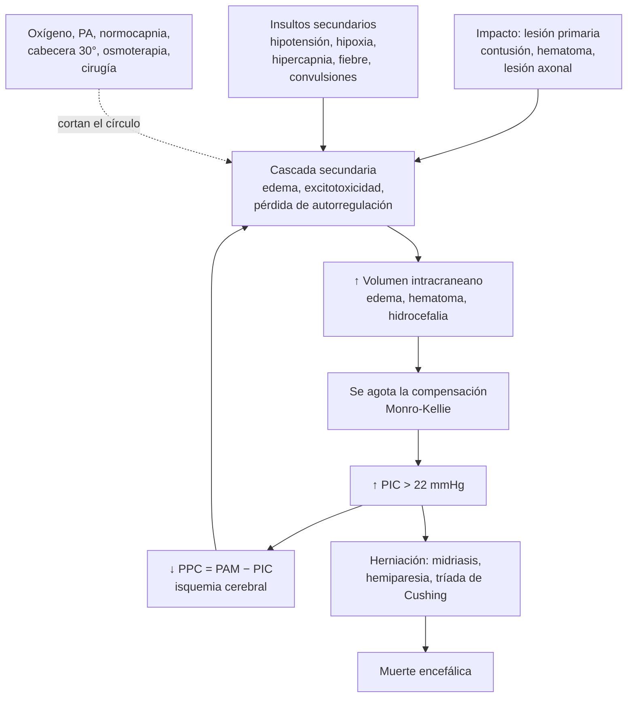

---
tags:
  - Neurología
  - GES
  - Urgencia
---

# Traumatismo encefalocraneano e hipertensión endocraneana

**Subespecialidad**
Neurología · Neurocirugía · Medicina intensiva · Medicina de urgencia

**Guías principales**
Brain Trauma Foundation 2016 (4.ª edición): TEC grave · SIBICC 2019: algoritmo de manejo de la presión intracraneana · MINSAL 2013: guía GES del TEC moderado o grave · Regla canadiense de TC de cráneo · Guía de la European Headache Federation 2018: hipertensión intracraneana idiopática

**Otras fuentes**
CRASH-3 (ácido tranexámico, *Lancet* 2019) · MRC CRASH (corticoides, *Lancet* 2004) · Nueva caracterización del TEC agudo NIH-NINDS (CBI-M, *Lancet Neurol* 2025)

**GES**
Sí: **TEC moderado o grave** (N.° 49) y **politraumatizado grave** (N.° 48), a cualquier edad

**EUNACOM**
1.10.2.009 Hipertensión endocraneana (sospecha, inicial, derivar) · 1.10.2.019 Traumatismo encéfalo craneano leve (específico, completo, completo) · 1.10.2.020 Traumatismo encefalocraneano grave (sospecha, inicial, no requiere)

**Revisado**
Septiembre 2026

!!! abstract "Resumen en 60 segundos"
    - **Clasificar con la escala de Glasgow (GCS)** tras la reanimación: **leve 13–15** (MINSAL: 14–15), **moderado 9–12**, **grave ≤ 8**. Anotar siempre las **pupilas**.
    - **TEC leve**:
        - Usar una **regla de decisión** (canadiense) para pedir la **TC**.
        - Pedir **TC siempre** si el paciente usa **anticoagulantes**, es **≥ 65 años**, tiene GCS < 15 a las 2 h, vómitos repetidos o signos de fractura.
        - Con TC normal y buena evolución: **alta** con un observador e instrucciones de alarma.
    - **TEC grave**: el daño que se puede prevenir es la **lesión secundaria**.
        - **Evitar la hipoxemia** (SatO2 ≥ 95 %) y la **hipotensión** (PAS ≥ 100–110 mmHg): una sola hipotensión aumenta la mortalidad.
        - **Intubar si GCS ≤ 8**; **normocapnia** (PaCO2 35–40 mmHg); cabecera a 30°.
        - **TC urgente** y **neurocirugía** (hematoma epidural o subdural con efecto de masa).
        - Presión intracraneana **< 22 mmHg** y presión de perfusión cerebral de **60–70 mmHg**.
    - **Ácido tranexámico** dentro de **3 h** en el TEC leve a moderado con hemorragia intracraneal (CRASH-3). **Corticoides: no** en el TEC.
    - **Hipertensión endocraneana**: cefalea matinal que empeora al acostarse, **vómitos**, **edema de papila**, **parálisis del VI par**, compromiso de conciencia.
        - **Tríada de Cushing** (HTA, **bradicardia**, respiración irregular) = herniación inminente.
        - **Manitol** o **suero hipertónico**; hiperventilación sólo breve, como puente a la cirugía.

## Definición

- **Traumatismo encefalocraneano (TEC)**: alteración de la función cerebral u otra evidencia de patología cerebral causada por una **fuerza externa** (golpe, aceleración-desaceleración, penetración, onda expansiva).
    - **Lesión primaria**: ocurre en el momento del impacto (contusión, laceración, lesión axonal, hematoma).
    - **Lesión secundaria**: ocurre en las horas y días siguientes por **hipoxia**, **hipotensión**, **hipertensión intracraneana**, convulsiones, fiebre, alteraciones de la glicemia y el sodio. **Es la que se puede prevenir.**
- **Conmoción cerebral (concusión)**: TEC leve con alteración **transitoria** de la función cerebral (confusión, amnesia, pérdida breve de conciencia) sin lesión estructural en la TC.
- **Hipertensión endocraneana (HTE)**: presión intracraneana (PIC) sostenida **> 20–22 mmHg** (normal en el adulto: 5–15 mmHg).
    - **Presión de perfusión cerebral (PPC) = PAM − PIC**.
    - **Doctrina de Monro-Kellie**: el cráneo es un compartimento rígido con 3 componentes (cerebro ~ 80 %, sangre ~ 10 %, LCR ~ 10 %). Si uno aumenta, los otros deben disminuir; cuando se agota la compensación, pequeños aumentos de volumen elevan mucho la PIC.
- **Hipertensión intracraneana idiopática** (seudotumor cerebral): PIC alta **sin** masa, hidrocefalia ni otra causa, típica de mujeres jóvenes con **obesidad**.

## Epidemiología

### Mundial

- El TEC es una de las principales causas de **muerte y discapacidad** en los **jóvenes** (accidentes de tránsito, violencia, deportes) y, cada vez más, en los **adultos mayores** (**caídas**, a menudo con **anticoagulantes o antiagregantes**).
- **~ 70 %** de los TEC es **leve**, ~ 20 % moderado y ~ 10 % grave. Entre los pacientes con TEC leve o moderado, **8–22 %** tiene lesiones en la TC, pero sólo **0,3–4 %** requiere cirugía (MINSAL 2013).
- La mortalidad del **TEC grave** es alta (del orden de **30–40 %**) y muchos sobrevivientes quedan con **secuelas** cognitivas, conductuales y motoras.

### Chile

!!! chile "Contexto nacional"
    - El **TEC** es la causa de muerte en **~ 40 %** de los **accidentes de tránsito fatales** en Chile (otro 40 % corresponde a politraumatizados) (MINSAL 2013).
    - En los **niños**, el TEC representa el **3 %** de las consultas de urgencia (**280 por 100.000**); más de la mitad son accidentes **domésticos**, y causa **~ 1/3** de las muertes por trauma en los menores de 18 años.
    - **GES N.° 49 (TEC moderado o grave)**: garantiza la atención de urgencia desde la **sospecha** por un médico, a **cualquier edad**, con derivación a un centro con **neurocirugía**. El **politraumatizado grave** tiene el GES N.° 48.
    - La guía MINSAL 2013 usa 4 escenarios en el adulto: **GCS 15**, **13–14**, **9–12** y **≤ 8**.

## Etiología

| Condición | Causas |
|---|---|
| **TEC** | **Accidentes de tránsito** (peatones, motociclistas, ciclistas sin casco), **caídas** (adultos mayores, alcohol), **agresiones**, deportes, **maltrato infantil**, lesiones por arma |
| **Lesiones focales** | **Hematoma epidural** (fractura temporal con rotura de la **arteria meníngea media**), **hematoma subdural** (rotura de las **venas puente**; adultos mayores, alcohólicos, anticoagulados), **contusión**, hematoma intraparenquimatoso |
| **Lesiones difusas** | **Lesión axonal difusa** (aceleración-desaceleración), **hemorragia subaracnoidea traumática**, edema cerebral difuso |
| **Hipertensión endocraneana** | **Lesiones con efecto de masa** (hematomas, tumores, abscesos), **edema** (TEC, ACV extenso, encefalopatía hepática por insuficiencia hepática aguda, hiponatremia aguda, encefalopatía hipertensiva), **hidrocefalia** (HSA, tumores de fosa posterior), **trombosis venosa cerebral**, meningitis y encefalitis, **hipertensión intracraneana idiopática** |

## Fisiopatología

1. **Lesión primaria** en el impacto → **cascada secundaria**: excitotoxicidad (glutamato), falla energética, inflamación, **edema** (citotóxico y vasogénico) y pérdida de la **autorregulación** cerebral.
2. Sin autorregulación, el flujo cerebral depende directamente de la **PAM**: la **hipotensión** produce **isquemia** y la HTA grave aumenta el edema.
3. **Hipoxemia**, **hipercapnia** (vasodilatación → más volumen sanguíneo → más PIC) e **hipocapnia** excesiva (vasoconstricción → isquemia) empeoran la lesión.
4. Cuando se agota la compensación (Monro-Kellie), la PIC sube, la **PPC cae** (isquemia) y el cerebro se desplaza: **herniación**.
    - **Uncal (transtentorial lateral)**: el uncus comprime el **III par** (**midriasis ipsilateral** arrefléctica) y el pedúnculo cerebral (**hemiparesia contralateral**), con compromiso de conciencia.
    - **Central**: deterioro de conciencia progresivo, pupilas pequeñas y luego fijas, postura de decorticación y descerebración.
    - **Subfalcina**: compresión de la arteria cerebral anterior.
    - **Amigdalina** (foramen magno): compresión del bulbo → **paro respiratorio**.
5. **Reflejo de Cushing**: la isquemia del tronco eleva la PA para mantener la perfusión, con **bradicardia** refleja y respiración irregular.

*Figura 1. Fisiopatología del TEC y la hipertensión endocraneana: el círculo vicioso entre la PIC alta, la caída de la perfusión y la isquemia. Esquema propio.*

## Clasificación

- **Por la escala de Glasgow** (evaluada **después** de la reanimación y sin sedación):

| Componente | Puntaje |
|---|---|
| **Apertura ocular (O)** | 4 espontánea · 3 al llamado · 2 al dolor · 1 no abre |
| **Respuesta verbal (V)** | 5 orientado · 4 confuso · 3 palabras inapropiadas · 2 sonidos incomprensibles · 1 no habla |
| **Respuesta motora (M)** | 6 obedece órdenes · 5 localiza el dolor · 4 retira · 3 flexión anormal (decorticación) · 2 extensión (descerebración) · 1 no responde |

| Gravedad | GCS |
|---|---|
| **Leve** | **13–15** (MINSAL: 14–15) |
| **Moderado** | **9–12** (MINSAL: 9–13) |
| **Grave** | **3–8** |

- Anotar el puntaje **desglosado** (por ejemplo, O2 V3 M5 = 10) y la **reactividad pupilar**. La **respuesta motora** es el componente con mayor valor pronóstico.
- **Nueva caracterización NIH-NINDS (2025)**: además de la GCS completa y las pupilas (pilar **clínico**), incorpora **biomarcadores** en sangre, **imágenes** y **modificadores** (edad, anticoagulación, intoxicación, comorbilidades): marco **CBI-M**.
- **Por el tipo de lesión**: focal (hematomas epidural, subdural, intraparenquimatoso; contusión) o difusa (lesión axonal difusa, edema, HSA traumática) (Figura 2).

<figure markdown>
![Tres cortes axiales esquemáticos de TC de cráneo sobre fondo negro. A la izquierda, un hematoma epidural blanco con forma de lente biconvexa en la convexidad derecha, con desviación leve de la línea media. Al centro, un hematoma subdural agudo blanco con forma de semiluna a lo largo de toda la convexidad izquierda, con desviación de la línea media. A la derecha, focos blancos de contusión rodeados de un halo de edema y líneas blancas en los surcos que representan una hemorragia subaracnoidea traumática](../assets/figuras/neuro/hematomas-tc.svg){ loading=lazy }
<figcaption>Figura 2. Lesiones intracraneales traumáticas en la TC: hematoma epidural (lente biconvexa), hematoma subdural agudo (semiluna) y contusiones con hemorragia subaracnoidea traumática. Esquema propio.</figcaption>
</figure>

## Clínica

- **TEC leve**: pérdida breve de conciencia, **amnesia** del evento, confusión, cefalea, náuseas y vómitos, mareo. **Síntomas posconcusionales** (cefalea, mareo, dificultad de concentración, irritabilidad, insomnio) que pueden durar semanas.
- **Signos de fractura de la base del cráneo**: **hemotímpano**, **equimosis periorbitaria** ("ojos de mapache"), **equimosis retroauricular** (signo de Battle), **otorraquia o rinorraquia** (LCR).
- **Hematoma epidural**: clásicamente pérdida de conciencia breve, **intervalo lúcido** y luego deterioro rápido (horas) con midriasis ipsilateral y hemiparesia: **urgencia quirúrgica**.
- **Hematoma subdural agudo**: deterioro de conciencia desde el inicio en el TEC de alta energía; en el adulto mayor anticoagulado puede ocurrir con un trauma **menor**.
- **Hematoma subdural crónico**: adulto mayor, alcohólico o anticoagulado, con **cefalea**, confusión, **deterioro cognitivo** o hemiparesia progresivos en semanas, a veces sin trauma recordado.
- **Hipertensión endocraneana**:
    - **Cefalea** que empeora en la **mañana**, al acostarse, con la tos o la maniobra de Valsalva.
    - **Vómitos** (a veces "en proyectil"), **edema de papila** (fondo de ojo), **diplopía** por **parálisis del VI par** (signo de falsa localización).
    - **Compromiso de conciencia** progresivo.
    - **Tríada de Cushing**: **HTA**, **bradicardia** y **respiración irregular**: signo tardío de herniación.
- **Hipertensión intracraneana idiopática**: mujer joven con **obesidad**, cefalea diaria, **oscurecimientos visuales** transitorios, **tinnitus pulsátil**, diplopía, **edema de papila** bilateral; examen neurológico por lo demás normal.

!!! alarma "Signos de alarma en el TEC y la HTE"
    - **Caída de 2 o más puntos en la GCS**, **GCS ≤ 8**.
    - **Anisocoria** o **midriasis** arrefléctica, **hemiparesia** nueva.
    - **Tríada de Cushing** (HTA + bradicardia + respiración irregular).
    - **Convulsiones**, vómitos repetidos, cefalea que empeora.
    - **Signos de fractura de la base o de fractura deprimida o abierta**.
    - **Anticoagulados** (incluso con un trauma menor y GCS 15).
    - **Intervalo lúcido** seguido de deterioro: hematoma epidural.

## Diagnóstico

**TEC grave o moderado (GCS ≤ 12)**:

1. **ABCDE** con **restricción del movimiento cervical** (lesión cervical asociada en ~ 5 %; ver [debilidad aguda y trauma raquimedular](debilidad-aguda-guillain-barre-y-mielopatias.md)).
2. **GCS y pupilas** tras la reanimación.
3. **TC de cerebro sin contraste urgente** (y de columna cervical según las reglas).
4. **Evaluación neuroquirúrgica urgente** en todo paciente con **GCS ≤ 8** o con lesión quirúrgica (MINSAL).
5. GCS **9–12**: hospitalizar en una **unidad de pacientes críticos**, observar y repetir la TC si hay deterioro.

**TEC leve (GCS 13–15)**: indicar la **TC** según una regla de decisión.

!!! guia "Regla canadiense de TC de cráneo (Stiell, 2001)"
    Se aplica a pacientes con **TEC leve** (GCS 13–15) con pérdida de conciencia, amnesia o desorientación presenciadas. **No** se aplica a los menores de 16 años, los **anticoagulados** ni a quienes tuvieron una **convulsión** (en ellos, **TC directa**).

    - **Alto riesgo** (de requerir neurocirugía): TC si hay:
        1. **GCS < 15 a las 2 horas** del trauma.
        2. Sospecha de **fractura abierta o deprimida**.
        3. Cualquier **signo de fractura de la base** del cráneo.
        4. **Vómitos ≥ 2 episodios**.
        5. **Edad ≥ 65 años**.
    - **Riesgo medio** (de lesión en la TC): TC si hay:
        1. **Amnesia retrógrada ≥ 30 minutos**.
        2. **Mecanismo peligroso**: peatón atropellado, eyección del vehículo, caída de más de 1 metro o 5 escalones.

- **Anticoagulados** (AVK, ACOD): **TC en todos**, aunque tengan GCS 15 (idealmente en las primeras horas); considerar repetirla u observarlos si hay factores de riesgo.
- **Sin factores de riesgo y TC normal** (o sin indicación de TC): **observación** y **alta** con un adulto responsable e instrucciones escritas. La guía MINSAL 2013 aún menciona la radiografía de cráneo en los pacientes sin factores de riesgo; en la práctica actual, las **reglas de decisión** para la TC la han reemplazado.

**Hipertensión endocraneana**:

- **Fondo de ojo** (edema de papila), examen neurológico y **TC** (masa, edema, hidrocefalia, desviación de la línea media, borramiento de las cisternas). **RM y venografía** si se sospecha una trombosis venosa o una hipertensión intracraneana idiopática.
- **La punción lumbar está contraindicada** si hay efecto de masa o hidrocefalia obstructiva (riesgo de herniación): primero la **TC**.
- **Monitoreo de la PIC** (catéter intraventricular o intraparenquimatoso) en el TEC grave con TC anormal (BTF 2016). La **ecografía de la vaina del nervio óptico** (diámetro aumentado) es un apoyo no invasivo.
- **Hipertensión intracraneana idiopática** (criterios de Friedman, EHF 2018): edema de papila, examen neurológico normal (salvo el VI par), **RM y venografía normales**, LCR de composición normal y **presión de apertura ≥ 25 cmH2O** en el adulto.

## Laboratorio

| Examen | Uso |
|---|---|
| **Glicemia capilar** | Descartar la hipoglicemia en todo compromiso de conciencia; meta **110–180 mg/dL** (MINSAL: evitar > 180) |
| **Hemograma, grupo y Rh** | Politrauma, preparación quirúrgica |
| **Coagulación (TP/INR, TTPa, plaquetas, fibrinógeno)** | **Coagulopatía** traumática (frecuente en el TEC grave), anticoagulantes |
| **Electrolitos, osmolaridad** | **Sodio** (evitar la hiponatremia: empeora el edema; SIADH y síndrome perdedor de sal), control de la **osmoterapia** |
| **Gases arteriales** | **PaO2 > 60–100 mmHg**, **PaCO2 35–40 mmHg** |
| **Alcoholemia y toxicológico** | La intoxicación **no debe atribuirse** al deterioro de conciencia sin descartar una lesión |
| **Biomarcadores (GFAP, UCH-L1)** | En algunos centros, ayudan a decidir la TC en el TEC leve (un resultado negativo hace improbable una lesión en la TC) |

## Imágenes

- **TC de cerebro sin contraste**: el examen inicial en el TEC y la sospecha de HTE. Distingue:
    - **Hematoma epidural**: **biconvexo** (lente), **no cruza las suturas**.
    - **Hematoma subdural agudo**: en **semiluna**, **cruza las suturas**; el crónico es hipodenso.
    - **Contusiones** (lóbulos frontales y temporales), **HSA traumática**, lesión axonal (a menudo con TC casi normal y GCS muy bajo).
    - **Signos de HTE**: desviación de la línea media, borramiento de los surcos y las **cisternas basales**, compresión ventricular, hidrocefalia.
- **TC de columna cervical**: en todo TEC grave o con mecanismo de riesgo.
- **RM de cerebro**: lesión axonal difusa, trombosis venosa (venografía), hipertensión intracraneana idiopática.
- **Angio-TC**: sospecha de lesión vascular (disección carotídea o vertebral).

## Diagnóstico diferencial

| Cuadro | Claves |
|---|---|
| **Intoxicación** (alcohol, drogas) | Puede coexistir con el TEC: nunca atribuir el compromiso de conciencia sólo al alcohol sin TC |
| **Hipoglicemia** | Glicemia capilar |
| **ACV o HSA espontánea con caída secundaria** | La caída fue consecuencia (síncope o déficit previo); aneurisma en la angio-TC (ver [ACV](accidente-cerebrovascular.md)) |
| **Estado posictal** | Convulsión previa no presenciada; mordedura de lengua (ver [crisis epiléptica](crisis-epileptica-y-estado-epileptico.md)) |
| **Hematoma subdural crónico vs demencia o delirium** | Deterioro subagudo con focalidad; TC |
| **Causas de HTE sin trauma** | Tumor, absceso, meningitis (ver [meningitis](../infectologia/meningitis-y-encefalitis.md)), trombosis venosa, encefalopatía hepática aguda, hiponatremia aguda |
| **Cefalea con edema de papila** | Hipertensión intracraneana idiopática vs **trombosis venosa cerebral** (venografía) vs tumor (ver [cefalea](cefalea.md)) |

## Tratamiento

### TEC leve

- **Observación** (4–6 h desde el trauma si la TC es normal y el paciente evoluciona bien; MINSAL) o **hospitalización** si hay lesión en la TC, anticoagulación, intoxicación importante o no hay un observador confiable.
- **Analgesia** con paracetamol (evitar los AINE y la aspirina las primeras 24–48 h si hay riesgo de sangrado).
- **Instrucciones de alta** (por escrito): consultar si hay **cefalea que empeora**, **vómitos repetidos**, **somnolencia** o dificultad para despertar, **confusión**, debilidad, convulsiones, salida de líquido por la nariz o el oído.
- **Conmoción**: reposo relativo por **24–48 h** y luego **retorno gradual** a la actividad cognitiva y física; no volver al deporte de contacto hasta estar asintomático.
- **Anticoagulados con hemorragia intracraneal**: **revertir** de inmediato (ver [coagulopatías](../hematologia/coagulopatias-cid-y-reversion-de-anticoagulantes.md)).

### TEC moderado y grave

!!! guia "Brain Trauma Foundation 2016 y MINSAL 2013"
    - **ABCDE**: el manejo inicial está orientado a la reanimación del traumatizado. Es preferible **estabilizar** la vía aérea y la hemodinamia **antes del traslado** al centro neuroquirúrgico.
    - **Intubar a todos los pacientes con GCS ≤ 8** (MINSAL).
    - **Oxigenación**: **SatO2 ≥ 95 %** (MINSAL); evitar la PaO2 < 60 mmHg.
    - **Ventilación**: **normocapnia** (**PaCO2 35–40 mmHg**). La **hiperventilación profiláctica** (PaCO2 ≤ 25 mmHg) **no se recomienda**.
    - **Presión arterial** (BTF): **PAS ≥ 100 mmHg** entre los 50 y 69 años y **≥ 110 mmHg** entre los 15 y 49 años o en los > 70 años. MINSAL: **PAM ≥ 80 mmHg**. El TEC **aislado no causa hipotensión**: buscar otra causa (hemorragia, shock neurogénico).
    - **PIC**: tratar si es **> 22 mmHg**. **PPC** objetivo **60–70 mmHg**.
    - **Profilaxis anticonvulsivante por 7 días** en el TEC grave (previene las convulsiones **tempranas**, no las tardías).
    - **Corticoides: contraindicados** en el TEC (en MRC CRASH aumentaron la mortalidad).
    - **Hipotermia profiláctica**: no recomendada; mantener la **normotermia**.
    - **Glicemia**: evitar > 180 mg/dL; **tromboprofilaxis** cuando la hemorragia esté estable; **nutrición** precoz; kinesiterapia.
    - **Cirugía**: evacuación de los hematomas con **efecto de masa** (en general, **epidural > 30 cm³** o **subdural** con espesor **> 10 mm** o desviación de la línea media **> 5 mm**, o con deterioro); **craniectomía descompresiva** en la HTE refractaria (decisión del neurocirujano).

!!! dosis "Ácido tranexámico en el TEC (CRASH-3)"
    - **1 g EV en 10 min** y luego **1 g EV en 8 h**, **dentro de las 3 horas** del trauma, en los adultos con TEC con **hemorragia intracraneal** en la TC o **GCS ≤ 12**, sin sangrado extracraneal mayor.
    - En CRASH-3, redujo la **muerte por TEC** en el TEC **leve a moderado** (RR **0,78**), **no** en el grave; el beneficio es mayor cuanto **más precoz**. No aumentó los eventos trombóticos ni las convulsiones.

### Hipertensión endocraneana

!!! guia "Manejo escalonado de la PIC (SIBICC 2019)"
    - **Medidas generales (a todos)**: **cabecera a 30°**, cuello **neutro** (sin compresión de las yugulares; soltar el collar si aprieta), **analgesia y sedación** adecuadas, **normotermia**, normoglicemia, **natremia normal-alta**, evitar la hipotensión y la hipoxia, tratar las convulsiones, PaCO2 35–40.
    - **Nivel 1**: aumentar la sedación y la analgesia, **drenaje de LCR** (si hay catéter ventricular), **osmoterapia** en bolos (manitol o suero hipertónico), PaCO2 en el rango bajo de la normalidad (35–38 mmHg).
    - **Nivel 2**: **hiperventilación leve** (PaCO2 32–35 mmHg), bloqueo neuromuscular, prueba de aumento de la PAM para evaluar la autorregulación.
    - **Nivel 3**: **coma barbitúrico**, **craniectomía descompresiva**, hipotermia leve (35–36 °C).
    - **Hiperventilación intensa** (PaCO2 < 30): sólo **transitoria**, como puente a la cirugía en la herniación inminente.

!!! dosis "Osmoterapia y otras medidas"
    - **Manitol 20 %**: **0,25–1 g/kg EV** en 15–20 min (1 g/kg = 5 mL/kg de manitol al 20 %). Es diurético: **reponer volumen** y evitarlo en la hipotensión. Controlar la **osmolaridad** (suspender si es > 320 mOsm/kg) o la brecha osmolar.
    - **Suero salino hipertónico**: **NaCl 3 %** en bolo de **2–5 mL/kg** (o 250 mL en el adulto; MINSAL pediátrico: 5 mL/kg); **NaCl 7,5 % o 23,4 %** en volúmenes pequeños por vía venosa central. Meta de sodio **145–155 mEq/L**. Preferido si hay **hipotensión** o hiponatremia.
    - **Dexametasona**: **10 mg EV y luego 4 mg cada 6 h** sólo en el **edema vasogénico** de los **tumores** y los abscesos; **no** en el TEC, el ACV ni la hemorragia intracerebral.
    - **Hipertensión intracraneana idiopática** (EHF 2018): **bajar de peso** (el tratamiento que modifica la enfermedad), **acetazolamida** (por ejemplo, 250–500 mg cada 12 h, aumentando según la tolerancia) o **topiramato**; **cirugía urgente** (derivación de LCR, *stent* del seno venoso, fenestración de la vaina del nervio óptico) si hay **pérdida visual** progresiva. Control **oftalmológico** estrecho.

## Complicaciones

- **Tempranas**: herniación, **HTE refractaria**, convulsiones, **coagulopatía**, neumonía aspirativa y asociada a la ventilación, **hiponatremia** (SIADH, síndrome perdedor de sal cerebral), diabetes insípida central, hipertermia de origen central, TVP y TEP.
- **Fístula de LCR** y **meningitis** (fracturas de la base), hidrocefalia.
- **Tardías**: **epilepsia postraumática**, **hematoma subdural crónico**, síndrome posconcusional, déficit cognitivo, cambios de conducta, depresión, trastornos del sueño; **encefalopatía traumática crónica** en los traumatismos repetidos (deportes de contacto).
- **Hipertensión intracraneana idiopática**: **pérdida visual permanente** si no se trata.

## Pronóstico y seguimiento

- **TEC leve**: la mayoría se recupera en días a semanas; una minoría persiste con **síntomas posconcusionales** por meses.
- **TEC grave**: mortalidad del orden de **30–40 %**. **Peor pronóstico**: **edad avanzada**, **GCS motor bajo**, **pupilas no reactivas**, hipotensión e hipoxia, lesiones en la TC (cisternas borradas, HSA traumática, desviación de la línea media), **coagulopatía**.
- **Rehabilitación** precoz y prolongada (neurológica, cognitiva, ocupacional), apoyo a la familia.
- **Perfil EUNACOM**:
    - **TEC leve**: **diagnóstico específico**, **tratamiento completo** (indicación correcta de la TC, observación, instrucciones de alta) y **seguimiento**.
    - **TEC grave**: **sospecha** y **tratamiento inicial** (ABCDE, intubación si GCS ≤ 8, evitar la hipoxia y la hipotensión, TC y neurocirugía urgentes; GES N.° 49).
    - **Hipertensión endocraneana**: **sospecha**, tratamiento inicial (cabecera, osmoterapia, evitar la punción lumbar antes de la TC) y **derivación**.

## Perlas para el internado

!!! perla "Para la sala y el turno"
    - **Registra la GCS desglosada y las pupilas** en cada evaluación: la tendencia importa más que el número aislado.
    - **Un solo episodio de hipotensión o de hipoxia empeora mucho el pronóstico del TEC grave**: la primera hora se gana con el ABC, no con la TC.
    - **El TEC no produce hipotensión**: si el paciente está hipotenso, busca la hemorragia (o el shock neurogénico).
    - **Anticoagulado que se cae = TC**, aunque esté "perfecto".
    - **Adulto mayor con confusión o hemiparesia progresiva en semanas**: piensa en un **hematoma subdural crónico**.
    - **Nunca atribuyas el compromiso de conciencia sólo al alcohol.**
    - **Intervalo lúcido** + deterioro + midriasis = **epidural**: neurocirugía ya.
    - **Tríada de Cushing** = herniación: cabecera a 30°, **manitol o suero hipertónico**, hiperventilación breve y pabellón.
    - **Punción lumbar sólo después de la TC** si hay signos de HTE o focalidad.
    - **Corticoides en el TEC: no.** Sí en el edema de un tumor.
    - Mujer joven con obesidad, cefalea y **edema de papila** con TC normal: **hipertensión intracraneana idiopática** (y descarta una trombosis venosa).

## Preguntas de repaso

??? repaso "1. Mujer de 72 años, usuaria de apixabán por FA, que se cae en su casa y se golpea la cabeza. GCS 15, sin pérdida de conciencia, sin vómitos. ¿Le pides una TC?"
    **Sí.** Los pacientes **anticoagulados** quedan **excluidos** de las reglas de decisión y requieren **TC** aunque tengan GCS 15 (además, tiene ≥ 65 años, un criterio de alto riesgo de la regla canadiense).

    - Si la TC es normal: observación según el protocolo (y reevaluar si aparecen síntomas); instrucciones de alarma.
    - Si hay **hemorragia intracraneal**: **revertir el apixabán** (CCP de 4 factores 50 U/kg), control de la PA y evaluación neuroquirúrgica.

??? repaso "2. Hombre de 25 años, motociclista, con GCS 7 (O1 V2 M4), SatO2 88 %, PA 85/50 y FC 130 tras un accidente. ¿Cuáles son tus prioridades?"
    **TEC grave con insultos secundarios** (hipoxemia e hipotensión) que hay que corregir de inmediato.

    1. **Vía aérea**: **intubación** (GCS ≤ 8) con **estabilización cervical en línea**; meta de **SatO2 ≥ 95 %** y **PaCO2 35–40 mmHg**.
    2. **Circulación**: la hipotensión **no** es por el TEC: buscar una **hemorragia** (FAST, pelvis, tórax) y reponer volumen o sangre; meta de **PAS ≥ 110 mmHg** (o PAM ≥ 80).
    3. **Ácido tranexámico** si está dentro de las 3 h.
    4. **TC de cerebro y de columna cervical** una vez estabilizado; **neurocirugía** urgente (GES N.° 49).
    5. Cabecera a 30°, sedación, normotermia, glicemia 110–180 y profilaxis anticonvulsivante.

??? repaso "3. En la TC de un paciente con TEC ves una lesión hiperdensa biconvexa en la región temporal que no cruza las suturas. ¿Qué es y qué esperas clínicamente?"
    **Hematoma epidural**, habitualmente por una **fractura temporal** con rotura de la **arteria meníngea media**.

    - Clínica clásica: pérdida de conciencia breve, **intervalo lúcido** y luego **deterioro rápido** con **midriasis ipsilateral** y **hemiparesia contralateral** (herniación uncal).
    - Tratamiento: **evacuación quirúrgica urgente** si tiene efecto de masa o deterioro. Con cirugía precoz, el pronóstico es bueno.

??? repaso "4. Paciente con un tumor cerebral conocido que se presenta con cefalea intensa, vómitos, somnolencia, PA 190/100, FC 48 y respiración irregular. ¿Qué está pasando y qué haces?"
    **Hipertensión endocraneana con tríada de Cushing**: **herniación inminente**.

    - **Cabecera a 30°**, cuello neutro, vía aérea (intubar si GCS ≤ 8).
    - **Osmoterapia**: **manitol 1 g/kg** o **suero hipertónico al 3 %** (250 mL).
    - **Hiperventilación breve** (PaCO2 30–35) sólo como puente.
    - **Dexametasona 10 mg EV** (edema vasogénico tumoral).
    - **No** bajar la PA agresivamente (mantiene la perfusión cerebral).
    - **TC urgente** y **neurocirugía**.

??? repaso "5. Hombre de 30 años con un TEC leve (GCS 15, TC normal) que va a ser dado de alta. ¿Qué le indicas?"
    - Alta con un **adulto responsable** que lo observe las primeras 24 h.
    - **Instrucciones escritas** de consultar ante: cefalea que empeora, **vómitos** repetidos, **somnolencia** o dificultad para despertar, **confusión**, debilidad o adormecimiento, alteraciones de la visión o del habla, **convulsiones**, salida de líquido por la nariz o el oído.
    - **Paracetamol** para la cefalea.
    - **Reposo relativo por 24–48 h** y retorno gradual; no manejar ni hacer deportes de contacto hasta estar asintomático.
    - Advertir sobre los síntomas posconcusionales (pueden durar semanas).

??? repaso "6. ¿Qué medidas generales aplicas a todo paciente con hipertensión endocraneana, y qué NO debes hacer?"
    - **Sí**: cabecera a **30°**, cuello neutro, **analgesia y sedación**, **normotermia**, normoglicemia, **sodio normal-alto**, evitar la **hipotensión** y la **hipoxia**, **PaCO2 35–40**, tratar las convulsiones; osmoterapia según la PIC o los signos clínicos.
    - **No**: **punción lumbar** antes de la TC si hay efecto de masa; **hiperventilación prolongada**; **corticoides** en el TEC; sueros **hipotónicos** (glucosado al 5 %), que empeoran el edema; bajar la PA en forma brusca.

## Referencias

1. Carney N, Totten AM, O'Reilly C, et al. Guidelines for the Management of Severe Traumatic Brain Injury, Fourth Edition. *Neurosurgery.* 2017;80:6–15. doi:[10.1227/NEU.0000000000001432](https://doi.org/10.1227/NEU.0000000000001432)
2. Hawryluk GWJ, Aguilera S, Buki A, et al. A management algorithm for patients with intracranial pressure monitoring: the Seattle International Severe Traumatic Brain Injury Consensus Conference (SIBICC). *Intensive Care Med.* 2019;45:1783–1794. doi:[10.1007/s00134-019-05805-9](https://doi.org/10.1007/s00134-019-05805-9)
3. Ministerio de Salud de Chile. Guía de práctica clínica AUGE: traumatismo cráneo encefálico moderado o grave. Santiago: MINSAL; 2013. [diprece.minsal.cl](https://diprece.minsal.cl/wrdprss_minsal/wp-content/uploads/2014/12/Traumatismo-Cr%C3%A1neoencefalico.pdf)
4. Stiell IG, Wells GA, Vandemheen K, et al. The Canadian CT Head Rule for patients with minor head injury. *Lancet.* 2001;357:1391–1396. doi:[10.1016/s0140-6736(00)04561-x](https://doi.org/10.1016/s0140-6736(00)04561-x)
5. CRASH-3 trial collaborators. Effects of tranexamic acid on death, disability, vascular occlusive events and other morbidities in patients with acute traumatic brain injury (CRASH-3): a randomised, placebo-controlled trial. *Lancet.* 2019;394:1713–1723. doi:[10.1016/S0140-6736(19)32233-0](https://doi.org/10.1016/S0140-6736(19)32233-0)
6. Roberts I, Yates D, Sandercock P, et al. Effect of intravenous corticosteroids on death within 14 days in 10008 adults with clinically significant head injury (MRC CRASH trial): randomised placebo-controlled trial. *Lancet.* 2004;364:1321–1328. doi:[10.1016/S0140-6736(04)17188-2](https://doi.org/10.1016/S0140-6736(04)17188-2)
7. Manley GT, Dams-O'Connor K, Alosco ML, et al. A new characterisation of acute traumatic brain injury: the NIH-NINDS TBI Classification and Nomenclature Initiative. *Lancet Neurol.* 2025;24:512–523. doi:[10.1016/S1474-4422(25)00154-1](https://doi.org/10.1016/S1474-4422(25)00154-1)
8. Hoffmann J, Mollan SP, Paemeleire K, et al. European headache federation guideline on idiopathic intracranial hypertension. *J Headache Pain.* 2018;19:93. doi:[10.1186/s10194-018-0919-2](https://doi.org/10.1186/s10194-018-0919-2)
9. Superintendencia de Salud. Problema de salud GES N.° 49: traumatismo cráneo encefálico moderado o grave. [superdesalud.gob.cl](https://www.superdesalud.gob.cl/orientacion-en-salud/traumatismo-craneo-encefalico-moderado-o-grave/)
