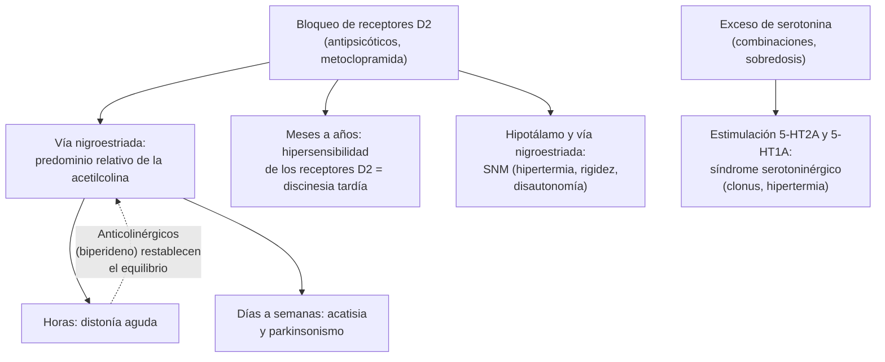

---
tags:
  - Neurología
  - Urgencia
  - Frecuente en sala
---

# Trastornos del movimiento inducidos por fármacos: distonía aguda, acatisia, parkinsonismo, discinesia tardía, síndrome neuroléptico maligno y síndrome serotoninérgico

**Subespecialidad**
Neurología · Psiquiatría · Toxicología

**Guías principales**
Actualización de las recomendaciones sobre síndromes tardíos (Bhidayasiri 2018, sobre la guía AAN 2013) · Guía canadiense de acatisia (Pringsheim 2018) · Consenso internacional de criterios del síndrome neuroléptico maligno (Gurrera 2011) · Criterios de Hunter de toxicidad serotoninérgica (Dunkley 2003) · APA 2020: esquizofrenia · EMA 2013: restricción de la metoclopramida

**Otras fuentes**
Metaanálisis de prevalencia de discinesia tardía (Carbon 2017) · Farmacovigilancia chilena de la metoclopramida (Frez 2018) y alerta del ISP 2013

**GES**
No

**EUNACOM**
1.10.2.005 Distonía aguda por fármacos, por ejemplo antieméticos (específico, completo, no requiere seguimiento) · 1.10.2.010 Movimientos anormales inducidos por fármacos (sospecha, inicial, no requiere seguimiento)

**Revisado**
Septiembre 2026

!!! abstract "Resumen en 60 segundos"
    - Los fármacos que **bloquean la dopamina** (antipsicóticos, **metoclopramida**, domperidona en menor grado, proclorperazina) causan casi todos estos cuadros.
    - **Distonía aguda**: horas o pocos días después de la primera dosis.
        - Contracciones sostenidas y dolorosas: **tortícolis**, **crisis oculógiras**, protrusión de la **lengua**, **trismus**, opistótonos. Más en **jóvenes**.
        - **Biperideno 2–5 mg IM o EV** o **difenhidramina 25–50 mg EV**: responde **en minutos**. Luego un anticolinérgico oral por 1–3 días.
        - **Laríngea** (estridor) = urgencia vital.
    - **Acatisia**: inquietud interna y motora intensa, días a semanas después. Se confunde con **agitación**; no subir el antipsicótico. **Bajar la dosis** o cambiarlo; **propranolol**.
    - **Parkinsonismo por fármacos**: bradicinesia y rigidez **simétricas**, semanas después, sobre todo en **adultos mayores**. Suspender o cambiar el fármaco.
    - **Discinesia tardía**: movimientos **orofaciales** tras **meses o años**. Prevalencia de **~ 25 %** con antipsicóticos. Puede ser **irreversible**. Los inhibidores de **VMAT2** (valbenazina, deutetrabenazina) son el tratamiento con mejor evidencia.
    - **Síndrome neuroléptico maligno**: **rigidez "en tubo de plomo"**, **fiebre**, compromiso de conciencia, **disautonomía** y **CK alta**. **Suspender** el fármaco, UCI, enfriar, hidratar, benzodiacepinas; **dantroleno** o **bromocriptina** si es grave.
    - **Síndrome serotoninérgico**: en **horas**, por **combinación** de serotoninérgicos (ISRS + tramadol, linezolid, triptanes).
        - **Clonus** (inducible, espontáneo u ocular), **hiperreflexia**, agitación, diaforesis, temblor e hipertermia (criterios de Hunter).
        - **Suspender**, benzodiacepinas y **ciproheptadina**.
    - En Chile, el **ISP** alertó en **2013** sobre la metoclopramida. En un estudio chileno se sospecharon reacciones extrapiramidales en el **35–40 %** de los usuarios crónicos (Frez 2018).

## Definición

| Síndrome | Definición |
|---|---|
| **Distonía aguda** | Contracciones musculares **sostenidas o intermitentes**, involuntarias, que producen posturas anormales, a menudo dolorosas. Aparece en horas o pocos días tras iniciar o subir un bloqueador dopaminérgico |
| **Acatisia** | Sensación **subjetiva de inquietud** con **incapacidad de quedarse quieto** (balanceo, caminar, cruzar y descruzar las piernas) |
| **Parkinsonismo por fármacos** | Bradicinesia con rigidez o temblor, causados por un fármaco, que mejoran al suspenderlo (puede tardar meses) |
| **Discinesia tardía** | Movimientos **coreiformes** repetitivos, sobre todo **orofaciales** (masticación, protrusión lingual, muecas), tras **≥ 3 meses** de exposición (≥ 1 mes en ≥ 60 años). Otros síndromes tardíos: distonía, acatisia y temblor tardíos |
| **Síndrome neuroléptico maligno (SNM)** | Reacción idiosincrática grave a los bloqueadores dopaminérgicos (o a la **suspensión** brusca de la **levodopa**): **rigidez**, **hipertermia**, alteración de conciencia, **disautonomía** y **CK elevada** |
| **Síndrome serotoninérgico** | Toxicidad por **exceso de serotonina** en el SNC y la periferia, casi siempre por **combinación** o sobredosis de fármacos serotoninérgicos |

## Epidemiología

### Mundial

- **Distonía aguda**: más frecuente en **hombres jóvenes**, con **antipsicóticos de alta potencia** (haloperidol), dosis altas y la vía **parenteral**. Con la **metoclopramida**, el riesgo es mayor en **niños y jóvenes**.
- **Discinesia tardía** (metaanálisis de 41 estudios, 11.493 pacientes; Carbon 2017):
    - Prevalencia global de **25,3 %**.
    - **20,7 %** con antipsicóticos de **segunda generación** y **30,0 %** con los de **primera generación**.
    - Más frecuente con la **edad**, la mayor duración de la enfermedad y el parkinsonismo previo.
- **Metoclopramida** (EMA 2013):
    - El riesgo de efectos neurológicos agudos es mayor en los **niños**; la **discinesia tardía**, en los **adultos mayores**, con dosis altas y el uso prolongado.
    - Por eso se restringió a **≤ 30 mg/día** (0,5 mg/kg/día) por **≤ 5 días**.
- **SNM**: raro, pero con una letalidad relevante; más riesgo con antipsicóticos de alta potencia, dosis altas o de rápido aumento, vía parenteral, **deshidratación**, **agitación** y contención física.
- **Síndrome serotoninérgico**: ha aumentado por el uso masivo de **ISRS** y de combinaciones (tramadol, triptanes, linezolid).

### Chile

!!! chile "Datos nacionales"
    - En **2013**, el **ISP** emitió una alerta sobre la **metoclopramida**, con ajustes de dosis y restricción de uso para evitar efectos adversos graves como la **discinesia tardía**.
    - **Farmacovigilancia chilena** (Frez 2018), en usuarios de **≥ 10 mg/día** de metoclopramida:
        - Se sospecharon **reacciones extrapiramidales** en el **40 %** de los diabéticos con **gastroparesia** y el **35 %** de los pacientes de **cuidados paliativos**.
        - El período de uso y las dosis **superaban** las recomendaciones del ISP en **todos** los casos.
    - En los servicios de urgencia chilenos, la **metoclopramida** (antiemético) y el **haloperidol** (agitación, delirium) son las causas habituales de distonía aguda.

## Etiología y factores de riesgo

| Grupo | Fármacos |
|---|---|
| **Antipsicóticos típicos** | **Haloperidol**, clorpromazina, flufenazina, zuclopentixol (mayor riesgo de efectos extrapiramidales) |
| **Antipsicóticos atípicos** | **Risperidona** (dosis altas), aripiprazol (acatisia), olanzapina; **quetiapina** y **clozapina** tienen el menor riesgo |
| **Antieméticos y procinéticos** | **Metoclopramida**, proclorperazina, droperidol, domperidona (poco paso al SNC, menos riesgo) |
| **Otros** | **Flunarizina** y **cinarizina** (parkinsonismo en adultos mayores), valproato (temblor, parkinsonismo), litio (temblor), ISRS (acatisia, raro), tetrabenazina |
| **Serotoninérgicos** | **ISRS** e **IRSN**, **tramadol**, **fentanilo**, **meperidina**, metadona, **dextrometorfano**, **linezolid**, azul de metileno, **IMAO**, **triptanes**, **ondansetrón**, **litio**, trazodona, **MDMA**, cocaína, hierba de San Juan |

**Factores de riesgo**:

- **Distonía aguda**: juventud, sexo masculino, antecedente de distonía, consumo de cocaína, dosis alta o parenteral.
- **Parkinsonismo y discinesia tardía**: **edad avanzada**, sexo femenino, dosis y duración de la exposición, **diabetes**, daño cerebral previo, trastornos afectivos.
- **SNM**: deshidratación, agitación, dosis altas o de rápido aumento, vía IM, antecedente de SNM, **suspensión brusca de levodopa** en la enfermedad de Parkinson.
- **Síndrome serotoninérgico**: **combinaciones** (un ISRS con tramadol, linezolid o un triptán), **cambio** de antidepresivo sin período de lavado, inhibidores del CYP2D6 o CYP3A4.

## Fisiopatología

*Figura 1. Mecanismos de los trastornos del movimiento por fármacos. Esquema propio.*

- En el **estriado**, la **dopamina** y la **acetilcolina** están en equilibrio. El bloqueo D2 deja un **exceso relativo de acetilcolina**: por eso los **anticolinérgicos** (biperideno) revierten la distonía aguda.
- En la **discinesia tardía**, el bloqueo crónico **aumenta el número y la sensibilidad** de los receptores D2. Por eso **empeora** con los anticolinérgicos y puede **empeorar al suspender** el antipsicótico.
- El **SNM** refleja un **bloqueo dopaminérgico brusco e intenso** en el hipotálamo (termorregulación) y la vía nigroestriada (rigidez).
- En el síndrome serotoninérgico, el exceso de serotonina produce **hiperexcitabilidad neuromuscular** (clonus, hiperreflexia) y **autonómica**.

<figure markdown>
{ loading=lazy }
<figcaption>Figura 2. Cronología de los síndromes por fármacos: el tiempo desde el inicio, el aumento o la combinación del fármaco orienta el diagnóstico. Esquema propio, ilustrativo.</figcaption>
</figure>

## Clasificación

| Tipo | Inicio | Cuadro | Mecanismo |
|---|---|---|---|
| **Agudo** | Horas–días | Distonía aguda, síndrome serotoninérgico | Bloqueo D2 agudo; exceso de serotonina |
| **Subagudo** | Días–semanas | Acatisia, parkinsonismo, SNM | Bloqueo D2 sostenido |
| **Tardío** | Meses–años | Discinesia, distonía, acatisia y temblor tardíos | Hipersensibilidad de receptores D2 |

## Clínica

### Distonía aguda

- **Tortícolis**, retrocolis, **crisis oculógiras** (desviación sostenida de la mirada hacia arriba), **protrusión o desviación de la lengua**, **trismus**, muecas faciales, disartria, disfagia, **opistótonos**.
- **Distonía laríngea**: estridor y disnea. Es **rara pero puede ser mortal**.
- **Conciencia conservada**, sin fiebre. El paciente está **angustiado**, y el cuadro a veces se confunde con un trastorno conversivo.
- Puede **fluctuar** o recurrir en las horas siguientes.

### Acatisia

- **Sensación interna de inquietud** ("no puedo estar quieto").
- Balanceo, caminar de un lado a otro, cambiar de posición, mover las piernas.
- **Ansiedad, irritabilidad**; se asocia a **agresividad** e **ideación suicida**.
- **Error frecuente**: interpretarla como **agitación psicótica** y **subir** el antipsicótico, lo que la empeora.

### Parkinsonismo por fármacos

- **Bradicinesia**, **rigidez**, marcha con pasos cortos, hipomimia, temblor de reposo (o postural).
- A diferencia de la enfermedad de Parkinson: **más simétrico**, inicio **subagudo**, antecedente del fármaco. Puede haber **síndrome del conejo** (temblor perioral).
- **Adultos mayores**: se confunde con una demencia o una enfermedad de Parkinson y lleva a **caídas**.

### Discinesia tardía

- Movimientos **orofaciales** involuntarios: masticación, chasquidos, **protrusión de la lengua**, fruncir los labios, muecas.
- También de las **extremidades** (coreoatetosis) y del tronco.
- Se suprime transitoriamente con la voluntad y **empeora al suspender** o bajar el antipsicótico.
- Puede persistir **años** o ser **irreversible**.

### Síndrome neuroléptico maligno

- Se desarrolla en **días** (habitualmente en las primeras semanas del fármaco o de un aumento de dosis).
- **Tétrada**:
    - **Alteración de conciencia** (a menudo el primer signo).
    - **Rigidez muscular generalizada "en tubo de plomo"**.
    - **Hipertermia** (> 38 °C).
    - **Disautonomía**: taquicardia, PA lábil, diaforesis, incontinencia.
- **CK muy elevada**, leucocitosis, mioglobinuria.
- **Complicaciones**: **rabdomiólisis**, LRA, CID, insuficiencia respiratoria, muerte.

### Síndrome serotoninérgico

- Inicio **rápido** (horas) tras iniciar, aumentar o **combinar** fármacos.
- **Tríada**:
    - **Alteración mental**: ansiedad, agitación, delirium.
    - **Hiperactividad autonómica**: taquicardia, HTA, **diaforesis**, **midriasis**, diarrea, hiperperistaltismo, hipertermia.
    - **Anomalías neuromusculares**: **clonus** (inducible, espontáneo u **ocular**), **hiperreflexia**, temblor, **mioclonías**, rigidez; más marcadas en las **extremidades inferiores**.
- **Grave**: hipertermia > 41 °C, rigidez del tronco, convulsiones, rabdomiólisis, CID.

## Diagnóstico

- El diagnóstico es **clínico**: **exposición a un fármaco** + cuadro típico + **cronología** (Figura 2).
- **Revisar siempre** la lista de fármacos: qué se **inició, aumentó, combinó o suspendió** (incluida la levodopa), y los fármacos "escondidos" (metoclopramida, flunarizina, tramadol, dextrometorfano).

!!! guia "SNM: criterios de consenso internacional (Gurrera 2011)"
    - Exposición reciente a un **antagonista dopaminérgico** (o suspensión de un agonista dopaminérgico).
    - **Hipertermia** > 38 °C en al menos 2 mediciones.
    - **Rigidez**.
    - **Alteración de conciencia**.
    - **CK ≥ 4 veces** el límite superior.
    - **Labilidad autonómica**: PA ≥ 25 % sobre la basal, o fluctuación de ≥ 20 mmHg de diastólica o ≥ 25 mmHg de sistólica en 24 h, o diaforesis, o incontinencia.
    - **Taquicardia** (≥ 25 % sobre la basal) y **taquipnea** (≥ 50 % sobre la basal).
    - **Estudio negativo** para otras causas (infecciosas, tóxicas, metabólicas, neurológicas).

!!! guia "Toxicidad serotoninérgica: criterios de Hunter (Dunkley 2003)"
    Con un **fármaco serotoninérgico**, basta **una** de estas condiciones:

    - **Clonus espontáneo**.
    - **Clonus inducible** + agitación o diaforesis.
    - **Clonus ocular** + agitación o diaforesis.
    - **Temblor** + **hiperreflexia**.
    - **Hipertonía** + temperatura > 38 °C + clonus ocular o inducible.

    Sensibilidad de **84 %** y especificidad de **97 %**, mejores que los criterios de Sternbach.

## Laboratorio

- **Distonía aguda, acatisia y parkinsonismo**: no requieren exámenes si el cuadro es típico.
- **SNM y síndrome serotoninérgico**:

| Examen | Hallazgo o utilidad |
|---|---|
| **CK** | **Muy alta** en el SNM (rabdomiólisis); también elevada en el síndrome serotoninérgico grave |
| **Creatinina**, electrolitos, **orina** (mioglobina) | LRA, hiperkalemia |
| Hemograma, PCR, **hemocultivos** | Leucocitosis en el SNM; descartar una **sepsis** |
| Pruebas hepáticas, **coagulación** | Disfunción hepática, **CID** |
| Gases y lactato | Acidosis metabólica |
| **Calcio**, magnesio, glicemia | Diferencial de rigidez y espasmos |
| TSH | Tormenta tiroidea (diferencial) |
| **Tóxicos** en orina (cocaína, anfetaminas, MDMA) y niveles (litio) | Diferencial y fármacos asociados |
| **Punción lumbar** | Si se sospecha una **meningitis o encefalitis** (fiebre y alteración de conciencia) |

## Imágenes

- **No se necesitan** en la distonía aguda típica.
- **TC o RM de cerebro** si hay **focalidad**, compromiso de conciencia sin causa clara, fiebre (antes de la punción lumbar) o una primera crisis.
- En el parkinsonismo de dudoso origen, el especialista puede pedir un **SPECT de transportador de dopamina** (DaTSCAN): **normal** en el parkinsonismo por fármacos y **alterado** en la enfermedad de Parkinson.

## Diagnóstico diferencial

| Cuadro | Claves |
|---|---|
| **Tétanos** (vs. distonía aguda con trismus) | Herida, sin fármaco, **espasmos generalizados** con estímulos, **no responde** al biperideno (ver [tétanos](../infectologia/tetanos.md)) |
| **Crisis epiléptica** (vs. crisis oculógiras) | Pérdida de conciencia, período posictal |
| **Tetania hipocalcémica** | Espasmo carpopedal, calcio bajo |
| **Trastorno conversivo** | Diagnóstico de exclusión; siempre descartar un fármaco |
| **Agitación psicótica, ansiedad, síndrome de piernas inquietas** (vs. acatisia) | La acatisia empeora con el antipsicótico; las piernas inquietas son nocturnas y alivian al moverse |
| **Enfermedad de Parkinson** (vs. parkinsonismo por fármacos) | Asimétrico, progresivo, sin fármaco; DaTSCAN alterado |
| **SNM vs. síndrome serotoninérgico** | **SNM**: días, **bradicinesia y rigidez en tubo de plomo**, **hiporreflexia**, resolución lenta (días a semanas). **Serotoninérgico**: horas, **clonus e hiperreflexia**, **midriasis**, diarrea, resolución en 24–72 h |
| **Síndrome anticolinérgico** | Piel **seca** y roja, midriasis, **retención urinaria**, íleo, sin rigidez ni clonus |
| **Hipertermia maligna** | Durante la **anestesia** (succinilcolina, halogenados) |
| **Golpe de calor, sepsis, meningitis o encefalitis, tormenta tiroidea, catatonia letal, abstinencia de alcohol o de baclofeno** | Contexto, exámenes, punción lumbar |

## Tratamiento

!!! dosis "Distonía aguda"
    - **Biperideno 2–5 mg IM o EV lento** (ampolla de 5 mg/mL), o **difenhidramina 25–50 mg EV o IM**. Mejora **en 10–30 minutos**; repetir a los 30 minutos si no responde.
    - Después, **anticolinérgico oral por 24–72 h** para evitar la recurrencia (por ejemplo, biperideno 2 mg VO c/8–12 h).
    - Alternativa: **benzodiacepina** EV (diazepam o lorazepam).
    - **Distonía laríngea**: biperideno EV, oxígeno, y preparar la **vía aérea**.
    - **Suspender o cambiar** el fármaco causal y **registrarlo** como alergia o intolerancia en la ficha.
    - **Metoclopramida**: en el adulto, **10 mg** hasta **3 veces al día** (máximo **30 mg/día** o 0,5 mg/kg/día) y **no más de 5 días** (EMA 2013). Pasar el bolo EV en **≥ 3 minutos**. Preferir otros antieméticos (ondansetrón) en los jóvenes.

!!! dosis "Acatisia (Pringsheim 2018)"
    1. **Bajar la dosis** del antipsicótico, suspender la polifarmacia antipsicótica o **cambiar** a uno con menor riesgo (quetiapina, olanzapina).
    2. Adyuvantes:
        - **Propranolol**, primera opción: **10 mg c/12 h**, subiendo según la respuesta (20–120 mg/día en los estudios).
        - **Mirtazapina 15 mg** en la noche si el propranolol está contraindicado.
        - **Clonazepam** 0,5–2,5 mg/día por un período corto.
        - **Vitamina B6** 600–1.200 mg/día por un período corto.
    3. Los **anticolinérgicos no** se recomiendan de rutina en la acatisia.

- **Parkinsonismo por fármacos**:
    - **Suspender o reducir** el fármaco (flunarizina, metoclopramida) o cambiar el antipsicótico a **quetiapina o clozapina**. La mejoría puede tardar semanas a meses.
    - **Biperideno** por un tiempo corto (evitarlo en los adultos mayores: confusión, retención urinaria), o **amantadina**.
    - La **levodopa** es poco útil y puede empeorar la psicosis.
- **Discinesia tardía** (Bhidayasiri 2018):
    - **Inhibidores de VMAT2**: **valbenazina** o **deutetrabenazina** (nivel A), según disponibilidad.
    - **Clonazepam** y *Ginkgo biloba* (nivel B). Amantadina y tetrabenazina (nivel C).
    - **Suspender los anticolinérgicos**, que la empeoran.
    - Suspender o cambiar el antipsicótico tiene evidencia insuficiente (nivel U), pero es razonable revisar la indicación con psiquiatría.
    - Estimulación cerebral profunda del globo pálido en los casos refractarios (nivel C).
    - La APA (2020) recomienda los inhibidores de VMAT2 en la discinesia tardía moderada a grave o incapacitante.

!!! dosis "Síndrome neuroléptico maligno"
    1. **Suspender** el antipsicótico (y la metoclopramida); **reiniciar la levodopa** si fue suspendida.
    2. **UCI**: **enfriamiento físico**, **hidratación EV** generosa (rabdomiólisis), corrección electrolítica, profilaxis de trombosis.
    3. **Benzodiacepinas** (lorazepam o diazepam EV) para la agitación y la rigidez leve.
    4. Casos **moderados o graves**:
        - **Dantroleno** EV (relajante muscular), habitualmente 1–2,5 mg/kg, que se puede repetir.
        - **Bromocriptina** 2,5 mg VO o por sonda c/8 h (agonista dopaminérgico), o **amantadina**.
    5. **Terapia electroconvulsiva** en los casos refractarios o con catatonia.
    6. **No reiniciar** un antipsicótico hasta **≥ 2 semanas** después de la resolución; elegir uno de baja potencia en dosis bajas, con aumento lento y vigilancia.

!!! dosis "Síndrome serotoninérgico"
    1. **Suspender todos los serotoninérgicos**.
    2. **Benzodiacepinas** para la agitación, el temblor y la taquicardia. **Evitar la contención física** (aumenta la temperatura y la rabdomiólisis).
    3. **Ciproheptadina** (antagonista 5-HT2A) si no mejora con benzodiacepinas: **12 mg VO o por sonda**, luego **2 mg c/2 h** mientras persistan los síntomas, y 8 mg c/6 h de mantención.
    4. **Hipertermia > 41 °C**: sedación, **intubación y relajación no despolarizante**. Los **antipiréticos no sirven** (la fiebre es muscular).
    5. Soporte hemodinámico. En general se resuelve en **24–72 h**.

## Complicaciones

- **Distonía**: laringoespasmo, luxación de la mandíbula, lesiones musculares, **abandono del tratamiento** psiquiátrico.
- **Acatisia**: agitación, agresividad, **suicidio**, abandono del tratamiento.
- **Parkinsonismo**: **caídas** y fracturas, disfagia con **neumonía aspirativa**, dependencia.
- **Discinesia tardía**: estigma, dificultad para comer y hablar, compromiso respiratorio (discinesia respiratoria), cronicidad.
- **SNM**: **rabdomiólisis**, **LRA**, CID, neumonía aspirativa, TEP, arritmias, **muerte**; puede recurrir si se reexpone.
- **Síndrome serotoninérgico**: hipertermia, convulsiones, rabdomiólisis, CID, SDRA, muerte.

## Pronóstico y seguimiento

- **Distonía aguda**: excelente con tratamiento. Evitar el fármaco o usar profilaxis anticolinérgica si es imprescindible.
- **Acatisia y parkinsonismo**: mejoran al retirar o cambiar el fármaco, aunque el parkinsonismo puede tardar **meses**. Si persiste, puede tratarse de una **enfermedad de Parkinson** que el fármaco desenmascaró.
- **Discinesia tardía**: prevenir es clave.
    - Usar la **menor dosis** eficaz por el menor tiempo.
    - **Evaluar movimientos anormales** (escala AIMS) antes y durante el tratamiento con antipsicóticos.
    - No usar metoclopramida por más de 5 días.
- **SNM**: recuperación en **1–2 semanas** (más con los antipsicóticos de depósito).
- **Síndrome serotoninérgico**: se resuelve en 24–72 h en la mayoría. Educar sobre las **interacciones**.

## Perlas para el internado

!!! perla "Para la sala y el turno"
    - Joven en la urgencia con **tortícolis, lengua afuera o mirada fija hacia arriba** después de un antiemético: **pregunta por la metoclopramida** y pon **biperideno**. La respuesta en minutos confirma el diagnóstico.
    - Deja un **anticolinérgico oral por 1–3 días** al alta: la distonía puede volver.
    - Paciente "agitado" que recibe un antipsicótico y **no puede quedarse quieto**: piensa en **acatisia** antes de subir la dosis.
    - Adulto mayor con **parkinsonismo reciente**: revisa la **flunarizina**, la **metoclopramida**, el haloperidol y la risperidona.
    - **Rigidez + fiebre + confusión** en un paciente con un antipsicótico: **SNM**. **Suspende** el fármaco y pide **CK**.
    - **Clonus + hiperreflexia + diarrea + midriasis** tras agregar **tramadol, linezolid o un triptán** a un ISRS: **síndrome serotoninérgico**.
    - No combines **haloperidol + metoclopramida** en un mismo paciente sin pensarlo: suman riesgo extrapiramidal.
    - **Nunca suspendas bruscamente la levodopa** a un paciente con Parkinson hospitalizado (riesgo de un síndrome similar al SNM).

## Preguntas de repaso

??? repaso "1. Mujer de 19 años que recibió metoclopramida 10 mg EV en la urgencia por vómitos. Dos horas después presenta tortícolis a la derecha, protrusión de la lengua y la mirada desviada hacia arriba. Está consciente, asustada y afebril. ¿Diagnóstico y manejo?"
    **Distonía aguda por metoclopramida** (con crisis oculógiras).

    - **Biperideno 2–5 mg IM o EV lento**, o difenhidramina 25–50 mg EV. Debe mejorar en minutos.
    - Luego **biperideno oral** por 24–72 h para evitar la recurrencia.
    - Suspender la metoclopramida y **registrarla** como reacción adversa. Usar otro antiemético (ondansetrón).
    - Vigilar la vía aérea (distonía laríngea).

??? repaso "2. Hombre de 28 años con esquizofrenia que inició haloperidol hace 10 días. Está muy inquieto, camina todo el día por la sala, dice que "siente algo por dentro que no lo deja quieto" y el equipo propone subir la dosis por agitación. ¿Qué piensas?"
    **Acatisia**, no agitación psicótica. Subir el antipsicótico la **empeoraría**.

    - **Bajar la dosis** o **cambiar** a un antipsicótico con menor riesgo (quetiapina u olanzapina), con psiquiatría.
    - **Propranolol 10 mg c/12 h**, subiendo según la respuesta. Alternativas: mirtazapina 15 mg o clonazepam por un período corto.
    - Vigilar la **ideación suicida** y la agresividad asociadas.

??? repaso "3. Mujer de 79 años que desde hace 2 meses camina lento, con pasos cortos, rigidez simétrica y temblor leve. Toma flunarizina hace 6 meses por mareos. ¿Qué sospechas y qué haces?"
    **Parkinsonismo inducido por fármacos** (flunarizina, un bloqueador dopaminérgico): simétrico, subagudo, en una adulta mayor.

    - **Suspender la flunarizina** y tratar el mareo de otra forma.
    - Evaluar el riesgo de **caídas** y dar kinesioterapia.
    - La mejoría puede tardar **semanas a meses**. Si persiste o es asimétrico, derivar a neurología (enfermedad de Parkinson desenmascarada; DaTSCAN).
    - Evitar el biperideno en adultos mayores (confusión).

??? repaso "4. Hombre de 40 años con psicosis, que recibió haloperidol IM en dosis altas hace 4 días y hoy está confuso, con rigidez generalizada en tubo de plomo, temperatura de 39,8 °C, PA lábil, taquicardia y diaforesis. CK 18.000 U/L. ¿Diagnóstico y manejo?"
    **Síndrome neuroléptico maligno** (Gurrera 2011: antagonista dopaminérgico, hipertermia, rigidez, alteración de conciencia, CK ≥ 4 veces lo normal, labilidad autonómica).

    - **Suspender** el haloperidol. **UCI**.
    - **Enfriamiento**, **hidratación EV** (rabdomiólisis: meta de diuresis alta), corregir los electrolitos (potasio), controlar la creatinina.
    - **Benzodiacepinas**. Si es grave: **dantroleno** EV y/o **bromocriptina** por sonda.
    - Descartar **sepsis** y **meningitis o encefalitis** (hemocultivos, neuroimagen y punción lumbar según el caso).
    - No reiniciar un antipsicótico hasta ≥ 2 semanas después de la resolución.

??? repaso "5. Mujer de 55 años que toma sertralina, a quien se le indicó tramadol por lumbago. A las 8 horas presenta agitación, sudoración, diarrea, midriasis, temblor, hiperreflexia y clonus en ambos tobillos. Temperatura de 38,4 °C. ¿Diagnóstico y manejo?"
    **Síndrome serotoninérgico** (ISRS + tramadol; criterios de Hunter: clonus inducible + agitación y diaforesis).

    - **Suspender** la sertralina y el tramadol.
    - **Benzodiacepinas**. Evitar la contención física.
    - Si no mejora: **ciproheptadina 12 mg** VO o por sonda, luego 2 mg c/2 h.
    - Monitoreo, hidratación y control de la temperatura. Si supera los 41 °C: sedación, intubación y relajación.
    - Diferencial con el SNM: aquí el inicio es de **horas**, con **clonus e hiperreflexia** (no rigidez en tubo de plomo).
    - Suele resolverse en 24–72 h.

??? repaso "6. Hombre de 62 años con esquizofrenia tratado con antipsicóticos por 15 años, que presenta movimientos de masticación, chasquido de labios y protrusión de la lengua continuos. ¿Qué es y qué haces?"
    **Discinesia tardía** (movimientos orofaciales tras años de bloqueo dopaminérgico). La prevalencia es de ~ 25 % en los usuarios de antipsicóticos (Carbon 2017).

    - Derivar a psiquiatría o neurología.
    - **Suspender los anticolinérgicos** si los usa (la empeoran).
    - **Inhibidores de VMAT2** (valbenazina o deutetrabenazina; nivel A), según disponibilidad; clonazepam como alternativa.
    - Revisar la indicación y la dosis del antipsicótico (cambiar a clozapina o quetiapina puede considerarse, aunque la evidencia es insuficiente).
    - Prevención: dosis mínima eficaz y evaluación periódica de movimientos anormales.

## Referencias

1. Bhidayasiri R, Jitkritsadakul O, Friedman JH, Fahn S. Updating the recommendations for treatment of tardive syndromes: a systematic review of new evidence and practical treatment algorithm. *J Neurol Sci.* 2018;389:67–75. doi:[10.1016/j.jns.2018.02.010](https://doi.org/10.1016/j.jns.2018.02.010)
2. Pringsheim T, Gardner D, Addington D, et al. The assessment and treatment of antipsychotic-induced akathisia. *Can J Psychiatry.* 2018;63:719–729. doi:[10.1177/0706743718760288](https://doi.org/10.1177/0706743718760288)
3. Gurrera RJ, Caroff SN, Cohen A, et al. An international consensus study of neuroleptic malignant syndrome diagnostic criteria using the Delphi method. *J Clin Psychiatry.* 2011;72:1222–1228. doi:[10.4088/JCP.10m06438](https://doi.org/10.4088/JCP.10m06438)
4. Dunkley EJC, Isbister GK, Sibbritt D, Dawson AH, Whyte IM. The Hunter Serotonin Toxicity Criteria: simple and accurate diagnostic decision rules for serotonin toxicity. *QJM.* 2003;96:635–642. doi:[10.1093/qjmed/hcg109](https://doi.org/10.1093/qjmed/hcg109)
5. Keepers GA, Fochtmann LJ, Anzia JM, et al. The American Psychiatric Association practice guideline for the treatment of patients with schizophrenia. *Am J Psychiatry.* 2020;177:868–872. doi:[10.1176/appi.ajp.2020.177901](https://doi.org/10.1176/appi.ajp.2020.177901)
6. Carbon M, Hsieh CH, Kane JM, Correll CU. Tardive dyskinesia prevalence in the period of second-generation antipsychotic use: a meta-analysis. *J Clin Psychiatry.* 2017;78:e264–e278. doi:[10.4088/JCP.16r10832](https://doi.org/10.4088/JCP.16r10832)
7. European Medicines Agency. European Medicines Agency recommends changes to the use of metoclopramide (julio de 2013). [ema.europa.eu](https://www.ema.europa.eu/en/documents/press-release/european-medicines-agency-recommends-changes-use-metoclopramide_en.pdf)
8. Frez C, Awad Y, Sánchez N, et al. [Extrapyramidal adverse reactions to metoclopramide. A pharmacovigilance survey] (artículo en español). *Rev Med Chil.* 2018;146:876–884. doi:[10.4067/s0034-98872018000700876](https://doi.org/10.4067/s0034-98872018000700876)
