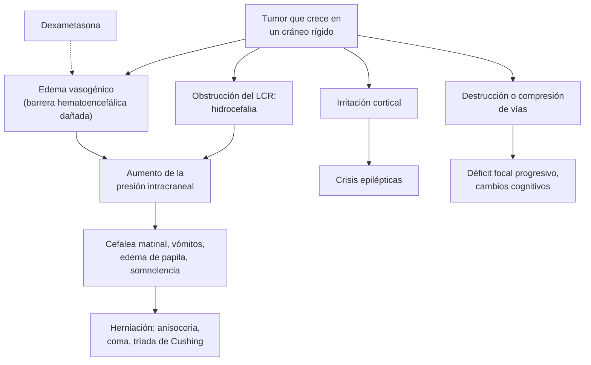

---
tags:
  - Neurología
  - GES
---

# Tumores primarios y metastásicos del sistema nervioso central

**Subespecialidad**
Neurología · Neurocirugía · Oncología

**Guías principales**
Clasificación OMS de tumores del SNC, 5.ª edición (2021) · EANO 2021: gliomas difusos del adulto · EANO-ESMO 2021: metástasis cerebrales de tumores sólidos · EANO 2021: meningiomas · EANO 2023: linfoma primario del SNC · SNO/EANO 2021: profilaxis anticonvulsivante · MINSAL: guía clínica GES de tumores primarios del SNC en personas de 15 años y más (2013)

**Otras fuentes**
Informe estadístico CBTRUS 2024 · Revisiones de metástasis cerebrales (Lauko 2020; Brenner 2022) · Epidemiología de las metástasis cerebrales sincrónicas (Singh 2020)

**GES**
**Sí**: **tumores primarios del SNC en personas de 15 años y más** (GES 43). La guía clínica GES aborda los tumores **no malignos**: **meningioma**, **adenoma hipofisiario**, **craneofaringioma** y **hemangioblastoma**. Garantías: confirmación diagnóstica en **25 días** desde la sospecha y tratamiento en **30 días** desde la confirmación.

**EUNACOM**
1.10.1.029 Tumores primarios y metastásicos del SNC (sospecha, inicial, derivar)

**Revisado**
Octubre 2026

!!! abstract "Resumen en 60 segundos"
    - Las **metástasis** son los tumores intracraneales **más frecuentes** del adulto (más que todos los primarios juntos). Vienen sobre todo de **pulmón**, **mama** y **melanoma**.
    - Entre los primarios, el más frecuente es el **meningioma** (benigno, extraaxial) y el maligno más frecuente es el **glioblastoma**.
    - **Sospéchalo** ante:
        - Una **crisis epiléptica nueva** en un adulto.
        - Un **déficit focal progresivo** (en días a semanas) o un **cambio cognitivo o de personalidad**.
        - **Cefalea con signos de hipertensión endocraneana** (peor en la mañana, con vómitos, edema de papila).
    - Imagen: **TC urgente** si hay déficit o deterioro; el examen de elección es la **RM con gadolinio**. Busca un **primario** (TC de tórax, abdomen y pelvis).
    - **Manejo inicial**:
        - **Dexametasona** solo si el edema da síntomas (4–8 mg/día; hasta 16 mg/día si es grave), **no** antes de la biopsia si se sospecha un **linfoma**.
        - **Antiepilépticos** solo si hubo una crisis (**no** profilaxis).
        - Derivar a **neurocirugía**.
    - **Herniación** (deterioro de conciencia, anisocoria): cabecera a 30°, osmoterapia y **neurocirugía urgente**.

## Definición

| Concepto | Definición |
|---|---|
| **Tumor primario del SNC** | Neoplasia que se origina en el encéfalo, la médula, las meninges, los nervios craneales o la hipófisis |
| **Metástasis cerebral** | Implante en el SNC de un cáncer de otro órgano (por vía hematógena) |
| **Intraaxial / extraaxial** | **Intraaxial**: dentro del parénquima (gliomas, metástasis, linfoma). **Extraaxial**: fuera del parénquima (meningioma, schwannoma) |
| **Glioma difuso** | Tumor de las células gliales que infiltra el parénquima: **astrocitoma** y **oligodendroglioma** (con mutación de IDH) y **glioblastoma** (sin mutación de IDH) |
| **Diagnóstico integrado** (OMS 2021) | Combina la **histología** con marcadores **moleculares** (IDH, codeleción 1p/19q, MGMT) y asigna un **grado** (1 a 4) dentro de cada tipo |
| **Edema vasogénico** | Salida de líquido por la barrera hematoencefálica dañada alrededor del tumor; responde a los **corticoides** |
| **Hipertensión endocraneana** | Aumento de la presión intracraneal por la masa, el edema o la hidrocefalia: cefalea, vómitos, edema de papila, compromiso de conciencia |
| **Carcinomatosis meníngea** | Diseminación tumoral a las leptomeninges y el LCR |

## Epidemiología

### Mundial

- **Tumores primarios** (CBTRUS 2024, EE. UU. 2017–2021):
    - Incidencia **25,34 por 100 000** al año (malignos **6,89**; no malignos **18,46**). Más en **mujeres** (por los meningiomas).
    - **Meningioma**: **41,7 %** de todos los tumores primarios; el más frecuente.
    - **Gliomas**: **22,9 %**. El **glioblastoma** es el **13,9 %** del total y el **51,5 %** de los malignos; más frecuente en **hombres**.
    - Sobrevida relativa a 5 años: **35,7 %** en los malignos y **92,0 %** en los no malignos.
- **Gliomas**: incidencia mundial de ~**6 por 100 000** al año; **1,6 veces** más en hombres (EANO 2021).
- **Metástasis cerebrales**:
    - Las tiene el **10–20 %** de las personas con cáncer durante su enfermedad; en autopsias, el **30–40 %** (Lauko 2020).
    - Son **más de la mitad** de los tumores intracraneales (Brenner 2022).
    - Origen: **pulmón (20–56 %)**, **mama (5–20 %)** y **melanoma (7–16 %)**, que suman el **67–80 %**; también riñón y colon.
    - **Sincrónicas** (presentes al diagnóstico del cáncer): **80 %** de pulmón; el **92 %** en mayores de 50 años (Singh 2020).
- **Factores de riesgo** de tumores primarios: **radiación ionizante** previa en la cabeza, síndromes hereditarios (neurofibromatosis, esclerosis tuberosa, Li-Fraumeni, Lynch), **inmunosupresión** (linfoma primario: VIH, trasplante). No hay medidas de prevención conocidas para los gliomas.

!!! chile "Datos nacionales"
    - **GES 43**: tumores primarios del SNC en personas de **15 años y más**.
        - Su guía clínica (2013) aborda **meningioma**, **adenoma hipofisiario**, **craneofaringioma** y **hemangioblastoma**.
        - Garantías de oportunidad: confirmación diagnóstica en **25 días**, tratamiento en **30 días**.
    - Incidencias estimadas en esa guía (egresos DEIS): **meningioma 1,21**, **adenoma hipofisiario 1,39** y **craneofaringioma 0,05** por 100 000 habitantes.
    - En **julio de 2026** el MINSAL anunció la incorporación **progresiva de todos los cánceres** al GES en el decreto **2028–2031**.
    - Muchas metástasis cerebrales vienen de cánceres con GES: **pulmón**, **mama**, colorrectal, riñón. También son GES el **alivio del dolor y los cuidados paliativos** por cáncer avanzado.

## Etiología y factores de riesgo

| Tipo | Origen | Claves |
|---|---|---|
| **Metástasis** | **Pulmón**, **mama**, **melanoma**, riñón, colon | Las más frecuentes en el adulto; a menudo múltiples, en la unión córtico-subcortical |
| **Meningioma** | Células aracnoideas de las meninges | **Benigno** en la mayoría (grado 1); mujeres de 60–70 años; a menudo un **hallazgo** |
| **Glioblastoma** (IDH no mutado, grado 4) | Glía | El primario **maligno** más frecuente; > 50 años; crecimiento rápido |
| **Astrocitoma y oligodendroglioma** (IDH mutado, grados 2–4) | Glía | Adultos jóvenes (30–40 años); **crisis epilépticas**; crecimiento más lento |
| **Linfoma primario del SNC** | Linfocitos B | **Inmunosupresión** (VIH, trasplante) o adultos mayores; muy sensible a los **corticoides** |
| **Schwannoma vestibular** | Vaina del VIII par | **Hipoacusia unilateral progresiva**, tinnitus; neurofibromatosis tipo 2 si es bilateral |
| **Adenoma hipofisiario y craneofaringioma** | Región selar | Alteración del **campo visual** (hemianopsia bitemporal) y **hormonal** (ver región selar) |
| **Carcinomatosis meníngea** | Mama, pulmón, melanoma, leucemias y linfomas | Pares craneales múltiples, cefalea, radiculopatías, hidrocefalia |

## Fisiopatología

- El tumor ocupa espacio dentro de un **cráneo rígido**. El crecimiento, el **edema vasogénico** que lo rodea y la **hidrocefalia** (si obstruye el LCR) aumentan la **presión intracraneal**.
- Al principio se compensa desplazando LCR y sangre venosa; cuando se agota la compensación, pequeños aumentos de volumen elevan mucho la presión: **hipertensión endocraneana** y luego **herniación**. Ver [hipertensión endocraneana](tec-e-hipertension-endocraneana.md).
- La **corteza** irritada por el tumor (sobre todo los gliomas de bajo grado y los tumores corticales) produce **crisis epilépticas**.
- La destrucción o compresión de vías produce **déficits focales** según la ubicación (frontal: conducta; temporal: memoria y lenguaje; parietal: sensibilidad y negligencia; occipital: visión; fosa posterior: ataxia y pares craneales).
- Los **corticoides** reducen la permeabilidad de los capilares tumorales y el **edema vasogénico**: mejoran los síntomas en horas a días, pero no tratan el tumor (excepto el **linfoma**, que se reduce y puede volverse indetectable en la biopsia).
- Las **metástasis** llegan por vía **hematógena** y se implantan en la **unión córtico-subcortical** (donde las arterias se estrechan) y en las zonas limítrofes; la mayoría son supratentoriales.

*Figura 1. Mecanismos de los síntomas de un tumor cerebral. Esquema propio basado en EANO 2021 y Lauko 2020.*

## Clasificación

- **Por origen**: primarios (benignos o malignos) y **secundarios** (metástasis).
- **Por localización**: **intraaxiales** (gliomas, metástasis, linfoma) y **extraaxiales** (meningioma, schwannoma); **supratentoriales** (la mayoría en adultos) e **infratentoriales**; región selar; médula.
- **Clasificación OMS 2021 (5.ª edición)**:
    - **Diagnóstico integrado**: histología **más** marcadores moleculares.
    - **Grados 1 a 4** dentro de cada tipo de tumor (con números arábigos).
    - **Gliomas difusos del adulto**, tres tipos:

| Tipo (OMS 2021) | Marcadores | Grado | Edad típica y pronóstico |
|---|---|---|---|
| **Oligodendroglioma** | IDH **mutado** + codeleción **1p/19q** | 2–3 | 30–50 años; el de **mejor** pronóstico (sobrevida de años) |
| **Astrocitoma** | IDH **mutado**, sin codeleción | 2–4 | 30–40 años; pronóstico intermedio |
| **Glioblastoma** | IDH **no mutado** (salvaje) | 4 | > 50 años; el de **peor** pronóstico |

- **Metilación del promotor de MGMT**: el principal factor pronóstico del glioblastoma y predictor de respuesta a la **temozolomida** (EANO 2021).

## Clínica

| Presentación | Características |
|---|---|
| **Crisis epiléptica nueva en un adulto** | La forma de inicio en el **20–40 %** de los pacientes con tumores cerebrales; otro **20–45 %** las tendrá durante la evolución. Frecuente en gliomas de bajo grado y tumores corticales |
| **Déficit focal progresivo** | Hemiparesia, afasia, alteración visual o ataxia que se instala en **días a semanas** (a diferencia del ACV, que es súbito) |
| **Cambio cognitivo o de personalidad** | Apatía, desinhibición, desorientación (tumores **frontales**, cuerpo calloso, linfoma); se confunde con una depresión o una demencia |
| **Cefalea** | Presente en cerca de la mitad, pero rara vez **aislada**. Sugieren un tumor: cefalea **nueva** en > 50 años, que **empeora** en semanas, peor al **despertar** o con la maniobra de Valsalva, con **vómitos** o con déficit. Ver [cefalea](cefalea.md) |
| **Hipertensión endocraneana** | Cefalea matinal, **vómitos**, **edema de papila**, diplopía (VI par), somnolencia |
| **Herniación** | Deterioro de conciencia, **anisocoria** (III par), postura anormal, **tríada de Cushing** (hipertensión, bradicardia, respiración irregular) |
| **Síntomas sistémicos** | Baja de peso, tos o hemoptisis (pulmón), nódulo mamario, lesión pigmentada (melanoma): orientan a una **metástasis** |

!!! alarma "Urgencias en un paciente con un tumor del SNC"
    - **Herniación**: deterioro de conciencia, anisocoria, bradicardia con hipertensión → cabecera a 30°, **manitol o suero salino hipertónico**, dexametasona, **neurocirugía urgente**.
    - **Hidrocefalia aguda** (tumores de fosa posterior o periventriculares) → derivación ventricular urgente.
    - **Estado epiléptico** → protocolo habitual. Ver [crisis epiléptica](crisis-epileptica-y-estado-epileptico.md).
    - **Hemorragia intratumoral** (melanoma, riñón, tiroides, coriocarcinoma; glioblastoma): déficit **súbito**, se confunde con un ACV.
    - **Compresión medular** por metástasis vertebral. Ver [urgencias oncológicas](../hematologia/urgencias-oncologicas.md).

## Diagnóstico

!!! guia "Diagnóstico de un tumor cerebral (EANO 2021; EANO-ESMO 2021)"
    - **Historia** (evolución de los síntomas: semanas = crecimiento rápido; años = lento) y **examen** neurológico y general, buscando un **cáncer sistémico**.
    - **RM sin y con gadolinio** (T2, FLAIR, T1 antes y después del contraste): **examen de elección**. La TC sirve en la urgencia, pero puede no ver lesiones pequeñas o de fosa posterior.
    - Con una o más lesiones sugerentes de **metástasis**: estudio de **extensión** (TC de tórax, abdomen y pelvis o PET-CT) para buscar el **primario** y otras metástasis.
    - El diagnóstico definitivo es **histológico** (biopsia o resección), con **diagnóstico integrado** molecular (OMS 2021). Excepción: un meningioma típico asintomático en un adulto mayor puede **observarse** con RM.
    - Decisiones en un **comité multidisciplinario** (neurocirugía, neurorradiología, neuropatología, radioterapia, oncología).

<figure markdown>
![Algoritmo del enfoque inicial de una lesión cerebral expansiva. Se sospecha ante una crisis epiléptica nueva en un adulto, un déficit focal progresivo, un cambio cognitivo o conductual, o cefalea con signos de hipertensión endocraneana. Se pide una TC de cerebro urgente y luego una RM con gadolinio, que es el examen de elección. Si hay herniación o deterioro de conciencia: cabecera a 30 grados, manitol o suero salino hipertónico y neurocirugía urgente. Luego, lo que sugieren la imagen y el contexto: metástasis (a menudo múltiples, en la unión córtico-subcortical, con mucho edema; con cáncer conocido o en fumadores, TC de tórax, abdomen y pelvis); glioma de alto grado (lesión única con realce en anillo irregular y necrosis, que puede cruzar el cuerpo calloso); meningioma (extraaxial, de base dural con cola dural, realce homogéneo, en mujeres mayores, a menudo un hallazgo, GES 43); linfoma primario (periventricular, realce homogéneo, VIH o inmunosupresión; no dar corticoides antes de la biopsia); e infección (absceso con anillo fino y restricción en la difusión y fiebre; en el VIH, toxoplasmosis o tuberculoma; también neurocisticercosis). Manejo inicial antes de la neurocirugía: dexametasona 4 a 8 mg al día (hasta 16 mg si es grave) para el edema sintomático, lo más breve posible; antiepiléptico solo si hubo crisis (levetiracetam), sin profilaxis primaria; derivar a neurocirugía y comité oncológico para la biopsia o resección; y además tromboprofilaxis, control de la glicemia con corticoides, protección gástrica y apoyo familiar](../assets/figuras/tumores-snc/enfoque-lesion-expansiva.svg){ loading=lazy }
<figcaption>Figura 2. Enfoque inicial de una lesión cerebral expansiva. Esquema propio basado en EANO 2021, EANO-ESMO 2021, SNO/EANO 2021 y Lauko 2020.</figcaption>
</figure>

## Laboratorio

- No hay marcadores en sangre que diagnostiquen un tumor cerebral.
- **Exámenes generales**: hemograma, **glicemia** (corticoides), **sodio** (**SIADH**, sobre todo con cáncer pulmonar de células pequeñas; ver [sodio](../nefrologia/trastornos-del-sodio.md)), función renal y hepática, coagulación (antes de la cirugía).
- **VIH** ante sospecha de **linfoma** o infecciones oportunistas.
- **Marcadores** según el primario sospechado (PSA, CEA, CA 15-3, β-hCG en hombres jóvenes).
- **Punción lumbar**: **contraindicada** si hay una masa con efecto de masa (riesgo de herniación). Se usa en la sospecha de **carcinomatosis meníngea** o linfoma, cuando la imagen lo permite.
- **Estudio endocrino** en los tumores **selares** (prolactina, IGF-1, cortisol, TSH, T4 libre).

## Imágenes

| Tumor | RM típica |
|---|---|
| **Metástasis** | Lesiones **redondeadas**, a menudo **múltiples**, en la **unión córtico-subcortical**, con realce nodular o en anillo y **mucho edema** para su tamaño |
| **Glioblastoma** | Lesión **única**, realce en **anillo irregular** con **necrosis** central, edema e infiltración; puede cruzar el **cuerpo calloso** ("en alas de mariposa") |
| **Glioma de bajo grado** | Lesión hiperintensa en T2 y FLAIR, **sin realce** o con poco realce, poco edema |
| **Meningioma** | **Extraaxial**, base dural ancha con "**cola dural**", realce **homogéneo** e intenso; calcificaciones; hiperostosis del hueso vecino |
| **Linfoma primario** | **Periventricular** o en el cuerpo calloso, realce **homogéneo**, restricción en la difusión; en el VIH puede tener realce en anillo |
| **Absceso** | Realce en **anillo fino y regular**, con **restricción en la difusión** en el centro (a diferencia del tumor necrótico) |

- **Perfusión, espectroscopía y PET** de aminoácidos: ayudan a distinguir tumor de radionecrosis y a elegir el sitio de biopsia.
- **Seudoprogresión**: aumento de la lesión en los primeros meses tras la radioterapia, que no es crecimiento tumoral (EANO 2021).

## Diagnóstico diferencial

| Condición | Claves |
|---|---|
| **Absceso cerebral** | Fiebre, foco dental, sinusal u ótico, endocarditis; anillo fino con **restricción en difusión**. Ver [absceso cerebral](../infectologia/flegmon-cervical-absceso-pulmonar-y-cerebral.md) |
| **Toxoplasmosis cerebral** (VIH) | CD4 < 100, lesiones múltiples en los ganglios basales con realce en anillo; responde al tratamiento empírico en 2 semanas. Ver [VIH](../infectologia/infeccion-por-vih.md) |
| **Tuberculoma, neurocisticercosis** | Contexto epidemiológico; quistes con escólex (cisticercosis) |
| **ACV subagudo** | Inicio **súbito**, territorio vascular; el realce del infarto subagudo puede confundir |
| **Desmielinización tumefacta** | Persona joven, realce en **anillo incompleto**; lesiones típicas de EM. Ver [esclerosis múltiple](esclerosis-multiple.md) |
| **Hematoma subdural crónico** | Adulto mayor, caídas, anticoagulantes; colección en semiluna |
| **Radionecrosis** | Meses o años después de radioterapia; perfusión baja |
| **Demencia o depresión** | Sin déficit focal ni signos de hipertensión endocraneana; la imagen las distingue |

## Tratamiento

!!! guia "Manejo inicial (EANO 2021; EANO-ESMO 2021; SNO/EANO 2021)"
    - **Corticoides** (dexametasona) para el **edema sintomático**, en la **menor dosis** y por el **menor tiempo** posibles; **no** dar si se sospecha un **linfoma** o una lesión inflamatoria antes de la biopsia.
    - **Antiepilépticos**:
        - **No** dar profilaxis a quien **no ha tenido crisis** (recomendación nivel A).
        - Tratar a quien **sí** las tuvo; preferir **levetiracetam** a los antiepilépticos antiguos (menos efectos adversos e interacciones).
    - Discutir cada caso en un **comité multidisciplinario**.
    - **Glioblastoma** en buen estado general y < 70 años (EANO 2021):
        - **Resección** lo más completa posible.
        - Luego **radioterapia (60 Gy en 30 fracciones)** con **temozolomida** diaria, seguida de **6 ciclos** de temozolomida de mantención.
        - En los mayores o con mal estado funcional: radioterapia hipofraccionada o temozolomida sola según el **MGMT**, o cuidados paliativos.

<figure markdown>
![Algoritmo de tratamiento del glioblastoma IDH no mutado, grado 4 de la OMS. Al diagnóstico, biopsia o resección seguida de RM o TC posoperatoria precoz (antes de 48 horas). Luego, según los factores pronósticos: favorables (menor de 70 años y Karnofsky de 70 o más), quimiorradioterapia con temozolomida; desfavorables por Karnofsky menor de 70 en menores de 70 años, radioterapia hipofraccionada; desfavorables por edad de 70 años o más con promotor de MGMT no metilado, radioterapia hipofraccionada; con 70 años o más y MGMT metilado, quimiorradioterapia con temozolomida o temozolomida sola; muy desfavorables (Karnofsky menor de 50 o incapacidad de consentir), cuidados paliativos. Seguimiento cada 2 a 3 meses con examen neurológico e imagen. En la progresión o recurrencia, las opciones dependen del Karnofsky, la función neurológica y el tratamiento previo: nueva cirugía, quimioterapia con alquilantes, bevacizumab, reirradiación o terapia experimental; si no, cuidados paliativos](../assets/figuras/tumores-snc/manejo-glioblastoma-eano-2021.jpg){ loading=lazy }
<figcaption>Figura 3. Tratamiento del glioblastoma (IDH no mutado, grado 4 de la OMS) según la edad, el estado funcional (Karnofsky) y la metilación del promotor de MGMT. Tomado de Weller M, van den Bent M, Preusser M, et al. EANO guidelines on the diagnosis and treatment of diffuse gliomas of adulthood. <em>Nat Rev Clin Oncol.</em> 2021;18(3):170–186. Licencia <a href="https://creativecommons.org/licenses/by/4.0/">CC BY 4.0</a>.</figcaption>
</figure>

- **Metástasis cerebrales**: el tratamiento depende del **número y tamaño** de las lesiones, el **estado funcional** y el control del cáncer **sistémico**:
    - **Cirugía**: lesión única o pocas, accesibles, grandes o con efecto de masa, o sin diagnóstico histológico.
    - **Radiocirugía estereotáctica**: lesiones pequeñas y en número limitado; preserva más la cognición que la radioterapia de **cerebro total**.
    - **Radioterapia de cerebro total**: metástasis múltiples; su uso ha disminuido por el **deterioro cognitivo**.
    - **Terapias sistémicas** con actividad en el SNC (terapias dirigidas en cáncer pulmonar con mutaciones, inmunoterapia en melanoma).
    - Pacientes con mal estado funcional y enfermedad sistémica avanzada: **cuidados paliativos**.
- **Meningioma**: **observación con RM** si es pequeño y asintomático (sobre todo en adultos mayores); **resección** completa con la duramadre (a menudo curativa) si da síntomas o crece; radiocirugía o radioterapia en los inoperables (EANO 2021).
- **Linfoma primario del SNC**: **no se opera** (solo biopsia estereotáctica); quimioterapia basada en **metotrexato en dosis altas**, con consolidación en pacientes seleccionados (EANO 2023).
- **Medidas de soporte**:
    - **Tromboprofilaxis** (alto riesgo de trombosis venosa), según la indicación de neurocirugía.
    - Control de la **glicemia**, protección **gástrica** y **ósea** con corticoides; profilaxis de *Pneumocystis* si el uso es prolongado.
    - Rehabilitación, apoyo **psicológico** y a la familia, **cuidados paliativos** precoces en los tumores malignos.
    - **Conducción de vehículos**: restringida tras una crisis epiléptica.

!!! dosis "Dosis clave"
    - **Dexametasona** (edema sintomático): **4–8 mg/día** en síntomas leves; hasta **16 mg/día** si son moderados o graves (Lauko 2020); VO o EV, en 1–2 dosis (en la mañana). **Reducir** lo antes posible.
    - **Levetiracetam** (si hubo crisis): **500 mg c/12 h**, subir hasta 1500 mg c/12 h según la respuesta; ajustar a la función renal. Puede causar **irritabilidad** y cambios de ánimo.
    - **Manitol** 20 % (herniación): **0,5–1 g/kg EV** en 15–20 minutos, como puente a la neurocirugía.

## Complicaciones

- **Herniación** y muerte; **hidrocefalia**.
- **Crisis epilépticas** y estado epiléptico.
- **Déficits** motores, del lenguaje, visuales y **cognitivos** persistentes; cambios de personalidad.
- **Tromboembolismo venoso** (alto riesgo en gliomas).
- **Hemorragia** intratumoral.
- **De los corticoides**: **hiperglicemia**, miopatía esteroidal, infecciones (incluida *Pneumocystis*), psicosis, insomnio, úlcera péptica, osteoporosis.
- **Del tratamiento**: deterioro cognitivo por la radioterapia de cerebro total, **radionecrosis**, mielosupresión por la quimioterapia.
- **Endocrinas**: hipopituitarismo (tumores selares o tras radioterapia), **SIADH**.

## Pronóstico y seguimiento

- **Glioblastoma**: el de **peor** pronóstico; la sobrevida depende de la **edad**, el **estado funcional**, la extensión de la resección y la **metilación de MGMT**.
- **Gliomas IDH mutados** (astrocitoma, oligodendroglioma): sobrevida de **años**; el oligodendroglioma con codeleción 1p/19q es el de mejor pronóstico.
- **Meningioma** grado 1: la resección completa suele ser **curativa**; los atípicos y anaplásicos recurren más.
- **Metástasis**: pronóstico en general **malo**; depende del primario, el número de lesiones, el estado funcional y el control sistémico. Ha mejorado con las terapias dirigidas y la inmunoterapia.
- **Seguimiento** (lo dirige el especialista): examen neurológico e **imagen** cada **2–3 meses** en el glioblastoma (EANO 2021); RM periódica en los meningiomas observados.
- El EUNACOM pide **sospechar, iniciar el manejo y derivar**.

## Perlas para el internado

!!! perla "Para la sala y el turno"
    - **Primera crisis epiléptica en un adulto**: siempre neuroimagen (TC urgente y luego RM).
    - **Déficit que empeora en días o semanas** no es un ACV típico: piensa en un tumor, un absceso o un hematoma subdural.
    - En un paciente con **cáncer** conocido (pulmón, mama, melanoma), una cefalea nueva, una crisis o un cambio conductual es una **metástasis** hasta demostrar lo contrario.
    - **No des dexametasona "por si acaso"** ante una lesión cerebral sin diagnóstico: si es un **linfoma**, puede desaparecer y hacer fallar la biopsia. Dala si el edema da síntomas importantes, coordinada con neurocirugía.
    - **No** indiques antiepilépticos **profilácticos** si el paciente no ha tenido crisis.
    - **No** hagas una **punción lumbar** con una masa cerebral sin ver antes la imagen.
    - Con **dexametasona**: controla la glicemia, protege el estómago y vigila la miopatía y las infecciones.
    - **Anisocoria con compromiso de conciencia** en un paciente con tumor: herniación; cabecera a 30°, manitol y neurocirugía de inmediato.
    - Meningioma pequeño, calcificado y asintomático en un adulto mayor: a menudo basta con **observar** con RM.

## Preguntas de repaso

??? repaso "1. Hombre de 58 años, sin antecedentes, que presenta su primera crisis convulsiva tónico-clónica generalizada. Su señora refiere que en el último mes ha estado más apático y olvidadizo, y tiene cefalea en las mañanas. Al examen está lúcido con una leve paresia braquial izquierda. ¿Qué sospecha y qué hace?"
    **Tumor cerebral** (probable glioma de alto grado o metástasis) que debuta con una **crisis epiléptica**, con cambios cognitivos, cefalea de hipertensión endocraneana y un **déficit focal**.

    - **TC de cerebro urgente** y luego **RM con gadolinio**.
    - **Levetiracetam** (ya tuvo una crisis).
    - **Dexametasona** si el edema es sintomático (salvo sospecha de linfoma).
    - Buscar un **primario** (TC de tórax, abdomen y pelvis) si la imagen sugiere metástasis.
    - Derivar a **neurocirugía**: biopsia o resección para el diagnóstico integrado.

??? repaso "2. Mujer de 62 años con cáncer de mama tratado hace 3 años, que consulta por cefalea progresiva de 3 semanas, vómitos matinales y torpeza de la mano derecha. ¿Qué sospecha y cuál es el manejo inicial?"
    **Metástasis cerebral** de cáncer de **mama** con **hipertensión endocraneana** y déficit focal.

    - **RM de cerebro con gadolinio** (número, tamaño, edema, hidrocefalia) y reetapificación sistémica.
    - **Dexametasona 4–8 mg/día** (más si los síntomas son graves).
    - **No** profilaxis antiepiléptica si no ha tenido crisis.
    - Comité multidisciplinario: **cirugía** (lesión única grande o con efecto de masa), **radiocirugía** (pocas lesiones pequeñas) o radioterapia de cerebro total (múltiples), más terapia sistémica según el subtipo.

??? repaso "3. Hombre de 40 años con VIH sin tratamiento, CD4 de 60, que presenta confusión y hemiparesia. La RM muestra una lesión periventricular con realce. ¿Qué diagnósticos considera y qué no debe hacer?"
    Lesión cerebral en un paciente con **VIH avanzado**: considerar **toxoplasmosis cerebral** (la más frecuente) y **linfoma primario del SNC**; también tuberculoma o leucoencefalopatía multifocal progresiva.

    - **Serología de toxoplasma**; si es positiva y el cuadro es compatible, **tratamiento empírico** para la toxoplasmosis y control con imagen en ~2 semanas.
    - Si no responde, o la serología es negativa: sospechar **linfoma** (PCR de virus de Epstein-Barr en LCR si es seguro hacer la punción, PET, **biopsia estereotáctica**).
    - **No** dar **corticoides** antes de la biopsia si se sospecha un linfoma (salvo edema que amenace la vida).
    - Iniciar terapia antirretroviral según el caso. Ver [VIH](../infectologia/infeccion-por-vih.md).

??? repaso "4. Mujer de 72 años a la que se le pidió una RM por mareos inespecíficos. Se encuentra una lesión extraaxial frontal de 1,5 cm, de base dural, con realce homogéneo y \"cola dural\", sin edema. Examen neurológico normal. ¿Qué es y qué hace?"
    **Meningioma** probable: tumor **extraaxial**, benigno en la mayoría, frecuente en mujeres mayores; aquí un **hallazgo** asintomático.

    - Derivar a **neurocirugía** (GES 43 si tiene 15 años o más).
    - Un meningioma pequeño y **asintomático** en un adulto mayor puede manejarse con **observación con RM** periódica (EANO 2021).
    - **Cirugía** si crece, da síntomas o hay edema; radiocirugía si es inoperable.

??? repaso "5. Paciente con un tumor cerebral conocido, en espera de cirugía, que se deteriora: Glasgow 9, pupila derecha dilatada y sin respuesta a la luz, PA 190/100 mmHg y FC 48 lpm. ¿Qué pasa y qué hace?"
    **Herniación transtentorial** (uncal) con **tríada de Cushing** (hipertensión, bradicardia, alteración respiratoria): emergencia neuroquirúrgica.

    - Vía aérea (intubación si Glasgow ≤ 8 o no protege la vía aérea), **cabecera a 30°**, normocapnia (hiperventilación breve solo como puente).
    - **Manitol 0,5–1 g/kg** o suero salino hipertónico; **dexametasona** si es edema vasogénico tumoral.
    - **TC urgente** (hemorragia, hidrocefalia) y **neurocirugía de inmediato**. Ver [hipertensión endocraneana](tec-e-hipertension-endocraneana.md).

??? repaso "6. Mujer de 35 años con crisis focales con alteración de conciencia desde hace 1 año. La RM muestra una lesión temporal derecha hiperintensa en FLAIR, sin realce ni edema. ¿Qué sospecha y qué le explica sobre el tratamiento?"
    **Glioma difuso de bajo grado** probable (astrocitoma u oligodendroglioma con **IDH mutado**): adulta joven, **epilepsia**, lesión sin realce.

    - **Antiepiléptico** (levetiracetam u otro según la tolerancia).
    - Derivar a **neurocirugía**: **resección máxima segura** o biopsia para el diagnóstico **integrado** (IDH, 1p/19q), que define el tipo y el grado (OMS 2021).
    - El pronóstico es mucho **mejor** que el del glioblastoma (sobrevida de años); el tratamiento posterior (radioterapia, quimioterapia u observación) depende del tipo, el grado y la resección.

## Referencias

1. Louis DN, Perry A, Wesseling P, et al. The 2021 WHO Classification of Tumors of the Central Nervous System: a summary. *Neuro Oncol.* 2021;23(8):1231–1251. doi:[10.1093/neuonc/noab106](https://doi.org/10.1093/neuonc/noab106)
2. Weller M, van den Bent M, Preusser M, et al. EANO guidelines on the diagnosis and treatment of diffuse gliomas of adulthood. *Nat Rev Clin Oncol.* 2021;18(3):170–186. doi:[10.1038/s41571-020-00447-z](https://doi.org/10.1038/s41571-020-00447-z)
3. Le Rhun E, Guckenberger M, Smits M, et al. EANO-ESMO Clinical Practice Guidelines for diagnosis, treatment and follow-up of patients with brain metastasis from solid tumours. *Ann Oncol.* 2021;32(11):1332–1347. doi:[10.1016/j.annonc.2021.07.016](https://doi.org/10.1016/j.annonc.2021.07.016)
4. Goldbrunner R, Stavrinou P, Jenkinson MD, et al. EANO guideline on the diagnosis and management of meningiomas. *Neuro Oncol.* 2021;23(11):1821–1834. doi:[10.1093/neuonc/noab150](https://doi.org/10.1093/neuonc/noab150)
5. Hoang-Xuan K, Deckert M, Ferreri AJM, et al. European Association of Neuro-Oncology (EANO) guidelines for treatment of primary central nervous system lymphoma (PCNSL). *Neuro Oncol.* 2023;25(1):37–53. doi:[10.1093/neuonc/noac196](https://doi.org/10.1093/neuonc/noac196)
6. Walbert T, Harrison RA, Schiff D, et al. SNO and EANO practice guideline update: anticonvulsant prophylaxis in patients with newly diagnosed brain tumors. *Neuro Oncol.* 2021;23(11):1835–1844. doi:[10.1093/neuonc/noab152](https://doi.org/10.1093/neuonc/noab152)
7. Price M, Ballard C, Benedetti J, et al. CBTRUS Statistical Report: primary brain and other central nervous system tumors diagnosed in the United States in 2017–2021. *Neuro Oncol.* 2024;26(Suppl 6):vi1–vi85. doi:[10.1093/neuonc/noae145](https://doi.org/10.1093/neuonc/noae145)
8. Lauko A, Rauf Y, Ahluwalia MS. Medical management of brain metastases. *Neurooncol Adv.* 2020;2(1):vdaa015. doi:[10.1093/noajnl/vdaa015](https://doi.org/10.1093/noajnl/vdaa015)
9. Brenner AW, Patel AJ. Review of current principles of the diagnosis and management of brain metastases. *Front Oncol.* 2022;12:857622. doi:[10.3389/fonc.2022.857622](https://doi.org/10.3389/fonc.2022.857622)
10. Singh R, Stoltzfus KC, Chen H, et al. Epidemiology of synchronous brain metastases. *Neurooncol Adv.* 2020;2(1):vdaa041. doi:[10.1093/noajnl/vdaa041](https://doi.org/10.1093/noajnl/vdaa041)
11. Ministerio de Salud de Chile. Guía clínica: tumores primarios del sistema nervioso central en personas de 15 años y más. Santiago: MINSAL; 2013. [PDF en diprece.minsal.cl](https://diprece.minsal.cl/wrdprss_minsal/wp-content/uploads/2014/12/Tumores-Sistema-Nervioso-Central.pdf)
