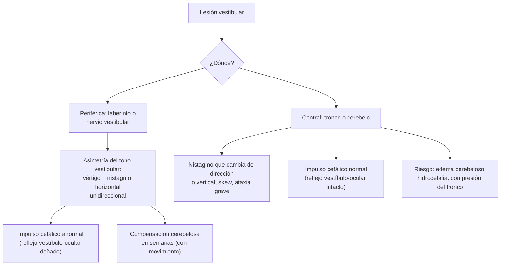

---
tags:
  - Neurología
  - Urgencia
  - Frecuente en sala
---

# Vértigo: síndromes vertiginosos periféricos y centrales

**Subespecialidad**
Neurología · Otorrinolaringología · Medicina de urgencia

**Guías principales**
GRACE-3 2023 (SAEM): mareo y vértigo agudo en urgencias · AAO-HNS 2017: vértigo posicional paroxístico benigno · Sociedad Bárány: criterios de VPPB (2015), neuritis vestibular (2022), enfermedad de Ménière (2015), migraña vestibular (2022), vértigo vascular (2022) y mareo postural-perceptual persistente (2017)

**Otras fuentes**
Epidemiología del VPPB (von Brevern 2007) · Ensayo BEMED de betahistina en el Ménière (2016) · HINTS en el síndrome vestibular agudo (Kattah 2018)

**GES**
El vértigo **no es GES**. El **ACV isquémico en personas de 15 años y más** sí lo es (ver [ACV](accidente-cerebrovascular.md)).

**EUNACOM**
1.10.1.025 Síndromes vertiginosos periféricos (específico, completo, completo) · 1.10.1.024 Síndromes vertiginosos centrales (sospecha, inicial, no requiere)

**Revisado**
Octubre 2026

!!! abstract "Resumen en 60 segundos"
    - El mareo y el vértigo son **3–4 %** de las consultas de urgencia; **3–4 %** de ellos son un **ACV**. La meta es no dejar pasar el ACV de **fosa posterior** sin estudiar de más a los benignos.
    - **Clasifica por tiempo y gatillo** (GRACE-3), no solo por "qué siente":
        - **Síndrome vestibular agudo** (continuo por días): **neuritis vestibular** vs. **ACV** de fosa posterior. Usa **HINTS** si estás entrenado, la audición y la **marcha**.
        - **Episódico gatillado** (segundos, al acostarse o girar en la cama): **VPPB**. **Dix-Hallpike** para diagnosticar y **maniobra de Epley** para tratar.
        - **Episódico espontáneo** (minutos a horas): **migraña vestibular**, **Ménière** o **AIT** vertebrobasilar.
    - **HINTS central** ("INFARCT"):
        - **Impulso cefálico normal**.
        - **Nistagmo que cambia de dirección** o vertical.
        - **Desviación oblicua** (*skew*).
        - Un solo signo central basta. Sumar la **hipoacusia** nueva (HINTS plus).
    - **No** pidas **TC** para descartar un ACV isquémico en el vértigo: casi nunca lo muestra. La **RM con difusión** puede ser normal en las primeras 48 horas.
    - **No** des **supresores vestibulares** de rutina en el VPPB, ni flunarizina o cinarizina por meses (retardan la compensación y causan **parkinsonismo**). Máximo **2–3 días** en la neuritis, con **rehabilitación vestibular** precoz.

## Definición

| Concepto | Definición |
|---|---|
| **Vértigo** | **Ilusión de movimiento** propio o del entorno (giro, balanceo) cuando no lo hay |
| **Mareo** | Sensación de alteración de la orientación espacial **sin** ilusión de movimiento ("cabeza liviana", "embotamiento") |
| **Inestabilidad** | Sensación de desequilibrio al estar de pie o caminar |
| **Presíncope** | Sensación de desmayo inminente (causa cardiovascular, no vestibular) |
| **Síndrome vestibular agudo** | Vértigo o mareo **continuo** de inicio agudo que dura **días**, con náuseas o vómitos, **nistagmo**, inestabilidad e intolerancia al movimiento de la cabeza |
| **Síndrome vestibular episódico** | Episodios **recurrentes** y breves. **Gatillado** (por la posición) o **espontáneo** |
| **Vértigo periférico** | Por lesión del **laberinto** o del **nervio vestibular** |
| **Vértigo central** | Por lesión del **tronco** o el **cerebelo** (o sus vías) |
| **Nistagmo** | Movimiento ocular rítmico con una fase lenta y una **rápida** (que le da el nombre a la dirección) |

## Epidemiología

### Mundial

- **Urgencias** (Kim 2022):
    - El mareo y el vértigo son el **3,3–4,4 %** de las consultas de urgencia en EE. UU.; el **ACV** causa el **3–4 %** de ellas.
    - El mareo es un síntoma de presentación en el **47–75 %** de los ACV de la circulación **posterior**.
- **VPPB** (von Brevern 2007, estudio poblacional):
    - Prevalencia de vida **2,4 %**; prevalencia en 1 año **1,6 %**.
    - Es el **8 %** de los mareos moderados o graves.
    - Solo el **8 %** de los afectados recibió un tratamiento eficaz.
    - Se asocia a la **edad**, la migraña, la HTA, la dislipidemia y el ACV.
- La **neuritis vestibular** es la segunda causa periférica de vértigo agudo; el **Ménière** y la **migraña vestibular** son las causas más frecuentes de vértigo episódico espontáneo.

!!! chile "Datos nacionales"
    - No hay datos poblacionales chilenos de vértigo.
    - El **ACV isquémico** (15 años y más) es **GES**: un vértigo agudo con signos centrales es un ACV hasta demostrar lo contrario. Ver [ACV](accidente-cerebrovascular.md).
    - En Chile se usan mucho la **flunarizina** y la **cinarizina** para el "mareo". Su uso **prolongado**, sobre todo en **adultos mayores**, causa **parkinsonismo** y depresión, y retarda la compensación vestibular. Ver [Parkinson](parkinson-temblor-y-trastornos-de-la-marcha.md).
    - La **maniobra de Epley** se puede hacer en APS o en la urgencia, sin equipos.

## Etiología

| Grupo | Causas |
|---|---|
| **Periférico** | **VPPB** (la más frecuente) · **neuritis vestibular** · **laberintitis** (con hipoacusia) · **enfermedad de Ménière** · herpes zóster ótico (Ramsay Hunt) · ototóxicos (**aminoglicósidos**) · fístula perilinfática · otitis media complicada · trauma |
| **Central** | **ACV o AIT** de la circulación posterior (vertebrobasilar, PICA, AICA) · **hemorragia cerebelosa** · **migraña vestibular** · **esclerosis múltiple** · tumores de fosa posterior y del ángulo pontocerebeloso (**schwannoma vestibular**) · Chiari · fármacos y alcohol · **Wernicke** |
| **No vestibular** (mareo) | **Hipotensión ortostática**, **arritmias**, anemia, **hipoglicemia**, deshidratación, **fármacos** (antihipertensivos, sedantes), ansiedad, hiperventilación, **mareo postural-perceptual persistente** |

## Fisiopatología

- Los **canales semicirculares** detectan la rotación y los **otolitos** (utrículo y sáculo), la aceleración lineal y la gravedad.
- Ambos laberintos envían una descarga tónica **simétrica** a los núcleos vestibulares. Cuando un lado falla, la **asimetría** se interpreta como giro: **vértigo**, **nistagmo** (fase lenta hacia el lado enfermo, rápida hacia el sano) e inestabilidad hacia el lado enfermo.
- **VPPB**: **otoconias** desprendidas del utrículo caen a un canal, casi siempre el **posterior**. Al mover la cabeza en su plano, se mueven con la gravedad y desplazan la endolinfa: vértigo **breve** y **posicional**. La maniobra de Epley las devuelve al utrículo.
- **Neuritis vestibular**: inflamación (probablemente por **reactivación del VHS-1**) de la porción **superior** del nervio vestibular. El déficit es brusco y luego el cerebelo **compensa** en semanas, más rápido con el movimiento; los supresores vestibulares lo enlentecen.
- **Ménière**: **hidrops endolinfático**. Crisis de vértigo con hipoacusia **fluctuante** de frecuencias graves, tinnitus y plenitud ótica.
- **ACV de fosa posterior**: infarto del **cerebelo** o del **tronco** (PICA, AICA). Puede dar un vértigo aislado que imita una neuritis. El infarto de la **AICA** puede producir **hipoacusia** (irriga el oído interno).

*Figura 1. Mecanismos del vértigo periférico y central, y sus signos. Esquema propio.*

## Clasificación

<figure markdown>
![Esquema de clasificación del mareo o vértigo agudo por tiempo y gatillo. Arriba, la indicación de preguntar cuánto dura y qué lo gatilla. Tres columnas: síndrome vestibular agudo (continuo por días, con náuseas, vómitos, nistagmo e inestabilidad), cuya causa benigna es la neuritis vestibular y la grave el ACV de fosa posterior, que se evalúa con HINTS, hipoacusia y marcha, sin TC y con RM con difusión si el HINTS es central o dudoso; episódico gatillado (segundos, al acostarse, girar en la cama o mirar hacia arriba), cuya causa benigna es el VPPB y la grave el vértigo posicional central, que se evalúa con Dix-Hallpike y la prueba del giro supino y se trata con la maniobra de Epley; y episódico espontáneo (minutos a horas, sin gatillo), con migraña vestibular o Ménière como causas benignas y AIT vertebrobasilar como grave, en el que se buscan síntomas de isquemia, se pide angioTC o angioRM si se sospecha un AIT y se descarta arritmia e hipoglicemia. Abajo, una tabla del HINTS: impulso cefálico anormal en la neuritis y normal en el ACV; nistagmo horizontal unidireccional en la neuritis y que cambia de dirección o vertical en el ACV; desviación oblicua ausente en la neuritis y presente en el ACV; hipoacusia nueva ausente en la neuritis y presente en el infarto de la AICA](../assets/figuras/vertigo/enfoque-mareo-tiempo-gatillo.svg){ loading=lazy }
<figcaption>Figura 2. Clasificación del mareo o vértigo agudo por tiempo y gatillo, y examen HINTS. Esquema propio basado en GRACE-3 (Edlow 2023) y los criterios de vértigo vascular de la Sociedad Bárány (Kim 2022).</figcaption>
</figure>

| Entidad | Duración | Gatillo | Audición | Claves |
|---|---|---|---|---|
| **VPPB** | **Segundos** (< 1 minuto) | **Cambios de posición** de la cabeza (acostarse, girar en la cama, mirar hacia arriba) | Normal | **Dix-Hallpike** positivo; náuseas; sin otros síntomas |
| **Neuritis vestibular** | **Días** (continuo), mejora en semanas | Espontáneo; empeora con el movimiento | **Normal** | Náuseas y vómitos intensos, nistagmo horizontal unidireccional, cae hacia el lado enfermo pero **puede caminar**; a veces infección viral previa |
| **Laberintitis** | Días | Espontáneo | **Hipoacusia** | Neuritis + hipoacusia; descartar un infarto de la AICA |
| **Enfermedad de Ménière** | **20 minutos a 12 horas** | Espontáneo | **Hipoacusia fluctuante** de graves, **tinnitus**, **plenitud ótica** | ≥ 2 crisis; audiometría con hipoacusia neurosensorial de frecuencias bajas y medias (Bárány 2015) |
| **Migraña vestibular** | **5 minutos a 72 horas** | Espontáneo o por gatillos de migraña | Normal (a veces leve) | Antecedente de **migraña**; cefalea, fotofobia o aura en ≥ 50 % de los episodios (Bárány 2022) |
| **ACV de fosa posterior** | Continuo (horas a días) | Espontáneo | A veces hipoacusia (AICA) | **Factores de riesgo** vascular, **HINTS central**, **ataxia grave** (no puede caminar), diplopía, disartria, disfagia, debilidad o hipoestesia |
| **AIT vertebrobasilar** | Minutos a horas | Espontáneo | — | Vértigo con o sin otros síntomas de tronco; puede **preceder a un ACV** |
| **Mareo postural-perceptual persistente** | **≥ 3 meses**, la mayoría de los días | Postura de pie, movimiento, **estímulos visuales** complejos (supermercado) | Normal | Suele seguir a un evento vestibular agudo; ansiedad (Bárány 2017) |
| **Hipotensión ortostática** | Segundos a minutos | **Ponerse de pie** (no al acostarse ni girar en la cama) | Normal | Caída de la PA ≥ 20/10 mmHg en 3 minutos. Ver [caídas](../geriatria/caidas-hipotension-ortostatica-y-fractura-de-cadera.md) |

## Clínica

- **Periférico**: vértigo **intenso** con **náuseas y vómitos**; nistagmo **horizontal-torsional** que **no cambia de dirección** y se **inhibe al fijar la mirada**; inestabilidad hacia el lado enfermo, pero **puede caminar**. Puede haber hipoacusia o tinnitus (laberinto).
- **Central**:
    - Vértigo a veces **menos intenso** que el desequilibrio.
    - **Ataxia grave** del tronco: **no puede caminar** o sentarse sin apoyo.
    - **Nistagmo** que **cambia de dirección** con la mirada, **vertical** puro (hacia abajo o arriba) o torsional puro; no se inhibe con la fijación.
    - **Desviación oblicua** (*skew*).
    - Otros signos: **diplopía**, **disartria**, **disfagia**, hipo, síndrome de Horner, hipoestesia facial o cruzada (síndrome de **Wallenberg**), dismetría, debilidad.
    - **Cefalea** occipital o cervical (disección vertebral, hemorragia).
- **Pista clave**: un **vértigo agudo aislado** puede ser un ACV. Los infartos cerebelosos pequeños pueden no tener otros signos "clásicos": hay que examinar el **HINTS** y la **marcha**.

!!! alarma "Sospecha de vértigo central: hospitalizar y estudiar"
    - **HINTS central** (impulso cefálico normal, nistagmo que cambia de dirección o vertical, *skew*) o **hipoacusia** nueva con vértigo agudo.
    - **No puede caminar** sin apoyo, aunque no tenga nistagmo.
    - **Déficit neurológico** focal: diplopía, disartria, disfagia, debilidad, hipoestesia, dismetría, Horner.
    - **Cefalea** intensa o súbita, dolor cervical (disección), **trauma** cervical.
    - **Factores de riesgo** vascular, ACV o AIT previo, edad avanzada, con un cuadro que no calza como periférico.
    - **Vértigo posicional atípico**: nistagmo vertical hacia abajo, sin latencia, que no se agota, o que no responde a las maniobras.
    - Conducta: **RM con difusión** (y angio-TC o angio-RM de vasos), y **neurología**. Si la RM inicial es normal pero la clínica es central, **repetir** la RM. Vigilar la conciencia (edema cerebeloso, **hidrocefalia**). Ver [ACV](accidente-cerebrovascular.md).

## Diagnóstico

!!! guia "Mareo y vértigo agudo en urgencias (GRACE-3, 2023)"
    - El médico de urgencia debe **entrenarse** en el **HINTS** y en el **Dix-Hallpike** y la **maniobra de Epley**.
    - **Síndrome vestibular agudo**:
        - **Con nistagmo**: usar **HINTS** (si está entrenado) y la **prueba del frote de dedos** (audición) para ayudar a descartar un ACV.
        - **Sin nistagmo**: usar la **gravedad de la inestabilidad de la marcha**.
        - **No usar TC** de cerebro para descartar un ACV isquémico.
        - **No usar RM de rutina** como primera prueba si hay alguien entrenado en HINTS; usar la RM para **confirmar** si el HINTS es central o dudoso.
    - **Episódico espontáneo**: buscar síntomas o signos de **isquemia cerebral**; **no usar TC**; **angio-TC o angio-RM** si se sospecha un **AIT**.
    - **Episódico gatillado (posicional)**: usar **Dix-Hallpike** para el VPPB del canal posterior; **no** pedir TC ni RM de rutina, salvo rasgos atípicos.
    - **Tratamiento**: **Epley** en el VPPB del canal posterior; considerar **corticoides** por poco tiempo en la neuritis vestibular.

- **Historia**: **tiempo** (inicio, duración, episodios), **gatillos** (posición, ponerse de pie, espontáneo), síntomas acompañantes (audición, cefalea, síntomas neurológicos, palpitaciones, síncope), fármacos, factores de riesgo vascular, migraña.
- **Examen**:
    - **PA y pulso acostado y de pie** (ortostatismo); ECG si hay presíncope o palpitaciones.
    - **Nistagmo** espontáneo y con la mirada (con y sin fijación).
    - **HINTS** solo en el **síndrome vestibular agudo con nistagmo** (no en el mareo episódico ni en el paciente sin nistagmo).
    - Pares craneanos, fuerza, sensibilidad, **coordinación**, **marcha** (¿puede caminar solo?) y **Romberg**.
    - **Otoscopía** y audición (frote de dedos).
- **Dix-Hallpike** (canal posterior):
    1. Paciente sentado en la camilla, cabeza girada **45°** hacia el lado que se explora.
    2. Acostarlo rápidamente con la cabeza **colgando ~20°** bajo la horizontal.
    3. **Positivo**: tras una **latencia** de segundos, vértigo y nistagmo **torsional hacia el oído de abajo** y **hacia arriba**, que dura **< 1 minuto** y se **agota** al repetir.
    4. Repetir hacia el otro lado.
- **Prueba del giro supino** (canal horizontal): acostado con la cabeza flexionada 30°, girarla 90° a cada lado; nistagmo **horizontal**.
- **Exámenes**:
    - **Glicemia** capilar, **hemograma**, electrolitos y **ECG** según el contexto (presíncope, arritmia, anemia).
    - **Audiometría** si hay síntomas auditivos (Ménière, laberintitis, schwannoma).
    - RM con gadolinio del conducto auditivo interno en la hipoacusia **asimétrica** (schwannoma vestibular).

## Laboratorio

| Examen | Para qué |
|---|---|
| **Glicemia capilar** | Hipoglicemia (mareo, síntomas neurológicos) |
| **Hemograma** | Anemia (mareo no vestibular) |
| **Electrolitos, función renal** | Deshidratación, hiponatremia; dosis de fármacos |
| **ECG** (± Holter) | Presíncope, palpitaciones, síncope: **arritmias** |
| **Audiometría** | Ménière, laberintitis, hipoacusia asimétrica |
| **Perfil lipídico, HbA1c** | Riesgo vascular en el vértigo central |

## Imágenes

- **TC de cerebro**: **no** sirve para descartar un **infarto** de fosa posterior (GRACE-3). Se pide si se sospecha una **hemorragia** (cefalea intensa, anticoagulación, compromiso de conciencia) o en el trauma.
- **RM con difusión**: el examen de elección para el ACV de fosa posterior. Puede ser **falsamente normal en 12–50 %** de los ACV en las **primeras 48 horas**: si la clínica es central, se repite (Kim 2022).
- **Angio-TC o angio-RM** de vasos del cuello y cerebrales: sospecha de **AIT** vertebrobasilar o de **disección** vertebral.
- **RM con gadolinio** de conductos auditivos internos: hipoacusia neurosensorial asimétrica o tinnitus unilateral (schwannoma).
- **VPPB típico y neuritis con HINTS periférico**: **sin imágenes** (AAO-HNS 2017; GRACE-3).

## Diagnóstico diferencial

| Condición | Claves |
|---|---|
| **VPPB vs. hipotensión ortostática** | VPPB: al **acostarse** o **girar en la cama**. Ortostatismo: al **ponerse de pie**, con caída de la PA |
| **Neuritis vs. ACV** | HINTS, hipoacusia, marcha y factores de riesgo. Ante la duda, tratar como central |
| **VPPB vs. vértigo posicional central** | Central: nistagmo **vertical hacia abajo**, sin latencia, que **no se agota**, no responde a las maniobras, con otros signos |
| **Ménière vs. migraña vestibular** | Ménière: **hipoacusia fluctuante** documentada, tinnitus, plenitud. Migraña: antecedente de migraña y síntomas migrañosos |
| **Presíncope cardiovascular** | Visión borrosa, palidez, sudoración, palpitaciones; **arritmia**, estenosis aórtica, anemia |
| **Hipoglicemia** | Diabético con insulina o sulfonilureas; glicemia capilar |
| **Fármacos** | Antihipertensivos, sedantes, anticonvulsivantes, **aminoglicósidos** (ototoxicidad bilateral: inestabilidad y oscilopsia) |
| **Ansiedad y mareo postural-perceptual persistente** | Mareo crónico, peor en multitudes y con estímulos visuales, examen normal |
| **Schwannoma vestibular** | Hipoacusia **unilateral progresiva** y tinnitus más que vértigo |

## Tratamiento

!!! guia "VPPB (AAO-HNS 2017; GRACE-3)"
    - Tratar el VPPB del canal posterior con la **maniobra de Epley** (de reposición de partículas).
    - **No** usar **supresores vestibulares** de rutina (antihistamínicos, benzodiacepinas).
    - **No** son necesarias las **restricciones posturales** después de la maniobra.
    - **No** pedir **imágenes** ni pruebas vestibulares si el cuadro es típico.
    - **Reevaluar** al mes si persiste. Explicar que puede **recurrir**.
    - **Canal horizontal**: maniobra de **Lempert** (giro "en barbacoa") o de Gufoni.

- **Maniobra de Epley** (canal posterior derecho; al revés para el izquierdo):
    1. Sentado, cabeza girada **45° a la derecha**.
    2. Acostarlo con la cabeza **colgando ~20°** (posición de Dix-Hallpike derecha), hasta que pase el nistagmo (~30–60 s).
    3. Girar la cabeza **90° hacia la izquierda** (queda 45° a la izquierda), 30–60 s.
    4. Girar el cuerpo sobre el **lado izquierdo** con la nariz mirando **hacia el suelo**, 30–60 s.
    5. **Sentarlo** con la cabeza levemente flexionada.
- **Neuritis vestibular**:
    - **Antieméticos** y supresores vestibulares **solo los primeros 2–3 días**.
    - **Movilización precoz** y **rehabilitación vestibular** (acelera la compensación).
    - **Corticoides**: considerar un curso **corto** precoz (GRACE-3; mejoran la recuperación de la función vestibular, con beneficio clínico incierto).
    - Control en 1–2 semanas. Si no mejora o aparecen signos nuevos, reevaluar como central.
- **Enfermedad de Ménière**:
    - Derivar a **otorrinolaringología**.
    - **Restricción de sal**, cafeína y alcohol; diuréticos; tratamiento de las crisis con supresores vestibulares y antieméticos.
    - La **betahistina** se usa mucho, pero en el ensayo **BEMED** no fue mejor que el placebo.
    - Terapias intratimpánicas (corticoides, gentamicina) en casos refractarios.
- **Migraña vestibular**: igual que la migraña: evitar gatillos y tratar las crisis; profilaxis si son frecuentes (propranolol, amitriptilina, topiramato). Ver [cefalea](cefalea.md).
- **Mareo postural-perceptual persistente**: **rehabilitación vestibular**, **ISRS o IRSN**, terapia cognitivo-conductual.
- **Vértigo central**: según la causa. **ACV**: ver [ACV](accidente-cerebrovascular.md) (trombólisis o trombectomía si corresponde). **Hemorragia cerebelosa**: neurocirugía.
- **Evitar**:
    - **Flunarizina** y **cinarizina** por tiempo prolongado: parkinsonismo, depresión, aumento de peso.
    - **Supresores vestibulares crónicos**: retardan la compensación y aumentan las **caídas** en el adulto mayor.
    - **Metoclopramida** en adultos mayores (efectos extrapiramidales).

!!! dosis "Dosis clave (por pocos días)"
    - **Dimenhidrinato**: **50 mg VO, IM o EV c/6–8 h**, por 1–3 días. Produce sedación; cuidado en adultos mayores.
    - **Meclizina**: 25 mg VO c/8–12 h, por pocos días.
    - **Ondansetrón**: 4–8 mg VO o EV c/8 h (náuseas y vómitos; menos sedante).
    - **Diazepam**: 2–5 mg VO o EV, dosis única o por 1–2 días si la ansiedad o el vértigo son intensos. Riesgo de caídas.
    - **Betahistina** (Ménière): 16 mg c/8 h o 24 mg c/12 h; eficacia no demostrada en el ensayo BEMED.

## Complicaciones

- **ACV de fosa posterior no diagnosticado**: progresión del infarto, **edema cerebeloso** con **hidrocefalia** y compresión del tronco, muerte o discapacidad.
- **Caídas** y fracturas, sobre todo en adultos mayores y con supresores vestibulares.
- **Deshidratación** por vómitos.
- **Compensación incompleta** y **mareo postural-perceptual persistente** tras una neuritis.
- **Hipoacusia** progresiva en el Ménière.
- **Parkinsonismo** por flunarizina o cinarizina.

## Pronóstico y seguimiento

- **VPPB**: suele resolverse con **una o pocas maniobras**; sin tratamiento puede durar semanas. **Recurre** con frecuencia: enseñar a reconocerlo y consultar para una nueva maniobra.
- **Neuritis vestibular**: mejora en **días a semanas** por la compensación central. Una parte queda con inestabilidad o evoluciona a un mareo postural-perceptual persistente: indicar **rehabilitación vestibular**.
- **Ménière**: curso fluctuante con crisis y remisiones; la hipoacusia tiende a progresar.
- **Vértigo central por ACV**: depende del territorio y la extensión; prevención secundaria (antiagregación, estatinas, control de la PA).
- **Seguimiento**: control en APS a las 1–2 semanas del vértigo agudo; derivar a ORL o neurología si hay síntomas auditivos, episodios recurrentes sin diagnóstico o signos centrales.

## Perlas para el internado

- Pregunta **cuánto dura** y **qué lo gatilla**, no solo "qué siente".
- **Segundos, al acostarse o girar en la cama** = **VPPB** → Dix-Hallpike y **Epley**, sin fármacos ni imágenes.
- **Al ponerse de pie** = ortostatismo, no VPPB.
- **HINTS** solo en el síndrome vestibular **agudo** con **nistagmo**. Un **impulso cefálico normal** en un paciente con vértigo continuo es **mala señal**.
- **No puede caminar** = central hasta demostrar lo contrario.
- **Hipoacusia nueva + vértigo agudo**: piensa también en un **infarto de la AICA**.
- La **TC normal no descarta** un ACV de fosa posterior; la RM precoz tampoco.
- **No dejes flunarizina ni cinarizina** "para el mareo" por meses, menos en adultos mayores.
- En la neuritis, **muévete precoz**: los supresores vestibulares solo por 2–3 días.

## Preguntas de repaso

??? repaso "1. Mujer de 62 años con episodios de vértigo intenso de unos 20 segundos al acostarse y al girar en la cama hacia la derecha, desde hace 1 semana. Sin hipoacusia ni síntomas neurológicos. ¿Qué examen hace y cómo la trata?"
    **VPPB del canal posterior derecho** (probable).

    - **Dix-Hallpike derecho**: vértigo y nistagmo **torsional hacia el oído derecho y hacia arriba**, tras una latencia breve, de < 1 minuto, que se agota.
    - Tratamiento: **maniobra de Epley** derecha en la misma consulta.
    - **No** supresores vestibulares de rutina, **no** imágenes, **no** restricciones posturales.
    - Control en 1 mes si persiste; explicar que puede recurrir.

??? repaso "2. Hombre de 45 años con 2 días de vértigo continuo, vómitos e inestabilidad, tras un resfrío. Nistagmo horizontal hacia la izquierda que no cambia de dirección, impulso cefálico anormal hacia la derecha, sin skew. Camina con apoyo leve. Audición normal. ¿Diagnóstico y manejo?"
    **Neuritis vestibular derecha** (HINTS periférico, sin hipoacusia, marcha posible).

    - **Sin imágenes** si el HINTS lo hace un médico entrenado y es claramente periférico.
    - **Antiemético** y supresor vestibular (dimenhidrinato) **solo 2–3 días**; hidratación.
    - **Movilización precoz** y **rehabilitación vestibular**.
    - Considerar **corticoides** por poco tiempo (GRACE-3).
    - Control en 1–2 semanas; consultar de inmediato si aparecen diplopía, disartria, debilidad o no puede caminar.

??? repaso "3. Hombre de 68 años, hipertenso, diabético y fumador, con 6 horas de vértigo continuo y vómitos. Nistagmo que bate a la derecha al mirar a la derecha y a la izquierda al mirar a la izquierda. Impulso cefálico normal. No logra sentarse sin apoyo. TC de cerebro normal. ¿Qué piensa y qué hace?"
    **ACV de fosa posterior** (cerebeloso): **HINTS central** (impulso cefálico **normal** + nistagmo que **cambia de dirección**), **ataxia grave** y factores de riesgo vascular.

    - La **TC normal no lo descarta**.
    - **RM con difusión** y angio-TC o angio-RM de vasos; activar el **código ACV** si está dentro de la ventana (trombólisis o trombectomía según corresponda; GES).
    - **Hospitalizar** y vigilar la conciencia: el edema cerebeloso puede causar **hidrocefalia** y compresión del tronco (neurocirugía).
    - Si la RM precoz es normal, **repetirla**: puede ser falsamente negativa en las primeras 48 horas.

??? repaso "4. Mujer de 40 años con 3 episodios en 6 meses de vértigo de 2–4 horas, con zumbido y sensación de oído tapado a izquierda, y \"oye menos\" durante las crisis. ¿Qué sospecha y qué pide?"
    **Enfermedad de Ménière** izquierda (vértigo espontáneo de 20 minutos a 12 horas, con síntomas auditivos fluctuantes).

    - **Audiometría**: hipoacusia neurosensorial de frecuencias **bajas y medias** en el oído afectado confirma el diagnóstico definitivo (Bárány 2015).
    - Si la hipoacusia es **asimétrica**, RM con gadolinio de los conductos auditivos internos (descartar un schwannoma).
    - Derivar a **otorrinolaringología**. Restricción de sal, cafeína y alcohol; tratar las crisis con supresores vestibulares y antieméticos.
    - Explicar que la betahistina no demostró beneficio frente a placebo (BEMED).

??? repaso "5. Hombre de 78 años en control de APS por \"mareos\" de 1 año, al ponerse de pie, con visión borrosa breve. Usa enalapril, amlodipino, tamsulosina, y flunarizina \"para el mareo\" desde hace 8 meses. Camina lento y está más rígido. ¿Qué hace?"
    El mareo es **presincopal** y **ortostático** (no es vértigo), probablemente por **fármacos**. Además tiene un probable **parkinsonismo por flunarizina**.

    - Medir la **PA acostado y de pie** (hipotensión ortostática: caída ≥ 20/10 mmHg en 3 minutos).
    - **Suspender la flunarizina** (parkinsonismo, depresión, caídas).
    - Revisar los **antihipertensivos** y la **tamsulosina** (vasodilatadores, alfa-bloqueador).
    - ECG; hemograma; glicemia.
    - Evaluar el **riesgo de caídas** y la marcha (ver [caídas](../geriatria/caidas-hipotension-ortostatica-y-fractura-de-cadera.md)).
    - Reevaluar el parkinsonismo en semanas a meses después de suspender el fármaco.

??? repaso "6. Mujer de 35 años con migraña desde la adolescencia. Consulta por episodios de vértigo de 1–6 horas, a veces con cefalea pulsátil y fotofobia, sin síntomas auditivos. Examen neurológico normal entre episodios. ¿Diagnóstico y tratamiento?"
    **Migraña vestibular** (Bárány 2022): episodios vestibulares de 5 minutos a 72 horas en una persona con migraña, con síntomas migrañosos en al menos la mitad de los episodios.

    - Examen neurológico y otológico normales; audiometría si hay dudas con el Ménière.
    - Tratamiento: evitar los **gatillos**, tratar las crisis como una migraña (analgésicos, antieméticos) y **profilaxis** si son frecuentes (propranolol, amitriptilina o topiramato). Ver [cefalea](cefalea.md).
    - Evitar la flunarizina prolongada si hay alternativas.

## Referencias

1. Edlow JA, Carpenter C, Akhter M, et al. Guidelines for reasonable and appropriate care in the emergency department 3 (GRACE-3): acute dizziness and vertigo in the emergency department. *Acad Emerg Med.* 2023;30(5):442–486. doi:[10.1111/acem.14728](https://doi.org/10.1111/acem.14728)
2. Bhattacharyya N, Gubbels SP, Schwartz SR, et al. Clinical practice guideline: benign paroxysmal positional vertigo (update). *Otolaryngol Head Neck Surg.* 2017;156(3 Suppl):S1–S47. doi:[10.1177/0194599816689667](https://doi.org/10.1177/0194599816689667)
3. von Brevern M, Bertholon P, Brandt T, et al. Benign paroxysmal positional vertigo: diagnostic criteria. *J Vestib Res.* 2015;25(3–4):105–117. doi:[10.3233/VES-150553](https://doi.org/10.3233/VES-150553)
4. Strupp M, Bisdorff A, Furman J, et al. Acute unilateral vestibulopathy/vestibular neuritis: diagnostic criteria. *J Vestib Res.* 2022;32(5):389–406. doi:[10.3233/VES-220201](https://doi.org/10.3233/VES-220201)
5. Lopez-Escamez JA, Carey J, Chung WH, et al. Diagnostic criteria for Menière's disease. *J Vestib Res.* 2015;25(1):1–7. doi:[10.3233/VES-150549](https://doi.org/10.3233/VES-150549)
6. Lempert T, Olesen J, Furman J, et al. Vestibular migraine: diagnostic criteria. *J Vestib Res.* 2022;32(1):1–6. doi:[10.3233/VES-201644](https://doi.org/10.3233/VES-201644)
7. Kim JS, Newman-Toker DE, Kerber KA, et al. Vascular vertigo and dizziness: diagnostic criteria. *J Vestib Res.* 2022;32(3):205–222. doi:[10.3233/VES-210169](https://doi.org/10.3233/VES-210169)
8. Staab JP, Eckhardt-Henn A, Horii A, et al. Diagnostic criteria for persistent postural-perceptual dizziness (PPPD): consensus document of the committee for the Classification of Vestibular Disorders of the Bárány Society. *J Vestib Res.* 2017;27(4):191–208. doi:[10.3233/VES-170622](https://doi.org/10.3233/VES-170622)
9. von Brevern M, Radtke A, Lezius F, et al. Epidemiology of benign paroxysmal positional vertigo: a population based study. *J Neurol Neurosurg Psychiatry.* 2007;78(7):710–715. doi:[10.1136/jnnp.2006.100420](https://doi.org/10.1136/jnnp.2006.100420)
10. Adrion C, Fischer CS, Wagner J, et al. Efficacy and safety of betahistine treatment in patients with Meniere's disease: primary results of a long term, multicentre, double blind, randomised, placebo controlled, dose defining trial (BEMED trial). *BMJ.* 2016;352:h6816. doi:[10.1136/bmj.h6816](https://doi.org/10.1136/bmj.h6816)
11. Kattah JC. Use of HINTS in the acute vestibular syndrome. An overview. *Stroke Vasc Neurol.* 2018;3(4):190–196. doi:[10.1136/svn-2018-000160](https://doi.org/10.1136/svn-2018-000160)
